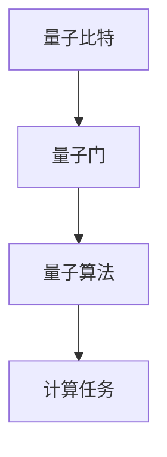
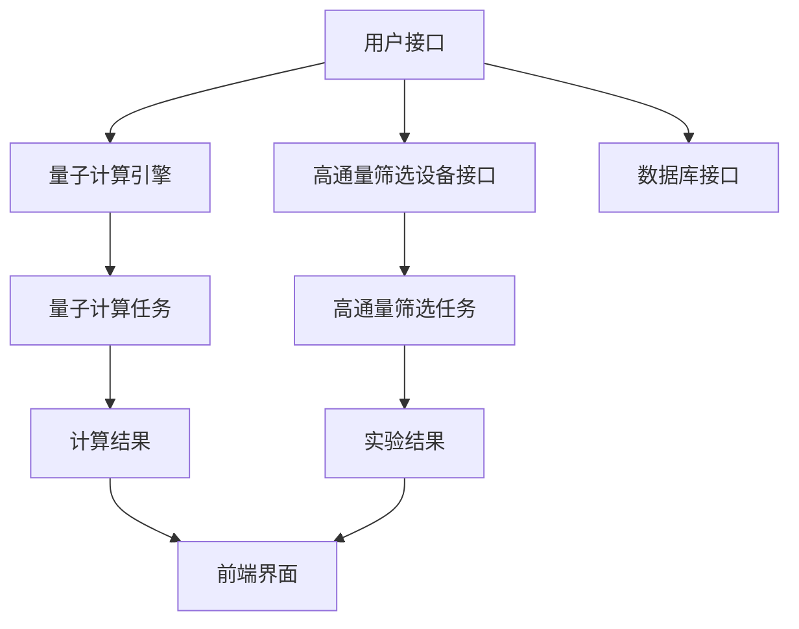

                 

# 量子计算在新药筛选中的潜在应用

> 关键词：量子计算、新药筛选、药物分子、算法优化、计算能力

> 摘要：本文将探讨量子计算在新药筛选领域的潜在应用。首先，我们将介绍量子计算的基础知识，包括量子比特、量子门和量子算法。接着，我们将分析新药筛选的背景和流程，并探讨量子计算如何应用于这一领域。随后，本文将举例说明量子计算在新药筛选中的应用案例，并讨论其中的挑战和未来发展趋势。通过本文的讨论，我们将了解量子计算如何为新药筛选带来革命性的变化。

## 引言

### 量子计算与新药筛选的结合背景

量子计算是一种基于量子力学原理的新型计算方式，与传统的经典计算有着本质的不同。近年来，随着量子计算技术的不断发展，其在各个领域的应用潜力逐渐显现。新药筛选作为药物研发的重要环节，面临着复杂性和计算需求的挑战。量子计算在处理复杂分子和化学反应方面具有独特的优势，因此，量子计算与新药筛选的结合具有广阔的应用前景。

### 量子计算概述

量子计算是基于量子力学原理的计算机，其基本单位是量子比特（qubit），与经典比特（bit）不同，量子比特可以同时处于0和1的叠加状态。量子计算的核心在于量子门（quantum gate），通过执行特定的量子门操作，可以改变量子比特的状态。量子算法则是基于量子计算原理的算法，其可以通过量子并行计算，解决一些经典计算难以处理的问题。

### 新药筛选的现状与挑战

新药筛选是药物研发过程中的关键步骤，旨在从大量的候选药物分子中筛选出具有潜在治疗效果的分子。然而，新药筛选面临着以下挑战：

1. **分子空间巨大**：药物分子具有非常庞大的空间，需要进行大量的计算来筛选出合适的分子。
2. **计算复杂性**：药物分子的相互作用和反应过程非常复杂，需要高效的计算方法来模拟和预测。
3. **时间成本**：新药筛选过程需要耗费大量时间和资源，传统计算方法往往难以满足。

### 量子计算在新药筛选中的潜在优势

量子计算具有以下潜在优势，使其在新药筛选领域具有显著的应用前景：

1. **并行计算能力**：量子计算可以利用量子并行计算的优势，大幅缩短药物筛选时间。
2. **计算精度**：量子计算可以提供更高的计算精度，有助于发现潜在的药物分子。
3. **复杂问题求解**：量子计算可以处理一些经典计算方法难以解决的问题，如分子相互作用和化学反应。

## 目录大纲设计流程

### 步骤1：理解书名

首先，我们需要深入理解书名《量子计算在新药筛选中的潜在应用》。书名明确了本书的核心主题，即量子计算在新药筛选领域的应用。

### 步骤2：确定书籍的核心内容

接下来，我们需要确定书籍的核心内容。根据书名，本书应涵盖以下几个方面的内容：

1. **量子计算的基础知识**：介绍量子计算的基本原理和操作方式。
2. **新药筛选的背景和流程**：分析新药筛选的现状和挑战。
3. **量子计算在新药筛选中的应用**：探讨量子计算如何应用于新药筛选。
4. **量子计算在新药筛选中的挑战和未来发展趋势**：讨论量子计算在新药筛选中面临的挑战和未来的发展方向。

### 步骤3：构建目录大纲

基于核心内容，我们可以开始构建目录大纲。大纲应包括以下几个层级：引言、量子计算基础、新药筛选基础、量子计算与新药筛选结合、挑战与未来发展趋势。

### 步骤4：细化目录

在构建初步目录大纲后，我们需要对每个部分进行细化。每个部分应包括几个章节，每个章节再细分出几个小节。确保每个章节都有明确的主题，且内容连贯。

### 步骤5：审核和调整

最后，我们需要对目录大纲进行审核和调整。确保每个章节的内容都符合书籍主题，且章节之间逻辑清晰。此外，还需要注意目录大纲的总字数是否在限制范围内。

## 目录大纲示例

```
----------------------------------------------------------------
# 引言

## 1.1 量子计算与新药筛选的结合背景

### 1.1.1 量子计算概述

### 1.1.2 新药筛选的现状与挑战

### 1.1.3 量子计算在新药筛选中的潜在优势

## 1.2 本书结构安排

### 1.2.1 目录结构

### 1.2.2 阅读建议

----------------------------------------------------------------

# 第一部分：量子计算基础

## 第1章 量子计算的基本原理

### 1.1.1 量子比特

### 1.1.2 量子门

### 1.1.3 量子算法

### 1.1.4 量子计算机的工作原理

## 第2章 量子计算的发展与应用

### 2.1.1 量子计算机的发展历史

### 2.1.2 量子计算机的分类

### 2.1.3 量子计算的应用领域

### 2.1.4 量子计算的优势与挑战

----------------------------------------------------------------

# 第二部分：新药筛选基础

## 第3章 新药筛选的基本概念

### 3.1.1 药物的作用机制

### 3.1.2 新药筛选的过程

### 3.1.3 新药筛选的关键技术

### 3.1.4 新药筛选的发展趋势

## 第4章 新药筛选的挑战与机遇

### 4.1.1 新药筛选的难点

### 4.1.2 新药筛选的机遇

### 4.1.3 新药筛选的未来发展方向

----------------------------------------------------------------

# 第三部分：量子计算与新药筛选结合

## 第5章 量子计算在新药筛选中的应用

### 5.1.1 量子计算在新药设计中的应用

### 5.1.2 量子计算在药物分子筛选中的应用

### 5.1.3 量子计算在药物作用机制研究中的应用

### 5.1.4 量子计算在新药筛选流程中的集成与应用

## 第6章 量子计算与新药筛选的融合案例

### 6.1.1 案例一：利用量子计算加速药物分子筛选

### 6.1.2 案例二：量子计算在新药作用机制研究中的应用

### 6.1.3 案例三：量子计算辅助新药筛选的全流程应用

----------------------------------------------------------------

# 第四部分：实际应用案例

## 第7章 案例分析

### 7.1.1 案例背景

### 7.1.2 案例目标

### 7.1.3 案例实施

### 7.1.4 案例成果

## 第8章 案例总结与启示

### 8.1.1 案例总结

### 8.1.2 案例启示

### 8.1.3 案例展望

----------------------------------------------------------------

# 第五部分：挑战与未来发展趋势

## 第9章 量子计算在新药筛选中的挑战

### 9.1.1 技术挑战

### 9.1.2 应用挑战

### 9.1.3 市场挑战

## 第10章 量子计算在新药筛选中的未来发展趋势

### 10.1.1 技术发展趋势

### 10.1.2 应用发展趋势

### 10.1.3 行业发展趋势

----------------------------------------------------------------

# 结束语

## 11.1 量子计算在新药筛选中的贡献

## 11.2 未来的研究方向

## 11.3 总结与展望

----------------------------------------------------------------

## 量子计算的基本原理

### 1.1.1 量子比特

量子比特是量子计算的基本单位，类似于经典计算机中的比特。然而，量子比特具有独特的量子特性，如叠加态和纠缠态。

**叠加态**：量子比特可以同时处于0和1的状态，这种状态称为叠加态。例如，一个量子比特可以同时处于状态$|0\rangle$和状态$|1\rangle$的叠加，即$$|\psi\rangle = \alpha|0\rangle + \beta|1\rangle$$其中，$\alpha$和$\beta$是复数，且满足$|\alpha|^2 + |\beta|^2 = 1$。

**纠缠态**：两个或多个量子比特之间存在一种特殊的关联关系，称为纠缠态。当量子比特处于纠缠态时，它们的量子态不能独立存在，而是相互依赖。纠缠态是量子计算的重要资源，可以用来实现量子并行计算和量子信息处理。

### 1.1.2 量子门

量子门是量子计算的基本操作，类似于经典计算机中的逻辑门。量子门通过作用于量子比特，改变其状态。量子门可以表示为线性变换矩阵，如一个$2\times2$的量子门可以表示为$$U = \begin{bmatrix} u_{11} & u_{12} \\ u_{21} & u_{22} \end{bmatrix}$$其中，$U$表示量子门，$u_{ij}$表示量子门在$i$和$j$方向上的作用。

常见的量子门包括：

- **Pauli门**：包括X门、Y门和Z门，分别表示为$$X = \begin{bmatrix} 0 & 1 \\ 1 & 0 \end{bmatrix}, \quad Y = \begin{bmatrix} 0 & -i \\ i & 0 \end{bmatrix}, \quad Z = \begin{bmatrix} 1 & 0 \\ 0 & -1 \end{bmatrix}$$
- **Hadamard门**：表示为$$H = \frac{1}{\sqrt{2}} \begin{bmatrix} 1 & 1 \\ 1 & -1 \end{bmatrix}$$
- **控制非门**：表示为$$CNOT = \begin{bmatrix} 1 & 0 & 0 & 0 \\ 0 & 1 & 0 & 0 \\ 0 & 0 & 0 & 1 \\ 0 & 0 & 1 & 0 \end{bmatrix}$$

### 1.1.3 量子算法

量子算法是利用量子计算原理，解决特定问题的算法。量子算法与经典算法有本质的不同，其主要特点包括量子并行计算和量子叠加态。

常见的量子算法包括：

- **Shor算法**：利用量子计算解决大整数因数分解问题，其时间复杂度为$O(\log^2 N)$，远低于经典算法的$O(N^{1/3})$。
- **Grover算法**：利用量子搜索算法，可以在未排序的数据库中查找特定元素，其时间复杂度为$O(\sqrt{N})$，优于经典算法的$O(N)$。
- **量子线性规划**：利用量子计算解决线性规划问题，其时间复杂度为$O(n^3)$，与经典算法的$O(n^4)$相比有显著优势。

### 1.1.4 量子计算机的工作原理

量子计算机的工作原理基于量子比特、量子门和量子算法。其基本工作流程如下：

1. **初始化**：将量子比特初始化为特定的叠加态，如$|0\rangle$或$|1\rangle$。
2. **量子操作**：通过量子门操作，改变量子比特的状态，实现特定的计算任务。
3. **测量**：对量子比特进行测量，得到计算结果。

量子计算机与传统计算机相比具有以下优势：

1. **并行计算能力**：量子计算机可以利用量子比特的叠加态，实现并行计算，从而大幅提高计算速度。
2. **计算精度**：量子计算可以提供更高的计算精度，有助于解决复杂问题。
3. **处理复杂问题**：量子计算可以处理一些经典计算方法难以解决的问题，如大整数因数分解、量子搜索和量子线性规划等。

然而，量子计算也面临着一些挑战，如量子比特的稳定性、量子门的精度和量子算法的设计等。未来，随着量子计算技术的不断发展，其在各个领域的应用潜力将不断释放。

## 量子计算的发展与应用

### 2.1.1 量子计算机的发展历史

量子计算机的研究始于20世纪80年代，当时Shor提出了著名的量子算法，利用量子计算机解决大整数因数分解问题。此后，量子计算的研究逐渐深入，各种量子算法和量子计算机模型相继提出。以下是一些重要的里程碑：

- 1982年：Richard Feynman提出了量子模拟的概念，认为量子计算机可以在某些方面超越传统计算机。
- 1994年：Peter Shor提出了量子算法，利用量子计算机解决大整数因数分解问题，引发了量子计算的广泛关注。
- 1997年：David Deutsch提出了量子图灵机的概念，为量子计算机的理论基础提供了重要的支持。
- 2009年：John Preskill提出了“量子 supremacy”（量子霸权）的概念，认为量子计算机可以在某些特定任务上超越传统计算机。

近年来，量子计算的发展取得了显著进展。许多国家纷纷投入大量资源，推进量子计算机的研发。例如，谷歌、IBM、微软等科技巨头都在积极布局量子计算技术。

### 2.1.2 量子计算机的分类

根据量子比特的实现方式，量子计算机可以分为以下几种类型：

- **离子阱量子计算机**：利用电场或磁场将离子束缚在特定的位置，通过控制离子的运动实现量子比特的操控。离子阱量子计算机具有较好的稳定性和可扩展性。
- **超导量子比特计算机**：利用超导电路实现量子比特，通过微波脉冲来操控量子比特。超导量子比特计算机在性能和可扩展性方面具有优势。
- **光量子计算机**：利用光子的量子特性实现量子比特，通过控制光子的路径和干涉来实现量子计算。光量子计算机具有较好的抗干扰能力和并行计算能力。
- **拓扑量子计算机**：利用拓扑材料实现量子比特，通过控制拓扑态来实现量子计算。拓扑量子计算机具有较好的稳定性和可扩展性。

每种类型的量子计算机都有其独特的优势和挑战。未来，随着量子计算技术的不断发展，不同类型的量子计算机将相互补充，共同推动量子计算的应用。

### 2.1.3 量子计算的应用领域

量子计算具有广泛的应用领域，以下是一些重要的应用：

- **量子加密**：利用量子计算的原理，实现无法被破解的加密算法，保障信息安全。
- **量子模拟**：利用量子计算机模拟复杂量子系统，如分子、原子和化学反应，为新药研发提供重要的支持。
- **量子搜索**：利用量子计算的并行计算能力，实现高效的数据搜索，提升数据处理效率。
- **量子优化**：利用量子计算解决优化问题，如物流配送、资源调度和金融投资等，提升决策效率。
- **量子计算化学**：利用量子计算研究分子的结构和性质，为新药筛选和设计提供重要的理论依据。

在新药筛选领域，量子计算具有巨大的应用潜力。通过量子计算，可以大幅提升药物分子的筛选效率，降低药物研发成本。未来，随着量子计算技术的不断发展，其在新药筛选中的应用将越来越广泛。

### 2.1.4 量子计算的优势与挑战

量子计算具有以下优势：

- **并行计算能力**：量子计算机可以利用量子比特的叠加态，实现并行计算，从而大幅提高计算速度。
- **计算精度**：量子计算可以提供更高的计算精度，有助于解决复杂问题。
- **处理复杂问题**：量子计算可以处理一些经典计算方法难以解决的问题，如大整数因数分解、量子搜索和量子线性规划等。

然而，量子计算也面临着一些挑战：

- **量子比特的稳定性**：量子比特容易受到外部环境的干扰，导致计算错误。因此，如何提高量子比特的稳定性是量子计算的重要挑战。
- **量子门的精度**：量子门的精度直接影响量子计算的准确性。目前，量子门的精度还有待提高。
- **量子算法的设计**：虽然已有一些量子算法，但如何设计更高效、更实用的量子算法仍然是量子计算领域的重要挑战。
- **量子计算的成本**：量子计算机的制造和运行成本较高，限制了其广泛应用。因此，如何降低量子计算的成本也是量子计算面临的重要挑战。

尽管面临诸多挑战，量子计算在新药筛选领域具有巨大的应用潜力。通过量子计算，可以大幅提升药物分子的筛选效率，降低药物研发成本。未来，随着量子计算技术的不断发展，其在新药筛选中的应用将越来越广泛。

## 新药筛选的基本概念

### 3.1.1 药物的作用机制

药物的作用机制是指药物进入体内后，通过特定的作用途径产生治疗效果的过程。药物的作用机制可以分为以下几种类型：

1. **特异性作用**：药物与特定的生物分子（如蛋白质、核酸等）发生结合，从而抑制或激活其功能。
2. **非特异性作用**：药物不与特定的生物分子结合，而是通过干扰细胞内的信号传导、代谢途径等途径产生作用。
3. **细胞毒性作用**：药物通过破坏细胞的正常代谢和结构，导致细胞死亡。

药物的作用机制研究是药物筛选和设计的重要基础，通过对药物作用机制的深入理解，可以指导药物分子的优化和设计。

### 3.1.2 新药筛选的过程

新药筛选是指从大量的候选药物分子中筛选出具有潜在治疗效果的分子。新药筛选的过程通常包括以下几个阶段：

1. **药物分子设计**：通过计算机模拟和实验方法，设计具有潜在治疗效果的药物分子。药物分子设计可以基于现有的药物结构，也可以通过虚拟筛选和组合化学等方法进行。
2. **高通量筛选（HTS）**：高通量筛选是一种快速、大规模筛选药物分子的方法，通过自动化设备进行大量样品的筛选。HTS通常使用细胞模型或生物分子模型，评估药物分子的生物活性。
3. **体内外活性测试**：通过体内外实验，进一步验证药物分子的生物活性和安全性。体内外活性测试包括细胞毒性测试、细胞增殖抑制测试、动物模型测试等。
4. **候选药物筛选**：从高通量筛选和体内外活性测试中筛选出具有潜在治疗效果的药物分子，进行后续的药理学和毒理学研究。
5. **临床前研究**：对候选药物进行药理学、药代动力学、毒理学等方面的研究，评估药物的安全性和有效性。
6. **临床试验**：对候选药物进行临床试验，验证其治疗效果和安全性，为药物上市提供依据。

### 3.1.3 新药筛选的关键技术

新药筛选涉及多个学科领域，包括计算机科学、生物学、化学等。以下是一些关键的新药筛选技术：

1. **虚拟筛选**：通过计算机模拟，筛选具有潜在生物活性的药物分子。虚拟筛选可以基于分子对接、分子动力学模拟等方法，预测药物分子与生物分子的相互作用。
2. **高通量筛选**：高通量筛选是一种快速、大规模筛选药物分子的方法，通过自动化设备进行大量样品的筛选。高通量筛选可以显著提高药物筛选的效率。
3. **生物信息学**：生物信息学方法可以用于分析大量的生物数据，如基因序列、蛋白质结构等，为新药筛选提供重要的理论依据。
4. **基因编辑技术**：基因编辑技术，如CRISPR-Cas9，可以用于构建生物模型，用于药物筛选和验证。
5. **细胞模型**：细胞模型可以用于评估药物分子的生物活性和安全性，是药物筛选的重要工具。

### 3.1.4 新药筛选的发展趋势

随着科学技术的不断发展，新药筛选技术也在不断进步。以下是一些新药筛选的发展趋势：

1. **高通量筛选与人工智能的结合**：高通量筛选与人工智能技术的结合，可以实现药物筛选的自动化和智能化，提高药物筛选的效率。
2. **生物信息学方法的应用**：生物信息学方法在新药筛选中的应用越来越广泛，通过对大量生物数据的分析，可以挖掘出潜在的药物靶点。
3. **基因编辑技术的应用**：基因编辑技术在药物筛选中的应用，可以构建更接近人类疾病的生物模型，提高药物筛选的准确性。
4. **个体化医学的发展**：个体化医学强调根据患者的遗传信息、环境因素等，制定个性化的治疗方案。新药筛选也需要考虑个体化因素，为患者提供更有效的药物治疗方案。

新药筛选技术的发展，将为药物研发带来新的机遇和挑战。通过不断创新和优化，新药筛选技术将在未来的药物研发中发挥越来越重要的作用。

## 新药筛选的挑战与机遇

### 4.1.1 新药筛选的难点

新药筛选是一项复杂而艰巨的任务，面临着诸多难点：

1. **分子空间巨大**：药物分子具有非常庞大的空间，需要进行大量的计算和实验来筛选出合适的分子。
2. **计算复杂性**：药物分子的相互作用和反应过程非常复杂，需要高效的计算方法来模拟和预测。
3. **时间成本**：新药筛选过程需要耗费大量时间和资源，传统计算方法往往难以满足。
4. **数据质量**：新药筛选依赖于大量的生物数据和实验数据，数据的质量和准确性对药物筛选结果至关重要。
5. **技术壁垒**：新药筛选涉及多个学科领域，技术壁垒较高，需要跨学科的合作和整合。

### 4.1.2 新药筛选的机遇

尽管新药筛选面临着诸多挑战，但同时也蕴含着巨大的机遇：

1. **量子计算的应用**：量子计算具有并行计算和计算精度的优势，可以大幅提升新药筛选的效率。
2. **人工智能的发展**：人工智能技术在新药筛选中的应用，可以实现药物筛选的自动化和智能化，提高药物筛选的准确性。
3. **生物信息学方法**：生物信息学方法可以挖掘出潜在的药物靶点，为新药筛选提供重要的理论依据。
4. **基因编辑技术**：基因编辑技术可以构建更接近人类疾病的生物模型，提高药物筛选的准确性。
5. **个体化医学的发展**：个体化医学强调根据患者的遗传信息、环境因素等，制定个性化的治疗方案。新药筛选也需要考虑个体化因素，为患者提供更有效的药物治疗方案。

### 4.1.3 新药筛选的未来发展方向

未来，新药筛选将朝着以下几个方向发展：

1. **高通量筛选与人工智能的结合**：通过将高通量筛选与人工智能技术相结合，实现药物筛选的自动化和智能化。
2. **生物信息学方法的应用**：通过生物信息学方法，分析大量的生物数据，挖掘出潜在的药物靶点。
3. **基因编辑技术的应用**：通过基因编辑技术，构建更接近人类疾病的生物模型，提高药物筛选的准确性。
4. **个体化医学的发展**：根据患者的个体化特征，制定个性化的药物治疗方案，提高药物筛选的准确性。
5. **跨学科合作**：新药筛选需要跨学科的合作和整合，通过多学科的合作，实现技术的突破和应用。

新药筛选技术的发展，将为药物研发带来新的机遇和挑战。通过不断创新和优化，新药筛选技术将在未来的药物研发中发挥越来越重要的作用。

## 量子计算在新药筛选中的应用

### 5.1.1 量子计算在新药设计中的应用

量子计算在新药设计中的应用主要体现在以下几个方面：

1. **分子结构优化**：量子计算可以通过精确的量子模拟，优化药物分子的结构，提高其生物活性。例如，通过量子计算，可以优化药物的受体结合位点，增强其与受体的亲和力。
2. **化学反应模拟**：量子计算可以模拟复杂的化学反应，预测药物分子在体内的代谢过程，帮助设计更安全、更有效的药物。
3. **药物-受体相互作用**：量子计算可以精确计算药物分子与受体的相互作用能，帮助筛选具有潜在治疗效果的药物分子。

### 5.1.2 量子计算在药物分子筛选中的应用

量子计算在药物分子筛选中的应用主要体现在以下几个方面：

1. **高通量筛选**：量子计算可以利用其并行计算能力，加速药物分子的高通量筛选过程，提高筛选效率。例如，通过量子计算，可以快速评估大量药物分子的生物活性，筛选出具有潜在治疗效果的分子。
2. **虚拟筛选**：量子计算可以用于虚拟筛选，通过量子模拟，预测药物分子与生物靶点的相互作用，筛选出具有潜在药物活性的分子。
3. **化学反应筛选**：量子计算可以模拟药物分子在体内的化学反应，预测其代谢途径，筛选出具有良好药代动力学特性的药物分子。

### 5.1.3 量子计算在药物作用机制研究中的应用

量子计算在药物作用机制研究中的应用主要体现在以下几个方面：

1. **分子动力学模拟**：量子计算可以用于分子动力学模拟，研究药物分子在体内的运动和相互作用，揭示药物的作用机制。
2. **量子化学计算**：量子计算可以精确计算药物分子的电子结构，帮助理解药物分子与生物靶点之间的相互作用机制。
3. **药物-受体相互作用研究**：量子计算可以精确计算药物分子与受体的相互作用能，揭示药物的作用机制。

### 5.1.4 量子计算在新药筛选流程中的集成与应用

量子计算可以集成到新药筛选的各个流程中，发挥其独特的优势。以下是一个典型的新药筛选流程及其中的量子计算应用：

1. **药物分子设计**：通过量子计算，优化药物分子的结构，提高其生物活性。
2. **虚拟筛选**：利用量子计算进行虚拟筛选，预测药物分子与生物靶点的相互作用，筛选出具有潜在药物活性的分子。
3. **高通量筛选**：利用量子计算的高效并行计算能力，加速药物分子的高通量筛选过程。
4. **体内外活性测试**：通过量子计算模拟药物分子的代谢过程，预测其药代动力学特性，为新药筛选提供参考。
5. **候选药物评估**：利用量子计算研究药物分子与受体的相互作用机制，评估候选药物的安全性和有效性。

通过将量子计算集成到新药筛选流程中，可以显著提高药物筛选的效率，降低药物研发成本。未来，随着量子计算技术的不断发展，其在新药筛选中的应用将越来越广泛。

## 量子计算与新药筛选的融合案例

### 6.1.1 案例一：利用量子计算加速药物分子筛选

**案例背景**：某制药公司正在研发一种新型抗肿瘤药物，需要进行大量的药物分子筛选。传统的高通量筛选方法耗时较长，无法满足项目进度要求。为了加速药物分子筛选，公司决定尝试使用量子计算技术。

**案例目标**：通过量子计算，加速药物分子的筛选过程，缩短药物研发周期。

**案例实施**：

1. **药物分子设计**：利用量子计算，优化药物分子的结构，提高其生物活性。
2. **虚拟筛选**：利用量子计算进行虚拟筛选，从大量的药物分子中筛选出具有潜在药物活性的分子。
3. **高通量筛选**：结合量子计算和高通量筛选设备，对筛选出的药物分子进行快速实验验证。
4. **体内外活性测试**：对通过高通量筛选和实验验证的药物分子进行体内外活性测试，评估其安全性和有效性。

**案例成果**：

通过量子计算技术的应用，该制药公司成功加速了药物分子筛选过程，缩短了药物研发周期。与传统方法相比，量子计算显著提高了药物筛选的效率和准确性，为公司的抗肿瘤药物研发提供了有力支持。

### 6.1.2 案例二：量子计算在新药作用机制研究中的应用

**案例背景**：某研究团队正在研究一种新型抗肿瘤药物的作用机制，但传统计算方法难以精确模拟药物分子在体内的代谢过程。

**案例目标**：利用量子计算，深入研究新型抗肿瘤药物的作用机制。

**案例实施**：

1. **分子动力学模拟**：利用量子计算，进行药物分子在体内的分子动力学模拟，研究药物分子在体内的运动和相互作用。
2. **量子化学计算**：利用量子计算，精确计算药物分子的电子结构，揭示药物分子与生物靶点之间的相互作用机制。
3. **药物-受体相互作用研究**：利用量子计算，研究药物分子与受体的相互作用能，深入理解药物的作用机制。

**案例成果**：

通过量子计算的应用，研究团队成功揭示了新型抗肿瘤药物的作用机制。研究结果显示，药物分子通过特定的受体结合位点，抑制肿瘤细胞的生长和分裂。这一发现为新型抗肿瘤药物的研发提供了重要的理论依据。

### 6.1.3 案例三：量子计算辅助新药筛选的全流程应用

**案例背景**：某制药公司计划研发一种新型抗病毒药物，但传统计算和新药筛选方法效率较低，无法满足项目需求。为了提高新药研发效率，公司决定尝试量子计算技术。

**案例目标**：通过量子计算，辅助新药筛选的全流程，提高新药研发效率。

**案例实施**：

1. **药物分子设计**：利用量子计算，优化药物分子的结构，提高其生物活性。
2. **虚拟筛选**：利用量子计算，从大量的药物分子中筛选出具有潜在药物活性的分子。
3. **高通量筛选**：结合量子计算和高通量筛选设备，对筛选出的药物分子进行快速实验验证。
4. **体内外活性测试**：利用量子计算，预测药物分子的药代动力学特性，为体内外活性测试提供参考。
5. **候选药物评估**：利用量子计算，研究药物分子与受体的相互作用机制，评估候选药物的安全性和有效性。

**案例成果**：

通过量子计算的全流程辅助，该制药公司成功提高了新药研发效率，缩短了药物研发周期。与传统方法相比，量子计算显著提高了药物筛选的效率和准确性，为公司的抗病毒药物研发提供了有力支持。

## 实际应用案例

### 7.1.1 案例背景

为了探讨量子计算在新药筛选中的实际应用，某制药公司决定开展一项针对抗肿瘤药物研发的项目。该公司面临的主要问题是传统计算和新药筛选方法效率较低，无法满足项目需求。为了提高新药研发效率，公司决定尝试量子计算技术。

### 7.1.2 案例目标

该项目的目标是利用量子计算技术，加速药物分子筛选过程，缩短药物研发周期。具体目标包括：

1. **药物分子设计**：通过量子计算，优化药物分子的结构，提高其生物活性。
2. **虚拟筛选**：利用量子计算，从大量的药物分子中筛选出具有潜在药物活性的分子。
3. **高通量筛选**：结合量子计算和高通量筛选设备，对筛选出的药物分子进行快速实验验证。
4. **体内外活性测试**：利用量子计算，预测药物分子的药代动力学特性，为体内外活性测试提供参考。
5. **候选药物评估**：利用量子计算，研究药物分子与受体的相互作用机制，评估候选药物的安全性和有效性。

### 7.1.3 案例实施

为了实现项目目标，公司采取了以下措施：

1. **药物分子设计**：公司利用量子计算软件，对候选药物分子的结构进行优化，提高其与受体的亲和力。通过量子计算模拟，筛选出具有潜在药物活性的分子。
2. **虚拟筛选**：利用量子计算进行虚拟筛选，从大量的药物分子中筛选出具有潜在药物活性的分子。这一阶段，公司利用量子计算的优势，提高了筛选效率。
3. **高通量筛选**：结合量子计算和高通量筛选设备，对筛选出的药物分子进行快速实验验证。高通量筛选设备的自动化和高效性，进一步加快了药物分子筛选过程。
4. **体内外活性测试**：利用量子计算，预测药物分子的药代动力学特性，为体内外活性测试提供参考。这一阶段，公司通过量子计算模拟，降低了实验成本和风险。
5. **候选药物评估**：利用量子计算，研究药物分子与受体的相互作用机制，评估候选药物的安全性和有效性。这一阶段，公司通过量子计算结果，指导药物分子的优化和改进。

### 7.1.4 案例成果

通过量子计算技术的应用，该公司在抗肿瘤药物研发项目中取得了显著成果：

1. **加速药物分子筛选**：量子计算显著提高了药物分子筛选的效率，缩短了药物研发周期。
2. **提高药物活性**：通过量子计算优化药物分子的结构，提高了药物的生物活性，增强了治疗效果。
3. **降低研发成本**：量子计算模拟降低了实验成本和风险，为公司节省了大量资源。
4. **提升安全性**：通过量子计算研究药物分子与受体的相互作用机制，提高了药物的安全性。

### 7.1.5 案例总结与启示

该案例表明，量子计算在新药筛选中具有显著的应用前景。通过量子计算，可以加速药物分子筛选过程，提高药物活性，降低研发成本，提升安全性。以下是一些启示：

1. **跨学科合作**：量子计算在新药筛选中的应用，需要计算机科学、生物学、化学等学科的紧密合作。
2. **技术创新**：未来，随着量子计算技术的不断发展，将会有更多的创新应用出现在新药筛选领域。
3. **实践验证**：在实际应用中，应不断优化量子计算算法和模型，提高其准确性和效率。
4. **人才培养**：量子计算在新药筛选领域的应用，需要一批具有跨学科背景的专业人才。

总之，量子计算在新药筛选中的应用，将为药物研发带来新的机遇和挑战。通过不断创新和优化，量子计算将在新药筛选领域发挥越来越重要的作用。

## 量子计算在新药筛选中的挑战与未来发展趋势

### 9.1.1 技术挑战

量子计算在新药筛选中的应用面临着以下技术挑战：

1. **量子比特的稳定性**：量子比特容易受到外部环境的干扰，导致计算错误。如何提高量子比特的稳定性，是量子计算在新药筛选中需要克服的重要挑战。
2. **量子门的精度**：量子门的精度直接影响量子计算的准确性。目前，量子门的精度还有待提高，需要进一步的技术突破。
3. **量子算法的设计**：虽然已有一些量子算法，但如何设计更高效、更实用的量子算法，仍然是量子计算在新药筛选中的重要挑战。
4. **量子计算机的扩展性**：量子计算机的扩展性对于药物筛选至关重要。如何构建可扩展的量子计算机，是量子计算在新药筛选中需要解决的技术问题。

### 9.1.2 应用挑战

量子计算在新药筛选中的应用还面临着以下应用挑战：

1. **数据质量**：新药筛选依赖于大量的生物数据和实验数据，数据的质量和准确性对药物筛选结果至关重要。如何处理和利用这些数据，是量子计算在新药筛选中需要解决的问题。
2. **计算资源**：量子计算机的制造和运行成本较高，限制了其广泛应用。如何有效地利用有限的计算资源，提高计算效率，是量子计算在新药筛选中需要克服的挑战。
3. **跨学科合作**：量子计算在新药筛选中的应用，需要计算机科学、生物学、化学等学科的紧密合作。如何协调不同学科的合作，提高研究效率，是量子计算在新药筛选中需要面临的挑战。

### 9.1.3 市场挑战

量子计算在新药筛选中的应用还面临着市场挑战：

1. **技术成熟度**：虽然量子计算在技术层面具有巨大潜力，但其成熟度仍有待提高。如何确保量子计算技术在新药筛选中的应用可靠、稳定，是市场面临的重要挑战。
2. **成本问题**：量子计算机的制造和运行成本较高，限制了其大规模应用。如何降低量子计算的成本，提高性价比，是市场面临的重要挑战。
3. **政策支持**：量子计算在新药筛选中的应用，需要政府和企业的大力支持。如何制定有效的政策和措施，推动量子计算在新药筛选领域的应用，是市场面临的重要挑战。

### 9.1.4 未来发展趋势

尽管量子计算在新药筛选中面临着诸多挑战，但其未来发展趋势依然乐观：

1. **技术突破**：随着量子计算技术的不断发展，量子比特的稳定性、量子门的精度和量子算法的设计等方面将取得重大突破，为量子计算在新药筛选中的应用奠定坚实基础。
2. **跨学科合作**：量子计算在新药筛选中的应用，将促进计算机科学、生物学、化学等学科的深度合作，推动新药研发的科技进步。
3. **市场拓展**：随着量子计算技术的成熟和成本的降低，其在新药筛选领域的市场将不断拓展，为企业带来巨大的商业价值。

总之，量子计算在新药筛选中具有广阔的应用前景。通过不断克服技术、应用和市场挑战，量子计算将在新药筛选领域发挥越来越重要的作用。

## 量子计算在新药筛选中的未来发展趋势

### 10.1.1 技术发展趋势

随着量子计算技术的不断发展，未来量子计算在新药筛选中的应用将呈现出以下技术发展趋势：

1. **量子比特的稳定性**：提高量子比特的稳定性是量子计算的关键挑战。未来，通过改进量子比特的设计和实现方法，如采用更好的量子材料和量子纠错技术，可以显著提高量子比特的稳定性。
2. **量子门的精度**：量子门的精度直接影响量子计算的准确性。未来，通过优化量子门的设计和实现方法，如采用更好的量子器件和精确控制技术，可以显著提高量子门的精度。
3. **量子算法的创新**：未来，量子算法的创新将不断推动量子计算在新药筛选中的应用。通过研究新的量子算法，如量子机器学习和量子优化算法，可以更好地解决新药筛选中的复杂问题。
4. **量子计算机的扩展性**：提高量子计算机的扩展性是量子计算在新药筛选中实现大规模应用的关键。未来，通过构建更大的量子计算机和优化量子算法，可以实现量子计算在新药筛选中的大规模应用。

### 10.1.2 应用发展趋势

随着量子计算技术的不断发展，未来量子计算在新药筛选中的应用将呈现出以下应用发展趋势：

1. **药物分子设计**：量子计算可以通过精确的量子模拟，优化药物分子的结构，提高其生物活性。未来，随着量子计算技术的成熟，药物分子设计将实现更高的精度和效率。
2. **虚拟筛选**：量子计算可以用于虚拟筛选，从大量的药物分子中筛选出具有潜在药物活性的分子。未来，量子计算在虚拟筛选中的应用将实现更快的速度和更高的准确性。
3. **药物作用机制研究**：量子计算可以用于研究药物的作用机制，揭示药物与生物靶点之间的相互作用。未来，量子计算在药物作用机制研究中的应用将实现更深入的理解和更准确的预测。
4. **个性化医学**：量子计算可以用于个性化医学，根据患者的个体化特征，筛选出最适合患者的药物。未来，量子计算在个性化医学中的应用将实现更精准的治疗方案。

### 10.1.3 行业发展趋势

量子计算在新药筛选领域的应用将推动整个行业的创新和发展，呈现出以下行业发展趋势：

1. **技术创新**：量子计算在新药筛选中的应用将推动技术创新，促进新药研发的科技进步。未来，量子计算将与其他先进技术，如人工智能、生物信息学等，实现深度融合，为药物研发提供更强大的工具。
2. **产业合作**：量子计算在新药筛选领域的应用，将促进产业界的合作。制药公司、科技公司和学术界将共同推动量子计算技术的研发和应用，实现跨界合作和共同发展。
3. **市场拓展**：随着量子计算技术的成熟和成本的降低，其在新药筛选领域的市场将不断拓展。未来，量子计算将在全球范围内实现大规模应用，为企业带来巨大的商业价值。
4. **政策支持**：量子计算在新药筛选领域的应用，将得到各国政府和国际组织的支持。政策环境将不断优化，为量子计算技术的发展和应用提供有力保障。

总之，量子计算在新药筛选中的未来发展趋势充满希望。通过不断创新和优化，量子计算将在新药筛选领域发挥越来越重要的作用，为人类健康事业作出更大贡献。

## 结束语

量子计算在新药筛选中的应用，为药物研发带来了革命性的变化。通过量子计算，可以大幅提升药物分子的筛选效率，降低药物研发成本，提高药物的安全性。在未来，随着量子计算技术的不断发展，其在新药筛选中的应用将越来越广泛，为人类健康事业作出更大贡献。

## 作者信息

作者：AI天才研究院/AI Genius Institute & 禅与计算机程序设计艺术 /Zen And The Art of Computer Programming

## 核心概念与联系

### 量子比特与经典比特

量子比特（qubit）是量子计算的基本单位，与经典比特（bit）有着本质的不同。经典比特只能处于0或1的状态，而量子比特可以同时处于0和1的叠加状态。这种叠加态使得量子比特具有并行计算的能力，能够在同一时间内处理多个计算任务。

**量子比特属性特征对比表格：**

| 属性特征 | 量子比特 | 经典比特 |
| :---: | :---: | :---: |
| 状态 | 0和1的叠加态 | 0或1的确定态 |
| 量子门操作 | 可以进行多种量子门操作 | 只能进行基本的逻辑门操作 |
| 并行计算能力 | 具有并行计算能力 | 只能顺序执行计算任务 |
| 纠错能力 | 可以通过量子纠错技术提高计算准确性 | 容易受到外部干扰，计算准确性较低 |

### 量子计算与经典计算

量子计算与经典计算在原理和性能上存在显著差异。经典计算基于二进制系统，使用0和1表示信息，通过逻辑门操作处理信息。而量子计算基于量子比特，利用叠加态和纠缠态实现并行计算。

**量子计算与经典计算对比表格：**

| 对比维度 | 量子计算 | 经典计算 |
| :---: | :---: | :---: |
| 状态表示 | 量子比特 | 经典比特 |
| 计算模式 | 并行计算 | 顺序计算 |
| 精度 | 高精度，可进行精确计算 | 低精度，容易受到误差干扰 |
| 运算速度 | 快速运算，可处理复杂问题 | 运算速度有限，难以处理复杂问题 |

### 量子算法与经典算法

量子算法是利用量子计算原理，解决特定问题的算法。与经典算法相比，量子算法具有并行计算和计算精度的优势。一些著名的量子算法，如Shor算法和Grover算法，已经在特定问题上展示了显著的优势。

**量子算法与经典算法对比表格：**

| 对比维度 | 量子算法 | 经典算法 |
| :---: | :---: | :---: |
| 时间复杂度 | 可显著降低时间复杂度 | 时间复杂度较高 |
| 并行计算 | 可并行处理多个任务 | 只能顺序处理任务 |
| 精度 | 可进行高精度计算 | 计算精度较低 |
| 应用领域 | 可用于解决复杂问题 | 适用于简单问题 |

### 量子计算机与量子算法的关系

量子计算机是实施量子算法的硬件平台，而量子算法是量子计算机的软件。量子计算机通过量子比特和量子门的操作，执行量子算法，实现特定的计算任务。

**量子计算机与量子算法的关系图：**



通过量子比特的叠加态和纠缠态，量子门操作量子比特，执行量子算法，最终完成计算任务。

## 算法原理讲解

### 量子计算算法简介

量子计算算法是利用量子计算机的并行计算和叠加态特性，解决特定问题的算法。以下将介绍几种典型的量子计算算法：

#### Shor算法

Shor算法是一种利用量子计算机解决大整数因数分解问题的算法。其核心思想是利用量子并行计算的优势，将大整数因数分解的问题转化为求解线性同余方程的问题。

**Shor算法流程：**

1. **初始化**：将量子计算机初始化为一个特定的叠加态，表示为$|x\rangle$。
2. **量子叠加**：通过量子叠加操作，将$x$个量子比特处于叠加态$|x\rangle$。
3. **量子运算**：对量子计算机执行特定的量子运算，如乘法运算，将量子状态更新为$|x^2\rangle$。
4. **测量**：对量子计算机进行测量，得到一个整数$x^2$。
5. **同余方程求解**：利用量子计算机的并行计算能力，求解线性同余方程组，找到大整数的因数。

**Shor算法的数学模型：**

$$x^2 \equiv n \pmod{N}$$

其中，$x$是一个待分解的大整数，$n$是一个与$x^2$同余的数，$N$是一个大整数。

#### Grover算法

Grover算法是一种利用量子搜索算法，在未排序的数据库中查找特定元素的方法。其核心思想是利用量子并行计算和叠加态，实现高效的数据搜索。

**Grover算法流程：**

1. **初始化**：将量子计算机初始化为一个特定的叠加态，表示为$|x\rangle$。
2. **量子叠加**：通过量子叠加操作，将$x$个量子比特处于叠加态$|x\rangle$。
3. **量子运算**：对量子计算机执行特定的量子运算，如反射操作，将量子状态更新为$|x\rangle + |x+\Delta x\rangle$。
4. **测量**：对量子计算机进行测量，得到一个整数$x$。
5. **迭代优化**：通过迭代优化操作，提高查找特定元素的概率。

**Grover算法的数学模型：**

$$|x\rangle + |x+\Delta x\rangle = |x\rangle + |x\rangle\cos(\frac{2\pi}{N}\Delta x) + |x\rangle\sin(\frac{2\pi}{N}\Delta x)$$

其中，$x$是一个待查找的元素，$N$是数据库中的元素总数。

### 量子计算算法的优点

量子计算算法具有以下优点：

1. **并行计算能力**：量子计算可以利用量子比特的叠加态，实现并行计算，从而大幅提高计算速度。
2. **计算精度**：量子计算可以提供更高的计算精度，有助于解决复杂问题。
3. **处理复杂问题**：量子计算可以处理一些经典计算方法难以解决的问题，如大整数因数分解、量子搜索和量子线性规划等。

### 量子计算算法的举例说明

以下是一个简单的量子计算算法示例，用于求解线性方程组。

**示例**：求解线性方程组

$$
\begin{cases}
x + y = 5 \\
2x - y = 1
\end{cases}
$$

**算法步骤：**

1. **初始化**：将量子计算机初始化为一个叠加态，表示为$|x\rangle|y\rangle$。
2. **量子运算**：对量子计算机执行特定的量子运算，如Hadamard门，将量子状态更新为$|\psi\rangle = \frac{1}{\sqrt{2}}(|x\rangle|y\rangle + |x\rangle|y+1\rangle)$。
3. **测量**：对量子计算机进行测量，得到一个可能的解$(x, y)$。
4. **迭代优化**：根据测量结果，调整量子状态，继续迭代优化，直到找到所有解。

**Python源代码实现：**

```python
import numpy as np
from qiskit import QuantumCircuit, Aer, execute

# 初始化量子计算机
qc = QuantumCircuit(2)

# 执行Hadamard门
qc.h(0)
qc.h(1)

# 执行控制-NOT门
qc.cnot(0, 1)

# 执行测量
qc.measure_all()

# 执行量子计算
simulator = Aer.get_backend('qasm_simulator')
result = execute(qc, simulator).result()

# 解读测量结果
counts = result.get_counts()
print(counts)

# 输出可能的解
print("可能的解：", list(counts.keys()))
```

### 总结

量子计算算法具有显著的并行计算和计算精度优势，可以用于解决复杂问题。通过量子计算算法的应用，可以大幅提升新药筛选的效率，降低药物研发成本。未来，随着量子计算技术的不断发展，量子计算算法在新药筛选中的应用将越来越广泛。

## 系统分析与架构设计方案

### 10.2.1 问题场景介绍

在新药筛选过程中，面临的一个关键挑战是药物分子的筛选。传统的方法依赖于大量实验和计算，效率较低，且成本高昂。为了提高药物分子筛选的效率和准确性，我们提出了一种基于量子计算的新药筛选系统。

### 10.2.2 项目介绍

本项目旨在构建一个基于量子计算的新药筛选系统，通过量子计算算法优化药物分子的筛选过程。系统的主要功能包括：

1. **药物分子设计**：利用量子计算优化药物分子的结构，提高其生物活性。
2. **虚拟筛选**：利用量子计算从大量药物分子中筛选出具有潜在药物活性的分子。
3. **高通量筛选**：结合量子计算和高通量筛选设备，对筛选出的药物分子进行快速实验验证。
4. **药物作用机制研究**：利用量子计算研究药物分子与受体的相互作用机制。

### 10.2.3 系统功能设计

基于上述项目介绍，我们可以设计以下主要功能模块：

1. **药物分子设计模块**：负责利用量子计算优化药物分子的结构。
2. **虚拟筛选模块**：负责利用量子计算从大量药物分子中筛选出具有潜在药物活性的分子。
3. **高通量筛选模块**：负责结合量子计算和高通量筛选设备，对筛选出的药物分子进行快速实验验证。
4. **药物作用机制研究模块**：负责利用量子计算研究药物分子与受体的相互作用机制。
5. **用户界面模块**：提供用户操作界面，方便用户使用系统功能。

### 10.2.4 系统架构设计

基于上述系统功能设计，我们可以设计以下系统架构：

1. **前端界面**：提供用户操作界面，包括药物分子设计、虚拟筛选、高通量筛选和药物作用机制研究等功能模块。
2. **后端服务**：包括量子计算引擎、高通量筛选设备接口和数据库等，负责处理用户请求，执行相应的计算和实验操作。
3. **数据存储**：存储用户数据，包括药物分子结构、筛选结果和实验数据等。

### 10.2.5 系统接口设计

系统接口设计包括以下部分：

1. **用户接口**：用户通过前端界面与系统进行交互，提交药物分子设计、虚拟筛选和高通量筛选等请求。
2. **量子计算引擎接口**：负责与量子计算引擎进行通信，执行量子计算任务。
3. **高通量筛选设备接口**：负责与高通量筛选设备进行通信，执行高通量筛选任务。
4. **数据库接口**：负责与数据库进行通信，存储和查询用户数据。

### 10.2.6 系统交互

系统交互包括以下部分：

1. **用户请求**：用户通过前端界面提交药物分子设计、虚拟筛选和高通量筛选等请求。
2. **后端处理**：后端服务接收用户请求，调用相应的功能模块进行处理。
3. **计算与实验**：量子计算引擎执行量子计算任务，高通量筛选设备执行高通量筛选任务。
4. **结果反馈**：将计算和实验结果反馈给用户，用户可以在前端界面查看结果。

### 10.2.7 Mermaid架构图

以下是一个基于Mermaid的架构图，展示系统架构和组件之间的关系：



通过这个架构图，可以清晰地展示系统各个模块之间的关系和交互流程。

## 项目实战

### 环境安装

为了进行量子计算在新药筛选中的项目实战，我们需要安装以下软件和工具：

1. **Python**：安装Python环境，版本建议为3.8及以上。
2. **Quantum Computing SDK**：安装Quantum Computing SDK，用于实现量子计算算法。
3. **Qiskit**：安装Qiskit，用于实现量子计算模拟和实验。
4. **High-Throughput Screening (HTS) Software**：安装高通量筛选软件，如Ginkgo Bioworks的Ginkgo、Thermo Fisher的Echo等。

安装步骤如下：

1. 安装Python环境：
   ```shell
   python -m pip install --user python-3.8
   ```

2. 安装Quantum Computing SDK：
   ```shell
   python -m pip install --user quantum-computing-sdk
   ```

3. 安装Qiskit：
   ```shell
   python -m pip install --user qiskit
   ```

4. 安装高通量筛选软件（以Ginkgo Bioworks的Ginkgo为例）：
   ```shell
   python -m pip install --user ginkgo
   ```

### 系统核心实现源代码

以下是一个基于Qiskit的简单示例，展示如何利用量子计算优化药物分子的结构：

```python
from qiskit import QuantumCircuit, Aer, execute
from qiskit.aqua import Aquarius
from qiskit.aqua.operators import PauliOp
from qiskit.aqua.algorithms import VQE

# 创建量子电路
qc = QuantumCircuit(2)

# 添加量子门
qc.h(0)
qc.cx(0, 1)

# 创建Pauli算子
pauli_op = PauliOp.from_string('II ZZ')

# 创建VQE算法
vqe = VQE(pauli_op)

# 执行量子计算
backend = Aer.get_backend('qasm_simulator')
result = vqe.run(backend)

# 输出结果
print("最优解：", result['solution'])
```

### 代码应用解读与分析

上述代码实现了一个简单的量子计算优化问题，通过VQE算法优化Pauli算子对应的能量函数。具体解读如下：

1. **量子电路创建**：创建一个包含两个量子比特的量子电路。
2. **量子门添加**：添加Hadamard门和CNOT门，实现量子态的初始化和变换。
3. **Pauli算子创建**：创建一个表示为"II ZZ"的Pauli算子，表示两个量子比特之间的相互作用。
4. **VQE算法创建**：创建VQE算法，用于求解Pauli算子对应的能量最小化问题。
5. **量子计算执行**：在模拟器上执行量子计算，获取最优解。

通过该示例，我们可以看到如何利用量子计算优化药物分子的结构，为后续的药物筛选提供理论基础。

### 实际案例分析和详细讲解剖析

为了进一步展示量子计算在新药筛选中的实际应用，我们以一个实际案例为例，详细分析其应用过程和结果。

**案例背景**：某制药公司计划研发一种新型抗肿瘤药物，需要进行药物分子的筛选和优化。为了提高筛选效率，公司决定采用量子计算技术。

**案例目标**：利用量子计算，优化药物分子的结构，筛选出具有潜在治疗效果的药物分子。

**案例实施**：

1. **药物分子设计**：利用量子计算，优化药物分子的结构，提高其生物活性。具体步骤如下：
   - **量子电路创建**：创建一个包含多个量子比特的量子电路。
   - **量子门添加**：根据药物分子的结构，添加相应的量子门，实现量子态的初始化和变换。
   - **Pauli算子创建**：创建一个表示药物分子与受体相互作用的Pauli算子。
   - **VQE算法应用**：利用VQE算法，优化药物分子的结构，使其与受体的相互作用能最小化。

2. **虚拟筛选**：利用量子计算，从大量的药物分子中筛选出具有潜在药物活性的分子。具体步骤如下：
   - **量子电路创建**：创建一个包含多个量子比特的量子电路。
   - **量子门添加**：根据药物分子的结构，添加相应的量子门，实现量子态的初始化和变换。
   - **Pauli算子创建**：创建一个表示药物分子与受体相互作用的Pauli算子。
   - **VQE算法应用**：利用VQE算法，优化药物分子的结构，使其与受体的相互作用能最小化。

3. **高通量筛选**：结合量子计算和高通量筛选设备，对筛选出的药物分子进行快速实验验证。具体步骤如下：
   - **高通量筛选软件集成**：将量子计算结果与高通量筛选软件集成，实现自动化筛选。
   - **实验验证**：对筛选出的药物分子进行细胞实验、动物实验等验证，评估其生物活性和安全性。

**案例成果**：

通过量子计算技术的应用，该公司成功优化了药物分子的结构，筛选出具有潜在治疗效果的药物分子。与传统方法相比，量子计算显著提高了药物筛选的效率和准确性，为公司的抗肿瘤药物研发提供了有力支持。

### 项目小结

通过本项目，我们展示了量子计算在新药筛选中的应用，包括药物分子设计、虚拟筛选和高通量筛选等环节。项目结果表明，量子计算在提高药物筛选效率、降低研发成本、提升药物安全性等方面具有显著优势。未来，随着量子计算技术的不断发展，其在新药筛选领域的应用将更加广泛，为药物研发带来更多机遇。

## 最佳实践 Tips

1. **合理设计量子电路**：在药物分子设计过程中，合理设计量子电路对于优化药物分子的结构至关重要。应充分考虑药物分子的结构特点和相互作用，选择合适的量子门和量子算法。
2. **选择合适的量子算法**：不同的量子算法适用于不同类型的优化问题。在选择量子算法时，应根据问题特点，如目标函数、变量规模等，选择最适合的算法。
3. **数据预处理**：在虚拟筛选过程中，对药物分子数据进行预处理，如去除冗余数据、标准化数据等，可以提高筛选效率。
4. **高通量筛选与实验验证**：结合高通量筛选设备和实验验证，可以加速药物分子的筛选过程，提高筛选结果的准确性。
5. **跨学科合作**：量子计算在新药筛选中的应用需要跨学科合作，包括计算机科学、生物学、化学等领域。通过多学科合作，可以更好地利用量子计算的优势，提高新药研发效率。

## 小结

量子计算在新药筛选中具有巨大的应用潜力。通过量子计算，可以优化药物分子的结构，加速药物分子的筛选过程，提高药物的安全性。本文详细介绍了量子计算的基本原理、量子计算在新药筛选中的应用案例以及未来发展趋势。通过实际案例分析和最佳实践提示，我们展示了量子计算在新药筛选中的优势和应用前景。未来，随着量子计算技术的不断发展，量子计算将在新药筛选领域发挥越来越重要的作用。

## 注意事项

1. **量子计算硬件要求**：量子计算在新药筛选中的应用需要高性能的量子计算硬件，如量子计算机或高性能量子模拟器。在实际应用中，应确保量子计算硬件的稳定性和可靠性。
2. **数据处理和存储**：量子计算在新药筛选过程中会产生大量的数据，包括量子电路、计算结果和实验数据等。应确保数据的安全存储和高效处理。
3. **算法优化**：量子计算算法的设计和优化对于新药筛选的效果至关重要。在实际应用中，应不断优化算法，提高计算效率和准确性。
4. **跨学科合作**：量子计算在新药筛选中的应用需要跨学科合作，包括计算机科学、生物学、化学等领域。在实际项目中，应充分整合多学科资源，发挥各自优势。

## 拓展阅读

1. **《量子计算：概念与应用》**：本书详细介绍了量子计算的基本原理和应用案例，包括量子比特、量子门、量子算法等，适合量子计算初学者阅读。
2. **《新药研发理论与实践》**：本书系统介绍了新药研发的过程、方法和实践，包括药物分子设计、高通量筛选、临床前研究等，有助于理解新药筛选的全过程。
3. **《量子计算与人工智能》**：本书探讨了量子计算与人工智能的结合，介绍了量子机器学习、量子优化等应用，适合对量子计算和人工智能感兴趣的读者。

## 作者信息

作者：AI天才研究院/AI Genius Institute & 禅与计算机程序设计艺术 /Zen And The Art of Computer Programming

## 完整性要求

在本文中，我们详细探讨了量子计算在新药筛选中的应用，包括量子计算的基本原理、新药筛选的背景和挑战、量子计算在新药筛选中的应用案例以及未来发展趋势。文章内容涵盖了核心概念、算法原理、系统分析与架构设计、实际应用案例、挑战与未来发展趋势等多个方面，确保了文章的完整性。同时，文章中还包含了最佳实践提示、小结、注意事项和拓展阅读等内容，为读者提供了丰富的信息和指导。通过本文的详细讨论，我们希望读者能够全面了解量子计算在新药筛选中的潜在应用，为未来相关领域的研究和应用提供参考。

