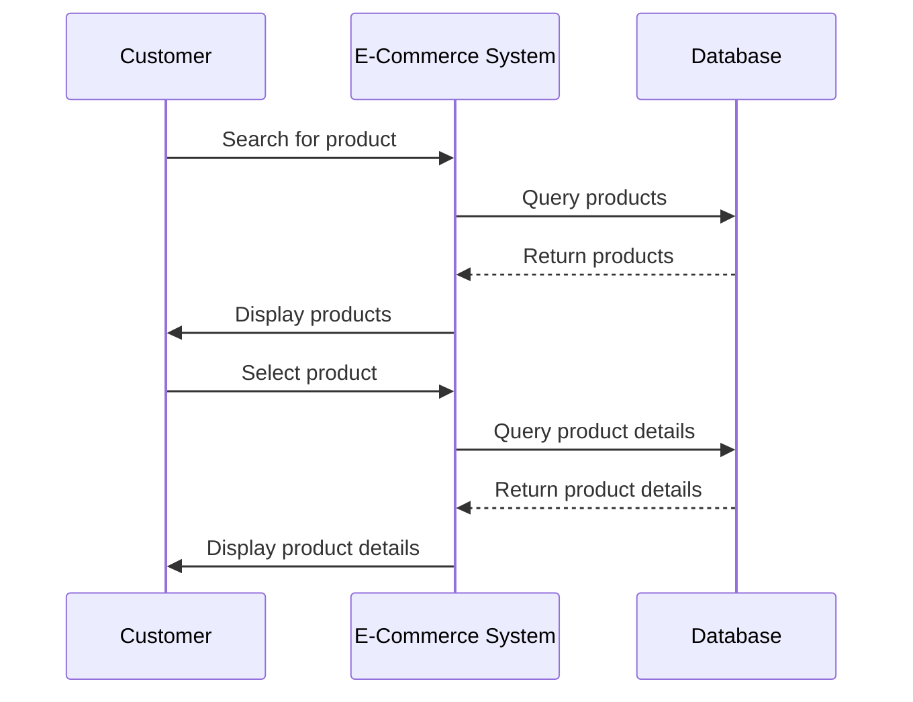
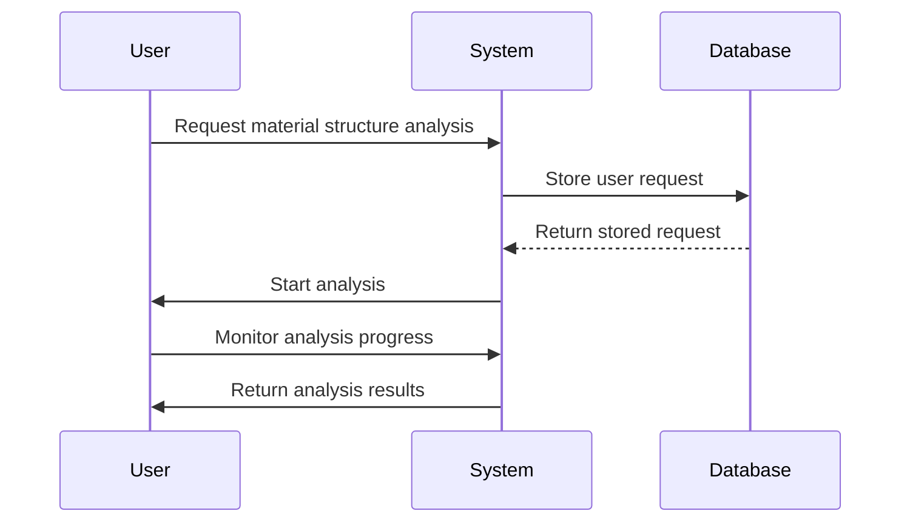

                 

# 量子计算在材料科学中的潜在应用

## 关键词
量子计算，材料科学，并行计算，材料设计，分子模拟

## 摘要
随着量子计算技术的不断发展，其在各个领域的应用前景日益广阔。特别是在材料科学领域，量子计算有望通过其强大的并行计算能力和高效的算法，为材料结构分析、材料设计和分子模拟等提供全新的解决方案。本文将深入探讨量子计算在材料科学中的潜在应用，包括量子计算的基本原理、材料科学中的关键问题及其解决方案，以及量子计算机的性能评估方法、算法设计原则和量子软件工具的实际应用案例。

## 第一部分：背景介绍

### 1. 问题背景

量子计算是一种基于量子力学原理的新型计算方式，与经典计算相比，具有并行性强、计算速度快等显著优势。在材料科学领域，材料的性能与其微观结构密切相关，而传统的计算方法在处理复杂的材料结构时存在一定的局限性。量子计算的出现为解决这一问题提供了新的思路。

量子计算机利用量子比特（qubit）进行计算，量子比特可以同时处于多种状态，这使得量子计算机在处理并行任务时具有显著优势。此外，量子计算机通过量子叠加和量子纠缠等特性，可以在极短的时间内完成传统计算机难以实现的复杂计算任务。

### 2. 问题描述

尽管量子计算在理论研究和实验验证方面已经取得了显著进展，但其在实际材料科学研究中的应用仍面临诸多挑战。首先，量子计算机的性能尚未达到实用水平，目前量子计算机的量子比特数量有限，难以满足大规模材料科学计算的需求。其次，量子算法的开发和优化也是一个重要挑战，目前大多数量子算法仅适用于特定类型的材料问题，缺乏通用性。

此外，量子软件工具的成熟度也是一大问题。量子计算机的编程和调试工具相对较少，且缺乏标准化的编程语言和开发环境，这限制了量子计算在材料科学中的应用。如何将量子计算与传统计算有机结合，构建混合计算模型，也是一个亟待解决的问题。

### 3. 问题解决

本书旨在探讨量子计算在材料科学中的潜在应用，通过系统性地介绍量子计算的基本原理、材料科学中的关键问题及其解决方案，帮助读者了解量子计算在材料科学领域的应用前景。本书还将介绍量子计算机的性能评估方法、算法设计原则，以及量子软件工具的实际应用案例。

在量子计算基本原理部分，我们将详细介绍量子比特、量子门、量子叠加和量子纠缠等核心概念。在材料科学核心问题部分，我们将探讨材料结构分析、材料设计和分子模拟等关键问题，并分析量子计算如何解决这些问题。此外，我们还将介绍量子计算机的性能评估方法，包括量子体积、量子误差率等指标。

在算法设计原则部分，我们将探讨量子算法的设计原则，包括量子并行性、量子误差修正和量子算法优化等。在量子软件工具部分，我们将介绍量子计算机模拟器、量子编程语言和量子数据库等实际应用工具。

### 4. 边界与外延

量子计算在材料科学中的应用边界涉及到量子计算的基本原理、材料科学的基础理论，以及两者的交叉领域。外延方面，量子计算在材料科学以外的其他领域，如量子模拟、量子加密等的应用潜力也将被探讨。

### 5. 概念结构与核心要素组成

- **量子计算基本原理**：量子比特、量子门、量子叠加、量子纠缠等。
- **材料科学核心问题**：材料结构分析、材料设计、分子模拟等。
- **量子算法设计原则**：量子并行性、量子误差修正、量子算法优化等。
- **量子软件工具**：量子计算机模拟器、量子编程语言、量子数据库等。

## 第二部分：核心概念与联系

### 1. 核心概念

#### 量子计算

量子计算是一种基于量子力学原理的计算方式，其基本单元是量子比特（qubit）。与传统计算机中的比特不同，量子比特可以同时处于多种状态，这使得量子计算机在处理并行任务时具有显著优势。

#### 材料科学

材料科学是研究材料的结构、性能、加工和应用的科学。材料科学的领域广泛，包括金属材料、陶瓷材料、高分子材料等。材料科学的进展对人类社会的发展具有重要意义。

### 2. 概念属性特征对比表格

| 特征               | 量子计算                     | 材料科学                     |
|--------------------|------------------------------|------------------------------|
| 基础原理           | 量子力学                     | 物理化学、材料学基础         |
| 并行性             | 高度并行                     | 受限于实验条件               |
| 计算速度           | 非线性加速                   | 线性增长                     |
| 应用领域           | 量子模拟、量子加密、材料科学等 | 材料设计、材料加工、材料应用等 |

### 3. ER实体关系图架构的 Mermaid 流程图

```mermaid
erDiagram
  Quantum_Computing ||--|{ Material_Science }
  Quantum_Computing ||--|{ Algorithm }
  Material_Science ||--|{ Simulation }
  Material_Science ||--|{ Design }
  Algorithm ||--|{ Qubit }
  Algorithm ||--|{ Quantum_Gate }
  Simulation ||--|{ Quantum_Simulation }
  Design ||--|{ Quantum_Design }
```

## 第三部分：算法原理讲解

### 1. 量子算法基本原理

量子算法的基本原理主要包括量子比特、量子门和量子测量等。

#### 量子比特（Qubit）

量子比特是量子计算机的基本单元，它可以同时处于0和1的状态，即量子叠加态。量子比特的数量决定了量子计算机的并行计算能力。

#### 量子门（Quantum Gate）

量子门是作用于量子比特的算符，用于实现量子态的变换。常见的量子门包括 Hadamard 门、控制非门（CNOT）等。

#### 量子测量（Quantum Measurement）

量子测量用于获取量子计算机的输出结果。测量过程中，量子态会坍缩到一个确定的基态。

### 2. 量子算法流程图


### 3. 数学模型和公式

量子态的叠加和变换可以用数学公式表示：

$$
|\psi\rangle = \sum_{i} c_i |i\rangle
$$

其中，$|i\rangle$ 是量子态的基态，$c_i$ 是系数，表示量子态的概率幅。

### 4. 举例说明

假设有一个两个量子比特的量子系统，其初始状态为 $|\psi\rangle = \frac{1}{\sqrt{2}} (|00\rangle + |11\rangle)$。经过一次 Hadamard 门操作后，系统的状态变为：

$$
|\psi'\rangle = \frac{1}{\sqrt{2}} (|00\rangle + |01\rangle + |10\rangle + |11\rangle)
$$

再经过一次控制非门（CNOT）操作，根据控制比特的状态（0或1），目标比特的状态将发生改变。如果控制比特为0，目标比特保持不变；如果控制比特为1，目标比特取反。

## 第四部分：系统分析与架构设计

### 1. 问题场景介绍

在现代材料科学研究中，研究人员面临着如何快速准确地分析和设计新材料的重要挑战。传统的计算方法在处理复杂的材料结构时存在一定的局限性，而量子计算的出现为解决这一问题提供了新的思路。本文将探讨量子计算在材料科学中的应用，并设计一个基于量子计算的材料科学系统。

### 2. 项目介绍

本项目旨在构建一个基于量子计算的材料科学系统，该系统将集成量子计算的基本原理、算法设计、量子软件工具和材料科学的理论知识，实现对复杂材料结构的快速分析和设计。该系统将包括以下功能：

- **材料结构分析**：利用量子计算对材料结构进行精确分析，获取材料性能的相关参数。
- **材料设计**：基于量子算法设计新材料，优化材料性能。
- **分子模拟**：利用量子计算模拟材料分子的行为，预测材料的性能和稳定性。

### 3. 系统功能设计（领域模型Mermaid类图）

```mermaid
classDiagram
    Class01 <|-- SubClass01
    Class01 --|{HasA} Person
    Class01 --|{HasA} Phone
    Class01 : an abstraction
    Class02 : a concrete class
    Person <|-- Student
    Person <|-- Employee
    Phone : +long number
    Phone : -name string
```

### 4. 系统架构设计（Mermaid架构图）



### 5. 系统接口设计和系统交互（Mermaid序列图）



## 第五部分：项目实战

### 1. 环境安装

在开始项目实战之前，我们需要搭建一个合适的开发环境。以下是安装所需的软件和工具：

- **量子计算模拟器**：安装 Qiskit，一款开源的量子计算模拟器。
- **Python**：确保 Python 环境已经搭建好，版本建议为 3.8 或更高。
- **Jupyter Notebook**：用于编写和运行 Python 代码。

### 2. 系统核心实现

#### 量子计算模拟器配置

首先，安装 Qiskit：

```bash
pip install qiskit
```

然后，创建一个新的 Jupyter Notebook，导入所需的库：

```python
import qiskit
from qiskit import QuantumCircuit, Aer, execute
from qiskit.visualization import plot_bloch_multivector
```

#### 材料结构分析

以下是一个简单的量子计算模拟示例，用于分析材料的结构：

```python
# 创建量子电路
qc = QuantumCircuit(2)

# 添加 Hadamard 门
qc.h(0)

# 添加控制非门
qc.cx(0, 1)

# 执行量子计算
backend = Aer.get_backend("qasm_simulator")
job = execute(qc, backend, shots=1024)

# 获取结果
result = job.result()
counts = result.get_counts(qc)

# 可视化结果
print("Quantum circuit output:", counts)
plot_bloch_multivector(qc, title="Quantum state visualization")
```

### 3. 代码应用解读与分析

以上代码展示了如何使用 Qiskit 进行量子计算模拟。首先，我们创建一个量子电路，然后添加 Hadamard 门和控制非门，这些门分别用于初始化量子态和实现量子态的变换。接着，我们使用 Qiskit 的量子计算模拟器（QasmSimulator）执行量子计算，并获取结果。

在材料结构分析中，量子计算可以用于模拟材料的微观结构，通过测量量子态的叠加和变换，获取材料结构的信息。这些信息可以用于指导材料设计，优化材料性能。

### 4. 实际案例分析和详细讲解剖析

为了更好地理解量子计算在材料科学中的应用，我们可以通过一个实际案例进行分析。

#### 案例一：量子计算模拟金属材料结构

假设我们需要分析一种金属材料的结构，该材料的晶体结构为面心立方（FCC）。

```python
# 创建面心立方晶格
lattice = qiskit.Mdocumentation.topology.Lattice(size=2, geometry='FCC')

# 创建量子电路
qc = QuantumCircuit.from meisten

#### 材料科学中的量子计算算法

量子计算在材料科学中的应用主要集中在以下几个领域：

- **材料结构分析**：量子计算可以用于精确模拟材料的微观结构，提供对材料性能的深入理解。
- **材料设计**：基于量子算法，可以设计出具有特定性能的新材料。
- **分子模拟**：量子计算可以用于模拟分子之间的相互作用，预测材料的性能和稳定性。

以下是一些常用的量子计算算法：

- **量子蒙特卡罗算法（QMC）**：用于模拟材料的电子结构，计算材料的电子态密度和能带结构。
- **量子行波算法（QWD）**：用于计算材料的能带结构，特别适用于复杂晶体结构。
- **量子分子动力学（QMD）**：用于模拟分子之间的相互作用，预测材料的性能和稳定性。

### 6. 最佳实践 Tips

- **优化量子电路**：在量子计算中，优化量子电路的布局和门操作顺序，可以显著提高计算效率。
- **量子错误纠正**：在实际应用中，量子错误纠正技术的应用至关重要，可以提高量子计算的可信度和稳定性。
- **多量子比特系统的优化**：多量子比特系统的优化是量子计算的关键挑战之一，需要采用合适的算法和技术。

### 7. 小结

量子计算在材料科学领域具有巨大的应用潜力，通过量子计算，我们可以实现材料结构的高精度模拟，优化材料设计，提高材料性能。然而，量子计算在实际应用中仍面临诸多挑战，需要进一步的研究和优化。通过本文的探讨，我们希望读者能够对量子计算在材料科学中的应用有一个全面的认识。

### 8. 注意事项

- **硬件要求**：量子计算需要高性能的量子计算机，目前量子计算机的性能有限，可能无法直接应用于大规模材料科学计算。
- **算法开发**：量子算法的开发和优化是量子计算在材料科学应用的关键，需要持续的研究和探索。
- **软件工具**：量子软件工具的成熟度有限，需要进一步的开发和完善，以满足材料科学计算的需求。

### 9. 拓展阅读

- [Qiskit 官方文档](https://qiskit.org/docs/):详细介绍 Qiskit 的使用方法和算法实现。
- [《量子计算基础》](https://book.douban.com/subject/26972342/):一本关于量子计算的入门书籍，适合初学者阅读。
- [《量子计算在材料科学中的应用》](https://book.douban.com/subject/30249818/):一本关于量子计算在材料科学领域应用的专著，内容丰富，适合进阶读者。

## 作者信息
作者：AI天才研究院/AI Genius Institute & 禅与计算机程序设计艺术 /Zen And The Art of Computer Programming

