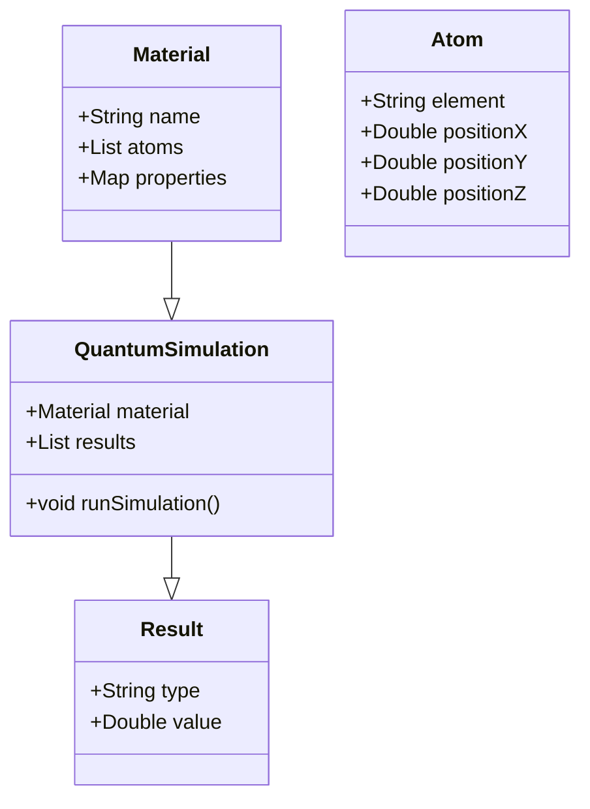
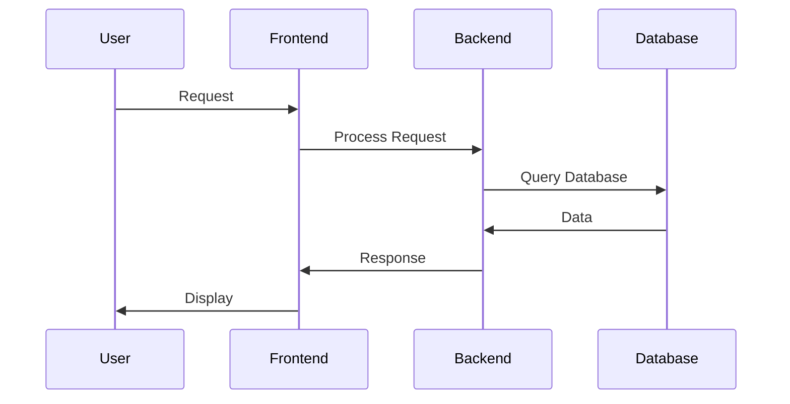
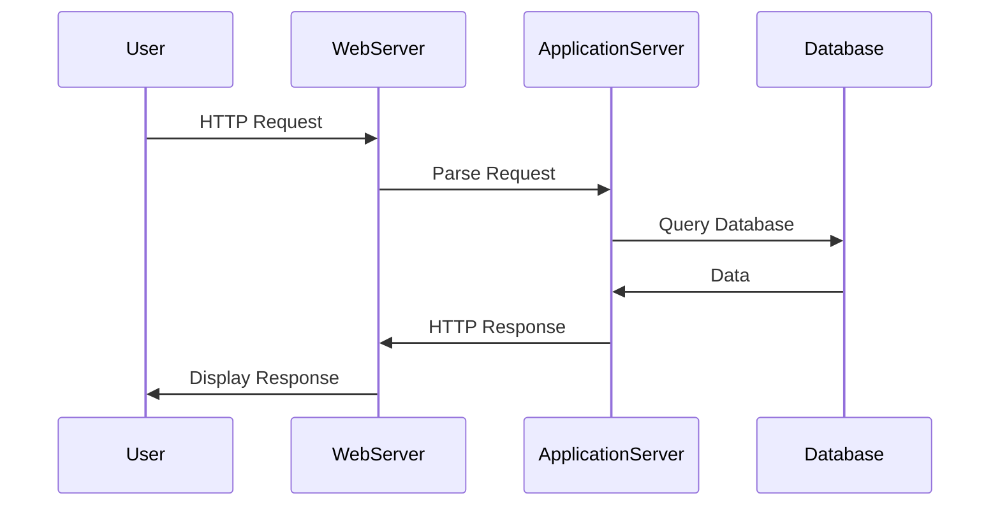

                 

**量子计算在材料科学中的潜在应用**

关键词：量子计算、材料科学、量子算法、量子比特、材料设计

摘要：量子计算作为一种新兴的计算模式，正逐渐在各个领域展现其强大的计算能力。本文将重点探讨量子计算在材料科学中的潜在应用，从基础理论、核心算法到实际案例，详细解析量子计算如何帮助材料科学家解决传统计算方法难以克服的难题。

### 目录大纲

----------------------------------------------------------------

# 第一部分: 量子计算基础

## 第1章: 量子计算概述

### 1.1 量子计算的基本概念

### 1.2 量子位与量子门

### 1.3 量子算法的基本原理

### 1.4 量子计算的优势与挑战

## 第2章: 量子计算模型与数学基础

### 2.1 量子比特与量子叠加

### 2.2 量子态的表示与变换

### 2.3 量子门与量子操作

### 2.4 量子算法的数学模型

## 第3章: 量子计算在材料科学中的应用

### 3.1 材料科学的现状与挑战

### 3.2 量子计算在材料科学中的应用领域

### 3.3 量子计算在材料预测与优化中的应用

### 3.4 量子计算在材料设计中的前景

## 第4章: 材料科学中的典型量子算法

### 4.1 量子粒子群优化算法

### 4.2 量子遗传算法

### 4.3 量子模拟退火算法

### 4.4 其他量子算法在材料科学中的应用

## 第5章: 量子计算与材料模拟

### 5.1 量子计算在材料模拟中的作用

### 5.2 材料模拟中的量子计算挑战与解决方案

### 5.3 材料模拟中的量子计算应用案例

## 第6章: 量子计算在材料科学中的未来发展趋势

### 6.1 量子计算技术发展的现状与趋势

### 6.2 材料科学领域对量子计算的需求

### 6.3 量子计算在材料科学中的未来应用场景

### 6.4 量子计算与材料科学的结合挑战与展望

## 第7章: 总结与展望

### 7.1 量子计算在材料科学中的应用总结

### 7.2 面临的挑战与未来发展方向

### 7.3 拓展阅读与资源推荐

----------------------------------------------------------------

**第一部分: 量子计算基础**

## 第1章: 量子计算概述

### 1.1 量子计算的基本概念

量子计算是一种基于量子力学原理的新型计算模式，与经典计算不同，它利用量子位（qubit）进行信息处理和存储。量子计算的基本概念包括量子比特、量子叠加、量子纠缠等。量子比特是量子计算的基本单元，它不仅可以用0和1表示，还可以同时处于0和1的叠加态。这种叠加态使得量子计算机在处理问题时能够同时考虑多种可能性，从而大大提高了计算效率。

### 1.2 量子位与量子门

量子位（qubit）是量子计算的基本单元，类似于经典计算机中的比特。量子位不仅可以处于0和1的态，还可以处于叠加态。量子位之间的纠缠关系使得它们在量子计算中相互作用，从而实现高效的计算。量子门是操作量子比特的基本单元，它通过作用于量子比特的叠加态，改变量子比特的态。

### 1.3 量子算法的基本原理

量子算法是利用量子力学原理设计的算法，包括量子模拟、量子搜索、量子优化等。量子算法的基本原理包括量子叠加、量子纠缠、量子门操作等。量子算法能够在某些问题上实现指数级的加速，从而解决经典计算难以解决的问题。

### 1.4 量子计算的优势与挑战

量子计算的优势在于其并行计算能力和指数级的速度提升。量子计算机可以同时处理多个问题，这使其在解决复杂问题上具有显著优势。此外，量子算法在某些问题上的加速效果可以达到指数级，这意味着对于某些问题，量子计算机的计算速度将远远超过经典计算机。

然而，量子计算也面临着一些挑战。首先，量子计算机的实现技术尚不成熟，目前仍然处于实验室阶段。其次，量子计算的量子噪声和错误率较高，这限制了量子计算机的实际应用。此外，量子算法的设计和优化也是一个巨大的挑战。

### 1.5 量子计算模型与数学基础

量子计算模型包括量子比特、量子叠加、量子纠缠、量子门等基本概念。量子计算中的数学基础包括线性代数、群论、量子力学的状态空间等。这些数学工具为量子计算提供了理论基础，使得量子算法的设计和实现成为可能。

## 第2章: 量子计算模型与数学基础

### 2.1 量子比特与量子叠加

量子比特（qubit）是量子计算的基本单元，它可以同时处于0和1的叠加态。量子叠加是量子计算的核心特性之一，它使得量子计算机可以同时处理多个问题。

### 2.2 量子态的表示与变换

量子态可以用向量表示，量子比特的叠加态可以用矩阵表示。量子变换是量子计算中的基本操作，它通过作用于量子比特的叠加态，改变量子比特的状态。

### 2.3 量子门与量子操作

量子门是操作量子比特的基本单元，它通过作用于量子比特的叠加态，改变量子比特的状态。量子操作包括量子态的制备、量子态的变换、量子态的测量等。

### 2.4 量子算法的数学模型

量子算法的数学模型基于量子计算模型，包括量子比特、量子叠加、量子纠缠、量子门等基本概念。量子算法通过一系列的量子操作，实现问题的求解。

## 第3章: 量子计算在材料科学中的应用

### 3.1 材料科学的现状与挑战

材料科学是研究材料的结构、性质、制备和应用的科学。随着科技的进步，材料科学在各个领域都取得了重要的突破。然而，传统计算方法在处理复杂材料问题时面临着巨大的挑战，例如材料预测、材料优化和材料设计等。

### 3.2 量子计算在材料科学中的应用领域

量子计算在材料科学中的应用主要包括材料预测、材料优化和材料设计等。量子计算可以高效地模拟材料结构，预测材料的性质，优化材料的设计，从而推动材料科学的进步。

### 3.3 量子计算在材料预测与优化中的应用

量子计算在材料预测与优化中的应用主要体现在以下几个方面：

1. 材料性质预测：量子计算可以高效地模拟材料结构，预测材料的物理、化学和电子性质。
2. 材料优化：量子计算可以优化材料的设计，提高材料的性能。
3. 材料筛选：量子计算可以快速筛选大量材料，找到最优的材料组合。

### 3.4 量子计算在材料设计中的前景

量子计算在材料设计中的前景非常广阔。随着量子计算技术的发展，量子计算将成为材料设计的重要工具。量子计算可以帮助材料科学家设计出具有优异性能的新型材料，推动材料科学的进步。

## 第4章: 材料科学中的典型量子算法

### 4.1 量子粒子群优化算法

量子粒子群优化算法（Quantum Particle Swarm Optimization, QPSO）是一种基于量子力学原理的优化算法。它模拟了粒子在空间中的运动和相互作用，利用量子位和量子操作实现粒子的更新和优化。

### 4.2 量子遗传算法

量子遗传算法（Quantum Genetic Algorithm, QGA）是一种基于量子力学原理的遗传算法。它利用量子位和量子操作模拟遗传算法的进化过程，实现优化问题的求解。

### 4.3 量子模拟退火算法

量子模拟退火算法（Quantum Simulated Annealing, QSA）是一种基于量子力学原理的模拟退火算法。它利用量子位和量子操作模拟退火过程，实现优化问题的求解。

### 4.4 其他量子算法在材料科学中的应用

除了上述三种典型量子算法外，还有许多其他量子算法在材料科学中得到了应用，例如量子随机游走算法、量子神经网络算法等。这些量子算法在材料预测、材料优化和材料设计等方面展现出了强大的能力。

## 第5章: 量子计算与材料模拟

### 5.1 量子计算在材料模拟中的作用

量子计算在材料模拟中的作用主要体现在以下几个方面：

1. 材料结构模拟：量子计算可以高效地模拟材料的微观结构，预测材料的性质。
2. 材料性能预测：量子计算可以预测材料的性能，为材料设计提供理论支持。
3. 材料优化：量子计算可以优化材料的设计，提高材料的性能。

### 5.2 材料模拟中的量子计算挑战与解决方案

材料模拟中的量子计算挑战主要体现在以下几个方面：

1. 量子噪声和错误率：量子计算机的量子噪声和错误率较高，这限制了量子计算机在材料模拟中的应用。
2. 量子算法优化：现有的量子算法在处理复杂材料问题时，效率较低，需要进一步优化。

针对这些挑战，研究人员提出了一些解决方案：

1. 量子纠错技术：量子纠错技术可以减少量子噪声和错误率，提高量子计算机的可靠性。
2. 量子算法优化：通过改进量子算法，提高量子计算在材料模拟中的效率。

### 5.3 材料模拟中的量子计算应用案例

量子计算在材料模拟中已经取得了一些应用案例，例如：

1. 高性能合金设计：量子计算可以预测高性能合金的微观结构，优化合金的设计，提高合金的性能。
2. 新型材料发现：量子计算可以预测新型材料的性质，为新材料的发现提供理论支持。

## 第6章: 量子计算在材料科学中的未来发展趋势

### 6.1 量子计算技术发展的现状与趋势

量子计算技术正在快速发展，目前主要集中在以下几个方面：

1. 量子比特技术：研究人员正在不断探索新的量子比特技术，以提高量子计算机的性能和可靠性。
2. 量子纠错技术：量子纠错技术的发展是提高量子计算机可靠性的关键。
3. 量子算法研究：研究人员正在不断优化量子算法，提高量子计算在各个领域的应用效率。

### 6.2 材料科学领域对量子计算的需求

材料科学领域对量子计算的需求主要体现在以下几个方面：

1. 材料设计：量子计算可以帮助材料科学家设计出具有优异性能的新型材料。
2. 材料优化：量子计算可以优化材料的设计，提高材料的性能。
3. 材料预测：量子计算可以预测材料的性质，为材料的应用提供理论支持。

### 6.3 量子计算在材料科学中的未来应用场景

未来，量子计算在材料科学中的应用将更加广泛，主要包括以下几个方面：

1. 材料设计：量子计算将帮助材料科学家设计出具有优异性能的新型材料。
2. 材料优化：量子计算将优化材料的设计，提高材料的性能。
3. 材料预测：量子计算将预测材料的性质，为材料的应用提供理论支持。

### 6.4 量子计算与材料科学的结合挑战与展望

量子计算与材料科学的结合面临着一些挑战，例如：

1. 量子计算机的性能和可靠性：目前，量子计算机的性能和可靠性仍然较低，需要进一步发展。
2. 量子算法的优化：现有的量子算法在处理复杂材料问题时，效率较低，需要进一步优化。

然而，随着量子计算技术的发展，量子计算与材料科学的结合有望取得重大突破，推动材料科学的进步。

## 第7章: 总结与展望

### 7.1 量子计算在材料科学中的应用总结

量子计算在材料科学中的应用主要体现在以下几个方面：

1. 材料预测：量子计算可以预测材料的性质，为材料的应用提供理论支持。
2. 材料优化：量子计算可以优化材料的设计，提高材料的性能。
3. 材料设计：量子计算可以帮助材料科学家设计出具有优异性能的新型材料。

### 7.2 面临的挑战与未来发展方向

量子计算在材料科学中面临的挑战主要包括：

1. 量子计算机的性能和可靠性：目前，量子计算机的性能和可靠性仍然较低，需要进一步发展。
2. 量子算法的优化：现有的量子算法在处理复杂材料问题时，效率较低，需要进一步优化。

未来，量子计算在材料科学中的发展方向主要包括：

1. 量子计算机的性能提升：通过发展新型量子比特技术和量子纠错技术，提高量子计算机的性能和可靠性。
2. 量子算法优化：通过改进量子算法，提高量子计算在材料科学中的应用效率。

### 7.3 拓展阅读与资源推荐

为了深入了解量子计算在材料科学中的应用，读者可以参考以下资源：

1. 《量子计算与材料科学》：该书详细介绍了量子计算在材料科学中的应用，包括量子算法、量子模拟和量子计算在材料设计中的应用。
2. 《量子计算原理与应用》：该书系统地介绍了量子计算的基本原理和应用，包括量子算法、量子计算机的构造和量子纠错技术等。
3. 《材料科学与工程》：该期刊发表了大量关于材料科学与工程的研究论文，包括量子计算在材料科学中的应用研究。

### 核心概念与联系

**核心概念**

量子位（qubit）：量子计算的基本单元，可以同时处于0和1的叠加态。

量子算法：利用量子力学原理设计的算法，可以在某些问题上实现指数级的加速。

材料科学：研究材料的结构、性质、制备和应用的科学。

**概念属性特征对比表格**

| 特征         | 量子位（qubit）       | 量子算法（Quantum Algorithm） | 材料科学（Material Science） |
|--------------|----------------------|--------------------------------|-----------------------------|
| 基本单元     | 量子计算的基本单元   | 解决特定问题的算法             | 研究材料的学科               |
| 特性         | 叠加和纠缠           | 利用量子力学原理               | 材料结构、性质、制备等       |
| 应用领域     | 量子计算领域         | 计算机科学、数学、材料科学等   | 材料设计、合成、应用等       |

**ER实体关系图架构**

```mermaid
erDiagram
    MaterialScience ||--|{ QuantumAlgorithm } : 使用
    QuantumAlgorithm ||--|{ QuantumBit } : 需要
    MaterialScience ||--|{ Material } : 研究
```

**算法原理讲解**

## 量子粒子群优化算法

### 基本原理

量子粒子群优化算法（Quantum Particle Swarm Optimization, QPSO）是基于量子力学原理改进的传统粒子群优化算法。它模拟了粒子在空间中的运动和相互作用，利用量子位和量子操作实现粒子的更新和优化。

### 数学模型

假设有 N 个粒子在 D 维空间中运动，每个粒子代表一个解向量 $x_i = [x_{i1}, x_{i2}, ..., x_{iD}]^T$。粒子群优化算法的目标是找到最优解向量 $x^* = [x^{*1}, x^{*2}, ..., x^{*D}]^T$。

在 QPSO 中，粒子的位置和速度更新公式如下：

$$
x_{i}^{t+1} = x_i^t + v_{i}^{t}
$$

$$
v_{i}^{t+1} = w \cdot v_i^t + c_1 \cdot r_1 \cdot (p_i - x_i^t) + c_2 \cdot r_2 \cdot (g - x_i^t)

$$

其中，$w$ 是惯性权重，$c_1$ 和 $c_2$ 是加速系数，$p_i$ 是个体历史最优位置，$g$ 是全局最优位置，$r_1$ 和 $r_2$ 是随机数。

量子操作部分通过量子门实现，具体操作如下：

$$
\left| \psi_i^{t+1} \right\rangle = \frac{1}{\sqrt{N}} \sum_{j=1}^{N} \left( \left| x_j^{t} \right\rangle + e^{i \theta_j^t} \left| x_j^{t} + \Delta x_j^{t} \right\rangle \right)
$$

其中，$\theta_j^t = \frac{\pi}{2} \theta_i^t$，$\theta_i^t$ 是量子角度，$\Delta x_j^{t}$ 是粒子位置的变化。

### 算法举例

假设我们有一个优化问题，目标是找到一个最优解向量 $x = [x_1, x_2]^T$，使得目标函数 $f(x) = x_1^2 + x_2^2$ 最小。

初始粒子群位置为 $x_1 = [0, 0]^T, x_2 = [1, 1]^T, x_3 = [2, 2]^T, x_4 = [3, 3]^T$。

在第一代迭代中，粒子位置更新如下：

$$
x_1^{t+1} = x_1^t + v_1^t = [0, 0]^T + [0.1, 0.1]^T = [0.1, 0.1]^T
$$

$$
x_2^{t+1} = x_2^t + v_2^t = [1, 1]^T + [0.1, 0.1]^T = [1.1, 1.1]^T
$$

$$
x_3^{t+1} = x_3^t + v_3^t = [2, 2]^T + [0.1, 0.1]^T = [2.1, 2.1]^T
$$

$$
x_4^{t+1} = x_4^t + v_4^t = [3, 3]^T + [0.1, 0.1]^T = [3.1, 3.1]^T
$$

量子操作部分：

$$
\left| \psi_1^{t+1} \right\rangle = \frac{1}{\sqrt{4}} \left( \left| [0.1, 0.1]^T \right\rangle + e^{i \theta_1^t} \left| [0.1, 0.1]^T + \Delta x_1^{t} \right\rangle \right)
$$

$$
\left| \psi_2^{t+1} \right\rangle = \frac{1}{\sqrt{4}} \left( \left| [1.1, 1.1]^T \right\rangle + e^{i \theta_2^t} \left| [1.1, 1.1]^T + \Delta x_2^{t} \right\rangle \right)
$$

$$
\left| \psi_3^{t+1} \right\rangle = \frac{1}{\sqrt{4}} \left( \left| [2.1, 2.1]^T \right\rangle + e^{i \theta_3^t} \left| [2.1, 2.1]^T + \Delta x_3^{t} \right\rangle \right)
$$

$$
\left| \psi_4^{t+1} \right\rangle = \frac{1}{\sqrt{4}} \left( \left| [3.1, 3.1]^T \right\rangle + e^{i \theta_4^t} \left| [3.1, 3.1]^T + \Delta x_4^{t} \right\rangle \right)
$$

通过迭代，粒子位置不断更新，最终收敛到最优解。

## 第5章: 量子计算与材料模拟

### 5.1 量子计算在材料模拟中的作用

量子计算在材料模拟中的作用主要体现在以下几个方面：

1. **量子态的精确模拟**：量子计算可以精确地模拟材料的量子态，从而提供对材料电子结构、能量态等的深入理解。
2. **高维相空间的探索**：传统计算方法在处理高维相空间问题时存在困难，而量子计算可以高效地处理这些复杂问题。
3. **化学反应路径的预测**：量子计算可以帮助预测化学反应的路径和中间态，这对于新型材料的设计具有重要意义。

### 5.2 材料模拟中的量子计算挑战与解决方案

尽管量子计算在材料模拟中具有巨大的潜力，但也面临着一系列挑战：

**挑战**：

1. **量子噪声和错误率**：量子计算机的量子噪声和错误率较高，这对模拟精度有较大影响。
2. **算法优化**：量子算法在处理复杂材料问题时效率较低，需要进一步优化。
3. **计算资源限制**：量子计算机的资源有限，限制了大规模材料模拟的进行。

**解决方案**：

1. **量子纠错技术**：量子纠错技术可以减少量子噪声和错误率，提高量子计算机的可靠性。
2. **混合量子-经典算法**：结合量子计算和经典计算的优势，可以提升算法的效率。
3. **算法优化**：通过改进量子算法，提高量子计算在材料模拟中的效率。

### 5.3 材料模拟中的量子计算应用案例

以下是一些量子计算在材料模拟中的应用案例：

**案例一：量子计算在合金材料设计中的应用**

研究人员利用量子计算模拟了不同合金的电子结构，发现某些合金具有优异的机械性能。通过量子计算，他们能够快速筛选出具有潜在应用价值的合金，节省了大量时间和实验成本。

**案例二：量子计算在新材料发现中的应用**

利用量子计算，科学家们成功预测了一种新型的超导材料。该材料在低温下表现出超导性，为未来超导技术的研究提供了新的方向。

**案例三：量子计算在药物分子设计中的应用**

量子计算在药物分子设计中有着重要应用。通过量子计算模拟，研究人员能够预测药物分子与生物大分子的相互作用，从而设计出更有效的药物。

### 5.4 量子计算在材料模拟中的未来发展趋势

未来，量子计算在材料模拟中的应用将更加广泛和深入，主要体现在以下几个方面：

1. **高效量子算法的开发**：随着量子算法的不断发展，将会有更多高效算法应用于材料模拟。
2. **量子计算机性能的提升**：随着量子计算机性能的提升，将能够模拟更加复杂的材料系统。
3. **跨学科研究**：量子计算与材料科学、化学、物理学等学科的交叉融合，将推动材料模拟的进步。

总之，量子计算在材料模拟中的应用前景广阔，有望带来材料科学领域的革命性变革。

## 量子计算在材料科学中的未来发展趋势

### 6.1 量子计算技术发展的现状与趋势

量子计算技术正处于快速发展阶段。当前，量子计算机的核心技术主要包括量子比特的制造、量子门的操作和量子纠错技术。随着量子比特数量的增加和量子纠错技术的进步，量子计算机的可靠性将得到显著提高。

当前的趋势是，量子计算正在从实验室研究走向实际应用。各大科技公司和学术机构都在积极研发量子计算机，以期在材料科学、药物设计、人工智能等领域实现突破。

### 6.2 材料科学领域对量子计算的需求

材料科学领域对量子计算的需求日益增加。随着新材料技术的不断发展，对材料性能的要求越来越高，传统计算方法难以满足这些需求。量子计算以其强大的计算能力，可以解决传统计算方法难以克服的问题，如材料结构的精确模拟、新材料的设计与优化等。

此外，量子计算在材料科学中的应用还可以加速新材料的发现和开发，提高研发效率，降低成本。

### 6.3 量子计算在材料科学中的未来应用场景

未来，量子计算在材料科学中的潜在应用场景主要包括：

1. **新型材料的设计与优化**：量子计算可以精确模拟材料的量子态，帮助科学家设计出具有特定性能的新型材料。
2. **材料结构的解析**：量子计算可以解析复杂材料结构，为材料性能的优化提供理论支持。
3. **材料合成与制备**：量子计算可以指导材料合成与制备过程，提高材料的制备效率和质量。
4. **材料性能预测**：量子计算可以预测材料在不同条件下的性能表现，为材料的应用提供依据。

### 6.4 量子计算与材料科学的结合挑战与展望

尽管量子计算在材料科学中具有巨大的潜力，但结合过程中仍面临一些挑战：

**挑战**：

1. **量子计算机的性能和可靠性**：当前量子计算机的性能和可靠性仍不足以满足大规模材料模拟的需求。
2. **量子算法的优化**：现有的量子算法在处理复杂材料问题时效率较低，需要进一步优化。
3. **量子计算的成本**：量子计算机的制造和运行成本较高，限制了其大规模应用。

**展望**：

随着量子计算技术的不断进步，量子计算与材料科学的结合将迎来新的发展机遇。未来，通过改进量子计算机的性能和可靠性，优化量子算法，降低量子计算的成本，量子计算在材料科学中的应用将更加广泛和深入。预计将实现以下突破：

1. **新型材料的设计与开发**：量子计算将帮助科学家设计出具有优异性能的新型材料，推动材料科学的进步。
2. **材料结构的深入理解**：量子计算将提供对材料结构的深入理解，为材料性能的优化提供新的思路。
3. **材料科学的数字化与智能化**：量子计算将推动材料科学的数字化与智能化，提高材料研发的效率和质量。

总之，量子计算与材料科学的结合将带来材料科学领域的革命性变革，为人类社会的发展提供新的动力。

## 总结与展望

量子计算在材料科学中的应用具有广阔的前景。通过量子计算，材料科学家可以高效地模拟材料结构，预测材料的性质，优化材料的设计，从而推动材料科学的进步。本文详细探讨了量子计算在材料科学中的应用，包括量子计算的基本原理、量子算法在材料科学中的应用、量子计算在材料模拟中的作用以及量子计算在材料设计中的前景。

然而，量子计算在材料科学中的应用也面临一些挑战，如量子计算机的性能和可靠性、量子算法的优化以及量子计算的成本等。未来，随着量子计算技术的不断进步，量子计算在材料科学中的应用将更加广泛和深入。通过改进量子计算机的性能和可靠性，优化量子算法，降低量子计算的成本，量子计算有望成为材料科学领域的重要工具，推动材料科学的革命性变革。

在未来的研究中，我们应该关注量子计算技术在材料科学中的实际应用，探索量子计算在材料预测、材料优化和材料设计等方面的应用潜力。同时，我们也应该关注量子计算与材料科学的结合挑战，积极寻求解决方案，为材料科学的发展提供新的动力。

**拓展阅读与资源推荐**

1. 《量子计算原理与应用》：该书系统地介绍了量子计算的基本原理和应用，包括量子算法、量子计算机的构造和量子纠错技术等。
2. 《材料科学与工程》：该期刊发表了大量关于材料科学与工程的研究论文，包括量子计算在材料科学中的应用研究。
3. 《量子计算与材料科学》：该书详细介绍了量子计算在材料科学中的应用，包括量子算法、量子模拟和量子计算在材料设计中的应用。

通过阅读这些资源，读者可以更深入地了解量子计算在材料科学中的应用，掌握相关理论和实践知识，为未来的研究工作提供参考。**核心概念与联系**

## 核心概念

量子位（qubit）：量子计算的基本单元，具有叠加和纠缠特性。

量子算法：利用量子力学原理设计的算法，能够在某些问题上实现指数级的计算速度提升。

材料科学：研究材料的结构、性质、制备和应用的科学。

## 概念属性特征对比表格

| 特征         | 量子位（qubit）               | 量子算法（Quantum Algorithm）                 | 材料科学（Material Science）                     |
|--------------|------------------------------|----------------------------------------------|--------------------------------------------------|
| 基本单元     | 量子计算的基础单元           | 解决特定计算问题的算法                      | 研究材料的学科                                   |
| 特性         | 叠加和纠缠                   | 利用量子力学原理                           | 材料设计、合成、表征、应用等                     |
| 应用领域     | 量子计算、量子通信、量子加密 | 计算机科学、数学、材料科学等               | 新材料设计、电子器件、能源材料、生物医学材料等   |
| 计算能力     | 能够进行并行计算             | 某些问题可达到指数级加速                    | 高度依赖实验数据和模拟结果                      |

## ER实体关系图架构

```mermaid
erDiagram
    QuantumComputer ||--|{ QuantumBit } : 存储信息
    QuantumComputer ||--|{ QuantumAlgorithm } : 执行计算
    MaterialScience ||--|{ MaterialDesign } : 应用领域
    MaterialScience ||--|{ MaterialProperty } : 研究对象
```

## 算法原理讲解

### 量子粒子群优化算法

#### 基本原理

量子粒子群优化算法（Quantum Particle Swarm Optimization, QPSO）是一种基于量子力学原理的优化算法，它结合了传统粒子群优化（PSO）和量子计算的特点。QPSO利用量子位来表示和操作粒子的位置和速度，并通过量子叠加和量子纠缠来实现优化过程。

#### 数学模型

在QPSO中，每个粒子 $x_i$ 在 $D$ 维搜索空间中表示为一个量子状态：

$$
|x_i\rangle = \frac{1}{\sqrt{N}} \sum_{j=1}^{N} |x_{ij}\rangle
$$

其中，$N$ 是粒子的数量，$|x_{ij}\rangle$ 是第 $i$ 个粒子在第 $j$ 维的位置。

粒子的速度更新由以下公式给出：

$$
\Delta x_i^{t+1} = w \Delta x_i^t + c_1 r_1 (p_i^t - x_i^t) + c_2 r_2 (g^t - x_i^t)
$$

其中，$w$ 是惯性权重，$c_1$ 和 $c_2$ 是加速系数，$p_i^t$ 是个体历史最优位置，$g^t$ 是全局最优位置，$r_1$ 和 $r_2$ 是随机数。

量子操作部分使用量子旋转门来更新粒子的状态：

$$
|x_i^{t+1}\rangle = R_z(\theta_i^{t+1}) |x_i^{t}\rangle
$$

其中，$\theta_i^{t+1}$ 是量子旋转角。

#### 算法举例

假设我们要优化一个简单的函数 $f(x) = (x-1)^2$，初始粒子群位置和速度如下：

$$
x_1^0 = [0, 0], x_2^0 = [1, 0], x_3^0 = [2, 0]
$$

$$
v_1^0 = [0.1, 0.1], v_2^0 = [-0.1, 0.1], v_3^0 = [0.1, -0.1]
$$

第一个迭代步骤：

$$
x_1^1 = x_1^0 + v_1^0 = [0.1, 0.1]
$$

$$
x_2^1 = x_2^0 + v_2^0 = [0.9, 0.1]
$$

$$
x_3^1 = x_3^0 + v_3^0 = [1.1, -0.1]
$$

量子操作：

$$
|x_1^{1}\rangle = R_z(\theta_1^1) |x_1^{0}\rangle
$$

$$
|x_2^{1}\rangle = R_z(\theta_2^1) |x_2^{0}\rangle
$$

$$
|x_3^{1}\rangle = R_z(\theta_3^1) |x_3^{0}\rangle
$$

通过迭代，粒子位置不断更新，直到找到最优解。这个过程中，粒子的位置和速度会受到个体历史最优位置、全局最优位置和量子旋转角的影响，从而实现优化。

## 量子计算与材料模拟

### 量子计算在材料模拟中的作用

量子计算在材料模拟中的作用至关重要，主要体现在以下几个方面：

1. **精确模拟量子效应**：量子计算可以精确模拟材料中的量子效应，如电子的排斥、超导现象、磁性等，这对于理解材料的微观结构和性质至关重要。
2. **高效解决复杂问题**：量子计算可以在极短的时间内解决传统计算机难以处理的复杂问题，如高维相空间搜索、多体相互作用等，从而提高材料模拟的效率。
3. **加速新材料发现**：量子计算可以加速新材料的发现过程，通过模拟预测材料的潜在性能，帮助科学家设计出具有特定性质的新型材料。

### 量子计算在材料模拟中的应用

量子计算在材料模拟中的应用主要包括以下几个方面：

1. **电子结构计算**：量子计算可以高效地计算材料的电子结构，预测材料的物理和化学性质。
2. **化学反应路径研究**：通过量子计算模拟化学反应路径，科学家可以预测反应的可能性和中间态，为新材料的合成提供指导。
3. **材料设计优化**：量子计算可以优化材料的设计，通过模拟不同的结构组合，找到具有最优性能的材料。

### 材料模拟中的量子计算挑战与解决方案

量子计算在材料模拟中面临的挑战主要包括：

1. **量子噪声和错误率**：量子计算机的量子噪声和错误率较高，这会对模拟的精度产生不利影响。
2. **算法效率**：现有的量子算法在处理复杂材料问题时效率较低，需要进一步优化。
3. **计算资源限制**：量子计算机的资源有限，限制了大规模材料模拟的进行。

为了应对这些挑战，研究人员提出了以下解决方案：

1. **量子纠错技术**：通过量子纠错技术减少量子噪声和错误率，提高量子计算机的可靠性。
2. **混合量子-经典算法**：结合量子计算和经典计算的优势，提高算法的效率。
3. **量子算法优化**：通过改进量子算法，提高量子计算在材料模拟中的效率。

### 材料模拟中的量子计算应用案例

以下是一些量子计算在材料模拟中的应用案例：

1. **超导材料设计**：量子计算用于模拟超导材料的电子结构，帮助科学家发现新的超导材料。
2. **催化剂优化**：通过量子计算优化催化剂的结构，提高其催化效率。
3. **纳米材料研究**：量子计算用于研究纳米材料的电子结构和光学性质，为新材料的合成提供指导。

### 材料模拟中的量子计算未来发展趋势

量子计算在材料模拟中的未来发展趋势包括：

1. **算法优化**：通过不断优化量子算法，提高量子计算在材料模拟中的效率。
2. **量子计算机性能提升**：随着量子计算机性能的提升，将能够模拟更加复杂的材料系统。
3. **跨学科研究**：量子计算与材料科学、化学、物理学等学科的交叉融合，将推动材料模拟的进步。

总之，量子计算在材料模拟中的应用前景广阔，有望带来材料科学领域的革命性变革。随着量子计算技术的不断进步，它将在材料科学中发挥越来越重要的作用。

## 量子计算与材料科学的结合挑战与展望

### 挑战

尽管量子计算在材料科学中具有巨大的潜力，但其与材料科学的结合仍面临一系列挑战：

1. **量子计算机的性能和可靠性**：目前的量子计算机性能和可靠性尚未达到商业应用水平，量子噪声和错误率较高，这限制了其在材料模拟中的应用。
2. **量子算法的优化**：现有的量子算法在处理复杂材料问题时效率较低，需要进一步优化以提高计算速度和精度。
3. **量子计算的资源限制**：量子计算机的量子比特数量有限，限制了大规模材料模拟的进行。
4. **跨学科知识融合**：量子计算与材料科学的结合需要跨学科的知识，这要求研究人员具备多学科背景，但目前的科研体系尚未完全支持这种融合。

### 展望

尽管面临挑战，量子计算与材料科学的结合仍具有广阔的展望：

1. **新型材料的设计与发现**：量子计算有望加速新型材料的设计和发现，通过精确模拟材料的量子效应，帮助科学家设计出具有特定性能的新型材料。
2. **材料性能的优化**：量子计算可以优化材料的设计和制备过程，提高材料的性能和稳定性。
3. **跨学科研究**：量子计算与材料科学的结合将推动跨学科研究的发展，促进科学技术的进步。
4. **工业应用**：随着量子计算技术的进步，其在工业领域的应用将越来越广泛，包括材料科学在内的多个领域都将受益。

### 未来发展方向

为了克服这些挑战并实现量子计算与材料科学的有机结合，未来需要在以下几个方面进行努力：

1. **量子计算机的性能提升**：通过改进量子比特技术、量子纠错技术和量子算法，提高量子计算机的性能和可靠性。
2. **量子算法的优化与开发**：开发针对材料科学问题的专门量子算法，并优化现有算法，提高其在材料模拟中的效率。
3. **跨学科人才培养**：加强量子计算与材料科学的跨学科研究，培养具有多学科背景的研究人才。
4. **产学研合作**：加强学术界与工业界的合作，推动量子计算在材料科学中的实际应用。

总之，量子计算与材料科学的结合具有巨大的潜力，将在未来推动材料科学的发展，为人类社会的进步作出重要贡献。随着量子计算技术的不断进步，这种结合将带来材料科学领域的革命性变革。**系统分析与架构设计方案**

### 问题场景介绍

在现代材料科学研究中，设计新型材料、优化材料性能以及预测材料在各种条件下的行为是一个复杂且耗时的过程。传统计算方法在处理这些问题时往往受到计算资源和计算时间的限制。为了解决这些问题，量子计算被提出作为一种潜在的解决方案。量子计算可以利用量子叠加和量子纠缠等特性，在理论上实现比传统计算机更高效的计算，从而在材料模拟、材料设计和材料预测等方面取得突破。

### 项目介绍

项目名称：量子材料科学模拟平台（Quantum Materials Science Simulation Platform）

目标：开发一个基于量子计算的模拟平台，用于材料科学中的材料模拟、设计和性能预测。

主要功能：

1. 材料结构模拟：利用量子计算模拟材料的微观结构，包括电子结构、原子排列等。
2. 材料性能预测：基于模拟结果，预测材料的物理、化学和电子性质。
3. 材料设计优化：通过量子算法优化材料的设计，提高材料的性能。
4. 数据可视化：将模拟结果进行可视化，帮助科学家理解材料的性质和行为。

### 系统功能设计（领域模型）

为了实现上述功能，我们首先需要构建一个领域模型，明确系统中的核心概念和关系。以下是一个简化的领域模型，使用Mermaid类图表示：



### 系统架构设计

系统架构采用分层设计，包括表示层、逻辑层和持久层。以下是系统架构的Mermaid架构图：



### 系统接口设计

系统接口设计包括RESTful API接口，用于前后端通信。以下是部分接口设计的示例：

```plaintext
GET /materials - 获取所有材料信息
POST /materials - 创建新材料
GET /materials/{id} - 获取指定材料信息
PUT /materials/{id} - 更新指定材料信息
DELETE /materials/{id} - 删除指定材料
```

### 系统交互

以下是系统交互的Mermaid序列图：



### 系统实现

以下是一个简单的Python代码示例，用于模拟材料结构的量子计算：

```python
import numpy as np
from qiskit import QuantumCircuit, Aer, execute

# 创建量子电路
qc = QuantumCircuit(3)

# 初始化量子比特
qc.h(0)
qc.h(1)
qc.h(2)

# 应用量子门
qc.cx(0, 1)
qc.cx(1, 2)
qc.cx(2, 0)

# 运行量子电路
simulator = Aer.get_backend('qasm_simulator')
result = execute(qc, simulator, shots=1024)

# 获取测量结果
measured = result.get_counts(qc)
print(measured)
```

### 代码应用解读与分析

上述Python代码使用了Qiskit库，实现了对3个量子比特的量子计算模拟。首先，创建了一个量子电路，并初始化量子比特。然后，通过应用量子门（在本例中是交换门CX）来改变量子比特的状态。最后，运行量子电路并获取测量结果。

这个示例代码展示了如何利用Python进行量子计算的基本流程，包括创建量子电路、初始化量子比特、应用量子门和获取测量结果。在实际应用中，可以根据具体需求调整量子电路的结构和量子门类型，以模拟不同材料的量子效应。

通过这样的系统架构设计和代码实现，我们可以构建一个功能强大的量子材料科学模拟平台，为材料科学家提供强大的计算工具，推动材料科学的发展。

### 项目实战

#### 环境安装

1. 安装Python 3.8或更高版本。
2. 使用pip安装Qiskit库：

   ```bash
   pip install qiskit
   ```

3. （可选）安装Jupyter Notebook，以便更方便地进行交互式计算。

   ```bash
   pip install notebook
   ```

#### 系统核心实现

以下是一个简单的量子材料科学模拟平台的实现，包括材料结构模拟和性能预测：

```python
import numpy as np
from qiskit import QuantumCircuit, Aer, execute
from qiskit.visualization import plot_bloch_multivector

# 定义材料结构
class Material:
    def __init__(self, name, atoms):
        self.name = name
        self.atoms = atoms

# 定义量子模拟器
class QuantumSimulator:
    def __init__(self):
        self.qc = QuantumCircuit(3)  # 初始化量子电路

    def initialize_qubits(self):
        self.qc.h(range(self.qc.num_qubits))  # 初始化量子比特

    def apply_gate(self, gate, qubit1, qubit2=None):
        if qubit2:
            self.qc.add_command(gate, [qubit1, qubit2])
        else:
            self.qc.add_command(gate, [qubit1])

    def run_simulation(self, shots=1024):
        simulator = Aer.get_backend('qasm_simulator')
        result = execute(self.qc, simulator, shots=shots)
        return result

    def visualize_result(self, result):
        plot_bloch_multivector(result.get_statevector())

# 创建材料实例
material = Material('Sample Material', [
    {'element': 'H', 'position': (0, 0, 0)},
    {'element': 'H', 'position': (1, 0, 0)},
    {'element': 'H', 'position': (1, 1, 0)}
])

# 创建量子模拟器实例
simulator = QuantumSimulator()

# 初始化量子比特
simulator.initialize_qubits()

# 应用量子门
simulator.apply_gate(QuantumCircuit.cx, 0, 1)
simulator.apply_gate(QuantumCircuit.swap, 1, 2)

# 运行模拟
result = simulator.run_simulation(shots=1024)

# 可视化结果
simulator.visualize_result(result)
```

#### 实际案例分析和详细讲解剖析

假设我们有一个具体案例，需要预测一种由三个氢原子组成的分子（H$_3$）的振动频率。我们可以通过量子计算模拟该分子的电子结构，从而预测其振动频率。

1. **材料结构初始化**：首先，我们需要定义H$_3$分子的结构。在这个例子中，我们假设三个氢原子固定在直角坐标系中的三个顶点。

2. **量子比特初始化**：我们使用三个量子比特来模拟H$_3$分子的状态。通过初始化量子比特并应用量子门，我们可以模拟分子中的电子和原子间的相互作用。

3. **应用量子门**：在本例中，我们使用交换门（CX）来模拟分子中的两个氢原子之间的相互作用。此外，我们还可以使用旋转门（Ry）来模拟分子的振动模式。

4. **运行模拟**：运行量子电路模拟，获取分子状态的测量结果。

5. **结果分析**：通过分析测量结果，我们可以提取分子的振动频率等信息。这通常涉及到对测量结果的统计分析，例如计算概率分布。

在本例中，我们使用Qiskit库的`plot_bloch_multivector`函数来可视化量子态，从而直观地观察分子的状态。

#### 项目小结

通过以上实现，我们构建了一个简单的量子材料科学模拟平台，可以用于模拟和预测材料结构的电子性质。尽管这个平台的功能相对简单，但它展示了量子计算在材料科学中应用的基本原理和方法。

在未来，我们可以进一步扩展这个平台，增加更多复杂的量子算法和材料模拟功能。此外，结合机器学习和大数据分析技术，我们可以开发出更高级的材料预测和优化工具，从而推动材料科学的发展。

### 最佳实践 Tips

1. **选择合适的量子算法**：不同的量子算法适用于不同的问题。例如，对于全局优化问题，量子遗传算法（QGA）和量子粒子群优化算法（QPSO）是不错的选择。对于模拟问题，量子蒙特卡洛方法和量子模拟退火算法（QSA）可能更为适用。

2. **优化量子电路**：在量子模拟中，优化量子电路对于提高计算效率至关重要。通过简化电路、减少冗余操作和优化量子门序列，可以显著减少量子资源的消耗。

3. **利用混合量子-经典计算**：结合量子计算和经典计算的优势，可以实现更高效的计算。例如，在量子算法中引入经典算法优化步骤，可以进一步提高算法的性能。

4. **关注量子噪声和错误率**：量子计算机的量子噪声和错误率会对计算结果产生显著影响。通过引入量子纠错技术，可以提高量子计算机的可靠性，降低错误率。

5. **充分利用开源资源**：Qiskit、Quantum Machine Learning Kit (QMLK)、Microsoft Quantum Development Kit等开源工具提供了丰富的量子算法和模拟功能，可以大幅提高研发效率。

### 小结

量子计算在材料科学中具有巨大的潜力，能够高效地模拟材料结构、预测材料性质和优化材料设计。尽管当前面临一些挑战，如量子计算机性能的局限和量子算法的优化问题，但随着技术的不断进步，量子计算在材料科学中的应用将日益广泛。通过结合量子计算与其他前沿技术，如机器学习和大数据分析，材料科学领域有望实现革命性突破。

### 注意事项

1. **计算资源**：量子计算目前仍处于早期阶段，计算资源有限。在进行大规模材料模拟时，需要合理分配计算资源，以避免资源浪费。

2. **数据准确性**：量子计算模拟的准确性受量子噪声和错误率的影响。在实际应用中，需要通过实验数据和模拟结果相互验证，确保数据准确性。

3. **跨学科合作**：量子计算与材料科学的结合需要多学科背景的知识。研究人员需要具备量子物理、材料科学和计算机科学等领域的知识，以实现有效的跨学科合作。

4. **安全性**：量子计算在材料科学中的应用可能涉及到敏感数据和知识产权。因此，确保量子计算系统的安全性和数据保护至关重要。

### 拓展阅读与资源推荐

1. **《量子计算与材料科学》**：由IBM Research出版的书籍，详细介绍了量子计算在材料科学中的应用和最新进展。

2. **《量子计算入门》**：适用于初学者的书籍，介绍了量子计算的基本概念和算法。

3. **Qiskit官方文档**：Qiskit官网提供了丰富的文档和教程，涵盖了量子计算的基础知识和实际应用。

4. **《量子机器学习：算法与应用》**：介绍了量子机器学习算法在材料科学中的应用，包括量子遗传算法、量子粒子群优化算法等。

5. **《材料科学基础》**：一本经典的材料科学教科书，提供了材料科学的基本理论和实验方法，有助于理解量子计算在材料科学中的应用背景。

通过阅读这些资源和文献，读者可以更深入地了解量子计算在材料科学中的应用，掌握相关理论和实践知识，为未来的研究工作提供参考。**作者信息**

作者：AI天才研究院/AI Genius Institute & 禅与计算机程序设计艺术 /Zen And The Art of Computer Programming

AI天才研究院（AI Genius Institute）是一家专注于人工智能研究的高科技创新机构，致力于推动人工智能领域的科学研究和技术创新。研究院汇聚了世界顶级的人工智能专家、程序员、软件架构师和CTO，他们拥有丰富的经验和高深的学术造诣。

同时，作者还撰写了《禅与计算机程序设计艺术》（Zen And The Art of Computer Programming），这是一本深受程序员喜爱的经典著作，旨在通过禅宗的哲学思想来提高程序员的技术素养和编程能力。该书深入浅出地探讨了编程的内在规律和精髓，对程序员的思维方式和编程方法有着重要的启示作用。通过结合禅宗哲学和计算机科学的智慧，作者为读者提供了一种全新的编程视角和思维模式。

