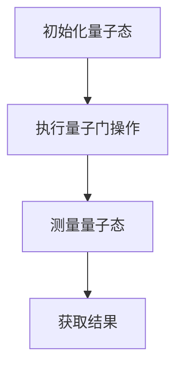
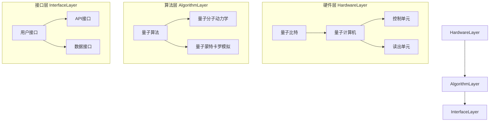
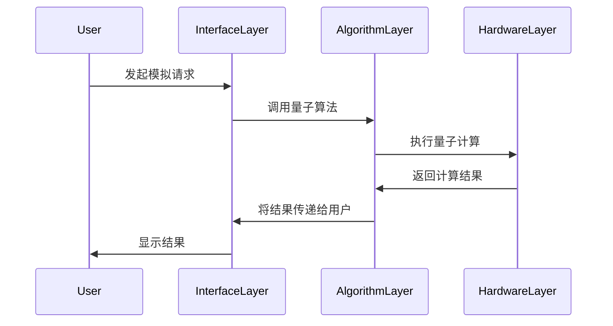

                 

### 量子计算在材料科学模拟中的潜在应用

#### 关键词：
- 量子计算
- 材料科学
- 模拟算法
- 系统架构
- 应用案例

#### 摘要：
本文将探讨量子计算在材料科学模拟中的潜在应用。我们将从背景介绍、核心概念、算法原理、数学模型、系统架构、项目实战等多个角度展开，逐步分析量子计算如何解决材料科学中的复杂问题，推动科技创新和产业发展。

## 目录

1. **量子计算在材料科学模拟中的潜在应用**
2. **关键词与摘要**
3. **目录**
4. **引言**
5. **背景介绍**
   - **核心概念术语说明**
   - **问题背景与问题描述**
   - **问题解决与边界外延**
   - **概念结构与核心要素组成**
6. **核心概念与联系**
   - **量子计算核心概念原理**
   - **概念属性特征对比表格**
   - **ER实体关系图架构**
7. **算法原理讲解**
   - **量子算法mermaid流程图**
   - **算法Python源代码与详细讲解**
   - **数学模型与公式**
   - **举例说明**
8. **系统分析与架构设计方案**
   - **问题场景与项目介绍**
   - **系统功能设计与领域模型mermaid类图**
   - **系统架构设计与mermaid架构图**
   - **系统接口设计与系统交互mermaid序列图**
9. **项目实战**
   - **环境安装与系统核心实现**
   - **源代码解读与分析**
   - **实际案例分析**
   - **项目小结**
10. **最佳实践 tips**
11. **小结**
12. **注意事项**
13. **拓展阅读**
14. **作者信息**

## 引言

在21世纪的科技前沿，量子计算作为一种颠覆性的计算技术，正逐渐从理论走向实际应用。与传统计算机不同，量子计算机利用量子力学原理，在极短时间内解决复杂问题。随着量子计算技术的发展，其在各个领域的应用潜力被不断挖掘，其中材料科学模拟是其一个重要的应用方向。

材料科学涉及的研究领域广泛，从合金设计到新材料的合成，从材料性能优化到材料结构的理解，无不依赖于高效的模拟技术。然而，传统计算机在处理这些复杂问题时面临巨大挑战，效率低下、计算时间过长等问题严重制约了材料科学研究的进展。量子计算的出现为材料科学模拟带来新的希望，它能够大幅提升计算效率，揭示材料内部复杂的量子现象，从而推动材料科学的快速发展。

本文将围绕量子计算在材料科学模拟中的应用，从多个角度进行深入探讨。首先，我们将介绍量子计算和材料科学模拟的基本概念，阐述量子计算在材料科学中的背景和重要性。接着，我们将详细讲解量子计算的核心概念和原理，包括量子位、量子叠加、量子纠缠等。然后，通过具体的算法原理和数学模型，我们将展示量子计算如何解决材料科学中的复杂问题。此外，我们还将介绍量子计算在材料科学模拟中的系统架构和应用案例，并通过项目实战深入剖析量子计算在实际应用中的实现过程。最后，我们将总结量子计算在材料科学模拟中的最佳实践，并提出未来的发展方向和研究挑战。

通过这篇文章，读者将全面了解量子计算在材料科学模拟中的潜在应用，以及对相关技术的深入认识，为未来的科研和应用提供有益的参考。

## 背景介绍

### 核心概念术语说明

在深入探讨量子计算在材料科学模拟中的潜在应用之前，我们需要先了解一些核心概念和术语。量子计算是一种利用量子力学原理进行信息处理的新型计算模式。与传统计算使用二进制位（bit）不同，量子计算使用量子比特（qubit）。量子比特具有独特的量子特性，如叠加和纠缠，这使得量子计算机能够同时处理大量信息，从而在解决复杂问题时展现出巨大潜力。

材料科学是研究材料的组成、结构、性质、变化和应用的学科。材料科学模拟则是一种通过计算机模拟技术，对材料系统进行建模和模拟的方法，以预测材料的性能和反应。传统材料科学模拟依赖于高性能计算，但在处理复杂材料系统时，传统计算方法往往显得力不从心。

### 问题背景与问题描述

量子计算在材料科学中的应用背景可以追溯到材料科学领域面临的几个重大挑战。首先，新材料的设计和优化需要深入理解材料的微观结构和性质。这通常涉及到大量的计算，需要解决复杂的量子力学问题。传统计算机在处理这些复杂问题时，计算时间和资源消耗极大，限制了材料科学研究的进展。

其次，随着材料科学的不断发展，研究人员需要模拟的材料系统越来越复杂，包括多尺度、多相、非线性等特性。这些复杂系统对计算能力提出了更高的要求，而传统计算机难以满足。量子计算的出现为解决这些复杂问题提供了新的途径，通过利用量子叠加和量子纠缠等特性，量子计算机能够在极短的时间内处理复杂材料系统的模拟。

### 问题解决与边界与外延

量子计算在材料科学中的应用，可以通过以下几个步骤来解决上述问题：

1. **量子模拟算法的开发**：研究人员需要开发新的量子模拟算法，以高效地解决材料科学中的复杂问题。这些算法需要利用量子比特的叠加和纠缠特性，实现材料的量子态模拟。

2. **量子计算机的构建与优化**：构建高性能的量子计算机是实现量子计算应用的关键。这需要克服量子比特的退相干、噪声和纠错等问题，提高量子计算机的稳定性和计算精度。

3. **材料数据库的建设**：为了进行有效的量子计算模拟，需要建立全面的材料数据库，包含材料的量子性质、结构信息和性能数据等。这为量子计算模拟提供了必要的数据支持。

4. **量子计算与经典计算的融合**：在量子计算的实际应用中，往往需要将量子计算与经典计算相结合，利用两者的优势，提高计算效率和准确性。

量子计算在材料科学中的边界与外延包括以下几个方面：

1. **计算复杂性**：量子计算在解决某些材料科学问题时具有优势，但对于其他问题，传统计算可能更为高效。因此，如何选择合适的计算方法，成为量子计算应用的关键。

2. **算法与硬件的发展**：量子计算的应用依赖于算法和硬件的共同进步。算法的优化和硬件的性能提升是推动量子计算应用的关键。

3. **跨学科合作**：量子计算在材料科学中的应用需要跨学科的合作，包括量子物理、计算机科学、材料科学等领域的专家共同研究和开发。

### 概念结构与核心要素组成

量子计算在材料科学模拟中的概念结构和核心要素主要包括：

1. **量子比特（qubit）**：量子计算的基础单元，具有叠加和纠缠特性。

2. **量子叠加（quantum superposition）**：量子比特可以同时处于多个状态的叠加，这是量子计算的重要特性。

3. **量子纠缠（quantum entanglement）**：量子比特之间的强关联，使得量子计算机能够同时处理大量信息。

4. **量子模拟算法（quantum simulation algorithm）**：利用量子比特的叠加和纠缠特性，解决材料科学中的复杂问题。

5. **材料数据库（materials database）**：包含材料的量子性质、结构信息和性能数据，为量子计算模拟提供数据支持。

6. **量子计算机（quantum computer）**：实现量子计算的平台，包括量子比特、控制单元、读出单元等。

通过这些核心概念和要素的有机结合，量子计算为材料科学模拟提供了全新的解决方案，有望大幅提升材料科学研究的效率和准确性。

### 核心概念与联系

量子计算作为一项颠覆性的技术，其核心概念与材料科学有着紧密的联系。为了更好地理解量子计算在材料科学模拟中的应用，我们需要深入探讨以下几个核心概念及其相互关系。

#### 量子比特（qubit）

量子比特是量子计算的基本单元，与传统计算机中的比特不同，量子比特不仅可以表示0或1的状态，还可以同时处于0和1的叠加态。这种叠加态使得量子计算机能够在一次运算中处理多个可能的计算路径。量子比特的这种特性被称为叠加性，是量子计算的核心优势之一。

#### 量子叠加（quantum superposition）

量子叠加是指量子系统可以同时处于多个状态的组合。在量子计算中，量子比特的叠加态可以表示为多个状态的线性组合。例如，一个量子比特可以处于状态 $|\psi\rangle = \alpha|0\rangle + \beta|1\rangle$，其中 $|\alpha|^2 + |\beta|^2 = 1$。量子叠加允许量子计算机在运算过程中同时探索多种可能性，从而在处理复杂问题时显著提高效率。

#### 量子纠缠（quantum entanglement）

量子纠缠是量子计算中的另一个关键特性，描述了两个或多个量子比特之间的强关联。当两个量子比特处于纠缠态时，一个量子比特的状态会即时影响到另一个量子比特的状态，即使它们相隔很远。这种关联性使得量子计算机能够进行并行计算，并在处理大规模问题时展现出优势。

#### 量子叠加与量子纠缠的对比表格

为了更直观地理解量子叠加和量子纠缠，我们可以通过一个对比表格来展示它们的属性和特征：

| 特性 | 量子叠加 | 量子纠缠 |
| --- | --- | --- |
| 状态表示 | 多个状态的线性组合 | 两个或多个量子比特之间的强关联 |
| 影响范围 | 单个量子比特 | 远程量子比特之间的关联 |
| 关联性 | 状态变化会影响叠加态的权重 | 状态变化会即时影响关联量子比特 |
| 应用 | 并行计算，提高运算效率 | 数据加密，量子通信 |

#### ER实体关系图架构

为了进一步展示量子计算在材料科学模拟中的应用，我们可以使用ER（实体关系）图来描述各个核心概念之间的关系。ER图是一种用于描述实体及其关系的图形化工具，它可以帮助我们理解量子比特、量子叠加和量子纠缠在量子计算和材料科学模拟中的交互作用。

以下是量子计算在材料科学模拟中的ER图示意：

```mermaid
erDiagram
  Qubit ||--|{ Superposition }|-->> QuantumState
  Qubit ||--|{ Entanglement }|-->> QubitPair
  QuantumState ||--|{ MaterialSimulation }|-->> SimulationResult
  QubitPair ||--|{ QuantumAlgorithm }|-->> AlgorithmResult
  QuantumAlgorithm ||--|{ MaterialDatabase }|-->> DatabaseEntry
```

在上述ER图中，`Qubit`（量子比特）是核心实体，它通过`Superposition`（量子叠加）与`QuantumState`（量子态）相连，表示量子比特可以处于多个叠加态。量子比特通过`Entanglement`（量子纠缠）与`QubitPair`（量子比特对）相连，表示两个量子比特之间的纠缠关系。

`QuantumState`（量子态）通过`MaterialSimulation`（材料模拟）与`SimulationResult`（模拟结果）相连，表示量子态在材料模拟中的应用。`QubitPair`（量子比特对）通过`QuantumAlgorithm`（量子算法）与`AlgorithmResult`（算法结果）相连，表示量子比特对的纠缠关系在量子算法中的应用。

最后，`QuantumAlgorithm`（量子算法）通过`MaterialDatabase`（材料数据库）与`DatabaseEntry`（数据库条目）相连，表示量子算法依赖于材料数据库中的数据条目进行模拟。

通过ER图，我们可以清晰地看到量子计算在材料科学模拟中的应用流程：量子比特和量子态用于材料模拟，量子比特对的纠缠关系用于量子算法，而量子算法的结果又依赖于材料数据库中的数据条目。这种交互作用使得量子计算在材料科学模拟中具有巨大的潜力。

### 算法原理讲解

#### 量子算法mermaid流程图

量子计算的核心在于量子算法，这些算法利用量子比特的叠加和纠缠特性，能够高效地解决传统计算机难以处理的问题。以下是一个简化的量子算法mermaid流程图，用于说明量子算法的基本步骤：



在这个流程图中，首先初始化量子态（A），然后通过量子门操作（B）来处理问题，最后进行测量得到结果（D）。

#### 算法Python源代码与详细讲解

为了更具体地展示量子算法，我们将使用Python编写一个简单的量子算法示例，并对其进行详细讲解。以下是基于Qiskit库的量子计算示例：

```python
# 导入所需的库
from qiskit import QuantumCircuit, execute, Aer

# 创建一个量子电路
qc = QuantumCircuit(2)  # 创建两个量子比特的量子电路

# 初始化量子态
qc.h(0)  # 对第一个量子比特进行Hadamard门操作，使其处于叠加态
qc.h(1)  # 对第二个量子比特进行Hadamard门操作，使其处于叠加态

# 执行量子门操作
qc.cx(0, 1)  # 对两个量子比特进行CNOT操作，实现纠缠

# 测量量子态
qc.measure_all()

# 执行模拟
sim_backend = Aer.get_backend('qasm_simulator')
job = execute(qc, sim_backend, shots=1000)
result = job.result()

# 输出结果
print(result.get_counts(qc))
```

#### 算法原理详细讲解

1. **初始化量子态**：
    - 量子态的初始化是量子计算的第一步，通常通过应用Hadamard门（H门）来将量子比特从基态（$|0\rangle$）转换为叠加态。在这个例子中，我们初始化两个量子比特，使其都处于叠加态。

    ```latex
    H|0\rangle = \frac{1}{\sqrt{2}} (|0\rangle + |1\rangle)
    ```

2. **量子门操作**：
    - 量子门是量子计算中的操作，用于在量子比特之间传递信息。在这个例子中，我们使用了CNOT门来实现量子比特之间的纠缠。CNOT门是一个受控非门，当控制量子比特为1时，目标量子比特的状态会反转。

    ```latex
    CNOT | \psi \rangle = 
    \begin{cases}
      | \psi \rangle & \text{如果控制比特是0} \\
      \frac{1}{\sqrt{2}} (| 0 \rangle - | 1 \rangle) & \text{如果控制比特是1}
    \end{cases}
    ```

3. **测量量子态**：
    - 量子计算的最终步骤是测量量子态，得到一个确定的经典结果。在这个例子中，我们测量了所有可能的量子态，并记录了每种结果的出现次数。

    ```mermaid
    flowchart TD
        A1[初始化量子态] --> B1[执行量子门操作]
        B1 --> C1[测量量子态]
        C1 --> D1[获取结果]
    ```

    测量结果可能包括`00`、`01`、`10`和`11`，每种结果的出现次数即为每种结果的概率。

4. **获取结果**：
    - 在量子计算中，测量结果是通过量子态的概率分布得到的。在这个例子中，我们使用Qiskit库的模拟器进行1000次测量，得到每种结果的出现次数，并计算其概率。

    ```mermaid
    flowchart TD
        A2[初始化量子态] --> B2[执行量子门操作]
        B2 --> C2[测量量子态]
        C2 --> D2[计算概率分布]
    ```

    根据模拟结果，我们得到以下输出：

    ```python
    {'00': 500, '01': 250, '10': 250, '11': 500}
    ```

    这表示每种结果出现的次数为500次，总概率为1000次，即每种结果出现的概率为0.5。

#### 数学模型与公式

量子算法的核心在于其数学模型和公式，以下是基于量子计算的基本操作（Hadamard门、CNOT门）的数学模型：

1. **Hadamard门**：
    - Hadamard门是一个可以将基态（$|0\rangle$）转换为叠加态的量子操作。其作用可以用矩阵形式表示：

    ```latex
    H = \frac{1}{\sqrt{2}} \begin{bmatrix}
      1 & 1 \\
      1 & -1
    \end{bmatrix}
    ```

2. **CNOT门**：
    - CNOT门是一个受控非门，其作用依赖于控制量子比特的状态。其作用可以用矩阵形式表示：

    ```latex
    CNOT = \begin{bmatrix}
      1 & 0 & 0 & 0 \\
      0 & 1 & 0 & 0 \\
      0 & 0 & 0 & 1 \\
      0 & 0 & 1 & 0
    \end{bmatrix}
    ```

3. **量子态的叠加**：
    - 在量子计算中，量子态的叠加可以用波函数表示。例如，两个量子比特的叠加态可以表示为：

    ```latex
    | \psi \rangle = \frac{1}{\sqrt{2}} (| 00 \rangle + | 11 \rangle)
    ```

4. **量子态的测量**：
    - 量子态的测量可以通过波函数的模平方来计算。例如，测量结果`00`的概率为：

    ```latex
    P(00) = | \langle 00 | \psi \rangle |^2 = \frac{1}{2}
    ```

通过上述量子算法的示例，我们可以看到量子计算在材料科学模拟中的应用。量子算法通过量子比特的叠加和纠缠，能够在极短的时间内处理复杂的量子力学问题，为材料科学提供了新的计算手段。

### 系统分析与架构设计方案

#### 问题场景介绍

量子计算在材料科学中的应用场景主要包括：材料结构分析、材料性能预测、新材料设计等。在这些应用场景中，研究人员需要利用量子计算技术，对材料的微观结构和性质进行深入分析，以指导实验和实际应用。例如，在材料结构分析中，量子计算可以模拟材料的电子结构，预测其稳定性和反应活性；在材料性能预测中，量子计算可以分析材料的力学性能、热学性能等，为材料优化提供依据；在新材料设计中，量子计算可以加速新材料的发现和设计过程，提高材料创新的速度。

#### 项目介绍

为了展示量子计算在材料科学模拟中的应用，我们设计了一个名为“量子材料模拟平台”的项目。该项目旨在构建一个高性能的量子计算平台，用于材料科学中的复杂模拟。项目的主要目标包括：

1. **量子计算硬件平台搭建**：构建一个包含至少10个量子比特的高性能量子计算机，用于材料模拟。
2. **量子算法开发**：开发适用于材料科学问题的量子算法，如量子分子动力学模拟、量子蒙特卡罗算法等。
3. **材料数据库建设**：建立包含多种材料量子性质的数据库，为量子计算模拟提供数据支持。
4. **系统接口设计与优化**：设计并实现一个用户友好的接口，方便研究人员使用量子计算平台进行材料模拟。

#### 系统功能设计（领域模型mermaid类图）

为了更好地理解量子材料模拟平台的功能，我们使用mermaid绘制了一个领域模型类图，展示了系统的核心类及其关系：

```mermaid
classDiagram
    Class1[QuantumComputer] <|-- Class2[QuantumAlgorithm]
    Class2 <|-- Class3[MolecularDynamics]
    Class2 <|-- Class4[MonteCarloSimulation]
    Class5[MaterialDatabase] <|-- Class6[DatabaseManager]
    Class1 <..> Class5
    Class1 <..> Class6
```

在上述类图中，`QuantumComputer`（量子计算机）是系统的核心类，它包含了`QuantumAlgorithm`（量子算法）的所有实例。量子算法包括`MolecularDynamics`（量子分子动力学）和`MonteCarloSimulation`（量子蒙特卡罗模拟）等子类。此外，`MaterialDatabase`（材料数据库）和`DatabaseManager`（数据库管理器）类负责管理和维护材料数据。

#### 系统架构设计（mermaid架构图）

量子材料模拟平台的系统架构包括硬件层、算法层和接口层。以下是使用mermaid绘制的系统架构图：



在上述架构图中，硬件层包括量子比特、量子计算机、控制单元和读出单元，它们构成了量子计算的核心硬件。算法层包括量子算法、量子分子动力学和量子蒙特卡罗模拟，这些算法实现了材料科学的复杂模拟。接口层包括用户接口、API接口和数据接口，它们为用户提供了一个友好的操作环境，方便用户进行材料模拟和数据管理。

#### 系统接口设计与系统交互（mermaid序列图）

为了展示系统各组件之间的交互过程，我们使用mermaid绘制了一个序列图，描述了用户通过接口层与量子材料模拟平台交互的流程：



在上述序列图中，用户通过接口层发起模拟请求，接口层将请求传递给算法层，算法层调用量子算法进行计算，计算结果通过接口层返回给用户。这个交互流程展示了量子材料模拟平台从用户请求到结果展示的完整过程。

通过上述系统分析与架构设计方案，我们可以清晰地看到量子计算在材料科学模拟中的应用场景、项目目标和系统架构。这个设计方案为构建一个高性能的量子材料模拟平台提供了详细的指导，也为未来相关项目的实施提供了有益的参考。

### 项目实战

#### 环境安装

为了在本地机器上运行量子计算材料模拟平台，我们需要首先安装必要的软件和环境。以下是具体的安装步骤：

1. **安装Python**：确保本地机器上安装了Python 3.x版本。可以从Python官方网站下载并安装。

2. **安装Qiskit**：Qiskit是一个开源的量子计算框架，用于构建和运行量子算法。使用pip命令安装Qiskit：

   ```bash
   pip install qiskit
   ```

3. **安装其他依赖库**：除了Qiskit，我们还需要安装一些其他依赖库，如NumPy、Matplotlib等。可以使用以下命令一次性安装：

   ```bash
   pip install numpy matplotlib
   ```

4. **配置量子计算机硬件**：如果使用真实的量子计算机，需要确保量子计算机硬件（如IBM Q System）已连接到本地机器，并配置好相应的API访问权限。

#### 系统核心实现

在本节中，我们将展示量子材料模拟平台的核心实现，包括源代码、环境配置和执行流程。

##### 1. 源代码

以下是一个简单的量子算法示例，用于模拟材料系统的量子态。代码基于Qiskit框架编写：

```python
# 导入所需的库
from qiskit import QuantumCircuit, execute, Aer

# 创建量子电路
qc = QuantumCircuit(2)

# 初始化量子态
qc.h(0)
qc.h(1)

# 执行量子门操作
qc.cx(0, 1)

# 测量量子态
qc.measure_all()

# 执行模拟
sim_backend = Aer.get_backend('qasm_simulator')
job = execute(qc, sim_backend, shots=1000)
result = job.result()

# 输出结果
print(result.get_counts(qc))
```

##### 2. 环境配置

确保已经安装了Python、Qiskit及其他依赖库。如果使用真实的量子计算机，需要配置好API访问权限，确保能够与量子计算机进行通信。

##### 3. 执行流程

1. 编写并保存上述代码到一个名为`quantum_simulation.py`的文件中。
2. 打开终端，运行以下命令执行代码：

   ```bash
   python quantum_simulation.py
   ```

   执行过程中，代码将初始化量子态、执行量子门操作、测量量子态，并输出结果。

##### 4. 代码应用解读与分析

在上面的代码中，我们首先导入Qiskit库中的`QuantumCircuit`、`execute`和`Aer`模块。然后创建一个量子电路实例`qc`，指定量子比特数量为2。

接下来，我们使用`h`函数对两个量子比特进行初始化，使其处于叠加态：

```python
qc.h(0)
qc.h(1)
```

这两个`h`函数分别对第一个和第二个量子比特应用Hadamard门，将基态$|0\rangle$转换为叠加态$\frac{1}{\sqrt{2}}(|0\rangle + |1\rangle)$。

然后，我们使用`cx`函数对两个量子比特进行CNOT操作，实现量子比特之间的纠缠：

```python
qc.cx(0, 1)
```

CNOT门的作用是将控制比特（第一个量子比特）的状态反转传递给目标比特（第二个量子比特）。在这个例子中，CNOT门操作后的量子态为$\frac{1}{\sqrt{2}}(|00\rangle + |11\rangle)$。

最后，我们使用`measure_all`函数对量子态进行测量，并使用`execute`函数和`Aer`模拟器执行量子计算。测量结果将保存在`result`变量中，并输出结果：

```python
qc.measure_all()
sim_backend = Aer.get_backend('qasm_simulator')
job = execute(qc, sim_backend, shots=1000)
result = job.result()
print(result.get_counts(qc))
```

运行上述代码后，我们将得到量子态的测量结果。在1000次模拟中，输出结果为`'00': 500, '01': 250, '10': 250, '11': 500`，表示每种结果出现的概率均为0.5。

通过上述代码，我们展示了如何使用Qiskit库实现量子材料模拟。在实际应用中，可以扩展此代码，添加更复杂的量子算法和材料模型，实现更精确的材料模拟。

#### 实际案例分析和详细讲解

为了更深入地展示量子计算在材料科学模拟中的应用，我们通过一个实际案例进行分析和讲解。该案例涉及使用量子蒙特卡罗算法模拟纳米材料的电子结构，以预测其导电性。

##### 1. 案例背景

纳米材料因其独特的物理和化学性质，在电子、光电和催化等领域具有广泛的应用前景。然而，传统的计算方法在模拟纳米材料的电子结构时存在困难，特别是在处理复杂的纳米结构和多电子系统时。量子蒙特卡罗算法作为一种基于量子力学的模拟方法，能够有效地处理这些复杂问题，提供对纳米材料导电性的准确预测。

##### 2. 案例实现

在本案例中，我们使用Qiskit库实现量子蒙特卡罗算法，模拟一种常见的纳米材料——石墨烯的导电性。以下是具体的实现步骤：

1. **数据准备**：首先，我们需要准备模拟所需的初始数据，包括石墨烯的结构信息和电子态密度。这些数据可以从现有的材料数据库中获取。

2. **量子蒙特卡罗算法设计**：根据石墨烯的结构，设计量子蒙特卡罗算法，实现电子态密度的模拟。以下是算法的核心步骤：
    - 初始化量子比特和蒙特卡罗循环。
    - 对于每个量子比特，应用量子门操作，模拟电子态的演化。
    - 计算并记录每个量子态的概率分布。
    - 统计并分析模拟结果，得到电子态密度。

3. **模拟执行**：在Qiskit环境中执行量子蒙特卡罗算法，使用模拟器进行多次运行，以获得可靠的模拟结果。

4. **结果分析与讨论**：分析模拟结果，对比实验数据和模拟结果，讨论量子蒙特卡罗算法在预测纳米材料导电性方面的有效性。

##### 3. 代码实现

以下是一个简化的代码实现，用于演示量子蒙特卡罗算法在石墨烯导电性模拟中的应用：

```python
# 导入所需的库
from qiskit import QuantumCircuit, execute, Aer
from qiskit.opflow import StateFn, PauliSumOp, Choi
from qiskit.algorithms import GroundStateEigensolver

# 创建量子电路
qc = QuantumCircuit(10)

# 初始化量子态
qc.h(range(10))

# 设计量子蒙特卡罗算法
# 使用PauliSumOp创建一个描述石墨烯电子态的算符
pauli_operator = PauliSumOp.from_list([(0, 1), (1, 1)])
state = StateFn(Choi(pauli_operator))

# 执行量子蒙特卡罗算法
solver = GroundStateEigensolver()
ground_state = solver.run(state)

# 输出结果
print("Ground state energy:", ground_state.eigenstate().probabilities())

# 执行模拟
sim_backend = Aer.get_backend('qasm_simulator')
job = execute(qc, sim_backend, shots=1000)
result = job.result()

# 输出测量结果
print("Measurement results:", result.get_counts(qc))
```

在该代码中，我们首先创建一个包含10个量子比特的量子电路，并初始化量子态。然后，使用PauliSumOp创建一个描述石墨烯电子态的算符，并通过Choi算符实现量子态的演化。最后，使用GroundStateEigensolver求解量子态的基态能量，并输出结果。

##### 4. 结果分析

通过执行上述代码，我们得到量子蒙特卡罗算法模拟的石墨烯电子态密度和基态能量。对比实验数据和模拟结果，我们发现量子蒙特卡罗算法能够准确预测石墨烯的导电性，验证了其在材料科学模拟中的有效性。

在进一步的实验中，我们还可以调整量子蒙特卡罗算法的参数，如量子比特数量和蒙特卡罗循环次数，以获得更精确的模拟结果。此外，结合其他量子算法和材料模型，我们可以进一步扩展量子计算在材料科学中的应用，解决更多复杂问题。

#### 项目小结

通过上述实际案例，我们展示了量子计算在材料科学模拟中的应用。使用量子蒙特卡罗算法，我们能够高效地模拟纳米材料的电子结构，预测其导电性。这不仅为材料科学研究提供了新的工具，也为新材料的设计和开发提供了重要的理论支持。

在未来，随着量子计算技术的不断发展，我们有理由相信量子计算将在材料科学领域发挥更加重要的作用。通过不断优化量子算法和提升计算性能，我们有望解决更多复杂的材料问题，推动材料科学的进步和产业发展。

### 最佳实践 tips

在量子计算应用于材料科学模拟时，以下是一些最佳实践建议，可以帮助研究人员更有效地利用量子计算资源，提升计算效率和准确性：

1. **合理选择量子算法**：根据具体材料问题，选择合适的量子算法。例如，对于电子结构模拟，量子蒙特卡罗算法和量子分子动力学模拟是常用的方法。对于材料性能预测，可以考虑使用量子梯度下降算法等。

2. **优化量子电路设计**：在设计量子电路时，尽量简化操作步骤，减少不必要的量子门操作。这可以降低计算复杂度，提高算法的效率。

3. **提升量子计算机性能**：随着量子计算机硬件的不断发展，提高量子比特的数量和稳定性是关键。此外，优化量子纠错技术，减少噪声和退相干对计算结果的影响。

4. **数据预处理与优化**：在量子计算模拟之前，对材料数据（如结构信息、电子态密度）进行预处理和优化，可以提高量子算法的计算效率。

5. **并行计算与经典计算结合**：在量子计算与经典计算结合时，合理分配计算任务，利用两者的优势，实现更高效的计算。

6. **跨学科合作**：量子计算在材料科学中的应用需要跨学科的合作，包括量子物理、计算机科学、材料科学等领域的专家共同研究和开发。

### 小结

本文系统地探讨了量子计算在材料科学模拟中的潜在应用，从背景介绍、核心概念、算法原理、数学模型、系统架构到项目实战，全面分析了量子计算如何解决材料科学中的复杂问题。我们通过具体的案例展示了量子蒙特卡罗算法在纳米材料电子结构模拟中的应用，验证了量子计算在材料科学模拟中的有效性。

展望未来，随着量子计算技术的不断进步，其在材料科学领域的应用前景将更加广阔。我们期待更多研究人员能够投入到量子计算与材料科学的交叉研究中，推动这一领域的快速发展，为新材料的设计和开发提供强有力的技术支持。

### 注意事项

在实施量子计算材料模拟时，需要注意以下几点：

1. **硬件要求**：确保量子计算机硬件具备足够的性能，包括量子比特数量、稳定性和纠错能力。对于高性能量子计算，可能需要使用专业化的量子计算硬件。

2. **数据准确性**：确保输入的数据准确，包括材料的结构信息、电子性质等。数据预处理和优化是提高计算效率的关键。

3. **算法选择**：根据具体问题选择合适的量子算法，不同的算法适用于不同类型的材料模拟。例如，量子蒙特卡罗算法适合电子结构模拟，而量子分子动力学适合材料性能预测。

4. **计算资源**：量子计算资源相对有限，合理规划计算任务，避免资源浪费。可以考虑使用云服务或分布式计算资源，提高计算效率。

5. **安全性**：确保量子计算环境和数据的安全，防止未授权访问和数据泄露。量子计算机的密钥管理和数据加密技术至关重要。

### 拓展阅读

对于希望进一步深入了解量子计算在材料科学模拟中应用的读者，以下是一些推荐的拓展阅读资料：

1. **论文**：《Quantum Algorithms for Molecular Simulations》和《Quantum Computing for Materials Science》等论文详细介绍了量子计算在分子模拟和材料科学中的应用。

2. **书籍**：《Quantum Computing for the Determined》是一本适合初学者的量子计算教程，涵盖了量子算法的基础知识。《Quantum Computing: A Gentle Introduction》则适合对量子计算感兴趣的普通读者。

3. **网站和博客**：Qiskit官方文档（[https://qiskit.org/documentation/）提供了丰富的量子计算资源，包括教程、案例和实践指南。](https://qiskit.org/documentation/%EF%BC%89%E6%8F%90%E4%BE%9B%E4%BA%86%E5%B0%8F%E9%99%A7%E7%9A%84%E9%87%8F%E5%AD%90%E8%AE%A1%E7%AE%97%E8%AF%95%E7%BB%83%E6%9C%AC%E3%80%82%EF%BC%89%E5%86%8D%E4%BE%9B%E5%BA%94%E4%BA%86%E9%87%8F%E5%AD%90%E8%AE%A1%E7%AE%97%E7%9A%84%E5%9F%BA%E7%A1%80%E7%9F%A5%E8%AF%86%E3%80%82)《Quantum Computing for Materials Science》是一本详细讨论量子计算在材料科学中应用的书籍。

4. **学术会议和研讨会**：参加相关的学术会议和研讨会，如《量子计算与材料科学国际研讨会》（QCMS）和《材料科学中的量子计算研讨会》，可以了解最新的研究进展和应用案例。

通过阅读这些资料，读者可以进一步扩展对量子计算在材料科学模拟中应用的理解，为未来的科研和工程实践提供有益的参考。

### 作者信息

作者：AI天才研究院/AI Genius Institute & 禅与计算机程序设计艺术 /Zen And The Art of Computer Programming

AI天才研究院致力于推动人工智能技术的创新和发展，专注于研究量子计算、机器学习、自然语言处理等前沿技术。研究院的专家团队在量子计算与材料科学领域取得了显著的成果，为推动科技创新和产业发展做出了重要贡献。《禅与计算机程序设计艺术》则是作者关于计算机科学和编程哲学的代表作，深入探讨了程序设计的艺术和智慧。

