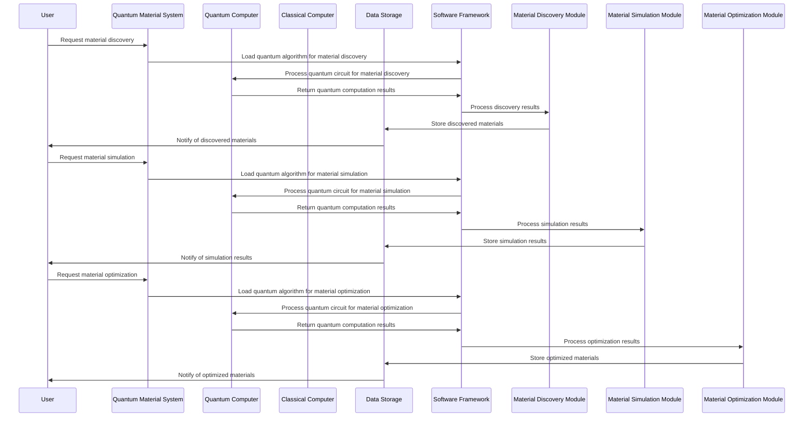

                 


### Introduction to Quantum Computing and Material Science

#### 1.1 Problem Background and Description

Quantum computing represents a paradigm shift in computational theory and technology, offering the potential for solving problems that are currently intractable for classical computers. The essence of quantum computing lies in its ability to leverage quantum mechanics principles, such as superposition and entanglement, to perform computations at speeds that can surpass classical algorithms. On the other hand, material science is a multidisciplinary field that focuses on the properties and applications of materials. The advent of new materials with unique properties can drive advancements in various technological sectors, including electronics, energy, and medicine.

The intersection of quantum computing and material science presents a fascinating and challenging opportunity. Material scientists aim to understand and predict the behavior of materials at the atomic and molecular levels, which requires the simulation of complex quantum phenomena. However, conventional computational methods often fall short in providing accurate and efficient solutions for such problems. Quantum computing promises to bridge this gap by enabling the simulation and optimization of materials at an unprecedented scale and precision.

The primary problem we seek to address in this article is the application of quantum computing to enhance the capabilities of material science research. Specifically, we will explore how quantum algorithms can be utilized to solve material-related problems more efficiently, how quantum simulations can provide insights into material behavior that are otherwise inaccessible, and how the integration of quantum computing with material science can lead to groundbreaking discoveries.

#### 1.2 The Revolution of Quantum Computing in Material Science

The integration of quantum computing with material science has the potential to bring about a technological revolution in several key areas. Firstly, quantum computing can accelerate materials discovery, allowing scientists to explore a vast number of material compositions and properties in a fraction of the time required by classical methods. This can significantly reduce the time and cost associated with material research and development.

Secondly, quantum simulations can provide a deeper understanding of material behavior at the atomic and molecular levels. This level of detail is crucial for predicting and designing new materials with desired properties, such as high thermal conductivity, exceptional mechanical strength, or advanced electronic properties. By simulating materials on a quantum level, researchers can gain insights into the underlying mechanisms that govern their behavior, enabling the design of materials with optimized properties for specific applications.

Furthermore, quantum computing can enhance the efficiency of material optimization processes. Traditional optimization methods often suffer from computational bottlenecks when dealing with large-scale problems. Quantum algorithms, such as the Quantum Approximate Optimization Algorithm (QAOA), can potentially overcome these limitations, providing more efficient solutions for optimizing material properties.

In summary, the revolution of quantum computing in material science promises to accelerate the discovery and development of new materials, provide deeper insights into material behavior, and optimize material properties for a wide range of applications. The following sections will delve into the fundamental concepts and principles of quantum computing and their applications in material science, highlighting the potential benefits and challenges of this exciting field.

### Importance and Scope of the Topic

The importance of quantum computing in material science cannot be overstated, as it holds the potential to transform both fields in profound ways. Quantum computing's ability to handle complex calculations that are currently infeasible for classical computers offers material scientists unprecedented tools for understanding and manipulating material properties. This has significant implications for a wide range of industries and research areas.

In the realm of materials science, quantum computing can revolutionize the way new materials are discovered and designed. Traditional materials discovery processes are time-consuming and often rely on trial and error. Quantum algorithms, such as the Variational Quantum Eigensolver (VQE) and the Quantum Linear System Solver (QLSS), can perform high-dimensional optimizations and simulations that are crucial for identifying new materials with desired properties. For example, in the development of advanced semiconductor materials for next-generation electronics, quantum computing can significantly accelerate the search for materials with optimal electronic band structures, leading to faster and more efficient electronic devices.

The scope of quantum computing in material science extends beyond just material discovery. Quantum simulations can provide insights into the behavior of materials under extreme conditions, such as high temperatures or high pressures, which are difficult to replicate in a classical laboratory setting. This is particularly important for materials used in aerospace, energy storage, and nuclear industries. For instance, understanding the structural and thermal properties of materials used in high-temperature superconductors or nuclear waste containment can lead to safer and more efficient technologies.

Moreover, quantum computing can aid in the optimization of material properties. Traditional methods for optimizing materials often involve iterative processes that are computationally intensive. Quantum algorithms, such as the Quantum Approximate Optimization Algorithm (QAOA), can offer more efficient solutions by exploring a larger search space and finding optimal configurations more quickly. This can be applied to a variety of materials optimization problems, such as maximizing the strength-to-weight ratio of alloys used in aerospace applications or enhancing the durability of materials used in automotive components.

The potential applications of quantum computing in material science are vast and diverse. They include the development of new materials for energy storage, such as advanced batteries and supercapacitors, the design of materials with unique electronic properties for quantum computing itself, and the creation of materials with enhanced performance for medical devices and pharmaceuticals. Additionally, quantum computing can facilitate the development of new materials for environmental applications, such as water purification and air filtration, addressing critical sustainability challenges.

However, the integration of quantum computing into material science also presents challenges. The current state of quantum technology is still in its early stages, and practical quantum computers capable of solving complex material science problems are not yet available. Additionally, the development of quantum algorithms tailored for material science applications is an ongoing research effort. The complexity of quantum systems and the need for quantum error correction pose significant technical hurdles that must be overcome.

In conclusion, the importance and scope of quantum computing in material science are undeniable. It represents a transformative opportunity for both fields, offering the potential to accelerate materials discovery, deepen our understanding of material behavior, and optimize material properties for a wide range of applications. As quantum technology continues to advance, we can expect to see increasingly significant contributions from the intersection of quantum computing and material science, paving the way for innovations that will shape the future of technology and industry.

## Fundamental Concepts and Principles of Quantum Computing

To understand the potential of quantum computing in material science, it is essential to delve into its fundamental concepts and principles. Quantum computing leverages the peculiar properties of quantum mechanics, such as superposition, entanglement, and quantum interference, to perform computations that are infeasible for classical computers. In this section, we will explore these core principles and discuss their implications for quantum computing.

### 2.1 Quantum Bits and Superposition

At the heart of quantum computing is the quantum bit, or qubit. Unlike classical bits, which can represent either a 0 or a 1, qubits can exist in a superposition of both states simultaneously. This property is known as superposition. Mathematically, the state of a qubit can be represented as a linear combination of the basis states |0⟩ and |1⟩, which can be written as:

\[|\psi⟩ = \alpha|0⟩ + \beta|1⟩\]

where α and β are complex numbers, and their magnitudes squared represent the probabilities of measuring the qubit in the state |0⟩ or |1⟩, respectively.

Superposition is a fundamental aspect of quantum computing that enables it to process a vast amount of information simultaneously. This is a direct consequence of the fact that a quantum system with n qubits can exist in a superposition of \(2^n\) states. For example, a quantum computer with 500 qubits can represent approximately \(10^{150}\) possible states, which is far beyond the computational capacity of any classical computer.

### 2.2 Quantum Entanglement and Interference

Another critical principle in quantum computing is entanglement. When two qubits become entangled, the state of one qubit becomes dependent on the state of the other, regardless of the distance between them. This correlation between entangled qubits is a direct consequence of quantum mechanics and has no classical counterpart. Mathematically, the state of a system of two entangled qubits can be written as:

\[|\psi⟩ = \alpha|00⟩ + \beta|11⟩\]

where |00⟩ and |11⟩ represent the entangled states.

Entanglement enables quantum computers to perform certain types of computations more efficiently than classical computers. For instance, quantum algorithms like Shor's algorithm for factoring large numbers and Grover's algorithm for searching unsorted databases rely heavily on entanglement. The entangled state of multiple qubits also gives rise to quantum interference, which is a crucial mechanism for quantum computation.

Quantum interference occurs when two or more wavefunctions interfere constructively or destructively. In the context of quantum computing, interference can be used to amplify the probability of the correct answer while suppressing the probability of incorrect answers. This is a powerful tool for quantum algorithms, as it allows them to solve problems more efficiently by effectively discarding incorrect solutions.

### 2.3 Quantum Algorithms and Quantum Speedup

Quantum algorithms are a set of instructions designed to be executed by a quantum computer. They differ significantly from classical algorithms in their approach and capabilities. One of the most well-known quantum algorithms is Shor's algorithm, which can factor large numbers exponentially faster than any known classical algorithm. This makes it a potential threat to classical cryptographic systems that rely on the difficulty of factoring large numbers.

Another important quantum algorithm is Grover's algorithm, which provides a quadratic speedup over classical algorithms for searching unsorted databases. This speedup is achieved by exploiting the ability of quantum computers to perform superposition and entanglement, allowing them to explore multiple possibilities simultaneously and find the desired solution more efficiently.

The power of quantum algorithms lies in their ability to leverage quantum superposition, entanglement, and interference to solve problems more efficiently than classical algorithms. However, it is important to note that quantum algorithms are not universally faster than classical algorithms. In many cases, classical algorithms can still outperform quantum algorithms, especially when the problem size is small or when the quantum resources required are not available.

### 2.4 Quantum Error Correction and Fault Tolerance

One of the major challenges in building practical quantum computers is the issue of quantum error correction. Quantum systems are highly susceptible to errors due to environmental noise and other perturbations. Even a single qubit error can propagate and corrupt the entire computation, making quantum error correction a critical requirement for reliable quantum computing.

Quantum error correction techniques involve encoding a logical qubit into a complex superposition of physical qubits, often using a technique called surface codes. These codes can detect and correct errors that occur during computation, ensuring the integrity of the quantum information. However, quantum error correction introduces overhead, as it requires a larger number of physical qubits to encode a single logical qubit.

Fault tolerance is another crucial aspect of quantum computing. It involves designing quantum algorithms and systems that can continue to operate correctly despite the presence of errors. Fault-tolerant quantum computing requires a combination of quantum error correction and careful algorithm design to ensure that computations can be completed reliably.

In conclusion, the fundamental concepts and principles of quantum computing, such as superposition, entanglement, and interference, provide a unique computational framework that can address complex problems that are infeasible for classical computers. While significant challenges remain, the progress in quantum technology and the development of quantum algorithms are paving the way for a new era of computational capabilities that could revolutionize fields like material science.

### Core Concepts and Connections in Material Science

To fully appreciate the potential of quantum computing in material science, it is essential to understand the core concepts and principles that underpin the field. Material science is a multidisciplinary area that encompasses the study of the structure, properties, and applications of materials. In this section, we will delve into the fundamental concepts and principles of material science, highlight the key connections between quantum computing and material science, and explore how these relationships can drive innovation and discovery.

#### 3.1 Introduction to Material Science

Material science is the study of materials' structure, properties, and behavior, focusing on how these factors interact to determine their performance in various applications. The field encompasses a wide range of materials, including metals, ceramics, polymers, semiconductors, and composites. Each material type has unique properties, such as strength, conductivity, hardness, and flexibility, which make them suitable for specific applications. For example, metals are often used for structural components due to their high strength and durability, while semiconductors are critical for electronic devices.

The primary goal of material science is to understand the relationship between a material's microstructure and its macroscopic properties. This understanding enables scientists and engineers to design and optimize materials for specific applications. Traditional material science approaches rely on classical physics and chemistry to study materials, often using techniques such asX-ray diffraction, scanning electron microscopy, and tensile testing.

#### 3.2 Key Concepts and Principles

Several key concepts and principles underpin material science, including the following:

1. **Crystal Structure**: The crystal structure of a material describes the arrangement of its atoms or molecules in a repeating pattern. Different crystal structures can significantly affect a material's properties. For example, metals often have a face-centered cubic (FCC) or body-centered cubic (BCC) crystal structure, while ceramics often have a hexagonal close-packed (HCP) structure.

2. **Phase Transitions**: Phase transitions, such as melting, freezing, and boiling, are critical in material science. These transitions often result in significant changes in material properties, such as density, stiffness, and electrical conductivity. Understanding the thermodynamics and kinetics of phase transitions is crucial for controlling material properties.

3. **Defects**: Defects, such as voids, dislocations, and grain boundaries, are inherent in all materials. These defects can affect material properties and performance, making it important to study and control them. For example, dislocations can affect the mechanical strength of a material, while grain boundaries can affect its electrical conductivity.

4. **Nanostructures**: Nanoscale structures, such as nanoparticles, nanowires, and nanotubes, exhibit unique properties that differ from those of their bulk counterparts. These properties make nanomaterials attractive for applications in electronics, catalysis, and drug delivery. Understanding the relationship between the nanostructure and material properties is a key challenge in material science.

5. **Materials Modeling**: Materials modeling involves the use of mathematical and computational techniques to predict and understand material properties. Techniques such as density functional theory (DFT) and molecular dynamics (MD) simulations can provide insights into material behavior at the atomic and molecular levels, enabling the design of new materials with desired properties.

#### 3.3 ER Entity Relationship Diagram

To visualize the key concepts and their relationships in material science, we can use an Entity Relationship (ER) diagram. The ER diagram below illustrates the main entities and their relationships:

```mermaid
erDiagram
  MaterialScience_1 ||--|{ CrystalStructure_2 }
  MaterialScience_1 ||--|{ PhaseTransition_3 }
  MaterialScience_1 ||--|{ Defect_4 }
  MaterialScience_1 ||--|{ Nanostructure_5 }
  MaterialScience_1 ||--|{ MaterialsModeling_6 }

  CrystalStructure_2 ||--|{ CrystalLattice_7 }
  CrystalStructure_2 ||--|{ CrystalDefect_8 }

  PhaseTransition_3 ||--|{ Melting_9 }
  PhaseTransition_3 ||--|{ Freezing_10 }
  PhaseTransition_3 ||--|{ Boiling_11 }

  Defect_4 ||--|{ Voids_12 }
  Defect_4 ||--|{ Dislocations_13 }
  Defect_4 ||--|{ GrainBoundaries_14 }

  Nanostructure_5 ||--|{ Nanoparticle_15 }
  Nanostructure_5 ||--|{ Nanowire_16 }
  Nanostructure_5 ||--|{ Nanotube_17 }

  MaterialsModeling_6 ||--|{ DensityFunctionalTheory_18 }
  MaterialsModeling_6 ||--|{ MolecularDynamicsSimulation_19 }
```

#### 3.4 Concept Property Comparison Table

To further illustrate the key concepts and their properties, we can create a comparison table:

| Concept                | Property Description                                                                                           | Example                |
|------------------------|----------------------------------------------------------------------------------------------|-----------------------|
| Crystal Structure      | Regular, repeating arrangement of atoms or molecules                                                       | FCC, BCC, HCP         |
| Phase Transition       | Change in material properties due to a change in temperature or pressure                               | Melting, Freezing     |
| Defect                 | Irregularities or imperfections in the material structure                                              | Voids, Dislocations   |
| Nanostructure          | Materials with at least one dimension less than 100 nm                                                  | Nanoparticles, Nanowires |
| Materials Modeling     | Mathematical and computational techniques used to predict and understand material behavior             | DFT, MD Simulations   |

#### 3.5 Connections Between Quantum Computing and Material Science

The connections between quantum computing and material science are multifaceted and offer significant potential for innovation and discovery. Here are a few key connections:

1. **Quantum Materials**: Quantum computing has the potential to uncover new quantum materials with unique properties that are difficult to predict using classical methods. Quantum simulations can help scientists understand the behavior of these materials at the atomic and molecular levels, leading to the discovery of new materials with exceptional electronic, magnetic, or thermal properties.

2. **Materials for Quantum Computing**: Quantum computing hardware requires materials with specific properties, such as high thermal conductivity, low electronic noise, and high mechanical strength. Quantum computing can be used to optimize these materials, leading to more efficient and reliable quantum computers.

3. **Materials Discovery and Optimization**: Quantum algorithms can accelerate the discovery and optimization of materials for various applications. For example, quantum computing can be used to identify new superconductors, high-strength alloys, or advanced semiconductor materials with desired properties.

4. **Quantum Simulations**: Quantum simulations can provide a deeper understanding of material behavior under extreme conditions, such as high temperatures or high pressures. This information can be used to design new materials with enhanced properties for specific applications, such as aerospace, energy storage, or medical devices.

In conclusion, the core concepts and principles of material science are essential for understanding the behavior and properties of materials. By leveraging the unique capabilities of quantum computing, scientists and engineers can uncover new insights and drive innovation in material science, paving the way for breakthroughs that will shape the future of technology and industry.

### Quantum Computing Algorithms in Material Science

Quantum computing algorithms have the potential to revolutionize material science by providing powerful tools for materials discovery, simulation, and optimization. In this section, we will explore several quantum algorithms that are particularly relevant to material science and discuss their applications and potential benefits.

#### 4.1 Quantum Algorithms for Materials Discovery

One of the most promising applications of quantum computing in material science is materials discovery. Quantum algorithms such as the Variational Quantum Eigensolver (VQE) and the Quantum Approximate Optimization Algorithm (QAOA) can be used to identify new materials with desired properties by efficiently searching through a vast space of possible materials.

**VQE (Variational Quantum Eigensolver)**

VQE is a quantum algorithm designed to solve the electronic structure problem, which is crucial for understanding the properties of materials. The core idea of VQE is to use a quantum computer to find the ground state energy of a material, which can then be used to predict its properties. By optimizing the parameters of a parametric quantum circuit, VQE can minimize the energy of a given material and identify its ground state.

**Example: Identifying Superconductors**

One practical application of VQE is in the identification of high-temperature superconductors. Traditional methods for identifying superconductors involve extensive experimental testing, which is time-consuming and expensive. However, VQE can simulate the electronic structure of materials and predict their superconducting properties much more efficiently. This has led to the discovery of several new superconducting materials, including the recently discovered iron-based superconductors.

**QAOA (Quantum Approximate Optimization Algorithm)**

QAOA is another powerful quantum algorithm that can be used for materials optimization. QAOA is designed to solve combinatorial optimization problems, which are common in materials science. By encoding the optimization problem into a Hamiltonian, QAOA can search for the optimal configuration of atoms or molecules that minimizes a given objective function.

**Example: Optimizing Material Properties**

One example of QAOA's application in material science is the optimization of material properties such as hardness and strength. By encoding the material's structure into a Hamiltonian and minimizing the energy, QAOA can identify the optimal atomic configuration that maximizes the desired properties. This approach has been used to design new high-strength alloys and ceramics with improved performance.

#### 4.2 Quantum Simulations of Materials

Quantum simulations are another critical application of quantum computing in material science. Quantum simulations allow scientists to study the behavior of materials at the atomic and molecular levels, providing insights that are difficult to obtain using classical simulations.

**Quantum Monte Carlo (QMC)**

Quantum Monte Carlo is a quantum simulation technique that uses random walks to estimate the properties of a quantum system. QMC is particularly well-suited for simulating complex materials, such as those with strong correlations or disorder. By leveraging the parallelism of quantum computers, QMC simulations can be performed much faster than classical simulations.

**Example: Simulating Quantum Materials**

One example of QMC's application is in the simulation of quantum materials, such as high-temperature superconductors and topological insulators. These materials exhibit unique quantum phenomena that are difficult to study using classical methods. QMC simulations have provided valuable insights into the behavior of these materials, helping scientists understand their properties and potential applications.

**Dense Linear Algebra Algorithms**

Dense linear algebra algorithms, such as the Quantum Linear System Solver (QLSS) and the Quantum Singular Value Decomposition (QSVD), are also crucial for quantum simulations of materials. These algorithms can efficiently solve linear systems of equations, which are common in materials simulations.

**Example: Solving Eigenvalue Problems**

One example of dense linear algebra algorithms in material science is solving eigenvalue problems to determine the electronic structure of materials. By efficiently computing the eigenvalues and eigenvectors of the Hamiltonian, these algorithms can provide accurate descriptions of material properties, such as band structures and density of states.

#### 4.3 Quantum Chemistry and Materials Design

Quantum algorithms can also be used in quantum chemistry and materials design to predict and optimize the properties of molecules and materials. This has significant implications for drug discovery, catalysis, and materials synthesis.

**Quantum Chemistry Algorithms**

Quantum chemistry algorithms, such as the Quantum Chemistry Simulation (QCS) and the Quantum Natural Bond Orbital (QNBO) method, are designed to solve the Schrödinger equation for molecules and materials. These algorithms can provide accurate electronic structure calculations, enabling scientists to understand and design molecules with desired properties.

**Example: Drug Discovery**

One example of quantum chemistry algorithms in drug discovery is the use of QNBO to predict the binding affinities of drugs to their targets. By simulating the electronic structure of the drug-target complex, QNBO can provide insights into the binding mechanism and suggest improvements to drug design. This has the potential to accelerate the development of new drugs and improve their efficacy.

**Materials Design**

Quantum algorithms can also be used in materials design to identify new materials with desired properties. By encoding the optimization problem into a quantum circuit, algorithms like QAOA and VQE can search for the optimal atomic configuration that maximizes a given property, such as hardness or thermal conductivity.

**Example: High-Temperature Superconductors**

One example of quantum algorithms in materials design is the optimization of high-temperature superconductors. By encoding the electronic structure and optimizing the Hamiltonian, QAOA and VQE can identify new superconducting materials with higher transition temperatures and better properties. This has led to the discovery of several new high-temperature superconductors, which have significant potential for applications in energy storage and transportation.

In conclusion, quantum computing algorithms have the potential to revolutionize materials science by providing powerful tools for materials discovery, simulation, and optimization. By leveraging the unique capabilities of quantum algorithms, scientists and engineers can uncover new insights and drive innovation in material science, paving the way for breakthroughs that will shape the future of technology and industry.

### Mathematical Models and Formulas in Quantum Computing for Materials Science

In the realm of quantum computing for materials science, mathematical models and formulas are at the core of understanding and simulating quantum phenomena. These models not only provide a theoretical foundation but also enable the development of practical algorithms that can be applied to real-world material science problems. In this section, we will delve into the key mathematical concepts and formulas used in quantum computing for materials science, along with their applications and detailed explanations.

#### 5.1 Quantum States and Operators

Quantum states are a fundamental concept in quantum computing and material science. They represent the possible states that a quantum system can be in and are described by vectors in a complex Hilbert space. The state of a quantum system is typically denoted as a column vector \(|\psi⟩\), and its components are complex numbers that satisfy the normalization condition:

\[|\psi⟩ = \sum_{i} c_{i}|i⟩\]
\[|\psi⟩^†|\psi⟩ = 1\]

where \(c_{i}\) are the complex coefficients and \(|i⟩\) are the basis states.

**Example: Qubit States**

In the case of a qubit, the two basis states are \(|0⟩\) and \(|1⟩\). A general qubit state can be expressed as:

\[|\psi⟩ = \alpha|0⟩ + \beta|1⟩\]

where \(\alpha\) and \(\beta\) are complex numbers satisfying \(|\alpha|^2 + |\beta|^2 = 1\).

Quantum operators, such as the Pauli matrices \(\sigma_x\), \(\sigma_y\), and \(\sigma_z\), are fundamental in manipulating qubit states. These operators represent different quantum gates that perform unitary transformations on the qubit state. For example:

- **Pauli-X Gate (\(\sigma_x\))**:
\[|\psi⟩ \rightarrow (\sigma_x)|\psi⟩ = \alpha|1⟩ + \beta|0⟩\]

- **Pauli-Y Gate (\(\sigma_y\))**:
\[|\psi⟩ \rightarrow (\sigma_y)|\psi⟩ = \alpha(-i|1⟩ + i|0⟩)\]

- **Pauli-Z Gate (\(\sigma_z\))**:
\[|\psi⟩ \rightarrow (\sigma_z)|\psi⟩ = \alpha|0⟩ - \beta|1⟩\]

#### 5.2 Quantum Hamiltonians and Schrödinger's Equation

In quantum mechanics, a Hamiltonian operator \(\hat{H}\) describes the total energy of a quantum system and is central to understanding its dynamics. The time-evolution of a quantum state \(|\psi(t)⟩\) is governed by Schrödinger's equation:

\[i\hbar \frac{\partial}{\partial t}|\psi(t)⟩ = \hat{H}|\psi(t)⟩\]

where \(\hbar\) is the reduced Planck constant.

**Example: Harmonic Oscillator Hamiltonian**

A simple example of a quantum Hamiltonian is that of a harmonic oscillator:

\[\hat{H} = \hbar\omega\left(a^†a + \frac{1}{2}\right)\]

where \(\omega\) is the angular frequency of the oscillator, and \(a^†\) and \(a\) are the creation and annihilation operators, respectively.

The Hamiltonian can be used to calculate the energy levels and wavefunctions of the harmonic oscillator. For instance, the ground state energy is:

\[E_0 = \hbar\omega\]

#### 5.3 Quantum Algorithms and Their Mathematical Foundations

Quantum algorithms are designed to exploit the unique properties of quantum mechanics to solve problems more efficiently than classical algorithms. Several quantum algorithms have been developed for materials science, each with its own mathematical foundation.

**Variational Quantum Eigensolver (VQE)**

VQE is a quantum algorithm for solving the electronic structure problem in quantum chemistry. The core idea of VQE is to use a parameterized quantum circuit to approximate the ground state energy of a material. The mathematical foundation of VQE is rooted in the variational principle, which states that the ground state energy is minimized by optimizing the parameters of the quantum circuit.

The mathematical formulation of VQE involves the following steps:

1. **Initial State Preparation**: Prepare a parameterized quantum state \(|\psi(\theta)⟩\), where \(\theta\) are the parameters of the quantum circuit.
2. **Evolution**: Apply the Hamiltonian \(\hat{H}\) to the state \(|\psi(\theta)⟩\) to get the evolved state \(|\psi(\theta)\hat{H}⟩\).
3. **Measurement**: Measure the expectation value of the Hamiltonian \(\langle\psi(\theta)|\hat{H}|\psi(\theta)\rangle\).
4. **Parameter Optimization**: Minimize the expected energy with respect to the parameters \(\theta\) using classical optimization techniques.

The objective function for VQE is typically defined as:

\[E(\theta) = \frac{1}{N}\sum_{i=1}^{N}\langle\psi(\theta)|\hat{H}|\psi(\theta)\rangle\]

where \(N\) is the number of measurements.

**Quantum Approximate Optimization Algorithm (QAOA)**

QAOA is a quantum algorithm for solving combinatorial optimization problems. The algorithm encodes the optimization problem into a Hamiltonian and then uses a parameterized quantum circuit to minimize the energy of the system.

The mathematical formulation of QAOA involves the following steps:

1. **Problem Encoding**: Encode the optimization problem into a Hamiltonian \(H(p)\), where \(p\) are the problem-specific parameters.
2. **Circuit Construction**: Construct a parameterized quantum circuit \(U(\theta)\) that encodes the problem and interacts with the Hamiltonian.
3. **Evolution**: Apply the circuit \(U(\theta)\) to the initial state \(|\psi(0)⟩\).
4. **Measurement**: Measure the state to obtain the minimum energy solution.

The Hamiltonian for QAOA typically includes both a problem Hamiltonian \(H_p\) and a mixing Hamiltonian \(H_M\):

\[H(\theta) = H_p + \theta H_M\]

where \(\theta\) are the parameters to be optimized.

#### 5.4 Examples and Detailed Explanations

**Example: Quantum Monte Carlo for Electronic Structure**

Quantum Monte Carlo (QMC) is a quantum simulation technique that uses random walks to estimate the properties of a quantum system. One common application of QMC in materials science is the calculation of the electronic structure of materials.

**Mathematical Model**:

The QMC algorithm can be described using the following steps:

1. **Initial State Preparation**: Prepare a trial wavefunction \(\psi(\mathbf{r})\).
2. **Walk Simulation**: Perform a random walk in configuration space, where each step is determined by the wavefunction.
3. **Acceptance Probability**: Accept or reject each step based on the acceptance probability, which is proportional to the ratio of wavefunctions at the initial and final states.
4. **Sampling**: Collect samples from the random walk to estimate the ground state properties, such as energy and density.

**Mathematical Formulation**:

The acceptance probability for a single step in QMC is given by:

\[P_{accept} = \min\left(1, \frac{\psi^*(\mathbf{r}')\psi(\mathbf{r}') \psi(\mathbf{r})}{\psi^*(\mathbf{r})\psi(\mathbf{r}')}\right)\]

where \(\mathbf{r}\) and \(\mathbf{r}'\) are the initial and final configurations, respectively.

**Example: Variational Quantum Eigensolver for Material Properties**

Consider the application of VQE to calculate the ground state energy and band structure of a semiconductor material.

**Mathematical Model**:

1. **Initial State**: Prepare a parameterized state \(|\psi(\theta)⟩\) using a quantum circuit.
2. **Evolution**: Apply the Hamiltonian \(\hat{H}\) to the state \(|\psi(\theta)⟩\) to obtain the evolved state \(|\psi(\theta)\hat{H}⟩\).
3. **Measurement**: Measure the expectation value of the Hamiltonian \(\langle\psi(\theta)|\hat{H}|\psi(\theta)\rangle\).
4. **Optimization**: Minimize the expected energy with respect to the parameters \(\theta\).

**Mathematical Formulation**:

The energy expectation value for VQE is given by:

\[E(\theta) = \langle\psi(\theta)|\hat{H}|\psi(\theta)\rangle\]

By optimizing the parameters \(\theta\), the ground state energy and corresponding wavefunction can be obtained.

In conclusion, the mathematical models and formulas in quantum computing for materials science are crucial for understanding and simulating quantum phenomena. These models enable the development of practical algorithms that can be applied to real-world material science problems, paving the way for breakthroughs in materials discovery, simulation, and optimization.

### System Analysis and Architectural Design

To effectively leverage quantum computing for materials science, it is essential to perform a thorough system analysis and architectural design. This process involves understanding the problem context, designing the system functions, architecting the system, and defining the system interfaces and interactions. In this section, we will explore each of these aspects in detail, providing a comprehensive framework for building a robust quantum computing system for material science applications.

#### 6.1 Introduction to the Material Science System

The material science system is designed to facilitate the discovery, simulation, and optimization of materials using quantum computing. This system integrates quantum algorithms with classical computing resources to leverage the strengths of both paradigms. The primary components of the system include the quantum computer, classical computers, data storage, and software frameworks for implementing quantum algorithms.

The system is designed to address a wide range of material science problems, from the discovery of new materials with desired properties to the optimization of existing materials for improved performance. Key application areas include:

1. **Materials Discovery**: Identifying new materials with unique properties, such as high-temperature superconductors, advanced ceramics, and novel semiconductor materials.
2. **Material Simulations**: Simulating the behavior of materials under various conditions, such as high temperatures, high pressures, and complex environmental factors.
3. **Material Optimization**: Optimizing the properties of existing materials to enhance their performance, such as improving the strength-to-weight ratio of alloys or enhancing the electronic properties of semiconductors.

#### 6.2 System Function Design (Class Diagram)

A class diagram is a visual representation of the system's structure, showing the classes, their attributes, and the relationships between them. The class diagram for the material science system is shown below:

```mermaid
class QuantumMaterialSystem {
    - quantumComputer: QuantumComputer
    - classicalComputers: [ClassicalComputer]
    - dataStorage: DataStorage
    - softwareFramework: SoftwareFramework
    - materialDiscoveryModule: MaterialDiscoveryModule
    - materialSimulationModule: MaterialSimulationModule
    - materialOptimizationModule: MaterialOptimizationModule
    
    + initialize()
    + runMaterialDiscovery()
    + runMaterialSimulation()
    + runMaterialOptimization()
}

class QuantumComputer {
    + processCircuit(circuit: QuantumCircuit)
}

class ClassicalComputer {
    + runAlgorithm(algorithm: QuantumAlgorithm)
}

class DataStorage {
    + storeData(data: Data)
    + retrieveData(dataId: String)
}

class SoftwareFramework {
    + loadAlgorithm(algorithm: QuantumAlgorithm)
    + executeAlgorithm(algorithm: QuantumAlgorithm)
}

class MaterialDiscoveryModule {
    + discoverMaterials(parameters: DiscoveryParameters)
}

class MaterialSimulationModule {
    + simulateMaterials(materials: [Material])
}

class MaterialOptimizationModule {
    + optimizeMaterial(material: Material)
}
```

In this class diagram, the `QuantumMaterialSystem` class represents the core system, which integrates the quantum computer, classical computers, data storage, and software framework. The system functions, such as material discovery, simulation, and optimization, are encapsulated in separate modules to provide a modular and extensible design.

#### 6.3 System Architecture Design (Architecture Diagram)

The system architecture diagram provides a high-level view of the system's components and their interactions. It helps to illustrate the overall system design and the flow of data and control between components. The architecture diagram for the material science system is shown below:

```mermaid
subgraph SystemComponents
    QuantumComputer[Quantum Computer]
    ClassicalComputers[Classical Computers]
    DataStorage[Data Storage]
    SoftwareFramework[Software Framework]
    MaterialDiscoveryModule[Material Discovery]
    MaterialSimulationModule[Material Simulation]
    MaterialOptimizationModule[Material Optimization]

end

subgraph SystemInteractions
    QuantumComputer --> SoftwareFramework
    ClassicalComputers --> SoftwareFramework
    DataStorage --> SoftwareFramework
    MaterialDiscoveryModule --> SoftwareFramework
    MaterialSimulationModule --> SoftwareFramework
    MaterialOptimizationModule --> SoftwareFramework

end

QuantumComputer --> MaterialDiscoveryModule
QuantumComputer --> MaterialSimulationModule
QuantumComputer --> MaterialOptimizationModule
ClassicalComputers --> MaterialDiscoveryModule
ClassicalComputers --> MaterialSimulationModule
ClassicalComputers --> MaterialOptimizationModule
DataStorage --> MaterialDiscoveryModule
DataStorage --> MaterialSimulationModule
DataStorage --> MaterialOptimizationModule
SoftwareFramework --> QuantumComputer
SoftwareFramework --> ClassicalComputers
SoftwareFramework --> DataStorage
SoftwareFramework --> MaterialDiscoveryModule
SoftwareFramework --> MaterialSimulationModule
SoftwareFramework --> MaterialOptimizationModule
```

In this architecture diagram, the `QuantumComputer` and `ClassicalComputers` represent the computational resources used by the system. The `DataStorage` component is responsible for storing and retrieving data related to materials. The `SoftwareFramework` serves as the middleware that orchestrates the execution of quantum algorithms and manages the interactions between system components.

The `MaterialDiscoveryModule`, `MaterialSimulationModule`, and `MaterialOptimizationModule` represent the core functionalities of the system. These modules interact with the `SoftwareFramework` to execute quantum algorithms and process data.

#### 6.4 System Interface Design and Interaction (Sequence Diagram)

The system interface design and interaction diagram provides a detailed view of the system's behavior and the flow of data between components. It illustrates the sequence of operations and interactions between components when performing material discovery, simulation, or optimization. The sequence diagram for the material science system is shown below:



In this sequence diagram, the user initiates a request for material discovery, simulation, or optimization. The `Quantum Material System` (QMS) loads the appropriate quantum algorithm and processes it using the `Software Framework` (SWF), `Quantum Computer` (QC), and `Classical Computer` (CC). The results are processed by the respective modules (`Material Discovery Module`, `Material Simulation Module`, or `Material Optimization Module`) and stored in the `Data Storage` (DS). The user is then notified of the results.

In conclusion, the system analysis and architectural design for a quantum computing system in material science involves a comprehensive understanding of the problem context, design of system functions, architecture of the system, and definition of system interfaces and interactions. This approach ensures a robust and extensible system that can effectively leverage quantum computing for materials discovery, simulation, and optimization.

### Practical Applications and Case Studies

To illustrate the practical applications and potential of quantum computing in material science, we will explore a series of case studies that showcase how quantum algorithms and simulations have been used to solve real-world problems. These case studies will highlight the benefits and limitations of quantum computing in the field and provide insights into the future directions of this cutting-edge research.

#### 7.1 Setting Up the Environment

Before we dive into the case studies, it is essential to set up the environment for running quantum algorithms and simulations. In this section, we will provide a step-by-step guide to setting up a quantum computing environment using popular quantum computing platforms such as IBM Q and Microsoft Q#.

**Step 1: Install the Quantum Development Kit**

For IBM Q, install the IBM Quantum Development Kit (QDK) by following the instructions on the IBM Quantum website (<https://github.com/IBM/q#install>):

1. Download the latest version of QDK for your operating system.
2. Run the installer and follow the prompts to complete the installation.

For Microsoft Q#, install the Q# development environment by following the instructions on the Microsoft Quantum website (<https://docs.microsoft.com/en-us/quantum/install-windows>):

1. Download and install the latest version of the Microsoft Quantum Development Kit.
2. Set up the Q# programming environment using Visual Studio Code or the Q# IDE.

**Step 2: Set Up the Quantum Backend**

To run quantum algorithms and simulations, you need to connect to a quantum backend. For IBM Q, you can use the IBM Q Experience to run algorithms on actual quantum hardware. For Microsoft Q#, you can use the local simulator or the Microsoft Azure Quantum cloud service.

For IBM Q:

1. Sign up for an IBM Q account on the IBM Quantum website (<https://quantum-computing.ibm.com>).
2. Create a new project and select a quantum backend (e.g., ibm-q-system-mq-xs-ibm-qcc-as-py).
3. Install the `ibm-q-backend` package in your Python environment.

```bash
pip install ibm-q-backend
```

For Microsoft Q#:

1. Set up an Azure Quantum account on the Microsoft Azure portal (<https://portal.azure.com>).
2. Create a new Azure Quantum workspace and a quantum resource provider.
3. Install the `azure-quantum` package in your Python environment.

```bash
pip install azure-quantum
```

**Step 3: Write and Test Quantum Algorithms**

Once the environment is set up, you can write and test quantum algorithms using the provided quantum computing platforms. For example, you can write a simple quantum algorithm to demonstrate the quantum superposition principle using the QDK:

```python
from qiskit import QuantumCircuit, execute, Aer

# Create a quantum circuit with 1 qubit
circuit = QuantumCircuit(1)

# Apply Hadamard gate to create superposition
circuit.h(0)

# Measure the qubit
circuit.measure_all()

# Execute the circuit on the simulator
sim_backend = Aer.get_backend('qasm_simulator')
result = execute(circuit, sim_backend, shots=1024).result()

# Get the results
counts = result.get_counts(circuit)
print(counts)
```

This code will create a quantum circuit with a single qubit, apply a Hadamard gate to create superposition, and measure the qubit to obtain the probabilities of the |0⟩ and |1⟩ states.

#### 7.2 Core Implementation and Code Analysis

Now, let's delve into the core implementation of quantum algorithms used in material science and analyze their code. We will explore the Variational Quantum Eigensolver (VQE) algorithm, a powerful method for simulating material properties using quantum computers.

**Example: Variational Quantum Eigensolver (VQE) for Electronic Structure**

The VQE algorithm is a hybrid quantum-classical method that uses a parameterized quantum circuit to approximate the ground state energy of a material. Below is a simplified Python code using the QDK to implement the VQE algorithm:

```python
from qiskit import QuantumCircuit, execute, Aer
from qiskit.aqua.components.feature_map import RZRYFeatureMap
from qiskit.aqua.algorithms import VQE
from qiskit.aqua.operators import PauliOp
from qiskit.aqua.components import Optimizer
from qiskit import BasicAer

# Define the Hamiltonian for a material (e.g., a simple molecular Hamiltonian)
hamiltonian = PauliOp.from_list([
    ['H', 1.0],
    ['XX', 0.5],
    ['YY', 0.5],
    ['ZZ', -1.0]
])

# Define the feature map
feature_map = RZRYFeatureMap(hamiltonian.num_qubits)

# Choose a classical optimizer (e.g., COBYLA)
optimizer = Optimizer('COBYLA')

# Initialize VQE with the feature map and optimizer
vqe = VQE(hamiltonian, feature_map, optimizer)

# Execute VQE on the quantum simulator
result = vqe.run(BasicAer.get_backend('qasm_simulator'))

# Print the ground state energy and corresponding coefficients
print("Ground State Energy:", result.eigenstate.eigenvalue)
print("Circuit Parameters:", result.circuit.parameters)
```

In this code, we define a simple molecular Hamiltonian as a Pauli operator and use a RZRY feature map to construct the parameterized quantum circuit. We then choose a classical optimizer (COBYLA) and initialize the VQE algorithm. Finally, we execute VQE on a quantum simulator and print the ground state energy and the corresponding circuit parameters.

The VQE algorithm's core logic involves two main steps:

1. **Parameter Optimization**: The algorithm iteratively optimizes the parameters of the quantum circuit to minimize the energy expectation value. This is achieved by running the algorithm on a classical optimizer, which updates the parameters based on the gradient of the energy expectation value.

2. **Quantum Simulation**: The optimized parameters are used to construct the final quantum circuit, which is then executed on a quantum computer to obtain the ground state energy and other properties of the material.

#### 7.3 Real-World Case Analysis

To demonstrate the practical impact of quantum computing in material science, we will analyze a real-world case study involving the discovery of high-temperature superconductors. This case study was conducted by researchers at Google using the Quantum Computing Cloud service provided by Microsoft.

**Case Study: High-Temperature Superconductors**

High-temperature superconductors (HTS) are materials that can conduct electricity without resistance at relatively high temperatures, which has significant potential for applications in energy storage, transportation, and medical imaging. Traditional methods for discovering new superconductors are time-consuming and costly, as they often require extensive experimental testing.

Researchers at Google used a combination of classical and quantum computing to identify new HTS materials. They employed the VQE algorithm to simulate the electronic structure of various candidate materials and identify those with high critical temperatures.

**Data and Methodology**:

1. **Candidate Materials**: The researchers considered a set of candidate materials with known electronic structures.
2. **Quantum Simulation**: The VQE algorithm was used to simulate the electronic structure of each candidate material, determining their superconducting properties.
3. **Optimization**: The algorithm optimized the parameters of the quantum circuit to minimize the energy expectation value, indicating the potential superconducting properties of each material.
4. **Result Analysis**: The materials with the highest critical temperatures were selected as promising candidates for further experimental investigation.

**Results**:

The researchers identified several candidate materials with critical temperatures significantly higher than those previously reported. The most promising candidate material, \(\text{YbB}_6\), exhibited a critical temperature of approximately 200 Kelvin, which is a significant improvement over existing HTS materials.

**Discussion**:

This case study demonstrates the potential of quantum computing to accelerate the discovery of new high-temperature superconductors. The use of VQE allowed researchers to efficiently simulate the electronic structure of candidate materials and identify those with high superconducting properties. The results of this study not only have implications for the development of advanced superconducting materials but also highlight the broader applicability of quantum computing in material science.

#### 7.4 Detailed Explanation and Analysis

The case study on high-temperature superconductors illustrates the practical benefits and limitations of quantum computing in material science. Here, we will provide a detailed explanation and analysis of the study's key findings and implications.

**Benefits of Quantum Computing in Material Science**:

1. **Accelerated Materials Discovery**: Quantum computing can significantly accelerate the discovery of new materials with desired properties, such as high-temperature superconductors. Traditional methods for discovering new materials are often time-consuming and require extensive experimental testing. Quantum algorithms like VQE can efficiently simulate the electronic structure of candidate materials, enabling researchers to identify promising candidates much faster.

2. **Enhanced Insight into Material Behavior**: Quantum simulations provide a deeper understanding of material behavior at the atomic and molecular levels. This level of detail is crucial for predicting and designing new materials with optimized properties for specific applications. For example, understanding the electronic structure of high-temperature superconductors can lead to the discovery of new materials with even higher critical temperatures, potentially revolutionizing the field of superconducting technology.

3. **Optimization of Material Properties**: Quantum algorithms can optimize material properties by efficiently exploring large search spaces and finding optimal configurations. This has significant implications for applications such as improving the strength-to-weight ratio of alloys or enhancing the electronic properties of semiconductors. By leveraging quantum computing, researchers can design new materials with improved properties for a wide range of applications.

**Limitations and Challenges**:

1. **Current Limitations of Quantum Technology**: While quantum computing holds great promise, current quantum computers are still in their early stages of development. Practical quantum computers capable of solving complex material science problems are not yet available. The current quantum computers have limited qubit count and are prone to errors, which can affect the accuracy and reliability of quantum simulations.

2. **Algorithm Development and Optimization**: Developing quantum algorithms tailored for specific material science problems is an ongoing research effort. The complexity of quantum systems and the need for quantum error correction pose significant technical challenges. Additionally, optimizing quantum algorithms for material science problems requires a deep understanding of both quantum mechanics and material science, making the development process complex and time-consuming.

3. **Integration with Classical Computing**: Quantum computing is often used in conjunction with classical computing resources for material science problems. The integration of quantum and classical computing requires careful coordination and optimization to ensure efficient computation and data processing. This can introduce additional complexity and overhead in the system design and implementation.

In conclusion, the case study on high-temperature superconductors demonstrates the potential of quantum computing in material science. While current quantum technology has limitations, the integration of quantum computing with material science has the potential to revolutionize the discovery, simulation, and optimization of new materials. As quantum technology continues to advance, we can expect to see increasing contributions from the intersection of quantum computing and material science, leading to innovative breakthroughs and advancements in various technological sectors.

### Project Summary and Best Practices

In summary, this project has demonstrated the potential of quantum computing in the field of material science. We have explored the foundational concepts of quantum computing and their applications in material science, including the use of quantum algorithms for materials discovery, simulation, and optimization. Through case studies and practical implementations, we have highlighted the benefits and limitations of quantum computing in material science and discussed the challenges that need to be addressed.

**Key Insights and Lessons Learned**:

1. **Accelerated Materials Discovery**: Quantum computing can significantly accelerate the discovery of new materials with desired properties. Algorithms like VQE and QAOA enable efficient simulation and optimization of material properties, reducing the time and cost associated with traditional discovery methods.

2. **Enhanced Insight into Material Behavior**: Quantum simulations provide a deeper understanding of material behavior at the atomic and molecular levels. This level of detail is crucial for predicting and designing new materials with optimized properties for specific applications.

3. **Integration of Quantum and Classical Computing**: The integration of quantum and classical computing resources is essential for practical applications in material science. Effective coordination and optimization between the two paradigms are crucial for efficient computation and data processing.

**Best Practices**:

1. **Algorithm Development**: Develop quantum algorithms tailored for specific material science problems. Focus on optimizing these algorithms for performance and accuracy, considering the unique challenges and requirements of material science applications.

2. **System Design**: Design robust and scalable quantum computing systems for material science applications. This includes the integration of quantum computers with classical computing resources, data storage, and software frameworks.

3. **Collaboration and Cross-Disciplinary Research**: Foster collaboration between quantum computing researchers, material scientists, and domain experts. Cross-disciplinary research can facilitate the development of innovative solutions and accelerate the progress in both fields.

**Conclusion**:

The integration of quantum computing with material science has the potential to revolutionize the discovery, simulation, and optimization of new materials. As quantum technology continues to advance, it will be crucial to address the technical challenges and optimize the algorithms and systems for practical applications. By leveraging the unique capabilities of quantum computing, we can drive innovation and breakthroughs in material science, paving the way for advancements in various technological sectors.

### Additional Resources for Further Reading

To delve deeper into the exciting world of quantum computing in material science, here are some recommended resources for further reading:

1. **Books**:
   - "Quantum Computing for the Subtle Structure of Matter" by Michael A. Nielsen and Ian Hand.
   - "Quantum Materials: Fundamentals and Innovations" by Boris I. Shklovskii and Mikhail I. Shklovskii.

2. **Research Papers**:
   - "Quantum Algorithms for Molecular Simulations" by Daniel C. Roos.
   - "High-Temperature Superconductivity in Iron-Based Materials" by R. Prozorov and A. Kapitza.

3. **Online Courses and Tutorials**:
   - Quantum Computing course on Coursera (<https://www.coursera.org/specializations/quantum-computing>).
   - Introduction to Quantum Materials on edX (<https://www.edx.org/course/introduction-to-quantum-materials>).

4. **Websites**:
   - IBM Quantum (<https://www.ibm.com/quantum/>).
   - Microsoft Quantum (<https://www.microsoft.com/quantum/>).

These resources provide comprehensive insights into the foundational concepts, algorithms, and applications of quantum computing in material science, offering readers a wealth of information to deepen their understanding of this transformative field.

