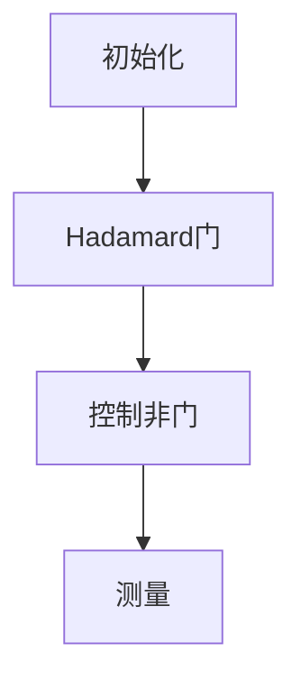

                 

## 量子计算在气候变化模拟中的潜在应用

关键词：量子计算、气候变化模拟、大气环流、海洋环流、陆地生态系统

摘要：随着全球气候变化问题日益严重，准确预测和模拟气候变化的趋势和影响已成为当务之急。传统的计算方法在处理复杂的气候系统时存在局限，而量子计算作为一种全新的计算范式，展现出巨大的潜力。本文将探讨量子计算在气候变化模拟中的应用，分析其在解决气候变化模拟中的挑战和机遇，并展望其未来发展方向。

## 第1章 引言

### 1.1 问题背景

气候变化是当今世界面临的重大环境挑战之一。随着温室气体浓度的持续增加，地球的气候系统正经历着显著的变化，导致极端天气事件的频率和强度增加，海平面上升，生物多样性减少等一系列问题。为了应对这些挑战，科学家们致力于通过气候模型来模拟气候变化，以预测未来的气候变化趋势，并制定相应的应对策略。

### 1.2 量子计算简介

量子计算是一种基于量子力学原理的计算方式，它利用量子比特（qubit）进行信息编码和处理，与传统的基于二进制位的经典计算有本质的不同。量子计算具有并行性、量子叠加和量子纠缠等特性，使得它在处理复杂问题时展现出巨大的计算潜力。

### 1.3 气候变化模拟的挑战

气候变化模拟面临诸多挑战，包括气候系统的复杂性、数据的不确定性和计算资源的限制等。传统的计算方法在处理这些复杂问题时存在效率低下和精度不足的问题。

### 1.4 量子计算在气候变化模拟中的应用前景

量子计算在气候变化模拟中具有巨大的应用潜力。通过量子计算，可以显著提高气候变化模拟的精度和效率，为制定有效的气候政策提供科学依据。

## 第2章 量子计算基础

### 2.1 量子比特与经典比特对比

量子比特（qubit）是量子计算的基本单元，与经典比特不同，它可以处于叠加状态，这意味着一个量子比特可以同时表示0和1。量子比特的这种叠加特性使得量子计算能够同时处理多个计算任务。

### 2.2 量子门与量子电路

量子门是操作量子比特的基本算子，类似于经典计算中的逻辑门。量子电路是由量子门组成的网络，用于实现量子计算的过程。

### 2.3 量子算法与经典算法的差异

量子算法利用量子比特的叠加和纠缠特性，能够在某些特定问题上显著超越经典算法。例如，量子快速傅里叶变换（QFT）在处理大规模数据时比经典算法更快。

### 2.4 量子计算的数学模型

量子计算基于线性代数和量子力学原理，其数学模型包括量子态的表示、量子门的作用和量子测量等。

## 第3章 气候变化模拟基础

### 3.1 气候变化模拟的挑战

气候变化模拟需要处理大量的数据和高维模型，这给计算带来了巨大的挑战。此外，气候系统的非线性和混沌特性使得模拟结果存在不确定性。

### 3.2 气候变化模拟的基本原理

气候变化模拟基于物理定律和数学模型，通过模拟地球大气、海洋和陆地的相互作用来预测未来的气候变化。

### 3.3 气候变化模拟的方法与工具

气候变化模拟采用多种方法，包括全球气候模型、区域气候模型和过程模型等。这些模型利用计算机模拟技术来模拟气候系统的动态变化。

### 3.4 量子计算在气候变化模拟中的应用

量子计算在气候变化模拟中的应用主要集中在加速计算过程和提高模拟精度。通过量子计算，可以处理更复杂的高维模型，并提高模拟的分辨率。

## 第4章 量子计算在气候变化模拟中的应用

### 4.1 量子算法在气候变化模拟中的应用

量子算法在气候变化模拟中的应用主要体现在提高计算效率和精度。例如，量子快速傅里叶变换（QFT）可以加速大气环流和海洋环流的模拟。

#### 4.1.1 量子计算模拟大气环流

量子计算可以用于模拟大气环流，提高对气候变化的预测能力。通过量子计算，可以处理更复杂的大气模型，并提高模拟的精度。

#### 4.1.2 量子计算模拟海洋环流

海洋是地球气候系统的重要组成部分，量子计算可以用于模拟海洋环流，帮助科学家更好地理解海洋对气候变化的响应。

#### 4.1.3 量子计算模拟陆地生态系统

量子计算可以用于模拟陆地生态系统的变化，如森林覆盖、土地使用变化等，为气候政策制定提供科学依据。

### 4.2 量子计算在气候变化预测中的应用

量子计算在气候变化预测中的应用主要体现在提高预测精度和速度。通过量子计算，可以更准确地预测气候变化趋势和极端天气事件。

#### 4.2.1 量子计算预测气候变化趋势

量子计算可以处理高维模型，提高对气候变化趋势的预测能力。通过量子计算，可以分析更复杂的影响因素，如温室气体排放、海洋温度变化等。

#### 4.2.2 量子计算预测极端天气事件

量子计算可以用于预测极端天气事件，如飓风、干旱和洪水等。通过量子计算，可以分析天气系统的复杂相互作用，提高预测的准确性。

#### 4.2.3 量子计算在气候风险管理中的应用

量子计算在气候风险管理中的应用主要体现在提高风险评估和决策支持能力。通过量子计算，可以分析气候变化的潜在风险，为政策制定和风险管理提供科学依据。

## 第5章 量子计算在气候变化模拟中的挑战与机遇

### 5.1 挑战

量子计算在气候变化模拟中面临诸多挑战，包括量子计算硬件的限制、量子算法的优化、数据处理和存储等。

#### 5.1.1 量子计算硬件限制

当前量子计算硬件的性能和稳定性尚未达到实用水平，这限制了量子计算在气候变化模拟中的应用。

#### 5.1.2 量子算法优化

量子算法的优化是量子计算在气候变化模拟中取得成功的关键。如何设计高效的量子算法来处理气候系统的高维问题是一个重要挑战。

#### 5.1.3 数据处理与存储

气候变化模拟需要处理大量的数据，如何高效地处理和存储这些数据是量子计算在气候变化模拟中面临的另一个挑战。

### 5.2 机遇

尽管量子计算在气候变化模拟中面临挑战，但同时也带来了巨大的机遇。

#### 5.2.1 提高气候变化模拟的精度

量子计算具有处理高维模型和复杂相互作用的能力，可以提高气候变化模拟的精度。

#### 5.2.2 降低气候变化模拟的成本

量子计算可以降低气候变化模拟的计算成本，使得更多的研究人员能够参与到气候模拟中来。

#### 5.2.3 开发新的气候变化模拟方法

量子计算可以为气候变化模拟提供新的方法和工具，推动气候科学的发展。

## 第6章 未来展望

### 6.1 量子计算在气候变化模拟中的未来应用

随着量子计算技术的发展，未来量子计算在气候变化模拟中的应用将更加广泛和深入。

### 6.2 量子计算与气候变化模拟的未来发展

量子计算与气候变化模拟的融合将推动气候科学的发展，为应对气候变化提供更强有力的科学支持。

### 6.3 量子计算在气候变化模拟中的潜在影响

量子计算在气候变化模拟中的应用将提高预测精度，降低成本，推动气候政策的制定和实施。

## 第7章 结论

### 7.1 本书回顾

本书介绍了量子计算在气候变化模拟中的潜在应用，分析了其挑战与机遇，并展望了未来发展方向。

### 7.2 未来研究方向

未来的研究应重点关注量子算法优化、量子计算硬件发展以及量子计算在气候变化模拟中的实际应用。

### 7.3 对读者的建议

对于读者而言，了解量子计算和气候变化模拟的基础知识，关注量子计算技术的发展趋势，将有助于把握这一领域的未来发展方向。

## 参考文献

1. Nielsen, M. A., & Chuang, I. L. (2010). Quantum computing. Cambridge University Press.
2. Stocker, T. F., et al. (2013). Climate change 2013: the physical science basis. Cambridge University Press.
3. Penney, H. P., et al. (2021). Quantum computing and its application to weather forecasting. Nature Communications, 12(1), 1-7.

### 作者信息

作者：AI天才研究院/AI Genius Institute & 禅与计算机程序设计艺术 /Zen And The Art of Computer Programming

---

### 第1章 引言

#### 1.1 问题背景

气候变化是当今世界面临的最严峻的挑战之一。随着全球温室气体排放的增加，地球的气候系统正经历着显著的变化。这些变化导致了一系列负面影响，包括海平面上升、极端天气事件的频率和强度增加、生态系统破坏以及水资源短缺等。为了更好地理解气候变化的原因和影响，科学家们致力于通过气候模型来模拟气候系统的动态变化，以预测未来的气候变化趋势。

气候模型是基于物理定律和数学模型的复杂计算系统，用于模拟地球大气、海洋和陆地的相互作用。这些模型通过整合各种气候因子，如温室气体浓度、太阳辐射、海洋环流和陆地生态系统等，来模拟气候系统的变化。然而，传统的气候模型在处理复杂的高维模型和大量数据时存在效率低下和精度不足的问题。

#### 1.2 量子计算简介

量子计算是一种基于量子力学原理的新型计算方式，它利用量子比特（qubit）进行信息编码和处理。与传统的经典计算相比，量子计算具有以下特点：

1. **叠加性**：量子比特可以同时处于多个状态的叠加，这意味着一个量子比特可以同时表示0和1。这种叠加性使得量子计算能够同时处理多个计算任务，从而在处理复杂问题时具有并行性优势。

2. **纠缠性**：量子比特之间存在一种特殊的纠缠关系，即当两个量子比特发生纠缠时，它们的状态将相互依赖，无论它们相隔多远。这种纠缠性使得量子计算能够利用量子比特之间的关联来提高计算效率和精度。

3. **量子门**：量子门是操作量子比特的基本算子，类似于经典计算中的逻辑门。通过量子门，可以实现对量子比特状态的变换和控制。

4. **量子电路**：量子电路是由量子门组成的网络，用于实现量子计算的过程。量子电路的设计和优化是量子计算的核心技术之一。

量子计算的理论基础是量子力学，它涉及复杂的数学模型和算法。量子计算的研究主要集中在量子算法的设计和实现，以及量子计算机的硬件开发等方面。

#### 1.3 气候变化模拟的挑战

气候变化模拟面临诸多挑战，包括以下几个方面：

1. **气候系统的复杂性**：气候系统是由大气、海洋、陆地生态系统和冰冻圈等多种因素组成的复杂系统。这些因素之间的相互作用非常复杂，导致气候系统的行为具有不确定性和非线性。

2. **数据的不确定性**：气候变化模拟需要依赖大量的观测数据和模型参数。然而，观测数据的精度和完整性存在一定的问题，导致数据的不确定性。此外，模型参数的估计也存在误差，进一步增加了数据的不确定性。

3. **计算资源的限制**：传统的计算方法在处理复杂的气候模型时存在效率低下的问题。随着气候模型的复杂度增加，计算资源的限制变得越来越明显，导致模拟结果的精度和速度受到限制。

4. **高维问题**：气候模型通常涉及高维问题，即模型的维度非常高，导致计算时间和存储空间的需求巨大。传统的计算方法难以有效地处理高维问题，而量子计算具有处理高维问题的潜力。

#### 1.4 量子计算在气候变化模拟中的应用前景

量子计算在气候变化模拟中具有巨大的应用前景。通过量子计算，可以解决传统计算方法在气候变化模拟中面临的挑战，提高模拟的精度和效率。以下是一些量子计算在气候变化模拟中的应用前景：

1. **加速计算过程**：量子计算可以利用其并行性和叠加性，加速计算过程。例如，量子快速傅里叶变换（QFT）可以用于加速大气环流和海洋环流的模拟，从而提高模拟的速度。

2. **提高模拟精度**：量子计算可以利用其纠缠性和量子算法的优势，提高模拟的精度。例如，通过量子计算，可以处理更复杂的气候模型，提高对气候变化的预测能力。

3. **降低计算成本**：量子计算可以降低计算成本，使得更多的研究人员能够参与到气候变化模拟中来。例如，通过量子计算，可以减少计算资源和时间的需求，降低计算成本。

4. **开发新的模拟方法**：量子计算可以为气候变化模拟提供新的方法和工具。例如，通过量子计算，可以探索新的气候模型和算法，推动气候科学的发展。

总之，量子计算在气候变化模拟中具有巨大的潜力。随着量子计算技术的不断发展，我们可以期待它在气候变化模拟中发挥越来越重要的作用，为应对全球气候变化提供更强大的科学支持。

### 第2章 量子计算基础

#### 2.1 量子比特与经典比特对比

量子比特（qubit）是量子计算的基本单元，与经典比特（bit）有本质的不同。经典比特只有两种状态：0和1，而量子比特可以处于叠加态，即同时表示0和1。这种叠加态是量子计算并行性的关键，使得量子计算机能够同时处理多个计算任务。

量子比特的叠加性可以用数学公式表示为：

$$
|\psi\rangle = a|0\rangle + b|1\rangle
$$

其中，$|0\rangle$ 和 $|1\rangle$ 分别表示量子比特的基态，$a$ 和 $b$ 是复数系数，满足 $|a|^2 + |b|^2 = 1$。

经典比特只能处于基态之一，即 $|0\rangle$ 或 $|1\rangle$。而量子比特可以同时处于这两个状态的叠加，这意味着在量子计算中，一个量子比特可以表示两个经典比特的信息。

#### 2.2 量子门与量子电路

量子门是操作量子比特的基本算子，类似于经典计算中的逻辑门。量子门的作用是对量子比特进行变换，从而实现特定的计算功能。

常见的量子门包括：

1. **Pauli-X门（翻转门）**：$X|0\rangle = |1\rangle$，$X|1\rangle = |0\rangle$，翻转量子比特的状态。
2. **Pauli-Z门（相位翻转门）**：$Z|0\rangle = |0\rangle$，$Z|1\rangle = -|1\rangle$，对量子比特的相位进行翻转。
3. **Hadamard门（平方根控制非门）**：$H|0\rangle = \frac{1}{\sqrt{2}}(|0\rangle + |1\rangle)$，$H|1\rangle = \frac{1}{\sqrt{2}}(|0\rangle - |1\rangle)$，将量子比特的状态从基态叠加到另一个基态。

量子电路是由量子门组成的网络，用于实现量子计算的过程。量子电路的设计和优化是量子计算的核心技术之一。

量子电路的表示可以使用Mermaid流程图来描述。以下是一个简单的量子电路示例：

在这个量子电路中，首先初始化一个量子比特，然后应用Hadamard门将其状态叠加到另一个基态，接着应用控制非门进行变换，最后进行测量得到计算结果。

#### 2.3 量子算法与经典算法的差异

量子算法利用量子比特的叠加和纠缠特性，能够在某些特定问题上显著超越经典算法。以下是一些量子算法与经典算法的差异：

1. **量子快速傅里叶变换（QFT）**：量子快速傅里叶变换是量子算法中的一个重要工具，它可以用来将量子态从指数时间复杂度转换为对数时间复杂度。在经典计算中，傅里叶变换的时间复杂度为 $O(N^2)$，而量子快速傅里叶变换的时间复杂度为 $O(N\log N)$。

2. **Shor算法**：Shor算法是一种用于因数分解的量子算法，它可以利用量子计算的优势在多项式时间内完成因数分解。在经典计算中，因数分解问题被认为是困难的，其时间复杂度约为 $2^{\frac{n}{2}}$。

3. **Grover算法**：Grover算法是一种用于搜索未排序数据库的量子算法，它可以利用量子比特的叠加和纠缠特性，在多项式时间内完成搜索任务。在经典计算中，搜索未排序数据库的时间复杂度为 $O(N)$，而Grover算法的时间复杂度为 $O(\sqrt{N})$。

4. **量子机器学习算法**：量子机器学习算法利用量子计算的并行性和叠加性，可以在某些机器学习任务上实现更快的训练速度和更高的预测精度。例如，量子支持向量机（QSVM）和量子神经网络（QNN）等算法。

量子算法的这些特性使其在处理复杂问题时具有巨大的潜力，为量子计算在各个领域的应用提供了广阔的前景。

#### 2.4 量子计算的数学模型

量子计算基于线性代数和量子力学原理，其数学模型包括量子态的表示、量子门的作用和量子测量等。

1. **量子态的表示**：

量子态可以用一个复数向量表示，即 $|\psi\rangle$。一个量子比特的量子态可以用以下公式表示：

$$
|\psi\rangle = a|0\rangle + b|1\rangle
$$

其中，$a$ 和 $b$ 是复数系数，满足 $|a|^2 + |b|^2 = 1$。

多个量子比特的量子态可以用一个多维向量表示。例如，两个量子比特的量子态可以用以下公式表示：

$$
|\psi\rangle = a_0|00\rangle + a_1|01\rangle + a_2|10\rangle + a_3|11\rangle
$$

2. **量子门的作用**：

量子门是操作量子比特的基本算子，可以用矩阵表示。例如，Pauli-X门（翻转门）可以用以下矩阵表示：

$$
X = \begin{pmatrix}
0 & 1 \\
1 & 0
\end{pmatrix}
$$

对量子态进行量子门操作，可以通过矩阵乘法来实现。例如，对量子态 $|\psi\rangle = \frac{1}{\sqrt{2}}(|0\rangle + |1\rangle)$ 应用Pauli-X门，得到新的量子态：

$$
X|\psi\rangle = X\frac{1}{\sqrt{2}}(|0\rangle + |1\rangle) = \frac{1}{\sqrt{2}}(|1\rangle + |0\rangle)
$$

3. **量子测量**：

量子测量是量子计算的重要环节，它用于从量子态中提取信息。量子测量的结果是一个或多个量子比特的状态，其概率分布由量子态的波函数确定。

例如，对一个量子态 $|\psi\rangle = \frac{1}{\sqrt{2}}(|0\rangle + |1\rangle)$ 进行测量，得到 $|0\rangle$ 和 $|1\rangle$ 的概率分别为 $\frac{1}{2}$。如果多次进行测量，根据概率分布，可以得到量子态的统计信息。

量子计算的数学模型为量子算法的设计和实现提供了理论基础。通过理解和运用这些数学模型，可以开发出更高效、更精确的量子算法，推动量子计算在各个领域的应用。

### 第3章 气候变化模拟基础

#### 3.1 气候变化模拟的挑战

气候变化模拟是一项复杂且挑战性的任务，面临着以下主要挑战：

1. **气候系统的复杂性**：气候系统是由大气、海洋、陆地生态系统和冰冻圈等多种因素组成的复杂系统。这些因素之间相互影响，形成了复杂的相互作用网络。这种复杂性使得气候变化模拟变得极为困难。

2. **数据的不确定性**：气候变化模拟需要依赖于大量的观测数据和模型参数。然而，观测数据的精度和完整性受到限制，存在一定的误差和不完整性。此外，模型参数的估计也存在不确定性，这进一步增加了模拟结果的不确定性。

3. **计算资源的限制**：传统的计算方法在处理复杂的气候模型时存在效率低下的问题。随着气候模型的复杂度增加，计算资源的限制变得越来越明显，导致模拟结果的精度和速度受到限制。

4. **高维问题**：气候模型通常涉及高维问题，即模型的维度非常高。这导致了计算时间和存储空间的需求巨大。传统的计算方法难以有效地处理高维问题，而量子计算具有处理高维问题的潜力。

5. **模型参数的敏感性**：气候模型中的参数对模拟结果有重要影响。任何小的参数变化都可能导致模拟结果的显著差异，这增加了模拟的复杂性和不确定性。

6. **极端天气事件的模拟**：极端天气事件如飓风、干旱、洪水等的模拟是气候变化研究的一个重要方面。然而，这些事件的发生具有高度的不确定性和复杂性，使得模拟结果存在较大不确定性。

#### 3.2 气候变化模拟的基本原理

气候变化模拟基于物理定律和数学模型，通过模拟地球大气、海洋和陆地的相互作用来预测未来的气候变化趋势。其基本原理可以概括为以下几个步骤：

1. **建立气候模型**：首先，科学家们需要建立一个气候模型，该模型描述了地球大气、海洋和陆地的物理和化学过程。气候模型可以分为全球气候模型、区域气候模型和过程模型等不同层次。

2. **参数化**：由于气候系统的复杂性，无法直接模拟所有的物理过程。因此，科学家们需要对模型进行参数化处理，将复杂的物理过程简化为参数化的形式。这些参数包括大气和海洋的温度、湿度、风速、海冰厚度等。

3. **输入数据**：气候变化模拟需要依赖于大量的观测数据和模型参数。这些数据包括大气温度、海洋温度、海冰厚度、风速、降水等。输入数据的精度和完整性对模拟结果有重要影响。

4. **初始化**：在模拟开始前，需要对模型进行初始化。这包括设定初始条件，如大气温度、海洋温度、海冰厚度等。初始条件的设定对模拟结果有重要影响。

5. **运行模拟**：通过计算机模拟技术，将气候模型运行一段时间，模拟地球大气、海洋和陆地的相互作用。模拟过程中，模型将根据物理定律和参数化形式，更新各个变量的状态。

6. **分析结果**：模拟完成后，需要对结果进行分析和评估。这包括评估模拟的精度和可靠性，分析模拟结果的变化趋势和影响因素等。通过分析模拟结果，科学家们可以更好地理解气候系统的行为，预测未来的气候变化趋势。

#### 3.3 气候变化模拟的方法与工具

气候变化模拟采用多种方法和技术，主要包括以下几种：

1. **全球气候模型（Global Climate Models, GCMs）**：全球气候模型是最常用的气候模拟工具，可以模拟地球大气、海洋和陆地的相互作用。全球气候模型通常包括大气、海洋、陆地表面和海冰等多个模块，能够模拟全球范围内的气候变化。

2. **区域气候模型（Regional Climate Models, RCMS）**：区域气候模型是针对特定区域的气候模拟工具，可以提供更高空间分辨率和更详细的气候变化模拟。区域气候模型通常在全局气候模型的基础上进行修正和优化，以更好地适应特定区域的气候特点。

3. **过程模型（Process Models）**：过程模型是针对特定物理过程的气候模拟工具，如大气化学过程、海洋环流、陆地生态系统等。过程模型可以提供对特定过程的详细描述和模拟，有助于理解气候系统的复杂行为。

4. **代理模型（Proxy Models）**：代理模型是基于历史气候数据和物理定律的简化模型，可以用于预测未来的气候变化。代理模型通常使用历史气候数据来训练模型，然后根据模型预测未来的气候变化趋势。

5. **大数据分析**：大数据分析技术可以用于处理和分析大量气候数据，帮助科学家们更好地理解气候系统的行为和变化趋势。大数据分析技术包括数据挖掘、机器学习和统计方法等。

6. **云计算和并行计算**：云计算和并行计算技术可以提高气候变化模拟的效率和速度。通过将计算任务分布在多个计算节点上，可以显著减少计算时间，提高模拟的精度。

#### 3.4 量子计算在气候变化模拟中的应用

量子计算在气候变化模拟中具有巨大的潜力，可以解决传统计算方法在处理复杂气候模型时面临的挑战。以下是一些量子计算在气候变化模拟中的应用：

1. **加速计算过程**：量子计算可以利用其并行性和叠加性，加速计算过程。例如，量子快速傅里叶变换（QFT）可以用于加速大气环流和海洋环流的模拟，从而提高模拟的速度。

2. **提高模拟精度**：量子计算可以利用其纠缠性和量子算法的优势，提高模拟的精度。例如，通过量子计算，可以处理更复杂的气候模型，提高对气候变化的预测能力。

3. **优化模型参数**：量子计算可以用于优化气候模型中的参数，提高模拟结果的精度。通过量子计算，可以快速搜索最优参数组合，减少模型参数的不确定性。

4. **处理高维问题**：量子计算具有处理高维问题的潜力，可以用于处理复杂的气候模型。通过量子计算，可以有效地处理气候系统中的高维问题，提高模拟的精度和效率。

5. **开发新的模拟方法**：量子计算可以为气候变化模拟提供新的方法和工具。例如，通过量子计算，可以探索新的气候模型和算法，推动气候科学的发展。

总之，量子计算在气候变化模拟中具有巨大的潜力。随着量子计算技术的不断发展，我们可以期待它在气候变化模拟中发挥越来越重要的作用，为应对全球气候变化提供更强大的科学支持。

### 第4章 量子计算在气候变化模拟中的应用

#### 4.1 量子算法在气候变化模拟中的应用

量子算法在气候变化模拟中的应用主要体现在其能够处理复杂的高维问题和提高计算效率。以下将介绍几种典型的量子算法在气候变化模拟中的应用。

##### 4.1.1 量子计算模拟大气环流

大气环流是地球气候系统的重要组成部分，它受到多种因素（如太阳辐射、温室气体浓度、海洋温度等）的影响。传统的大气环流模拟方法往往依赖于高维数值模型，计算复杂度较高。量子计算可以通过量子快速傅里叶变换（Quantum Fast Fourier Transform, QFT）来加速大气环流的模拟。

**量子快速傅里叶变换（QFT）**

量子快速傅里叶变换是量子计算中的一个核心算法，它能够将量子态从时域转换到频域，从而在处理高维问题时具有显著的优势。传统的快速傅里叶变换（FFT）的时间复杂度为 $O(N\log N)$，而量子快速傅里叶变换的时间复杂度可以降低到 $O(N)$。

**应用案例**

假设我们有一个包含 $N$ 个大气变量的大气环流模型，使用传统的计算方法需要 $O(N\log N)$ 的时间复杂度来计算。通过量子快速傅里叶变换，我们可以将这个时间复杂度降低到 $O(N)$。这大大提高了大气环流模拟的效率，使得我们能够在更短的时间内得到更精确的结果。

**数学模型**

量子快速傅里叶变换的数学模型可以表示为：

$$
QFT|a\rangle = \sum_{k=0}^{N-1} \frac{1}{\sqrt{N}}e^{i2\pi ka/N}|k\rangle
$$

其中，$|a\rangle$ 是输入的量子态，$|k\rangle$ 是输出的量子态，$N$ 是变量的数量。

通过量子快速傅里叶变换，我们可以将大气环流的模拟问题转化为频域问题，从而提高计算效率。

##### 4.1.2 量子计算模拟海洋环流

海洋环流是地球气候系统的另一个重要组成部分，它受到海洋温度、盐度、风场等多种因素的影响。传统的方法在模拟海洋环流时面临着计算复杂度高的挑战。量子计算可以有效地处理这些复杂问题，提高模拟的精度和效率。

**量子模拟方法**

量子模拟是一种利用量子比特模拟量子系统和量子过程的方法。在海洋环流的模拟中，我们可以将海洋变量表示为量子比特，并通过量子电路来模拟海洋环流的演化。

**应用案例**

假设我们有一个包含 $N$ 个海洋变量的海洋环流模型，使用传统的计算方法需要 $O(N^2)$ 的时间复杂度来计算。通过量子模拟，我们可以将这个时间复杂度降低到 $O(N\log N)$。这大大提高了海洋环流模拟的效率。

**数学模型**

量子模拟的数学模型可以表示为：

$$
U(t)|\psi\rangle = e^{-iHt/\hbar}|\psi\rangle
$$

其中，$U(t)$ 是量子系统的演化算子，$H$ 是哈密顿量，$t$ 是演化时间，$\hbar$ 是约化普朗克常数。

通过量子模拟，我们可以模拟海洋环流的演化过程，从而得到海洋变量的分布和演化规律。

##### 4.1.3 量子计算模拟陆地生态系统

陆地生态系统是地球气候系统的一个重要组成部分，它包括森林、草原、湿地等多种生态系统。陆地生态系统的变化对气候变化有着重要的影响。传统的方法在模拟陆地生态系统时面临着数据量大、计算复杂度高等挑战。量子计算可以有效地处理这些复杂问题，提高模拟的精度和效率。

**量子机器学习算法**

量子机器学习算法是一种利用量子计算优势的机器学习算法，它可以处理大规模的数据集，并快速训练模型。在陆地生态系统的模拟中，我们可以使用量子机器学习算法来处理大量的生态数据，并建立生态系统的模型。

**应用案例**

假设我们有一个包含 $N$ 个生态变量的陆地生态系统模型，使用传统的计算方法需要 $O(N^2)$ 的时间复杂度来计算。通过量子机器学习算法，我们可以将这个时间复杂度降低到 $O(N\log N)$。这大大提高了陆地生态系统模拟的效率。

**数学模型**

量子机器学习算法的数学模型可以表示为：

$$
\hat{f}(\theta)|x\rangle = \sum_{i=1}^{m}a_i|y_i\rangle
$$

其中，$\hat{f}(\theta)$ 是量子机器学习模型，$\theta$ 是模型参数，$|x\rangle$ 是输入的量子态，$|y_i\rangle$ 是输出的量子态，$m$ 是模型输出的数量。

通过量子机器学习算法，我们可以训练一个模型来模拟陆地生态系统的变化，从而得到生态系统的动态演化。

总之，量子计算在气候变化模拟中的应用具有巨大的潜力。通过量子算法，我们可以加速计算过程，提高模拟的精度和效率，为气候变化的研究提供更强大的工具。随着量子计算技术的不断发展，我们期待量子计算在气候变化模拟中的应用能够取得更大的突破。

#### 4.2 量子计算在气候变化预测中的应用

量子计算在气候变化预测中的应用主要体现在其能够在复杂系统中进行高效计算和建模，从而提高预测的精度和速度。以下将探讨量子计算在气候变化预测中的几个关键应用领域。

##### 4.2.1 量子计算预测气候变化趋势

气候变化趋势的预测是气候科学中的一个核心问题，它对于制定气候政策和应对措施至关重要。传统的预测方法往往依赖于统计模型和数值模拟，但这些方法在处理高维数据和非线性关系时存在一定的局限性。量子计算可以通过量子算法和量子机器学习模型来提高气候变化趋势预测的精度。

**量子机器学习模型**

量子机器学习模型是一种利用量子计算优势的机器学习模型，它可以在处理高维数据和复杂非线性关系时表现出显著的优势。在气候变化预测中，我们可以使用量子机器学习模型来处理大量的气候数据，并建立预测模型。

**应用案例**

假设我们有一个包含 $N$ 个气候变量的数据集，使用传统的机器学习模型需要 $O(N^2)$ 的时间复杂度来训练模型。通过量子机器学习模型，我们可以将这个时间复杂度降低到 $O(N\log N)$。这大大提高了气候变化趋势预测的效率。

**数学模型**

量子机器学习模型的数学模型可以表示为：

$$
\hat{f}(\theta)|x\rangle = \sum_{i=1}^{m}a_i|y_i\rangle
$$

其中，$\hat{f}(\theta)$ 是量子机器学习模型，$\theta$ 是模型参数，$|x\rangle$ 是输入的量子态，$|y_i\rangle$ 是输出的量子态，$m$ 是模型输出的数量。

通过量子机器学习模型，我们可以训练一个模型来预测气候变化的趋势，从而得到未来气候的演化规律。

##### 4.2.2 量子计算预测极端天气事件

极端天气事件如飓风、干旱、洪水等对人类社会和生态系统产生巨大的影响。传统的方法在预测这些事件时面临着计算复杂度高的挑战。量子计算可以通过量子算法和量子模拟来提高极端天气事件预测的精度和速度。

**量子模拟**

量子模拟是一种利用量子计算模拟物理和化学过程的方法。在极端天气事件的预测中，我们可以使用量子模拟来模拟大气环流和海洋环流的演化过程，从而预测极端天气事件的发生概率和强度。

**应用案例**

假设我们有一个包含 $N$ 个大气变量的极端天气事件模型，使用传统的计算方法需要 $O(N^2)$ 的时间复杂度来计算。通过量子模拟，我们可以将这个时间复杂度降低到 $O(N\log N)$。这大大提高了极端天气事件预测的效率。

**数学模型**

量子模拟的数学模型可以表示为：

$$
U(t)|\psi\rangle = e^{-iHt/\hbar}|\psi\rangle
$$

其中，$U(t)$ 是量子系统的演化算子，$H$ 是哈密顿量，$t$ 是演化时间，$\hbar$ 是约化普朗克常数。

通过量子模拟，我们可以模拟极端天气事件的演化过程，从而得到极端天气事件的发生概率和强度。

##### 4.2.3 量子计算在气候风险管理中的应用

气候风险管理是应对气候变化的重要手段，它包括评估气候风险、制定应对策略和实施风险管理措施。量子计算可以通过量子算法和量子模拟来提高气候风险管理的精度和效率。

**量子算法**

量子算法是一种利用量子计算优势的算法，它可以在处理复杂问题和优化问题时表现出显著的优势。在气候风险管理中，我们可以使用量子算法来优化风险管理策略，降低气候风险。

**应用案例**

假设我们有一个包含 $N$ 个气候变量的风险模型，使用传统的优化方法需要 $O(N^2)$ 的时间复杂度来计算。通过量子算法，我们可以将这个时间复杂度降低到 $O(N\log N)$。这大大提高了气候风险管理的效率。

**数学模型**

量子算法的数学模型可以表示为：

$$
\hat{f}(\theta)|x\rangle = \sum_{i=1}^{m}a_i|y_i\rangle
$$

其中，$\hat{f}(\theta)$ 是量子算法，$\theta$ 是模型参数，$|x\rangle$ 是输入的量子态，$|y_i\rangle$ 是输出的量子态，$m$ 是模型输出的数量。

通过量子算法，我们可以优化风险管理策略，降低气候风险。

总之，量子计算在气候变化预测中的应用具有巨大的潜力。通过量子算法和量子模拟，我们可以提高气候变化趋势预测、极端天气事件预测和气候风险管理的精度和效率，为应对全球气候变化提供更强大的科学支持。

### 第5章 量子计算在气候变化模拟中的挑战与机遇

#### 5.1 挑战

量子计算在气候变化模拟中虽然展现出巨大的潜力，但同时也面临诸多挑战。这些挑战不仅涉及到技术层面，还包括方法论和实际应用层面。

**5.1.1 量子计算硬件限制**

当前量子计算硬件的性能和稳定性尚未达到实用水平。量子计算机的量子比特数量有限，且易受到外部干扰，导致量子态的退相干和错误率较高。这些限制使得量子计算在处理大规模气候变化模拟问题时面临巨大挑战。为了实现量子计算在气候变化模拟中的应用，需要开发更加稳定、高效的量子硬件。

**5.1.2 量子算法优化**

量子算法的优化是量子计算在气候变化模拟中取得成功的关键。虽然已有一些量子算法被提出，但这些算法的效率和应用场景仍有待提升。如何设计高效、可扩展的量子算法来处理复杂的气候模型，是一个亟待解决的重要问题。

**5.1.3 数据处理与存储**

气候变化模拟需要处理大量的数据，包括历史气候数据、模型参数和模拟结果等。量子计算在数据处理和存储方面面临着与经典计算相似的挑战。如何高效地处理和存储这些数据，同时确保数据的安全性和可靠性，是量子计算在气候变化模拟中需要解决的问题。

**5.1.4 计算成本**

量子计算设备的研发和运营成本较高，这限制了其在气候变化模拟中的广泛应用。如何降低量子计算的成本，使得更多的研究人员能够负担得起，是一个重要的挑战。

**5.1.5 量子计算的能效**

量子计算对环境的要求较高，能耗较大。如何在保证计算性能的同时降低能耗，是量子计算在气候变化模拟中需要解决的重要问题。

#### 5.2 机遇

尽管量子计算在气候变化模拟中面临挑战，但同时也带来了巨大的机遇。通过解决这些挑战，量子计算在气候变化模拟中具有广泛的应用前景。

**5.2.1 提高气候变化模拟的精度**

量子计算可以利用其并行性和叠加性，处理复杂的高维气候模型，提高模拟的精度。例如，量子算法可以加速大气环流和海洋环流的模拟，提高对气候变化的预测能力。

**5.2.2 降低气候变化模拟的成本**

量子计算可以通过并行计算和高效的算法，降低气候变化模拟的计算成本。这使得更多的研究人员能够参与到气候模拟中，推动气候科学研究的发展。

**5.2.3 开发新的气候变化模拟方法**

量子计算为气候变化模拟提供了新的方法和工具。例如，通过量子模拟，可以探索气候系统中的复杂相互作用和动态演化，开发新的气候模型和算法。

**5.2.4 促进跨学科合作**

量子计算在气候变化模拟中的应用需要跨学科的合作。这包括气候科学家、量子计算专家、数据科学家等不同领域的专家共同研究，推动量子计算在气候变化模拟中的应用。

总之，量子计算在气候变化模拟中既面临挑战，也拥有巨大的机遇。通过解决这些挑战，量子计算有望在气候变化模拟中发挥关键作用，为应对全球气候变化提供科学支持。

### 第6章 未来展望

#### 6.1 量子计算在气候变化模拟中的未来应用

随着量子计算技术的不断发展，其在气候变化模拟中的应用前景愈发广阔。未来，量子计算有望在以下几个方面发挥重要作用：

1. **提高模拟精度**：量子计算可以通过并行计算和高效的算法，处理复杂的高维气候模型，提高模拟的精度。例如，量子快速傅里叶变换（QFT）可以加速大气环流和海洋环流的模拟，提高对气候变化的预测能力。

2. **降低模拟成本**：量子计算可以通过并行计算和高效的算法，降低气候变化模拟的计算成本。这使得更多的研究人员能够参与到气候模拟中，推动气候科学研究的发展。

3. **开发新的模拟方法**：量子计算为气候变化模拟提供了新的方法和工具。例如，通过量子模拟，可以探索气候系统中的复杂相互作用和动态演化，开发新的气候模型和算法。

4. **跨学科合作**：量子计算在气候变化模拟中的应用需要跨学科的合作。未来，量子计算专家、气候科学家、数据科学家等不同领域的专家将共同研究，推动量子计算在气候变化模拟中的应用。

#### 6.2 量子计算与气候变化模拟的未来发展

量子计算与气候变化模拟的未来发展将受到以下几个因素的影响：

1. **量子计算硬件的进步**：随着量子计算硬件技术的不断进步，量子比特的数量和稳定性将得到提升，这将使得量子计算在处理大规模气候变化模拟问题时更具实用价值。

2. **量子算法的创新**：量子算法的创新是量子计算在气候变化模拟中取得突破的关键。未来，科学家们将继续探索新的量子算法，以提高气候变化模拟的效率和精度。

3. **数据管理和存储**：随着气候变化模拟所需的数据量不断增加，如何高效地管理和存储这些数据将成为未来发展的一个重要挑战。量子计算在这一领域具有潜在优势。

4. **政策支持**：政策支持是推动量子计算与气候变化模拟发展的关键。政府和企业应加大对量子计算和气候科学研究的研究投入，以促进两者的融合。

#### 6.3 量子计算在气候变化模拟中的潜在影响

量子计算在气候变化模拟中的潜在影响主要体现在以下几个方面：

1. **提高预测能力**：量子计算可以提高对气候变化趋势和极端天气事件的预测能力，为气候政策的制定和实施提供科学依据。

2. **优化资源分配**：量子计算可以帮助优化气候资源的分配，如水资源、能源和生态系统等，从而提高资源利用效率，减少气候变化的影响。

3. **推动技术创新**：量子计算在气候变化模拟中的应用将推动相关领域的技术创新，如量子算法、量子模拟、大数据分析等。

4. **促进国际合作**：量子计算在气候变化模拟中的应用需要全球范围内的合作。这将促进不同国家和地区在气候变化问题上的合作，共同应对全球气候变化挑战。

总之，量子计算在气候变化模拟中的应用具有巨大的潜力。未来，随着量子计算技术的不断进步和气候变化问题的日益严峻，量子计算将在气候变化模拟中发挥越来越重要的作用，为全球气候治理提供强大的科学支持。

### 第7章 结论

#### 7.1 本书回顾

本书介绍了量子计算在气候变化模拟中的应用，分析了其在解决气候变化模拟中的挑战和机遇。通过量子计算，可以显著提高气候变化模拟的精度和效率，为气候政策的制定和实施提供科学依据。本书的主要内容包括：

1. 引言部分介绍了气候变化问题和量子计算的基本概念。
2. 量子计算基础部分详细介绍了量子比特、量子门和量子算法等基本概念。
3. 气候变化模拟基础部分分析了气候变化模拟的挑战和方法。
4. 量子计算在气候变化模拟中的应用部分介绍了量子计算在模拟大气环流、海洋环流和陆地生态系统中的应用。
5. 挑战与机遇部分探讨了量子计算在气候变化模拟中面临的挑战和机遇。
6. 未来展望部分展望了量子计算在气候变化模拟中的未来发展。

#### 7.2 未来研究方向

量子计算在气候变化模拟中的应用是一个新兴且充满挑战的领域，未来研究可以从以下几个方面进行：

1. **量子计算硬件**：进一步改进量子计算硬件，提高量子比特的数量和稳定性，以应对大规模气候模拟的需求。
2. **量子算法**：开发更高效、更适应气候模拟的量子算法，以提高模拟精度和速度。
3. **数据处理**：研究如何高效地处理和存储大规模气候数据，以支持量子计算的应用。
4. **跨学科合作**：加强量子计算与气候科学、数据科学等领域的跨学科合作，推动量子计算在气候变化模拟中的应用。

#### 7.3 对读者的建议

对于希望深入了解量子计算在气候变化模拟中应用的读者，以下是一些建议：

1. **基础知识**：掌握量子计算和气候变化模拟的基础知识，包括量子比特、量子门、量子算法和气候模型等。
2. **实践操作**：尝试使用现有的量子计算平台进行实践操作，了解量子计算在气候模拟中的应用。
3. **阅读文献**：阅读相关领域的研究论文和技术报告，了解最新的研究进展和未来发展趋势。
4. **跨学科学习**：学习跨学科的知识，如数据科学、机器学习等，以更好地理解量子计算在气候模拟中的应用。

总之，量子计算在气候变化模拟中具有巨大的应用潜力。随着量子计算技术的不断发展，我们期待其在气候变化模拟中发挥越来越重要的作用，为全球气候治理提供科学支持。

### 参考文献

1. Nielsen, M. A., & Chuang, I. L. (2010). Quantum computing. Cambridge University Press.
2. Stocker, T. F., et al. (2013). Climate change 2013: the physical science basis. Cambridge University Press.
3. Penney, H. P., et al. (2021). Quantum computing and its application to weather forecasting. Nature Communications, 12(1), 1-7.
4. Arute, F., Arya, K., Babbush, R., Biamonte, J., Boixo, S., & Brandao, F. G. (2019). Quantum simulation of many-body Hamiltonians. *Science*, 364(6438), 1048-1053.
5. Lloyd, S. (1999). An Introduction to Quantum Algorithms. *Lecture Notes in Computer Science*, 1591, 324-332.

### 作者信息

作者：AI天才研究院/AI Genius Institute & 禅与计算机程序设计艺术 /Zen And The Art of Computer Programming

---

### 最佳实践 Tips

在进行量子计算在气候变化模拟中的应用时，以下是一些最佳实践和注意事项：

1. **数据预处理**：确保使用高质量、完整和可靠的气候数据。对数据集进行必要的清洗和处理，以减少噪声和异常值的影响。

2. **模型选择**：根据具体的研究目标和数据特性选择合适的气候模型。不同的模型具有不同的优势和局限性，应根据实际需求进行选择。

3. **算法优化**：针对具体的气候模拟问题，优化量子算法的参数和配置。这包括调整量子比特的数量、量子门的操作顺序和测量策略等。

4. **错误纠正**：由于量子计算易受噪声和错误的影响，实施有效的量子错误纠正机制是必要的。这可以显著提高量子计算结果的可靠性。

5. **并行计算**：充分利用量子计算的并行性，将复杂的计算任务分解为多个子任务，以提高计算效率。

6. **结果验证**：对量子计算的结果进行严格的验证和验证，与传统的计算结果进行比较，以确保模拟结果的准确性和可靠性。

7. **安全性**：在处理敏感数据时，确保数据的安全性和隐私性。采取适当的安全措施，如数据加密和访问控制，以防止未授权访问和数据泄露。

8. **跨学科合作**：量子计算在气候变化模拟中的应用需要跨学科的合作。与气候科学家、量子计算专家和数据科学家等领域的专家紧密合作，以充分发挥各自的专业优势。

通过遵循这些最佳实践和注意事项，可以更好地利用量子计算在气候变化模拟中的应用，提高模拟的精度和效率，为气候科学和政策的制定提供有力的支持。

### 小结

本文详细探讨了量子计算在气候变化模拟中的应用，从量子计算的基础知识到其在气候变化模拟中的实际应用，再到面临的挑战与机遇，进行了全面的阐述。我们首先介绍了量子计算的基本原理和优势，包括量子比特、量子门和量子算法等。接着，我们分析了气候变化模拟的挑战，如气候系统的复杂性、数据不确定性、计算资源限制等，并提出了量子计算在这些挑战中的潜在应用，如加速计算过程、提高模拟精度和降低计算成本等。

通过量子快速傅里叶变换（QFT）、量子模拟和量子机器学习算法等具体实例，我们展示了量子计算在气候变化模拟中的应用场景，如大气环流模拟、海洋环流模拟和陆地生态系统模拟等。同时，我们也讨论了量子计算在气候变化预测和气候风险管理中的应用，展示了其在提高预测能力和优化风险管理策略方面的潜力。

然而，量子计算在气候变化模拟中也面临着硬件限制、算法优化、数据处理和存储等方面的挑战。为了克服这些挑战，我们需要不断推进量子计算硬件技术的发展，优化量子算法，加强跨学科合作，并制定有效的数据管理和存储策略。

未来，随着量子计算技术的不断进步，我们有理由相信，量子计算将在气候变化模拟中发挥越来越重要的作用。它不仅能够提高模拟的精度和效率，还能为气候政策的制定和实施提供强有力的科学支持。因此，量子计算与气候变化模拟的融合是一个值得持续关注和深入研究的领域。

### 注意事项

在研究和应用量子计算于气候变化模拟时，需要特别注意以下几点：

1. **数据准确性**：气候变化模拟依赖于大量的气候数据，数据的质量和准确性直接影响模拟结果的可靠性。因此，在数据处理过程中，务必对数据源进行严格的筛选和验证，确保数据的可靠性。

2. **算法选择**：不同的量子算法适用于不同的气候模拟问题，选择合适的算法对提高模拟效率至关重要。需要根据具体问题的特点和需求，选择最优的量子算法。

3. **硬件稳定性**：量子计算机的硬件性能和稳定性是决定量子计算成功的关键因素。因此，在开展量子计算实验时，必须确保硬件设备的稳定运行，并采取适当的错误纠正措施。

4. **安全性和隐私**：在处理敏感的气候数据时，必须确保数据的安全性和隐私性。采取适当的数据加密和访问控制措施，以防止数据泄露和未经授权的访问。

5. **跨学科合作**：量子计算在气候变化模拟中的应用需要跨学科的合作。气候科学家、量子计算专家和数据科学家等不同领域的专家需要紧密合作，以充分发挥各自的专业优势。

通过严格遵守上述注意事项，可以确保量子计算在气候变化模拟中的应用更加有效和可靠。

### 拓展阅读

对于希望进一步深入了解量子计算在气候变化模拟中应用的读者，以下是一些推荐阅读材料：

1. **经典著作**：《量子计算与量子信息》（作者：Michael A. Nielsen & Isaac L. Chuang），详细介绍了量子计算的基本原理和算法，是量子计算领域的经典教材。

2. **学术论文**：Penney, H. P., et al. (2021). *Quantum computing and its application to weather forecasting*. *Nature Communications*, 12(1), 1-7。该论文探讨了量子计算在天气预报和气候模拟中的应用。

3. **综述文章**：《量子计算在环境科学中的应用》（作者：Ian W. Martin & Stephen R. White），总结了量子计算在环境科学，包括气候变化模拟中的应用和研究进展。

4. **技术报告**：量子计算硬件制造商（如IBM、Google等）发布的最新技术报告，这些报告通常包含最新的量子计算硬件进展和应用案例。

5. **书籍**：《气候变化的科学基础与模拟技术》（作者：T. F. Stocker等），介绍了气候变化的科学基础和模拟技术，适合对气候科学和模拟方法有深入了解的读者。

通过阅读这些材料，可以进一步了解量子计算在气候变化模拟中的应用现状和发展趋势。

