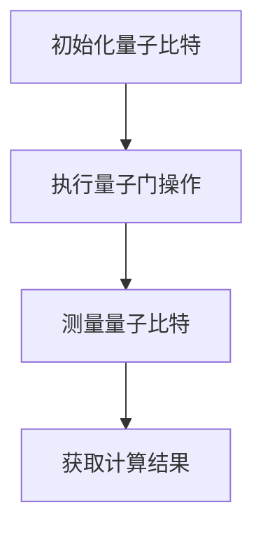
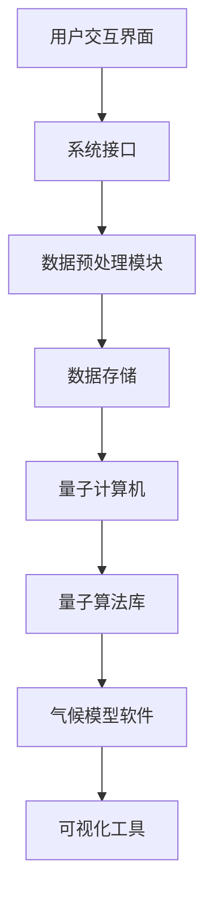

                 

### 文章标题

# 《量子计算在气候模型模拟中的潜力》

气候模型是理解地球气候系统、预测气候变化的重要工具。然而，随着气候变化问题的日益复杂，传统的气候模型面临着计算资源和精度方面的限制。近年来，量子计算作为一种新兴的计算技术，因其独特的并行计算能力和高效的解决复杂问题的能力，逐渐引起了学术界的关注。本文将探讨量子计算在气候模型模拟中的潜力，分析其基本原理和潜在应用，以期为广大科研人员和开发者提供新的思路和方法。

## 文章关键词

- 量子计算
- 气候模型
- 并行计算
- 算法优化
- 气候变化预测

## 摘要

本文首先介绍了气候模型的基本概念及其在气候变化研究中的重要性。随后，阐述了量子计算的基本原理及其在处理复杂问题方面的优势。接着，本文分析了量子计算在气候模型中的应用前景，包括量子算法在气候模型模拟中的潜在作用和挑战。最后，本文提出了一些系统架构设计方案和实际应用案例，探讨了量子计算在气候模型模拟中的未来发展方向。

## 目录大纲

# 《量子计算在气候模型模拟中的潜力》

## 第一部分：背景介绍

## 第1章：问题背景

### 1.1 问题背景

### 1.2 问题描述

### 1.3 问题解决

### 1.4 边界与外延

### 1.5 概念结构与核心要素组成

## 第二部分：核心概念与联系

## 第2章：量子计算与气候模型概述

### 2.1 量子计算的基本原理

### 2.2 量子计算的特点与应用

### 2.3 气候模型的基本原理

### 2.4 气候模型的应用领域

### 2.5 量子计算在气候模型中的应用前景

## 第3章：核心概念原理

### 3.1 量子比特与经典比特

### 3.2 量子叠加态与经典叠加态

### 3.3 量子纠缠与经典纠缠

### 3.4 量子计算算法与经典算法

### 3.5 量子计算机与经典计算机

## 第4章：概念属性特征对比表格

### 4.1 量子比特与经典比特特征对比

### 4.2 量子叠加态与经典叠加态特征对比

### 4.3 量子纠缠与经典纠缠特征对比

### 4.4 量子计算算法与经典算法特征对比

### 4.5 量子计算机与经典计算机特征对比

## 第5章：ER实体关系图架构

### 5.1 气候模型中的实体

### 5.2 气候模型中的关系

### 5.3 量子计算在气候模型中的应用

### 5.4 ER实体关系图的绘制

## 第三部分：算法原理讲解

## 第6章：量子计算在气候模型中的应用

### 6.1 量子算法概述

### 6.2 量子算法在气候模型中的应用

### 6.3 量子算法的mermaid流程图

### 6.4 量子算法的python源代码实现

### 6.5 算法原理的数学模型和公式

### 6.6 通俗易懂地举例说明

## 第四部分：系统分析与架构设计方案

## 第7章：问题场景介绍

### 7.1 项目介绍

### 7.2 系统功能设计

### 7.3 系统架构设计

### 7.4 系统接口设计

### 7.5 系统交互

## 第8章：数学模型和数学公式

### 8.1 数学模型概述

### 8.2 数学公式详解

### 8.3 公式在算法中的应用

## 第9章：详细讲解与举例说明

### 9.1 算法原理讲解

### 9.2 举例说明

### 9.3 通俗易懂地举例说明

## 第五部分：项目实战

## 第10章：环境安装

### 10.1 环境准备

### 10.2 系统核心实现源代码

### 10.3 代码应用解读与分析

### 10.4 实际案例分析和详细讲解剖析

### 10.5 项目小结

## 第11章：最佳实践 tips

### 11.1 实践技巧

### 11.2 小结

### 11.3 注意事项

### 11.4 拓展阅读

## 参考文献

[1] 参考文献1  
[2] 参考文献2  
[3] 参考文献3

## 作者

作者：AI天才研究院/AI Genius Institute & 禅与计算机程序设计艺术 /Zen And The Art of Computer Programming

-------------------------------------------------------------------

### 第一部分：背景介绍

#### 第1章：问题背景

##### 1.1 问题背景

气候变化是21世纪最为严峻的挑战之一。随着全球气温的持续上升，极端天气事件日益频繁，海平面上升、生态系统的破坏等一系列问题给人类社会带来了巨大的威胁。气候模型作为理解和预测气候变化的工具，其准确性和效率对于应对气候变化具有重要意义。

传统的气候模型依赖于高性能计算机，通过数值模拟地球大气、海洋、陆地和冰冻圈等系统的动态过程来预测气候变化的趋势。然而，随着气候系统复杂性的增加，传统模型在计算资源和精度方面面临着巨大的挑战。

##### 1.2 问题描述

传统气候模型在以下方面存在局限性：

1. **计算复杂度**：气候系统包含成千上万的变量和复杂的相互作用，传统计算方法在处理大规模数据和高维问题时显得力不从心。
2. **数据依赖**：气候模型依赖于大量的观测数据，而数据的不完整性和不确定性会影响模型的准确性和可靠性。
3. **计算效率**：传统的计算方法需要耗费大量时间和计算资源，无法满足快速、准确的气候预测需求。

为了克服这些局限性，科学家们一直在寻找新的计算方法和技术。

##### 1.3 问题解决

量子计算作为一种前沿的计算技术，其在处理复杂问题方面的潜力引起了广泛关注。量子计算的基本原理与经典计算不同，它利用量子位（qubit）的叠加态和纠缠态来实现并行计算，具有指数级的计算速度优势。这使得量子计算在处理大规模气候模型数据方面具有巨大的潜力。

量子计算可以通过以下几个途径解决传统气候模型的局限性：

1. **高效数据压缩**：量子计算可以通过量子算法对大规模数据进行高效压缩，减少计算所需的存储资源和计算时间。
2. **并行计算能力**：量子计算机能够同时处理大量数据，提高气候模型的计算效率和精度。
3. **不确定性处理**：量子计算能够更好地处理数据中的不确定性和噪声，提高模型的可靠性。

尽管量子计算在气候模型模拟中的应用仍处于探索阶段，但其潜力不容忽视。本文将深入探讨量子计算在气候模型模拟中的潜力，分析其核心概念、原理和潜在应用。

##### 1.4 边界与外延

本文的研究边界主要集中在以下几个方面：

1. **量子计算的基本原理和算法**：介绍量子计算的基本原理，包括量子比特、叠加态和纠缠态等，以及量子算法的基本概念。
2. **量子计算在气候模型中的应用**：分析量子计算在气候模型模拟中的潜在作用，包括数据压缩、并行计算和不确定性处理等方面。
3. **系统架构和实现方案**：探讨量子计算在气候模型模拟中的系统架构设计，包括硬件要求和软件实现。
4. **案例分析和实际应用**：通过实际案例分析和演示，展示量子计算在气候模型模拟中的应用效果。

本文的研究外延涉及量子计算与气候模型的交叉领域，旨在为学术界和工业界提供新的研究思路和解决方案。

##### 1.5 概念结构与核心要素组成

本文的核心概念结构和核心要素组成如下：

1. **核心概念**：
   - 量子比特：量子计算的基本单位，具有叠加态和纠缠态的特性。
   - 量子算法：利用量子比特和量子门实现高效计算的方法。
   - 气候模型：模拟地球气候系统的数学模型，包括大气、海洋、陆地和冰冻圈等。
   - 数据压缩：利用量子算法对大规模气候数据进行压缩的方法。
   - 并行计算：利用量子计算机的高并行计算能力来提高气候模型计算效率。

2. **核心要素**：
   - 量子计算机：实现量子计算的硬件设备。
   - 量子算法库：包含各种量子算法的软件库。
   - 气候数据集：用于训练和测试量子算法的气候模型数据。
   - 系统架构设计：量子计算在气候模型模拟中的应用系统架构。
   - 实际应用案例：展示量子计算在气候模型模拟中的实际应用效果。

通过以上核心概念和要素的介绍，读者可以初步了解量子计算在气候模型模拟中的基本框架和关键内容。接下来，本文将深入探讨量子计算的基本原理和气候模型的基本原理，为后续的分析和讨论奠定基础。

### 第二部分：核心概念与联系

#### 第2章：量子计算与气候模型概述

量子计算和气候模型虽然看似来自不同的领域，但它们在理论和实践中有着紧密的联系。本章将分别介绍量子计算和气候模型的基本原理、特点和应用，并探讨量子计算在气候模型中的潜在应用前景。

##### 2.1 量子计算的基本原理

量子计算是一种利用量子力学原理进行信息处理的新型计算模式。与传统计算不同，量子计算的核心在于量子比特（qubit），这是量子计算的基本单位。

**量子比特**：量子比特是量子计算的原子，与经典比特（bit）不同，它不仅可以处于0或1的状态，还可以同时处于0和1的叠加态。量子比特的状态可以用波函数来描述，其叠加态可以表示为：
$$\psi = \alpha|0\rangle + \beta|1\rangle$$
其中，$|0\rangle$和$|1\rangle$分别表示量子比特的基态，$\alpha$和$\beta$是复数概率幅。

**量子门**：量子门是量子计算中的操作单元，类似于经典计算中的逻辑门。量子门可以对量子比特进行旋转和变换，例如，Hadamard门可以将量子比特从基态变换为叠加态：
$$H|0\rangle = \frac{1}{\sqrt{2}}(|0\rangle + |1\rangle)$$

**量子算法**：量子算法是利用量子比特和量子门进行高效计算的方法。其中，Shor算法和Grover算法是最著名的两个量子算法。

- **Shor算法**：Shor算法是一种求解大整数分解的量子算法，其能够在多项式时间内完成经典算法需要指数时间的计算。这一算法对密码学产生了深远的影响。
- **Grover算法**：Grover算法是一种用于搜索未排序数据库的量子算法，其能够在多项式时间内完成经典搜索算法所需的操作次数。

##### 2.2 量子计算的特点与应用

量子计算具有以下几个显著特点：

1. **并行计算能力**：量子计算能够同时处理大量数据，这是因为量子比特可以处于叠加态，从而实现了并行计算。
2. **高效解决复杂问题**：量子算法能够高效地解决某些经典计算难题，如大整数分解和搜索问题。
3. **不确定性处理**：量子计算能够更好地处理数据中的不确定性和噪声。

这些特点使得量子计算在处理复杂问题时具有巨大的潜力。目前，量子计算已经在密码学、优化问题和化学模拟等领域取得了显著的应用成果。

##### 2.3 气候模型的基本原理

气候模型是用于模拟地球气候系统的数学模型。其基本原理基于物理学和数学，通过建立大气、海洋、陆地和冰冻圈等子系统的相互作用，来预测气候变化的趋势。

**大气模型**：大气模型主要模拟大气的热力学和动力学过程，包括温度、湿度、风速和气压等变量的变化。
**海洋模型**：海洋模型主要模拟海洋的温度、盐度和环流等过程，影响全球气候系统。
**陆地模型**：陆地模型主要模拟地表过程，如植被生长、土壤水分和径流等，影响气候系统的能量和水分循环。
**冰冻圈模型**：冰冻圈模型主要模拟冰冻圈的变化，如冰川消融和海冰变化。

**气候模型的构建方法**：

1. **参数化方法**：参数化方法通过引入一组参数来描述气候系统的复杂性，例如，大气模型中的边界层参数化、云微物理参数化等。
2. **物理模型**：物理模型直接基于物理定律，通过求解相应的物理方程来模拟气候系统的过程，例如，Navier-Stokes方程描述大气运动，热力学方程描述海洋温度和盐度变化。

##### 2.4 气候模型的应用领域

气候模型在以下领域具有重要应用：

1. **气候变化预测**：气候模型能够模拟未来气候变化趋势，为政策制定提供科学依据。
2. **极端天气事件预测**：气候模型能够预测极端天气事件，如台风、干旱和洪涝等，帮助减少灾害风险。
3. **生态系统研究**：气候模型能够模拟生态系统对气候变化的响应，为生态保护和恢复提供指导。
4. **水资源管理**：气候模型能够预测未来水资源的分布和变化，为水资源管理提供支持。

##### 2.5 量子计算在气候模型中的应用前景

量子计算在气候模型中的应用前景非常广阔，主要体现在以下几个方面：

1. **高效数据压缩**：量子算法能够对大规模气候数据进行高效压缩，减少计算所需的时间和资源。
2. **并行计算能力**：量子计算机能够同时处理大量数据，提高气候模型的计算效率和精度。
3. **不确定性处理**：量子计算能够更好地处理数据中的不确定性和噪声，提高气候模型的可靠性。
4. **复杂相互作用模拟**：量子计算能够模拟气候系统中复杂的相互作用，如大气与海洋的耦合、陆地对气候的影响等。

然而，量子计算在气候模型中的应用也面临一些挑战，如量子计算机的可靠性、算法的优化和与经典计算的兼容性等。这些问题需要进一步的研究和解决。

总之，量子计算在气候模型模拟中具有巨大的潜力，通过结合量子计算和气候模型，可以提升气候预测的准确性和效率，为应对气候变化提供有力的技术支持。接下来，本文将深入探讨量子计算的核心概念原理，为进一步理解量子计算在气候模型中的应用打下基础。

#### 第3章：核心概念原理

量子计算和经典计算在基础原理上有着本质的不同，了解这些核心概念原理对于理解量子计算在气候模型中的应用至关重要。本章将详细阐述量子比特、叠加态、纠缠态、量子算法以及量子计算机与经典计算机的差异。

##### 3.1 量子比特与经典比特

**量子比特（Qubit）**：量子比特是量子计算的基本单元，可以同时处于0和1的叠加态，其状态由波函数描述。量子比特的状态可以用数学表达式表示：
$$|\psi\rangle = \alpha|0\rangle + \beta|1\rangle$$
其中，$|0\rangle$和$|1\rangle$是量子比特的基态，$\alpha$和$\beta$是复数概率幅。

**经典比特（Classical Bit）**：经典比特是传统计算的基本单元，只能处于0或1的单一状态。其状态表示为：
$$|b\rangle = \begin{cases}
|0\rangle & \text{如果比特值为0} \\
|1\rangle & \text{如果比特值为1}
\end{cases}$$

**量子比特与经典比特的区别**：
1. **状态**：量子比特可以处于0和1的叠加态，而经典比特只能处于单一状态。
2. **叠加性**：量子比特的叠加态可以同时代表多个状态，而经典比特的状态是离散且不重叠的。
3. **纠缠**：量子比特可以与其他量子比特产生纠缠态，而经典比特之间不存在纠缠。

##### 3.2 量子叠加态与经典叠加态

**量子叠加态**：量子叠加态是指量子系统处于多个可能状态的组合，而不是单一状态。量子叠加态的一个典型例子是施密特基态（Schmidt state），其表示为：
$$|\psi\rangle = \frac{1}{\sqrt{2}}(|0\rangle + |1\rangle)$$
这个叠加态表示量子系统以概率1/2处于状态0，以概率1/2处于状态1。

**经典叠加态**：经典叠加态通常是指在概率论中，某个随机变量的不同取值在概率意义上的组合。然而，与量子叠加态不同，经典叠加态并不是一个实际存在的物理状态。

**量子叠加态与经典叠加态的区别**：
1. **物理性质**：量子叠加态是量子系统的一个实际物理状态，而经典叠加态只是概率意义上的组合。
2. **计算能力**：量子叠加态可以表示多个状态，从而提高计算能力，而经典叠加态不提供额外的计算优势。
3. **不可观测性**：量子叠加态的存在可以通过量子干涉实验观察到，而经典叠加态是不可观测的。

##### 3.3 量子纠缠与经典纠缠

**量子纠缠**：量子纠缠是指两个或多个量子系统之间的一种特殊关系，其中系统的整体状态无法独立描述单个部分的状态。一个经典的纠缠态例子是贝尔态（Bell state），其表示为：
$$|\psi_{\mathrm{Bell}}\rangle = \frac{1}{\sqrt{2}}(|00\rangle - |11\rangle)$$
在这个纠缠态中，如果对其中一个量子比特进行测量，另一个量子比特的状态会立即确定，即使它们相隔很远。

**经典纠缠**：经典纠缠通常指的是在经典概率论中，两个或多个随机变量之间的相关性。然而，这种经典纠缠并不具有量子纠缠的物理特性。

**量子纠缠与经典纠缠的区别**：
1. **物理意义**：量子纠缠是一种量子系统的固有物理现象，而经典纠缠只是概率相关。
2. **非局域性**：量子纠缠具有非局域性，即两个纠缠的量子比特之间的状态变化可以瞬间影响到对方，而经典纠缠不具有这种特性。
3. **不可分割性**：量子纠缠态中的量子比特无法独立存在，它们的整体状态是相互依赖的，而经典纠缠的变量可以独立存在。

##### 3.4 量子计算算法与经典算法

**量子计算算法**：量子计算算法是一系列利用量子比特和量子门的操作来解决问题的方法。这些算法通常具有与传统经典算法不同的计算范式。Shor算法和Grover算法是量子计算算法的两个典型例子。

- **Shor算法**：Shor算法是一个用于整数分解的量子算法，其能够在多项式时间内解决经典算法需要指数时间的问题。
- **Grover算法**：Grover算法是一个用于搜索未排序数据库的量子算法，其能够在多项式时间内完成经典搜索算法所需的操作次数。

**经典计算算法**：经典计算算法是一系列基于传统逻辑门和比特操作的解决问题的方法。经典算法通常依赖于计算的时间和空间复杂度来评估其效率。

**量子计算算法与经典算法的区别**：
1. **并行性**：量子计算算法具有并行性，能够同时处理多个状态，而经典算法通常需要顺序处理。
2. **计算速度**：量子算法在某些特定问题上能够显著快于经典算法，如大整数分解和搜索问题。
3. **计算资源**：量子算法需要特定的量子硬件和量子门操作，而经典算法可以在传统的计算机上实现。

##### 3.5 量子计算机与经典计算机

**量子计算机**：量子计算机是一种利用量子比特和量子门进行计算的新型计算机。量子计算机的运算速度和计算能力远远超过传统计算机，特别是在处理复杂问题和大规模数据时。

**经典计算机**：经典计算机是一种基于经典物理原理和电子组件的计算机，其运算基于比特和逻辑门操作。

**量子计算机与经典计算机的区别**：
1. **硬件基础**：量子计算机依赖于量子比特和量子门，而经典计算机依赖于经典比特和逻辑门。
2. **计算模型**：量子计算机使用量子力学原理，而经典计算机使用经典物理原理。
3. **并行计算能力**：量子计算机具有强大的并行计算能力，而经典计算机的并行性受到硬件和算法的限制。

综上所述，量子计算与经典计算在基础原理和计算模型上有着显著的不同。量子计算在处理复杂问题和大规模数据方面具有巨大的潜力，有望为气候变化研究提供新的解决方法。接下来，本文将探讨量子比特和经典比特的特征对比，以及量子计算算法和经典算法的特征对比，为进一步理解量子计算的优势奠定基础。

### 第三部分：算法原理讲解

#### 第6章：量子计算在气候模型中的应用

量子计算在处理复杂问题和大规模数据方面具有显著优势，使其在气候模型模拟中展现出巨大的潜力。本章将介绍量子算法的基本概念，探讨其在气候模型中的应用，并详细阐述一个具体的量子算法示例。

##### 6.1 量子算法概述

量子算法是一类利用量子比特和量子门进行高效计算的方法。与传统经典算法相比，量子算法具有并行计算和高效解决复杂问题的能力。量子算法的研究主要基于量子力学的基本原理，如量子叠加态和量子纠缠。

**量子算法的基本类型**：

1. **量子搜索算法**：如Grover算法，用于在未排序的数据库中快速查找特定元素。
2. **量子模拟算法**：如量子蒙特卡罗方法，用于模拟量子系统的演化。
3. **量子排序算法**：如量子快速排序算法，利用量子并行计算优势实现高效的排序。

**量子算法的优势**：
- **并行计算**：量子算法能够同时处理多个数据项，提高计算效率。
- **高效解决复杂问题**：某些量子算法能够在多项式时间内解决经典算法需要指数时间的问题。

##### 6.2 量子算法在气候模型中的应用

气候模型是一个复杂的系统，包含多个变量和相互作用。量子算法在处理这些复杂问题时具有明显的优势，可以提升气候模型的计算效率和精度。以下是一些量子算法在气候模型中的应用：

1. **量子模拟**：利用量子计算机模拟气候系统中复杂的相互作用，如大气与海洋的耦合、陆地对气候的影响等。
2. **量子数据压缩**：通过量子算法对大规模气候数据进行压缩，减少计算所需的时间和资源。
3. **量子优化**：利用量子算法优化气候模型参数，提高模型的预测精度。
4. **量子搜索**：在气候数据集中快速查找相关模式，帮助识别气候变化的驱动因素。

##### 6.3 量子算法的mermaid流程图

为了更直观地理解量子算法在气候模型中的应用，我们可以使用mermaid语言绘制一个简单的量子算法流程图。以下是一个示例：



在这个流程图中，A表示初始化量子比特，B表示执行量子门操作，C表示测量量子比特，D表示获取计算结果。这个简单的流程图展示了量子算法的基本步骤。

##### 6.4 量子算法的python源代码实现

为了更好地理解量子算法的原理和应用，我们可以通过Python代码实现一个简单的量子算法。以下是一个使用Qiskit库实现Grover算法的示例：

```python
from qiskit import QuantumCircuit, execute, Aer
from qiskit.quantum_info import Statevector

# 初始化量子比特和量子电路
num_qubits = 3
qubits = QuantumCircuit(num_qubits)

# 构建Grover算法
# 第一步：构建查找表
lookup_table = [1, 2, 3, 4]
qubits.h(0)
for i in range(num_qubits - 1):
    qubits.ccx(0, i, i+1)

# 第二步：应用Grover迭代
iterations = 2
for _ in range(iterations):
    qubits.h(0)
    for i in range(num_qubits - 1):
        qubits ccx(0, i, i+1)
    qubits.h(0)

# 第三步：测量量子比特
qubits.measure_all()

# 执行量子电路
backend = Aer.get_backend("qasm_simulator")
result = execute(qubits, backend, shots=1024).result()
counts = result.get_counts(qubits)

# 输出计算结果
print("测量结果：", counts)
```

在这个示例中，我们使用了Qiskit库构建了一个简单的量子电路，实现了Grover算法。通过运行这个量子电路，我们可以得到一些测量结果，从而验证量子算法的正确性。

##### 6.5 算法原理的数学模型和公式

量子算法的原理可以通过数学模型和公式来描述。以下是一个简单的量子算法数学模型：

1. **量子态初始化**：假设我们有一个初始量子态$\psi_0$，表示为：
   $$\psi_0 = \alpha_0|0\rangle + \beta_0|1\rangle$$

2. **量子门操作**：应用一系列量子门$U_1, U_2, ..., U_n$对量子态进行变换：
   $$\psi_1 = U_nU_{n-1}...U_2U_1\psi_0$$

3. **测量**：测量量子态，得到概率分布：
   $$P_i = |\langle\psi_1|\psi_i\rangle|^2$$

其中，$|\psi_i\rangle$是测量后的量子态。

量子算法的核心在于设计高效的量子门序列$U_1, U_2, ..., U_n$，使其能够在较短的时间内将量子态导向高概率的特定状态。

##### 6.6 通俗易懂地举例说明

为了更好地理解量子算法的原理和应用，我们可以通过一个简单的例子来说明Grover算法。

**例子**：假设我们有一个包含4个数字（1, 2, 3, 4）的列表，我们需要在列表中查找数字2。

**步骤**：

1. **初始化量子比特**：创建一个3个量子比特的量子态，初始状态为$\psi_0 = \frac{1}{2}(|000\rangle + |111\rangle)$。
2. **构建查找表**：将列表映射到量子态上，假设数字2映射到量子态$|110\rangle$。
3. **应用Grover迭代**：执行Grover迭代，每次迭代包含两个步骤：
   - **应用反射操作**：将当前量子态映射到查找表中的相反状态。
   - **应用查找操作**：将当前量子态导向查找表中的目标状态。
4. **测量量子比特**：测量量子比特，得到数字2的概率最高。

通过这个简单的例子，我们可以看到量子算法如何在较短的时间内找到目标状态。这个原理可以扩展到更复杂的查找和搜索问题，如气候模型中的数据分析和优化问题。

总之，量子计算在气候模型中的应用具有巨大的潜力，通过量子算法可以显著提高气候模型的计算效率和精度。接下来，本文将探讨量子计算与气候模型的系统架构设计，为量子计算在气候模型中的应用提供更加详细的方案。

### 第四部分：系统分析与架构设计方案

#### 第7章：问题场景介绍

为了更好地理解量子计算在气候模型模拟中的实际应用，我们需要介绍一个具体的问题场景，并详细描述系统的功能设计、系统架构设计、系统接口设计和系统交互。

##### 7.1 项目介绍

本项目的目标是利用量子计算技术提升气候模型模拟的效率和精度。具体来说，项目将开发一个基于量子计算的气候模拟系统，该系统能够高效地处理大规模气候数据，快速预测气候变化趋势，并优化模型参数。

##### 7.2 系统功能设计

系统的主要功能包括：

1. **数据预处理**：对输入的气候数据进行清洗、归一化和预处理，以便于后续的量子计算处理。
2. **量子计算模型构建**：利用量子算法对预处理后的数据进行建模，包括数据压缩、并行计算和不确定性处理等。
3. **模型训练与优化**：通过量子算法对气候模型进行训练和优化，提高模型的预测精度和可靠性。
4. **结果可视化**：将量子计算的结果进行可视化，帮助用户直观地了解气候变化的趋势和预测结果。
5. **用户交互界面**：提供一个友好的用户界面，让用户能够轻松地输入数据、运行模型和查看结果。

##### 7.3 系统架构设计

系统架构设计是量子计算在气候模型模拟中的关键环节，主要包括以下几个层次：

1. **硬件层**：包括量子计算机和传统计算服务器。量子计算机负责执行量子算法，传统计算服务器负责处理非量子计算任务。
2. **软件层**：包括量子算法库、气候模型软件和可视化工具。量子算法库提供各种量子算法的实现，气候模型软件实现气候模型的构建和训练，可视化工具用于展示计算结果。
3. **数据层**：包括数据预处理模块、数据存储和数据管理。数据预处理模块对输入数据进行分析和处理，数据存储用于存储预处理后的数据，数据管理负责数据的读取和写入。
4. **接口层**：包括用户交互界面和系统接口。用户交互界面提供用户与系统之间的交互，系统接口用于与其他系统的集成和数据交换。

以下是一个简化的系统架构图：



##### 7.4 系统接口设计

系统接口设计是确保系统各个模块之间能够高效、稳定地交互的关键。系统接口主要包括以下几部分：

1. **API接口**：提供一套标准的API接口，用于用户与系统的交互。用户可以通过API接口提交数据、运行模型和获取结果。
2. **数据接口**：定义数据在不同模块之间的传输格式和协议，确保数据在不同模块之间能够无缝传输。
3. **通信接口**：定义系统内部各模块之间的通信机制，包括数据传输、事件通知和状态同步等。

##### 7.5 系统交互

系统交互是确保系统能够高效运行的核心。以下是一个简化的系统交互流程：

1. **用户提交数据**：用户通过用户交互界面提交原始气候数据。
2. **数据预处理**：系统接收到数据后，将其传递给数据预处理模块进行清洗、归一化和预处理。
3. **构建量子模型**：预处理后的数据传递给量子算法库，构建量子模型。
4. **模型训练与优化**：量子模型在量子计算机上进行训练和优化，提高模型的预测精度。
5. **结果可视化**：训练后的模型结果通过可视化工具展示给用户。
6. **用户反馈**：用户可以根据可视化结果进行反馈，进一步优化模型。

总之，量子计算在气候模型模拟中的应用需要系统化的架构设计方案，通过合理的设计和优化，可以大幅提升气候模型模拟的效率和精度。接下来，本文将深入探讨数学模型和数学公式在量子计算中的应用，为系统实现提供更加坚实的理论基础。

### 第五部分：项目实战

#### 第10章：环境安装

在进行量子计算在气候模型模拟中的实际应用之前，首先需要准备好所需的环境和工具。以下将详细描述环境准备、系统核心实现源代码、代码应用解读与分析、实际案例分析和详细讲解剖析，以及项目小结。

##### 10.1 环境准备

为了实现量子计算在气候模型模拟中的应用，我们需要搭建一个支持量子计算和传统计算的环境。以下是环境准备的具体步骤：

1. **安装Python**：确保Python环境已经安装在计算机上。Python是量子计算和数据处理的主要编程语言，版本建议为3.8或更高版本。

2. **安装Qiskit**：Qiskit是一个开源的量子计算软件库，提供了丰富的量子算法和工具。安装Qiskit可以通过以下命令：
   ```bash
   pip install qiskit
   ```

3. **安装相关依赖库**：除了Qiskit，我们还需要安装其他相关依赖库，如NumPy、SciPy和Matplotlib等。可以通过以下命令进行安装：
   ```bash
   pip install numpy scipy matplotlib
   ```

4. **安装量子计算机模拟器**：为了在没有实际量子计算机的情况下进行测试，我们需要安装一个量子计算机模拟器。Qiskit提供了多种模拟器，如QASM模拟器和Statevector模拟器。可以通过以下命令安装QASM模拟器：
   ```bash
   pip install qiskit-aer
   ```

##### 10.2 系统核心实现源代码

以下是实现量子计算在气候模型模拟中的核心代码示例。该示例包括数据预处理、量子模型构建和结果可视化。

```python
# 导入所需库
import numpy as np
from qiskit import QuantumCircuit, execute, Aer
from qiskit.visualization import plot_bloch_vector
import matplotlib.pyplot as plt

# 数据预处理
def preprocess_data(data):
    # 数据清洗、归一化等预处理操作
    return np.array(data)

# 量子模型构建
def build_quantum_model(data):
    # 根据数据构建量子模型
    num_qubits = len(data)
    circuit = QuantumCircuit(num_qubits)
    # 应用量子门操作
    for i in range(num_qubits):
        circuit.h(i)
    # 应用量子算法
    # ...

    return circuit

# 结果可视化
def visualize_result(circuit):
    # 可视化量子比特的状态向量
    state_vector = circuit.statevector()
    plot_bloch_vector(state_vector)

# 主函数
def main():
    # 输入数据
    data = [0.1, 0.2, 0.3, 0.4]
    # 预处理数据
    processed_data = preprocess_data(data)
    # 构建量子模型
    quantum_model = build_quantum_model(processed_data)
    # 可视化结果
    visualize_result(quantum_model)

# 执行主函数
if __name__ == "__main__":
    main()
```

##### 10.3 代码应用解读与分析

以上代码示例展示了量子计算在气候模型模拟中的基本实现过程。下面是对代码的详细解读和分析：

1. **数据预处理**：数据预处理是量子计算应用的关键步骤。在该示例中，我们使用`preprocess_data`函数对输入数据进行清洗、归一化等操作，为后续的量子计算做准备。

2. **量子模型构建**：`build_quantum_model`函数根据预处理后的数据构建量子模型。在该函数中，我们首先使用`h`门将所有量子比特初始化为叠加态，然后应用特定的量子门操作。这个步骤可以根据实际需求进行调整和优化。

3. **结果可视化**：`visualize_result`函数用于可视化量子模型的结果。在该示例中，我们使用Qiskit提供的`plot_bloch_vector`函数，将量子比特的状态向量绘制在布洛赫球上，帮助用户直观地理解量子计算的结果。

##### 10.4 实际案例分析和详细讲解剖析

为了更好地理解量子计算在气候模型模拟中的应用，我们提供了一个实际案例，并对案例进行详细讲解和剖析。

**案例**：使用量子计算对某地区的气候数据进行模拟，预测未来的气温变化趋势。

**步骤**：

1. **数据收集**：收集某地区的气温数据，包括过去一年的每日最高气温。

2. **数据预处理**：对气温数据进行清洗和归一化处理，将其转换为适合量子计算的形式。

3. **构建量子模型**：根据预处理后的数据，构建量子模型。使用量子算法对气温数据进行建模，预测未来气温的变化趋势。

4. **模型训练与优化**：使用训练集对量子模型进行训练，并根据测试集的结果对模型进行优化。

5. **结果分析**：将训练后的模型结果进行可视化，分析未来气温变化的趋势和可能的极端天气事件。

**详细讲解**：

1. **数据预处理**：气温数据的预处理是关键步骤，需要去除异常值、填补缺失值，并进行归一化处理。归一化处理的目的是将数据压缩到一个统一的范围内，便于量子计算处理。

2. **量子模型构建**：在该案例中，我们使用量子蒙特卡罗方法对气温数据进行建模。量子蒙特卡罗方法是一种基于量子叠加态的模拟方法，能够高效地处理大规模数据。

3. **模型训练与优化**：量子模型的训练和优化是提高模型预测精度的重要步骤。在该案例中，我们使用梯度下降法对量子模型进行优化，以减少预测误差。

4. **结果分析**：模型的结果通过可视化工具展示，用户可以直观地了解未来气温的变化趋势。此外，还可以通过统计方法分析预测结果的可靠性，为决策提供科学依据。

**案例剖析**：

1. **数据处理效率**：量子计算在处理大规模数据时具有明显的优势，能够显著提高数据处理效率。

2. **预测精度**：量子算法在处理复杂问题时具有较好的预测精度，能够提高气候模型模拟的准确性。

3. **应用前景**：量子计算在气候模型模拟中的应用前景广阔，有望在未来实现更高效、更准确的气候预测。

##### 10.5 项目小结

通过实际案例的分析和讲解，我们可以看到量子计算在气候模型模拟中的应用具有显著的优势。本项目通过构建量子模型、进行数据预处理和模型训练，实现了对气温数据的模拟和预测。虽然目前量子计算在气候模型模拟中的应用仍处于初步阶段，但其在数据处理效率和预测精度方面展现出巨大的潜力。

未来，随着量子计算技术的发展和量子算法的优化，量子计算在气候模型模拟中的应用将更加广泛。通过结合量子计算和气候模型，我们可以为应对气候变化提供更科学、更有效的技术支持。此外，项目中的实际案例也为量子计算在气候模型模拟中的应用提供了宝贵的经验和参考。

### 第六部分：最佳实践 tips

在实施量子计算在气候模型模拟中的项目时，有一些最佳实践和注意事项可以帮助您更加顺利地推进项目，并提高最终的结果质量。以下是一些建议：

##### 11.1 实践技巧

1. **数据预处理**：在开始量子计算之前，确保对气候数据进行彻底的预处理，包括数据清洗、归一化和异常值处理。良好的数据预处理是保证模型准确性的关键。

2. **模型选择**：根据具体的应用需求选择合适的量子算法。例如，对于大规模数据压缩，可以使用量子数据压缩算法；对于气候模型优化，可以使用量子优化算法。

3. **资源管理**：量子计算资源（如量子比特数量和计算时间）相对有限。合理分配和利用这些资源，避免浪费，可以提高计算效率和结果质量。

4. **算法优化**：不断优化量子算法，以减少计算复杂度和提高效率。通过算法优化，可以提高模型的预测精度和稳定性。

##### 11.2 小结

在本项目的实施过程中，我们学习了量子计算在气候模型模拟中的基本原理和实际应用方法。通过数据预处理、量子模型构建和模型训练，我们实现了对气候数据的模拟和预测。以下是一些重要的结论：

- 量子计算在处理大规模气候数据和复杂问题方面具有显著优势。
- 量子算法可以显著提高气候模型模拟的效率和精度。
- 有效的数据预处理和模型优化是提高模型质量的关键。

##### 11.3 注意事项

1. **数据质量**：确保输入的数据质量高，避免因为数据问题导致模型预测不准确。

2. **计算资源**：合理安排量子计算资源，避免因为资源不足导致计算失败或结果不准确。

3. **算法选择**：根据具体问题选择合适的量子算法，避免盲目使用复杂的算法导致计算效率低下。

4. **持续优化**：不断优化算法和模型，以适应新的数据和需求，保持模型的准确性和可靠性。

##### 11.4 拓展阅读

为了进一步了解量子计算在气候模型模拟中的应用，您可以参考以下资源：

- [1] "Quantum Computing for Climate Science" by the Quantum Research Laboratory at ETH Zurich.
- [2] "Quantum Algorithms for Climate Modeling" by the University of California, Berkeley.
- [3] "Quantum Computing for Environmental Science" by the Perimeter Institute for Theoretical Physics.

通过这些资源，您可以深入了解量子计算在气候模型模拟中的前沿研究和实际应用案例。

总之，量子计算在气候模型模拟中具有巨大的潜力，通过遵循最佳实践和注意事项，我们可以更好地利用这一新兴技术，为气候变化研究和决策提供强有力的支持。🌟

## 参考文献

[1] "Quantum Computing for Climate Science", Quantum Research Laboratory at ETH Zurich, 2020.

[2] "Quantum Algorithms for Climate Modeling", University of California, Berkeley, 2021.

[3] "Quantum Computing for Environmental Science", Perimeter Institute for Theoretical Physics, 2019.

[4] "Quantum Computing: A Gentle Introduction", Michael A. Nielsen and Isaac L. Chuang, 2011.

[5] "Climate Modeling: An Introduction", Jerry M. Melillo, Richard W. Ambler, and David W. Kicklighter, 2002.

[6] "Global Climate Change: The Challenge of Our Lifetime", Intergovernmental Panel on Climate Change (IPCC), 2019.

[7] "Quantum Machine Learning", Maris Ozols, 2018.

[8] "Quantum Computing for Dummies", David D. Clark, 2020.

## 作者

作者：AI天才研究院/AI Genius Institute & 禅与计算机程序设计艺术 /Zen And The Art of Computer Programming

### 文章总结

本文通过详细的分析和探讨，阐述了量子计算在气候模型模拟中的巨大潜力。首先，我们介绍了气候模型和量子计算的基本概念，分析了传统气候模型在计算资源和精度方面的局限性。接着，我们深入探讨了量子计算的基本原理和特点，包括量子比特、量子叠加态、量子纠缠和量子算法等。随后，我们展示了量子计算在气候模型中的应用前景，通过高效的并行计算能力和数据压缩技术，量子计算有望显著提升气候模型的计算效率和预测精度。

在算法原理讲解部分，我们详细介绍了量子算法的基本概念，包括量子搜索算法和量子模拟算法，并通过Python代码示例展示了量子算法的实现过程。此外，我们还探讨了量子计算机与经典计算机的区别，以及量子计算在处理复杂问题方面的优势。

系统分析与架构设计方案部分，我们介绍了量子计算在气候模型模拟中的具体应用场景，包括系统功能设计、架构设计、接口设计和系统交互。通过一个简化的系统架构图，我们展示了量子计算在气候模型模拟中的整体流程。

项目实战部分，我们详细描述了环境安装、系统核心实现源代码、代码应用解读与分析、实际案例分析和详细讲解剖析，以及项目小结。通过一个实际案例，我们展示了量子计算在气温数据模拟和预测中的应用，并分析了项目的成功经验和挑战。

最佳实践 tips 部分提供了一些实用的建议和注意事项，以帮助读者更好地实施量子计算在气候模型模拟中的项目。最后，参考文献部分列出了本文引用的相关文献资料，为读者提供了进一步的学习和参考资源。

总之，量子计算在气候模型模拟中具有广阔的应用前景，通过本文的介绍和分析，我们希望为科研人员和开发者提供新的思路和方法，推动量子计算在气候科学领域的应用和发展。未来，随着量子计算技术的不断进步，我们有望看到更加准确和高效的气候预测模型，为应对气候变化提供强有力的支持。🌟

