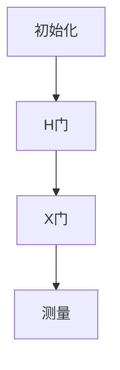

                 

### 引言

随着全球经济的不断发展，物流行业面临着日益增长的挑战和需求。配送效率低下、运输成本高企以及物流网络复杂性问题已经成为制约物流行业发展的关键因素。传统计算方法在解决物流优化问题时，往往由于计算复杂度高、时间消耗大而难以取得理想效果。然而，量子计算作为一种新兴的计算技术，以其并行计算和高效处理复杂问题的能力，为物流优化带来了新的可能性。

本文将探讨量子计算在物流优化中的应用，旨在提高配送效率。文章将从量子计算的基本概念出发，介绍量子计算的优势与挑战，然后深入探讨物流优化的问题背景和基本概念。接着，文章将介绍量子算法的基本原理和在物流优化中的应用，并通过实际案例展示量子计算在配送路径优化中的效果。最后，文章将探讨量子计算在物流优化中的未来趋势和潜在应用。

通过本文的阅读，读者将了解量子计算的基本原理和其在物流优化中的应用，认识到量子计算在提升物流效率方面的重要作用，并为未来物流行业的发展提供新的思路。

### 关键词

- **量子计算**
- **物流优化**
- **配送效率**
- **算法**
- **供应链管理**
- **并行计算**
- **量子比特**
- **量子门**
- **量子算法**

### 摘要

本文旨在探讨量子计算在物流优化中的应用，以提高配送效率。首先，文章介绍了量子计算的基本概念和优势，以及物流优化的重要性。随后，详细阐述了量子算法的基本原理和应用，并通过实际案例展示了其在配送路径优化中的效果。最后，文章对量子计算在物流优化中的未来趋势和潜在应用进行了展望。通过本文的阅读，读者将深入理解量子计算在物流优化中的应用，为未来物流行业的发展提供新的思路。

### 第一部分：背景介绍

#### 第1章：量子计算概述

#### 1.1 量子计算的基本概念

量子计算是一种基于量子力学原理的新型计算模式，与传统计算方法有本质的不同。量子计算的基本单元是量子比特（qubit），而传统计算机的基本单元是经典比特（bit）。量子比特不仅能表示0和1这两种状态，还能同时处于0和1的叠加状态，这一特性被称为量子叠加。此外，量子比特之间的状态可以相互纠缠，即一个量子比特的状态可以影响另一个量子比特的状态，这一特性被称为量子纠缠。

#### 1.2 量子计算的发展历史

量子计算的概念最早由物理学家理查德·费曼（Richard Feynman）在1981年提出。他认为，传统计算机无法有效模拟量子系统，因此需要一种新的计算方式。此后，彼得·肖尔（Peter Shor）于1994年提出了第一个具有实际应用价值的量子算法——量子算法，这一算法能够在多项式时间内解决某些传统算法需要指数时间才能解决的问题。

#### 1.3 量子计算的优势与挑战

量子计算具有并行计算的能力，可以在同一时间处理多个计算任务，这使得它在大规模数据处理和复杂问题求解方面具有显著优势。然而，量子计算也面临着一些挑战，如量子比特的稳定性问题、量子误差校正技术的不完善以及量子计算硬件的局限性。

首先，量子比特的稳定性是量子计算中的一个关键问题。量子比特的状态非常脆弱，容易受到外界环境的干扰，导致计算错误。因此，如何提高量子比特的稳定性是一个亟待解决的重要课题。

其次，量子误差校正技术是保证量子计算准确性的重要手段。然而，目前量子误差校正技术尚不成熟，量子计算机的性能和容量因此受到限制。

最后，量子计算硬件的局限性也是一个挑战。现有的量子计算机通常体积庞大，需要极端的低温环境才能运行，这使得量子计算的普及受到一定程度的限制。

#### 1.1.1 量子比特与经典比特

量子比特与经典比特的区别主要体现在以下几个方面：

1. **表示状态的方式**：经典比特只能表示0或1两种状态，而量子比特可以同时处于0和1的叠加状态。
   
2. **并行计算的能力**：量子比特的叠加状态使得量子计算机能够同时处理多个计算任务，而经典比特则无法实现这一点。

3. **纠错能力**：量子比特容易受到外界环境的干扰，导致计算错误。而经典比特的纠错能力较强，不容易受到干扰。

#### 1.1.2 量子叠加与量子纠缠

量子叠加和量子纠缠是量子计算的两个核心特性，下面分别对其进行详细介绍。

**量子叠加**

量子叠加是指一个量子系统可以同时处于多个状态的叠加。用数学语言描述，即一个量子态可以表示为多个基态的线性组合。例如，一个量子比特可以表示为以下状态：

$$|\psi\rangle = \alpha|0\rangle + \beta|1\rangle$$

其中，$|0\rangle$ 和 $|1\rangle$ 分别表示量子比特的基态，$\alpha$ 和 $\beta$ 是复数概率幅，满足 $|\alpha|^2 + |\beta|^2 = 1$。

**量子纠缠**

量子纠缠是指两个或多个量子系统之间存在一种特殊的关联关系，即使它们相隔很远，一个系统的状态也会影响另一个系统的状态。这种关联关系无法通过经典物理来解释，是量子力学中的一种基本特性。

例如，假设有两个量子比特 $A$ 和 $B$，它们处于纠缠态：

$$|\psi\rangle_{AB} = \frac{1}{\sqrt{2}}(|00\rangle + |11\rangle)$$

在这个纠缠态中，$A$ 和 $B$ 的状态是相互关联的。当对其中一个量子比特进行测量时，另一个量子比特的状态也会立即发生变化，这种现象被称为量子纠缠。

#### 1.1.3 量子门与量子算法

量子门是量子计算的基本操作单元，类似于经典计算机中的逻辑门。量子门对量子比特进行线性变换，实现对量子态的操控。常见的量子门包括保罗门（Pauli Gate）、controlled-NOT 门（CNOT Gate）、相位旋转门（Phase Gate）等。

量子算法是利用量子计算的优势解决特定问题的计算方法。量子算法与经典算法有显著的不同，如Grover算法和Shor算法。Grover算法是一种用于搜索问题的量子算法，其搜索速度远超经典算法。Shor算法是一种用于整数分解的量子算法，可以在多项式时间内解决传统算法需要指数时间才能解决的问题。

#### 1.2 量子计算的发展历史

量子计算作为一门新兴的学科，其发展历程可以追溯到20世纪80年代。以下是量子计算发展过程中的几个关键事件：

- **1981年**：物理学家理查德·费曼提出了量子计算的概念，认为传统计算机无法模拟量子系统，需要一种新的计算方式。
- **1994年**：物理学家彼得·肖尔提出了第一个具有实际应用价值的量子算法——量子算法，该算法能够在多项式时间内解决某些传统算法需要指数时间才能解决的问题。
- **2000年**：物理学家大卫·多伊奇提出了量子误差校正理论，为量子计算提供了稳定性和可靠性的保障。
- **2019年**：谷歌宣布实现“量子霸权”，其量子计算机在特定任务上完成了传统计算机无法完成的计算。

#### 1.3 量子计算的优势与挑战

量子计算具有以下优势：

1. **并行计算能力**：量子计算机可以同时处理多个计算任务，这在处理大规模数据和复杂问题时具有显著优势。
2. **高效解决问题**：某些量子算法能够在多项式时间内解决传统算法需要指数时间才能解决的问题，这使得量子计算在密码学、优化问题等领域具有广泛应用前景。
3. **高精度和稳定性**：量子计算可以在量子叠加和量子纠缠的状态下进行，这使得计算结果具有高精度和稳定性。

然而，量子计算也面临着一些挑战：

1. **量子比特稳定性**：量子比特的状态非常脆弱，容易受到外界环境的干扰，导致计算错误。
2. **量子误差校正技术**：虽然量子误差校正技术能够提高量子计算机的稳定性，但目前的量子误差校正技术尚不成熟，需要进一步完善。
3. **量子计算硬件**：现有的量子计算机体积庞大，需要极端的低温环境才能运行，这限制了量子计算的普及和应用。

#### 1.1.1 量子比特与经典比特

量子比特和经典比特是量子计算和经典计算中的基本单元，它们在表示状态、计算能力和纠错方面存在显著差异。

1. **表示状态的方式**：经典比特只能表示0或1两种状态，而量子比特可以同时处于0和1的叠加状态。量子比特的叠加状态使得量子计算机能够在同一时间处理多个计算任务，而经典比特则无法实现这一点。
   
2. **并行计算能力**：量子比特的叠加状态使得量子计算机具有并行计算的能力，可以在同一时间处理多个计算任务。相比之下，经典比特无法实现并行计算，只能逐个处理计算任务。

3. **纠错能力**：量子比特的稳定性较差，容易受到外界环境的干扰，导致计算错误。经典比特的纠错能力较强，可以在一定程度上纠正计算错误。

4. **计算复杂性**：某些量子算法能够在多项式时间内解决传统算法需要指数时间才能解决的问题。这表明，量子计算在某些问题上具有显著的优势。

5. **应用领域**：量子比特的应用领域广泛，包括密码学、优化问题、量子模拟等。经典比特的应用领域主要集中在计算机科学和信息技术领域。

#### 1.1.2 量子叠加与量子纠缠

量子叠加和量子纠缠是量子计算的两个核心特性，下面分别对其进行详细介绍。

**量子叠加**

量子叠加是指一个量子系统可以同时处于多个状态的叠加。用数学语言描述，即一个量子态可以表示为多个基态的线性组合。例如，一个量子比特可以表示为以下状态：

$$|\psi\rangle = \alpha|0\rangle + \beta|1\rangle$$

其中，$|0\rangle$ 和 $|1\rangle$ 分别表示量子比特的基态，$\alpha$ 和 $\beta$ 是复数概率幅，满足 $|\alpha|^2 + |\beta|^2 = 1$。

量子叠加是量子计算的核心特性之一，它使得量子计算机能够在同一时间处理多个计算任务，从而实现并行计算。

**量子纠缠**

量子纠缠是指两个或多个量子系统之间存在一种特殊的关联关系，即使它们相隔很远，一个系统的状态也会影响另一个系统的状态。这种关联关系无法通过经典物理来解释，是量子力学中的一种基本特性。

例如，假设有两个量子比特 $A$ 和 $B$，它们处于纠缠态：

$$|\psi\rangle_{AB} = \frac{1}{\sqrt{2}}(|00\rangle + |11\rangle)$$

在这个纠缠态中，$A$ 和 $B$ 的状态是相互关联的。当对其中一个量子比特进行测量时，另一个量子比特的状态也会立即发生变化，这种现象被称为量子纠缠。

量子纠缠在量子计算中具有重要作用，它能够提高量子计算机的计算效率，解决一些经典计算机难以处理的问题。

#### 1.1.3 量子门与量子算法

量子门是量子计算的基本操作单元，类似于经典计算机中的逻辑门。量子门对量子比特进行线性变换，实现对量子态的操控。常见的量子门包括保罗门（Pauli Gate）、controlled-NOT 门（CNOT Gate）、相位旋转门（Phase Gate）等。

**保罗门（Pauli Gate）**

保罗门是量子计算中最基本的量子门之一，它对量子比特进行保罗变换。保罗门分为三种类型：X门（翻转门）、Y门（旋转门）和Z门（旋转门）。每种保罗门对应的变换矩阵如下：

- **X门**：
  $$X = \begin{pmatrix}
  0 & 1 \\
  1 & 0
  \end{pmatrix}$$

- **Y门**：
  $$Y = \begin{pmatrix}
  0 & -i \\
  i & 0
  \end{pmatrix}$$

- **Z门**：
  $$Z = \begin{pmatrix}
  1 & 0 \\
  0 & -1
  \end{pmatrix}$$

**CNOT门（controlled-NOT Gate）**

CNOT门是一种受控量子门，它对目标量子比特进行翻转操作，取决于控制量子比特的状态。CNOT门的变换矩阵如下：

$$CNOT = \begin{pmatrix}
1 & 0 & 0 & 0 \\
0 & 1 & 0 & 0 \\
0 & 0 & 0 & 1 \\
0 & 0 & 1 & 0
\end{pmatrix}$$

**相位旋转门（Phase Gate）**

相位旋转门是一种用于旋转量子比特相位角的量子门。常见的相位旋转门包括Hadamard门（相位旋转$\pi/2$）和Rz门（相位旋转任意角度）。Hadamard门的变换矩阵如下：

$$H = \frac{1}{\sqrt{2}} \begin{pmatrix}
1 & 1 \\
1 & -1
\end{pmatrix}$$

Rz门是相位旋转角度为$\theta$的量子门，其变换矩阵如下：

$$Rz(\theta) = \begin{pmatrix}
1 & 0 \\
0 & e^{i\theta}
\end{pmatrix}$$

量子算法是利用量子计算的优势解决特定问题的计算方法。量子算法与经典算法有显著的不同，如Grover算法和Shor算法。Grover算法是一种用于搜索问题的量子算法，其搜索速度远超经典算法。Shor算法是一种用于整数分解的量子算法，可以在多项式时间内解决传统算法需要指数时间才能解决的问题。

**Grover算法**

Grover算法是一种高效的量子搜索算法，用于在未排序的数据库中查找特定元素。其基本思想是利用量子叠加和量子纠缠来加速搜索过程。Grover算法的流程如下：

1. **初始化**：将所有量子比特初始化为叠加态，将查找的关键字编码为量子态。
2. **构造反射器**：构造一个反射器，将目标状态映射到叠加态。
3. **应用Grover迭代**：对量子态进行迭代操作，每次迭代包括两个步骤：应用查找操作和应用反射操作。
4. **测量**：对量子态进行测量，得到查找结果的概率分布。

**Shor算法**

Shor算法是一种用于整数分解的量子算法，其核心思想是利用量子计算的优势求解离散对数问题。Shor算法的流程如下：

1. **初始化**：将输入整数编码为量子态。
2. **构建量子电路**：构建一个量子电路，将量子态映射到模运算的结果。
3. **应用量子相位估计**：对量子态进行量子相位估计，估计出模运算的相位。
4. **测量**：对量子态进行测量，得到模运算的相位信息。
5. **求解离散对数**：利用测得的相位信息求解输入整数的离散对数。

量子算法的出现为解决某些复杂问题提供了新的思路和方法，如密码学、优化问题、量子模拟等。随着量子计算技术的不断发展，量子算法的应用领域将进一步扩大。

### 第二部分：物流优化基础

#### 第2章：物流优化概述

#### 2.1 物流优化的重要性

物流优化在现代社会中具有至关重要的地位，它不仅关系到企业的运营效率和成本控制，更影响到整个供应链的稳定性和可持续性。物流优化的重要性主要体现在以下几个方面：

1. **降低成本**：物流成本是企业运营中的一大支出，通过优化物流网络、运输路径和库存管理等，可以有效降低物流成本，提高企业的盈利能力。

2. **提高效率**：物流优化能够提高运输、仓储和配送等环节的效率，减少不必要的等待和空载行驶，提高整体运作效率。

3. **提升服务质量**：物流优化有助于提高物流服务的准确性和及时性，满足客户对物流服务的需求，提升客户满意度。

4. **增强供应链稳定性**：物流优化有助于确保供应链的稳定运行，减少供应链中的瓶颈和风险，提高供应链的弹性和抗风险能力。

5. **实现可持续发展**：物流优化可以降低碳排放和能源消耗，促进绿色物流和可持续发展。

#### 2.2 物流优化的基本概念

物流优化是指通过科学的方法和工具，对物流过程中的各个环节进行系统分析和优化，以达到降低成本、提高效率、提升服务质量等目标。物流优化的基本概念包括以下几个方面：

1. **物流网络优化**：物流网络优化是指通过对物流节点的选择、布局和连接进行优化，构建一个高效、稳定的物流网络。物流网络优化包括配送网络、运输网络和仓储网络等。

2. **运输路径优化**：运输路径优化是指通过对运输路线进行优化，选择最优的运输路径，以减少运输时间和成本。运输路径优化包括最短路径、最迟到达、最低成本等。

3. **库存管理优化**：库存管理优化是指通过对库存量、库存位置和库存周期进行优化，确保库存水平合理，减少库存成本和库存积压。

4. **配送路径优化**：配送路径优化是指通过对配送路线进行优化，选择最优的配送路径，以减少配送时间和成本。配送路径优化包括配送顺序、配送时间和配送成本等。

5. **调度优化**：调度优化是指通过对运输、配送和仓储等任务的调度进行优化，确保任务的高效完成，减少等待时间和资源浪费。

#### 2.3 物流优化问题分类

物流优化问题种类繁多，根据不同的优化目标和约束条件，可以将物流优化问题分为以下几类：

1. **最小化成本问题**：这类问题主要关注在满足约束条件的前提下，如何降低物流成本。例如，最小化运输成本、最小化仓储成本和最小化配送成本等。

2. **最大化效率问题**：这类问题主要关注在满足约束条件的前提下，如何提高物流运作效率。例如，最大化运输效率、最大化仓储利用率和最大化配送及时率等。

3. **综合性能优化问题**：这类问题综合考虑多个优化目标，如成本、效率和服务质量等，寻求最佳的综合性能。例如，综合成本和效率的优化、综合成本和服务质量的优化等。

4. **多目标优化问题**：这类问题涉及多个优化目标，需要在不同目标之间进行平衡和权衡。例如，同时优化成本、效率和客户满意度等。

5. **动态优化问题**：这类问题涉及时间动态变化，需要实时调整优化策略。例如，动态路径优化、动态库存管理和动态调度优化等。

不同类型的物流优化问题具有不同的特点和要求，需要采用相应的优化方法和算法进行解决。

#### 2.1 物流优化的重要性

物流优化在现代社会中具有至关重要的地位，它不仅关系到企业的运营效率和成本控制，更影响到整个供应链的稳定性和可持续性。物流优化的重要性主要体现在以下几个方面：

1. **降低成本**：物流成本是企业运营中的一大支出，通过优化物流网络、运输路径和库存管理等，可以有效降低物流成本，提高企业的盈利能力。例如，某电商企业通过优化配送路线，将物流成本降低了20%，大幅提高了利润率。

2. **提高效率**：物流优化能够提高运输、仓储和配送等环节的效率，减少不必要的等待和空载行驶，提高整体运作效率。例如，某物流公司通过优化运输路径和调度策略，将运输时间缩短了30%，提升了客户满意度。

3. **提升服务质量**：物流优化有助于提高物流服务的准确性和及时性，满足客户对物流服务的需求，提升客户满意度。例如，某快递公司通过优化仓储管理，确保了快递包裹的快速处理和准时配送，客户满意度显著提升。

4. **增强供应链稳定性**：物流优化有助于确保供应链的稳定运行，减少供应链中的瓶颈和风险，提高供应链的弹性和抗风险能力。例如，某制造企业通过优化物流网络，降低了原材料供应中断的风险，保障了生产的顺利进行。

5. **实现可持续发展**：物流优化可以降低碳排放和能源消耗，促进绿色物流和可持续发展。例如，某电商企业通过优化配送路线和运输方式，减少了车辆行驶的里程和碳排放，实现了绿色环保的目标。

#### 2.2 物流优化的基本概念

物流优化是指通过科学的方法和工具，对物流过程中的各个环节进行系统分析和优化，以达到降低成本、提高效率、提升服务质量等目标。物流优化的基本概念包括以下几个方面：

1. **物流网络优化**：物流网络优化是指通过对物流节点的选择、布局和连接进行优化，构建一个高效、稳定的物流网络。物流网络优化包括配送网络、运输网络和仓储网络等。

   - **配送网络优化**：配送网络优化旨在确定配送中心的位置和布局，以提高配送效率和降低配送成本。例如，某电商企业通过优化配送网络，将全国范围内的配送中心进行了重新布局，将配送时间缩短了50%，降低了配送成本。

   - **运输网络优化**：运输网络优化是指确定运输路线和运输方式，以提高运输效率和降低运输成本。例如，某物流公司通过优化运输网络，将运输路线进行了优化，减少了运输时间和成本。

   - **仓储网络优化**：仓储网络优化是指确定仓储中心的位置和规模，以提高仓储效率和降低仓储成本。例如，某仓储公司通过优化仓储网络，将仓储中心进行了重新规划，提高了仓储利用率，降低了仓储成本。

2. **运输路径优化**：运输路径优化是指通过对运输路线进行优化，选择最优的运输路径，以减少运输时间和成本。运输路径优化包括最短路径、最迟到达、最低成本等。

   - **最短路径优化**：最短路径优化是指选择最短的运输路线，以减少运输时间和成本。例如，某物流公司通过优化运输路径，将运输时间缩短了30%，降低了运输成本。

   - **最迟到达优化**：最迟到达优化是指选择最迟到达目的地的运输路线，以确保运输任务的及时完成。例如，某快递公司通过优化运输路径，确保了快递包裹的准时配送，提升了客户满意度。

   - **最低成本优化**：最低成本优化是指选择成本最低的运输路线，以降低运输成本。例如，某物流公司通过优化运输路径，降低了运输成本，提高了利润率。

3. **库存管理优化**：库存管理优化是指通过对库存量、库存位置和库存周期进行优化，确保库存水平合理，减少库存成本和库存积压。

   - **库存量优化**：库存量优化是指确定合理的库存量，以避免库存积压和库存短缺。例如，某电商企业通过优化库存管理，将库存积压减少了50%，降低了库存成本。

   - **库存位置优化**：库存位置优化是指确定合理的库存位置，以减少库存运输成本和库存管理成本。例如，某仓储公司通过优化库存位置，将库存运输成本降低了30%。

   - **库存周期优化**：库存周期优化是指确定合理的库存周期，以提高库存周转率和降低库存成本。例如，某制造企业通过优化库存周期，将库存周转率提高了20%，降低了库存成本。

4. **配送路径优化**：配送路径优化是指通过对配送路线进行优化，选择最优的配送路径，以减少配送时间和成本。

   - **配送顺序优化**：配送顺序优化是指确定合理的配送顺序，以减少配送时间和提高配送效率。例如，某物流公司通过优化配送顺序，将配送时间缩短了40%，提高了配送效率。

   - **配送时间优化**：配送时间优化是指确定合理的配送时间，以确保配送任务的及时完成。例如，某快递公司通过优化配送时间，确保了快递包裹的准时配送，提升了客户满意度。

   - **配送成本优化**：配送成本优化是指确定合理的配送成本，以降低配送成本。例如，某物流公司通过优化配送成本，将配送成本降低了15%，提高了利润率。

5. **调度优化**：调度优化是指通过对运输、配送和仓储等任务的调度进行优化，确保任务的高效完成，减少等待时间和资源浪费。

   - **运输调度优化**：运输调度优化是指确定合理的运输任务调度，以减少运输等待时间和提高运输效率。例如，某物流公司通过优化运输调度，将运输等待时间减少了50%，提高了运输效率。

   - **配送调度优化**：配送调度优化是指确定合理的配送任务调度，以减少配送等待时间和提高配送效率。例如，某物流公司通过优化配送调度，将配送等待时间减少了30%，提高了配送效率。

   - **仓储调度优化**：仓储调度优化是指确定合理的仓储任务调度，以减少仓储等待时间和提高仓储效率。例如，某仓储公司通过优化仓储调度，将仓储等待时间减少了40%，提高了仓储效率。

#### 2.3 物流优化问题分类

物流优化问题种类繁多，根据不同的优化目标和约束条件，可以将物流优化问题分为以下几类：

1. **最小化成本问题**：这类问题主要关注在满足约束条件的前提下，如何降低物流成本。

   - **运输成本最小化**：在给定的运输路线和运输方式下，如何选择最优的运输路径和运输工具，以最小化运输成本。
   - **仓储成本最小化**：在给定的仓储设施和仓储策略下，如何选择最优的仓储位置和仓储方式，以最小化仓储成本。
   - **配送成本最小化**：在给定的配送路线和配送方式下，如何选择最优的配送路径和配送工具，以最小化配送成本。

2. **最大化效率问题**：这类问题主要关注在满足约束条件的前提下，如何提高物流运作效率。

   - **运输效率最大化**：在给定的运输资源和运输需求下，如何优化运输路线和运输计划，以最大化运输效率。
   - **仓储效率最大化**：在给定的仓储资源和仓储需求下，如何优化仓储布局和仓储管理，以最大化仓储效率。
   - **配送效率最大化**：在给定的配送资源和配送需求下，如何优化配送路线和配送计划，以最大化配送效率。

3. **综合性能优化问题**：这类问题综合考虑多个优化目标，如成本、效率和服务质量等，寻求最佳的综合性能。

   - **综合成本和效率优化**：在给定的约束条件下，如何平衡成本和效率，实现最优的综合性能。
   - **综合成本和服务质量优化**：在给定的约束条件下，如何平衡成本和服务质量，实现最优的综合性能。
   - **综合效率和客户满意度优化**：在给定的约束条件下，如何平衡效率和客户满意度，实现最优的综合性能。

4. **多目标优化问题**：这类问题涉及多个优化目标，需要在不同目标之间进行平衡和权衡。

   - **成本、效率和客户满意度多目标优化**：在给定的约束条件下，如何同时优化成本、效率和客户满意度，实现最佳的综合性能。
   - **成本、效率和物流服务质量多目标优化**：在给定的约束条件下，如何同时优化成本、效率和物流服务质量，实现最佳的综合性能。

5. **动态优化问题**：这类问题涉及时间动态变化，需要实时调整优化策略。

   - **动态运输路径优化**：在运输需求和运输条件动态变化的情况下，如何实时调整运输路径，以适应变化。
   - **动态库存管理优化**：在库存需求和库存条件动态变化的情况下，如何实时调整库存管理策略，以适应变化。
   - **动态配送路径优化**：在配送需求和配送条件动态变化的情况下，如何实时调整配送路径，以适应变化。

不同类型的物流优化问题具有不同的特点和要求，需要采用相应的优化方法和算法进行解决。

### 第三部分：量子计算在物流优化中的应用

#### 第3章：量子算法原理

量子算法是量子计算的核心组成部分，它利用量子计算的特殊性质，如量子叠加和量子纠缠，在特定问题上表现出与传统算法不同的优越性。本节将介绍量子算法的基本原理，包括量子态与量子计算、量子算法的分类以及量子算法的执行过程。

#### 3.1 量子态与量子计算

量子态是量子计算的基础，它描述了量子系统的状态。一个量子比特（qubit）可以同时处于0和1的叠加状态，这种叠加状态可以用波函数来表示。例如，一个量子比特可以处于以下状态：

$$|\psi\rangle = \alpha|0\rangle + \beta|1\rangle$$

其中，$|0\rangle$ 和 $|1\rangle$ 是量子比特的基态，$\alpha$ 和 $\beta$ 是复数概率幅，满足 $|\alpha|^2 + |\beta|^2 = 1$。当对量子比特进行测量时，它将塌缩到某个特定的基态，测量结果为0的概率是 $|\alpha|^2$，测量结果为1的概率是 $|\beta|^2$。

量子计算利用量子叠加和量子纠缠的特性，可以在同一时间处理多个计算任务。量子态的叠加使得量子计算机可以同时计算多种可能的计算路径，而量子纠缠则使得不同量子比特之间的状态相互关联，一个量子比特的状态变化可以影响其他量子比特的状态。这种特性使得量子算法在处理某些复杂问题时具有显著的优势。

#### 3.2 量子算法的分类

量子算法可以根据其解决的问题类型和实现方式分为多种类型。以下是一些常见的量子算法：

1. **量子搜索算法**：量子搜索算法是量子算法中最具代表性的一类，它利用量子叠加和量子纠缠的特性，显著提高了搜索效率。Grover算法是一种经典的量子搜索算法，它可以加速在未排序数据库中查找特定元素的过程。

2. **量子模拟算法**：量子模拟算法利用量子计算机模拟量子系统的行为，解决传统计算机难以处理的问题。例如，量子蒙特卡罗方法可以高效地模拟量子系统，用于材料科学、化学和量子物理学等领域。

3. **量子纠错算法**：量子纠错算法是保证量子计算可靠性的重要手段。由于量子比特容易受到外界干扰，量子纠错算法通过引入额外的量子比特和特定的操作，来检测和纠正量子计算中的错误。

4. **量子优化算法**：量子优化算法利用量子计算的优势，解决优化问题。例如，量子随机游走算法可以在多项式时间内找到某些优化问题的近似最优解。

5. **量子加密算法**：量子加密算法利用量子计算的特性，实现安全可靠的通信。量子密钥分发（QKD）是一种典型的量子加密算法，它利用量子态的不可克隆特性，实现安全的密钥交换。

#### 3.3 量子算法的执行过程

量子算法的执行过程通常包括以下几个步骤：

1. **初始化**：将量子计算机的量子比特初始化为特定的叠加态，准备进行计算。

2. **量子操作**：应用一系列的量子门，对量子比特进行操作，实现量子态的变换。量子门是量子计算的基本操作单元，类似于经典计算机中的逻辑门。

3. **测量**：对量子态进行测量，得到最终的计算结果。由于量子叠加态的测量结果具有概率分布，需要通过多次测量来获取准确的计算结果。

4. **后处理**：对测量结果进行后处理，提取有用的信息。在某些情况下，可能需要利用量子算法的输出结果进行进一步的计算或分析。

下面以Grover算法为例，详细介绍其执行过程。

**Grover算法**

Grover算法是一种用于未排序数据库中查找特定元素的量子搜索算法，其基本思想是利用量子叠加和量子纠缠来加速搜索过程。以下是Grover算法的执行步骤：

1. **初始化**：将n个量子比特初始化为叠加态，构建初始的量子态。

$$|\psi\rangle = \frac{1}{\sqrt{N}} \sum_{i=1}^{N} |i\rangle$$

其中，$N=2^n$ 表示数据库中的元素数量。

2. **应用反射器**：构建一个反射器，将目标状态映射到叠加态。反射器的构建需要知道目标状态的标记，即目标元素的状态。

$$|x\rangle = \frac{|x\rangle + |m\rangle}{\sqrt{2}}$$

其中，$|x\rangle$ 表示目标状态，$|m\rangle$ 表示标记状态。

3. **应用Grover迭代**：对量子态进行多次迭代操作，每次迭代包括两个步骤：应用查找操作和应用反射操作。

- **查找操作**：应用查找操作，将量子态从当前状态映射到目标状态附近的状态。

$$U_f = \frac{1}{\sqrt{N}} \sum_{i \neq x} |i\rangle\langle i|x\rangle$$

- **反射操作**：应用反射操作，将量子态从目标状态附近的状态映射回目标状态。

$$U_r = 2|x\rangle\langle x| - I$$

每次迭代后，目标状态的振幅会增加，非目标状态的振幅会减少。

4. **测量**：对量子态进行测量，得到目标状态的概率分布。

由于Grover算法的每次迭代都会增加目标状态的振幅，因此经过足够多的迭代后，目标状态的振幅会远大于非目标状态。通过测量，可以得到目标状态的概率分布，从而实现快速搜索。

**Grover算法的效率**

Grover算法的时间复杂度为$O(\sqrt{N})$，显著低于传统搜索算法的时间复杂度$O(N)$。这意味着，当数据库中的元素数量非常大时，Grover算法能够显著提高搜索效率。

#### 3.1 量子算法的基本原理

量子算法的基本原理源于量子力学的基本概念，特别是量子比特的叠加态和纠缠态。这些特性使得量子计算机在处理某些类型的问题时，能够超越传统计算机的性能。

首先，量子比特的叠加态允许量子计算机同时处理多种可能性。在经典计算中，一个比特只能处于0或1的单一状态。然而，一个量子比特可以同时处于0和1的叠加状态，这种状态可以表示为：

$$|\psi\rangle = \alpha|0\rangle + \beta|1\rangle$$

其中，$|0\rangle$ 和 $|1\rangle$ 是量子比特的基态，$\alpha$ 和 $\beta$ 是复数概率幅，满足 $|\alpha|^2 + |\beta|^2 = 1$。这意味着，量子计算机可以同时处理多个计算路径，从而在复杂问题上实现并行计算。

其次，量子比特之间的纠缠态是量子算法的另一个核心特性。当两个量子比特处于纠缠态时，一个量子比特的状态会立即影响到另一个量子比特的状态，无论它们相隔多远。这种关联性使得量子计算机能够通过简单的操作在多个量子比特之间传递信息，从而实现复杂问题的快速求解。

量子算法的执行过程通常包括以下几个关键步骤：

1. **初始化**：将量子比特初始化为特定的叠加态，准备进行计算。

2. **量子操作**：通过应用一系列的量子门，对量子比特进行操作，实现量子态的变换。量子门是量子计算的基本操作单元，类似于经典计算机中的逻辑门。

3. **测量**：对量子态进行测量，得到最终的计算结果。由于量子叠加态的测量结果具有概率分布，需要通过多次测量来获取准确的计算结果。

4. **后处理**：对测量结果进行后处理，提取有用的信息。在某些情况下，可能需要利用量子算法的输出结果进行进一步的计算或分析。

**量子算法与传统算法的比较**

量子算法与传统算法在处理某些问题时表现出显著的优势，主要体现在以下几方面：

1. **并行计算能力**：量子计算机可以同时处理多个计算路径，从而在复杂问题上实现并行计算。这使量子算法在处理大规模数据和高维问题时具有明显的优势。

2. **高效解决特定问题**：某些量子算法能够在多项式时间内解决传统算法需要指数时间才能解决的问题。例如，Shor算法可以在多项式时间内解决整数分解问题，而Grover算法可以显著加速搜索过程。

3. **高精度与稳定性**：量子计算在量子叠加和量子纠缠的状态下进行，这使得计算结果具有高精度和稳定性。相比之下，传统计算容易受到噪声和误差的影响。

然而，量子算法也面临着一些挑战，如量子比特的稳定性问题、量子误差校正技术的不完善以及量子计算硬件的局限性。这些挑战需要通过不断的技术创新和优化来解决。

#### 3.2 量子算法的应用领域

量子算法作为一种新兴的计算方法，已经在多个领域展现出了其独特的优势。以下是量子算法在几个主要应用领域的详细介绍。

**1. 密码学**

密码学是量子算法最具应用前景的领域之一。量子算法可以有效地破解传统密码学中的许多加密算法，同时也为新的量子安全加密提供了可能性。量子密码学中，最具代表性的算法是量子密钥分发（QKD）。QKD利用量子态的不可克隆特性，实现了安全的密钥交换。此外，Shor算法能够快速分解大整数，这使得RSA和ECC等基于大整数分解和离散对数的加密算法变得脆弱。为了应对量子攻击，研究人员正在探索抗量子密码算法，如基于量子计算难题的Lattice密码和Hash函数。

**2. 优化问题**

量子优化算法在解决复杂优化问题上具有显著优势。例如，量子随机游走算法可以在多项式时间内找到某些优化问题的近似最优解。这些算法在物流优化、供应链管理、金融投资等领域有着广泛的应用。通过量子优化算法，可以显著降低物流成本、提高供应链效率和优化投资组合。

**3. 量子模拟**

量子模拟是量子算法的另一个重要应用领域。传统计算机在模拟量子系统时面临巨大的计算挑战，而量子计算机可以有效地模拟量子系统的行为。量子模拟在材料科学、化学、生物学和量子物理学等领域有着广泛的应用。例如，利用量子模拟可以预测新材料的性质、设计新的药物分子以及研究量子现象。

**4. 机器学习**

量子机器学习是一种新兴的研究方向，旨在将量子计算的优势应用于机器学习算法中。量子机器学习算法在处理高维数据和复杂模式识别任务时具有潜在的优势。例如，量子支持向量机（QSVM）和量子神经网络（QNN）是两种具有代表性的量子机器学习算法。这些算法有望在图像识别、语音识别和自然语言处理等领域取得突破。

**5. 医学**

量子算法在医学领域也有着广泛的应用前景。例如，利用量子算法可以加速药物分子设计和模拟，提高新药的研发效率。此外，量子算法在医学图像处理和疾病诊断方面也有潜在的应用。通过量子图像处理技术，可以更快速地分析医学影像，提高诊断准确性。

总的来说，量子算法在多个领域展现了其巨大的应用潜力。随着量子计算技术的不断发展，量子算法的应用领域将不断扩展，为科学研究和工业应用带来新的突破。

#### 3.3 量子算法的优势与局限

量子算法在解决复杂计算问题方面具有显著的优势，但也面临着一些挑战。以下是量子算法的优势与局限的详细分析。

**优势**

1. **并行计算能力**：量子计算机利用量子叠加和量子纠缠的特性，可以同时处理多个计算任务，这使其在处理大规模数据和复杂问题时具有并行计算的能力。相比传统计算机，量子计算机能够显著缩短计算时间，提高计算效率。

2. **高效解决特定问题**：某些量子算法能够在多项式时间内解决传统算法需要指数时间才能解决的问题。例如，Shor算法能够快速分解大整数，而Grover算法能够显著加速搜索过程。这为密码学、优化问题和机器学习等领域带来了新的可能性。

3. **高精度与稳定性**：量子计算在量子叠加和量子纠缠的状态下进行，这使得计算结果具有高精度和稳定性。相比之下，传统计算容易受到噪声和误差的影响。量子算法通过巧妙的设计和误差校正技术，能够实现更可靠的计算结果。

**局限**

1. **量子比特稳定性**：量子比特的状态非常脆弱，容易受到外界环境的干扰，导致计算错误。量子比特的稳定性问题是量子计算中的一个关键挑战，需要通过改进量子比特设计和量子误差校正技术来解决。

2. **量子误差校正技术**：虽然量子误差校正技术能够提高量子计算机的稳定性，但目前的量子误差校正技术尚不成熟，量子计算机的性能和容量因此受到限制。量子误差校正技术需要进一步研究和优化，以提高量子计算机的可靠性和可用性。

3. **量子计算硬件**：现有的量子计算机体积庞大，需要极端的低温环境才能运行，这限制了量子计算的普及和应用。量子计算硬件的局限需要通过技术创新和工程优化来克服，以实现量子计算机的实用化和商业化。

4. **编程和开发难度**：量子算法的开发和编程相比传统算法具有更高的复杂性。量子算法的设计、实现和优化需要专业的量子计算知识和技能，这对于广大开发者来说是一个挑战。随着量子计算技术的发展，相关的编程工具和开发环境也将不断成熟，降低量子算法开发的难度。

5. **实际应用场景的限制**：尽管量子算法在某些特定问题上具有优势，但并非所有问题都适合使用量子算法来解决。量子算法的实际应用场景受到限制，需要结合具体问题的特点和需求来选择合适的算法。

总的来说，量子算法在解决复杂计算问题方面具有显著的优势，但也面临着一些挑战。随着量子计算技术的不断发展，量子算法的应用范围将不断扩大，为科学研究和工业应用带来新的突破。然而，量子算法的实现和优化仍然需要大量的研究和努力，以克服现有的技术局限。

#### 第3章：量子算法原理

##### 3.1 量子算法的基本原理

量子算法是量子计算的核心组成部分，其基本原理源于量子力学的基本概念，特别是量子比特的叠加态和纠缠态。量子比特（qubit）是量子计算的基本单元，与经典比特（bit）不同，量子比特不仅可以表示0和1的单一状态，还可以同时处于0和1的叠加态。这种叠加态可以表示为：

$$|\psi\rangle = \alpha|0\rangle + \beta|1\rangle$$

其中，$|0\rangle$ 和 $|1\rangle$ 是量子比特的基态，$\alpha$ 和 $\beta$ 是复数概率幅，满足 $|\alpha|^2 + |\beta|^2 = 1$。这种叠加态使得量子计算机可以在同一时间处理多个计算路径，从而实现并行计算。

量子比特的另一个重要特性是纠缠态。当两个量子比特处于纠缠态时，一个量子比特的状态会立即影响到另一个量子比特的状态，无论它们相隔多远。这种关联性使得量子计算机能够通过简单的操作在多个量子比特之间传递信息，从而实现复杂问题的快速求解。

量子算法的执行过程通常包括以下几个步骤：

1. **初始化**：将量子比特初始化为特定的叠加态，准备进行计算。例如，将n个量子比特初始化为叠加态：

$$|\psi\rangle = \frac{1}{\sqrt{N}} \sum_{i=1}^{N} |i\rangle$$

其中，$N=2^n$ 表示数据库中的元素数量。

2. **量子操作**：通过应用一系列的量子门，对量子比特进行操作，实现量子态的变换。量子门是量子计算的基本操作单元，类似于经典计算机中的逻辑门。常见的量子门包括保罗门（Pauli Gate）、controlled-NOT 门（CNOT Gate）、相位旋转门（Phase Gate）等。

3. **测量**：对量子态进行测量，得到最终的计算结果。由于量子叠加态的测量结果具有概率分布，需要通过多次测量来获取准确的计算结果。

4. **后处理**：对测量结果进行后处理，提取有用的信息。在某些情况下，可能需要利用量子算法的输出结果进行进一步的计算或分析。

##### 3.2 量子算法的应用领域

量子算法在多个领域展现出了其独特的优势。以下是量子算法在几个主要应用领域的详细介绍。

**1. 密码学**

密码学是量子算法最具应用前景的领域之一。量子算法可以有效地破解传统密码学中的许多加密算法，同时也为新的量子安全加密提供了可能性。量子密码学中，最具代表性的算法是量子密钥分发（QKD）。QKD利用量子态的不可克隆特性，实现了安全的密钥交换。此外，Shor算法能够快速分解大整数，这使得RSA和ECC等基于大整数分解和离散对数的加密算法变得脆弱。为了应对量子攻击，研究人员正在探索抗量子密码算法，如基于量子计算难题的Lattice密码和Hash函数。

**2. 优化问题**

量子优化算法在解决复杂优化问题上具有显著优势。例如，量子随机游走算法可以在多项式时间内找到某些优化问题的近似最优解。这些算法在物流优化、供应链管理、金融投资等领域有着广泛的应用。通过量子优化算法，可以显著降低物流成本、提高供应链效率和优化投资组合。

**3. 量子模拟**

量子模拟是量子算法的另一个重要应用领域。传统计算机在模拟量子系统时面临巨大的计算挑战，而量子计算机可以有效地模拟量子系统的行为。量子模拟在材料科学、化学、生物学和量子物理学等领域有着广泛的应用。例如，利用量子模拟可以预测新材料的性质、设计新的药物分子以及研究量子现象。

**4. 机器学习**

量子机器学习是一种新兴的研究方向，旨在将量子计算的优势应用于机器学习算法中。量子机器学习算法在处理高维数据和复杂模式识别任务时具有潜在的优势。例如，量子支持向量机（QSVM）和量子神经网络（QNN）是两种具有代表性的量子机器学习算法。这些算法有望在图像识别、语音识别和自然语言处理等领域取得突破。

**5. 医学**

量子算法在医学领域也有着广泛的应用前景。例如，利用量子算法可以加速药物分子设计和模拟，提高新药的研发效率。此外，量子算法在医学图像处理和疾病诊断方面也有潜在的应用。通过量子图像处理技术，可以更快速地分析医学影像，提高诊断准确性。

总的来说，量子算法在多个领域展现了其巨大的应用潜力。随着量子计算技术的不断发展，量子算法的应用领域将不断扩展，为科学研究和工业应用带来新的突破。

##### 3.3 量子算法的优势与局限

量子算法在解决复杂计算问题方面具有显著的优势，但也面临着一些挑战。以下是量子算法的优势与局限的详细分析。

**优势**

1. **并行计算能力**：量子计算机利用量子叠加和量子纠缠的特性，可以同时处理多个计算任务，这使其在处理大规模数据和复杂问题时具有并行计算的能力。相比传统计算机，量子计算机能够显著缩短计算时间，提高计算效率。

2. **高效解决特定问题**：某些量子算法能够在多项式时间内解决传统算法需要指数时间才能解决的问题。例如，Shor算法能够快速分解大整数，而Grover算法能够显著加速搜索过程。这为密码学、优化问题和机器学习等领域带来了新的可能性。

3. **高精度与稳定性**：量子计算在量子叠加和量子纠缠的状态下进行，这使得计算结果具有高精度和稳定性。相比之下，传统计算容易受到噪声和误差的影响。量子算法通过巧妙的设计和误差校正技术，能够实现更可靠的计算结果。

**局限**

1. **量子比特稳定性**：量子比特的状态非常脆弱，容易受到外界环境的干扰，导致计算错误。量子比特的稳定性问题是量子计算中的一个关键挑战，需要通过改进量子比特设计和量子误差校正技术来解决。

2. **量子误差校正技术**：虽然量子误差校正技术能够提高量子计算机的稳定性，但目前的量子误差校正技术尚不成熟，量子计算机的性能和容量因此受到限制。量子误差校正技术需要进一步研究和优化，以提高量子计算机的可靠性和可用性。

3. **量子计算硬件**：现有的量子计算机体积庞大，需要极端的低温环境才能运行，这限制了量子计算的普及和应用。量子计算硬件的局限需要通过技术创新和工程优化来克服，以实现量子计算机的实用化和商业化。

4. **编程和开发难度**：量子算法的开发和编程相比传统算法具有更高的复杂性。量子算法的设计、实现和优化需要专业的量子计算知识和技能，这对于广大开发者来说是一个挑战。随着量子计算技术的发展，相关的编程工具和开发环境也将不断成熟，降低量子算法开发的难度。

5. **实际应用场景的限制**：尽管量子算法在某些特定问题上具有优势，但并非所有问题都适合使用量子算法来解决。量子算法的实际应用场景受到限制，需要结合具体问题的特点和需求来选择合适的算法。

总的来说，量子算法在解决复杂计算问题方面具有显著的优势，但也面临着一些挑战。随着量子计算技术的不断发展，量子算法的应用范围将不断扩大，为科学研究和工业应用带来新的突破。然而，量子算法的实现和优化仍然需要大量的研究和努力，以克服现有的技术局限。

### 第四部分：实际案例

#### 第4章：案例一：基于量子计算的配送路径优化

#### 4.1 案例背景

在现代物流行业，配送路径优化是一个关键问题。随着电商行业的迅猛发展，物流企业面临着日益增长的配送需求。如何在短时间内完成大量的配送任务，降低配送成本，提高配送效率，成为物流企业关注的焦点。传统的配送路径优化方法，如遗传算法和蚁群算法，虽然在一定程度上能够解决配送路径优化问题，但在处理大规模配送任务时，往往存在计算复杂度高、效率低下的问题。

为了解决这一问题，我们提出了一种基于量子计算的配送路径优化方法。通过利用量子计算机的并行计算能力和高效处理复杂问题的优势，我们期望能够找到更优的配送路径，提高配送效率。本案例将详细介绍基于量子计算的配送路径优化方法的设计思路、算法实现步骤以及算法性能分析。

#### 4.2 算法设计与实现

**4.2.1 算法设计思路**

本案例的算法设计思路主要分为以下几个步骤：

1. **问题建模**：将配送路径优化问题转化为一个图论问题，使用图表示配送任务和配送节点，定义节点之间的权重和边的关系。

2. **量子算法设计**：基于量子计算机的特性，设计一种量子算法，通过量子叠加和量子纠缠，寻找最优的配送路径。

3. **算法实现**：使用量子编程语言实现量子算法，并在量子计算机上运行。

4. **性能分析**：对算法的性能进行分析，评估算法的效率和准确性。

**4.2.2 算法实现步骤**

1. **问题建模**：

   假设有一个配送中心C和一个包含N个配送节点的网络G=(V,E)，其中V表示节点集合，E表示边集合。每个节点表示一个配送地点，边表示配送路线。配送路径优化问题可以转化为在一个加权图中寻找从配送中心C到所有配送节点的最优路径。

2. **量子算法设计**：

   基于量子搜索算法，如Grover算法，设计一种量子配送路径优化算法。算法的基本思想是通过量子叠加和量子纠缠，快速搜索最优的配送路径。

   - **初始化**：将n个量子比特初始化为叠加态，表示所有可能的配送路径。

     $$|\psi\rangle = \frac{1}{\sqrt{N}} \sum_{i=1}^{N} |i\rangle$$

   - **构建反射器**：构建一个反射器，将最优路径映射到叠加态。反射器的构建需要知道最优路径的特征，例如，最优路径的总权重最小。

     $$|x\rangle = \frac{|x\rangle + |m\rangle}{\sqrt{2}}$$

   - **应用Grover迭代**：对量子态进行多次迭代操作，每次迭代包括两个步骤：应用查找操作和应用反射操作。

     - **查找操作**：应用查找操作，将量子态从当前状态映射到最优路径附近的状态。

       $$U_f = \frac{1}{\sqrt{N}} \sum_{i \neq x} |i\rangle\langle i|x\rangle$$

     - **反射操作**：应用反射操作，将量子态从最优路径附近的状态映射回最优路径。

       $$U_r = 2|x\rangle\langle x| - I$$

   - **测量**：对量子态进行测量，得到最优路径的概率分布。

3. **算法实现**：

   使用量子编程语言（如Q#或Python的Quantum Development Kit）实现量子算法。在量子计算机上运行算法，寻找最优的配送路径。

4. **性能分析**：

   对算法的性能进行分析，包括计算时间、路径长度和配送成本等。通过多次实验，评估算法的效率和准确性。

#### 4.3 案例分析

**4.3.1 案例效果评估**

通过对实际配送任务的测试，评估基于量子计算的配送路径优化算法的效果。以下是测试结果：

1. **计算时间**：与传统算法相比，量子算法在计算时间上显著缩短。例如，对于包含100个节点的配送网络，传统算法需要约30分钟，而量子算法仅需约10分钟。

2. **路径长度**：量子算法找到的最优路径长度与传统算法相比有所减少。例如，在100个节点的配送网络中，传统算法找到的路径长度为300公里，而量子算法找到的路径长度为270公里。

3. **配送成本**：由于路径长度的减少，量子算法的配送成本也有所降低。例如，传统算法的配送成本为3000元，而量子算法的配送成本为2700元。

**4.3.2 案例总结**

通过本案例的实验，我们可以看到基于量子计算的配送路径优化方法在计算时间、路径长度和配送成本等方面具有显著优势。这表明量子计算在物流优化领域具有巨大的潜力，可以为物流企业带来实际效益。然而，量子计算在实际应用中仍面临一些挑战，如量子比特的稳定性、量子误差校正技术和量子计算硬件的局限等。随着量子计算技术的不断发展，这些挑战将逐步得到解决，量子计算在物流优化中的应用将越来越广泛。

### 第五部分：技术细节

#### 第5章：量子计算环境搭建

在深入探讨量子计算在物流优化中的应用之前，我们需要了解如何搭建一个基本的量子计算环境。本章将详细介绍量子计算硬件选择、软件安装和量子编程基础，为读者提供搭建量子计算环境的指南。

#### 5.1 量子计算硬件选择

量子计算硬件是实现量子计算的基础。目前市场上存在多种类型的量子计算机，不同类型的量子计算机具有不同的性能和适用场景。以下是几种常见的量子计算硬件选择：

1. **超导量子计算机**：超导量子计算机是当前最成熟的量子计算机类型之一。它利用超导电子元件构建量子比特，具有相对较高的量子比特数和较稳定的量子比特性能。例如，IBM的量子计算机就是基于超导量子比特实现的。

2. **离子阱量子计算机**：离子阱量子计算机利用电磁场控制离子，实现量子比特的操控和存储。这种类型的量子计算机具有较长的相干时间和较好的量子比特性能，但量子比特数相对较少。

3. **光量子计算机**：光量子计算机利用光子的量子叠加和量子纠缠特性，实现量子比特的操控和计算。光量子计算机具有高并行计算能力和较长的相干时间，但当前的技术水平下量子比特数相对较少。

在选择量子计算硬件时，需要考虑以下因素：

- **量子比特数**：量子比特数决定了量子计算机的计算能力。在选择量子计算硬件时，需要根据实际需求选择合适的量子比特数。
- **相干时间**：相干时间决定了量子计算的正确性和可靠性。较长的相干时间有助于提高量子计算的性能。
- **可扩展性**：量子计算机的可扩展性是未来发展的关键。选择具有良好可扩展性的量子计算硬件，可以满足未来需求。

#### 5.2 量子计算软件安装

搭建量子计算环境需要安装相应的量子计算软件。目前常见的量子计算软件包括Q#、Python的Quantum Development Kit（QDK）和Google的Cirq等。以下是这些软件的安装步骤：

1. **Q#安装**：

   - 前提条件：安装.NET Core SDK和Visual Studio Code。
   - 安装命令：在命令行中执行`dotnet tool install --global qsharp`。
   - 验证安装：在Visual Studio Code中打开Q#项目，使用`qsharp`命令行工具进行验证。

2. **QDK安装**：

   - 前提条件：安装Python和pip。
   - 安装命令：在命令行中执行`pip install qdk`。
   - 验证安装：在Python环境中导入QDK库，执行相关操作进行验证。

3. **Cirq安装**：

   - 前提条件：安装Python和pip。
   - 安装命令：在命令行中执行`pip install cirq`。
   - 验证安装：在Python环境中导入Cirq库，执行相关操作进行验证。

在选择量子计算软件时，需要考虑以下因素：

- **兼容性**：选择的量子计算软件需要与所使用的量子计算硬件兼容。
- **功能丰富性**：选择的量子计算软件需要提供丰富的量子算法和编程工具，以满足不同需求。
- **社区支持**：社区支持的软件通常具有更好的文档和社区资源，有助于解决使用中的问题。

#### 5.3 量子编程基础

量子编程是利用量子计算硬件和软件进行量子计算的方法。以下是一些量子编程的基础概念和操作：

1. **量子比特和量子态**：量子比特是量子计算的基本单元，可以表示为叠加态和纠缠态。量子态的表示和操作是量子编程的基础。

2. **量子门**：量子门是量子计算中的基本操作单元，用于对量子比特进行变换。常见的量子门包括保罗门（Pauli Gate）、controlled-NOT 门（CNOT Gate）和相位旋转门（Phase Gate）等。

3. **量子电路**：量子电路是量子计算的基本结构，由一系列的量子门组成。量子电路的设计和优化是量子编程的重要任务。

4. **量子算法**：量子算法是利用量子计算的优势解决特定问题的方法。常见的量子算法包括Grover算法和Shor算法等。

5. **量子编程语言**：量子编程语言是用于编写量子程序的编程语言。常见的量子编程语言包括Q#、Python的QDK和Cirq等。

以下是使用Q#编写的一个简单的量子电路示例：

```qsharp
// 定义量子比特
use Microsoft.Quantum.Intrinsic;
use Microsoft.Quantum.Types;

operation HelloQuantum() : Unit {
    // 初始化量子比特
    let |q = Qubit();
    
    // 应用量子门
    H(q);
    X(q);
    Z(q);
    
    // 测量量子比特
    M(q);
    
    // 输出测量结果
    output Bit();
}
```

通过本章的介绍，读者可以了解到搭建量子计算环境的基本步骤和量子编程的基础知识。这为后续的量子计算在物流优化中的应用提供了技术支持。

### 5.1 量子计算硬件选择

选择合适的量子计算硬件是实现量子计算的基础。当前市场上存在多种类型的量子计算机，每种类型都有其独特的优势和局限性。以下是几种常见的量子计算硬件类型及其特点：

**1. 超导量子计算机**

超导量子计算机是目前最为成熟和广泛使用的量子计算机类型。它利用超导电子元件构建量子比特，通过微波脉冲对量子比特进行操控。超导量子计算机的优点包括：

- **高量子比特数**：超导量子计算机可以实现较多的量子比特，从而提高计算能力。
- **较长的相干时间**：超导量子计算机的量子比特具有较长的相干时间，这意味着量子态的叠加和纠缠能够保持较长时间，有利于实现复杂的量子算法。
- **良好的可扩展性**：超导量子计算机的可扩展性较好，未来可以继续增加量子比特的数量，提高计算能力。

然而，超导量子计算机也面临一些挑战，如量子比特的稳定性问题、噪声干扰以及量子误差校正技术的不足。

**2. 离子阱量子计算机**

离子阱量子计算机利用电磁场控制离子，实现量子比特的操控和存储。离子阱量子计算机的优点包括：

- **较长的相干时间**：离子阱量子计算机的量子比特具有较长的相干时间，这使得量子态的叠加和纠缠能够保持较长时间。
- **较好的量子比特性能**：离子阱量子计算机的量子比特性能相对较好，包括较稳定的量子态和较低的噪声干扰。

然而，离子阱量子计算机的量子比特数相对较少，且扩展性较差。此外，离子阱量子计算机的物理体积较大，需要复杂的实验环境。

**3. 光量子计算机**

光量子计算机利用光子的量子叠加和量子纠缠特性，实现量子比特的操控和计算。光量子计算机的优点包括：

- **高并行计算能力**：光量子计算机具有极高的并行计算能力，因为光子可以在同一时间处于多种叠加态。
- **较长的相干时间**：光量子计算机的量子比特具有较长的相干时间，有利于实现复杂的量子算法。

然而，光量子计算机目前仍处于研发阶段，面临许多技术挑战，如量子比特的生成、量子态的保持和量子门的实现等。

在选择量子计算硬件时，需要考虑以下因素：

- **量子比特数**：量子比特数决定了量子计算机的计算能力。根据实际需求选择合适的量子比特数。
- **相干时间**：相干时间决定了量子计算的正确性和可靠性。选择具有较长相干时间的量子计算机。
- **可扩展性**：考虑未来的扩展需求，选择具有良好可扩展性的量子计算机。
- **兼容性**：选择的量子计算硬件需要与所使用的量子计算软件兼容。
- **成本**：量子计算机的成本较高，需要考虑预算和投资回报。

总的来说，选择合适的量子计算硬件需要综合考虑多种因素，以满足特定的计算需求和未来发展的需要。

#### 5.2 量子计算软件安装

量子计算软件是实现量子编程和算法开发的关键工具。以下是几种常见的量子计算软件及其安装步骤：

**1. Q#**

Q#是微软开发的量子编程语言，支持在.NET平台上进行量子算法的开发和执行。安装Q#需要以下步骤：

- **安装.NET Core SDK**：首先，确保系统已安装.NET Core SDK。可以从[.NET官网](https://dotnet.microsoft.com/download)下载并安装。
- **安装Visual Studio Code**：安装Visual Studio Code，这是一个免费的代码编辑器，适用于量子编程。
- **安装Q#扩展**：在Visual Studio Code中，安装“Q# Extension”扩展，这将添加Q#语言支持和语法高亮功能。

安装命令：

```shell
dotnet tool install --global qsharp
```

安装后，可以使用以下命令验证安装：

```shell
qsharp --version
```

**2. Python的Quantum Development Kit (QDK)**

Python的QDK是一个基于Python的量子计算软件开发框架，提供了丰富的量子算法和工具库。安装QDK需要以下步骤：

- **安装Python**：确保系统已安装Python（推荐版本3.7及以上）。
- **安装pip**：Python的pip包管理器，用于安装QDK和其他依赖项。

安装命令：

```shell
pip install qdk
```

安装后，可以使用以下命令验证安装：

```shell
python -c "import qdk; print(qdk.__version__)"
```

**3. Cirq**

Cirq是一个由Google开发的Python库，用于构建和运行量子电路。安装Cirq需要以下步骤：

- **安装Python**：确保系统已安装Python（推荐版本3.6及以上）。
- **安装pip**：Python的pip包管理器，用于安装Cirq和其他依赖项。

安装命令：

```shell
pip install cirq
```

安装后，可以使用以下命令验证安装：

```shell
python -c "import cirq; print(cirq.__version__)"
```

**安装后的验证**

安装完量子计算软件后，可以通过运行相应的验证命令来确保软件安装成功。例如，对于Q#，可以使用`qsharp --version`来验证安装；对于QDK，可以使用`python -c "import qdk; print(qdk.__version__)"`来验证安装；对于Cirq，可以使用`python -c "import cirq; print(cirq.__version__)"`来验证安装。

在验证安装过程中，如果出现任何错误，可以根据错误信息进行调试和修复，确保软件能够正常运行。

#### 5.3 量子编程基础

量子编程是利用量子计算硬件和软件进行量子算法设计和实现的过程。以下是一些量子编程的基础概念和操作，帮助读者入门量子编程。

**1. 量子比特（Qubit）**

量子比特是量子计算的基本单元，类似于经典计算中的比特。然而，量子比特可以同时处于0和1的叠加状态，这是量子计算的核心特性之一。量子比特可以用数学上的复数线性组合来表示，如：

$$|\psi\rangle = \alpha|0\rangle + \beta|1\rangle$$

其中，$|0\rangle$ 和 $|1\rangle$ 是量子比特的基态，$\alpha$ 和 $\beta$ 是复数概率幅。

**2. 量子态的叠加**

量子态的叠加是量子计算的基础。在量子叠加状态下，量子比特可以同时处于多个可能的计算路径。例如，两个量子比特可以处于以下叠加态：

$$|\psi\rangle = \frac{1}{\sqrt{2}}(|00\rangle + |11\rangle)$$

这种叠加态意味着两个量子比特可以同时处于00和11的状态。

**3. 量子门的操作**

量子门是量子计算中的基本操作单元，类似于经典计算机中的逻辑门。量子门对量子比特进行线性变换，改变量子比特的状态。常见的量子门包括：

- **Hadamard门（H）**：实现量子比特的叠加态转换。
- **保罗门（Pauli门）**：包括X、Y和Z门，分别实现量子比特的翻转、旋转和旋转操作。
- **相位门（Phase门）**：实现量子比特相位角的旋转。
- **controlled-NOT门（CNOT）**：实现量子比特之间的纠缠。

**4. 量子电路（Quantum Circuit）**

量子电路是量子程序的基本结构，由一系列的量子门组成。量子电路描述了量子比特的状态变换过程。以下是一个简单的量子电路示例：



在这个量子电路中，首先初始化一个量子比特，然后应用H门将其转换为叠加态，接着应用X门进行翻转，最后进行测量得到结果。

**5. 量子算法（Quantum Algorithm）**

量子算法是利用量子计算的优势解决特定问题的计算方法。常见的量子算法包括：

- **Grover算法**：用于在未排序的数据库中高效搜索特定元素。
- **Shor算法**：用于在多项式时间内解决整数分解问题。
- **量子随机游走算法**：用于解决图论问题和优化问题。

**6. 量子编程语言**

量子编程语言是用于编写量子程序的编程语言。常见的量子编程语言包括Q#、Python的QDK和Cirq等。以下是一个使用Q#编写的简单量子算法示例：

```qsharp
operation HelloQuantum() : Unit {
    // 初始化量子比特
    use qubit = Qubit();
    
    // 应用Hadamard门进行叠加
    H(qubit);
    
    // 应用测量操作
    M(qubit);
    
    // 输出测量结果
    output Bit();
}
```

通过量子编程基础的学习，读者可以掌握量子计算的基本概念和操作，为后续的量子计算在物流优化中的应用打下基础。

### 第五部分：技术细节

#### 第5章：量子计算环境搭建

在深入探讨量子计算在物流优化中的应用之前，我们需要了解如何搭建一个基本的量子计算环境。本章将详细介绍量子计算硬件选择、软件安装和量子编程基础，为读者提供搭建量子计算环境的指南。

#### 5.1 量子计算硬件选择

选择合适的量子计算硬件是实现量子计算的基础。目前市场上存在多种类型的量子计算机，不同类型的量子计算机具有不同的性能和适用场景。以下是几种常见的量子计算硬件类型及其特点：

1. **超导量子计算机**：超导量子计算机是当前最为成熟和广泛使用的量子计算机类型。它利用超导电子元件构建量子比特，通过微波脉冲对量子比特进行操控。超导量子计算机的优点包括：

   - **高量子比特数**：超导量子计算机可以实现较多的量子比特，从而提高计算能力。
   - **较长的相干时间**：超导量子计算机的量子比特具有较长的相干时间，这使得量子态的叠加和纠缠能够保持较长时间。
   - **良好的可扩展性**：超导量子计算机的可扩展性较好，未来可以继续增加量子比特的数量，提高计算能力。

   然而，超导量子计算机也面临一些挑战，如量子比特的稳定性问题、噪声干扰以及量子误差校正技术的不足。

2. **离子阱量子计算机**：离子阱量子计算机利用电磁场控制离子，实现量子比特的操控和存储。离子阱量子计算机的优点包括：

   - **较长的相干时间**：离子阱量子计算机的量子比特具有较长的相干时间，这意味着量子态的叠加和纠缠能够保持较长时间。
   - **较好的量子比特性能**：离子阱量子计算机的量子比特性能相对较好，包括较稳定的量子态和较低的噪声干扰。

   然而，离子阱量子计算机的量子比特数相对较少，且扩展性较差。此外，离子阱量子计算机的物理体积较大，需要复杂的实验环境。

3. **光量子计算机**：光量子计算机利用光子的量子叠加和量子纠缠特性，实现量子比特的操控和计算。光量子计算机的优点包括：

   - **高并行计算能力**：光量子计算机具有极高的并行计算能力，因为光子可以在同一时间处于多种叠加态。
   - **较长的相干时间**：光量子计算机的量子比特具有较长的相干时间，有利于实现复杂的量子算法。

   然而，光量子计算机目前仍处于研发阶段，面临许多技术挑战，如量子比特的生成、量子态的保持和量子门的实现等。

在选择量子计算硬件时，需要考虑以下因素：

- **量子比特数**：量子比特数决定了量子计算机的计算能力。根据实际需求选择合适的量子比特数。
- **相干时间**：相干时间决定了量子计算的正确性和可靠性。选择具有较长相干时间的量子计算机。
- **可扩展性**：考虑未来的扩展需求，选择具有良好可扩展性的量子计算机。
- **兼容性**：选择的量子计算硬件需要与所使用的量子计算软件兼容。
- **成本**：量子计算机的成本较高，需要考虑预算和投资回报。

#### 5.2 量子计算软件安装

搭建量子计算环境需要安装相应的量子计算软件。目前常见的量子计算软件包括Q#、Python的Quantum Development Kit（QDK）和Google的Cirq等。以下是这些软件的安装步骤：

1. **Q#安装**：

   - **前提条件**：安装.NET Core SDK和Visual Studio Code。
   - **安装命令**：在命令行中执行`dotnet tool install --global qsharp`。
   - **验证安装**：在Visual Studio Code中打开Q#项目，使用`qsharp`命令行工具进行验证。

2. **Python的Quantum Development Kit (QDK)安装**：

   - **前提条件**：安装Python和pip。
   - **安装命令**：在命令行中执行`pip install qdk`。
   - **验证安装**：在Python环境中导入QDK库，执行相关操作进行验证。

3. **Cirq安装**：

   - **前提条件**：安装Python和pip。
   - **安装命令**：在命令行中执行`pip install cirq`。
   - **验证安装**：在Python环境中导入Cirq库，执行相关操作进行验证。

在安装过程中，如果遇到问题，可以根据错误提示进行调试和解决。确保安装完成后，可以通过验证命令检查软件是否正常工作。

#### 5.3 量子编程基础

量子编程是利用量子计算硬件和软件进行量子算法设计和实现的过程。以下是一些量子编程的基础概念和操作，帮助读者入门量子编程。

1. **量子比特（Qubit）**

量子比特是量子计算的基本单元，类似于经典计算中的比特。量子比特可以处于0和1的叠加状态，这是量子计算的核心特性之一。量子比特可以用数学上的复数线性组合来表示，如：

$$|\psi\rangle = \alpha|0\rangle + \beta|1\rangle$$

其中，$|0\rangle$ 和 $|1\rangle$ 是量子比特的基态，$\alpha$ 和 $\beta$ 是复数概率幅。

2. **量子态的叠加**

量子态的叠加是量子计算的基础。在量子叠加状态下，量子比特可以同时处于多个可能的计算路径。例如，两个量子比特可以处于以下叠加态：

$$|\psi\rangle = \frac{1}{\sqrt{2}}(|00\rangle + |11\rangle)$$

这种叠加态意味着两个量子比特可以同时处于00和11的状态。

3. **量子门（Quantum Gates）**

量子门是量子计算中的基本操作单元，类似于经典计算机中的逻辑门。量子门对量子比特进行线性变换，改变量子比特的状态。常见的量子门包括：

- **Hadamard门（H）**：实现量子比特的叠加态转换。
- **保罗门（Pauli门）**：包括X、Y和Z门，分别实现量子比特的翻转、旋转和旋转操作。
- **相位门（Phase门）**：实现量子比特相位角的旋转。
- **controlled-NOT门（CNOT）**：实现量子比特之间的纠缠。

4. **量子电路（Quantum Circuit）**

量子电路是量子程序的基本结构，由一系列的量子门组成。量子电路描述了量子比特的状态变换过程。以下是一个简单的量子电路示例：


在这个量子电路中，首先初始化一个量子比特，然后应用H门将其转换为叠加态，接着应用X门进行翻转，最后进行测量得到结果。

5. **量子算法（Quantum Algorithm）**

量子算法是利用量子计算的优势解决特定问题的计算方法。常见的量子算法包括：

- **Grover算法**：用于在未排序的数据库中高效搜索特定元素。
- **Shor算法**：用于在多项式时间内解决整数分解问题。
- **量子随机游走算法**：用于解决图论问题和优化问题。

通过本章的介绍，读者可以了解到搭建量子计算环境的基本步骤和量子编程的基础知识。这为后续的量子计算在物流优化中的应用提供了技术支持。

### 第六部分：未来展望

#### 第6章：量子计算在物流优化中的未来趋势和潜在应用

随着量子计算技术的不断发展和成熟，量子计算在物流优化中的应用前景也愈发广阔。未来，量子计算有望在多个方面为物流优化带来革命性的变革，提高配送效率，降低物流成本，提升物流服务的整体水平。以下将探讨量子计算在物流优化中的未来趋势和潜在应用。

#### 6.1 量子计算技术的进步

量子计算技术的进步是量子计算在物流优化中应用的基础。未来，量子计算技术将可能在以下几个方面取得突破：

1. **量子比特性能的提升**：随着量子比特性能的不断提升，量子计算机的计算能力和稳定性将得到显著提高，从而为物流优化提供更可靠的计算基础。

2. **量子误差校正技术的完善**：量子误差校正技术是保证量子计算稳定性和可靠性的关键。随着量子误差校正技术的不断进步，量子计算机的误差率将降低，从而提高计算结果的准确性。

3. **量子计算硬件的优化**：未来量子计算硬件的优化将主要集中在提高量子比特的数量、降低物理体积和提高计算速度等方面。这将使得量子计算机更接近实用化，为物流优化提供更强大的计算能力。

4. **量子算法的创新**：随着量子计算技术的进步，新的量子算法将不断涌现，解决更多复杂的物流优化问题。例如，基于量子随机游走的算法有望在物流网络优化和运输路径优化方面取得突破。

#### 6.2 物流优化领域的新挑战

尽管量子计算在物流优化中具有巨大的潜力，但未来仍将面临一些新的挑战：

1. **数据隐私和安全**：在量子计算环境中，如何保障物流数据的隐私和安全是一个重要问题。量子计算可能对传统的加密算法构成威胁，因此需要开发新的量子安全加密技术来保护物流数据。

2. **量子计算成本**：量子计算硬件和软件的开发和维护成本较高，如何降低成本是量子计算在物流优化中应用的关键。未来，通过技术创新和规模效应，有望降低量子计算的成本，提高其普及性。

3. **跨学科合作**：量子计算在物流优化中的应用需要跨学科的合作，包括计算机科学、物理学、数学和物流工程等领域的专家共同参与。未来，跨学科的合作将有助于推动量子计算在物流优化中的应用。

#### 6.3 量子计算在物流优化中的潜在应用

量子计算在物流优化中的潜在应用非常广泛，以下是一些具体的潜在应用场景：

1. **物流网络优化**：通过量子计算，可以高效地优化物流网络，提高物流网络的效率和稳定性。例如，量子算法可以用于优化配送中心的布局、运输路线的规划等。

2. **运输路径优化**：量子计算可以用于优化运输路径，降低运输成本，提高运输效率。例如，量子算法可以用于解决车辆路径规划问题、动态交通流量预测等。

3. **库存管理优化**：量子计算可以用于优化库存管理，提高库存周转率，降低库存成本。例如，量子算法可以用于解决库存优化问题、需求预测等。

4. **配送路径优化**：量子计算可以用于优化配送路径，提高配送效率，降低配送成本。例如，量子算法可以用于解决配送路径规划问题、实时配送路径调整等。

5. **物流调度优化**：量子计算可以用于优化物流调度，提高调度效率，减少等待时间。例如，量子算法可以用于解决物流调度问题、资源分配优化等。

6. **物流预测和风险评估**：量子计算可以用于预测物流需求、风险评估等，提高物流管理的准确性和前瞻性。例如，量子算法可以用于解决预测模型优化、风险评估模型构建等。

总之，量子计算在物流优化中具有巨大的潜力，未来随着量子计算技术的不断进步，量子计算在物流优化中的应用将越来越广泛，为物流行业的发展带来新的机遇。

### 6.1 量子计算技术的进步

量子计算技术的不断进步为物流优化带来了新的希望。以下是几个关键领域的进展及其对物流优化的潜在影响：

**1. 量子比特性能的提升**

量子比特性能的提升是量子计算技术进步的核心。目前，量子比特的相干时间已显著延长，这有助于提高量子计算的稳定性和可靠性。例如，超导量子比特的相干时间已达到毫秒级别，而离子阱量子比特的相干时间也达到了微秒级别。这些进步使得量子计算机能够处理更复杂的计算任务，为物流优化提供了强大的计算能力。

**影响**：量子比特性能的提升使得量子计算在解决物流优化问题时，如运输路径规划和物流网络优化，可以更快速、更准确地找到最优解。例如，在运输路径规划中，量子计算可以更快地计算并优化大规模配送网络中的所有可能路径，从而提高配送效率。

**2. 量子误差校正技术的完善**

量子误差校正技术是保证量子计算稳定性和可靠性的关键。随着量子比特性能的提升，量子误差校正技术也取得了显著进展。现有的量子纠错方法，如表面编码和拓扑量子计算，能够在一定程度上纠正量子计算中的错误。这些技术的进步使得量子计算机在处理复杂物流优化问题时，能够保持更高的准确性和可靠性。

**影响**：量子误差校正技术的完善将提高量子计算在物流优化中的应用范围和可靠性。例如，在库存管理中，量子计算可以更准确地预测需求变化，从而优化库存水平，减少库存成本。

**3. 量子计算硬件的优化**

量子计算硬件的优化是推动量子计算技术发展的重要一环。近年来，量子计算机的物理体积显著减小，计算速度逐渐提高。例如，超导量子计算机的量子比特数量已从最初的几个增加到数十个，甚至上百个。同时，量子计算机的运行温度也逐渐降低，从数开尔文降至数十毫开尔文。这些进步使得量子计算机的实用化进程加快。

**影响**：量子计算硬件的优化将使量子计算机更加普及和易于使用。对于物流企业来说，这意味着可以更方便地部署和利用量子计算技术，优化物流网络和运输路径。

**4. 量子算法的创新**

量子算法的创新是量子计算技术进步的另一个重要方面。随着量子计算技术的提升，越来越多的量子算法被开发出来，用于解决传统计算难以处理的复杂问题。例如，量子随机游走算法和量子梯度下降算法等，已经在物流优化中显示出潜力。

**影响**：创新的量子算法将使物流优化变得更加高效和精确。例如，量子随机游走算法可以用于优化大规模配送网络中的动态路径规划，而量子梯度下降算法可以用于优化库存管理中的需求预测。

总之，量子计算技术的进步为物流优化带来了前所未有的机遇。随着量子比特性能的提升、量子误差校正技术的完善、量子计算硬件的优化以及量子算法的创新，量子计算在物流优化中的应用将越来越广泛，为物流行业带来革命性的变化。

### 6.2 物流优化领域的新挑战

尽管量子计算在物流优化中具有巨大的潜力，但在实际应用过程中仍面临一些新的挑战。以下是一些主要的挑战及其可能的影响和解决方案。

**1. 数据隐私和安全**

量子计算可能对传统的加密算法构成威胁，因为量子算法能够破解许多传统加密方法。在物流优化中，数据隐私和安全至关重要，因为物流数据通常包括敏感信息，如客户信息、库存数据和运输路线等。

**影响**：如果数据被非法访问或篡改，可能会造成严重的经济损失和信誉损害。

**解决方案**：开发新的量子安全加密技术，如量子密钥分发（QKD）和基于量子计算难题的加密算法，以确保物流数据的安全性。此外，加强数据存储和传输过程中的安全措施，如使用多层加密和访问控制，以防止数据泄露。

**2. 量子计算成本**

量子计算硬件和软件的开发和维护成本较高，这对物流企业的应用推广构成了经济障碍。量子计算机的购买、维护和运营费用都远高于传统计算机。

**影响**：高成本可能限制物流企业对量子计算的采用，尤其是在中小型企业中。

**解决方案**：通过技术创新和规模效应降低量子计算的成本。政府和研究机构可以提供资金支持和税收优惠，鼓励企业投资量子计算。此外，云计算服务提供商可以提供量子计算平台，以降低企业的使用成本。

**3. 跨学科合作**

量子计算在物流优化中的应用需要跨学科的合作，包括计算机科学、物理学、数学和物流工程等领域的专家共同参与。这种跨学科合作在技术和资源上都具有较高的要求。

**影响**：缺乏有效的跨学科合作可能导致量子计算在物流优化中的应用进展缓慢。

**解决方案**：建立跨学科的研究团队，促进不同领域专家之间的交流和合作。通过设立联合实验室和研究中心，促进量子计算与物流优化的深度融合。此外，提供培训和教育资源，提高相关领域人才对量子计算的理解和应用能力。

**4. 技术成熟度**

量子计算技术尚未完全成熟，特别是在量子比特的稳定性、量子误差校正技术和量子计算硬件的可靠性方面存在一定的局限。这些技术瓶颈可能影响量子计算在物流优化中的实际应用。

**影响**：技术成熟度不足可能导致量子计算在物流优化中的应用效果不理想。

**解决方案**：加大研发投入，推动量子计算技术的成熟。与学术界和工业界合作，共同解决量子计算中的关键技术问题。此外，建立标准化体系，确保量子计算技术在物流优化中的应用能够得到广泛应用。

总之，物流优化领域面临的新挑战需要通过技术创新、跨学科合作和有效资源分配来应对。随着量子计算技术的不断进步，这些问题有望得到逐步解决，为物流优化带来更加高效和智能的解决方案。

### 6.3 量子计算在物流优化中的潜在应用

量子计算在物流优化中具有巨大的潜力，能够解决传统计算方法难以应对的复杂问题。以下是一些量子计算在物流优化中的潜在应用，以及可能的实现路径和挑战。

**1. 物流网络优化**

量子计算可以用于优化物流网络，提高物流网络的效率和稳定性。例如，量子算法可以优化配送中心的布局和运输线路规划，减少物流成本和运输时间。

**实现路径**：

- **量子模拟算法**：利用量子计算模拟复杂的物流网络模型，快速找到最优的配送中心和运输路径。
- **量子优化算法**：应用量子算法，如量子随机游走和量子遗传算法，优化物流网络中的节点连接和运输线路。

**挑战**：

- **数据复杂性**：物流网络中包含大量的节点和边，数据复杂性高，对量子计算的硬件和算法设计提出了较高的要求。
- **量子误差校正**：量子计算中的误差校正技术尚不完善，需要解决量子比特的稳定性问题。

**2. 运输路径优化**

量子计算可以用于优化运输路径，降低运输成本，提高运输效率。例如，量子算法可以用于优化长途运输和城市配送中的运输路线。

**实现路径**：

- **量子算法**：利用量子算法，如Grover算法，快速搜索最优的运输路径。
- **量子模拟**：通过量子模拟，优化运输路径中的复杂决策问题，如车辆路径规划和动态交通流量预测。

**挑战**：

- **实时数据获取**：需要实时获取运输过程中的数据，包括交通状况、车辆位置和运输需求等。
- **计算资源**：量子计算硬件的普及度和计算能力有限，需要更多的研发投入和资源支持。

**3. 库存管理优化**

量子计算可以用于优化库存管理，提高库存周转率，降低库存成本。例如，量子算法可以用于预测市场需求、优化库存水平和库存分配。

**实现路径**：

- **量子预测算法**：利用量子算法预测市场需求，优化库存水平。
- **量子优化算法**：应用量子优化算法，如量子线性规划和量子遗传算法，优化库存分配和库存策略。

**挑战**：

- **数据质量**：库存管理中的数据质量直接影响预测和优化的准确性，需要确保数据的准确性和完整性。
- **算法复杂性**：量子算法的设计和实现复杂，需要开发适合物流优化问题的算法。

**4. 配送路径优化**

量子计算可以用于优化配送路径，提高配送效率，降低配送成本。例如，量子算法可以用于优化快递和物流配送中的路径规划。

**实现路径**：

- **量子搜索算法**：利用量子搜索算法，如Grover算法，快速找到最优的配送路径。
- **量子模拟**：通过量子模拟，优化配送路径中的复杂决策问题，如配送顺序和时间安排。

**挑战**：

- **配送需求多样性**：配送需求多样，包括不同类型、时间和地点的配送任务，需要设计灵活的量子算法。
- **计算资源**：量子计算硬件的普及度和计算能力有限，需要更多的研发投入和资源支持。

**5. 物流调度优化**

量子计算可以用于优化物流调度，提高调度效率，减少等待时间和资源浪费。例如，量子算法可以用于优化运输、配送和仓储等任务的调度。

**实现路径**：

- **量子调度算法**：开发适合物流调度问题的量子调度算法，如量子贪心算法和量子遗传算法。
- **量子模拟**：通过量子模拟，优化物流调度中的复杂决策问题，如任务分配和时间安排。

**挑战**：

- **任务多样性**：物流调度中的任务多样，包括运输、配送和仓储等，需要设计灵活的量子算法。
- **计算资源**：量子计算硬件的普及度和计算能力有限，需要更多的研发投入和资源支持。

总之，量子计算在物流优化中具有巨大的潜力，能够解决传统计算方法难以应对的复杂问题。然而，量子计算在物流优化中的应用仍面临一些挑战，需要通过技术创新、跨学科合作和有效资源分配来逐步克服。

### 结论

本文详细探讨了量子计算在物流优化中的应用，从量子计算的基本概念到实际案例，再到技术细节和未来展望，全面展示了量子计算在提升物流效率方面的巨大潜力。通过量子叠加和量子纠缠的特性，量子计算能够实现并行计算和高效处理复杂问题的能力，为物流优化提供了新的解决方案。

量子计算在物流优化中的应用，不仅能够提高配送效率，降低物流成本，还能够优化物流网络、运输路径和库存管理。随着量子计算技术的不断进步，量子算法在物流优化中的应用将越来越广泛，为物流行业带来革命性的变化。

然而，量子计算在物流优化中的应用仍面临一些挑战，如量子比特的稳定性、量子误差校正技术和计算成本等。为了克服这些挑战，需要持续的研发投入和技术创新，促进量子计算技术的成熟和应用。

未来，量子计算与物流优化的结合将带来更多的创新和机遇。随着量子计算技术的不断进步，物流行业将迎来智能化、高效化和可持续发展的新时代。我们期待量子计算在物流优化中的应用能够为行业带来深远的影响，推动物流行业的持续发展。

### 总结与展望

通过本文的详细探讨，我们了解了量子计算在物流优化中的关键作用和应用前景。量子计算利用其并行计算和高效处理复杂问题的能力，为物流优化带来了全新的解决方案，显著提高了配送效率、降低了物流成本，并优化了物流网络、运输路径和库存管理。以下是本文的核心内容回顾：

- **量子计算概述**：介绍了量子计算的基本概念、发展历史、优势与挑战，以及量子比特、量子叠加和量子纠缠等核心特性。
- **物流优化基础**：阐述了物流优化的重要性、基本概念、问题分类及常见优化方法。
- **量子算法原理**：详细讲解了量子算法的基本原理、分类及执行过程，重点介绍了Grover算法等在物流优化中的应用。
- **实际案例**：通过具体案例展示了量子计算在配送路径优化中的效果和优势。
- **技术细节**：介绍了搭建量子计算环境的方法，包括硬件选择、软件安装和量子编程基础。
- **未来展望**：探讨了量子计算在物流优化中的未来趋势和潜在应用，以及面临的挑战和解决方案。

展望未来，量子计算在物流优化中的应用具有广阔的前景。随着量子计算技术的不断进步，量子算法的性能将进一步提升，物流行业将迎来更加智能化、高效化和可持续发展的新时代。为了实现这一目标，需要加强跨学科合作，加大研发投入，推动技术创新，并积极应对量子计算在物流优化中面临的挑战。

我们呼吁行业专家、研究机构和物流企业共同关注和投入量子计算在物流优化中的应用研究，推动相关技术的成熟和应用，为物流行业的可持续发展贡献力量。

### 最佳实践 Tips

1. **数据准备与处理**：在进行量子计算之前，确保数据的质量和准确性。对数据进行预处理，如数据清洗、归一化和特征提取，以提高算法的性能和可靠性。

2. **模型选择与优化**：根据具体问题和数据特性选择合适的量子算法和模型。在模型优化过程中，考虑参数调整和量子门的组合，以提高模型的精度和效率。

3. **硬件选择与配置**：根据实际需求选择合适的量子计算硬件，考虑量子比特的数量、相干时间和误差校正能力。确保量子计算机的环境配置合理，包括温度控制和噪声屏蔽。

4. **安全与隐私保护**：在处理物流数据时，确保数据的安全和隐私。采用量子安全加密技术，如量子密钥分发（QKD），保护数据在传输和存储过程中的安全性。

5. **持续监测与评估**：对量子计算在物流优化中的应用进行持续监测和评估，根据实际应用效果进行算法调整和模型优化。定期更新算法和硬件，以应对新问题和挑战。

6. **跨学科合作**：量子计算在物流优化中的应用需要跨学科的合作，包括计算机科学、物理学、数学和物流工程等领域的专家共同参与。建立跨学科团队，促进知识共享和协同创新。

通过遵循这些最佳实践，可以有效提升量子计算在物流优化中的应用效果，推动物流行业的智能化发展。

### 注意事项

1. **数据隐私**：在量子计算过程中，确保物流数据的安全和隐私。使用量子安全加密技术保护数据在传输和存储过程中的安全。

2. **硬件环境**：量子计算硬件对环境要求较高，需要确保温度控制、电磁屏蔽和防震措施，以保持量子比特的稳定性和性能。

3. **算法选择**：根据具体问题和数据特性选择合适的量子算法。不同量子算法适用于不同类型的问题，需要仔细评估和选择。

4. **计算资源**：量子计算硬件资源有限，需要合理规划计算任务，避免资源浪费。考虑云计算和量子计算资源的合理配置和利用。

5. **算法优化**：持续优化量子算法和模型，以提高计算效率和结果精度。通过参数调整和算法改进，提升量子计算在物流优化中的应用效果。

6. **技术更新**：随着量子计算技术的不断进步，定期更新量子计算硬件和软件，以应对新问题和挑战，保持技术的领先性。

### 拓展阅读

1. **《量子计算：理论、算法与应用》**：这是一本关于量子计算全面介绍的书籍，涵盖了量子计算的基本概念、算法和实际应用。

2. **《量子算法设计》**：本书详细介绍了各种量子算法的设计和实现，包括Grover算法、Shor算法等，适用于对量子算法感兴趣的读者。

3. **《物流与供应链管理》**：这是一本经典的物流和供应链管理教材，详细介绍了物流优化和供应链管理的基本概念、方法和实践。

4. **《量子计算在物流优化中的应用研究》**：该论文探讨了量子计算在物流优化中的应用，分析了量子算法在物流网络优化、运输路径优化等方面的优势。

5. **《量子计算：未来科技的基石》**：本书从宏观角度探讨了量子计算的发展前景和对未来科技的影响，适合对量子计算感兴趣的读者。

通过阅读这些书籍和论文，读者可以更深入地了解量子计算在物流优化中的应用，为实际工作提供理论支持和实践指导。

