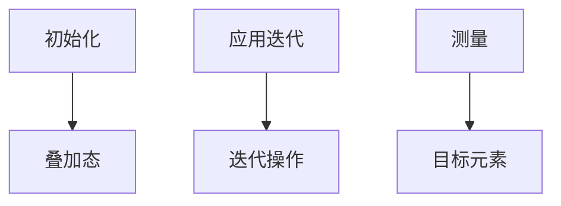

                 

## 引言

### 量子计算与网络安全的重要性

在当今快速发展的信息技术时代，量子计算和网络安全正成为两个备受关注的热点领域。量子计算，作为下一代计算技术的代表，以其超强的并行处理能力和独特的量子特性，有望在各个领域引发一场革命。而网络安全，则是保障信息社会稳定运行的核心基础，随着互联网的普及和数据的爆炸性增长，网络安全问题变得日益严峻。

在这两个领域中，量子计算的应用对于网络安全具有深远的影响。量子计算不仅能够提供前所未有的计算速度，还可以在加密技术、入侵检测等领域带来突破性的进展。传统的加密技术，例如RSA、ECC等，在面对量子计算机的强大计算能力时，显得越来越脆弱。因此，开发量子加密技术成为保障网络安全的重要课题。

本文旨在深入探讨量子计算在网络安全中的应用，通过系统性地介绍量子计算的基础知识、网络安全的基础知识、量子加密技术的原理和应用，以及量子计算在网络安全中的具体应用实例，分析量子计算对网络安全带来的挑战和机遇，展望量子计算在网络安全领域的未来发展趋势。本文不仅适合对量子计算和网络安全有一定了解的专业人士，同时也希望为对这两个领域感兴趣的读者提供有价值的参考。

### 关键词

- 量子计算
- 网络安全
- 量子加密
- 量子计算机
- 加密技术

### 摘要

本文围绕量子计算在网络安全中的应用进行深入探讨。首先，介绍了量子计算的基础知识，包括量子比特、量子叠加、量子纠缠等基本概念和原理。其次，分析了网络安全的基础知识，讨论了网络安全的五大原则、主要挑战以及常见威胁。接着，详细介绍了量子加密技术的原理、优势与挑战，并分析了量子加密在网络安全中的应用案例。随后，探讨了量子计算在加密技术、破解传统加密算法以及网络安全监控与防御中的具体应用。最后，展望了量子计算在网络安全领域的未来发展趋势，探讨了面临的挑战与对策，并提出了量子计算与网络安全教育的建议。通过本文的讨论，希望为读者提供对量子计算在网络安全中应用的全面理解。

### 目录大纲

#### 第一部分：量子计算基础

**第1章：量子计算概述**

1.1 量子计算的概念与历史  
1.1.1 量子力学的基本原理  
1.1.2 量子位与量子比特  
1.1.3 量子计算的优势与挑战

1.2 量子计算机的工作原理  
1.2.1 量子叠加原理  
1.2.2 量子纠缠现象  
1.2.3 量子门与量子算法

1.3 量子计算的应用领域  
1.3.1 量子模拟  
1.3.2 量子加密  
1.3.3 量子搜索与优化

**第2章：网络安全基础**

2.1 网络安全的概念与挑战  
2.1.1 网络安全的定义  
2.1.2 网络安全的五大原则  
2.1.3 当前网络安全面临的主要挑战

2.2 常见的网络安全威胁  
2.2.1 黑客攻击  
2.2.2 恶意软件  
2.2.3 社会工程攻击

2.3 网络安全防护措施  
2.3.1 防火墙  
2.3.2 入侵检测系统  
2.3.3 数据加密

**第3章：量子加密技术**

3.1 量子加密的基本原理  
3.1.1 量子密钥分发（QKD）  
3.1.2 量子隐形传态  
3.1.3 量子密码学

3.2 量子加密的优势与挑战  
3.2.1 量子加密的安全性优势  
3.2.2 量子加密的实现挑战

3.3 量子加密的应用案例  
3.3.1 量子密钥分发在实际中的应用  
3.3.2 量子密码学在网络安全中的潜在应用

**第4章：量子计算在网络安全中的应用**

4.1 量子计算在加密技术中的应用  
4.1.1 增强对称加密算法的效率  
4.1.2 构建安全的非对称加密系统  
4.1.3 量子计算在数字签名中的应用

4.2 量子计算在破解传统加密算法中的应用  
4.2.1 传统加密算法的局限性  
4.2.2 量子计算机对传统加密算法的威胁  
4.2.3 应对策略与未来发展

4.3 量子计算在网络安全监控与防御中的应用  
4.3.1 量子入侵检测系统  
4.3.2 量子威胁情报分析  
4.3.3 量子防火墙技术

**第5章：量子计算在网络安全领域的未来展望**

5.1 量子计算对网络安全的影响  
5.1.1 量子计算对现有网络安全架构的挑战  
5.1.2 量子计算促进网络安全技术的发展

5.2 量子计算在网络安全中的应用前景  
5.2.1 量子加密技术的未来发展趋势  
5.2.2 量子计算在网络安全防御中的应用前景  
5.2.3 量子计算与云计算的融合

5.3 量子计算在网络安全领域的挑战与对策  
5.3.1 技术挑战  
5.3.2 法规与标准制定  
5.3.3 混合计算模型的未来发展

**第6章：量子计算与网络安全教育**

6.1 量子计算教育的重要性  
6.1.1 量子计算在学术研究中的地位  
6.1.2 量子计算对未来的影响  
6.1.3 量子计算教育在网络安全领域的应用

6.2 量子计算与网络安全课程设置  
6.2.1 量子力学基础课程  
6.2.2 量子计算原理课程  
6.2.3 量子加密与网络安全课程

6.3 量子计算与网络安全人才培养  
6.3.1 教育体系构建  
6.3.2 实践与创新能力的培养  
6.3.3 国际合作与交流

**第7章：量子计算在网络安全中的应用案例分析**

7.1 案例一：量子密钥分发在金融领域的应用  
7.1.1 案例背景  
7.1.2 案例分析  
7.1.3 案例总结

7.2 案例二：量子加密在政府部门中的应用  
7.2.1 案例背景  
7.2.2 案例分析  
7.2.3 案例总结

7.3 案例三：量子计算在网络安全公司的应用  
7.3.1 案例背景  
7.3.2 案例分析  
7.3.3 案例总结

----------------------------------------------

----------------------------------------------

## 第1章 量子计算概述

### 1.1 量子计算的概念与历史

#### 1.1.1 量子力学的基本原理

量子计算起源于量子力学的理论。量子力学是研究物质微观世界的物理学分支，它揭示了微观粒子的行为规律，如波粒二象性、量子叠加和量子纠缠等。量子力学的这些基本原理为量子计算提供了理论基础。

1. **波粒二象性**：在量子力学中，粒子如电子和光子同时展现出波动性和粒子性。这一特性使得量子计算机中的量子比特（qubit）可以处于0和1的叠加状态，从而实现超强的计算能力。

2. **量子叠加**：传统计算机的比特（bit）只能处于0或1的状态，而量子比特（qubit）可以同时处于0和1的叠加状态。这意味着一个量子计算机中的多个量子比特可以同时表示大量的数据，大大提高了计算效率。

3. **量子纠缠**：两个或多个量子比特之间可以形成量子纠缠状态，即使它们相隔很远，它们的状态也会相互关联。这种纠缠特性是量子计算中实现高速计算和并行处理的关键。

#### 1.1.2 量子位与量子比特

量子比特（qubit）是量子计算机的基本单元，它与经典比特不同，具有量子叠加和量子纠缠的特性。一个量子比特可以同时处于0和1的状态，而经典比特只能处于0或1的状态。

1. **量子位的表示**：量子比特的状态可以用一个复数来表示，例如 \( \alpha|0\rangle + \beta|1\rangle \)，其中 \(|\alpha|^2 \) 和 \(|\beta|^2 \) 分别是0态和1态的概率。

2. **量子叠加的实现**：量子叠加可以通过量子门操作来实现。量子门是量子计算中的基本操作单元，类似于经典计算机中的逻辑门，但它作用于量子比特，改变其叠加态。

#### 1.1.3 量子计算的优势与挑战

量子计算具有许多独特的优势，但也面临一些挑战。

1. **并行计算能力**：量子计算机可以利用量子叠加和量子纠缠，在短时间内处理大量并行任务，大大提高计算效率。

2. **高速数据处理**：量子计算机可以快速处理大量数据，这对于某些复杂的计算问题，如大整数的分解、量子模拟等，具有显著的优势。

3. **量子加密**：量子计算在加密技术中具有广泛的应用前景，可以提供更安全的通信方式，如量子密钥分发（QKD）。

4. **挑战**：
   - **实现难度**：构建稳定的量子计算机需要克服多种技术难题，如量子比特的相干性、误差纠正等。
   - **量子退相干**：量子比特之间存在一种称为退相干的现象，它可能导致量子态的失真，影响计算结果。
   - **量子误差纠正**：量子计算机中的操作容易受到外部干扰，导致量子比特的状态出错，因此需要开发有效的量子纠错算法。

### 1.2 量子计算机的工作原理

量子计算机的工作原理基于量子力学的基本原理，包括量子叠加、量子纠缠和量子门操作。

#### 1.2.1 量子叠加原理

量子叠加原理是量子计算的核心原理之一。根据量子叠加原理，一个量子比特可以同时处于0和1的状态。这意味着一个量子计算机中的多个量子比特可以同时表示大量的数据，从而实现并行计算。

1. **量子叠加态的表示**：一个n个量子比特的状态可以表示为 \( \sum_{i_1i_2...i_n} c_{i_1i_2...i_n} |i_1i_2...i_n\rangle \)，其中 \(|i_1i_2...i_n\rangle \) 是量子比特的叠加态，\( c_{i_1i_2...i_n} \) 是该状态的复数系数。

2. **量子叠加的实现**：量子叠加可以通过量子门操作来实现。例如，通过 Hadamard 门可以将一个经典比特的状态转换为量子叠加态。

#### 1.2.2 量子纠缠现象

量子纠缠是量子计算机的另一个核心原理。量子纠缠是指两个或多个量子比特之间的状态相互关联，即使它们相隔很远。这种关联性是量子计算机实现高速计算和并行处理的关键。

1. **量子纠缠态的表示**：两个量子比特的纠缠态可以表示为 \( \frac{1}{\sqrt{2}} (|00\rangle + |11\rangle) \)。

2. **量子纠缠的实现**：量子纠缠可以通过量子门的操作来实现。例如，通过CNOT门可以实现两个量子比特的纠缠。

#### 1.2.3 量子门与量子算法

量子门是量子计算机中的基本操作单元，类似于经典计算机中的逻辑门。量子门的作用是改变量子比特的状态，实现量子计算的基本操作。

1. **量子门的作用**：量子门可以改变量子比特的叠加态和纠缠态，实现量子计算的各种操作。

2. **量子算法**：量子算法是利用量子计算机的并行计算能力和量子叠加、量子纠缠等特性，解决特定问题的算法。著名的量子算法包括Shor算法和Grover算法等。

### 1.3 量子计算的应用领域

量子计算在多个领域具有广泛的应用前景，包括量子模拟、量子加密、量子搜索和优化等。

#### 1.3.1 量子模拟

量子模拟是一种利用量子计算机模拟量子系统的方法。通过量子模拟，可以研究量子系统的行为，解决经典计算机无法解决的问题。

1. **应用**：量子模拟在化学、材料科学、生物信息学等领域具有广泛的应用。例如，可以用于模拟分子结构、化学反应路径等。

2. **挑战**：量子模拟面临的挑战包括量子比特的相干性、误差纠正等。

#### 1.3.2 量子加密

量子加密是一种利用量子计算机进行加密和解密的方法。量子加密具有极高的安全性，因为量子计算机无法破解。

1. **应用**：量子加密在网络安全、金融、政府等领域具有广泛的应用。例如，可以用于保障通信安全、保护金融交易等。

2. **挑战**：量子加密面临的挑战包括量子比特的相干性、量子密钥分发等。

#### 1.3.3 量子搜索与优化

量子搜索是一种利用量子计算机进行快速搜索的方法。通过量子搜索，可以在短时间内找到特定的信息。

1. **应用**：量子搜索在搜索引擎、数据挖掘、调度优化等领域具有广泛的应用。例如，可以用于快速搜索大量数据、优化生产调度等。

2. **挑战**：量子搜索面临的挑战包括量子比特的相干性、量子纠错等。

## 小结

量子计算作为一种新兴的计算技术，具有巨大的潜力和广泛的应用前景。通过量子叠加和量子纠缠等特性，量子计算可以实现超强的计算能力，为解决复杂问题提供新的方法。然而，量子计算也面临许多挑战，如量子比特的相干性、误差纠正等。随着量子计算技术的发展，这些问题有望逐步解决，为量子计算在各个领域的应用铺平道路。

### 第1章 量子计算概述

#### 1.2 量子计算机的工作原理

量子计算机的工作原理基于量子力学的基本原理，包括量子叠加、量子纠缠和量子门操作。通过理解这些原理，我们可以更好地了解量子计算机如何实现超越传统计算机的强大计算能力。

##### 1.2.1 量子叠加原理

量子叠加原理是量子计算机的核心原理之一。在经典计算中，比特（bit）只能处于两种状态之一：0或1。然而，在量子计算中，量子比特（qubit）可以同时处于0和1的叠加状态。这种叠加态可以用一个复数系数来表示，例如 \( \alpha|0\rangle + \beta|1\rangle \)，其中 \(|\alpha|^2 \) 和 \(|\beta|^2 \) 分别是0态和1态的概率。

这个叠加态的概念可以用一个简单的例子来说明。假设我们有一个量子比特，我们无法确定它是处于0态还是1态，除非我们对其进行测量。当我们测量这个量子比特时，它会随机地坍缩为0或1中的一个状态。但是，在未测量之前，它处于一种叠加态，意味着它同时是0和1的状态。

量子叠加的实现可以通过量子门操作来实现。Hadamard门是一个常用的量子门，它可以将经典比特的状态转换为量子叠加态。Hadamard门的作用是将一个量子比特的状态从 \(|0\rangle\) 变换为 \( \frac{1}{\sqrt{2}} (|0\rangle + |1\rangle) \)，将 \(|1\rangle\) 变换为 \( \frac{1}{\sqrt{2}} (|0\rangle - |1\rangle) \)。

以下是Hadamard门的Mermaid流程图：

```mermaid
graph TD
    A1[|0\rangle] --> B1[|0\rangle + |1\rangle /sqrt{2} ]
    A2[|1\rangle] --> B2[|0\rangle - |1\rangle /sqrt{2} ]
```

##### 1.2.2 量子纠缠现象

量子纠缠是量子计算机的另一个核心原理。量子纠缠是指两个或多个量子比特之间的状态相互关联，即使它们相隔很远。这种关联性是量子计算机实现高速计算和并行处理的关键。

量子纠缠可以通过量子门操作来实现。CNOT门是一种常用的量子门，它可以实现两个量子比特之间的纠缠。假设我们有两个量子比特 \(|a\rangle\) 和 \(|b\rangle\)，初始状态分别为 \(|0\rangle\) 和 \(|0\rangle\)。当我们对 \(|a\rangle\) 应用CNOT门，并根据 \(|b\rangle\) 的状态来决定 \(|a\rangle\) 的状态，我们就可以得到两个量子比特的纠缠状态。

以下是CNOT门的Mermaid流程图：

```mermaid
graph TD
    A1[|0\rangle] --> B1[|0\rangle]
    A2[|0\rangle] --> B2[|1\rangle]
    A3[|1\rangle] --> B3[|1\rangle]
    A4[|1\rangle] --> B4[|0\rangle]
```

当我们在 \(|a\rangle\) 上应用一个控制操作，如Hadamard门，并根据 \(|b\rangle\) 的状态来决定 \(|a\rangle\) 的状态，我们可以得到两个量子比特的纠缠状态。例如，当 \(|b\rangle\) 为 \(|0\rangle\) 时， \(|a\rangle\) 变为 \(|0\rangle\)；当 \(|b\rangle\) 为 \(|1\rangle\) 时， \(|a\rangle\) 变为 \(|1\rangle\)。这种纠缠状态可以表示为 \( \frac{1}{\sqrt{2}} (|00\rangle + |11\rangle) \)。

##### 1.2.3 量子门与量子算法

量子门是量子计算机中的基本操作单元，类似于经典计算机中的逻辑门。量子门的作用是改变量子比特的状态，实现量子计算的各种操作。

量子算法是利用量子计算机的并行计算能力和量子叠加、量子纠缠等特性，解决特定问题的算法。著名的量子算法包括Shor算法和Grover算法等。

Shor算法是一种利用量子计算机进行大整数分解的算法。Shor算法的时间复杂度为 \(O(\log^2 n) \)，远远优于传统算法的 \(O(n^{\frac{1}{2}}) \)。以下是Shor算法的简化步骤：

1. 将大整数 \(N\) 分解为质因数 \(P\) 和 \(Q\)。
2. 计算 \(N\) 的模 \(P-1\) 的值。
3. 找到一个数 \(a\)，使得 \(a^{\frac{N-1}{2}} \mod N = 1\)。
4. 计算 \(a^d \mod N\)，其中 \(d\) 是 \(P-1\) 的因子。
5. 如果 \(a^d \mod N = 1\)，则 \(P = a^d \mod N\)。

Grover算法是一种利用量子计算机进行搜索的算法。Grover算法的时间复杂度为 \(O(\sqrt{N}) \)，远远优于传统搜索算法的 \(O(N) \)。以下是Grover算法的简化步骤：

1. 初始化量子态，将所有量子比特设置为叠加态。
2. 应用Grover迭代操作 \(k\) 次，其中 \(k = \lceil \frac{2}{9} N \rceil \)。
3. 测量量子态，得到目标元素的索引。

以下是Grover算法的Mermaid流程图：



通过量子叠加、量子纠缠和量子算法，量子计算机能够实现超强的计算能力，为解决复杂问题提供新的方法。然而，量子计算机的实现也面临许多挑战，如量子比特的相干性、误差纠正等。随着量子计算技术的发展，这些问题有望逐步解决，为量子计算机的广泛应用铺平道路。

### 1.3 量子计算的应用领域

量子计算在多个领域具有广泛的应用前景，其独特的能力正在逐步改变这些领域的面貌。以下是量子计算在量子模拟、量子加密、量子搜索和优化等领域的应用及其各自的特点：

#### 1.3.1 量子模拟

量子模拟是量子计算最具潜力的应用之一。它利用量子计算机来模拟量子系统的行为，这是传统计算机无法做到的。例如，量子模拟可以帮助科学家理解分子如何相互作用，预测化学反应的路径，以及设计新材料。量子模拟的应用领域包括：

1. **化学与材料科学**：通过模拟分子和材料的量子行为，可以优化药物设计、催化剂开发和新材料合成。
2. **生物学**：模拟生物分子如DNA和蛋白质的量子效应，有助于理解生物过程的机制，加速新药研发。
3. **气候模型**：量子模拟可以用于更精确地模拟气候变化，提供更可靠的气候预测。

量子模拟的优势在于其能够处理复杂的多体问题，并且在模拟量子现象时具有高度并行性。然而，量子模拟的挑战在于量子比特的相干性和计算误差，以及如何设计有效的量子算法来模拟复杂系统。

#### 1.3.2 量子加密

量子加密利用量子比特的叠加和纠缠特性来提供比传统加密方法更安全的通信方式。量子加密的核心技术包括量子密钥分发（QKD）和量子密码学。

1. **量子密钥分发（QKD）**：QKD是一种通过量子通信方式分发密钥的方法，它利用量子比特的不可克隆特性来确保密钥的安全性。如果攻击者试图窃听，会导致量子比特的状态发生改变，从而被通信双方检测到。
2. **量子密码学**：量子密码学包括一系列基于量子力学原理的加密算法，如量子隐形传态和量子密码共享。这些算法能够抵抗量子计算机的攻击，提供比传统密码系统更高级别的安全性。

量子加密的优势在于其能够抵抗量子计算机的破解，为未来的信息安全提供保障。然而，量子加密的实现面临技术挑战，如量子通信距离限制和量子比特的稳定性问题。

#### 1.3.3 量子搜索与优化

量子搜索和优化利用量子计算机的并行计算能力来提高搜索效率和解决优化问题。量子搜索算法如Grover算法能够显著加速未排序数据库的搜索过程，而量子优化算法如Adiabatic量子计算和Quantum Approximate Optimization Algorithm（QAOA）则被应用于各种优化问题。

1. **搜索**：量子搜索算法可以加速找到数据库中的特定条目，尤其适用于大规模数据的快速检索。
2. **优化**：量子优化算法可以解决组合优化问题，如旅行商问题、库存管理和资源分配等。

量子搜索与优化的优势在于其能够处理复杂的问题，并在短时间内找到最优解。然而，量子搜索与优化的挑战在于如何设计有效的量子算法，以及如何在实际应用中实现量子比特的精确控制。

#### 1.3.4 其他应用

除了上述主要应用领域，量子计算还在其他领域展现出了巨大的潜力：

1. **量子计算服务**：通过云计算平台提供量子计算服务，使得企业和研究人员能够访问量子计算机资源，进行科学研究和商业应用。
2. **金融服务**：量子计算可以帮助金融机构在风险管理、资产定价和算法交易等方面提高效率和准确性。
3. **物联网**：量子计算可以增强物联网设备的安全性和通信效率，推动物联网技术的发展。

量子计算的应用领域不断扩展，随着技术的进步和量子计算机的实现，它将在未来发挥越来越重要的作用。然而，要充分发挥量子计算的优势，还需要克服一系列技术挑战，包括量子比特的稳定性、量子纠错以及算法设计等。

### 第2章 网络安全基础

#### 2.1 网络安全的概念与挑战

网络安全是指保护计算机系统、网络和数据的完整性、保密性和可用性，防止未授权的访问、篡改、破坏和泄露。在当今数字化社会中，网络安全已经变得至关重要，因为几乎所有的关键基础设施、商业活动和个人生活都依赖于互联网和通信技术。以下是网络安全的一些基本概念和面临的挑战。

##### 2.1.1 网络安全的定义

网络安全可以从多个角度进行定义，包括以下几个方面：

1. **保密性**：确保信息只能被授权的用户访问和理解。
2. **完整性**：确保信息在传输和存储过程中未被篡改或破坏。
3. **可用性**：确保系统和数据在需要时能够被正常使用，不受攻击或拒绝服务（DoS）的干扰。
4. **可控性**：确保能够控制和监控网络活动，防止未授权的行为。
5. **可审查性**：确保网络事件可以被记录和审计，以帮助追溯和调查。

##### 2.1.2 网络安全的五大原则

网络安全的五大原则是设计、实施和维护安全系统的基础，包括：

1. **机密性**：确保信息在传输和存储过程中不会被未授权的第三方获取。
2. **完整性**：确保信息在传输和存储过程中不会被未授权的第三方篡改或破坏。
3. **可用性**：确保系统和数据在需要时能够正常使用，不会受到拒绝服务攻击的影响。
4. **认证**：确保通信双方的合法身份，防止假冒和欺诈。
5. **不可否认性**：确保通信双方的行为可以被验证，不能否认自己的行为。

##### 2.1.3 当前网络安全面临的主要挑战

尽管网络安全已经取得了显著的进展，但当前仍然面临许多挑战：

1. **高级持续性威胁（APT）**：APT是指针对特定目标进行长期、复杂的攻击活动。这些攻击通常利用0-day漏洞、恶意软件和网络钓鱼等手段，很难被传统防御措施检测到。
2. **数据泄露**：随着数据量的急剧增加，数据泄露事件变得越来越频繁。这些泄露可能来自内部员工的恶意行为、网络攻击或系统漏洞。
3. **勒索软件**：勒索软件是一种恶意软件，它通过加密受害者的数据并要求赎金来解锁。勒索软件已经成为一种流行的网络攻击手段，对个人和企业都造成了巨大损失。
4. **物联网安全**：随着物联网设备的普及，它们成为新的攻击目标。由于物联网设备通常缺乏有效的安全措施，攻击者可以利用这些设备进行网络攻击。
5. **云计算安全**：云计算的广泛应用带来了新的安全挑战。云服务提供商需要确保其基础设施的安全，同时客户也需要保护自己的数据和应用程序。

为了应对这些挑战，网络安全领域正在不断发展，包括引入新的防御技术、制定更严格的安全标准和加强安全意识教育。

### 2.2 常见的网络安全威胁

网络安全威胁种类繁多，以下是一些常见的威胁及其特点：

##### 2.2.1 黑客攻击

黑客攻击是指未经授权的个体或组织非法访问计算机系统或网络，进行数据窃取、篡改或破坏。黑客攻击可以分为以下几种类型：

1. **DDoS攻击**：分布式拒绝服务攻击（DDoS）是指攻击者通过控制大量僵尸主机，向目标服务器发送大量请求，导致服务器瘫痪。
2. **SQL注入**：SQL注入是一种通过在输入字段中插入恶意SQL语句，欺骗数据库执行未授权操作的攻击方法。
3. **网络钓鱼**：网络钓鱼攻击是指攻击者通过伪造电子邮件或网站，骗取受害者的个人信息，如用户名、密码和信用卡信息。

##### 2.2.2 恶意软件

恶意软件是指被设计用来破坏、篡改或非法访问计算机系统的软件。以下是一些常见的恶意软件类型：

1. **病毒**：病毒是一种可以自我复制并感染其他程序的恶意代码。它可以通过电子邮件附件、下载文件或网络共享进行传播。
2. **木马**：木马是一种隐藏在合法程序中的恶意软件，它可以远程控制受害者的计算机，窃取敏感信息或进行其他恶意活动。
3. **勒索软件**：勒索软件是一种加密受害者数据的恶意软件，通常要求支付赎金来解锁数据。

##### 2.2.3 社会工程攻击

社会工程攻击是指利用人类心理和社会因素，欺骗受害者泄露敏感信息或执行未授权操作的攻击方法。以下是一些常见的社会工程攻击类型：

1. **网络钓鱼**：通过伪造的电子邮件或网站，骗取受害者的用户名、密码和其他敏感信息。
2. **电话诈骗**：通过电话欺骗受害者，使其相信存在紧急情况，从而泄露个人信息或转账资金。
3. **社交工程攻击**：通过建立信任关系，骗取受害者的机密信息或访问权限。

这些网络安全威胁对个人、企业和组织都构成了严重威胁，因此需要采取有效的安全措施来预防和应对。

### 2.3 网络安全防护措施

为了应对网络安全的威胁，需要采取一系列的防护措施来保护计算机系统、网络和数据。以下是一些常见的网络安全防护措施：

##### 2.3.1 防火墙

防火墙是一种网络安全设备，用于控制进出网络的流量，根据预设的安全策略来允许或阻止数据包。防火墙可以阻止未经授权的访问，防止外部攻击进入内部网络。常见的防火墙类型包括：

1. **包过滤防火墙**：根据数据包的源地址、目标地址、端口号等特征进行过滤，允许或拒绝数据包通过。
2. **状态检测防火墙**：在包过滤的基础上，通过跟踪连接的状态，提供更高级别的安全控制。
3. **下一代防火墙**（NGFW）：结合传统的防火墙功能，添加应用层识别和防病毒功能，提供更全面的防护。

##### 2.3.2 入侵检测系统

入侵检测系统（IDS）是一种用于检测和响应网络攻击的网络安全设备。IDS可以监视网络流量，识别潜在的攻击行为，并向管理员发出警报。IDS可以分为以下几种类型：

1. **网络入侵检测系统（NIDS）**：监视网络流量，检测网络层和传输层的数据包，识别恶意流量模式。
2. **主机入侵检测系统（HIDS）**：监视主机的系统日志和活动，检测异常行为和恶意软件感染。
3. **入侵防御系统（IPS）**：结合IDS的功能，主动阻止攻击行为，阻止恶意流量进入网络。

##### 2.3.3 数据加密

数据加密是一种通过将数据转换为密文来保护其机密性的方法。加密技术可以确保即使数据被截获，攻击者也无法解密和读取数据。以下是一些常用的加密技术：

1. **对称加密**：使用相同的密钥进行加密和解密。常见的对称加密算法包括AES、DES和RSA。
2. **非对称加密**：使用不同的密钥进行加密和解密，一个用于加密，一个用于解密。常见的非对称加密算法包括RSA和ECC。
3. **哈希函数**：用于将输入数据转换为固定长度的字符串，确保数据的完整性和不可篡改性。常见的哈希函数包括SHA-256、SHA-3和MD5。

这些网络安全防护措施可以帮助企业和组织建立全面的安全防御体系，保护其信息和资产免受网络攻击的威胁。

### 第2章 网络安全基础

#### 2.3 网络安全防护措施

网络安全防护措施是确保信息和数据安全的重要手段。随着网络攻击手段的不断演进，单一的防护措施已无法满足安全需求，需要综合利用多种技术手段，构建多层次、多维度的安全防护体系。

##### 2.3.1 防火墙

防火墙是最基础也是最传统的网络安全防护措施之一。防火墙的主要功能是监控和控制网络流量，根据预定的安全策略，允许或拒绝数据包通过。防火墙分为以下几种类型：

1. **包过滤防火墙**：包过滤防火墙根据数据包的源IP地址、目的IP地址、端口号等特征进行过滤，决定是否允许数据包通过。这种防火墙简单高效，但仅能对已知的攻击进行防护。

2. **状态检测防火墙**：状态检测防火墙在包过滤的基础上，增加了对TCP连接状态的检测和跟踪。通过维护连接状态表，防火墙可以识别合法的数据包和攻击数据包，提供更细粒度的访问控制。

3. **下一代防火墙（NGFW）**：NGFW结合了传统防火墙的功能，并增加了应用层识别和防病毒功能。NGFW能够识别应用层协议和数据内容，对恶意流量进行实时检测和阻止，提供更高级别的安全防护。

##### 2.3.2 入侵检测系统

入侵检测系统（IDS）是一种用于监控网络活动、识别潜在攻击和异常行为的系统。IDS可以分为以下两种类型：

1. **网络入侵检测系统（NIDS）**：NIDS监控网络流量，通过分析数据包的内容和特征，识别网络层和传输层的数据包是否包含攻击行为。NIDS通常部署在网络的入口或出口，对进出网络的流量进行全面监控。

2. **主机入侵检测系统（HIDS）**：HIDS监控主机上的日志文件和系统活动，通过分析日志文件的变化和系统资源的异常使用，识别主机是否受到攻击。HIDS可以在主机上本地运行，对主机进行实时监控和保护。

入侵检测系统通过收集和分析大量的网络流量和主机日志数据，可以及时发现潜在的安全威胁，并采取相应的措施进行响应。

##### 2.3.3 数据加密

数据加密是保护数据机密性和完整性的重要手段。加密技术将明文数据转换为密文，使得未授权的用户无法理解或访问数据。常用的加密技术包括：

1. **对称加密**：对称加密使用相同的密钥进行加密和解密。常见的对称加密算法有AES、DES和RSA。对称加密算法的优点是加密和解密速度快，但密钥管理复杂。

2. **非对称加密**：非对称加密使用一对密钥（公钥和私钥）进行加密和解密。公钥用于加密，私钥用于解密。常见的非对称加密算法有RSA和ECC。非对称加密算法的优点是密钥管理简单，但加密和解密速度相对较慢。

3. **哈希函数**：哈希函数将输入数据转换为固定长度的字符串，常用于确保数据的完整性和真实性。常见的哈希函数有MD5、SHA-256和SHA-3。哈希函数的特点是单向性，即无法从哈希值反推出原始数据。

数据加密技术可以确保数据在传输和存储过程中的安全，防止数据被窃取或篡改。

##### 2.3.4 其他安全措施

除了上述基本防护措施，还有一些其他的安全措施可以增强网络的安全性：

1. **安全信息和事件管理系统（SIEM）**：SIEM系统集成了日志管理和事件管理功能，可以对网络活动进行全面监控和审计。通过实时分析和关联不同来源的安全事件，SIEM可以帮助组织快速发现和响应安全威胁。

2. **安全培训和教育**：提高员工的安全意识和技能是网络安全的重要环节。通过定期的安全培训和教育，可以增强员工对网络威胁的认识和应对能力，减少人为错误导致的安全风险。

3. **安全审计和合规性检查**：定期进行安全审计和合规性检查，可以确保组织的安全措施得到有效实施，符合相关法律法规和标准要求。

网络安全防护措施需要根据组织的需求和实际情况进行合理配置和优化。通过多层次、多维度的安全防护措施，可以有效地保护网络和信息系统的安全。

### 第2章 网络安全基础

#### 2.3 网络安全防护措施

网络安全防护措施是确保信息和数据安全的关键。随着网络安全威胁的日益复杂，单一的安全措施已无法满足现代网络的安全需求。因此，需要采用多层次、多维度的安全防护策略，以全面保障网络的安全。

##### 2.3.1 防火墙

防火墙是网络安全防护的第一道防线，用于控制进出网络的数据流量。防火墙通过设定规则，允许或拒绝数据包通过，从而保护内部网络不受外部攻击。

1. **包过滤防火墙**：包过滤防火墙根据数据包的源IP地址、目的IP地址、端口号等特征进行过滤。通过配置合理的过滤规则，可以有效地阻止未授权的访问。

2. **状态检测防火墙**：状态检测防火墙在包过滤的基础上，增加了对网络连接状态的监控。通过维护连接状态表，防火墙可以识别并阻止恶意流量。

3. **下一代防火墙（NGFW）**：NGFW结合了传统防火墙的功能，增加了应用层识别和防病毒功能。NGFW能够深入分析数据包内容，识别和阻止高级威胁。

##### 2.3.2 入侵检测系统

入侵检测系统（IDS）用于监控网络活动，识别潜在的攻击行为。IDS可以分为以下几种类型：

1. **网络入侵检测系统（NIDS）**：NIDS监控网络流量，通过分析数据包的特征，识别恶意流量模式。

2. **主机入侵检测系统（HIDS）**：HIDS监控主机上的日志文件和系统活动，通过分析日志和系统资源的异常使用，识别主机是否受到攻击。

3. **入侵防御系统（IPS）**：IPS结合了IDS的功能，能够主动防御攻击行为，阻止恶意流量进入网络。

##### 2.3.3 数据加密

数据加密是保护数据机密性和完整性的重要手段。通过加密，可以将明文数据转换为密文，防止未授权的访问和篡改。

1. **对称加密**：对称加密使用相同的密钥进行加密和解密。常见的对称加密算法有AES、DES和RSA。

2. **非对称加密**：非对称加密使用一对密钥（公钥和私钥）进行加密和解密。公钥用于加密，私钥用于解密。常见的非对称加密算法有RSA和ECC。

3. **哈希函数**：哈希函数将输入数据转换为固定长度的字符串，用于确保数据的完整性和真实性。常见的哈希函数有MD5、SHA-256和SHA-3。

##### 2.3.4 其他安全措施

除了上述基本防护措施，还有其他一些重要的安全措施：

1. **安全信息和事件管理系统（SIEM）**：SIEM系统集成了日志管理和事件管理功能，可以对网络活动进行全面监控和审计。

2. **安全培训和教育**：通过定期的安全培训和教育，提高员工的安全意识和技能。

3. **安全审计和合规性检查**：定期进行安全审计和合规性检查，确保安全措施得到有效实施。

4. **物理安全**：确保机房、服务器等关键设施的安全，防止物理攻击。

通过综合运用上述安全措施，可以构建一个全面、有效的网络安全防护体系，确保网络和信息系统的安全。

### 第3章 量子加密技术

#### 3.1 量子加密的基本原理

量子加密是一种利用量子力学原理来保障通信安全的技术。它基于量子比特（qubit）的叠加和纠缠特性，提供一种无法被传统计算机破解的通信方式。以下是量子加密中的三种核心技术：量子密钥分发（QKD）、量子隐形传态和量子密码学。

##### 3.1.1 量子密钥分发（QKD）

量子密钥分发（Quantum Key Distribution，QKD）是量子加密的核心技术之一。QKD利用量子比特的叠加和纠缠特性，在通信双方之间安全地分发共享密钥。

1. **原理**：
   - QKD的基本过程包括两个步骤：量子态传输和经典通信。
   - 在量子态传输过程中，发送方将量子态通过量子信道发送给接收方。这个量子态可以是单光子态或纠缠态。
   - 在接收方收到量子态后，通过对量子态进行测量，可以得到部分密钥信息。

2. **安全性**：
   - 量子比特的叠加态在传输过程中很容易被窃听检测。如果攻击者尝试窃听量子态，会导致量子态发生退相干，使得接收方能够检测到窃听行为。
   - 因此，QKD可以提供一种绝对安全的通信方式，确保密钥不被第三方获取。

3. **应用**：
   - QKD已经在金融、政府、军事等领域得到了广泛应用，用于保障重要通信的安全。

##### 3.1.2 量子隐形传态

量子隐形传态（Quantum Teleportation）是一种利用量子纠缠来实现信息传递的技术。通过量子隐形传态，可以在两个远程的量子比特之间实现即时通信，而不需要通过物理信道传输。

1. **原理**：
   - 量子隐形传态需要三个量子比特：一个要传输的量子比特（信源），一个作为信道的量子比特（中继），以及一个接收方量子比特。
   - 在传输过程中，信源和接收方量子比特处于纠缠态。通过在信源和信道之间进行一系列操作，可以将信源的状态转移到接收方量子比特。

2. **安全性**：
   - 量子隐形传态利用量子纠缠特性，即使通信双方相隔很远，也能实现信息的即时传输。
   - 由于量子纠缠的不可复制性，攻击者无法在未授权的情况下复制或窃取量子态，从而保障通信安全。

3. **应用**：
   - 量子隐形传态在量子通信和量子计算中具有重要应用，可以用于构建安全的量子通信网络。

##### 3.1.3 量子密码学

量子密码学是利用量子力学原理构建的加密算法。量子密码学算法包括量子密钥生成、量子加密和量子数字签名等。

1. **量子密钥生成**：
   - 量子密钥生成利用量子力学原理，在通信双方之间安全地生成共享密钥。
   - 常见的量子密钥生成算法包括量子一次一密（Quantum One-Time Pad）和基于量子纠缠的密钥分发。

2. **量子加密**：
   - 量子加密算法利用量子态的叠加和纠缠特性，实现数据的加密和解密。
   - 量子加密算法可以抵抗传统计算机的破解，提供更高的安全性。

3. **量子数字签名**：
   - 量子数字签名是一种利用量子力学原理实现数字签名的方法。
   - 量子数字签名可以确保签名的不可抵赖性和数据的完整性。

4. **安全性**：
   - 量子密码学算法基于量子力学的不可逆特性，即使攻击者获得部分量子态，也无法解密信息。
   - 量子密码学提供了一种绝对安全的通信方式，可以应用于金融、政府、国防等领域。

#### 3.1.4 量子密码学的优势与挑战

量子密码学具有显著的安全优势，但也面临一些技术挑战。

1. **优势**：
   - **不可破解性**：量子密码学算法基于量子力学的不可逆特性，攻击者无法在经典计算机上破解加密信息。
   - **安全性高**：量子加密可以提供比传统加密方法更高的安全性，确保数据在传输过程中不被窃听或篡改。

2. **挑战**：
   - **实现难度**：量子密码学实验和实现面临诸多技术难题，如量子比特的相干性、量子态的稳定性和量子比特的纠错等。
   - **通信距离**：量子通信需要长距离传输量子态，当前技术条件下，量子通信的距离有限。

随着量子技术的不断发展，量子密码学将在网络安全领域发挥越来越重要的作用。通过解决上述挑战，量子密码学有望为未来的信息安全提供坚实保障。

### 第3章 量子加密技术

#### 3.2 量子加密的优势与挑战

量子加密技术以其独特的量子特性，提供了前所未有的安全优势，但也面临着一系列技术挑战。以下是量子加密的优势和实现中的主要挑战：

##### 3.2.1 量子加密的安全性优势

1. **量子不可克隆定理**：量子加密基于量子不可克隆定理，这意味着任何尝试复制一个量子态的行为都会导致量子态的破坏。如果攻击者试图窃听量子通信信道，其行为会被量子态的退相干效应所暴露，从而确保通信的机密性。

2. **量子纠缠特性**：量子加密利用量子比特之间的纠缠特性，即使在远距离传输过程中，量子态之间的纠缠关系也能保持，从而确保通信双方之间的信息传递具有高度安全性。

3. **不可逆转性**：量子信息一旦被读取，其量子态就会发生坍缩，无法恢复。这使得量子加密信息在传输过程中不会被中途窃取或篡改，大大提高了通信的安全保障。

4. **绝对安全性**：由于量子加密的不可破解特性，传统的计算机攻击方法在量子计算面前是无效的。量子加密能够提供绝对的安全性，确保通信内容不被未授权者获取。

##### 3.2.2 量子加密的实现挑战

1. **量子比特相干性**：量子比特的相干性是量子计算和量子加密的关键，但量子比特在操作和传输过程中容易受到外界噪声和环境干扰的影响，导致相干性的损失。这种相干性的不稳定限制了量子加密的实现和应用。

2. **量子比特的纠错**：由于量子比特的脆弱性，量子计算和量子加密中的错误率较高。为了确保量子信息的正确性，需要开发高效的量子纠错算法和纠错机制，以降低错误率并提高量子计算的可靠性。

3. **量子通信距离**：量子通信需要通过量子信道进行传输，但当前技术条件下，量子通信的距离有限。为了实现长距离的量子通信，需要开发稳定的量子中继和量子纠缠传输技术。

4. **量子密钥分发（QKD）效率**：量子密钥分发是实现量子加密的关键技术之一，但QKD的传输速率受到量子比特传输效率和信道带宽的限制。提高QKD的效率和稳定性是量子加密实现中的重要挑战。

5. **集成与兼容性**：量子加密技术的实现需要与现有的通信系统进行集成，包括量子通信网络的部署、量子密钥分发系统的建设以及量子加密协议的标准化。如何实现量子加密技术的兼容性和可扩展性也是面临的挑战之一。

总之，量子加密技术具有显著的安全优势，但也面临着一系列技术挑战。随着量子计算和量子通信技术的不断发展，解决这些挑战将使量子加密技术在网络安全领域发挥更大的作用，提供更加安全的通信保障。

### 3.3 量子加密的应用案例

量子加密技术的独特优势使其在多个领域中得到了广泛应用，以下是量子加密在金融、政府和网络安全公司中的实际应用案例。

##### 3.3.1 量子密钥分发在金融领域的应用

金融领域对数据安全的要求极高，量子加密技术为金融交易提供了前所未有的安全保障。以下是一个金融领域应用量子密钥分发（QKD）的案例：

**案例背景**：某大型银行希望保障其跨境交易的机密性，防止数据在传输过程中被窃取。为了提高交易安全性，该银行决定采用量子密钥分发技术来生成和分发加密密钥。

**案例分析**：
1. **部署QKD系统**：银行在跨境交易通道上部署了量子密钥分发系统，该系统包括一个量子密钥生成端和一个量子密钥接收端。
2. **生成密钥**：在交易开始时，银行通过量子密钥生成端生成一对量子密钥，并将其中一个密钥通过量子信道发送给接收端。
3. **密钥分发**：接收端接收到量子密钥后，将其与本地生成的经典密钥进行比对，以确保量子密钥未被窃听。
4. **加密交易数据**：使用量子密钥对交易数据进行加密，确保数据在传输过程中无法被未授权者读取。

**案例总结**：通过量子密钥分发技术，银行成功保障了跨境交易的机密性，防止了数据泄露和窃听风险。这一案例表明量子加密技术在金融领域具有广泛的应用前景，可以为金融交易提供更高级别的安全保护。

##### 3.3.2 量子加密在政府部门中的应用

政府部门负责管理大量敏感信息，因此对通信安全的要求极为严格。量子加密技术为政府部门提供了强大的安全保障。以下是一个政府部门应用量子加密技术的案例：

**案例背景**：某政府部门需要保障其内部通信和文件传输的安全，防止机密信息被外部攻击者窃取。

**案例分析**：
1. **建立量子通信网络**：政府部门建立了量子通信网络，包括多个量子通信节点，通过量子信道进行信息传输。
2. **量子密钥分发**：通过量子密钥分发系统，政府部门在通信双方之间安全地生成共享密钥。
3. **加密文件传输**：使用量子加密算法对文件进行加密，确保文件在传输过程中不被窃取或篡改。
4. **量子安全审计**：通过量子安全审计系统，实时监控通信安全状态，及时发现潜在的安全威胁。

**案例总结**：通过量子加密技术，政府部门成功保障了内部通信和文件传输的安全，防止了敏感信息泄露和攻击风险。这一案例展示了量子加密技术在政府部门的广泛应用潜力，可以为信息安全提供坚实保障。

##### 3.3.3 量子计算在网络安全公司的应用

网络安全公司致力于保护企业和组织的网络安全，量子加密技术为其提供了强大的工具。以下是一个网络安全公司应用量子加密技术的案例：

**案例背景**：某网络安全公司希望为大型企业客户提供更高级别的安全解决方案，提高其网络安全防护能力。

**案例分析**：
1. **部署量子安全设备**：网络安全公司在客户网络中部署了量子安全设备，包括量子密钥分发器和量子加密模块。
2. **量子密钥分发**：通过量子密钥分发技术，网络安全公司为客户和服务器之间安全地生成共享密钥。
3. **加密网络流量**：使用量子加密算法对网络流量进行加密，确保数据在传输过程中不被窃取或篡改。
4. **实时监控**：通过量子安全监控系统，网络安全公司实时监控客户网络的安全状态，及时发现和响应安全事件。

**案例总结**：通过量子加密技术，网络安全公司成功为客户提供了更高级别的安全保护，提高了客户的网络安全防护能力。这一案例表明量子加密技术在网络安全领域具有广泛的应用前景，可以为企业和组织的网络安全提供坚实保障。

### 第4章 量子计算在网络安全中的应用

#### 4.1 量子计算在加密技术中的应用

量子计算在加密技术中的应用具有革命性的潜力，特别是在增强对称加密算法的效率、构建安全的非对称加密系统和量子计算在数字签名中的应用方面。

##### 4.1.1 增强对称加密算法的效率

对称加密算法（如AES）在信息安全中广泛使用，但由于其计算复杂度，在大规模数据处理时可能存在性能瓶颈。量子计算可以通过其并行处理能力显著提高对称加密算法的效率。

1. **原理**：
   - 对称加密算法依赖于大量的迭代运算，如轮密钥生成和字节替换。量子计算机能够同时处理多个迭代运算，大大提高了加密和解密的速度。
   - 通过使用量子算法，如Shor算法，可以快速分解大整数，从而在量子计算机上实现更高效的密钥生成。

2. **应用**：
   - 例如，在加密大量数据时，量子计算机可以并行处理多个数据块，使得加密过程几乎瞬间完成。

3. **优势**：
   - 提高加密和解密速度，减少加密延迟。
   - 增强对称加密算法在大规模数据场景下的性能。

##### 4.1.2 构建安全的非对称加密系统

非对称加密算法（如RSA和ECC）在信息安全中同样至关重要，但其安全性依赖于大整数的难以分解性。量子计算的出现对传统非对称加密系统构成了威胁，但同时也提供了构建更安全的非对称加密系统的可能性。

1. **原理**：
   - 量子计算机可以通过Shor算法快速分解大整数，从而破解基于大整数分解的非对称加密系统（如RSA）。
   - 为了应对量子计算机的威胁，可以开发基于量子力学原理的新型非对称加密算法，如基于量子纠缠和量子门操作的非对称加密。

2. **应用**：
   - 构建新的非对称加密算法，如基于格理论的Lattice-based Cryptography，其在量子计算机下具有更高的安全性。
   - 开发基于量子计算的量子密钥交换（QKE）协议，如BB84协议，确保通信的绝对安全性。

3. **优势**：
   - 提供比传统非对称加密更安全的通信方式。
   - 应对量子计算机对传统加密系统的威胁。

##### 4.1.3 量子计算在数字签名中的应用

数字签名技术用于确保信息的完整性和不可否认性。量子计算不仅提供了构建新型数字签名算法的可能性，还可以显著提高签名和验证的效率。

1. **原理**：
   - 量子计算可以用于实现基于量子密码学的数字签名，如基于量子密钥交换的量子签名。
   - 通过量子计算机的并行处理能力，可以快速生成和验证数字签名，提高效率。

2. **应用**：
   - 在区块链和分布式账本技术中，量子计算可以提高数字签名的速度和安全性。
   - 在智能合约和自动化交易中，量子计算可以提供更高效的签名和验证机制。

3. **优势**：
   - 提高数字签名的效率和安全性。
   - 应对传统数字签名算法在量子计算机面前的脆弱性。

总之，量子计算在加密技术中的应用为网络安全带来了新的机遇和挑战。通过开发高效的量子加密算法和数字签名技术，可以进一步提高网络安全的水平，同时需要不断应对量子计算带来的新威胁。

### 4.2 量子计算在破解传统加密算法中的应用

随着量子计算技术的不断发展，其对传统加密算法的威胁日益凸显。传统的加密算法，如RSA、ECC等，在面临量子计算机的强大计算能力时显得脆弱。本节将探讨量子计算机如何破解这些传统加密算法，以及可能的应对策略和未来发展。

##### 4.2.1 传统加密算法的局限性

传统加密算法，如RSA和ECC，是基于数学难题的难解性来提供安全性的。其中，RSA加密算法依赖于大整数的难以分解性，而ECC加密算法依赖于椭圆曲线离散对数的难解性。

1. **RSA加密算法**：
   - RSA算法的安全性依赖于大整数分解难题，即给定两个大素数 \( p \) 和 \( q \)，分解其乘积 \( n = pq \) 是极其困难的。
   - 然而，Shor算法可以在量子计算机上快速分解大整数，时间复杂度为 \( O(n^{\log_2 6}) \)，远小于传统算法的 \( O(2^{\sqrt{n}}) \)。

2. **ECC加密算法**：
   - ECC加密算法依赖于椭圆曲线离散对数的难解性，其安全性基于椭圆曲线离散对数问题（ECDLP）。
   - ECC具有更高的安全性，但同样面临量子计算机的威胁，特别是当量子计算机能够利用Shor算法或其他高效算法解决ECDLP时。

##### 4.2.2 量子计算机对传统加密算法的威胁

量子计算机的强大计算能力使其能够迅速破解传统加密算法，对网络安全构成严重威胁。以下是一些具体的威胁：

1. **RSA加密算法的威胁**：
   - 量子计算机可以通过Shor算法在多项式时间内分解大整数，从而破解RSA加密算法。
   - 随着量子计算机的进步，目前常用的2048位RSA密钥可能在未来几年内被量子计算机破解。

2. **ECC加密算法的威胁**：
   - 量子计算机可以通过指数级加速解决椭圆曲线离散对数问题，降低ECC加密算法的安全等级。
   - ECC曲线的选择和参数设置可能在未来需要更加严格的审查和优化，以抵抗量子计算机的攻击。

##### 4.2.3 应对策略与未来发展

面对量子计算机对传统加密算法的威胁，需要采取一系列应对策略和未来发展措施：

1. **开发新型加密算法**：
   - 研究和开发基于量子力学原理的新型加密算法，如量子密码学算法，这些算法在量子计算机下具有更高的安全性。
   - 探索基于格理论、同余方程和非线性问题的加密算法，这些算法在量子计算机面前具有更好的抗攻击性。

2. **逐步升级加密密钥长度**：
   - 在量子计算机威胁日益显现的背景下，逐步增加传统加密算法的密钥长度，如从1024位增加到2048位，以增强抗攻击能力。
   - 同时，推广和使用基于量子密码学的加密算法，为未来的量子计算环境提供更安全的基础设施。

3. **量子计算与经典计算的混合模型**：
   - 考虑量子计算与经典计算的混合模型，通过结合经典计算和量子计算的优势，提高整体的安全性和效率。
   - 在某些关键领域，如金融和国家安全，可以优先部署量子计算与经典计算相结合的安全解决方案。

4. **国际标准与法规的制定**：
   - 加强国际合作，制定统一的量子计算安全标准，确保全球范围内的网络安全防护措施的一致性。
   - 政府和标准化组织需要密切关注量子计算技术的发展，及时调整和更新加密算法和密钥管理策略。

总之，量子计算对传统加密算法构成了严重威胁，需要采取综合性的应对策略和未来发展措施，以确保未来网络安全的稳定和可靠。通过不断研究和开发新型加密算法，加强密钥管理，以及推动量子计算与经典计算的融合，可以有效地应对量子计算带来的挑战。

### 第4章 量子计算在网络安全中的应用

#### 4.3 量子计算在网络安全监控与防御中的应用

量子计算不仅在加密领域具有巨大的潜力，在网络安全监控与防御中也展现出独特的优势。通过量子技术的引入，可以构建更高效、更安全的网络安全监控和防御体系。以下将讨论量子计算在量子入侵检测系统、量子威胁情报分析和量子防火墙技术等领域的应用。

##### 4.3.1 量子入侵检测系统

量子入侵检测系统（Quantum Intrusion Detection System，QIDS）利用量子计算的特性，实现对网络行为的实时监控和异常检测。量子入侵检测系统主要包括以下几方面的应用：

1. **高效异常检测**：
   - 量子计算可以通过并行处理能力，快速分析大量网络流量数据，识别潜在的攻击行为。
   - 利用量子逻辑门和量子算法，可以对网络流量进行复杂模式匹配和特征提取，提高检测的准确性和效率。

2. **实时响应**：
   - 量子计算在处理速度上具有显著优势，能够实现实时检测和响应，减少攻击行为被识别和防御的时间窗口。
   - 量子入侵检测系统可以与现有的网络安全设备（如防火墙、IDS/IPS）集成，形成多层次的安全防护体系。

3. **示例**：
   - 通过量子入侵检测系统，可以实时监控网络流量，识别并阻止分布式拒绝服务（DDoS）攻击、SQL注入攻击和恶意软件传播等行为。

##### 4.3.2 量子威胁情报分析

量子威胁情报分析（Quantum Threat Intelligence Analysis）利用量子计算的高效数据处理能力，对网络威胁进行深入分析和预测。量子威胁情报分析主要包括以下几方面的应用：

1. **大数据分析**：
   - 量子计算能够快速处理海量数据，帮助安全分析师挖掘和分析网络威胁信息，识别潜在的攻击模式和威胁来源。
   - 通过量子算法，可以快速分析复杂的网络行为，识别异常模式和可疑活动。

2. **自动化威胁响应**：
   - 量子威胁情报分析可以与自动化安全工具集成，实现自动化威胁响应和防御策略调整。
   - 通过实时监控和分析威胁情报，可以动态调整安全策略，提高防御的灵活性。

3. **示例**：
   - 通过量子威胁情报分析，可以实时监控网络安全事件，预测潜在的网络攻击，并快速制定防御策略。

##### 4.3.3 量子防火墙技术

量子防火墙技术（Quantum Firewall Technology）利用量子计算的特性，实现对网络流量的深度监控和智能过滤。量子防火墙技术主要包括以下几方面的应用：

1. **深度包检测**：
   - 量子防火墙可以通过并行处理能力，对网络流量进行深度包检测（Deep Packet Inspection，DPI），识别并阻止恶意流量。
   - 利用量子算法，可以快速解析和识别复杂的网络协议和数据包内容。

2. **自适应过滤**：
   - 量子防火墙可以根据实时威胁情报，动态调整过滤策略，提高网络防御的灵活性。
   - 通过量子计算，可以快速调整防火墙规则，实现自适应防御。

3. **示例**：
   - 通过量子防火墙技术，可以实现对网络流量的全面监控和过滤，阻止网络攻击和数据泄露。

#### 总结

量子计算在网络安全监控与防御中的应用，为构建高效、智能的网络安全体系提供了新的思路和解决方案。通过量子入侵检测系统、量子威胁情报分析和量子防火墙技术，可以实现对网络行为的实时监控和智能防御，提高网络安全的整体水平。然而，量子计算在网络安全中的应用也面临一些技术挑战，如量子比特的稳定性、量子计算的纠错等。随着量子计算技术的不断进步，解决这些挑战将为量子计算在网络安全领域的广泛应用奠定基础。

### 第5章 量子计算在网络安全领域的未来展望

#### 5.1 量子计算对网络安全的影响

随着量子计算技术的快速发展，其对网络安全的影响已经成为业界和学术界关注的焦点。量子计算不仅在加密技术、破解传统加密算法和网络安全监控与防御方面具有显著优势，同时也对现有网络安全架构提出了新的挑战。以下是量子计算对网络安全的一些主要影响：

##### 5.1.1 量子计算对现有网络安全架构的挑战

1. **加密算法的失效**：传统的加密算法，如RSA、ECC等，在量子计算机面前显得脆弱。量子计算能够快速分解大整数，这意味着现有的加密算法可能在未来面临被破解的风险。

2. **密钥管理的复杂性**：随着量子计算的发展，传统的密钥管理方法可能不再适用。量子计算需要新的密钥管理机制，如量子密钥分发（QKD），来保障密钥的安全性。

3. **安全设备的升级**：现有的安全设备，如防火墙、入侵检测系统（IDS）和入侵防御系统（IPS），可能需要升级以支持量子计算相关的安全需求。量子安全设备和技术将逐渐取代传统的安全设备，为网络安全提供更高的保障。

4. **安全意识的提升**：随着量子计算技术的普及，网络安全从业者需要不断更新知识，提高对量子计算威胁的认识和应对能力。安全意识的提升将有助于构建更安全的网络环境。

##### 5.1.2 量子计算促进网络安全技术的发展

1. **新型加密算法的研究**：量子计算的发展推动了对新型加密算法的研究，如基于量子密码学的加密算法。这些算法能够在量子计算机面前提供更高的安全性，为未来的网络安全提供新的解决方案。

2. **量子安全协议的推广**：量子安全协议（如BB84协议和Quantum Key Distribution，QKD）将逐渐成为网络安全协议的重要组成部分。这些协议能够保障通信的绝对安全性，防止量子计算机的攻击。

3. **量子计算在威胁情报分析中的应用**：量子计算在处理大数据和复杂计算任务方面具有显著优势，可以用于提升威胁情报分析的效率和准确性。通过量子计算，可以实现对网络威胁的更全面、更深入的监控和分析。

4. **量子网络安全设备的研发**：随着量子技术的进步，量子网络安全设备将逐渐投入使用，为网络安全提供更强大的防护能力。量子防火墙、量子入侵检测系统和量子安全审计系统等将逐渐成为网络安全领域的新宠。

#### 5.2 量子计算在网络安全中的应用前景

量子计算在网络安全中的应用前景广阔，以下是一些主要的应用领域和趋势：

##### 5.2.1 量子加密技术的未来发展趋势

1. **量子密钥分发（QKD）的规模化应用**：QKD作为量子加密的核心技术，将在未来得到更广泛的应用。随着量子通信技术的进步，QKD的传输距离和传输速率将逐渐提高，实现大规模、高效的量子密钥分发。

2. **新型量子加密算法的研发**：为了应对量子计算机的威胁，将不断研发新型量子加密算法，如基于量子纠缠和量子门操作的加密算法。这些算法将在量子计算面前提供更高的安全性。

3. **量子密码学的标准化**：随着量子加密技术的不断发展，将需要制定统一的量子密码学标准，以确保量子加密技术的可靠性和互操作性。

##### 5.2.2 量子计算在网络安全防御中的应用前景

1. **量子入侵检测系统（QIDS）的普及**：量子入侵检测系统利用量子计算的高效处理能力，实现对网络行为的实时监控和异常检测。随着量子计算技术的成熟，QIDS将在网络安全领域得到更广泛的应用。

2. **量子威胁情报分析（QTA）的提升**：量子计算在处理大数据和复杂计算任务方面具有显著优势，可以用于提升威胁情报分析的效率和准确性。量子威胁情报分析将帮助网络安全团队更好地应对网络威胁。

3. **量子防火墙技术的应用**：量子防火墙技术通过深度包检测和智能过滤，实现对网络流量的全面监控和过滤。随着量子计算技术的进步，量子防火墙将提供更强大的网络安全防护能力。

##### 5.2.3 量子计算与云计算的融合

1. **量子云计算的兴起**：量子计算与云计算的结合将带来新的计算能力和商业模式。量子云计算平台将提供量子计算资源和传统计算资源的一体化服务，为企业和研究人员提供强大的计算能力。

2. **量子安全服务的提供**：量子云计算平台可以通过量子密钥分发和量子加密技术，提供安全的数据存储和传输服务。这将有助于构建安全的云计算环境，保障用户的隐私和信息安全。

3. **量子网络安全服务的拓展**：随着量子计算技术的发展，将出现专门提供量子网络安全服务的公司。这些公司将通过量子加密、量子入侵检测和量子威胁情报分析等技术服务，为企业和政府提供全面的网络安全保障。

总之，量子计算在网络安全领域的应用前景广阔，将带来新的计算能力和防护手段。通过不断研发新型量子技术，加强量子安全协议的实施，以及推动量子计算与云计算的融合，可以构建一个更安全、更可靠的网络安全体系，为未来的信息社会提供坚实保障。

### 5.3 量子计算在网络安全领域的挑战与对策

尽管量子计算在网络安全领域展现了巨大的潜力，但其实际应用仍然面临诸多挑战。以下将讨论量子计算在网络安全领域面临的技术挑战、法规与标准制定，以及混合计算模型的未来发展。

##### 5.3.1 技术挑战

1. **量子比特的相干性**：量子比特的相干性是量子计算的核心，但量子比特在操作和传输过程中容易受到环境噪声的干扰，导致相干性丧失。这影响了量子计算的稳定性和可靠性。为提高量子比特的相干性，需要研发更先进的量子纠错算法和噪声抑制技术。

2. **量子纠错**：量子纠错是确保量子计算准确性的关键，但量子纠错算法的复杂性极高，实施难度大。开发高效、实用的量子纠错算法，是实现可靠量子计算的关键。

3. **量子通信距离**：量子通信距离受限于量子态的退相干和时间延迟。为了实现长距离的量子通信，需要开发更稳定的量子中继和量子纠缠传输技术。

4. **量子加密的实现挑战**：量子加密技术需要高效、稳定的量子通信网络支持。当前量子通信技术的带宽和传输速率有限，限制了量子加密的广泛应用。为解决这一问题，需要提升量子通信设备的性能，提高通信速率和距离。

##### 5.3.2 法规与标准制定

1. **国际法规与标准**：量子计算的发展需要统一的国际法规与标准，以确保全球范围内的网络安全。各国政府和国际组织应加强合作，制定统一的量子计算安全法规和标准，确保量子加密技术的互操作性。

2. **国家法规与政策**：各国应出台相应的国家法规和政策，支持量子计算技术的发展，并规范量子加密技术的应用。这包括对量子计算设备和服务的监管、量子密钥分发系统的建设，以及对量子网络安全设备的认证和评估。

3. **行业标准与规范**：行业协会和标准化组织应制定量子计算和量子加密技术的行业标准与规范，确保技术的可靠性和安全性。这有助于推动量子计算技术在网络安全领域的广泛应用。

##### 5.3.3 混合计算模型的未来发展

1. **量子计算机与传统计算机的结合**：为了充分利用量子计算机和传统计算机的优势，可以研发量子计算机与传统计算机相结合的混合计算模型。这种模型可以充分利用量子计算机的并行计算能力和传统计算机的可靠性，实现更高效的计算和数据处理。

2. **量子云计算平台**：量子云计算平台将量子计算资源与传统云计算资源相结合，提供更强大的计算能力。通过量子云计算平台，企业和研究人员可以访问量子计算资源，进行科学研究和商业应用。量子云计算平台的发展将推动量子计算技术的普及和应用。

3. **量子网络安全服务**：随着量子计算技术的进步，将出现专门提供量子网络安全服务的公司。这些公司通过量子加密、量子入侵检测和量子威胁情报分析等技术服务，为企业和政府提供全面的网络安全保障。量子网络安全服务将推动网络安全技术的发展，提高整体网络安全水平。

总之，量子计算在网络安全领域面临诸多挑战，但同时也为网络安全提供了新的机遇。通过克服技术挑战、制定法规与标准，以及推动混合计算模型的发展，可以构建一个更安全、更可靠的量子网络安全体系，为未来的信息社会提供坚实保障。

### 6.1 量子计算教育的重要性

量子计算作为一门新兴的交叉学科，正迅速崛起并引发广泛的关注。在学术研究领域，量子计算已经成为一个重要的研究方向，吸引了大量科研人员和学生的兴趣。量子计算的研究不仅推动了物理学、计算机科学、信息科学等学科的发展，还为解决许多实际问题提供了新的思路和方法。因此，量子计算教育的重要性不可忽视。

#### 6.1.1 量子计算在学术研究中的地位

1. **跨学科研究**：量子计算是一门跨学科的领域，融合了物理学、数学、计算机科学、信息科学等多个学科的理论和方法。它不仅为学术界提供了丰富的科研课题，也为跨学科研究提供了新的平台和机遇。

2. **前沿科技**：量子计算代表了未来科技的发展方向，其潜在应用包括量子加密、量子模拟、量子计算服务等领域。这些应用具有巨大的社会和经济价值，对于国家科技竞争力和经济发展具有重要意义。

3. **学术影响力**：量子计算在学术界具有广泛的影响力，许多顶尖高校和研究机构都设立了量子计算相关的研究项目和实验室。量子计算的研究成果不断涌现，为相关领域的发展提供了重要的理论支撑和实验数据。

#### 6.1.2 量子计算对未来的影响

1. **科技革命**：量子计算有可能引发一场新的科技革命，改变现有的计算模式和信息技术体系。通过量子计算，许多复杂问题可以迅速解决，从而推动科学技术的进步。

2. **信息安全**：量子计算在信息安全领域具有广泛应用前景，特别是量子加密技术。量子加密技术能够提供比传统加密方法更高级别的安全性，为未来网络信息的安全保障提供新的解决方案。

3. **经济发展**：量子计算技术的发展将带动相关产业链的发展，创造大量就业机会，推动经济增长。量子计算在金融服务、医疗健康、材料科学等领域的应用，将为各行各业带来新的发展机遇。

#### 6.1.3 量子计算教育在网络安全领域的应用

1. **人才培养**：量子计算教育在网络安全领域的应用，有助于培养具备量子计算和网络安全双重能力的复合型人才。这些人才能够推动量子计算技术在网络安全中的应用，提高网络安全防护能力。

2. **技术创新**：量子计算教育可以激发学生和创新者的创造力，推动量子计算和网络安全技术的创新。通过教育培养创新人才，有助于开发出更先进、更可靠的量子计算和网络安全技术。

3. **知识普及**：量子计算教育的普及，有助于提高社会对量子计算和网络安全知识的认识和理解。这有助于提高公众的安全意识，促进全社会共同参与网络安全防护。

总之，量子计算教育在学术研究、未来影响以及网络安全领域的应用方面具有重要价值。通过加强量子计算教育，可以培养更多的专业人才，推动科技创新，提高网络安全水平，为未来的信息社会提供坚实保障。

### 6.2 量子计算与网络安全课程设置

为了培养具备量子计算和网络安全双重能力的专业人才，课程设置需要紧密结合理论与实践，同时涵盖量子计算的基础知识、网络安全的核心概念以及量子加密技术的具体应用。以下是量子计算与网络安全课程设置的建议：

#### 6.2.1 量子力学基础课程

1. **量子力学基础**：介绍量子力学的基本概念、原理和数学工具，包括量子态、叠加原理、量子纠缠和量子测量等。
   - **教学内容**：波粒二象性、量子态的表示、量子叠加、量子纠缠、量子测量、量子力学的基本数学工具。

2. **量子计算原理**：介绍量子计算的基本概念、量子比特、量子门、量子算法等。
   - **教学内容**：量子比特的表示和操作、量子门的基本操作、量子算法的原理和应用。

3. **量子通信基础**：介绍量子通信的基本概念、原理和技术，包括量子密钥分发（QKD）、量子隐形传态、量子密码学等。
   - **教学内容**：量子密钥分发原理、量子隐形传态技术、量子密码学的基本概念和应用。

#### 6.2.2 量子计算原理课程

1. **量子计算机体系结构**：介绍量子计算机的硬件架构、量子比特的实现、量子纠错技术等。
   - **教学内容**：量子计算机的硬件架构、量子比特的物理实现、量子纠错算法和纠错码。

2. **量子算法设计**：介绍量子算法的基本原理、设计方法和实现技术，包括Shor算法、Grover算法等。
   - **教学内容**：量子算法的基本原理、Shor算法的设计与实现、Grover算法的设计与实现。

3. **量子编程与调试**：介绍量子编程的基本方法、编程语言和调试技术，培养学生编写和调试量子程序的技能。
   - **教学内容**：量子编程语言（如Q#、Qiskit等）、量子程序的编写与调试技巧。

#### 6.2.3 量子加密与网络安全课程

1. **量子密码学**：介绍量子密码学的基本概念、原理和应用，包括量子密钥分发（QKD）、量子加密算法、量子数字签名等。
   - **教学内容**：量子密钥分发原理、量子加密算法、量子数字签名的实现。

2. **网络安全基础**：介绍网络安全的基本概念、技术体系和安全威胁，包括防火墙、入侵检测、数据加密等。
   - **教学内容**：网络安全的定义和五大原则、常见网络安全威胁、网络安全防护措施。

3. **量子网络安全**：介绍量子计算在网络安全中的应用，包括量子入侵检测、量子威胁情报分析、量子防火墙等。
   - **教学内容**：量子入侵检测系统、量子威胁情报分析、量子防火墙技术。

#### 课程设置的建议

1. **理论与实践相结合**：课程设置应注重理论与实践的结合，通过实验课程和项目实践，帮助学生掌握量子计算和网络安全的核心技能。

2. **课程进阶**：课程设置应按照由浅入深、逐步提高的原则进行，从基础课程到高级课程，使学生逐步掌握量子计算和网络安全的理论知识和实际应用。

3. **跨学科融合**：鼓励跨学科教学，将量子计算、计算机科学、信息科学等领域的知识相结合，培养学生的跨学科思维和创新能力。

4. **国际合作与交流**：加强与国际知名大学和科研机构的合作与交流，引进国际先进的量子计算和网络安全教育资源和教材，提高课程的国际竞争力。

通过科学合理的课程设置，可以培养出具备量子计算和网络安全双重能力的专业人才，为未来的量子计算和网络安全领域的发展提供坚实的人才保障。

### 6.3 量子计算与网络安全人才培养

量子计算与网络安全领域的快速发展，迫切需要大量具备交叉学科知识和技能的专业人才。为了满足这一需求，教育体系构建、实践与创新能力的培养以及国际合作与交流是关键。

#### 6.3.1 教育体系构建

1. **课程体系建设**：构建系统化的量子计算与网络安全课程体系，包括量子力学、量子计算原理、量子密码学、网络安全基础、量子网络安全等核心课程。课程应注重理论与实践相结合，通过实验和项目实践，让学生深入理解量子计算与网络安全的实际应用。

2. **学术研究**：鼓励学生参与量子计算与网络安全领域的学术研究，引导其进行创新性研究。可以设立专项科研项目，提供研究资金和资源，支持学生开展前沿研究。

3. **认证体系**：建立量子计算与网络安全的专业认证体系，通过考试和实际操作评估，确认学生的专业能力。认证体系应与国际标准接轨，提高毕业生的国际竞争力。

#### 6.3.2 实践与创新能力的培养

1. **实验课程**：在课程设置中增加实验课程，通过实际操作，让学生掌握量子计算与网络安全的技能。实验项目应涵盖量子比特的操作、量子算法的实现、量子加密技术的应用等。

2. **项目实践**：组织学生参与实际项目，如量子加密系统的开发、量子网络安全防护系统的部署等。通过项目实践，学生可以深入了解量子计算与网络安全在实际中的应用，提高解决问题的能力。

3. **创新能力培养**：鼓励学生进行创新性研究，开设创新实验室，提供创新基金，支持学生开展探索性项目。通过创新竞赛、创新创业训练等，培养学生的创新思维和实际操作能力。

#### 6.3.3 国际合作与交流

1. **国际合作项目**：与国外知名大学和科研机构合作，共同开展量子计算与网络安全领域的科研项目。通过联合培养、交换生项目等，提高学生的国际视野和学术水平。

2. **国际学术交流**：组织学生参加国际学术会议、研讨会，邀请国际知名专家来校讲座，为学生提供与全球顶级学者交流的机会。

3. **国际合作教育**：与国外高校合作，开展双学位、联合培养等国际合作项目，培养具备国际竞争力的量子计算与网络安全人才。

通过构建完善的教育体系、加强实践与创新能力的培养以及深化国际合作与交流，可以培养出具备全面素质和实战能力的量子计算与网络安全专业人才，为未来的量子计算和网络安全领域的发展提供坚实的人才支持。

### 第7章 量子计算在网络安全中的应用案例分析

#### 7.1 案例一：量子密钥分发在金融领域的应用

随着量子计算的发展，金融领域对数据安全的要求越来越高。量子密钥分发（QKD）作为一种基于量子力学原理的安全通信技术，被广泛应用于金融领域的敏感数据传输中。

**7.1.1 案例背景**

某大型银行希望提高其跨境交易的数据安全性，防止数据在传输过程中被黑客窃取。为了实现这一目标，该银行决定采用量子密钥分发（QKD）技术来保障交易数据的机密性。

**7.1.2 案例分析**

1. **部署QKD系统**：
   - 银行在跨境交易链路上部署了QKD系统，包括一个量子密钥生成端和一个量子密钥接收端。
   - 量子密钥生成端负责生成量子密钥，并通过量子信道发送给量子密钥接收端。

2. **量子密钥分发**：
   - 在交易开始时，量子密钥生成端生成一对量子密钥，其中一个密钥通过量子信道发送给量子密钥接收端。
   - 量子密钥接收端收到量子密钥后，通过经典通信信道与量子密钥生成端进行比对，以确保量子密钥未被窃听。

3. **加密数据传输**：
   - 使用量子密钥对交易数据进行加密，确保数据在传输过程中无法被未授权者读取。
   - 数据加密过程包括对称加密和非对称加密，提高数据传输的安全性。

**7.1.3 案例总结**

通过量子密钥分发技术，银行成功保障了跨境交易的数据安全性，防止了数据泄露和窃听风险。这一案例展示了量子计算在金融领域的重要应用价值，为金融交易提供了更高级别的安全保障。

#### 7.2 案例二：量子加密在政府部门中的应用

政府部门负责管理大量敏感信息，保障其通信安全至关重要。量子加密技术为政府部门提供了绝对安全的通信方式，广泛应用于政府内部通信和文件传输中。

**7.2.1 案例背景**

某政府部门需要保障其内部通信和文件传输的安全，防止机密信息被外部攻击者窃取。为了提高通信安全性，该部门决定采用量子加密技术。

**7.2.2 案例分析**

1. **建立量子通信网络**：
   - 政府部门建立了量子通信网络，包括多个量子通信节点，通过量子信道进行信息传输。
   - 量子通信节点包括量子密钥生成器、量子中继器等，确保量子通信网络的稳定性和可靠性。

2. **量子密钥分发**：
   - 通过量子密钥分发（QKD）系统，政府部门在通信双方之间安全地生成共享密钥。
   - 量子密钥分发过程确保密钥在传输过程中不被窃听，保障通信的机密性。

3. **量子加密文件传输**：
   - 使用量子加密算法对文件进行加密，确保文件在传输过程中不被篡改或泄露。
   - 量子加密算法基于量子力学原理，即使攻击者获取部分量子态，也无法解密信息。

**7.2.3 案例总结**

通过量子加密技术，政府部门成功保障了内部通信和文件传输的安全，防止了敏感信息泄露和攻击风险。这一案例展示了量子计算在政府部门的广泛应用潜力，为信息安全提供了坚实保障。

#### 7.3 案例三：量子计算在网络安全公司的应用

网络安全公司致力于保护企业和组织的网络安全，量子计算技术为其提供了强大的工具，广泛应用于入侵检测、威胁情报分析和网络安全防护中。

**7.3.1 案例背景**

某网络安全公司希望为大型企业客户提供更高级别的安全解决方案，提高其网络安全防护能力。为了实现这一目标，该公司决定引入量子计算技术。

**7.3.2 案例分析**

1. **部署量子安全设备**：
   - 网络安全公司在客户网络中部署了量子安全设备，包括量子密钥分发器、量子入侵检测系统和量子防火墙。
   - 量子密钥分发器用于生成和分发量子密钥，保障通信安全；量子入侵检测系统用于实时监控和检测网络威胁；量子防火墙用于深度包检测和智能过滤。

2. **量子威胁情报分析**：
   - 通过量子计算平台，网络安全公司能够高效分析大量网络流量数据，识别潜在的网络威胁。
   - 量子计算技术帮助网络安全公司实时监控网络威胁，提高威胁响应速度。

3. **量子入侵检测与防护**：
   - 量子入侵检测系统（QIDS）能够快速检测和响应网络攻击，防止恶意流量进入企业网络。
   - 量子防火墙通过深度包检测和智能过滤，阻止恶意流量，保障网络安全。

**7.3.3 案例总结**

通过引入量子计算技术，网络安全公司成功为客户提供了更高级别的安全防护，提高了网络安全的整体水平。这一案例展示了量子计算在网络安全领域的重要应用价值，为网络安全防护提供了新的思路和方法。

### 结束语

量子计算在网络安全中的应用具有广泛的前景和深远的影响。通过本文的详细分析，我们可以看到量子计算不仅在加密技术、破解传统加密算法和网络安全监控与防御中展现出强大的潜力，还推动了新型加密算法的研发、量子安全协议的推广以及量子网络安全设备的普及。量子计算为网络安全带来了前所未有的机遇，但也带来了新的挑战。

未来的量子计算技术将不断进步，量子比特的相干性、量子纠错和量子通信距离等问题将逐渐得到解决。同时，随着量子计算技术的普及，将需要建立完善的法规与标准体系，确保量子计算在网络安全领域的合规和安全。

为了应对这些挑战，我们呼吁更多的科研机构、企业和政府加强合作，共同推动量子计算与网络安全的融合发展。通过创新研究和实践应用，培养更多具备量子计算和网络安全专业能力的复合型人才，为构建更安全、更可靠的网络环境贡献力量。

在量子计算与网络安全领域，我们期待更多的创新和突破，共同迎接信息安全的美好未来。让我们携手并进，共同推动量子计算技术在网络安全领域的广泛应用，为人类的数字化生活提供坚实的保障。

