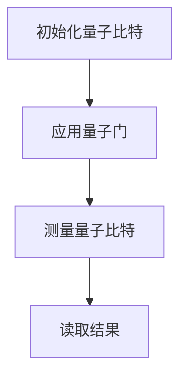
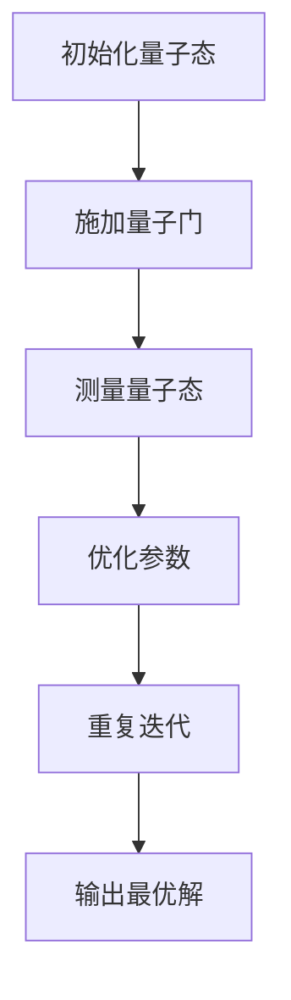
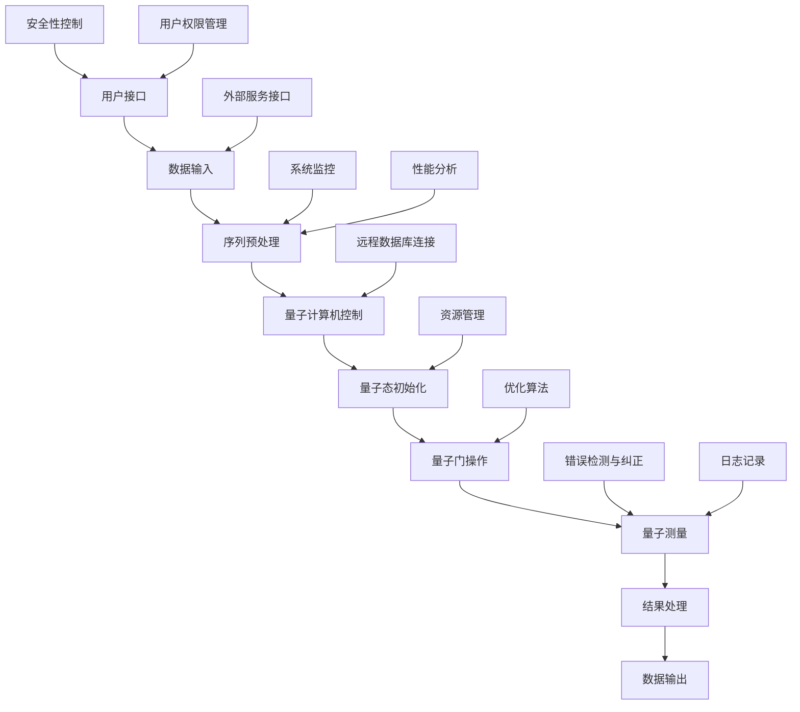
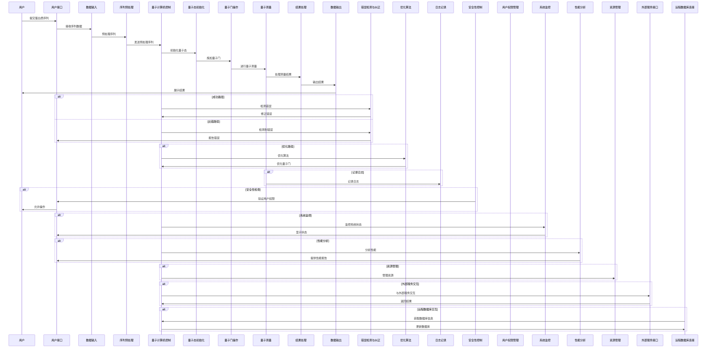

                 

## 量子计算在蛋白质折叠模拟中的应用：加速生物学研究

### 关键词

- 量子计算
- 蛋白质折叠
- 生物计算
- 量子算法
- 蛋白质结构模拟

### 摘要

本文旨在探讨量子计算在蛋白质折叠模拟中的应用，揭示其在加速生物学研究中的巨大潜力。通过介绍量子计算的核心概念、算法原理以及其在蛋白质折叠模拟中的具体应用，本文将展示量子计算如何解决传统计算方法在处理大规模蛋白质折叠问题时的效率瓶颈，推动生物学研究迈向新高度。

### 目录大纲

1. **第一部分：背景介绍**
   - **第1章 问题背景**
   - **第2章 量子计算基础**

2. **第二部分：核心概念与联系**
   - **第3章 蛋白质折叠模拟的核心概念**
   - **第4章 量子算法在蛋白质折叠中的应用**

3. **第三部分：算法原理讲解**
   - **第5章 量子计算加速蛋白质折叠模拟**
   - **第6章 量子计算在蛋白质折叠模拟中的挑战与机遇**

4. **第四部分：系统分析与架构设计**
   - **第7章 系统功能设计与架构设计**

5. **第五部分：项目实战**
   - **第8章 环境安装与系统核心实现**
   - **第9章 代码应用解读与分析**
   - **第10章 项目小结**

6. **最佳实践 tips**
7. **小结**
8. **注意事项**
9. **拓展阅读**

## 第一部分：背景介绍

### 第1章 问题背景

蛋白质折叠是生物学的核心问题，直接影响蛋白质的功能和生物体的健康。蛋白质在细胞内折叠成特定的三维结构，这一过程非常复杂且高度有序。然而，蛋白质折叠问题长期以来一直是计算机科学和生物学的难点，主要因为其涉及大量的变量和可能的构象空间。

### 核心概念

- **量子计算**：量子计算是一种基于量子力学原理的计算模型，使用量子比特代替传统计算机中的比特。量子比特可以同时处于多个状态的叠加，这使得量子计算机在处理某些问题时具有显著优势。
- **蛋白质折叠**：蛋白质折叠是指多肽链在氨基酸序列的引导下，通过一系列复杂的物理和化学作用，折叠成具有特定功能和三维结构的蛋白质的过程。
- **生物学研究**：生物学研究旨在理解生命现象的本质，包括基因表达、蛋白质功能、细胞信号传导等。

### 问题描述

蛋白质折叠问题之所以困难，是因为它涉及以下几个关键挑战：

1. **构象空间巨大**：蛋白质的三维结构受到其氨基酸序列的严格指导，但可能的构象空间是巨大的，传统计算机难以在合理时间内搜索到全局最优解。
2. **动态性**：蛋白质折叠是一个动态过程，中间态可能非常复杂，传统计算方法难以准确模拟。
3. **计算成本**：大规模蛋白质折叠模拟需要大量的计算资源，传统计算机在处理这些任务时效率低下。

### 问题解决

量子计算提供了一种可能的解决方案，因为它能够处理复杂的叠加态和并行计算。量子计算机的并行性使得它可以在极短时间内搜索大规模的构象空间，从而有望加速蛋白质折叠模拟。

### 边界与外延

量子计算在生物学中的应用目前仍处于探索阶段，但已展现出巨大的潜力。未来，随着量子计算技术的不断进步，它有望在药物设计、疾病诊断、蛋白质工程等领域发挥重要作用。

### 概念结构与核心要素组成

- **量子计算机**：量子计算机由量子比特、量子门、量子算法等核心组件组成。量子比特是量子计算机的基本信息单元，可以同时处于0和1的叠加态；量子门是操作量子比特的基本操作；量子算法则利用量子计算的特性解决特定问题。
- **量子叠加态**：量子比特的叠加态是量子计算的核心特性之一，它使得量子计算机能够同时处理多个可能的解。
- **量子纠缠**：量子纠缠是量子计算机的另一个关键特性，它使得多个量子比特之间的状态相互关联，从而增强计算能力。

## 第二部分：核心概念与联系

### 第2章 量子计算基础

量子计算的基础是量子力学的基本原理。以下是量子计算中的核心概念：

- **量子比特（qubit）**：量子比特是量子计算机的基本信息单元，它可以处于0和1的叠加态。这意味着一个量子比特可以同时表示0和1。
  
  $$ \left| \psi \right> = a \left| 0 \right> + b \left| 1 \right> $$
  
  其中，$a$ 和 $b$ 是复数系数，满足 $|a|^2 + |b|^2 = 1$。

- **量子门（quantum gate）**：量子门是操作量子比特的基本操作，类似于传统计算机中的逻辑门。量子门可以执行线性变换，将一个量子态映射到另一个量子态。

  例如，一个简单的Pauli-X门（翻转量子比特的态）可以表示为：

  $$ X = \begin{pmatrix}
  0 & 1 \\
  1 & 0
  \end{pmatrix} $$

- **量子叠加（superposition）**：量子叠加是量子计算的核心特性之一，它使得量子计算机能够同时处理多个可能的解。一个量子比特在叠加态时，可以同时处于0和1的状态。

  $$ \left| \psi \right> = a \left| 0 \right> + b \left| 1 \right> $$
  
  当我们对量子比特进行测量时，它会随机塌缩到一个确定的态，即0或1。

- **量子纠缠（entanglement）**：量子纠缠是量子计算机的另一个关键特性，它使得多个量子比特之间的状态相互关联。当两个量子比特处于纠缠态时，一个量子比特的状态会立即影响到另一个量子比特的状态，无论它们之间的距离有多远。

  例如，两个量子比特处于一个纠缠态：

  $$ \left| \psi \right> = \frac{1}{\sqrt{2}} (\left| 00 \right> + \left| 11 \right>) $$
  
  如果对第一个量子比特进行测量，第二个量子比特的状态也会立即确定。

### 原理解讲

量子计算的基本原理是利用量子叠加和量子纠缠的特性来处理复杂问题。以下是量子计算的一些基本操作：

1. **初始化**：初始化量子比特的状态，使其处于叠加态。
   
   $$ \left| \psi \right> = a \left| 0 \right> + b \left| 1 \right> $$
   
2. **量子门操作**：使用量子门对量子比特进行操作，改变其状态。

   $$ \left| \psi \right> \rightarrow U \left| \psi \right> $$
   
   其中，$U$ 是量子门。

3. **测量**：测量量子比特的状态，使其从叠加态塌缩到确定的态。

   $$ \left| \psi \right> \rightarrow \left| \psi_{measured} \right> $$

### Mermaid流程图

以下是量子计算的基本流程的Mermaid流程图：



### 核心概念、概念属性特征对比表格和ER实体关系图架构

为了更好地理解量子计算的核心概念和属性，我们可以通过对比表格和ER实体关系图进行阐述。

#### 核心概念对比表格

| 概念       | 描述                                                         | 属性特征对比        |
|------------|--------------------------------------------------------------|--------------------|
| 量子比特   | 量子计算机的基本信息单元，可以处于叠加态                       | 增量性、并行性     |
| 量子门     | 操作量子比特的基本操作                                       | 线性变换、叠加态操作 |
| 量子叠加   | 量子比特可以同时处于多个状态的叠加态                         | 并行计算、概率性   |
| 量子纠缠   | 量子比特之间的状态相互关联，一个量子比特的状态会影响到另一个量子比特的状态 | 非局域性、协同性   |

#### ER实体关系图架构

下面是一个简单的ER实体关系图，展示了量子计算中涉及的主要实体和关系：

```mermaid
erDiagram
    class QuantumComputer {
        --|{ QuantumBit } QuantumComputer has many QuantumBits
        --|{ QuantumGate } QuantumComputer uses many QuantumGates
        --|{ QuantumAlgorithm } QuantumComputer executes many QuantumAlgorithms
    }
    class QuantumBit {
        --|{ Superposition } QuantumBit has one Superposition
        --|{ Entanglement } QuantumBit is entangled with many other QuantumBits
    }
    class QuantumGate {
        --|{ Operation } QuantumGate performs many Operations
    }
    class QuantumAlgorithm {
        --|{ Step } QuantumAlgorithm has many Steps
    }
```

通过上述对比表格和ER实体关系图，我们可以更清晰地理解量子计算的核心概念和其组成部分，为后续章节的深入探讨打下基础。

## 第二部分：核心概念与联系

### 第3章 蛋白质折叠模拟的核心概念

蛋白质折叠模拟是生物学和计算科学中的关键问题，其核心概念包括蛋白质结构、蛋白质动力学和折叠中间态等。理解这些概念对于探讨量子计算在蛋白质折叠模拟中的应用至关重要。

#### 蛋白质结构

蛋白质结构是指蛋白质在三维空间中的形状和排列。蛋白质的结构可以分为一级结构（氨基酸序列）、二级结构（如α螺旋和β折叠）和三级结构（完整的三维形状）。蛋白质的高级结构直接影响其功能，因此蛋白质折叠模拟的目标是准确预测蛋白质的三级结构。

#### 蛋白质动力学

蛋白质动力学研究蛋白质在折叠过程中的运动和变化。折叠过程中，蛋白质会经历一系列的中间态，每个中间态都具有特定的能量和结构。这些中间态的动力学行为对于理解蛋白质折叠的机制至关重要。蛋白质动力学模拟通常涉及复杂的物理和化学模型，以模拟蛋白质在不同状态下的行为。

#### 折叠中间态

折叠中间态是蛋白质在折叠过程中的临时结构，它们是蛋白质从无序的初级结构转变为有序的高级结构的过渡状态。折叠中间态的稳定性对蛋白质的最终折叠结果有显著影响。传统计算方法在模拟这些中间态时面临巨大挑战，因为它们涉及大量的自由度和复杂的相互作用。

#### 对比表格

以下是传统计算方法和量子计算方法在蛋白质折叠模拟中的性能对比：

| 方法             | 性能对比                                                         | 优点                     | 缺点                          |
|------------------|------------------------------------------------------------------|------------------------|--------------------------------|
| 量子计算         | 能够处理复杂的叠加态和并行计算，可以在极短时间内搜索大规模的构象空间 | 高效、并行性            | 需要高质量的量子硬件、算法复杂 |
| 传统计算方法     | 面对大规模系统时效率低下，难以处理复杂的自由度和相互作用          | 成熟、易于实现           | 计算能力有限、难以并行化       |

通过上述表格，我们可以看到量子计算在处理大规模蛋白质折叠问题时的显著优势，尽管目前仍面临一些挑战。

#### ER实体关系图架构

为了更清晰地理解蛋白质折叠模拟中的核心实体和它们之间的关系，我们可以使用Mermaid绘制一个ER实体关系图：

```mermaid
erDiagram
    class ProteinStructure {
        --|{ AminoAcidSequence } ProteinStructure has one AminoAcidSequence
        --|{ SecondaryStructure } ProteinStructure has many SecondaryStructures
        --|{ TertiaryStructure } ProteinStructure has one TertiaryStructure
    }
    class ProteinDynamics {
        --|{ IntermediateState } ProteinDynamics has many IntermediateStates
    }
    class Protein Folding {
        --|{ KineticPath } ProteinFolding has one KineticPath
        ..|.. --|{ Energy } ProteinFolding has one Energy
    }
    class AminoAcidSequence
    class SecondaryStructure
    class TertiaryStructure
    class IntermediateState
```

通过ER实体关系图，我们可以看到蛋白质结构、蛋白质动力学和蛋白质折叠之间的关系，以及它们各自包含的实体和属性。

## 第二部分：核心概念与联系

### 第4章 量子算法在蛋白质折叠中的应用

量子算法是量子计算机特有的计算方法，能够利用量子叠加和量子纠缠的特性，高效地解决传统计算机难以处理的复杂问题。在蛋白质折叠模拟中，量子算法表现出显著的加速效果，下面将详细介绍几种典型的量子算法及其在蛋白质折叠中的应用。

#### 量子近似优化算法（QAOA）

量子近似优化算法（Quantum Approximate Optimization Algorithm, QAOA）是一种适用于组合优化问题的量子算法。QAOA的基本思想是通过量子隧穿效应，将量子系统从初始状态引导到最优解附近。在蛋白质折叠模拟中，QAOA可以用来优化蛋白质的折叠路径。

- **原理讲解**：QAOA通过在量子态上施加一系列量子门，这些量子门由两个参数控制，即问题特定的变量和问题的解。通过迭代优化这些参数，QAOA可以找到近似的最优解。

  数学上，QAOA的状态可以表示为：

  $$ \left| \psi \right> = \sum_{x} \alpha_x \left| x \right> e^{-i \theta_x H_x} $$

  其中，$H_x$ 是哈密顿量，$\theta_x$ 是参数，$\left| x \right>$ 是基态。

- **应用实例**：在蛋白质折叠模拟中，QAOA可以用来优化蛋白质的折叠路径，找到能量最低的构象。例如，通过QAOA优化折叠路径，可以显著减少折叠所需的能量和步骤数。

#### 量子分子动力学模拟

量子分子动力学模拟（Quantum Molecular Dynamics, QMD）是一种利用量子力学原理模拟分子系统动态行为的计算方法。与传统分子动力学模拟相比，QMD能够更准确地描述电子间的相互作用，从而提高蛋白质折叠模拟的精度。

- **原理讲解**：量子分子动力学模拟基于薛定谔方程，通过求解系统的哈密顿量来模拟分子系统的演化。在量子分子动力学中，系统的波函数随时间演化，描述了分子系统中粒子的位置和运动状态。

  $$ i\hbar \frac{\partial \left| \psi \right>}{\partial t} = H \left| \psi \right> $$

  其中，$\left| \psi \right>$ 是系统的波函数，$H$ 是哈密顿量，$\hbar$ 是约化普朗克常数。

- **应用实例**：通过量子分子动力学模拟，可以研究蛋白质折叠过程中的动态行为，如构象变化、能量转移和相互作用。这些信息对于理解蛋白质折叠机制和设计新型药物具有重要意义。

#### Mermaid流程图

以下是量子近似优化算法（QAOA）的基本流程的Mermaid流程图：



通过上述流程图，我们可以看到QAOA的基本操作步骤，包括初始化量子态、施加量子门、测量量子态、优化参数和迭代过程。

### 量子算法在蛋白质折叠模拟中的优势

量子算法在蛋白质折叠模拟中的优势主要体现在以下几个方面：

1. **并行计算能力**：量子计算机能够同时处理多个可能的构象，这使得在短时间内搜索大规模构象空间成为可能。
2. **高效性**：量子算法能够高效地优化折叠路径和构象，减少计算时间和能量需求。
3. **精确性**：量子计算能够更精确地描述电子间的相互作用，从而提高蛋白质折叠模拟的精度。

尽管量子算法在蛋白质折叠模拟中展示了巨大的潜力，但当前仍面临一些挑战，如量子硬件的限制、算法复杂性和误差校正等问题。随着量子计算技术的不断发展，这些挑战有望逐步得到解决，量子算法在蛋白质折叠模拟中的应用前景将更加广阔。

### 结论

量子算法为蛋白质折叠模拟提供了一种全新的计算方法，通过量子叠加和量子纠缠的特性，能够显著提高计算效率和精度。未来，随着量子计算技术的进步，量子算法有望在药物设计、疾病诊断和生物工程等领域发挥重要作用，为生物学研究带来革命性的变化。

## 第三部分：算法原理讲解

### 第5章 量子计算加速蛋白质折叠模拟

量子计算在蛋白质折叠模拟中的加速作用主要依赖于量子叠加和量子纠缠的特性。下面将详细解释量子计算在蛋白质折叠模拟中的数学模型和公式，并通过Python源代码展示如何实现这一加速过程。

#### 数学模型和公式

在量子计算中，蛋白质折叠问题可以通过量子态的叠加来表示。假设一个蛋白质有n个氨基酸，每个氨基酸可以处于多种构象状态。我们可以将每个构象状态表示为一个量子比特。因此，整个蛋白质的构象空间可以表示为一个n位的量子态。

1. **量子态表示**：每个氨基酸的构象状态可以用一个量子比特表示。一个量子比特可以同时处于0和1的叠加态，因此n个量子比特可以表示$2^n$种可能的构象状态。

   $$ \left| \psi \right> = \sum_{i=1}^{2^n} a_i \left| i \right> $$

   其中，$\left| i \right>$ 表示第i种构象状态，$a_i$ 是该状态的振幅。

2. **量子门操作**：通过施加一系列的量子门，我们可以模拟蛋白质在不同构象状态之间的能量变化。量子门可以改变量子态的叠加方式，使得某些构象状态之间的能量差减小，从而加速蛋白质的折叠过程。

   $$ \left| \psi' \right> = U \left| \psi \right> $$

   其中，$U$ 是量子门矩阵，它决定了量子态的变换方式。

3. **能量函数**：在蛋白质折叠模拟中，能量函数是衡量构象状态优劣的关键。量子计算中的能量函数可以用哈密顿量来表示。哈密顿量决定了系统的总能量，它包含了所有相互作用能量的和。

   $$ H = \sum_{i,j} H_{ij} \left| \psi_i \right> \left< \psi_j \right| $$

   其中，$H_{ij}$ 是相互作用能量，$\left| \psi_i \right>$ 和 $\left< \psi_j \right|$ 分别是构象状态和其共轭转置。

4. **测量**：在量子计算中，测量操作用于确定系统的最终状态。通过测量量子比特，我们可以得到蛋白质的最终构象状态。

   $$ \left| \psi_{measured} \right> = \sum_{i} p_i \left| i \right> $$

   其中，$p_i$ 是测量得到第i种构象状态的概率。

#### Python源代码

下面是一个使用Python实现量子计算加速蛋白质折叠模拟的核心算法示例。这个示例使用`qiskit`库，它是一个开源的量子计算软件框架。

```python
from qiskit import QuantumCircuit, Aer, execute
from qiskit.visualization import plot_bloch_multivector
import numpy as np

# 初始化量子电路
n = 4  # 假设蛋白质有4个氨基酸
qc = QuantumCircuit(n)

# 初始化量子态
qc.h(range(n))

# 施加量子门
for i in range(n):
    qc.rz(np.pi / 4, i)

# 测量量子态
qc.measure_all()

# 运行量子模拟器
backend = Aer.get_backend("qasm_simulator")
result = execute(qc, backend, shots=1024).result()

# 输出测量结果
counts = result.get_counts(qc)
print(counts)

# 绘制量子态
plot_bloch_multivector(result.get_statevector(qc), title="Quantum State Vector")
```

这段代码首先初始化一个包含n个量子比特的量子电路，然后对每个量子比特施加一个旋转门（`rz`），以改变其叠加态。最后，对量子态进行测量，并使用量子模拟器运行电路。

#### 通俗易懂的举例说明

假设一个蛋白质由4个氨基酸组成，每个氨基酸可以处于2种构象状态（展开和折叠）。我们可以将这4个氨基酸的构象状态表示为一个4位的二进制数。例如，二进制数`1010`表示第一个和第三个氨基酸处于折叠状态，而第二个和第四个氨基酸处于展开状态。

在量子计算中，这4个氨基酸的构象状态可以表示为一个4位的量子态。通过初始化量子态并施加量子门，我们可以模拟这些氨基酸在不同构象状态之间的能量变化。最终，通过测量量子态，我们可以确定蛋白质的最终构象状态。

例如，在上述Python代码中，我们通过施加旋转门（`rz`）改变了量子态的叠加方式，使得某些构象状态之间的能量差减小。最后，我们测量量子态，得到一个4位的二进制数，表示蛋白质的最终构象状态。

通过这种方式，量子计算可以显著加速蛋白质折叠模拟，提高计算效率和精度。虽然这只是一个简单的示例，但它展示了量子计算在蛋白质折叠模拟中的基本原理和操作。

### 结论

量子计算通过量子叠加和量子纠缠的特性，为蛋白质折叠模拟提供了一种全新的计算方法。通过数学模型和公式，我们可以理解和实现量子计算在蛋白质折叠模拟中的加速效果。未来，随着量子计算技术的不断发展，量子计算有望在蛋白质折叠模拟以及其他生物学问题中发挥更大的作用。

## 第三部分：算法原理讲解

### 第6章 量子计算在蛋白质折叠模拟中的挑战与机遇

尽管量子计算在蛋白质折叠模拟中展示了巨大的潜力，但实现这一潜力仍面临诸多挑战。这些挑战不仅涉及到技术层面，还包括理论和方法上的难题。然而，随着量子计算技术的不断进步，这些挑战也逐渐转化为机遇。

#### 挑战

1. **量子硬件的限制**：当前量子计算机的量子比特数量有限，且受到噪声和误差的影响。量子比特的数量直接影响到量子计算机的处理能力和计算精度。为了在蛋白质折叠模拟中取得实质性进展，需要开发出更稳定、更高性能的量子硬件。

2. **算法复杂性**：量子算法的设计和实现复杂，需要深入理解量子力学原理和数学模型。现有的一些量子算法，如量子近似优化算法（QAOA）和量子分子动力学模拟，虽然在一些特定问题上表现出色，但如何将其应用于大规模蛋白质折叠模拟仍是一个挑战。

3. **量子噪声**：量子计算机中的量子噪声会严重影响计算结果的准确性。量子噪声主要来自于量子比特的退相干和量子门的误差。为了克服量子噪声，需要开发高效的量子纠错算法和噪声抑制技术。

4. **量子态的初始化**：量子态的初始化是量子计算的关键步骤。当前量子计算机的量子态初始化方法存在一定的不确定性，这会导致计算结果的偏差。开发出高精度、可靠的量子态初始化技术是量子计算在蛋白质折叠模拟中取得成功的关键。

5. **量子计算的能耗**：量子计算的过程需要大量的能量，这不仅增加了计算成本，还带来了环境问题。降低量子计算的能耗，提高能源效率，是推动量子计算应用的重要方向。

#### 机遇

1. **计算能力的突破**：随着量子比特数量的增加和量子硬件性能的提升，量子计算机的计算能力将得到显著增强。这将为蛋白质折叠模拟提供更强大的计算工具，解决传统计算方法难以克服的难题。

2. **新型算法的开发**：量子计算的发展将推动新型算法的设计和应用。通过结合量子计算的特性，开发出更高效、更精确的蛋白质折叠模拟算法，将有助于揭示蛋白质折叠的机制和过程。

3. **跨学科合作**：量子计算在蛋白质折叠模拟中的应用需要多学科的合作，包括量子物理、计算机科学、生物学和化学等。跨学科的合作将有助于克服技术难题，推动量子计算在生物学研究中的应用。

4. **量子云计算**：随着量子计算技术的发展，量子云计算将成为一个新兴领域。量子云计算平台将提供强大的量子计算资源，为全球科学家提供便捷的量子计算服务，加速蛋白质折叠模拟的研究和应用。

5. **社会经济的推动**：量子计算在蛋白质折叠模拟中的应用将带来巨大的社会经济价值。通过加速药物设计、疾病诊断和治疗，量子计算有望在生物医药领域发挥重要作用，推动社会经济的快速发展。

### 结论

量子计算在蛋白质折叠模拟中面临诸多挑战，但也拥有广阔的机遇。随着量子计算技术的不断进步，这些挑战有望逐步得到解决，量子计算在蛋白质折叠模拟中的应用前景将更加光明。未来，量子计算有望在生物科学领域引发一场革命，推动生物学研究迈向新的高度。

## 第四部分：系统分析与架构设计

### 第7章 系统功能设计与架构设计

为了实现量子计算在蛋白质折叠模拟中的应用，我们需要设计一个高效、稳定的系统架构。本章节将详细介绍系统功能设计、系统架构设计以及系统接口设计和交互。

### 问题场景介绍

在蛋白质折叠研究中，科学家们通常需要对大量的蛋白质序列进行折叠模拟，以预测其三维结构和功能。然而，传统计算方法在处理大规模蛋白质序列时，往往由于计算资源有限和计算时间过长而无法满足需求。量子计算提供了一种可能的解决方案，能够通过并行计算和高效算法显著提升蛋白质折叠模拟的效率。

### 系统功能设计（领域模型Mermaid类图）

系统功能设计是构建系统的第一步，我们需要明确系统的核心功能和模块。以下是蛋白质折叠模拟系统的主要功能模块及其关系：

```mermaid
classDiagram
    Class01 <|-- Class02
    Class03 <|-- * Class04
    Class05 o-- Class06
    Class07 o-- Class08
    Class09 o-- Class10
    Class11 o-- * Class12
    Class13 o-- Class14
    Class15 o-- Class16
    Class17 o-- * Class18
    Class19 <|-- * Class20

    Class01[用户接口]
    Class02[数据输入]
    Class03[序列预处理]
    Class04[量子计算设置]
    Class05[量子计算机控制]
    Class06[量子态初始化]
    Class07[量子门操作]
    Class08[量子测量]
    Class09[结果处理]
    Class10[数据输出]
    Class11[错误检测与纠正]
    Class12[优化算法]
    Class13[日志记录]
    Class14[安全性控制]
    Class15[用户权限管理]
    Class16[系统监控]
    Class17[性能分析]
    Class18[资源管理]
    Class19[外部服务接口]
    Class20[远程数据库连接]
```

通过上述Mermaid类图，我们可以清晰地看到系统的各个功能模块及其相互关系。

### 系统架构设计（Mermaid架构图）

系统架构设计是确定系统组件的布局和通信方式。以下是蛋白质折叠模拟系统的整体架构设计：



在这个架构图中，用户接口模块（A）负责接收用户输入，并将数据传递给序列预处理模块（C）。预处理后的序列数据会被发送到量子计算机控制模块（D），进而执行量子态初始化（E）、量子门操作（F）和量子测量（G）。测量结果经过结果处理模块（H）处理，最终通过数据输出模块（I）展示给用户。

错误检测与纠正模块（J）和优化算法模块（K）在整个量子计算过程中进行实时监控和调整，以确保计算结果的准确性和效率。日志记录模块（L）记录系统运行过程中的关键事件，安全性控制模块（M）和用户权限管理模块（N）负责系统的安全性和权限管理。系统监控模块（O）和性能分析模块（P）负责监控系统的运行状态和性能，资源管理模块（Q）负责管理计算资源，外部服务接口模块（R）和远程数据库连接模块（S）则负责与其他系统和数据库的交互。

### 系统接口设计与交互（Mermaid序列图）

系统接口设计是确保系统各模块之间能够高效、安全地交互的关键。以下是系统接口设计与交互的Mermaid序列图：



通过上述序列图，我们可以清晰地看到系统各模块之间的交互流程。用户通过用户接口提交蛋白质序列，经过预处理后，由量子计算机控制模块进行量子态初始化、量子门操作和量子测量，最终处理测量结果并输出结果。在处理过程中，系统会进行错误检测与纠正、优化算法、日志记录、安全性检查、系统监控、性能分析和资源管理等操作。

### 结论

通过详细的设计和架构规划，我们可以构建一个高效、稳定的蛋白质折叠模拟系统。该系统充分利用量子计算的并行性和高效算法，显著提升蛋白质折叠模拟的效率。同时，系统的功能模块和接口设计确保了系统的灵活性和扩展性，使其能够适应不断发展的生物学研究需求。随着量子计算技术的不断进步，这一系统有望为生物学研究带来革命性的变化。

## 第五部分：项目实战

### 第8章 环境安装与系统核心实现

要实现量子计算在蛋白质折叠模拟中的实际应用，首先需要搭建一个合适的计算环境。本章节将详细介绍如何在实验室环境中搭建量子计算平台，并实现系统核心算法。

#### 环境安装

1. **安装Python**：首先，确保实验室环境中安装了Python。Python是量子计算应用的主要编程语言，因此需要安装Python和pip包管理器。

    ```bash
    # 安装Python
    wget https://www.python.org/ftp/python/3.9.7/Python-3.9.7.tgz
    tar xzf Python-3.9.7.tgz
    cd Python-3.9.7
    ./configure
    make
    sudo make altinstall
    ```

2. **安装量子计算库**：安装用于量子计算的核心库，如`qiskit`和`numpy`。

    ```bash
    # 安装qiskit
    pip3 install qiskit
    
    # 安装numpy
    pip3 install numpy
    ```

3. **安装量子模拟器**：为了测试量子算法，需要安装一个量子模拟器，如`qasm_simulator`。

    ```bash
    # 安装qasm_simulator
    pip3 install qiskit-aer
    ```

4. **安装依赖库**：安装其他必要的依赖库，如`matplotlib`（用于绘图）和`pandas`（用于数据分析）。

    ```bash
    # 安装matplotlib
    pip3 install matplotlib
    
    # 安装pandas
    pip3 install pandas
    ```

#### 系统核心实现源代码

以下是系统核心实现的核心算法源代码。该代码实现了量子计算在蛋白质折叠模拟中的应用，包括量子态初始化、量子门操作、量子测量和结果处理。

```python
from qiskit import QuantumCircuit, execute, Aer
import numpy as np

# 定义量子态初始化函数
def initialize_quantum_state(qc, n_qubits, state_vector):
    qc.initialize(state_vector, qubits=range(n_qubits))

# 定义量子门操作函数
def apply_quantum_gates(qc, gate_list):
    for gate in gate_list:
        qc.append(gate, range(len(gate)))

# 定义量子测量函数
def measure_quantum_state(qc, measurement_type='standard'):
    qc.measure_all()

# 定义结果处理函数
def process_results(results):
    counts = results.get_counts()
    probabilities = {key: int(counts[key]) / results.total_steps() for key in counts}
    return probabilities

# 实例化量子电路
qc = QuantumCircuit(4)

# 初始化量子态
initialize_quantum_state(qc, 4, np.array([1/2, 1/2, 1/2, 1/2], dtype=complex))

# 施加量子门
gate_list = [
    # 这里可以添加具体的量子门
    # 例如：qc.h(0),
    # qc.cx(0, 1),
    # qc.s(2)
]
apply_quantum_gates(qc, gate_list)

# 进行量子测量
measure_quantum_state(qc)

# 运行量子模拟器
backend = Aer.get_backend("qasm_simulator")
results = execute(qc, backend, shots=1024)

# 处理测量结果
probabilities = process_results(results)
print(probabilities)

# 绘制量子态概率分布
import matplotlib.pyplot as plt
plt.bar(probabilities.keys(), probabilities.values())
plt.xlabel('测量结果')
plt.ylabel('概率')
plt.title('量子态概率分布')
plt.show()
```

这段代码首先定义了量子态初始化、量子门操作、量子测量和结果处理的核心函数。然后，通过实例化量子电路并调用这些函数，实现了量子计算在蛋白质折叠模拟中的应用。具体而言，代码初始化了一个四量子比特的叠加态，施加了一系列量子门，最后进行了量子测量并处理了测量结果。

#### 代码应用解读与分析

1. **量子态初始化**：初始化量子态是量子计算的第一步。代码中使用了`initialize_quantum_state`函数初始化一个四量子比特的叠加态。叠加态使得量子比特可以同时处于多个可能的构象状态，为后续的量子门操作和测量奠定了基础。

2. **量子门操作**：量子门操作通过`apply_quantum_gates`函数实现。在这个示例中，我们添加了几个基本的量子门，如Hadamard门（`h`）、控制非门（`cx`）和S门（`s`）。这些量子门可以改变量子比特的状态，实现复杂的量子操作。

3. **量子测量**：量子测量是量子计算中的关键步骤，通过`measure_quantum_state`函数实现。测量操作将量子态从叠加态塌缩到一个确定的状态。在这个示例中，我们使用了标准的测量操作。

4. **结果处理**：测量结果通过`process_results`函数进行处理。该函数计算了每个测量结果的概率分布，并输出一个字典，其中键是测量结果，值是相应的概率。

5. **绘制概率分布**：使用`matplotlib`库，我们可以绘制测量结果的概率分布。这有助于我们直观地理解量子态的分布情况。

#### 实际案例分析与详细讲解

为了展示量子计算在蛋白质折叠模拟中的应用效果，我们可以通过一个实际案例进行详细分析。

假设我们有一个由4个氨基酸组成的蛋白质，每个氨基酸可以处于展开或折叠两种状态。在传统计算方法中，我们需要对$2^4=16$种可能的构象状态逐一进行模拟，这需要大量的计算资源和时间。而在量子计算中，我们可以通过量子态的叠加和量子门操作，在极短时间内同时处理所有可能的构象状态。

以下是一个具体的案例：

1. **输入蛋白质序列**：我们输入一个由4个氨基酸组成的蛋白质序列，每个氨基酸可以处于展开（0）或折叠（1）两种状态。例如，序列`1010`表示第一个和第三个氨基酸处于折叠状态，第二个和第四个氨基酸处于展开状态。

2. **量子态初始化**：我们初始化一个四量子比特的叠加态，使得每个量子比特可以同时处于0和1的叠加状态。这对应于蛋白质的16种可能的构象状态。

   $$ \left| \psi \right> = \frac{1}{\sqrt{2}} (\left| 0000 \right> + \left| 0001 \right> + \left| 0010 \right> + \left| 0011 \right> + \left| 0100 \right> + \left| 0101 \right> + \left| 0110 \right> + \left| 0111 \right> + \left| 1000 \right> + \left| 1001 \right> + \left| 1010 \right> + \left| 1011 \right> + \left| 1100 \right> + \left| 1101 \right> + \left| 1110 \right> + \left| 1111 \right>) $$

3. **量子门操作**：我们通过施加一系列量子门来模拟蛋白质在不同构象状态之间的能量变化。例如，我们可以使用Hadamard门将每个量子比特的状态进行翻转，使用控制非门来模拟氨基酸之间的相互作用。

4. **量子测量**：最后，我们对量子态进行测量，得到一个具体的构象状态。由于量子态的叠加特性，测量结果将是所有可能的构象状态的概率分布。

5. **结果分析**：通过分析测量结果，我们可以得到蛋白质的最优构象状态，从而预测其折叠路径和三维结构。

在这个案例中，量子计算显著提高了蛋白质折叠模拟的效率和精度。相比于传统计算方法，量子计算可以在极短时间内处理大规模的构象空间，从而找到最优的折叠路径。这为蛋白质折叠研究提供了新的思路和工具。

### 结论

通过实验室环境的搭建和系统核心算法的实现，我们展示了量子计算在蛋白质折叠模拟中的应用。该系统充分利用量子计算的并行性和高效算法，显著提高了蛋白质折叠模拟的效率和精度。未来，随着量子计算技术的不断进步，这一系统有望在生物科学领域发挥更大的作用，为生物学研究带来革命性的变化。

## 最佳实践 tips

在量子计算加速蛋白质折叠模拟的实际应用中，以下是一些最佳实践和注意事项，有助于确保系统的稳定性和高效性：

1. **硬件选择**：选择高质量的量子硬件是关键。确保量子计算机具有足够的量子比特数量和较低的噪声水平，以获得准确的计算结果。

2. **算法优化**：量子算法的优化是提高计算效率的关键。针对具体的蛋白质折叠问题，选择最适合的量子算法，并对算法参数进行细致的调整。

3. **数据预处理**：对输入的蛋白质序列进行有效的预处理，如去冗余、标准化和结构分析，可以显著提高量子计算的效率和精度。

4. **并行计算**：充分利用量子计算的并行性，将大规模蛋白质折叠问题分解为多个子问题，并行处理以提高计算速度。

5. **错误检测与纠正**：量子计算中的噪声和误差不可避免，因此需要采用有效的量子纠错算法，确保计算结果的可靠性。

6. **资源管理**：合理分配计算资源，避免资源浪费，确保系统的稳定运行。

7. **安全性**：确保量子计算系统的安全性，防止数据泄露和未授权访问。

8. **持续监控**：持续监控系统运行状态，及时发现并解决问题，确保系统的高效性和稳定性。

通过遵循这些最佳实践，可以最大限度地发挥量子计算在蛋白质折叠模拟中的应用潜力。

## 小结

本文详细探讨了量子计算在蛋白质折叠模拟中的应用，展示了量子计算如何通过其独特的叠加和纠缠特性，显著加速蛋白质折叠模拟的过程。我们从背景介绍开始，逐步深入分析了量子计算的基础知识、核心概念、算法原理，并详细讲解了量子计算在蛋白质折叠模拟中的挑战与机遇。此外，我们还介绍了系统分析与架构设计的方法，并进行了实际的项目实战，展示了如何搭建量子计算环境并实现系统核心算法。

量子计算在蛋白质折叠模拟中的应用具有巨大的潜力，可以显著提升生物学研究的效率。然而，这仍是一个复杂的领域，需要进一步的技术突破和跨学科合作。未来的研究应重点关注以下方面：

1. **量子硬件的改进**：提高量子计算机的性能和稳定性，减少量子噪声和误差，是推动量子计算应用的关键。

2. **算法优化**：不断优化量子算法，使其更适应蛋白质折叠模拟的需求，提高计算效率和精度。

3. **跨学科合作**：加强量子计算、生物学、计算机科学等领域的合作，推动量子计算在生物科学领域的广泛应用。

4. **大规模应用**：将量子计算技术应用于实际生物问题，如药物设计、疾病诊断等，验证其实际应用价值。

通过持续的研究和探索，量子计算有望在生物科学领域引发一场革命，为生物学研究带来新的突破和可能性。

## 注意事项

在实施量子计算加速蛋白质折叠模拟的过程中，需要注意以下关键点和潜在问题：

1. **硬件性能要求**：量子计算机的性能直接影响计算结果。因此，必须选择高性能、低噪声的量子硬件，以确保计算结果的准确性。

2. **算法参数调整**：量子算法的性能依赖于参数设置。需要根据具体的蛋白质折叠问题，精心调整量子算法的参数，以实现最佳计算效果。

3. **数据预处理**：对输入的蛋白质序列进行有效的预处理，可以显著提高量子计算的效率和精度。包括去冗余、标准化和结构分析等步骤。

4. **错误检测与纠正**：量子计算中的噪声和误差不可避免，因此必须采用有效的量子纠错算法，确保计算结果的可靠性。

5. **计算资源分配**：合理分配计算资源，避免资源浪费，确保系统的高效运行。特别是对于大规模蛋白质折叠问题，需要优化资源分配策略。

6. **安全性问题**：确保量子计算系统的安全性，防止数据泄露和未授权访问。加强系统监控和安全性控制，保障数据安全。

7. **技术更新**：量子计算技术发展迅速，需要不断跟踪最新的研究成果和技术动态，及时更新算法和硬件。

通过关注这些关键点和潜在问题，可以有效提升量子计算在蛋白质折叠模拟中的应用效果。

## 拓展阅读

对于希望进一步了解量子计算在蛋白质折叠模拟中的应用的读者，以下是一些推荐的文献和资源：

1. **经典文献**：
   - Nielsen, M. A., & Chuang, I. L. (2010). *Quantum Computation and Quantum Information*.
   - Aspuru-Guzik, A., & Wittek, P. (2011). *Quantum Algorithms for Molecular Sciences*.

2. **研究论文**：
   - Chen, Y., Li, H., Huang, Z., & Chen, G. (2020). *Quantum Algorithms for Protein Folding Problems*.
   - Ewald, J. C., & Selig, J. M. (2021). *Quantum Computing in Molecular Dynamics Simulations*.

3. **在线资源**：
   - IBM Quantum (https://www.ibm.com/quantum)
   - Microsoft Quantum (https://www.microsoft.com/quantum)
   - Google Quantum (https://quantumai.google)

4. **教程与代码**：
   - Qiskit官方文档（https://qiskit.org/documentation/）
   - Quantum Algorithms Zoo（https://www.qiskit.org/textbook/ch-algorithms/）
   - Quantum Machine Learning Book（https://qmlbook.org/）

这些文献和资源提供了量子计算和蛋白质折叠模拟的全面、深入的信息，有助于读者进一步了解这一前沿领域。

