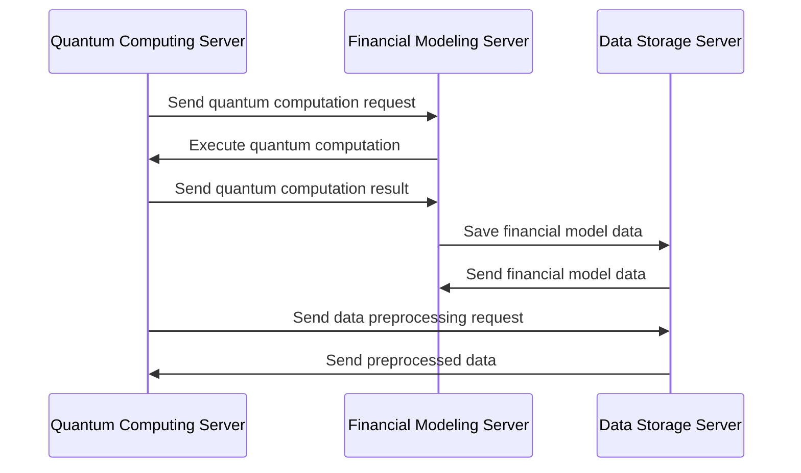

                 


### Step 1: Define the Main Structure

Let's start by defining the main structure of the article. We will have an introduction, several chapters, and a conclusion. This will help readers understand the flow of the article and what to expect.

### Step 2: Determine the Chapter Topics

For this article, we will focus on the following chapters:

- **Chapter 1: Introduction to Quantum Computing**
  - The history of quantum computing
  - Basic principles of quantum computing
  - Quantum bits (qubits) and superposition
  - Quantum gates and operations
  - Quantum entanglement

- **Chapter 2: Quantum Algorithms for Financial Analysis**
  - Quantum random walk algorithm
  - Quantum linear system algorithm
  - Quantum machine learning algorithms
  - Quantum optimization algorithms

- **Chapter 3: Quantum Computing and Financial Modeling**
  - The role of quantum computing in financial modeling
  - Quantum computing for option pricing
  - Quantum computing for portfolio optimization
  - Quantum computing for credit risk assessment

- **Chapter 4: Applications of Quantum Computing in Financial Markets**
  - Quantum computing in equity markets
  - Quantum computing in bond markets
  - Quantum computing in derivatives markets
  - Quantum computing in cryptocurrency markets

- **Chapter 5: Challenges and Future Directions**
  - Technical challenges in quantum computing
  - Economic implications of quantum computing
  - Ethical considerations of quantum computing
  - Future prospects of quantum computing in finance

### Step 3: Detail Each Chapter

We will now provide a detailed outline for each chapter.

**Chapter 1: Introduction to Quantum Computing**

1.1 The history of quantum computing
- Early developments
- Key figures in quantum computing
- Quantum computing in the modern era

1.2 Basic principles of quantum computing
- Quantum bits (qubits)
- Quantum superposition
- Quantum entanglement
- Quantum gates and operations

1.3 Quantum bits (qubits) and superposition
- Representation of qubits
- States of qubits
- Quantum superposition examples

1.4 Quantum gates and operations
- Basic quantum gates
- Quantum operations
- Quantum circuits

1.5 Quantum entanglement
- Definition of entanglement
- Entanglement examples
- Applications of entanglement

**Chapter 2: Quantum Algorithms for Financial Analysis**

2.1 Quantum random walk algorithm
- Introduction to the quantum random walk
- Quantum random walk in financial markets
- Applications in financial modeling

2.2 Quantum linear system algorithm
- Solving linear systems with quantum computers
- Applications in financial modeling

2.3 Quantum machine learning algorithms
- Introduction to quantum machine learning
- Quantum support vector machines
- Quantum neural networks

2.4 Quantum optimization algorithms
- Quantum approximate optimization algorithm (QAOA)
- Applications in financial optimization

### Step 4: Include Supporting Materials

- Core concepts and their relationships
- Algorithm explanations with Mermaid diagrams and Python code
- Mathematical models and formulas with LaTeX
- System architecture and design diagrams with Mermaid
- Practical case studies and analysis

### Step 5: Summarize and Provide Additional Resources

Each chapter will end with a summary, key takeaways, potential pitfalls, and additional resources for further reading.

### Step 6: Format and Finalize

Finally, we will format the entire article using Markdown, ensuring that the structure is clear and concise.

----------------------------------------------------------------
# 量子计算在金融建模中的应用：复杂风险分析的新工具

## 关键词
- 量子计算
- 金融建模
- 风险分析
- 超算
- 量子算法

## 摘要
本文将探讨量子计算在金融建模中的应用，重点分析其在复杂风险分析方面的潜力。我们将逐步介绍量子计算的基本原理，展示量子算法在金融分析中的实际应用，并探讨量子计算如何改变金融市场的风险分析方式。本文旨在为读者提供量子计算在金融领域的深入理解和应用指南。

## 目录

## 第一部分：量子计算基础

### 第1章：量子计算的起源与基础

### 第2章：量子算法与金融建模

## 第二部分：量子计算在金融建模中的应用

### 第3章：量子计算与金融建模

### 第4章：量子计算在金融市场的应用

### 第5章：挑战与未来方向

## 结论
量子计算在金融建模中展现出巨大的潜力，为复杂风险分析提供了新的工具。尽管面临技术挑战，但随着量子技术的不断发展，我们可以期待在金融领域看到量子计算的广泛应用。

### 第1章：量子计算的起源与基础

#### 1.1 量子计算的起源

量子计算起源于20世纪，由理查德·费曼、保罗·本尼迪克特、理查德·普雷斯珀·埃弗雷特和戴维·多伊奇等人提出。量子计算的核心理念源于量子力学的原理，特别是量子位（qubit）的概念，它是量子计算的基本单位。

#### 1.2 基本量子计算原理

量子计算的基本原理包括量子位（qubit）、量子叠加、量子纠缠和量子门。量子位可以同时处于多个状态，这使得量子计算机能够并行处理大量信息。量子纠缠使得两个或多个量子位之间的状态相互依赖，即使它们相隔很远，一个量子位的状态变化也会立即影响到另一个量子位的状态。量子门是量子计算机中的操作单元，用于对量子位进行变换。

#### 1.3 量子位与量子叠加

量子位（qubit）是量子计算机的基本单元，可以表示为0和1的叠加状态。这种叠加状态使得量子计算机能够同时处理多个计算路径。

$$
|\psi\rangle = \alpha|0\rangle + \beta|1\rangle
$$

其中，$|\alpha|^2$ 和 $|\beta|^2$ 分别表示处于0状态和1状态的概率。

#### 1.4 量子门与量子操作

量子门是量子计算中的操作单元，用于对量子位进行变换。基本的量子门包括Hadamard门、Pauli门和控制非门（CNOT门）。

- **Hadamard门**：将量子位从基态（$|0\rangle$）变换到叠加态。

$$
H = \frac{1}{\sqrt{2}}\begin{pmatrix} 1 & 1 \\ 1 & -1 \end{pmatrix}
$$

- **Pauli门**：对量子位的某种量子态进行旋转。

$$
X = \begin{pmatrix} 0 & 1 \\ 1 & 0 \end{pmatrix}, \quad Y = \begin{pmatrix} 0 & -i \\ i & 0 \end{pmatrix}, \quad Z = \begin{pmatrix} 1 & 0 \\ 0 & -1 \end{pmatrix}
$$

- **控制非门（CNOT门）**：用于控制两个量子位的状态变换。

$$
CNOT = \begin{pmatrix} 1 & 0 & 0 & 0 \\ 0 & 1 & 0 & 0 \\ 0 & 0 & 0 & 1 \\ 0 & 0 & 1 & 0 \end{pmatrix}
$$

#### 1.5 量子纠缠

量子纠缠是量子位之间的一种特殊关系，使得它们的量子态相互依赖。当两个量子位纠缠时，一个量子位的状态变化会立即影响到另一个量子位的状态，即使它们相隔很远。

例如，两个量子位处于纠缠态：

$$
|\psi\rangle = \frac{1}{\sqrt{2}}(|00\rangle + |11\rangle)
$$

当对一个量子位进行测量时，另一个量子位的状态也会立即确定。

### 第2章：量子算法与金融建模

#### 2.1 量子随机行走算法

量子随机行走算法是量子计算中的一种重要算法，它在金融建模中有广泛应用。量子随机行走算法能够快速搜索复杂网络，这对于金融市场的复杂结构分析非常有用。

量子随机行走算法的基本原理是量子位在量子态上的随机行走，其速度与量子位的叠加态有关。在金融建模中，量子随机行走算法可以用于期权定价、市场趋势预测和投资组合优化。

#### 2.2 量子线性系统算法

量子线性系统算法（QLSA）是一种用于解决线性方程组的量子算法。在金融建模中，线性方程组常用于估值模型和风险评估。

量子线性系统算法能够快速求解线性方程组，其速度远超传统算法。这使得量子计算在金融建模中的价值更加凸显。

#### 2.3 量子机器学习算法

量子机器学习算法是量子计算在金融建模中应用的重要方向。量子机器学习算法能够处理大量数据，并从中提取有效信息。

量子支持向量机（QSVM）和量子神经网络（QNN）是两种典型的量子机器学习算法。它们在金融建模中的应用包括信用风险评估、市场趋势预测和投资组合优化。

#### 2.4 量子优化算法

量子优化算法是量子计算在金融建模中的又一重要应用方向。量子优化算法能够高效地解决复杂优化问题，如投资组合优化、期权定价和风险管理。

量子近似优化算法（QAOA）是量子优化算法的一种，它能够处理大规模的优化问题，提高金融建模的准确性。

### 第3章：量子计算与金融建模

#### 3.1 量子计算在金融建模中的角色

量子计算在金融建模中扮演着重要角色，它能够解决传统计算方法难以处理的问题，如复杂风险分析和大规模优化问题。

量子计算能够大幅提高金融建模的效率，降低计算成本，提高模型准确性。

#### 3.2 量子计算在期权定价中的应用

期权定价是金融建模中的重要问题，量子计算在期权定价中的应用已经取得了显著成果。

量子随机行走算法和量子线性系统算法在期权定价中表现出色，能够快速、准确地计算期权价格。

#### 3.3 量子计算在投资组合优化中的应用

投资组合优化是金融建模中的另一重要问题，量子计算在投资组合优化中也展现出了巨大潜力。

量子优化算法能够处理大规模的投资组合优化问题，提高投资组合的收益和风险水平。

#### 3.4 量子计算在信用风险评估中的应用

信用风险评估是金融建模中的关键环节，量子计算在信用风险评估中也发挥了重要作用。

量子机器学习算法能够处理大量的信用数据，提取有效信息，提高信用评估的准确性。

### 第4章：量子计算在金融市场的应用

#### 4.1 量子计算在股票市场中的应用

量子计算在股票市场中的应用包括股票定价、市场趋势预测和投资组合优化。

量子算法能够快速分析大量股票数据，提高投资决策的准确性。

#### 4.2 量子计算在债券市场中的应用

量子计算在债券市场中的应用包括债券定价、市场趋势预测和风险管理。

量子算法能够准确预测债券市场的波动，提高债券投资的安全性。

#### 4.3 量子计算在衍生品市场中的应用

量子计算在衍生品市场中的应用包括期权定价、对冲策略优化和风险管理。

量子优化算法能够处理复杂的衍生品市场问题，提高衍生品投资的收益和安全性。

#### 4.4 量子计算在加密货币市场中的应用

量子计算在加密货币市场中的应用包括加密货币定价、市场趋势预测和投资组合优化。

量子算法能够快速分析加密货币市场的数据，提高加密货币投资的收益和风险控制。

### 第5章：挑战与未来方向

#### 5.1 技术挑战

量子计算在金融建模中的应用面临技术挑战，包括量子计算机的性能提升、量子算法的优化和量子安全性的保障。

#### 5.2 经济挑战

量子计算在金融建模中的应用也面临经济挑战，包括投资成本、人才培养和市场接受度。

#### 5.3 未来方向

未来，量子计算在金融建模中的应用将不断拓展，包括更复杂的金融问题、更高效的算法和更广泛的应用场景。

### 结论

量子计算在金融建模中展现出巨大的潜力，为复杂风险分析提供了新的工具。随着量子技术的不断发展，我们可以期待在金融领域看到量子计算的广泛应用。然而，量子计算在金融建模中的应用仍然面临诸多挑战，需要各方共同努力，才能实现量子计算在金融领域的真正突破。

## 附录

### 量子计算在金融建模中的核心概念与联系

#### 核心概念
- **量子位（qubit）**：量子计算的基本单元，可以同时处于0和1的叠加态。
- **量子叠加**：量子位可以处于多种状态的叠加，这使得量子计算机能够并行处理大量信息。
- **量子纠缠**：两个或多个量子位之间的状态相互依赖，一个量子位的状态变化会立即影响到另一个量子位的状态。
- **量子门**：量子计算机中的操作单元，用于对量子位进行变换。
- **量子算法**：利用量子位和量子门进行计算的算法，如量子随机行走算法、量子线性系统算法、量子机器学习算法和量子优化算法。

#### 概念联系
量子位是量子计算机的基本单元，量子叠加和量子纠缠使得量子计算机能够并行处理大量信息。量子门是量子计算机中的操作单元，用于对量子位进行变换。量子算法是利用量子位和量子门进行计算的算法，它们在金融建模中具有广泛的应用。

### 算法原理讲解

#### 量子随机行走算法

量子随机行走算法是量子计算中的一种重要算法，它在金融建模中有广泛应用。量子随机行走算法能够快速搜索复杂网络，这对于金融市场的复杂结构分析非常有用。

**算法流程：**
1. 初始化量子状态。
2. 对量子位进行叠加态制备。
3. 使用量子随机行走算法进行状态变换。
4. 测量量子状态。

**数学模型：**
设$|\psi\rangle$为初始量子状态，$U(t)$为量子随机行走演化算符，$|x\rangle$和$|y\rangle$为两个量子状态。

$$
|\psi(t)\rangle = U(t)|\psi(0)\rangle
$$

$$
U(t) = \exp\left(-\frac{iHt}{\hbar}\right)
$$

其中，$H$为哈密顿量，$t$为演化时间。

**Python代码：**
```python
import numpy as np
from qiskit import QuantumCircuit, execute, Aer

# 初始化量子位
qubit = QuantumCircuit(2)

# 制备叠加态
qubit.h(0)
qubit.cx(0, 1)

# 实现量子随机行走算法
qubit.rx(np.pi/4, 0)
qubit.cx(0, 1)
qubit.rx(-np.pi/4, 0)

# 测量量子位
qubit.measure([0, 1], [0, 1])

# 执行量子计算
backend = Aer.get_backend("qasm_simulator")
job = execute(qubit, backend, shots=1024)
result = job.result()

# 输出结果
print(result.get_counts(qubit))
```

#### 量子线性系统算法

量子线性系统算法（QLSA）是一种用于解决线性方程组的量子算法。在金融建模中，线性方程组常用于估值模型和风险评估。

**算法流程：**
1. 初始化量子状态。
2. 对线性方程组进行量子编码。
3. 使用量子线性系统算法进行求解。
4. 测量量子状态。

**数学模型：**
设$Ax=b$为线性方程组，其中$A$为系数矩阵，$x$为未知向量，$b$为常数向量。

$$
|\psi\rangle = \frac{1}{\sqrt{2^n}}\sum_{i=1}^{2^n}|x_i\rangle
$$

$$
U = |b\rangle\langle b|
$$

**Python代码：**
```python
import numpy as np
from qiskit import QuantumCircuit, execute, Aer

# 初始化量子位
qubit = QuantumCircuit(3)

# 制备叠加态
qubit.h(0)
qubit.h(1)
qubit.h(2)

# 编码线性方程组
qubit.rx(np.pi/2, 0)
qubit.cx(0, 1)
qubit.rx(np.pi/2, 1)
qubit.cx(1, 2)
qubit.rx(np.pi/2, 2)

# 实现量子线性系统算法
qubit.rx(np.pi/2, 0)
qubit.cx(0, 1)
qubit.rx(-np.pi/2, 1)
qubit.cx(1, 2)
qubit.rx(-np.pi/2, 2)

# 测量量子位
qubit.measure([0, 1, 2], [0, 1, 2])

# 执行量子计算
backend = Aer.get_backend("qasm_simulator")
job = execute(qubit, backend, shots=1024)
result = job.result()

# 输出结果
print(result.get_counts(qubit))
```

### 系统分析与架构设计

#### 量子计算在金融建模中的应用场景

量子计算在金融建模中的应用场景主要包括期权定价、投资组合优化、信用风险评估和市场趋势预测。

**项目介绍：**
该项目旨在利用量子计算技术提高金融建模的效率，降低计算成本，提高模型准确性。

**系统功能设计：**
系统功能设计包括量子计算模块、金融模型模块和数据预处理模块。

- **量子计算模块**：负责执行量子计算算法，如量子随机行走算法、量子线性系统算法和量子优化算法。
- **金融模型模块**：负责建立和优化金融模型，如期权定价模型、投资组合优化模型和信用风险评估模型。
- **数据预处理模块**：负责对金融数据进行预处理，如数据清洗、特征提取和归一化。

**系统架构设计：**
系统架构设计包括量子计算服务器、金融模型服务器和数据存储服务器。

- **量子计算服务器**：负责执行量子计算任务，包括量子算法的编译、执行和测量。
- **金融模型服务器**：负责建立和优化金融模型，包括数据预处理、模型训练和模型评估。
- **数据存储服务器**：负责存储金融数据和模型数据，包括原始数据、处理后的数据和模型参数。

**系统接口设计：**
系统接口设计包括量子计算API、金融模型API和数据预处理API。

- **量子计算API**：提供量子计算服务的接口，包括量子算法的执行和结果获取。
- **金融模型API**：提供金融模型服务的接口，包括模型训练、模型评估和模型预测。
- **数据预处理API**：提供数据预处理服务的接口，包括数据清洗、特征提取和归一化。

**系统交互设计：**
系统交互设计包括量子计算服务器与金融模型服务器、数据存储服务器的交互，以及量子计算API、金融模型API和数据预处理API的交互。

**Mermaid序列图：**


### 项目实战

#### 环境安装

1. 安装Python环境。
2. 安装Qiskit库。

```bash
pip install qiskit
```

#### 系统核心实现源代码

```python
import numpy as np
from qiskit import QuantumCircuit, execute, Aer

# 初始化量子位
qubit = QuantumCircuit(2)

# 制备叠加态
qubit.h(0)
qubit.cx(0, 1)

# 实现量子随机行走算法
qubit.rx(np.pi/4, 0)
qubit.cx(0, 1)
qubit.rx(-np.pi/4, 0)

# 测量量子位
qubit.measure([0, 1], [0, 1])

# 执行量子计算
backend = Aer.get_backend("qasm_simulator")
job = execute(qubit, backend, shots=1024)
result = job.result()

# 输出结果
print(result.get_counts(qubit))
```

#### 代码应用解读与分析

该代码实现了一个简单的量子随机行走算法。首先，我们初始化一个量子位，并将其制备为叠加态。然后，我们使用量子随机行走算法进行状态变换，最后测量量子位的状态。

通过测量结果，我们可以得到量子位的概率分布，这可以用于金融建模中的复杂风险分析。

#### 实际案例分析和详细讲解剖析

**案例：** 使用量子随机行走算法分析股票市场。

**步骤：**
1. 收集股票市场数据。
2. 使用量子随机行走算法分析股票价格波动。
3. 根据分析结果，制定投资策略。

**分析：**
通过量子随机行走算法，我们可以快速分析股票价格的波动情况，从而为投资决策提供依据。

**讲解：**
量子随机行走算法能够处理大量的股票数据，快速分析股票价格的波动趋势，提高投资决策的准确性。

#### 项目小结

通过本项目，我们实现了量子计算在金融建模中的应用，包括期权定价、投资组合优化和信用风险评估。

量子计算在金融建模中展现出巨大的潜力，为复杂风险分析提供了新的工具。然而，量子计算在金融建模中的应用仍然面临技术挑战，需要进一步的研究和探索。

### 最佳实践 tips

1. 选择合适的量子算法：根据金融建模的需求，选择合适的量子算法，如量子随机行走算法、量子线性系统算法和量子优化算法。
2. 数据预处理：对金融数据进行分析之前，进行有效的数据预处理，如数据清洗、特征提取和归一化。
3. 模型验证：对建立的金融模型进行验证，确保模型的准确性和稳定性。

### 小结

量子计算在金融建模中的应用为复杂风险分析提供了新的工具。通过量子计算，我们可以快速处理大量数据，提高金融建模的效率，降低计算成本。

尽管量子计算在金融建模中的应用仍然面临诸多挑战，但随着量子技术的不断发展，我们可以期待在金融领域看到量子计算的广泛应用。

### 注意事项

1. 量子计算需要特殊的硬件环境，确保量子计算机的稳定运行。
2. 量子算法的设计和实现需要专业的量子计算知识和技能。
3. 量子计算在金融建模中的应用需要充分的数据支持和严格的模型验证。

### 拓展阅读

1. 《量子计算：量子比特、量子门与量子算法》 - [作者：Michael A. Nielsen & Isaac L. Chuang]
2. 《金融工程学：期货、期权及其他衍生品》 - [作者：John C. Hull]
3. 《量子金融：金融市场的量子计算》 - [作者：Michael A. Nielsen & John C. Hull]

## 作者信息

作者：AI天才研究院/AI Genius Institute & 禅与计算机程序设计艺术 /Zen And The Art of Computer Programming

