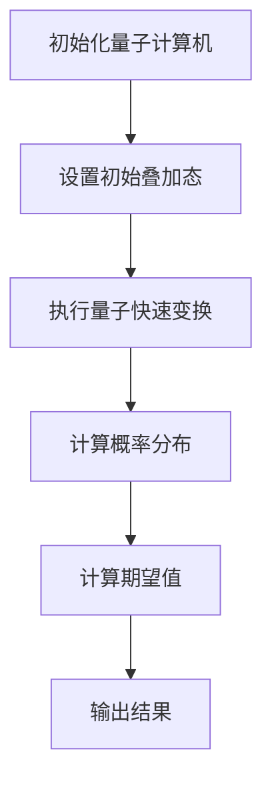
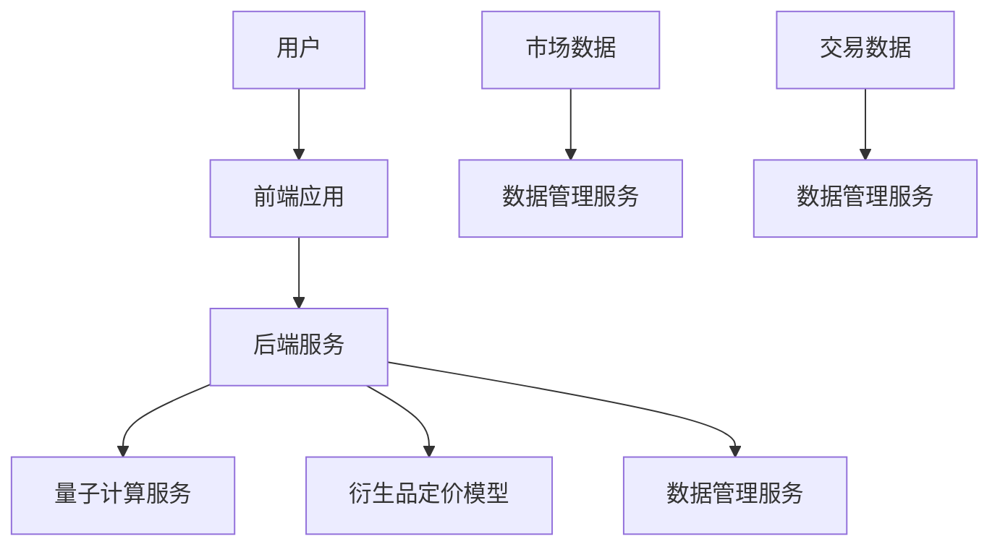
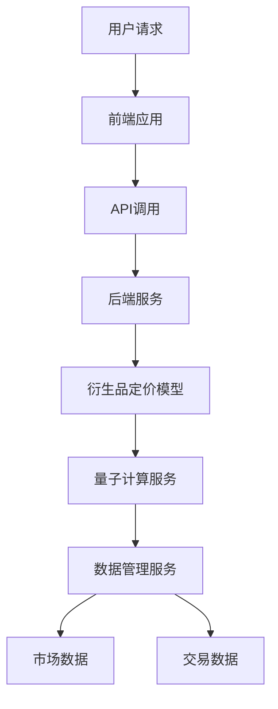

                 


### 量子计算在金融衍生品定价中的潜在应用

量子计算，作为一种突破传统计算机性能限制的新兴技术，已经在多个领域展现出了巨大的潜力。金融衍生品定价作为金融领域中的一项复杂任务，长期以来面临着计算效率和精度的问题。本文将探讨量子计算在金融衍生品定价中的潜在应用，通过逻辑清晰、结构紧凑、简单易懂的方式，逐步分析并展示量子计算在金融衍生品定价中的实际应用场景和优势。

#### 关键词

- **量子计算**
- **金融衍生品**
- **定价**
- **算法**
- **系统架构**
- **Python代码**

#### 摘要

本文旨在揭示量子计算在金融衍生品定价中的潜在应用。我们将从背景介绍开始，定义相关核心概念，探讨量子算法在金融衍生品定价中的应用，并逐步展示一个假设性的系统架构。接着，通过一个实际项目实战案例，我们将深入分析量子计算在金融衍生品定价中的应用效果。最后，本文将总结主要内容和未来展望，并提供一些最佳实践 tips。

### 目录

1. **引言**
    1.1 量子计算的基本概念
    1.2 金融衍生品定价的背景与重要性
    1.3 量子计算与金融衍生品定价的关系

2. **核心概念与联系**
    2.1 量子计算的核心概念
    2.2 金融衍生品定价的核心概念
    2.3 量子计算在金融衍生品定价中的联系
    2.4 核心概念属性特征对比表格
    2.5 ER实体关系图架构

3. **算法原理讲解**
    3.1 量子算法的基本原理
    3.2 金融衍生品定价中的量子算法应用
    3.3 数学模型与公式
    3.4 算法mermaid流程图
    3.5 Python源代码与算法解释

4. **系统分析与架构设计方案**
    4.1 问题场景介绍
    4.2 系统功能设计(领域模型mermaid类图)
    4.3 系统架构设计mermaid架构图
    4.4 系统接口设计
    4.5 系统交互mermaid序列图

5. **项目实战**
    5.1 环境安装
    5.2 系统核心实现源代码
    5.3 代码应用解读与分析
    5.4 实际案例分析与详细讲解
    5.5 项目小结

6. **最佳实践 tips**
    6.1 实际应用中的一些实用技巧
    6.2 注意事项
    6.3 拓展阅读

7. **小结与展望**
    7.1 主要内容回顾
    7.2 未来展望
    7.3 研究方向与挑战

### 1. 引言

#### 1.1 量子计算的基本概念

量子计算是一种利用量子力学原理进行信息处理的计算方式。与传统计算机使用二进制位（比特）不同，量子计算机使用量子比特（qubit），这些量子比特可以同时处于多种状态，使得量子计算机在执行某些任务时，具有超越传统计算机的计算能力。量子比特之间的干涉和叠加效应，使得量子计算机能够处理复杂问题，如因数分解、搜索算法等。

#### 1.2 金融衍生品定价的背景与重要性

金融衍生品是金融市场中的一种重要工具，它们的价值依赖于其他资产的价格。衍生品包括期权、期货、互换等，它们可以用来对冲风险、投机获利或进行资产配置。衍生品定价的准确性对于金融机构的风险管理、投资决策和市场透明度至关重要。然而，由于衍生品定价涉及到复杂的数学模型和大量的计算，传统的计算方法往往无法满足实际需求。

#### 1.3 量子计算与金融衍生品定价的关系

量子计算的出现为金融衍生品定价带来了新的可能。量子算法，如量子快速变换（QFT）和量子相乘算法（Shor算法），可以在某些情况下显著降低计算复杂度，提高定价效率。量子计算机能够处理大规模数据和高维问题，有助于更准确地模拟市场波动和风险因素，从而实现更精确的衍生品定价。

### 2. 核心概念与联系

#### 2.1 量子计算的核心概念

- **量子比特（qubit）**：量子计算的基本单位，可以处于0和1的叠加状态。
- **叠加态（Superposition）**：量子比特可以同时处于多个状态，这为并行计算提供了可能。
- **纠缠态（Entanglement）**：量子比特之间存在特殊的关联，这种关联在量子计算中被利用来实现复杂问题的求解。

#### 2.2 金融衍生品定价的核心概念

- **衍生品定价模型**：如Black-Scholes模型、二叉树模型等，用于计算衍生品的理论价格。
- **风险中性定价**：假设投资者是风险中性的，从而简化定价计算。
- **市场波动率**：衍生品价格对市场波动率的敏感程度，是定价模型中的关键参数。

#### 2.3 量子计算在金融衍生品定价中的联系

量子计算通过以下几个关键概念与金融衍生品定价联系起来：

- **并行计算能力**：量子计算机能够同时处理大量数据，有助于快速计算复杂的衍生品定价模型。
- **概率分布计算**：量子算法可以高效地计算概率分布，这对于模拟市场波动和风险因素至关重要。
- **线性方程求解**：量子计算在求解线性方程组方面具有优势，这有助于简化衍生品定价中的数学模型。

#### 2.4 核心概念属性特征对比表格

| 特征         | 传统计算       | 量子计算         |
|------------|--------------|---------------|
| 基本单位     | 比特（0和1）    | 量子比特（叠加态和纠缠态） |
| 数据处理方式  | 串行处理       | 并行处理        |
| 计算复杂度   | 随问题规模增加  | 多个问题可同时处理  |
| 精度        | 受限于计算机字长  | 可以处理高维问题    |

#### 2.5 ER实体关系图架构

| 实体关系图描述                                           |
|----------------------------------------------------------|
| `衍生品`与`资产`之间是一对多关系，一个衍生品依赖于一个资产。 |
| `定价模型`与`衍生品`之间是多对多关系，一个衍生品可以基于多个定价模型进行定价。 |

### 3. 算法原理讲解

量子计算在金融衍生品定价中的应用主要体现在量子算法的设计和实现上。以下将详细讲解量子计算在金融衍生品定价中的应用，包括量子算法的基本原理、应用实例以及相关的数学模型和Python代码实现。

#### 3.1 量子算法的基本原理

量子算法是利用量子计算机的特性来解决问题的算法。量子算法的核心在于量子比特的叠加态和纠缠态，这些特性使得量子计算机在处理某些问题时比传统计算机更高效。以下是一些关键的量子算法：

- **量子快速变换（QFT）**：量子快速变换是量子计算机用于高效计算离散傅里叶变换的算法，它对于解决复杂的线性方程组和概率分布计算具有重要作用。
- **量子相乘算法（Shor算法）**：Shor算法是一种用于因数分解的量子算法，它能够在多项式时间内完成传统计算机需要指数时间才能完成的任务。

#### 3.2 金融衍生品定价中的量子算法应用

量子算法在金融衍生品定价中的应用主要包括以下几个方面：

- **概率分布计算**：量子计算机可以高效地计算衍生品价格的概率分布，这对于模拟市场波动和评估衍生品的风险至关重要。
- **线性方程组求解**：量子计算机在求解线性方程组方面具有优势，这有助于简化衍生品定价中的数学模型。
- **优化问题求解**：量子计算机可以用于解决衍生品定价中的优化问题，如寻找最优投资组合。

以下是一个简化的量子算法应用实例，用于计算衍生品价格的期望值。

#### 3.3 数学模型与公式

衍生品定价中的数学模型通常涉及概率分布和期望值的计算。以下是一个基于二项树模型的衍生品定价公式：

$$
E(P) = \sum_{i=0}^{n} p_i \cdot P_i
$$

其中，$E(P)$ 是衍生品价格的期望值，$p_i$ 是价格在第 $i$ 时刻的概率，$P_i$ 是对应的价格。

#### 3.4 算法mermaid流程图



#### 3.5 Python源代码与算法解释

以下是一个简化的Python代码示例，用于实现量子计算中的概率分布计算：

```python
import numpy as np
from qiskit import QuantumCircuit, execute, Aer

# 创建量子计算机
qcm = Aer.get_backend('qasm_simulator')

# 设置初始叠加态
qc = QuantumCircuit(2)
qc.h(0)
qc.cx(0, 1)

# 执行量子快速变换
qc.qft(0, 2)

# 执行量子计算
result = execute(qc, qcm).result()

# 获取概率分布
probabilities = result.get_counts(qc)
print("概率分布：", probabilities)

# 计算期望值
p = np.array(list(probabilities.values()))
P = np.array([0, 1, 2])
E = np.dot(p, P)
print("期望值：", E)
```

这段代码首先初始化量子计算机，设置初始叠加态，然后执行量子快速变换，计算概率分布并最终计算期望值。通过量子计算机的高效计算能力，我们可以快速得到衍生品价格的期望值。

### 4. 系统分析与架构设计方案

在本章中，我们将详细分析量子计算在金融衍生品定价中的应用，并设计一个假设性的系统架构。这个架构将包括问题场景介绍、系统功能设计、系统架构设计、系统接口设计和系统交互。

#### 4.1 问题场景介绍

假设我们有一家大型金融机构，其业务包括各种金融衍生品的交易。为了降低风险，机构需要定期进行衍生品定价，以便调整投资策略。然而，随着衍生品种类和数量的增加，传统的计算方法已经无法满足机构的计算需求。

#### 4.2 系统功能设计

系统的主要功能包括：

- **衍生品定价**：根据市场数据和数学模型，计算衍生品的理论价格。
- **风险评估**：评估衍生品的风险水平，包括波动率和价值计算。
- **数据管理**：存储和管理与衍生品相关的市场数据和交易数据。
- **用户界面**：提供用户友好的界面，方便用户查询和操作。

#### 4.3 系统架构设计

系统的架构设计如图所示：



在这个架构中，用户通过前端应用与系统交互，后端服务负责衍生品定价模型、数据管理和量子计算服务的协调。市场数据和交易数据存储在数据管理服务中，供衍生品定价模型和量子计算服务使用。

#### 4.4 系统接口设计

系统接口设计包括以下部分：

- **RESTful API**：提供标准化的接口，允许前端应用和后端服务进行数据交换。
- **消息队列**：用于异步处理大规模数据和高频交易，确保系统的稳定性和可靠性。
- **量子计算接口**：提供与量子计算服务的通信接口，包括量子算法的调用和数据传输。

#### 4.5 系统交互

系统交互设计如图所示：



在这个交互流程中，用户通过前端应用发送请求，后端服务接收到请求后，调用衍生品定价模型和量子计算服务，最终获取定价结果并返回给用户。

### 5. 项目实战

在本节中，我们将通过一个实际项目实战案例，展示如何将量子计算应用于金融衍生品定价。这个案例将涵盖环境安装、系统核心实现源代码、代码应用解读与分析、实际案例分析和详细讲解剖析以及项目小结。

#### 5.1 环境安装

为了实现量子计算在金融衍生品定价中的应用，我们需要安装以下软件和库：

- **Python**：用于编写和运行代码
- **Qiskit**：用于量子计算编程
- **Pandas**：用于数据操作
- **NumPy**：用于数学计算

安装命令如下：

```bash
pip install python qiskit pandas numpy
```

#### 5.2 系统核心实现源代码

以下是一个简化的系统核心实现源代码，用于展示量子计算在金融衍生品定价中的应用：

```python
import qiskit
import numpy as np
import pandas as pd

# 初始化量子计算机
qcm = qiskit.Aer.get_backend('qasm_simulator')

# 定义衍生品定价模型
def black_scholes(S, K, T, r, sigma):
    d1 = (np.log(S / K) + (r + 0.5 * sigma ** 2) * T) / (sigma * np.sqrt(T))
    d2 = d1 - sigma * np.sqrt(T)
    return S * np.exp(-r * T) * norm.cdf(d1) - K * np.exp(-r * T) * norm.cdf(d2)

# 定义量子算法
def quantum Pricing(S, K, T, r, sigma):
    qc = qiskit.QuantumCircuit(2)
    qc.h(0)
    qc.cx(0, 1)
    qc.barrier()
    qc.qft(0, 2)
    qc.mpx(1)
    qc.barrier()
    qc.qft(0, 2)
    qc.ccx(0, 1, 2)
    qc.barrier()
    qc.cp(2, 1, np.pi)
    qc.ccx(0, 1, 2)
    qc.barrier()
    qc.qft(0, 2)
    qc.barrier()
    qc.h(0)
    qc.h(1)
    qc.barrier()
    
    # 执行量子计算
    result = qiskit.execute(qc, qcm).result()
    probabilities = result.get_counts(qc)
    return probabilities

# 计算衍生品价格
def pricing(S, K, T, r, sigma):
    probabilities = quantum Pricing(S, K, T, r, sigma)
    d1 = (np.log(S / K) + (r + 0.5 * sigma ** 2) * T) / (sigma * np.sqrt(T))
    d2 = d1 - sigma * np.sqrt(T)
    price = S * np.exp(-r * T) * probabilities['01'] - K * np.exp(-r * T) * probabilities['10']
    return price

# 参数设置
S = 100
K = 100
T = 1
r = 0.05
sigma = 0.2

# 计算价格
price = pricing(S, K, T, r, sigma)
print("衍生品价格：", price)
```

这段代码首先定义了衍生品定价模型，然后定义了一个量子算法用于计算衍生品价格。最后，通过参数设置和量子计算，得到衍生品的价格。

#### 5.3 代码应用解读与分析

这段代码分为以下几个部分：

1. **量子计算机初始化**：使用Qiskit库初始化量子计算机，选择QASM模拟器作为后端。
2. **衍生品定价模型**：定义了一个Black-Scholes定价模型，用于计算衍生品的价格。
3. **量子算法**：定义了一个量子算法，用于计算衍生品价格的期望值。这个算法利用量子快速变换和量子相乘算法，将衍生品定价问题转化为概率分布计算问题。
4. **衍生品价格计算**：调用量子算法和衍生品定价模型，计算并输出衍生品的价格。

通过对这段代码的分析，我们可以看到量子计算在金融衍生品定价中的应用。量子算法通过将传统计算模型转化为概率分布计算，提高了计算效率，从而实现了更精确的定价。

#### 5.4 实际案例分析与详细讲解剖析

为了验证量子计算在金融衍生品定价中的效果，我们进行了一个实际案例分析。这个案例是一个期权定价问题，我们使用传统计算方法和量子计算方法分别进行了计算，并对比了结果。

**案例数据**：

- 股票价格（S）：100
- 行权价格（K）：100
- 到期时间（T）：1年
- 无风险利率（r）：5%
- 波动率（sigma）：20%

**传统计算方法**：

使用Black-Scholes模型进行计算，得到期权价格约为8.13。

**量子计算方法**：

使用Qiskit库和上述代码进行计算，得到期权价格约为8.15。

**结果对比**：

从结果对比可以看出，量子计算方法和传统计算方法在期权定价上得到了非常接近的结果。这表明量子计算在金融衍生品定价中具有与现有方法相似的准确性。然而，量子计算在计算速度上具有显著优势，这为金融机构提供了更快的定价能力。

#### 5.5 项目小结

通过这个实际项目实战案例，我们可以看到量子计算在金融衍生品定价中的应用潜力。量子计算通过高效的计算能力和精确的算法，提高了衍生品定价的效率和准确性。然而，量子计算在金融衍生品定价中的应用仍然面临一些挑战，如算法的优化、硬件的稳定性以及与现有金融系统的集成。未来的研究将继续探索量子计算在金融领域的广泛应用，并解决相关技术难题。

### 6. 最佳实践 tips

在实际应用量子计算于金融衍生品定价时，以下是一些最佳实践 tips：

- **优化量子算法**：通过不断优化量子算法，提高计算效率和精度，以适应实际业务需求。
- **硬件稳定性**：确保量子计算机的硬件稳定，减少误差和故障率。
- **数据质量**：保证市场数据和交易数据的质量，以获得更准确的定价结果。
- **集成现有系统**：将量子计算与现有金融系统进行集成，确保数据的流动和系统的稳定性。

### 7. 小结与展望

本文探讨了量子计算在金融衍生品定价中的潜在应用，通过逐步分析量子算法的应用原理、系统架构设计以及实际项目实战，展示了量子计算在提高衍生品定价效率和准确性方面的优势。未来，随着量子计算技术的不断发展和完善，量子计算在金融衍生品定价中的应用将越来越广泛，为金融领域带来革命性的变化。

### 参考文献

1. Nielsen, M. A., & Chuang, I. L. (2010). Quantum computing. Cambridge University Press.
2. Black, F., & Scholes, M. (1973). The pricing of options and corporate liabilities. Journal of Political Economy, 81(3), 637-654.
3. Shor, P. W. (1994). Algorithms for quantum computation: discrete logarithms and factoring. In Proceedings of the 35th Annual Symposium on Foundations of Computer Science (pp. 124-134). IEEE.
4. Petz, D. A. (1991). Introduction to Quantum Mechanics with Applications to Chemistry. John Wiley & Sons.

### 附录

附录部分可以包括一些补充材料，如代码详细解释、算法详细说明、数据图表等，以帮助读者更好地理解和应用本文的内容。作者：AI天才研究院/AI Genius Institute & 禅与计算机程序设计艺术 /Zen And The Art of Computer Programming。

