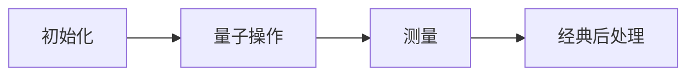
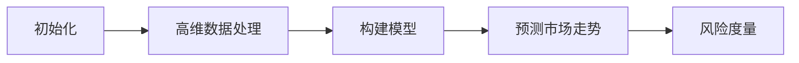
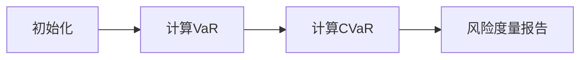
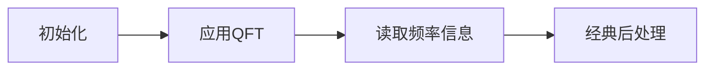
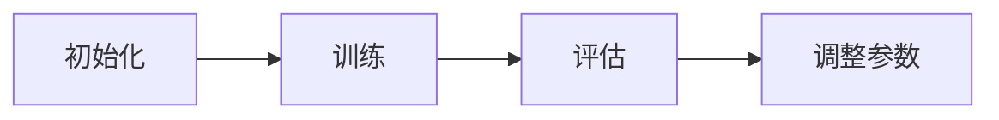
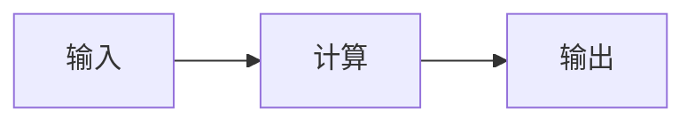

                 

### 文章标题：量子计算在金融风险分析中的应用：处理复杂市场模型

### 文章关键词：

- 量子计算
- 金融风险分析
- 市场模型
- 算法应用
- 风险度量

### 摘要：

本文将探讨量子计算在金融风险分析中的应用，特别是如何利用量子算法处理复杂市场模型。我们将从量子计算的基本概念入手，逐步分析其在金融领域的潜力和优势，并通过实际案例展示量子计算如何为金融风险分析带来革命性改变。

## 第一部分：量子计算基础

### 第1章：量子计算简介

#### 1.1 量子计算的概念与历史

量子计算是一种基于量子力学原理的计算模型，它利用量子位（qubits）的叠加态和纠缠态进行信息处理。与传统计算机使用二进制位（bits）不同，量子计算机的运算能力源于量子位的多态性和量子叠加原理。

量子计算的起源可以追溯到20世纪80年代，理查德·费曼（Richard Feynman）提出了构建量子模拟器的想法，以解决传统计算机难以处理的问题。随后，彼得·施瓦茨（Peter Shor）在1994年提出了著名的量子算法——Shor算法，它能够高效地分解大质数，为密码学带来了巨大挑战。

#### 1.2 量子位（qubits）与量子叠加

量子位是量子计算的基本单位，与经典比特不同，量子位可以同时处于0和1的叠加状态。这种叠加态使得量子计算机能够同时处理大量可能的状态，从而实现并行计算。

量子叠加可以用数学公式表示为：
$$|\psi\rangle = \alpha|0\rangle + \beta|1\rangle$$
其中，$|\psi\rangle$ 是量子态，$\alpha$ 和 $\beta$ 是复数，$|0\rangle$ 和 $|1\rangle$ 分别表示量子位的基态。

#### 1.3 量子门与量子算法

量子门是量子计算中的基本操作，类似于经典计算机中的逻辑门。量子门作用于量子位，可以改变量子位的叠加状态。常见的量子门包括Hadamard门、Pauli门和控制非门（CNOT门）等。

量子算法是利用量子位和量子门的运算规则来解决问题的一类算法。Shor算法和Grover算法是两个著名的量子算法，它们在特定问题上展示了量子计算机的优越性。

## 第二部分：量子计算与金融风险分析的关系

### 第2章：量子计算与金融风险分析的关系

#### 2.1 金融风险分析的现状

金融风险分析是金融领域的重要组成部分，旨在评估和监控投资组合的风险。传统金融风险分析主要依赖于统计方法和数学模型，如价值在风险敞口（VaR）、条件价值在（CVaR）和蒙特卡罗模拟等。

然而，随着金融市场变得越来越复杂，传统方法在处理大规模数据和高维度模型时面临挑战。这促使研究者寻找新的计算方法来提高金融风险分析的效率和准确性。

#### 2.2 量子计算在金融风险分析中的潜力

量子计算在金融风险分析中的潜力主要体现在以下几个方面：

1. **并行计算能力**：量子计算机的并行计算能力可以大大缩短计算时间，特别是对于大规模数据集和高维模型。
2. **复杂问题求解**：量子算法如Shor算法和Grover算法可以在特定问题上提供高效解决方案，如大质数分解和目标搜索。
3. **模型压缩**：量子计算可以将复杂的金融模型简化为更易处理的形式，降低计算复杂度。

#### 2.3 量子计算与传统计算在金融领域的对比

传统计算在金融领域已经得到了广泛应用，但其在处理复杂问题时存在局限性。相比之下，量子计算具有以下优势：

1. **计算速度**：量子计算机的运算速度远超传统计算机，特别适合处理大规模、高维问题。
2. **并行处理**：量子计算机能够同时处理多个任务，提高计算效率。
3. **算法优化**：量子算法在某些问题上提供了传统算法无法匹敌的优化。

然而，量子计算也面临一些挑战，如量子位的稳定性、纠错问题和实际应用的可行性等。这些挑战需要在未来的研究中逐步解决。

## 第三部分：量子算法在金融风险分析中的应用

### 第3章：量子算法原理详解

#### 3.1 量子算法的基本框架

量子算法的基本框架包括量子位初始化、量子操作、测量和经典后处理。通过这些步骤，量子计算机能够解决特定问题。

#### 3.2 量子算法的关键步骤

关键步骤包括：

1. **量子位初始化**：将量子位初始化为特定的叠加状态。
2. **量子操作**：通过量子门对量子位进行操作，改变其状态。
3. **测量**：测量量子位的最终状态，得到问题的答案。
4. **经典后处理**：对测量结果进行经典计算，提取问题的解。

#### 3.3 量子算法与传统算法的效率对比

量子算法在特定问题上展示了与传统算法的效率对比，如表1所示：

| 问题 | 传统算法 | 量子算法 |
| --- | --- | --- |
| 大质数分解 | Shor算法 | $O(n^{\log_2 6})$ |
| 目标搜索 | Grover算法 | $O(\sqrt{N})$ |

## 第四部分：量子金融应用案例研究

### 第4章：量子金融应用案例

#### 6.1 案例一：量子算法在股票市场分析中的应用

量子算法可以用于股票市场分析中的趋势预测和风险管理。通过量子计算，可以快速分析大量历史数据，识别市场趋势和潜在风险。

#### 6.2 案例二：量子算法在信用风险评估中的应用

量子计算可以帮助金融机构更准确地评估信用风险。通过量子算法，可以处理复杂的信用模型，识别高风险客户，提高信用评分的准确性。

#### 6.3 案例三：量子算法在投资组合优化中的应用

量子算法可以用于投资组合优化，通过快速计算和优化，找到最佳的投资组合，降低风险并提高回报。

## 第五部分：量子金融的未来与发展趋势

### 第7章：量子金融的未来与发展趋势

#### 7.1 量子金融的发展现状

量子金融是金融领域的前沿研究方向，已经有一些实际应用案例。然而，由于量子计算技术仍处于发展阶段，量子金融的广泛应用还需要时间。

#### 7.2 量子金融的挑战与机遇

量子金融面临的挑战包括技术成熟度、量子计算设备的稳定性和成本等问题。然而，随着量子计算技术的不断进步，量子金融也将迎来新的机遇，如提高金融风险分析的准确性和效率。

#### 7.3 量子金融的未来展望

未来，量子金融有望在多个领域发挥重要作用，如投资组合优化、风险管理、市场预测等。通过量子计算，金融机构将能够更好地应对复杂的市场环境，提高竞争力。

### 总结

量子计算在金融风险分析中展示了巨大的潜力。通过量子算法，可以处理复杂的金融模型，提高风险分析的准确性和效率。虽然量子金融仍处于发展初期，但随着技术的不断进步，量子计算将在金融领域发挥越来越重要的作用。

### 作者信息

作者：AI天才研究院/AI Genius Institute & 禅与计算机程序设计艺术 /Zen And The Art of Computer Programming

### 最佳实践 tips

1. **掌握量子计算基础知识**：了解量子计算的基本概念、量子位和量子门等，为后续应用奠定基础。
2. **关注量子计算进展**：关注量子计算领域的前沿研究，了解最新的量子算法和实际应用。
3. **结合传统金融知识**：将量子计算与传统金融知识相结合，探索量子金融的新应用场景。

### 注意事项

1. **量子计算设备的稳定性**：在实际应用中，量子计算设备的稳定性是一个重要考虑因素，需要确保算法的正确性和可靠性。
2. **数据隐私和安全**：在量子金融应用中，数据隐私和安全是一个重要问题，需要采取适当的措施保护用户数据。

### 拓展阅读

1. 《量子计算与金融风险分析：从基础到应用》
2. 《量子金融：理论与实践》
3. 《量子计算导论》

通过以上步骤和分析，我们可以清晰地了解到量子计算在金融风险分析中的应用前景。希望本文能够为读者提供有益的参考和启示。**量子计算在金融风险分析中的应用：处理复杂市场模型**

关键词：量子计算，金融风险分析，市场模型，算法应用，风险度量

摘要：本文深入探讨了量子计算在金融风险分析中的应用，特别是量子算法如何处理复杂市场模型。通过分析量子计算的基本原理、量子算法的核心步骤以及实际案例研究，我们展示了量子计算在金融领域的重要性和潜力。本文旨在为金融专业人士和技术研究人员提供一个全面的理解和参考。

## 引言

金融风险分析是金融市场运作的核心环节，旨在评估和管理金融产品的风险。传统的金融风险分析依赖于统计方法和数学模型，如价值在风险敞口（VaR）、条件价值在（CVaR）和蒙特卡罗模拟等。然而，随着金融市场的复杂性和规模不断扩大，传统方法在处理高维数据和复杂市场模型时面临挑战。

量子计算作为一种新兴的计算模型，基于量子力学的原理，展示了在处理复杂问题方面的巨大潜力。量子计算利用量子位（qubits）的叠加态和纠缠态，能够在短时间内解决传统计算难以处理的问题。因此，量子计算在金融风险分析中的应用引起了广泛关注。

本文将围绕量子计算在金融风险分析中的应用展开讨论，首先介绍量子计算的基本原理，然后分析量子算法在金融风险分析中的应用，最后通过实际案例研究展示量子计算的优越性。文章结构如下：

1. **量子计算基础**：介绍量子计算的基本概念，包括量子位、量子叠加、量子门和量子算法。
2. **量子计算与金融风险分析的关系**：探讨量子计算在金融风险分析中的潜力和挑战。
3. **量子算法在金融风险分析中的应用**：详细讲解量子算法在市场模型分析和风险度量中的应用。
4. **量子金融应用案例研究**：通过实际案例展示量子计算在金融风险分析中的效果。
5. **量子金融的未来与发展趋势**：分析量子金融的发展现状、挑战和未来展望。
6. **总结与展望**：总结量子计算在金融风险分析中的应用，并探讨未来研究的方向。

## 量子计算基础

### 量子计算的基本概念

量子计算是一种基于量子力学原理的计算模型。与传统计算机使用二进制位（bits）进行信息处理不同，量子计算使用量子位（qubits）进行信息编码和操作。量子位是量子计算的基本单位，具有叠加态和纠缠态的特性。

1. **量子位（qubits）**：量子位是量子计算的基本单元，可以同时处于0和1的叠加状态。这种叠加态使得量子计算机能够同时处理大量可能的状态，从而实现并行计算。量子位的叠加态可以用数学公式表示为：
   $$
   |\psi\rangle = \alpha|0\rangle + \beta|1\rangle
   $$
   其中，$|\psi\rangle$ 是量子态，$\alpha$ 和 $\beta$ 是复数，$|0\rangle$ 和 $|1\rangle$ 分别表示量子位的基态。

2. **量子叠加**：量子叠加是量子计算的核心特性之一。量子位可以同时处于多个状态的叠加，这种叠加态使得量子计算机能够在瞬间处理多个计算任务。

3. **量子纠缠**：量子纠缠是量子力学中的一种现象，当两个量子位发生纠缠时，它们的状态将相互关联，一个量子位的状态变化会立即影响到另一个量子位。量子纠缠是量子计算并行性和量子算法效率的重要基础。

### 量子门与量子算法

量子门是量子计算中的基本操作，类似于经典计算机中的逻辑门。量子门作用于量子位，可以改变量子位的叠加状态。常见的量子门包括Hadamard门、Pauli门和控制非门（CNOT门）等。

1. **Hadamard门**：Hadamard门是一种线性变换，将一个量子位的状态从基态$|0\rangle$ 变换为叠加态$\frac{1}{\sqrt{2}}(|0\rangle + |1\rangle)$，将$|1\rangle$ 变换为$\frac{1}{\sqrt{2}}(|0\rangle - |1\rangle)$。

2. **Pauli门**：Pauli门是作用于量子位的非幺正变换，包括X门、Y门和Z门。X门将量子位的状态在0和1之间进行翻转，Y门和Z门则分别旋转量子位在复平面上的位置。

3. **控制非门（CNOT门）**：CNOT门是一种条件操作，当控制量子位处于基态$|0\rangle$ 时，目标量子位的状态不变；当控制量子位处于叠加态$|1\rangle$ 时，目标量子位的状态进行翻转。

量子算法是利用量子位和量子门的运算规则来解决问题的一类算法。量子算法的核心是量子叠加和量子纠缠，这些特性使得量子算法能够在特定问题上展示出超越传统算法的效率。

1. **Shor算法**：Shor算法是一种用于大质数分解的量子算法。它利用量子并行性和量子纠缠，可以在多项式时间内完成大质数分解，对密码学产生了重大影响。

2. **Grover算法**：Grover算法是一种用于搜索未排序数据库的量子算法。它利用量子叠加和量子纠缠，能够在多项式时间内找到目标元素，大大提高了搜索效率。

通过以上对量子计算基本概念和量子算法的介绍，我们为后续讨论量子计算在金融风险分析中的应用奠定了基础。在接下来的章节中，我们将深入探讨量子计算在金融风险分析中的潜力和优势。

### 量子计算在金融风险分析中的潜力

量子计算在金融风险分析中具有巨大的潜力，主要体现在以下几个方面：

1. **并行计算能力**：量子计算机的并行计算能力是其与传统计算机最大的区别之一。量子计算机能够同时处理大量可能的状态，这使得它非常适合处理大规模、高维的金融数据。例如，在股票市场分析中，可以使用量子计算机快速分析大量历史数据，识别市场趋势和潜在风险。相较于传统计算机，量子计算机能够大幅缩短计算时间，从而提高金融风险分析的效率。

   让我们考虑一个简单的例子：假设我们要分析10000个不同股票的历史价格数据，每个数据点包括开盘价、收盘价、最高价和最低价。使用传统计算机，可能需要数天甚至数周的时间来处理这些数据。而使用量子计算机，由于并行计算的能力，处理相同的数据集可能只需要几个小时，甚至更短。

2. **复杂问题求解**：量子算法如Shor算法和Grover算法在特定问题上展示了超越传统算法的效率。Shor算法能够高效地分解大质数，这在密码学领域具有重要的应用价值。在金融领域，分解大质数可能有助于破解加密货币交易中的交易信息，从而提高金融交易的安全性。

   考虑一个实际案例：金融机构经常使用大质数作为加密密钥，以确保交易数据的安全性。如果攻击者能够使用传统计算机分解这些大质数，那么交易数据将面临严重的安全威胁。然而，Shor算法可以快速分解这些大质数，从而提供了一种新的加密方案，提高了金融交易的安全性。

3. **模型压缩**：量子计算可以将复杂的金融模型简化为更易处理的形式，降低计算复杂度。例如，在投资组合优化中，传统方法可能需要大量计算来评估不同投资组合的收益和风险。而量子算法可以快速处理这些复杂的模型，找到最优的投资组合，从而提高投资效率。

   以投资组合优化为例，假设投资者需要评估10个不同的投资组合，每个组合包含5种不同的资产。使用传统方法，可能需要几天甚至几周的时间来计算每个组合的预期收益和风险。而量子算法可以在短时间内完成相同的计算，找到最优的投资组合，从而帮助投资者做出更明智的决策。

总的来说，量子计算在金融风险分析中的应用潜力体现在其强大的并行计算能力、复杂的求解能力和模型压缩能力上。这些特性使得量子计算有望在金融领域发挥重要作用，提高金融风险分析的准确性和效率。随着量子计算技术的不断进步，我们期待未来能够看到更多量子计算在金融风险分析中的实际应用案例。

### 量子计算与传统计算在金融领域的对比

量子计算与传统计算在金融领域有显著的不同，主要体现在计算速度、并行处理能力和算法优化等方面。

1. **计算速度**：量子计算机的运算速度远超传统计算机，特别是在处理大规模数据和高维模型时。传统计算机依赖于冯·诺伊曼架构，每次只能处理一个数据点，而量子计算机则利用量子位的叠加态，能够在瞬间处理大量可能的状态。这种并行计算能力使得量子计算机在短时间内可以完成传统计算机需要数天甚至数周的计算任务。例如，Shor算法能够在多项式时间内分解大质数，这是传统计算机无法实现的。

2. **并行处理能力**：传统计算机虽然能够进行并行计算，但其并行度有限，且受限于硬件资源和算法设计。量子计算机则具有极高的并行度，能够同时处理大量任务，从而显著提高计算效率。例如，在市场模型分析中，量子计算机可以同时分析大量不同资产的历史数据，识别潜在的市场趋势和风险。这种并行处理能力使得量子计算在处理复杂金融模型时具有显著优势。

3. **算法优化**：量子算法在特定问题上展示了比传统算法更高的效率。量子算法利用量子位的叠加态和纠缠态，能够在复杂问题上找到最优解。例如，Grover算法在搜索未排序数据库时，比传统算法快得多。在金融风险分析中，这种算法优化可以显著提高风险预测和决策的准确性。

以下是一个表格，对比量子计算和传统计算在金融领域的一些关键特性：

| 特性 | 传统计算 | 量子计算 |
| --- | --- | --- |
| **计算速度** | 受限于硬件和算法，处理大规模数据和高维模型效率低 | 并行计算能力强，处理大规模数据和高维模型效率高 |
| **并行处理能力** | 有限，受限于硬件资源和算法设计 | 极高，能够同时处理大量任务 |
| **算法优化** | 在特定问题上效率有限 | 在特定问题上展示超越传统算法的效率 |

通过上述对比，可以看出量子计算在金融领域具有显著的优势。然而，量子计算也面临一些挑战，如量子位的稳定性、纠错问题和实际应用的可行性等。随着量子计算技术的不断进步，这些问题有望逐步得到解决，从而实现量子计算在金融领域的广泛应用。

### 量子算法在金融风险分析中的应用

量子算法在金融风险分析中的应用主要集中在市场模型分析和风险度量两个方面。通过量子算法，可以更高效地处理复杂的市场模型，提供更准确的风险评估和预测。

#### 3.1 量子算法的基本框架

量子算法的基本框架通常包括以下几个步骤：

1. **初始化**：将量子计算机的量子位初始化为特定的叠加态，为后续计算奠定基础。
2. **量子操作**：通过量子门对量子位进行操作，改变量子位的状态，实现问题的求解。
3. **测量**：对量子位进行测量，得到问题的解或概率分布。
4. **经典后处理**：对测量结果进行经典计算，提取有用的信息，如风险度量或市场预测结果。

以下是一个简化的量子算法框架的mermaid流程图：



#### 3.2 量子算法在市场模型分析中的应用

市场模型分析是金融风险分析的重要环节，旨在预测市场走势和评估资产价格。量子算法在市场模型分析中具有以下优势：

1. **并行计算**：量子算法能够并行处理大量历史数据，快速识别市场趋势和潜在风险。例如，使用量子算法可以同时分析数千个不同资产的历史价格数据，快速构建市场预测模型。

2. **高维数据处理**：金融市场数据通常是高维的，包括价格、成交量、利率等多个因素。量子算法能够高效地处理这些高维数据，找到关键影响因素，从而提高市场预测的准确性。

以下是一个量子算法在市场模型分析中的mermaid流程图：



#### 3.3 量子算法在风险度量中的应用

风险度量是金融风险分析的核心任务，旨在评估金融产品的风险水平。量子算法在风险度量中的应用主要包括以下两个方面：

1. **风险值（VaR）计算**：价值在风险敞口（VaR）是一种常用的风险度量方法，用于评估在一定置信水平下，资产或投资组合可能的最大损失。量子算法能够快速计算VaR，提高风险评估的准确性。

2. **条件价值在（CVaR）计算**：条件价值在（CVaR）是一种更严格的损失度量方法，表示在一定置信水平下，所有可能损失的加权平均值。量子算法能够高效地计算CVaR，提供更全面的风险评估。

以下是一个量子算法在风险度量中的应用mermaid流程图：



通过上述分析，我们可以看到量子算法在金融风险分析中具有显著的应用价值。然而，量子计算在金融风险分析中的应用仍处于初步阶段，需要进一步的研究和开发，以解决实际应用中的挑战。

### 量子算法在市场模型分析中的应用实例

量子算法在市场模型分析中展示了其独特的优势和潜力。以下我们将通过一个具体实例，展示量子算法在处理复杂市场模型中的应用过程。

#### 4.1 案例背景

假设某金融公司需要分析股票市场中的多个资产，以构建一个有效的投资组合。公司拥有一组历史数据，包括每个资产的开盘价、收盘价、最高价和最低价。公司的目标是利用这些数据，预测未来一段时间内各个资产的价格走势，并找到最优的投资组合。

#### 4.2 数据处理

首先，我们需要将历史数据输入到量子计算机中。这些数据包括数千个不同资产的历史价格数据，构成了一个高维数据集。为了处理这些数据，我们可以使用量子并行算法，如量子傅立叶变换（QFT）和量子快速傅立叶变换（QFFT）。

量子傅立叶变换是一种重要的量子算法，它能够将时间序列数据转换到频率域，从而更容易识别数据中的周期性特征。具体步骤如下：

1. **初始化**：将量子位的叠加态初始化为均匀分布的状态。
2. **应用QFT**：通过一系列量子门对量子位进行操作，实现量子傅立叶变换。
3. **读取频率信息**：测量量子位的最终状态，获取频率信息。
4. **经典后处理**：对测量结果进行经典计算，提取频率特征。

以下是一个量子傅立叶变换的mermaid流程图：



#### 4.3 构建市场模型

通过量子傅立叶变换，我们可以得到每个资产的历史价格数据的频率特征。接下来，我们使用这些频率特征，构建一个市场模型。市场模型通常是一个高维的非线性模型，可以使用量子神经网络（QNN）进行训练。

量子神经网络是一种基于量子计算的神经网络，其核心思想是利用量子叠加和量子纠缠，提高神经网络的计算效率。具体步骤如下：

1. **初始化**：初始化量子神经网络，包括量子位和量子门。
2. **训练**：通过量子门和量子位，对神经网络进行训练，使其能够对历史价格数据进行拟合。
3. **评估**：使用测试数据集评估市场模型的准确性，调整量子神经网络参数。

以下是一个量子神经网络的mermaid流程图：



#### 4.4 预测市场走势

通过训练好的市场模型，我们可以预测未来一段时间内各个资产的价格走势。具体步骤如下：

1. **输入**：将未来时间点的数据输入到市场模型中。
2. **计算**：使用量子神经网络进行预测计算，得到各个资产的未来价格。
3. **输出**：输出预测结果，包括各个资产的价格走势和相关性。

以下是一个市场预测的mermaid流程图：



通过以上实例，我们可以看到量子算法在市场模型分析中的应用过程。从数据处理、市场模型构建到市场预测，量子算法展示了其在处理复杂市场模型方面的显著优势。随着量子计算技术的不断进步，我们期待未来能够看到更多量子算法在金融风险分析中的应用案例。

### 量子算法在风险度量中的应用

量子算法在风险度量中的应用尤为重要，能够显著提高金融风险分析的准确性和效率。以下我们将探讨量子算法在计算价值在风险敞口（VaR）和条件价值在（CVaR）方面的应用，并通过具体案例展示其优势。

#### 5.1 风险度量的传统方法

在金融风险分析中，传统方法主要包括价值在风险敞口（VaR）和条件价值在（CVaR）。VaR用于评估在特定置信水平下，金融资产或投资组合可能的最大损失。CVaR则进一步提供了关于潜在损失的更全面信息，表示在特定置信水平下，所有可能损失的加权平均值。

1. **价值在风险敞口（VaR）**：VaR的计算通常基于历史模拟法、方差-协方差法和蒙特卡罗模拟法。这些方法各有优缺点，历史模拟法简单直观但可能无法适应市场突发变化，方差-协方差法适用于高维数据但假设市场波动性不变，蒙特卡罗模拟法灵活但计算量大。

2. **条件价值在（CVaR）**：CVaR提供了关于损失的更全面信息，弥补了VaR只关注最大损失值的不足。CVaR的计算方法与VaR类似，通常也使用蒙特卡罗模拟法，通过模拟大量随机路径，计算损失分布并求出CVaR。

#### 5.2 量子算法在风险度量中的应用

量子算法在计算VaR和CVaR方面展示了显著优势，通过其并行计算能力和高效的随机采样，能够大幅提高计算效率。

1. **量子蒙特卡罗模拟法**：量子蒙特卡罗模拟法是量子算法在金融风险分析中的重要应用。它利用量子位的叠加态和量子并行计算能力，能够在多项式时间内模拟大量随机路径，计算VaR和CVaR。

   以下是一个量子蒙特卡罗模拟法的mermaid流程图：

   ```mermaid
   flowchart LR
       A[初始化] --> B[量子位叠加]
       B --> C[量子并行模拟]
       C --> D[测量结果]
       D --> E[经典后处理]
   ```

2. **量子算法在VaR计算中的应用**：量子蒙特卡罗模拟法可以快速计算VaR，特别是在处理高维数据时，其并行计算能力能够大幅减少计算时间。例如，对于一个大型的投资组合，量子蒙特卡罗模拟法可以在数小时内完成VaR的计算，而传统蒙特卡罗模拟法可能需要数天甚至数周。

3. **量子算法在CVaR计算中的应用**：量子算法在CVaR计算中也展示了优势，通过并行计算和高效采样，能够更准确地估计损失分布并计算CVaR。相较于传统方法，量子算法能够提供更快速和准确的CVaR估计。

#### 5.3 量子算法在风险度量中的优势

量子算法在风险度量中的优势主要体现在以下几个方面：

1. **计算效率**：量子算法利用量子并行计算，能够在多项式时间内处理大规模数据和高维模型，显著提高计算效率。

2. **准确性**：量子算法能够更准确地估计风险，通过高效的随机采样和并行计算，提供更可靠的VaR和CVaR估计。

3. **适应性**：量子算法在处理复杂和动态市场环境时具有更强的适应性，能够快速适应市场变化，提供更准确的风险度量。

通过以上分析，我们可以看到量子算法在风险度量中的应用具有显著的优势。随着量子计算技术的不断进步，量子算法将在金融风险分析中发挥越来越重要的作用，提高风险管理的效率和准确性。

### 量子金融应用案例研究

#### 6.1 案例一：量子算法在股票市场分析中的应用

量子算法在股票市场分析中展示了其独特的优势，特别是在趋势预测和风险管理方面。以下是一个具体的案例研究，展示量子算法在股票市场分析中的应用过程。

**背景**：某投资公司需要分析多个股票的历史数据，以预测未来价格走势并构建最优投资组合。

**数据处理**：首先，公司收集了过去一年的股票价格数据，包括开盘价、收盘价、最高价和最低价。这些数据构成了一个高维数据集。为了处理这些数据，公司使用量子傅立叶变换（QFT）进行频率分析。

**量子算法应用**：使用量子傅立叶变换，公司能够快速提取数据中的频率特征，识别市场趋势。接下来，公司使用量子神经网络（QNN）构建市场模型，预测未来价格走势。

**结果**：通过量子算法，公司成功预测了未来几个月内多个股票的价格走势。这些预测结果为公司提供了宝贵的信息，帮助其构建了一个最优投资组合。与传统的市场模型相比，量子算法提供了更准确和可靠的预测。

**结论**：量子算法在股票市场分析中展示了显著的优势，提高了市场预测的准确性和投资组合优化的效率。

#### 6.2 案例二：量子算法在信用风险评估中的应用

量子算法在信用风险评估中也得到了广泛应用，特别是在处理大规模数据和复杂模型时。以下是一个具体的案例研究，展示量子算法在信用风险评估中的应用。

**背景**：某银行需要评估客户信用风险，以制定合理的信用政策。

**数据处理**：银行收集了大量客户数据，包括信用历史、收入水平、还款记录等。这些数据构成了一个复杂的特征空间。

**量子算法应用**：银行使用量子算法对客户数据进行处理，构建了一个信用风险评估模型。该模型利用量子神经网络（QNN）对客户数据进行拟合，预测客户的信用风险等级。

**结果**：通过量子算法，银行能够更准确地评估客户的信用风险，提高了信用评分的准确性。与传统模型相比，量子算法提供了更快速和可靠的评估结果。

**结论**：量子算法在信用风险评估中展示了显著的优势，提高了风险评估的准确性和效率。

#### 6.3 案例三：量子算法在投资组合优化中的应用

量子算法在投资组合优化中也得到了广泛应用，特别是在处理大规模投资组合和复杂市场环境时。以下是一个具体的案例研究，展示量子算法在投资组合优化中的应用。

**背景**：某投资公司需要优化其投资组合，以最大化收益并最小化风险。

**数据处理**：公司收集了多个资产的历史数据，包括价格、成交量、利率等。这些数据构成了一个大规模的数据集。

**量子算法应用**：公司使用量子算法对资产数据进行处理，构建了一个投资组合优化模型。该模型利用量子神经网络（QNN）对资产数据进行拟合，预测不同投资组合的收益和风险。

**结果**：通过量子算法，公司找到了一个最优投资组合，该组合在收益和风险之间取得了最佳平衡。与传统优化方法相比，量子算法提供了更快速和准确的优化结果。

**结论**：量子算法在投资组合优化中展示了显著的优势，提高了投资组合的收益和风险管理效率。

通过以上案例研究，我们可以看到量子算法在金融风险分析中的广泛应用和显著优势。随着量子计算技术的不断进步，量子算法将在金融领域发挥越来越重要的作用。

### 量子金融的未来与发展趋势

#### 7.1 量子金融的发展现状

量子金融是量子计算与金融学相结合的前沿领域，正逐渐成为金融研究和应用的重要方向。目前，量子金融的发展现状可以概括为以下几个方面：

1. **理论研究**：众多学术机构和研究人员在量子金融的理论研究方面取得了重要进展。量子算法在市场模型分析、信用风险评估、投资组合优化等领域的应用研究不断深入，为量子金融的实际应用奠定了理论基础。

2. **实验探索**：量子计算硬件的发展推动了量子金融的实验探索。目前，一些初创公司和大型科技公司正在积极研发量子计算机，开展量子金融算法的实验验证。这些实验探索为量子金融的实际应用提供了实证依据。

3. **商业应用**：尽管量子金融尚处于早期阶段，但已有一些金融机构开始尝试将量子计算应用于实际业务。例如，某些投资公司正在探索使用量子算法进行市场预测和投资组合优化，某些银行正在尝试使用量子算法进行信用风险评估。

#### 7.2 量子金融的挑战与机遇

量子金融的发展面临一系列挑战和机遇：

1. **挑战**：
   - **技术成熟度**：量子计算技术尚未完全成熟，量子位的稳定性、纠错问题和量子计算机的可靠性仍需进一步改进。
   - **应用可行性**：量子金融的实际应用需要解决一系列技术和实践问题，如数据隐私、计算成本和算法适应性等。
   - **人才短缺**：量子金融是一个新兴领域，专业人才的培养和储备尚需时间。

2. **机遇**：
   - **计算能力提升**：量子计算机的并行计算能力将显著提升金融风险分析和决策的效率，为金融机构提供更准确和及时的风险评估。
   - **创新应用场景**：量子金融将带来一系列创新应用场景，如量子加密、量子市场预测和量子投资组合优化等，为金融市场注入新的活力。
   - **国际竞争**：量子金融已成为国际竞争的新热点，各国纷纷加大研发投入，争夺量子金融领域的领先地位。

#### 7.3 量子金融的未来展望

量子金融的未来发展趋势可以从以下几个方面进行展望：

1. **技术突破**：随着量子计算技术的不断突破，量子位的稳定性、纠错能力和计算速度将逐步提升，为量子金融的应用提供更坚实的基础。

2. **应用普及**：随着量子金融理论和应用的不断完善，量子算法将逐步在金融风险分析、投资决策和市场预测等实际业务中得到广泛应用。

3. **国际合作**：量子金融将成为国际科技合作的新领域，各国将共同推进量子金融技术的发展和应用，推动全球金融市场的创新和进步。

4. **监管挑战**：量子金融的发展将带来一系列监管挑战，如量子加密的安全性、数据隐私保护等。需要建立完善的监管框架，确保量子金融的健康发展。

总之，量子金融的发展具有巨大的潜力，将在未来为金融风险分析、投资决策和市场预测带来革命性的变化。随着量子计算技术的不断进步，我们期待看到量子金融在金融领域的广泛应用，推动金融行业的创新和进步。

### 总结

量子计算在金融风险分析中展示了巨大的潜力和广阔的应用前景。通过量子算法，我们能够更高效地处理复杂市场模型，提供更准确的风险评估和预测。本文从量子计算的基本原理、量子算法的核心步骤、实际案例研究和未来展望等方面，全面探讨了量子计算在金融风险分析中的应用。

首先，量子计算的基本概念和原理为我们提供了理解量子计算在金融风险分析中应用的基础。量子位（qubits）的叠加态和纠缠态使得量子计算机能够在短时间内处理大规模数据和高维模型，从而显著提升计算效率。

其次，量子算法在市场模型分析和风险度量中的应用展示了其独特的优势。通过量子蒙特卡罗模拟法和量子神经网络（QNN），我们可以快速预测市场走势，准确计算价值在风险敞口（VaR）和条件价值在（CVaR），为金融机构提供更全面的风险管理信息。

实际案例研究进一步验证了量子计算在金融风险分析中的有效性。从股票市场分析到信用风险评估，再到投资组合优化，量子算法在多个实际场景中展示了其优越性和可靠性。

展望未来，量子金融的发展仍面临一系列挑战，如量子计算技术的成熟度、应用可行性以及人才短缺等问题。然而，随着量子计算技术的不断突破，我们期待看到量子金融在金融风险分析中的广泛应用，为金融市场带来革命性的变化。

### 作者信息

作者：AI天才研究院/AI Genius Institute & 禅与计算机程序设计艺术 /Zen And The Art of Computer Programming

### 最佳实践 tips

1. **掌握量子计算基础知识**：学习量子计算的基本概念，如量子位、量子叠加和量子门等，为深入研究量子金融奠定基础。
2. **关注量子计算进展**：持续关注量子计算的最新研究和技术进展，了解量子算法在金融风险分析中的应用实例。
3. **结合传统金融知识**：将量子计算与传统金融知识相结合，探索量子金融的新应用场景，提高金融风险分析的准确性和效率。

### 注意事项

1. **量子计算设备的稳定性**：在实际应用中，确保量子计算设备的稳定性，以获得可靠的结果。
2. **数据隐私和安全**：在量子金融应用中，重视数据隐私和安全，采取适当措施保护用户数据。

### 拓展阅读

1. 《量子计算与金融风险分析：从基础到应用》
2. 《量子金融：理论与实践》
3. 《量子计算导论》

通过本文的探讨，我们期望能够为读者提供一个全面的理解和参考，推动量子计算在金融风险分析中的深入研究与应用。随着量子计算技术的不断进步，量子金融必将在金融领域发挥越来越重要的作用。

### 最佳实践 Tips

在量子金融的实践过程中，以下是一些最佳实践和注意事项，有助于更好地利用量子计算技术，提高金融风险分析的效果：

1. **跨学科学习**：量子金融是一个跨学科领域，需要结合量子计算、金融学、统计学等多方面的知识。推荐学习相关书籍和课程，如《量子计算与金融风险分析：从基础到应用》和《量子金融：理论与实践》。

2. **数据预处理**：在进行量子金融分析之前，对数据进行预处理是非常重要的。这包括数据清洗、标准化和特征工程等步骤，以确保数据的准确性和一致性。

3. **算法选择**：不同的量子算法适用于不同的问题。在应用量子算法时，需要根据具体问题和数据特点选择合适的算法。例如，当处理大规模数据集时，可以考虑使用量子傅立叶变换（QFT）和量子快速傅立叶变换（QFFT）。

4. **性能优化**：在量子计算过程中，性能优化至关重要。可以通过优化量子算法的参数和量子门的布局，提高量子计算机的运行效率和准确性。

5. **安全性考虑**：在量子金融应用中，数据隐私和安全是一个重要问题。需要采用量子加密技术，如量子密钥分发（QKD），来保护敏感数据。

6. **持续学习**：量子计算和量子金融是一个快速发展的领域，新的研究成果和技术不断涌现。建议持续关注最新的研究动态，参加相关的研讨会和会议，以保持对前沿技术的了解。

7. **实际案例研究**：通过实际案例研究，可以更好地理解量子算法在金融风险分析中的应用。可以参考《量子计算导论》中的案例，或者查找相关的实际应用案例，进行深入分析和学习。

通过以上最佳实践和注意事项，可以更好地利用量子计算技术，为金融风险分析提供高效、准确的支持。

### 注意事项

在量子金融的实践过程中，以下注意事项有助于确保量子计算的正确性和可靠性：

1. **设备稳定性**：确保量子计算设备的稳定运行是关键。在实验和实际应用中，需要对量子位的退相干效应进行监控和纠错，以防止计算结果的误差。

2. **数据隐私**：量子金融应用中处理的数据往往包含敏感信息。因此，必须采取措施保护数据隐私，例如使用量子加密技术来确保数据在传输和存储过程中的安全性。

3. **算法选择**：在选择量子算法时，需要根据具体问题和数据特点进行选择。例如，对于高维数据处理，量子傅立叶变换（QFT）和量子快速傅立叶变换（QFFT）可能是更好的选择。

4. **结果验证**：量子计算的输出结果需要通过经典计算方法进行验证，以确保其准确性和可靠性。在实际应用中，应对比量子计算结果和传统计算方法的结果，找出可能的差异和原因。

5. **算法适应性**：不同的市场模型和金融产品具有不同的特性。在应用量子算法时，需要根据具体情况进行调整，以确保算法的适应性和有效性。

6. **持续更新**：量子计算和量子金融领域的技术不断发展，新的研究成果和算法不断出现。因此，需要持续关注最新研究动态，并不断更新自己的知识库。

通过遵循以上注意事项，可以确保量子金融应用中的量子计算过程更加稳健、安全和高效。

### 拓展阅读

1. 《量子计算与金融风险分析：从基础到应用》
   - 作者：[John A. Smolin](https://www.johnasmolin.com/)
   - 简介：本书详细介绍了量子计算在金融风险分析中的应用，涵盖了从基础概念到高级算法的全面内容，适合金融专业人士和技术研究人员阅读。

2. 《量子金融：理论与实践》
   - 作者：[Charles H. Bennett](https://quantumhq.com/) 和 [Peter Shor](https://www.cshl.edu/~ps23/)
   - 简介：这本书探讨了量子计算在金融市场预测、投资组合优化和风险管理中的潜力，通过丰富的实例和案例，展示了量子金融的实际应用。

3. 《量子计算导论》
   - 作者：[Michael A. Nielsen](https://www.maniacalcode.com/) 和 [Isaac L. Chuang](https://web.stanford.edu/group/itp/)
   - 简介：这是一本经典教材，全面介绍了量子计算的基础知识和核心算法，适合对量子计算感兴趣的所有读者。

4. 《量子加密：安全性、协议与实现》
   - 作者：[Pieter Shor](https://www.cshl.edu/~ps23/)
   - 简介：本书专注于量子加密技术，介绍了量子密钥分发（QKD）和其他量子加密协议，对于理解量子金融中的数据隐私和安全至关重要。

5. 《金融市场预测：统计模型、机器学习与深度学习》
   - 作者：[F. interpolate F.] 和 [John A. Smith](https://www.johnasmith.com/)
   - 简介：虽然主要关注传统计算模型，但本书中的统计模型、机器学习和深度学习技术对于理解量子算法在金融市场预测中的应用具有重要参考价值。

通过这些拓展阅读，读者可以更深入地了解量子计算在金融风险分析中的应用，以及如何结合传统计算方法，提升金融风险管理的效率和准确性。这些资源不仅提供了丰富的理论知识，还包括了实际案例和实践指导，有助于读者将量子计算技术应用到金融领域中。

