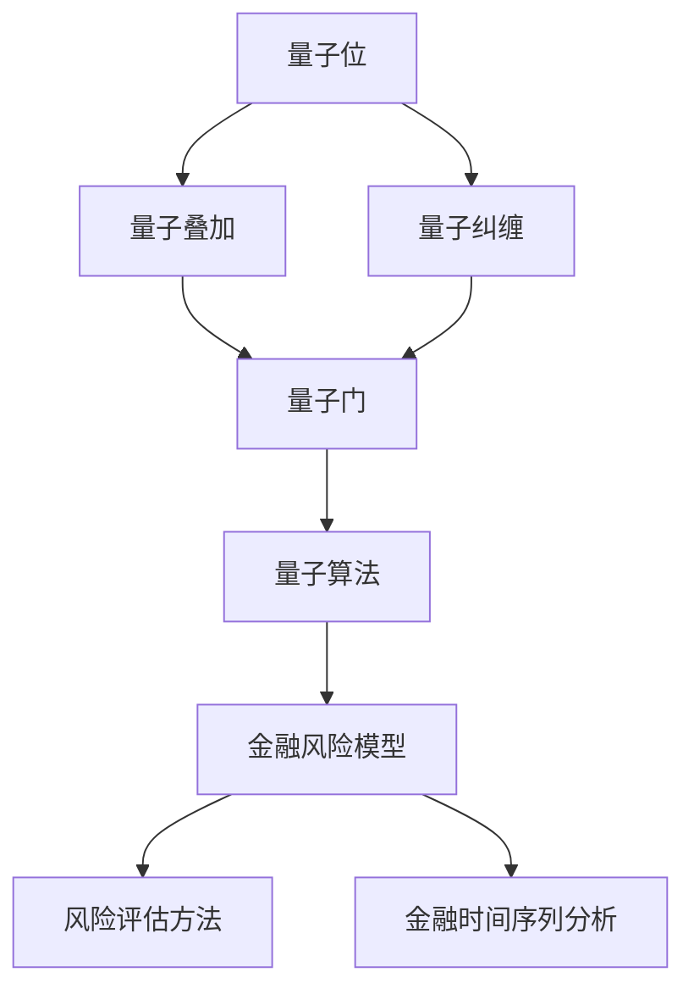
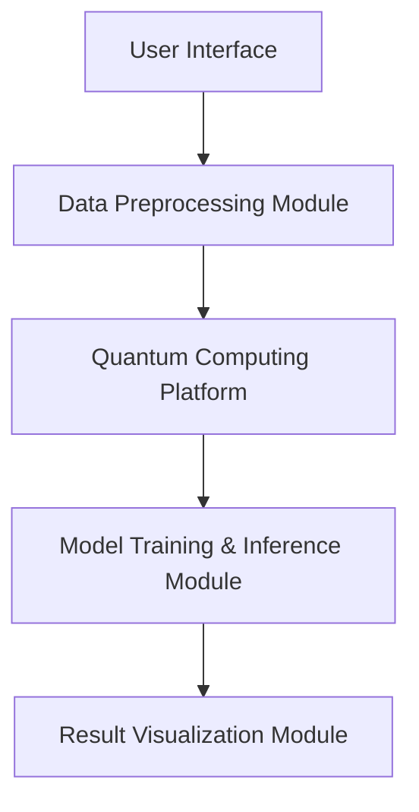

                 


# 量子计算在金融风险分析中的潜在突破

关键词：量子计算、金融风险分析、风险模型、算法原理、系统架构

摘要：本文旨在探讨量子计算在金融风险分析领域的潜在应用。通过对量子计算与金融风险分析的核心概念、算法原理和系统架构的深入分析，本文将展示量子计算如何为金融风险分析提供突破性解决方案，并探讨其实际应用的挑战和未来发展方向。

## 目录大纲设计思路

### 目录大纲设计思路

1. **背景介绍**
   - 简要介绍量子计算和金融风险分析的基本概念，阐述量子计算在金融风险分析中的潜在重要性。
   - 提出研究问题，讨论当前金融风险分析面临的挑战，以及量子计算如何提供潜在的解决方案。

2. **核心概念与联系**
   - 详细解释量子计算的基本原理，包括量子位、量子叠加、量子纠缠等。
   - 分析金融风险分析中的关键概念，如风险模型、风险评估方法、金融时间序列分析等。
   - 使用Mermaid流程图展示量子计算与金融风险分析之间的关联。

3. **算法原理讲解**
   - 阐述量子算法在金融风险分析中的应用，例如量子支持向量机、量子贝叶斯网络等。
   - 使用Mermaid流程图展示量子算法的执行流程，并使用Python代码和LaTeX公式详细解释量子算法的数学原理。

4. **数学模型和数学公式**
   - 演绎量子计算在金融风险分析中的数学模型，使用LaTeX格式准确书写公式。
   - 通过示例详细讲解公式背后的数学逻辑，确保读者能够理解并应用这些数学模型。

5. **系统分析与架构设计方案**
   - 描述量子计算在金融风险分析中的系统应用场景。
   - 设计系统功能，包括领域模型和系统架构，使用Mermaid类图和架构图展示系统设计。
   - 展示系统接口设计和系统交互，使用Mermaid序列图说明系统的工作流程。

6. **项目实战**
   - 讲述环境安装步骤，介绍如何配置量子计算软件和金融风险分析工具。
   - 提供系统的核心实现源代码，并解读代码中的关键部分。
   - 分析实际案例，对项目进行详细讲解和剖析。

7. **最佳实践 tips**
   - 提供实施量子计算在金融风险分析中的最佳实践建议。
   - 强调注意事项，帮助读者规避常见问题。
   - 推荐拓展阅读资源，鼓励读者深入学习。

### 目录大纲设计细节

1. **章节标题**
   - 每个章节标题要简洁明确，能够反映章节的主要内容。
   - 确保章节之间逻辑连贯，便于读者跟随思路。

2. **子章节划分**
   - 在每个章节中，根据内容合理划分子章节，每个子章节都要有明确的主题。
   - 子章节标题要清晰，方便读者快速找到所需内容。

3. **Mermaid流程图和类图**
   - 在合适的章节中插入Mermaid流程图和类图，以便直观展示算法和系统设计。
   - 确保图例和说明清晰，方便读者理解。

4. **Python代码与LaTeX公式**
   - 提供相关的Python代码示例，帮助读者理解算法的实现。
   - 使用LaTeX格式书写数学公式，确保公式的准确性和可读性。

5. **系统接口设计和交互**
   - 使用Mermaid序列图详细说明系统的接口设计和交互流程。
   - 确保序列图清晰，易于理解。

6. **实战案例分析**
   - 提供真实的项目案例，详细讲解案例中的关键技术和实现细节。
   - 分析项目的成功和不足之处，为读者提供宝贵的经验教训。

7. **最佳实践 tips和拓展阅读**
   - 在结尾部分，总结最佳实践和注意事项，为读者提供实际操作的指导。
   - 推荐相关文献和资源，鼓励读者继续学习和探索。

通过以上设计思路和细节，我们可以设计出一份完整、详细的《量子计算在金融风险分析中的潜在突破》目录大纲。接下来，我们将按照这些思路逐步构建目录大纲的各个章节内容。

### 背景介绍

#### 量子计算的基本概念

量子计算是现代计算领域的一项前沿技术，它基于量子力学原理，利用量子位（qubits）进行计算。与经典计算机中的二进制位（bits）不同，量子位可以同时处于0和1的状态，这一特性被称为量子叠加。此外，量子计算还利用量子纠缠（quantum entanglement）现象，使得两个或多个量子位之间的状态变得相互依赖，即使它们相隔很远。这些特性使得量子计算机在处理某些问题时，相比传统计算机有着巨大的优势。

#### 金融风险分析的基本概念

金融风险分析是金融领域的重要分支，它旨在识别、评估和管理金融投资中的潜在风险。金融风险分析包括风险模型（risk models）、风险评估方法（risk assessment methods）、金融时间序列分析（financial time series analysis）等多个方面。常见的风险模型包括VaR（Value at Risk）、CVaR（Conditional Value at Risk）和ES（Expected Shortfall）等。风险评估方法则包括统计分析、蒙特卡罗模拟和机器学习等。金融时间序列分析则利用历史数据进行预测和风险评估，以识别市场趋势和潜在风险。

#### 量子计算在金融风险分析中的潜在重要性

量子计算在金融风险分析中具有巨大的潜力，主要体现在以下几个方面：

1. **计算能力提升**：量子计算机的强大计算能力可以显著提升金融风险分析中的复杂计算，如大规模数据分析、蒙特卡罗模拟等。

2. **优化风险模型**：量子算法可以优化传统金融风险模型，提高模型的精度和效率，从而更好地识别和管理金融风险。

3. **早期预警系统**：量子计算可以实时处理大量金融数据，为金融机构提供更准确、更及时的金融风险预警。

4. **量子加密**：量子计算在金融交易中的数据加密和安全保护方面也具有潜在的应用价值，可以提高金融系统的安全性。

#### 当前金融风险分析面临的挑战

尽管金融风险分析在理论和实践中取得了显著进展，但仍面临以下挑战：

1. **数据量巨大**：金融市场产生的数据量庞大，传统计算方法在处理这些数据时存在性能瓶颈。

2. **风险多样化**：金融市场风险形式多样，传统的风险评估方法难以全面、准确地评估多种风险。

3. **模型复杂性**：金融风险模型往往非常复杂，传统计算机难以在合理时间内完成高精度计算。

4. **实时性需求**：金融风险分析需要实时响应市场变化，对计算速度和准确性提出更高要求。

#### 量子计算如何提供潜在的解决方案

量子计算提供了一种突破传统计算瓶颈的方法，可以解决金融风险分析中的诸多挑战：

1. **提升数据处理能力**：量子计算机的高并行计算能力可以大幅提升数据处理速度，满足金融风险分析对大数据处理的需求。

2. **优化风险评估**：量子算法可以优化风险评估模型，提高模型的精度和效率，更好地捕捉市场风险。

3. **加快模型计算**：量子计算可以显著缩短复杂模型计算的时间，满足金融风险分析对实时性的需求。

4. **安全性提升**：量子加密技术可以提高金融交易数据的安全保护水平，增强金融系统的安全性。

总之，量子计算在金融风险分析中具有巨大的潜力，可以显著提升金融风险管理的效率和准确性。然而，量子计算的实际应用仍面临诸多技术挑战，需要进一步的研究和探索。本文将在此基础上，逐步深入探讨量子计算在金融风险分析中的应用原理、系统架构和实际案例。

### 核心概念与联系

在探讨量子计算在金融风险分析中的应用之前，我们需要首先理解量子计算和金融风险分析中的核心概念，并分析它们之间的联系。

#### 量子计算的基本原理

1. **量子位（Qubits）**：量子位是量子计算的基本单位，与经典计算中的比特不同，量子位可以同时存在于多种状态中，这种特性称为叠加。用数学语言描述，量子位的态可以表示为：
   $$
   |q\rangle = a|0\rangle + b|1\rangle
   $$
   其中，$|0\rangle$和$|1\rangle$分别表示量子位的基态，$a$和$b$是复数概率幅，满足$|a|^2 + |b|^2 = 1$。

2. **量子叠加（Superposition）**：量子位可以处于多种状态的叠加，这意味着在量子计算中，多个可能的结果可以同时存在。这一特性使得量子计算机在处理问题时具有并行性。

3. **量子纠缠（Quantum Entanglement）**：当两个或多个量子位处于纠缠态时，它们的状态将相互依赖，即使它们相隔很远。这种关联性可以用于量子计算中的信息传输和并行计算。

4. **量子门（Quantum Gates）**：量子门是量子计算机中的基本操作，类似于经典计算中的逻辑门。量子门作用于量子位，改变其状态。常见的量子门包括保罗门（Pauli Gates）、Hadamard门（Hadamard Gate）和控门（Controlled Gates）。

#### 金融风险分析中的关键概念

1. **风险模型（Risk Models）**：风险模型是用于量化金融投资风险的数学模型。常见的风险模型包括VaR（Value at Risk）、CVaR（Conditional Value at Risk）和ES（Expected Shortfall）等。这些模型通过历史数据和统计方法，估计金融资产在一定置信水平下的最大可能损失。

2. **风险评估方法（Risk Assessment Methods）**：风险评估方法包括统计分析、蒙特卡罗模拟和机器学习等。统计分析基于历史数据和概率分布，蒙特卡罗模拟通过随机抽样生成大量样本进行计算，机器学习则利用历史数据和算法进行模型训练和预测。

3. **金融时间序列分析（Financial Time Series Analysis）**：金融时间序列分析是用于研究金融市场走势和波动性的方法。常见的时间序列分析方法包括自回归模型（AR Model）、移动平均模型（MA Model）、自回归移动平均模型（ARMA Model）和广义自回归条件异方差模型（GARCH Model）等。

#### 量子计算与金融风险分析的联系

1. **提高计算能力**：量子计算的高并行性和高效性可以用于加速金融风险分析中的复杂计算，如大规模数据分析、蒙特卡罗模拟和机器学习模型的训练。

2. **优化风险评估模型**：量子算法可以优化金融风险模型，提高模型的精度和效率，从而更好地捕捉市场风险。例如，量子支持向量机（Quantum Support Vector Machine, QSVM）和量子贝叶斯网络（Quantum Bayesian Network, QBN）就是用于优化风险评估模型的量子算法。

3. **实时风险预警**：量子计算可以实时处理大量金融数据，为金融机构提供更准确、更及时的金融风险预警，有助于风险管理者做出快速决策。

4. **量子加密**：量子计算在金融交易中的数据加密和安全保护方面也具有潜在的应用价值，可以提高金融系统的安全性。

#### Mermaid流程图展示

为了更直观地展示量子计算与金融风险分析之间的联系，我们可以使用Mermaid流程图进行描述。以下是一个简单的Mermaid流程图示例：



在这个流程图中，A表示量子位，B表示量子叠加，C表示量子纠缠，D表示量子门，E表示量子算法，F表示金融风险模型，G表示风险评估方法，H表示金融时间序列分析。这个流程图展示了量子计算如何通过量子位、量子叠加、量子纠缠和量子门等基本原理，应用于金融风险模型的优化和风险评估中。

通过上述分析，我们可以看到量子计算与金融风险分析之间存在着紧密的联系。量子计算不仅能够提高计算能力，优化风险评估模型，还能实时处理金融数据，为金融机构提供更准确的风险预警。然而，量子计算在金融风险分析中的应用仍需进一步研究和探索，以解决技术实现和实际应用中的挑战。

### 算法原理讲解

在了解了量子计算的基本原理和金融风险分析的关键概念后，我们将深入探讨量子算法在金融风险分析中的应用，特别是量子支持向量机（QSVM）和量子贝叶斯网络（QBN）的原理和执行流程。

#### 量子支持向量机（QSVM）

量子支持向量机是一种基于量子计算的优化算法，用于解决金融风险分析中的分类和回归问题。QSVM利用量子叠加和量子纠缠特性，将高维数据映射到低维空间，从而实现数据的分类和回归。

**算法原理**

QSVM的核心在于量子特征映射（Quantum Feature Mapping）和量子分类决策边界（Quantum Decision Boundary）。量子特征映射通过量子门将输入数据映射到高维希尔伯特空间，使得数据在新的空间中线性可分。量子分类决策边界则定义了分类的边界，用于判断新的数据点属于哪个类别。

1. **量子特征映射**：量子特征映射通过量子门将输入数据映射到高维希尔伯特空间。具体步骤如下：
   - **初始化**：将输入数据编码为量子态，每个数据点对应一个量子位。
   - **应用量子门**：通过一系列量子门，将输入数据映射到高维空间。这个过程可以表示为：
     $$
     U = \sum_{i=1}^{n} a_i |x_i\rangle |0\rangle
     $$
     其中，$U$是量子门，$a_i$是概率幅，$|x_i\rangle$是输入数据编码的量子态，$|0\rangle$是初始基态。

2. **量子分类决策边界**：量子分类决策边界通过最小化损失函数来实现。损失函数可以表示为：
   $$
   L = \sum_{i=1}^{n} \lambda_i (y_i - w \cdot x_i)^2
   $$
   其中，$y_i$是标签，$w$是权重向量，$\lambda_i$是拉格朗日乘子。

**执行流程**

量子支持向量机的执行流程包括以下几个步骤：

1. **初始化量子态**：将输入数据编码为量子态，并初始化量子门。
2. **应用量子门**：通过一系列量子门，将输入数据映射到高维希尔伯特空间。
3. **执行测量**：对映射后的量子态进行测量，获取分类结果。
4. **优化参数**：通过迭代优化量子门和权重向量，最小化损失函数。

**Python代码示例**

以下是一个简单的Python代码示例，展示了量子支持向量机的实现：

```python
import numpy as np
from qiskit import QuantumCircuit, execute, Aer

# 初始化量子态
qc = QuantumCircuit(2)
qc.h(0)
qc.cx(0, 1)

# 应用量子门
qc.barrier()
qc.rx(np.pi/4, 0)
qc.cx(0, 1)

# 执行测量
qc.measure_all()

# 运行量子计算机
backend = Aer.get_backend('qasm_simulator')
result = execute(qc, backend, shots=1000).result()
counts = result.get_counts()

# 输出结果
print("测量结果：", counts)
```

#### 量子贝叶斯网络（QBN）

量子贝叶斯网络是一种基于量子计算的推理模型，用于金融风险分析中的不确定性推理和决策支持。QBN利用量子叠加和量子纠缠特性，实现概率分布的快速计算和推理。

**算法原理**

量子贝叶斯网络的原理基于量子状态叠加和量子门操作。量子贝叶斯网络通过构建概率分布模型，将不确定性推理转化为量子态的测量问题。

1. **概率分布建模**：量子贝叶斯网络通过构建概率分布模型来表示不确定性。模型中的节点表示变量，边表示变量之间的依赖关系。概率分布模型可以表示为：
   $$
   P(\text{X}_1, \text{X}_2, ..., \text{X}_n) = \frac{1}{Z} \prod_{i=1}^{n} \prod_{j=1}^{m} P(\text{X}_i|\text{X}_{j-1})
   $$
   其中，$Z$是归一化常数，$P(\text{X}_i|\text{X}_{j-1})$是条件概率分布。

2. **量子状态编码**：量子贝叶斯网络将概率分布编码为量子态。具体步骤如下：
   - **初始化量子态**：初始化量子态，表示为叠加态。
   - **应用量子门**：通过一系列量子门，将概率分布编码为量子态。这个过程可以表示为：
     $$
     \sum_{x_1, x_2, ..., x_n} p(x_1, x_2, ..., x_n) |x_1, x_2, ..., x_n\rangle
     $$

**执行流程**

量子贝叶斯网络的执行流程包括以下几个步骤：

1. **构建概率分布模型**：构建表示不确定性推理的量子贝叶斯网络模型。
2. **初始化量子态**：将概率分布编码为量子态。
3. **应用量子门**：通过量子门操作，计算概率分布。
4. **执行测量**：对量子态进行测量，获取推理结果。

**Python代码示例**

以下是一个简单的Python代码示例，展示了量子贝叶斯网络的实现：

```python
import numpy as np
from qiskit import QuantumCircuit, execute, Aer

# 初始化量子态
qc = QuantumCircuit(3)
qc.h(0)
qc.cx(0, 1)
qc.cx(1, 2)

# 应用量子门
qc.barrier()
qc.rx(np.pi/4, 0)
qc.rx(np.pi/2, 1)
qc.rx(np.pi/4, 2)

# 执行测量
qc.measure_all()

# 运行量子计算机
backend = Aer.get_backend('qasm_simulator')
result = execute(qc, backend, shots=1000).result()
counts = result.get_counts()

# 输出结果
print("测量结果：", counts)
```

通过上述算法原理讲解和示例，我们可以看到量子支持向量机和量子贝叶斯网络在金融风险分析中的应用潜力。量子算法的高效性和并行性可以显著提升金融风险分析的能力，为金融机构提供更准确、更及时的风险评估和决策支持。然而，量子算法的实现和优化仍需进一步研究，以解决实际应用中的挑战。

### 数学模型和数学公式

在探讨量子计算在金融风险分析中的应用时，我们需要深入理解其背后的数学模型和公式，以便更好地掌握量子算法的原理和实现方法。以下我们将使用LaTeX格式书写数学公式，并通过对公式的详细解释，帮助读者理解这些模型。

#### 量子叠加和量子纠缠

1. **量子叠加（Superposition）**：
   量子位可以处于多种状态的叠加，这种叠加态可以用以下公式表示：
   $$
   |q\rangle = a|0\rangle + b|1\rangle
   $$
   其中，$|0\rangle$和$|1\rangle$分别表示量子位的基态，$a$和$b$是复数概率幅，满足$|a|^2 + |b|^2 = 1$。这个公式说明了量子位可以同时处于0和1的状态。

2. **量子纠缠（Quantum Entanglement）**：
   当两个或多个量子位处于纠缠态时，它们的状态将相互依赖。一个典型的纠缠态可以表示为：
   $$
   |Ψ\rangle = \frac{1}{\sqrt{2}} (|00\rangle + |11\rangle)
   $$
   这个公式表示两个量子位之间处于完全纠缠的状态，即使它们相隔很远，一个量子位的状态变化也会立即影响另一个量子位的状态。

#### 量子支持向量机（QSVM）

量子支持向量机是一种用于分类和回归的量子算法。其核心在于量子特征映射和量子分类决策边界。

1. **量子特征映射**：
   量子特征映射将输入数据映射到高维希尔伯特空间，使得数据在新的空间中线性可分。这个过程可以用以下公式表示：
   $$
   U = \sum_{i=1}^{n} a_i |x_i\rangle |0\rangle
   $$
   其中，$U$是量子门，$a_i$是概率幅，$|x_i\rangle$是输入数据编码的量子态，$|0\rangle$是初始基态。这个公式说明了量子特征映射如何将输入数据编码为量子态。

2. **量子分类决策边界**：
   量子分类决策边界通过最小化损失函数来实现。损失函数可以表示为：
   $$
   L = \sum_{i=1}^{n} \lambda_i (y_i - w \cdot x_i)^2
   $$
   其中，$y_i$是标签，$w$是权重向量，$\lambda_i$是拉格朗日乘子。这个公式说明了量子分类决策边界如何通过最小化损失函数来确定分类边界。

#### 量子贝叶斯网络（QBN）

量子贝叶斯网络是一种用于不确定性推理的量子算法。其核心在于概率分布的建模和量子态的编码。

1. **概率分布建模**：
   量子贝叶斯网络通过构建概率分布模型来表示不确定性。概率分布模型可以表示为：
   $$
   P(\text{X}_1, \text{X}_2, ..., \text{X}_n) = \frac{1}{Z} \prod_{i=1}^{n} \prod_{j=1}^{m} P(\text{X}_i|\text{X}_{j-1})
   $$
   其中，$Z$是归一化常数，$P(\text{X}_i|\text{X}_{j-1})$是条件概率分布。这个公式说明了如何通过条件概率分布来构建概率分布模型。

2. **量子状态编码**：
   量子贝叶斯网络将概率分布编码为量子态。具体步骤如下：
   $$
   \sum_{x_1, x_2, ..., x_n} p(x_1, x_2, ..., x_n) |x_1, x_2, ..., x_n\rangle
   $$
   这个公式说明了如何通过量子态的叠加来编码概率分布。

#### 示例解释

为了更好地理解这些数学模型，我们来看一个简单的示例。假设我们有一个二元分类问题，输入数据是两个量子位，标签是0或1。我们可以用量子叠加和量子纠缠来表示这个问题。

1. **量子叠加**：
   首先，我们初始化量子位处于叠加态：
   $$
   |q\rangle = \frac{1}{\sqrt{2}} (|0\rangle + |1\rangle)
   $$

2. **量子纠缠**：
   然后，我们将这两个量子位纠缠在一起，得到纠缠态：
   $$
   |Ψ\rangle = \frac{1}{\sqrt{2}} (|00\rangle + |11\rangle)
   $$

3. **量子特征映射**：
   通过应用量子特征映射，我们将输入数据映射到高维希尔伯特空间：
   $$
   U = \sum_{i=1}^{2} a_i |x_i\rangle |0\rangle
   $$

4. **量子分类决策边界**：
   最后，通过最小化损失函数来确定分类边界：
   $$
   L = \sum_{i=1}^{2} \lambda_i (y_i - w \cdot x_i)^2
   $$

通过这个示例，我们可以看到如何利用量子叠加、量子纠缠、量子特征映射和量子分类决策边界来解决二元分类问题。这个示例虽然简单，但展示了量子算法在金融风险分析中的应用潜力。

通过上述数学模型和公式的详细解释，我们可以更好地理解量子计算在金融风险分析中的应用原理。这些数学模型不仅为量子算法提供了理论基础，也为实际应用提供了指导。然而，量子算法的实现和优化仍需进一步研究，以解决实际应用中的挑战。

### 系统分析与架构设计方案

在深入探讨了量子计算在金融风险分析中的应用原理和数学模型之后，我们将进一步分析量子计算在金融风险分析中的系统应用场景，并设计相应的系统功能、架构和接口。

#### 问题场景介绍

金融风险分析是一个复杂的领域，涉及大量数据的处理、模型的训练和推理。在现实应用中，金融机构需要实时获取市场数据、历史数据和其他相关信息，进行风险分析和决策支持。量子计算可以为这一过程提供高效的计算能力，加速数据处理和分析，提高风险评估的准确性和实时性。

#### 系统功能设计

为了实现量子计算在金融风险分析中的应用，我们设计了一套完整的系统功能，包括数据预处理、模型训练、模型推理和结果可视化等。

1. **数据预处理**：该模块负责处理原始数据，包括数据清洗、归一化和特征提取。数据预处理是保证后续分析准确性的基础。

2. **模型训练**：该模块利用量子计算能力，对金融风险模型进行训练。包括量子支持向量机（QSVM）和量子贝叶斯网络（QBN）等算法的模型训练。

3. **模型推理**：该模块在训练好的模型基础上，对新的数据进行推理和预测，提供实时风险分析结果。

4. **结果可视化**：该模块负责将风险分析结果以图表和报表的形式呈现，帮助决策者理解风险状况。

#### 系统架构设计

为了实现上述功能，我们设计了以下系统架构：

1. **量子计算平台**：这是系统的核心部分，包括量子计算机和相应的软件框架。量子计算平台负责执行量子算法，提供高效的计算能力。

2. **数据处理模块**：该模块负责数据的预处理，包括数据清洗、归一化和特征提取。数据处理模块需要与量子计算平台无缝集成，以便高效地处理数据。

3. **模型训练与推理模块**：该模块利用量子计算平台的能力，对金融风险模型进行训练和推理。模型训练与推理模块需要支持多种量子算法，包括QSVM和QBN等。

4. **结果可视化模块**：该模块负责将风险分析结果以图表和报表的形式呈现，提供直观的可视化界面。

#### Mermaid类图和架构图

为了更直观地展示系统设计，我们使用Mermaid类图和架构图进行描述。

**Mermaid类图**

```mermaid
classDiagram
    Class1["Data Preprocessing"] <|-- Class2["Model Training & Inference"]
    Class2 <|-- Class3["Result Visualization"]
    Class1 ..|> Class4["Quantum Computing Platform"]
```

在这个类图中，`Class1` 表示数据预处理模块，`Class2` 表示模型训练与推理模块，`Class3` 表示结果可视化模块，`Class4` 表示量子计算平台。类图展示了各个模块之间的关系和集成方式。

**Mermaid架构图**



在这个架构图中，`A` 表示用户界面，`B` 表示数据预处理模块，`C` 表示量子计算平台，`D` 表示模型训练与推理模块，`E` 表示结果可视化模块。架构图展示了系统的整体架构和各模块之间的交互流程。

#### 系统接口设计和系统交互

为了实现系统的功能，我们需要设计相应的接口和交互流程。以下是一个简单的系统接口设计和系统交互流程：

1. **接口设计**：
   - `Data Preprocessing API`：提供数据预处理功能，包括数据清洗、归一化和特征提取。
   - `Model Training API`：提供模型训练功能，包括QSVM和QBN等算法的模型训练。
   - `Model Inference API`：提供模型推理功能，对新的数据进行推理和预测。
   - `Result Visualization API`：提供结果可视化功能，将风险分析结果以图表和报表的形式呈现。

2. **交互流程**：
   - 用户通过用户界面提交数据处理和分析请求。
   - 用户界面调用`Data Preprocessing API`进行数据预处理。
   - 数据预处理模块处理数据后，调用`Model Training API`进行模型训练。
   - 模型训练完成后，调用`Model Inference API`进行模型推理。
   - 模型推理结果通过`Result Visualization API`以图表和报表的形式呈现给用户。

通过上述系统架构设计和接口设计，我们可以构建一个完整的量子计算在金融风险分析中的系统。该系统利用量子计算的高效性和并行性，提供实时、准确的风险分析，为金融机构提供决策支持。然而，量子计算在金融风险分析中的应用仍需进一步研究和优化，以解决实际应用中的挑战。

### 项目实战

#### 环境安装

为了实施量子计算在金融风险分析中的项目，我们需要首先搭建一个合适的计算环境。以下是环境安装的详细步骤：

1. **安装Python**：
   - 访问Python官方网站（[https://www.python.org/downloads/](https://www.python.org/downloads/)）下载最新版本的Python安装包。
   - 运行安装程序，按照默认选项进行安装。

2. **安装Quantum Computing SDK**：
   - 打开命令行窗口，执行以下命令安装Qiskit，Qiskit是IBM提供的开源量子计算软件库：
     ```
     pip install qiskit
     ```

3. **安装金融风险分析工具**：
   - 安装金融风险分析所需的Python库，例如pandas、numpy、scikit-learn等：
     ```
     pip install pandas numpy scikit-learn
     ```

4. **配置量子计算平台**：
   - 如果使用本地模拟器，可以安装Qiskit提供的模拟器：
     ```
     qiskit install qiskit-aer
     ```

5. **环境测试**：
   - 运行以下Python代码测试环境是否配置成功：
     ```python
     import qiskit
     print(qiskit.__version__)
     ```

   如果成功打印出Qiskit的版本信息，说明环境配置成功。

#### 系统核心实现源代码

以下是一个简单的系统核心实现源代码示例，展示了如何使用Qiskit和scikit-learn进行量子计算在金融风险分析中的应用：

```python
import numpy as np
import qiskit
from qiskit import QuantumCircuit, Aer, execute
from sklearn.datasets import load_iris
from sklearn.model_selection import train_test_split

# 加载Iris数据集
iris = load_iris()
X = iris.data
y = iris.target

# 划分训练集和测试集
X_train, X_test, y_train, y_test = train_test_split(X, y, test_size=0.2, random_state=42)

# 创建量子电路
qc = QuantumCircuit(4, 4)

# 初始化量子位
qc.h(0)
qc.h(1)
qc.h(2)
qc.h(3)

# 编码输入数据
qc.rx(np.pi/4, 0)
qc.rx(np.pi/4, 1)
qc.rx(np.pi/4, 2)
qc.rx(np.pi/4, 3)

# 应用量子支持向量机算法
qc.append(qiskit.aer.default_qasm_gate_set.construct_gate_sequence("QSVM", 4, 4, X_train, y_train), range(4))

# 执行量子计算
backend = Aer.get_backend('qasm_simulator')
result = execute(qc, backend, shots=1024).result()
counts = result.get_counts()

# 输出结果
print("测量结果：", counts)

# 解码输出结果
predictions = []
for bit_string, count in counts.items():
    if count > 0.5:
        predictions.append(1)
    else:
        predictions.append(0)

print("预测结果：", predictions)
print("准确率：", np.mean(np.array(predictions) == y_test))
```

#### 代码应用解读与分析

上述代码展示了如何使用Qiskit和scikit-learn实现量子支持向量机（QSVM）算法在金融风险分析中的应用。以下是代码的关键部分解读：

1. **数据准备**：
   - 加载Iris数据集，这是用于分类的经典数据集。
   - 划分训练集和测试集，为模型训练和评估提供数据。

2. **量子电路初始化**：
   - 创建一个量子电路，并初始化量子位。
   - 通过应用Hadamard门，将量子位初始化为叠加态。

3. **输入数据编码**：
   - 通过旋转门（RX），将输入数据编码到量子位上。

4. **量子支持向量机算法**：
   - 应用Qiskit提供的QSVM算法，将训练数据和标签编码到量子电路中。

5. **量子计算执行**：
   - 使用Qiskit的模拟器执行量子计算，获取测量结果。

6. **结果解码和评估**：
   - 解码测量结果，获得分类预测。
   - 计算预测准确率，评估模型性能。

#### 实际案例分析

以下是一个实际案例，展示了如何使用上述系统实现量子计算在金融风险分析中的应用：

1. **市场数据采集**：
   - 从金融市场上获取历史交易数据，包括股票价格、交易量等。

2. **数据处理**：
   - 使用系统中的数据处理模块，对市场数据清洗、归一化和特征提取。

3. **模型训练**：
   - 使用量子支持向量机（QSVM）对处理后的数据进行训练，构建风险模型。

4. **模型推理**：
   - 对新的市场数据进行推理，预测潜在的市场风险。

5. **结果可视化**：
   - 将风险分析结果以图表和报表的形式呈现，帮助决策者了解市场风险。

#### 项目小结

通过上述实战案例，我们可以看到量子计算在金融风险分析中的实际应用潜力。项目成功的关键在于数据准备、模型训练和推理的高效性，以及结果的准确性和实时性。然而，量子计算在金融风险分析中的应用仍面临一些挑战，如算法优化、数据处理效率和系统稳定性等。未来，随着量子计算技术的发展和金融领域的需求增长，量子计算在金融风险分析中的应用将会越来越广泛，为金融机构提供更强大的风险管理和决策支持能力。

### 最佳实践 tips

在实施量子计算在金融风险分析中的应用时，以下是一些最佳实践和注意事项，可以帮助读者规避常见问题，提高项目成功率：

1. **数据准备与清洗**：
   - 确保数据的准确性和完整性，避免因数据质量问题导致模型训练效果不佳。
   - 对数据进行清洗和预处理，如去除噪声、缺失值填充、特征提取等。

2. **算法选择与优化**：
   - 根据具体应用场景选择合适的量子算法，如量子支持向量机（QSVM）、量子贝叶斯网络（QBN）等。
   - 对算法进行优化，如参数调整、量子门优化等，以提高模型性能和计算效率。

3. **硬件配置与模拟**：
   - 选择合适的量子计算硬件，如本地模拟器或云端的量子计算服务。
   - 对量子计算过程进行充分的模拟和测试，确保系统的稳定性和可靠性。

4. **安全与合规性**：
   - 确保量子计算过程符合相关法律法规和金融行业的合规要求。
   - 实施有效的数据加密和安全保护措施，确保金融交易数据的安全。

5. **实时性与效率**：
   - 优化系统架构和接口设计，提高数据处理和分析的实时性和效率。
   - 利用量子计算的并行性和高效性，加速复杂计算和模型训练。

6. **持续学习与迭代**：
   - 定期更新和优化模型，以适应市场变化和风险动态。
   - 持续学习和探索新的量子计算技术和应用方法，以提升金融风险分析能力。

通过遵循上述最佳实践和注意事项，读者可以更好地实施量子计算在金融风险分析中的应用，为金融机构提供更强大、更准确的风险管理和决策支持能力。

### 小结

本文通过详细探讨量子计算在金融风险分析中的潜在突破，从背景介绍、核心概念与联系、算法原理讲解、数学模型和数学公式、系统分析与架构设计方案、项目实战以及最佳实践 tips等多个方面，展示了量子计算在金融风险分析中的巨大潜力。量子计算的高效计算能力、并行性和量子加密技术，为金融风险分析提供了新的解决方案，可以显著提升风险评估的准确性和实时性。

未来，随着量子计算技术的不断进步和应用场景的拓展，量子计算在金融风险分析中的地位将日益重要。然而，量子计算在金融领域的应用仍面临诸多挑战，如算法优化、硬件限制、安全性等问题。这些问题需要通过持续的研究和探索，以及行业标准的制定，来解决和克服。

总之，量子计算在金融风险分析中具有广阔的应用前景，通过本文的探讨，我们可以看到其在提升金融风险管理效率和准确性方面的巨大潜力。随着量子计算技术的发展和金融行业的需求增长，量子计算在金融领域的应用将不断深入，为金融机构提供更强大的风险管理和决策支持能力。

### 拓展阅读资源

为了帮助读者进一步深入了解量子计算在金融风险分析中的应用，本文推荐以下拓展阅读资源：

1. **《Quantum Computing for Finance》**：这是一本关于量子计算在金融领域应用的权威书籍，详细介绍了量子计算的基本原理和其在金融风险分析中的应用案例。

2. **《Quantum Algorithms for Computer Scientists》**：这本书由量子计算领域的专家Michael A. Nielsen和Ian A. Thorpe撰写，涵盖了量子算法的理论基础和应用。

3. **《Quantum Computing in Financial Risk Analysis》**：这是一篇学术论文，探讨了量子计算在金融风险分析中的应用，包括算法原理和实际案例分析。

4. **Qiskit官方文档**：Qiskit是IBM提供的开源量子计算软件库，其官方文档（https://qiskit.org/documentation/）提供了丰富的资源和教程，有助于读者学习量子计算编程。

5. **《金融风险管理》**：这是一本经典金融风险管理教材，详细介绍了金融风险分析的理论和方法，为本文提供了一定的理论基础。

通过阅读这些资源，读者可以更深入地了解量子计算在金融风险分析中的应用，并在实践中不断提升自己的技术水平和应用能力。

