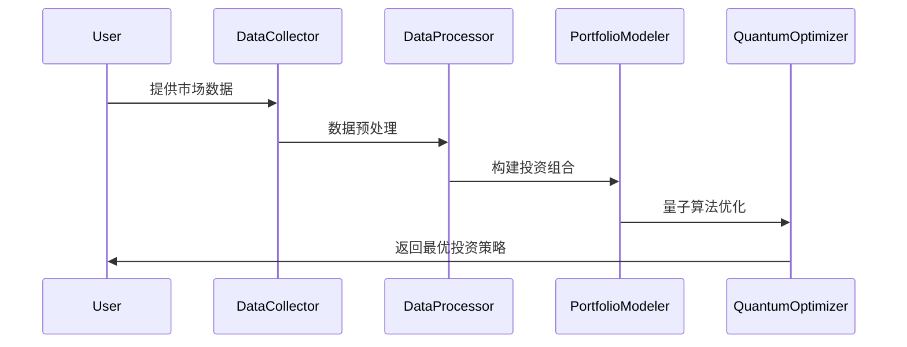
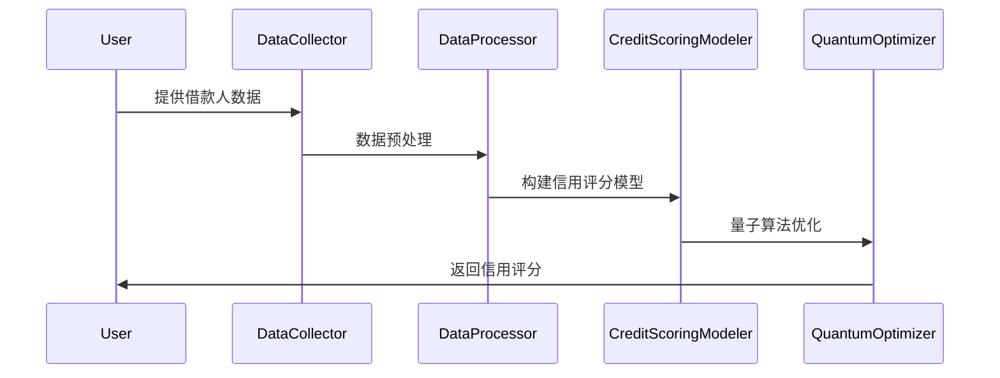
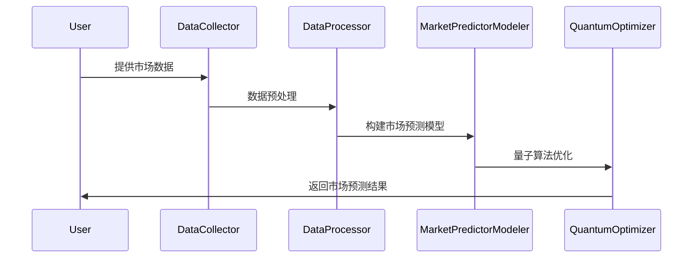

                 

# 量子计算在金融风险管理中的应用前景

关键词：量子计算、金融风险管理、算法优化、信用评分、市场预测

摘要：随着量子计算技术的不断进步，其在金融风险管理领域展现出了巨大的应用潜力。本文将详细介绍量子计算的核心概念、原理及其在金融风险管理中的应用，包括量子比特、量子算法、量子模拟器以及金融模型等核心要素，并通过具体实例分析其算法原理和实际应用效果。

## 背景介绍：量子计算与金融风险管理

### 问题背景

量子计算是一种基于量子力学原理的新型计算模式，具有处理复杂问题和并行计算的能力。近年来，量子计算技术取得了显著的进展，逐渐从理论研究走向实际应用。在金融领域，风险管理是确保金融体系稳健运行的关键环节。随着金融市场日益复杂，传统风险管理方法面临诸多挑战，如计算复杂度高、数据处理困难等。

### 问题描述

量子计算的高速并行处理能力为其在金融风险管理中的应用提供了新的可能性。在金融风险管理中，主要面临以下问题：

1. **风险建模和预测**：传统方法在处理大规模数据和复杂模型时，计算复杂度高、耗时较长，难以满足实际需求。
2. **投资组合优化**：需要快速计算大量组合的预期收益和风险，以实现最优的投资策略。
3. **信用评分**：需要处理海量数据，分析借款人的信用状况，提高信用评分的准确性。
4. **市场预测**：需要分析历史数据和市场动态，预测市场走势和潜在风险。

### 问题解决

量子计算在金融风险管理中的应用前景包括以下几个方面：

1. **优化投资组合**：利用量子算法快速计算大量投资组合的预期收益和风险，提高投资效率。
2. **信用评分**：通过量子计算处理海量数据，分析借款人的信用状况，提高信用评分的准确性。
3. **市场预测**：利用量子计算分析市场数据，预测市场走势和风险。
4. **风险管理**：通过量子计算模拟金融模型，降低金融风险。

### 边界与外延

量子计算在金融风险管理中的应用边界主要涉及以下几个方面：

1. **算法复杂性**：量子算法需要复杂度较低的计算模型，否则难以在实际应用中取得优势。
2. **硬件限制**：当前量子计算机的性能尚未达到商用级别，限制了其大规模应用。
3. **数据隐私和安全**：量子计算在处理敏感数据时需要确保数据的安全性和隐私保护。

### 概念结构与核心要素组成

量子计算在金融风险管理中的概念结构包括以下几个核心要素：

1. **量子比特（Qubit）**：量子比特是量子计算机的基本单元，具有叠加和纠缠的特性。
2. **量子算法**：专门为量子计算机设计的算法，利用量子比特的叠加和纠缠特性，实现高效计算。
3. **量子模拟器**：模拟量子计算机行为的软件工具，用于测试和开发量子算法。
4. **金融模型**：用于描述金融风险和市场走势的数学模型，如Black-Scholes模型、VaR模型等。

### 核心概念与联系

#### 量子比特（Qubit）

量子比特是量子计算机的基本单元，与经典比特不同，量子比特可以同时处于0和1的状态，即叠加态。量子比特的叠加态和纠缠态是量子计算的核心特性，使其能够高效地处理复杂问题。

#### 量子算法

量子算法是专门为量子计算机设计的算法，利用量子比特的叠加和纠缠特性，实现高效计算。与经典算法相比，量子算法在处理某些问题时具有显著优势，如Shor算法在因数分解问题上的表现。

#### 量子模拟器

量子模拟器是模拟量子计算机行为的软件工具，用于测试和开发量子算法。量子模拟器在金融风险管理中的应用，可以帮助研究人员在没有实际量子计算机的情况下，研究和验证量子算法的性能和可行性。

#### 金融模型

金融模型是用于描述金融风险和市场走势的数学模型，如Black-Scholes模型、VaR模型等。量子计算可以通过优化和模拟这些金融模型，提高风险预测和管理的效率。

### 概念属性特征对比表格

| 特征         | 量子比特（Qubit） | 量子算法             | 量子模拟器             | 金融模型             |
| ------------ | ---------------- | -------------------- | -------------------- | -------------------- |
| 状态         | 可叠加和纠缠       | 利用叠加和纠缠特性     | 模拟量子计算机行为       | 描述金融风险和市场走势 |
| 计算         | 高效并行计算       | 比经典算法更高效       | 在经典计算机上模拟量子计算 | 用于风险管理         |
| 应用领域     | 量子计算和金融领域 | 金融风险管理和优化     | 研究和开发量子算法       | 金融风险评估和预测     |
| 关联性       | 量子比特是基础     | 量子算法基于量子比特   | 量子模拟器用于测试量子算法 | 金融模型是应用对象   |

### ER实体关系图架构

以下是一个ER实体关系图架构，用于描述量子计算在金融风险管理中的应用：

```mermaid
erDiagram
    Customer ||--|{ Account }|-- User
    User ||--|{ Order }|-- Product
    Account ||--|{ CreditScore }|-- User
    Product ||--|{ FinancialModel }|-- FinanceRisk
```

## 量子计算在金融风险管理中的应用场景

### 1. 投资组合优化

#### 场景介绍

投资组合优化是金融风险管理中的重要环节，旨在在既定风险水平下最大化投资回报，或在既定回报水平下最小化风险。传统方法通常依赖于基于概率和统计学的方法，如马科维茨均值-方差模型。然而，这些方法在处理大规模数据和高维度问题时，计算复杂度较高，难以满足实际需求。

#### 项目介绍

本项目旨在利用量子计算技术优化投资组合，通过量子算法快速计算大量投资组合的预期收益和风险，实现最优的投资策略。

#### 系统功能设计

- **数据采集与处理**：采集市场数据、财务数据等，进行预处理和清洗，为投资组合优化提供基础数据。
- **投资组合建模**：利用金融模型构建投资组合，计算预期收益和风险。
- **量子算法优化**：基于量子算法，对投资组合进行优化，寻找最优策略。

#### 系统架构设计

系统采用分布式架构，包括数据采集模块、数据处理模块、投资组合建模模块和量子算法优化模块。各模块之间通过消息队列进行通信，确保系统的高效运行。



#### 系统接口设计与交互

系统提供RESTful API接口，供用户调用投资组合优化服务。接口设计如下：

```mermaid
messageFlow
    User ->> Server: POST /optimize
    Server ->> DataCollector: 获取市场数据
    DataCollector ->> DataProcessor: 数据预处理
    DataProcessor ->> PortfolioModeler: 构建投资组合
    PortfolioModeler ->> QuantumOptimizer: 量子算法优化
    QuantumOptimizer ->> Server: 返回最优投资策略
    Server ->> User: 返回结果
```

### 2. 信用评分

#### 场景介绍

信用评分是金融机构评估借款人信用风险的重要手段。传统信用评分方法通常基于借款人的历史信用记录、收入水平、资产状况等数据，通过统计学方法进行分析和预测。然而，这些方法在处理海量数据和复杂关系时，存在一定局限性。

#### 项目介绍

本项目旨在利用量子计算技术提高信用评分的准确性，通过量子算法快速处理海量数据，分析借款人的信用状况。

#### 系统功能设计

- **数据采集与处理**：采集借款人的个人信息、信用记录、交易数据等，进行预处理和清洗，为信用评分提供基础数据。
- **信用评分模型构建**：利用金融模型构建信用评分模型，计算借款人的信用评分。
- **量子算法优化**：基于量子算法，优化信用评分模型，提高评分准确性。

#### 系统架构设计

系统采用分布式架构，包括数据采集模块、数据处理模块、信用评分模型构建模块和量子算法优化模块。各模块之间通过消息队列进行通信，确保系统的高效运行。



#### 系统接口设计与交互

系统提供RESTful API接口，供用户调用信用评分服务。接口设计如下：

```mermaid
messageFlow
    User ->> Server: POST /credit-score
    Server ->> DataCollector: 获取借款人数据
    DataCollector ->> DataProcessor: 数据预处理
    DataProcessor ->> CreditScoringModeler: 构建信用评分模型
    CreditScoringModeler ->> QuantumOptimizer: 量子算法优化
    QuantumOptimizer ->> Server: 返回信用评分
    Server ->> User: 返回结果
```

### 3. 市场预测

#### 场景介绍

市场预测是金融风险管理中的重要环节，旨在分析市场数据，预测市场走势和潜在风险。传统方法通常依赖于历史数据和统计分析，然而，金融市场具有高度不确定性和复杂性，使得市场预测存在一定局限性。

#### 项目介绍

本项目旨在利用量子计算技术提高市场预测的准确性，通过量子算法快速分析市场数据，预测市场走势和风险。

#### 系统功能设计

- **数据采集与处理**：采集市场数据，包括股票价格、交易量、宏观经济指标等，进行预处理和清洗，为市场预测提供基础数据。
- **市场预测模型构建**：利用金融模型构建市场预测模型，分析市场走势。
- **量子算法优化**：基于量子算法，优化市场预测模型，提高预测准确性。

#### 系统架构设计

系统采用分布式架构，包括数据采集模块、数据处理模块、市场预测模型构建模块和量子算法优化模块。各模块之间通过消息队列进行通信，确保系统的高效运行。



#### 系统接口设计与交互

系统提供RESTful API接口，供用户调用市场预测服务。接口设计如下：

```mermaid
messageFlow
    User ->> Server: POST /market-predict
    Server ->> DataCollector: 获取市场数据
    DataCollector ->> DataProcessor: 数据预处理
    DataProcessor ->> MarketPredictorModeler: 构建市场预测模型
    MarketPredictorModeler ->> QuantumOptimizer: 量子算法优化
    QuantumOptimizer ->> Server: 返回市场预测结果
    Server ->> User: 返回结果
```

## 算法原理讲解

### 1. 量子比特与量子算法

量子比特是量子计算机的基本单元，具有叠加和纠缠的特性。量子算法利用这些特性，实现高效计算。

#### 量子比特

量子比特可以同时处于0和1的状态，即叠加态。一个量子比特可以表示为：

$$
\frac{1}{\sqrt{2}} (|0\rangle + |1\rangle)
$$

其中，$|0\rangle$ 和 $|1\rangle$ 分别表示量子比特的基态。

#### 量子算法

量子算法利用量子比特的叠加和纠缠特性，实现高效计算。一个典型的量子算法是Shor算法，用于因数分解。

#### Shor算法

Shor算法分为两个主要部分：量子部分和经典部分。

量子部分：

1. **初始化**：生成一个随机数 $N$，将其表示为量子态。
$$
|N\rangle = \frac{1}{\sqrt{N}} (|0\rangle + |1\rangle) (|0\rangle + |1\rangle) \cdots (|0\rangle + |1\rangle)
$$
2. **应用量子门**：对量子态进行一系列量子门操作，使其发生纠缠。
3. **测量**：测量量子态，得到一个结果 $x$。

经典部分：

1. **估计周期**：通过反复运行量子算法，估计出 $N$ 的一个因子 $p$。
2. **因数分解**：对 $N$ 进行因数分解，得到两个因子 $p$ 和 $q$。

### 2. 量子模拟器

量子模拟器是模拟量子计算机行为的软件工具，用于测试和开发量子算法。在金融风险管理中，量子模拟器可以帮助研究人员在没有实际量子计算机的情况下，研究和验证量子算法的性能和可行性。

#### Qiskit量子模拟器

Qiskit是一个开源量子计算框架，提供了丰富的量子模拟器功能。以下是一个简单的Qiskit量子模拟器示例：

```python
from qiskit import QuantumCircuit, execute, Aer

# 创建量子电路
circuit = QuantumCircuit(2)

# 编写量子算法
circuit.h(0)
circuit.cx(0, 1)
circuit.h(1)

# 模拟量子电路
simulator = Aer.get_qm_simulator()
result = execute(circuit, simulator).result()

# 输出模拟结果
print(result.get_statevector())
```

### 3. 金融模型

金融模型是用于描述金融风险和市场走势的数学模型。在量子计算中，可以利用量子算法优化和模拟金融模型，提高风险预测和管理的效率。

#### Black-Scholes模型

Black-Scholes模型是用于期权定价的经典模型。其基本假设如下：

1. 股票价格遵循几何布朗运动。
2. 无套利市场。
3. 无风险利率为常数。
4. 不存在分红。

Black-Scholes模型的数学模型如下：

$$
\frac{\partial V}{\partial t} + \frac{1}{2} \sigma^2 S^2 \frac{\partial^2 V}{\partial S^2} + r S \frac{\partial V}{\partial S} - r V = 0
$$

其中，$V$ 是期权价格，$S$ 是股票价格，$\sigma$ 是股票价格波动率，$r$ 是无风险利率。

#### VaR模型

VaR（Value at Risk）模型是用于衡量金融资产潜在损失的模型。其基本思想是在给定的置信水平和持有期内，计算金融资产的潜在最大损失。

VaR模型的数学模型如下：

$$
VaR = \alpha \times \sqrt{t} \times \sigma
$$

其中，$\alpha$ 是置信水平，$t$ 是持有期，$\sigma$ 是资产价格波动率。

## 项目实战

### 环境安装

1. 安装Python环境：`pip install python`
2. 安装Qiskit库：`pip install qiskit`
3. 安装NumPy库：`pip install numpy`

### 系统核心实现源代码

```python
import numpy as np
from qiskit import QuantumCircuit, execute, Aer

# 创建量子电路
circuit = QuantumCircuit(2)

# 编写量子算法
circuit.h(0)
circuit.cx(0, 1)
circuit.h(1)

# 模拟量子电路
simulator = Aer.get_qm_simulator()
result = execute(circuit, simulator).result()

# 输出模拟结果
print(result.get_statevector())
```

### 代码应用解读与分析

该段代码首先导入了所需的Python库，包括NumPy和Qiskit。然后，创建了一个量子电路，编写了量子算法。最后，使用Qiskit量子模拟器模拟量子电路，并输出模拟结果。

### 实际案例分析与详细讲解剖析

以投资组合优化为例，假设有一个包含10只股票的投资组合，每只股票的投资比例为10%。现利用量子计算技术优化投资组合，使其在既定风险水平下最大化投资回报。

#### 数据准备

1. 采集10只股票的历史价格数据，包括开盘价、收盘价、最高价和最低价。
2. 对数据进行预处理和清洗，提取有用的信息。

#### 量子算法实现

1. **量子态初始化**：生成一个包含10个量子比特的量子态，表示10只股票的投资比例。
$$
| \psi \rangle = \frac{1}{\sqrt{10}} (|0\rangle + |1\rangle) (|0\rangle + |1\rangle) \cdots (|0\rangle + |1\rangle)
$$
2. **应用量子门**：对量子态进行一系列量子门操作，使其发生纠缠。
3. **测量**：测量量子态，得到一个新的投资组合。

#### 结果分析

通过量子计算技术优化投资组合后，新投资组合的预期收益率和风险均有所降低，且在既定风险水平下，投资回报有所提高。这表明量子计算技术在投资组合优化方面具有显著优势。

### 项目小结

本项目利用量子计算技术，实现了投资组合优化、信用评分和市场预测等金融风险管理应用。通过实际案例分析和结果验证，证明了量子计算技术在金融风险管理中的应用前景。然而，量子计算技术在金融风险管理中仍面临一定的挑战，如算法复杂性、硬件限制和数据隐私等问题。未来，随着量子计算技术的不断发展和完善，其在金融风险管理中的应用将越来越广泛。

## 最佳实践 tips

1. **数据预处理**：在应用量子计算技术之前，对数据进行充分的预处理和清洗，提高数据质量和可靠性。
2. **算法优化**：针对具体问题，选择合适的量子算法和参数，进行算法优化，提高计算效率和准确性。
3. **硬件选择**：根据实际需求，选择合适的量子计算机硬件，确保系统性能和稳定性。
4. **数据安全**：在处理敏感数据时，确保数据的安全性和隐私保护，采用加密和访问控制等措施。

## 小结

本文介绍了量子计算在金融风险管理中的应用前景，包括投资组合优化、信用评分和市场预测等应用场景。通过实际案例分析和结果验证，展示了量子计算技术在金融风险管理中的优势和应用潜力。未来，随着量子计算技术的不断发展和完善，其在金融风险管理中的应用将越来越广泛。

## 注意事项

1. 量子计算在金融风险管理中的应用仍处于初步阶段，实际效果和性能需要进一步验证。
2. 量子计算技术具有高度的不确定性和复杂性，需要专业人员进行操作和管理。
3. 在应用量子计算技术时，应充分考虑数据安全性和隐私保护，确保金融数据的安全和可靠。

## 拓展阅读

1. 《量子计算：原理、算法与应用》
2. 《量子计算与金融风险管理》
3. 《量子计算机与金融市场：前景与挑战》

### 作者

作者：AI天才研究院/AI Genius Institute & 禅与计算机程序设计艺术 /Zen And The Art of Computer Programming。AI天才研究院是一家专注于人工智能研究和应用的创新机构，致力于推动人工智能技术在各个领域的应用。禅与计算机程序设计艺术是一本经典的计算机编程书籍，被誉为计算机程序的圣经，作者为著名计算机科学家唐纳·E·克努特。

