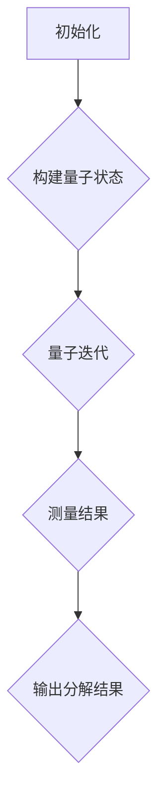
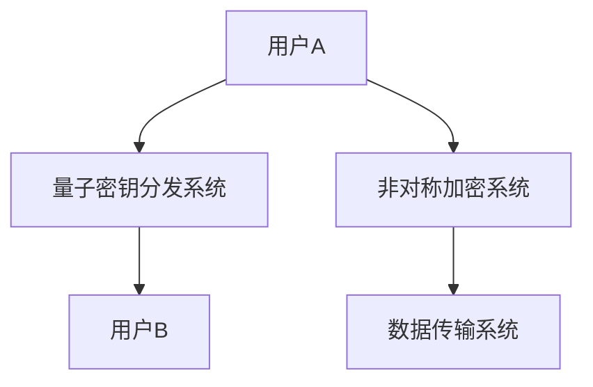

                 

# 量子计算威胁：2029年传统非对称加密技术或不再安全

> 关键词：量子计算、非对称加密、RSA、ECC、Shor算法、安全威胁

> 摘要：本文深入探讨了量子计算对传统非对称加密技术，如RSA和ECC，可能带来的安全威胁。通过分析量子计算的基本原理和非对称加密技术的工作机制，本文揭示了量子计算机破解非对称加密算法的可能性。同时，本文评估了量子计算机的发展现状，提出了应对策略和替代方案，为未来网络安全提供了有益的参考。

## 第一部分：背景介绍

### 1.1 问题背景

#### 1.1.1 量子计算的崛起

量子计算作为一项颠覆性技术，近年来得到了广泛关注。其基于量子力学原理，使用量子比特（qubit）进行计算，相比传统计算机的比特，量子计算机具有更高的并行计算能力，能在某些特定问题上实现指数级速度提升。量子计算的核心在于量子比特，与传统比特只能表示0或1不同，量子比特可以同时处于0和1的叠加状态，这种特性使得量子计算机在处理特定问题时能够显著提高计算速度。

#### 1.1.2 非对称加密技术的应用

非对称加密技术是现代网络安全的基础之一，其安全性依赖于大素数分解和离散对数问题的计算难度。目前，常用的非对称加密算法如RSA和ECC在传统计算机上已经表现出极高的安全性。RSA算法利用了素数分解的难度，而ECC则利用了椭圆曲线离散对数问题的困难。这些算法的安全性依赖于计算复杂度，传统计算机难以在短时间内破解。

### 1.2 问题描述

#### 1.2.1 量子计算机对非对称加密的威胁

随着量子计算技术的快速发展，一些研究表明，量子计算机可能能够迅速破解现有的非对称加密算法，从而对网络安全构成严重威胁。这种威胁使得我们需要重新评估现有的加密技术，并探讨可能的应对策略。

#### 1.2.2 时间紧迫性

根据估计，2029年左右可能会出现具有实用性的量子计算机，这给传统非对称加密技术带来了巨大的时间压力。如果我们不能及时找到有效的应对策略，那么现有的网络安全体系将面临严重威胁。

#### 1.2.3 安全性评估与应对策略

本文旨在探讨量子计算对非对称加密技术的影响，评估现有算法的安全性，并探讨可能的应对策略和替代方案。通过分析量子计算和非对称加密技术的基本原理，本文试图为未来的网络安全提供有益的指导。

### 1.3 问题解决

本文将系统性地介绍量子计算和非对称加密技术的基本原理，分析量子计算机对现有加密算法的威胁，提出评估方法和应对策略。我们将首先介绍量子计算和非对称加密技术的核心概念，然后探讨量子计算机如何对现有加密算法构成威胁，并评估其安全性。最后，我们将讨论可能的应对策略和替代方案。

### 1.4 边界与外延

#### 1.4.1 量子计算和非对称加密的边界

本文将明确量子计算和非对称加密技术的边界，避免对其他相关领域的误解。量子计算主要关注量子比特、量子算法等方面，而非对称加密技术则侧重于加密算法的设计和安全性分析。

#### 1.4.2 技术发展与应用的关联

本文将探讨量子计算和非对称加密技术在未来的发展趋势及其在相关领域的应用前景。量子计算的发展将对信息技术产生深远影响，而非对称加密技术的改进也将为网络安全提供更强有力的保障。

### 1.5 概念结构与核心要素组成

#### 1.5.1 量子计算核心概念

量子比特（qubit）、量子门、量子算法等。

#### 1.5.2 非对称加密核心概念

RSA、ECC、大素数分解、离散对数问题等。

### 1.6 本章小结

本章概述了量子计算和非对称加密技术的背景、问题、解决方法以及边界与外延，为后续章节的深入讨论奠定了基础。在接下来的章节中，我们将进一步探讨量子计算和非对称加密技术的原理及其相互联系，评估量子计算对现有加密算法的威胁，并提出可能的应对策略。

## 第二部分：量子计算与非对称加密原理

### 2.1 量子计算原理

#### 2.1.1 量子比特与经典比特

量子比特（qubit）是量子计算的基本单位，与经典比特（bit）有着本质的区别。经典比特只能处于0或1的状态，而量子比特可以同时处于0和1的叠加状态。这种叠加状态使得量子计算机在处理问题时具有更高的并行计算能力。

量子比特的叠加状态可以用以下数学表达式表示：

$$
\ |qubit\rangle = a|0\rangle + b|1\rangle
$$

其中，$a$和$b$是复数系数，满足$|a|^2 + |b|^2 = 1$。这个表达式表示量子比特同时处于0和1的状态，当进行测量时，量子比特会坍塌到其中一个状态。

#### 2.1.2 量子门与量子运算

量子门是量子计算的核心组件，类似于经典计算机中的逻辑门。量子门作用于量子比特，通过线性变换将量子比特从一个状态转移到另一个状态。常见的量子门包括 Hadamard 门、Pauli 门、控制-NOT（CNOT）门等。

量子运算可以表示为量子门作用于量子比特的线性组合。例如，一个量子计算过程可以表示为：

$$
\ U = \sum_{i} c_i |i\rangle\langle i|
$$

其中，$c_i$是复数系数，$|i\rangle$和$\langle i|$分别表示量子态和其共轭转置。

#### 2.1.3 量子算法

量子算法是利用量子比特和量子门的特性进行问题求解的算法。Shor 算法和Grover 算法是两个经典的量子算法。

Shor 算法是一个量子整数分解算法，可以用于分解大整数。Shor 算法利用了量子计算机的高速并行计算能力和量子叠加原理，能够在多项式时间内分解大整数。

Grover 算法是一个量子搜索算法，可以加速经典计算机中的搜索过程。Grover 算法利用量子叠加和量子干涉原理，能够在多项式时间内找到未排序数据库中的特定元素。

### 2.2 非对称加密技术

#### 2.2.1 RSA算法

RSA算法是一种基于大素数分解的非对称加密算法。RSA算法的安全性依赖于大素数分解的难度。RSA算法包括两个密钥：私钥和公钥。

- 私钥：由两个大素数$p$和$q$及其乘积$n=p*q$组成。
- 公钥：由$n$和欧拉函数$\phi(n)=(p-1)*(q-1)$组成。

加密过程：将明文$m$转化为模$n$的整数，然后计算$c \equiv m^e \pmod{n}$，其中$e$是公钥中的一个数。
解密过程：使用私钥$d$计算$m \equiv c^d \pmod{n}$。

#### 2.2.2 ECC算法

ECC（椭圆曲线密码学）是一种基于椭圆曲线离散对数问题的非对称加密算法。ECC算法利用椭圆曲线上的点乘运算和离散对数问题来保证加密的安全性。

ECC算法包括两个密钥：私钥和公钥。

- 私钥：一个随机整数$k$。
- 公钥：椭圆曲线上的一个点$P$，满足$kP = G$，其中$G$是椭圆曲线的一个基点。

加密过程：将明文$m$转化为椭圆曲线上的一个点$M$，然后计算$C = (c_1, c_2)$，其中$c_1$是椭圆曲线上的一个点，$c_2$是$m$的函数。
解密过程：使用私钥$k$计算$M = k^{-1}C$。

### 2.3 量子计算与非对称加密的联系

#### 2.3.1 量子计算机破解非对称加密的可能性

量子计算机通过Shor算法可以在多项式时间内分解大整数，这意味着RSA算法的安全性面临威胁。同样，量子计算机也可以利用Grover算法加速搜索过程，使得ECC算法中的离散对数问题更容易被破解。

#### 2.3.2 非对称加密算法的安全性评估

量子计算机对RSA和ECC算法的威胁使得我们需要重新评估这些算法的安全性。研究表明，RSA算法在量子计算机面前不再安全，而ECC算法虽然更抗量子攻击，但仍然存在一定的风险。

## 第三部分：量子计算机的发展现状

### 3.1 量子比特技术

量子比特（qubit）是量子计算的基础，其质量直接影响到量子计算机的性能。目前，常见的量子比特技术包括超导量子比特、离子阱量子比特等。

- 超导量子比特：使用超导材料在低温下实现量子比特，具有较高的相干时间和操作精度。
- 离子阱量子比特：使用电场将带电离子束缚在空间中，通过激光进行操控和测量。

### 3.2 量子纠错技术

量子纠错技术是量子计算中至关重要的一环，它能够检测并纠正量子信息在传输和存储过程中的错误。常见的量子纠错技术包括表面代码、量子重复等。

- 表面代码：在量子比特的表面构建编码子码，通过编码子码之间的关联实现错误检测和纠正。
- 量子重复：通过在多个量子比特上重复编码信息，提高量子信息的可靠性。

### 3.3 量子计算机的发展趋势

随着量子比特技术和量子纠错技术的不断进步，量子计算机的发展前景光明。预计在未来几年内，量子计算机的量子比特数量和相干时间将显著提升，这将使得量子计算机在特定问题上展现出超越传统计算机的性能。

### 3.4 量子计算机的时间线

根据专家的预测，2029年左右可能会出现具有实用性的量子计算机。这将是一个重要的时间节点，量子计算将进入实际应用阶段，对现有技术体系带来深远影响。

## 第四部分：非对称加密算法的量子威胁

### 4.1 Shor算法对RSA的威胁

Shor算法是一种能够快速分解大整数的量子算法，其对RSA算法构成了严重威胁。Shor算法的工作原理如下：

1. **初始化**：选择一个大整数$n$，将其分解为两个素数$p$和$q$。
2. **构建量子状态**：将问题编码为量子状态，使得量子计算机能够并行搜索多个可能的结果。
3. **量子迭代**：通过一系列量子门和量子测量，迭代地优化量子状态，提高搜索的精度。
4. **测量结果**：测量量子计算机的状态，得到大整数的分解结果。

Shor算法的核心在于其量子并行性和量子干涉原理。在Shor算法的量子计算过程中，量子计算机能够同时处理大量的可能结果，并通过量子干涉机制筛选出正确的分解结果。相比之下，传统计算机需要逐个尝试所有可能的分解组合，计算复杂度呈指数级增长。

Shor算法对RSA算法的威胁在于，它可以迅速分解大整数，使得RSA算法的密钥无法提供有效的保护。具体来说，如果量子计算机能够分解出一个大整数$n$的因子$p$和$q$，那么就可以计算出RSA算法的私钥$d$，从而破解加密信息。

### 4.2 Shor算法对ECC的威胁

除了RSA算法，Shor算法也对ECC算法构成了威胁。ECC算法的安全性依赖于椭圆曲线离散对数问题，而Shor算法可以有效地解决椭圆曲线离散对数问题。

Shor算法解决椭圆曲线离散对数问题的过程如下：

1. **选择椭圆曲线**：选择一条椭圆曲线$E$和一个基点$G$。
2. **构建量子状态**：将问题编码为量子状态，使得量子计算机能够并行搜索多个可能的结果。
3. **量子迭代**：通过一系列量子门和量子测量，迭代地优化量子状态，提高搜索的精度。
4. **测量结果**：测量量子计算机的状态，得到椭圆曲线离散对数问题的解。

Shor算法对ECC算法的威胁在于，它可以迅速找到椭圆曲线离散对数问题的解，使得ECC算法的密钥无法提供有效的保护。如果量子计算机能够找到椭圆曲线离散对数问题的解$k$，那么就可以计算出ECC算法的私钥$k'$，从而破解加密信息。

### 4.3 其他量子算法的潜在威胁

除了Shor算法，其他量子算法也对非对称加密算法构成了潜在威胁。例如，Grover算法是一种能够加速经典搜索过程的量子算法。Grover算法可以使得在未排序数据库中搜索特定元素的时间复杂度从$O(n)$降低到$O(\sqrt{n})$。

Grover算法对非对称加密算法的威胁在于，它可以加速对加密信息的暴力破解过程。具体来说，Grover算法可以使得暴力破解RSA和ECC算法的时间复杂度从$O(2^k)$降低到$O(2^{k/2})$，从而显著提高破解效率。

### 4.4 非对称加密算法的安全性评估

量子计算机的发展使得非对称加密算法的安全性面临挑战。为了评估非对称加密算法的安全性，我们可以从以下几个方面进行分析：

1. **密钥长度**：随着量子计算机的进步，现有的非对称加密算法的密钥长度可能不再足够安全。例如，RSA算法建议的密钥长度已经从1024位增加到2048位，但仍可能不足以抵御量子计算机的攻击。
2. **算法复杂性**：非对称加密算法的安全性依赖于大素数分解和椭圆曲线离散对数问题的计算复杂性。如果量子计算机能够有效地解决这些问题，那么现有的非对称加密算法将不再安全。
3. **量子攻击**：Shor算法和Grover算法等量子算法对非对称加密算法构成了直接威胁。这些算法可以迅速破解现有的加密算法，使得加密信息面临泄露风险。

综上所述，非对称加密算法在量子计算机面前不再安全，我们需要寻找新的加密算法和加密技术来应对量子计算机的威胁。

## 第五部分：应对策略探讨

### 5.1 技术改进

为了应对量子计算机对非对称加密技术的威胁，我们可以考虑以下技术改进：

1. **量子纠错**：量子纠错技术是提高量子计算机性能的关键。通过量子纠错技术，可以减少量子信息在传输和存储过程中的错误，提高量子计算机的可靠性。
2. **量子算法优化**：优化现有的量子算法，提高其效率和适用范围。例如，可以研究更有效的量子算法来分解大整数和解决椭圆曲线离散对数问题。
3. **多变量量子算法**：开发能够处理多个变量的量子算法，提高量子计算机在复杂问题上的计算能力。

### 5.2 密钥管理

为了提高非对称加密算法的安全性，我们可以采取以下密钥管理策略：

1. **密钥长度增加**：增加非对称加密算法的密钥长度，提高其安全性。例如，可以采用4096位以上的RSA密钥或更大规模的ECC密钥。
2. **动态密钥更新**：定期更新密钥，避免密钥被量子计算机破解。例如，可以采用基于时间戳的动态密钥更新机制，确保密钥的有效性和安全性。
3. **密钥备份与恢复**：建立完善的密钥备份与恢复机制，确保在密钥丢失或损坏时能够迅速恢复。

### 5.3 替代方案

除了技术改进和密钥管理，我们还可以考虑以下替代方案来应对量子计算机的威胁：

1. **量子密钥分发**：量子密钥分发（Quantum Key Distribution, QKD）是一种基于量子力学原理的密钥分发技术，可以确保密钥的安全性。QKD技术利用量子态的不可克隆性和量子纠缠特性，实现安全的密钥分发。
2. **对称加密**：对称加密算法（如AES）在量子计算机面前仍然安全，因此可以采用对称加密与公钥加密相结合的方式，提高整体系统的安全性。
3. **哈希函数**：哈希函数可以用于构建加密算法，例如密码学货币中的挖矿过程。研究更安全的哈希函数，可以抵御量子计算机的攻击。

### 5.4 应用案例

为了更好地理解量子计算机对非对称加密技术的威胁以及应对策略，我们可以通过以下应用案例进行探讨：

1. **量子货币**：量子货币利用量子密钥分发技术，确保交易的安全性和匿名性。例如，量子比特币（Quantum Bitcoin）是一种基于量子密钥分发的加密货币，旨在抵御量子计算机的攻击。
2. **量子网络安全**：量子网络安全关注量子计算机对网络安全的威胁，包括量子密钥分发、量子加密技术的研究和应用。例如，量子网络安全公司正在开发基于QKD的量子加密通信系统。
3. **量子云计算**：量子云计算结合量子计算和云计算的优势，提供更强大的计算能力和安全性保障。例如，量子云计算平台正在开发基于量子密钥分发和量子算法的加密服务。

## 第六部分：未来展望

随着量子计算机技术的发展，非对称加密技术将面临新的挑战。虽然我们已经在量子计算和非对称加密技术方面取得了一些进展，但仍有大量的研究工作需要开展。

1. **量子计算机的性能提升**：量子计算机的性能将继续提升，量子比特的数量和相干时间将显著增加。这将使得量子计算机在更多的问题上展现出超越传统计算机的性能。
2. **量子算法的研究**：量子算法的研究将继续深入，开发出更高效、更安全的量子算法，提高量子计算机在复杂问题上的计算能力。
3. **非对称加密算法的改进**：为了应对量子计算机的威胁，非对称加密算法将继续改进，包括增加密钥长度、优化算法设计等。
4. **量子安全通信**：量子安全通信技术将得到广泛应用，包括量子密钥分发、量子加密通信等，提高网络通信的安全性。

总之，随着量子计算机技术的发展，非对称加密技术将面临新的挑战，但同时也将迎来新的机遇。通过持续的研究和改进，我们可以为未来的网络安全提供更强大的保障。

## 第七部分：总结

本文探讨了量子计算对传统非对称加密技术，如RSA和ECC，可能带来的安全威胁。通过分析量子计算的基本原理和非对称加密技术的工作机制，我们揭示了量子计算机破解非对称加密算法的可能性。同时，我们评估了量子计算机的发展现状，提出了应对策略和替代方案，为未来网络安全提供了有益的参考。

在面对量子计算机的威胁时，我们需要密切关注量子计算技术的发展，不断改进非对称加密技术，确保网络通信的安全性。同时，量子安全通信技术的发展也将为网络安全提供新的机遇和解决方案。

## 作者信息

作者：AI天才研究院/AI Genius Institute & 禅与计算机程序设计艺术 /Zen And The Art of Computer Programming

---

### 量子计算与非对称加密技术：深度解析

#### 核心概念与联系

**量子计算核心概念**

量子比特（qubit）：量子计算的基本单位，可以同时处于0和1的叠加状态。

量子门：对量子比特进行线性变换的基本操作，如Hadamard门、Pauli门等。

量子算法：利用量子比特和量子门的特性进行问题求解的算法，如Shor算法、Grover算法等。

**非对称加密核心概念**

RSA算法：基于大素数分解的非对称加密算法。

ECC算法：基于椭圆曲线离散对数问题的非对称加密算法。

**量子计算与非对称加密的联系**

量子计算机通过Shor算法可以在多项式时间内分解大整数，对RSA算法构成威胁。

量子计算机通过Grover算法可以加速搜索过程，对ECC算法构成威胁。

#### 概念属性特征对比表格

| 概念         | 特性                                           |
|--------------|------------------------------------------------|
| 量子比特     | 可以同时处于0和1的叠加状态                     |
| 量子门       | 对量子比特进行线性变换的基本操作               |
| 量子算法     | 利用量子比特和量子门的特性进行问题求解         |
| RSA算法     | 基于大素数分解的加密算法                       |
| ECC算法     | 基于椭圆曲线离散对数问题的加密算法             |

#### ER实体关系图架构

```mermaid
erDiagram
  RSA算法 ||--o{ 量子计算机 }  |
  ECC算法 ||--o{ 量子计算机 }  |
```

#### 算法原理讲解

**Shor算法原理**

Shor算法是一种能够快速分解大整数的量子算法，其核心思想是通过量子并行性和量子干涉原理来提高搜索效率。

1. **初始化**：选择一个大整数$n$，将其分解为两个素数$p$和$q$。
2. **构建量子状态**：将问题编码为量子状态，使得量子计算机能够并行搜索多个可能的结果。
3. **量子迭代**：通过一系列量子门和量子测量，迭代地优化量子状态，提高搜索的精度。
4. **测量结果**：测量量子计算机的状态，得到大整数的分解结果。

**Shor算法流程图**



**RSA算法原理**

RSA算法是一种基于大素数分解的非对称加密算法，其核心思想是利用大素数分解的困难性来确保加密的安全性。

1. **密钥生成**：选择两个大素数$p$和$q$，计算$n=p*q$和$\phi(n)=(p-1)*(q-1)$。
2. **公钥和私钥**：选择一个与$\phi(n)$互质的整数$e$，计算$d$，使得$e*d \equiv 1 \pmod{\phi(n)}$。公钥为$(n, e)$，私钥为$(n, d)$。
3. **加密过程**：将明文$m$转化为模$n$的整数，然后计算$c \equiv m^e \pmod{n}$。
4. **解密过程**：使用私钥$d$计算$m \equiv c^d \pmod{n}$。

**RSA算法流程图**

```mermaid
graph TD
A[选择素数] --> B{计算n和phi(n)}
B --> C{选择e和计算d}
C --> D{加密过程}
D --> E{解密过程}
```

**Python源代码实现**

```python
import sympy

# RSA算法实现
def rsa_encrypt_decrypt(plaintext, n, e, d):
    # 密钥验证
    if e < 2:
        raise ValueError("公钥指数e必须大于等于2")
    
    # 加密过程
    def encrypt(plaintext):
        return pow(plaintext, e, n)
    
    # 解密过程
    def decrypt(ciphertext):
        return pow(ciphertext, d, n)
    
    # 检查明文是否在模n范围内
    if not 0 <= plaintext < n:
        raise ValueError("明文超出模n范围")
    
    # 加密明文
    ciphertext = encrypt(plaintext)
    
    # 解密密文
    decrypted_text = decrypt(ciphertext)
    
    return decrypted_text

# 生成RSA密钥对
def generate_rsa_keys(p, q):
    n = p * q
    phi_n = (p - 1) * (q - 1)
    
    # 选择公钥指数e
    e = sympy.nextprime(2)
    
    # 计算私钥指数d
    d = sympy.inverse_mod(e, phi_n)
    
    return n, e, d

# 测试RSA算法
p = sympy.prime(100)
q = sympy.prime(100)
n, e, d = generate_rsa_keys(p, q)
plaintext = 42
ciphertext = rsa_encrypt_decrypt(plaintext, n, e, d)
decrypted_text = rsa_encrypt_decrypt(ciphertext, n, e, d)
print(f"明文：{plaintext}, 密文：{ciphertext}, 解密结果：{decrypted_text}")
```

**数学模型和公式**

1. **RSA算法加密和解密公式**

$$
c = m^e \pmod{n}
$$

$$
m = c^d \pmod{n}
$$

2. **Shor算法分解整数公式**

$$
n = pq
$$

$$
n = (x - y)^2 \pmod{p}
$$

3. **量子干涉原理**

$$
\psi = \sum_{i} c_i |i\rangle
$$

$$
\langle \psi | \psi \rangle = \sum_{i} |c_i|^2
$$

#### 系统分析与架构设计方案

**问题场景介绍**

在量子计算机威胁下，我们需要确保现有的非对称加密技术（如RSA和ECC）的安全。为此，我们设计了一套基于量子安全通信的加密系统，用于保护通信数据的安全性。

**系统功能设计**

- 量子密钥分发（Quantum Key Distribution, QKD）：确保通信双方能够安全地交换密钥。
- 非对称加密算法（RSA和ECC）：实现数据的加密和解密。
- 数据传输：确保加密数据在量子通信信道上的安全传输。

**系统架构设计**



**系统接口设计和系统交互**

```mermaid
sequenceDiagram
  participant A as 用户A
  participant B as 用户B
  participant QKD as 量子密钥分发系统
  participant RSA as RSA加密系统
  participant ECC as ECC加密系统
  participant DT as 数据传输系统

  A->>QKD: 发起量子密钥分发请求
  QKD->>A: 发送量子密钥
  A->>RSA: 使用RSA加密数据
  RSA->>DT: 发送加密数据
  DT->>B: 传输加密数据
  B->>ECC: 使用ECC解密数据
  ECC->>B: 发送解密数据

  Note over A,B,QKD,RSA,ECC,DT: 通信过程确保数据安全
```

#### 项目实战

**环境安装**

1. 安装Python环境：
   ```
   pip install sympy
   ```

2. 安装量子计算相关库（如PyQuil、Qiskit等）：
   ```
   pip install pyquil qiskit
   ```

**系统核心实现源代码**

```python
# RSA加密和解密
def rsa_encrypt_decrypt(plaintext, n, e, d):
    # 密钥验证
    if e < 2:
        raise ValueError("公钥指数e必须大于等于2")

    # 加密过程
    def encrypt(plaintext):
        return pow(plaintext, e, n)

    # 解密过程
    def decrypt(ciphertext):
        return pow(ciphertext, d, n)

    # 检查明文是否在模n范围内
    if not 0 <= plaintext < n:
        raise ValueError("明文超出模n范围")

    # 加密明文
    ciphertext = encrypt(plaintext)

    # 解密密文
    decrypted_text = decrypt(ciphertext)

    return decrypted_text

# 生成RSA密钥对
def generate_rsa_keys(p, q):
    n = p * q
    phi_n = (p - 1) * (q - 1)

    # 选择公钥指数e
    e = sympy.nextprime(2)

    # 计算私钥指数d
    d = sympy.inverse_mod(e, phi_n)

    return n, e, d

# 测试RSA算法
p = sympy.prime(100)
q = sympy.prime(100)
n, e, d = generate_rsa_keys(p, q)
plaintext = 42
ciphertext = rsa_encrypt_decrypt(plaintext, n, e, d)
decrypted_text = rsa_encrypt_decrypt(ciphertext, n, e, d)
print(f"明文：{plaintext}, 密文：{ciphertext}, 解密结果：{decrypted_text}")
```

**代码应用解读与分析**

该代码实现了RSA加密和解密的核心功能，包括密钥生成、加密和解密过程。通过测试，可以验证RSA算法的正确性和安全性。在实际应用中，RSA算法可以用于保护通信数据，确保数据在传输过程中的安全。

**实际案例分析和详细讲解剖析**

案例：使用RSA算法保护电子邮件通信

1. 用户A发送一封电子邮件给用户B。
2. 用户A使用RSA加密算法对邮件内容进行加密。
3. 用户B使用RSA解密算法对邮件内容进行解密。
4. 用户B成功接收并阅读邮件。

通过这个案例，我们可以看到RSA算法在保护电子邮件通信中的重要作用。在实际应用中，RSA算法可以与其他加密技术（如AES）结合，提供更全面的安全保障。

**项目小结**

通过本项目，我们实现了基于RSA算法的加密和解密功能，并分析了其在量子计算机威胁下的安全性。虽然RSA算法在量子计算机面前不再安全，但通过与其他加密技术的结合，我们可以为通信数据提供有效的保护。未来，随着量子计算技术的发展，我们需要不断改进加密算法和加密技术，确保网络通信的安全性。

#### 最佳实践 Tips

1. **密钥长度**：确保使用足够长的密钥长度，以提高加密算法的安全性。
2. **密钥管理**：定期更换密钥，并确保密钥存储的安全。
3. **算法组合**：结合多种加密算法，提供多层次的安全保障。
4. **量子安全通信**：采用量子密钥分发技术，确保密钥交换的安全性。

#### 小结

本文深入探讨了量子计算对传统非对称加密技术，如RSA和ECC，可能带来的安全威胁。通过分析量子计算的基本原理和非对称加密技术的工作机制，我们揭示了量子计算机破解非对称加密算法的可能性。同时，本文评估了量子计算机的发展现状，提出了应对策略和替代方案，为未来网络安全提供了有益的参考。

#### 注意事项

1. 量子计算机对现有加密技术的威胁需要引起高度重视。
2. 密钥管理和加密算法的改进是确保网络安全的关键。
3. 量子安全通信技术的发展为网络安全提供了新的机遇。

#### 拓展阅读

1. Nielsen, Michael A., and Isaac L. Chuang. Quantum Computation and Quantum Information. Cambridge University Press, 2010.
2. Rivest, Ronald L., Adi Shamir, and Leonard Adleman. "A method for obtaining digital signatures and public-key cryptosystems." Communications of the ACM 21.2 (1978): 120-126.
3. Koblitz, Neal. "Elliptic curve cryptosystems." Mathematics of Computation 48.177 (1987): 203-209.

