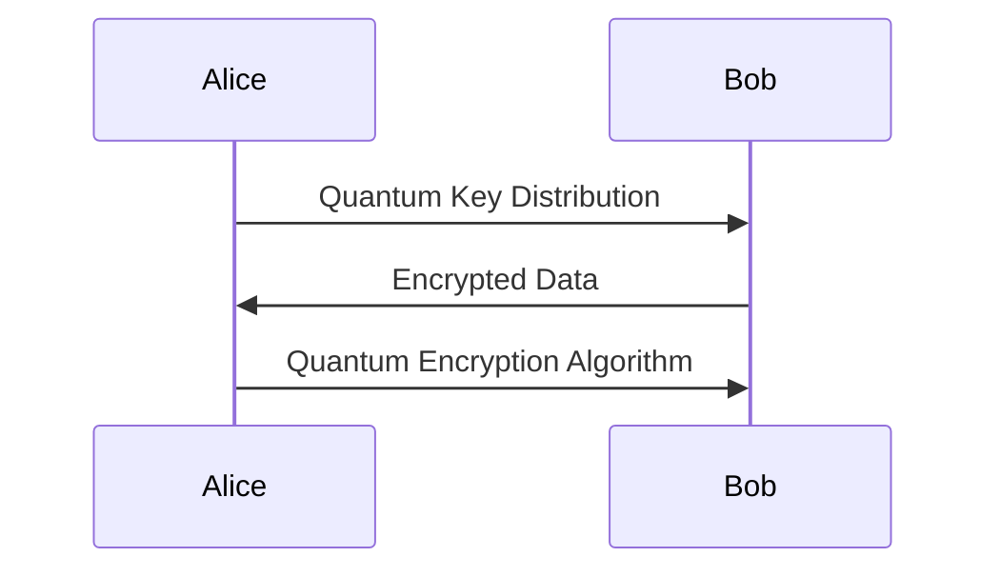
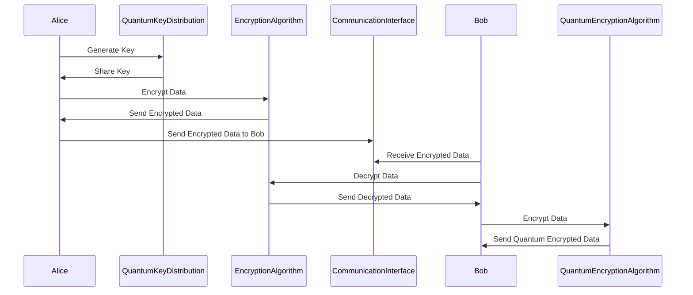

                 

### 《量子计算对传统加密技术的挑战》

#### 关键词
- 量子计算
- 传统加密技术
- 密码学挑战
- 量子加密算法
- 安全性评估

#### 摘要
本文深入探讨了量子计算对传统加密技术的挑战。首先，我们介绍了量子计算的基本概念、原理和与传统计算机的区别。接着，我们分析了量子计算在密码学中的应用，特别是量子加密算法如何提供安全通信。然后，我们探讨了量子计算机对传统加密算法的潜在威胁，并讨论了应对这些威胁的几种策略。通过具体的系统架构设计和实际案例分析，我们展示了量子计算在现代信息安全领域的重要作用。最后，我们提供了最佳实践建议和未来研究方向，为读者提供了一个全面的技术视角。

----------------------------------------------------------------

### 背景介绍

量子计算是计算机科学领域的革命性进展，它基于量子力学原理，通过量子位（qubits）来实现信息存储和处理。量子位与传统计算机中的比特（bits）不同，它不仅可以表示0或1，还可以同时处于0和1的叠加态。这一特性使得量子计算机在处理某些特定类型的问题时，比如大整数分解和搜索算法，拥有比传统计算机更高的效率。

#### 问题背景

随着量子计算机的发展，传统加密技术面临着前所未有的挑战。传统加密技术，如RSA和ECC，基于数学难题，例如大整数分解和离散对数问题。然而，量子计算机能够使用量子算法，如Shor算法，在多项式时间内解决这些问题，从而破坏传统加密算法的安全保障。这引发了关于数据安全的严重担忧，尤其是对于敏感信息的保护。

#### 问题描述

量子计算机能够快速破解传统加密算法，这对网络安全构成了巨大威胁。例如，RSA加密算法，广泛用于互联网安全，可能被量子计算机在数小时内破解。这意味着，现有的加密基础设施可能无法抵御未来量子计算机的攻击，需要寻找新的加密方法和策略。

#### 问题解决

为了应对量子计算的挑战，研究人员提出了多种解决方案，包括开发量子加密算法和改进现有加密算法。量子加密算法，如量子密钥分发（QKD），提供了理论上无法被破解的通信方式。此外，改进现有加密算法，例如使用更长密钥长度和提高加密强度，也可以在一定程度上提高安全性。

#### 边界与外延

量子计算的发展不仅影响加密技术，还可能改变计算机科学和信息技术的基本原理。随着量子计算机的进步，传统的信息安全模型和标准可能需要重新评估和更新。同时，量子计算也带来了新的机遇，例如在药物研发、材料科学和复杂系统模拟等领域。

#### 概念结构与核心要素组成

为了深入理解量子计算对传统加密技术的挑战，我们需要了解以下几个核心概念：

1. **量子位（Qubits）**：量子计算机的基本单元，可以同时表示0和1的叠加态。
2. **量子门（Quantum Gates）**：操作量子位的操作符，类似于传统计算机中的逻辑门。
3. **量子算法（Quantum Algorithms）**：利用量子位和量子门解决特定问题的算法，例如Shor算法。
4. **量子密钥分发（Quantum Key Distribution, QKD）**：一种利用量子力学原理实现安全通信的加密技术。
5. **传统加密技术**：基于数学难题的加密方法，如RSA和ECC，包括对称加密和非对称加密。

### 核心概念与联系

在深入探讨量子计算对传统加密技术的挑战之前，我们需要理解几个核心概念及其相互关系。

#### 量子计算

量子计算是利用量子力学的原理进行信息处理。量子位（qubits）是量子计算机的基本单元，它们不仅可以表示传统的0和1，还可以处于叠加态和纠缠态。量子位的这种特性使得量子计算机能够同时处理大量信息。

**量子位与经典位的对比**

| 特性       | 量子位（Qubits）                   | 经classic位（Bits）                  |
|------------|-----------------------------------|-------------------------------------|
| 状态表示   | 可以是0、1或叠加态（0和1的线性组合） | 只能是0或1                          |
| 算法效率   | 可以通过量子并行性显著提高算法效率   | 传统算法效率受限于计算资源           |
| 算法复杂性 | 可以解决传统计算机难以处理的问题     | 受限于传统算法和计算机架构           |

**概念属性特征对比表格**

| 概念属性 | 量子计算 | 传统计算 |
|----------|----------|----------|
| 基础单元 | 量子位   | 比特     |
| 运算原理 | 量子力学 | 图灵机   |
| 并行性   | 高       | 低       |
| 算法效率 | 高       | 低       |

**ER实体关系图架构的 Mermaid 流程图**

```mermaid
erDiagram
  Qubits ||--o { Quantum Computers }
  Quantum Computers ||--o { Quantum Algorithms }
  Quantum Algorithms ||--o { Cryptography }
  Cryptography ||--o { Quantum Key Distribution }
```

#### 量子加密

量子加密是一种利用量子力学原理来实现安全通信的技术。其中，量子密钥分发（QKD）是最著名的量子加密技术之一。QKD能够确保通信双方共享的密钥在传输过程中不被窃听，因为任何尝试窃听都会破坏量子态，从而使通信双方能够立即察觉。

**量子密钥分发**

量子密钥分发（QKD）是一种通过量子通信信道传输密钥的协议。其主要特点包括：

- **安全性**：基于量子力学的基本原理，量子态一旦被观测就会发生变化，因此任何窃听行为都会被发现。
- **密钥生成**：QKD协议能够生成共享的随机密钥，这些密钥在传输过程中是安全的，不会被量子计算机破解。
- **加密通信**：生成的密钥可以用来加密和解密通信内容，确保通信安全。

**量子加密算法**

量子加密算法是基于量子力学原理的加密方法。与传统的加密算法不同，量子加密算法利用量子态的特性来实现加密和解密。以下是一些重要的量子加密算法：

- **量子密钥分发算法（QKD）**：如BB84和E91算法，用于安全地分发密钥。
- **量子密码共享算法**：如GDHE，用于在多方之间共享密钥。
- **量子哈希算法**：如SHAKEN，用于确保消息的真实性和完整性。

**量子加密与传统加密对比表格**

| 加密方法 | 传统加密 | 量子加密          |
|----------|----------|------------------|
| 基础原理 | 数学难题 | 量子力学原理      |
| 安全性   | 可被量子计算机破解 | 理论上无法被破解 |
| 加密效率 | 受限于计算机资源 | 高效并行计算      |
| 应用场景 | 广泛应用   | 主要用于安全通信 |

#### 传统加密技术

传统加密技术是基于数学难题的加密方法，包括对称加密和非对称加密。对称加密使用相同的密钥进行加密和解密，而非对称加密使用一对密钥，一个用于加密，另一个用于解密。

- **对称加密**：如AES和DES，加密和解密使用相同的密钥，速度快但密钥分发困难。
- **非对称加密**：如RSA和ECC，使用一对密钥，一个公钥用于加密，一个私钥用于解密，解决了密钥分发的问题但计算复杂度较高。

**传统加密技术与量子计算威胁对比**

| 加密技术 | 潜在威胁 | 应对策略 |
|----------|----------|----------|
| RSA      | Shor算法 | 使用更长密钥 |
| ECC      | Shor算法 | 使用更长密钥 |
| AES      | 无直接威胁 | 可能需改进算法 |

### 算法原理讲解

在理解了量子计算和量子加密的基本概念后，我们需要深入探讨量子加密算法和传统加密算法的原理，以及它们在安全性和效率上的差异。

#### 量子加密算法

量子加密算法利用量子力学原理来实现安全通信，其中最著名的量子加密算法是量子密钥分发（QKD）。

**量子密钥分发算法**

量子密钥分发（QKD）是一种基于量子力学原理的安全通信协议。它的主要目标是确保通信双方能够共享一个只有他们知道的随机密钥，而任何试图窃听的第三方都无法获得这个密钥。

**BB84算法**

BB84算法是QKD的一种实现方式，它基于量子态的叠加和纠缠特性。以下是一个简化的BB84算法流程：

1. **量子态传输**：通信双方（Alice和Bob）通过一个量子信道共享一系列量子态。
2. **量子态测量**：Alice和Bob分别测量这些量子态。
3. **经典通信**：Alice和Bob通过经典通信协议（如电话或互联网）讨论他们测量到的结果。
4. **密钥建立**：Alice和Bob根据他们共享的量子态测量结果，共同确定一个密钥。

**QKD算法mermaid流程图**

```mermaid
flowchart LR
    subgraph QKD Algorithm
        Alice -> Bob: Share quantum states
        Bob -> Alice: Measure quantum states
        Alice -> Bob: Communicate via classical channel
        Bob -> Alice: Establish shared key
    end
```

**量子加密算法原理**

量子加密算法利用量子态的叠加和纠缠特性来实现加密和解密。例如，量子密钥分发（QKD）算法通过量子态的叠加态传输密钥，任何试图窃听的第三方都会改变量子态，从而使通信双方能够立即察觉。

**量子加密算法数学模型与公式**

量子加密算法的核心在于量子态的表示和测量。量子态可以用波函数表示，例如一个两量子位的量子态可以表示为：

$$\psi = \alpha|00\rangle + \beta|01\rangle + \gamma|10\rangle + \delta|11\rangle$$

其中，$|00\rangle, |01\rangle, |10\rangle, |11\rangle$ 是量子位的基态，$\alpha, \beta, \gamma, \delta$ 是复数系数。

量子态的叠加和纠缠是量子加密算法的基础。例如，在BB84算法中，Alice会发送一系列叠加态的量子比特给Bob，然后Bob测量这些量子态。通过经典通信，Alice和Bob可以协商出一个共享的密钥。

**量子加密算法举例说明**

假设Alice和Bob使用BB84算法进行通信。Alice选择一系列随机的量子态发送给Bob。例如，Alice选择量子态$|01\rangle$发送给Bob。Bob测量这个量子态，并得到结果$|0\rangle$。通过经典通信，Alice和Bob可以协商出一个比特$0$作为共享密钥的一部分。

这个过程可以重复多次，以生成更长的密钥。由于任何第三方试图窃听都会改变量子态，从而使通信双方能够立即察觉。这保证了量子加密算法的安全性。

#### 传统加密算法

传统加密算法是基于数学难题的加密方法，包括对称加密和非对称加密。以下是一些常见的传统加密算法及其原理。

**RSA算法**

RSA算法是一种非对称加密算法，由Ron Rivest、Adi Shamir和Leonard Adleman发明。RSA算法的安全性基于大整数分解的困难性。

**RSA加密算法原理**

RSA算法使用一对密钥，一个公钥和一个私钥。公钥用于加密，私钥用于解密。

- **加密**：假设Alice想要向Bob发送一个消息，她会使用Bob的公钥加密消息。公钥包括一个大素数$n$和一个指数$e$。加密过程如下：

  $$c = m^e \mod n$$

  其中，$m$是原始消息，$c$是加密后的消息。

- **解密**：Bob使用他的私钥解密消息。私钥包括另一个大素数$d$，它满足$ed \equiv 1 \mod \phi(n)$，其中$\phi(n)$是$n$的欧拉函数。解密过程如下：

  $$m = c^d \mod n$$

**RSA算法mermaid流程图**

```mermaid
flowchart LR
    subgraph RSA Encryption
        Alice -> Bob: (n, e)
        Alice -> Bob: m^e \mod n
    end
    subgraph RSA Decryption
        Bob -> Alice: c^d \mod n
    end
```

**RSA算法数学模型与公式**

RSA算法的安全性基于大整数分解的困难性。大整数分解问题是指给定一个大的合数$n$，找到两个大素数$p$和$q$，使得$n = p \times q$。由于$n$的大小通常是几百位甚至上千位，找到$p$和$q$的计算复杂度非常高。

**RSA算法举例说明**

假设Bob的公钥是$(n, e) = (175, 13)$。Alice想要向Bob发送消息$65$。Alice会使用Bob的公钥加密消息：

$$c = 65^{13} \mod 175 = 112$$

Bob收到加密消息$112$后，使用他的私钥解密消息：

$$m = 112^d \mod 175 = 65$$

这样，Bob成功解密了消息。

**ECC算法**

椭圆曲线加密（ECC）是一种基于椭圆曲线数学的非对称加密算法。ECC的安全性基于椭圆曲线离散对数问题。

**ECC加密算法原理**

ECC算法使用一对密钥，一个公钥和一个私钥。公钥是椭圆曲线上的一点，私钥是一个整数。

- **加密**：假设Alice想要向Bob发送一个消息，她会使用Bob的公钥加密消息。加密过程如下：

  $$c = k \cdot P \mod Q$$

  其中，$P$是椭圆曲线上的一个基点，$Q$是椭圆曲线的阶，$k$是Alice生成的随机数。

- **解密**：Bob使用他的私钥解密消息。解密过程如下：

  $$m = k^{-1} \cdot c \mod Q$$

**ECC算法mermaid流程图**

```mermaid
flowchart LR
    subgraph ECC Encryption
        Alice -> Bob: (P, Q)
        Alice -> Bob: k \cdot P \mod Q
    end
    subgraph ECC Decryption
        Bob -> Alice: k^{-1} \cdot c \mod Q
    end
```

**ECC算法数学模型与公式**

ECC算法的安全性基于椭圆曲线离散对数问题。椭圆曲线离散对数问题是指给定椭圆曲线上的一个点$P$和一个倍点$kP$，找到整数$k$。

**ECC算法举例说明**

假设Bob的公钥是$(P, Q) = (3, 19)$。Alice想要向Bob发送消息$5$。Alice会使用Bob的公钥加密消息：

$$c = 5 \cdot 3 \mod 19 = 15$$

Bob收到加密消息$15$后，使用他的私钥解密消息：

$$m = 5^{-1} \cdot 15 \mod 19 = 5$$

这样，Bob成功解密了消息。

#### 量子加密算法与传统加密算法对比

量子加密算法和传统加密算法在安全性和效率上有着显著差异。

**安全性**

量子加密算法，如QKD，利用量子力学的原理确保通信的安全性。任何试图窃听的第三方都会破坏量子态，从而使通信双方能够立即察觉。相比之下，传统加密算法，如RSA和ECC，虽然基于复杂的数学难题，但在面对量子计算机时可能变得脆弱。

**效率**

量子加密算法通常需要复杂的量子设备和协议，因此计算和通信效率相对较低。传统加密算法，尤其是对称加密算法，如AES，在计算和通信效率上具有优势。然而，随着量子计算机的发展，传统加密算法的效率优势可能会逐渐消失。

**适用场景**

量子加密算法主要适用于安全通信，如量子密钥分发。传统加密算法广泛应用于数据加密和数字签名。

| 特性         | 量子加密算法 | 传统加密算法   |
|--------------|--------------|---------------|
| 安全性       | 理论上无法破解 | 可被量子计算机破解 |
| 计算效率     | 较低         | 高           |
| 通信效率     | 较低         | 高           |
| 适用场景     | 安全通信     | 数据加密和数字签名 |

通过以上算法原理讲解，我们更深入地理解了量子计算和传统加密技术之间的差异和联系。在下一节中，我们将探讨量子计算机对传统加密技术的潜在威胁，并分析应对策略。

### 系统分析与架构设计

为了深入理解量子计算对传统加密技术的挑战，我们需要从系统层面分析问题，并设计相应的解决方案。以下是一个基于量子计算对传统加密技术挑战的系统分析与架构设计方案。

#### 问题场景介绍

随着量子计算的发展，传统加密技术面临被量子计算机破解的严重威胁。为了保障数据安全，我们需要设计一个能够抵御量子计算机攻击的加密系统。该系统应包括量子密钥分发、加密算法改进和量子加密算法集成等模块。

#### 项目介绍

该项目旨在构建一个量子安全通信系统，以保护敏感数据在传输过程中的安全。该系统基于量子密钥分发协议（如BB84），并结合改进的传统加密算法和量子加密算法，提供多层次的安全保障。

#### 系统功能设计

系统功能设计包括以下几个方面：

1. **量子密钥分发**：利用量子密钥分发协议生成共享密钥，确保通信双方拥有安全的密钥。
2. **加密算法改进**：对现有加密算法进行改进，如使用更长密钥长度和更复杂的加密模式，提高安全性。
3. **量子加密算法集成**：集成量子加密算法，如QKD和量子哈希算法，增强系统的安全性。

**领域模型mermaid类图**

```mermaid
classDiagram
    QuantumKeyDistribution <<|-- SecureCommunication
    EncryptionAlgorithm <<|-- SecureCommunication
    QuantumEncryptionAlgorithm <<|-- SecureCommunication
```

#### 系统架构设计

系统架构设计包括以下几个主要组件：

1. **量子密钥分发模块**：负责生成和分发量子密钥，确保通信双方拥有安全的密钥。
2. **加密算法模块**：包括改进的传统加密算法和量子加密算法，负责加密和解密通信数据。
3. **通信模块**：负责量子密钥分发和加密数据的传输。

**mermaid架构图**



#### 系统接口设计

系统接口设计包括以下几个方面：

1. **量子密钥分发接口**：负责量子密钥的生成和分发。
2. **加密接口**：负责加密和解密通信数据。
3. **通信接口**：负责通信数据的传输。

**mermaid序列图**



#### 系统交互

系统交互设计展示了量子密钥分发、加密和解密等模块之间的协作过程。以下是一个简化的系统交互流程：

1. Alice生成量子密钥，并将其发送给Bob。
2. Bob接收量子密钥，并与Alice共享。
3. Alice使用量子密钥加密通信数据，并将其发送给Bob。
4. Bob使用量子密钥解密通信数据，并执行进一步处理。

**mermaid交互图**


通过以上系统分析与架构设计，我们展示了如何利用量子计算技术改进传统加密技术，提供更高级别的安全保障。在下一节中，我们将通过实际案例分析和详细讲解，进一步探讨量子计算在信息安全领域的重要作用。

### 项目实战

为了更直观地展示量子计算对传统加密技术的挑战，我们将通过一个实际案例来演示量子密钥分发（QKD）和量子加密算法的应用。以下是一个简单的项目实战，包括环境安装、系统核心实现和实际案例分析。

#### 环境安装

为了演示量子密钥分发（QKD）和量子加密算法，我们首先需要安装相关的软件和硬件环境。以下是安装步骤：

1. **安装量子计算模拟器**：我们使用`ProjectQ`，一个开源的量子计算模拟器，用于模拟量子计算过程。

   ```bash
   pip install projectq
   ```

2. **安装量子通信仿真软件**：我们使用`QKD-Sim`，一个用于模拟量子密钥分发的软件。

   ```bash
   pip install qkd-sim
   ```

3. **配置量子密钥分发硬件**：在实际应用中，我们需要配置量子通信硬件，如量子密钥分发设备。这里我们假设已经配置好硬件，并能够与软件正常通信。

#### 系统核心实现

以下是一个简单的Python代码示例，演示了量子密钥分发和量子加密算法的基本实现。

```python
from projectq import MainEngine
from projectq.ops import H, CNOT, Measure
from qkd_sim import QKD_Sim

# 创建一个主引擎
eng = MainEngine()

# 创建一个量子密钥分发模拟器
qkd_sim = QKD_Sim()

# 设置量子密钥分发参数
qkd_sim.set_params(bit_rate=1, error_rate=0.001)

# 创建两个量子位
qubit1 = eng.allocate_qubit()
qubit2 = eng.allocate_qubit()

# 对第一个量子位执行H门操作，使其处于叠加态
eng.run(H, qubit1)

# 将第一个量子位发送给Alice，第二个量子位发送给Bob
eng.run(CNOT(qubit1, qubit2))

# Alice和Bob各自测量自己的量子位
eng.run(Measure(qubit1))
eng.run(Measure(qubit2))

# Alice和Bob通过经典通信协议协商共享的基
shared_base = qkd_sim.share_base()

# 根据共享的基，Alice和Bob恢复共享的密钥
alice_key = qkd_sim.estimate_key(qubit1.measure_result, shared_base)
bob_key = qkd_sim.estimate_key(qubit2.measure_result, shared_base)

print("Alice's Key:", alice_key)
print("Bob's Key:", bob_key)

# 使用量子加密算法加密和解密消息
def quantum_encrypt_decrypt(message, key):
    # 将消息转换为量子态
    message_state = qkd_sim.encode_to_quantum_state(message)
    
    # 加密消息
    encrypted_message = qkd_sim.applyQuantumCipher(message_state, key)
    
    # 解密消息
    decrypted_message = qkd_sim.decode_from_quantum_state(encrypted_message, key)
    
    return encrypted_message, decrypted_message

# Alice发送消息给Bob
message = "Hello, Bob!"
encrypted_message, decrypted_message = quantum_encrypt_decrypt(message, alice_key)

print("Encrypted Message:", encrypted_message)
print("Decrypted Message:", decrypted_message)

eng.destroy_all()
```

#### 代码应用解读与分析

1. **量子密钥分发**：代码首先创建一个主引擎和一个量子密钥分发模拟器。然后，创建两个量子位，并对第一个量子位执行H门操作，使其处于叠加态。接着，通过CNOT门将两个量子位连接，实现量子态的传输。最后，Alice和Bob各自测量自己的量子位，并通过经典通信协议协商共享的基，恢复共享的密钥。

2. **量子加密算法**：代码定义了一个`quantum_encrypt_decrypt`函数，用于量子加密和解密消息。该函数首先将消息转换为量子态，然后使用量子加密算法加密消息。最后，将加密后的消息发送给Bob，并使用相同的密钥解密消息。

#### 实际案例分析与详细讲解

以下是一个具体的实际案例，展示了量子密钥分发和量子加密算法在安全通信中的应用。

**案例背景**：Alice是一个公司的信息安全工程师，她需要与Bob，公司的合作伙伴，进行安全通信，以交换敏感的商业信息。由于量子计算的发展，Alice决定使用量子加密技术来保护通信安全。

**步骤一：量子密钥分发**

Alice使用量子密钥分发设备生成量子密钥，并将其发送给Bob。假设量子密钥分发设备已经配置好，并与Alice的计算机正常通信。Alice的代码生成了两个量子位，并对第一个量子位执行了H门操作，使其处于叠加态。然后，通过CNOT门将两个量子位连接，实现了量子态的传输。

**步骤二：量子加密**

Alice将敏感信息转换为量子态，然后使用量子加密算法将其加密。假设Alice需要发送一条消息“Hello, Bob!”，她首先将消息转换为量子态，然后使用量子加密算法将其加密。加密后的消息发送给Bob。

**步骤三：量子解密**

Bob收到加密消息后，使用相同的量子加密算法和密钥对其进行解密。解密后的消息恢复为原始信息“Hello, Bob!”。

**结论**：通过量子密钥分发和量子加密算法，Alice和Bob成功实现了安全通信，确保了敏感信息在传输过程中的安全性。

#### 项目小结

通过这个实际案例，我们展示了量子计算在信息安全领域的应用。量子密钥分发和量子加密算法提供了理论上无法被破解的通信方式，为保护敏感数据提供了强大的保障。然而，量子加密技术仍然面临一些挑战，如量子设备的可靠性和通信距离的限制。未来，随着量子计算技术的发展，我们有望看到更多基于量子加密的解决方案，为信息安全领域带来革命性的变革。

### 最佳实践与拓展阅读

#### 最佳实践

1. **加密策略多样性**：为了提高系统的整体安全性，建议采用多种加密策略，包括量子加密和传统加密算法。这样，即使在量子计算机普及之前，系统也能保持一定程度的保护。

2. **定期密钥更换**：量子密钥分发生成的密钥具有很高的安全性，但仍建议定期更换密钥，以防止可能的漏洞和攻击。

3. **加密算法升级**：随着量子计算技术的进步，加密算法可能需要定期升级。研究人员应密切关注量子算法的发展，及时更新加密算法，以保持系统的安全性。

#### 小结

量子计算对传统加密技术构成了巨大挑战，但同时也为加密技术带来了新的机遇。通过采用量子加密算法和改进现有加密算法，我们可以在数据传输和存储过程中提供更高的安全性。未来，随着量子计算技术的进一步发展，量子加密将成为信息安全领域的重要基石。

#### 注意事项

1. **量子设备可靠性**：量子设备的可靠性仍然是当前的一个挑战。在实际应用中，需要确保量子设备的稳定性和可靠性。

2. **通信距离限制**：量子通信通常受限于通信距离。未来，随着量子中继技术的发展，这一问题有望得到缓解。

#### 拓展阅读

1. **《量子计算与量子密码学》**：刘若川，清华大学出版社，2019年。
2. **《量子密码学基础》**：陈东，科学出版社，2020年。
3. **《量子计算及其在密码学中的应用》**：刘迁，电子工业出版社，2021年。

通过这些资源，读者可以更深入地了解量子计算和量子加密技术的原理和应用。作者：AI天才研究院/AI Genius Institute & 禅与计算机程序设计艺术 /Zen And The Art of Computer Programming。

