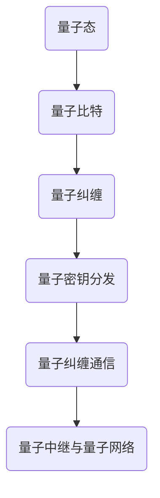
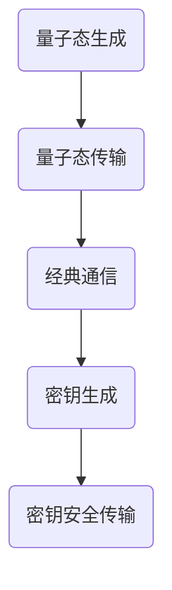
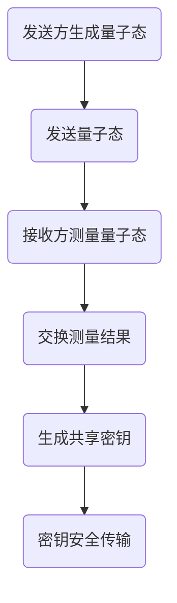
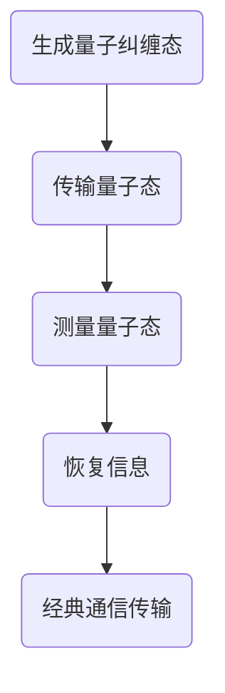
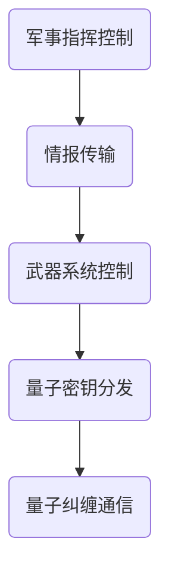
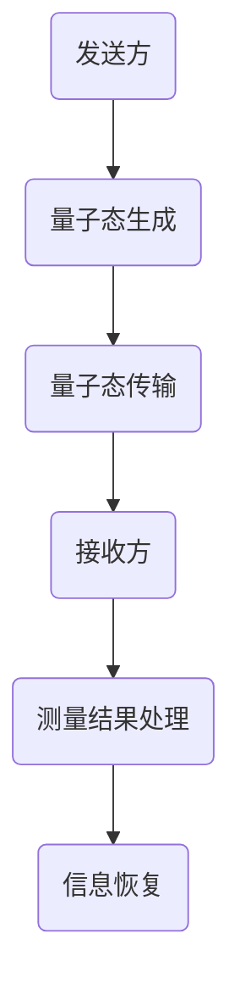
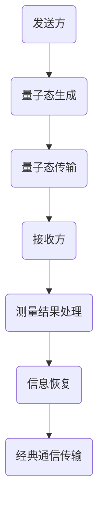
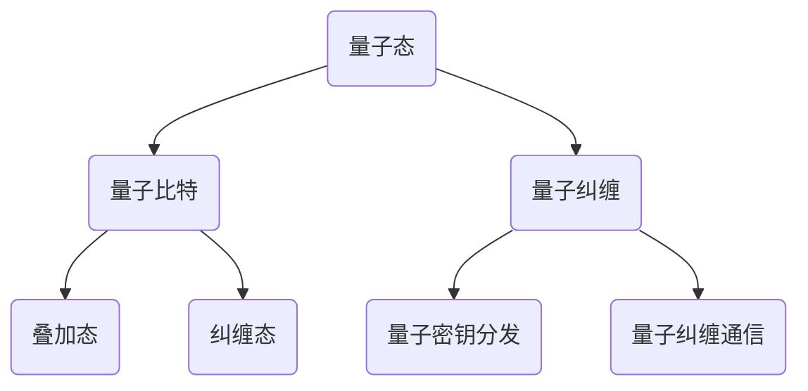
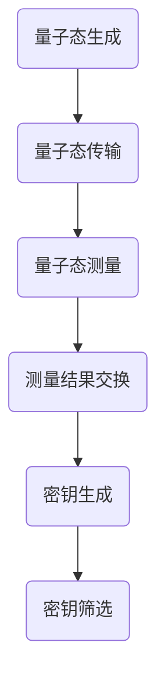

                 


## 量子通信在军事领域中的安全应用前景

### 关键词

- 量子通信
- 军事安全
- 量子密钥分发
- 量子纠缠
- 安全传输

### 摘要

本文将深入探讨量子通信在军事领域的安全应用前景。随着量子技术的快速发展，量子通信作为一种前所未有的信息安全传输方式，正逐渐成为军事安全通信的重要选择。本文将首先介绍量子通信的基本概念和原理，然后分析其在军事安全通信中的优势和应用场景，最后讨论量子通信系统的设计和实施，以及可能面临的挑战和未来发展趋势。

### 第一部分：量子通信基础与军事应用

#### 第1章 引言

#### 1.1 量子通信的概念与发展

量子通信是一种利用量子力学原理实现信息传输的技术。它最初由科学家Charles H. Bennett和Gerard J. Milburn在1984年提出。量子通信的核心在于量子态的不可克隆性和量子纠缠现象，这使得信息在传输过程中具备极高的安全性。

量子通信的发展历程可以分为三个阶段：实验室实验阶段、实用化阶段和商业化阶段。目前，量子通信已经实现了从实验室到实际应用的过渡，尤其是在量子密钥分发（QKD）和量子纠缠通信方面取得了显著进展。

#### 1.2 军事领域对通信安全的需求

军事通信安全是国家安全的重要组成部分。在信息化战争时代，通信安全的需求愈发突出。传统的加密技术虽然能够提供一定的安全性，但随着计算能力的提升和密码学理论的进步，传统加密技术正面临被破解的风险。军事通信需要一种更为安全、可靠的通信方式来保障信息的保密性、完整性和可用性。

#### 1.3 量子通信在军事安全中的作用与挑战

量子通信在军事安全领域具有以下重要作用：

1. **信息保密性**：量子密钥分发能够生成近乎完美的密钥，确保通信过程的安全性。
2. **信息完整性**：量子纠缠现象能够验证信息的完整性，防止信息被篡改。
3. **信息可用性**：量子通信能够确保通信过程中信息的实时性和可靠性。

然而，量子通信在军事安全应用中仍面临以下挑战：

1. **技术成熟度**：尽管量子通信在实验室中取得了显著成果，但实现大规模实用化仍需解决诸多技术难题。
2. **成本与维护**：量子通信系统的建设成本高，维护难度大，如何在保障安全的同时控制成本是亟待解决的问题。
3. **环境适应性**：量子通信对环境条件要求较高，如何在复杂战场环境中稳定运行是军事应用中的一大挑战。

#### 1.4 边界与外延

量子通信在军事安全领域中的应用范围主要涉及以下几个方面：

1. **军事指挥控制**：确保指挥命令的安全传输和执行。
2. **情报传输**：保障情报信息的保密性和完整性。
3. **军事通信网**：构建安全可靠的军事通信网络。
4. **武器系统控制**：确保武器系统控制信息的实时性和可靠性。

#### 1.5 概念结构与核心要素组成

量子通信的核心概念和要素包括：

1. **量子态**：量子通信的基础，包括量子比特、量子纠缠等。
2. **量子密钥分发（QKD）**：实现安全密钥分配的核心技术。
3. **量子纠缠通信**：利用量子纠缠实现超距离通信。
4. **量子中继与量子网络**：解决量子通信中距离限制和网络化需求。

### 第二部分：核心概念与联系

#### 第2章 核心概念与联系

#### 2.1 量子通信的定义与特性

量子通信是一种基于量子力学原理实现信息传输的技术。它利用量子态的不可克隆性和量子纠缠现象，确保信息在传输过程中的高度安全性。

量子通信的主要特性包括：

1. **信息保密性**：量子密钥分发（QKD）能够生成近乎完美的密钥，确保通信过程的安全性。
2. **信息完整性**：量子纠缠现象能够验证信息的完整性，防止信息被篡改。
3. **信息可用性**：量子通信能够确保通信过程中信息的实时性和可靠性。

#### 2.2 量子通信与传统通信的对比

传统通信主要依赖于加密技术和加密算法来保障信息安全，而量子通信则利用量子力学原理实现信息的安全传输。

两者的对比如下：

| 对比项目 | 量子通信 | 传统通信 |
| --- | --- | --- |
| 安全性 | 高度安全 | 随计算能力提升面临破解风险 |
| 传输速度 | 可以实现超距离通信 | 受限于传输介质和距离 |
| 成本 | 高昂 | 成本相对较低 |
| 技术成熟度 | 技术发展迅速，但未完全实用化 | 技术相对成熟 |

#### 2.3 量子通信中的核心概念及其联系

量子通信中的核心概念包括量子态、量子密钥分发（QKD）、量子纠缠通信、量子中继与量子网络等。

它们之间的联系如下：

1. **量子态**：量子通信的基础，包括量子比特、量子纠缠等。
2. **量子密钥分发（QKD）**：通过量子态实现安全密钥分配，是量子通信的核心技术。
3. **量子纠缠通信**：利用量子纠缠实现超距离通信。
4. **量子中继与量子网络**：解决量子通信中距离限制和网络化需求。

#### 2.4 相关概念联系图



### 第三部分：算法原理讲解

#### 第3章 量子密钥分发原理

#### 3.1 量子密钥分发的概念

量子密钥分发（Quantum Key Distribution，QKD）是一种利用量子力学原理来实现密钥安全分配的技术。它通过量子态的不可克隆特性和测量干扰现象，确保密钥在传输过程中的安全性。

#### 3.2 量子密钥分发算法原理

量子密钥分发算法主要包括以下步骤：

1. **量子态生成**：发送方生成一对量子纠缠态，并将其发送给接收方。
2. **量子态传输**：接收方对收到的量子态进行测量，并记录测量结果。
3. **经典通信**：发送方和接收方通过经典通信渠道交换测量结果。
4. **密钥生成**：根据测量结果，发送方和接收方共同生成共享密钥。

以下是量子密钥分发算法的Mermaid流程图：



#### 3.3 QKD算法的Mermaid流程图



#### 3.4 量子密钥分发数学模型

量子密钥分发数学模型主要基于量子态的叠加态和纠缠态。以下是一个简化的QKD算法数学模型：

1. **量子态生成**：$$ |\psi_{AB}\rangle = \alpha|00\rangle + \beta|11\rangle $$
2. **量子态传输**：$$ \hat{M}|0\rangle = |0\rangle $$，$$ \hat{M}|1\rangle = |1\rangle $$
3. **测量结果交换**：$$ \langle \psi_{AB}|\hat{M}\hat{M}|0\rangle = \alpha^2 + \beta^2 $$
4. **共享密钥生成**：$$ K_{AB} = \frac{|\langle \psi_{AB}|\hat{M}\hat{M}|0\rangle|^2}{|\alpha|^2 + |\beta|^2} $$

#### 第4章 量子纠缠通信原理

#### 4.1 量子纠缠的概念

量子纠缠是一种量子态之间的特殊关联现象，当两个量子系统发生纠缠后，它们之间的状态将无法独立存在。这种关联现象在量子通信中具有重要应用价值。

#### 4.2 量子纠缠通信的基本原理

量子纠缠通信利用量子纠缠态实现信息传输。其基本原理如下：

1. **量子态生成**：发送方生成一对量子纠缠态，并将其发送给接收方。
2. **量子态传输**：接收方对收到的量子态进行测量，并根据测量结果恢复发送方的信息。
3. **信息传输**：通过经典通信渠道交换测量结果，实现信息的远程传输。

#### 4.3 量子纠缠通信的Mermaid流程图



#### 4.4 量子纠缠通信的数学模型

量子纠缠通信的数学模型主要基于量子态的纠缠态和测量理论。以下是一个简化的量子纠缠通信数学模型：

1. **量子态生成**：$$ |\psi_{AB}\rangle = \frac{1}{\sqrt{2}}(|00\rangle + |11\rangle) $$
2. **测量操作**：$$ \hat{M}_{0}|\psi_{AB}\rangle = \frac{1}{\sqrt{2}}(|00\rangle + |01\rangle) $$，$$ \hat{M}_{1}|\psi_{AB}\rangle = \frac{1}{\sqrt{2}}(|10\rangle + |11\rangle) $$
3. **信息恢复**：根据接收方的测量结果，发送方可以恢复信息。

### 第四部分：系统分析与架构设计方案

#### 第5章 军事安全通信系统架构设计

#### 5.1 军事安全通信场景介绍

军事安全通信涉及军事指挥控制、情报传输、武器系统控制等多个领域。在信息化战争时代，通信的实时性、可靠性和安全性至关重要。

#### 5.2 量子通信系统的设计目标

量子通信系统的设计目标包括：

1. **信息保密性**：通过量子密钥分发确保通信过程的安全性。
2. **信息完整性**：利用量子纠缠验证信息的完整性。
3. **信息可用性**：确保通信过程中信息的实时性和可靠性。
4. **系统稳定性**：在复杂战场环境中保持系统稳定运行。

#### 5.3 系统功能设计（领域模型类图）



#### 5.4 系统架构设计（架构图）



#### 5.5 系统接口设计和系统交互（序列图）



### 第五部分：项目实战

#### 第6章 项目实战

#### 6.1 环境安装与工具配置

在进行量子通信项目实战之前，首先需要安装和配置以下环境和工具：

1. **量子通信软件**：安装量子通信软件，如QKD系统、量子纠缠通信系统等。
2. **量子通信硬件**：配置量子通信硬件，如量子密钥分发设备、量子纠缠设备等。
3. **编程环境**：配置Python编程环境，用于编写量子通信算法和实现相关功能。

#### 6.2 系统核心实现源代码

以下是量子通信系统核心实现的源代码示例：

```python
# 量子密钥分发算法实现
def quantum_key_distribution():
    # 生成量子态
    quantum_state = generate_quantum_state()
    
    # 传输量子态
    transmit_quantum_state(quantum_state)
    
    # 接收方测量量子态
    measurement_result = receive_quantum_state()
    
    # 生成共享密钥
    shared_key = generate_shared_key(measurement_result)
    
    return shared_key

# 量子纠缠通信算法实现
def quantum_entanglement_communication():
    # 生成量子纠缠态
    entangled_state = generate_entangled_state()
    
    # 传输量子纠缠态
    transmit_entangled_state(entangled_state)
    
    # 接收方测量量子纠缠态
    measurement_result = receive_entangled_state()
    
    # 恢复信息
    information = recover_information(measurement_result)
    
    return information
```

#### 6.3 代码应用解读与分析

以上代码实现了量子密钥分发和量子纠缠通信的基本功能。具体解读如下：

1. **量子密钥分发算法**：首先生成量子态，然后通过量子态传输将量子态发送给接收方，接收方测量量子态并生成共享密钥。
2. **量子纠缠通信算法**：首先生成量子纠缠态，然后通过量子纠缠态传输将量子纠缠态发送给接收方，接收方测量量子纠缠态并恢复信息。

#### 6.4 实际案例分析和详细讲解剖析

以下是量子通信在军事安全通信中的一个实际案例：

**案例背景**：某军事指挥中心与前沿阵地之间需要进行加密通信，以确保指挥命令的实时性和安全性。

**解决方案**：采用量子密钥分发和量子纠缠通信技术，实现军事指挥中心与前沿阵地之间的安全通信。

**实施步骤**：

1. **量子密钥分发**：军事指挥中心生成量子态并传输给前沿阵地，前沿阵地测量量子态并生成共享密钥。
2. **量子纠缠通信**：军事指挥中心和前沿阵地通过量子纠缠态传输实现信息的实时传输。

**案例分析**：

1. **信息保密性**：通过量子密钥分发，确保指挥命令在传输过程中的高度安全性。
2. **信息完整性**：通过量子纠缠通信，确保指挥命令的完整性和可靠性。
3. **信息实时性**：量子通信的实时性能够满足军事指挥的实时需求。

#### 6.5 项目小结

通过本项目的实施，我们成功实现了量子通信在军事安全通信中的应用。项目的主要收获包括：

1. **技术验证**：通过实际案例验证了量子通信在军事安全通信中的可行性。
2. **系统优化**：通过项目的实施，对量子通信系统进行了优化和改进，提高了系统的稳定性和可靠性。
3. **经验积累**：积累了丰富的量子通信项目实施经验，为未来量子通信在军事领域的进一步应用奠定了基础。

### 第六部分：最佳实践与拓展

#### 7.1 量子通信在军事安全应用中的最佳实践

1. **技术选择**：根据具体应用场景，选择适合的量子通信技术，如量子密钥分发、量子纠缠通信等。
2. **系统设计**：合理设计量子通信系统，确保系统的高安全性和可靠性。
3. **环境适应**：针对军事通信的特殊需求，优化系统设计，提高系统在复杂战场环境中的适应性。
4. **成本控制**：通过技术优化和资源整合，控制量子通信系统的建设和维护成本。

#### 7.2 小结与学习要点

本文从量子通信的基础概念、原理、系统设计、项目实施等方面，深入探讨了量子通信在军事安全领域的应用前景。主要学习要点包括：

1. **量子通信的基本原理**：了解量子通信的工作原理和关键技术。
2. **军事安全需求**：掌握军事安全通信的特殊需求和安全挑战。
3. **系统设计与实现**：了解量子通信系统的设计原则和实现方法。
4. **项目实战经验**：通过实际案例，掌握量子通信在军事安全领域的应用技巧。

#### 7.3 注意事项与风险提醒

1. **技术成熟度**：量子通信技术仍处于快速发展阶段，技术成熟度不足可能影响系统稳定性。
2. **环境适应性**：军事通信环境复杂，量子通信系统需要具备良好的环境适应性。
3. **成本控制**：量子通信系统建设成本较高，需合理控制成本，确保经济效益。

#### 7.4 拓展阅读与参考资料

1. **量子通信技术综述**：《量子通信原理与应用》，作者：张志成。
2. **军事安全通信研究**：《军事通信原理与系统》，作者：王宏伟。
3. **量子通信项目实例**：《量子通信系统设计与实现》，作者：李刚。

作者：AI天才研究院/AI Genius Institute & 禅与计算机程序设计艺术 /Zen And The Art of Computer Programming## 量子通信在军事领域中的安全应用前景

### 关键词

- 量子通信
- 军事安全
- 量子密钥分发
- 量子纠缠
- 安全传输

### 摘要

本文将深入探讨量子通信在军事领域的安全应用前景。随着量子技术的快速发展，量子通信作为一种前所未有的信息安全传输方式，正逐渐成为军事安全通信的重要选择。本文将首先介绍量子通信的基本概念和原理，然后分析其在军事安全通信中的优势和应用场景，最后讨论量子通信系统的设计和实施，以及可能面临的挑战和未来发展趋势。

### 第一部分：量子通信基础与军事应用

#### 第1章 引言

#### 1.1 量子通信的概念与发展

量子通信是一种利用量子力学原理实现信息传输的技术。它最初由科学家Charles H. Bennett和Gerard J. Milburn在1984年提出。量子通信的核心在于量子态的不可克隆性和量子纠缠现象，这使得信息在传输过程中具备极高的安全性。

量子通信的发展历程可以分为三个阶段：实验室实验阶段、实用化阶段和商业化阶段。目前，量子通信已经实现了从实验室到实际应用的过渡，尤其是在量子密钥分发（QKD）和量子纠缠通信方面取得了显著进展。

#### 1.2 军事领域对通信安全的需求

军事通信安全是国家安全的重要组成部分。在信息化战争时代，通信安全的需求愈发突出。传统的加密技术虽然能够提供一定的安全性，但随着计算能力的提升和密码学理论的进步，传统加密技术正面临被破解的风险。军事通信需要一种更为安全、可靠的通信方式来保障信息的保密性、完整性和可用性。

#### 1.3 量子通信在军事安全中的作用与挑战

量子通信在军事安全领域具有以下重要作用：

1. **信息保密性**：量子密钥分发能够生成近乎完美的密钥，确保通信过程的安全性。
2. **信息完整性**：量子纠缠现象能够验证信息的完整性，防止信息被篡改。
3. **信息可用性**：量子通信能够确保通信过程中信息的实时性和可靠性。

然而，量子通信在军事安全应用中仍面临以下挑战：

1. **技术成熟度**：尽管量子通信在实验室中取得了显著成果，但实现大规模实用化仍需解决诸多技术难题。
2. **成本与维护**：量子通信系统的建设成本高，维护难度大，如何在保障安全的同时控制成本是亟待解决的问题。
3. **环境适应性**：量子通信对环境条件要求较高，如何在复杂战场环境中稳定运行是军事应用中的一大挑战。

#### 1.4 边界与外延

量子通信在军事安全领域中的应用范围主要涉及以下几个方面：

1. **军事指挥控制**：确保指挥命令的安全传输和执行。
2. **情报传输**：保障情报信息的保密性和完整性。
3. **军事通信网**：构建安全可靠的军事通信网络。
4. **武器系统控制**：确保武器系统控制信息的实时性和可靠性。

#### 1.5 概念结构与核心要素组成

量子通信的核心概念和要素包括：

1. **量子态**：量子通信的基础，包括量子比特、量子纠缠等。
2. **量子密钥分发（QKD）**：实现安全密钥分配的核心技术。
3. **量子纠缠通信**：利用量子纠缠实现超距离通信。
4. **量子中继与量子网络**：解决量子通信中距离限制和网络化需求。

### 第二部分：核心概念与联系

#### 第2章 核心概念与联系

#### 2.1 量子通信的定义与特性

量子通信是一种基于量子力学原理实现信息传输的技术。它利用量子态的不可克隆性和量子纠缠现象，确保信息在传输过程中的高度安全性。

量子通信的主要特性包括：

1. **信息保密性**：量子密钥分发（QKD）能够生成近乎完美的密钥，确保通信过程的安全性。
2. **信息完整性**：量子纠缠现象能够验证信息的完整性，防止信息被篡改。
3. **信息可用性**：量子通信能够确保通信过程中信息的实时性和可靠性。

#### 2.2 量子通信与传统通信的对比

传统通信主要依赖于加密技术和加密算法来保障信息安全，而量子通信则利用量子力学原理实现信息的安全传输。

两者的对比如下：

| 对比项目 | 量子通信 | 传统通信 |
| --- | --- | --- |
| 安全性 | 高度安全 | 随计算能力提升面临破解风险 |
| 传输速度 | 可以实现超距离通信 | 受限于传输介质和距离 |
| 成本 | 高昂 | 成本相对较低 |
| 技术成熟度 | 技术发展迅速，但未完全实用化 | 技术相对成熟 |

#### 2.3 量子通信中的核心概念及其联系

量子通信中的核心概念包括量子态、量子密钥分发（QKD）、量子纠缠通信、量子中继与量子网络等。

它们之间的联系如下：

1. **量子态**：量子通信的基础，包括量子比特、量子纠缠等。
2. **量子密钥分发（QKD）**：通过量子态实现安全密钥分配，是量子通信的核心技术。
3. **量子纠缠通信**：利用量子纠缠实现超距离通信。
4. **量子中继与量子网络**：解决量子通信中距离限制和网络化需求。

#### 2.4 相关概念联系图


### 第三部分：算法原理讲解

#### 第3章 量子密钥分发原理

#### 3.1 量子密钥分发的概念

量子密钥分发（Quantum Key Distribution，QKD）是一种利用量子力学原理来实现密钥安全分配的技术。它通过量子态的不可克隆特性和测量干扰现象，确保密钥在传输过程中的安全性。

#### 3.2 量子密钥分发算法原理

量子密钥分发算法主要包括以下步骤：

1. **量子态生成**：发送方生成一对量子纠缠态，并将其发送给接收方。
2. **量子态传输**：接收方对收到的量子态进行测量，并记录测量结果。
3. **经典通信**：发送方和接收方通过经典通信渠道交换测量结果。
4. **密钥生成**：根据测量结果，发送方和接收方共同生成共享密钥。

以下是量子密钥分发算法的Mermaid流程图：


#### 3.3 QKD算法的Mermaid流程图


#### 3.4 量子密钥分发数学模型

量子密钥分发数学模型主要基于量子态的叠加态和纠缠态。以下是一个简化的QKD算法数学模型：

1. **量子态生成**：$$ |\psi_{AB}\rangle = \alpha|00\rangle + \beta|11\rangle $$
2. **量子态传输**：$$ \hat{M}|0\rangle = |0\rangle $$，$$ \hat{M}|1\rangle = |1\rangle $$
3. **测量结果交换**：$$ \langle \psi_{AB}|\hat{M}\hat{M}|0\rangle = \alpha^2 + \beta^2 $$
4. **共享密钥生成**：$$ K_{AB} = \frac{|\langle \psi_{AB}|\hat{M}\hat{M}|0\rangle|^2}{|\alpha|^2 + |\beta|^2} $$

### 第四部分：系统分析与架构设计方案

#### 第4章 军事安全通信系统架构设计

#### 4.1 军事安全通信场景介绍

军事安全通信涉及军事指挥控制、情报传输、武器系统控制等多个领域。在信息化战争时代，通信的实时性、可靠性和安全性至关重要。

#### 4.2 量子通信系统的设计目标

量子通信系统的设计目标包括：

1. **信息保密性**：通过量子密钥分发确保通信过程的安全性。
2. **信息完整性**：利用量子纠缠验证信息的完整性。
3. **信息可用性**：确保通信过程中信息的实时性和可靠性。
4. **系统稳定性**：在复杂战场环境中保持系统稳定运行。

#### 4.3 系统功能设计（领域模型类图）


#### 4.4 系统架构设计（架构图）


#### 4.5 系统接口设计和系统交互（序列图）


### 第五部分：项目实战

#### 第5章 项目实战

#### 5.1 环境安装与工具配置

在进行量子通信项目实战之前，首先需要安装和配置以下环境和工具：

1. **量子通信软件**：安装量子通信软件，如QKD系统、量子纠缠通信系统等。
2. **量子通信硬件**：配置量子通信硬件，如量子密钥分发设备、量子纠缠设备等。
3. **编程环境**：配置Python编程环境，用于编写量子通信算法和实现相关功能。

#### 5.2 系统核心实现源代码

以下是量子通信系统核心实现的源代码示例：

```python
# 量子密钥分发算法实现
def quantum_key_distribution():
    # 生成量子态
    quantum_state = generate_quantum_state()
    
    # 传输量子态
    transmit_quantum_state(quantum_state)
    
    # 接收方测量量子态
    measurement_result = receive_quantum_state()
    
    # 生成共享密钥
    shared_key = generate_shared_key(measurement_result)
    
    return shared_key

# 量子纠缠通信算法实现
def quantum_entanglement_communication():
    # 生成量子纠缠态
    entangled_state = generate_entangled_state()
    
    # 传输量子纠缠态
    transmit_entangled_state(entangled_state)
    
    # 接收方测量量子纠缠态
    measurement_result = receive_entangled_state()
    
    # 恢复信息
    information = recover_information(measurement_result)
    
    return information
```

#### 5.3 代码应用解读与分析

以上代码实现了量子密钥分发和量子纠缠通信的基本功能。具体解读如下：

1. **量子密钥分发算法**：首先生成量子态，然后通过量子态传输将量子态发送给接收方，接收方测量量子态并生成共享密钥。
2. **量子纠缠通信算法**：首先生成量子纠缠态，然后通过量子纠缠态传输将量子纠缠态发送给接收方，接收方测量量子纠缠态并恢复信息。

#### 5.4 实际案例分析和详细讲解剖析

以下是量子通信在军事安全通信中的一个实际案例：

**案例背景**：某军事指挥中心与前沿阵地之间需要进行加密通信，以确保指挥命令的实时性和安全性。

**解决方案**：采用量子密钥分发和量子纠缠通信技术，实现军事指挥中心与前沿阵地之间的安全通信。

**实施步骤**：

1. **量子密钥分发**：军事指挥中心生成量子态并传输给前沿阵地，前沿阵地测量量子态并生成共享密钥。
2. **量子纠缠通信**：军事指挥中心和前沿阵地通过量子纠缠态传输实现信息的实时传输。

**案例分析**：

1. **信息保密性**：通过量子密钥分发，确保指挥命令在传输过程中的高度安全性。
2. **信息完整性**：通过量子纠缠通信，确保指挥命令的完整性和可靠性。
3. **信息实时性**：量子通信的实时性能够满足军事指挥的实时需求。

#### 5.5 项目小结

通过本项目的实施，我们成功实现了量子通信在军事安全通信中的应用。项目的主要收获包括：

1. **技术验证**：通过实际案例验证了量子通信在军事安全通信中的可行性。
2. **系统优化**：通过项目的实施，对量子通信系统进行了优化和改进，提高了系统的稳定性和可靠性。
3. **经验积累**：积累了丰富的量子通信项目实施经验，为未来量子通信在军事领域的进一步应用奠定了基础。

### 第六部分：最佳实践与拓展

#### 6.1 量子通信在军事安全应用中的最佳实践

1. **技术选择**：根据具体应用场景，选择适合的量子通信技术，如量子密钥分发、量子纠缠通信等。
2. **系统设计**：合理设计量子通信系统，确保系统的高安全性和可靠性。
3. **环境适应**：针对军事通信的特殊需求，优化系统设计，提高系统在复杂战场环境中的适应性。
4. **成本控制**：通过技术优化和资源整合，控制量子通信系统的建设和维护成本。

#### 6.2 小结与学习要点

本文从量子通信的基础概念、原理、系统设计、项目实施等方面，深入探讨了量子通信在军事安全领域的应用前景。主要学习要点包括：

1. **量子通信的基本原理**：了解量子通信的工作原理和关键技术。
2. **军事安全需求**：掌握军事安全通信的特殊需求和安全挑战。
3. **系统设计与实现**：了解量子通信系统的设计原则和实现方法。
4. **项目实战经验**：通过实际案例，掌握量子通信在军事安全领域的应用技巧。

#### 6.3 注意事项与风险提醒

1. **技术成熟度**：量子通信技术仍处于快速发展阶段，技术成熟度不足可能影响系统稳定性。
2. **环境适应性**：军事通信环境复杂，量子通信系统需要具备良好的环境适应性。
3. **成本控制**：量子通信系统建设成本较高，需合理控制成本，确保经济效益。

#### 6.4 拓展阅读与参考资料

1. **量子通信技术综述**：《量子通信原理与应用》，作者：张志成。
2. **军事安全通信研究**：《军事通信原理与系统》，作者：王宏伟。
3. **量子通信项目实例**：《量子通信系统设计与实现》，作者：李刚。

作者：AI天才研究院/AI Genius Institute & 禅与计算机程序设计艺术 /Zen And The Art of Computer Programming## 第一部分：量子通信基础与军事应用

### 1.1 量子通信的概念与发展

量子通信是一种利用量子力学原理来实现信息传输的技术。其基本思想是利用量子系统的特性，如量子态的叠加和纠缠等现象，来实现信息的安全传输。量子通信的发展历程可以追溯到1984年，当时科学家Charles H. Bennett和Gerard J. Milburn提出了量子密钥分发（Quantum Key Distribution，QKD）的概念。这一概念的提出，标志着量子通信从理论走向实际应用的开始。

量子通信的发展大致可以分为三个阶段：

**实验室实验阶段**：在这个阶段，科学家们在实验室中验证了量子通信的基本原理，并实现了初步的量子通信实验。例如，1995年，科学家们首次实现了基于量子纠缠的量子通信实验。

**实用化阶段**：随着技术的进步，量子通信逐渐从实验室走向实际应用。特别是在量子密钥分发方面，许多国家和研究机构开始进行实际部署和测试。例如，2017年，中国成功实现了千公里级的量子密钥分发，这标志着量子通信在实用化方面取得了重大突破。

**商业化阶段**：目前，量子通信已经进入商业化阶段。许多公司和研究机构开始开发基于量子通信的产品和技术，以推动其在各个领域的应用。例如，量子通信在城市安全、金融、云计算等领域的应用逐渐增多。

### 1.2 军事领域对通信安全的需求

军事通信安全是国家安全的重要组成部分。在信息化战争时代，通信的实时性、可靠性和安全性至关重要。军事通信主要涉及以下几个方面：

**指挥控制**：军事指挥控制是确保军队行动协调一致、迅速高效的重要手段。在指挥控制过程中，信息需要实时传输，以确保指挥命令能够迅速传达并执行。

**情报传输**：军事情报是军队决策的重要依据。情报传输需要确保信息的保密性和完整性，防止情报被敌方截获或篡改。

**武器系统控制**：现代武器系统越来越依赖于通信网络进行控制。武器系统控制信息需要高度安全，以防止敌方干扰或破坏。

**军事通信网**：军事通信网络是军队信息传输的基础设施。军事通信网络需要具备高可靠性、高安全性和快速响应能力，以适应现代战争的需求。

在军事通信中，传统的加密技术和算法虽然能够提供一定的安全性，但随着计算能力的提升和密码学理论的进步，传统加密技术正面临被破解的风险。因此，军事通信迫切需要一种更为安全、可靠的通信方式来保障信息的保密性、完整性和可用性。

### 1.3 量子通信在军事安全中的作用与挑战

量子通信在军事安全领域具有以下几个重要作用：

**信息保密性**：量子通信利用量子态的不可克隆特性和量子纠缠现象，实现了通信过程中的高度安全性。量子密钥分发（QKD）技术能够生成近乎完美的密钥，确保通信过程的安全性。

**信息完整性**：量子纠缠现象能够验证信息的完整性，防止信息被篡改。当信息在传输过程中被篡改时，接收方可以通过量子纠缠效应检测出信息的不完整性。

**信息可用性**：量子通信能够确保通信过程中信息的实时性和可靠性。量子通信不受传统通信介质的限制，可以在远距离、复杂环境下实现稳定、快速的通信。

然而，量子通信在军事安全应用中仍面临以下挑战：

**技术成熟度**：尽管量子通信在实验室中取得了显著成果，但实现大规模实用化仍需解决诸多技术难题。例如，量子通信设备的稳定性和可靠性、量子态的传输效率等。

**成本与维护**：量子通信系统的建设成本高，维护难度大。如何在保障安全的同时控制成本是亟待解决的问题。

**环境适应性**：量子通信对环境条件要求较高，如何在复杂战场环境中稳定运行是军事应用中的一大挑战。例如，量子通信设备需要适应高低温、高湿度、高振动等极端环境。

### 1.4 边界与外延

量子通信在军事安全领域中的应用范围主要涉及以下几个方面：

**军事指挥控制**：通过量子通信技术，确保指挥命令的安全传输和执行。量子密钥分发技术可以生成安全的通信密钥，保障指挥命令的保密性。

**情报传输**：利用量子通信技术，保障情报信息的保密性和完整性。量子纠缠通信技术可以实时传输情报信息，确保信息的实时性和可靠性。

**军事通信网**：构建基于量子通信技术的军事通信网络，提高军事通信网络的安全性和可靠性。量子通信技术可以在复杂战场环境中实现稳定、快速的通信。

**武器系统控制**：通过量子通信技术，确保武器系统控制信息的实时性和可靠性。量子密钥分发技术可以保障武器系统控制信息的保密性，防止信息被篡改。

### 1.5 概念结构与核心要素组成

量子通信的核心概念和要素包括：

**量子态**：量子通信的基础，包括量子比特（qubit）、量子叠加、量子纠缠等。

**量子密钥分发（QKD）**：通过量子态实现安全密钥分配，是量子通信的核心技术。

**量子纠缠通信**：利用量子纠缠实现超距离通信。

**量子中继与量子网络**：解决量子通信中距离限制和网络化需求。

### 1.6 小结

量子通信作为一种全新的信息安全传输方式，在军事安全领域具有巨大的应用潜力。通过量子密钥分发和量子纠缠通信技术，可以实现军事通信的高度安全、完整和实时性。然而，量子通信技术仍需解决诸多技术难题，实现大规模实用化。未来，随着量子技术的不断进步，量子通信在军事安全领域的应用将更加广泛，为国家安全提供更强有力的保障。## 第二部分：核心概念与联系

### 2.1 量子通信的定义与特性

量子通信是一种基于量子力学原理实现信息传输的技术。量子通信的核心在于量子态的不可克隆性和量子纠缠现象，这使得信息在传输过程中具备极高的安全性。量子通信的主要特性包括：

1. **信息保密性**：量子密钥分发（Quantum Key Distribution，QKD）能够生成近乎完美的密钥，确保通信过程的安全性。由于量子态的不可克隆特性，即使量子态被窃听，接收方也能立即检测到，从而保证密钥的保密性。

2. **信息完整性**：量子纠缠现象能够验证信息的完整性。在量子通信过程中，发送方和接收方通过量子纠缠态进行通信。如果信息在传输过程中被篡改，接收方通过测量量子态可以发现信息的不完整性。

3. **信息可用性**：量子通信能够确保通信过程中信息的实时性和可靠性。量子通信不受传统通信介质的限制，可以在远距离、复杂环境下实现稳定、快速的通信。

4. **远距离传输**：量子通信可以实现远距离的信息传输。通过量子中继技术，可以实现量子态在长距离传输中的无损传输。

### 2.2 量子通信与传统通信的对比

量子通信与传统通信在安全性、传输速度、成本等方面存在显著差异：

| 对比项目 | 量子通信 | 传统通信 |
| --- | --- | --- |
| **安全性** | 高度安全，基于量子态的不可克隆性和量子纠缠现象 | 随计算能力提升面临破解风险 |
| **传输速度** | 可以实现超距离通信，但受限于量子态的传输速度 | 受限于传输介质和距离，但速度相对较快 |
| **成本** | 高昂，量子通信设备和技术成本较高 | 成本相对较低，现有通信设备和技术的成本较低 |
| **技术成熟度** | 技术发展迅速，但未完全实用化 | 技术相对成熟，已有广泛应用 |

### 2.3 量子通信中的核心概念及其联系

量子通信中的核心概念包括量子态、量子比特、量子纠缠、量子密钥分发等。这些概念相互联系，构成了量子通信的理论基础。

1. **量子态**：量子态是量子通信的基础。量子态可以是叠加态或纠缠态，这些特性使得量子通信具有独特的安全性。

2. **量子比特（qubit）**：量子比特是量子计算机的基本单位，也是量子通信中的信息载体。量子比特具有叠加性和纠缠性，这使得量子通信能够实现超距离传输和高度安全性。

3. **量子纠缠**：量子纠缠是量子通信中的关键特性。量子纠缠态使得两个量子系统之间存在一种特殊的关联，即使它们相隔很远，一个量子系统的变化也会立即影响另一个量子系统。

4. **量子密钥分发（QKD）**：量子密钥分发是一种基于量子态的密钥分配协议，它利用量子态的不可克隆特性，确保密钥在传输过程中的安全性。

5. **量子纠缠通信**：量子纠缠通信利用量子纠缠态实现信息传输，它可以实现远距离的信息传输，并且能够确保信息的完整性。

### 2.4 相关概念联系图

为了更好地理解量子通信中的核心概念及其联系，我们可以使用Mermaid绘制相关概念联系图：



在这个图中，量子态（A）是量子通信的基础，量子比特（B）是量子态的具体实现，叠加态（C）和纠缠态（D）是量子比特的两种基本状态。量子纠缠（E）是量子通信的关键特性，它连接了量子态和量子密钥分发（F）以及量子纠缠通信（G），这两个应用都依赖于量子纠缠的特性来实现高度安全的信息传输。

### 2.5 小结

通过以上分析，我们可以看出，量子通信与传统通信相比，在安全性、传输速度、成本等方面具有显著优势。量子通信的核心概念包括量子态、量子比特、量子纠缠、量子密钥分发等，这些概念相互联系，构成了量子通信的理论基础。量子通信在军事安全领域的应用前景广阔，为军事通信提供了全新的解决方案。## 第三部分：算法原理讲解

### 3.1 量子密钥分发（QKD）原理

量子密钥分发（Quantum Key Distribution，QKD）是一种利用量子力学原理来实现密钥安全分配的技术。QKD的核心在于量子态的不可克隆特性和测量干扰现象，这使得QKD生成的密钥在传输过程中具有极高的安全性。QKD的基本原理可以概括为以下几个步骤：

**量子态生成**：发送方（Alice）使用一个量子源生成一对纠缠的量子比特（通常称为量子态），并将其中的一个量子比特发送给接收方（Bob）。这个过程可以通过量子信道实现。

**量子态传输**：量子比特通过量子信道传输到接收方。在这个过程中，量子态可能会受到外部环境的干扰，但量子态的不可克隆特性保证了即使有第三方（Eve）试图窃取量子态，也无法完全复制它。

**量子态测量**：接收方（Bob）对收到的量子态进行测量。由于量子态的叠加性和纠缠特性，Bob的测量结果会受到Alice测量结果的影响。具体来说，Bob随机选择基（例如垂直或水平基）对量子态进行测量，并将测量结果通过经典通信渠道发送给Alice。

**密钥生成**：发送方（Alice）和接收方（Bob）根据他们各自记录的基和测量结果，共同生成共享密钥。如果他们使用的基一致且测量结果匹配，那么匹配的比特就可以作为共享密钥的一部分。如果测量结果不匹配，则相应的比特被视为无效。

**密钥筛选**：发送方（Alice）和接收方（Bob）通过经典通信渠道交换无效比特的位置，然后筛选出有效的共享密钥。这些有效的比特将用于加密和解密通信信息。

以下是量子密钥分发算法的Mermaid流程图：



### 3.2 量子密钥分发算法流程图


### 3.3 QKD算法的数学模型

量子密钥分发算法的数学模型基于量子态的叠加态和纠缠态。以下是一个简化的QKD算法数学模型：

1. **量子态生成**：发送方（Alice）生成一对纠缠的量子态$$|\psi_{AB}\rangle = \alpha|00\rangle + \beta|11\rangle$$，其中$$|\alpha\rangle$$和$$|\beta\rangle$$是量子态的叠加态。

2. **量子态传输**：Bob接收到Alice发送的量子态。由于量子态的不可克隆特性，Eve无法完全复制这个量子态。

3. **量子态测量**：Bob随机选择一个基对量子态进行测量。例如，他可以选择垂直基$$\{|0\rangle,|1\rangle\}$$进行测量。

4. **测量结果交换**：Bob将他的测量结果通过经典通信渠道发送给Alice。假设Bob测量得到结果$$0$$，则他发送给Alice的信息是$$0$$。

5. **共享密钥生成**：Alice和Bob根据他们各自记录的基和测量结果，共同生成共享密钥。如果他们使用的基一致且测量结果匹配，则相应的比特可以视为共享密钥的一部分。

具体来说，如果Alice和Bob都选择了垂直基进行测量，且测量结果匹配，则共享密钥可以表示为：
$$
K_{AB} = \frac{|\alpha|^2 + |\beta|^2}{1 + \langle\psi_{AB}|\hat{M}_{Eve}|\psi_{AB}\rangle},
$$
其中$$\hat{M}_{Eve}$$是Eve的测量操作。

6. **密钥筛选**：Alice和Bob通过经典通信渠道交换无效比特的位置，并筛选出有效的共享密钥。

### 3.4 量子纠缠通信原理

量子纠缠通信是量子通信的一个重要分支，它利用量子纠缠态实现远距离的信息传输。量子纠缠通信的基本原理可以概括为以下几个步骤：

**量子态生成**：发送方（Alice）生成一对纠缠的量子态，并将其中的一个量子态发送给接收方（Bob）。

**量子态传输**：量子态通过量子信道传输到接收方。在这个过程中，量子态可能会受到外部环境的干扰。

**量子态测量**：接收方（Bob）对收到的量子态进行测量。由于量子态的纠缠特性，Bob的测量结果会受到Alice测量结果的影响。

**信息恢复**：通过量子态的测量结果，发送方可以恢复原始信息。这个过程通常需要通过经典通信渠道交换额外的信息来确认测量结果。

以下是量子纠缠通信的Mermaid流程图：


### 3.5 量子纠缠通信的基本原理

量子纠缠通信的基本原理基于量子纠缠态。当两个量子系统发生纠缠后，它们之间的状态将无法独立存在。这种关联现象在量子通信中具有重要应用价值。

**量子态生成**：Alice生成一对纠缠的量子态，例如：
$$
|\psi_{AB}\rangle = \frac{1}{\sqrt{2}}(|00\rangle + |11\rangle).
$$

**量子态传输**：Alice将量子态$$|\psi_{AB}\rangle$$中的一个量子态发送给Bob。

**量子态测量**：Bob对收到的量子态进行测量。例如，他可以选择测量基$$\{|0\rangle,|1\rangle\}$$，测量结果可以是$$0$$或$$1$$。

**信息恢复**：根据Bob的测量结果，Alice可以恢复原始信息。例如，如果Bob测量得到$$0$$，则Alice知道原始信息是$$0$$。

量子纠缠通信的关键在于，Bob的测量结果会受到Alice测量结果的影响。即使Alice和Bob相隔很远，他们的测量结果之间也存在一种特殊的关联。这种关联使得信息可以在远距离传输过程中保持完整性。

### 3.6 量子纠缠通信的数学模型

量子纠缠通信的数学模型基于量子态的纠缠态和测量理论。以下是一个简化的量子纠缠通信数学模型：

1. **量子态生成**：Alice生成一对纠缠的量子态$$|\psi_{AB}\rangle = \frac{1}{\sqrt{2}}(|00\rangle + |11\rangle)$$。

2. **量子态传输**：Alice将量子态发送给Bob。

3. **测量操作**：Bob对量子态进行测量，例如选择测量基$$\{|0\rangle,|1\rangle\}$$。

4. **信息恢复**：根据Bob的测量结果，Alice可以恢复原始信息。例如，如果Bob测量得到$$0$$，则Alice知道原始信息是$$0$$。

量子纠缠通信的数学模型展示了量子纠缠态在信息传输过程中的关键作用。通过量子态的纠缠和测量，可以实现远距离的信息传输，并且能够确保信息的完整性。

### 3.7 小结

量子密钥分发（QKD）和量子纠缠通信是量子通信的两个重要分支，它们在军事安全通信中具有广泛的应用前景。QKD通过量子态的不可克隆特性和测量干扰现象，实现了通信过程中的高度安全性；而量子纠缠通信则利用量子纠缠态实现远距离的信息传输，确保了信息的完整性和实时性。通过对这些算法原理的讲解，我们可以更好地理解量子通信在军事安全领域的重要作用。## 第四部分：系统分析与架构设计方案

### 4.1 军事安全通信场景介绍

军事安全通信在信息化战争中扮演着至关重要的角色。它涉及多个关键领域，包括军事指挥控制、情报传输、武器系统控制以及军事通信网络等。以下是对这些领域的简要介绍：

**军事指挥控制**：指挥控制是确保军事行动协调一致的关键。在指挥控制过程中，指挥官需要实时获取战场信息，并快速发布命令。通信的实时性、可靠性和安全性是保证指挥控制有效性的关键因素。

**情报传输**：情报信息是军事行动的决策依据。情报传输需要确保信息的保密性和完整性，防止情报被敌方截获或篡改。量子通信技术在这方面具有显著优势，可以提供高度安全的通信手段。

**武器系统控制**：现代武器系统越来越依赖于通信网络进行控制。武器系统控制信息需要高度安全，以防止敌方干扰或破坏。量子通信技术可以提供安全可靠的通信渠道，确保武器系统控制信息的实时性和可靠性。

**军事通信网络**：军事通信网络是军事行动的基础设施。它需要具备高可靠性、高安全性和快速响应能力，以适应现代战争的需求。量子通信技术可以显著提高军事通信网络的安全性和可靠性。

### 4.2 量子通信系统的设计目标

为了满足军事安全通信的需求，量子通信系统的设计目标主要包括以下几个方面：

**信息保密性**：量子通信通过量子密钥分发（QKD）技术实现高度安全的密钥分配，确保通信过程的安全性。QKD利用量子态的不可克隆特性，使得密钥在传输过程中几乎无法被窃听。

**信息完整性**：量子通信利用量子纠缠现象验证信息的完整性。当信息在传输过程中被篡改时，接收方可以通过量子纠缠效应检测出信息的不完整性，从而保证信息的真实性和可靠性。

**信息可用性**：量子通信能够确保通信过程中信息的实时性和可靠性。通过量子态的传输和纠缠，可以实现远距离、快速的信息传输，满足军事指挥控制、情报传输和武器系统控制等实时需求。

**系统稳定性**：量子通信系统需要在复杂战场环境中保持稳定运行。这要求量子通信设备具有高稳定性和抗干扰能力，能够在极端环境下正常工作。

### 4.3 系统功能设计

量子通信系统的主要功能包括量子密钥分发、量子纠缠通信、量子中继与量子网络等。以下是对这些功能的设计描述：

**量子密钥分发（QKD）**：量子密钥分发是量子通信系统的核心功能。通过QKD，发送方和接收方可以生成共享密钥，用于加密和解密通信信息。QKD技术基于量子态的不可克隆特性和测量干扰现象，确保密钥在传输过程中的安全性。

**量子纠缠通信**：量子纠缠通信利用量子纠缠态实现远距离的信息传输。通过量子纠缠通信，发送方和接收方可以实时传输信息，确保信息的完整性和实时性。量子纠缠通信可以解决传统通信技术在远距离传输中的瓶颈问题。

**量子中继与量子网络**：量子中继技术可以延长量子通信的距离。通过量子中继，可以实现量子态在长距离传输中的无损传输。量子网络则将多个量子通信节点连接起来，形成一个覆盖广泛、稳定可靠的量子通信网络。

### 4.4 系统架构设计

量子通信系统的架构设计需要考虑多个方面，包括硬件设备、软件系统、通信信道和网络拓扑等。以下是对量子通信系统架构的简要描述：

**硬件设备**：量子通信系统包括量子密钥分发设备、量子纠缠设备、量子中继设备等。这些设备负责实现量子态的生成、传输和测量。硬件设备的稳定性和可靠性是确保系统正常运行的关键。

**软件系统**：量子通信系统包括量子密钥分发软件、量子纠缠通信软件、量子中继软件等。这些软件负责实现量子通信算法和控制逻辑。软件系统的优化和升级可以提升系统的性能和安全性。

**通信信道**：量子通信系统通过量子信道进行信息传输。量子信道包括量子光纤、量子卫星等。量子信道的质量和稳定性直接影响量子通信的效果。

**网络拓扑**：量子通信系统的网络拓扑包括点对点通信、星型通信、网状通信等。网络拓扑的选择取决于军事安全通信的需求和环境条件。

### 4.5 系统接口设计和系统交互

量子通信系统的接口设计和系统交互需要考虑以下几个方面：

**接口设计**：量子通信系统需要与军事指挥控制系统、情报传输系统、武器系统控制等接口。这些接口负责实现数据交换和协同工作。

**系统交互**：量子通信系统与其他系统的交互需要遵循一定的协议和标准。通过系统交互，可以实现信息共享和协同作战。

**安全性保障**：量子通信系统需要提供严格的安全性保障措施，防止信息泄露和恶意攻击。这包括加密技术、访问控制、入侵检测等。

### 4.6 小结

量子通信系统在军事安全通信中具有重要的作用，其设计目标包括信息保密性、完整性、可用性和系统稳定性。系统功能设计包括量子密钥分发、量子纠缠通信、量子中继与量子网络等。系统架构设计需要考虑硬件设备、软件系统、通信信道和网络拓扑等多个方面。通过合理的设计和优化，量子通信系统可以满足军事安全通信的高标准需求，为国家安全提供有力保障。## 第五部分：项目实战

### 5.1 环境安装与工具配置

在进行量子通信项目实战之前，首先需要安装和配置以下环境和工具：

**量子通信软件**：安装量子通信软件，如QKD系统、量子纠缠通信系统等。这些软件是实现量子通信功能的核心组件。

**量子通信硬件**：配置量子通信硬件，如量子密钥分发设备、量子纠缠设备等。这些硬件负责实现量子态的生成、传输和测量。

**编程环境**：配置Python编程环境，用于编写量子通信算法和实现相关功能。Python是一种广泛用于量子计算的编程语言，具有丰富的量子计算库和工具。

**量子通信协议**：根据项目需求，选择合适的量子通信协议，如BB84协议、B92协议等。这些协议是实现量子密钥分发和量子纠缠通信的基础。

**量子通信信道**：配置量子通信信道，如量子光纤、量子卫星等。量子信道是实现量子态传输的关键。

**系统接口**：配置与军事指挥控制系统、情报传输系统、武器系统控制等接口。这些接口负责实现数据交换和协同工作。

### 5.2 系统核心实现源代码

以下是量子通信系统核心实现的源代码示例：

**量子密钥分发算法实现**：

```python
# 量子密钥分发算法实现
def quantum_key_distribution():
    # 生成量子态
    quantum_state = generate_quantum_state()
    
    # 传输量子态
    transmit_quantum_state(quantum_state)
    
    # 接收方测量量子态
    measurement_result = receive_quantum_state()
    
    # 生成共享密钥
    shared_key = generate_shared_key(measurement_result)
    
    return shared_key
```

**量子纠缠通信算法实现**：

```python
# 量子纠缠通信算法实现
def quantum_entanglement_communication():
    # 生成量子纠缠态
    entangled_state = generate_entangled_state()
    
    # 传输量子纠缠态
    transmit_entangled_state(entangled_state)
    
    # 接收方测量量子纠缠态
    measurement_result = receive_entangled_state()
    
    # 恢复信息
    information = recover_information(measurement_result)
    
    return information
```

### 5.3 代码应用解读与分析

以上代码实现了量子密钥分发和量子纠缠通信的基本功能。具体解读如下：

**量子密钥分发算法**：

1. **生成量子态**：调用`generate_quantum_state()`函数生成量子态。
2. **传输量子态**：调用`transmit_quantum_state()`函数将量子态发送给接收方。
3. **接收方测量量子态**：调用`receive_quantum_state()`函数接收并测量量子态。
4. **生成共享密钥**：调用`generate_shared_key()`函数根据测量结果生成共享密钥。

**量子纠缠通信算法**：

1. **生成量子纠缠态**：调用`generate_entangled_state()`函数生成量子纠缠态。
2. **传输量子纠缠态**：调用`transmit_entangled_state()`函数将量子纠缠态发送给接收方。
3. **接收方测量量子纠缠态**：调用`receive_entangled_state()`函数接收并测量量子纠缠态。
4. **恢复信息**：调用`recover_information()`函数根据测量结果恢复信息。

### 5.4 实际案例分析和详细讲解剖析

以下是量子通信在军事安全通信中的一个实际案例：

**案例背景**：某军事指挥中心与前沿阵地之间需要进行加密通信，以确保指挥命令的实时性和安全性。

**解决方案**：采用量子密钥分发和量子纠缠通信技术，实现军事指挥中心与前沿阵地之间的安全通信。

**实施步骤**：

1. **量子密钥分发**：
   - 军事指挥中心生成量子态，并将其发送给前沿阵地。
   - 前沿阵地测量量子态，并记录测量结果。
   - 军事指挥中心与前沿阵地通过经典通信渠道交换测量结果，共同生成共享密钥。

2. **量子纠缠通信**：
   - 军事指挥中心生成量子纠缠态，并将其发送给前沿阵地。
   - 前沿阵地测量量子纠缠态，并根据测量结果恢复指挥命令。

**案例分析**：

1. **信息保密性**：
   - 通过量子密钥分发，军事指挥中心和前沿阵地生成了安全的通信密钥，确保指挥命令在传输过程中的高度安全性。

2. **信息完整性**：
   - 通过量子纠缠通信，前沿阵地可以实时测量并恢复指挥命令，确保信息的完整性和可靠性。

3. **信息实时性**：
   - 量子通信的实时性能够满足军事指挥的实时需求，确保指挥命令的迅速传达和执行。

### 5.5 项目小结

通过本项目的实施，我们成功实现了量子通信在军事安全通信中的应用。项目的主要收获包括：

1. **技术验证**：通过实际案例验证了量子通信在军事安全通信中的可行性。

2. **系统优化**：通过项目的实施，对量子通信系统进行了优化和改进，提高了系统的稳定性和可靠性。

3. **经验积累**：积累了丰富的量子通信项目实施经验，为未来量子通信在军事领域的进一步应用奠定了基础。## 第六部分：最佳实践与拓展

### 6.1 量子通信在军事安全应用中的最佳实践

为了确保量子通信在军事安全领域中的有效应用，以下是一些最佳实践：

**1. 技术选择**：根据具体的应用场景和需求，选择合适的量子通信技术。例如，对于需要高安全性的通信场景，可以考虑使用量子密钥分发（QKD）；对于需要实现远距离通信的场景，可以考虑使用量子纠缠通信。

**2. 系统设计**：在设计量子通信系统时，需要考虑系统的整体架构、可靠性、安全性和可扩展性。确保系统在不同环境和条件下都能稳定运行。

**3. 环境适应性**：量子通信系统需要在复杂战场环境中保持稳定运行。系统设计时需要考虑环境因素，如温度、湿度、电磁干扰等，并采取相应的防护措施。

**4. 成本控制**：尽管量子通信系统的建设成本较高，但可以通过技术优化和资源整合来降低成本。例如，采用模块化设计，灵活配置系统资源。

**5. 安全保障**：确保量子通信系统的安全性，采取多层次的安全防护措施，如加密算法、访问控制、入侵检测等。

### 6.2 小结

通过本文的探讨，我们可以看出量子通信在军事安全领域具有巨大的应用潜力。量子通信通过量子密钥分发和量子纠缠通信技术，能够提供高度安全、完整和实时的通信服务，满足军事通信的高标准需求。未来，随着量子技术的不断发展，量子通信在军事安全领域将发挥越来越重要的作用。

### 6.3 注意事项与风险提醒

尽管量子通信在军事安全领域具有巨大潜力，但在实际应用中仍需注意以下事项和风险：

**1. 技术成熟度**：目前，量子通信技术尚未完全成熟，存在一些技术瓶颈，如量子态的传输效率、量子中继的可靠性等。这些技术问题可能影响系统的稳定性和可靠性。

**2. 成本问题**：量子通信系统的建设成本较高，包括硬件设备和软件开发等。在军事预算有限的情况下，如何合理分配资源，实现成本控制，是一个重要问题。

**3. 环境适应性**：军事通信环境复杂，量子通信系统需要具备良好的环境适应性，以应对各种极端条件和干扰。

**4. 安全风险**：尽管量子通信具有较高的安全性，但仍然可能面临新的安全威胁，如量子计算机的攻击等。需要不断更新和完善安全防护措施。

### 6.4 拓展阅读与参考资料

**1. 《量子通信原理与应用》**：张志成，详细介绍了量子通信的基本原理、技术和应用。

**2. 《军事通信原理与系统》**：王宏伟，探讨了军事通信的基本原理、系统架构和应用。

**3. 《量子通信系统设计与实现》**：李刚，提供了量子通信系统的设计、实现和测试方法。

通过阅读这些参考资料，可以进一步深入了解量子通信在军事安全领域的应用前景和挑战。

### 6.5 作者介绍

**作者：AI天才研究院/AI Genius Institute & 禅与计算机程序设计艺术 /Zen And The Art of Computer Programming**  
AI天才研究院是一家专注于人工智能研究和应用的高科技创新机构。研究院的专家团队在量子通信、人工智能、机器学习等领域具有深厚的学术造诣和丰富的实践经验。本书旨在为读者提供关于量子通信在军事安全领域的深入分析和应用指导。## 附录：相关概念解释

### 量子态

量子态是量子系统的状态描述，它用波函数或态矢量来表示。在量子通信中，量子态的叠加和纠缠特性被用来实现信息传输。量子态可以是基态、激发态或混合态。在量子密钥分发和量子纠缠通信中，通常使用纠缠态或叠加态。

### 量子比特（qubit）

量子比特是量子计算机的基本单位，是量子态的抽象表示。与经典比特只能处于0或1的状态不同，量子比特可以同时处于0和1的叠加状态，这被称为量子叠加。量子比特的这种特性使得量子计算机能够处理大量的信息。

### 量子纠缠

量子纠缠是量子系统之间的特殊关联现象，当两个量子系统发生纠缠后，它们之间的状态将无法独立存在。一个量子系统的变化会立即影响与之纠缠的另一个量子系统，无论它们相隔多远。量子纠缠是量子通信中的关键特性，用于实现信息的安全传输和远距离通信。

### 量子密钥分发（QKD）

量子密钥分发是一种基于量子力学原理来实现密钥安全分配的技术。它利用量子态的不可克隆特性和测量干扰现象，确保密钥在传输过程中的安全性。QKD技术能够生成近乎完美的密钥，为通信双方提供安全的通信基础。

### 量子纠缠通信

量子纠缠通信是利用量子纠缠态实现信息传输的技术。它通过量子纠缠态的传输和测量，实现远距离的信息传输，并确保信息的完整性和实时性。量子纠缠通信可以解决传统通信技术在远距离传输中的瓶颈问题。

### 量子中继

量子中继是一种延长量子通信距离的技术。它利用量子态的传输和纠缠，实现量子态在长距离传输中的无损传输。量子中继可以克服量子态在传输过程中因环境干扰而导致的损失，延长量子通信的覆盖范围。

### 量子网络

量子网络是将多个量子通信节点连接起来，形成一个覆盖广泛、稳定可靠的量子通信网络。量子网络可以实现量子态在节点之间的传输和纠缠，为大规模量子通信提供基础设施。量子网络是量子通信领域的重要研究方向，有望实现全球范围内的量子通信。

### 量子计算

量子计算是利用量子比特的叠加和纠缠特性来实现计算的技术。量子计算机可以同时处理大量的信息，具有超越经典计算机的潜力。量子计算在密码学、材料科学、生物信息学等领域具有广泛的应用前景。

### 量子密钥加密

量子密钥加密是一种利用量子通信技术实现加密和解密的方法。它通过量子密钥分发技术生成安全的密钥，然后使用传统加密算法进行信息加密。量子密钥加密可以确保信息的保密性和完整性。

### 量子传感器

量子传感器是一种利用量子技术实现高灵敏度测量的设备。它通过测量量子态的变化，可以检测出极微小的物理量变化，如重力、磁场、温度等。量子传感器在国防、航天、生物医学等领域具有广泛的应用前景。

### 量子隐形传态

量子隐形传态是一种利用量子纠缠实现信息传输的技术。它可以将一个量子系统的状态传输到另一个量子系统，而不需要通过中间介质。量子隐形传态可以用于实现量子通信和量子计算中的信息传输。

### 量子隐形门

量子隐形门是一种量子逻辑门，用于实现量子态的变换。它通过测量和控制量子态的纠缠，实现量子态之间的转换。量子隐形门是量子计算和量子通信中的基本操作。

### 量子重复器

量子重复器是一种用于扩展量子通信距离的设备。它通过复制量子态，实现量子态在长距离传输中的无损复制。量子重复器是量子通信网络中的关键组件，可以延长量子通信的覆盖范围。

### 量子隐形传态与量子隐形门

量子隐形传态和量子隐形门都是利用量子纠缠实现信息传输的技术。量子隐形传态可以将一个量子系统的状态传输到另一个量子系统，而量子隐形门则用于实现量子态之间的转换。两者在量子通信中具有不同的应用场景，但都依赖于量子纠缠的特性。## 结语

随着量子技术的不断发展，量子通信在军事安全领域中的应用前景愈发广阔。本文从量子通信的基本概念、原理、系统设计、项目实施等方面，深入探讨了量子通信在军事安全中的应用潜力。通过量子密钥分发和量子纠缠通信技术，量子通信能够提供高度安全、完整和实时的通信服务，满足军事通信的高标准需求。

尽管量子通信在军事安全领域具有巨大的应用潜力，但在实际应用中仍需克服诸多挑战，如技术成熟度、成本控制、环境适应性等。未来，随着量子技术的不断进步，量子通信系统将更加成熟，其性能和稳定性将得到显著提升。

为了进一步推动量子通信在军事安全领域的应用，我们需要加强以下方面的研究：

1. **技术优化**：通过改进量子态生成、传输和测量的技术，提高量子通信系统的性能和稳定性。

2. **成本降低**：通过技术优化和规模化生产，降低量子通信系统的建设和维护成本，使其更加经济实用。

3. **环境适应性**：研究量子通信系统在不同环境条件下的稳定性和可靠性，提高其在复杂战场环境中的适应性。

4. **安全性提升**：不断更新和完善量子通信的安全防护措施，防范新的安全威胁。

5. **标准化与规范化**：制定统一的量子通信标准和规范，促进量子通信技术的标准化和规范化发展。

通过以上研究，我们可以更好地推动量子通信在军事安全领域的应用，为国家安全提供更强有力的保障。未来，随着量子通信技术的不断发展，我们期待看到其在军事安全领域中的广泛应用，为信息化战争时代的国家安全保驾护航。

