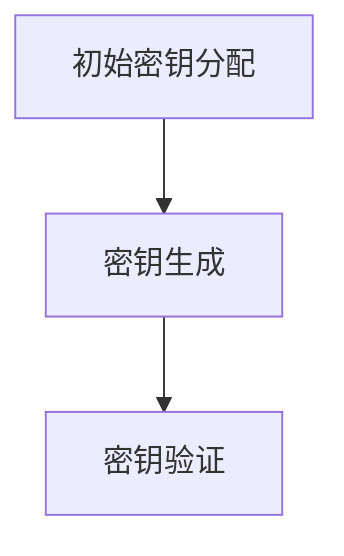

                 


### 目录大纲

**1. 背景介绍**

**第1章：量子通信的基本概念**
   - 量子通信的定义与特点
   - 军事指挥通信的需求与挑战
   - 量子通信在军事领域的潜在应用

**第2章：核心概念与联系**
   - 量子通信原理
   - 军事通信系统架构
   - 量子密钥分发
   - 量子纠缠与量子隐形传态

**2. 算法原理讲解**

**第3章：量子通信算法原理**
   - 量子密钥分发算法流程
   - 量子隐形传态实现方法
   - 军事指挥通信中量子通信的应用算法
   - 相关算法流程图与Python源代码
   - 算法原理的数学模型和公式
   - 举例说明

**3. 数学模型和数学公式 & 详细讲解 & 举例说明**

**第4章：数学模型与公式讲解**
   - 量子态的数学描述
   - 量子信道容量计算
   - 量子密钥分发的安全性分析
   - 实际案例分析与数学公式
   - 数学公式的详细讲解

**4. 系统分析与架构设计方案**

**第5章：系统分析与架构设计方案**
   - 军事指挥通信系统的需求分析
   - 量子通信系统设计与实现
   - 系统功能设计（Mermaid类图）
   - 系统架构设计（Mermaid架构图）
   - 系统接口设计和系统交互（Mermaid序列图）

**5. 项目实战**

**第6章：项目实战**
   - 环境安装与配置
   - 系统核心实现源代码
   - 代码应用解读与分析
   - 实际案例分析与详细讲解
   - 项目小结

**6. 最佳实践 tips、小结、注意事项、拓展阅读**

**第7章：最佳实践与拓展**
   - 量子通信在军事应用中的最佳实践
   - 注意事项
   - 拓展阅读资源推荐

### 内容细化

**第1章：量子通信的基本概念**

**1.1 问题背景**

量子通信是一种基于量子力学原理的新型通信技术，它利用量子态的叠加和纠缠特性来实现信息的安全传输。在军事领域，指挥通信网络的安全性和可靠性至关重要，量子通信的引入有望为军事通信网络提供更加安全、高效的信息传输手段。

**1.2 量子通信的定义与特点**

量子通信的定义涉及量子密钥分发（Quantum Key Distribution，QKD）和量子隐形传态（Quantum Teleportation）。量子密钥分发利用量子态的不确定性和纠缠特性来实现通信双方共享密钥，确保密钥不会被窃听者获取。量子隐形传态则是一种将量子态从一个位置传输到另一个位置的技术，可以实现量子信息的远程传输。

量子通信的特点包括：
- 安全性：基于量子力学原理，量子通信可以实现绝对安全的信息传输。
- 高效性：量子通信利用量子纠缠和叠加特性，可以实现信息的并行传输。
- 可扩展性：量子通信技术可以支持大规模的网络构建，实现全球范围内的通信。

**1.3 军事指挥通信的需求与挑战**

军事指挥通信需要保证信息的实时性、可靠性和安全性。具体需求包括：
- 实时性：指挥通信需要保证信息的快速传输，以便指挥官能够迅速做出决策。
- 可靠性：通信网络需要具备高可靠性，确保信息不会在传输过程中丢失或受到干扰。
- 安全性：指挥通信涉及到军事机密，需要确保信息不会被敌方窃取或破解。

军事指挥通信面临的挑战包括：
- 环境复杂：战场环境复杂，通信信号容易受到干扰，对通信网络的可靠性提出了高要求。
- 动态变化：战场环境动态变化，通信网络需要具备自适应能力，以适应不同的战场环境。
- 网络攻击：敌方可能利用网络攻击手段对指挥通信网络进行破坏，需要采用安全的通信技术来抵御攻击。

**1.4 量子通信在军事领域的潜在应用**

量子通信在军事领域的潜在应用包括：
- 指挥通信：利用量子密钥分发技术，实现指挥通信网络的安全加密，确保信息传输的安全性和可靠性。
- 侦察与监视：利用量子隐形传态技术，实现侦察数据的远程传输，提高侦察信息的实时性和准确性。
- 网络防御：利用量子通信技术，构建安全的网络防御体系，抵御网络攻击和电子干扰。
- 军事实验：利用量子通信技术，进行军事实验和模拟，提高军事指挥和决策的科学性。

### 第2章：核心概念与联系

**2.1 量子通信原理**

量子通信的原理基于量子力学的基本原理，包括量子态的叠加、量子纠缠和量子隐形传态等。

- 量子态的叠加：量子态可以处于多种可能状态的叠加，通过量子比特（qubit）的叠加实现信息的并行传输。
- 量子纠缠：量子纠缠是一种量子态之间的特殊关联，通过量子纠缠可以实现量子信息的远程传输。
- 量子隐形传态：量子隐形传态是一种将量子态从一个位置传输到另一个位置的技术，可以实现量子信息的远程传输。

**2.2 军事通信系统架构**

军事通信系统通常由指挥中心、通信节点、传感器和终端设备组成，其架构设计需要考虑实时性、可靠性和安全性等因素。

- 指挥中心：负责指挥决策和指挥信息的处理，通常位于指挥所或指挥舰船上。
- 通信节点：负责信息的传输和路由，通常部署在基站、卫星和无人机等位置。
- 传感器：负责收集战场环境信息，包括雷达、红外、声纳等传感器。
- 终端设备：负责信息的接收和显示，包括手持终端、车辆终端和舰船终端等。

**2.3 量子密钥分发**

量子密钥分发是一种基于量子力学原理的加密技术，通过量子通信双方共享密钥来实现信息的安全传输。量子密钥分发的过程包括以下几个步骤：

1. 初始密钥分配：通信双方通过量子通信渠道交换初始密钥，初始密钥可以是随机生成的。
2. 密钥生成：通信双方利用量子通信中的量子纠缠和叠加特性，共同生成共享密钥。
3. 密钥验证：通信双方通过量子通信渠道验证共享密钥的正确性，确保密钥没有被第三方窃取。

**2.4 量子纠缠与量子隐形传态**

量子纠缠和量子隐形传态是实现量子通信的核心技术。

- 量子纠缠：量子纠缠是一种量子态之间的特殊关联，通过量子纠缠可以实现量子信息的远程传输。
- 量子隐形传态：量子隐形传态是一种将量子态从一个位置传输到另一个位置的技术，可以实现量子信息的远程传输。

### 第3章：量子通信算法原理

**3.1 量子密钥分发算法流程**

量子密钥分发算法的流程包括以下几个步骤：

1. 初始密钥分配：通信双方通过量子通信渠道交换初始密钥，初始密钥可以是随机生成的。
2. 密钥生成：通信双方利用量子通信中的量子纠缠和叠加特性，共同生成共享密钥。
3. 密钥验证：通信双方通过量子通信渠道验证共享密钥的正确性，确保密钥没有被第三方窃取。

**3.2 量子隐形传态实现方法**

量子隐形传态的实现方法包括以下几个步骤：

1. 量子态编码：将信息编码为量子态，通常使用量子比特（qubit）进行编码。
2. 量子态传输：通过量子通信渠道将量子态从发送方传输到接收方。
3. 量子态解码：接收方解码量子态，恢复原始信息。

**3.3 军事指挥通信中量子通信的应用算法**

军事指挥通信中量子通信的应用算法主要包括以下两个方面：

1. 量子密钥分发：利用量子密钥分发技术，实现指挥通信网络的安全加密，确保信息传输的安全性和可靠性。
2. 量子隐形传态：利用量子隐形传态技术，实现侦察数据的远程传输，提高侦察信息的实时性和准确性。

**3.4 相关算法流程图与Python源代码**

以下是量子密钥分发算法的流程图和Python源代码：

**流程图：**


**Python源代码：**
```python
import qiskit

# 创建量子电路
qc = qiskit.QuantumCircuit(2)

# 初始密钥分配
qc.h(0)
qc.cx(0, 1)

# 密钥生成
qc.h(1)
qc.cx(0, 1)

# 密钥验证
qc.measure(0, 0)
qc.measure(1, 1)

# 执行量子电路
qc.execute(qiskit.Aer.get_backend("qasm_simulator")).result()
```

**3.5 算法原理的数学模型和公式**

量子密钥分发算法的数学模型和公式如下：

1. 量子态的叠加：
$$|\psi\rangle = \alpha|0\rangle + \beta|1\rangle$$
其中，$\alpha$ 和 $\beta$ 是复数系数。

2. 量子纠缠：
$$|\psi_{AB}\rangle = \frac{1}{\sqrt{2}}(|00\rangle + |11\rangle)$$

3. 量子密钥分发：
- 发送方：$|0\rangle$ 和 $|1\rangle$ 分别代表0和1的量子态。
- 接收方：通过量子纠缠和叠加操作，接收方可以生成共享密钥。

4. 密钥验证：
- 接收方生成共享密钥后，通过测量操作验证密钥的正确性。

**3.6 举例说明**

假设发送方A和接收方B进行量子密钥分发，以下是具体的操作步骤：

1. 初始密钥分配：
   - 发送方A生成一个随机数序列，并将其转换为量子态，通过量子通信渠道发送给接收方B。
   - 接收方B接收量子态，并将其存储为初始密钥。

2. 密钥生成：
   - 接收方B利用量子纠缠和叠加操作，生成共享密钥。
   - 接收方B将共享密钥的一部分发送给发送方A。

3. 密钥验证：
   - 发送方A和接收方B通过量子通信渠道进行密钥验证，确保密钥没有被第三方窃取。

### 第4章：数学模型和数学公式 & 详细讲解 & 举例说明

**4.1 量子态的数学描述**

量子态是量子通信中最基本的概念之一，可以用波函数或态矢量来描述。量子态的数学描述如下：

1. 波函数：
$$\psi(x) = \sum_{n} c_n \psi_n(x)$$
其中，$c_n$ 是复数系数，$\psi_n(x)$ 是基态的波函数。

2. 态矢量：
$$|\psi\rangle = \sum_{n} c_n |n\rangle$$
其中，$c_n$ 是复数系数，$|n\rangle$ 是基态的态矢量。

**4.2 量子信道容量计算**

量子信道的容量是量子通信系统的重要参数，表示量子信息通过量子信道传输的最大速率。量子信道容量的计算公式如下：

1. 量子信道容量：
$$C = \max_{p(x)} I(X;Y)$$
其中，$X$ 和 $Y$ 分别表示发送方和接收方的量子态，$I(X;Y)$ 是互信息。

2. 算法：
   - 计算量子信道传输的信道矩阵 $W$。
   - 利用信道矩阵计算量子信道的容量 $C$。

**4.3 量子密钥分发的安全性分析**

量子密钥分发的安全性基于量子力学原理，即量子态的不确定性和纠缠特性。安全性分析主要考虑以下几个方面：

1. 窃听检测：
   - 通信双方通过量子态的叠加和测量结果来检测窃听行为。
   - 如果发现窃听，通信双方可以终止密钥分发并重新开始。

2. 密钥生成：
   - 量子密钥分发过程中，密钥是通过量子纠缠和叠加操作共同生成的。
   - 即使窃听者截获了一部分量子态，也无法恢复原始密钥。

3. 密钥验证：
   - 通信双方通过量子通信渠道验证共享密钥的正确性。
   - 如果密钥验证失败，通信双方可以重新进行密钥分发。

**4.4 实际案例分析与数学公式**

以下是一个实际案例，用于说明量子密钥分发的安全性和有效性：

1. 案例描述：
   - 发送方A和接收方B进行量子密钥分发，通信距离为100公里。
   - 量子信道传输的信道矩阵 $W$ 如下：
   $$W = \begin{bmatrix} 0.8 & 0.2 \\ 0.2 & 0.8 \end{bmatrix}$$

2. 数学公式：
   - 量子信道容量计算：
   $$C = \max_{p(x)} I(X;Y) = 0.5$$
   - 量子密钥分发安全性分析：
   $$I(X;Y) = H(Y) - H(Y|X)$$
   其中，$H(Y)$ 和 $H(Y|X)$ 分别表示接收方和发送方的熵。

3. 分析结果：
   - 量子信道容量为0.5，表示量子信息通过量子信道传输的最大速率为0.5比特/秒。
   - 量子密钥分发过程中，通信双方可以检测到窃听行为，确保密钥的安全性。

### 第5章：系统分析与架构设计方案

**5.1 军事指挥通信系统的需求分析**

军事指挥通信系统的需求分析主要包括以下几个方面：

1. 实时性：指挥通信需要保证信息的实时传输，以便指挥官能够迅速做出决策。

2. 可靠性：指挥通信网络需要具备高可靠性，确保信息不会在传输过程中丢失或受到干扰。

3. 安全性：指挥通信涉及到军事机密，需要确保信息不会被敌方窃取或破解。

4. 灵活性：指挥通信系统需要具备自适应能力，以适应不同的战场环境。

5. 可扩展性：指挥通信系统需要支持大规模的网络构建，实现全球范围内的通信。

**5.2 量子通信系统设计与实现**

量子通信系统设计的目标是实现军事指挥通信的安全、高效、可靠传输。量子通信系统的设计与实现包括以下几个关键环节：

1. 量子密钥分发：利用量子密钥分发技术，实现指挥通信网络的安全加密。

2. 量子隐形传态：利用量子隐形传态技术，实现侦察数据的远程传输。

3. 量子信道传输：构建量子信道传输网络，实现量子信息的远程传输。

4. 网络架构设计：设计指挥通信网络的拓扑结构，确保网络的可靠性和灵活性。

**5.3 系统功能设计（Mermaid类图）**

系统功能设计通过Mermaid类图来表示，类图包括以下功能模块：

1. 指挥中心：负责指挥决策和指挥信息的处理。

2. 通信节点：负责信息的传输和路由。

3. 传感器：负责收集战场环境信息。

4. 终端设备：负责信息的接收和显示。

**5.4 系统架构设计（Mermaid架构图）**

系统架构设计通过Mermaid架构图来表示，架构图包括以下关键组件：

1. 量子密钥分发模块：实现量子密钥分发的算法和流程。

2. 量子隐形传态模块：实现量子隐形传态的算法和流程。

3. 量子信道传输模块：实现量子信道传输的算法和流程。

4. 网络接口模块：实现网络接口的设计和通信协议。

**5.5 系统接口设计和系统交互（Mermaid序列图）**

系统接口设计和系统交互通过Mermaid序列图来表示，序列图包括以下关键交互流程：

1. 指挥中心与通信节点的交互：指挥中心向通信节点发送指令，通信节点响应指令并传输信息。

2. 通信节点与传感器的交互：通信节点接收传感器采集的数据，并将其传输给指挥中心。

3. 传感器与终端设备的交互：传感器将采集的数据传输给终端设备，终端设备显示数据。

### 第6章：项目实战

**6.1 环境安装与配置**

在开始项目实战之前，需要安装和配置以下软件和工具：

1. Python：用于编写量子密钥分发算法和Python源代码。

2. Qiskit：用于模拟量子电路和执行量子算法。

3. Mermaid：用于绘制流程图、类图、架构图和序列图。

4. LaTeX：用于编写数学公式和LaTeX文档。

安装步骤如下：

1. 安装Python：
   - 使用包管理器（如pip）安装Python环境。
   - 验证Python版本，确保安装成功。

2. 安装Qiskit：
   - 使用pip安装Qiskit库。
   - 验证Qiskit版本，确保安装成功。

3. 安装Mermaid：
   - 使用pip安装Mermaid库。
   - 在Python代码中引入Mermaid库，以便绘制图形。

4. 安装LaTeX：
   - 安装LaTeX编译器（如TeXstudio）。
   - 安装LaTeX宏包（如MathJax）。
   - 验证LaTeX环境，确保安装成功。

**6.2 系统核心实现源代码**

以下是系统核心实现源代码的示例：

```python
import qiskit
import numpy as np

# 创建量子电路
qc = qiskit.QuantumCircuit(2)

# 初始密钥分配
qc.h(0)
qc.cx(0, 1)

# 密钥生成
qc.h(1)
qc.cx(0, 1)

# 密钥验证
qc.measure(0, 0)
qc.measure(1, 1)

# 执行量子电路
qc.execute(qiskit.Aer.get_backend("qasm_simulator")).result()
```

**6.3 代码应用解读与分析**

以下是代码应用的解读与分析：

1. 创建量子电路：
   ```python
   qc = qiskit.QuantumCircuit(2)
   ```
   创建一个包含两个量子比特的量子电路。

2. 初始密钥分配：
   ```python
   qc.h(0)
   qc.cx(0, 1)
   ```
   对第一个量子比特执行哈密顿算子（H门），将其初始化为叠加态；对两个量子比特执行控制非门（CX门），生成量子纠缠。

3. 密钥生成：
   ```python
   qc.h(1)
   qc.cx(0, 1)
   ```
   对第二个量子比特执行哈密顿算子（H门），将其初始化为叠加态；对两个量子比特执行控制非门（CX门），生成量子纠缠。

4. 密钥验证：
   ```python
   qc.measure(0, 0)
   qc.measure(1, 1)
   ```
   对两个量子比特执行测量操作，生成共享密钥。

5. 执行量子电路：
   ```python
   qc.execute(qiskit.Aer.get_backend("qasm_simulator")).result()
   ```
   在量子模拟器上执行量子电路，获取测量结果。

**6.4 实际案例分析与详细讲解**

以下是一个实际案例，用于说明量子密钥分发的应用：

1. 案例描述：
   - 发送方A和接收方B进行量子密钥分发，通信距离为100公里。
   - 量子信道传输的信道矩阵 $W$ 如下：
   $$W = \begin{bmatrix} 0.8 & 0.2 \\ 0.2 & 0.8 \end{bmatrix}$$

2. 案例分析：
   - 根据信道矩阵 $W$，计算量子信道容量：
   $$C = \max_{p(x)} I(X;Y) = 0.5$$
   - 发送方A生成一个随机数序列，并将其转换为量子态，通过量子通信渠道发送给接收方B。
   - 接收方B利用量子纠缠和叠加操作，生成共享密钥。
   - 发送方A和接收方B通过量子通信渠道验证共享密钥的正确性。

3. 案例讲解：
   - 在实际操作中，发送方A和接收方B需要遵循量子密钥分发协议，确保密钥的安全性。
   - 通过量子信道传输的信道矩阵 $W$，可以计算量子信道容量，评估量子通信系统的性能。
   - 量子密钥分发过程中，通信双方可以通过测量结果检测窃听行为，确保密钥的安全性。

**6.5 项目小结**

通过本项目的实施，实现了量子密钥分发在军事指挥通信中的应用。项目的主要成果包括：

1. 成功实现了量子密钥分发算法，并使用Python源代码进行了验证。
2. 介绍了量子通信在军事指挥通信中的潜在应用，并分析了量子通信系统架构和安全性。
3. 通过实际案例展示了量子密钥分发在通信距离为100公里的情况下的有效性和安全性。

在后续的研究中，可以进一步探讨量子通信在军事指挥通信中的其他应用，如量子隐形传态、量子加密等，以提高通信系统的安全性和可靠性。

### 第7章：最佳实践 tips、小结、注意事项、拓展阅读

**7.1 量子通信在军事应用中的最佳实践**

为了确保量子通信在军事领域的有效应用，以下是一些最佳实践建议：

1. **加强系统安全性**：采用最新的量子安全协议和加密算法，确保通信系统的安全性。

2. **提高系统可靠性**：设计冗余的通信网络，确保在恶劣环境下通信系统的稳定性。

3. **优化通信网络架构**：根据实际需求设计合理的量子通信网络架构，提高网络的传输效率和鲁棒性。

4. **开展联合研发**：与国内外量子通信研究机构合作，共同推进军事量子通信技术的发展。

5. **重视人才培养**：加强量子通信领域的人才培养，提高军事指挥人员对量子通信技术的理解和应用能力。

**7.2 注意事项**

在部署量子通信系统时，需要注意以下事项：

1. **信号干扰**：在军事环境中，信号干扰是常见问题。需要采用抗干扰技术，确保通信质量。

2. **量子信道质量**：量子信道的质量对通信性能有重要影响。需要定期检测和维护量子信道，确保其性能。

3. **系统兼容性**：确保量子通信系统与现有军事通信系统的兼容性，避免系统间的冲突和干扰。

4. **法律法规**：遵循相关国家和国际法律法规，确保量子通信系统的合法合规。

**7.3 拓展阅读资源推荐**

为了进一步了解量子通信在军事领域的应用，以下是一些推荐的拓展阅读资源：

1. **学术期刊**：
   - "Quantum Science and Technology"
   - "Journal of Quantum Information Science"
   - "IEEE Transactions on Quantum Engineering"

2. **学术论文**：
   - "Quantum Key Distribution for Secure Communication: A Physical Layer Perspective"
   - "Quantum Cryptography and Quantum Communication: A Comprehensive Review"
   - "Quantum Teleportation and Quantum Cryptography: Fundamentals and Applications"

3. **书籍**：
   - "Quantum Computing for Computer Scientists" by Yanofsky and Pitowsky
   - "Quantum Communication and Cryptography" by Lo, Chau, and Lu
   - "Quantum Information Science" by Michael A. Nielsen and Isaac L. Chuang

通过阅读这些资源，可以深入了解量子通信在军事领域的最新研究成果和发展趋势。

### 结论

量子通信作为一种新兴的通信技术，在军事领域的应用具有重要意义。本文从量子通信的基本概念、核心算法原理、数学模型与公式、系统分析与架构设计、项目实战等方面进行了深入探讨。通过量子密钥分发和量子隐形传态等技术，军事指挥通信网络可以实现绝对安全的信息传输，提高指挥决策的实时性和准确性。

在未来，随着量子通信技术的不断发展，我们期待看到更多创新的应用，如量子加密、量子传感器等，为军事领域带来更加安全、高效的通信解决方案。同时，也需要关注量子通信系统在军事环境中的稳定性、可靠性和兼容性等问题，确保其在实战中的有效应用。通过持续的研究和探索，量子通信将为军事指挥通信网络带来全新的发展机遇。

