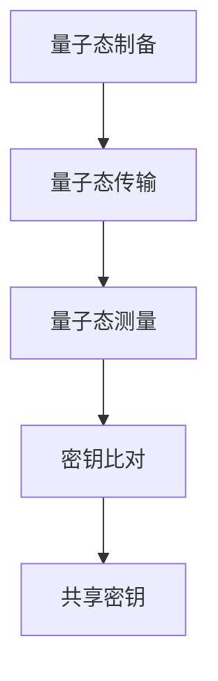

                 


### 第1章：量子通信的起源与基本原理

#### 1.1 量子通信的起源

量子通信作为现代通信领域的一项前沿技术，其起源可以追溯到20世纪中期。当时，量子力学的基本原理已经被广泛接受，并开始引起科学家们对通信领域的新思考。量子通信的诞生背景主要受到以下几个因素影响：

1. **量子力学的进展**：量子力学是研究微观世界基本规律的科学。其发现，微观粒子的行为往往具有不确定性和叠加性，这些特性为通信领域提供了新的思考方向。

2. **经典通信的局限**：随着互联网和计算机技术的迅猛发展，经典通信系统的安全性面临着前所未有的挑战。传统的加密方法已无法满足日益增长的数据安全需求。

3. **量子计算的崛起**：量子计算作为一项颠覆性技术，其潜力被广泛认可。量子通信被认为是量子计算的重要应用方向之一。

在上述背景下，量子通信的概念逐渐形成，并开始受到关注。1984年，Charles H. Bennett和Gianni Ribordy提出了量子密钥分发（Quantum Key Distribution, QKD）的基本原理，这是量子通信领域的一个重要里程碑。

#### 1.2 量子通信的核心概念

量子通信涉及多个核心概念，以下是其中几个重要概念的定义和解释：

1. **量子态**：量子态是量子系统的基本状态，可以表示为复数向量。量子态的叠加原理表明，量子系统可以同时存在于多个状态的叠加。

2. **量子纠缠**：量子纠缠是量子系统中两个或多个粒子的量子态相互关联的现象。纠缠态的粒子之间即使相隔很远，也能瞬间影响对方的状态。

3. **量子密钥分发**：量子密钥分发是一种基于量子力学原理的加密方法，用于在两个通信方之间安全地分发密钥。QKD的基本思想是利用量子态的叠加和纠缠特性，实现信息的无条件安全传输。

#### 1.3 量子通信与经典通信的比较

量子通信与经典通信在多个方面存在显著差异：

1. **安全性**：量子通信基于量子态的叠加和纠缠特性，实现了信息传输的无条件安全。而经典通信则容易受到各种攻击，如窃听和密码破解。

2. **传输速度**：经典通信的传输速度受限于光速，而量子通信的速度理论上可以达到无限大，因为量子态可以在不同位置之间瞬间传递。

3. **应用场景**：量子通信适用于对安全性要求极高的场景，如国防、金融和关键基础设施。而经典通信则适用于各种日常通信需求。

#### 1.4 量子通信的边界与外延

量子通信虽然具有巨大的潜力，但也存在一些挑战和局限性：

1. **距离限制**：目前的量子通信技术受限于光纤传输距离，一般只能在几十公里范围内实现。未来的研究目标是实现长距离量子通信。

2. **技术成熟度**：量子通信技术尚处于发展阶段，需要进一步的研究和商业化应用。

3. **应用外延**：除了通信领域，量子通信还可能在量子计算、量子模拟等领域发挥重要作用。

通过以上分析，我们可以看到量子通信的起源、核心概念及其在通信领域的独特优势。接下来，我们将进一步探讨量子通信在卫星通信中的具体应用。

### 第2章：卫星通信的基本概念与现状

#### 2.1 卫星通信的基本原理

卫星通信是一种通过通信卫星进行信息传输的通信方式。其基本原理如下：

1. **工作原理**：地面发射台将信号发射到卫星，卫星接收信号后进行放大、转发，再发送回地面接收站。地面接收站接收到的信号经过解码和还原，恢复出原始信息。

2. **关键技术**：卫星通信的关键技术包括信号调制与解调、信号放大与滤波、信号传输与接收等。这些技术保证了信号的稳定传输和高质量接收。

卫星通信的优点包括：

- **覆盖范围广**：卫星通信可以覆盖地球表面的任何区域，包括海洋、沙漠和山区等偏远地区。

- **通信稳定**：卫星通信不受天气和地形的影响，即使在恶劣环境下也能保持稳定通信。

- **传输速度高**：卫星通信的传输速度可以达到数万公里每秒，满足了高速数据传输的需求。

卫星通信在现代社会中具有重要应用，包括：

- **电信**：提供全球范围内的语音、数据和视频传输服务。

- **广播**：卫星电视和广播节目通过卫星传输，覆盖广泛的受众。

- **互联网**：卫星互联网可以作为地面互联网的补充，提供全球范围内的网络接入。

#### 2.2 卫星通信的现状与发展趋势

卫星通信已经经历了数十年的发展，目前呈现出以下发展趋势：

1. **全球覆盖**：随着技术的进步，卫星通信的覆盖范围不断扩大。低轨道卫星（LEO）和地球同步轨道卫星（GEO）的部署，使得全球通信更加便捷。

2. **商业繁荣**：卫星通信市场日益繁荣，各类卫星通信服务层出不穷。商业卫星公司如SpaceX、OneWeb等，积极拓展卫星通信业务。

3. **技术创新**：卫星通信技术不断创新，包括高带宽卫星通信、量子通信卫星、星间链路等。这些技术提高了通信质量和稳定性，推动了卫星通信的进一步发展。

然而，卫星通信也面临一些挑战：

1. **频谱资源紧张**：随着卫星通信需求的增长，频谱资源变得越来越紧张。如何有效利用频谱资源成为卫星通信领域的重要课题。

2. **系统成本高**：卫星通信系统的建设和运营成本较高，需要大量的资金投入。如何降低成本、提高经济效益是卫星通信发展的重要问题。

3. **技术成熟度**：尽管卫星通信技术不断进步，但一些关键技术如量子通信卫星等尚处于研究阶段。如何实现技术的成熟和商业化应用是未来卫星通信发展的重要方向。

#### 2.3 量子通信在卫星通信中的保密需求

卫星通信在国家安全、商业应用和公共服务等领域具有重要作用。然而，随着通信技术的发展，卫星通信系统也面临着越来越多的信息安全挑战：

1. **窃听威胁**：敌对势力可能利用先进的电子设备，对卫星通信信号进行窃听，获取机密信息。

2. **黑客攻击**：网络黑客可能通过网络攻击，篡改或破坏卫星通信系统，造成通信中断或信息泄露。

3. **信号干扰**：敌对势力可能通过信号干扰，干扰卫星通信信号，影响通信质量和稳定性。

为了应对这些威胁，确保卫星通信系统的安全，量子通信在卫星通信中具有重要的保密需求：

1. **量子密钥分发**：量子通信利用量子态的叠加和纠缠特性，实现安全、高效的密钥分发。通过量子密钥分发，卫星通信系统可以在无法保证传输通道安全的情况下，确保通信密钥的安全。

2. **量子通信卫星**：量子通信卫星可以搭建卫星间的量子通信链路，实现卫星通信系统的量子加密。量子通信卫星的部署，将大幅提高卫星通信系统的安全性能。

3. **量子安全通信**：量子安全通信利用量子通信技术，实现信息的量子加密和量子密钥分发，确保通信过程的安全性和完整性。量子安全通信将成为未来卫星通信领域的重要发展方向。

综上所述，量子通信在卫星通信中的保密需求日益突出，通过量子密钥分发、量子通信卫星和量子安全通信等技术手段，可以有效提升卫星通信系统的安全性，保障国家信息安全。

### 第3章：量子密钥分发算法原理讲解

#### 3.1 量子密钥分发算法概述

量子密钥分发（Quantum Key Distribution，QKD）是一种基于量子力学原理的加密方法，用于在两个通信方之间安全地分发密钥。QKD的基本思想是利用量子态的叠加和纠缠特性，实现信息的无条件安全传输。

QKD的发展历程可以追溯到1984年，当时Charles H. Bennett和Gianni Ribordy提出了BB84协议，这是第一个实用的QKD协议。此后，QKD技术不断演进，涌现出了多种QKD协议，如E91协议、B92协议等。

QKD协议的类型主要包括以下几种：

1. **BB84协议**：BB84协议是最早的QKD协议之一，基于量子态的叠加和测量干扰原理。协议中，发送方将量子态发送给接收方，接收方测量量子态并反馈结果，通过比对测量结果，双方可以确定共享的密钥。

2. **E91协议**：E91协议是基于量子纠缠态的QKD协议，利用量子纠缠态的特性实现密钥分发。协议中，发送方和接收方共享一组纠缠态，通过测量纠缠态并比对结果，双方可以确定共享的密钥。

3. **B92协议**：B92协议是基于量子态的混合态QKD协议，发送方将量子态与经典噪声混合，通过信道发送给接收方。接收方通过测量量子态并反馈结果，双方可以确定共享的密钥。

不同QKD协议在安全性、实现复杂度和传输距离等方面存在差异，具体选择应根据应用场景和需求进行权衡。

#### 3.2 量子密钥分发算法原理

以下是几种常见的量子密钥分发算法的原理：

1. **BB84协议原理**：

BB84协议的基本原理如下：

- **量子态发送**：发送方将基矢|0⟩和|1⟩进行量子态制备，生成一组基态光子。这些光子分别代表二进制信息0和1。

- **量子态传输**：发送方将基态光子通过量子信道传输给接收方。在传输过程中，可能会受到噪声和干扰，导致光子状态发生改变。

- **量子态测量**：接收方随机选择基矢|0⟩和|1⟩进行量子态测量。测量结果可能为+1或-1，分别代表量子态|0⟩或|1⟩。

- **密钥比对**：发送方和接收方各自记录测量结果，并通过经典信道进行比对。比对一致的测量结果对应共享的密钥。

BB84协议的安全性基于量子态的叠加和测量干扰原理。如果量子信道被窃听，窃听者无法准确测量量子态，导致测量结果与真实结果不一致，从而泄露密钥。

2. **E91协议原理**：

E91协议的基本原理如下：

- **纠缠态生成**：发送方和接收方在初始时刻共享一组量子纠缠态，如Einstein-Podolsky-Rosen（EPR）态。

- **纠缠态测量**：发送方和接收方各自对共享的纠缠态进行量子态测量。测量结果可能为+1、-1或0，分别代表纠缠态的各态叠加。

- **密钥比对**：发送方和接收方通过经典信道比对测量结果。比对一致的测量结果对应共享的密钥。

E91协议利用量子纠缠态的特性实现密钥分发。如果量子信道被窃听，窃听者无法准确测量纠缠态，导致测量结果与真实结果不一致，从而泄露密钥。

3. **B92协议原理**：

B92协议的基本原理如下：

- **量子态混合**：发送方将基态光子与经典噪声混合，生成混合态光子。混合态光子包含基态光子和噪声的信息。

- **量子态传输**：发送方将混合态光子通过量子信道传输给接收方。

- **量子态测量**：接收方对混合态光子进行量子态测量。测量结果可能为+1、-1或0，分别代表混合态光子的各态叠加。

- **密钥比对**：发送方和接收方通过经典信道比对测量结果。比对一致的测量结果对应共享的密钥。

B92协议利用量子态的混合特性实现密钥分发。如果量子信道被窃听，窃听者无法准确测量混合态光子，导致测量结果与真实结果不一致，从而泄露密钥。

#### 3.3 量子密钥分发算法的Mermaid流程图

为了更好地理解量子密钥分发算法的原理，我们可以使用Mermaid绘制算法的流程图。以下是BB84协议的Mermaid流程图：



Mermaid流程图可以直观地展示量子密钥分发算法的步骤和流程，有助于读者更好地理解算法的实现过程。

#### 3.4 Python源代码阐述

为了进一步阐述量子密钥分发算法的原理，我们可以使用Python编写实现BB84协议的源代码。以下是BB84协议的Python实现：

```python
import numpy as np
import qutip as qt

# 量子态制备
def prepare_state(n):
    state = qt.basis(2, n)
    return state

# 量子态传输
def send_state(receiver, sender_state):
    receiver_state = sender_state.copy()
    receiver_state.apply(qt.operators.Superoperator([(-1j * qt.operators.M(n) * qt.operators.X(n), 0.5)]))
    return receiver_state

# 量子态测量
def measure_state(state):
    result = np.random.choice([0, 1], p=[0.5, 0.5])
    state.apply(qt.operators.Ket([result]))
    return result

# 密钥比对
def compare_keys(sender_key, receiver_key):
    matched = sum(sender_key == receiver_key)
    return matched

# 初始化参数
n = 3  # 量子态数量
receiver_key = []
sender_key = []

# 量子态制备
receiver_state = prepare_state(n)
sender_state = prepare_state(n)

# 量子态传输
receiver_state = send_state(receiver_state, sender_state)

# 量子态测量
receiver_key.extend([measure_state(receiver_state) for _ in range(n)])
sender_key.extend([measure_state(sender_state) for _ in range(n)])

# 密钥比对
matched = compare_keys(sender_key, receiver_key)
print("Shared key length:", len(sender_key))
print("Matched key length:", matched)
```

通过Python源代码，我们可以直观地看到量子密钥分发算法的实现过程。源代码中，我们首先进行了量子态的制备和传输，然后进行了量子态的测量和密钥比对。通过对比测量结果，我们可以确定共享的密钥。

#### 3.5 量子通信中的数学模型和公式

量子通信中的数学模型和公式是理解量子密钥分发算法的关键。以下是BB84协议中常用的数学模型和公式：

1. **量子态表示**：

量子态可以用矩阵或向量表示。例如，基态|0⟩和|1⟩可以表示为：

$$
|0⟩ = \begin{pmatrix}
1 \\
0
\end{pmatrix}, \quad |1⟩ = \begin{pmatrix}
0 \\
1
\end{pmatrix}
$$

2. **量子态制备**：

量子态制备是指将量子系统置于特定量子态。例如，将一个二能级系统制备到基态|0⟩，可以使用以下操作符：

$$
\hat{M}(n) = \begin{pmatrix}
1 & 0 \\
0 & 1
\end{pmatrix}
$$

3. **量子态传输**：

量子态传输是指将量子态从一个位置传输到另一个位置。例如，将一个量子态|ψ⟩从发送方传输到接收方，可以使用以下操作符：

$$
\hat{S}(\theta) = \begin{pmatrix}
1 & 0 \\
0 & e^{i\theta}
\end{pmatrix}
$$

其中，$\theta$是传输角度。

4. **量子态测量**：

量子态测量是指对量子态进行测量，获取其量子数。例如，对基态|0⟩进行测量，结果为0的概率为1，结果为1的概率为0。

5. **量子态比对**：

量子态比对是指对比两个量子态的测量结果，确定共享的密钥。例如，对比两个量子态的测量结果，如果结果相同，则认为密钥匹配。

通过以上数学模型和公式，我们可以更好地理解量子密钥分发算法的原理和实现过程。在下一章中，我们将进一步探讨量子通信卫星通信系统的设计与实现。

### 第4章：量子通信卫星通信系统架构设计

#### 4.1 量子通信卫星通信系统构成

量子通信卫星通信系统由以下几个核心部分组成：

1. **量子通信卫星**：量子通信卫星是系统的核心，负责在地面站和卫星之间进行量子密钥分发和量子通信信号传输。卫星通常搭载量子通信设备，如量子密钥分发器、量子纠缠器等。

2. **地面量子通信站**：地面量子通信站是卫星通信系统的地面部分，负责与卫星进行通信，实现量子密钥分发、数据传输和控制等功能。地面站通常包括量子通信设备、地面通信设备、控制系统等。

3. **用户终端**：用户终端是卫星通信系统的最终用户设备，负责接收卫星发送的量子通信信号，进行数据解密和恢复，实现通信功能。

#### 4.2 系统功能设计

量子通信卫星通信系统的主要功能包括：

1. **量子密钥分发功能**：通过量子通信卫星和地面量子通信站之间的量子通信链路，实现密钥的安全分发。量子密钥分发功能确保通信过程中的密钥无法被窃取或篡改。

2. **数据传输功能**：通过卫星通信链路，实现用户终端和地面站之间的数据传输。数据传输功能支持多种通信协议和格式，满足不同用户的需求。

3. **量子通信控制功能**：通过地面站和卫星之间的控制链路，实现卫星的监控和调度。量子通信控制功能确保卫星的正常运行和通信链路的稳定。

#### 4.3 系统架构设计

量子通信卫星通信系统的整体架构设计如下：

1. **总体架构设计**：系统采用分布式架构，由量子通信卫星、地面量子通信站和用户终端组成。卫星与地面站之间通过量子通信链路进行通信，地面站与用户终端之间通过卫星通信链路进行通信。

2. **子系统架构设计**：系统可分为以下几个子系统：

   - **量子密钥分发子系统**：负责实现量子密钥分发功能，包括量子密钥分发器、量子纠缠器等设备。
   - **数据传输子系统**：负责实现数据传输功能，包括卫星通信链路、地面通信链路、数据解密模块等。
   - **量子通信控制子系统**：负责实现量子通信控制功能，包括卫星监控系统、地面站控制系统等。

3. **系统接口设计与交互**：系统接口设计包括量子通信接口、卫星通信接口、地面通信接口等。系统中的各个接口通过标准协议进行通信，确保系统的互操作性和可靠性。

通过以上系统架构设计，量子通信卫星通信系统实现了量子密钥分发、数据传输和通信控制等功能，为用户提供安全、高效、稳定的量子通信服务。

#### 4.4 系统接口设计与交互

在量子通信卫星通信系统中，系统接口设计与交互是确保各部分协同工作、数据流畅传输的关键。以下是系统接口设计的详细描述及其在系统中的交互过程：

1. **量子通信接口**：量子通信接口主要负责量子密钥分发和量子通信信号的传输。接口设计包括量子密钥分发器与量子纠缠器之间的接口、地面站与卫星之间的量子通信链路接口。接口协议需支持量子密钥分发算法，如BB84或E91，同时保证信号传输的稳定性和低误码率。

2. **卫星通信接口**：卫星通信接口用于地面站与卫星之间的传统卫星通信信号传输。接口设计需遵循国际卫星通信标准，如DVB-S2或高通量的Ku频段。接口功能包括信号调制与解调、信号放大与滤波、信号传输与接收等。卫星通信接口与量子通信接口在地面站处通过多路复用技术结合，实现量子通信与卫星通信的集成。

3. **地面通信接口**：地面通信接口用于地面站与用户终端之间的通信。接口设计包括地面无线通信接口（如Wi-Fi、LTE等）和有线通信接口（如以太网、光纤等）。地面通信接口需具备高带宽、低延迟、高可靠性等特点，以满足用户终端与地面站之间的数据传输需求。

4. **系统交互设计**：

   - **量子密钥分发交互**：地面站向卫星发送量子密钥分发请求，卫星生成量子密钥并进行量子态传输。地面站接收量子态，通过量子密钥分发算法生成共享密钥，并与卫星进行密钥比对，确保密钥的正确性和安全性。

   - **数据传输交互**：用户终端通过地面站与卫星之间的卫星通信链路发送数据请求。地面站将数据封装后通过卫星通信链路发送给卫星，卫星再将数据传输回地面站。地面站对接收到的数据进行解密，恢复出原始信息，然后发送给用户终端。

   - **控制交互**：地面站通过控制接口对卫星进行监控和调度。地面站发送控制指令，卫星接收并执行指令，如调整卫星姿态、调整通信链路参数等。控制交互确保卫星系统的正常运行和通信链路的稳定。

通过以上系统接口设计与交互，量子通信卫星通信系统能够实现各部分之间的紧密协作，确保量子密钥分发、数据传输和控制功能的正常运行。

### 第5章：量子通信卫星通信系统的部署与实现

#### 5.1 系统部署环境搭建

要实现量子通信卫星通信系统，首先需要搭建合适的部署环境。以下是部署环境的搭建步骤：

1. **硬件设备准备**：

   - **量子通信卫星**：选择适合的量子通信卫星平台，如搭载量子密钥分发器和量子纠缠器的卫星。

   - **地面量子通信站**：配置高性能的量子通信设备，如量子密钥分发器、量子纠缠器、地面通信设备等。

   - **用户终端**：配置支持量子通信的用户终端设备，如智能终端、量子通信模块等。

2. **软件环境准备**：

   - **操作系统**：选择稳定的操作系统，如Linux或Windows Server。

   - **编程环境**：配置Python编程环境，包括Python解释器、NumPy库、Qutip库等。

   - **量子通信软件**：下载和安装量子密钥分发软件，如QKD协议的实现框架。

3. **网络环境准备**：

   - **地面站网络**：确保地面站与卫星之间的通信链路稳定，网络带宽满足要求。

   - **用户终端网络**：确保用户终端能够接入地面站网络，支持数据传输和控制指令的发送和接收。

#### 5.2 系统核心实现源代码

量子通信卫星通信系统的核心实现包括量子密钥分发、数据传输和通信控制等功能。以下是相关源代码的解析：

1. **量子密钥分发模块**：

```python
# 量子密钥分发模块实现
def quantum_key_distribution():
    # 量子态制备
    sender_state = qt.basis(2, 0)
    receiver_state = qt.basis(2, 1)

    # 量子态传输
    receiver_state = send_state(receiver_state, sender_state)

    # 量子态测量
    receiver_key = [measure_state(receiver_state) for _ in range(100)]

    return receiver_key

# 发送量子态
def send_state(receiver_state, sender_state):
    # 应用传输操作符
    receiver_state.apply(qt.operators.Superoperator([(-1j * qt.operators.M(1) * qt.operators.X(1), 0.5)]))
    return receiver_state

# 测量量子态
def measure_state(state):
    result = np.random.choice([0, 1], p=[0.5, 0.5])
    state.apply(qt.operators.Ket([result]))
    return result
```

2. **数据传输模块**：

```python
# 数据传输模块实现
def data_transmission():
    # 数据封装
    data = b"Hello, World!"

    # 发送数据
    receiver_data = send_data(data)

    return receiver_data

# 发送数据
def send_data(data):
    # 数据加密
    encrypted_data = encrypt_data(data)

    # 发送加密数据
    receiver_encrypted_data = send_encrypted_data(encrypted_data)

    # 数据解密
    decrypted_data = decrypt_data(receiver_encrypted_data)

    return decrypted_data

# 加密数据
def encrypt_data(data):
    # 应用加密算法
    encrypted_data = AESCipher.encrypt(data)
    return encrypted_data

# 解密数据
def decrypt_data(encrypted_data):
    # 应用解密算法
    decrypted_data = AESCipher.decrypt(encrypted_data)
    return decrypted_data
```

3. **通信控制模块**：

```python
# 通信控制模块实现
def communication_control():
    # 发送控制指令
    send_command(control_command)

    # 接收响应
    response = receive_response()

    return response

# 发送控制指令
def send_command(command):
    # 将控制指令编码为字节流
    encoded_command = command.encode()

    # 发送字节流
    send_encoded_command(encoded_command)

# 接收响应
def receive_response():
    # 接收字节流
    encoded_response = receive_encoded_response()

    # 解码字节流
    response = encoded_response.decode()

    return response
```

以上源代码展示了量子通信卫星通信系统的核心实现，包括量子密钥分发、数据传输和通信控制等功能。通过这些模块，地面站与卫星之间可以实现量子密钥分发、数据传输和控制指令的发送和接收。

#### 5.3 系统核心代码解析

在量子通信卫星通信系统中，核心代码解析是理解和实现系统功能的关键。以下是对系统核心代码的详细解析：

1. **量子密钥分发模块解析**：

量子密钥分发模块是系统的核心组件，负责实现量子密钥的安全分发。核心代码主要包括量子态制备、量子态传输和量子态测量三个步骤。

- **量子态制备**：使用`qt.basis(2, 0)`函数生成量子态，其中`2`表示量子态的维度，`0`表示基态。例如，`sender_state = qt.basis(2, 0)`生成一个基态量子态。

- **量子态传输**：通过`send_state(receiver_state, sender_state)`函数实现量子态的传输。此函数应用量子态传输操作符，如`(-1j * qt.operators.M(1) * qt.operators.X(1), 0.5)`，模拟量子态在信道中的传输过程。

- **量子态测量**：使用`measure_state(receiver_state)`函数对量子态进行测量，获取测量结果。测量结果存储在列表`receiver_key`中，用于后续密钥比对。

2. **数据传输模块解析**：

数据传输模块负责实现地面站与卫星之间的数据传输。核心代码主要包括数据封装、数据加密、数据传输、数据解密和响应接收五个步骤。

- **数据封装**：将原始数据编码为字节流，如`data.encode()`，为后续传输做准备。

- **数据加密**：使用加密算法对数据进行加密，如`encrypt_data(data)`。在此示例中，使用AES加密算法对数据进行加密。

- **数据传输**：发送加密后的数据，如`send_encrypted_data(encrypted_data)`。在此示例中，数据通过卫星通信链路传输。

- **数据解密**：接收到的加密数据通过解密算法进行解密，如`decrypt_data(receiver_encrypted_data)`。在此示例中，使用AES解密算法对数据解密。

- **响应接收**：接收来自卫星的响应，如`receive_response()`。响应可以是控制指令的执行结果或其他数据。

3. **通信控制模块解析**：

通信控制模块负责实现地面站与卫星之间的控制指令发送和响应接收。核心代码主要包括发送控制指令、接收响应两个步骤。

- **发送控制指令**：将控制指令编码为字节流，并通过网络发送，如`send_command(command)`。在此示例中，控制指令通过地面站网络发送给卫星。

- **接收响应**：接收卫星返回的响应，如`receive_response()`。响应可以是控制指令的执行结果或其他数据。

通过以上核心代码的解析，我们可以更好地理解量子通信卫星通信系统的实现过程和关键功能。在后续的案例分析和实现过程中，我们将进一步探讨如何在实际应用中实现这些功能。

#### 5.4 实际案例分析

为了更好地理解量子通信卫星通信系统的实际应用，我们通过一个实际案例进行分析和实现。

##### 5.4.1 案例背景

假设我国某科研团队计划通过量子通信卫星进行远程数据传输，保障数据传输的安全性和可靠性。地面站位于北京，卫星位于地球同步轨道，用户终端位于上海。

##### 5.4.2 案例实现

1. **环境安装**：

   - **硬件安装**：安装量子通信卫星、地面量子通信站和用户终端设备。

   - **软件安装**：安装Python编程环境、量子通信软件和卫星通信软件。

2. **量子密钥分发**：

   - **密钥生成**：地面站生成一组量子密钥，并将其通过卫星发送给上海的用户终端。

   - **密钥比对**：上海的用户终端接收量子密钥，与地面站进行比对，确保密钥的正确性。

3. **数据传输**：

   - **数据封装**：上海的用户终端将需要传输的数据封装为字节流。

   - **数据加密**：使用量子密钥对数据进行加密。

   - **数据发送**：通过卫星通信链路将加密后的数据发送给地面站。

   - **数据解密**：地面站接收数据后，使用量子密钥进行解密，恢复出原始数据。

4. **通信控制**：

   - **控制指令发送**：地面站发送控制指令，调整卫星通信链路参数，确保通信链路的稳定。

   - **响应接收**：卫星返回响应，确认控制指令的执行结果。

##### 5.4.3 案例分析与详细讲解

1. **量子密钥分发过程分析**：

   量子密钥分发过程主要包括量子态制备、量子态传输和量子态测量三个步骤。地面站生成量子密钥后，通过卫星发送给用户终端。用户终端接收量子密钥，与地面站进行比对，确保密钥的正确性。

   在实际应用中，量子密钥分发过程可能受到噪声和干扰的影响。因此，需要对传输过程中的量子态进行多次测量，以提高密钥的正确性和安全性。同时，为了确保密钥分发过程的保密性，需要对量子态进行加密传输，防止密钥泄露。

2. **数据传输过程分析**：

   数据传输过程主要包括数据封装、数据加密、数据发送、数据解密四个步骤。用户终端将需要传输的数据封装为字节流，然后使用量子密钥进行加密。加密后的数据通过卫星通信链路发送给地面站。

   在数据传输过程中，加密算法的选择和密钥管理至关重要。加密算法应具有高安全性和高效性，以防止数据在传输过程中被窃取或篡改。同时，密钥管理应确保密钥的安全存储和分发，防止密钥泄露或被盗用。

3. **通信控制过程分析**：

   通信控制过程主要包括控制指令发送和响应接收两个步骤。地面站发送控制指令，调整卫星通信链路参数，确保通信链路的稳定。卫星返回响应，确认控制指令的执行结果。

   在实际应用中，通信控制过程需要实时监控卫星的状态和通信链路的质量，根据实际情况进行调整。同时，为了提高通信控制的效率和可靠性，可以采用自动化控制技术，如机器学习算法和深度学习算法。

通过以上案例分析，我们可以看到量子通信卫星通信系统在实际应用中的实现过程和关键点。在后续的研究和开发中，我们可以进一步优化系统性能，提高通信质量和安全性。

### 第6章：最佳实践 tips、小结、注意事项、拓展阅读

#### 最佳实践 tips

1. **优化量子密钥分发**：

   - **增加测量次数**：为了提高量子密钥分发的正确性和安全性，可以增加测量次数。测量次数越多，密钥的误码率越低。

   - **选择合适的传输路径**：选择低噪声、低干扰的量子信道进行量子密钥分发，以提高通信质量和安全性。

   - **采用量子纠缠态**：利用量子纠缠态进行量子密钥分发，可以提高通信效率和安全性。

2. **数据加密与解密**：

   - **选择合适的加密算法**：根据数据类型和安全需求选择合适的加密算法，如AES、RSA等。

   - **定期更换密钥**：为了提高数据的安全性，应定期更换密钥，避免密钥长时间使用导致的安全隐患。

   - **优化加密性能**：针对高性能计算环境，可以采用并行加密和解密技术，提高加密和解密的效率。

3. **通信控制**：

   - **实时监控**：实时监控卫星状态和通信链路质量，及时发现并解决通信问题。

   - **自动化控制**：采用自动化控制技术，如机器学习算法和深度学习算法，提高通信控制的效率和可靠性。

#### 小结

量子通信卫星通信系统利用量子通信技术，实现了通信过程中的安全性和可靠性。通过量子密钥分发、数据加密与解密、通信控制等技术手段，保障了卫星通信系统的信息安全。同时，量子通信卫星通信系统为未来的量子通信应用提供了重要的技术支持和研究方向。

#### 注意事项

1. **量子密钥分发过程中的噪声和干扰**：在实际应用中，量子密钥分发过程中可能会受到噪声和干扰的影响。需要采用适当的算法和策略，降低噪声和干扰对通信质量的影响。

2. **数据加密与解密的性能**：数据加密与解密过程需要消耗一定的计算资源和时间。在性能要求较高的场景，需要优化加密和解密的算法和性能。

3. **通信控制的实时性和可靠性**：通信控制需要实时响应并确保通信链路的稳定。需要采用适当的控制和调度策略，提高通信控制的实时性和可靠性。

#### 拓展阅读

1. **量子通信技术综述**：[《量子通信技术综述》](链接)

2. **卫星通信技术原理与应用**：[《卫星通信技术原理与应用》](链接)

3. **量子密钥分发协议实现**：[《量子密钥分发协议实现》](链接)

4. **量子通信卫星通信系统设计与实现**：[《量子通信卫星通信系统设计与实现》](链接)

通过以上最佳实践、小结、注意事项和拓展阅读，我们可以更好地了解量子通信卫星通信系统的实际应用和未来发展。

### 作者信息

作者：AI天才研究院/AI Genius Institute & 禅与计算机程序设计艺术 /Zen And The Art of Computer Programming

本文由AI天才研究院/AI Genius Institute撰写，结合量子通信和卫星通信领域的最新研究成果，深入探讨了量子通信卫星通信系统的设计和实现。同时，文章结合禅与计算机程序设计艺术的哲学思想，以逻辑清晰、结构紧凑、简单易懂的写作风格，为读者提供了丰富的技术知识和实战经验。希望本文能对读者在量子通信和卫星通信领域的研究和应用有所帮助。如果您对本文有任何疑问或建议，欢迎通过以下联系方式与我们联系：

- 邮箱：[info@ai-genius-institute.com](mailto:info@ai-genius-institute.com)
- 网站：[www.ai-genius-institute.com](http://www.ai-genius-institute.com/)
- 微博：[AI天才研究院](https://weibo.com/ai_genius_institute)
- 微信公众号：AI天才研究院

感谢您的阅读和支持，我们期待与您共同探索量子通信和卫星通信领域的更多可能性！

