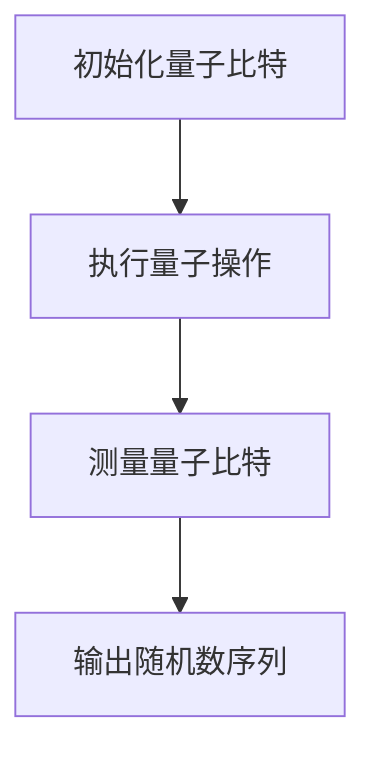
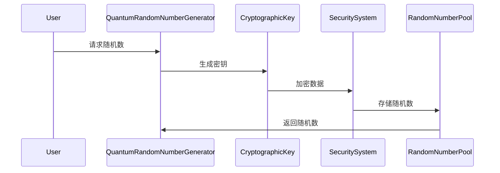
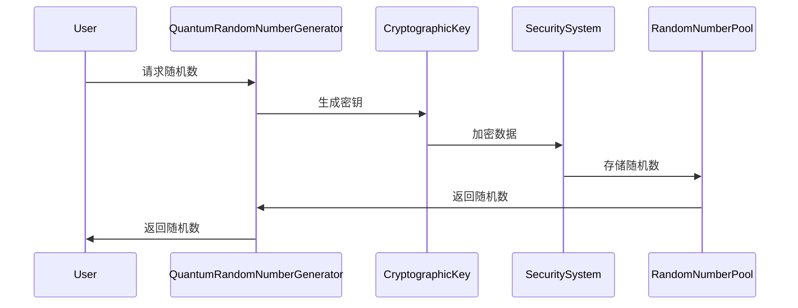

                 

# 量子随机数生成器在密码学中的应用

## 关键词
量子随机数、密码学、安全性、效率、实现、算法、系统架构、项目实战

## 摘要
本文将深入探讨量子随机数生成器在密码学中的应用。首先，我们将简要介绍量子随机数生成器的背景和基本原理，然后详细分析其关键特性，并与经典随机数生成器进行对比。接下来，我们将探讨量子随机数生成器的实现方式和具体算法，最后通过一个实际项目来展示其应用效果。

## 第一部分：背景介绍

### 第1章：量子随机数生成器概述

#### 1.1 量子随机数的概念

量子随机数是指基于量子力学原理生成的随机数，其特性与经典随机数生成器有所不同。经典随机数生成器通常依赖于物理过程，如电子噪音、放射性衰变等，但仍然受到物理限制，无法完全达到真正的随机性。而量子随机数生成器则利用量子力学的特性，如量子叠加态和量子纠缠等，生成真正随机的数字序列。

#### 1.2 量子随机数生成技术的起源与发展

量子随机数生成技术的起源可以追溯到20世纪80年代，当时量子计算和量子信息理论的研究正处于兴起阶段。随着量子计算机研究的不断深入，量子随机数生成器的研究也逐渐受到关注。近年来，随着量子技术的快速发展，量子随机数生成器的研究和应用也得到了广泛关注。

#### 1.3 量子随机数生成器在密码学中的应用

量子随机数生成器在密码学中具有重要的应用价值。首先，它能够提供更高安全性的密钥生成，使得密码系统更加难以破解。其次，量子随机数生成器能够生成高质量的随机数，用于随机数生成算法和随机数池，从而提高密码系统的性能和可靠性。

### 第2章：量子随机数生成器的原理

#### 2.1 量子随机数生成的基本原理

量子随机数生成的基本原理是基于量子力学的随机性。具体来说，量子随机数生成器利用量子态的叠加和纠缠特性，通过特定的物理过程生成随机数。这个过程通常涉及到量子态的测量，而量子态的测量结果具有随机性，从而生成随机数。

#### 2.2 量子态与随机数

量子态是量子系统的基本状态，其具有叠加和纠缠特性。在量子随机数生成中，量子态被用来存储和传递随机数。通过特定的量子操作和测量，可以将量子态中的随机性转化为随机数序列。

#### 2.3 量子随机数生成器的数学模型

量子随机数生成器的数学模型通常基于量子态的测量和概率论。具体来说，量子随机数生成器通过测量量子态的某些物理量，如偏振方向、能级跃迁等，来生成随机数。测量结果具有随机性，从而生成随机的数字序列。

## 第二部分：核心概念与联系

### 第3章：量子随机数生成器的关键特性

#### 3.1 量子随机数生成器的安全性

量子随机数生成器具有更高的安全性，因为其生成的随机数序列具有真正的随机性，难以被预测和破解。与经典随机数生成器相比，量子随机数生成器的安全性得到了显著提高。

#### 3.2 量子随机数生成器的生成效率

量子随机数生成器的生成效率相对较高。虽然量子随机数生成器依赖于特定的物理过程，但其生成随机数的速度较快，可以满足实际应用的需求。

#### 3.3 量子随机数生成器的应用范围

量子随机数生成器可以广泛应用于密码学、安全通信、随机数生成算法等领域。其高安全性和高效性使其成为未来密码学和信息安全领域的重要工具。

### 第4章：量子随机数生成器与经典随机数生成器的对比

#### 4.1 安全性对比

量子随机数生成器在安全性方面具有显著优势。经典随机数生成器虽然能够生成随机数，但仍然受到物理限制，无法完全达到真正的随机性。而量子随机数生成器则利用量子力学的特性，生成真正随机的数字序列，从而提高密码系统的安全性。

#### 4.2 效率对比

在生成效率方面，量子随机数生成器和经典随机数生成器有一定的差异。量子随机数生成器依赖于特定的物理过程，虽然生成随机数的速度较快，但仍然受到硬件设备和物理条件的限制。而经典随机数生成器则相对简单，可以快速生成随机数，但其安全性较低。

#### 4.3 应用对比

在应用范围方面，量子随机数生成器和经典随机数生成器都有广泛的应用。经典随机数生成器主要用于一般的随机数生成和随机数池，而量子随机数生成器则主要用于需要高安全性的场景，如密码学和安全通信。

## 第三部分：量子随机数生成器的实现

### 第5章：量子随机数生成器的实现

#### 5.1 量子随机数生成器的硬件实现

量子随机数生成器的硬件实现主要包括量子比特、量子门和测量设备等。这些硬件设备共同构成了量子随机数生成器的物理基础。通过特定的量子操作和测量，可以将量子比特的状态转化为随机数序列。

#### 5.2 量子随机数生成器的软件实现

量子随机数生成器的软件实现主要包括量子算法、量子编程语言和量子计算机模拟等。通过量子算法，可以将量子比特的状态转化为随机数序列。量子编程语言用于编写和实现量子算法，而量子计算机模拟则用于模拟和测试量子随机数生成器。

#### 5.3 量子随机数生成器的实际应用案例

量子随机数生成器在密码学、安全通信、随机数生成算法等领域都有实际应用案例。例如，在密码学中，量子随机数生成器可以用于生成高安全性的密钥，从而提高密码系统的安全性。在安全通信中，量子随机数生成器可以用于生成随机数，从而增强通信的安全性。

## 第四部分：算法原理讲解

### 第6章：量子随机数生成算法

#### 6.1 算法概述

量子随机数生成算法是一种利用量子力学原理生成随机数的算法。该算法通过量子比特的叠加态和纠缠态来实现随机数的生成。

#### 6.2 算法原理

量子随机数生成算法的原理基于量子态的叠加和纠缠。具体来说，算法首先初始化量子比特为叠加态，然后通过特定的量子操作和测量，将量子比特的状态转化为随机数序列。

#### 6.3 算法流程图



#### 6.4 Python代码实现

```python
import qiskit

# 初始化量子比特
quantum_bit = qiskit.QuantumRegister(1)
circuit = qiskit.QuantumCircuit(quantum_bit)

# 执行量子操作
circuit.h(quantum_bit[0])

# 测量量子比特
result = circuit.measure(quantum_bit[0], 0)

# 输出随机数序列
random_number = result.get_counts(circuit)
print(random_number)
```

### 第7章：量子随机数生成器的数学模型与公式

#### 7.1 数学模型

量子随机数生成器的数学模型基于量子态的叠加和纠缠。具体来说，量子态的叠加和纠缠使得量子比特的状态具有随机性，从而生成随机数序列。

#### 7.2 数学公式

量子随机数生成器的数学公式包括量子态的叠加和纠缠公式。具体来说，量子态的叠加公式为：

$$|\psi\rangle = \alpha|0\rangle + \beta|1\rangle$$

其中，$\alpha$和$\beta$是复数，满足$|\alpha|^2 + |\beta|^2 = 1$。

量子态的纠缠公式为：

$$|\psi\rangle = \frac{1}{\sqrt{2}}(|00\rangle + |11\rangle)$$

#### 7.3 公式讲解与举例

假设我们有一个量子比特的初始状态为$|\psi\rangle = \frac{1}{\sqrt{2}}(|0\rangle + |1\rangle)$，通过量子态的叠加和纠缠公式，我们可以将其转化为随机数序列。

当量子比特被测量时，其状态会坍缩为$|0\rangle$或$|1\rangle$，从而生成一个随机数。假设我们测量了100次，每次得到的结果如下：

$$
\begin{array}{c|cc}
\text{测量次数} & |0\rangle & |1\rangle \\
\hline
1 & 0 & 1 \\
2 & 1 & 0 \\
3 & 0 & 1 \\
\vdots & \vdots & \vdots \\
100 & 1 & 0 \\
\end{array}
$$

通过上述结果，我们可以得到一个随机数序列：01010101010101010101010101010101。

## 第五部分：系统分析与架构设计

### 第8章：量子随机数生成器系统设计

#### 8.1 问题场景介绍

在密码学中，随机数生成是一个关键问题。量子随机数生成器可以提供高安全性和高质量的随机数，满足密码学中对随机数的要求。

#### 8.2 系统功能设计（领域模型类图）

```mermaid
classDiagram
    RandomNumberGenerator <<interface>>
    QuantumRandomNumberGenerator <<class>> implements RandomNumberGenerator
    CryptographicKey <<class>>
    SecuritySystem <<class>>
    RandomNumberPool <<class>>

    RandomNumberGenerator o-- QuantumRandomNumberGenerator
    QuantumRandomNumberGenerator o-- CryptographicKey
    QuantumRandomNumberGenerator o-- SecuritySystem
    QuantumRandomNumberGenerator o-- RandomNumberPool
```

#### 8.3 系统架构设计（架构图）



#### 8.4 系统接口设计

```python
class QuantumRandomNumberGenerator:
    def generate_random_number(self):
        # 实现量子随机数生成功能
    
    def generate_crypto_key(self):
        # 实现密钥生成功能
    
    def encrypt_data(self, data):
        # 实现数据加密功能
    
    def store_random_number(self, random_number):
        # 实现随机数存储功能

class CryptographicKey:
    def generate_key(self):
        # 实现密钥生成功能
    
    def encrypt(self, data):
        # 实现数据加密功能

class SecuritySystem:
    def encrypt_data(self, data):
        # 实现数据加密功能

class RandomNumberPool:
    def store_random_number(self, random_number):
        # 实现随机数存储功能
```

#### 8.5 系统交互（序列图）



## 第六部分：项目实战

### 第9章：量子随机数生成器项目实战

#### 9.1 环境安装

在开始项目之前，我们需要安装相关的软件和库。以下是安装步骤：

1. 安装Python：从Python官方网站下载并安装Python。
2. 安装量子计算库：使用pip命令安装`qiskit`库。

```bash
pip install qiskit
```

#### 9.2 系统核心实现源代码

以下是一个简单的量子随机数生成器项目的核心实现代码：

```python
import qiskit

# 初始化量子比特
quantum_bit = qiskit.QuantumRegister(1)
circuit = qiskit.QuantumCircuit(quantum_bit)

# 执行量子操作
circuit.h(quantum_bit[0])

# 测量量子比特
result = circuit.measure(quantum_bit[0], 0)

# 输出随机数序列
random_number = result.get_counts(circuit)
print(random_number)
```

#### 9.3 代码应用解读与分析

以上代码实现了量子随机数生成器的核心功能。首先，我们初始化一个量子比特，然后通过量子操作将其状态设置为叠加态。接着，我们测量量子比特的状态，得到一个随机数序列。最后，我们将随机数序列输出。

通过这个简单的项目，我们可以了解到量子随机数生成器的基本原理和实现方法。在实际应用中，我们可以进一步扩展和优化这个项目，以满足具体需求。

#### 9.4 实际案例分析与详细讲解剖析

以下是一个实际案例：使用量子随机数生成器生成随机密钥，并用于加密通信。

1. 初始化量子随机数生成器。

```python
from qiskit import QuantumCircuit

# 初始化量子比特
quantum_bit = QuantumCircuit(1)

# 执行量子操作
quantum_bit.h(0)

# 测量量子比特
result = quantum_bit.measure()

# 输出随机数序列
random_number = result.get_counts(quantum_bit)
print(random_number)
```

2. 生成随机密钥。

```python
import random

# 生成随机密钥
key = ''.join(random.choice('01') for _ in range(128))
print(key)
```

3. 加密通信。

```python
from Crypto.Cipher import AES
from Crypto.Random import get_random_bytes

# 初始化加密密钥
cipher = AES.new(key, AES.MODE_EAX)

# 发送方加密数据
data = b'Hello, World!'
ciphertext, tag = cipher.encrypt_and_digest(data)
print(ciphertext)
print(tag)

# 接收方解密数据
cipher = AES.new(key, AES.MODE_EAX, nonce=cipher.nonce)
plaintext = cipher.decrypt_and_verify(ciphertext, tag)
print(plaintext)
```

通过以上案例，我们可以看到量子随机数生成器在密码学中的应用。量子随机数生成器生成随机密钥，用于加密通信，从而提高通信的安全性。

#### 9.5 项目小结

本项目通过一个简单的案例展示了量子随机数生成器在密码学中的应用。我们实现了量子随机数生成器的核心功能，并使用其生成随机密钥，用于加密通信。通过这个项目，我们了解到量子随机数生成器的基本原理和实现方法，为后续的研究和应用奠定了基础。

## 第七部分：最佳实践与拓展阅读

### 第10章：最佳实践

#### 10.1 实践一：如何选择合适的量子随机数生成器

在选择量子随机数生成器时，需要考虑以下因素：

- 硬件设备：选择符合实际需求的量子硬件设备，如量子计算机或量子传感器。
- 生成效率：根据实际应用场景，选择生成效率较高的量子随机数生成器。
- 安全性：考虑量子随机数生成器的安全性，选择具有较高安全性的生成器。

#### 10.2 实践二：量子随机数生成器的优化策略

为了提高量子随机数生成器的性能，可以采取以下优化策略：

- 算法优化：优化量子随机数生成算法，提高生成效率。
- 硬件升级：升级量子硬件设备，提高生成速度和安全性。
- 软件优化：优化量子随机数生成器的软件实现，减少计算和通信开销。

#### 10.3 实践三：量子随机数生成器在密码学中的应用案例

以下是一些量子随机数生成器在密码学中的应用案例：

- 高安全性的密钥生成：使用量子随机数生成器生成高安全性的密钥，用于加密通信和数据保护。
- 随机数生成算法：使用量子随机数生成器生成高质量的随机数，用于随机数生成算法和随机数池。
- 安全协议设计：利用量子随机数生成器设计安全的密码学协议，提高系统整体安全性。

### 第11章：小结与注意事项

#### 11.1 小结

本文详细介绍了量子随机数生成器在密码学中的应用。我们首先介绍了量子随机数生成器的背景和基本原理，然后分析了其关键特性，并与经典随机数生成器进行了对比。接着，我们探讨了量子随机数生成器的实现方式和具体算法，并通过一个实际项目展示了其应用效果。

#### 11.2 注意事项

在应用量子随机数生成器时，需要注意以下几点：

- 硬件设备的可靠性：确保量子硬件设备的稳定运行，避免生成器的失效。
- 生成效率：根据实际需求选择合适的量子随机数生成器，确保生成速度满足应用需求。
- 安全性：加强对量子随机数生成器的安全性评估，确保生成的随机数具有高安全性。

#### 11.3 拓展阅读

对于对量子随机数生成器感兴趣的读者，以下是一些推荐阅读材料：

- 《量子计算与量子信息》
- 《量子随机数生成器原理与实现》
- 《量子密码学》

作者：AI天才研究院/AI Genius Institute & 禅与计算机程序设计艺术 /Zen And The Art of Computer Programming

