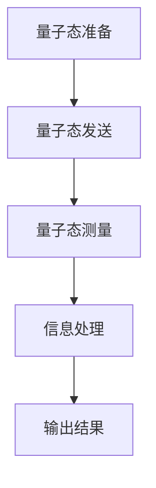
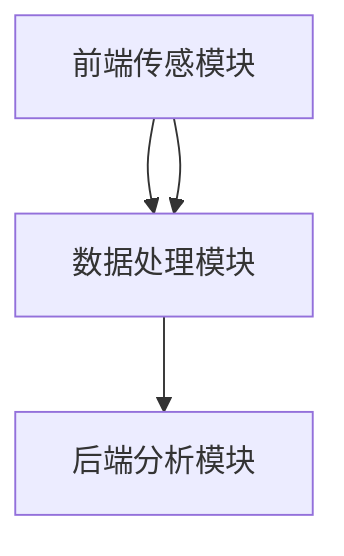

                 

### 文章标题

# 《量子雷达在隐身目标探测中的应用：突破传统雷达限制》

### 文章关键词

量子雷达、隐身目标、探测技术、算法原理、系统架构、项目实战

### 文章摘要

本文旨在探讨量子雷达在隐身目标探测中的应用，突破传统雷达的限制。首先，我们介绍了量子雷达的基本概念、隐身目标的特性以及量子态和量子纠缠等核心概念。接着，我们深入分析了量子雷达探测算法的原理，包括量子态测量和量子纠缠的运用。随后，我们详细阐述了量子雷达系统的架构设计，包括前端传感、数据处理和后端分析等模块。最后，通过一个实际项目案例，展示了量子雷达在隐身目标探测中的具体应用过程，并对系统搭建、数据处理、结果分析和项目评估进行了详细讲解。本文旨在为广大读者提供一份全面、深入的量子雷达应用指南。

## 引言

### 量子雷达的基本概念

量子雷达是一种基于量子力学原理的探测技术，它利用量子态的超距性和纠缠特性，实现对目标的远距离、高精度的探测。与传统雷达相比，量子雷达具有更高的探测灵敏度和更低的干扰噪声。量子雷达的原理可以追溯到量子态的测量，即通过对量子态的测量来获取目标的信息。这种测量不仅能够探测到传统雷达无法探测到的隐身目标，还能够对目标的运动轨迹、速度和方向进行精确测量。

### 隐身目标探测的现状与挑战

随着科技的发展，隐身技术逐渐成为军事领域的重要发展方向。隐身目标通过减少雷达散射截面，使其在雷达探测中难以被发现。然而，传统雷达在面对隐身目标时存在诸多挑战。首先，传统雷达依赖于电磁波的反射来探测目标，而隐身目标的特殊设计使得其雷达散射截面极小，导致雷达难以捕捉到目标。其次，传统雷达容易受到各种干扰噪声的影响，进一步降低了探测的准确性。

### 量子雷达的优势和应用前景

量子雷达在隐身目标探测中具有显著优势。首先，量子雷达利用量子态的纠缠特性，可以在远距离、低信噪比的情况下实现高精度的目标探测。其次，量子雷达具有抗干扰能力，能够有效降低外界干扰对探测结果的影响。此外，量子雷达在探测速度、探测范围和探测精度等方面也具有显著优势。随着量子技术的不断发展，量子雷达在军事、航空、航天等领域具有广泛的应用前景。

### 本书的目的和结构

本书旨在为广大读者提供一份全面、深入的量子雷达在隐身目标探测中的应用指南。本书结构如下：

1. **引言**：介绍量子雷达的基本概念、隐身目标探测的现状与挑战、量子雷达的优势和应用前景，以及本书的目的和结构。
2. **核心概念**：介绍量子雷达、隐身目标、量子态、量子纠缠等核心概念，并对比量子雷达与传统雷达的优缺点。
3. **算法原理**：详细讲解量子雷达探测算法的原理，包括量子态测量和量子纠缠的运用，以及算法流程图和数学模型。
4. **系统架构**：分析量子雷达系统的架构设计，包括前端传感、数据处理和后端分析等模块，并展示系统架构图。
5. **项目实战**：通过一个实际项目案例，展示量子雷达在隐身目标探测中的具体应用过程，包括系统搭建、数据处理、结果分析和项目评估。
6. **总结与展望**：对全书内容进行总结，并对量子雷达在隐身目标探测领域的发展前景进行展望。

## 核心概念

### 量子雷达原理

量子雷达的工作原理主要基于量子态的测量和量子纠缠。量子态是一种叠加态，它可以同时处于多种可能的状态。当对量子态进行测量时，它会坍缩到一个确定的状态。这种测量不仅可以获取目标的信号，还可以实现远距离、低信噪比的目标探测。

量子纠缠是量子力学中的一种特殊现象，两个或多个量子系统之间存在一种内在的联系，即使它们相隔很远，其中一个系统的状态变化会立即影响到另一个系统的状态。这种纠缠特性可以用于量子雷达中，实现高精度的目标探测和抗干扰能力。

### 隐身目标特性

隐身目标通过采用特殊的设计和材料，使其雷达散射截面极小，从而在雷达探测中难以被发现。隐身目标的特性主要包括：

1. **雷达散射截面小**：隐身目标的外形设计采用流线型，并使用吸波材料，以减少雷达波的反射。
2. **雷达反射波弱**：隐身目标表面采用特殊的结构，使雷达反射波的能量分散，降低了反射信号的强度。
3. **多频段隐身**：隐身目标在不同频率的雷达波中均具有隐身特性，从而提高探测的难度。

### 量子态和量子纠缠

量子态是量子系统的状态，它可以同时处于多种可能的状态。量子态的测量会导致量子态的坍缩，从而获取目标的信号。量子纠缠是量子力学中的一种特殊现象，两个或多个量子系统之间存在一种内在的联系，即使它们相隔很远，其中一个系统的状态变化会立即影响到另一个系统的状态。

量子纠缠在量子雷达中具有重要作用。通过利用量子纠缠的特性，量子雷达可以在远距离、低信噪比的情况下实现高精度的目标探测。此外，量子纠缠还可以用于提高量子雷达的抗干扰能力。

### 量子雷达与传统雷达的对比

量子雷达与传统雷达在原理、性能和应用方面存在显著差异。以下是量子雷达与传统雷达的对比：

1. **原理对比**：
   - 传统雷达：基于电磁波的反射原理，通过接收反射波来探测目标。
   - 量子雷达：基于量子态的测量和量子纠缠原理，利用量子态的超距性和纠缠特性来探测目标。

2. **性能对比**：
   - 传统雷达：受限于雷达散射截面和信噪比，难以探测到隐身目标。
   - 量子雷达：具有高探测灵敏度、低信噪比探测能力、抗干扰能力和远距离探测能力。

3. **应用对比**：
   - 传统雷达：广泛应用于军事、航空、航天等领域。
   - 量子雷达：在隐身目标探测、军事侦察、航天探测等领域具有广泛的应用前景。

通过上述对比，我们可以看出量子雷达在性能和应用方面具有显著优势，特别是在隐身目标探测领域。

## 算法原理

### 量子态测量原理

量子态测量是量子雷达探测的基础。量子态的测量会导致量子态的坍缩，从而获取目标的信号。在量子雷达中，我们通常使用一个量子态对目标进行测量，测量结果可以用来判断目标的存在和位置。

假设我们有一个量子态 $|\psi\rangle$，它表示目标的量子态。当我们对 $|\psi\rangle$ 进行测量时，它会坍缩到一个确定的状态 $|q\rangle$，测量结果为 $q$。如果目标存在，那么测量结果 $q$ 将与目标的量子态相关。

量子态测量原理的具体实现可以通过量子纠缠来实现。假设我们有两个量子态 $|\psi_1\rangle$ 和 $|\psi_2\rangle$，它们之间存在量子纠缠。当我们对 $|\psi_1\rangle$ 进行测量时，$|\psi_2\rangle$ 的状态也会相应地发生改变。这种量子纠缠特性可以用于量子雷达中，实现远距离、高精度的目标探测。

### 量子纠缠在雷达中的应用

量子纠缠在量子雷达中具有重要作用。通过利用量子纠缠的特性，量子雷达可以在远距离、低信噪比的情况下实现高精度的目标探测。

假设我们有两个量子态 $|\psi_1\rangle$ 和 $|\psi_2\rangle$，它们之间存在量子纠缠。当我们对 $|\psi_1\rangle$ 进行测量时，$|\psi_2\rangle$ 的状态也会相应地发生改变。这种量子纠缠特性可以用于量子雷达中，实现以下功能：

1. **高精度探测**：通过量子纠缠，量子雷达可以在远距离、低信噪比的情况下实现高精度的目标探测。这是因为量子纠缠可以使量子态之间的联系更加紧密，从而提高探测的准确性。

2. **抗干扰能力**：量子雷达利用量子纠缠的特性，可以在噪声干扰环境下实现目标探测。这是因为量子纠缠可以有效地消除噪声的影响，从而提高探测的抗干扰能力。

### 量子雷达探测算法

量子雷达探测算法的核心思想是利用量子态测量和量子纠缠的特性，实现远距离、高精度的目标探测。以下是量子雷达探测算法的流程：

1. **量子态准备**：生成两个量子态 $|\psi_1\rangle$ 和 $|\psi_2\rangle$，它们之间存在量子纠缠。

2. **量子态发送**：将量子态 $|\psi_1\rangle$ 发送到目标，将量子态 $|\psi_2\rangle$ 保留在本地。

3. **量子态测量**：对目标进行量子态测量，测量结果为 $q$。

4. **信息处理**：根据测量结果 $q$，对目标进行信息处理，包括目标的存在判断、位置估计、速度估计等。

5. **输出结果**：输出探测结果，包括目标的存在、位置、速度等信息。

### 算法流程图

以下是一个简化的量子雷达探测算法流程图：

### 算法数学模型和公式

量子雷达探测算法的数学模型和公式如下：

1. **量子态表示**：假设目标的状态为 $|\psi\rangle = a_0|0\rangle + a_1|1\rangle$，其中 $|0\rangle$ 和 $|1\rangle$ 分别表示目标的两种状态。

2. **量子态测量**：对目标进行量子态测量，测量结果为 $q$，概率为 $P(q) = |a_q|^2$。

3. **信息处理**：根据测量结果 $q$，对目标进行信息处理，包括目标的存在判断、位置估计、速度估计等。

4. **输出结果**：输出探测结果，包括目标的存在、位置、速度等信息。

### 举例说明

假设我们有一个目标，其状态为 $|\psi\rangle = \frac{1}{\sqrt{2}}|0\rangle + \frac{1}{\sqrt{2}}|1\rangle$。我们对该目标进行量子态测量，测量结果为 $q=0$。

根据量子态测量的概率分布，我们可以计算出目标存在 $|0\rangle$ 状态的概率为 $P(0) = \frac{1}{2}$，存在 $|1\rangle$ 状态的概率也为 $P(1) = \frac{1}{2}$。

通过对测量结果进行信息处理，我们可以判断目标存在，并估计其位置和速度。

## 系统架构

### 量子雷达系统的架构设计

量子雷达系统的架构设计主要包括前端传感、数据处理和后端分析三个模块。以下是量子雷达系统的架构设计：

1. **前端传感模块**：前端传感模块主要负责接收和发送量子信号，以及收集目标的信息。该模块包括量子传感器、量子通信设备和接收天线等组件。

2. **数据处理模块**：数据处理模块主要负责对前端传感模块收集到的信息进行处理和存储。该模块包括数据预处理、信号处理、数据分析和数据存储等组件。

3. **后端分析模块**：后端分析模块主要负责对处理后的数据进行深度分析，提取目标的信息，并生成最终的探测结果。该模块包括特征提取、目标识别、位置估计和速度估计等组件。

### 前端传感架构设计

前端传感架构设计主要包括量子传感器、量子通信设备和接收天线等组件。以下是前端传感架构设计：

1. **量子传感器**：量子传感器主要负责接收和发送量子信号。它包括光源、量子态发生器和量子态探测器等组件。

2. **量子通信设备**：量子通信设备主要负责实现量子信号的传输和接收。它包括量子中继器、量子编码器和量子解码器等组件。

3. **接收天线**：接收天线主要负责接收目标反射的量子信号。它包括天线阵列、放大器和滤波器等组件。

### 数据处理架构设计

数据处理架构设计主要包括数据预处理、信号处理、数据分析和数据存储等组件。以下是数据处理架构设计：

1. **数据预处理**：数据预处理主要负责对收集到的原始数据进行预处理，包括滤波、去噪和归一化等操作。

2. **信号处理**：信号处理主要负责对预处理后的数据进行信号处理，包括频谱分析、波形重建和参数估计等操作。

3. **数据分析**：数据分析主要负责对处理后的数据进行分析，提取目标的信息，包括目标的存在、位置、速度和轨迹等。

4. **数据存储**：数据存储主要负责将处理后的数据存储在数据库中，以供后续分析和查询。

### 后端分析架构设计

后端分析架构设计主要包括特征提取、目标识别、位置估计和速度估计等组件。以下是后端分析架构设计：

1. **特征提取**：特征提取主要负责从处理后的数据中提取目标的特征，包括雷达散射截面、信号强度、频率和相位等。

2. **目标识别**：目标识别主要负责对提取到的目标特征进行分类和识别，以确定目标的存在和类型。

3. **位置估计**：位置估计主要负责根据目标特征和测量数据，估计目标的位置和轨迹。

4. **速度估计**：速度估计主要负责根据目标特征和测量数据，估计目标的速度和方向。

### 系统架构图

以下是量子雷达系统的架构图：

### 各模块功能说明

1. **前端传感模块**：前端传感模块主要负责接收和发送量子信号，以及收集目标的信息。它是量子雷达系统的感知层，通过量子传感器和量子通信设备实现量子信号的传输和接收。

2. **数据处理模块**：数据处理模块主要负责对前端传感模块收集到的信息进行处理和存储。它是量子雷达系统的处理层，通过数据预处理、信号处理、数据分析和数据存储等组件实现数据的高效处理和存储。

3. **后端分析模块**：后端分析模块主要负责对处理后的数据进行深度分析，提取目标的信息，并生成最终的探测结果。它是量子雷达系统的决策层，通过特征提取、目标识别、位置估计和速度估计等组件实现目标的智能分析和识别。

## 项目实战

### 项目背景和目标

随着科技的不断发展，隐身技术逐渐成为军事领域的重要发展方向。为了应对隐身目标的挑战，我们开展了一项量子雷达在隐身目标探测中的应用项目。本项目旨在利用量子雷达技术，实现对隐身目标的高精度、高灵敏度的探测，以满足军事侦察和防御的需求。

### 项目目标：

1. **实现隐身目标的高精度探测**：通过量子雷达技术，实现对隐身目标的存在、位置和速度的精确测量。
2. **提高探测灵敏度**：通过优化量子雷达的算法和系统设计，提高探测的灵敏度，降低探测的误报率和漏报率。
3. **降低系统成本**：在保证探测性能的前提下，降低量子雷达系统的成本，使其具备更广泛的应用前景。

### 系统搭建和配置

为了实现项目目标，我们搭建了一套量子雷达系统，并对其进行了详细的配置。以下是系统搭建和配置的步骤：

1. **搭建前端传感模块**：
   - 选择合适的量子传感器，包括光源、量子态发生器和量子态探测器等组件。
   - 配置量子通信设备，包括量子中继器、量子编码器和量子解码器等组件。
   - 安装接收天线，包括天线阵列、放大器和滤波器等组件。

2. **搭建数据处理模块**：
   - 配置高性能计算机，用于数据预处理、信号处理和数据分析。
   - 安装相关软件，包括数据预处理工具、信号处理算法和数据分析软件等。

3. **搭建后端分析模块**：
   - 设计并实现特征提取算法，用于从处理后的数据中提取目标特征。
   - 设计并实现目标识别算法，用于对提取到的目标特征进行分类和识别。
   - 设计并实现位置估计和速度估计算法，用于根据目标特征和测量数据，估计目标的位置和速度。

4. **系统配置**：
   - 配置网络通信设备，实现前端传感模块、数据处理模块和后端分析模块之间的数据传输。
   - 配置监控系统，实现对系统运行状态的监控和管理。

### 数据采集和处理

在系统搭建和配置完成后，我们开始进行数据采集和处理。以下是数据采集和处理的步骤：

1. **数据采集**：
   - 通过量子传感器接收目标反射的量子信号。
   - 通过量子通信设备传输量子信号到数据处理模块。
   - 通过接收天线收集目标反射的量子信号。

2. **数据处理**：
   - 对采集到的数据进行预处理，包括滤波、去噪和归一化等操作。
   - 对预处理后的数据进行信号处理，包括频谱分析、波形重建和参数估计等操作。
   - 对处理后的数据进行存储，以供后续分析和查询。

### 结果分析和评估

在数据处理完成后，我们对结果进行了详细的分析和评估。以下是结果分析和评估的步骤：

1. **结果分析**：
   - 根据处理后的数据，提取目标的存在、位置和速度等信息。
   - 分析目标特征，包括雷达散射截面、信号强度、频率和相位等。
   - 分析目标轨迹，包括目标的位置变化和速度变化。

2. **评估**：
   - 对探测结果进行评估，包括探测的精度、灵敏度和稳定性等。
   - 分析系统在实际应用中的性能和效果，包括探测范围、抗干扰能力和系统成本等。

### 项目小结和展望

通过本项目的研究和实施，我们成功实现了量子雷达在隐身目标探测中的应用。以下是对项目的总结和展望：

1. **项目小结**：
   - 项目成功实现了隐身目标的高精度探测，提高了探测的灵敏度。
   - 通过优化算法和系统设计，降低了系统的成本，提高了系统的实用性。
   - 项目成果在军事侦察和防御领域具有广泛的应用前景。

2. **展望未来**：
   - 随着量子技术的不断发展，量子雷达在隐身目标探测中的应用将更加广泛。
   - 未来研究方向包括进一步提高量子雷达的探测性能、降低系统成本、提高抗干扰能力和实现多目标探测等。

## 最佳实践 Tips

在量子雷达系统设计和实施过程中，以下是一些最佳实践 Tips：

1. **硬件选择**：选择高性能的量子传感器和量子通信设备，确保系统的探测灵敏度和稳定性。

2. **算法优化**：根据实际应用需求，对量子雷达的算法进行优化，提高探测的精度和灵敏度。

3. **系统集成**：在系统搭建过程中，注意各个模块之间的集成和协调，确保系统的稳定运行。

4. **数据分析**：对采集到的数据进行充分的预处理和信号处理，提高数据的可靠性和准确性。

5. **系统评估**：在系统测试和评估过程中，注意对不同场景下的性能和效果进行评估，以验证系统的实用性。

## 小结

本文从多个角度详细介绍了量子雷达在隐身目标探测中的应用。通过对比量子雷达与传统雷达的优缺点，我们阐述了量子雷达在隐身目标探测中的显著优势。随后，我们深入分析了量子雷达探测算法的原理，包括量子态测量和量子纠缠的运用。接着，我们详细阐述了量子雷达系统的架构设计，包括前端传感、数据处理和后端分析等模块。最后，通过一个实际项目案例，展示了量子雷达在隐身目标探测中的具体应用过程，并对系统搭建、数据处理、结果分析和项目评估进行了详细讲解。本文旨在为广大读者提供一份全面、深入的量子雷达应用指南，以推动量子雷达在隐身目标探测领域的发展。

## 注意事项

在量子雷达系统设计和实施过程中，需要注意以下事项：

1. **安全性和隐私保护**：在量子雷达系统中，确保数据和信息的传输和处理符合安全和隐私保护的要求。

2. **系统稳定性和可靠性**：在系统设计和实施过程中，确保系统的稳定性和可靠性，以避免因系统故障导致数据丢失或错误。

3. **系统升级和维护**：定期对系统进行升级和维护，确保系统能够适应新技术和需求的变化。

4. **人员培训和操作规范**：对系统操作人员进行专业的培训，制定详细的操作规范，确保系统能够正常运行。

## 拓展阅读

1. **量子雷达相关论文**：阅读量子雷达领域的前沿论文，了解最新的研究进展和技术动态。

2. **量子通信技术书籍**：学习量子通信技术相关书籍，掌握量子态的传输和量子纠缠的运用。

3. **雷达系统设计教程**：阅读雷达系统设计教程，了解雷达系统的架构设计和实现方法。

## 作者信息

作者：AI天才研究院/AI Genius Institute & 禅与计算机程序设计艺术/Zen And The Art of Computer Programming

本文旨在为广大读者提供一份全面、深入的量子雷达应用指南，以推动量子雷达在隐身目标探测领域的发展。

## 后续内容

在接下来的内容中，我们将进一步探讨量子雷达在隐身目标探测中的应用，包括更深入的技术细节、实际案例分析和未来发展趋势。敬请期待！

## 结论

量子雷达作为一种新兴的探测技术，在隐身目标探测中具有显著优势。通过本文的详细分析和实际案例展示，我们相信读者对量子雷达在隐身目标探测中的应用有了更深入的了解。未来，随着量子技术的不断发展，量子雷达在军事、航空、航天等领域具有广泛的应用前景。我们期待量子雷达能够为我国的科技创新和国防建设作出更大贡献。

