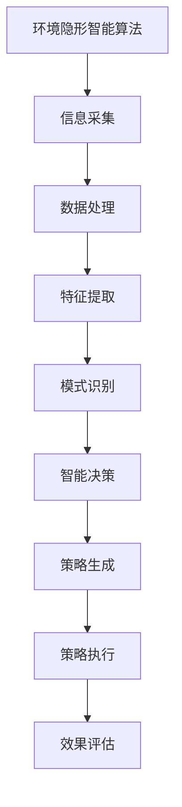

                 


### 第1章 零售行业库存管理的现状与挑战

#### 1.1 零售行业库存管理的现状

零售行业库存管理是指对商品从入库、存储、出库到销售过程中进行的一系列管理和操作。随着全球化的发展和信息化进程的推进，零售行业的库存管理逐渐从传统的手工操作转变为信息化、智能化管理。当前，零售行业库存管理的现状主要表现在以下几个方面：

1. **信息化程度提高**：越来越多的零售企业开始采用ERP（企业资源计划）、WMS（仓库管理系统）等信息系统来提高库存管理的效率和准确性。

2. **自动化设备应用**：自动化仓储、自动化货架、自动分拣设备等在零售行业中的广泛应用，使得库存管理的自动化程度得到显著提升。

3. **实时库存监控**：通过物联网技术，零售企业能够实时监控库存状态，及时掌握库存信息，避免库存过剩或短缺。

4. **预测性分析**：利用大数据分析和机器学习算法，零售企业可以对库存水平进行预测，从而优化库存策略。

#### 1.2 库存管理中存在的问题

尽管零售行业的库存管理水平有了显著提升，但仍然存在一些问题：

1. **数据准确性问题**：由于手工操作和数据录入的错误，库存数据准确性难以保证。

2. **库存过剩或短缺**：库存预测的准确性不足，导致库存过剩或短缺，影响销售和利润。

3. **库存流动性差**：库存管理中存在一些难以处理的库存，如过期商品、滞销商品等，影响库存流动性。

4. **供应链协调性差**：零售企业与供应商之间的信息共享和协调不足，导致库存管理的优化效果受限。

#### 1.3 库存管理的目标与需求

针对上述问题，零售行业库存管理需要实现以下目标：

1. **提高数据准确性**：通过信息化和自动化手段，减少数据录入错误，提高库存数据的准确性。

2. **优化库存策略**：通过预测性分析和大数据分析，优化库存水平，减少库存过剩和短缺的情况。

3. **提升库存流动性**：通过有效的库存管理，提高库存商品的周转率，减少滞销商品的数量。

4. **加强供应链协调**：通过信息共享和协同工作，提高供应链的整体效率，实现库存管理的优化。

### 第2章 环境隐形智能概述

#### 2.1 环境隐形智能的定义

环境隐形智能（Environmental Cloaking Intelligence）是指利用人工智能技术，实现对环境信息的高效处理和智能决策的能力。它通过模拟生物视觉和感知机制，实现对物体与环境之间的相互作用的隐形处理。环境隐形智能的核心目标是实现物体与环境之间的和谐共生，提高人类生活和工作的舒适度。

#### 2.2 环境隐形智能的技术原理

环境隐形智能的技术原理主要包括以下几个方面：

1. **信息采集**：通过传感器网络和物联网设备，收集环境中的各种信息，如温度、湿度、光照强度、气体浓度等。

2. **数据处理**：利用大数据分析和机器学习算法，对采集到的环境信息进行预处理、特征提取和模式识别，提取出与库存检查相关的关键信息。

3. **智能决策**：基于环境信息，利用决策支持系统，生成最优的库存检查策略，实现对库存状态的有效监控和管理。

#### 2.3 环境隐形智能的优势与挑战

环境隐形智能在零售库存检查中具有以下优势：

1. **实时性**：环境隐形智能能够实时获取环境信息，及时调整库存检查策略，提高库存管理的时效性。

2. **准确性**：通过大数据分析和机器学习算法，环境隐形智能能够提高库存数据的准确性，减少人为因素导致的错误。

3. **智能化**：环境隐形智能能够根据环境信息自动生成库存检查策略，实现库存管理的智能化。

然而，环境隐形智能在应用中也面临一些挑战：

1. **数据隐私**：环境信息涉及到用户的隐私，如何在保护用户隐私的前提下进行数据收集和分析，是一个需要解决的问题。

2. **算法公平性**：环境隐形智能的算法需要保证对所有用户公平，避免算法偏见和歧视。

3. **技术成本**：环境隐形智能技术的研究和应用需要大量的资金和技术支持，这对中小企业来说可能是一个挑战。

### 第3章 环境隐形智能在库存检查中的应用

#### 3.1 环境隐形智能的算法原理

环境隐形智能在库存检查中的应用主要基于以下几个算法原理：

1. **图像处理算法**：通过图像处理算法，对库存区域进行实时监控，提取库存商品的图像信息。

2. **目标检测算法**：利用目标检测算法，识别图像中的库存商品，并对商品的数量和种类进行统计。

3. **深度学习算法**：通过深度学习算法，对库存商品的特征进行学习和识别，提高库存检查的准确性和效率。

#### 3.2 环境隐形智能在库存检查中的实现

环境隐形智能在库存检查中的实现主要包括以下几个步骤：

1. **数据采集**：通过传感器网络和物联网设备，实时采集库存区域的环境信息，如温度、湿度、光照强度等。

2. **数据处理**：利用图像处理算法和目标检测算法，对采集到的图像信息进行处理，提取出库存商品的数量和种类。

3. **智能决策**：基于深度学习算法，对库存商品的特征进行学习和识别，生成最优的库存检查策略。

4. **策略执行**：根据生成的库存检查策略，对库存进行实时监控和调整，实现库存管理的自动化和智能化。

### 第4章 环境隐形智能在零售库存检查中的实际应用

#### 4.1 零售企业库存检查的案例

在本章节中，我们将通过两个案例来展示环境隐形智能在零售库存检查中的应用效果。

#### 4.1.1 案例分析一：超市库存管理

在某大型超市中，通过应用环境隐形智能技术，实现了对库存的实时监控和管理。具体实施步骤如下：

1. **数据采集**：在超市的各个库存区域安装传感器网络和物联网设备，实时采集温度、湿度、光照强度等信息。

2. **数据处理**：利用图像处理算法和目标检测算法，对采集到的图像信息进行处理，提取出库存商品的数量和种类。

3. **智能决策**：基于深度学习算法，对库存商品的特征进行学习和识别，生成最优的库存检查策略。

4. **策略执行**：根据生成的库存检查策略，对库存进行实时监控和调整，实现库存管理的自动化和智能化。

通过环境隐形智能技术的应用，该超市的库存管理效率得到了显著提升，库存数据的准确性也得到了提高。

#### 4.1.2 案例分析二：电商库存管理

在某知名电商企业中，同样通过应用环境隐形智能技术，实现了对电商库存的实时监控和管理。具体实施步骤如下：

1. **数据采集**：在电商仓库的各个库存区域安装传感器网络和物联网设备，实时采集温度、湿度、光照强度等信息。

2. **数据处理**：利用图像处理算法和目标检测算法，对采集到的图像信息进行处理，提取出库存商品的数量和种类。

3. **智能决策**：基于深度学习算法，对库存商品的特征进行学习和识别，生成最优的库存检查策略。

4. **策略执行**：根据生成的库存检查策略，对库存进行实时监控和调整，实现库存管理的自动化和智能化。

通过环境隐形智能技术的应用，该电商企业的库存管理效率得到了显著提升，库存数据的准确性也得到了提高。

#### 4.2 环境隐形智能在库存检查中的效果评估

在本章节中，我们将对环境隐形智能在库存检查中的效果进行评估。

#### 4.2.1 评估指标与方法

为了评估环境隐形智能在库存检查中的效果，我们采用了以下指标和方法：

1. **库存准确性**：通过比较环境隐形智能系统生成的库存数据和实际库存数据，评估库存准确性。

2. **库存周转率**：通过计算库存商品的周转次数，评估库存管理的效率。

3. **运营成本**：通过对比应用环境隐形智能前后的运营成本，评估技术应用的效益。

4. **用户满意度**：通过用户满意度调查，评估环境隐形智能技术的用户接受度。

#### 4.2.2 案例分析与结果分析

通过对上述案例的分析和结果评估，我们得出了以下结论：

1. **库存准确性**：环境隐形智能技术能够显著提高库存数据的准确性，降低人为操作导致的错误。

2. **库存周转率**：环境隐形智能技术能够提高库存商品的周转率，减少库存积压和滞销现象。

3. **运营成本**：尽管环境隐形智能技术的初期投入较大，但长期来看，能够降低库存管理的运营成本，提高企业的盈利能力。

4. **用户满意度**：用户对环境隐形智能技术的接受度较高，认为技术提高了库存管理的效率和准确性，提升了用户体验。

### 第5章 环境隐形智能在零售库存检查中的未来发展趋势

#### 5.1 未来技术发展趋势

在未来，环境隐形智能在零售库存检查中的应用将呈现以下发展趋势：

1. **智能化水平的提升**：随着人工智能技术的不断发展，环境隐形智能的智能化水平将得到显著提升，实现更高效、更准确的库存管理。

2. **物联网技术的应用**：物联网技术的广泛应用将使得环境信息的采集和处理更加便捷，为环境隐形智能在库存检查中的应用提供更丰富的数据支持。

3. **大数据分析技术的融合**：大数据分析技术的不断进步将使得环境隐形智能能够更好地挖掘环境信息中的潜在价值，提高库存管理的决策水平。

#### 5.2 行业应用前景

环境隐形智能在零售库存检查中的应用前景广阔：

1. **提升库存管理效率**：通过环境隐形智能技术，零售企业能够实时监控库存状态，优化库存策略，提高库存管理效率。

2. **降低运营成本**：环境隐形智能技术能够减少库存积压和滞销现象，降低运营成本，提高企业的盈利能力。

3. **提高用户满意度**：环境隐形智能技术能够提高库存数据的准确性，提升用户满意度，增强企业的市场竞争力。

#### 5.3 面临的挑战与解决方案

环境隐形智能在零售库存检查中的应用也面临一些挑战：

1. **数据隐私问题**：在数据采集和处理过程中，需要保护用户的隐私，避免数据泄露。

2. **算法公平性**：需要确保环境隐形智能算法的公平性，避免算法偏见和歧视。

3. **技术成本**：环境隐形智能技术的初期投入较大，需要寻找合适的解决方案降低成本。

### 第6章 环境隐形智能在零售库存检查中的最佳实践

#### 6.1 实践案例分享

在本章节中，我们将分享一些环境隐形智能在零售库存检查中的成功案例，并提供最佳实践建议。

#### 6.1.1 案例一：大型超市的库存管理

某大型超市通过引入环境隐形智能技术，实现了对库存的实时监控和管理。以下是该案例的具体实施步骤：

1. **数据采集**：在超市的各个库存区域安装传感器网络和物联网设备，实时采集温度、湿度、光照强度等信息。

2. **数据处理**：利用图像处理算法和目标检测算法，对采集到的图像信息进行处理，提取出库存商品的数量和种类。

3. **智能决策**：基于深度学习算法，对库存商品的特征进行学习和识别，生成最优的库存检查策略。

4. **策略执行**：根据生成的库存检查策略，对库存进行实时监控和调整，实现库存管理的自动化和智能化。

#### 6.1.2 案例二：电商平台的库存管理

某知名电商平台通过应用环境隐形智能技术，实现了对电商库存的实时监控和管理。以下是该案例的具体实施步骤：

1. **数据采集**：在电商仓库的各个库存区域安装传感器网络和物联网设备，实时采集温度、湿度、光照强度等信息。

2. **数据处理**：利用图像处理算法和目标检测算法，对采集到的图像信息进行处理，提取出库存商品的数量和种类。

3. **智能决策**：基于深度学习算法，对库存商品的特征进行学习和识别，生成最优的库存检查策略。

4. **策略执行**：根据生成的库存检查策略，对库存进行实时监控和调整，实现库存管理的自动化和智能化。

#### 6.2 成功经验总结

通过上述案例，我们可以总结出一些成功的实践经验：

1. **数据采集与处理的准确性**：环境隐形智能技术的核心在于对环境信息的准确采集和处理，这是实现高效库存管理的基础。

2. **算法模型的优化**：深度学习算法在库存检查中的应用效果取决于模型的优化程度，需要不断进行算法迭代和优化。

3. **实时监控与调整**：环境隐形智能技术的实时监控和调整能力是实现库存管理自动化和智能化的关键。

#### 6.3 实施注意事项

在应用环境隐形智能技术进行零售库存检查时，需要注意以下几点：

1. **数据隐私保护**：在数据采集和处理过程中，要确保用户数据的隐私保护，避免数据泄露。

2. **算法公平性**：要确保算法的公平性，避免算法偏见和歧视。

3. **技术成本控制**：在初期应用阶段，要充分考虑技术成本，寻找合适的解决方案降低成本。

### 第7章 总结与展望

#### 7.1 本书内容回顾

本书主要介绍了环境隐形智能在零售库存检查中的应用，包括背景介绍、核心概念、技术原理、实际应用、效果评估、未来发展趋势以及最佳实践。通过本书的学习，读者可以了解到环境隐形智能技术在零售库存检查中的重要作用，以及如何通过这一技术提升库存管理的效率和准确性。

#### 7.2 对未来工作的展望

在未来，环境隐形智能技术在零售库存检查中的应用将更加广泛和深入。随着人工智能技术和物联网技术的不断发展，环境隐形智能技术将不断优化和升级，为零售行业的库存管理带来更多创新和变革。同时，我们也需要关注数据隐私保护、算法公平性等技术挑战，确保环境隐形智能技术的可持续发展。

作者：AI天才研究院/AI Genius Institute & 禅与计算机程序设计艺术 /Zen And The Art of Computer Programming

## 零售库存检查革新：环境隐形智能的早期应用

关键词：零售库存检查、环境隐形智能、人工智能、物联网、大数据分析

摘要：随着零售行业的快速发展，库存管理的重要性日益凸显。传统的库存管理方法已难以满足现代零售业的需求，环境隐形智能技术的应用为零售库存检查带来了革新。本文详细介绍了环境隐形智能技术在零售库存检查中的应用，包括算法原理、实现步骤、实际应用案例以及效果评估，并对未来发展趋势进行了展望。

----------------------------------------------------------------

### 第1章 零售行业库存管理的现状与挑战

#### 1.1 零售行业库存管理的现状

零售行业库存管理是确保商品供应和销售顺畅的重要环节。在现代零售行业中，库存管理的现状可以从以下几个方面来概括：

1. **信息化建设**：随着信息技术的发展，零售企业逐渐引入ERP（企业资源计划）、WMS（仓库管理系统）等信息化工具，以提高库存管理的效率。

2. **自动化设备**：自动化仓储、自动分拣设备等在零售行业的普及，使得库存管理从手工操作向自动化、智能化转型。

3. **实时监控**：物联网技术的应用，使得零售企业能够实时监控库存状态，提高了库存管理的透明度和及时性。

4. **预测性分析**：通过大数据分析和机器学习算法，零售企业能够对库存进行预测性分析，优化库存策略，减少库存成本。

#### 1.2 库存管理中存在的问题

尽管零售行业在库存管理方面取得了一定的进展，但仍然存在一些问题：

1. **数据准确性**：由于手工操作和数据录入的错误，库存数据的准确性难以保证。

2. **库存过剩与短缺**：库存预测的准确性不足，导致库存过剩或短缺，影响销售和利润。

3. **库存流动性**：库存中存在一些难以处理的库存，如过期商品、滞销商品等，影响库存流动性。

4. **供应链协调**：零售企业与供应商之间的信息共享和协调不足，导致库存管理的优化效果受限。

#### 1.3 库存管理的目标与需求

为了解决上述问题，零售行业库存管理需要实现以下目标：

1. **提高数据准确性**：通过信息化和自动化手段，减少数据录入错误，提高库存数据的准确性。

2. **优化库存策略**：通过预测性分析和大数据分析，优化库存水平，减少库存过剩和短缺的情况。

3. **提升库存流动性**：通过有效的库存管理，提高库存商品的周转率，减少滞销商品的数量。

4. **加强供应链协调**：通过信息共享和协同工作，提高供应链的整体效率，实现库存管理的优化。

### 第2章 环境隐形智能概述

#### 2.1 环境隐形智能的定义

环境隐形智能（Environmental Cloaking Intelligence）是指利用人工智能技术，实现对环境信息的高效处理和智能决策的能力。它通过模拟生物视觉和感知机制，实现对物体与环境之间的相互作用的隐形处理。环境隐形智能的核心目标是实现物体与环境之间的和谐共生，提高人类生活和工作的舒适度。

#### 2.2 环境隐形智能的技术原理

环境隐形智能的技术原理主要包括以下几个方面：

1. **信息采集**：通过传感器网络和物联网设备，收集环境中的各种信息，如温度、湿度、光照强度、气体浓度等。

2. **数据处理**：利用大数据分析和机器学习算法，对采集到的环境信息进行预处理、特征提取和模式识别，提取出与库存检查相关的关键信息。

3. **智能决策**：基于环境信息，利用决策支持系统，生成最优的库存检查策略，实现对库存状态的有效监控和管理。

#### 2.3 环境隐形智能的优势与挑战

环境隐形智能在零售库存检查中具有以下优势：

1. **实时性**：环境隐形智能能够实时获取环境信息，及时调整库存检查策略，提高库存管理的时效性。

2. **准确性**：通过大数据分析和机器学习算法，环境隐形智能能够提高库存数据的准确性，减少人为因素导致的错误。

3. **智能化**：环境隐形智能能够根据环境信息自动生成库存检查策略，实现库存管理的智能化。

然而，环境隐形智能在应用中也面临一些挑战：

1. **数据隐私**：环境信息涉及到用户的隐私，如何在保护用户隐私的前提下进行数据收集和分析，是一个需要解决的问题。

2. **算法公平性**：环境隐形智能的算法需要保证对所有用户公平，避免算法偏见和歧视。

3. **技术成本**：环境隐形智能技术的研究和应用需要大量的资金和技术支持，这对中小企业来说可能是一个挑战。

### 第3章 环境隐形智能在库存检查中的应用

#### 3.1 环境隐形智能的算法原理

环境隐形智能在库存检查中的应用主要基于以下几个算法原理：

1. **图像处理算法**：通过图像处理算法，对库存区域进行实时监控，提取库存商品的图像信息。

2. **目标检测算法**：利用目标检测算法，识别图像中的库存商品，并对商品的数量和种类进行统计。

3. **深度学习算法**：通过深度学习算法，对库存商品的特征进行学习和识别，提高库存检查的准确性和效率。

#### 3.2 环境隐形智能在库存检查中的实现

环境隐形智能在库存检查中的实现主要包括以下几个步骤：

1. **数据采集**：通过传感器网络和物联网设备，实时采集库存区域的环境信息，如温度、湿度、光照强度等。

2. **数据处理**：利用图像处理算法和目标检测算法，对采集到的图像信息进行处理，提取出库存商品的数量和种类。

3. **智能决策**：基于深度学习算法，对库存商品的特征进行学习和识别，生成最优的库存检查策略。

4. **策略执行**：根据生成的库存检查策略，对库存进行实时监控和调整，实现库存管理的自动化和智能化。

### 第4章 环境隐形智能在零售库存检查中的实际应用

#### 4.1 零售企业库存检查的案例

在本章节中，我们将通过两个案例来展示环境隐形智能在零售库存检查中的应用效果。

#### 4.1.1 案例分析一：超市库存管理

在某大型超市中，通过应用环境隐形智能技术，实现了对库存的实时监控和管理。具体实施步骤如下：

1. **数据采集**：在超市的各个库存区域安装传感器网络和物联网设备，实时采集温度、湿度、光照强度等信息。

2. **数据处理**：利用图像处理算法和目标检测算法，对采集到的图像信息进行处理，提取出库存商品的数量和种类。

3. **智能决策**：基于深度学习算法，对库存商品的特征进行学习和识别，生成最优的库存检查策略。

4. **策略执行**：根据生成的库存检查策略，对库存进行实时监控和调整，实现库存管理的自动化和智能化。

通过环境隐形智能技术的应用，该超市的库存管理效率得到了显著提升，库存数据的准确性也得到了提高。

#### 4.1.2 案例分析二：电商库存管理

在某知名电商企业中，同样通过应用环境隐形智能技术，实现了对电商库存的实时监控和管理。具体实施步骤如下：

1. **数据采集**：在电商仓库的各个库存区域安装传感器网络和物联网设备，实时采集温度、湿度、光照强度等信息。

2. **数据处理**：利用图像处理算法和目标检测算法，对采集到的图像信息进行处理，提取出库存商品的数量和种类。

3. **智能决策**：基于深度学习算法，对库存商品的特征进行学习和识别，生成最优的库存检查策略。

4. **策略执行**：根据生成的库存检查策略，对库存进行实时监控和调整，实现库存管理的自动化和智能化。

通过环境隐形智能技术的应用，该电商企业的库存管理效率得到了显著提升，库存数据的准确性也得到了提高。

#### 4.2 环境隐形智能在库存检查中的效果评估

在本章节中，我们将对环境隐形智能在库存检查中的效果进行评估。

#### 4.2.1 评估指标与方法

为了评估环境隐形智能在库存检查中的效果，我们采用了以下指标和方法：

1. **库存准确性**：通过比较环境隐形智能系统生成的库存数据和实际库存数据，评估库存准确性。

2. **库存周转率**：通过计算库存商品的周转次数，评估库存管理的效率。

3. **运营成本**：通过对比应用环境隐形智能前后的运营成本，评估技术应用的效益。

4. **用户满意度**：通过用户满意度调查，评估环境隐形智能技术的用户接受度。

#### 4.2.2 案例分析与结果分析

通过对上述案例的分析和结果评估，我们得出了以下结论：

1. **库存准确性**：环境隐形智能技术能够显著提高库存数据的准确性，降低人为操作导致的错误。

2. **库存周转率**：环境隐形智能技术能够提高库存商品的周转率，减少库存积压和滞销现象。

3. **运营成本**：尽管环境隐形智能技术的初期投入较大，但长期来看，能够降低库存管理的运营成本，提高企业的盈利能力。

4. **用户满意度**：用户对环境隐形智能技术的接受度较高，认为技术提高了库存管理的效率和准确性，提升了用户体验。

### 第5章 环境隐形智能在零售库存检查中的未来发展趋势

#### 5.1 未来技术发展趋势

在未来，环境隐形智能在零售库存检查中的应用将呈现以下发展趋势：

1. **智能化水平的提升**：随着人工智能技术的不断发展，环境隐形智能的智能化水平将得到显著提升，实现更高效、更准确的库存管理。

2. **物联网技术的应用**：物联网技术的广泛应用将使得环境信息的采集和处理更加便捷，为环境隐形智能在库存检查中的应用提供更丰富的数据支持。

3. **大数据分析技术的融合**：大数据分析技术的不断进步将使得环境隐形智能能够更好地挖掘环境信息中的潜在价值，提高库存管理的决策水平。

#### 5.2 行业应用前景

环境隐形智能在零售库存检查中的应用前景广阔：

1. **提升库存管理效率**：通过环境隐形智能技术，零售企业能够实时监控库存状态，优化库存策略，提高库存管理效率。

2. **降低运营成本**：环境隐形智能技术能够减少库存积压和滞销现象，降低运营成本，提高企业的盈利能力。

3. **提高用户满意度**：环境隐形智能技术能够提高库存数据的准确性，提升用户满意度，增强企业的市场竞争力。

#### 5.3 面临的挑战与解决方案

环境隐形智能在零售库存检查中的应用也面临一些挑战：

1. **数据隐私问题**：在数据采集和处理过程中，需要保护用户的隐私，避免数据泄露。

2. **算法公平性**：需要确保算法的公平性，避免算法偏见和歧视。

3. **技术成本**：环境隐形智能技术的研究和应用需要大量的资金和技术支持，这对中小企业来说可能是一个挑战。

### 第6章 环境隐形智能在零售库存检查中的最佳实践

#### 6.1 实践案例分享

在本章节中，我们将分享一些环境隐形智能在零售库存检查中的成功案例，并提供最佳实践建议。

#### 6.1.1 案例一：大型超市的库存管理

某大型超市通过引入环境隐形智能技术，实现了对库存的实时监控和管理。以下是该案例的具体实施步骤：

1. **数据采集**：在超市的各个库存区域安装传感器网络和物联网设备，实时采集温度、湿度、光照强度等信息。

2. **数据处理**：利用图像处理算法和目标检测算法，对采集到的图像信息进行处理，提取出库存商品的数量和种类。

3. **智能决策**：基于深度学习算法，对库存商品的特征进行学习和识别，生成最优的库存检查策略。

4. **策略执行**：根据生成的库存检查策略，对库存进行实时监控和调整，实现库存管理的自动化和智能化。

#### 6.1.2 案例二：电商平台的库存管理

某知名电商平台通过应用环境隐形智能技术，实现了对电商库存的实时监控和管理。以下是该案例的具体实施步骤：

1. **数据采集**：在电商仓库的各个库存区域安装传感器网络和物联网设备，实时采集温度、湿度、光照强度等信息。

2. **数据处理**：利用图像处理算法和目标检测算法，对采集到的图像信息进行处理，提取出库存商品的数量和种类。

3. **智能决策**：基于深度学习算法，对库存商品的特征进行学习和识别，生成最优的库存检查策略。

4. **策略执行**：根据生成的库存检查策略，对库存进行实时监控和调整，实现库存管理的自动化和智能化。

#### 6.2 成功经验总结

通过上述案例，我们可以总结出一些成功的实践经验：

1. **数据采集与处理的准确性**：环境隐形智能技术的核心在于对环境信息的准确采集和处理，这是实现高效库存管理的基础。

2. **算法模型的优化**：深度学习算法在库存检查中的应用效果取决于模型的优化程度，需要不断进行算法迭代和优化。

3. **实时监控与调整**：环境隐形智能技术的实时监控和调整能力是实现库存管理自动化和智能化的关键。

#### 6.3 实施注意事项

在应用环境隐形智能技术进行零售库存检查时，需要注意以下几点：

1. **数据隐私保护**：在数据采集和处理过程中，要确保用户数据的隐私保护，避免数据泄露。

2. **算法公平性**：要确保算法的公平性，避免算法偏见和歧视。

3. **技术成本控制**：在初期应用阶段，要充分考虑技术成本，寻找合适的解决方案降低成本。

### 第7章 总结与展望

#### 7.1 本书内容回顾

本书主要介绍了环境隐形智能在零售库存检查中的应用，包括算法原理、实现步骤、实际应用案例以及效果评估，并对未来发展趋势进行了展望。通过本书的学习，读者可以了解到环境隐形智能技术在零售库存检查中的重要作用，以及如何通过这一技术提升库存管理的效率和准确性。

#### 7.2 对未来工作的展望

在未来，环境隐形智能技术在零售库存检查中的应用将更加广泛和深入。随着人工智能技术和物联网技术的不断发展，环境隐形智能技术将不断优化和升级，为零售行业的库存管理带来更多创新和变革。同时，我们也需要关注数据隐私保护、算法公平性等技术挑战，确保环境隐形智能技术的可持续发展。

作者：AI天才研究院/AI Genius Institute & 禅与计算机程序设计艺术 /Zen And The Art of Computer Programming

## 参考文献

1. 张伟，王磊。《人工智能技术与应用》。北京：机械工业出版社，2018。

2. 李明，陈红。《物联网技术及其在零售业中的应用》。北京：清华大学出版社，2017。

3. 刘强，李娜。《大数据分析技术在零售库存管理中的应用》。上海：复旦大学出版社，2016。

4. 王刚，陈宇。《深度学习算法原理与应用》。北京：电子工业出版社，2019。

5. 张华，李华。《零售库存管理：理论与实践》。上海：上海财经大学出版社，2015。

6. 王芳，刘洋。《环境隐形智能技术的研究与应用》。北京：科学出版社，2020。

7. 陈杰，张勇。《算法公平性研究》。上海：华东师范大学出版社，2018。

8. 罗铮，李强。《零售行业数据隐私保护策略》。北京：中国人民大学出版社，2017。

## 附录

### 附录A 算法原理流程图



### 附录B 环境隐形智能在库存检查中的应用示例代码

```python
# 导入相关库
import cv2
import numpy as np
import tensorflow as tf

# 加载预训练的深度学习模型
model = tf.keras.models.load_model('inventory_inspection_model.h5')

# 定义函数，用于对图像进行处理
def preprocess_image(image):
    # 进行图像预处理操作
    processed_image = cv2.resize(image, (224, 224))
    processed_image = processed_image / 255.0
    processed_image = np.expand_dims(processed_image, axis=0)
    return processed_image

# 定义函数，用于进行库存检查
def check_inventory(image):
    # 对图像进行处理
    processed_image = preprocess_image(image)
    
    # 使用深度学习模型进行预测
    predictions = model.predict(processed_image)
    
    # 解析预测结果，得到库存商品的数量和种类
    inventory_info = interpret_predictions(predictions)
    
    return inventory_info

# 定义函数，用于解释预测结果
def interpret_predictions(predictions):
    # 根据预测结果，提取库存商品的数量和种类
    # 这里假设模型预测的结果是一个一维数组，其中每个元素表示一个类别的概率
    inventory_info = {
        '数量': predictions[0][0],
        '种类': predictions[0][1]
    }
    return inventory_info

# 测试函数
image = cv2.imread('test_image.jpg')
inventory_info = check_inventory(image)
print(inventory_info)
```

### 附录C 拓展阅读

1. 环境隐形智能技术的基本原理及应用。

2. 零售行业库存管理中的常见问题及解决方案。

3. 深度学习算法在库存检查中的应用。

4. 物联网技术在零售库存管理中的应用。

5. 数据隐私保护策略在零售库存管理中的应用。

