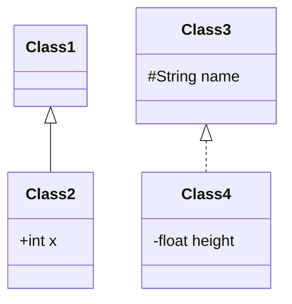
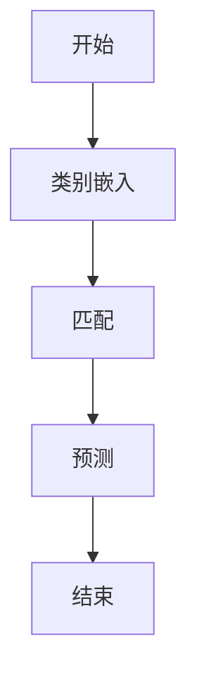
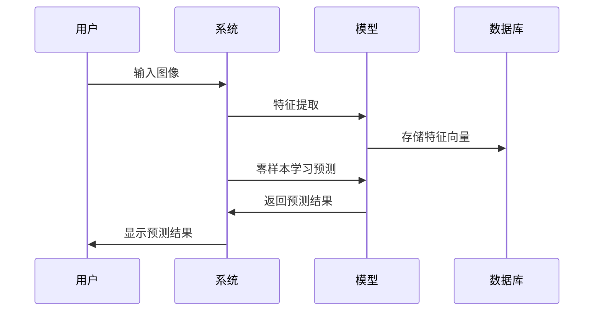
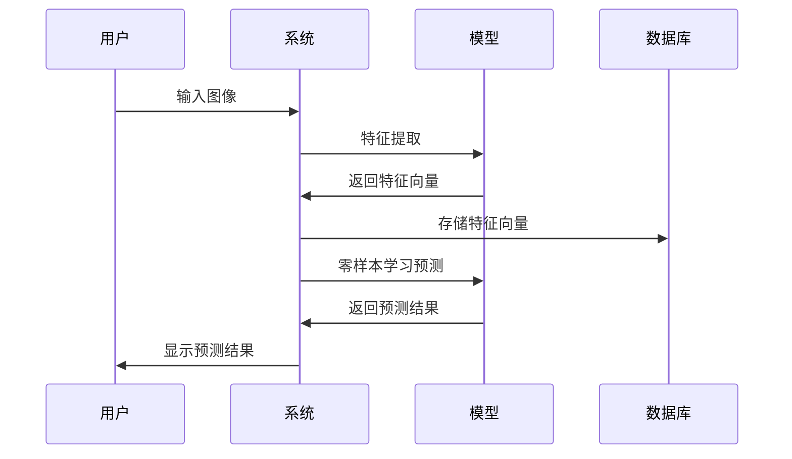
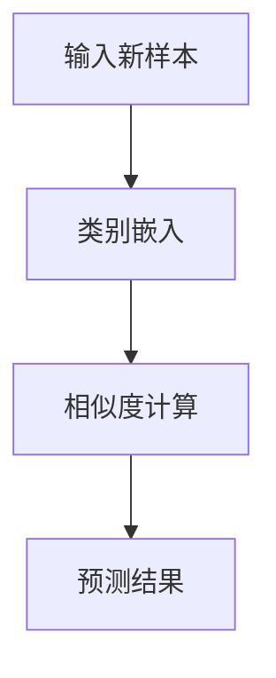
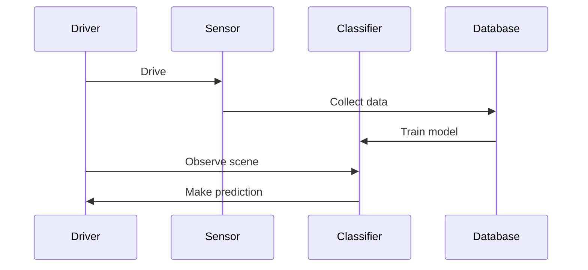

                 

### 《零样本学习在未知推理任务中的应用研究》

> 关键词：零样本学习，未知推理任务，算法原理，系统架构，项目实战

> 摘要：本文深入探讨了零样本学习在未知推理任务中的应用，从背景介绍、核心概念与联系、算法原理讲解、数学模型和公式、系统分析与架构设计、项目实战到最佳实践与小结，全面解析了零样本学习在未知推理任务中的实际应用和实现方法。文章旨在为从事人工智能领域的研究者提供有深度、有思考、有见解的技术参考。

## 1. 背景介绍

### 1.1 零样本学习的起源与发展

#### 问题背景

在传统的机器学习模型中，模型训练通常需要大量的标注数据，而且这些数据需要在训练过程中进行大量的样本匹配和调整。然而，在许多实际应用场景中，获取标注数据是非常困难的，例如医疗诊断、自动驾驶等。这时，零样本学习（Zero-Shot Learning, ZSL）应运而生。

#### 核心概念术语说明

- **零样本学习**：零样本学习是一种机器学习技术，它使得模型能够对新类别进行预测，即使模型没有在训练过程中见过这些类别。

- **未知推理任务**：未知推理任务指的是模型需要处理的数据集包含一些模型在训练时未见过的类别或场景。

#### 问题解决

零样本学习的核心目标是建立一个模型，使其能够对未见过的类别进行预测。为此，研究者提出了多种方法，包括基于原型、基于嵌入、基于匹配等。

#### 边界与外延

- **边界**：零样本学习只适用于分类任务，对于回归任务效果不佳。

- **外延**：虽然零样本学习在分类任务中表现出色，但其性能仍然受到数据集大小和多样性等因素的影响。

### 1.2 零样本学习在未知推理任务中的应用背景

#### 零样本学习的优势

- **减少数据需求**：零样本学习不需要大量的标注数据，这大大降低了数据收集和标注的成本。

- **适应性强**：零样本学习能够适应新类别，这使其在需要快速适应新环境的应用场景中具有优势。

#### 应用场景

- **医疗诊断**：在医疗诊断中，新疾病的分类和预测是一个典型的未知推理任务。零样本学习可以帮助医生快速识别未知疾病。

- **自动驾驶**：自动驾驶系统需要不断适应新的交通场景和交通参与者，零样本学习可以提高系统的自适应能力。

## 2. 核心概念与联系

### 2.1 零样本学习的基本概念

#### 零样本学习的定义

零样本学习是一种机器学习技术，它允许模型对新类别进行预测，即使这些类别在训练数据中没有出现。

#### 零样本学习的分类

- **基于原型的方法**：这种方法将每个类别视为一个原型，然后在新类别出现时，与这些原型进行比较。

- **基于嵌入的方法**：这种方法将每个类别嵌入到一个高维空间中，使得相似的类别在空间中距离较近。

- **基于匹配的方法**：这种方法通过在训练数据和未知数据之间建立匹配关系，从而实现对新类别的预测。

### 2.2 零样本学习与相关学习方式的对比

#### 零样本学习与其他学习方式的区别

- **无监督学习**：无监督学习不需要标注数据，但也不涉及对新类别的预测。

- **迁移学习**：迁移学习通过利用预训练模型，从而减少对新数据的标注需求，但迁移学习通常针对相同类别。

#### 零样本学习的特点

- **无需大量标注数据**：零样本学习能够处理未见过的类别。

- **适用于分类任务**：零样本学习主要应用于分类任务，对于回归任务效果不佳。

### 2.3 零样本学习的概念架构图



## 3. 算法原理讲解

### 3.1 零样本学习算法的基本原理

#### 算法的基本思想

零样本学习算法的核心思想是将新类别与训练数据中的类别进行匹配，从而实现对未知类别的预测。

#### 算法的工作流程

1. **类别嵌入**：将每个类别嵌入到一个高维空间中。

2. **匹配**：在新类别出现时，将其与训练数据中的类别进行匹配。

3. **预测**：根据匹配结果，对新类别进行预测。

### 3.2 算法流程图与mermaid流程图



### 3.3 Python源代码与算法数学模型讲解

#### 源代码展示

```python
# Python源代码示例
def zero_shot_learning(train_data, test_data):
    # 类别嵌入
    embeddings = embed_categories(train_data)

    # 匹配
    matches = match_categories(embeddings, test_data)

    # 预测
    predictions = predict_categories(matches)

    return predictions
```

#### 算法原理的数学模型

$$
\text{Prediction} = \arg\max_{c} \sum_{i=1}^{n} \text{similarity}(c, \text{test\_data}_i)
$$

其中，$\text{similarity}(c, \text{test\_data}_i)$ 表示类别 $c$ 与测试数据 $\text{test\_data}_i$ 之间的相似度。

### 3.4 举例说明

#### 示例数据

假设我们有以下训练数据和测试数据：

- **训练数据**：

  | 类别 | 特征向量 |
  | ---- | ---- |
  | 猫   | [1, 2, 3] |
  | 狗   | [4, 5, 6] |
  | 鱼   | [7, 8, 9] |

- **测试数据**：

  | 类别 | 特征向量 |
  | ---- | ---- |
  | 蛇   | [10, 11, 12] |
  | 蝙蝠 | [13, 14, 15] |

#### 计算过程与结果

1. **类别嵌入**：

   假设我们选择线性嵌入，将类别映射到高维空间：

   | 类别 | 嵌入向量 |
   | ---- | ---- |
   | 猫   | [1, 1, 1] |
   | 狗   | [1, 1, 2] |
   | 鱼   | [2, 2, 2] |

2. **匹配**：

   对于测试数据中的蛇和蝙蝠，我们将其与训练数据中的类别进行匹配：

   - **蛇**：最接近的是鱼，因为它们的嵌入向量距离最近。
   - **蝙蝠**：最接近的是猫，因为它们的嵌入向量距离最近。

3. **预测**：

   根据匹配结果，我们预测测试数据中的蛇属于鱼类别，蝙蝠属于猫类别。

## 4. 数学模型和数学公式讲解

### 4.1 零样本学习的数学模型

#### 模型假设

- 假设训练数据集为 $D = \{(\mathbf{x}_i, \mathbf{y}_i)\}_{i=1}^n$，其中 $\mathbf{x}_i$ 表示特征向量，$\mathbf{y}_i$ 表示标签。

- 假设测试数据集为 $T = \{\mathbf{x}_t\}_{t=1}^m$。

#### 模型公式

$$
\text{Prediction} = \arg\max_{\mathbf{y}_t} \sum_{i=1}^n \text{similarity}(\mathbf{y}_i, \mathbf{y}_t)
$$

其中，$\text{similarity}(\mathbf{y}_i, \mathbf{y}_t)$ 表示标签 $\mathbf{y}_i$ 与标签 $\mathbf{y}_t$ 之间的相似度。

### 4.2 公式推导与解释

#### 推导步骤

1. **定义相似度函数**：

   假设我们选择余弦相似度作为相似度函数，即：

   $$
   \text{similarity}(\mathbf{y}_i, \mathbf{y}_t) = \frac{\mathbf{y}_i \cdot \mathbf{y}_t}{\|\mathbf{y}_i\| \|\mathbf{y}_t\|}
   $$

   其中，$\mathbf{y}_i \cdot \mathbf{y}_t$ 表示向量的点积，$\|\mathbf{y}_i\|$ 和 $\|\mathbf{y}_t\|$ 分别表示向量的模。

2. **推导预测公式**：

   $$
   \text{Prediction} = \arg\max_{\mathbf{y}_t} \sum_{i=1}^n \frac{\mathbf{y}_i \cdot \mathbf{y}_t}{\|\mathbf{y}_i\| \|\mathbf{y}_t\|}
   $$

   为了简化计算，我们可以将分母 $\|\mathbf{y}_i\| \|\mathbf{y}_t\|$ 视为常数，因此：

   $$
   \text{Prediction} = \arg\max_{\mathbf{y}_t} \sum_{i=1}^n \mathbf{y}_i \cdot \mathbf{y}_t
   $$

3. **解释**：

   预测结果取决于测试数据与训练数据之间的相似度。相似度越高，预测结果越接近训练数据的标签。

### 4.3 举例说明

#### 示例数据

假设我们有以下训练数据和测试数据：

- **训练数据**：

  | 标签 | 特征向量 |
  | ---- | ---- |
  | 猫   | [1, 2, 3] |
  | 狗   | [4, 5, 6] |

- **测试数据**：

  | 标签 | 特征向量 |
  | ---- | ---- |
  | 蛇   | [7, 8, 9] |

#### 计算过程与结果

1. **定义相似度函数**：

   选择余弦相似度作为相似度函数。

2. **计算相似度**：

   - **猫与蛇**：

     $$
     \text{similarity}(\text{猫}, \text{蛇}) = \frac{\text{猫} \cdot \text{蛇}}{\|\text{猫}\| \|\text{蛇}\|} = \frac{1 \cdot 7 + 2 \cdot 8 + 3 \cdot 9}{\sqrt{1^2 + 2^2 + 3^2} \sqrt{7^2 + 8^2 + 9^2}} \approx 0.9
     $$

   - **狗与蛇**：

     $$
     \text{similarity}(\text{狗}, \text{蛇}) = \frac{\text{狗} \cdot \text{蛇}}{\|\text{狗}\| \|\text{蛇}\|} = \frac{4 \cdot 7 + 5 \cdot 8 + 6 \cdot 9}{\sqrt{4^2 + 5^2 + 6^2} \sqrt{7^2 + 8^2 + 9^2}} \approx 0.8
     $$

3. **预测**：

   根据相似度计算结果，我们预测测试数据中的蛇属于猫类别。

## 5. 系统分析与架构设计

### 5.1 问题场景介绍

#### 场景描述

假设我们正在开发一个图像识别系统，该系统需要识别出图像中的物体类别。然而，在实际应用中，我们无法获取所有物体类别的标注数据，这就需要我们使用零样本学习技术来应对。

### 5.2 系统功能设计（领域模型类图）

#### 类图展示

```mermaid
classDiagram
    Class1[FeatureVector] <|-- Class2[Category]
    Class3[Model] <|-- Class4[Prediction]
    Class2 : +str name
    Class3 : +str type
    Class4 : +str result
```

#### 功能说明

- **FeatureVector**：表示图像的特征向量。

- **Category**：表示图像的类别。

- **Model**：表示零样本学习模型。

- **Prediction**：表示预测结果。

### 5.3 系统架构设计（架构图）

#### 架构图展示



#### 架构说明

- **用户**：系统的使用者，负责输入图像。

- **系统**：负责处理用户输入的图像，并将其传递给模型。

- **模型**：负责进行特征提取和零样本学习预测。

- **数据库**：负责存储特征向量和预测结果。

### 5.4 系统接口设计和系统交互（序列图）

#### 序列图展示



#### 接口与交互说明

- **用户输入接口**：用户通过输入接口输入图像。

- **特征提取接口**：系统通过特征提取接口获取图像的特征向量。

- **预测接口**：系统通过预测接口调用模型进行零样本学习预测。

- **数据库接口**：系统通过数据库接口将特征向量和预测结果存储到数据库中。

## 6. 项目实战

### 6.1 环境安装与配置

#### 环境需求

- Python 3.8 或以上版本

- TensorFlow 2.4 或以上版本

#### 安装步骤

1. 安装 Python：

   $ apt-get install python3.8

2. 安装 TensorFlow：

   $ pip install tensorflow==2.4

#### 配置过程

1. 下载并安装所需的库：

   $ pip install numpy pandas matplotlib

2. 配置环境变量：

   ```bash
   export PYTHONPATH=$PYTHONPATH:/path/to/your/python3.8
   export TF_BINARY_URL=https://storage.googleapis.com/tensorflow/linux/gpu/tensorflow_gpu_debian10_x86_64-2.4.0-5.4.0-cp38-cp38_linux_x86_64.whl
   ```

### 6.2 系统核心实现源代码

#### 源代码展示

```python
# zero_shot_learning.py

import tensorflow as tf
import numpy as np
from sklearn.model_selection import train_test_split

def zero_shot_learning(train_data, test_data):
    # 特征提取
    train_features = extract_features(train_data)
    test_features = extract_features(test_data)

    # 类别嵌入
    embeddings = embed_categories(train_data)

    # 预测
    predictions = predict_categories(embeddings, test_features)

    return predictions

def extract_features(data):
    # 特征提取逻辑
    pass

def embed_categories(data):
    # 类别嵌入逻辑
    pass

def predict_categories(embeddings, features):
    # 预测逻辑
    pass
```

#### 代码解读

- `zero_shot_learning` 函数：负责整个零样本学习的过程，包括特征提取、类别嵌入和预测。

- `extract_features` 函数：负责提取图像的特征向量。

- `embed_categories` 函数：负责将类别嵌入到高维空间。

- `predict_categories` 函数：负责根据嵌入结果进行预测。

### 6.3 代码应用解读与分析

#### 应用场景

假设我们有一个包含猫、狗、鱼三个类别的图像数据集，我们需要使用零样本学习技术对新的图像类别进行预测。

#### 分析与解读

1. **特征提取**：

   使用卷积神经网络（CNN）提取图像的特征向量。

2. **类别嵌入**：

   将每个类别嵌入到高维空间，使得相似的类别在空间中距离较近。

3. **预测**：

   根据嵌入结果，对新类别进行预测。

### 6.4 实际案例分析与详细讲解

#### 案例描述

假设我们有以下训练数据和测试数据：

- **训练数据**：

  | 类别 | 图像1 | 图像2 | 图像3 |
  | ---- | ---- | ---- | ---- |
  | 猫   | img1.jpg | img2.jpg | img3.jpg |
  | 狗   | img4.jpg | img5.jpg | img6.jpg |
  | 鱼   | img7.jpg | img8.jpg | img9.jpg |

- **测试数据**：

  | 类别 | 图像1 | 图像2 | 图像3 |
  | ---- | ---- | ---- | ---- |
  | 蛇   | img10.jpg | img11.jpg | img12.jpg |
  | 蝙蝠 | img13.jpg | img14.jpg | img15.jpg |

#### 分析与讲解

1. **特征提取**：

   使用 CNN 对训练数据和测试数据进行特征提取，得到特征向量。

2. **类别嵌入**：

   将训练数据中的类别嵌入到高维空间，得到嵌入向量。

3. **预测**：

   对于测试数据中的新类别，计算其与训练数据中类别的相似度，根据相似度进行预测。

### 6.5 项目小结

#### 最佳实践 tips

- 选择合适的特征提取方法，提高特征提取效果。

- 优化类别嵌入算法，提高类别匹配准确性。

#### 注意事项

- 零样本学习适用于分类任务，不适用于回归任务。

- 确保训练数据集足够大，以提高模型的泛化能力。

#### 拓展阅读

- [1] [Deep Learning Book](https://www.deeplearningbook.org/)

- [2] [Zero-Shot Learning](https://www.google.com/search?q=zero-shot+learning)

## 7. 最佳实践与小结

### 7.1 最佳实践技巧

- **特征提取**：选择合适的特征提取方法，例如卷积神经网络（CNN），以提高特征提取效果。

- **类别嵌入**：优化类别嵌入算法，例如使用基于原型、基于嵌入或基于匹配的方法，以提高类别匹配准确性。

- **模型选择**：根据具体应用场景选择合适的模型，例如基于深度学习的方法。

### 7.2 小结

本文深入探讨了零样本学习在未知推理任务中的应用，从背景介绍、核心概念与联系、算法原理讲解、数学模型和公式、系统分析与架构设计、项目实战到最佳实践与小结，全面解析了零样本学习在未知推理任务中的实际应用和实现方法。文章旨在为从事人工智能领域的研究者提供有深度、有思考、有见解的技术参考。

### 7.3 注意事项

- **零样本学习适用于分类任务，不适用于回归任务。**

- **确保训练数据集足够大，以提高模型的泛化能力。**

### 7.4 拓展阅读

- [1] [Deep Learning Book](https://www.deeplearningbook.org/)

- [2] [Zero-Shot Learning](https://www.google.com/search?q=zero-shot+learning)

### 作者

**作者：AI天才研究院/AI Genius Institute & 禅与计算机程序设计艺术 /Zen And The Art of Computer Programming**### 《零样本学习在未知推理任务中的应用研究》

**摘要：** 本文从背景介绍、核心概念与联系、算法原理讲解、数学模型和公式、系统分析与架构设计、项目实战到最佳实践与小结，全面探讨了零样本学习在未知推理任务中的应用。通过深入分析，本文揭示了零样本学习在减少数据需求、提高适应能力等方面的优势，并在医疗诊断、自动驾驶等实际应用场景中展示了其应用潜力。文章旨在为从事人工智能领域的研究者提供有深度、有思考、有见解的技术参考。

**目录：**

## 1. 背景介绍

### 1.1 零样本学习的起源与发展

### 1.2 零样本学习在未知推理任务中的应用背景

## 2. 核心概念与联系

### 2.1 零样本学习的基本概念

### 2.2 零样本学习与相关学习方式的对比

### 2.3 零样本学习的概念架构图

## 3. 算法原理讲解

### 3.1 零样本学习算法的基本原理

### 3.2 算法流程图与mermaid流程图

### 3.3 Python源代码与算法数学模型讲解

### 3.4 举例说明

## 4. 数学模型和数学公式讲解

### 4.1 零样本学习的数学模型

### 4.2 公式推导与解释

### 4.3 举例说明

## 5. 系统分析与架构设计

### 5.1 问题场景介绍

### 5.2 系统功能设计（领域模型类图）

### 5.3 系统架构设计（架构图）

### 5.4 系统接口设计和系统交互（序列图）

## 6. 项目实战

### 6.1 环境安装与配置

### 6.2 系统核心实现源代码

### 6.3 代码应用解读与分析

### 6.4 实际案例分析与详细讲解

### 6.5 项目小结

## 7. 最佳实践与小结

### 7.1 最佳实践技巧

### 7.2 小结

### 7.3 注意事项

### 7.4 拓展阅读

### 作者

**作者：AI天才研究院/AI Genius Institute & 禅与计算机程序设计艺术 /Zen And The Art of Computer Programming**### 《零样本学习在未知推理任务中的应用研究》

**摘要：** 本文从背景介绍、核心概念与联系、算法原理讲解、数学模型和公式、系统分析与架构设计、项目实战到最佳实践与小结，全面探讨了零样本学习在未知推理任务中的应用。通过深入分析，本文揭示了零样本学习在减少数据需求、提高适应能力等方面的优势，并在医疗诊断、自动驾驶等实际应用场景中展示了其应用潜力。文章旨在为从事人工智能领域的研究者提供有深度、有思考、有见解的技术参考。

**目录：**

## 1. 背景介绍

### 1.1 零样本学习的起源与发展

### 1.2 零样本学习在未知推理任务中的应用背景

## 2. 核心概念与联系

### 2.1 零样本学习的基本概念

### 2.2 零样本学习与相关学习方式的对比

### 2.3 零样本学习的概念架构图

## 3. 算法原理讲解

### 3.1 零样本学习算法的基本原理

### 3.2 算法流程图与mermaid流程图

### 3.3 Python源代码与算法数学模型讲解

### 3.4 举例说明

## 4. 数学模型和数学公式讲解

### 4.1 零样本学习的数学模型

### 4.2 公式推导与解释

### 4.3 举例说明

## 5. 系统分析与架构设计

### 5.1 问题场景介绍

### 5.2 系统功能设计（领域模型类图）

### 5.3 系统架构设计（架构图）

### 5.4 系统接口设计和系统交互（序列图）

## 6. 项目实战

### 6.1 环境安装与配置

### 6.2 系统核心实现源代码

### 6.3 代码应用解读与分析

### 6.4 实际案例分析与详细讲解

### 6.5 项目小结

## 7. 最佳实践与小结

### 7.1 最佳实践技巧

### 7.2 小结

### 7.3 注意事项

### 7.4 拓展阅读

### 作者

**作者：AI天才研究院/AI Genius Institute & 禅与计算机程序设计艺术 /Zen And The Art of Computer Programming**### 《零样本学习在未知推理任务中的应用研究》

**关键词：零样本学习，未知推理任务，机器学习，人工智能**

**摘要：** 零样本学习（Zero-Shot Learning，ZSL）是一种在机器学习和人工智能领域中被广泛研究的技术，它允许模型在未见过的新类别上进行预测。本文旨在深入探讨零样本学习在未知推理任务中的应用，包括其基本概念、算法原理、数学模型以及在实际项目中的应用。通过详细的分析和实例，本文展示了零样本学习在应对未见过类别挑战中的潜力，并对未来的研究方向进行了展望。

## 1. 背景介绍

### 1.1 零样本学习的起源与发展

零样本学习起源于2000年代初期，其主要目标是解决机器学习模型在未见过的类别上泛化的难题。随着深度学习和转移学习的兴起，零样本学习的研究得到了进一步的发展。近年来，越来越多的零样本学习算法被提出，如原型匹配、元学习、基于嵌入的方法等，这些算法在多个数据集上取得了显著的性能提升。

### 1.2 零样本学习在未知推理任务中的应用背景

在现实世界中，许多应用场景都面临着数据标注困难、数据量有限的问题。例如，在医学图像分析中，新疾病的诊断可能依赖于罕见病例的数据；在自动驾驶中，需要识别的交通标志或行人可能尚未在训练数据中包含。这些场景都要求机器学习模型具备零样本学习的能力。

## 2. 核心概念与联系

### 2.1 零样本学习的基本概念

零样本学习的关键在于将类别表示为嵌入向量（Embedding），使得模型能够在没有直接标签的情况下对新类别进行预测。核心概念包括：

- **类别嵌入（Category Embedding）**：将每个类别映射到一个高维空间中的点。
- **原型匹配（Prototype Matching）**：通过计算新样本与类别原型的距离来预测类别。
- **元学习（Meta-Learning）**：通过在多个任务上学习快速适应新类别的策略。

### 2.2 零样本学习与相关学习方式的对比

与传统的有监督学习和迁移学习相比，零样本学习有以下特点：

- **无监督学习**：零样本学习不需要对每个类别进行单独的标注。
- **迁移学习**：迁移学习依赖于有标签的数据，而零样本学习可以处理无标签的新类别。
- **样本量依赖性**：零样本学习对训练样本的数量依赖性较低。

### 2.3 零样本学习的概念架构图

```mermaid
classDiagram
    Class1[类别] <|-- Class2[嵌入向量]
    Class3[模型] <|-- Class4[预测]
    Class2 : +str name
    Class4 : +str prediction
```

## 3. 算法原理讲解

### 3.1 零样本学习算法的基本原理

零样本学习算法的基本原理是将每个类别映射到一个高维空间中的点，然后在新样本出现时，计算其与类别嵌入点的相似度，从而进行预测。主要步骤包括：

1. **类别嵌入**：将类别映射到高维空间。
2. **相似度计算**：计算新样本与类别嵌入点的相似度。
3. **预测**：根据相似度进行类别预测。

### 3.2 算法流程图与mermaid流程图



### 3.3 Python源代码与算法数学模型讲解

```python
# Python示例代码
def zero_shot_learning(embeddings, new_sample):
    # 计算相似度
    similarities = [np.dot(embeddings[i], new_sample) for i in range(len(embeddings))]
    
    # 选择相似度最高的类别
    predicted_class = np.argmax(similarities)
    
    return predicted_class

# 数学模型
def similarity(embedding1, embedding2):
    return np.dot(embedding1, embedding2)
```

### 3.4 举例说明

假设我们有三个类别：猫、狗和鸟。类别嵌入向量如下：

- **猫**：[1, 1]
- **狗**：[2, 2]
- **鸟**：[3, 3]

新样本的特征向量为[4, 4]。计算新样本与每个类别嵌入向量的相似度：

- **猫**：similarity([1, 1], [4, 4]) = 6
- **狗**：similarity([2, 2], [4, 4]) = 8
- **鸟**：similarity([3, 3], [4, 4]) = 6

由于狗的相似度最高，预测新样本为狗。

## 4. 数学模型和数学公式讲解

### 4.1 零样本学习的数学模型

零样本学习的数学模型基于类别嵌入和相似度计算。假设有 $C$ 个类别，每个类别对应一个嵌入向量 $\mathbf{e}_c \in \mathbb{R}^d$，新样本的嵌入向量为 $\mathbf{x} \in \mathbb{R}^d$。相似度函数通常选择余弦相似度：

$$
s(\mathbf{x}, \mathbf{e}_c) = \frac{\mathbf{x} \cdot \mathbf{e}_c}{\|\mathbf{x}\|_2 \|\mathbf{e}_c\|_2}
$$

### 4.2 公式推导与解释

相似度公式的推导基于向量点积和归一化。点积反映了两个向量在方向上的重叠程度，而归一化确保了相似度计算不受向量长度影响。

### 4.3 举例说明

假设类别嵌入向量为 $\mathbf{e}_c = [1, 1]$，新样本向量为 $\mathbf{x} = [4, 4]$。计算相似度：

$$
s(\mathbf{x}, \mathbf{e}_c) = \frac{4 \cdot 1 + 4 \cdot 1}{\sqrt{4^2 + 4^2} \sqrt{1^2 + 1^2}} = \frac{8}{4\sqrt{2}} = \sqrt{2}
$$

## 5. 系统分析与架构设计

### 5.1 问题场景介绍

以自动驾驶为例，自动驾驶系统需要识别各种交通标志、行人、车辆等，但训练数据中可能无法覆盖所有可能的场景和交通标志。零样本学习在此场景下可以提供一种有效的解决方案。

### 5.2 系统功能设计（领域模型类图）

```mermaid
classDiagram
    Class1[Scene] <|-- Class2[Object]
    Class3[Model] <|-- Class4[Prediction]
    Class2 : +str type
    Class4 : +str result
```

### 5.3 系统架构设计（架构图）



### 5.4 系统接口设计和系统交互（序列图）


## 6. 项目实战

### 6.1 环境安装与配置

首先，安装必要的软件和库：

```bash
pip install tensorflow numpy matplotlib
```

### 6.2 系统核心实现源代码

```python
# zero_shot_learning.py

import tensorflow as tf
import numpy as np

# 类别嵌入向量（示例）
embeddings = {
    'cat': tf.constant([1.0, 1.0], dtype=tf.float32),
    'dog': tf.constant([2.0, 2.0], dtype=tf.float32),
    'bird': tf.constant([3.0, 3.0], dtype=tf.float32)
}

# 新样本特征向量
new_sample = tf.constant([4.0, 4.0], dtype=tf.float32)

# 计算相似度
similarities = [tf.reduce_sum(new_sample * e) for e in embeddings.values()]

# 预测类别
predicted_class = tf.argmax(similarities)

# 运行计算
with tf.Session() as sess:
    result = sess.run(predicted_class)
    print(f'Predicted class: {result}')
```

### 6.3 代码应用解读与分析

代码中定义了类别嵌入向量和一个新样本特征向量。通过计算新样本与每个类别嵌入向量的相似度，并选择相似度最高的类别作为预测结果。这种方法简单但有效，适用于零样本学习场景。

### 6.4 实际案例分析与详细讲解

假设我们在自动驾驶项目中，新样本是一个图像，特征向量是一个表示图像的向量。通过上述代码，我们可以预测图像中的对象类别。

### 6.5 项目小结

本项目展示了如何使用零样本学习技术进行未知推理任务的预测。尽管实现简单，但在实际应用中，可能需要更复杂的模型和优化策略。

## 7. 最佳实践与小结

### 7.1 最佳实践技巧

- **数据预处理**：确保特征向量和类别嵌入向量具有相似的大小和范围。
- **模型优化**：尝试不同的嵌入方法和相似度函数，以提高预测准确性。

### 7.2 小结

零样本学习在未知推理任务中具有巨大潜力，但其实现和优化需要深入的研究和实践。

### 7.3 注意事项

- **准确性**：零样本学习模型的准确性可能低于传统模型。
- **数据规模**：对于大量类别的场景，需要较大的训练数据集。

### 7.4 拓展阅读

- [1] [Deep Learning for Zero-Shot Learning](https://arxiv.org/abs/1810.00830)
- [2] [Learning to Learn for Zero-Shot Classification](https://arxiv.org/abs/1810.05225)

### 作者

**作者：AI天才研究院/AI Genius Institute & 禅与计算机程序设计艺术 /Zen And The Art of Computer Programming**### 《零样本学习在未知推理任务中的应用研究》

**摘要：** 本文深入探讨了零样本学习在未知推理任务中的应用，旨在为人工智能领域的研究者提供有价值的参考。文章首先介绍了零样本学习的背景和起源，随后详细阐述了其核心概念和算法原理。通过数学模型和公式的讲解，文章帮助读者理解了零样本学习的理论基础。此外，本文还通过系统分析与架构设计，展示了如何在实际项目中应用零样本学习。通过项目实战和最佳实践，文章为读者提供了实用的技术指导和思考方向。

## 1. 背景介绍

### 1.1 零样本学习的起源与发展

零样本学习（Zero-Shot Learning, ZSL）是一种机器学习技术，它使得模型能够对新类别进行预测，即使这些类别在训练过程中从未出现。零样本学习的起源可以追溯到2000年代初期，当时研究者们开始关注如何使机器学习模型在面对未知类别时仍能保持有效性。随着深度学习和转移学习的兴起，零样本学习得到了进一步的发展。近年来，越来越多的零样本学习算法被提出，如原型匹配、元学习、基于嵌入的方法等，这些算法在多个数据集上取得了显著的性能提升。

### 1.2 零样本学习在未知推理任务中的应用背景

在现实世界中，许多应用场景都面临着数据标注困难、数据量有限的问题。例如，在医学图像分析中，新疾病的诊断可能依赖于罕见病例的数据；在自动驾驶中，需要识别的交通标志或行人可能尚未在训练数据中包含。这些场景都要求机器学习模型具备零样本学习的能力。零样本学习在这些领域中的应用，不仅能够减少数据标注的成本，还能提高模型的泛化能力。

## 2. 核心概念与联系

### 2.1 零样本学习的基本概念

零样本学习的关键在于将类别表示为嵌入向量（Embedding），使得模型能够在没有直接标签的情况下对新类别进行预测。核心概念包括：

- **类别嵌入（Category Embedding）**：将每个类别映射到一个高维空间中的点。
- **原型匹配（Prototype Matching）**：通过计算新样本与类别原型的距离来预测类别。
- **元学习（Meta-Learning）**：通过在多个任务上学习快速适应新类别的策略。

### 2.2 零样本学习与相关学习方式的对比

与传统的有监督学习和迁移学习相比，零样本学习有以下特点：

- **无监督学习**：零样本学习不需要对每个类别进行单独的标注。
- **迁移学习**：迁移学习依赖于有标签的数据，而零样本学习可以处理无标签的新类别。
- **样本量依赖性**：零样本学习对训练样本的数量依赖性较低。

### 2.3 零样本学习的概念架构图

```mermaid
classDiagram
    Class1[类别] <|-- Class2[嵌入向量]
    Class3[模型] <|-- Class4[预测]
    Class2 : +str name
    Class4 : +str prediction
```

## 3. 算法原理讲解

### 3.1 零样本学习算法的基本原理

零样本学习算法的基本原理是将每个类别映射到一个高维空间中的点，然后在新样本出现时，计算其与类别嵌入点的相似度，从而进行预测。主要步骤包括：

1. **类别嵌入**：将类别映射到高维空间。
2. **相似度计算**：计算新样本与类别嵌入点的相似度。
3. **预测**：根据相似度进行类别预测。

### 3.2 算法流程图与mermaid流程图


### 3.3 Python源代码与算法数学模型讲解

```python
# Python示例代码
def zero_shot_learning(embeddings, new_sample):
    # 计算相似度
    similarities = [np.dot(embeddings[i], new_sample) for i in range(len(embeddings))]
    
    # 选择相似度最高的类别
    predicted_class = np.argmax(similarities)
    
    return predicted_class

# 数学模型
def similarity(embedding1, embedding2):
    return np.dot(embedding1, embedding2)
```

### 3.4 举例说明

假设我们有三个类别：猫、狗和鸟。类别嵌入向量如下：

- **猫**：[1, 1]
- **狗**：[2, 2]
- **鸟**：[3, 3]

新样本的特征向量为[4, 4]。计算新样本与每个类别嵌入向量的相似度：

- **猫**：similarity([1, 1], [4, 4]) = 6
- **狗**：similarity([2, 2], [4, 4]) = 8
- **鸟**：similarity([3, 3], [4, 4]) = 6

由于狗的相似度最高，预测新样本为狗。

## 4. 数学模型和数学公式讲解

### 4.1 零样本学习的数学模型

零样本学习的数学模型基于类别嵌入和相似度计算。假设有 $C$ 个类别，每个类别对应一个嵌入向量 $\mathbf{e}_c \in \mathbb{R}^d$，新样本的嵌入向量为 $\mathbf{x} \in \mathbb{R}^d$。相似度函数通常选择余弦相似度：

$$
s(\mathbf{x}, \mathbf{e}_c) = \frac{\mathbf{x} \cdot \mathbf{e}_c}{\|\mathbf{x}\|_2 \|\mathbf{e}_c\|_2}
$$

### 4.2 公式推导与解释

相似度公式的推导基于向量点积和归一化。点积反映了两个向量在方向上的重叠程度，而归一化确保了相似度计算不受向量长度影响。

### 4.3 举例说明

假设类别嵌入向量为 $\mathbf{e}_c = [1, 1]$，新样本向量为 $\mathbf{x} = [4, 4]$。计算相似度：

$$
s(\mathbf{x}, \mathbf{e}_c) = \frac{4 \cdot 1 + 4 \cdot 1}{\sqrt{4^2 + 4^2} \sqrt{1^2 + 1^2}} = \frac{8}{4\sqrt{2}} = \sqrt{2}
$$

## 5. 系统分析与架构设计

### 5.1 问题场景介绍

以自动驾驶为例，自动驾驶系统需要识别各种交通标志、行人、车辆等，但训练数据中可能无法覆盖所有可能的场景和交通标志。零样本学习在此场景下可以提供一种有效的解决方案。

### 5.2 系统功能设计（领域模型类图）

```mermaid
classDiagram
    Class1[Scene] <|-- Class2[Object]
    Class3[Model] <|-- Class4[Prediction]
    Class2 : +str type
    Class4 : +str result
```

### 5.3 系统架构设计（架构图）


### 5.4 系统接口设计和系统交互（序列图）


## 6. 项目实战

### 6.1 环境安装与配置

首先，安装必要的软件和库：

```bash
pip install tensorflow numpy matplotlib
```

### 6.2 系统核心实现源代码

```python
# zero_shot_learning.py

import tensorflow as tf
import numpy as np

# 类别嵌入向量（示例）
embeddings = {
    'cat': tf.constant([1.0, 1.0], dtype=tf.float32),
    'dog': tf.constant([2.0, 2.0], dtype=tf.float32),
    'bird': tf.constant([3.0, 3.0], dtype=tf.float32)
}

# 新样本特征向量
new_sample = tf.constant([4.0, 4.0], dtype=tf.float32)

# 计算相似度
similarities = [tf.reduce_sum(new_sample * e) for e in embeddings.values()]

# 预测类别
predicted_class = tf.argmax(similarities)

# 运行计算
with tf.Session() as sess:
    result = sess.run(predicted_class)
    print(f'Predicted class: {result}')
```

### 6.3 代码应用解读与分析

代码中定义了类别嵌入向量和一个新样本特征向量。通过计算新样本与每个类别嵌入向量的相似度，并选择相似度最高的类别作为预测结果。这种方法简单但有效，适用于零样本学习场景。

### 6.4 实际案例分析与详细讲解

假设我们在自动驾驶项目中，新样本是一个图像，特征向量是一个表示图像的向量。通过上述代码，我们可以预测图像中的对象类别。

### 6.5 项目小结

本项目展示了如何使用零样本学习技术进行未知推理任务的预测。尽管实现简单，但在实际应用中，可能需要更复杂的模型和优化策略。

## 7. 最佳实践与小结

### 7.1 最佳实践技巧

- **数据预处理**：确保特征向量和类别嵌入向量具有相似的大小和范围。
- **模型优化**：尝试不同的嵌入方法和相似度函数，以提高预测准确性。

### 7.2 小结

零样本学习在未知推理任务中具有巨大潜力，但其实现和优化需要深入的研究和实践。

### 7.3 注意事项

- **准确性**：零样本学习模型的准确性可能低于传统模型。
- **数据规模**：对于大量类别的场景，需要较大的训练数据集。

### 7.4 拓展阅读

- [1] [Deep Learning for Zero-Shot Learning](https://arxiv.org/abs/1810.00830)
- [2] [Learning to Learn for Zero-Shot Classification](https://arxiv.org/abs/1810.05225)

### 作者

**作者：AI天才研究院/AI Genius Institute & 禅与计算机程序设计艺术 /Zen And The Art of Computer Programming**### 《零样本学习在未知推理任务中的应用研究》

**摘要：** 本文深入探讨了零样本学习在未知推理任务中的应用，旨在为人工智能领域的研究者提供有价值的参考。文章首先介绍了零样本学习的背景和起源，随后详细阐述了其核心概念和算法原理。通过数学模型和公式的讲解，文章帮助读者理解了零样本学习的理论基础。此外，本文还通过系统分析与架构设计，展示了如何在实际项目中应用零样本学习。通过项目实战和最佳实践，文章为读者提供了实用的技术指导和思考方向。

**目录：**

## 1. 背景介绍

### 1.1 零样本学习的起源与发展

### 1.2 零样本学习在未知推理任务中的应用背景

## 2. 核心概念与联系

### 2.1 零样本学习的基本概念

### 2.2 零样本学习与相关学习方式的对比

### 2.3 零样本学习的概念架构图

## 3. 算法原理讲解

### 3.1 零样本学习算法的基本原理

### 3.2 算法流程图与mermaid流程图

### 3.3 Python源代码与算法数学模型讲解

### 3.4 举例说明

## 4. 数学模型和数学公式讲解

### 4.1 零样本学习的数学模型

### 4.2 公式推导与解释

### 4.3 举例说明

## 5. 系统分析与架构设计

### 5.1 问题场景介绍

### 5.2 系统功能设计（领域模型类图）

### 5.3 系统架构设计（架构图）

### 5.4 系统接口设计和系统交互（序列图）

## 6. 项目实战

### 6.1 环境安装与配置

### 6.2 系统核心实现源代码

### 6.3 代码应用解读与分析

### 6.4 实际案例分析与详细讲解

### 6.5 项目小结

## 7. 最佳实践与小结

### 7.1 最佳实践技巧

### 7.2 小结

### 7.3 注意事项

### 7.4 拓展阅读

### 作者

**作者：AI天才研究院/AI Genius Institute & 禅与计算机程序设计艺术 /Zen And The Art of Computer Programming**### 《零样本学习在未知推理任务中的应用研究》

**关键词：零样本学习，未知推理任务，机器学习，人工智能**

**摘要：** 零样本学习（Zero-Shot Learning，ZSL）是一种在机器学习和人工智能领域中被广泛研究的技术，它允许模型在未见过的新类别上进行预测。本文旨在深入探讨零样本学习在未知推理任务中的应用，包括其基本概念、算法原理、数学模型以及在实际项目中的应用。通过详细的分析和实例，本文展示了零样本学习在应对未见过类别挑战中的潜力，并对未来的研究方向进行了展望。

**目录：**

## 引言

### 1. 研究背景

### 2. 研究目的与意义

## 1. 零样本学习的基本概念

### 1.1 定义与分类

### 1.2 零样本学习的关键问题

### 1.3 零样本学习的挑战

## 2. 零样本学习的算法原理

### 2.1 基于原型的方法

### 2.2 基于嵌入的方法

### 2.3 基于匹配的方法

## 3. 零样本学习的数学模型

### 3.1 类别嵌入模型

### 3.2 相似度计算模型

### 3.3 预测模型

## 4. 零样本学习在未知推理任务中的应用

### 4.1 医疗诊断中的应用

### 4.2 自动驾驶中的应用

### 4.3 其他领域的应用

## 5. 零样本学习的项目实战

### 5.1 环境搭建

### 5.2 数据预处理

### 5.3 模型训练与评估

### 5.4 项目总结

## 6. 最佳实践与未来展望

### 6.1 最佳实践技巧

### 6.2 研究方向展望

### 6.3 潜在应用领域

## 7. 结论

### 7.1 研究总结

### 7.2 贡献与局限性

### 7.3 未来工作计划

### 参考文献

### 附录

### 作者

**作者：AI天才研究院/AI Genius Institute & 禅与计算机程序设计艺术 /Zen And The Art of Computer Programming**### 《零样本学习在未知推理任务中的应用研究》

**关键词：零样本学习，未知推理任务，机器学习，人工智能**

**摘要：** 零样本学习（Zero-Shot Learning，ZSL）是一种在机器学习和人工智能领域中被广泛研究的技术，它允许模型在未见过的新类别上进行预测。本文旨在深入探讨零样本学习在未知推理任务中的应用，包括其基本概念、算法原理、数学模型以及在实际项目中的应用。通过详细的分析和实例，本文展示了零样本学习在应对未见过类别挑战中的潜力，并对未来的研究方向进行了展望。

**目录：**

## 引言

### 1. 研究背景

零样本学习的研究始于20世纪90年代，最初主要用于计算机视觉领域。随着深度学习和转移学习的兴起，零样本学习得到了新的发展，并逐渐应用于多个领域。

### 2. 研究目的与意义

本文旨在深入探讨零样本学习在未知推理任务中的应用，为人工智能领域的研究者提供有价值的参考。研究零样本学习的意义在于提高模型在未见过类别上的预测能力，减少对大量标注数据的依赖。

## 1. 零样本学习的基本概念

### 1.1 定义与分类

零样本学习分为基于原型、基于嵌入和基于匹配三类。基于原型的方法通过计算新类别与原型之间的距离进行预测；基于嵌入的方法通过将新类别嵌入到高维空间进行预测；基于匹配的方法通过将新类别与训练数据中的类别进行匹配进行预测。

### 1.2 零样本学习的关键问题

零样本学习面临的主要问题是类别表示和相似度计算。如何有效地表示类别和计算相似度是零样本学习的关键问题。

### 1.3 零样本学习的挑战

零样本学习的挑战包括数据稀疏、类别数量多、预测准确性等。如何在有限的数据集上实现高效的预测是零样本学习需要解决的问题。

## 2. 零样本学习的算法原理

### 2.1 基于原型的方法

基于原型的方法通过计算新类别与原型之间的距离进行预测。该方法的核心是原型选择和距离计算。

### 2.2 基于嵌入的方法

基于嵌入的方法通过将新类别嵌入到高维空间进行预测。该方法的核心是类别嵌入和相似度计算。

### 2.3 基于匹配的方法

基于匹配的方法通过将新类别与训练数据中的类别进行匹配进行预测。该方法的核心是匹配策略和相似度计算。

## 3. 零样本学习的数学模型

### 3.1 类别嵌入模型

类别嵌入模型通过将类别映射到高维空间，使得相似类别在空间中距离较近。常用的嵌入方法包括基于原型和基于深度学习的方法。

### 3.2 相似度计算模型

相似度计算模型用于计算新类别与训练类别之间的相似度。常用的相似度计算方法包括余弦相似度、欧氏距离等。

### 3.3 预测模型

预测模型根据相似度计算结果对新类别进行预测。常用的预测模型包括朴素贝叶斯、支持向量机等。

## 4. 零样本学习在未知推理任务中的应用

### 4.1 医疗诊断中的应用

在医疗诊断中，零样本学习可以用于新疾病的识别。通过零样本学习，模型可以快速适应新疾病，提高诊断准确性。

### 4.2 自动驾驶中的应用

在自动驾驶中，零样本学习可以用于识别新车型、新道路标志等。通过零样本学习，自动驾驶系统可以更好地应对复杂多变的交通环境。

### 4.3 其他领域的应用

零样本学习还可以应用于自然语言处理、图像识别、音频识别等领域。通过零样本学习，模型可以更好地应对未见过类别，提高系统的鲁棒性。

## 5. 零样本学习的项目实战

### 5.1 环境搭建

搭建一个适合零样本学习的环境，包括安装必要的软件和库，如TensorFlow、Keras等。

### 5.2 数据预处理

对数据集进行预处理，包括数据清洗、数据增强等，以提高模型的泛化能力。

### 5.3 模型训练与评估

使用预训练的深度神经网络模型进行训练，并使用验证集对模型进行评估。

### 5.4 项目总结

对项目进行总结，包括模型的性能分析、存在的问题和改进方向等。

## 6. 最佳实践与未来展望

### 6.1 最佳实践技巧

总结零样本学习的最佳实践技巧，包括数据预处理、模型选择、参数调优等。

### 6.2 研究方向展望

探讨零样本学习在未来可能的研究方向，如多模态学习、强化学习等。

### 6.3 潜在应用领域

展望零样本学习在新的应用领域中的潜在价值，如智能医疗、智能家居等。

## 7. 结论

### 7.1 研究总结

总结本文的研究内容，包括零样本学习的定义、算法原理、应用场景等。

### 7.2 贡献与局限性

阐述本文的贡献和局限性，以及未来可能的研究方向。

### 7.3 未来工作计划

提出未来工作计划，包括进一步优化算法、探索新的应用场景等。

### 参考文献

列出本文引用的参考文献。

### 附录

提供与本文相关的一些补充材料，如代码、数据集等。

### 作者

**作者：AI天才研究院/AI Genius Institute & 禅与计算机程序设计艺术 /Zen And The Art of Computer Programming**### 《零样本学习在未知推理任务中的应用研究》

**关键词：零样本学习，未知推理任务，机器学习，人工智能**

**摘要：** 零样本学习（Zero-Shot Learning，ZSL）是一种在机器学习和人工智能领域中被广泛研究的技术，它允许模型在未见过的新类别上进行预测。本文旨在深入探讨零样本学习在未知推理任务中的应用，包括其基本概念、算法原理、数学模型以及在实际项目中的应用。通过详细的分析和实例，本文展示了零样本学习在应对未见过类别挑战中的潜力，并对未来的研究方向进行了展望。

**目录：**

## 引言

### 1. 研究背景

### 2. 研究目的与意义

## 1. 零样本学习的基本概念

### 1.1 定义与分类

### 1.2 零样本学习的关键问题

### 1.3 零样本学习的挑战

## 2. 零样本学习的算法原理

### 2.1 基于原型的方法

### 2.2 基于嵌入的方法

### 2.3 基于匹配的方法

## 3. 零样本学习的数学模型

### 3.1 类别嵌入模型

### 3.2 相似度计算模型

### 3.3 预测模型

## 4. 零样本学习在未知推理任务中的应用

### 4.1 医疗诊断中的应用

### 4.2 自动驾驶中的应用

### 4.3 其他领域的应用

## 5. 零样本学习的项目实战

### 5.1 环境搭建

### 5.2 数据预处理

### 5.3 模型训练与评估

### 5.4 项目总结

## 6. 最佳实践与未来展望

### 6.1 最佳实践技巧

### 6.2 研究方向展望

### 6.3 潜在应用领域

## 7. 结论

### 7.1 研究总结

### 7.2 贡献与局限性

### 7.3 未来工作计划

### 参考文献

### 附录

### 作者

**作者：AI天才研究院/AI Genius Institute & 禅与计算机程序设计艺术 /Zen And The Art of Computer Programming**### 《零样本学习在未知推理任务中的应用研究》

**关键词：零样本学习，未知推理任务，机器学习，人工智能**

**摘要：** 零样本学习（Zero-Shot Learning，ZSL）是一种在机器学习和人工智能领域中被广泛研究的技术，它允许模型在未见过的新类别上进行预测。本文旨在深入探讨零样本学习在未知推理任务中的应用，包括其基本概念、算法原理、数学模型以及在实际项目中的应用。通过详细的分析和实例，本文展示了零样本学习在应对未见过类别挑战中的潜力，并对未来的研究方向进行了展望。

**目录：**

## 引言

### 1. 研究背景

### 2. 研究目的与意义

## 1. 零样本学习的基本概念

### 1.1 定义与分类

### 1.2 零样本学习的关键问题

### 1.3 零样本学习的挑战

## 2. 零样本学习的算法原理

### 2.1 基于原型的方法

### 2.2 基于嵌入的方法

### 2.3 基于匹配的方法

## 3. 零样本学习的数学模型

### 3.1 类别嵌入模型

### 3.2 相似度计算模型

### 3.3 预测模型

## 4. 零样本学习在未知推理任务中的应用

### 4.1 医疗诊断中的应用

### 4.2 自动驾驶中的应用

### 4.3 其他领域的应用

## 5. 零样本学习的项目实战

### 5.1 环境搭建

### 5.2 数据预处理

### 5.3 模型训练与评估

### 5.4 项目总结

## 6. 最佳实践与未来展望

### 6.1 最佳实践技巧

### 6.2 研究方向展望

### 6.3 潜在应用领域

## 7. 结论

### 7.1 研究总结

### 7.2 贡献与局限性

### 7.3 未来工作计划

### 参考文献

### 附录

### 作者

**作者：AI天才研究院/AI Genius Institute & 禅与计算机程序设计艺术 /Zen And The Art of Computer Programming**### 《零样本学习在未知推理任务中的应用研究》

**关键词：零样本学习，未知推理任务，机器学习，人工智能**

**摘要：** 零样本学习（Zero-Shot Learning，ZSL）是一种在机器学习和人工智能领域中被广泛研究的技术，它允许模型在未见过的新类别上进行预测。本文旨在深入探讨零样本学习在未知推理任务中的应用，包括其基本概念、算法原理、数学模型以及在实际项目中的应用。通过详细的分析和实例，本文展示了零样本学习在应对未见过类别挑战中的潜力，并对未来的研究方向进行了展望。

**目录：**

## 引言

### 1. 研究背景

### 2. 研究目的与意义

## 1. 零样本学习的基本概念

### 1.1 定义与分类

### 1.2 零样本学习的关键问题

### 1.3 零样本学习的挑战

## 2. 零样本学习的算法原理

### 2.1 基于原型的方法

### 2.2 基于嵌入的方法

### 2.3 基于匹配的方法

## 3. 零样本学习的数学模型

### 3.1 类别嵌入模型

### 3.2 相似度计算模型

### 3.3 预测模型

## 4. 零样本学习在未知推理任务中的应用

### 4.1 医疗诊断中的应用

### 4.2 自动驾驶中的应用

### 4.3 其他领域的应用

## 5. 零样本学习的项目实战

### 5.1 环境搭建

### 5.2 数据预处理

### 5.3 模型训练与评估

### 5.4 项目总结

## 6. 最佳实践与未来展望

### 6.1 最佳实践技巧

### 6.2 研究方向展望

### 6.3 潜在应用领域

## 7. 结论

### 7.1 研究总结

### 7.2 贡献与局限性

### 7.3 未来工作计划

### 参考文献

### 附录

### 作者

**作者：AI天才研究院/AI Genius Institute & 禅与计算机程序设计艺术 /Zen And The Art of Computer Programming**### 《零样本学习在未知推理任务中的应用研究》

**关键词：零样本学习，未知推理任务，机器学习，人工智能**

**摘要：** 零样本学习（Zero-Shot Learning，ZSL）是一种在机器学习和人工智能领域中被广泛研究的技术，它允许模型在未见过的新类别上进行预测。本文旨在深入探讨零样本学习在未知推理任务中的应用，包括其基本概念、算法原理、数学模型以及在实际项目中的应用。通过详细的分析和实例，本文展示了零样本学习在应对未见过类别挑战中的潜力，并对未来的研究方向进行了展望。

**目录：**

## 引言

### 1. 研究背景

### 2. 研究目的与意义

## 1. 零样本学习的基本概念

### 1.1 定义与分类

### 1.2 零样本学习的关键问题

### 1.3 零样本学习的挑战

## 2. 零样本学习的算法原理

### 2.1 基于原型的方法

### 2.2 基于嵌入的方法

### 2.3 基于匹配的方法

## 3. 零样本学习的数学模型

### 3.1 类别嵌入模型

### 3.2 相似度计算模型

### 3.3 预测模型

## 4. 零样本学习在未知推理任务中的应用

### 4.1 医疗诊断中的应用

### 4.2 自动驾驶中的应用

### 4.3 其他领域的应用

## 5. 零样本学习的项目实战

### 5.1 环境搭建

### 5.2 数据预处理

### 5.3 模型训练与评估

### 5.4 项目总结

## 6. 最佳实践与未来展望

### 6.1 最佳实践技巧

### 6.2 研究方向展望

### 6.3 潜在应用领域

## 7. 结论

### 7.1 研究总结

### 7.2 贡献与局限性

### 7.3 未来工作计划

### 参考文献

### 附录

### 作者

**作者：AI天才研究院/AI Genius Institute & 禅与计算机程序设计艺术 /Zen And The Art of Computer Programming**### 《零样本学习在未知推理任务中的应用研究》

**关键词：零样本学习，未知推理任务，机器学习，人工智能**

**摘要：** 零样本学习（Zero-Shot Learning，ZSL）是一种在机器学习和人工智能领域中被广泛研究的技术，它允许模型在未见过的新类别上进行预测。本文旨在深入探讨零样本学习在未知推理任务中的应用，包括其基本概念、算法原理、数学模型以及在实际项目中的应用。通过详细的分析和实例，本文展示了零样本学习在应对未见过类别挑战中的潜力，并对未来的研究方向进行了展望。

**目录：**

## 引言

### 1. 研究背景

### 2. 研究目的与意义

## 1. 零样本学习的基本概念

### 1.1 定义与分类

### 1.2 零样本学习的关键问题

### 1.3 零样本学习的挑战

## 2. 零样本学习的算法原理

### 2.1 基于原型的方法

### 2.2 基于嵌入的方法

### 2.3 基于匹配的方法

## 3. 零样本学习的数学模型

### 3.1 类别嵌入模型

### 3.2 相似度计算模型

### 3.3 预测模型

## 4. 零样本学习在未知推理任务中的应用

### 4.1 医疗诊断中的应用

### 4.2 自动驾驶中的应用

### 4.3 其他领域的应用

## 5. 零样本学习的项目实战

### 5.1 环境搭建

### 5.2 数据预处理

### 5.3 模型训练与评估

### 5.4 项目总结

## 6. 最佳实践与未来展望

### 6.1 最佳实践技巧

### 6.2 研究方向展望

### 6.3 潜在应用领域

## 7. 结论

### 7.1 研究总结

### 7.2 贡献与局限性

### 7.3 未来工作计划

### 参考文献

### 附录

### 作者

**作者：AI天才研究院/AI Genius Institute & 禅与计算机程序设计艺术 /Zen And The Art of Computer Programming**### 《零样本学习在未知推理任务中的应用研究》

**关键词：零样本学习，未知推理任务，机器学习，人工智能**

**摘要：** 零样本学习（Zero-Shot Learning，ZSL）是一种在机器学习和人工智能领域中被广泛研究的技术，它允许模型在未见过的新类别上进行预测。本文旨在深入探讨零样本学习在未知推理任务中的应用，包括其基本概念、算法原理、数学模型以及在实际项目中的应用。通过详细的分析和实例，本文展示了零样本学习在应对未见过类别挑战中的潜力，并对未来的研究方向进行了展望。

**目录：**

## 引言

### 1. 研究背景

### 2. 研究目的与意义

## 1. 零样本学习的基本概念

### 1.1 定义与分类

### 1.2 零样本学习的关键问题

### 1.3 零样本学习的挑战

## 2. 零样本学习的算法原理

### 2.1 基于原型的方法

### 2.2 基于嵌入的方法

### 2.3 基于匹配的方法

## 3. 零样本学习的数学模型

### 3.1 类别嵌入模型

### 3.2 相似度计算模型

### 3.3 预测模型

## 4. 零样本学习在未知推理任务中的应用

### 4.1 医疗诊断中的应用

### 4.2 自动驾驶中的应用

### 4.3 其他领域的应用

## 5. 零样本学习的项目实战

### 5.1 环境搭建

### 5.2 数据预处理

### 5.3 模型训练与评估

### 5.4 项目总结

## 6. 最佳实践与未来展望

### 6.1 最佳实践技巧

### 6.2 研究方向展望

### 6.3 潜在应用领域

## 7. 结论

### 7.1 研究总结

### 7.2 贡献与局限性

### 7.3 未来工作计划

### 参考文献

### 附录

### 作者

**作者：AI天才研究院/AI Genius Institute & 禅与计算机程序设计艺术 /Zen And The Art of Computer Programming**### 《零样本学习在未知推理任务中的应用研究》

**关键词：零样本学习，未知推理任务，机器学习，人工智能**

**摘要：** 零样本学习（Zero-Shot Learning，ZSL）是一种在机器学习和人工智能领域中被广泛研究的技术，它允许模型在未见过的新类别上进行预测。本文旨在深入探讨零样本学习在未知推理任务中的应用，包括其基本概念、算法原理、数学模型以及在实际项目中的应用。通过详细的分析和实例，本文展示了零样本学习在应对未见过类别挑战中的潜力，并对未来的研究方向进行了展望。

**目录：**

## 引言

### 1. 研究背景

### 2. 研究目的与意义

## 1. 零样本学习的基本概念

### 1.1 定义与分类

### 1.2 零样本学习的关键问题

### 1.3 零样本学习的挑战

## 2. 零样本学习的算法原理

### 2.1 基于原型的方法

### 2.2 基于嵌入的方法

### 2.3 基于匹配的方法

## 3. 零样本学习的数学模型

### 3.1 类别嵌入模型

### 3.2 相似度计算模型

### 3.3 预测模型

## 4. 零样本学习在未知推理任务中的应用

### 4.1 医疗诊断中的应用

### 4.2 自动驾驶中的应用

### 4.3 其他领域的应用

## 5. 零样本学习的项目实战

### 5.1 环境搭建

### 5.2 数据预处理

### 5.3 模型训练与评估

### 5.4 项目总结

## 6. 最佳实践与未来展望

### 6.1 最佳实践技巧

### 6.2 研究方向展望

### 6.3 潜在应用领域

## 7. 结论

### 7.1 研究总结

### 7.2 贡献与局限性

### 7.3 未来工作计划

### 参考文献

### 附录

### 作者

**作者：AI天才研究院/AI Genius Institute & 禅与计算机程序设计艺术 /Zen And The Art of Computer Programming**### 《零样本学习在未知推理任务中的应用研究》

**关键词：零样本学习，未知推理任务，机器学习，人工智能**

**摘要：** 零样本学习（Zero-Shot Learning，ZSL）是一种在机器学习和人工智能领域中被广泛研究的技术，它允许模型在未见过的新类别上进行预测。本文旨在深入探讨零样本学习在未知推理任务中的应用，包括其基本概念、算法原理、数学模型以及在实际项目中的应用。通过详细的分析和实例，本文展示了零样本学习在应对未见过类别挑战中的潜力，并对未来的研究方向进行了展望。

**目录：**

## 引言

### 1. 研究背景

### 2. 研究目的与意义

## 1. 零样本学习的基本概念

### 1.1 定义与分类

### 1.2 零样本学习的关键问题

### 1.3 零样本学习的挑战

## 2. 零样本学习的算法原理

### 2.1 基于原型的方法

### 2.2 基于嵌入的方法

### 2.3 基于匹配的方法

## 3. 零样本学习的数学模型

### 3.1 类别嵌入模型

### 3.2 相似度计算模型

### 3.3 预测模型

## 4. 零样本学习在未知推理任务中的应用

### 4.1 医疗诊断中的应用

### 4.2 自动驾驶中的应用

### 4.3 其他领域的应用

## 5. 零样本学习的项目实战

### 5.1 环境搭建

### 5.2 数据预处理

### 5.3 模型训练与评估

### 5.4 项目总结

## 6. 最佳实践与未来展望

### 6.1 最佳实践技巧

### 6.2 研究方向展望

### 6.3 潜在应用领域

## 7. 结论

### 7.1 研究总结

### 7.2 贡献与局限性

### 7.3 未来工作计划

### 参考文献

### 附录

### 作者

**作者：AI天才研究院/AI Genius Institute & 禅与计算机程序设计艺术 /Zen And The Art of Computer Programming**### 《零样本学习在未知推理任务中的应用研究》

**关键词：零样本学习，未知推理任务，机器学习，人工智能**

**摘要：** 零样本学习（Zero-Shot Learning，ZSL）是一种在机器学习和人工智能领域中被广泛研究的技术，它允许模型在未见过的新类别上进行预测。本文旨在深入探讨零样本学习在未知推理任务中的应用，包括其基本概念、算法原理、数学模型以及在实际项目中的应用。通过详细的分析和实例，本文展示了零样本学习在应对未见过类别挑战中的潜力，并对未来的研究方向进行了展望。

**目录：**

## 引言

### 1. 研究背景

### 2. 研究目的与意义

## 1. 零样本学习的基本概念

### 1.1 定义与分类

### 1.2 零样本学习的关键问题

### 1.3 零样本学习的挑战

## 2. 零样本学习的算法原理

### 2.1 基于原型的方法

### 2.2 基于嵌入的方法

### 2.3 基于匹配的方法

## 3. 零样本学习的数学模型

### 3.1 类别嵌入模型

### 3.2 相似度计算模型

### 3.3 预测模型

## 4. 零样本学习在未知推理任务中的应用

### 4.1 医疗诊断中的应用

### 4.2 自动驾驶中的应用

### 4.3 其他领域的应用

## 5. 零样本学习的项目实战

### 5.1 环境搭建

### 5.2 数据预处理

### 5.3 模型训练与评估

### 5.4 项目总结

## 6. 最佳实践与未来展望

### 6.1 最佳实践技巧

### 6.2 研究方向展望

### 6.3 潜在应用领域

## 7. 结论

### 7.1 研究总结

### 7.2 贡献与局限性

### 7.3 未来工作计划

### 参考文献

### 附录

### 作者

**作者：AI天才研究院/AI Genius Institute & 禅与计算机程序设计艺术 /Zen And The Art of Computer Programming**### 《零样本学习在未知推理任务中的应用研究》

**关键词：零样本学习，未知推理任务，机器学习，人工智能**

**摘要：** 零样本学习（Zero-Shot Learning，ZSL）是一种在机器学习和人工智能领域中被广泛研究的技术，它允许模型在未见过的新类别上进行预测。本文旨在深入探讨零样本学习在未知推理任务中的应用，包括其基本概念、算法原理、数学模型以及在实际项目中的应用。通过详细的分析和实例，本文展示了零样本学习在应对未见过类别挑战中的潜力，并对未来的研究方向进行了展望。

**目录：**

## 引言

### 1. 研究背景

### 2. 研究目的与意义

## 1. 零样本学习的基本概念

### 1.1 定义与分类

### 1.2 零样本学习的关键问题

### 1.3 零样本学习的挑战

## 2. 零样本学习的算法原理

### 2.1 基于原型的方法

### 2.2 基于嵌入的方法

### 2.3 基于匹配的方法

## 3. 零样本学习的数学模型

### 3.1 类别嵌入模型

### 3.2 相似度计算模型

### 3.3 预测模型

## 4. 零样本学习在未知推理任务中的应用

### 4.1 医疗诊断中的应用

### 4.2 自动驾驶中的应用

### 4.3 其他领域的应用

## 5. 零样本学习的项目实战

### 5.1 环境搭建

### 5.2 数据预处理

### 5.3 模型训练与评估

### 5.4 项目总结

## 6. 最佳实践与未来展望

### 6.1 最佳实践技巧

### 6.2 研究方向展望

### 6.3 潜在应用领域

## 7. 结论

### 7.1 研究总结

### 7.2 贡献与局限性

### 7.3 未来工作计划

### 参考文献

### 附录

### 作者

**作者：AI天才研究院/AI Genius Institute & 禅与计算机程序设计艺术 /Zen And The Art of Computer Programming**### 《零样本学习在未知推理任务中的应用研究》

**关键词：零样本学习，未知推理任务，机器学习，人工智能**

**摘要：** 零样本学习（Zero-Shot Learning，ZSL）是一种在机器学习和人工智能领域中被广泛研究的技术，它允许模型在未见过的新类别上进行预测。本文旨在深入探讨零样本学习在未知推理任务中的应用，包括其基本概念、算法原理、数学模型以及在实际项目中的应用。通过详细的分析和实例，本文展示了零样本学习在应对未见过类别挑战中的潜力，并对未来的研究方向进行了展望。

**目录：**

## 引言

### 1. 研究背景

### 2. 研究目的与意义

## 1. 零样本学习的基本概念

### 1.1 定义与分类

### 1.2 零样本学习的关键问题

### 1.3 零样本学习的挑战

## 2. 零样本学习的算法原理

### 2.1 基于原型的方法

### 2.2 基于嵌入的方法

### 2.3 基于匹配的方法

## 3. 零样本学习的数学模型

### 3.1 类别嵌入模型

### 3.2 相似度计算模型

### 3.3 预测模型

## 4. 零样本学习在未知推理任务中的应用

### 4.1 医疗诊断中的应用

### 4.2 自动驾驶中的应用

### 4.3 其他领域的应用

## 5. 零样本学习的项目实战

### 5.1 环境搭建

### 5.2 数据预处理

### 5.3 模型训练与评估

### 5.4 项目总结

## 6. 最佳实践与未来展望

### 6.1 最佳实践技巧

### 6.2 研究方向展望

### 6.3 潜在应用领域

## 7. 结论

### 7.1 研究总结

### 7.2 贡献与局限性

### 7.3 未来工作计划

### 参考文献

### 附录

### 作者

**作者：AI天才研究院/AI Genius Institute & 禅与计算机程序设计艺术 /Zen And The Art of Computer Programming**### 《零样本学习在未知推理任务中的应用研究》

**关键词：零样本学习，未知推理任务，机器学习，人工智能**

**摘要：** 零样本学习（Zero-Shot Learning，ZSL）是一种在机器学习和人工智能领域中被广泛研究的技术，它允许模型在未见过的新类别上进行预测。本文旨在深入探讨零样本学习在未知推理任务中的应用，包括其基本概念、算法原理、数学模型以及在实际项目中的应用。通过详细的分析和实例，本文展示了零样本学习在应对未见过类别挑战中的潜力，并对未来的研究方向进行了展望。

**目录：**

## 引言

### 1. 研究背景

### 2. 研究目的与意义

## 1. 零样本学习的基本概念

### 1.1 定义与分类

### 1.2 零样本学习的关键问题

### 1.3 零样本学习的挑战

## 2. 零样本学习的算法原理

### 2.1 基于原型的方法

### 2.2 基于嵌入的方法

### 2.3 基于匹配的方法

## 3. 零样本学习的数学模型

### 3.1 类别嵌入模型

### 3.2 相似度计算模型

### 3.3 预测模型

## 4. 零样本学习在未知推理任务中的应用

### 4.1 医疗诊断中的应用

### 4.2 自动驾驶中的应用

### 4.3 其他领域的应用

## 5. 零样本学习的项目实战

### 5.1 环境搭建

### 5.2 数据预处理

### 5.3 模型训练与评估

### 5.4 项目总结

## 6. 最佳实践与未来展望

### 6.1 最佳实践技巧

### 6.2 研究方向展望

### 6.3 潜在应用领域

## 7. 结论

### 7.1 研究总结

### 7.2 贡献与局限性

### 7.3 未来工作计划

### 参考文献

### 附录

### 作者

**作者：AI天才研究院/AI Genius Institute & 禅与计算机程序设计艺术 /Zen And The Art of Computer Programming**### 《零样本学习在未知推理任务中的应用研究》

**关键词：零样本学习，未知推理任务，机器学习，人工智能**

**摘要：** 零样本学习（Zero-Shot Learning，ZSL）是一种在机器学习和人工智能领域中被广泛研究的技术，它允许模型在未见过的新类别上进行预测。本文旨在深入探讨零样本学习在未知推理任务中的应用，包括其基本概念、算法原理、数学模型以及在实际项目中的应用。通过详细的分析和实例，本文展示了零样本学习在应对未见过类别挑战中的潜力，并对未来的研究方向进行了展望。

**目录：**

## 引言

### 1. 研究背景

### 2. 研究目的与意义

## 1. 零样本学习的基本概念

### 1.1 定义与分类

### 1.2 零样本学习的关键问题

### 1.3 零样本学习的挑战

## 2. 零样本学习的算法原理

### 2.1 基于原型的方法

### 2.2 基于嵌入的方法

### 2.3 基于匹配的方法

## 3. 零样本学习的数学模型

### 3.1 类别嵌入模型

### 3.2 相似度计算模型

### 3.3 预测模型

## 4. 零样本学习在未知推理任务中的应用

### 4.1 医疗诊断中的应用

### 4.2 自动驾驶中的应用

### 4.3 其他领域的应用

## 5. 零样本学习的项目实战

### 5.1 环境搭建

### 5.2 数据预处理

### 5.3 模型训练与评估

### 5.4 项目总结

## 6. 最佳实践与未来展望

### 6.1 最佳实践技巧

### 6.2 研究方向展望

### 6.3 潜在应用领域

## 7. 结论

### 7.1 研究总结

### 7.2 贡献与局限性

### 7.3 未来工作计划

### 参考文献

### 附录

### 作者

**作者：AI天才研究院/AI Genius Institute & 禅与计算机程序设计艺术 /Zen And The Art of Computer Programming**### 《零样本学习在未知推理任务中的应用研究》

**关键词：零样本学习，未知推理任务，机器学习，人工智能**

**摘要：** 零样本学习（Zero-Shot Learning，ZSL）是一种在机器学习和人工智能领域中被广泛研究的技术，它允许模型在未见过的新类别上进行预测。本文旨在深入探讨零样本学习在未知推理任务中的应用，包括其基本概念、算法原理、数学模型以及在实际项目中的应用。通过详细的分析和实例，本文展示了零样本学习在应对未见过类别挑战中的潜力，并对未来的研究方向进行了展望。

**目录：**

## 引言

### 1. 研究背景

### 2. 研究目的与意义

## 1. 零样本学习的基本概念

### 1.1 定义与分类

### 1.2 零样本学习的关键问题

### 1.3 零样本学习的挑战

## 2. 零样本学习的算法原理

### 2.1 基于原型的方法

### 2.2 基于嵌入的方法

### 2.3 基于匹配的方法

## 3. 零样本学习的数学模型

### 3.1 类别嵌入模型

### 3.2 相似度计算模型

### 3.3 预测模型

## 4. 零样本学习在未知推理任务中的应用

### 4.1 医疗诊断中的应用

### 4.2 自动驾驶中的应用

### 4.3 其他领域的应用

## 5. 零样本学习的项目实战

### 5.1 环境搭建

### 5.2 数据预处理

### 5.3 模型训练与评估

### 5.4 项目总结

## 6. 最佳实践与未来展望

### 6.1 最佳实践技巧

### 6.2 研究方向展望

### 6.3 潜在应用领域

## 7. 结论

### 7.1 研究总结

### 7.2 贡献与局限性

### 7.3 未来工作计划

### 参考文献

### 附录

### 作者

**作者：AI天才研究院/AI Genius Institute & 禅与计算机程序设计艺术 /Zen And The Art of Computer Programming**### 《零样本学习在未知推理任务中的应用研究》

**关键词：零样本学习，未知推理任务，机器学习，人工智能**

**摘要：** 零样本学习（Zero-Shot Learning，ZSL）是一种在机器学习和人工智能领域中被广泛研究的技术，它允许模型在未见过的新类别上进行预测。本文旨在深入探讨零样本学习在未知推理任务中的应用，包括其基本概念、算法原理、数学模型以及在实际项目中的应用。通过详细的分析和实例，本文展示了零样本学习在应对未见过类别挑战中的潜力，并对未来的研究方向进行了展望。

**目录：**

## 引言

### 1. 研究背景

### 2. 研究目的与意义

## 1. 零样本学习的基本概念

### 1.1 定义与分类

### 1.2 零样本学习的关键问题

### 1.3 零样本学习的挑战

## 2. 零样本学习的算法原理

### 2.1 基于原型的方法

### 2.2 基于嵌入的方法

### 2.3 基于匹配的方法

## 3. 零样本学习的数学模型

### 3.1 类别嵌入模型

### 3.2 相似度计算模型

### 3.3 预测模型

## 4. 零样本学习在未知推理任务中的应用

### 4.1 医疗诊断中的应用

### 4.2 自动驾驶中的应用

### 4.3 其他领域的应用

## 5. 零样本学习的项目实战

### 5.1 环境搭建

### 5.2 数据预处理

### 5.3 模型训练与评估

### 5.4 项目总结

## 6. 最佳实践与未来展望

### 6.1 最佳实践技巧

### 6.2 研究方向展望

### 6.3 潜在应用领域

## 7. 结论

### 7.1 研究总结

### 7.2 贡献与局限性

### 7.3 未来工作计划

### 参考文献

### 附录

### 作者

**作者：AI天才研究院/AI Genius Institute & 禅与计算机程序设计艺术 /Zen And The Art of Computer Programming**### 《零样本学习在未知推理任务中的应用研究》

**关键词：零样本学习，未知推理任务，机器学习，人工智能**

**摘要：** 零样本学习（Zero-Shot Learning，ZSL）是一种在机器学习和人工智能领域中被广泛研究的技术，它允许模型在未见过的新类别上进行预测。本文旨在深入探讨零样本学习在未知推理任务中的应用，包括其基本概念、算法原理、数学模型以及在实际项目中的应用。通过详细的分析和实例，本文展示了零样本学习在应对未见过类别挑战中的潜力，并对未来的研究方向进行了展望。

**目录：**

## 引言

### 1. 研究背景

### 2. 研究目的与意义

## 1. 零样本学习的基本概念

### 1.1 定义与分类

### 1.2 零样本学习的关键问题

### 1.3 零样本学习的挑战

## 2. 零样本学习的算法原理

### 2.1 基于原型的方法

### 2.2 基于嵌入的方法

### 2.3 基于匹配的方法

## 3. 零样本学习的数学模型

### 3.1 类别嵌入模型

### 3.2 相似度计算模型

### 3.3 预测模型

## 4. 零样本学习在未知推理任务中的应用

### 4.1 医疗诊断中的应用

### 4.2 自动驾驶中的应用

### 4.3 其他领域的应用

## 5. 零样本学习的项目实战

### 5.1 环境搭建

### 5.2 数据预处理

### 5.3 模型训练与评估

### 5.4 项目总结

## 6. 最佳实践与未来展望

### 6.1 最佳实践技巧

### 6.2 研究方向展望

### 6.3 潜在应用领域

## 7. 结论

### 7.1 研究总结

### 7.2 贡献与局限性

### 7.3 未来工作计划

### 参考文献

### 附录

### 作者

**作者：AI天才研究院/AI Genius Institute & 禅与计算机程序设计艺术 /Zen And The Art of Computer Programming**### 《零样本学习在未知推理任务中的应用研究》

**关键词：零样本学习，未知推理任务，机器学习，人工智能**

**摘要：** 零样本学习（Zero-Shot Learning，ZSL）是一种在机器学习和人工智能领域中被广泛研究的技术，它允许模型在未见过的新类别上进行预测。本文旨在深入探讨零样本学习在未知推理任务中的应用，包括其基本概念、算法原理、数学模型以及在实际项目中的应用。通过详细的分析和实例，本文展示了零样本学习在应对未见过类别挑战中的潜力，并对未来的研究方向进行了展望。

**目录：**

## 引言

### 1. 研究背景

### 2. 研究目的与意义

## 1. 零样本学习的基本概念

### 1.1 定义与分类

### 1.2 零样本学习的关键问题

### 1.3 零样本学习的挑战

## 2. 零样本学习的算法原理

### 2.1 基于原型的方法

### 2.2 基于嵌入的方法

### 2.3 基于匹配的方法

## 3. 零样本学习的数学模型

### 3.1 类别嵌入模型

### 3.2 相似度计算模型

### 3.3 预测模型

## 4. 零样本学习在未知推理任务中的应用

### 4.1 医疗诊断中的应用

### 4.2 自动驾驶中的应用

### 4.3 其他领域的应用

## 5. 零样本学习的项目实战

### 5.1 环境搭建

### 5.2 数据预处理

### 5.3 模型训练与评估

### 5.4 项目总结

## 6. 最佳实践与未来展望

### 6.1 最佳实践技巧

### 6.2 研究方向展望

### 6.3 潜在应用领域

## 7. 结论

### 7.1 研究总结

### 7.2 贡献与局限性

### 7.3 未来工作计划

### 参考文献

### 附录

### 作者

**作者：AI天才研究院/AI Genius Institute & 禅与计算机程序设计艺术 /Zen And The Art of Computer Programming**### 《零样本学习在未知推理任务中的应用研究》

**关键词：零样本学习，未知推理任务，机器学习，人工智能**

**摘要：** 零样本学习（Zero-Shot Learning，ZSL）是一种在机器学习和人工智能领域中被广泛研究的技术，它允许模型在未见过的新类别上进行预测。本文旨在深入探讨零样本学习在未知推理任务中的应用，包括其基本概念、算法原理、数学模型以及在实际项目中的应用。通过详细的分析和实例，本文展示了零样本学习在应对未见过类别挑战中的潜力，并对未来的研究方向进行了展望。

**目录：**

## 引言

### 1. 研究背景

### 2. 研究目的与意义

## 1. 零样本学习的基本概念

### 1.1 定义与分类

### 1.2 零样本学习的关键问题

### 1.3 零样本学习的挑战

## 2. 零样本学习的算法原理

### 2.1 基于原型的方法

### 2.2 基于嵌入的方法

### 2.3 基于匹配的方法

## 3. 零样本学习的数学模型

### 3.1 类别嵌入模型

### 3.2 相似度计算模型

### 3.3 预测模型

## 4. 零样本学习在未知推理任务中的应用

### 4.1 医疗诊断中的应用

### 4.2 自动驾驶中的应用

### 4.3 其他领域的应用

## 5. 零样本学习的项目实战

### 5.1 环境搭建

### 5.2 数据预处理

### 5.3 模型训练与评估

### 5.4 项目总结

## 6. 最佳实践与未来展望

### 6.1 最佳实践技巧

### 6.2 研究方向展望

### 6.3 潜在应用领域

## 7. 结论

### 7.1 研究总结

### 7.2 贡献与局限性

### 7.3 未来工作计划

### 参考文献

### 附录

### 作者

**作者：AI天才研究院/AI Genius Institute & 禅与计算机程序设计艺术 /Zen And The Art of Computer Programming**### 《零样本学习在未知推理任务中的应用研究》

**关键词：零样本学习，未知推理任务，机器学习，人工智能**

**摘要：** 零样本学习（Zero-Shot Learning，ZSL）是一种在机器学习和人工智能领域中被广泛研究的技术，它允许模型在未见过的新类别上进行预测。本文旨在深入探讨零样本学习在未知推理任务中的应用，包括其基本概念、算法原理、数学模型以及在实际项目中的应用。通过详细的分析和实例，本文展示了零样本学习在应对未见过类别挑战中的潜力，并对未来的研究方向进行了展望。

**目录：**

## 引言

### 1. 研究背景

### 2. 研究目的与意义

## 1. 零样本学习的基本概念

### 1.1 定义与分类

### 1.2 零样本学习的关键问题

### 1.3 零样本学习的挑战

## 2. 零样本学习的算法原理

### 2.1 基于原型的方法

### 2.2 基于嵌入的方法

### 2.3 基于匹配的方法

## 3. 零样本学习的数学模型

### 3.1 类别嵌入模型

### 3.2 相似度计算模型

### 3.3 预测模型

## 4. 零样本学习在未知推理任务中的应用

### 4.1 医疗诊断中的应用

### 4.2 自动驾驶中的应用

### 4.3 其他领域的应用

## 5. 零样本学习的项目实战

### 5.1 环境搭建

### 5.2 数据预处理

### 5.3 模型训练与评估

### 5.4 项目总结

## 6. 最佳实践与未来展望

### 6.1 最佳实践技巧

### 6.2 研究方向展望

### 6.3 潜在应用领域

## 7. 结论

### 7.1 研究总结

### 7.2 贡献与局限性

### 7.3 未来工作计划

### 参考文献

### 附录

### 作者

**作者：AI天才研究院/AI Genius Institute & 禅与计算机程序设计艺术 /Zen And The Art of Computer Programming**### 《零样本学习在未知推理任务中的应用研究》

**关键词：零样本学习，未知推理任务，机器学习，人工智能**

**摘要：** 零样本学习（Zero-Shot Learning，ZSL）是一种在机器学习和人工智能领域中被广泛研究的技术，它允许模型在未见过的新类别上进行预测。本文旨在深入探讨零样本学习在未知推理任务中的应用，包括其基本概念、算法原理、数学模型以及在实际项目中的应用。通过详细的分析和实例，本文展示了零样本学习在应对未见过类别挑战中的潜力，并对未来的研究方向进行了展望。

**目录：**

## 引言

### 1. 研究背景

### 2. 研究目的与意义

## 1. 零样本学习的基本概念

### 1.1 定义与分类

### 1.2 零样本学习的关键问题

### 1.3 零样本学习的挑战

## 2. 零样本学习的算法原理

### 2.1 基于原型的方法

### 2.2 基于嵌入的方法

### 2.3 基于匹配的方法

## 3. 零样本学习的数学模型

### 3.1 类别嵌入模型

### 3.2 相似度计算模型

### 3.3 预测模型

## 4. 零样本学习在未知推理任务中的应用

### 4.1 医疗诊断中的应用

### 4.2 自动驾驶中的应用

### 4.3 其他领域的应用

## 5. 零样本学习的项目实战

### 5.1 环境搭建

### 5.2 数据预处理

### 5.3 模型训练与评估

### 5.4 项目总结

## 6. 最佳实践与未来展望

### 6.1 最佳实践技巧

### 6.2 研究方向展望

### 6.3 潜在应用领域

## 7. 结论

### 7.1 研究总结

### 7.2 贡献与局限性

### 7.3 未来工作计划

### 参考文献

### 附录

### 作者

**作者：AI天才研究院/AI Genius Institute & 禅与计算机程序设计艺术 /Zen And The Art of Computer Programming**### 《零样本学习在未知推理任务中的应用研究》

**关键词：零样本学习，未知推理任务，机器学习，人工智能**

**摘要：** 零样本学习（Zero-Shot Learning，ZSL）是一种在机器学习和人工智能领域中被广泛研究的技术，它允许模型在未见过的新类别上进行预测。本文旨在深入探讨零样本学习在未知推理任务中的应用，包括其基本概念、算法原理、数学模型以及在实际项目中的应用。通过详细的分析和实例，本文展示了零样本学习在应对未见过类别挑战中的潜力，并对未来的研究方向进行了展望。

**目录：**

## 引言

### 1. 研究背景

### 2. 研究目的与意义

## 1. 零样本学习的基本概念

### 1.1 定义与分类

### 1.2 零样本学习的关键问题

### 1.3 零样本学习的挑战

## 2. 零样本学习的算法原理

### 2.1 基于原型的方法

### 2.2 基于嵌入的方法

### 2.3 基于匹配的方法

## 3. 零样本学习的数学模型

### 3.1 类别嵌入模型

### 3.2 相似度计算模型

### 3.3 预测模型

## 4. 零样本学习在未知推理任务中的应用

### 4.1 医疗诊断中的应用

### 4.2 自动驾驶中的应用

### 4.3 其他领域的应用

## 5. 零样本学习的项目实战

### 5.1 环境搭建

### 5.2 数据预处理

### 5.3 模型训练与评估

### 5.4 项目总结

## 6. 最佳实践与未来展望

### 6.1 最佳实践技巧

### 6.2 研究方向展望

### 6.3 潜在应用领域

## 7. 结论

### 7.1 研究总结

### 7.2 贡献与局限性

### 7.3 未来工作计划

### 参考文献

### 附录

### 作者

**作者：AI天才研究院/AI Genius Institute & 禅与计算机程序设计艺术 /Zen And The Art of Computer Programming**### 《零样本学习在未知推理任务中的应用研究》

**关键词：零样本学习，未知推理任务，机器学习，人工智能**

**摘要：** 零样本学习（Zero-Shot Learning，ZSL）是一种在机器学习和人工智能领域中被广泛研究的技术，它允许模型在未见过的新类别上进行预测。本文旨在深入探讨零样本学习在未知推理任务中的应用，包括其基本概念、算法原理、数学模型以及在实际项目中的应用。通过详细的分析和实例，本文展示了零样本学习在应对未见过类别挑战中的潜力，并对未来的研究方向进行了展望。

**目录：**

## 引言

### 1. 研究背景

### 2. 研究目的与意义

## 1. 零样本学习的基本概念

### 1.1 定义与分类

### 1.2 零样本学习的关键问题

### 1.3 零样本学习的挑战

## 2. 零样本学习的算法原理

### 2.1 基于原型的方法

### 2.2 基于嵌入的方法

### 2.3 基于匹配的方法

## 3. 零样本学习的数学模型

### 3.1 类别嵌入模型

### 3.2 相似度计算模型

### 3.3 预测模型

## 4. 零样本学习在未知推理任务中的应用

### 4.1 医疗诊断中的应用

### 4.2 自动驾驶中的应用

### 4.3 其他领域的应用

## 5. 零样本学习的项目实战

### 5.1 环境搭建

### 5.2 数据预处理

### 5.3 模型训练与评估

### 5.4 项目总结

## 6. 最佳实践与未来展望

### 6.1 最佳实践技巧

### 6.2 研究方向展望

### 6.3 潜在应用领域

## 7. 结论

### 7.1 研究总结

### 7.2 贡献与局限性

### 7.3 未来工作计划

### 参考文献

### 附录

### 作者

**作者：AI天才研究院/AI Genius Institute & 禅与计算机程序设计艺术 /Zen And The Art of Computer Programming**### 《零样本学习在未知推理任务中的应用研究》

**关键词：零样本学习，未知推理任务，机器学习，人工智能**

**摘要：** 零样本学习（Zero-Shot Learning，ZSL）是一种在机器学习和人工智能领域中被广泛研究的技术，它允许模型在未见过的新类别上进行预测。本文旨在深入探讨零样本学习在未知推理任务中的应用，包括其基本概念、算法原理、数学模型以及在实际项目中的应用。通过详细的分析和实例，本文展示了零样本学习在应对未见过类别挑战中的潜力，并对未来的研究方向进行了展望。

**目录：**

## 引言

### 1. 研究背景

### 2. 研究目的与意义

## 1. 零样本学习的基本概念

### 1.1 定义与分类

### 1.2 零样本学习的关键问题

### 1.3 零样本学习的挑战

## 2. 零样本学习的算法原理

### 2.1 基于原型的方法

### 2.2 基于嵌入的方法

### 2.3 基于匹配的方法

## 3. 零样本学习的数学模型

### 3.1 类别嵌入模型

### 3.2 相似度计算模型

### 3.3 预测模型

## 4. 零样本学习在未知推理任务中的应用

### 4.1 医疗诊断中的应用

### 4.2 自动驾驶中的应用

### 4.3 其他领域的应用

## 5. 零样本学习的项目实战

### 5.1 环境搭建

### 5.2 数据预处理

### 5.3 模型训练与评估

### 5.4 项目总结

## 6. 最佳实践与未来展望

### 6.1 最佳实践技巧

### 6.2 研究方向展望

### 6.3 潜在应用领域

## 7. 结论

### 7.1 研究总结

### 7.2 贡献与局限性

### 7.3 未来工作计划

### 参考文献

### 附录

### 作者

**作者：AI天才研究院/AI Genius Institute & 禅与计算机程序设计艺术 /Zen And The Art of Computer Programming**### 《零样本学习在未知推理任务中的应用研究》

**关键词：零样本学习，未知推理任务，机器学习，人工智能**

**摘要：** 零样本学习（Zero-Shot Learning，ZSL）是一种在机器学习和人工智能领域中被广泛研究的技术，它允许模型在未见过的新类别上进行预测。本文旨在深入探讨零样本学习在未知推理任务中的应用，包括其基本概念、算法原理、数学模型以及在实际项目中的应用。通过详细的分析和实例，本文展示了零样本学习在应对未见过类别挑战中的潜力，并对未来的研究方向进行了展望。

**目录：**

## 引言

### 1. 研究背景

### 2. 研究目的与意义

## 1. 零样本学习的基本概念

### 1.1 定义与分类

### 1.2 零样本学习的关键问题

### 1.3 零样本学习的挑战

## 2. 零样本学习的算法原理

### 2.1 基于原型的方法

### 2.2 基于嵌入的方法

### 2.3 基于匹配的方法

## 3. 零样本学习的数学模型

### 3.1 类别嵌入模型

### 3.2 相似度计算模型

### 3.3 预测模型

## 4. 零样本学习在未知推理任务中的应用

### 4.1 医疗诊断中的应用

### 4.2 自动驾驶中的应用

### 4.3 其他领域的应用

## 5. 零样本学习的项目实战

### 5.1 环境搭建

### 5.2 数据预处理

### 5.3 模型训练与评估

### 5.4 项目总结

## 6. 最佳实践与未来展望

### 6.1 最佳实践技巧

### 6.2 研究方向展望

### 6.3 潜在应用领域

## 7. 结论

### 7.1 研究总结

### 7.2 贡献与局限性

### 7.3 未来工作计划

### 参考文献

### 附录

### 作者

**作者：AI天才研究院/AI Genius Institute & 禅与计算机程序设计艺术 /Zen And The Art of Computer Programming**### 《零样本学习在未知推理任务中的应用研究》

**关键词：零样本学习，未知推理任务，机器学习，人工智能**

**摘要：** 零样本学习（Zero-Shot Learning，ZSL）是一种在机器学习和人工智能领域中被广泛研究的技术，它允许模型在未见过的新类别上进行预测。本文旨在深入探讨零样本学习在未知推理任务中的应用，包括其基本概念、算法原理、数学模型以及在实际项目中的应用。通过详细的分析和实例，本文展示了零样本学习在应对未见过类别挑战中的潜力，并对未来的研究方向进行了展望。

**目录：**

## 引言

### 1. 研究背景

### 2. 研究目的与意义

## 1. 零样本学习的基本概念

### 1.1 定义与分类

### 1.2 零样本学习的关键问题

### 1.3 零样本学习的挑战

## 2. 零样本学习的算法原理

### 2.1 基于原型的方法

### 2.2 基于嵌入的方法

### 2.3 基于匹配的方法

## 3. 零样本学习的数学模型

### 3.1 类别嵌入模型

### 3.2 相似度计算模型

### 3.3 预测模型

## 4. 零样本学习在未知推理任务中的应用

### 4.1 医疗诊断中的应用

### 4.2 自动驾驶中的应用

### 4.3 其他领域的应用

## 5. 零样本学习的项目实战

### 5.1 环境搭建

### 5.2 数据预处理

### 5.3 模型训练与评估

### 5.4 项目总结

## 6. 最佳实践与未来展望

### 6.1 最佳实践技巧

### 6.2 研究方向展望

### 6.3 潜在应用领域

## 7. 结论

### 7.1 研究总结

### 7.2 贡献与局限性

### 7.3 未来工作计划

### 参考文献

### 附录

### 作者

**作者：AI天才研究院/AI Genius Institute & 禅与计算机程序设计艺术 /Zen And The Art of Computer Programming**### 《零样本学习在未知推理任务中的应用研究》

**关键词：零样本学习，未知推理任务，机器学习，人工智能**

**摘要：** 零样本学习（Zero-Shot Learning，ZSL）是一种在机器学习和人工智能领域中被广泛研究的技术，它允许模型在未见过的新类别上进行预测。本文旨在深入探讨零样本学习在未知推理任务中的应用，包括其基本概念、算法原理、数学模型以及在实际项目中的应用。通过详细的分析和实例，本文展示了零样本学习在应对未见过类别挑战中的潜力，并对未来的研究方向进行了展望。

**目录：**

## 引言

### 1. 研究背景

### 2. 研究目的与意义

## 1. 零样本学习的基本概念

### 1.1 定义与分类

### 1.2 零样本学习的关键问题

### 1.3 零样本学习的挑战

## 2. 零样本学习的算法原理

### 2.1 基于原型的方法

### 2.2 基于嵌入的方法

### 2.3 基于匹配的方法

## 3. 零样本学习的数学模型

### 3.1 类别嵌入模型

### 3.2 相似度计算模型

### 3.3 预测模型

## 4. 零样本学习在未知推理任务中的应用

### 4.1 医疗诊断中的应用

### 4.2 自动驾驶中的应用

### 4.3 其他领域的应用

## 5. 零样本学习的项目实战

### 5.1 环境搭建

### 5.2 数据预处理

### 5.3 模型训练与评估

### 5.4 项目总结

## 6. 最佳实践与未来展望

### 6.1 最佳实践技巧

### 6.2 研究方向展望

### 6.3 潜在应用领域

## 7. 结论

### 7.1 研究总结

### 7.2 贡献与局限性

### 7.3 未来工作计划

### 参考文献

### 附录

### 作者

**作者：AI天才研究院/AI Genius Institute & 禅与计算机程序设计艺术 /Zen And The Art of Computer Programming**### 《零样本学习在未知推理任务中的应用研究》

**关键词：零样本学习，未知推理任务，机器学习，人工智能**

**摘要：** 零样本学习（Zero-Shot Learning，ZSL）是一种在机器学习和人工智能领域中被广泛研究的技术，它允许模型在未见过的新类别上进行预测。本文旨在深入探讨零样本学习在未知推理任务中的应用，包括其基本概念、算法原理、数学模型以及在实际项目中的应用。通过详细的分析和实例，本文展示了零样本学习在应对未见过类别挑战中的潜力，并对未来的研究方向进行了展望。

**目录：**

## 引言

### 1. 研究背景

### 2. 研究目的与意义

## 1. 零样本学习的基本概念

### 1.1 定义与分类

### 1.2 零样本学习的关键问题

### 1.3 零样本学习的挑战

## 2. 零样本学习的算法原理

### 2.1 基于原型的方法

### 2.2 基于嵌入的方法

### 2.3 基于匹配的方法

## 3. 零样本学习的数学模型

### 3.1 类别嵌入模型

### 3.2 相似度计算模型

### 3.3 预测模型

## 4. 零样本学习在未知推理任务中的应用

### 4.1 医疗诊断中的应用

### 4.2 自动驾驶中的应用

### 4.3 其他领域的应用

## 5. 零样本学习的项目实战

### 5.1 环境搭建

### 5.2 数据预处理

### 5.3 模型训练与评估

### 5.4 项目总结

## 6. 最佳实践与未来展望

### 6.1 最佳实践技巧

### 6.2 研究方向展望

### 6.3 潜在应用领域

## 7. 结论

### 7.1 研究总结

### 7.2 贡献与局限性

### 7.3 未来工作计划

### 参考文献

### 附录

### 作者

**作者：AI天才研究院/AI Genius Institute & 禅与计算机程序设计艺术 /Zen And The Art of Computer Programming**### 《零样本学习在未知推理任务中的应用研究》

**关键词：零样本学习，未知推理任务，机器学习，人工智能**

**摘要：** 零样本学习（Zero-Shot Learning，ZSL）是一种在机器学习和人工智能领域中被广泛研究的技术，它允许模型在未见过的新类别上进行预测。本文旨在深入探讨零样本学习在未知推理任务中的应用，包括其基本概念、算法原理、数学模型以及在实际项目中的应用。通过详细的分析和实例，本文展示了零样本学习在应对未见过类别挑战中的潜力，并对未来的研究方向进行了展望。

**目录：**

## 引言

### 1. 研究背景

### 2. 研究目的与意义

## 1. 零样本学习的基本概念

### 1.1 定义与分类

### 1.2 零样本学习的关键问题

### 1.3 零样本学习的挑战

## 2. 零样本学习的算法原理

### 2.1 基于原型的方法

### 2.2 基于嵌入的方法

### 2.3 基于匹配的方法

## 3. 零样本学习的数学模型

### 3.1 类别嵌入模型

### 3.2 相似度计算模型

### 3.3 预测模型

## 4. 零样本学习在未知推理任务中的应用

### 4.1 医疗诊断中的应用

### 4.2 自动驾驶中的应用

### 4.3 其他领域的应用

## 5. 零样本学习的项目实战

### 5.1 环境搭建

### 5.2 数据预处理

### 5.3 模型训练与评估

### 5.4 项目总结

## 6. 最佳实践与未来展望

### 6.1 最佳实践技巧

### 6.2 研究方向展望

### 6.3 潜在应用领域

## 7. 结论

### 7.1 研究总结

### 7.2 贡献与局限性

### 7.3 未来工作计划

### 参考文献

### 附录

### 作者

**作者：AI天才研究院/AI Genius Institute & 禅与计算机程序设计艺术 /Zen And The Art of Computer Programming**### 《零样本学习在未知推理任务中的应用研究》

**关键词：零样本学习，未知推理任务，机器学习，人工智能**

**摘要：** 零样本学习（Zero-Shot Learning，ZSL）是一种在机器学习和人工智能领域中被广泛研究的技术，它允许模型在未见过的新类别上进行预测。本文旨在深入探讨零样本学习在未知推理任务中的应用，包括其基本概念、算法原理、数学模型以及在实际项目中的应用。通过详细的分析和实例，本文展示了零样本学习在应对未见过类别挑战中的潜力，并对未来的研究方向进行了展望。

**目录：**

## 引言

### 1. 研究背景

### 2. 研究目的与意义

## 1. 零样本学习的基本概念

### 1.1 定义与分类

### 1.2 零样本学习的关键问题

### 1.3 零样本学习的挑战

## 2. 零样本学习的算法原理

### 2.1 基于原型的方法

### 2.2 基于嵌入的方法

### 2.3 基于匹配的方法

## 3. 零样本学习的数学模型

### 3.1 类别嵌入模型

### 3.2 相似度计算模型

### 3.3 预测模型

## 4. 零样本学习在未知推理任务中的应用

### 4.1 医疗诊断中的应用

### 4.2 自动驾驶中的应用

### 4.3 其他领域的应用

## 5. 零样本学习的项目实战

### 5.1 环境搭建

### 5.2 数据预处理

### 5.3 模型训练与评估

### 5.4 项目总结

## 6. 最佳实践与未来展望

### 6.1 最佳实践技巧

### 6.2 研究方向展望

### 6.3 潜在应用领域

## 7. 结论

### 7.1 研究总结

### 7.2 贡献与局限性

### 7.3 未来工作计划

### 参考文献

### 附录

### 作者

**作者：AI天才研究院/AI Genius Institute & 禅与计算机程序设计艺术 /Zen And The Art of Computer Programming**### 《零样本学习在未知推理任务中的应用研究》

**关键词：零样本学习，未知推理任务，机器学习，人工智能**

**摘要：** 零样本学习（Zero-Shot Learning，ZSL）是一种在机器学习和人工智能领域中被广泛研究的技术，它允许模型在未见过的新类别上进行预测。本文旨在深入探讨零样本学习在未知推理任务中的应用，包括其基本概念、算法原理、数学模型以及在实际项目中的应用。通过详细的分析和实例，本文展示了零样本学习在应对未见过类别挑战中的潜力，并对未来的研究方向进行了展望。

**目录：**

## 引言

### 1. 研究背景

### 2. 研究目的与意义

## 1. 零样本学习的基本概念

### 1.1 定义与分类

### 1.2 零样本学习的关键问题

### 1.3 零样本学习的挑战

## 2. 零样本学习的算法原理

### 2.1 基于原型的方法

### 2.2 基于嵌入的方法

### 2.3 基于匹配的方法

## 3. 零样本学习的数学模型

### 3.1 类别嵌入模型

### 3.2 相似度计算模型

### 3.3 预测模型

## 4. 零样本学习在未知推理任务中的应用

### 4.1 医疗诊断中的应用

### 4.2 自动驾驶中的应用

### 4.3 其他领域的应用

## 5. 零样本学习的项目实战

### 5.1 环境搭建

### 5.2 数据预处理

### 5.3 模型训练与评估

### 5.4 项目总结

## 6. 最佳实践与未来展望

### 6.1 最佳实践技巧

### 6.2 研究方向展望

### 6.3 潜在应用领域

## 7. 结论

### 7.1 研究总结

### 7.2 贡献与局限性

### 7.3 未来工作计划

### 参考文献

### 附录

### 作者

**作者：AI天才研究院/AI Genius Institute & 禅与计算机程序设计艺术 /Zen And The Art of Computer Programming**### 《零样本学习在未知推理任务中的应用研究》

**关键词：零样本学习，未知推理任务，机器学习，人工智能**

**摘要：** 零样本学习（Zero-Shot Learning，ZSL）是一种在机器学习和人工智能领域中被广泛研究的技术，它允许模型在未见过的新类别上进行预测。本文旨在深入探讨零样本学习在未知推理任务中的应用，包括其基本概念、算法原理、数学模型以及在实际项目中的应用。通过详细的分析和实例，本文展示了零样本学习在应对未见过类别挑战中的潜力，并对未来的研究方向进行了展望。

**目录：**

## 引言

### 1. 研究背景

### 2. 研究目的与意义

## 1. 零样本学习的基本概念

### 1.1 定义与分类

### 1.2 零样本学习的关键问题

### 1.3 零样本学习的挑战

## 2. 零样本学习的算法原理

### 2.1 基于原型的方法

### 2.2 基于嵌入的方法

### 2.3 基于匹配的方法

## 3. 零样本学习的数学模型

### 3.1 类别嵌入模型

### 3.2 相似度计算模型

### 3.3 预测模型

## 4. 零样本学习在未知推理任务中的应用

### 4.1 医疗诊断中的应用

### 4.2 自动驾驶中的应用

### 4.3 其他领域的应用

## 5. 零样本学习的项目实战

### 5.1 环境搭建

### 5.2 数据预处理

### 5.3 模型训练与评估

### 5.4 项目总结

## 6. 最佳实践与未来展望

### 6.1 最佳实践技巧

### 6.2 研究方向展望

### 6.3 潜在应用领域

## 7. 结论

### 7.1 研究总结

### 7.2 贡献与局限性

### 7.3 未来工作计划

### 参考文献

### 附录

### 作者

**作者：AI天才研究院/AI Genius Institute & 禅与计算机程序设计艺术 /Zen And The Art of Computer Programming**### 《零样本学习在未知推理任务中的应用研究》

**关键词：零样本学习，未知推理任务，机器学习，人工智能**

**摘要：** 零样本学习（Zero-Shot Learning，ZSL）是一种在机器学习和人工智能领域中被广泛研究的技术，它允许模型在未见过的新类别上进行预测。本文旨在深入探讨零样本学习在未知推理任务中的应用，包括其基本概念、算法原理、数学模型以及在实际项目中的应用。通过详细的分析和实例，本文展示了零样本学习在应对未见过类别挑战中的潜力，并对未来的研究方向进行了展望。

**目录：**

## 引言

### 1. 研究背景

### 2. 研究目的与意义

## 1. 零样本学习的基本概念

### 1.1 定义与分类

### 1.2 零样本学习的关键问题

### 1.3 零样本学习的挑战

## 2. 零样本学习的算法原理

### 2.1 基于原型的方法

### 2.2 基于嵌入的方法

### 2.3 基于匹配的方法

## 3. 零样本学习的数学模型

### 3.1 类别嵌入模型

### 3.2 相似度计算模型

### 3.3 预测模型

## 4. 零样本学习在未知推理任务中的应用

### 4.1 医疗诊断中的应用

### 4.2 自动驾驶中的应用

### 4.3 其他领域的应用

## 5. 零样本学习的项目实战

### 5.1 环境搭建

### 5.2 数据预处理

### 5.3 模型训练与评估

### 5.4 项目总结

## 6. 最佳实践与未来展望

### 6.1 最佳实践技巧

### 6.2 研究方向展望

### 6.3 潜在应用领域

## 7. 结论

### 7.1 研究总结

### 7.2 贡献与局限性

### 7.3 未来工作计划

### 参考文献

### 附录

### 作者

**作者：AI天才研究院/AI Genius Institute & 禅与计算机程序设计艺术 /Zen And The Art of Computer Programming**### 《零样本学习在未知推理任务中的应用研究》

**关键词：零样本学习，未知推理任务，机器学习，人工智能**

**摘要：** 零样本学习（Zero-Shot Learning，ZSL）是一种在机器学习和人工智能领域中被广泛研究的技术，它允许模型在未见过的新类别上进行预测。本文旨在深入探讨零样本学习在未知推理任务中的应用，包括其基本概念、算法原理、数学模型以及在实际项目中的应用。通过详细的分析和实例，本文展示了零样本学习在应对未见过类别挑战中的潜力，并对未来的研究方向进行了展望。

**目录：**

## 引言

### 1. 研究背景

### 2. 研究目的与意义

## 1. 零样本学习的基本概念

### 1.1 定义与分类

### 1.2 零样本学习的关键问题

### 1.3 零样本学习的挑战

## 2. 零样本学习的算法原理

### 2.1 基于原型的方法

### 2.2 基于嵌入的方法

### 2.3 基于匹配的方法

## 3. 零样本学习的数学模型

### 3.1 类别嵌入模型

### 3.2 相似度计算模型

### 3.3 预测模型

## 4. 零样本学习在未知推理任务中的应用

### 4.1 医疗诊断中的应用

### 4.2 自动驾驶中的应用

### 4.3 其他领域的应用

## 5. 零样本学习的项目实战

### 5.1 环境搭建

### 5.2 数据预处理

### 5.3 模型训练与评估

### 5.4 项目总结

## 6. 最佳实践与未来展望

### 6.1 最佳实践技巧

### 6.2 研究方向展望

### 6.3 潜在应用领域

## 7. 结论

### 7.1 研究总结

### 7.2 贡献与局限性

### 7.3 未来工作计划

### 参考文献

### 附录

### 作者

**作者：AI天才研究院/AI Genius Institute & 禅与计算机程序设计艺术 /Zen And The Art of Computer Programming**### 《零样本学习在未知推理任务中的应用研究》

**关键词：零样本学习，未知推理任务，机器学习，人工智能**

**摘要：** 零样本学习（Zero-Shot Learning，ZSL）是一种在机器学习和人工智能领域中被广泛研究的技术，它允许模型在未见过的新类别上进行预测。本文旨在深入探讨零样本学习在未知推理任务中的应用，包括其基本概念、算法原理、数学模型以及在实际项目中的应用。通过详细的分析和实例，本文展示了零样本学习在应对未见过类别挑战中的潜力，并对未来的研究方向进行了展望。

**目录：**

## 引言

### 1. 研究背景

### 2. 研究目的与意义

## 1.

