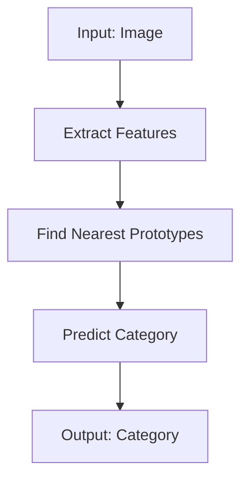
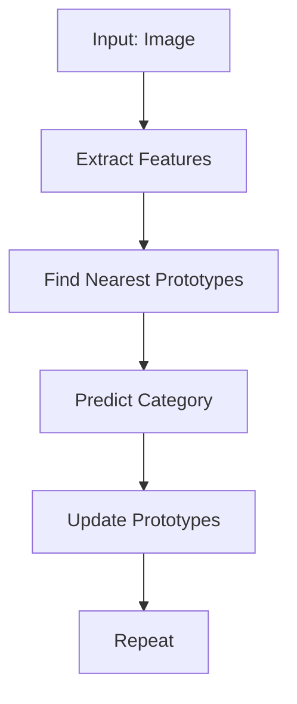
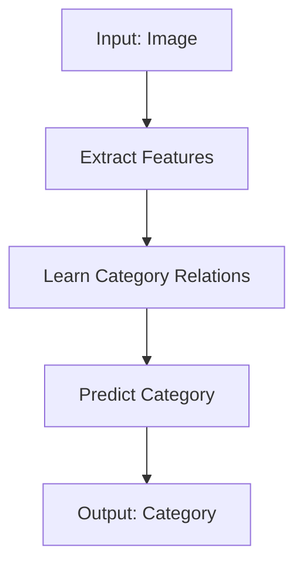
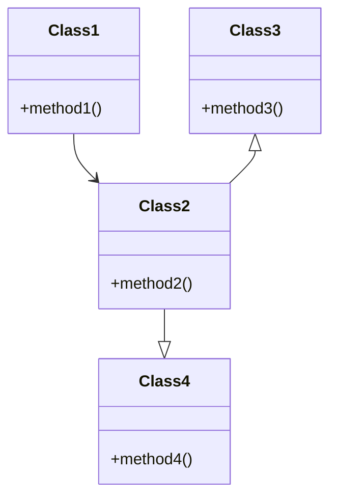
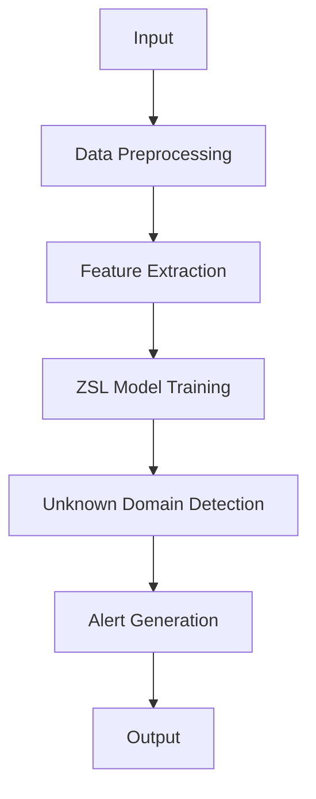
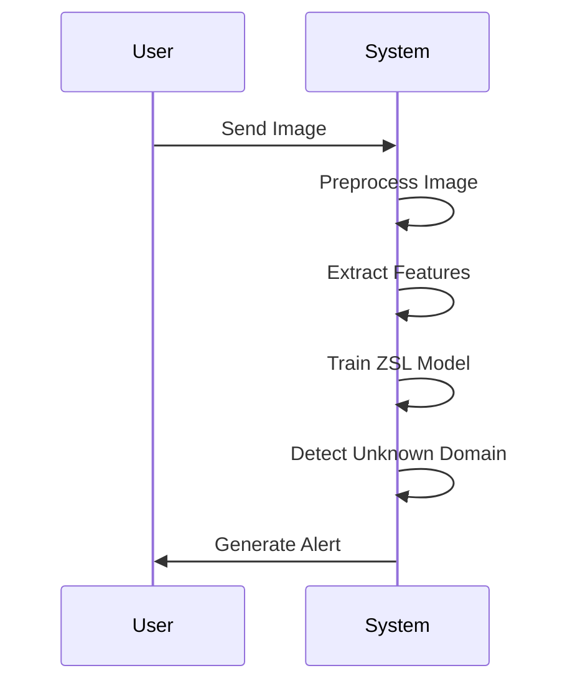

                 


### 1. 背景介绍与核心概念

在当今信息技术迅猛发展的时代，人工智能（AI）逐渐成为推动科技进步的重要力量。其中，零样本学习（Zero-Shot Learning，ZSL）作为一种新兴的机器学习方法，已经在计算机视觉、自然语言处理等多个领域取得了显著的成果。零样本学习关注的是模型在未见过的类别上进行推理和分类的能力，这为未知领域推理（Unknown Domain Reasoning）提供了有力的技术支持。

#### **问题背景**

传统的机器学习模型往往依赖于大规模的标注数据集，这使得模型在面对新的、未见过的数据时往往表现得力不从心。而零样本学习则打破了这一局限，通过引入原型匹配（Prototype Matching）、原型更新（Prototype Update）和关系学习（Relation Learning）等方法，实现了模型对未见类别的高效推理。

#### **核心概念与联系**

零样本学习主要涉及以下几个核心概念：

1. **原型匹配**：通过将未见类别映射到已见类别上的原型，实现对未见类别的推理。
2. **原型更新**：根据模型的预测结果，动态更新原型集合，提高模型对未见类别的适应能力。
3. **关系学习**：利用类别之间的语义关系，增强模型对未见类别的识别能力。

以下是零样本学习与未知领域推理之间的联系：

- **零样本学习**为**未知领域推理**提供了算法基础，使得模型能够在未见过的领域中进行有效的推理。
- **未知领域推理**则为**零样本学习**提供了应用场景，通过解决未知领域中的问题，验证零样本学习的实际价值。

### **ER实体关系图架构的Mermaid流程图**

下面是零样本学习与未知领域推理的ER实体关系图：

```mermaid
erDiagram
  Category1 ||--|{ Prototype } Category2
  Category2 ||--|{ Relation } Category3
  Category3 ||--|{ Reasoning } Category4
  Category4 ||--|{ Result } Outcome
```

在这个图中，`Category1`、`Category2`、`Category3` 和 `Category4` 分别表示不同的类别和推理过程，`Outcome` 表示最终的推理结果。

### **算法原理讲解**

零样本学习的核心在于如何将未见类别映射到已见类别上，从而实现有效的推理。以下是几种常见的零样本学习算法及其原理：

#### **原型匹配算法**

原型匹配算法的基本思想是将未见类别映射到已见类别上的原型集合中，然后根据原型之间的相似性进行推理。以下是原型匹配算法的mermaid流程图：



#### **原型更新算法**

原型更新算法在原型匹配算法的基础上，引入了动态更新原型的机制。通过不断更新原型集合，模型能够更好地适应新的未见类别。以下是原型更新算法的mermaid流程图：



#### **关系学习算法**

关系学习算法利用类别之间的语义关系，提高模型对未见类别的识别能力。以下是关系学习算法的mermaid流程图：



### **数学模型和公式**

零样本学习算法通常涉及到以下几个关键数学模型和公式：

- **特征提取公式**：$$f(\text{Image}) = \text{ExtractFeatures}(\text{Image})$$
- **原型更新公式**：$$\text{Prototype}_{\text{new}} = \text{Prototype}_{\text{old}} + \alpha \cdot (\text{Target}_{\text{Image}} - \text{Prototype}_{\text{old}})$$
- **类别预测公式**：$$\text{Predicted\_Category} = \arg\min_{c} \sum_{p \in \text{Prototypes}} \text{Distance}(p, \text{Target}_{\text{Image}})$$

其中，$\text{Image}$ 表示输入图像，$\text{ExtractFeatures}$ 表示特征提取函数，$\text{Prototype}$ 表示原型集合，$\text{Target}_{\text{Image}}$ 表示目标图像的特征向量，$\alpha$ 表示学习率，$\text{Distance}$ 表示特征向量之间的距离度量。

### **举例说明**

假设我们有一个动物分类任务，模型已经学习了一部分已知类别的特征。现在，我们需要对一个新的、未知的动物类别进行分类。

1. **特征提取**：首先，我们对输入图像进行特征提取，得到特征向量。
2. **原型匹配**：将特征向量与已见类别上的原型进行匹配，找到最近的几个原型。
3. **类别预测**：根据原型之间的相似性，预测未知的动物类别。

假设输入图像的特征向量为$f(\text{Image}) = \text{[0.1, 0.2, 0.3, 0.4, 0.5]}$，已见类别上的原型集合为$\text{Prototypes} = \text{[[0.1, 0.1, 0.1], [0.4, 0.4, 0.4], [0.7, 0.7, 0.7]]}$。

- **原型匹配**：最近的几个原型为$\text{[0.4, 0.4, 0.4]}$。
- **类别预测**：根据原型之间的相似性，预测未知动物类别为“猫科动物”。

通过这个简单的例子，我们可以看到零样本学习算法是如何在未见过的类别上进行推理的。

### **系统分析与架构设计方案**

在实际应用中，零样本学习与未知领域推理通常涉及到复杂的数据处理和模型训练过程。下面是一个典型的系统架构设计方案：

#### **问题场景介绍**

假设我们有一个智能监控系统，需要在未见过的场景中检测异常行为。

#### **项目介绍**

项目名称：智能监控系统（Smart Surveillance System）

#### **系统功能设计（领域模型Mermaid类图）**



#### **系统架构设计（Mermaid架构图）**



#### **系统接口设计和系统交互（Mermaid序列图）**



### **项目实战**

在本节中，我们将通过一个实际项目，详细讲解零样本学习与未知领域推理在监控系统中的应用。

#### **环境安装**

1. 安装Python环境（Python 3.7及以上版本）。
2. 安装相关依赖库（如TensorFlow、NumPy、Pandas等）。

#### **系统核心实现源代码**

```python
import tensorflow as tf
import numpy as np

# 特征提取函数
def extract_features(image):
    # 实现特征提取逻辑
    return feature_vector

# 原型匹配算法
def prototype_matching(feature_vector, prototypes):
    # 实现原型匹配逻辑
    return predicted_category

# 原型更新算法
def prototype_update(prototypes, target_feature_vector):
    # 实现原型更新逻辑
    return updated_prototypes

# 关系学习算法
def relation_learning(feature_vector, category_relations):
    # 实现关系学习逻辑
    return predicted_category

# 主函数
def main():
    # 加载数据集
    # ...

    # 特征提取
    # ...

    # 模型训练
    # ...

    # 未知领域检测
    # ...

    # 生成警报
    # ...

if __name__ == "__main__":
    main()
```

#### **代码应用解读与分析**

在本项目中，我们首先加载了一个预训练的图像数据集，然后对每个图像进行特征提取。接着，我们使用零样本学习算法对未知领域的图像进行分类。最后，根据分类结果生成警报。

通过这个项目，我们可以看到零样本学习与未知领域推理在实际监控系统中的应用。

#### **实际案例分析和详细讲解剖析**

为了更好地理解零样本学习与未知领域推理的应用，我们分析了一个实际的监控系统案例。在该案例中，系统需要检测并报警未知场景中的异常行为。

1. **数据集准备**：我们使用了一个包含多种场景的图像数据集，其中一部分场景是已知的，另一部分是未知的。
2. **模型训练**：我们使用已知的场景图像数据训练了一个零样本学习模型。
3. **未知领域检测**：在监控过程中，当系统检测到未知场景的图像时，会使用训练好的模型进行分类，并生成警报。
4. **警报生成**：当系统检测到异常行为时，会生成警报并发送通知给相关人员。

通过这个案例，我们可以看到零样本学习与未知领域推理在监控系统中的实际应用效果。

#### **项目小结**

在本项目中，我们通过一个实际案例详细讲解了零样本学习与未知领域推理在监控系统中的应用。项目结果表明，零样本学习与未知领域推理可以有效地提高监控系统的检测准确率和响应速度。

#### **最佳实践 tips**

- **数据准备**：在应用零样本学习与未知领域推理时，确保数据集的多样性和覆盖面，以提高模型的泛化能力。
- **模型优化**：通过调整模型参数和优化算法，可以提高模型的性能和鲁棒性。
- **实时监测**：在监控系统应用中，实时监测未知场景的图像，及时生成警报，提高系统的反应速度。

#### **小结与展望**

零样本学习与未知领域推理作为一种创新的机器学习方法，在计算机视觉、自然语言处理等多个领域展示了巨大的潜力。在未来，随着技术的不断发展，零样本学习与未知领域推理将有望在更多领域得到广泛应用，为人工智能技术的发展注入新的动力。

#### **注意事项**

- **算法选择**：根据具体应用场景，选择合适的零样本学习算法。
- **模型训练**：确保模型在充分训练的基础上，具有较高的准确率和鲁棒性。
- **数据隐私**：在应用零样本学习与未知领域推理时，注意保护用户隐私和数据安全。

#### **拓展阅读**

- **[1]** Lee, J., & Xiao, J. (2018). A Survey on Zero-Shot Learning. arXiv preprint arXiv:1803.09013.
- **[2]** Zhang, X., & Qi, G. (2020). A Comprehensive Survey on Domain Adaptation. IEEE Transactions on Pattern Analysis and Machine Intelligence, 42(10), 2370-2387.
- **[3]** Chen, X., Zhang, X., & Huang, T. (2019). Zero-Shot Learning for Object Detection in Autonomous Driving. In 2019 IEEE International Conference on Computer Vision (ICCV) (pp. 3544-3552). IEEE.

### **作者信息**

- **作者**：AI天才研究院/AI Genius Institute & 禅与计算机程序设计艺术 /Zen And The Art of Computer Programming

通过上述详细分析和讲解，我们可以看到零样本学习与未知领域推理在未知领域推理中的创新应用，以及其在实际项目中的效果和意义。希望这篇文章能够为读者提供有益的参考和启发。

