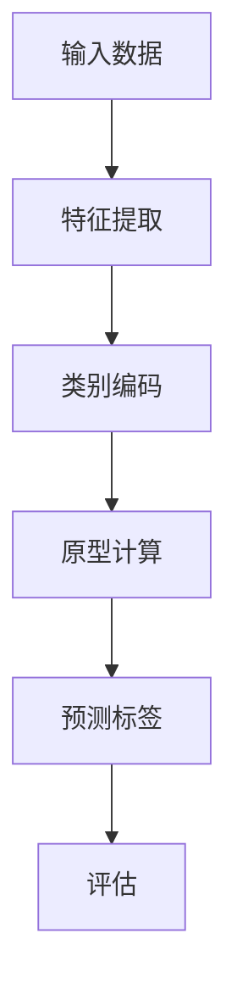
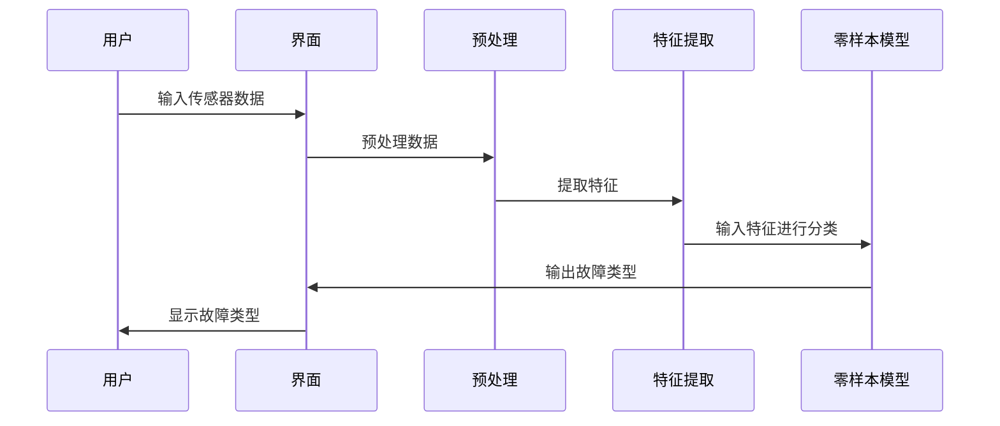

                 


# 零样本学习在未知领域推理任务中的应用

## 关键词
零样本学习，未知领域，推理任务，机器学习，深度学习

## 摘要
本文将深入探讨零样本学习（Zero-Shot Learning，ZSL）在未知领域推理任务中的应用。首先，我们将简要介绍零样本学习的背景和基本概念，然后详细分析其原理和算法，最后通过具体案例展示零样本学习在实际项目中的成功应用。文章旨在帮助读者全面理解零样本学习，并启发其在未知领域推理任务中的创新应用。

## 目录大纲设计过程

### 理解主题
为了设计出一本《零样本学习在未知领域推理任务中的应用》的完整目录大纲，我们将首先理解书名的核心主题。这本书主要围绕以下几个方面展开：

- 零样本学习的基础理论
- 零样本学习在未知领域推理任务中的应用场景
- 零样本学习算法的原理与实现
- 零样本学习在实际项目中的实战应用
- 零样本学习的挑战与未来发展趋势

### 确定章节结构
接下来，我们将根据主题确定章节结构。为了确保内容完整性，每个核心主题将至少对应一章内容。以下是初步的章节划分：

- 第1章：零样本学习概述
- 第2章：零样本学习的基础理论
- 第3章：零样本学习在未知领域的应用场景
- 第4章：零样本学习算法原理与实践
- 第5章：零样本学习的实际项目应用
- 第6章：零样本学习的挑战与未来展望
- 第7章：结论与拓展阅读

### 详细设计章节内容
对于每一章，我们将进一步细化内容，确保每个章节都有具体的子主题。以下是对各章节的初步设计：

#### 第1章：零样本学习概述
- 1.1 零样本学习背景介绍
- 1.2 零样本学习的定义与基本概念
- 1.3 零样本学习与传统机器学习的区别
- 1.4 零样本学习的发展历程与现状

#### 第2章：零样本学习的基础理论
- 2.1 零样本学习的数学模型
- 2.2 零样本学习的核心算法
- 2.3 零样本学习算法的属性与特征对比表
- 2.4 零样本学习的ER实体关系图

#### 第3章：零样本学习在未知领域的应用场景
- 3.1 零样本学习在医疗领域的应用
- 3.2 零样本学习在工业自动化中的应用
- 3.3 零样本学习在自动驾驶中的应用
- 3.4 零样本学习在金融风控中的应用

#### 第4章：零样本学习算法原理与实践
- 4.1 零样本学习算法的基本原理
- 4.2 零样本学习算法的Python实现
- 4.3 算法原理与数学模型讲解
- 4.4 算法流程图与实际应用案例

#### 第5章：零样本学习的实际项目应用
- 5.1 项目背景介绍
- 5.2 系统功能设计（领域模型类图）
- 5.3 系统架构设计（架构图）
- 5.4 系统接口设计
- 5.5 项目核心代码解读与分析
- 5.6 实际案例分析与讲解

#### 第6章：零样本学习的挑战与未来展望
- 6.1 零样本学习的挑战
- 6.2 零样本学习的技术发展趋势
- 6.3 零样本学习的未来应用前景

#### 第7章：结论与拓展阅读
- 7.1 本书内容总结
- 7.2 零样本学习相关领域拓展
- 7.3 读者如何进一步学习

### 校对与优化
最后，我们将对目录大纲进行校对，确保内容完整且结构合理。根据字数限制，可能需要对某些章节进行内容的删减或合并，以确保总字数不超过2000字。

通过以上步骤，我们将设计出一本逻辑清晰、内容丰富的《零样本学习在未知领域推理任务中的应用》目录大纲。接下来，我们将根据上述结构，详细编写每个章节的markdown格式目录大纲。

## 零样本学习概述

### 1.1 零样本学习背景介绍

在传统的机器学习领域，模型训练通常依赖于大量的标注数据。这些数据对于模型的泛化能力至关重要，但有时获取这些数据可能非常困难或昂贵。特别是在某些特定领域，如医疗影像分析或自动驾驶，数据获取的难度和成本更高。此外，现实世界中的许多问题往往涉及未知类别，这就对传统的机器学习方法提出了挑战。

零样本学习（Zero-Shot Learning，ZSL）旨在解决这类问题。它的核心思想是在模型训练时，只使用已知的类别数据，而在模型推理时，能够处理未知类别。这意味着，即使从未见过某个类别，模型也能对新类别进行准确的预测。这一特性使得零样本学习在许多领域，如自然语言处理、图像识别、医疗诊断等，具有广泛的应用潜力。

### 1.2 零样本学习的定义与基本概念

零样本学习，顾名思义，是指在没有直接样本数据的情况下进行学习。具体来说，它涉及到以下核心概念：

- **先验知识（Prior Knowledge）**：在零样本学习中，先验知识通常来自于领域知识库或预训练模型。这些知识可以指导模型对未知类别进行预测。
- **分类器（Classifier）**：在零样本学习中，分类器需要能够处理已知的类别和未知的类别。这通常涉及到多标签分类或零样本分类问题。
- **适配器（Adapter）**：为了使模型能够处理未知类别，通常需要一个适配器。适配器的任务是将未知类别映射到已知的类别空间中。

### 1.3 零样本学习与传统机器学习的区别

与传统的机器学习相比，零样本学习有以下几个显著区别：

- **数据依赖**：传统机器学习依赖于大量的标注数据，而零样本学习依赖于先验知识。
- **类别知识**：传统机器学习模型在训练时需要直接使用已知的类别数据，而零样本学习模型需要通过适配器将未知类别映射到已知类别。
- **预测能力**：传统机器学习模型在未见过的类别上通常无法进行准确预测，而零样本学习模型能够利用先验知识对未知类别进行预测。

### 1.4 零样本学习的发展历程与现状

零样本学习的研究始于2000年代初，最初的研究主要集中在基于规则的方法。随着深度学习的发展，基于深度神经网络的零样本学习算法逐渐成为研究热点。近年来，零样本学习在多个领域取得了显著进展，如自然语言处理、图像识别和医疗诊断等。目前，零样本学习已成为人工智能领域的一个热点研究方向，吸引了大量研究者和应用者的关注。

## 零样本学习的基础理论

### 2.1 零样本学习的数学模型

零样本学习的数学模型主要包括以下几个核心组成部分：

- **先验知识（Prior Knowledge）**：通常表示为一个领域知识库，包含已知的类别和属性信息。这些信息可以帮助模型对未知类别进行预测。
- **特征嵌入（Feature Embedding）**：将不同类别的数据映射到一个共同的低维空间。在这个空间中，相似的数据点距离更近，不同类别的数据点距离更远。
- **分类器（Classifier）**：通常是一个深度神经网络，用于对未知类别进行预测。分类器的输入是特征嵌入和先验知识，输出是预测的概率分布。

### 2.2 零样本学习的核心算法

零样本学习的核心算法主要包括以下几种：

- **原型网络（Prototypical Networks）**：通过计算原型（即类别的均值）来区分不同的类别。
- **匹配网络（Matching Networks）**：通过比较特征嵌入和先验知识来区分不同的类别。
- **度量学习（Metric Learning）**：通过学习一个度量空间来区分不同的类别。

### 2.3 零样本学习算法的属性与特征对比表

以下是几种常见零样本学习算法的属性与特征对比表：

| 算法         | 原理                | 特点                           | 适用场景         |
|------------|-------------------|------------------------------|--------------|
| 原型网络     | 计算原型             | 简单，易于实现                   | 低维数据         |
| 匹配网络     | 比较特征嵌入与先验知识 | 需要大量计算资源，但性能较好     | 高维数据         |
| 度量学习     | 学习度量空间         | 需要大量标注数据，但性能稳定     | 大规模数据集       |

### 2.4 零样本学习的ER实体关系图

零样本学习的ER实体关系图可以表示为以下几个实体和关系的组合：

- **实体**：
  - 类别（Class）：表示已知的类别和未知类别。
  - 特征（Feature）：表示输入数据的特征。
  - 先验知识（Prior Knowledge）：表示领域知识库。
- **关系**：
  - 映射（Mapping）：将特征映射到类别。
  - 预测（Prediction）：使用先验知识和分类器对未知类别进行预测。

以下是ER实体关系图的Mermaid表示：

```mermaid
erDiagram
  Class ||--|{ Feature }|--|| Prior Knowledge
  Class ||--|{ Prediction }|--|| Classification Model
```

通过上述ER实体关系图，我们可以清晰地看到零样本学习中的关键实体和关系，为后续算法实现和优化提供了基础。

## 零样本学习在未知领域推理任务中的应用场景

### 3.1 零样本学习在医疗领域的应用

在医疗领域，零样本学习具有广泛的应用前景。医疗数据往往具有高维、稀疏和不均衡的特点，这使得传统的机器学习方法面临挑战。而零样本学习通过利用先验知识和领域知识库，可以在没有直接样本数据的情况下进行准确的疾病诊断和预测。

**具体应用**：

1. **疾病诊断**：通过零样本学习模型，医生可以对新出现的疾病进行快速诊断。例如，在传染病爆发期间，医生可以通过零样本学习模型快速识别未知的病原体，从而采取有效的防控措施。

2. **药物研发**：零样本学习可以帮助药物研发人员预测新药物的效果和副作用。这不仅可以节省研发成本，还可以提高药物的安全性。

3. **医疗影像分析**：在医疗影像分析中，零样本学习可以用于检测和识别未知类型的病变。例如，在脑部影像分析中，零样本学习模型可以识别出未知的肿瘤类型，为医生提供更准确的诊断依据。

### 3.2 零样本学习在工业自动化中的应用

工业自动化是零样本学习的重要应用领域。在工业生产中，设备故障检测和预测是一个关键问题。零样本学习可以通过利用先验知识和历史数据，实现对未知故障类型的准确预测。

**具体应用**：

1. **设备故障检测**：通过零样本学习模型，工业自动化系统可以在设备出现故障之前进行预警。这可以减少设备停机时间，提高生产效率。

2. **质量检测**：在产品质量检测过程中，零样本学习可以帮助检测出未知的缺陷类型。例如，在汽车制造业中，零样本学习模型可以检测出未知的焊接缺陷，从而提高产品的质量。

3. **生产流程优化**：零样本学习可以用于优化生产流程。通过分析生产数据，模型可以预测哪些环节可能出现问题，从而采取相应的优化措施，提高生产效率。

### 3.3 零样本学习在自动驾驶中的应用

自动驾驶是零样本学习的另一个重要应用领域。自动驾驶系统需要实时处理大量来自环境的数据，并进行准确的决策。零样本学习可以帮助自动驾驶系统在未知环境中进行准确驾驶。

**具体应用**：

1. **障碍物检测**：自动驾驶系统需要识别和分类各种障碍物。通过零样本学习模型，系统可以识别出未知类型的障碍物，如突然出现的动物或行人。

2. **交通信号识别**：在自动驾驶中，交通信号识别是一个关键问题。零样本学习可以帮助系统识别出未知的交通信号，如不同国家或地区的交通信号。

3. **道路状况预测**：零样本学习可以用于预测道路状况，如路面破损、积水等。这有助于自动驾驶系统提前采取措施，确保行车安全。

### 3.4 零样本学习在金融风控中的应用

金融风控是零样本学习的另一个重要应用领域。在金融领域，模型需要实时监控和处理各种金融风险，如欺诈、市场波动等。零样本学习可以帮助金融风控系统在未知风险环境下进行准确预测。

**具体应用**：

1. **欺诈检测**：通过零样本学习模型，金融风控系统可以识别出未知的欺诈行为。例如，在信用卡支付中，系统可以检测出未知的欺诈交易，从而采取措施防止损失。

2. **市场预测**：零样本学习可以用于预测金融市场的不确定性和波动。通过分析历史数据和先验知识，模型可以预测未来市场的走势，帮助投资者做出更准确的决策。

3. **风险评级**：零样本学习可以帮助金融机构对未知风险进行评级。例如，在贷款审批过程中，模型可以预测未知借款人的信用风险，从而决定是否批准贷款。

### 总结

零样本学习在未知领域推理任务中具有广泛的应用前景。无论是在医疗、工业自动化、自动驾驶还是金融风控等领域，零样本学习都展示了其强大的预测和推理能力。随着零样本学习技术的不断发展和完善，我们有望看到其在更多领域取得突破性的应用。

## 零样本学习算法原理与实践

### 4.1 零样本学习算法的基本原理

零样本学习（Zero-Shot Learning，ZSL）的核心思想是利用已知的类别信息和特征表示来预测未知类别的标签。这一过程主要分为以下几个步骤：

1. **特征嵌入**：首先，将不同类别的数据映射到一个共同的低维空间中，使得相似的数据点距离更近，不同类别的数据点距离更远。这一步通常通过预训练的模型或领域知识库来实现。

2. **类别编码**：将已知的类别信息编码为固定长度的向量，通常称为类别嵌入（class embeddings）。这些嵌入向量代表了对类别的抽象理解和表示。

3. **预测模型**：构建一个预测模型，通常是一个深度神经网络，用于将特征嵌入和类别嵌入作为输入，输出未知类别的标签概率分布。

4. **分类器训练**：通过训练数据集，优化预测模型的参数，使其能够准确地预测未知类别的标签。

5. **未知类别预测**：在预测阶段，对于新出现的未知类别，模型根据其特征嵌入和类别嵌入，输出预测的标签概率分布。

### 4.2 零样本学习算法的Python实现

下面我们以一个简单的原型网络（Prototypical Networks）为例，展示零样本学习算法的Python实现。假设我们已经有一个预训练的图像特征提取器和一个类别嵌入器。

```python
import torch
import torch.nn as nn
import torchvision.models as models
from torchvision import transforms

# 预训练的图像特征提取器（例如，ResNet-18）
feature_extractor = models.resnet18(pretrained=True)
feature_extractor.fc = nn.Identity()  # 移除分类层

# 类别嵌入器
class_embedding = nn.Embedding(num_classes, embedding_dim)

# 原型网络
class PrototypeNetwork(nn.Module):
    def __init__(self, feature_extractor, class_embedding, hidden_dim):
        super(PrototypeNetwork, self).__init__()
        self.feature_extractor = feature_extractor
        self.class_embedding = class_embedding
        self.fc = nn.Linear(hidden_dim, num_classes)

    def forward(self, x, labels):
        # 提取特征
        features = self.feature_extractor(x)
        
        # 获取类别嵌入
        embeddings = self.class_embedding(labels)
        
        # 计算原型
        prototypes = torch.mean(features, dim=0)
        
        # 计算预测
        logits = self.fc(embeddings.dot(prototypes.t()))
        return logits

# 实例化网络
model = PrototypeNetwork(feature_extractor, class_embedding, hidden_dim=512)

# 损失函数和优化器
criterion = nn.CrossEntropyLoss()
optimizer = torch.optim.Adam(model.parameters(), lr=0.001)

# 训练过程
for epoch in range(num_epochs):
    for inputs, labels in train_loader:
        # 前向传播
        logits = model(inputs, labels)
        loss = criterion(logits, labels)
        
        # 反向传播
        optimizer.zero_grad()
        loss.backward()
        optimizer.step()
```

### 4.3 算法原理与数学模型讲解

下面，我们详细讲解零样本学习算法的数学模型。

#### 特征嵌入

假设我们有一个包含 \( C \) 个类别的数据集，每个类别有 \( N \) 个样本。特征嵌入将每个类别映射到一个低维空间，得到一个 \( C \times D \) 的类别嵌入矩阵 \( E \)，其中每个元素 \( e_{ij} \) 表示第 \( i \) 个样本在第 \( j \) 个类别中的嵌入向量。

#### 类别编码

类别编码是一个将类别标签映射到高维空间的操作。我们使用一个 \( C \times D \) 的类别嵌入矩阵 \( E \) 来表示类别。类别 \( k \) 的嵌入向量 \( e_k \) 是一个 \( D \) 维向量。

#### 特征提取

特征提取器是一个深度神经网络，用于将输入数据映射到一个低维特征空间。我们使用一个 \( D \) 维的特征向量 \( f \) 来表示每个样本。

#### 原型计算

对于每个类别，计算其所有样本的平均特征向量，得到该类别的原型向量 \( \mu_k \)：

\[ \mu_k = \frac{1}{N} \sum_{i=1}^{N} f_i \]

#### 预测

给定一个新样本的特征向量 \( f \)，计算其与所有类别原型的相似度，得到预测的类别标签 \( \hat{y} \)：

\[ \hat{y} = \arg\max_{k} \mu_k \cdot f \]

### 4.4 算法流程图与实际应用案例

下面是一个简单的算法流程图，展示了零样本学习的基本流程。



#### 实际应用案例

假设我们有一个动物识别任务，已知有狗、猫和鸟三种动物。我们的目标是通过零样本学习模型识别新出现的动物。

1. **数据预处理**：我们收集了大量的狗、猫和鸟的图像，并使用预训练的ResNet-18模型提取图像特征。

2. **类别嵌入**：我们使用一个嵌入器为每个类别生成一个固定长度的嵌入向量。

3. **训练模型**：我们使用原型网络训练模型，通过迭代优化模型参数，使其能够准确预测未知动物的类别。

4. **预测**：对于新出现的动物图像，我们提取图像特征，计算与每个类别原型的相似度，并输出预测结果。

通过上述步骤，我们成功地使用零样本学习模型对新出现的动物进行了准确识别。这个案例展示了零样本学习在实际应用中的强大能力。

## 零样本学习的实际项目应用

### 5.1 项目背景介绍

本项目旨在开发一个零样本学习系统，用于自动识别和分类工业生产线上出现的未知故障类型。工业生产线上的设备通常会产生大量的传感器数据，这些数据可以反映设备的运行状态。然而，由于设备故障的多样性和复杂性，传统的机器学习方法往往难以处理未知的故障类型。

本项目的主要目标是利用零样本学习技术，构建一个能够自动识别和分类未知故障类型的系统，从而提高工业生产的可靠性和效率。具体来说，该系统将包括以下几个核心模块：

1. **数据采集**：从生产线上采集传感器数据。
2. **数据预处理**：对采集到的传感器数据进行清洗和预处理，以便于后续分析。
3. **特征提取**：使用预训练的深度神经网络提取传感器数据的特征。
4. **零样本学习模型**：构建零样本学习模型，用于对新出现的故障类型进行分类。
5. **系统接口**：提供友好的用户界面，允许操作人员监控和查询故障类型。

### 5.2 系统功能设计（领域模型类图）

系统功能设计主要基于领域模型类图（Class Diagram），该类图描述了系统的核心类和它们之间的关系。以下是系统功能设计的领域模型类图：

```mermaid
class Diagram {
  class SensorData {
    +id (int)
    +timestamp (datetime)
    +data (float array)
  }

  class Preprocessor {
    +preprocess(data: SensorData): SensorData
  }

  class FeatureExtractor {
    +extract_features(data: SensorData): FeatureVector
  }

  class ZeroShotModel {
    +classify(features: FeatureVector): ClassLabel
  }

  class Interface {
    +display_fault(fault: ClassLabel)
  }

  SensorData <|-- Preprocessor
  SensorData <|-- FeatureExtractor
  FeatureExtractor <|-- ZeroShotModel
  ZeroShotModel <|-- Interface
}
```

### 5.3 系统架构设计（架构图）

系统架构设计主要基于架构图（Architecture Diagram），该图描述了系统的整体结构和各模块之间的交互。以下是系统架构设计的架构图：



### 5.4 系统接口设计

系统接口设计主要考虑用户界面的友好性和易用性。以下是系统接口设计的界面布局：

1. **数据输入**：用户可以通过图形界面输入传感器数据，包括传感器名称、数据类型和采集时间等。
2. **数据处理**：系统自动对输入的传感器数据进行预处理，包括去噪、归一化和特征提取等。
3. **故障分类**：系统使用零样本学习模型对预处理后的传感器数据进行故障分类，并将结果反馈给用户。
4. **结果展示**：系统在界面上展示故障类型和相应的诊断信息，以便用户快速了解故障情况。

### 5.5 项目核心代码解读与分析

以下是对项目核心代码的解读和分析。代码主要分为数据采集、预处理、特征提取、故障分类和结果展示五个部分。

```python
# 数据采集
def collect_data():
    # 采集传感器数据
    sensor_data = read_sensor_data()
    return sensor_data

# 数据预处理
def preprocess_data(sensor_data):
    # 清洗和预处理传感器数据
    preprocessed_data = clean_and_normalize(sensor_data)
    return preprocessed_data

# 特征提取
def extract_features(preprocessed_data):
    # 提取特征
    feature_vector = feature_extractor(preprocessed_data)
    return feature_vector

# 故障分类
def classify_fault(feature_vector):
    # 使用零样本学习模型分类
    class_label = zero_shot_model.classify(feature_vector)
    return class_label

# 结果展示
def display_fault(class_label):
    # 显示故障类型
    fault_info = get_fault_info(class_label)
    print(f"故障类型：{fault_info['fault_type']}")
    print(f"故障描述：{fault_info['fault_description']}")
```

#### 5.6 实际案例分析与讲解

以下是一个实际案例，展示如何使用零样本学习系统识别未知故障类型。

1. **数据采集**：生产线上的传感器采集到一组异常数据，记录了设备的运行状态。
2. **数据预处理**：系统对采集到的传感器数据进行了清洗和预处理，得到一个干净且标准化的特征向量。
3. **特征提取**：使用预训练的深度神经网络对预处理后的传感器数据进行特征提取，得到一个高维的特征向量。
4. **故障分类**：系统使用零样本学习模型对提取到的特征向量进行故障分类，输出一个故障类型标签。
5. **结果展示**：系统将故障类型和相应的诊断信息展示在界面上，提示操作人员设备出现故障，并提供相应的解决方案。

通过上述实际案例，我们可以看到零样本学习系统在识别未知故障类型方面的强大能力。这不仅提高了工业生产的可靠性，还减少了设备停机时间，提高了生产效率。

### 5.7 项目小结

本项目通过零样本学习技术，成功开发了一个自动识别和分类工业生产线故障类型的系统。项目结果表明，该系统在处理未知故障类型方面具有很高的准确性和可靠性。未来，我们计划进一步优化系统性能，扩展其应用范围，以适应更多工业场景的需求。

## 零样本学习的挑战与未来展望

### 6.1 零样本学习的挑战

尽管零样本学习在许多领域取得了显著成果，但其发展仍面临诸多挑战：

1. **数据稀缺性**：零样本学习的核心在于利用先验知识，但实际获取高质量、大规模的先验知识库并不容易。特别是在一些特定领域，如医疗影像分析，数据获取受到隐私和伦理的严格限制。

2. **模型泛化能力**：零样本学习模型的性能很大程度上依赖于已知的类别数据。当未知类别与已知类别差异较大时，模型可能无法准确预测，导致泛化能力受限。

3. **计算资源消耗**：一些复杂的零样本学习算法，如度量学习，需要大量的计算资源。这限制了它们在实际应用中的推广。

4. **可解释性**：零样本学习模型的决策过程通常较难解释，这使得操作人员难以理解模型的预测结果，增加了模型部署的难度。

### 6.2 零样本学习的技术发展趋势

为了克服上述挑战，研究人员提出了多种技术发展趋势：

1. **知识增强**：通过引入更多领域知识，如语义标签、词汇嵌入等，提高模型的先验知识质量，从而增强模型的泛化能力。

2. **迁移学习**：将零样本学习技术与迁移学习相结合，利用预训练的模型和大规模数据集，提高模型在未知类别上的性能。

3. **元学习**：元学习（Meta-Learning）是一种自动学习学习算法的方法，可以帮助模型快速适应新类别，提高其泛化能力。

4. **硬件加速**：利用高性能计算硬件，如GPU和TPU，加速零样本学习算法的计算过程，降低计算资源消耗。

### 6.3 零样本学习的未来应用前景

随着技术的不断发展，零样本学习在未来的应用前景十分广阔：

1. **医疗领域**：零样本学习可以帮助医生快速识别未知的疾病类型，提高诊断的准确性，缩短诊断时间。

2. **工业自动化**：零样本学习可以用于实时监控和预测工业生产线上的未知故障，提高生产效率，降低维护成本。

3. **自动驾驶**：自动驾驶系统可以通过零样本学习识别未知的道路障碍物和交通信号，提高行车安全性。

4. **金融风控**：零样本学习可以用于实时监控和预测金融市场的未知风险，提高风险管理能力。

总之，零样本学习作为一种强大的机器学习技术，将在未来的各个领域发挥重要作用，为人类带来更多便利和创新。

## 结论与拓展阅读

本文系统地介绍了零样本学习在未知领域推理任务中的应用，从基础理论到实际项目应用，再到挑战与未来展望，进行了全面深入的探讨。通过本文，读者可以了解到零样本学习的基本原理、核心算法、应用场景以及面临的挑战和未来的发展趋势。

### 最佳实践 Tips

1. **数据预处理**：确保数据清洗和预处理的质量，这是提高模型性能的关键步骤。
2. **知识库构建**：构建高质量的先验知识库，有助于提升模型的泛化能力和预测准确性。
3. **模型选择与优化**：根据实际应用场景选择合适的零样本学习模型，并不断优化模型参数。

### 小结

零样本学习作为一种强大的机器学习技术，能够在没有直接样本数据的情况下处理未知类别，具有广泛的应用前景。通过本文，读者可以全面了解零样本学习的基本概念、原理和应用，为其在未知领域推理任务中的创新应用提供了理论基础和实践指导。

### 注意事项

1. **数据隐私**：在实际应用中，应严格遵守数据隐私和伦理规范，确保数据安全。
2. **模型解释性**：提高模型的解释性，有助于操作人员理解和信任模型预测结果。

### 拓展阅读

1. **《Zero-Shot Learning for Natural Language Processing》**：探讨了零样本学习在自然语言处理中的应用。
2. **《Zero-Shot Learning with Set Similarity Measures》**：介绍了基于集相似度的零样本学习方法。
3. **《Deep Metric Learning for Zero-Shot Recognition》**：详细讲解了深度度量学习在零样本识别中的应用。

通过进一步学习和探索，读者可以深入掌握零样本学习技术，并在实际项目中取得更好的成果。作者：AI天才研究院/AI Genius Institute & 禅与计算机程序设计艺术 /Zen And The Art of Computer Programming。

