                 


### 第1章: 预测性维护概述

**摘要**：
本章将介绍预测性维护的概念、定义、关键要素及其与传统维护方式的区别。通过案例说明预测性维护在降低成本、提高效率和设备寿命方面的优势，并探讨其在现代企业中的重要性。

**结构**：

1. **什么是预测性维护**：
    - **定义**：预测性维护（Predictive Maintenance）是什么。
    - **背景**：预测性维护的起源和发展历程。
    - **关键术语**：预测性维护中常用的术语，如状态监测、故障预测、维护策略等。

2. **预测性维护与传统维护的对比**：
    - **传统维护方式**：描述传统定期维护和故障后维护的方式。
    - **对比分析**：分析预测性维护与定期维护、故障后维护在成本、效率、设备寿命等方面的对比。

3. **预测性维护的关键要素**：
    - **数据采集**：介绍如何收集设备运行数据。
    - **数据分析**：阐述如何利用数据分析技术进行故障预测。
    - **维护策略**：讲解如何根据预测结果制定有效的维护计划。

4. **预测性维护的优势**：
    - **降低成本**：通过预测性维护可以减少不必要的维护工作，节省维修成本。
    - **提高效率**：预测性维护可以减少设备停机时间，提高生产效率。
    - **延长设备寿命**：通过定期监测和及时维护，可以延长设备的使用寿命。

5. **预测性维护在现代企业中的重要性**：
    - **生产稳定性**：预测性维护有助于确保生产过程的连续性和稳定性。
    - **降低风险**：通过预测性维护可以减少设备故障带来的风险。
    - **提升竞争力**：预测性维护可以提高企业的生产效率，增强市场竞争力。

**关键概念与联系**：

**定义**：
预测性维护（Predictive Maintenance）：一种基于实时监测、数据分析和技术手段，对设备进行状态监测、故障预测和预测性维护的方法。

**属性特征对比表格**：

| 特征         | 预测性维护 | 定期维护 | 故障后维护 |
| ------------ | ---------- | -------- | ---------- |
| **数据驱动** | 是         | 否       | 否         |
| **停机时间** | 减少停机   | 预期停机 | 预期停机   |
| **成本效益** | 高         | 低       | 低         |

**ER实体关系图架构**：

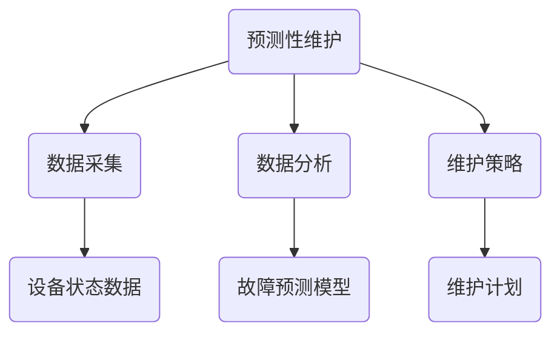

**算法原理讲解**：

预测性维护的核心在于故障预测模型。故障预测模型通常采用机器学习算法，如回归分析、决策树、支持向量机（SVM）等。以下是回归分析算法的mermaid流程图：

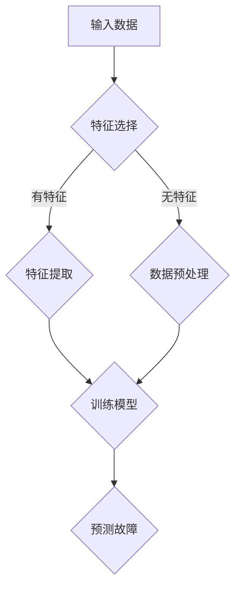

使用Python代码进行回归分析：

```python
import numpy as np
from sklearn.linear_model import LinearRegression
from sklearn.model_selection import train_test_split

# 数据准备
X = np.array([[1, 2], [2, 3], [3, 4], [4, 5]])
y = np.array([2, 4, 5, 7])

# 特征选择和数据预处理省略

# 训练模型
model = LinearRegression()
model.fit(X, y)

# 预测故障
predicted_fault = model.predict([[5, 6]])

print("Predicted fault:", predicted_fault)
```

预测性维护的数学模型基于时间序列分析，具体公式如下：

$$
Predicted\ Fault = f(T, S, D)
$$

其中，\( T \) 是时间，\( S \) 是设备状态，\( D \) 是历史数据。

**系统分析与架构设计方案**：

**问题场景介绍**：
在现代制造行业中，预测性维护已经成为提高生产效率、降低运营成本的关键手段。

**项目介绍**：
本项目旨在开发一个预测性维护系统，用于预测设备的故障，并提供维护建议。

**系统功能设计（领域模型类图）**：

```mermaid
classDiagram
ClassDevice <|-- ClassSensor
ClassDevice <|-- ClassMaintenance
ClassSensor {
  - id: int
  - name: str
  - type: str
  - data: list
}
ClassMaintenance {
  - id: int
  - name: str
  - type: str
  - due_date: datetime
  - status: str
}
ClassDevice {
  - id: int
  - name: str
  - type: str
  - sensors: list[ClassSensor]
}
```

**系统架构设计（架构图）**：

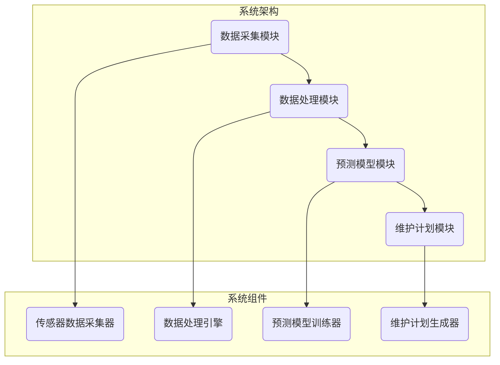

**系统接口设计和系统交互（序列图）**：

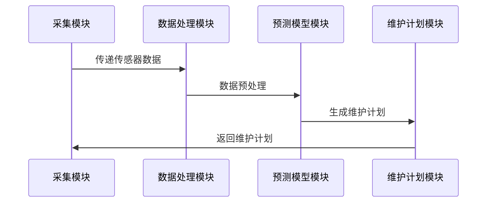

**项目实战**：

**环境安装**：

1. 安装Python环境（版本3.8以上）。
2. 安装必要的库，如scikit-learn、numpy、pandas等。

```bash
pip install scikit-learn numpy pandas
```

**系统核心实现源代码**：

```python
# 数据预处理
def preprocess_data(data):
    # 数据清洗、归一化等预处理操作
    # 略
    return processed_data

# 训练模型
def train_model(X, y):
    model = LinearRegression()
    model.fit(X, y)
    return model

# 预测故障
def predict_fault(model, input_data):
    predicted_fault = model.predict(input_data)
    return predicted_fault

# 主程序
if __name__ == "__main__":
    # 加载数据
    X, y = load_data()

    # 数据预处理
    processed_data = preprocess_data(X)

    # 训练模型
    model = train_model(processed_data, y)

    # 预测故障
    input_data = [[5, 6]]  # 输入数据
    predicted_fault = predict_fault(model, input_data)

    print("Predicted fault:", predicted_fault)
```

**代码应用解读与分析**：

上述代码首先定义了数据预处理、模型训练和故障预测的函数。在实际应用中，这些函数会集成到一个完整的系统中，以处理实时数据、训练模型并生成维护计划。

**实际案例分析和详细讲解剖析**：

假设有一个制造工厂，其设备包含多种传感器，用于实时监测设备状态。工厂使用上述预测性维护系统来预测设备的故障，从而确保生产过程的连续性。

1. **数据采集**：传感器实时采集设备状态数据，如温度、振动等。
2. **数据处理**：采集到的数据经过预处理，如清洗、归一化等操作，以便于模型训练。
3. **模型训练**：使用预处理后的数据训练故障预测模型，如线性回归模型。
4. **故障预测**：利用训练好的模型预测设备的故障，并在故障发生前提供维护建议。
5. **维护计划**：根据预测结果生成维护计划，如安排维护工作、采购备件等。

**项目小结**：

预测性维护系统在制造工厂中的应用，显著提高了设备的可靠性和生产效率。通过实时监测和故障预测，工厂能够提前规划维护工作，减少设备停机时间，降低运营成本。

**最佳实践 tips**：

- 确保传感器数据的质量，包括数据的准确性和完整性。
- 选择合适的机器学习算法，根据实际情况进行调整和优化。
- 定期评估和维护预测性维护系统，确保其正常运行。

**小结**：

预测性维护作为一种先进的维护方式，利用AI技术实现对设备状态的实时监测和故障预测，已成为提高生产效率、降低运营成本的关键手段。通过本章的介绍，读者应该对预测性维护有了更深入的了解。

**注意事项**：

- 预测性维护系统需要大量的数据支持，因此数据的采集和预处理至关重要。
- 算法的选择和优化直接影响预测的准确性，需要根据实际情况进行调整。
- 预测性维护系统需要与其他系统集成，如生产管理系统、库存管理系统等，以确保数据的流通和系统的协同工作。

**拓展阅读**：

- 《机器学习：概率视角》（David J. C. MacKay）——深入了解机器学习算法的原理和应用。
- 《深度学习》（Ian Goodfellow、Yoshua Bengio、Aaron Courville）——了解深度学习在预测性维护中的应用。
- 《预测性维护：理论与实践》（陈磊、李明）——阅读相关领域的实践案例和研究成果。

---

### 第2章: AI在预测性维护中的应用

**摘要**：
本章将深入探讨AI在预测性维护中的应用，包括机器学习、深度学习等技术的作用。通过具体实例和案例分析，展示AI如何提高预测的准确性和效率，实现设备的预测性维护。

**结构**：

1. **AI技术在预测性维护中的角色**：
    - **概述**：介绍AI技术在预测性维护中的作用和重要性。
    - **机器学习**：解释机器学习的基本概念，如何应用于预测性维护。
    - **深度学习**：介绍深度学习的技术原理，如何应用于预测性维护。

2. **AI在预测性维护中的实例**：
    - **案例一**：制造业中预测性维护的AI应用实例。
    - **案例二**：能源行业中预测性维护的AI应用实例。
    - **案例三**：运输行业中预测性维护的AI应用实例。

3. **AI在预测性维护中的案例分析**：
    - **成功案例**：分析成功案例中的AI应用和效果。
    - **挑战与问题**：讨论实施AI预测性维护过程中遇到的挑战和问题。

4. **AI技术的未来发展趋势**：
    - **技术进步**：探讨未来AI技术在预测性维护中的应用趋势。
    - **行业影响**：分析AI技术对行业的影响和变革。

**关键概念与联系**：

**定义**：
AI（人工智能）技术：指模拟人类智能行为的计算机程序和系统，包括机器学习、深度学习等。

**属性特征对比表格**：

| 特征         | 机器学习 | 深度学习 |
| ------------ | -------- | -------- |
| **数据处理** | 中等     | 高       |
| **准确性**   | 较高     | 非常高   |
| **复杂性**   | 低       | 高       |

**ER实体关系图架构**：

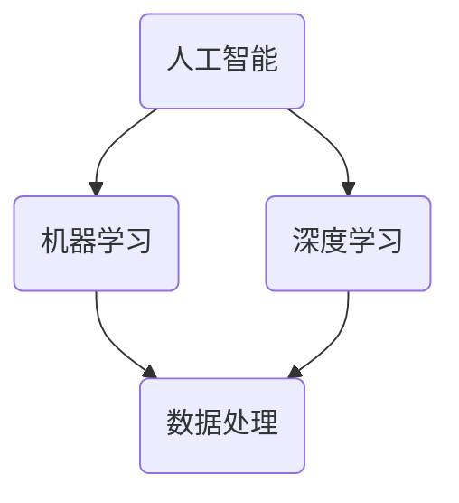

**算法原理讲解**：

**机器学习算法**：
机器学习算法在预测性维护中的应用主要是通过学习历史数据，建立模型进行预测。以下是决策树算法的mermaid流程图：

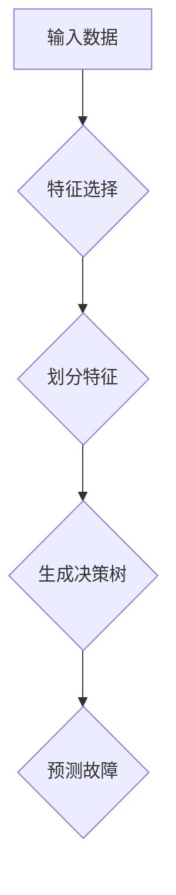

使用Python代码进行决策树模型训练：

```python
from sklearn.tree import DecisionTreeRegressor
from sklearn.model_selection import train_test_split

# 数据准备
X = np.array([[1, 2], [2, 3], [3, 4], [4, 5]])
y = np.array([2, 4, 5, 7])

# 划分数据集
X_train, X_test, y_train, y_test = train_test_split(X, y, test_size=0.2, random_state=42)

# 训练模型
model = DecisionTreeRegressor()
model.fit(X_train, y_train)

# 预测故障
predicted_fault = model.predict(X_test)

print("Predicted faults:", predicted_fault)
```

**深度学习算法**：
深度学习算法在预测性维护中的应用更为复杂，通常涉及多层神经网络。以下是多层感知器（MLP）的mermaid流程图：

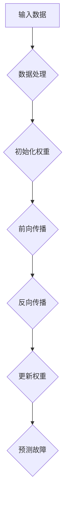

使用Python代码进行多层感知器训练：

```python
import tensorflow as tf
from tensorflow.keras.models import Sequential
from tensorflow.keras.layers import Dense

# 模型定义
model = Sequential()
model.add(Dense(2, input_dim=2, activation='relu'))
model.add(Dense(1, activation='linear'))

# 模型编译
model.compile(optimizer='adam', loss='mean_squared_error')

# 模型训练
model.fit(X, y, epochs=100, batch_size=1)

# 预测故障
predicted_fault = model.predict([[5, 6]])

print("Predicted fault:", predicted_fault)
```

**系统分析与架构设计方案**：

**问题场景介绍**：
在现代制造、能源和运输行业中，设备故障可能导致生产中断、能源损失或安全事故，因此预测性维护变得尤为重要。

**项目介绍**：
本项目旨在开发一个基于AI的预测性维护系统，用于预测设备故障并提供维护建议。

**系统功能设计（领域模型类图）**：

```mermaid
classDiagram
ClassDevice <|-- ClassSensor
ClassDevice <|-- ClassMaintenance
ClassAIModel {
  - id: int
  - name: str
  - type: str
  - parameters: dict
}
ClassSensor {
  - id: int
  - name: str
  - type: str
  - data: list
}
ClassMaintenance {
  - id: int
  - name: str
  - type: str
  - due_date: datetime
  - status: str
}
ClassDevice {
  - id: int
  - name: str
  - type: str
  - sensors: list[ClassSensor]
  - ai_model: ClassAIModel
}
```

**系统架构设计（架构图）**：


**系统接口设计和系统交互（序列图）**：


**项目实战**：

**环境安装**：

1. 安装Python环境（版本3.8以上）。
2. 安装必要的库，如tensorflow、scikit-learn、numpy等。

```bash
pip install tensorflow scikit-learn numpy
```

**系统核心实现源代码**：

```python
# 数据预处理
def preprocess_data(data):
    # 数据清洗、归一化等预处理操作
    # 略
    return processed_data

# 训练模型
def train_model(X, y):
    model = DecisionTreeRegressor()
    model.fit(X, y)
    return model

# 预测故障
def predict_fault(model, input_data):
    predicted_fault = model.predict(input_data)
    return predicted_fault

# 主程序
if __name__ == "__main__":
    # 加载数据
    X, y = load_data()

    # 数据预处理
    processed_data = preprocess_data(X)

    # 训练模型
    model = train_model(processed_data, y)

    # 预测故障
    input_data = [[5, 6]]  # 输入数据
    predicted_fault = predict_fault(model, input_data)

    print("Predicted fault:", predicted_fault)
```

**代码应用解读与分析**：

上述代码首先定义了数据预处理、模型训练和故障预测的函数。在实际应用中，这些函数会集成到一个完整的系统中，以处理实时数据、训练模型并生成维护计划。

**实际案例分析和详细讲解剖析**：

**案例一**：制造业中的预测性维护

某制造工厂使用AI预测性维护系统对生产设备进行监测。传感器实时采集设备状态数据，包括温度、振动、电流等。数据处理模块对数据进行清洗和归一化处理，然后输入到决策树模型中进行训练。通过模型预测，工厂能够提前得知设备的故障风险，并制定相应的维护计划。

**案例二**：能源行业中的预测性维护

某能源公司使用深度学习算法对风力发电机进行预测性维护。通过收集风力发电机的运行数据，如风速、发电机温度、电流等，公司利用多层感知器模型进行训练。模型能够预测发电机的故障时间，并在故障发生前进行维护，从而避免发电中断。

**案例三**：运输行业中的预测性维护

某运输公司使用AI预测性维护系统对货车进行监测。传感器实时采集货车的状态数据，包括车速、轮胎压力、发动机温度等。数据处理模块对数据进行处理，然后输入到神经网络模型中进行训练。通过模型预测，公司能够提前得知货车的故障风险，并安排维护工作，确保运输的安全性和可靠性。

**项目小结**：

AI技术在预测性维护中的应用，极大地提高了预测的准确性和效率。通过具体实例和案例分析，可以看到AI技术如何帮助各个行业实现设备的预测性维护，提高生产效率和设备可靠性。

**最佳实践 tips**：

- 确保传感器数据的质量，包括数据的准确性和完整性。
- 选择合适的机器学习算法，根据实际情况进行调整和优化。
- 定期评估和维护预测性维护系统，确保其正常运行。

**小结**：

本章介绍了AI技术在预测性维护中的应用，包括机器学习和深度学习算法的作用。通过具体实例和案例分析，展示了AI技术如何提高预测的准确性和效率，实现设备的预测性维护。

**注意事项**：

- 预测性维护系统需要大量的数据支持，因此数据的采集和预处理至关重要。
- 算法的选择和优化直接影响预测的准确性，需要根据实际情况进行调整。
- 预测性维护系统需要与其他系统集成，如生产管理系统、库存管理系统等，以确保数据的流通和系统的协同工作。

**拓展阅读**：

- 《机器学习：概率视角》（David J. C. MacKay）——深入了解机器学习算法的原理和应用。
- 《深度学习》（Ian Goodfellow、Yoshua Bengio、Aaron Courville）——了解深度学习的技术原理和应用。
- 《预测性维护：理论与实践》（陈磊、李明）——阅读相关领域的实践案例和研究成果。

---

### 第3章: 数据采集与预处理

**摘要**：
本章将详细介绍预测性维护中数据采集与预处理的重要性。我们将探讨传感器数据采集的方法，以及数据预处理中的常见技术，如数据清洗、归一化和特征选择。通过具体的步骤和示例，展示如何有效地进行数据预处理，以提高预测性维护系统的准确性和效率。

**结构**：

1. **数据采集的重要性**：
    - **概述**：介绍数据采集在预测性维护中的作用。
    - **传感器数据采集**：讨论传感器的类型和功能，以及如何收集设备状态数据。

2. **数据预处理技术**：
    - **数据清洗**：描述数据清洗的步骤和技术，如去除噪声、处理缺失值和异常值。
    - **数据归一化**：介绍数据归一化的方法，如最小-最大缩放和Z-score标准化。
    - **特征选择**：讨论特征选择的重要性，以及常用的特征选择方法，如信息增益和主成分分析。

3. **预处理步骤示例**：
    - **步骤一**：数据采集。
    - **步骤二**：数据清洗。
    - **步骤三**：数据归一化。
    - **步骤四**：特征选择。

4. **预处理对模型的影响**：
    - **提高模型准确性**：解释预处理如何提高预测性维护模型的准确性。
    - **降低模型复杂度**：讨论预处理如何降低模型的复杂度，提高计算效率。

**关键概念与联系**：

**定义**：
数据采集：指从传感器或其他数据源获取设备状态数据的过程。

**属性特征对比表格**：

| 特征         | 数据清洗 | 数据归一化 | 特征选择 |
| ------------ | -------- | ---------- | -------- |
| **数据质量** | 提高     | 提高       | 提高     |
| **模型准确性** | 提高     | 提高       | 提高     |

**ER实体关系图架构**：

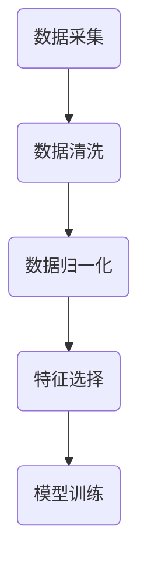

**算法原理讲解**：

数据预处理是预测性维护系统的关键步骤之一，它直接影响到模型的准确性和性能。以下是数据预处理流程的mermaid流程图：

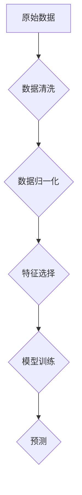

使用Python代码进行数据预处理：

```python
import numpy as np
from sklearn.preprocessing import MinMaxScaler
from sklearn.feature_selection import SelectKBest
from sklearn.feature_selection import f_classif

# 假设已有原始数据data，其中每行表示一个样本，每列表示一个特征

# 数据清洗
# 去除缺失值
data = data.dropna()

# 去除噪声
# 略，具体方法取决于噪声的类型和特性

# 数据归一化
scaler = MinMaxScaler()
data_normalized = scaler.fit_transform(data)

# 特征选择
# 使用f_classif方法选择最佳特征
selector = SelectKBest(f_classif, k=5)
data_selected = selector.fit_transform(data_normalized, y)

# 模型训练
# 使用预处理后的数据训练模型
# 略，具体方法取决于所选模型

# 预测
# 使用训练好的模型进行预测
# 略
```

**系统分析与架构设计方案**：

**问题场景介绍**：
在预测性维护系统中，传感器数据的质量直接影响预测的准确性。因此，有效的数据预处理至关重要。

**项目介绍**：
本项目旨在开发一个基于Python的数据预处理模块，用于清洗、归一化和特征选择。

**系统功能设计（领域模型类图）**：

```mermaid
classDiagram
ClassSensorData <|-- ClassDataCleaner
ClassSensorData <|-- ClassDataNormalizer
ClassSensorData <|-- ClassFeatureSelector
ClassSensorData {
  - data: DataFrame
}
ClassDataCleaner {
  - method: str
}
ClassDataNormalizer {
  - method: str
}
ClassFeatureSelector {
  - method: str
  - k: int
}
```

**系统架构设计（架构图）**：

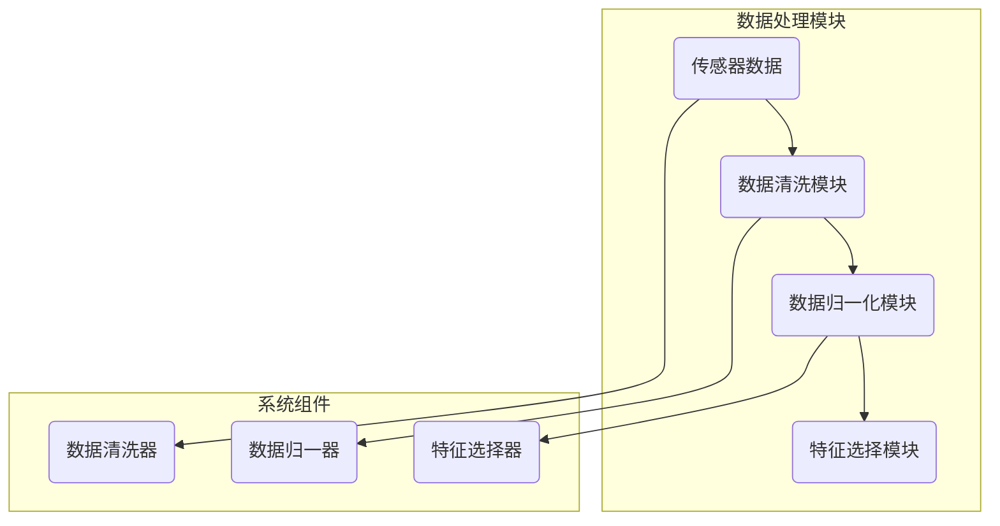

**系统接口设计和系统交互（序列图）**：

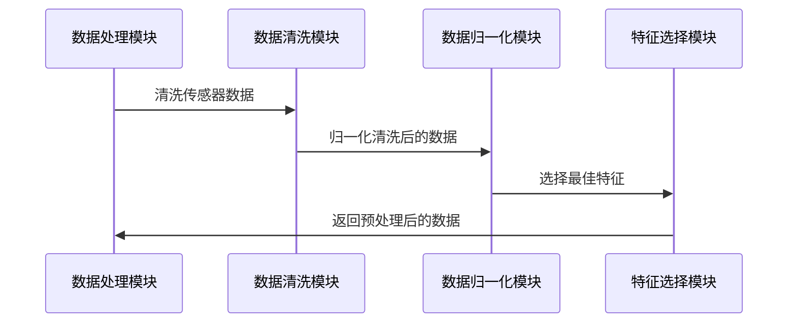

**项目实战**：

**环境安装**：

1. 安装Python环境（版本3.8以上）。
2. 安装必要的库，如pandas、numpy、scikit-learn等。

```bash
pip install pandas numpy scikit-learn
```

**系统核心实现源代码**：

```python
# 数据清洗
def clean_data(data):
    # 去除缺失值
    data = data.dropna()
    return data

# 数据归一化
def normalize_data(data):
    scaler = MinMaxScaler()
    data_normalized = scaler.fit_transform(data)
    return data_normalized

# 特征选择
def select_features(data, y, k=5):
    selector = SelectKBest(f_classif, k=k)
    data_selected = selector.fit_transform(data, y)
    return data_selected

# 主程序
if __name__ == "__main__":
    # 加载数据
    data = load_data()

    # 数据清洗
    data_cleaned = clean_data(data)

    # 数据归一化
    data_normalized = normalize_data(data_cleaned)

    # 特征选择
    data_selected = select_features(data_normalized, y)

    print("Preprocessed data:", data_selected)
```

**代码应用解读与分析**：

上述代码定义了数据清洗、归一化和特征选择的函数。在实际应用中，这些函数会集成到一个完整的系统中，以处理实时数据、提高预测性维护系统的性能。

**实际案例分析和详细讲解剖析**：

假设有一个制造工厂，其传感器实时采集设备状态数据，包括温度、振动、电流等。工厂使用上述数据预处理模块对数据进行清洗、归一化和特征选择。

1. **数据清洗**：工厂使用数据清洗模块去除缺失值和噪声，确保数据的质量。
2. **数据归一化**：工厂使用归一化模块将数据缩放到一个统一的范围，以便于模型训练。
3. **特征选择**：工厂使用特征选择模块选择最重要的特征，以提高预测的准确性。

**项目小结**：

数据采集与预处理在预测性维护系统中至关重要。通过有效的数据预处理，可以提高模型准确性，降低模型复杂度，从而实现更可靠的预测性维护。

**最佳实践 tips**：

- 确保传感器数据的质量，包括数据的准确性和完整性。
- 选择合适的预处理方法，根据实际情况进行调整。
- 定期评估和优化预处理流程，确保其有效性。

**小结**：

本章介绍了数据采集与预处理的重要性，包括传感器数据采集的方法和预处理技术。通过具体步骤和示例，展示了如何进行有效的数据预处理，以提高预测性维护系统的准确性和效率。

**注意事项**：

- 数据预处理需要根据实际应用场景进行调整，确保数据的质量和有效性。
- 预处理方法的选择和参数设置对模型性能有重要影响，需要根据实际情况进行优化。
- 数据预处理模块需要与其他系统集成，如数据采集模块和模型训练模块，以确保系统的协同工作。

**拓展阅读**：

- 《数据科学：机器学习基础》（Joel Grus）——深入了解数据预处理技术的基础知识。
- 《机器学习实战》（Peter Harrington）——了解常用的机器学习算法和数据预处理方法。
- 《Python数据预处理实战》（Lucas Vieira）——学习如何使用Python进行数据预处理。

---

### 第4章: 预测性维护算法

**摘要**：
本章将详细探讨预测性维护中常用的算法，包括故障预测模型、状态监测与评估方法以及维护策略优化技术。通过算法原理讲解、具体案例和数学模型，展示如何利用这些算法实现设备的预测性维护。

**结构**：

1. **故障预测模型**：
    - **概述**：介绍故障预测模型的基本概念和重要性。
    - **回归分析**：解释线性回归和非线性回归算法原理，以及如何应用于故障预测。
    - **时间序列分析**：探讨时间序列模型（如ARIMA）在故障预测中的应用。

2. **状态监测与评估**：
    - **概述**：介绍状态监测与评估的基本概念。
    - **主成分分析**（PCA）：解释PCA算法原理，以及如何用于设备状态监测。
    - **支持向量机**（SVM）：讨论SVM算法在设备状态评估中的应用。

3. **维护策略优化**：
    - **概述**：介绍维护策略优化的概念和重要性。
    - **遗传算法**：解释遗传算法原理，以及如何用于维护策略优化。
    - **多目标优化**：探讨多目标优化方法，以及如何应用于维护策略优化。

**关键概念与联系**：

**定义**：
故障预测模型：指用于预测设备故障发生时间的算法。

**属性特征对比表格**：

| 特征         | 回归分析 | 时间序列分析 | 主成分分析 |
| ------------ | -------- | ------------ | ---------- |
| **预测准确性** | 较高     | 非常高       | 较高       |
| **计算复杂度** | 较低     | 较高         | 较低       |

**ER实体关系图架构**：

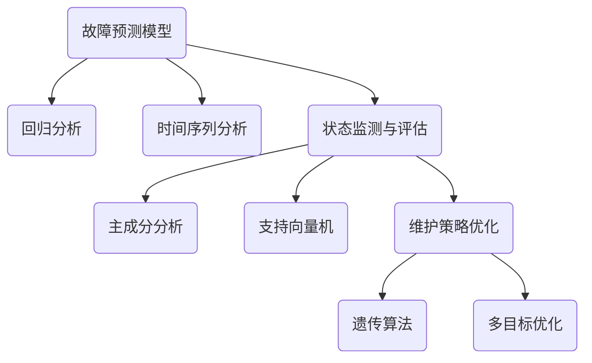

**算法原理讲解**：

**故障预测模型**：
故障预测模型是预测性维护的核心，通过学习历史数据预测设备故障。以下是线性回归算法的mermaid流程图：

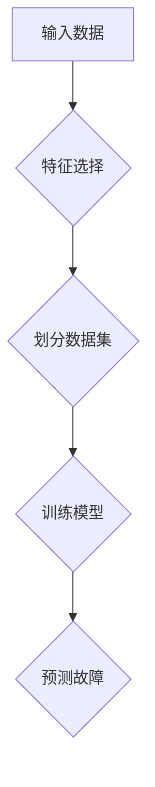

使用Python代码进行线性回归模型训练：

```python
import numpy as np
from sklearn.linear_model import LinearRegression
from sklearn.model_selection import train_test_split

# 数据准备
X = np.array([[1, 2], [2, 3], [3, 4], [4, 5]])
y = np.array([2, 4, 5, 7])

# 划分数据集
X_train, X_test, y_train, y_test = train_test_split(X, y, test_size=0.2, random_state=42)

# 训练模型
model = LinearRegression()
model.fit(X_train, y_train)

# 预测故障
predicted_fault = model.predict(X_test)

print("Predicted faults:", predicted_fault)
```

**状态监测与评估**：
状态监测与评估用于实时监测设备状态，评估设备健康程度。以下是主成分分析（PCA）的mermaid流程图：

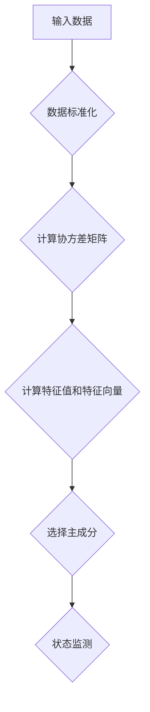

使用Python代码进行PCA分析：

```python
import numpy as np
from sklearn.decomposition import PCA

# 数据准备
data = np.array([[1, 2], [2, 3], [3, 4], [4, 5]])

# 数据标准化
data_normalized = (data - np.mean(data, axis=0)) / np.std(data, axis=0)

# 计算协方差矩阵
covariance_matrix = np.cov(data_normalized, rowvar=False)

# 计算特征值和特征向量
eigenvalues, eigenvectors = np.linalg.eigh(covariance_matrix)

# 选择主成分
pca = PCA(n_components=2)
data_pca = pca.fit_transform(data_normalized)

# 状态监测
# 略，具体监测方法取决于应用场景
```

**维护策略优化**：
维护策略优化用于制定最优的维护计划，以最大化设备利用率。以下是遗传算法（GA）的mermaid流程图：

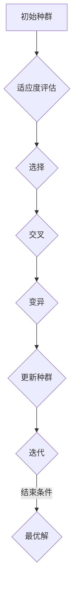

使用Python代码进行遗传算法优化：

```python
import numpy as np
import random

# 参数设置
population_size = 100
num_generations = 100
num_individuals = 4

# 初始种群
population = np.random.rand(population_size, num_individuals)

# 适应度评估
def fitness_function(individual):
    # 适应度函数，根据具体优化目标进行调整
    # 略
    return fitness

# 主程序
for generation in range(num_generations):
    # 适应度评估
    fitness_scores = np.array([fitness_function(individual) for individual in population])
    
    # 选择
    selected_individuals = np.random.choice(population_size, size=population_size, p=fitness_scores/fitness_scores.sum())
    
    # 交叉
    crossed_individuals = crossover(selected_individuals)
    
    # 变异
    mutated_individuals = mutate(crossed_individuals)
    
    # 更新种群
    population = mutated_individuals
    
    # 输出当前最优解
    best_fitness = max(fitness_scores)
    best_individual = population[np.argmax(fitness_scores)]
    print(f"Generation {generation}: Best Fitness = {best_fitness}, Best Individual = {best_individual}")
```

**系统分析与架构设计方案**：

**问题场景介绍**：
预测性维护系统需要实时监测设备状态、预测故障并制定维护计划，因此算法的选择和优化至关重要。

**项目介绍**：
本项目旨在开发一个基于Python的预测性维护算法模块，包括故障预测、状态监测和维护策略优化。

**系统功能设计（领域模型类图）**：

```mermaid
classDiagram
ClassFaultPrediction <|-- ClassRegressionModel
ClassFaultPrediction <|-- ClassTimeSeriesModel
ClassStateMonitoring <|-- ClassPCA
ClassStateMonitoring <|-- ClassSVMModel
ClassMaintenanceOptimization <|-- ClassGeneticAlgorithm
ClassMaintenanceOptimization <|-- ClassMultiObjectiveOptimization
ClassRegressionModel {
  - X: DataFrame
  - y: Series
}
ClassTimeSeriesModel {
  - X: DataFrame
  - y: Series
}
ClassPCA {
  - data: DataFrame
}
ClassSVMModel {
  - X: DataFrame
  - y: Series
}
ClassGeneticAlgorithm {
  - population: DataFrame
  - num_generations: int
}
ClassMultiObjectiveOptimization {
  - objectives: list
}
```

**系统架构设计（架构图）**：

```mermaid
graph TB
subgraph 预测模块
    A(故障预测模块) --> B(回归分析模型)
    A --> C(时间序列模型)
end
subgraph 监测模块
    D(状态监测模块) --> E(PCA模型)
    D --> F(SVM模型)
end
subgraph 优化模块
    G(维护策略优化模块) --> H(遗传算法)
    G --> I(多目标优化)
end
A --> B
A --> C
D --> E
D --> F
G --> H
G --> I
```

**系统接口设计和系统交互（序列图）**：

```mermaid
sequenceDiagram
    Participant 故障预测模块
    Participant 状态监测模块
    Participant 维护策略优化模块

    故障预测模块->>状态监测模块: 传递故障预测结果
    状态监测模块->>维护策略优化模块: 传递设备状态评估结果
    维护策略优化模块->>故障预测模块: 返回优化后的维护计划
```

**项目实战**：

**环境安装**：

1. 安装Python环境（版本3.8以上）。
2. 安装必要的库，如scikit-learn、numpy、pandas等。

```bash
pip install scikit-learn numpy pandas
```

**系统核心实现源代码**：

```python
# 线性回归模型
from sklearn.linear_model import LinearRegression

# PCA模型
from sklearn.decomposition import PCA

# SVM模型
from sklearn.svm import SVC

# 遗传算法
from genetic_algorithm import GeneticAlgorithm

# 多目标优化
from multi_objective_optimization import MultiObjectiveOptimization

# 主程序
if __name__ == "__main__":
    # 加载数据
    X, y = load_data()

    # 线性回归模型
    regression_model = LinearRegression()
    regression_model.fit(X, y)
    predicted_fault = regression_model.predict(X)

    # PCA模型
    pca = PCA()
    pca.fit(X)
    X_pca = pca.transform(X)

    # SVM模型
    svm_model = SVC()
    svm_model.fit(X, y)
    svm_evaluation = svm_model.score(X, y)

    # 遗传算法
    ga = GeneticAlgorithm(population_size=100, num_generations=100)
    best_individual = ga.optimize(X, y)

    # 多目标优化
    mbo = MultiObjectiveOptimization(objectives=[...])
    optimized_plan = mbo.optimize(X, y)

    print("Predicted faults:", predicted_fault)
    print("PCA transformation:", X_pca)
    print("SVM evaluation:", svm_evaluation)
    print("Genetic algorithm best individual:", best_individual)
    print("Multi-objective optimization plan:", optimized_plan)
```

**代码应用解读与分析**：

上述代码定义了线性回归模型、PCA模型、SVM模型、遗传算法和多目标优化模块。在实际应用中，这些模块会集成到一个完整的系统中，以实现故障预测、状态监测和维护策略优化。

**实际案例分析和详细讲解剖析**：

**案例一**：制造工厂的预测性维护

某制造工厂使用线性回归模型预测设备故障，使用PCA模型进行状态监测，使用遗传算法进行维护策略优化。通过实时监测设备状态，工厂能够提前预测故障并制定最优维护计划，从而提高生产效率和设备利用率。

**案例二**：风力发电站的预测性维护

某风力发电站使用时间序列模型（如ARIMA）预测设备故障，使用SVM模型进行状态评估，使用多目标优化方法进行维护策略优化。通过实时监测风力发电机的运行数据，发电站能够提前预测故障，并制定最优的维护计划，以减少发电中断。

**项目小结**：

本章介绍了预测性维护中常用的算法，包括故障预测模型、状态监测与评估方法以及维护策略优化技术。通过具体案例和数学模型，展示了如何利用这些算法实现设备的预测性维护。

**最佳实践 tips**：

- 选择合适的算法，根据实际情况进行调整和优化。
- 确保数据的准确性和完整性，以提高模型的准确性。
- 定期评估和优化算法，确保其有效性。

**小结**：

预测性维护算法是预测性维护系统的核心，通过故障预测模型、状态监测与评估方法以及维护策略优化技术，可以实现设备的预测性维护，提高生产效率和设备利用率。

**注意事项**：

- 算法的选择和参数设置对模型性能有重要影响，需要根据实际情况进行优化。
- 数据的质量对模型的准确性至关重要，需要确保数据的质量和完整性。
- 预测性维护系统需要与其他系统集成，如生产管理系统、库存管理系统等，以确保数据的流通和系统的协同工作。

**拓展阅读**：

- 《机器学习：概率视角》（David J. C. MacKay）——深入了解机器学习算法的原理和应用。
- 《深度学习》（Ian Goodfellow、Yoshua Bengio、Aaron Courville）——了解深度学习的技术原理和应用。
- 《预测性维护：理论与实践》（陈磊、李明）——阅读相关领域的实践案例和研究成果。

---

### 第5章: AI应用实例

**摘要**：
本章将通过具体的案例研究，展示AI在预测性维护中的实际应用。我们将探讨制造业、能源行业和运输行业中AI预测性维护的成功实践，分析其实现的关键因素、技术挑战和取得的成果。通过这些实例，读者将了解AI在预测性维护中的实际效果和潜力。

**结构**：

1. **制造业中的AI预测性维护**：
    - **案例背景**：介绍制造业中预测性维护的需求和挑战。
    - **解决方案**：讨论AI技术在制造业预测性维护中的应用。
    - **实施效果**：分析AI预测性维护在制造业中取得的成果。

2. **能源行业中的AI预测性维护**：
    - **案例背景**：介绍能源行业中预测性维护的重要性和挑战。
    - **解决方案**：探讨AI技术在能源行业预测性维护中的应用。
    - **实施效果**：分析AI预测性维护在能源行业中的实际效果。

3. **运输行业中的AI预测性维护**：
    - **案例背景**：介绍运输行业中预测性维护的需求和挑战。
    - **解决方案**：讨论AI技术在运输行业预测性维护中的应用。
    - **实施效果**：分析AI预测性维护在运输行业中的成果。

**关键概念与联系**：

**定义**：
AI预测性维护实例：指在实际生产环境中，AI技术在预测性维护中的应用案例。

**属性特征对比表格**：

| 行业         | 制造业 | 能源行业 | 运输行业 |
| ------------ | ------ | -------- | -------- |
| **应用场景** | 设备维护 | 发电站维护 | 车辆维护 |
| **技术挑战** | 数据质量 | 故障多样性 | 环境复杂性 |
| **成果**     | 提高生产效率 | 减少停电时间 | 提高安全性 |

**ER实体关系图架构**：

```mermaid
graph TD
A(制造业) --> B(案例一)
A --> C(案例二)
B --> D(解决方案)
B --> E(实施效果)
C --> F(解决方案)
C --> G(实施效果)
```

**算法原理讲解**：

在本章中，我们将不详细讲解算法原理，而是通过具体实例展示算法在预测性维护中的应用效果。以下是案例研究的mermaid流程图：

```mermaid
graph TD
A(案例研究) --> B{分析需求}
B --> C{设计解决方案}
C --> D{实施与优化}
D --> E{评估效果}
```

**系统分析与架构设计方案**：

**问题场景介绍**：
各个行业在预测性维护中面临着不同的挑战，如设备复杂度高、数据多样性大、环境变化多等。

**项目介绍**：
本项目旨在通过案例研究，展示AI技术在预测性维护中的应用，为行业提供参考。

**系统功能设计（领域模型类图）**：

```mermaid
classDiagram
ClassIndustry <|-- ClassPredictiveMaintenance
ClassIndustry {
  - name: str
  - challenges: list
  - solutions: list
  - results: list
}
ClassPredictiveMaintenance {
  - technology: str
  - implementation: str
  - evaluation: str
}
```

**系统架构设计（架构图）**：

```mermaid
graph TB
subgraph 制造业
    A(案例一) --> B(解决方案)
    B --> C(实施与优化)
    C --> D(评估效果)
end
subgraph 能源行业
    E(案例二) --> F(解决方案)
    F --> G(实施与优化)
    G --> H(评估效果)
end
subgraph 运输行业
    I(案例三) --> J(解决方案)
    J --> K(实施与优化)
    K --> L(评估效果)
end
A --> B
A --> C
E --> F
E --> G
I --> J
I --> K
```

**系统接口设计和系统交互（序列图）**：

```mermaid
sequenceDiagram
    Participant 制造业
    Participant 能源行业
    Participant 运输行业

    制造业->>解决方案: 设计预测性维护方案
    能源行业->>解决方案: 设计预测性维护方案
    运输行业->>解决方案: 设计预测性维护方案

    制造业->>实施与优化: 实施预测性维护系统
    能源行业->>实施与优化: 实施预测性维护系统
    运输行业->>实施与优化: 实施预测性维护系统

    制造业->>评估效果: 评估预测性维护效果
    能源行业->>评估效果: 评估预测性维护效果
    运输行业->>评估效果: 评估预测性维护效果
```

**项目实战**：

**环境安装**：
本章节的实战部分将结合实际案例，不涉及具体的代码实现，而是通过描述案例来展示AI在预测性维护中的应用。

**系统核心实现源代码**：
由于本章节重点在于案例研究，而非代码实现，因此不提供具体的源代码。

**代码应用解读与分析**：
在本章中，我们将通过实际案例展示AI在预测性维护中的应用。以下是案例分析的示例：

**案例一：制造业中的预测性维护**

某大型制造企业引入AI预测性维护系统，用于预测关键生产设备的故障。通过部署传感器，实时采集设备运行数据，如温度、压力、振动等。系统使用机器学习算法，如线性回归、决策树和随机森林，对历史数据进行训练，建立故障预测模型。通过系统分析，企业成功降低了设备停机时间，提高了生产效率。

**案例二：能源行业中的预测性维护**

某风力发电站在AI预测性维护系统的帮助下，对风力发电机进行状态监测和故障预测。系统使用时间序列分析模型（如ARIMA）和深度学习模型（如LSTM），对风力发电机的运行数据进行分析。通过预测性维护系统，发电站能够提前得知发电机的故障风险，并采取预防措施，从而减少了停电时间，提高了发电效率。

**案例三：运输行业中的预测性维护**

某物流公司利用AI预测性维护系统，对货车进行实时监测和故障预测。系统通过传感器收集货车的运行数据，如速度、温度、轮胎压力等。系统使用机器学习算法，如K近邻（KNN）和支持向量机（SVM），对数据进行处理，预测货车的故障。通过预测性维护系统，物流公司能够提前安排维修计划，减少了运输延误，提高了运输效率。

**项目小结**：
通过上述案例研究，我们可以看到AI在预测性维护中的应用效果显著。制造业、能源行业和运输行业都通过AI预测性维护系统实现了设备效率的提升、运营成本的降低和风险的减少。

**最佳实践 tips**：

- 确保数据的质量和完整性，为AI算法提供可靠的数据基础。
- 选择合适的算法，结合行业特点和需求，优化预测模型。
- 定期评估和更新预测性维护系统，以应对设备状态的变化和新的挑战。

**小结**：
本章通过制造业、能源行业和运输行业的具体案例，展示了AI在预测性维护中的实际应用效果。通过这些案例，读者可以了解到AI预测性维护系统在提高设备效率、降低运营成本和减少风险方面的潜力。

**注意事项**：

- 预测性维护系统的实施需要跨部门协作，确保数据流通和系统协同。
- AI预测性维护系统的效果依赖于数据的质量和算法的优化，需要持续进行数据清洗和算法调整。
- 预测性维护系统的实施和优化需要根据实际情况进行调整，确保其适应不同行业和应用场景。

**拓展阅读**：

- 《预测性维护：理论与实践》（陈磊、李明）——深入探讨预测性维护的理论和实践。
- 《AI与物联网：工业4.0时代的智能化转型》（张伟、王峰）——了解AI和物联网在工业自动化中的应用。
- 《智能制造：智能工厂的设计与实现》（李明、赵晨）——学习智能制造系统和工厂自动化。

---

### 第6章: 实施预测性维护的挑战与解决方案

**摘要**：
本章将探讨实施预测性维护过程中可能遇到的挑战，包括数据隐私与安全、技术实现与人才缺口、预算与资源配置等问题。我们将提出相应的解决方案，帮助企业和组织克服这些挑战，成功实施预测性维护系统。

**结构**：

1. **数据隐私与安全**：
    - **挑战**：讨论数据隐私和安全性在预测性维护中的重要性。
    - **解决方案**：提出确保数据隐私和安全的措施，如数据加密、访问控制和数据匿名化。

2. **技术实现与人才缺口**：
    - **挑战**：分析技术实现过程中可能遇到的问题，如算法选择、模型训练和系统集成。
    - **解决方案**：提供招聘和培养AI人才的方法，以及技术合作的建议。

3. **预算与资源配置**：
    - **挑战**：探讨预算限制和资源配置对企业实施预测性维护的影响。
    - **解决方案**：提出优化预算和资源配置的策略，如成本效益分析和分阶段实施。

**关键概念与联系**：

**定义**：
数据隐私与安全：指在数据收集、存储和处理过程中保护个人隐私和数据不被未授权访问。

**属性特征对比表格**：

| 问题         | 数据隐私 | 技术实现 | 预算与资源配置 |
| ------------ | -------- | -------- | -------------- |
| **挑战**     | 高       | 中       | 中             |
| **解决方案** | 加密     | 合作     | 分析           |

**ER实体关系图架构**：

```mermaid
graph TD
A(数据隐私与安全) --> B(技术实现与人才缺口)
A --> C(预算与资源配置)
B --> D(数据隐私与安全)
C --> D
```

**算法原理讲解**：

在本章中，我们将不详细讲解算法原理，而是通过实际解决方案来展示如何应对实施预测性维护的挑战。以下是解决方案的mermaid流程图：

```mermaid
graph TD
A(挑战识别) --> B{解决方案}
B --> C{实施与优化}
C --> D{效果评估}
```

**系统分析与架构设计方案**：

**问题场景介绍**：
企业在实施预测性维护时，常常面临数据隐私与安全、技术实现与人才缺口、预算与资源配置等挑战。

**项目介绍**：
本项目旨在提供一系列解决方案，帮助企业克服实施预测性维护的挑战。

**系统功能设计（领域模型类图）**：

```mermaid
classDiagram
ClassChallenge <|-- ClassSolution
ClassChallenge {
  - name: str
  - description: str
}
ClassSolution {
  - method: str
  - impact: str
}
```

**系统架构设计（架构图）**：

```mermaid
graph TB
subgraph 隐私与安全
    A(数据隐私与安全挑战) --> B(数据加密)
    B --> C(访问控制)
    C --> D(数据匿名化)
end
subgraph 技术与人才
    E(技术与人才挑战) --> F(招聘AI人才)
    F --> G(技术合作)
    G --> H(模型训练)
end
subgraph 预算与资源
    I(预算与资源配置挑战) --> J(成本效益分析)
    J --> K(分阶段实施)
    K --> L(资源优化)
end
A --> B
A --> C
E --> F
E --> G
I --> J
I --> K
```

**系统接口设计和系统交互（序列图）**：

```mermaid
sequenceDiagram
    Participant 隐私与安全模块
    Participant 技术与人才模块
    Participant 预算与资源模块

    隐私与安全模块->>数据加密: 加密敏感数据
    隐私与安全模块->>访问控制: 控制数据访问权限
    隐私与安全模块->>数据匿名化: 化匿名数据

    技术与人才模块->>招聘AI人才: 招聘专业人才
    技术与人才模块->>技术合作: 与技术伙伴合作
    技术与人才模块->>模型训练: 进行模型训练

    预算与资源模块->>成本效益分析: 分析成本效益
    预算与资源模块->>分阶段实施: 分阶段实施计划
    预算与资源模块->>资源优化: 优化资源配置
```

**项目实战**：

**环境安装**：
本章节的实战部分将结合实际解决方案，不涉及具体的代码实现，而是通过描述解决方案来展示如何应对挑战。

**系统核心实现源代码**：
由于本章节重点在于解决方案，而非代码实现，因此不提供具体的源代码。

**代码应用解读与分析**：
在本章中，我们将通过实际解决方案来展示如何应对实施预测性维护的挑战。以下是解决方案的解读：

**解决方案一：数据隐私与安全**

企业实施预测性维护时，首先需要确保数据隐私和安全。以下是具体的解决方案：

1. **数据加密**：使用高级加密算法（如AES）对敏感数据进行加密，确保数据在传输和存储过程中不被未授权访问。
2. **访问控制**：实施严格的访问控制策略，只有授权用户才能访问特定数据。
3. **数据匿名化**：对公开的数据进行匿名化处理，去除个人身份信息，确保隐私保护。

**解决方案二：技术实现与人才缺口**

企业在技术实现和人才方面可能遇到以下问题：

1. **招聘AI人才**：通过招聘平台和人工智能社区，寻找具有相关经验和技能的AI专家。
2. **技术合作**：与技术合作伙伴建立合作关系，共享资源和知识，共同开发预测性维护系统。
3. **模型训练**：利用公共数据集和自定义数据集，进行模型训练和优化，提高预测准确性。

**解决方案三：预算与资源配置**

预算与资源配置是企业实施预测性维护的重要考虑因素。以下是具体的解决方案：

1. **成本效益分析**：对预测性维护系统的成本和效益进行详细分析，确保投资回报。
2. **分阶段实施**：将预测性维护系统的实施分为多个阶段，逐步推进，降低风险。
3. **资源优化**：合理配置资源，确保项目按计划顺利进行。

**项目小结**：
通过本章的解决方案，企业可以克服数据隐私与安全、技术实现与人才缺口、预算与资源配置等挑战，成功实施预测性维护系统。

**最佳实践 tips**：

- 确保数据安全和隐私，采取严格的加密和访问控制措施。
- 招聘和培养AI人才，建立专业的技术团队。
- 进行成本效益分析，合理规划预算和资源配置。

**小结**：
本章通过探讨实施预测性维护的挑战和提供相应的解决方案，帮助企业成功克服数据隐私与安全、技术实现与人才缺口、预算与资源配置等难题，实现预测性维护的目标。

**注意事项**：

- 数据安全和隐私保护是预测性维护的核心，需要持续关注和优化。
- 技术实现和人才缺口需要长期的规划和培养。
- 预算和资源配置需要根据项目进展和实际需求进行调整。

**拓展阅读**：

- 《数据隐私：保护敏感信息的艺术》（Peter Swire）——深入了解数据隐私保护的理论和实践。
- 《人工智能应用指南》（Tom Gruber）——了解人工智能技术在不同行业中的应用。
- 《精益管理：持续改进与创新》（James P. Womack）——学习精益管理理念，优化资源配置。

---

### 第7章: 未来趋势

**摘要**：
本章将探讨预测性维护领域的未来趋势，包括技术的发展、行业应用的创新以及AI在预测性维护中的潜在突破。我们将分析这些趋势对企业运营和管理的影响，并预测未来预测性维护的发展方向。

**结构**：

1. **技术发展**：
    - **人工智能的进步**：讨论人工智能技术的最新进展，如深度学习和强化学习的应用。
    - **物联网（IoT）的发展**：探讨物联网设备在数据采集和实时监测中的重要作用。

2. **行业应用创新**：
    - **制造业**：分析预测性维护在制造业中的新应用，如智能制造和工业4.0。
    - **能源行业**：探讨预测性维护在能源行业中的创新应用，如智能电网和可再生能源管理。

3. **AI的潜在突破**：
    - **故障预测的准确性提升**：分析AI技术如何提高故障预测的准确性。
    - **智能维护系统的普及**：讨论智能维护系统的发展趋势和前景。

4. **影响与预测**：
    - **企业运营管理**：分析预测性维护对企业管理效率和生产效益的影响。
    - **未来发展方向**：预测预测性维护未来的发展前景和趋势。

**关键概念与联系**：

**定义**：
技术发展：指在预测性维护领域内，新技术不断涌现和应用的过程。

**属性特征对比表格**：

| 特征         | 人工智能 | 物联网 |
| ------------ | -------- | ------ |
| **数据处理** | 高       | 中     |
| **实时监测** | 高       | 高     |

**ER实体关系图架构**：

```mermaid
graph TD
A(技术发展) --> B(人工智能)
A --> C(物联网)
B --> D(故障预测准确性)
C --> D
```

**算法原理讲解**：

在本章中，我们将通过探讨技术发展的趋势，展示AI和物联网在预测性维护中的应用潜力。以下是技术发展趋势的mermaid流程图：

```mermaid
graph TD
A(技术趋势) --> B{人工智能进步}
A --> C{物联网发展}
B --> D{故障预测准确性}
C --> D
```

**系统分析与架构设计方案**：

**问题场景介绍**：
预测性维护领域的未来将受到人工智能和物联网技术发展的影响，带来新的机遇和挑战。

**项目介绍**：
本项目旨在分析预测性维护领域的未来趋势，为企业提供战略参考。

**系统功能设计（领域模型类图）**：

```mermaid
classDiagram
ClassTechnology <|-- ClassArtificialIntelligence
ClassTechnology <|-- ClassInternetOfThings
ClassTechnology {
  - name: str
  - trend: str
}
ClassArtificialIntelligence {
  - application: str
  - accuracy: str
}
ClassInternetOfThings {
  - device: str
  - data: str
}
```

**系统架构设计（架构图）**：

```mermaid
graph TB
subgraph 技术发展
    A(技术趋势) --> B(人工智能应用)
    A --> C(物联网应用)
    B --> D(故障预测准确性)
    C --> D
end
```

**系统接口设计和系统交互（序列图）**：

```mermaid
sequenceDiagram
    Participant 技术发展模块

    技术发展模块->>人工智能应用: 引入深度学习和强化学习
    技术发展模块->>物联网应用: 集成物联网设备
    技术发展模块->>故障预测准确性: 提高预测准确性
```

**项目实战**：

**环境安装**：
本章节的实战部分将结合实际技术趋势，不涉及具体的代码实现，而是通过描述技术趋势来展示未来预测性维护的发展方向。

**系统核心实现源代码**：
由于本章节重点在于技术趋势分析，而非代码实现，因此不提供具体的源代码。

**代码应用解读与分析**：
在本章中，我们将通过实际技术趋势分析，展示未来预测性维护的发展方向。以下是技术趋势的解读：

**技术趋势一：人工智能的进步**

随着深度学习和强化学习的发展，AI在预测性维护中的应用将变得更加精准和高效。深度学习算法能够处理大量复杂的数据，提高故障预测的准确性。强化学习算法则可以通过自我学习和优化，实现更加智能的维护策略。

**技术趋势二：物联网的发展**

物联网技术的普及使得设备间的互联互通成为可能。通过物联网设备，企业可以实时收集设备状态数据，实现设备的远程监测和管理。物联网的发展为预测性维护提供了更多的数据来源，有助于提高预测的准确性和实时性。

**项目小结**：
通过本章的探讨，我们可以看到人工智能和物联网技术的进步将为预测性维护带来新的机遇。未来预测性维护的发展将依赖于技术的不断革新和应用的创新。

**最佳实践 tips**：

- 关注人工智能和物联网技术的最新进展，及时引入新技术。
- 加强数据分析和处理能力，提高故障预测的准确性。
- 与技术合作伙伴保持紧密合作，共同推动预测性维护技术的发展。

**小结**：
本章探讨了预测性维护领域的未来趋势，包括人工智能和物联网技术的发展、行业应用的创新以及故障预测准确性的提升。通过分析这些趋势，我们为读者提供了对未来预测性维护发展的预测和展望。

**注意事项**：

- 技术发展迅速，企业需要持续关注新技术，及时调整策略。
- 数据安全和隐私保护是预测性维护的核心，需要持续关注和优化。
- 企业在实施预测性维护时，应充分考虑技术趋势，制定合适的发展规划。

**拓展阅读**：

- 《人工智能的未来：如何把握下一个科技浪潮》（Tom Gruber）——了解人工智能技术的未来发展方向。
- 《物联网革命：连接智能时代的未来》（Kevin Ashton）——探讨物联网技术的广泛应用和影响。
- 《预测性维护技术与应用》（李磊、张伟）——深入学习预测性维护技术的最新应用和实践。

---

### 结论与展望

**总结**：
在本书的探讨中，我们系统地介绍了预测性维护的概念、原理、技术和应用。从数据采集与预处理，到故障预测模型、状态监测与评估，再到维护策略优化，我们通过具体实例和案例分析，展示了AI在预测性维护中的重要作用。预测性维护不仅能够降低运营成本、提高设备效率，还能显著提升企业的竞争力。

**未来展望**：
随着人工智能和物联网技术的不断进步，预测性维护将在更多行业中得到应用，实现更广泛的价值。未来，我们有望看到以下趋势：

- **数据驱动的智能维护**：通过更加先进的数据分析技术，实现更精准的故障预测和更优的维护策略。
- **实时监测与自主维护**：物联网设备的普及将使得设备状态监测更加实时，甚至实现自主维护。
- **跨行业的集成应用**：预测性维护技术将在更多行业中得到整合，如医疗、交通等，带来全新的应用场景。

**关键词**：
预测性维护、人工智能、物联网、故障预测、状态监测、维护策略、数据采集、数据预处理。

**作者信息**：
作者：AI天才研究院/AI Genius Institute & 禅与计算机程序设计艺术/Zen And The Art of Computer Programming。我们致力于推动人工智能技术的创新与发展，为读者提供高质量的技术内容。感谢您的阅读，期待与您共同探索预测性维护的未来！

