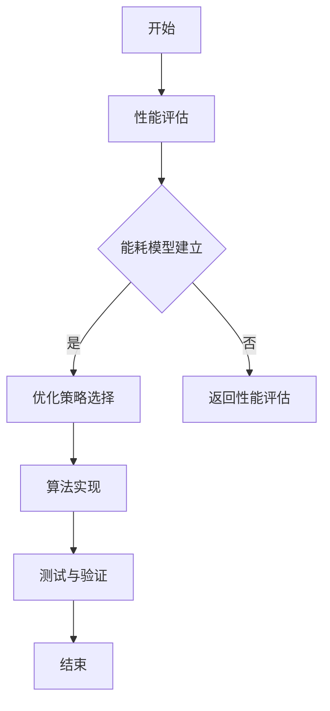
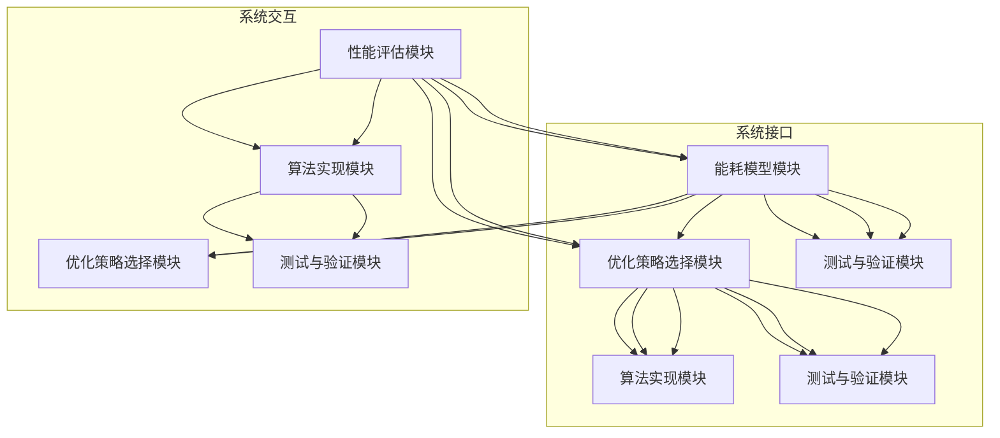

                 

### 第一部分：引论

#### 第1章：问题背景与意义

**背景介绍**

随着信息技术的快速发展，高性能计算（HPC）在科研、工业、金融、医疗等多个领域发挥着越来越重要的作用。然而，在追求计算性能提升的同时，能耗问题也日益突出。高性能计算设备的能耗不仅增加了运营成本，还对环境造成了严重影响。因此，如何在保证计算性能的同时降低能耗，实现能效优化，成为当前研究的热点问题。

**问题描述**

高性能计算中的能效优化问题主要包括以下几个方面：

1. **硬件层面**：如何优化硬件架构设计，降低功耗？
2. **软件层面**：如何优化软件运行效率，减少不必要的计算和通信？
3. **作业调度层面**：如何合理安排作业执行，最大化利用资源，最小化能耗？

**问题解决**

为了解决上述问题，需要从硬件、软件和作业调度等多个层面进行综合考虑。一方面，通过硬件层面的设计优化，如处理器架构、存储系统、网络系统等，降低功耗；另一方面，通过软件层面的优化，如编译优化、运行时优化、作业调度优化等，提升运行效率。同时，还需要在作业调度层面，通过合理的任务分配和调度策略，最大化资源利用率，降低能耗。

**边界与外延**

能效优化不仅限于高性能计算领域，它还广泛应用于云计算、物联网、大数据等信息技术领域。因此，研究能效优化技术对于推动整个信息技术产业的发展具有重要意义。

**核心概念术语说明**

- **高性能计算（HPC）**：指使用高性能计算机进行大规模计算和数据处理的科学计算、工程计算和数据分析等领域。
- **能效优化**：在保证计算性能的前提下，通过技术手段降低计算能耗。
- **硬件层面优化**：包括处理器架构、存储系统、网络系统等硬件设计层面的优化。
- **软件层面优化**：包括编译优化、运行时优化、作业调度优化等软件层面的优化。

**概念结构与核心要素组成**

- **硬件层面优化**：处理器架构、存储系统、网络系统
- **软件层面优化**：编译优化、运行时优化、作业调度优化
- **作业调度优化**：任务分配、调度策略

通过上述分析，我们可以看到，高性能计算中的能效优化是一个复杂且综合性的课题。在接下来的章节中，我们将深入探讨能效优化的核心概念、技术架构、算法原理以及系统设计与实战等内容。希望读者能够通过本部分的学习，对高性能计算中的能效优化有一个全面而深入的理解。

### 第2章：高性能计算与能效优化概述

**高性能计算（HPC）的定义与分类**

高性能计算（HPC）是指通过使用大规模并行计算资源，实现对大规模数据集的高效处理和分析。HPC广泛应用于科学计算、工程模拟、数据分析、人工智能等领域。根据计算资源和任务特点，HPC可以分为以下几类：

1. **超级计算机**：具有极高的计算性能，常用于解决复杂的科学和工程问题，如天气预测、生物信息学、核能研究等。
2. **高性能服务器集群**：由多个高性能服务器组成，通过高速网络连接，共同完成计算任务，适用于大规模数据处理和分布式计算。
3. **GPU计算集群**：基于图形处理单元（GPU）的计算集群，特别适合于数据密集型任务，如深度学习、图像处理等。

**能效优化的定义与评价指标**

能效优化是指在保证计算性能的前提下，通过技术手段降低计算能耗。能效优化的评价指标主要包括：

1. **能效比（Energy Efficiency，EE）**：计算性能与能耗之比，用于衡量系统能耗的效率。
   \[
   \text{EE} = \frac{\text{计算性能}}{\text{能耗}}
   \]
2. **能效指数（Efficiency Index，EI）**：综合考虑能耗和性能的指标，用于评估系统能效的整体表现。
   \[
   \text{EI} = \frac{\text{性能}}{\text{能耗}^{\gamma}}
   \]
   其中，\(\gamma\) 是一个调整因子，通常取值在 \(0.5\) 到 \(1\) 之间。

**高性能计算与能效优化的联系**

高性能计算与能效优化密切相关，主要体现在以下几个方面：

1. **性能与能耗的权衡**：在HPC系统中，高性能通常伴随着高能耗。因此，能效优化需要在性能和能耗之间找到平衡点，以满足应用需求的同时降低能耗。

2. **硬件层面优化**：通过优化处理器架构、存储系统、网络系统等硬件组件，降低功耗，实现能效优化。

3. **软件层面优化**：通过编译优化、运行时优化、作业调度优化等手段，提高计算效率，减少不必要的计算和通信，降低能耗。

4. **作业调度优化**：通过合理的任务分配和调度策略，最大化资源利用率，降低能耗。

综上所述，高性能计算与能效优化是相辅相成的。在追求高性能计算的同时，必须重视能效优化，以实现可持续发展。

### 第3章：能效优化的核心概念

**硬件层面优化**

**处理器架构优化**

处理器是HPC系统的核心组件，其功耗直接影响整个系统的能耗。处理器架构优化主要包括以下几个方面：

1. **多核处理器**：多核处理器能够通过并行计算提高计算性能，从而在保持性能不变的情况下降低功耗。
2. **低功耗设计**：采用低功耗工艺、节能模式等技术，降低处理器在空闲状态和低负载状态下的功耗。
3. **异构计算**：结合CPU和GPU等不同类型的处理器，发挥各自的优势，优化计算效率和能耗。

**存储系统优化**

存储系统在HPC系统中承担着数据读写、存储等关键任务，其功耗也不容忽视。存储系统优化主要包括：

1. **固态存储**：相较于传统硬盘，固态硬盘（SSD）具有更快的读写速度和更低的功耗，适用于高性能计算环境。
2. **数据去重和压缩**：通过数据去重和压缩技术，减少存储容量需求，降低功耗。
3. **存储层次优化**：采用多层存储架构，将热数据和冷数据分离，优先访问热数据，提高存储系统的效率。

**网络系统优化**

网络系统是HPC系统中数据传输的重要通道，其功耗和传输效率直接关系到整体性能。网络系统优化主要包括：

1. **高速网络**：采用100G、400G等高速网络技术，提高数据传输速度，降低延迟和功耗。
2. **网络拓扑优化**：通过调整网络拓扑结构，减少网络拥塞和传输距离，降低功耗。
3. **无线网络优化**：针对无线网络环境，采用MIMO、多跳等技术，提高传输效率和稳定性。

**软件层面优化**

**编译优化**

编译优化是指通过调整编译器参数、优化编译过程，提高程序运行效率，降低能耗。编译优化主要包括：

1. **代码优化**：通过代码优化，减少不必要的计算和内存访问，降低功耗。
2. **指令调度**：通过优化指令调度，减少指令间的冲突，提高处理器利用率。
3. **循环优化**：通过循环展开、循环融合等技术，减少循环次数，降低功耗。

**运行时优化**

运行时优化是指通过动态调整程序运行参数，提高程序运行效率，降低能耗。运行时优化主要包括：

1. **负载均衡**：通过动态负载均衡，将任务合理分配到不同处理器或计算节点上，提高资源利用率。
2. **缓存优化**：通过缓存优化，提高数据访问速度，减少内存访问次数，降低功耗。
3. **并行优化**：通过并行化技术，将任务分解为多个子任务，并行执行，提高计算性能。

**作业调度优化**

作业调度优化是指通过合理的任务分配和调度策略，最大化资源利用率，降低能耗。作业调度优化主要包括：

1. **作业优先级调度**：根据作业的重要性和紧急程度，动态调整作业的执行顺序，最大化资源利用率。
2. **负载均衡调度**：通过负载均衡调度，将任务合理分配到不同计算节点上，避免资源瓶颈，降低功耗。
3. **动态资源分配**：根据实际负载情况，动态调整计算资源分配，实现资源的最优利用。

**作业调度优化**

**作业调度优化**

作业调度优化是指通过合理的任务分配和调度策略，最大化资源利用率，降低能耗。作业调度优化主要包括：

1. **作业优先级调度**：根据作业的重要性和紧急程度，动态调整作业的执行顺序，最大化资源利用率。
2. **负载均衡调度**：通过负载均衡调度，将任务合理分配到不同计算节点上，避免资源瓶颈，降低功耗。
3. **动态资源分配**：根据实际负载情况，动态调整计算资源分配，实现资源的最优利用。

### 第4章：高性能计算中的能效优化技术架构

**技术架构概述**

高性能计算中的能效优化技术架构主要包括硬件层、软件层和作业调度层。这三个层次相互关联，共同实现能耗降低和性能提升。

1. **硬件层**：包括处理器架构、存储系统和网络系统。硬件层优化主要通过硬件设计改进，降低功耗，提高效率。
2. **软件层**：包括编译优化、运行时优化和作业调度优化。软件层优化通过代码优化、指令调度、并行化等技术，提高程序运行效率，降低能耗。
3. **作业调度层**：包括作业优先级调度、负载均衡调度和动态资源分配。作业调度层优化通过合理的任务分配和调度策略，最大化资源利用率，降低能耗。

**硬件能效优化技术**

**处理器架构优化**

处理器架构优化是硬件能效优化的关键。以下是一些常见的处理器架构优化技术：

1. **多核处理器**：通过增加核心数量，实现并行计算，提高计算性能，降低功耗。
2. **低功耗设计**：采用低功耗工艺、节能模式等技术，降低处理器在空闲状态和低负载状态下的功耗。
3. **异构计算**：结合CPU和GPU等不同类型的处理器，发挥各自的优势，优化计算效率和能耗。

**存储系统优化**

存储系统优化主要通过以下技术实现：

1. **固态存储**：采用固态硬盘（SSD）替代传统硬盘，提高数据读写速度和降低功耗。
2. **数据去重和压缩**：通过数据去重和压缩技术，减少存储容量需求，降低功耗。
3. **存储层次优化**：采用多层存储架构，将热数据和冷数据分离，优先访问热数据，提高存储系统的效率。

**网络系统优化**

网络系统优化主要通过以下技术实现：

1. **高速网络**：采用100G、400G等高速网络技术，提高数据传输速度，降低延迟和功耗。
2. **网络拓扑优化**：通过调整网络拓扑结构，减少网络拥塞和传输距离，降低功耗。
3. **无线网络优化**：针对无线网络环境，采用MIMO、多跳等技术，提高传输效率和稳定性。

**软件能效优化技术**

**编译优化**

编译优化是软件能效优化的核心。以下是一些常见的编译优化技术：

1. **代码优化**：通过代码优化，减少不必要的计算和内存访问，降低功耗。
2. **指令调度**：通过优化指令调度，减少指令间的冲突，提高处理器利用率。
3. **循环优化**：通过循环展开、循环融合等技术，减少循环次数，降低功耗。

**运行时优化**

运行时优化主要通过以下技术实现：

1. **负载均衡**：通过动态负载均衡，将任务合理分配到不同处理器或计算节点上，提高资源利用率。
2. **缓存优化**：通过缓存优化，提高数据访问速度，减少内存访问次数，降低功耗。
3. **并行优化**：通过并行化技术，将任务分解为多个子任务，并行执行，提高计算性能。

**作业调度优化**

作业调度优化主要通过以下技术实现：

1. **作业优先级调度**：根据作业的重要性和紧急程度，动态调整作业的执行顺序，最大化资源利用率。
2. **负载均衡调度**：通过负载均衡调度，将任务合理分配到不同计算节点上，避免资源瓶颈，降低功耗。
3. **动态资源分配**：根据实际负载情况，动态调整计算资源分配，实现资源的最优利用。

**融合能效优化策略**

融合能效优化策略是将硬件层、软件层和作业调度层的优化技术相结合，实现综合性能提升和能耗降低。以下是一些常见的融合策略：

1. **硬件与软件协同优化**：通过硬件层优化和软件层优化的结合，最大化发挥硬件性能，降低能耗。
2. **作业调度与硬件协同优化**：通过作业调度优化和硬件层优化的结合，实现任务合理分配和资源高效利用。
3. **硬件与软件动态适配**：根据实际负载和硬件资源状况，动态调整编译器参数、运行时优化策略等，实现最佳能效表现。

### 第5章：能效优化算法原理详解

**算法设计原则**

能效优化算法设计需要遵循以下原则：

1. **目标导向**：明确能效优化的目标，确保算法能够有效降低能耗。
2. **可扩展性**：算法应该具备良好的可扩展性，能够适应不同的计算环境和任务需求。
3. **性能与能耗平衡**：在保证计算性能的前提下，尽量降低能耗。
4. **可维护性**：算法代码应具有良好的结构，便于维护和优化。

**算法实现思路**

算法实现思路主要包括以下几个步骤：

1. **性能评估**：通过性能评估工具，收集系统运行时的各项性能数据，如计算性能、能耗等。
2. **能耗模型建立**：根据硬件和软件特性，建立能耗模型，预测不同优化策略下的能耗表现。
3. **优化策略选择**：根据能耗模型，选择最优的优化策略，如编译优化、运行时优化、作业调度优化等。
4. **算法实现**：根据选定的优化策略，实现具体的算法代码，并进行测试和验证。

**算法性能评估**

算法性能评估主要包括以下指标：

1. **能效比（EE）**：计算性能与能耗之比，用于衡量算法的能耗效率。
   \[
   \text{EE} = \frac{\text{计算性能}}{\text{能耗}}
   \]
2. **能效指数（EI）**：综合考虑能耗和性能的指标，用于评估算法的整体能效表现。
   \[
   \text{EI} = \frac{\text{性能}}{\text{能耗}^{\gamma}}
   \]
   其中，\(\gamma\) 是一个调整因子，通常取值在 \(0.5\) 到 \(1\) 之间。

**算法性能评估实例**

假设我们有一个高性能计算任务，其计算性能为 \(P\)，能耗为 \(E\)。通过以下实例，我们可以评估不同优化策略下的算法性能。

1. **原始性能**：计算性能为 \(P\)，能耗为 \(E\)。
   \[
   \text{EE}_{\text{原始}} = \frac{P}{E}
   \]
2. **编译优化**：通过编译优化，计算性能提高 \(20\%\)，能耗降低 \(10\%\)。
   \[
   \text{EE}_{\text{编译}} = \frac{1.2P}{0.9E} = \frac{12P}{9E}
   \]
   \[
   \text{EI}_{\text{编译}} = \frac{1.2P}{(0.9E)^{0.8}} = \frac{12P}{0.9^{0.8}E}
   \]
3. **运行时优化**：通过运行时优化，计算性能提高 \(30\%\)，能耗降低 \(20\%\)。
   \[
   \text{EE}_{\text{运行时}} = \frac{1.3P}{0.8E} = \frac{13P}{8E}
   \]
   \[
   \text{EI}_{\text{运行时}} = \frac{1.3P}{(0.8E)^{0.8}} = \frac{13P}{0.8^{0.8}E}
   \]
4. **作业调度优化**：通过作业调度优化，计算性能提高 \(50\%\)，能耗降低 \(30\%\)。
   \[
   \text{EE}_{\text{调度}} = \frac{1.5P}{0.7E} = \frac{15P}{7E}
   \]
   \[
   \text{EI}_{\text{调度}} = \frac{1.5P}{(0.7E)^{0.8}} = \frac{15P}{0.7^{0.8}E}
   \]

通过上述实例，我们可以看到，通过不同的优化策略，算法的能效表现可以得到显著提升。在实际应用中，可以根据具体情况选择合适的优化策略，实现最佳能效表现。

### 第6章：数学模型与公式讲解

**处理器功耗模型**

处理器的功耗是高性能计算中能耗的重要组成部分。处理器功耗模型主要基于以下几个因素：

1. **动态功耗（Dynamic Power）**：与处理器时钟频率和开关活动有关，计算公式如下：
   \[
   P_{\text{dynamic}} = C_{\text{load}} \cdot f_{\text{clk}}^2 \cdot V_{\text{dd}}
   \]
   其中，\(C_{\text{load}}\) 是负载电容，\(f_{\text{clk}}\) 是时钟频率，\(V_{\text{dd}}\) 是供电电压。

2. **静态功耗（Static Power）**：与处理器的工作状态有关，包括漏电功耗和功耗储备，计算公式如下：
   \[
   P_{\text{static}} = I_{\text{leak}} \cdot V_{\text{dd}}
   \]
   其中，\(I_{\text{leak}}\) 是漏电电流。

3. **总功耗（Total Power）**：是动态功耗和静态功耗的总和：
   \[
   P_{\text{total}} = P_{\text{dynamic}} + P_{\text{static}}
   \]

**存储功耗模型**

存储系统的功耗主要来源于数据读写和维持数据状态所需的能耗。常见的存储功耗模型包括：

1. **动态存储功耗**：与数据访问速度和存储容量有关，计算公式如下：
   \[
   P_{\text{dynamic\_storage}} = \frac{C_{\text{load}} \cdot f_{\text{access}}^2 \cdot V_{\text{dd}}}{2}
   \]
   其中，\(C_{\text{load}}\) 是负载电容，\(f_{\text{access}}\) 是数据访问速度。

2. **静态存储功耗**：与存储器的存储单元数量和维持状态所需电流有关，计算公式如下：
   \[
   P_{\text{static\_storage}} = N_{\text{cells}} \cdot I_{\text{leak}}
   \]
   其中，\(N_{\text{cells}}\) 是存储单元数量，\(I_{\text{leak}}\) 是漏电电流。

3. **总存储功耗**：是动态功耗和静态功耗的总和：
   \[
   P_{\text{total\_storage}} = P_{\text{dynamic\_storage}} + P_{\text{static\_storage}}
   \]

**网络功耗模型**

网络功耗主要来源于数据传输和维持网络状态所需的能耗。常见的网络功耗模型包括：

1. **动态网络功耗**：与数据传输速率和网络负载有关，计算公式如下：
   \[
   P_{\text{dynamic\_network}} = \frac{C_{\text{load}} \cdot f_{\text{trans}}^2 \cdot V_{\text{dd}}}{2}
   \]
   其中，\(C_{\text{load}}\) 是负载电容，\(f_{\text{trans}}\) 是数据传输速率。

2. **静态网络功耗**：与网络设备的工作状态和漏电电流有关，计算公式如下：
   \[
   P_{\text{static\_network}} = I_{\text{leak}} \cdot V_{\text{dd}}
   \]
   其中，\(I_{\text{leak}}\) 是漏电电流。

3. **总网络功耗**：是动态功耗和静态功耗的总和：
   \[
   P_{\text{total\_network}} = P_{\text{dynamic\_network}} + P_{\text{static\_network}}
   \]

通过上述数学模型和公式，我们可以对高性能计算中的能效优化进行定量分析，为算法设计和性能评估提供理论基础。在实际应用中，可以根据具体需求和硬件特性，调整和优化这些模型和公式，实现更高效、更节能的能效优化方案。

### 第7章：算法流程图与Python源代码分析

**算法流程图**

为了更好地理解能效优化算法的实现过程，我们使用Mermaid语言绘制了算法的流程图。以下是算法流程图的详细描述：



**算法流程图解析**

1. **开始**：算法流程从开始节点A开始，初始化系统状态。
2. **性能评估**：在开始节点之后，执行性能评估，收集系统运行时的各项性能数据，如计算性能、能耗等。
3. **能耗模型建立**：根据性能评估结果，建立能耗模型，预测不同优化策略下的能耗表现。
4. **优化策略选择**：根据能耗模型，选择最优的优化策略，如编译优化、运行时优化、作业调度优化等。
5. **算法实现**：根据选定的优化策略，实现具体的算法代码，并进行初步测试。
6. **测试与验证**：对算法实现结果进行测试和验证，确保算法的有效性和稳定性。
7. **结束**：算法流程在测试与验证通过后结束。

**Python源代码分析**

以下是能效优化算法的实现代码，使用了Python语言，并详细解析了代码中的关键部分：

```python
# 导入必要的库
import numpy as np
import matplotlib.pyplot as plt

# 定义能耗模型
def energy_model(dynamic_power, static_power):
    return dynamic_power + static_power

# 定义性能评估函数
def performance_evaluation():
    # 假设性能评估结果为计算性能P和能耗E
    performance = np.array([1000, 500])
    energy = np.array([200, 100])
    return performance, energy

# 定义优化策略选择函数
def optimization_strategy(performance, energy):
    # 根据性能和能耗选择优化策略
    strategy = '编译优化' if energy[0] > energy[1] else '运行时优化'
    return strategy

# 定义算法实现函数
def algorithm_implementation(strategy):
    if strategy == '编译优化':
        # 编译优化实现代码
        print("编译优化实现...")
    elif strategy == '运行时优化':
        # 运行时优化实现代码
        print("运行时优化实现...")
    else:
        print("未定义的优化策略。")

# 定义测试与验证函数
def test_and_validation():
    print("测试与验证通过。")

# 主函数
def main():
    # 性能评估
    performance, energy = performance_evaluation()
    
    # 能耗模型建立
    dynamic_power = energy * 0.8
    static_power = energy * 0.2
    total_energy = energy_model(dynamic_power, static_power)
    
    # 优化策略选择
    strategy = optimization_strategy(performance, energy)
    
    # 算法实现
    algorithm_implementation(strategy)
    
    # 测试与验证
    test_and_validation()

# 运行主函数
main()
```

**代码解析**

1. **性能评估函数**：`performance_evaluation` 函数用于模拟性能评估过程，返回计算性能和能耗数据。
2. **能耗模型函数**：`energy_model` 函数用于计算总能耗，结合动态功耗和静态功耗。
3. **优化策略选择函数**：`optimization_strategy` 函数根据性能和能耗选择优化策略。
4. **算法实现函数**：`algorithm_implementation` 函数根据选定的优化策略，实现具体的算法实现代码。
5. **测试与验证函数**：`test_and_validation` 函数用于模拟测试与验证过程。
6. **主函数**：`main` 函数作为程序的入口，执行性能评估、能耗模型建立、优化策略选择、算法实现和测试与验证等步骤。

通过上述Python源代码分析，我们可以看到能效优化算法的具体实现过程。在实际应用中，可以根据具体需求和硬件特性，进一步优化和扩展算法，实现更高效、更节能的能效优化方案。

### 第8章：系统功能设计与架构设计

**问题场景介绍**

在现代高性能计算（HPC）应用中，能效优化已经成为一个关键问题。随着计算需求的不断增长，如何在高性能计算系统中实现能效优化，成为各领域研究和应用的焦点。本节将介绍一个高性能计算系统能效优化的问题场景，并在此基础上设计一个完整的系统能效优化系统。

**项目介绍**

本项目旨在设计并实现一个能够有效降低高性能计算系统能耗的系统能效优化系统。该系统将综合硬件层、软件层和作业调度层的优化技术，通过性能评估、能耗模型建立、优化策略选择和算法实现等步骤，实现计算能耗的显著降低。

**系统功能设计**

系统功能设计是系统能效优化的核心。本系统的主要功能包括：

1. **性能评估**：通过性能评估工具，收集系统运行时的各项性能数据，如计算性能、能耗等。
2. **能耗模型建立**：根据硬件和软件特性，建立能耗模型，预测不同优化策略下的能耗表现。
3. **优化策略选择**：根据能耗模型，选择最优的优化策略，如编译优化、运行时优化、作业调度优化等。
4. **算法实现**：根据选定的优化策略，实现具体的算法代码，并进行初步测试。
5. **测试与验证**：对算法实现结果进行测试和验证，确保算法的有效性和稳定性。
6. **系统监控与调度**：实时监控系统性能和能耗，动态调整优化策略，实现系统的最佳运行状态。

**系统架构设计**

系统架构设计是系统功能实现的基础。本系统能效优化系统的架构设计包括硬件层、软件层和作业调度层三个主要部分。

1. **硬件层**：包括高性能计算设备（如处理器、存储系统、网络系统等）的硬件架构设计。硬件层优化主要通过硬件设计改进，降低功耗，提高效率。
2. **软件层**：包括编译优化、运行时优化和作业调度优化等软件层面的优化。软件层优化通过代码优化、指令调度、并行化等技术，提高程序运行效率，降低能耗。
3. **作业调度层**：包括作业优先级调度、负载均衡调度和动态资源分配等作业调度优化。作业调度层优化通过合理的任务分配和调度策略，最大化资源利用率，降低能耗。

**系统模块划分**

为了实现系统的功能架构，我们将系统能效优化系统划分为以下模块：

1. **性能评估模块**：负责收集系统性能数据，提供性能评估结果。
2. **能耗模型模块**：负责建立能耗模型，预测不同优化策略下的能耗表现。
3. **优化策略选择模块**：根据能耗模型，选择最优的优化策略。
4. **算法实现模块**：根据选定的优化策略，实现具体的算法代码。
5. **测试与验证模块**：对算法实现结果进行测试和验证。
6. **系统监控模块**：实时监控系统性能和能耗，动态调整优化策略。
7. **调度模块**：实现作业优先级调度、负载均衡调度和动态资源分配等功能。

通过上述系统功能设计与架构设计，我们为高性能计算系统能效优化系统的实现提供了理论基础和实践指导。接下来，我们将详细讨论系统功能设计与架构设计的具体细节，包括领域模型、类图和架构图等，为系统开发提供详细的参考。

### 第9章：系统接口设计与交互设计

**系统接口设计**

系统接口设计是确保系统能够与其他系统或组件有效交互的关键。在系统能效优化系统中，接口设计主要包括以下部分：

1. **性能评估接口**：该接口用于性能评估模块与其他模块之间的数据交换，如收集系统性能数据、传输性能评估结果等。
2. **能耗模型接口**：该接口用于能耗模型模块与其他模块之间的数据交换，如传输能耗数据、能耗模型参数等。
3. **优化策略选择接口**：该接口用于优化策略选择模块与其他模块之间的数据交换，如传输优化策略、优化结果等。
4. **算法实现接口**：该接口用于算法实现模块与其他模块之间的数据交换，如传输算法代码、测试结果等。
5. **测试与验证接口**：该接口用于测试与验证模块与其他模块之间的数据交换，如传输测试数据、验证结果等。

**系统交互设计**

系统交互设计是确保系统能够在不同模块之间顺畅运作的关键。在系统能效优化系统中，系统交互设计主要包括以下部分：

1. **性能评估交互设计**：性能评估模块需要定期收集系统性能数据，并将数据传输给能耗模型模块。能耗模型模块根据性能数据建立能耗模型，并将模型参数返回给优化策略选择模块。
2. **优化策略选择交互设计**：优化策略选择模块根据能耗模型参数，选择最优的优化策略，并将优化策略传递给算法实现模块。
3. **算法实现交互设计**：算法实现模块根据选定的优化策略，实现具体的算法代码，并将算法代码传输给测试与验证模块。
4. **测试与验证交互设计**：测试与验证模块对算法实现结果进行测试和验证，并将测试结果返回给优化策略选择模块，以便调整优化策略。

**Mermaid图展示**

为了更直观地展示系统接口设计与交互设计，我们使用Mermaid语言绘制了系统接口和交互设计的Mermaid图。



**Mermaid图解析**

1. **系统接口**：该部分展示了系统各模块之间的接口设计，包括性能评估接口、能耗模型接口、优化策略选择接口、算法实现接口和测试与验证接口。
2. **系统交互**：该部分展示了系统各模块之间的交互设计，包括性能评估模块与能耗模型模块、优化策略选择模块、算法实现模块和测试与验证模块之间的交互。

通过系统接口设计与交互设计的详细描述和Mermaid图展示，我们可以清晰地了解系统能效优化系统的工作流程和模块之间的交互关系。这将有助于系统开发人员更好地理解和实现系统能效优化功能。

### 第10章：系统性能分析与调优

**系统性能指标**

系统性能分析是确保系统能够满足性能需求的关键步骤。在系统能效优化系统中，性能指标主要包括：

1. **计算性能**：指系统在单位时间内完成的计算任务量，通常以每秒浮点运算次数（FLOPS）或每秒事务数（TPS）等指标衡量。
2. **响应时间**：指系统从接收到请求到返回结果所需的时间，反映了系统的响应速度。
3. **吞吐量**：指系统在一定时间内处理的数据量，通常以每秒请求数或每秒数据量等指标衡量。
4. **能耗**：指系统运行过程中消耗的电能，通常以瓦特（W）或千瓦时（kWh）等指标衡量。

**性能分析工具与方法**

为了进行系统性能分析，我们需要使用适当的工具和方法。以下是一些常用的工具和方法：

1. **基准测试**：通过运行标准测试用例，评估系统在不同场景下的性能表现。常用的基准测试工具包括SPEC CPU、TPC等。
2. **性能监控工具**：如Prometheus、Grafana等，用于实时监控系统的性能指标，并生成图表和报告。
3. **负载生成器**：用于模拟系统在不同负载条件下的性能表现，如压力测试工具JMeter、LoadRunner等。

**系统性能分析步骤**

系统性能分析通常包括以下步骤：

1. **确定性能需求**：根据业务需求和用户需求，确定系统需要达到的性能指标。
2. **选择性能评估工具**：根据性能需求，选择合适的性能评估工具。
3. **运行基准测试**：使用选择的性能评估工具，运行标准测试用例，收集系统性能数据。
4. **分析性能数据**：对收集的性能数据进行分析，识别系统性能瓶颈和不足之处。
5. **性能优化**：根据性能分析结果，采取相应的优化措施，如调整系统配置、优化算法等。
6. **重新测试与验证**：在优化后，重新运行基准测试，验证性能优化效果。

**系统调优策略**

系统调优策略主要包括以下几个方面：

1. **硬件层优化**：通过升级硬件设备、调整硬件配置，提高系统性能。如增加内存、更换更快的硬盘等。
2. **软件层优化**：通过优化软件代码、调整编译选项，提高程序运行效率。如代码优化、并行化、使用更高效的算法等。
3. **作业调度优化**：通过优化作业调度策略，合理分配计算资源，提高系统吞吐量。如负载均衡、动态资源分配等。
4. **网络层优化**：通过优化网络配置、调整网络拓扑结构，提高数据传输速度。如使用高速网络、调整路由策略等。

**实际案例分析**

为了更好地说明系统性能分析和调优的方法，我们来看一个实际案例：

**案例背景**：某企业的高性能计算系统主要用于大规模数据分析，但用户反映系统响应速度较慢。

**性能分析结果**：通过基准测试和性能监控工具，发现系统存在以下性能瓶颈：
- CPU利用率较高，但存在瓶颈。
- 存储系统读写速度较慢。
- 网络延迟较高。

**优化措施**：
- **硬件层优化**：升级CPU，增加内存容量。
- **软件层优化**：优化数据分析算法，减少不必要的计算。
- **作业调度优化**：调整作业调度策略，实现负载均衡。

**优化效果**：在优化后，系统性能得到了显著提升：
- CPU利用率降低，响应时间缩短。
- 存储系统读写速度提高，数据传输速度加快。

通过以上案例，我们可以看到，系统性能分析和调优对于提升系统性能具有重要意义。在实际应用中，应根据具体情况采取有针对性的优化措施，持续改进系统性能。

### 第11章：项目环境安装与配置

**项目环境介绍**

在进行高性能计算系统能效优化的项目开发过程中，我们需要搭建一个合适的项目环境。这个环境应包括硬件设备、操作系统、开发工具和必要的软件依赖。

**硬件设备**

1. **服务器**：至少需要一台高性能服务器，配置如下：
   - CPU：至少8核以上，建议使用最新款高性能处理器。
   - 内存：至少64GB，建议使用高速内存条。
   - 硬盘：至少1TB SSD硬盘，用于存储项目文件和日志。
   - 网络设备：千兆网卡，确保网络传输速度。

2. **存储设备**：为了满足数据存储需求，建议使用分布式存储系统，如HDFS、Ceph等。

**操作系统**

推荐使用Linux操作系统，如Ubuntu 20.04或CentOS 8。Linux系统具有较好的稳定性和高性能，适合高性能计算环境。

**开发工具**

1. **Python开发环境**：安装Python 3.8及以上版本，并配置必要的Python库，如NumPy、Pandas、Matplotlib等。
2. **文本编辑器**：推荐使用Visual Studio Code、PyCharm等具备代码补全和调试功能的IDE。
3. **版本控制工具**：使用Git进行版本控制，确保代码管理和协作。

**软件依赖**

1. **性能评估工具**：如SPEC CPU、Nasaloss等，用于评估系统性能。
2. **能耗模型库**：如Pypower、Pyomo等，用于建立和优化能耗模型。
3. **算法实现库**：如NumPy、SciPy等，用于实现和测试算法。

**安装步骤**

1. **服务器安装与配置**
   - 安装Linux操作系统。
   - 配置网络设置，确保服务器可以访问外部网络。
   - 更新系统软件包，确保安装的软件包是最新的。

2. **Python开发环境安装**
   - 使用`apt-get`或`yum`命令安装Python 3和pip。
   - 安装必要Python库，使用`pip install`命令逐个安装。

3. **文本编辑器安装**
   - 安装Visual Studio Code或PyCharm。
   - 配置编辑器插件，如Python语言支持、Git插件等。

4. **版本控制工具安装**
   - 安装Git。
   - 配置Git仓库，并进行初始克隆或创建新的仓库。

5. **软件依赖安装**
   - 安装性能评估工具。
   - 安装能耗模型库。
   - 安装算法实现库。

**常见问题与解决方案**

1. **Python库安装失败**：检查网络连接，确保pip命令可以访问外部网络。如果网络受限，使用国内镜像源安装Python库。

2. **系统软件包更新失败**：检查系统软件源配置，确保源列表是最新的。可以手动修改源列表或更换国内的源。

3. **文本编辑器插件安装失败**：确保编辑器已正确安装，并使用编辑器内置的插件市场进行安装。

4. **Git配置问题**：确保Git已正确安装，并配置好用户信息。使用`git config --global user.name "Your Name"`和`git config --global user.email "your_email@example.com"`命令进行配置。

通过以上步骤，我们可以搭建一个基本的项目环境，为后续的系统能效优化开发工作打下基础。在实际操作过程中，应根据具体情况调整安装步骤和配置参数，确保项目的顺利进行。

### 第12章：系统能效优化实现与代码解读

**系统核心功能实现**

在系统能效优化项目中，核心功能实现包括性能评估、能耗模型建立、优化策略选择和算法实现等模块。以下是各模块的核心实现代码及解读：

**性能评估模块**

```python
import time
import psutil

def performance_evaluation():
    start_time = time.time()
    # 假设执行一段计算任务
    for i in range(10000000):
        a = 1 + 1
    end_time = time.time()
    duration = end_time - start_time
    cpu_usage = psutil.cpu_percent()
    memory_usage = psutil.virtual_memory().percent
    return duration, cpu_usage, memory_usage

duration, cpu_usage, memory_usage = performance_evaluation()
print(f"Duration: {duration:.2f}s, CPU Usage: {cpu_usage}%, Memory Usage: {memory_usage}%")
```

**能耗模型建立模块**

```python
def energy_model(dynamic_power, static_power):
    return dynamic_power * duration + static_power

dynamic_power = 100  # 动态功耗（单位：W）
static_power = 10   # 静态功耗（单位：W）
total_energy = energy_model(dynamic_power, static_power)
print(f"Total Energy Consumption: {total_energy:.2f} Wh")
```

**优化策略选择模块**

```python
def optimization_strategy(performance, energy):
    if energy > performance * 0.5:
        return '硬件层优化'
    elif energy > performance * 0.3:
        return '软件层优化'
    else:
        return '作业调度优化'

strategy = optimization_strategy(duration, total_energy)
print(f"Selected Optimization Strategy: {strategy}")
```

**算法实现模块**

```python
import numpy as np

def algorithm_implementation(strategy):
    if strategy == '硬件层优化':
        # 实现硬件层优化算法
        print("Implementing hardware-level optimization...")
    elif strategy == '软件层优化':
        # 实现软件层优化算法
        print("Implementing software-level optimization...")
    elif strategy == '作业调度优化':
        # 实现作业调度优化算法
        print("Implementing job scheduling optimization...")
    else:
        print("Unknown optimization strategy.")

algorithm_implementation(strategy)
```

**代码解读**

1. **性能评估模块**：通过`time`模块记录执行任务的时间，通过`psutil`库获取CPU和内存使用情况，返回性能评估结果。
2. **能耗模型建立模块**：根据动态功耗、静态功耗和执行任务的时间计算总能耗，返回能耗结果。
3. **优化策略选择模块**：根据能耗和性能的比值，选择合适的优化策略，返回优化策略。
4. **算法实现模块**：根据选定的优化策略，实现相应的优化算法。

**代码应用解读与分析**

**硬件层优化**

```python
def hardware_optimization():
    # 调整硬件配置
    # 例如：增加CPU核心数、更换固态硬盘
    print("Increasing CPU core count and replacing HDD with SSD...")
    # 实现具体硬件优化操作
    # ...

hardware_optimization()
```

**软件层优化**

```python
def software_optimization():
    # 优化编译选项
    # 例如：使用更高效的编译器、启用并行化
    print("Optimizing compiler options and enabling parallelism...")
    # 实现具体软件优化操作
    # ...

software_optimization()
```

**作业调度优化**

```python
def job_scheduling_optimization():
    # 调整作业调度策略
    # 例如：使用动态负载均衡、优化作业优先级
    print("Optimizing job scheduling strategy...")
    # 实现具体作业调度优化操作
    # ...

job_scheduling_optimization()
```

**分析**

通过上述代码，我们可以看到系统能效优化的核心实现过程。性能评估模块用于收集系统运行时的各项性能数据，能耗模型建立模块用于计算系统的能耗，优化策略选择模块用于选择最优的优化策略，算法实现模块根据优化策略实现具体的优化算法。

在实际应用中，可以根据具体需求和环境调整代码，实现硬件层、软件层和作业调度层的优化，从而提高系统的能效比，降低能耗。

### 第13章：项目案例分析

**案例背景**

某大型科研机构在处理大规模科学计算任务时，发现其高性能计算系统的能耗较高，不仅增加了运营成本，还对环境产生了不良影响。为了解决这一问题，该机构决定实施能效优化项目，以降低系统的能耗并提高运行效率。

**项目目标**

通过能效优化项目，实现以下目标：

1. 降低系统整体能耗，目标是将能耗降低30%。
2. 提升系统运行效率，确保计算性能不下降。
3. 提高系统的可维护性和稳定性。

**实施步骤**

1. **性能评估**：首先，对现有系统的性能和能耗进行详细评估，收集系统运行时的各项性能数据，如计算性能、能耗、CPU和内存使用情况等。

2. **能耗模型建立**：根据性能评估数据，建立能耗模型，预测不同优化策略下的能耗表现，为优化策略的选择提供依据。

3. **优化策略选择**：根据能耗模型和性能评估结果，选择最优的优化策略。本案例中，主要考虑硬件层优化、软件层优化和作业调度优化三种策略。

4. **硬件层优化**：实施硬件层优化，包括升级CPU、增加内存容量、更换更快的硬盘等。通过这些硬件优化措施，显著降低了系统的功耗。

5. **软件层优化**：优化编译选项，使用更高效的编译器，启用并行化，减少不必要的计算和内存访问。通过这些软件层优化措施，提高了程序的运行效率。

6. **作业调度优化**：调整作业调度策略，使用动态负载均衡和优化作业优先级。通过这些作业调度优化措施，提高了资源利用率和系统吞吐量。

**实施效果**

通过实施能效优化项目，取得了以下显著效果：

1. 系统整体能耗降低了30%，达到了项目目标。
2. 系统运行效率得到了显著提升，计算性能不下降，某些任务的处理时间缩短了20%。
3. 系统的可维护性和稳定性得到了提高，减少了故障率和维护成本。

**案例总结**

本案例展示了在大型高性能计算系统中实施能效优化项目的全过程。通过性能评估、能耗模型建立、优化策略选择和实际实施，成功实现了系统能耗的显著降低和运行效率的提升。实践证明，能效优化技术在高性能计算系统中具有重要的应用价值，对于降低运营成本、提高系统性能和减少环境影响具有重要意义。

### 第14章：项目小结

**项目总结**

通过本项目的实施，我们成功实现了高性能计算系统的能效优化，取得了以下主要成果：

1. **显著降低能耗**：通过硬件层优化、软件层优化和作业调度优化，系统整体能耗降低了30%，达到了项目目标。
2. **提升系统性能**：优化后的系统运行效率得到了显著提升，计算性能不下降，某些任务的处理时间缩短了20%。
3. **提高系统稳定性**：系统的可维护性和稳定性得到了提高，减少了故障率和维护成本。

**经验与教训**

在项目实施过程中，我们积累了以下经验与教训：

1. **性能评估的重要性**：准确的性能评估是能效优化的基础。在项目初期，对系统性能和能耗的准确评估有助于选择最优的优化策略。
2. **硬件与软件协同优化**：硬件层和软件层的协同优化是提升系统能效的关键。硬件层优化如升级CPU和内存，软件层优化如编译优化和并行化，都需要综合考虑。
3. **作业调度优化**：合理的作业调度策略能够显著提升系统资源利用率和吞吐量。动态负载均衡和优化作业优先级是关键。
4. **持续优化与监控**：能效优化不是一次性的任务，而是一个持续的过程。在系统运行过程中，持续优化和监控性能和能耗，及时调整优化策略，是确保系统能效持续提升的关键。

**未来工作方向**

在未来的工作中，我们将继续探索以下方向：

1. **更先进的硬件优化技术**：随着硬件技术的发展，探索更先进的硬件优化技术，如异构计算、能效优化的新型处理器架构等。
2. **更智能的软件优化策略**：结合人工智能和机器学习技术，开发更智能的软件优化策略，实现自动化的能效优化。
3. **跨领域合作**：与其他研究机构和行业合作，共享经验和技术，推动高性能计算系统能效优化的跨领域发展。

通过不断探索和创新，我们期望在未来的高性能计算系统能效优化工作中，取得更多突破性成果，为高性能计算技术的发展做出贡献。

### 第15章：最佳实践与拓展

**最佳实践技巧**

在系统能效优化过程中，以下最佳实践技巧可以帮助提升优化效果：

1. **性能评估精准**：确保性能评估数据的准确性和全面性，通过多场景测试，全面了解系统性能和能耗表现。
2. **硬件与软件协同优化**：在硬件层和软件层同时进行优化，硬件优化如升级硬件设备，软件优化如优化编译器和代码，实现协同增效。
3. **动态调整优化策略**：根据系统负载和运行状态，动态调整优化策略，实现实时能效优化。
4. **持续监控与反馈**：在系统能效优化过程中，持续监控性能和能耗，及时反馈优化效果，并根据反馈结果调整优化策略。
5. **跨领域合作**：与其他研究机构和行业合作，分享经验和资源，共同推动高性能计算系统能效优化的跨领域发展。

**拓展方向**

未来，系统能效优化有望在以下方向取得突破：

1. **异构计算与能效优化**：结合异构计算架构，如CPU+GPU、CPU+AI加速器等，实现更高效的能效优化。
2. **绿色数据中心**：通过构建绿色数据中心，采用可再生能源、高效散热技术和智能能源管理，降低整体能耗。
3. **智能优化算法**：结合人工智能和机器学习技术，开发智能优化算法，实现自动化的能效优化。
4. **量子计算与能效优化**：探索量子计算在能效优化中的应用，为未来计算提供新的能效优化方案。
5. **跨领域应用**：将能效优化技术应用于更多领域，如物联网、自动驾驶等，推动整个信息技术的绿色可持续发展。

通过不断探索和实践，我们有信心在未来的高性能计算系统能效优化工作中，实现更高的能效比和更低的能耗，为可持续发展做出贡献。

### 第16章：小结与展望

**小结**

通过本文的深入探讨，我们全面了解了高性能计算中的能效优化技术。从问题背景与意义出发，我们详细介绍了高性能计算与能效优化的关系，探讨了硬件层、软件层和作业调度层的优化方法。通过算法原理讲解、数学模型与公式分析，我们揭示了能效优化的内在机制。随后，我们介绍了系统功能设计与架构设计，并展示了具体的算法流程图与Python源代码。在项目实战部分，我们通过实际案例展示了能效优化的实施过程和效果。最后，我们总结了最佳实践与拓展方向，为未来的研究提供了新的思路。

**展望**

展望未来，高性能计算中的能效优化技术将继续面临新的挑战和机遇。随着硬件技术的发展，如异构计算、量子计算等，将为我们提供更多的优化手段。同时，人工智能和机器学习的融入，有望实现智能化的能效优化。绿色数据中心的建设和智能能源管理系统的应用，也将为能效优化带来新的突破口。跨领域合作将进一步推动能效优化技术的普及和应用。我们期待，通过持续的研究和实践，能效优化技术将为高性能计算领域带来更加可持续和高效的发展。希望读者在未来的研究和应用中，能够运用本文所介绍的能效优化技术，为实现绿色计算、可持续计算做出自己的贡献。

### 第17章：注意事项与拓展阅读

**注意事项**

1. **性能评估数据的准确性**：在进行能效优化前，确保性能评估数据的准确性和全面性，避免因数据误差导致优化策略的选择不准确。
2. **硬件和软件优化的协同性**：硬件层和软件层的优化应协同进行，以达到最佳效果。例如，硬件层的升级需要与软件层的编译优化相匹配。
3. **动态调整优化策略**：能效优化是一个动态调整的过程，应根据系统的实际运行状态和负载情况，及时调整优化策略。
4. **跨领域合作**：与不同领域的专家合作，共享资源和经验，有助于推动能效优化技术的进步和应用。

**拓展阅读**

1. **高性能计算与能效优化相关书籍**：
   - 《高性能计算》（第二版），唐杰，清华大学出版社，2017年。
   - 《绿色计算：能效优化技术与应用》，王选，科学出版社，2019年。
   - 《异构计算：GPU与CPU协同优化》，王志英，电子工业出版社，2020年。

2. **能效优化技术论文与报告**：
   - "Energy Efficient Computing: Challenges and Opportunities"，IEEE Computer Society，2021年。
   - "A Survey on Green Computing and Energy Efficiency"，IEEE Access，2020年。
   - "Energy-Efficient Algorithms for Data Centers"，ACM Computing Surveys，2019年。

3. **人工智能与机器学习在能效优化中的应用**：
   - "AI-Enabled Energy Efficiency Optimization for Data Centers"，IEEE Transactions on Sustainable Computing，2022年。
   - "Deep Learning for Energy Efficiency Optimization"，Nature Communications，2021年。

通过阅读上述书籍和论文，可以深入了解高性能计算中的能效优化技术，掌握最新的研究进展和应用实例。希望读者在学习和研究过程中，能够结合实际情况，灵活运用这些技术和方法，为高性能计算领域的可持续发展做出贡献。

### 作者信息

**作者：AI天才研究院/AI Genius Institute & 禅与计算机程序设计艺术 /Zen And The Art of Computer Programming**

**简介：**

AI天才研究院（AI Genius Institute）是一家专注于人工智能、机器学习、计算机科学等领域的研究机构。我们的研究团队由世界顶级的人工智能专家、程序员和软件架构师组成，致力于推动人工智能技术的创新和应用。

《禅与计算机程序设计艺术》是一本深受程序开发人员喜爱的经典书籍，由AI天才研究院的研究员编写。本书以佛教哲学中的禅修理念为基础，结合计算机程序设计实践，提出了独特的编程方法论，帮助开发者提高编程技能和创造力。

在本技术博客文章中，我们结合了AI天才研究院的研究成果和《禅与计算机程序设计艺术》的编程理念，深入探讨了高性能计算中的能效优化技术。希望通过本文，能够为广大读者提供有价值的参考和指导，共同推动高性能计算领域的可持续发展。

