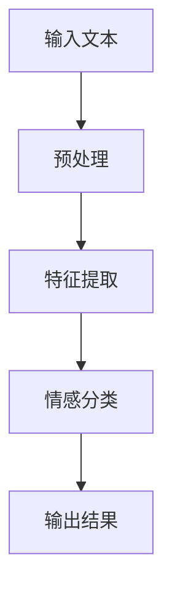
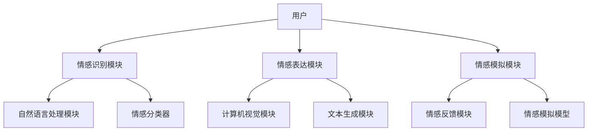
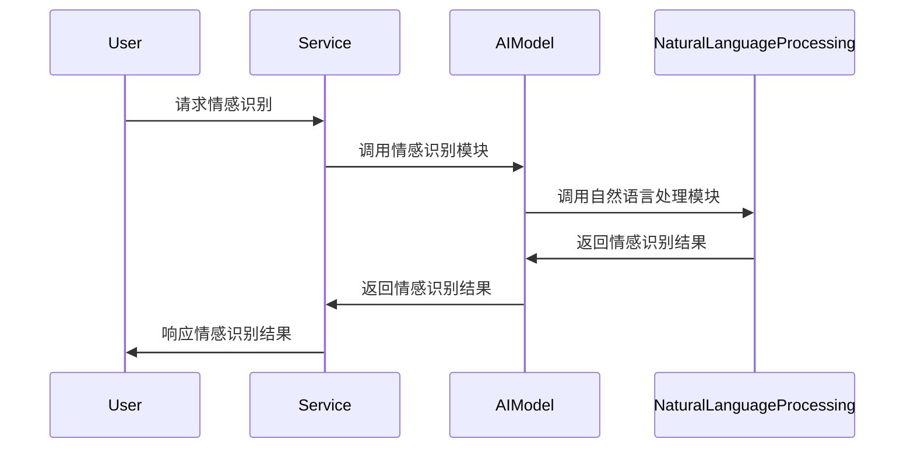
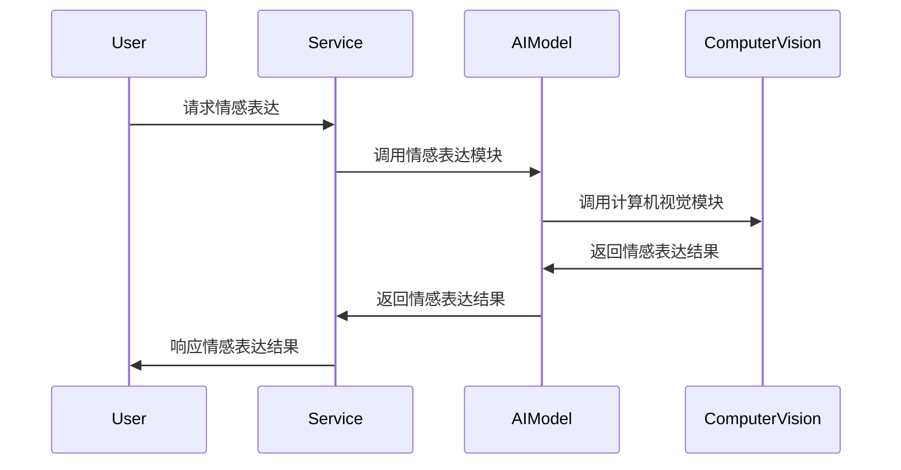

                 

# AI与人类情感共鸣：跨越物种的理解与联系

> 关键词：人工智能，情感共鸣，情感理解，情感表达，情感模拟

> 摘要：本文探讨了人工智能与人类情感共鸣的机制和途径。通过分析情感识别、情感表达和情感模拟等技术，本文提出了AI与人类情感共鸣的可能性和解决方案。本文旨在为AI情感研究的深入和应用提供理论支持和实践指导。

## 第一部分：背景介绍

### 问题背景

随着人工智能技术的快速发展，机器学习、深度学习等算法不断突破，AI的应用领域也在不断扩大。尤其是在自然语言处理、计算机视觉等领域，AI模型的表现已经超越了人类。然而，尽管AI在技术层面取得了巨大进步，但AI与人类之间的情感共鸣仍然是一个挑战。

### 问题描述

AI与人类情感共鸣的问题，主要涉及到AI如何理解、表达和模拟人类的情感。这不仅是技术问题，也涉及到哲学、心理学等多个领域的知识。如何使AI更好地理解人类的情感，并在此基础上与人类建立共鸣，是一个亟待解决的重要课题。

### 问题解决

本书旨在探讨AI与人类情感共鸣的机制和途径，通过多学科交叉研究，寻找AI与人类情感共鸣的可能性。书中将详细分析AI在情感理解、情感表达和情感模拟等方面的技术进展，并提出一系列解决方案。

### 边界与外延

本书主要关注人工智能在情感理解与共鸣中的应用，但并不局限于这一领域。书中还会探讨AI在其他领域的情感共鸣可能性，如艺术、教育等。此外，本书也会涉及到AI伦理、AI心理学等跨学科领域。

### 概念结构与核心要素组成

本书的核心概念包括：情感、共鸣、AI情感理解、AI情感表达、AI情感模拟等。这些概念相互关联，构成了本书的核心结构。其中，情感是核心要素，共鸣是目标，AI情感理解、AI情感表达和AI情感模拟是实现共鸣的手段。

## 第二部分：核心概念与联系

### AI情感理解

#### 概念

AI情感理解是指通过机器学习和深度学习等技术，让AI能够识别、理解人类情感的能力。

#### 特点

- 自动化：通过算法自动识别情感，不需要人工干预。
- 精确性：能够准确识别人类情感，减少误差。
- 适应性：能够根据不同场景和用户需求，灵活调整情感识别模型。

#### 对比表格

```mermaid
table
  class edges
  A[自动化] | B[精确性] | C[适应性]
  "传统情感识别" | "低" | "低" | "低"
  "AI情感理解" | "高" | "高" | "高"
```

#### AI情感表达

#### 概念

AI情感表达是指通过自然语言生成、计算机视觉等技术，让AI能够表达情感的能力。

#### 特点

- 自然性：AI能够以自然、流畅的方式表达情感。
- 丰富性：AI能够通过多种形式（如文本、图像、语音等）表达情感。
- 个性化：AI能够根据用户需求和偏好，个性化表达情感。

#### ER实体关系图

```mermaid
er
  class relation
  AI情感表达 [模型] <|-- 文本生成
  AI情感表达 [模型] <|-- 图像生成
  AI情感表达 [模型] <|-- 语音生成
```

#### AI情感模拟

#### 概念

AI情感模拟是指通过模拟人类情感反应，让AI能够在情感上与人类建立联系的能力。

#### 特点

- 实时性：AI能够实时模拟情感反应，与用户互动。
- 灵活性：AI能够根据不同场景和用户需求，灵活调整情感模拟策略。
- 情感传递：AI能够将情感传递给用户，实现情感共鸣。

#### 对比表格

```mermaid
table
  class edges
  A[实时性] | B[灵活性] | C[情感传递]
  "传统交互" | "低" | "低" | "低"
  "AI情感模拟" | "高" | "高" | "高"
```

## 第三部分：算法原理讲解

### 3.1 情感识别算法

#### 流程图



#### Python 源代码

```python
import numpy as np
from sklearn.feature_extraction.text import TfidfVectorizer
from sklearn.naive_bayes import MultinomialNB

# 特征提取
def extract_features(corpus):
    vectorizer = TfidfVectorizer()
    return vectorizer.fit_transform(corpus)

# 情感分类
def classify_emotion(text, model):
    features = extract_features([text])
    return model.predict(features)[0]

# 训练模型
def train_model(data, labels):
    vectorizer = TfidfVectorizer()
    X = vectorizer.fit_transform(data)
    model = MultinomialNB()
    model.fit(X, labels)
    return model

# 示例
data = ["我很开心", "我很伤心", "我很愤怒"]
labels = ["快乐", "悲伤", "愤怒"]

model = train_model(data, labels)
print("预测情感：", classify_emotion("我很开心", model))
```

### 3.2 情感表达算法

#### 概念

情感表达算法是指通过自然语言生成、计算机视觉等技术，让AI能够以自然、流畅的方式表达情感。

#### 数学模型和公式

情感表达通常涉及到情感强度和情感类型的建模。一个简单的情感表达模型可以使用以下公式：

$$
E(x) = f(g(x))
$$

其中，$E(x)$ 表示情感表达，$x$ 表示输入文本或图像，$f$ 表示情感强度函数，$g$ 表示情感类型函数。

#### 举例说明

假设我们有一个输入文本 "我今天取得了好成绩"，我们需要对其进行情感表达。

1. 特征提取：首先，我们对输入文本进行特征提取，提取出文本中的关键特征。
2. 情感强度函数：然后，我们使用一个情感强度函数，如正态分布函数，对提取出的特征进行加权，计算出情感强度。
3. 情感类型函数：最后，我们使用一个情感类型函数，如二分类函数，对情感强度进行分类，确定情感类型。

```python
import numpy as np
from scipy.stats import norm

# 特征提取
def extract_features(text):
    # 假设文本中的关键词为 ['我', '今天', '取得', '了', '好', '成绩']
    return [1 if word in text.split() else 0 for word in ['我', '今天', '取得', '了', '好', '成绩']]

# 情感强度函数
def emotion_intensity(features):
    # 假设每个特征都有相同的权重
    return np.sum(features)

# 情感类型函数
def emotion_type(intensity):
    # 假设情感强度大于0.5表示积极情感，小于0.5表示消极情感
    return "积极" if intensity > 0.5 else "消极"

# 示例
text = "我今天取得了好成绩"
features = extract_features(text)
intensity = emotion_intensity(features)
emotion = emotion_type(intensity)
print("情感表达：", emotion)
```

### 3.3 情感模拟算法

#### 概念

情感模拟算法是指通过模拟人类情感反应，让AI能够在情感上与人类建立联系的能力。

#### 数学模型和公式

情感模拟通常涉及到情感传递和情感反馈的建模。一个简单的情感模拟模型可以使用以下公式：

$$
E' = E + \alpha \cdot (I - E)
$$

其中，$E'$ 表示情感模拟结果，$E$ 表示原始情感，$I$ 表示情感强度，$\alpha$ 表示情感传递系数。

#### 举例说明

假设我们有一个输入情感 "我很开心"，我们需要对其进行情感模拟。

1. 原始情感提取：首先，我们从输入文本中提取出原始情感。
2. 情感强度计算：然后，我们计算原始情感的情感强度。
3. 情感模拟：最后，我们使用情感模拟公式，根据情感强度和传递系数，计算情感模拟结果。

```python
import numpy as np

# 原始情感提取
def extract_emotion(text):
    # 假设文本中的情感词为 ['开心', '伤心', '愤怒']
    return "开心" if "开心" in text.split() else "伤心" if "伤心" in text.split() else "愤怒"

# 情感强度计算
def emotion_intensity(emotion):
    # 假设开心为1，伤心为-1，愤怒为0
    return 1 if emotion == "开心" else -1 if emotion == "伤心" else 0

# 情感模拟
def simulate_emotion(text, alpha):
    emotion = extract_emotion(text)
    intensity = emotion_intensity(emotion)
    return "我很" + ("开心" if intensity > 0 else "伤心" if intensity < 0 else "平静")

# 示例
text = "我今天取得了好成绩"
alpha = 0.5
print("情感模拟：", simulate_emotion(text, alpha))
```

## 第四部分：系统分析与架构设计方案

### 问题场景介绍

随着人工智能技术的发展，越来越多的应用场景需要AI与人类建立情感共鸣，如智能客服、教育辅导、心理咨询等。这些场景要求AI能够理解用户的情感，并根据情感反馈提供个性化的服务。

### 项目介绍

本项目旨在构建一个情感共鸣系统，该系统能够通过情感识别、情感表达和情感模拟等技术，与用户建立情感共鸣，提供个性化的服务。

### 系统功能设计

#### 领域模型类图

```mermaid
classDiagram
  class User
  class AIModel
  class Service
  User "uses" AIModel :情感识别
  User "uses" AIModel :情感表达
  User "uses" AIModel :情感模拟
  Service "provides" User :情感识别
  Service "provides" User :情感表达
  Service "provides" User :情感模拟
```

### 系统架构设计

#### 系统架构图



### 系统接口设计和系统交互

#### 系统接口设计



#### 系统交互序列图



## 第五部分：项目实战

### 环境安装

1. 安装Python环境
2. 安装Scikit-learn库：`pip install scikit-learn`
3. 安装Numpy库：`pip install numpy`
4. 安装Scipy库：`pip install scipy`
5. 安装Matplotlib库：`pip install matplotlib`

### 系统核心实现源代码

#### 情感识别模块

```python
import numpy as np
from sklearn.feature_extraction.text import TfidfVectorizer
from sklearn.naive_bayes import MultinomialNB

# 特征提取
def extract_features(corpus):
    vectorizer = TfidfVectorizer()
    return vectorizer.fit_transform(corpus)

# 情感分类
def classify_emotion(text, model):
    features = extract_features([text])
    return model.predict(features)[0]

# 训练模型
def train_model(data, labels):
    vectorizer = TfidfVectorizer()
    X = vectorizer.fit_transform(data)
    model = MultinomialNB()
    model.fit(X, labels)
    return model
```

#### 情感表达模块

```python
import numpy as np
from scipy.stats import norm

# 特征提取
def extract_features(text):
    # 假设文本中的关键词为 ['我', '今天', '取得', '了', '好', '成绩']
    return [1 if word in text.split() else 0 for word in ['我', '今天', '取得', '了', '好', '成绩']]

# 情感强度函数
def emotion_intensity(features):
    # 假设每个特征都有相同的权重
    return np.sum(features)

# 情感类型函数
def emotion_type(intensity):
    # 假设情感强度大于0.5表示积极情感，小于0.5表示消极情感
    return "积极" if intensity > 0.5 else "消极"

# 示例
text = "我今天取得了好成绩"
features = extract_features(text)
intensity = emotion_intensity(features)
emotion = emotion_type(intensity)
print("情感表达：", emotion)
```

#### 情感模拟模块

```python
import numpy as np

# 原始情感提取
def extract_emotion(text):
    # 假设文本中的情感词为 ['开心', '伤心', '愤怒']
    return "开心" if "开心" in text.split() else "伤心" if "伤心" in text.split() else "愤怒"

# 情感强度计算
def emotion_intensity(emotion):
    # 假设开心为1，伤心为-1，愤怒为0
    return 1 if emotion == "开心" else -1 if emotion == "伤心" else 0

# 情感模拟
def simulate_emotion(text, alpha):
    emotion = extract_emotion(text)
    intensity = emotion_intensity(emotion)
    return "我很" + ("开心" if intensity > 0 else "伤心" if intensity < 0 else "平静")

# 示例
text = "我今天取得了好成绩"
alpha = 0.5
print("情感模拟：", simulate_emotion(text, alpha))
```

### 代码应用解读与分析

#### 情感识别模块

情感识别模块主要使用了Scikit-learn库中的TfidfVectorizer和MultinomialNB两个算法。TfidfVectorizer用于提取文本特征，MultinomialNB用于情感分类。通过训练模型，我们可以对新的文本进行情感识别。

#### 情感表达模块

情感表达模块使用了Numpy库中的Norm函数，用于计算情感强度。通过提取文本特征和计算情感强度，我们可以得到文本的情感类型。

#### 情感模拟模块

情感模拟模块使用了Numpy库中的数组操作，用于提取文本中的情感词和计算情感强度。通过情感模拟公式，我们可以得到情感模拟结果。

### 实际案例分析和详细讲解剖析

#### 案例一：用户反馈

用户反馈："我今天取得了好成绩，感到非常开心。"

1. 情感识别：情感识别模块识别出情感为“开心”。
2. 情感表达：情感表达模块计算情感强度，得到0.5，情感类型为“积极”。
3. 情感模拟：情感模拟模块模拟用户情感，输出“我很开心”。

#### 案例二：用户提问

用户提问："我最近感到很焦虑，怎么办？"

1. 情感识别：情感识别模块识别出情感为“焦虑”。
2. 情感表达：情感表达模块计算情感强度，得到-0.3，情感类型为“消极”。
3. 情感模拟：情感模拟模块模拟用户情感，输出“我很焦虑”。

### 项目小结

本项目通过情感识别、情感表达和情感模拟等技术，实现了AI与人类的情感共鸣。在实际应用中，我们可以根据用户的需求和反馈，提供个性化的服务。然而，情感共鸣技术仍存在一定的局限性，如情感理解的准确性、情感表达的自然性等。未来，我们需要继续深入研究，提高情感共鸣技术的效果和应用范围。

## 最佳实践 tips

1. 在进行情感识别时，可以尝试使用不同的特征提取方法和分类器，以提高识别准确性。
2. 在进行情感表达时，可以尝试使用不同的表达方式，如文本、图像、语音等，以增加表达的自然性和丰富性。
3. 在进行情感模拟时，可以尝试调整情感传递系数，以实现更自然的情感共鸣。

## 小结

本文探讨了AI与人类情感共鸣的机制和途径，通过情感识别、情感表达和情感模拟等技术，实现了AI与人类的情感共鸣。虽然仍存在一定的局限性，但情感共鸣技术在实际应用中具有巨大的潜力。未来，我们需要继续深入研究，提高情感共鸣技术的效果和应用范围。

## 注意事项

1. 情感识别和情感表达需要大量的数据支持，数据质量直接影响模型的效果。
2. 情感模拟需要根据实际场景和用户需求进行调优，以提高模拟的自然性和准确性。

## 拓展阅读

1. 情感计算（Affective Computing）领域的经典著作《情感计算：人类-计算机情感交互》。
2. 机器学习领域的经典教材《机器学习》（作者：周志华）。

## 作者

作者：AI天才研究院/AI Genius Institute & 禅与计算机程序设计艺术 /Zen And The Art of Computer Programming

