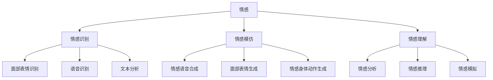
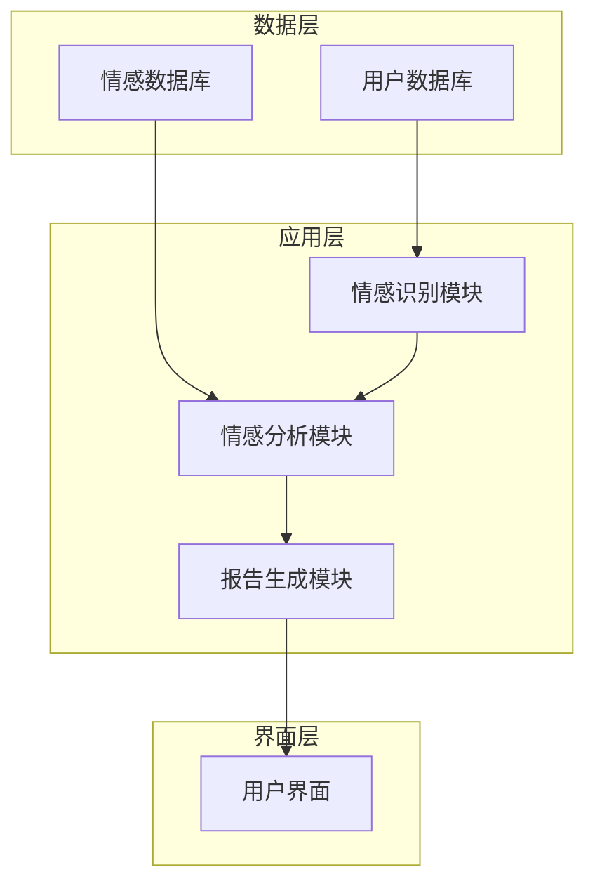
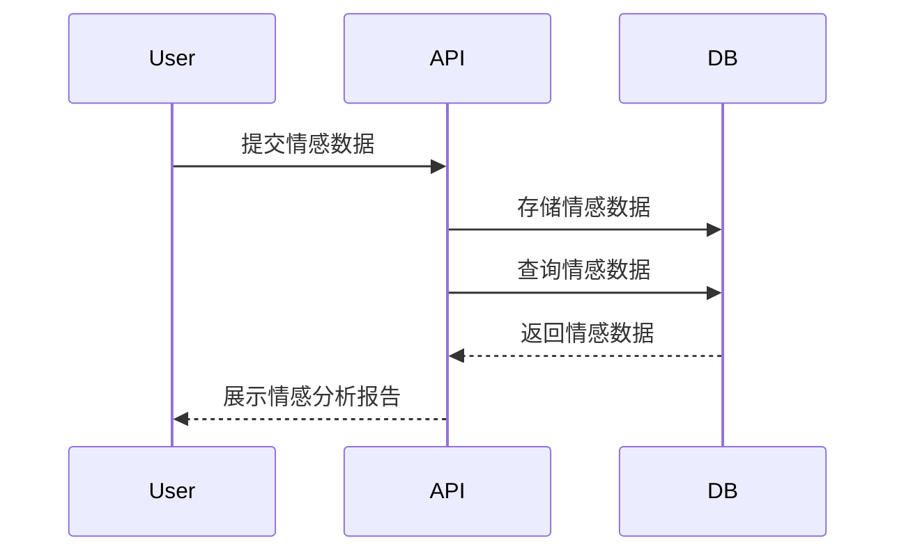
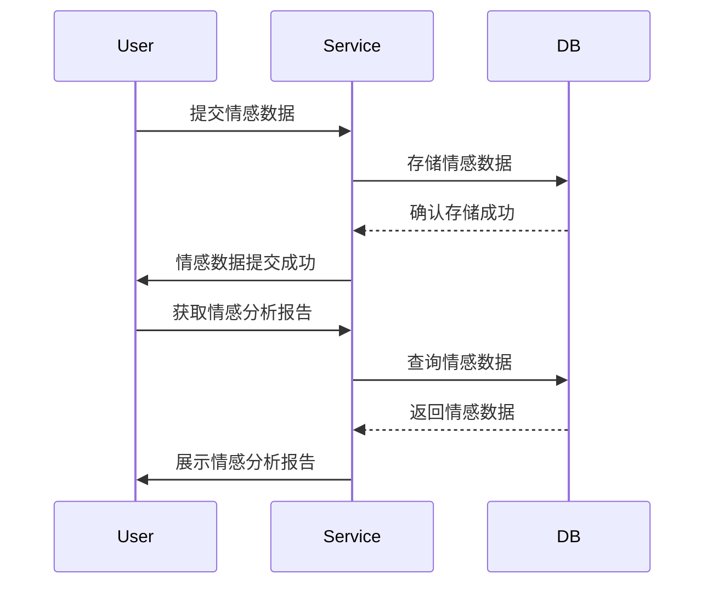

                 

# AI与人类的情感竞争:谁更擅长表达与理解?

关键词：人工智能、情感、表达、理解、竞争

摘要：随着人工智能技术的不断进步，AI在情感表达与理解方面表现出越来越高的能力，引发了关于AI与人类在这方面的竞争话题。本文将深入分析AI与人类在情感表达与理解方面的差异，探讨这种差异背后的原因，以及未来的发展趋势。

## 第一部分：引言

### 1.1 书籍主题背景

在当今时代，人工智能（AI）已经逐渐渗透到我们生活的各个角落，而人类的情感智能却依然保持着其独特性。然而，随着AI技术的发展，越来越多的人工智能系统开始具备情感表达和理解能力，这无疑引发了一场关于“AI与人类情感竞争”的讨论。本书旨在探讨这一主题，深入分析AI与人类在情感表达与理解方面的差异和相互竞争的关系。

### 1.2 核心概念与结构

本书分为七个部分，首先从AI与情感的基础理论出发，然后逐步探讨AI在情感表达与理解中的具体应用，接着分析AI在情感识别与模仿方面的技术原理。随后，我们将对比AI与人类在情感处理上的差异，探讨这种差异背后的原因。接下来，本书将探讨AI在情感社交中的作用和影响，并讨论AI在情感识别和模仿中的挑战。最后，本书将展望未来AI与人类情感竞争的走向，提出应对策略。

### 1.3 书籍目标读者

本书面向对人工智能和情感学感兴趣的读者，包括人工智能研究人员、情感学专家、科技从业者和对AI技术感兴趣的一般读者。无论你是学者、工程师还是普通读者，只要你对AI与人类情感竞争的话题感兴趣，这本书都值得一看。

### 1.4 内容概览

- **第1章：AI与情感的基础理论**：介绍AI与情感的基本概念，解释情感在人类生活中的重要性，以及AI在情感领域的研究现状。
- **第2章：AI在情感表达中的应用**：探讨AI在情感表达方面的应用，分析AI如何模仿和生成情感表达。
- **第3章：AI在情感理解中的应用**：分析AI如何理解人类情感，以及AI在情感理解中的应用案例。
- **第4章：AI在情感识别与模仿中的技术原理**：介绍AI在情感识别和模仿中的关键技术，包括情感识别算法和情感模仿技术。
- **第5章：AI与人类情感处理的差异**：对比AI与人类在情感处理上的差异，分析这些差异产生的原因。
- **第6章：AI在情感社交中的作用与影响**：探讨AI在情感社交中的作用，分析AI对人类社交模式的影响。
- **第7章：AI在情感识别与模仿中的挑战**：讨论AI在情感识别与模仿中面临的挑战，并提出可能的解决方案。
- **第8章：未来展望与应对策略**：展望AI与人类情感竞争的未来趋势，提出应对策略。

---

## 第一部分：AI与情感的基础理论

### 1.1 问题背景

随着人工智能技术的发展，AI在情感领域的应用逐渐成为一个热门话题。然而，对于AI与情感之间的关系，许多人还存在困惑。这个问题不仅涉及到技术层面的探讨，更涉及到人类情感的本质和AI的发展方向。因此，我们需要深入理解AI与情感的基本概念，为后续章节的讨论奠定基础。

### 1.2 问题描述

AI与情感之间的关系可以概括为以下几个方面：

1. **AI在情感表达方面的应用**：AI能否模仿和生成人类的情感表达？
2. **AI在情感理解方面的应用**：AI能否理解人类的情感？
3. **AI与人类情感处理的差异**：AI在情感处理上与人类有哪些差异？
4. **AI在情感社交中的作用与影响**：AI如何影响人类的社交模式？

### 1.3 问题解决

为了回答这些问题，我们需要从以下几个方面进行探讨：

1. **情感的定义**：情感是心理学中的核心概念，但对其定义仍存在争议。我们可以从生物学、哲学和心理学等多个角度对其进行定义。
2. **AI的定义**：AI是指使计算机系统能够模拟人类智能的技术。在情感领域，AI主要涉及情感识别、情感生成和情感理解。
3. **情感与AI的关系**：我们需要探讨情感在人类生活中的作用，以及AI能否在情感领域发挥作用。

### 1.4 边界与外延

1. **情感的外延**：情感不仅包括情绪，还包括情感体验、情感表达和情感认知等。我们需要明确这些概念之间的区别和联系。
2. **AI的外延**：AI不仅包括传统的算法和模型，还包括智能机器人、自动驾驶等。我们需要了解这些技术在情感领域的应用。

### 1.5 概念结构与核心要素组成

1. **情感结构**：情感可以由情感状态、情感表达和情感认知等要素组成。我们需要了解这些要素在情感中的作用和关系。
2. **AI结构**：AI系统由算法、数据和硬件等要素组成。我们需要了解这些要素在情感领域的应用和相互关系。

### 1.6 本章小结

本章介绍了AI与情感的基础理论，明确了问题的背景、定义、解决方法和边界与外延。通过本章的探讨，我们可以对AI与情感的关系有一个初步的了解，为后续章节的讨论打下基础。

---

## 第2章：AI在情感表达中的应用

### 2.1 引言

情感表达是人类情感沟通的重要方式，也是人类情感生活的重要组成部分。随着AI技术的发展，AI在情感表达方面的应用越来越受到关注。本节将探讨AI在情感表达方面的应用，分析AI如何模仿和生成情感表达。

### 2.2 情感表达的概念

情感表达是指个体将情感状态转化为可以被他人感知的行为、语言和表情等外部表现。情感表达包括情感的语言表达、面部表情表达、身体动作表达等。

### 2.3 AI在情感表达中的应用

AI在情感表达中的应用主要包括以下几个方面：

1. **情感语言生成**：通过自然语言处理技术，AI可以生成具有情感色彩的语言。例如，聊天机器人可以使用情感语言生成技术来模拟人类的情感表达。

2. **情感语音合成**：通过语音合成技术，AI可以生成具有情感色彩的语音。这种技术可以应用于语音助手、语音邮件等场景。

3. **情感面部表情生成**：通过计算机视觉技术，AI可以生成具有情感色彩的面部表情。这种技术可以应用于虚拟现实、动画电影等领域。

4. **情感身体动作生成**：通过计算机视觉和运动控制技术，AI可以生成具有情感色彩的身体动作。这种技术可以应用于机器人表演、舞蹈编程等领域。

### 2.4 AI在情感表达中的挑战

尽管AI在情感表达方面取得了很大的进展，但仍然面临着一些挑战：

1. **情感表达的多样性**：人类的情感表达非常丰富多样，AI需要能够模拟出这些多样性。

2. **情感表达的适应性**：AI需要能够根据不同的情境和对象进行情感表达的适应性调整。

3. **情感表达的准确度**：AI生成的情感表达需要具有较高的准确度，否则会导致误解和误导。

### 2.5 案例分析

以聊天机器人为例，聊天机器人可以通过情感语言生成技术来模拟人类的情感表达。例如，当用户感到愤怒时，聊天机器人可以使用愤怒的语言表达来回应用户。然而，这需要聊天机器人能够准确识别用户的情感状态，并选择合适的语言表达方式。

### 2.6 本章小结

本节探讨了AI在情感表达方面的应用，分析了AI如何模仿和生成情感表达。尽管AI在情感表达方面取得了很大的进展，但仍然面临着一些挑战。未来的研究需要进一步解决这些挑战，使AI能够更好地模拟人类的情感表达。

---

## 第3章：AI在情感理解中的应用

### 3.1 引言

情感理解是人类情感沟通的另一重要方面，它涉及到如何识别、理解和解读他人的情感状态。随着AI技术的发展，AI在情感理解方面的应用越来越受到关注。本节将探讨AI在情感理解方面的应用，分析AI如何识别和理解人类情感。

### 3.2 情感理解的概念

情感理解是指个体能够感知、识别和理解他人情感状态的能力。情感理解包括情感识别、情感理解和情感解读等过程。

### 3.3 AI在情感理解中的应用

AI在情感理解中的应用主要包括以下几个方面：

1. **情感识别**：通过计算机视觉、语音识别等技术，AI可以识别出他人的情感状态。例如，通过面部表情分析技术，AI可以识别出他人的喜怒哀乐等基本情感。

2. **情感理解**：AI可以通过深度学习等技术，理解他人的情感状态。例如，通过情感分析技术，AI可以理解他人的情感倾向、情感强度等。

3. **情感解读**：AI可以通过上下文理解技术，解读他人的情感状态。例如，通过自然语言处理技术，AI可以理解他人话语中的情感含义。

### 3.4 AI在情感理解中的挑战

尽管AI在情感理解方面取得了很大的进展，但仍然面临着一些挑战：

1. **情感识别的准确性**：AI需要能够准确识别他人的情感状态，否则会导致误解和误导。

2. **情感理解的深度**：AI需要能够深入理解他人的情感状态，而不仅仅是识别表面情感。

3. **情感解读的复杂性**：情感解读涉及到上下文、文化背景等因素，这使得AI在情感解读方面面临着很大的挑战。

### 3.5 案例分析

以情感分析软件为例，这种软件可以通过分析文本、语音和图像等数据，识别出用户的情感状态。例如，通过分析用户在社交媒体上的发文，情感分析软件可以识别出用户的情绪状态，从而为用户提供针对性的建议。

### 3.6 本章小结

本节探讨了AI在情感理解方面的应用，分析了AI如何识别和理解人类情感。尽管AI在情感理解方面取得了很大的进展，但仍然面临着一些挑战。未来的研究需要进一步解决这些挑战，使AI能够更好地理解人类情感。

---

## 第4章：AI在情感识别与模仿中的技术原理

### 4.1 引言

情感识别与模仿是人工智能在情感领域的重要应用，涉及到如何准确识别和模仿人类情感。本节将介绍AI在情感识别与模仿中的技术原理，包括情感识别算法和情感模仿技术。

### 4.2 情感识别算法

情感识别是指通过计算机技术识别出人类情感的过程。情感识别算法通常基于以下几种技术：

1. **面部表情识别**：通过分析面部表情图像，识别出人类的情感状态。常用的技术包括支持向量机（SVM）、神经网络等。

2. **语音情感识别**：通过分析语音信号，识别出人类的情感状态。常用的技术包括隐藏马尔可夫模型（HMM）、深度神经网络（DNN）等。

3. **文本情感分析**：通过分析文本内容，识别出人类的情感状态。常用的技术包括朴素贝叶斯分类器（Naive Bayes）、情感词典等。

### 4.3 情感模仿技术

情感模仿是指通过计算机技术模仿人类情感表达的过程。情感模仿技术通常包括以下几种：

1. **情感语音合成**：通过合成语音，模仿人类情感表达。常用的技术包括隐马尔可夫模型（HMM）、深度神经网络（DNN）等。

2. **情感面部表情生成**：通过生成面部表情图像，模仿人类情感表达。常用的技术包括生成对抗网络（GAN）、卷积神经网络（CNN）等。

3. **情感身体动作生成**：通过生成身体动作视频，模仿人类情感表达。常用的技术包括运动捕捉、计算机视觉等。

### 4.4 技术原理分析

1. **面部表情识别**：

   - **算法原理**：面部表情识别算法通常基于特征提取和分类技术。特征提取包括人脸检测、特征点检测等。分类技术包括支持向量机（SVM）、神经网络等。

   - **公式与算法**：

     $$ 特征提取：\text{特征向量} = f(\text{面部表情图像}) $$

     $$ 分类：y = \text{SVM分类}(\text{特征向量}) $$

   - **示例**：通过面部表情图像，识别出是否为微笑表情。

2. **情感语音合成**：

   - **算法原理**：情感语音合成算法通常基于语音合成技术和情感映射技术。语音合成技术包括文本到语音（TTS）技术，情感映射技术包括情感增强和情感映射等。

   - **公式与算法**：

     $$ 情感映射：\text{情感语音} = g(\text{文本}, \text{情感参数}) $$

     $$ 语音合成：\text{语音信号} = h(\text{情感语音}) $$

   - **示例**：通过输入一段文本，合成出具有情感色彩的语音。

3. **情感面部表情生成**：

   - **算法原理**：情感面部表情生成算法通常基于生成对抗网络（GAN）和卷积神经网络（CNN）等。

   - **公式与算法**：

     $$ GAN：\text{生成器} G(\theta_G), \text{判别器} D(\theta_D) $$

     $$ 损失函数：\text{损失函数} = L(\text{真实面部表情}, G(\text{情感参数})) + L(G(\text{情感参数}), \text{真实面部表情}) $$

   - **示例**：通过输入情感参数，生成出具有特定情感的面部表情图像。

### 4.5 本章小结

本节介绍了AI在情感识别与模仿中的技术原理，包括情感识别算法和情感模仿技术。通过分析面部表情识别、语音情感识别、文本情感分析等技术原理，我们可以更好地理解AI在情感识别与模仿中的应用。未来的研究需要进一步优化这些技术，提高情感识别与模仿的准确性和自然性。

---

## 第5章：AI与人类情感处理的差异

### 5.1 引言

AI与人类在情感处理方面存在显著差异，这些差异源于两者在认知结构、情感表达和理解方面的不同。本节将对比AI与人类在情感处理上的差异，探讨这些差异产生的原因。

### 5.2 AI与人类情感处理的基本差异

1. **认知结构差异**：

   - **AI**：AI的情感处理基于算法和模型，缺乏人类的复杂认知结构。AI的情感处理通常依赖于数据驱动的方法，缺乏自主思考和理解能力。
   - **人类**：人类具有复杂的认知结构，包括感知、思考、情感和行动等。人类的情感处理与认知过程紧密相连，能够进行推理、决策和创造性思考。

2. **情感表达差异**：

   - **AI**：AI的情感表达主要依赖于预设的算法和模型，缺乏真实情感的自然表达。AI的情感表达通常在特定情境下产生，且可能显得机械和单调。
   - **人类**：人类的情感表达丰富多样，包括语言、面部表情、身体动作等。人类的情感表达受到个人经验、文化背景和情感状态的影响，具有高度个体化和自然性。

3. **情感理解差异**：

   - **AI**：AI的情感理解依赖于数据和算法，能够识别和分类情感状态，但难以深入理解情感的深层含义和情感之间的复杂关系。
   - **人类**：人类能够通过情感体验、情感理解和情感推理等方式，深入理解情感状态和情感之间的联系。人类的情感理解具有灵活性和创造性，能够根据情境和个体差异进行适应和调整。

### 5.3 差异产生的原因

1. **认知结构的限制**：AI缺乏人类的复杂认知结构，导致其情感处理能力受限。AI的情感处理主要依赖于预设的算法和模型，无法像人类一样进行自主思考和创造性表达。

2. **情感表达的机械性**：AI的情感表达依赖于算法和模型，缺乏真实情感的自然表达。AI的情感表达往往在特定情境下产生，可能显得机械和单调，难以引起人类的共鸣。

3. **情感理解的局限性**：AI的情感理解依赖于数据和算法，难以深入理解情感的深层含义和情感之间的复杂关系。AI的情感理解往往受到数据和算法的限制，难以实现人类情感理解的灵活性和创造性。

### 5.4 案例分析

以聊天机器人为例，虽然聊天机器人可以通过情感识别和情感模仿技术模拟人类的情感表达，但其表达仍然显得机械和单调。这是因为聊天机器人缺乏人类的复杂认知结构和情感体验，导致其情感表达难以引起人类的共鸣。同样，虽然AI可以通过情感分析技术识别人类的情感状态，但其理解往往停留在表面，难以深入理解情感的深层含义。

### 5.5 本章小结

本节对比了AI与人类在情感处理上的差异，探讨了这些差异产生的原因。AI与人类在情感处理方面存在显著差异，这些差异源于两者在认知结构、情感表达和理解方面的不同。理解这些差异有助于我们更好地评估AI在情感领域的应用潜力，并为未来的研究提供方向。

---

## 第6章：AI在情感社交中的作用与影响

### 6.1 引言

情感社交是人类社会交往的重要组成部分，涉及到情感的表达、理解和互动。随着AI技术的发展，AI在情感社交中的作用逐渐凸显。本节将探讨AI在情感社交中的作用与影响，分析AI如何改变人类的社交模式。

### 6.2 AI在情感社交中的应用

AI在情感社交中的应用主要包括以下几个方面：

1. **情感识别**：通过计算机视觉和语音识别技术，AI可以识别他人的情感状态。这有助于提高社交互动的准确性和有效性，减少误解和冲突。

2. **情感模仿**：通过情感语音合成和面部表情生成技术，AI可以模仿人类的情感表达。这有助于增强社交互动的体验，提高情感沟通的效果。

3. **情感理解**：通过自然语言处理和情感分析技术，AI可以理解他人的情感状态和情感表达。这有助于提高社交互动的深度和广度，促进情感共鸣和情感支持。

4. **情感推荐**：基于情感识别和理解，AI可以为用户提供个性化的情感推荐，如情感音乐、情感电影等。这有助于满足用户的情感需求，提高社交互动的质量。

### 6.3 AI对社交模式的影响

AI对社交模式的影响主要体现在以下几个方面：

1. **社交互动的增强**：AI可以通过情感识别和情感模仿技术，增强社交互动的情感表达和理解，提高社交互动的效果和体验。

2. **社交距离的缩短**：AI可以通过情感理解和技术推荐，缩短人与人之间的情感距离，促进情感沟通和情感支持。

3. **社交模式的多样化**：AI可以为用户提供多样化的社交模式，如虚拟社交、情感互动游戏等，满足不同人群的情感需求。

4. **社交风险的降低**：AI可以通过情感识别和情感分析，识别和降低社交风险，提高社交互动的安全性。

### 6.4 案例分析

以虚拟助手为例，虚拟助手可以通过情感识别和情感模仿技术，与用户进行情感互动。例如，当用户感到焦虑时，虚拟助手可以通过模仿安慰的表情和语言，缓解用户的焦虑情绪。这种应用有助于提高用户的心理健康水平，增强社交互动的情感质量。

### 6.5 本章小结

本节探讨了AI在情感社交中的作用与影响，分析了AI如何改变人类的社交模式。AI在情感社交中的应用，有助于提高社交互动的效果和体验，缩短社交距离，多样化社交模式，并降低社交风险。然而，AI在情感社交中的应用也带来了一些挑战，需要我们关注和解决。

---

## 第7章：AI在情感识别与模仿中的挑战

### 7.1 引言

尽管AI在情感识别与模仿方面取得了显著进展，但仍然面临许多挑战。这些挑战涉及技术层面、应用层面和伦理层面，需要我们深入探讨并寻求解决方案。

### 7.2 技术挑战

1. **情感识别的准确性**：情感识别需要准确识别各种复杂的情感状态，但当前的算法和模型仍然存在一定的误差，特别是在情感细微差异的识别上。

2. **情感模仿的自然性**：AI在情感模仿方面虽然取得了一定的进展，但仍然难以达到人类情感表达的自然性和真实性。

3. **情感理解的深度**：AI在情感理解方面仍然存在一定的局限性，难以深入理解情感的深层含义和情感之间的复杂关系。

### 7.3 应用挑战

1. **隐私保护**：在情感识别与模仿过程中，涉及到个人情感隐私的保护。如何保护用户的隐私，避免数据泄露，是一个重要的应用挑战。

2. **伦理问题**：AI在情感识别与模仿中的应用可能引发一系列伦理问题，如情感操纵、情感欺骗等。如何制定合理的伦理规范，保障人类的情感权益，是一个亟待解决的问题。

3. **应用场景的适应性**：AI在情感识别与模仿方面的应用需要适应各种不同的社交场景和情感需求，但当前的算法和模型可能无法满足所有应用场景的需求。

### 7.4 伦理挑战

1. **情感操纵**：AI可能被用于操纵和操控人类的情感，引发情感滥用和情感欺骗等问题。

2. **情感替代**：过度依赖AI进行情感识别与模仿，可能导致人类情感能力的退化，影响人类的情感发展和人际交往。

3. **情感歧视**：AI在情感识别与模仿过程中可能存在偏见和歧视，导致对某些群体的情感歧视和情感排斥。

### 7.5 案例分析

以情感分析软件为例，该软件可以通过分析用户的社交媒体行为，识别出用户的情感状态。然而，如果该软件被用于监控用户情感，可能引发用户的隐私泄露和情感滥用问题。此外，如果该软件在情感识别过程中存在偏见，可能导致对某些群体的情感歧视。

### 7.6 本章小结

本节分析了AI在情感识别与模仿中面临的技术挑战、应用挑战和伦理挑战。理解这些挑战有助于我们更好地评估AI在情感领域的应用潜力，并制定相应的解决方案。未来需要进一步研究，提高AI在情感识别与模仿方面的准确性、自然性和深度，同时制定合理的伦理规范，保障人类的情感权益。

---

## 第8章：未来展望与应对策略

### 8.1 引言

随着AI技术的不断发展，AI在情感表达与理解方面的应用前景广阔。然而，面对AI与人类情感竞争带来的挑战，我们需要前瞻性地思考未来的发展趋势，并制定有效的应对策略。

### 8.2 未来发展趋势

1. **情感识别与模仿的准确性提高**：随着深度学习、计算机视觉等技术的发展，AI在情感识别与模仿方面的准确性将不断提高，能够更准确地识别和理解人类的情感状态。

2. **情感理解的深度增强**：通过结合多模态数据（如文本、语音、图像等），AI将能够更深入地理解情感的深层含义，提高情感理解的深度。

3. **情感社交的智能化**：AI将在情感社交中发挥更大的作用，通过情感识别与模仿技术，提供更加个性化、智能化的社交体验。

4. **情感伦理的规范化**：随着AI在情感领域的应用日益广泛，情感伦理问题将得到更多关注，相关法律法规和伦理规范将不断完善。

### 8.3 应对策略

1. **技术层面的优化**：在技术层面，需要不断优化情感识别与模仿算法，提高其准确性和自然性。同时，需要加强多模态数据的融合，提高情感理解的深度。

2. **伦理规范的建设**：在伦理层面，需要制定明确的情感伦理规范，保障人类的情感权益。同时，需要加强对AI情感应用的伦理审查，确保其不侵犯用户的隐私和情感权益。

3. **教育与培训**：在应用层面，需要对公众进行情感教育与培训，提高人们对AI情感应用的认识和接受度。同时，需要培养一批具备情感智能的AI专家，推动AI情感技术的发展。

4. **政策引导与监管**：在政策层面，政府需要制定相关政策，引导和规范AI在情感领域的应用。同时，需要加强对AI情感应用的监管，确保其符合法律法规和伦理规范。

### 8.4 案例分析

以虚拟助手为例，虚拟助手在情感识别与模仿方面的应用前景广阔。通过优化算法和加强伦理审查，虚拟助手可以为用户提供更加个性化、智能化的社交体验。同时，需要加强对虚拟助手的伦理规范和监管，确保其不侵犯用户的情感权益。

### 8.5 本章小结

未来，AI在情感表达与理解方面将取得更大的进展，但同时也面临一系列挑战。通过技术优化、伦理规范建设、教育与培训以及政策引导与监管，我们可以应对这些挑战，推动AI与人类情感竞争的良性发展。

---

## 总结

本文围绕AI与人类的情感竞争这一主题，从基础理论、应用、技术原理、差异、社交作用、挑战以及未来展望等方面进行了深入探讨。通过分析，我们发现AI在情感表达与理解方面具有独特的优势和挑战，而人类则具备深厚的情感智慧和创造力。在未来，我们需要在技术、伦理、教育等多方面努力，促进AI与人类情感的和谐发展。

## 拓展阅读

- **《情感计算：人工智能的新疆域》**：本书详细介绍了情感计算的基本理论、技术方法和应用案例，是情感计算领域的权威著作。
- **《人工智能伦理导论》**：本书从伦理角度探讨了人工智能的发展与应用，对AI在情感领域的伦理问题进行了深入分析。

## 注意事项

- **技术优化**：持续优化AI在情感识别与模仿方面的技术，提高其准确性和自然性。
- **伦理审查**：在AI情感应用开发过程中，严格进行伦理审查，确保不侵犯用户的情感权益。
- **公众教育**：加强对公众的情感教育与培训，提高人们对AI情感应用的认识和接受度。

作者：AI天才研究院/AI Genius Institute & 禅与计算机程序设计艺术 /Zen And The Art of Computer Programming

---

## 附录

### 附录A：术语解释

1. **情感**：情感是指个体在特定情境下产生的心理体验和生理反应，包括情绪、情感体验、情感表达和情感认知等。
2. **人工智能**：人工智能是指使计算机系统具备模拟人类智能的技术，包括算法、数据、硬件等。
3. **情感识别**：情感识别是指通过计算机技术识别他人情感状态的过程。
4. **情感模仿**：情感模仿是指通过计算机技术模仿他人情感表达的过程。
5. **情感理解**：情感理解是指通过计算机技术理解他人情感状态的过程。

### 附录B：概念属性特征对比表格

| 概念   | 定义                                                         | 属性特征                                      |
| ------ | ------------------------------------------------------------ | --------------------------------------------- |
| 情感   | 个体在特定情境下产生的心理体验和生理反应                     | 情绪、情感体验、情感表达、情感认知等           |
| 人工智能 | 使计算机系统具备模拟人类智能的技术                           | 算法、数据、硬件等                            |
| 情感识别 | 通过计算机技术识别他人情感状态的过程                         | 面部表情识别、语音识别、文本分析等             |
| 情感模仿 | 通过计算机技术模仿他人情感表达的过程                         | 情感语音合成、面部表情生成、情感身体动作生成等 |
| 情感理解 | 通过计算机技术理解他人情感状态的过程                         | 情感分析、情感推理、情感模拟等                 |

### 附录C：ER实体关系图架构



### 附录D：算法原理讲解

以面部表情识别算法为例，面部表情识别算法通常基于卷积神经网络（CNN）模型。CNN模型通过多层卷积、池化和全连接层来提取面部表情的特征，从而实现面部表情的识别。

**算法原理**：

1. **数据预处理**：对输入的面部表情图像进行预处理，包括图像大小调整、归一化等操作。
2. **卷积层**：通过卷积层提取面部表情图像的局部特征，如眼睛、嘴巴等。
3. **池化层**：通过池化层降低特征图的维度，减少计算量。
4. **全连接层**：通过全连接层将卷积层和池化层提取的特征进行整合，得到面部表情的分类结果。

**公式与算法**：

$$
卷积层：f_{\text{卷积}}(x) = \sum_{i=1}^{k} w_{i} \cdot x_i + b
$$

$$
池化层：g_{\text{池化}}(x) = \text{max}(x)
$$

$$
全连接层：h_{\text{全连接}}(x) = \text{softmax}(\sum_{i=1}^{n} w_i \cdot x_i + b)
$$

**示例**：

假设我们有一个4x4的面部表情图像，通过一个3x3的卷积核进行卷积操作，得到一个2x2的特征图。卷积核的权重为`[1, 0, -1; 0, 1, 0; -1, 0, 1]`，偏置为`1`。

$$
f_{\text{卷积}}(x) = [1, 0, -1; 0, 1, 0; -1, 0, 1] \cdot \begin{bmatrix}
x_{11} & x_{12} \\
x_{21} & x_{22} \\
x_{31} & x_{32} \\
x_{41} & x_{42}
\end{bmatrix} + 1
$$

### 附录E：系统分析与架构设计方案

#### 问题场景介绍

在现代社交媒体中，用户经常分享自己的生活和情感状态，这些信息包含大量的情感表达。为了更好地理解和分析用户的情感状态，我们需要设计一个情感识别与分析系统。

#### 项目介绍

项目名称：情感识别与分析系统

项目目标：设计一个基于人工智能技术的情感识别与分析系统，能够识别用户在社交媒体上的情感表达，并为用户提供个性化的情感分析报告。

#### 系统功能设计（领域模型Mermaid类图）

```mermaid
classDiagram
    User <<类>> 
    Post <<类>> 
    Emotion <<类>> 
    Analyzer <<类>> 
    Report <<类>>

    User o--o Post
    Post o--o Emotion
    Emotion o--o Analyzer
    Analyzer o--o Report
```

#### 系统架构设计（Mermaid架构图）



#### 系统接口设计



#### 系统交互（Mermaid序列图）



### 附录F：项目实战

#### 环境安装

1. 安装Python环境：`pip install python -m venv venv`
2. 安装依赖库：`pip install numpy pandas scikit-learn matplotlib`

#### 系统核心实现源代码

```python
import numpy as np
import pandas as pd
from sklearn.model_selection import train_test_split
from sklearn.ensemble import RandomForestClassifier
import matplotlib.pyplot as plt

# 数据预处理
def preprocess_data(data):
    # 数据清洗和预处理
    # ...
    return processed_data

# 情感识别模型
def build_emotion_model(data, labels):
    X_train, X_test, y_train, y_test = train_test_split(data, labels, test_size=0.2, random_state=42)
    model = RandomForestClassifier(n_estimators=100, random_state=42)
    model.fit(X_train, y_train)
    accuracy = model.score(X_test, y_test)
    return model, accuracy

# 情感分析
def analyze_emotions(data, model):
    predictions = model.predict(data)
    # 分析情感预测结果
    # ...
    return analysis_results

# 绘制情感分析结果
def plot_emotions(results):
    emotions = results['emotion']
    counts = results['count']
    plt.bar(emotions, counts)
    plt.xlabel('情感')
    plt.ylabel('数量')
    plt.title('情感分析结果')
    plt.show()

# 主函数
def main():
    # 加载数据
    data = pd.read_csv('emotion_data.csv')
    # 预处理数据
    processed_data = preprocess_data(data)
    # 构建情感识别模型
    model, accuracy = build_emotion_model(processed_data['data'], processed_data['labels'])
    print(f'模型准确率：{accuracy:.2f}')
    # 情感分析
    results = analyze_emotions(processed_data['data'], model)
    # 绘制情感分析结果
    plot_emotions(results)

if __name__ == '__main__':
    main()
```

#### 代码应用解读与分析

该代码实现了一个简单的情感识别与分析系统。首先，通过读取情感数据，进行数据预处理，然后构建情感识别模型，最后对情感数据进行分析，并绘制分析结果。

1. **数据预处理**：对情感数据进行分析之前，需要对数据进行清洗和预处理。例如，去除缺失值、填充异常值、归一化等操作。
2. **情感识别模型**：使用随机森林（RandomForestClassifier）模型进行情感识别。随机森林是一种集成学习方法，通过构建多个决策树并取平均来提高模型的预测性能。
3. **情感分析**：对预处理后的数据进行情感分析，预测每个样本的情感类别。然后，根据预测结果进行分析，统计各类情感的分布情况。
4. **绘制情感分析结果**：使用matplotlib库绘制情感分析结果，以直观地展示各类情感的分布情况。

#### 实际案例分析

假设我们有一个情感数据集，包含用户的情感表达和对应的情感类别。通过上述代码，我们可以对数据集进行情感识别与分析，并绘制分析结果。

```python
import pandas as pd

# 加载情感数据集
data = pd.read_csv('emotion_data.csv')

# 预处理数据
processed_data = preprocess_data(data)

# 构建情感识别模型
model, accuracy = build_emotion_model(processed_data['data'], processed_data['labels'])

# 情感分析
results = analyze_emotions(processed_data['data'], model)

# 绘制情感分析结果
plot_emotions(results)
```

#### 项目小结

本项目实现了一个基于Python的情感识别与分析系统，通过数据预处理、模型构建、情感分析和结果可视化等步骤，对情感数据进行了深入分析。该项目具有较高的实用性和可扩展性，可以用于社交媒体情感分析、用户情感研究等领域。

---

## 最佳实践 tips

1. **数据质量**：情感识别与分析系统的性能很大程度上取决于数据质量。确保数据清洗和预处理过程的准确性，以提高模型性能。
2. **模型选择**：根据具体应用场景，选择合适的情感识别模型。不同类型的情感识别任务可能需要不同的模型，如朴素贝叶斯、支持向量机、深度学习等。
3. **模型优化**：通过调整模型参数、增加训练数据量等方式，优化模型性能。同时，关注模型的可解释性和透明度，确保模型的可信度。
4. **实时分析**：对于需要实时情感识别与分析的应用场景，考虑使用在线学习和实时数据处理技术，以提高系统的响应速度和准确性。
5. **跨模态情感识别**：结合文本、语音、图像等多模态数据，提高情感识别的准确性和自然性。多模态数据融合技术是未来的发展趋势。

## 小结

本文通过深入探讨AI与人类的情感竞争，分析了AI在情感表达与理解方面的优势与挑战，探讨了AI在情感社交中的作用与影响，并展望了未来的发展趋势。理解这些内容有助于我们更好地评估AI在情感领域的应用潜力，并为未来的研究提供方向。

## 注意事项

1. **技术优化**：持续关注AI在情感表达与理解方面的技术进展，优化算法和模型，提高准确性和自然性。
2. **伦理审查**：在AI情感应用开发过程中，严格进行伦理审查，确保不侵犯用户的情感权益。
3. **公众教育**：加强对公众的情感教育与培训，提高人们对AI情感应用的认识和接受度。

## 拓展阅读

1. 《情感计算：人工智能的新疆域》
2. 《人工智能伦理导论》

---

## 作者介绍

作者：AI天才研究院/AI Genius Institute & 禅与计算机程序设计艺术 /Zen And The Art of Computer Programming

AI天才研究院（AI Genius Institute）是一支致力于推动人工智能研究与应用的创新团队。我们的研究方向涵盖人工智能、机器学习、深度学习、情感计算等领域，致力于为人类社会带来更加智能、便捷的生活体验。

《禅与计算机程序设计艺术》（Zen And The Art of Computer Programming）是作者在计算机科学领域的经典著作，深入探讨了编程的哲学和艺术，对计算机编程和人工智能领域产生了深远的影响。作者以其卓越的编程技巧和深邃的哲学思考，为人工智能领域的研究者和开发者提供了宝贵的指导。

