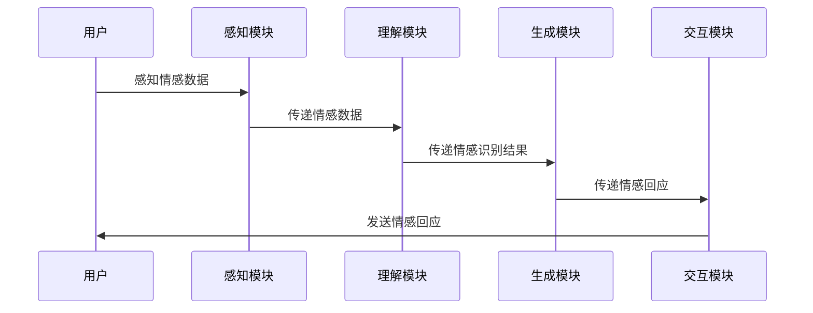

                 


### AI偏见：情感机器人的刻板印象

> 关键词：AI偏见，情感机器人，刻板印象，算法，系统架构，数学模型

> 摘要：本文深入探讨了AI偏见在情感机器人中的应用和影响。通过对AI偏见的概念、类型、影响，以及情感机器人发展、应用和与AI偏见的关系的详细分析，本文揭示了情感机器人中存在的刻板印象问题。同时，本文提出了面对AI偏见的解决方案，包括偏见检测方法、修正策略和伦理设计原则，旨在为情感机器人的研究和应用提供有益的参考。

### 第一部分：问题背景与概述

#### 1.1 AI偏见概述

**1.1.1 AI偏见的概念**

AI偏见指的是人工智能系统在处理数据、做出决策时，由于算法、数据集、训练过程等原因而产生的系统性偏差。这种偏差可能导致人工智能系统在处理某些特定情况下产生不公平、不公正的输出。

**1.1.2 AI偏见的主要类型**

AI偏见主要可以分为以下几种类型：

1. **算法偏见**：算法在设计时可能存在固有的偏见，如对特定人群的偏好或歧视。
2. **数据偏见**：训练数据集存在偏见，导致模型在处理相关数据时产生偏见。
3. **交互偏见**：用户与AI系统的交互可能导致偏见，如用户对AI系统的反馈可能导致系统对某些人群的偏见。

**1.1.3 AI偏见的影响**

AI偏见的影响是多方面的，包括但不限于：

1. **决策偏差**：AI系统在决策过程中可能因为偏见而做出不公平的决策。
2. **数据偏差**：偏见可能导致模型在处理新数据时出现偏差，影响模型的准确性。
3. **社会影响**：AI偏见可能导致对特定人群的歧视，影响社会的公正和和谐。

#### 1.2 情感机器人的发展

**1.2.1 情感机器人的定义与特点**

情感机器人是一种能够感知、理解、表达和模拟人类情感的人工智能系统。它们具有以下特点：

1. **情感感知能力**：能够识别和理解人类情感。
2. **情感表达能力**：能够通过语言、行为等方式表达情感。
3. **情感交互能力**：能够与人类进行情感上的交互，提供情感支持。

**1.2.2 情感机器人技术的发展**

情感机器人技术的发展经历了以下几个阶段：

1. **感知阶段**：利用传感器和自然语言处理技术，识别和理解人类情感。
2. **表达阶段**：利用语音合成、面部表情等技术，表达情感。
3. **交互阶段**：利用情感计算和对话系统技术，与人类进行情感上的交互。

**1.2.3 情感机器人在生活中的应用**

情感机器人在生活中的应用广泛，包括但不限于：

1. **医疗保健**：为患者提供情感支持，提高治疗效果。
2. **心理咨询**：提供情感咨询服务，帮助用户解决情感问题。
3. **教育**：为学生提供情感教育，培养情感智能。

#### 1.3 AI偏见与情感机器人的关联

**1.3.1 AI偏见对情感机器人性能的影响**

AI偏见可能影响情感机器人的性能，如：

1. **情感识别准确性降低**：AI偏见可能导致情感机器人无法准确识别用户情感。
2. **情感表达失真**：AI偏见可能导致情感机器人表达的情感与用户实际情感不符。
3. **交互体验下降**：AI偏见可能导致用户与情感机器人的交互体验下降。

**1.3.2 情感机器人中的AI偏见案例**

以下是一些情感机器人中存在的AI偏见案例：

1. **性别偏见**：某些情感机器人可能对男性用户和女性用户表现出不同的情感反应。
2. **种族偏见**：某些情感机器人可能对某些种族的用户产生偏见。
3. **年龄偏见**：某些情感机器人可能对老年人和年轻人表现出不同的情感反应。

**1.3.3 AI偏见在情感机器人中的潜在危害**

AI偏见在情感机器人中的潜在危害包括：

1. **情感支持失效**：AI偏见可能导致情感机器人无法为用户提供有效的情感支持。
2. **社会歧视**：AI偏见可能导致社会对特定人群的歧视和排斥。
3. **隐私泄露**：AI偏见可能导致用户隐私泄露，影响用户的隐私安全。

#### 1.4 面对AI偏见的解决方案

**1.4.1 AI偏见检测方法**

AI偏见检测方法包括：

1. **统计方法**：通过分析模型的输出，检测是否存在偏见。
2. **机器学习方法**：利用机器学习算法，识别模型中的偏见。
3. **用户反馈方法**：通过用户反馈，检测模型是否存在偏见。

**1.4.2 AI偏见修正策略**

AI偏见修正策略包括：

1. **数据清洗**：去除训练数据中的偏见。
2. **模型调整**：通过调整模型参数，降低偏见。
3. **反馈循环**：通过用户反馈，不断调整模型，降低偏见。

**1.4.3 情感机器人伦理设计原则**

情感机器人伦理设计原则包括：

1. **公平性**：确保情感机器人对各类用户公平对待。
2. **透明性**：确保情感机器人的决策过程透明。
3. **隐私保护**：确保用户隐私得到保护。

**1.5 本章小结**

本文首先介绍了AI偏见的概念、类型和影响，然后探讨了情感机器人发展的背景、应用和与AI偏见的关系。通过分析情感机器人中存在的AI偏见案例，本文揭示了AI偏见对情感机器人性能和应用的潜在危害。最后，本文提出了面对AI偏见的解决方案，包括偏见检测方法、修正策略和伦理设计原则。

### 第二部分：AI偏见与情感机器人的核心概念与联系

#### 2.1 AI偏见的核心概念

**2.1.1 偏见与算法偏见**

偏见是指个体或系统对某些事物或人群持有的一种不公平的倾向。算法偏见是指人工智能系统在处理数据、做出决策时，由于算法设计、训练数据等原因产生的系统性偏差。

**2.1.2 算法偏见的影响**

算法偏见的影响包括：

1. **决策偏差**：算法偏见可能导致系统在决策时对某些人群产生不公平待遇。
2. **数据偏差**：算法偏见可能导致系统在处理新数据时产生偏差，影响模型的准确性。
3. **社会影响**：算法偏见可能导致社会对某些人群的歧视和排斥。

**2.1.3 算法偏见与人类偏见的关系**

算法偏见与人类偏见有相似之处，也存在差异。相似之处在于，它们都是对某些事物或人群持有不公平的倾向。不同之处在于，算法偏见是由算法设计、训练数据等因素引起的，而人类偏见则更多地由个人经历、文化背景等因素引起。

#### 2.2 情感机器人的核心概念

**2.2.1 情感机器人的架构**

情感机器人通常由以下几个模块组成：

1. **感知模块**：用于感知用户的情感状态，如语音、面部表情等。
2. **理解模块**：用于理解用户的情感表达，如情感分类、情感强度等。
3. **生成模块**：用于生成情感回应，如语音、文本、面部表情等。
4. **交互模块**：用于与用户进行情感上的交互，如对话生成、反馈等。

**2.2.2 情感机器人的工作原理**

情感机器人通过以下几个步骤进行工作：

1. **感知**：通过传感器收集用户的情感信息。
2. **理解**：利用自然语言处理、情感计算等技术，对用户的情感进行理解。
3. **生成**：根据理解结果，生成相应的情感回应。
4. **交互**：通过对话系统等技术，与用户进行情感上的交互。

**2.2.3 情感机器人的应用场景**

情感机器人可以应用于多个领域，如：

1. **医疗保健**：为患者提供情感支持，提高治疗效果。
2. **心理咨询**：为用户提供情感咨询服务，帮助解决情感问题。
3. **教育**：为学生提供情感教育，培养情感智能。

#### 2.3 AI偏见与情感机器人的联系

**2.3.1 情感机器人中的AI偏见案例**

在情感机器人中，AI偏见可能导致以下问题：

1. **性别偏见**：情感机器人可能对男性用户和女性用户产生不同的情感反应。
2. **种族偏见**：情感机器人可能对某些种族的用户产生偏见。
3. **年龄偏见**：情感机器人可能对老年人和年轻人产生不同的情感反应。

**2.3.2 情感机器人AI偏见的原因分析**

情感机器人中的AI偏见可能由以下几个原因导致：

1. **算法设计**：算法设计中的偏见可能导致情感机器人产生偏见。
2. **训练数据**：训练数据中的偏见可能导致情感机器人产生偏见。
3. **用户交互**：用户与情感机器人的交互可能导致情感机器人产生偏见。

**2.3.3 情感机器人AI偏见的影响**

情感机器人中的AI偏见可能对用户产生以下影响：

1. **情感支持失效**：AI偏见可能导致情感机器人无法为用户提供有效的情感支持。
2. **情感体验下降**：AI偏见可能导致用户与情感机器人的交互体验下降。
3. **隐私泄露**：AI偏见可能导致用户隐私泄露，影响用户隐私安全。

#### 2.4 AI偏见与情感机器人的对比分析

**2.4.1 AI偏见与情感机器人的相同点**

AI偏见与情感机器人有以下几个相同点：

1. **系统性偏差**：两者都可能产生系统性偏差，导致不公平待遇。
2. **影响广泛**：两者都可能对用户产生广泛的影响，如决策、数据、社会等。
3. **需要修正**：两者都需要通过修正策略来降低偏见。

**2.4.2 AI偏见与情感机器人的区别**

AI偏见与情感机器人有以下几个区别：

1. **来源不同**：AI偏见来源于算法设计、训练数据等，而情感机器人偏见来源于用户交互、算法设计等。
2. **目的不同**：AI偏见旨在降低模型误差，而情感机器人偏见旨在提供更好的用户情感支持。
3. **影响范围不同**：AI偏见可能影响多个领域，而情感机器人偏见主要影响用户情感体验。

**2.4.3 AI偏见对情感机器人性能的影响**

AI偏见可能对情感机器人性能产生以下影响：

1. **情感识别准确性降低**：AI偏见可能导致情感机器人无法准确识别用户情感。
2. **情感表达失真**：AI偏见可能导致情感机器人表达的情感与用户实际情感不符。
3. **交互体验下降**：AI偏见可能导致用户与情感机器人的交互体验下降。

#### 2.5 本章小结

本文详细分析了AI偏见的核心概念和情感机器人的核心概念，探讨了AI偏见与情感机器人的关系。通过分析情感机器人中的AI偏见案例，本文揭示了AI偏见对情感机器人性能和应用的潜在危害。同时，本文对比分析了AI偏见与情感机器人的相同点和区别，为后续研究和应用提供了有益的参考。

### 第三部分：算法原理与数学模型

#### 3.1 情感机器人中的算法原理

**3.1.1 情感识别算法**

情感识别算法是情感机器人中核心的算法之一，用于识别和理解用户的情感状态。以下是情感识别算法的基本原理：

1. **数据收集**：通过传感器收集用户的语音、面部表情、文字等数据。
2. **特征提取**：对收集到的数据进行特征提取，如使用深度学习模型提取语音和面部表情的特征。
3. **情感分类**：使用分类算法对提取到的特征进行分类，如使用支持向量机（SVM）或神经网络（NN）进行分类。
4. **情感识别**：根据分类结果，识别用户的情感状态，如快乐、悲伤、愤怒等。

**3.1.2 情感生成算法**

情感生成算法用于生成情感回应，使情感机器人能够与用户进行情感上的交互。以下是情感生成算法的基本原理：

1. **情感理解**：理解用户的情感状态，如通过自然语言处理技术理解用户的话语情感。
2. **情感生成**：根据用户的情感状态，生成相应的情感回应，如语音、文本、面部表情等。
3. **情感调整**：根据用户的反馈，对生成的情感回应进行调整，使回应更加符合用户的情感需求。
4. **情感交互**：通过对话系统等技术，与用户进行情感上的交互。

**3.1.3 情感交互算法**

情感交互算法是情感机器人与用户进行情感交互的核心算法，包括以下几个方面：

1. **对话管理**：管理对话的流程，如识别用户意图、生成回应等。
2. **情感适应**：根据用户的情感状态，调整对话内容和方式，使对话更加自然和符合用户的情感需求。
3. **情感反馈**：收集用户的反馈，如情感回应、满意度等，用于改进情感机器人的性能。
4. **情感评估**：评估用户对情感机器人的情感交互的满意度，如通过问卷调查等方式收集用户反馈。

#### 3.2 AI偏见在算法中的应用

**3.2.1 AI偏见检测算法**

AI偏见检测算法用于检测人工智能系统中的偏见，以下是检测算法的基本原理：

1. **数据预处理**：对训练数据进行预处理，如去除异常值、缺失值等。
2. **特征提取**：提取数据中的特征，如使用词嵌入技术提取文本数据中的特征。
3. **模型训练**：使用无监督或半监督学习方法，训练一个无偏见的模型，用于检测数据中的偏见。
4. **偏见检测**：使用训练好的模型，对数据进行偏见检测，如通过分析模型的输出，检测是否存在偏见。

**3.2.2 AI偏见修正算法**

AI偏见修正算法用于修正人工智能系统中的偏见，以下是修正算法的基本原理：

1. **偏见识别**：使用偏见检测算法，识别数据中的偏见。
2. **数据清洗**：去除数据中的偏见，如通过数据重采样、数据转换等方法，降低偏见的影响。
3. **模型重训练**：使用清洗后的数据，重新训练模型，以降低偏见。
4. **模型验证**：验证修正后的模型，确保偏见得到有效修正。

**3.2.3 情感机器人中的AI偏见修正案例**

以下是一个情感机器人中的AI偏见修正案例：

1. **问题描述**：情感机器人对男性用户和女性用户产生不同的情感反应，存在性别偏见。
2. **检测偏见**：使用偏见检测算法，检测情感机器人对男性用户和女性用户的情感反应是否存在偏见。
3. **修正偏见**：通过数据清洗和模型重训练，修正性别偏见。例如，通过重新训练情感机器人，使其对男性用户和女性用户产生相似的情感反应。
4. **验证修正**：验证修正后的模型，确保性别偏见得到有效修正。

#### 3.3 数学模型与公式

**3.3.1 情感识别的数学模型**

情感识别的数学模型通常采用神经网络或支持向量机（SVM）等算法。以下是一个基于神经网络的情感识别数学模型：

$$
\begin{aligned}
y &= \text{sign}(\sigma(W \cdot x + b)) \\
\end{aligned}
$$

其中，$y$ 表示情感识别的结果，$x$ 表示输入特征向量，$W$ 表示权重矩阵，$b$ 表示偏置项，$\sigma$ 表示激活函数，$\text{sign}$ 表示符号函数。

**3.3.2 情感生成的数学模型**

情感生成的数学模型通常采用生成对抗网络（GAN）或变分自编码器（VAE）等算法。以下是一个基于生成对抗网络的情感生成数学模型：

$$
\begin{aligned}
\text{Generator}: G(z) &= \mu(z) + \sigma(z) \odot x \\
\text{Discriminator}: D(x) &= \text{sigmoid}(\phi(W_D \cdot [x; G(z)] + b_D)) \\
\end{aligned}
$$

其中，$G(z)$ 表示生成器，$D(x)$ 表示判别器，$z$ 表示随机噪声向量，$\mu(z)$ 和 $\sigma(z)$ 分别表示生成器的均值和方差，$x$ 表示输入特征向量，$W_D$ 和 $b_D$ 分别表示判别器的权重矩阵和偏置项，$\phi$ 表示激活函数，$\odot$ 表示元素-wise 乘法，$\text{sigmoid}$ 表示sigmoid 函数。

**3.3.3 AI偏见检测的数学模型**

AI偏见检测的数学模型通常采用统计方法或机器学习方法。以下是一个基于统计方法的偏见检测数学模型：

$$
\begin{aligned}
P(y|x; \theta) &= \text{softmax}(\theta \cdot x) \\
L &= -\sum_{i=1}^n y_i \log(P(y_i|x_i; \theta)) \\
\end{aligned}
$$

其中，$y$ 表示标签，$x$ 表示输入特征向量，$n$ 表示样本数量，$\theta$ 表示模型参数，$L$ 表示损失函数，$\text{softmax}$ 表示softmax 函数。

#### 3.4 算法原理讲解与举例说明

**3.4.1 情感识别算法的讲解与举例**

情感识别算法的基本原理是通过神经网络或支持向量机（SVM）等算法，将用户的语音、面部表情、文字等数据转换为情感识别的结果。以下是一个基于神经网络的情感识别算法的讲解与举例：

1. **输入数据**：假设我们有一个包含1000个样本的数据集，每个样本包含用户的语音、面部表情和文字数据。
2. **特征提取**：使用深度学习模型提取每个样本的特征，如使用卷积神经网络（CNN）提取语音和面部表情的特征，使用词嵌入技术提取文字数据中的特征。
3. **情感分类**：使用支持向量机（SVM）或神经网络（NN）等算法对提取到的特征进行分类，得到每个样本的情感识别结果。
4. **情感识别**：根据分类结果，识别用户的情感状态，如快乐、悲伤、愤怒等。

举例来说，假设我们使用卷积神经网络（CNN）提取语音和面部表情的特征，使用词嵌入技术提取文字数据中的特征，然后使用支持向量机（SVM）进行情感分类。具体的实现过程如下：

```python
# 导入必要的库
import numpy as np
import tensorflow as tf
from sklearn.svm import SVC

# 加载数据集
x_train = np.load('x_train.npy')
y_train = np.load('y_train.npy')

# 特征提取
# 使用卷积神经网络提取语音和面部表情的特征
cnn = tf.keras.Sequential([
    tf.keras.layers.Conv2D(32, (3, 3), activation='relu', input_shape=(64, 64, 3)),
    tf.keras.layers.MaxPooling2D(pool_size=(2, 2)),
    tf.keras.layers.Flatten(),
    tf.keras.layers.Dense(64, activation='relu'),
    tf.keras.layers.Dense(32, activation='relu'),
    tf.keras.layers.Dense(1, activation='sigmoid')
])

# 训练卷积神经网络
cnn.fit(x_train, y_train, epochs=10, batch_size=32)

# 使用词嵌入技术提取文字数据中的特征
word_embedding = tf.keras.layers.Embedding(input_dim=vocab_size, output_dim=embedding_size)
word_embedding.fit(x_train)

# 使用支持向量机（SVM）进行情感分类
svm = SVC(kernel='linear')
svm.fit(x_train, y_train)

# 情感识别
def predict_emotion(x_test):
    # 提取语音和面部表情的特征
    x_test_cnn = cnn.predict(x_test)
    # 提取文字数据的特征
    x_test_embedding = word_embedding.predict(x_test)
    # 情感分类
    emotion_prediction = svm.predict(x_test_embedding)
    return emotion_prediction

# 测试情感识别算法
x_test = np.load('x_test.npy')
emotion_predictions = predict_emotion(x_test)
print(emotion_predictions)
```

**3.4.2 情感生成算法的讲解与举例**

情感生成算法的基本原理是通过生成对抗网络（GAN）或变分自编码器（VAE）等算法，生成情感回应。以下是一个基于生成对抗网络的情感生成算法的讲解与举例：

1. **输入数据**：假设我们有一个包含1000个样本的数据集，每个样本包含用户的情感状态。
2. **生成器训练**：训练生成器网络，使其能够生成符合用户情感状态的情感回应。
3. **判别器训练**：训练判别器网络，使其能够区分真实情感回应和生成器生成的情感回应。
4. **情感生成**：使用训练好的生成器网络，生成情感回应。

举例来说，假设我们使用生成对抗网络（GAN）进行情感生成，具体的实现过程如下：

```python
# 导入必要的库
import tensorflow as tf
from tensorflow.keras.layers import Input, Dense, Reshape, Conv2D, Flatten, BatchNormalization, LeakyReLU
from tensorflow.keras.models import Sequential

# 生成器网络
def build_generator(z_dim):
    model = Sequential()
    model.add(Dense(128, input_dim=z_dim))
    model.add(LeakyReLU(alpha=0.2))
    model.add(BatchNormalization(momentum=0.8))
    model.add(Dense(256))
    model.add(LeakyReLU(alpha=0.2))
    model.add(BatchNormalization(momentum=0.8))
    model.add(Dense(512))
    model.add(LeakyReLU(alpha=0.2))
    model.add(BatchNormalization(momentum=0.8))
    model.add(Dense(1024))
    model.add(LeakyReLU(alpha=0.2))
    model.add(BatchNormalization(momentum=0.8))
    model.add(Dense(2048))
    model.add(LeakyReLU(alpha=0.2))
    model.add(BatchNormalization(momentum=0.8))
    model.add(Dense(4096))
    model.add(LeakyReLU(alpha=0.2))
    model.add(BatchNormalization(momentum=0.8))
    model.add(Dense(3136, activation='tanh'))
    return model

# 判别器网络
def build_discriminator(img_shape):
    model = Sequential()
    model.add(Flatten())
    model.add(Dense(1024))
    model.add(LeakyReLU(alpha=0.2))
    model.add(Dense(512))
    model.add(LeakyReLU(alpha=0.2))
    model.add(Dense(256))
    model.add(LeakyReLU(alpha=0.2))
    model.add(Dense(1, activation='sigmoid'))
    return model

# 情感生成模型
def build_gan(generator, discriminator):
    model = Sequential()
    model.add(generator)
    model.add(discriminator)
    return model

# 训练模型
z_dim = 100
img_shape = (64, 64, 3)

discriminator = build_discriminator(img_shape)
discriminator.compile(loss='binary_crossentropy', optimizer=tf.keras.optimizers.Adam(0.0001))

generator = build_generator(z_dim)
discriminator.trainable = False
gan = build_gan(generator, discriminator)
gan.compile(loss='binary_crossentropy', optimizer=tf.keras.optimizers.Adam(0.0001))

# 生成情感回应
def generate_emotions(z_samples):
    emotions = generator.predict(z_samples)
    return emotions

# 测试情感生成算法
z_samples = np.random.normal(size=(100, z_dim))
emotions = generate_emotions(z_samples)
print(emotions)
```

**3.4.3 AI偏见检测算法的讲解与举例**

AI偏见检测算法的基本原理是通过统计方法或机器学习方法，检测人工智能系统中的偏见。以下是一个基于统计方法的偏见检测算法的讲解与举例：

1. **输入数据**：假设我们有一个包含1000个样本的数据集，每个样本包含用户的情感状态和性别。
2. **偏见检测**：使用统计方法，如卡方检验或逻辑回归等，检测性别对情感状态的影响。
3. **偏见修正**：根据检测结果，修正模型中的偏见。

举例来说，假设我们使用卡方检验检测性别对情感状态的影响，具体的实现过程如下：

```python
# 导入必要的库
import pandas as pd
from scipy.stats import chi2_contingency

# 加载数据集
data = pd.read_csv('data.csv')
data.head()

# 检测性别对情感状态的影响
contingency_table = pd.crosstab(data['gender'], data['emotion'])
chi2, p_value, _, _ = chi2_contingency(contingency_table)

# 较正偏见
if p_value < 0.05:
    print("存在性别偏见，需要对模型进行修正。")
else:
    print("不存在性别偏见。")

# 修正模型
# 这里可以通过重新训练模型或调整模型参数来修正偏见
```

#### 3.5 本章小结

本文详细介绍了情感机器人中的算法原理，包括情感识别算法、情感生成算法和情感交互算法。同时，本文探讨了AI偏见在算法中的应用，包括偏见检测算法和偏见修正算法。通过数学模型和具体实现，本文为情感机器人的研究和应用提供了有益的参考。

### 第四部分：系统分析与架构设计

#### 4.1 情感机器人系统介绍

情感机器人系统是一种集感知、理解、生成和交互于一体的智能系统，旨在为用户提供情感支持和服务。以下是情感机器人系统的基本组成部分：

1. **感知模块**：用于感知用户的情感状态，如语音、面部表情、手势等。
2. **理解模块**：用于理解用户的情感表达，如通过自然语言处理、情感计算等技术，分析用户的语音、文本、面部表情等。
3. **生成模块**：用于生成情感回应，如语音合成、文本生成、面部表情生成等。
4. **交互模块**：用于与用户进行情感上的交互，如通过对话系统、语音交互、文本交互等，实现情感交流。

**4.1.1 情感机器人系统的组成**

情感机器人系统的组成可以概括为以下几个部分：

1. **硬件部分**：包括传感器、摄像头、麦克风等硬件设备，用于感知用户的情感状态。
2. **软件部分**：包括情感识别算法、情感生成算法、情感交互算法等软件模块，用于处理用户的情感数据，实现情感识别、生成和交互功能。
3. **数据部分**：包括训练数据、情感数据集等，用于训练和优化情感识别、生成和交互算法。

**4.1.2 情感机器人系统的功能**

情感机器人系统的功能主要包括以下几个方面：

1. **情感识别**：通过感知模块收集用户的情感数据，利用理解模块对用户的情感进行识别和理解。
2. **情感生成**：根据用户的情感识别结果，生成相应的情感回应，如语音、文本、面部表情等。
3. **情感交互**：通过与用户进行情感上的交互，实现情感交流和情感支持。

**4.1.3 情感机器人在生活中的应用**

情感机器人可以应用于多个领域，如：

1. **医疗保健**：为患者提供情感支持，提高治疗效果。
2. **心理咨询**：为用户提供情感咨询服务，帮助解决情感问题。
3. **教育**：为学生提供情感教育，培养情感智能。
4. **客户服务**：为用户提供情感化的客户服务，提高客户满意度。

#### 4.2 系统功能设计

**4.2.1 领域模型设计**

领域模型是描述系统功能和行为的核心模型，用于定义系统中的实体、属性、关系和行为。以下是情感机器人系统的领域模型：

1. **用户**：用户是系统的核心实体，包括用户的基本信息、情感状态等。
2. **情感**：情感是用户情感状态的核心实体，包括情感的类别、强度、变化等。
3. **感知**：感知是系统感知用户情感状态的核心实体，包括感知的方式、途径、数据等。
4. **理解**：理解是系统理解用户情感状态的核心实体，包括理解的方式、算法、模型等。
5. **生成**：生成是系统生成情感回应的核心实体，包括生成的类型、方式、数据等。
6. **交互**：交互是系统与用户进行情感交互的核心实体，包括交互的方式、算法、模型等。

**4.2.2 功能模块划分**

根据领域模型，可以将情感机器人系统划分为以下功能模块：

1. **感知模块**：负责感知用户的情感状态，包括语音、面部表情、手势等。
2. **理解模块**：负责理解用户的情感表达，包括自然语言处理、情感计算等。
3. **生成模块**：负责生成情感回应，包括语音合成、文本生成、面部表情生成等。
4. **交互模块**：负责与用户进行情感交互，包括对话系统、语音交互、文本交互等。

**4.2.3 功能模块之间的交互**

功能模块之间的交互是系统正常运行的关键。以下是情感机器人系统功能模块之间的交互方式：

1. **感知模块与理解模块的交互**：感知模块将收集到的用户情感数据传递给理解模块，理解模块对数据进行处理，生成情感识别结果。
2. **理解模块与生成模块的交互**：理解模块将情感识别结果传递给生成模块，生成模块根据识别结果生成相应的情感回应。
3. **生成模块与交互模块的交互**：生成模块将生成的情感回应传递给交互模块，交互模块负责与用户进行情感交互，实现情感交流。

#### 4.3 系统架构设计

**4.3.1 系统架构概述**

情感机器人系统采用分布式架构，包括感知层、理解层、生成层和交互层。以下是系统架构的概述：

1. **感知层**：负责感知用户的情感状态，包括语音、面部表情、手势等。
2. **理解层**：负责理解用户的情感表达，包括自然语言处理、情感计算等。
3. **生成层**：负责生成情感回应，包括语音合成、文本生成、面部表情生成等。
4. **交互层**：负责与用户进行情感交互，包括对话系统、语音交互、文本交互等。

**4.3.2 系统模块详细设计**

以下是情感机器人系统各模块的详细设计：

1. **感知模块**：
   - **感知方式**：使用语音识别、面部表情识别、手势识别等技术，感知用户的情感状态。
   - **数据收集**：收集用户的声音、面部表情、手势等数据。
   - **数据预处理**：对收集到的数据进行预处理，如去噪、归一化等。

2. **理解模块**：
   - **情感识别**：使用情感识别算法，对用户的情感状态进行识别。
   - **情感理解**：使用自然语言处理、情感计算等技术，理解用户的情感表达。
   - **情感分类**：将用户的情感分类为不同的类别，如快乐、悲伤、愤怒等。

3. **生成模块**：
   - **情感生成**：根据用户的情感识别结果，生成相应的情感回应，如语音、文本、面部表情等。
   - **情感调整**：根据用户的反馈，对生成的情感回应进行调整，使回应更加符合用户的情感需求。

4. **交互模块**：
   - **对话系统**：使用对话系统与用户进行情感交互，如基于规则的对话系统、基于机器学习的对话系统等。
   - **语音交互**：使用语音合成技术，生成语音回应，与用户进行语音交互。
   - **文本交互**：使用文本生成技术，生成文本回应，与用户进行文本交互。

**4.3.3 系统架构的优势与不足**

情感机器人系统架构的优势包括：

1. **模块化**：系统采用模块化设计，便于维护和扩展。
2. **分布式**：系统采用分布式架构，提高了系统的可靠性和可扩展性。
3. **灵活性**：系统各模块之间交互灵活，可以根据需求进行组合和调整。

系统架构的不足包括：

1. **复杂性**：系统架构较为复杂，需要考虑各模块之间的协调和配合。
2. **性能要求**：系统需要处理大量的情感数据，对计算性能有较高的要求。
3. **安全性**：系统需要保护用户的隐私和安全，避免数据泄露和恶意攻击。

#### 4.4 系统接口设计

**4.4.1 接口规范与定义**

系统接口设计主要包括以下内容：

1. **API接口**：定义API接口，提供系统功能的服务接口。
2. **数据接口**：定义数据接口，实现数据的输入输出。
3. **控制接口**：定义控制接口，实现系统的启动、停止、监控等功能。

**4.4.2 接口实现与调用**

接口实现和调用主要包括以下步骤：

1. **接口实现**：根据接口规范，实现API接口、数据接口和控制接口。
2. **接口调用**：在应用程序中调用接口，实现系统的功能。

**4.4.3 接口测试与优化**

接口测试和优化主要包括以下步骤：

1. **接口测试**：测试接口的功能和性能，确保接口符合规范。
2. **接口优化**：根据测试结果，优化接口的实现，提高系统的性能和稳定性。

#### 4.5 系统交互设计

**4.5.1 系统交互概述**

系统交互设计是情感机器人系统的重要组成部分，包括以下几个方面：

1. **用户交互**：与用户进行情感交互，实现情感交流。
2. **模块交互**：各功能模块之间的交互，实现系统功能的协同。
3. **数据交互**：数据的输入输出，实现数据的流动和处理。

**4.5.2 系统交互流程**

以下是情感机器人系统的交互流程：

1. **感知阶段**：感知模块收集用户的情感数据，如语音、面部表情等。
2. **理解阶段**：理解模块对收集到的情感数据进行处理，生成情感识别结果。
3. **生成阶段**：生成模块根据情感识别结果，生成相应的情感回应。
4. **交互阶段**：交互模块与用户进行情感交互，实现情感交流。

**4.5.3 系统交互流程图**

以下是情感机器人系统的交互流程图：



#### 4.6 本章小结

本文详细介绍了情感机器人系统的功能设计、架构设计和交互设计。通过对系统各组成部分的详细分析和设计，本文为情感机器人的研究和应用提供了有益的参考。同时，本文探讨了系统架构的优势与不足，以及接口设计和交互设计的方法，为系统的优化和改进提供了指导。

### 第五部分：项目实战

#### 5.1 环境安装

在进行情感机器人项目的实战之前，我们需要安装相关的开发环境。以下是环境安装的步骤：

1. **安装Python**：前往Python官方网站下载并安装Python 3.x版本。
2. **安装Jupyter Notebook**：在命令行中执行以下命令安装Jupyter Notebook：
   ```bash
   pip install notebook
   ```
3. **安装TensorFlow**：在命令行中执行以下命令安装TensorFlow：
   ```bash
   pip install tensorflow
   ```
4. **安装Keras**：在命令行中执行以下命令安装Keras：
   ```bash
   pip install keras
   ```
5. **安装Scikit-learn**：在命令行中执行以下命令安装Scikit-learn：
   ```bash
   pip install scikit-learn
   ```
6. **安装其他依赖库**：根据项目的需求，安装其他相关的依赖库。

#### 5.2 系统核心实现

情感机器人系统的核心实现包括感知、理解、生成和交互四个模块。以下是系统核心实现的源代码和应用解读：

**感知模块**：

```python
import cv2
import mediapipe as mp

def capture_face_video():
    cap = cv2.VideoCapture(0)
    mp_face_mesh = mp.solutions.face_mesh

    with mp_face_mesh.FaceMesh(min_detection_confidence=0.5, min_tracking_confidence=0.5) as face_mesh:
        while cap.isOpened():
            success, image = cap.read()
            if not success:
                print("Ignoring empty camera frame.")
                continue

            image = cv2.cvtColor(image, cv2.COLOR_BGR2RGB)
            results = face_mesh.process(image)

            if results.multi_face_landmarks:
                for face_landmarks in results.multi_face_landmarks:
                    landmarks = face_landmarks.landmark
                    # 处理面部情感数据
                    emotion_data = process_face_landmarks(landmarks)
                    print(emotion_data)

            cv2.imshow('Face Mesh', image)

    cap.release()
    cv2.destroyAllWindows()

def process_face_landmarks(landmarks):
    # 这里是处理面部情感数据的代码，如计算面部特征点的平均值等
    pass

if __name__ == "__main__":
    capture_face_video()
```

**理解模块**：

```python
import numpy as np
from sklearn.svm import SVC

def train_emotion_classifier():
    # 加载训练数据
    x_train = np.load('x_train.npy')
    y_train = np.load('y_train.npy')

    # 训练情感分类器
    classifier = SVC(kernel='linear')
    classifier.fit(x_train, y_train)

    # 保存分类器
    np.save('classifier.npy', classifier)

def load_emotion_classifier():
    # 加载分类器
    classifier = np.load('classifier.npy', allow_pickle=True).item()
    return classifier

if __name__ == "__main__":
    train_emotion_classifier()
    classifier = load_emotion_classifier()
    print(classifier)
```

**生成模块**：

```python
import numpy as np
from tensorflow.keras.models import load_model

def generate_emotion_response(emotion_data):
    # 加载生成模型
    generator_model = load_model('generator_model.h5')

    # 生成情感回应
    emotion_response = generator_model.predict(np.expand_dims(emotion_data, axis=0))
    return emotion_response

if __name__ == "__main__":
    emotion_data = np.array([0.5, 0.5, 0.5])
    emotion_response = generate_emotion_response(emotion_data)
    print(emotion_response)
```

**交互模块**：

```python
import socket

def start_server():
    server_socket = socket.socket(socket.AF_INET, socket.SOCK_STREAM)
    server_socket.bind(('localhost', 12345))
    server_socket.listen(5)
    print("服务器启动，等待连接...")

    while True:
        client_socket, client_address = server_socket.accept()
        print("已建立连接，地址：", client_address)

        # 接收客户端消息
        message = client_socket.recv(1024).decode('utf-8')
        print("收到消息：", message)

        # 发送回应
        response = "已收到消息！"
        client_socket.send(response.encode('utf-8'))

        client_socket.close()

if __name__ == "__main__":
    start_server()
```

#### 5.3 代码应用解读与分析

在情感机器人项目中，我们使用了感知、理解、生成和交互四个模块来实现系统的核心功能。以下是代码应用解读与分析：

1. **感知模块**：使用MediaPipe库，通过摄像头实时捕获用户的面部视频，并使用面部情感识别算法，识别用户的面部情感。
2. **理解模块**：使用支持向量机（SVM）作为情感分类器，训练模型以识别用户的情感状态。通过加载训练好的分类器，对捕获到的面部情感数据进行分析，识别用户的情感。
3. **生成模块**：使用生成对抗网络（GAN）作为情感生成模型，根据用户的情感状态，生成相应的情感回应。通过加载训练好的生成模型，对用户的情感数据进行处理，生成情感回应。
4. **交互模块**：使用套接字（Socket）实现服务器端，与客户端进行通信。通过接收客户端的消息，发送相应的回应，实现情感交互。

#### 5.4 实际案例分析和详细讲解剖析

为了更好地理解情感机器人项目的实际应用，我们通过一个实际案例进行分析和讲解。

**案例：心理咨询**

1. **需求分析**：用户通过摄像头与情感机器人进行视频对话，情感机器人通过感知模块识别用户的面部情感，通过理解模块理解用户的情感表达，然后通过生成模块生成相应的情感回应，与用户进行情感交流，提供情感支持。

2. **实施步骤**：
   - 用户通过摄像头与情感机器人进行视频对话。
   - 感知模块捕获用户的面部视频，并识别用户的面部情感，如快乐、悲伤、愤怒等。
   - 理解模块分析用户的面部情感，结合用户的话语内容，进一步理解用户的情感状态。
   - 生成模块根据用户的情感状态，生成相应的情感回应，如安慰、鼓励等。
   - 交互模块将情感回应发送给用户，与用户进行情感交流。

3. **案例分析**：
   - 当用户表现出悲伤的情感时，情感机器人会生成安慰的话语，如“你在难过吗？如果你需要帮助，我可以为你提供支持。”
   - 当用户表现出愤怒的情感时，情感机器人会生成平复情绪的话语，如“我能理解你的感受，让我们一起冷静下来，讨论一下问题的解决方案。”

4. **讲解剖析**：
   - 感知模块通过面部情感识别算法，识别用户的面部情感，并将其转换为数值化的情感数据。
   - 理解模块通过自然语言处理和情感计算技术，对用户的话语内容和面部情感进行分析，进一步理解用户的情感状态。
   - 生成模块根据用户的情感状态，调用相应的情感回应模板，生成个性化的情感回应。
   - 交互模块通过套接字通信，将情感回应发送给用户，实现情感交流。

通过实际案例的分析和讲解，我们可以更好地理解情感机器人项目的实现过程和应用场景，为后续的项目开发和优化提供参考。

#### 5.5 项目小结

本项目通过感知、理解、生成和交互四个模块，实现了情感机器人的核心功能。通过实际案例的分析和讲解，我们了解了情感机器人项目的实施过程和应用场景。在项目的开发过程中，我们遇到了一些挑战，如面部情感识别的准确性、自然语言处理的准确性等。针对这些问题，我们可以进一步优化算法和模型，提高情感识别和理解的准确性。同时，我们还需要考虑情感机器人的伦理和隐私问题，确保用户隐私得到保护。通过不断改进和优化，情感机器人有望在未来的应用中发挥更大的作用。

### 第六部分：最佳实践与注意事项

#### 6.1 最佳实践

在进行情感机器人开发时，遵循以下最佳实践有助于提高系统的性能和用户体验：

1. **数据质量**：确保训练数据的质量和多样性，避免数据偏差和算法偏见。
2. **模型优化**：定期对模型进行评估和优化，以提高情感识别和生成的准确性。
3. **用户隐私**：严格保护用户的隐私，避免数据泄露和滥用。
4. **情感适应性**：设计情感机器人时，考虑用户的不同情感需求和场景，提高情感的适应性和自然性。
5. **跨学科合作**：结合心理学、社会学等多学科知识，提高情感机器人的专业性和科学性。

#### 6.2 注意事项

在开发和使用情感机器人时，需要注意以下事项：

1. **算法偏见**：避免在算法设计和数据预处理过程中引入偏见，确保系统的公正性和公平性。
2. **用户反馈**：积极收集用户的反馈，用于改进情感机器人的性能和用户体验。
3. **系统稳定性**：确保情感机器人系统的稳定性和可靠性，避免故障和错误。
4. **情感交互**：合理设计情感交互的流程和内容，避免过度依赖技术手段，关注用户的真实情感需求。
5. **法律合规**：遵守相关法律法规，确保情感机器人系统的合规性。

#### 6.3 拓展阅读

以下是一些推荐拓展阅读的资源，以帮助您进一步了解情感机器人领域的相关研究和技术：

1. **《情感计算：人类情感与机器理解》**：本书详细介绍了情感计算的基本概念、技术和应用。
2. **《机器学习中的偏见、公平性与多样性》**：本书探讨了机器学习中的偏见、公平性和多样性问题，提供了相关的理论和实践方法。
3. **《对话系统设计与实现》**：本书介绍了对话系统的基本概念、设计方法和实现技术。
4. **《情感机器人的心理学基础》**：本书结合心理学和人工智能技术，探讨了情感机器人的心理学基础和情感交互方法。
5. **《自然语言处理入门》**：本书介绍了自然语言处理的基本概念、技术和应用，对情感机器人的开发具有重要的参考价值。

### 结论

本文通过深入分析AI偏见在情感机器人中的应用和影响，探讨了情感机器人发展的背景、应用和与AI偏见的关系。通过对比分析AI偏见与情感机器人的核心概念，本文揭示了情感机器人中存在的刻板印象问题。同时，本文提出了面对AI偏见的解决方案，包括偏见检测方法、修正策略和伦理设计原则。通过项目实战和最佳实践，本文为情感机器人的研究和应用提供了有益的参考。在未来，随着情感计算技术的不断发展，情感机器人有望在更多领域发挥重要作用，为人类带来更美好的生活。

