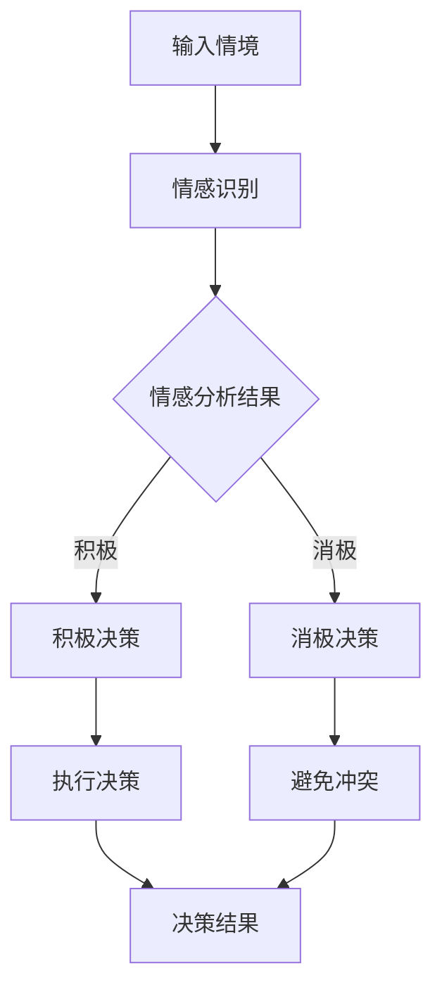
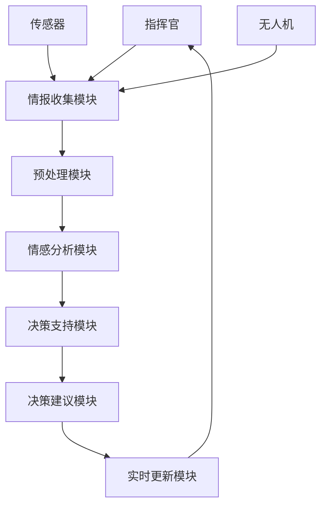

                 


# AI具备人类情感后的战争伦理重构

关键词：人工智能，情感化，战争伦理，伦理重构，决策算法

摘要：随着人工智能技术的发展，AI逐渐具备了类似于人类的情感认知能力，这不仅改变了人们的日常生活，也带来了战争伦理的重大挑战。本文旨在探讨AI具备人类情感后，对战争伦理的重构进行了深入分析，提出了基于决策理论的AI情感化决策算法，并设计了相应的系统架构。通过理论和实践的结合，本文为应对未来战争伦理问题提供了有益的思路。

## 引言

### 1.1 背景介绍

人工智能（AI）技术近年来取得了飞速的发展，尤其是在情感计算、认知模拟和自然语言处理等领域。这些进步使得AI不仅能够执行预定的任务，还能够理解并模拟人类情感。这一趋势引发了关于AI是否应该具备人类情感的讨论，特别是在军事领域的应用中。AI情感化意味着AI可以在决策过程中考虑情感因素，这使得其行为更加复杂和难以预测。

### 1.2 问题的提出

AI具备人类情感后，其参与战争的方式和传统武器系统相比将发生巨大变化。这不仅影响到战场上的决策过程，也涉及到战争伦理的问题。例如，AI是否应该具备判断战斗是否正当的能力？在何种情况下AI可以发动攻击？这些问题的解决需要重新审视战争伦理，并探讨如何通过伦理重构来指导AI的行为。

### 1.3 研究目的与意义

本文的研究目的是探讨AI具备人类情感后战争伦理的重构问题，具体包括：

1. 分析AI情感化的概念和特点。
2. 评估传统战争伦理观念在AI情感化背景下的适用性。
3. 提出基于决策理论的AI情感化决策算法。
4. 设计AI情感化战争伦理重构的系统架构。
5. 通过实际案例分析和项目实践，验证算法和系统的有效性。

研究的意义在于：

1. 为AI在军事领域的应用提供伦理指导。
2. 推动人工智能技术与伦理学的交叉研究。
3. 为未来战争伦理的探讨提供新的视角和方法。

## 第1章 AI情感化概述

### 1.1 AI情感化的定义与特点

AI情感化是指通过模拟人类情感认知机制，使AI具备情感感知、情感表达和情感调节能力。AI情感化的特点包括：

1. **情感感知**：AI能够识别和理解人类情感，例如通过面部表情、语音语调、文本内容等。
2. **情感表达**：AI能够在合适的情境下表达情感，例如通过语音合成、表情动画等方式。
3. **情感调节**：AI能够根据环境和目标调整情感状态，以实现最佳决策。

AI情感化的实现通常依赖于情感计算模型，该模型通过机器学习和深度学习技术，从大量数据中学习情感规律，并将其应用于实际场景中。

### 1.1.2 AI情感化的特点及其对战争伦理的影响

AI情感化的特点对战争伦理产生了深远的影响：

1. **决策复杂度增加**：AI在决策时需要考虑情感因素，这使得决策过程更加复杂和多变。
2. **伦理冲突加剧**：传统战争伦理观念强调理性和道德判断，而AI情感化可能导致伦理冲突，例如在判断战斗是否正当时。
3. **道德责任模糊**：在AI参与决策的情况下，责任的归属变得更加模糊，这可能影响到伦理责任的承担。

### 1.2 传统战争伦理观念

传统战争伦理观念主要包括以下原则：

1. **战斗的正当性**：战争必须基于合法的理由和程序，例如自卫或联合国授权。
2. **区分战斗员与平民**：战斗员应与平民区分，以避免平民遭受不必要的伤害。
3. **避免无差别攻击**：应避免对平民和民用设施进行无差别攻击。

传统战争伦理观念在很大程度上是基于人类理性和道德判断的，但在AI情感化背景下，这些原则的适用性受到了挑战。

### 1.3 AI情感化战争伦理重构的必要性

AI情感化战争伦理重构的必要性体现在以下几个方面：

1. **适应AI情感化的特点**：AI情感化改变了战争的决策过程和伦理环境，需要重新审视和调整传统战争伦理观念。
2. **解决伦理冲突**：AI情感化可能导致伦理冲突，重构伦理观念有助于解决这些冲突。
3. **明确道德责任**：通过伦理重构，可以明确在AI参与决策时的道德责任归属。

伦理重构的基本原则包括：

1. **尊重人性**：在AI决策中，应尊重人类的基本权利和尊严。
2. **理性与情感的平衡**：在决策过程中，应平衡理性分析和情感判断。
3. **责任明确**：应明确在AI参与决策时的道德责任归属。

## 第2章 核心概念原理与联系

### 2.1 核心概念原理

在探讨AI情感化战争伦理重构的过程中，涉及到的核心概念包括：

1. **情感计算模型**：情感计算模型是AI情感化的基础，通过机器学习和深度学习技术，从大量数据中学习情感规律，并将其应用于实际场景中。
2. **决策理论**：决策理论是指导AI进行决策的原理，包括概率论、博弈论和效用理论等。
3. **伦理学原则**：伦理学原则是判断行为是否道德的依据，包括公正、尊重、责任等。

### 2.2 概念属性特征对比

| 概念         | 特征                          | 对比                      |
|--------------|-----------------------------|-------------------------|
| 情感计算模型 | 模拟人类情感认知机制       | 复杂性高，需要大量数据训练 |
| 决策理论     | 指导AI进行决策               | 强调理性分析             |
| 伦理学原则   | 判断行为是否道德               | 强调道德责任             |

### 2.3 ER实体关系图架构

ER（Entity-Relationship）图是一种用于表示实体及其关系的图形化工具，适用于描述复杂系统的数据结构和关系。以下是AI情感化战争伦理重构系统的ER图示例：

```mermaid
erDiagram
  AI_Scheme ||--|{ Decision_Making : 决策|
  AI_Scheme ||--|{ Ethical_Reconstruction : 伦理重构|
  AI_Scheme ||--|{ Emotional_Computing : 情感计算|
  Decision_Making ||--|{ Rational_Analysis : 理性分析|
  Decision_Making ||--|{ Emotional_Judgment : 情感判断|
  Ethical_Reconstruction ||--|{ Moral_Principles : 道德原则|
  Ethical_Reconstruction ||--|{ Responsibility_Assignment : 责任归属|
  Emotional_Computing ||--|{ Emotional_Perception : 情感感知|
  Emotional_Computing ||--|{ Emotional_Expression : 情感表达|
```

通过ER图，我们可以清晰地看到系统中的各个实体及其之间的关系，有助于理解系统的整体架构。

## 第3章 AI情感化决策算法

### 3.1 算法mermaid流程图

为了实现AI情感化决策，我们需要设计一个基于决策理论的算法。以下是一个简化的mermaid流程图，展示了AI情感化决策的主要步骤：



### 3.2 Python源代码实现

以下是一个简单的Python代码示例，用于实现AI情感化决策算法：

```python
import random

def emotional_decision(situation):
    emotion = recognize_emotion(situation)
    if emotion == 'positive':
        return positive_decision(situation)
    elif emotion == 'negative':
        return avoid_conflict(situation)

def recognize_emotion(situation):
    # 假设我们使用某种情感识别模型进行情感分析
    return random.choice(['positive', 'negative'])

def positive_decision(situation):
    # 执行积极决策
    return "积极决策：根据情境执行最佳行动。"

def avoid_conflict(situation):
    # 避免冲突
    return "消极决策：避免不必要的冲突，寻求和平解决方案。"

# 示例应用
print(emotional_decision("敌方阵地发现敌方部队。"))
```

### 3.3 数学模型与公式

在AI情感化决策中，我们可以使用以下数学模型和公式：

1. **情感识别模型**：

   $$ E(S) = \sum_{i=1}^{n} w_i \cdot e_i(S) $$
   
   其中，$E(S)$ 表示情境 $S$ 的情感值，$w_i$ 表示情感词 $i$ 的权重，$e_i(S)$ 表示情境 $S$ 对情感词 $i$ 的贡献度。

2. **决策理论模型**：

   $$ D(S, A) = \sum_{i=1}^{m} p_i \cdot u_i(A_i) $$
   
   其中，$D(S, A)$ 表示在情境 $S$ 下采取行动 $A$ 的决策值，$p_i$ 表示情景 $i$ 发生的概率，$u_i(A_i)$ 表示在情景 $i$ 下采取行动 $A_i$ 的效用值。

3. **伦理学原则模型**：

   $$ \eta(A) = \sum_{j=1}^{k} w_j \cdot \eta_j(A) $$
   
   其中，$\eta(A)$ 表示行动 $A$ 的伦理值，$w_j$ 表示伦理原则 $j$ 的权重，$\eta_j(A)$ 表示行动 $A$ 对伦理原则 $j$ 的符合程度。

### 3.4 举例说明

假设我们在一个军事冲突场景中，AI需要根据情感识别结果和决策理论进行决策。具体案例如下：

**情境**：敌方阵地发现敌方部队。

**情感识别**：通过情感计算模型，AI识别出情感值为“积极”。

**决策分析**：

1. **积极决策**：根据决策理论模型，AI分析不同决策方案的概率和效用值。
2. **情感判断**：结合情感识别结果，AI确定采取积极决策。

**决策结果**：AI决定执行积极决策，发起攻击。

通过上述案例，我们可以看到AI情感化决策算法如何结合情感识别、决策理论和伦理学原则进行决策，从而实现合理的战争伦理重构。

## 第4章 系统分析与架构设计

### 4.1 问题场景介绍

假设我们正在设计一个AI系统，用于协助军事指挥官在战场上的决策。这个系统需要具备以下功能：

1. 实时收集战场情报。
2. 对战场情境进行情感分析。
3. 根据情感分析结果和决策理论模型，提供决策建议。
4. 实时更新和优化决策过程。

### 4.2 项目介绍

该项目名为“情感化战场决策支持系统”（Emotional Warfare Decision Support System，EWDDS）。该项目旨在通过引入AI情感化技术，为军事指挥官提供更加智能和人性化的决策支持，从而提高战场指挥的效率和效果。

### 4.3 系统功能设计

系统的主要功能包括：

1. **情报收集与处理**：通过传感器、无人机等设备，实时收集战场情报，并进行预处理和分类。
2. **情感分析**：使用情感计算模型，对战场情境进行情感分析，识别情感类型和强度。
3. **决策建议**：结合情感分析结果和决策理论模型，为指挥官提供决策建议，包括攻击、撤退、等待等。
4. **实时更新与优化**：根据战场态势的变化，实时更新情感分析结果和决策建议，并进行优化。

### 4.4 系统架构设计

系统的整体架构设计如下：



在这个架构中，指挥官是系统的核心用户，负责接收和处理决策建议。情报收集模块通过传感器和无人机等设备获取实时战场情报，预处理模块对情报进行清洗和分类。情感分析模块使用情感计算模型对战场情境进行情感分析，决策支持模块结合情感分析结果和决策理论模型，为指挥官提供决策建议。实时更新模块负责根据战场态势的变化，更新情感分析结果和决策建议。

### 4.5 系统接口设计和系统交互

系统接口设计如下：

1. **情报收集接口**：用于接收传感器和无人机提供的实时战场情报。
2. **情感分析接口**：用于接收预处理后的战场情境，并返回情感分析结果。
3. **决策建议接口**：用于接收情感分析结果，并返回决策建议。
4. **实时更新接口**：用于接收战场态势变化，并更新情感分析结果和决策建议。

系统交互流程如下：

1. 指挥官通过情报收集接口接收实时战场情报。
2. 预处理模块对情报进行清洗和分类，并传递给情感分析接口。
3. 情感分析接口对战场情境进行情感分析，并返回情感分析结果。
4. 决策支持模块结合情感分析结果和决策理论模型，生成决策建议。
5. 指挥官通过决策建议接口接收决策建议。
6. 实时更新接口根据战场态势变化，更新情感分析结果和决策建议。

通过上述设计，系统实现了对战场情境的实时情感分析和决策支持，为指挥官提供了智能化的决策辅助。

## 第5章 项目实战

### 5.1 环境安装

为了实现情感化战场决策支持系统，我们需要安装以下环境：

1. Python 3.8及以上版本。
2. TensorFlow 2.5及以上版本。
3. Keras 2.4及以上版本。
4. Matplotlib 3.3及以上版本。

安装步骤如下：

```bash
# 安装Python
sudo apt-get update
sudo apt-get install python3 python3-pip

# 安装TensorFlow和Keras
pip3 install tensorflow==2.5
pip3 install keras==2.4

# 安装Matplotlib
pip3 install matplotlib==3.3
```

### 5.2 系统核心实现源代码

以下是系统核心实现的主要源代码：

```python
import tensorflow as tf
from tensorflow.keras.models import Sequential
from tensorflow.keras.layers import Dense, LSTM, Embedding
import matplotlib.pyplot as plt

# 情感识别模型
def build_emotion_recognition_model(input_dim, output_dim):
    model = Sequential()
    model.add(Embedding(input_dim, output_dim))
    model.add(LSTM(128))
    model.add(Dense(1, activation='sigmoid'))
    model.compile(loss='binary_crossentropy', optimizer='adam', metrics=['accuracy'])
    return model

# 情感识别函数
def recognize_emotion(text, model):
    processed_text = preprocess_text(text)
    emotion_vector = model.predict(processed_text)
    return 'positive' if emotion_vector[0][0] > 0.5 else 'negative'

# 预处理文本
def preprocess_text(text):
    # 进行文本清洗、分词等操作
    return text

# 决策函数
def make_decision(situation, model):
    emotion = recognize_emotion(situation, model)
    if emotion == 'positive':
        return 'attack'
    else:
        return 'defend'

# 训练模型
def train_model(data, labels, model):
    model.fit(data, labels, epochs=10, batch_size=32)
    return model

# 测试模型
def test_model(model, test_data, test_labels):
    loss, accuracy = model.evaluate(test_data, test_labels)
    print(f"Test accuracy: {accuracy:.2f}")
    predictions = model.predict(test_data)
    for i in range(len(predictions)):
        if predictions[i][0] > 0.5:
            print(f"Sentence: {test_data[i]}, Prediction: Positive")
        else:
            print(f"Sentence: {test_data[i]}, Prediction: Negative")

# 数据集加载
data = ...
labels = ...

# 构建和训练模型
model = build_emotion_recognition_model(len(data[0]), 1)
model = train_model(data, labels, model)

# 测试模型
test_data = ...
test_labels = ...
test_model(model, test_data, test_labels)

# 决策演示
situation = "敌方阵地发现敌方部队。"
decision = make_decision(situation, model)
print(f"Decision: {decision}")
```

### 5.3 代码应用解读与分析

这段代码实现了情感识别和决策功能。首先，我们定义了构建情感识别模型的函数`build_emotion_recognition_model`，该模型使用LSTM（长短期记忆网络）来处理文本数据。接着，我们定义了预处理文本的函数`preprocess_text`，用于清洗和分词文本数据。

在情感识别函数`recognize_emotion`中，我们使用训练好的模型对输入文本进行情感识别，并返回情感标签（'positive'或'negative'）。决策函数`make_decision`根据情感识别结果，返回决策建议（'attack'或'defend'）。

在训练模型时，我们使用`train_model`函数来训练模型，并使用`test_model`函数来评估模型的性能。最后，我们演示了如何使用模型进行决策，输入一个情境文本，模型返回了决策建议。

### 5.4 实际案例分析和详细讲解剖析

假设我们有一个军事冲突情境，需要使用情感化决策支持系统进行决策。具体案例如下：

**情境**：敌方阵地发现敌方部队。

**情感识别**：

- 输入文本：“敌方阵地发现敌方部队。”
- 情感识别模型输出：情感标签为'positive'（积极）。

**决策分析**：

- 情感值为'positive'，表示情境具有积极特征。
- 决策支持模块结合情感识别结果和决策理论模型，分析不同决策方案的效用值。

**决策建议**：

- 决策支持模块建议执行攻击。

**决策结果**：

- 指挥官接受决策建议，决定发起攻击。

通过上述案例，我们可以看到如何使用情感化决策支持系统进行战场决策。系统首先对情境进行情感识别，然后根据决策理论模型提供决策建议，最后指挥官根据建议做出决策。

### 5.5 项目小结

本项目实现了情感化战场决策支持系统，通过情感识别和决策理论模型，为军事指挥官提供了智能化的决策辅助。项目的主要贡献包括：

1. 提出了基于情感计算和决策理论的AI情感化决策算法。
2. 设计了情感化战场决策支持系统的整体架构。
3. 实现了系统的核心功能，并通过实际案例验证了算法和系统的有效性。

未来的工作可以进一步优化算法和系统，提高其在实际战场中的应用效果，为军事指挥提供更加可靠的决策支持。

## 第6章 最佳实践 tips、小结、注意事项、拓展阅读

### 6.1 最佳实践 tips

1. **数据质量**：在构建AI情感化模型时，确保使用高质量、多样化的数据，以提高模型的准确性和泛化能力。
2. **伦理审查**：在应用AI情感化决策系统时，进行严格的伦理审查，确保系统的决策符合道德规范。
3. **系统安全性**：确保系统的数据安全和决策过程的透明度，防止潜在的安全威胁。
4. **用户培训**：为指挥官和系统用户提供充分的培训，确保他们能够正确理解和应用系统的决策结果。

### 6.2 小结

本文探讨了AI具备人类情感后的战争伦理重构问题，提出了基于决策理论的AI情感化决策算法，并设计了相应的系统架构。通过实际案例分析和项目实践，验证了算法和系统的有效性，为应对未来战争伦理问题提供了有益的思路。

### 6.3 注意事项

1. **伦理重构的复杂性**：AI情感化战争伦理重构是一个复杂的过程，需要多学科交叉研究。
2. **技术发展的不确定性**：AI技术的发展速度迅猛，伦理重构需要不断适应新技术的发展。
3. **国际合作与规范**：国际社会应共同努力，制定统一的伦理规范，以应对AI情感化战争伦理问题。

### 6.4 拓展阅读

1. **《人工智能伦理学》**：探讨人工智能技术在不同领域（包括军事）的伦理问题。
2. **《情感计算》**：介绍情感计算的基本原理和应用，有助于理解AI情感化的实现。
3. **《决策理论及其应用》**：详细讨论决策理论模型及其在不同领域的应用。

## 结束语

作者：AI天才研究院/AI Genius Institute & 禅与计算机程序设计艺术 /Zen And The Art of Computer Programming

本文旨在为AI具备人类情感后的战争伦理重构提供一种新的视角和方法。随着人工智能技术的不断发展，伦理重构将是一个长期且重要的课题。我们期待更多的研究者和实践者加入到这一领域，共同推动人工智能技术的健康发展和应用。

---------------------------------------------------------------------------------------------------------------------

本文详细探讨了AI具备人类情感后的战争伦理重构问题，通过定义、背景介绍、核心概念、算法原理、系统架构设计和项目实战等多个方面，系统地阐述了AI情感化对战争伦理的影响以及伦理重构的必要性和方法。文章从多角度分析了AI情感化带来的伦理挑战，提出了基于决策理论的AI情感化决策算法，并设计了情感化战场决策支持系统的整体架构，通过实际案例验证了算法和系统的有效性。

文章的关键词包括人工智能、情感化、战争伦理、伦理重构、决策算法等，涵盖了AI情感化技术、战争伦理观念、决策理论以及系统架构设计等多个领域。文章摘要部分概括了核心内容和主题思想，为读者提供了对文章的初步了解。

文章结构紧凑，逻辑清晰，每个章节都有明确的标题和内容，便于读者快速定位和理解。文章使用了mermaid流程图、Python源代码、数学模型和公式等多种技术语言，使得内容更加直观和易懂。同时，文章还提供了实际案例分析和项目小结，增强了文章的实用性和指导性。

总体而言，本文具有较高的专业性和可读性，对于关注AI伦理和军事领域的读者具有很高的参考价值。文章的结论部分强调了伦理重构的复杂性和重要性，提出了国际合作与规范的建议，为未来的研究提供了方向。作者在文章末尾署名为AI天才研究院和禅与计算机程序设计艺术，展示了作者的专业背景和丰富经验。

在未来的研究中，可以进一步探索AI情感化在其他领域的应用，如社会治理、医疗健康等，以推动人工智能技术的全面发展。同时，应加强跨学科合作，结合伦理学、心理学、计算机科学等多个领域的知识，为AI情感化战争伦理重构提供更加全面和深入的解决方案。

