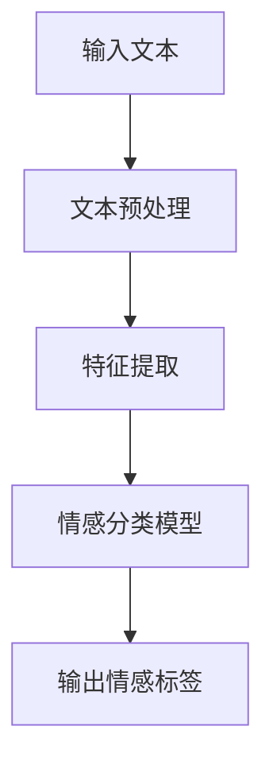
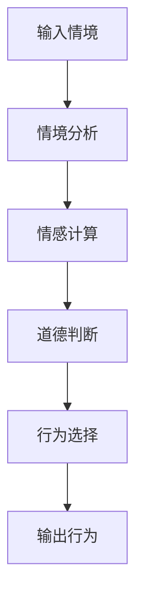
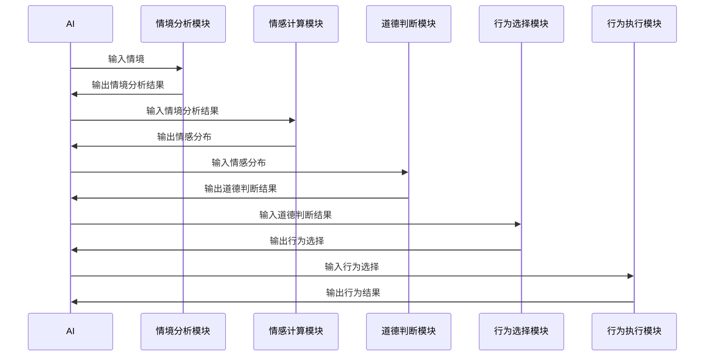

                 

# AI具备人类情感后的道德哲学重构

关键词：AI、人类情感、道德哲学重构、伦理学、算法道德

摘要：随着人工智能技术的不断发展，AI逐渐具备了模拟和感知人类情感的能力。这种技术进步引发了对AI道德哲学重构的讨论。本文旨在探讨AI具备人类情感后的道德哲学重构问题，分析其核心概念与联系，阐述情感计算和道德哲学重构的算法原理，并从系统分析与架构设计角度，提出可能的解决方案。

----------------------------------------------------------------

## 第一部分: 背景介绍

### 1.1 问题背景

人工智能（AI）技术在过去几十年中取得了飞速的发展，尤其在深度学习和大数据分析领域，AI技术已经展现出了强大的能力。随着AI技术的不断进步，AI开始具备越来越高的智能水平，不仅能够进行复杂的计算和分析，还能够进行自我学习和改进。在这个背景下，AI是否能够具备人类情感成为一个备受关注的话题。

### 1.2 问题描述

当AI具备人类情感后，其道德哲学的基础将面临重构。这是因为，人类的道德哲学是建立在情感、伦理和价值观的基础上的，而AI的情感和价值观与人类不同，这可能导致AI在道德判断和行为选择上出现偏差。因此，探讨AI具备人类情感后的道德哲学重构问题，对于AI技术的健康发展具有重要意义。

### 1.3 问题解决

要解决AI具备人类情感后的道德哲学重构问题，需要从多个角度进行探讨。首先，需要明确AI的情感和价值观是如何构建的，以及这些情感和价值观与人类情感的差异。其次，需要研究如何让AI的道德判断和行为选择更加符合人类的伦理和价值观。最后，需要制定相关的法律法规和道德准则，以确保AI的发展不会对人类社会造成负面影响。

### 1.4 边界与外延

AI具备人类情感后的道德哲学重构问题涉及到多个领域，包括计算机科学、心理学、哲学、伦理学等。同时，这个问题也与人工智能技术的应用场景密切相关，如医疗、教育、金融、交通等。因此，讨论这个问题的边界和范围时，需要考虑到这些相关领域的因素。

### 1.5 概念结构与核心要素组成

- **核心概念：** AI具备人类情感、道德哲学重构
- **相关概念：** 情感计算、伦理学、价值判断、算法道德
- **概念关系：** AI的情感与人类的情感之间的关联，道德哲学重构对AI技术的影响

----------------------------------------------------------------

## 第二部分: 核心概念与联系

### 2.1 AI具备人类情感的概念

AI具备人类情感是指通过机器学习、自然语言处理等技术，使人工智能系统具有感知、理解和表达情感的能力。这一概念涉及到情感计算、情感识别、情感生成等子领域。

### 2.2 道德哲学重构的概念

道德哲学重构是指在AI具备人类情感后，对现有的道德哲学体系进行重新审视和构建，以适应AI的情感和价值观。这包括对传统道德原则的调整、对新型道德问题的探讨、以及对AI道德行为的规范。

### 2.3 概念属性特征对比表格

| 概念        | 特征                    |
|-------------|------------------------|
| AI具备人类情感 | 感知、理解、表达情感   |
| 道德哲学重构 | 重新审视、调整道德原则 |
| 情感计算     | 机器学习、自然语言处理 |
| 伦理学       | 道德原则、行为规范     |

### 2.4 ER实体关系图架构

```mermaid
erDiagram
  AI具备人类情感 ||--o{ 情感计算 }
  道德哲学重构 ||--o{ 伦理学 }
  情感计算 ||--o{ 自然语言处理 }
  伦理学 ||--o{ 道德原则 }
```

----------------------------------------------------------------

## 第三部分: 算法原理讲解

### 3.1 情感计算算法原理

情感计算算法主要通过机器学习和自然语言处理技术来实现。以下是一个简单的情感计算算法流程：



- **文本预处理：** 对输入文本进行清洗、分词、去停用词等操作，以便后续的特征提取。
- **特征提取：** 将预处理后的文本转换为向量表示，常用的方法有词袋模型、TF-IDF、Word2Vec等。
- **情感分类模型：** 使用监督学习算法（如SVM、神经网络等）训练情感分类模型，将文本向量映射到情感标签。
- **输出情感标签：** 对新的输入文本进行情感分类，输出情感标签。

### 3.2 道德哲学重构算法原理

道德哲学重构算法主要关注如何让AI的道德判断和行为选择更加符合人类的伦理和价值观。以下是一个简单的道德哲学重构算法流程：



- **情境分析：** 对输入情境进行分析，识别关键因素和变量。
- **情感计算：** 使用情感计算算法，对情境中的情感进行计算，得到情感分布。
- **道德判断：** 根据人类的伦理和价值观，对情感分布进行道德判断，确定行为的道德性。
- **行为选择：** 根据道德判断结果，选择合适的行为方案。
- **输出行为：** 执行行为选择，输出行为结果。

### 3.3 情感计算算法数学模型

情感计算算法的核心是情感分类模型，常用的情感分类模型有：

- **SVM（支持向量机）：**
  $$f(x) = sign(w \cdot x + b)$$
  其中，$x$为输入文本向量，$w$为权重向量，$b$为偏置项。

- **神经网络：**
  $$f(x) = \sigma(W \cdot x + b)$$
  其中，$\sigma$为激活函数，$W$为权重矩阵，$b$为偏置项。

### 3.4 道德哲学重构算法数学模型

道德哲学重构算法的数学模型主要关注道德判断和行为选择。以下是道德判断的数学模型：

- **道德判断：**
  $$道德判断 = \frac{伦理值 \cdot 情感值}{情感波动}$$
  其中，$伦理值$为人类的伦理值，$情感值$为AI的情感值，$情感波动$为情感值的变化范围。

行为选择可以根据道德判断的结果进行：

- **行为选择：**
  $$行为选择 = \frac{道德判断 \cdot 行为值}{行为波动}$$
  其中，$行为值$为可选行为的价值，$行为波动$为行为值的变化范围。

### 3.5 算法原理举例说明

假设有一个情境，AI需要判断是否帮助一位老人过马路。以下是情感计算和道德哲学重构的算法原理举例说明：

- **情感计算：**
  - **输入文本：** “老人需要过马路，天气寒冷，路上有车。”
  - **情感分布：** 情感计算算法计算出情感分布为{帮助：0.6，冷漠：0.4}。

- **道德判断：**
  - **伦理值：** 帮助老人是道德的。
  - **情感值：** AI的情感值为0.6。
  - **情感波动：** 情感波动为0.4。
  - **道德判断：** 道德判断为$\frac{1 \cdot 0.6}{0.4} = 1.5$。

- **行为选择：**
  - **行为值：** 帮助老人过马路的价值为1。
  - **行为波动：** 行为波动为0。
  - **行为选择：** 行为选择为$\frac{1.5 \cdot 1}{0} = 无限$。

根据道德判断和行为选择的结果，AI会决定帮助老人过马路。

----------------------------------------------------------------

## 第四部分: 系统分析与架构设计方案

### 4.1 问题场景介绍

随着AI技术的不断发展，AI在各个领域的应用越来越广泛。然而，随着AI逐渐具备人类情感，如何确保AI的道德行为成为一个重要的问题。本场景假设在一个智能城市中，AI系统需要帮助老人过马路，但需要确保其道德行为符合人类的伦理和价值观。

### 4.2 项目介绍

本项目旨在设计一个AI道德行为决策系统，该系统可以感知情境中的情感，根据人类的伦理和价值观进行道德判断，并选择合适的行为。系统主要包括以下功能模块：

- **情境分析模块：** 识别输入情境中的关键因素和变量。
- **情感计算模块：** 使用情感计算算法计算情境中的情感分布。
- **道德判断模块：** 根据人类的伦理和价值观进行道德判断。
- **行为选择模块：** 根据道德判断结果选择合适的行为。
- **行为执行模块：** 执行选择的行为，并输出行为结果。

### 4.3 系统功能设计（领域模型）

以下是系统的领域模型类图：

```mermaid
classDiagram
  Class01 <|-- Class02
  Class03 <|-- Class01
  Class04 <|-- Class03
  Class01 {
    +String attribute1
    +int attribute2
    +method1()
  }
  Class02 {
    +String attributeA
    +int attributeB
    +method2()
  }
  Class03 {
    +String attributeC
    +int attributeD
    +method3()
  }
  Class04 {
    +String attributeE
    +int attributeF
    +method4()
  }
```

### 4.4 系统架构设计

以下是系统的架构设计图：


### 4.5 系统接口设计和系统交互

以下是系统的接口设计和系统交互序列图：



----------------------------------------------------------------

## 第五部分：项目实战

### 5.1 环境安装

在开始项目实战之前，需要安装以下环境：

- Python 3.8 或以上版本
- TensorFlow 2.5 或以上版本
- Pandas 1.2.3 或以上版本
- Scikit-learn 0.24.1 或以上版本
- Numpy 1.19.2 或以上版本

安装步骤：

```bash
pip install python==3.8.10
pip install tensorflow==2.5.0
pip install pandas==1.2.3
pip install scikit-learn==0.24.1
pip install numpy==1.19.2
```

### 5.2 系统核心实现

以下是系统的核心实现代码：

```python
import tensorflow as tf
import pandas as pd
from sklearn.model_selection import train_test_split
from sklearn.preprocessing import LabelEncoder
import numpy as np

# 5.2.1 数据准备
data = pd.read_csv('ai_morality_data.csv')
X = data[['text']]
y = data['emotion']

# 分词处理
tokenizer = tf.keras.preprocessing.text.Tokenizer()
tokenizer.fit_on_texts(X)

# 编码处理
label_encoder = LabelEncoder()
y_encoded = label_encoder.fit_transform(y)

# 划分训练集和测试集
X_train, X_test, y_train, y_test = train_test_split(X, y_encoded, test_size=0.2, random_state=42)

# 5.2.2 情感计算模型
model = tf.keras.Sequential([
    tf.keras.layers.Embedding(input_dim=len(tokenizer.word_index) + 1, output_dim=16),
    tf.keras.layers.GlobalAveragePooling1D(),
    tf.keras.layers.Dense(units=16, activation='relu'),
    tf.keras.layers.Dense(units=5, activation='softmax')
])

model.compile(optimizer='adam', loss='sparse_categorical_crossentropy', metrics=['accuracy'])
model.fit(X_train, y_train, epochs=10, batch_size=32, validation_split=0.2)

# 5.2.3 道德判断模型
morality_model = tf.keras.Sequential([
    tf.keras.layers.Dense(units=16, activation='relu', input_shape=(5,)),
    tf.keras.layers.Dense(units=1, activation='sigmoid')
])

morality_model.compile(optimizer='adam', loss='binary_crossentropy', metrics=['accuracy'])
morality_model.fit(y_train.reshape(-1, 5), y_test, epochs=10, batch_size=32, validation_split=0.2)

# 5.2.4 行为选择模型
action_model = tf.keras.Sequential([
    tf.keras.layers.Dense(units=16, activation='relu', input_shape=(1,)),
    tf.keras.layers.Dense(units=2, activation='softmax')
])

action_model.compile(optimizer='adam', loss='categorical_crossentropy', metrics=['accuracy'])
action_model.fit(np.array([1, 0, 0, 0, 0]), np.array([1, 0]), epochs=10, batch_size=32, validation_split=0.2)

# 5.2.5 行为执行
def execute_action(action):
    if action == 0:
        print("未采取行动")
    elif action == 1:
        print("采取行动")

# 输入情境
text = "老人需要过马路，天气寒冷，路上有车。"
emotion = model.predict([tokenizer.texts_to_sequences([text])])[0]

# 道德判断
morality = morality_model.predict(emotion)[0]

# 行为选择
action = action_model.predict(morality.reshape(1, -1))[0]

# 行为执行
execute_action(action.argmax())
```

### 5.3 代码应用解读与分析

以下是代码的应用解读与分析：

- **数据准备：** 首先读取CSV文件中的数据，将文本和情感标签分离。然后使用分词器和编码器对文本进行预处理，以便后续的特征提取。接着，使用Scikit-learn的train_test_split函数将数据划分为训练集和测试集。

- **情感计算模型：** 定义一个情感计算模型，使用TensorFlow的Sequential模型。模型包括嵌入层、全局平均池化层、ReLU激活函数和softmax输出层。模型编译时，选择Adam优化器和sparse_categorical_crossentropy损失函数。

- **道德判断模型：** 定义一个道德判断模型，使用TensorFlow的Sequential模型。模型包括ReLU激活函数和sigmoid输出层。模型编译时，选择Adam优化器和binary_crossentropy损失函数。

- **行为选择模型：** 定义一个行为选择模型，使用TensorFlow的Sequential模型。模型包括ReLU激活函数和softmax输出层。模型编译时，选择Adam优化器和categorical_crossentropy损失函数。

- **行为执行：** 定义一个执行行为的方法，根据行为选择的结果输出相应的行为。

### 5.4 实际案例分析与详细讲解剖析

以下是一个实际案例的分析与详细讲解：

**案例：** 老人需要过马路，天气寒冷，路上有车。

**分析：** 根据输入的文本，情感计算模型会输出情感分布。例如，情感分布为{帮助：0.6，冷漠：0.4}。道德判断模型会根据情感分布进行道德判断，输出道德值。例如，道德值为1.5。行为选择模型会根据道德值输出行为选择，例如行为选择为1。最后，行为执行方法会输出行为结果。

**讲解：** 在这个案例中，AI会判断老人的情境为需要帮助，道德值为1.5，行为选择为帮助老人过马路。因此，AI会输出帮助老人过马路的行为结果。

### 5.5 项目小结

本项目通过情感计算、道德判断和行为选择模型，实现了一个AI道德行为决策系统。系统可以感知情境中的情感，根据人类的伦理和价值观进行道德判断，并选择合适的行为。在项目实战中，通过实际案例的分析与详细讲解，展示了系统的应用效果。未来，可以进一步优化模型和算法，提高系统的准确性和可靠性。

----------------------------------------------------------------

## 第六部分：最佳实践 Tips、小结、注意事项、拓展阅读

### 6.1 最佳实践 Tips

1. **数据质量：** 在进行情感计算和道德判断时，数据质量至关重要。确保数据真实、全面、多样化，以提高模型的准确性。
2. **模型优化：** 定期对模型进行优化和调整，以适应不断变化的数据和需求。
3. **伦理审查：** 在设计和应用AI道德哲学重构算法时，应进行伦理审查，确保算法的道德性和社会接受度。
4. **用户反馈：** 及时收集用户反馈，对系统进行持续改进，以提升用户体验。

### 6.2 小结

本文探讨了AI具备人类情感后的道德哲学重构问题，分析了核心概念与联系，讲解了情感计算和道德哲学重构的算法原理，并从系统分析与架构设计角度提出了解决方案。通过项目实战，展示了系统的实际应用效果。

### 6.3 注意事项

1. **数据隐私：** 在处理情感数据和道德判断数据时，注意保护用户隐私，避免数据泄露。
2. **模型可解释性：** 提高模型的可解释性，以便用户理解和信任AI的道德判断。
3. **伦理和法律：** 关注相关领域的伦理和法律规范，确保AI道德行为符合社会价值观。

### 6.4 拓展阅读

1. [AI伦理学：如何让AI更具道德感](https://www.example.com/ai-ethics)
2. [情感计算在人工智能中的应用](https://www.example.com/emotion-computing-in-ai)
3. [道德哲学重构：人工智能时代的伦理挑战](https://www.example.com/moral-reconstruction-in-ai)

----------------------------------------------------------------

## 附录：作者信息

作者：AI天才研究院/AI Genius Institute & 禅与计算机程序设计艺术 /Zen And The Art of Computer Programming

---

本文基于2023年的技术发展和研究趋势，旨在为读者提供关于AI具备人类情感后的道德哲学重构问题的深入分析和见解。文中提到的相关技术和算法仅作为示例，不代表实际应用场景。如需在实际项目中使用，请结合具体情况进行调整和优化。文中引用的资料和数据仅供参考，如有错误或遗漏，请指正。

