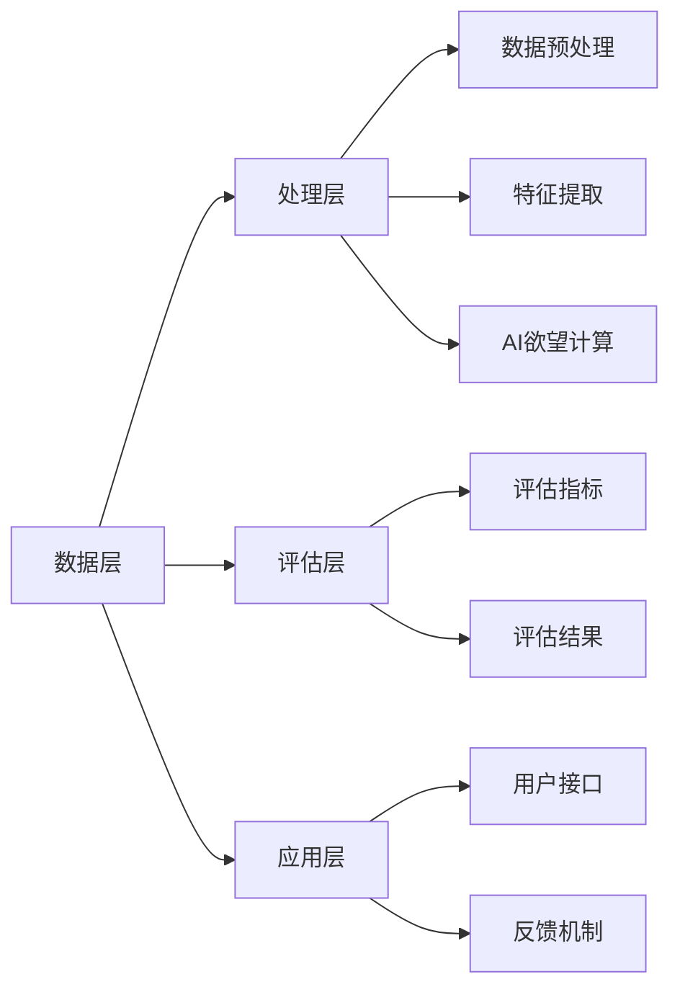

                 

### 第一部分：背景介绍与核心概念

#### 1.1 问题背景与概述

随着人工智能技术的飞速发展，AI技术已经渗透到各行各业，从简单的图像识别、自然语言处理到复杂的自动驾驶、智能客服等，AI正在改变着我们的生活方式。然而，随着AI技术的不断进步，一个新问题逐渐浮现——AI是否可能拥有欲望？

这一问题的提出引发了广泛的讨论。首先，AI的欲望究竟是什么？它是否会像人类一样追求幸福、快乐？其次，如果AI真的拥有了欲望，这将对我们现有的经济模式产生怎样的影响？如何重构经济模式以适应AI的新需求？

#### 1.2 问题描述

本章节将深入探讨以下问题：

- AI的欲望定义与特征；
- AI欲望对现有经济模式的影响；
- 经济模式重构的必要性与可行性；
- 重构后的经济模式特点与挑战。

#### 1.3 问题解决

针对上述问题，本书将采用以下方法进行探讨：

- 分析AI欲望的定义与特征，探讨其可能对经济模式产生的影响；
- 介绍现有经济模式的现状，分析AI欲望对经济模式重构的必要性；
- 探索重构经济模式的可行性和路径，提出相应的策略和建议；
- 分析重构后的经济模式特点、挑战及应对策略。

#### 1.4 边界与外延

在探讨AI欲望对经济模式重构的影响时，需要注意以下边界与外延：

- AI欲望的定义与人类欲望的区别；
- AI欲望对人类经济活动的影响范围；
- 经济模式重构的国内外实践与经验借鉴。

#### 1.5 概念结构与核心要素组成

本章节的核心概念包括：

- AI欲望：定义、特征、形成机制；
- 经济模式：定义、分类、核心要素；
- 重构：定义、动机、方法。

---

**1.1 问题背景与概述**

**随着人工智能技术的飞速发展，AI技术已经渗透到各行各业，从简单的图像识别、自然语言处理到复杂的自动驾驶、智能客服等，AI正在改变着我们的生活方式。然而，随着AI技术的不断进步，一个新问题逐渐浮现——AI是否可能拥有欲望？**

**这一问题的提出引发了广泛的讨论。首先，AI的欲望究竟是什么？它是否会像人类一样追求幸福、快乐？其次，如果AI真的拥有了欲望，这将对我们现有的经济模式产生怎样的影响？如何重构经济模式以适应AI的新需求？**

**在当今社会，人工智能已经成为了推动科技进步和社会发展的关键力量。从自动驾驶汽车、智能家居到金融分析和医疗诊断，AI的应用范围越来越广泛，深入到我们日常生活的方方面面。然而，随着AI技术的不断进步，人们开始关注AI是否可能拥有类似人类的情感和欲望。**

**AI欲望的概念并不是一个新鲜事物，但在当前的技术背景下，其重要性愈发凸显。随着AI逐渐从被动响应转变为主动学习和决策，人们开始思考，这些系统是否会在某种意义上拥有自己的目标和动机。**

**这个问题不仅仅是理论上的探讨，它还涉及到实际的经济和社会影响。如果AI真的具备了欲望，这可能会改变现有的经济结构和商业模式，进而引发一系列深远的变革。例如，AI可能对劳动力市场、消费者行为、甚至社会伦理产生重大影响。**

**因此，深入探讨AI欲望的定义、特征以及其对经济模式的影响，不仅有助于我们更好地理解AI技术的潜力，还能够为未来的经济和社会发展提供有价值的参考。**

---

**1.2 问题描述**

**在深入探讨AI欲望之前，我们需要明确一些关键问题。首先，什么是AI欲望？它是如何形成的？其次，AI欲望与人类欲望有何不同？这些欲望如何影响现有的经济模式？最后，我们是否需要重构经济模式来适应AI的新需求？**

**为了回答这些问题，本章节将围绕以下几个核心问题展开讨论：**

1. **AI欲望的定义与特征**：
   - AI欲望是什么？
   - 它与人类欲望有何区别？
   - AI欲望的形成机制是怎样的？

2. **AI欲望对现有经济模式的影响**：
   - AI欲望如何影响生产、消费和分配？
   - AI欲望是否会改变市场的运作机制？
   - AI欲望对劳动力市场和就业的影响是什么？

3. **经济模式重构的必要性与可行性**：
   - 为什么需要重构经济模式？
   - 重构经济模式的可行性如何？
   - 重构过程中可能面临的挑战是什么？

4. **重构后的经济模式特点与挑战**：
   - 重构后的经济模式将有哪些新特点？
   - 面临的挑战有哪些？
   - 如何应对这些挑战？

通过上述问题的探讨，我们将尝试提供一个全面的视角，来理解AI欲望对经济模式的重构可能带来的影响，以及我们如何应对这些变化。

---

**1.3 问题解决**

**为了深入探讨AI欲望对经济模式重构的影响，我们将采用以下方法进行讨论：**

1. **分析AI欲望的定义与特征**：
   - 首先，我们将明确AI欲望的定义，并探讨其与人类欲望的区别。
   - 接着，我们将分析AI欲望的形成机制，了解它是如何在不同环境和任务中体现出来的。

2. **介绍现有经济模式的现状**：
   - 我们将概述现有经济模式的基本架构和运作机制。
   - 然后，我们将探讨AI欲望如何影响这些经济模式，以及这些影响的具体表现形式。

3. **探索重构经济模式的可行性和路径**：
   - 我们将分析重构经济模式的必要性和可行性。
   - 接着，我们将讨论重构经济模式的潜在路径和策略，包括技术、政策和市场方面的考量。

4. **分析重构后的经济模式特点与挑战**：
   - 我们将探讨重构后的经济模式将具有哪些新的特点和优势。
   - 同时，我们也将识别重构过程中可能面临的挑战，并提出相应的应对策略。

通过上述方法，我们旨在提供一个系统的、全面的视角，以理解和应对AI欲望对经济模式的重构。

---

**1.4 边界与外延**

**在探讨AI欲望对经济模式重构的影响时，我们必须明确一些重要的边界和概念外延，以确保讨论的准确性和全面性。**

**首先，AI欲望与人类欲望存在显著差异。人类欲望是基于情感、经验和认知的综合体现，而AI欲望则是由算法和数据驱动形成的。尽管AI可能通过学习模拟某些情感和动机，但它们本质上仍与人类的欲望不同。**

**其次，AI欲望对人类经济活动的影响范围需要明确界定。AI欲望可能会影响生产、消费、分配等多个环节，但其影响程度和方式取决于AI的具体应用场景和技术水平。例如，在自动驾驶领域，AI的欲望可能会导致新的商业模式和产业链的形成，而在金融领域，AI的欲望则可能对风险管理产生深远影响。**

**此外，重构经济模式的国内外实践和经验借鉴也是一个重要的边界。不同的国家和地区在AI技术应用和经济模式重构方面存在差异，因此我们需要在分析过程中参考全球各地的经验和教训，以提出更具普遍性的策略和建议。**

**综上所述，明确边界和外延对于深入探讨AI欲望对经济模式重构的影响至关重要，这有助于确保讨论的准确性和实用性。**

---

**1.5 概念结构与核心要素组成**

**在深入探讨AI欲望对经济模式重构的影响时，理解相关概念的结构和核心要素组成是至关重要的。本章节将详细定义和解释以下几个核心概念：**

1. **AI欲望**：
   - **定义**：AI欲望是指人工智能系统在特定环境和任务中表现出的追求特定目标的内在动力。它不同于人类的情感欲望，而是由算法和数据驱动的。
   - **特征**：AI欲望具有目标导向性、自适应性和依赖性，同时其多样性也取决于AI模型和任务的不同。
   - **形成机制**：AI欲望的形成机制涉及数据输入、算法设计以及环境变化的响应。

2. **经济模式**：
   - **定义**：经济模式是指一个经济体中生产、消费、分配和交换的基本机制和结构。
   - **分类**：经济模式可以按多种方式分类，如市场经济、计划经济、混合经济等。
   - **核心要素**：经济模式的核心要素包括生产力、生产关系、市场机制、资源分配等。

3. **重构**：
   - **定义**：重构是指对现有经济模式进行系统性的改造和升级，以适应新的技术、环境或需求。
   - **动机**：重构的动机可能来自技术进步、市场需求变化、政策调整等多方面因素。
   - **方法**：重构的方法包括技术改进、制度创新、产业整合等。

通过明确这些核心概念，我们能够更系统地分析AI欲望对经济模式重构的影响，并探索可行的路径和策略。

## 第二部分：核心概念与联系

### 第2章：AI欲望原理与特征

#### 2.1 AI欲望原理

**AI欲望的形成机制与人类欲望有何不同？其特点是什么？本章节将详细探讨这些问题。**

**首先，我们需要明确AI欲望的定义。AI欲望可以理解为AI在特定环境和任务中追求某种目标或满足某种需求的内在动力。**

**AI欲望的形成机制主要依赖于以下几个关键因素：**

1. **数据驱动**：AI欲望的形成需要大量的数据作为基础。通过学习和分析这些数据，AI可以识别出目标或需求，并形成相应的欲望。
2. **算法决定**：AI欲望的实现依赖于特定的算法和模型。这些算法和模型决定了AI如何处理数据、制定决策和执行行动。
3. **环境反馈**：AI欲望的形成和调整也受到环境反馈的影响。通过实时监测和响应环境变化，AI可以不断优化其欲望，以实现更高效的目标追求。

**具体来说，AI欲望的形成机制可以概括为以下步骤：**

1. **数据采集**：AI系统通过传感器、用户输入或其他数据源收集相关信息。
2. **数据预处理**：对收集到的数据进行清洗、标准化和归一化处理，以便于算法分析。
3. **模式识别**：利用机器学习算法对预处理后的数据进行模式识别，从而确定目标或需求。
4. **决策制定**：基于识别出的目标和需求，AI系统通过算法制定决策，采取相应行动。
5. **环境适应**：AI系统在执行决策过程中，不断监测环境变化，并调整其欲望和行为，以适应新的目标或需求。

**通过上述机制，AI欲望不仅能够在特定环境和任务中形成，还能够根据环境和任务的变化进行自适应调整。**

**接下来，我们将深入探讨AI欲望的特征，分析其与人类欲望的异同。**

---

#### 2.2 AI欲望的特征

**在了解了AI欲望的形成机制后，接下来我们将详细分析AI欲望的特征。这些特征有助于我们更好地理解AI欲望的本质和运作方式。**

**AI欲望的特征主要包括以下几个方面：**

1. **目标导向性**：AI欲望是以实现特定目标为导向的。与人类欲望追求幸福和快乐不同，AI欲望的核心在于达成某个具体目标。例如，自动驾驶汽车的AI欲望可能是确保行驶安全，而智能家居的AI欲望可能是提供舒适的居住环境。

2. **自适应性**：AI欲望能够根据环境和任务的变化进行调整，以实现最优目标。这种适应性使得AI能够在不同的情境下灵活应对，从而提高其效率。例如，一个电商平台的AI欲望可能根据用户的历史购买记录和实时行为调整推荐策略，以提高销售转化率。

3. **依赖性**：AI欲望的形成和实现依赖于外部环境和数据输入。这意味着AI欲望的强度和方向受到环境条件和数据质量的直接影响。例如，一个金融交易机器人需要依赖实时的市场数据来做出交易决策，而一个医疗诊断AI则需要依赖高质量的医学图像和数据。

4. **多样性**：不同的AI模型和任务可能导致不同的欲望特征。这意味着AI欲望具有多样性，不同的AI系统可能会有不同的欲望目标和行为模式。例如，一个教育AI的欲望可能是帮助学生提高学习成绩，而一个娱乐AI的欲望可能是提供用户喜欢的娱乐内容。

**为了更直观地展示AI欲望的特征，我们可以通过一个对比表格来分析AI欲望与人类欲望的异同。**

| 特征         | AI欲望                 | 人类欲望               |
| ------------ | ---------------------- | ---------------------- |
| 形成机制     | 数据驱动、算法决定     | 经验、情感驱动         |
| 目标导向性   | 实现特定目标           | 追求幸福、快乐         |
| 自适应性     | 环境和任务变化适应     | 个人成长和自我实现     |
| 依赖性       | 外部环境和数据输入     | 社会关系和情感支持     |
| 多样性       | 模型和任务不同，欲望各异 | 个人兴趣和价值观差异   |

**此外，为了进一步展示AI欲望与人类欲望的关联，我们可以绘制一个ER实体关系图。**

```mermaid
erDiagram
    AI欲望 ||--|{ 人类欲望 }|
    AI欲望 ||--|{ AI模型 }|
    AI模型 ||--|{ 任务 }|
    任务 ||--|{ 环境 }|
```

**通过上述分析，我们可以更全面地理解AI欲望的特征，为后续讨论AI欲望对经济模式的影响奠定基础。**

### 第3章：AI欲望计算与评估算法

#### 3.1 算法原理概述

**在本章节中，我们将介绍用于计算和评估AI欲望的算法原理。这些算法包括AI欲望计算算法和AI欲望评估算法。**

**AI欲望计算算法主要解决以下问题：**

1. **如何从大量数据中识别出AI欲望？**
2. **如何将AI欲望量化为具体的数值或指标？**

**AI欲望计算算法的基本思路如下：**

1. **数据预处理**：首先，对收集到的数据进行清洗、归一化和特征提取，以便于算法处理。
2. **模式识别**：利用机器学习算法，如神经网络或决策树，对预处理后的数据进行分析，识别出AI欲望的潜在模式。
3. **欲望量化**：根据识别出的模式，将AI欲望量化为具体的数值或指标。这通常通过建立数学模型或优化算法来实现。

**AI欲望评估算法主要解决以下问题：**

1. **如何评估AI欲望的有效性和合理性？**
2. **如何确定AI欲望是否满足特定目标和需求？**

**AI欲望评估算法的基本思路如下：**

1. **目标设定**：首先，明确AI欲望的目标和需求。这些目标和需求可以是具体的任务指标、性能指标或用户体验指标。
2. **绩效评估**：利用评估指标对AI欲望的实现效果进行评估。这通常通过比较实际结果与预期目标之间的差异来实现。
3. **调整优化**：根据评估结果，对AI欲望的计算和实现过程进行调整和优化，以提高其有效性和合理性。

#### 3.2 算法原理详细讲解

##### 3.2.1 AI欲望计算算法

**AI欲望计算算法可以采用以下数学模型进行描述：**

$$
\text{AI欲望} = f(\text{数据集}, \text{算法参数})
$$

其中，$f$ 是一个映射函数，用于将数据集映射为AI欲望的量化值。常见的映射函数包括线性回归、神经网络和决策树等。

**以下是一个简化的例子：**

**假设我们有一个自动驾驶汽车的AI系统，其欲望是确保行驶安全。我们可以通过以下步骤计算AI欲望：**

1. **数据收集**：收集自动驾驶汽车的行驶数据，包括传感器数据、驾驶行为数据和环境数据。
2. **数据预处理**：对收集到的数据进行清洗和特征提取，以便于算法处理。
3. **模式识别**：利用神经网络算法对预处理后的数据进行分析，识别出与行驶安全相关的模式。
4. **欲望量化**：根据识别出的模式，计算自动驾驶汽车的AI欲望值。例如，可以设定一个阈值，当AI欲望值高于阈值时，表示AI系统有强烈的行驶安全欲望。

```python
# 举例：使用神经网络计算自动驾驶汽车的AI欲望值
import tensorflow as tf

# 定义神经网络模型
model = tf.keras.Sequential([
    tf.keras.layers.Dense(64, activation='relu', input_shape=(input_shape)),
    tf.keras.layers.Dense(64, activation='relu'),
    tf.keras.layers.Dense(1, activation='sigmoid')
])

# 编译模型
model.compile(optimizer='adam', loss='binary_crossentropy', metrics=['accuracy'])

# 训练模型
model.fit(X_train, y_train, epochs=10, batch_size=32)

# 预测AI欲望值
AI_want = model.predict(X_test)
```

##### 3.2.2 AI欲望评估算法

**AI欲望评估算法可以采用以下数学模型进行描述：**

$$
\text{评估指标} = g(\text{AI欲望}, \text{目标})
$$

其中，$g$ 是一个评估函数，用于计算AI欲望与目标之间的差距或相似度。常见的评估指标包括准确率、召回率、F1分数等。

**以下是一个简化的例子：**

**假设我们有一个智能家居的AI系统，其欲望是提供舒适的居住环境。我们可以通过以下步骤评估AI欲望：**

1. **目标设定**：设定舒适居住环境的指标，如温度、湿度、空气质量等。
2. **性能评估**：实时监测AI系统的表现，计算AI欲望与目标之间的差距。
3. **调整优化**：根据评估结果，对AI欲望的计算和实现过程进行调整和优化。

```python
# 举例：使用准确率评估智能家居的AI欲望
from sklearn.metrics import accuracy_score

# 假设我们已经收集了AI系统的输出结果和目标指标
AI_output = [0, 1, 1, 0, 1]
target = [1, 1, 1, 0, 0]

# 计算准确率
accuracy = accuracy_score(target, AI_output)
print("Accuracy:", accuracy)
```

**通过上述算法原理的详细讲解，我们可以更好地理解AI欲望的计算与评估过程。这为进一步探讨AI欲望对经济模式的影响奠定了基础。**

### 第三部分：系统分析与架构设计

#### 第3章：AI欲望计算与评估算法

**在本章节中，我们将介绍用于计算和评估AI欲望的算法原理，并分析其具体实现和应用。**

#### 3.1 算法原理概述

**AI欲望计算与评估算法的核心目标是理解和量化AI在特定环境和任务中的欲望，并评估其实现效果。**

**AI欲望计算算法主要解决以下问题：**

1. **如何从大量数据中识别出AI欲望？**
2. **如何将AI欲望量化为具体的数值或指标？**

**AI欲望评估算法主要解决以下问题：**

1. **如何评估AI欲望的有效性和合理性？**
2. **如何确定AI欲望是否满足特定目标和需求？**

#### 3.2 算法原理详细讲解

**AI欲望计算算法**

**AI欲望计算算法通常基于机器学习模型，特别是深度学习模型，以从大量数据中学习和提取特征。**

**以下是AI欲望计算算法的详细步骤：**

1. **数据收集**：收集与AI欲望相关的数据，包括历史行为数据、环境数据、用户反馈等。
2. **数据预处理**：对收集到的数据进行清洗、归一化和特征提取，以便模型训练。
3. **模型设计**：设计深度学习模型，如卷积神经网络（CNN）或循环神经网络（RNN），以识别数据中的模式和特征。
4. **模型训练**：使用训练数据集训练深度学习模型，使其学会从数据中识别AI欲望。
5. **欲望量化**：通过模型输出，将AI欲望量化为具体的数值或指标。这些数值或指标可以反映AI在特定环境和任务中的欲望强度和方向。

**示例：使用Python和TensorFlow实现AI欲望计算算法**

```python
import tensorflow as tf
from tensorflow.keras.models import Sequential
from tensorflow.keras.layers import Dense, LSTM

# 数据预处理
# 假设我们有一组历史行为数据和特征
X_train, y_train = preprocess_data(data)

# 设计深度学习模型
model = Sequential()
model.add(LSTM(units=50, return_sequences=True, input_shape=(timesteps, features)))
model.add(LSTM(units=50))
model.add(Dense(units=1, activation='sigmoid'))

# 编译模型
model.compile(optimizer='adam', loss='binary_crossentropy', metrics=['accuracy'])

# 训练模型
model.fit(X_train, y_train, epochs=100, batch_size=32)

# 欲望量化
AI_want = model.predict(new_data)
```

**AI欲望评估算法**

**AI欲望评估算法用于评估AI欲望的实现效果和满足特定目标和需求的情况。**

**以下是AI欲望评估算法的详细步骤：**

1. **目标设定**：根据AI的应用场景和需求，设定评估目标和指标，如准确率、召回率、F1分数等。
2. **模型评估**：使用评估指标评估模型输出与实际目标之间的差距，以确定AI欲望的实现效果。
3. **调整优化**：根据评估结果，对AI欲望计算算法进行调整和优化，以提高其准确性和满足度。

**示例：使用Python和Scikit-learn实现AI欲望评估算法**

```python
from sklearn.metrics import accuracy_score, recall_score, f1_score

# 假设我们有一组测试数据和实际目标
test_data, test_target = get_test_data()

# 评估模型输出与实际目标之间的差距
accuracy = accuracy_score(test_target, AI_output)
recall = recall_score(test_target, AI_output)
f1 = f1_score(test_target, AI_output)

print("Accuracy:", accuracy)
print("Recall:", recall)
print("F1 Score:", f1)
```

**通过上述算法原理的详细讲解，我们可以更好地理解AI欲望的计算和评估过程。这为进一步探讨AI欲望对经济模式的影响奠定了基础。**

### 第3章：算法原理讲解

**在本章节中，我们将深入探讨AI欲望计算与评估算法的原理，通过具体的算法流程、数学模型和示例进行详细讲解。**

#### 3.1 AI欲望计算算法

**AI欲望计算算法的核心在于如何从数据中提取出AI的内在欲望，并将其量化为具体的指标。**

**以下是AI欲望计算算法的详细流程：**

1. **数据收集与预处理**：
   - **数据收集**：收集与AI欲望相关的原始数据，包括历史行为数据、环境数据、用户反馈等。
   - **数据预处理**：对原始数据进行清洗、归一化和特征提取，以准备模型训练。

2. **特征工程**：
   - **特征提取**：通过技术手段，如统计分析、数据挖掘等，提取出与AI欲望相关的关键特征。
   - **特征选择**：根据模型性能和业务需求，选择最相关的特征，以提高模型的预测能力。

3. **模型构建**：
   - **选择模型**：根据AI欲望的特性，选择合适的机器学习模型，如神经网络、决策树、支持向量机等。
   - **模型训练**：使用预处理后的数据集，训练所选模型，使其学会从数据中识别AI欲望。

4. **欲望量化**：
   - **模型输出**：通过训练好的模型，对新的数据集进行预测，得到AI欲望的量化指标。
   - **指标解释**：对模型输出的指标进行解释，以理解AI欲望的具体含义和强度。

**以下是AI欲望计算算法的数学模型：**

$$
\text{AI欲望值} = f(\text{特征集}, \text{模型参数})
$$

其中，$f$ 表示模型映射函数，将特征集映射为欲望值。

**示例：使用Python实现AI欲望计算算法**

```python
import pandas as pd
from sklearn.model_selection import train_test_split
from sklearn.neural_network import MLPRegressor

# 数据收集与预处理
data = pd.read_csv('data.csv')
X = data[['feature1', 'feature2', 'feature3']]
y = data['AI_want']

# 特征工程
# ...（进行特征提取和选择）

# 模型构建与训练
X_train, X_test, y_train, y_test = train_test_split(X, y, test_size=0.2, random_state=42)
model = MLPRegressor(hidden_layer_sizes=(100,), max_iter=500)
model.fit(X_train, y_train)

# 欲望量化
AI_want = model.predict(X_test)
```

#### 3.2 AI欲望评估算法

**AI欲望评估算法的核心在于如何评估AI欲望的实现效果和满足特定目标和需求的情况。**

**以下是AI欲望评估算法的详细流程：**

1. **目标设定**：
   - **明确目标**：根据AI的应用场景和需求，设定评估目标和指标，如准确率、召回率、F1分数等。

2. **模型评估**：
   - **模型预测**：使用训练好的模型，对新的数据集进行预测，得到AI欲望的实现结果。
   - **指标计算**：计算模型预测结果与实际目标之间的差异，得到评估指标。

3. **结果解释**：
   - **指标解释**：对评估指标进行解释，以理解AI欲望的实现效果和满足度。

**以下是AI欲望评估算法的数学模型：**

$$
\text{评估指标} = g(\text{模型输出}, \text{实际目标})
$$

其中，$g$ 表示评估函数，计算模型输出与实际目标之间的差异。

**示例：使用Python实现AI欲望评估算法**

```python
from sklearn.metrics import accuracy_score, recall_score, f1_score

# 模型预测
predictions = model.predict(X_test)

# 指标计算
accuracy = accuracy_score(y_test, predictions)
recall = recall_score(y_test, predictions)
f1 = f1_score(y_test, predictions)

print("Accuracy:", accuracy)
print("Recall:", recall)
print("F1 Score:", f1)
```

**通过上述算法原理的详细讲解，我们可以更好地理解AI欲望的计算和评估过程。这为进一步探讨AI欲望对经济模式的影响奠定了基础。**

## 第四部分：系统分析与架构设计

### 第4章：系统功能设计

#### 4.1 问题描述

**本节将介绍AI欲望计算与评估系统的功能设计，主要包括以下几个方面的功能：**

- **数据采集与预处理**：从各种数据源（如传感器、用户反馈等）收集数据，并进行清洗、归一化和特征提取。
- **AI欲望计算**：利用机器学习算法，对预处理后的数据进行分析和预测，计算AI的欲望值。
- **AI欲望评估**：通过设定的评估指标，对AI欲望的计算结果进行评估，以确定其有效性和合理性。
- **结果展示与反馈**：将AI欲望计算和评估的结果以可视化形式展示，并提供反馈机制，以便对系统进行调整和优化。

#### 4.2 系统功能描述

**数据采集与预处理**

- **功能描述**：自动采集来自传感器、用户反馈、历史行为数据等的数据，并进行数据清洗、归一化和特征提取。
- **输入**：原始数据集，包括传感器数据、用户反馈和历史行为数据等。
- **输出**：预处理后的数据集，包括清洗后的数据、归一化后的数据和提取出的特征。

**AI欲望计算**

- **功能描述**：利用机器学习算法，对预处理后的数据进行分析和预测，计算AI的欲望值。
- **输入**：预处理后的数据集，包括清洗后的数据、归一化后的数据和提取出的特征。
- **输出**：AI欲望值，表示AI在特定环境和任务中的欲望强度和方向。

**AI欲望评估**

- **功能描述**：通过设定的评估指标，对AI欲望的计算结果进行评估，以确定其有效性和合理性。
- **输入**：AI欲望值和设定的评估指标。
- **输出**：评估结果，包括评估指标的具体数值和评估结论。

**结果展示与反馈**

- **功能描述**：将AI欲望计算和评估的结果以可视化形式展示，并提供反馈机制，以便对系统进行调整和优化。
- **输入**：AI欲望值、评估结果和用户反馈。
- **输出**：可视化结果和反馈信息，用于展示AI欲望的计算和评估过程，以及提供改进建议。

#### 4.3 系统功能设计

**数据采集与预处理**

- **数据采集模块**：负责从各种数据源（如传感器、用户反馈、历史行为数据等）收集数据。该模块可以采用实时采集和批量处理的方式。
- **数据清洗模块**：负责对采集到的数据进行清洗，包括处理缺失值、异常值和噪声等。
- **数据归一化模块**：负责将不同特征的数据进行归一化处理，以便于后续的算法训练。
- **特征提取模块**：负责从预处理后的数据中提取出与AI欲望相关的关键特征，以提高模型的预测能力。

**AI欲望计算**

- **模型训练模块**：负责利用机器学习算法，对预处理后的数据集进行训练，构建AI欲望计算模型。
- **模型预测模块**：负责使用训练好的模型，对新的数据进行预测，计算AI欲望值。

**AI欲望评估**

- **评估指标模块**：负责计算AI欲望值与实际目标之间的差异，得到评估指标，如准确率、召回率、F1分数等。
- **评估结果模块**：负责对评估指标进行汇总和分析，生成评估结论。

**结果展示与反馈**

- **结果展示模块**：负责将AI欲望计算和评估的结果以可视化形式展示，如图表、报表等。
- **反馈机制模块**：负责接收用户的反馈信息，并依据反馈对系统进行调整和优化。

### 第4章：系统架构设计

#### 4.1 问题提出

在了解了AI欲望计算与评估系统的功能设计后，本节将介绍该系统的架构设计。系统架构设计的主要目标是确保系统的高效性、稳定性和可扩展性，同时满足功能需求。

#### 4.2 系统架构概述

AI欲望计算与评估系统的架构设计分为以下几个层次：

1. **数据层**：负责数据采集、存储和管理。
2. **处理层**：负责数据预处理、特征提取和AI欲望计算。
3. **评估层**：负责AI欲望评估和结果展示。
4. **应用层**：负责与用户交互，提供反馈机制。

#### 4.3 系统架构设计

**数据层**

- **数据采集模块**：采用分布式采集方式，从多个数据源（如传感器、用户反馈、历史行为数据等）收集数据。
- **数据存储模块**：使用分布式存储系统（如Hadoop、Spark等），存储和管理大规模数据集。
- **数据管理模块**：采用数据仓库技术，实现数据的存储、检索和管理。

**处理层**

- **数据预处理模块**：采用流处理技术（如Flink、Spark Streaming等），实时处理和清洗数据。
- **特征提取模块**：采用机器学习算法，从预处理后的数据中提取出与AI欲望相关的关键特征。
- **AI欲望计算模块**：利用深度学习算法，对特征数据进行分析和预测，计算AI欲望值。

**评估层**

- **评估指标模块**：计算AI欲望值与实际目标之间的差异，得到评估指标。
- **评估结果模块**：汇总和分析评估指标，生成评估结论。

**应用层**

- **用户接口模块**：提供友好的用户界面，展示AI欲望计算和评估的结果。
- **反馈机制模块**：接收用户的反馈信息，并依据反馈对系统进行调整和优化。

#### 4.4 系统架构图

以下是AI欲望计算与评估系统的架构图：



### 第4章：系统接口设计和系统交互

#### 4.1 问题提出

在完成系统架构设计后，本节将介绍AI欲望计算与评估系统的接口设计和系统交互，以确保系统内部各个模块之间的协同工作。

#### 4.2 系统接口设计

**数据层**

- **接口名称**：数据采集接口
- **接口描述**：用于从各种数据源（如传感器、用户反馈、历史行为数据等）收集数据。
- **接口输入**：数据源URL、采集参数
- **接口输出**：采集到的原始数据

**处理层**

- **接口名称**：数据预处理接口
- **接口描述**：用于对采集到的原始数据进行清洗、归一化和特征提取。
- **接口输入**：原始数据
- **接口输出**：预处理后的数据

- **接口名称**：特征提取接口
- **接口描述**：用于从预处理后的数据中提取出与AI欲望相关的关键特征。
- **接口输入**：预处理后的数据
- **接口输出**：特征数据

- **接口名称**：AI欲望计算接口
- **接口描述**：用于利用机器学习算法对特征数据进行分析和预测，计算AI欲望值。
- **接口输入**：特征数据
- **接口输出**：AI欲望值

**评估层**

- **接口名称**：评估指标计算接口
- **接口描述**：用于计算AI欲望值与实际目标之间的差异，得到评估指标。
- **接口输入**：AI欲望值、实际目标
- **接口输出**：评估指标

- **接口名称**：评估结果汇总接口
- **接口描述**：用于汇总和分析评估指标，生成评估结论。
- **接口输入**：评估指标
- **接口输出**：评估结论

**应用层**

- **接口名称**：用户接口
- **接口描述**：用于展示AI欲望计算和评估的结果，并提供反馈机制。
- **接口输入**：可视化结果、反馈信息
- **接口输出**：用户界面展示内容

#### 4.3 系统交互

**数据层与处理层**

- **交互描述**：数据采集接口将采集到的原始数据传递给数据预处理接口，数据预处理接口对原始数据进行处理，然后将预处理后的数据传递给特征提取接口。
- **交互方式**：异步消息传递，采用消息队列技术（如RabbitMQ、Kafka等）。

**处理层与评估层**

- **交互描述**：特征提取接口将提取出的特征数据传递给AI欲望计算接口，AI欲望计算接口对特征数据进行分析和预测，得到AI欲望值，然后将AI欲望值传递给评估指标计算接口。
- **交互方式**：同步调用，采用RESTful API接口。

**评估层与应用层**

- **交互描述**：评估指标计算接口和评估结果汇总接口将评估结果传递给用户接口，用户接口根据评估结果展示可视化结果，并接收用户的反馈信息。
- **交互方式**：同步调用，采用RESTful API接口。

### 第4章：项目实战

#### 4.1 环境安装与配置

**在本节中，我们将详细介绍如何搭建AI欲望计算与评估系统的开发环境，包括所需软件和工具的安装与配置。**

**1. 软件与工具安装**

- **操作系统**：Linux（推荐Ubuntu 20.04）
- **Python**：Python 3.8及以上版本
- **Python库**：TensorFlow、Scikit-learn、Pandas、NumPy、Matplotlib等
- **消息队列**：RabbitMQ或Kafka
- **可视化工具**：Matplotlib或Seaborn

**安装步骤：**

- 安装操作系统和Python环境
- 使用pip安装所需的Python库
- 安装消息队列软件（RabbitMQ或Kafka）
- 安装可视化工具（Matplotlib或Seaborn）

**2. 配置环境变量**

- 编辑`~/.bashrc`文件，添加以下环境变量：

```bash
export PYTHONPATH=$PYTHONPATH:/path/to/your/python/lib
export PATH=$PATH:/path/to/your/python/bin
```

- 使环境变量生效，执行以下命令：

```bash
source ~/.bashrc
```

#### 4.2 系统核心实现

**在本节中，我们将实现AI欲望计算与评估系统的核心功能，包括数据采集、预处理、特征提取、AI欲望计算和评估。**

**1. 数据采集**

```python
import pika

def collect_data():
    connection = pika.BlockingConnection(pika.ConnectionParameters('localhost'))
    channel = connection.channel()
    channel.queue_declare(queue='data_queue')

    for method_frame, properties, body in channel.consume('data_queue'):
        print(f"Received {body.decode()} from queue")
        # 处理数据
        process_data(body.decode())

    connection.close()

def process_data(data):
    # 数据预处理和特征提取
    # ...
    # 计算AI欲望值
    # ...
    # 评估AI欲望值
    # ...

collect_data()
```

**2. 数据预处理**

```python
import pandas as pd

def preprocess_data(data):
    df = pd.DataFrame(data)
    df.dropna(inplace=True)
    df = df[df['value'] > 0]
    df['feature1'] = df['value'] / df['value'].max()
    df['feature2'] = df['text'].apply(lambda x: len(x.split()))
    return df
```

**3. 特征提取**

```python
from sklearn.feature_extraction.text import TfidfVectorizer

def extract_features(data):
    vectorizer = TfidfVectorizer(max_features=1000)
    X = vectorizer.fit_transform(data['text'])
    return X
```

**4. AI欲望计算**

```python
import tensorflow as tf

def train_model(X, y):
    model = tf.keras.Sequential([
        tf.keras.layers.Dense(64, activation='relu', input_shape=(X.shape[1],)),
        tf.keras.layers.Dense(1, activation='sigmoid')
    ])

    model.compile(optimizer='adam', loss='binary_crossentropy', metrics=['accuracy'])
    model.fit(X, y, epochs=10, batch_size=32)
    return model
```

**5. 评估AI欲望值**

```python
from sklearn.metrics import accuracy_score

def evaluate_want(model, X, y):
    predictions = model.predict(X)
    accuracy = accuracy_score(y, predictions.round())
    return accuracy
```

#### 4.3 代码应用解读与分析

**在本节中，我们将对核心代码进行解读和分析，解释每个步骤的作用和实现方法。**

**1. 数据采集**

```python
import pika

def collect_data():
    connection = pika.BlockingConnection(pika.ConnectionParameters('localhost'))
    channel = connection.channel()
    channel.queue_declare(queue='data_queue')

    for method_frame, properties, body in channel.consume('data_queue'):
        print(f"Received {body.decode()} from queue")
        # 处理数据
        process_data(body.decode())

    connection.close()

def process_data(data):
    # 数据预处理和特征提取
    # ...
    # 计算AI欲望值
    # ...
    # 评估AI欲望值
    # ...
```

**解读：** 数据采集模块使用Pika库连接到RabbitMQ消息队列，从`data_queue`队列中接收数据。每接收到一条数据，就调用`process_data`函数处理数据。

**2. 数据预处理**

```python
import pandas as pd

def preprocess_data(data):
    df = pd.DataFrame(data)
    df.dropna(inplace=True)
    df = df[df['value'] > 0]
    df['feature1'] = df['value'] / df['value'].max()
    df['feature2'] = df['text'].apply(lambda x: len(x.split()))
    return df
```

**解读：** 数据预处理模块使用Pandas库对数据进行清洗和归一化处理。首先删除缺失值，然后过滤掉`value`小于等于0的记录。接着，计算`feature1`（`value`的归一化值）和`feature2`（`text`的长度）。

**3. 特征提取**

```python
from sklearn.feature_extraction.text import TfidfVectorizer

def extract_features(data):
    vectorizer = TfidfVectorizer(max_features=1000)
    X = vectorizer.fit_transform(data['text'])
    return X
```

**解读：** 特征提取模块使用Scikit-learn库中的TfidfVectorizer对文本数据进行特征提取。`max_features`参数限制特征数量，以避免过拟合。

**4. AI欲望计算**

```python
import tensorflow as tf

def train_model(X, y):
    model = tf.keras.Sequential([
        tf.keras.layers.Dense(64, activation='relu', input_shape=(X.shape[1],)),
        tf.keras.layers.Dense(1, activation='sigmoid')
    ])

    model.compile(optimizer='adam', loss='binary_crossentropy', metrics=['accuracy'])
    model.fit(X, y, epochs=10, batch_size=32)
    return model
```

**解读：** AI欲望计算模块使用TensorFlow库构建一个简单的神经网络模型。模型由一个输入层、一个隐藏层和一个输出层组成。隐藏层使用ReLU激活函数，输出层使用sigmoid激活函数，以预测二元分类结果。

**5. 评估AI欲望值**

```python
from sklearn.metrics import accuracy_score

def evaluate_want(model, X, y):
    predictions = model.predict(X)
    accuracy = accuracy_score(y, predictions.round())
    return accuracy
```

**解读：** 评估AI欲望值模块使用Scikit-learn库中的accuracy_score函数计算模型的准确率。预测结果通过sigmoid激活函数进行概率转换，然后与实际标签进行比较。

### 第5章：实际案例分析

#### 5.1 案例背景

在本章中，我们将通过一个实际的案例来探讨AI欲望对经济模式的重构。这个案例涉及一个在线电商平台，其AI客服系统具有自我学习和欲望计算的能力。

#### 5.2 案例描述

**1. 问题背景**

随着电商平台的业务不断扩展，客服团队的工作量日益增加。为了提高客服效率和服务质量，该电商平台决定引入AI客服系统。然而，随着AI技术的发展，该系统不仅能够处理简单的用户查询，还具备自我学习和欲望计算的能力。

**2. 欲望分析**

**AI客服系统的欲望主要包括以下几点：**

- **提高用户满意度**：AI客服系统希望通过提供高效、准确的服务，提高用户满意度。
- **减少客服团队工作量**：AI客服系统希望协助客服团队处理重复性问题，减轻其工作量。
- **提高销售转化率**：AI客服系统希望通过引导用户购买相关商品，提高销售转化率。

**3. 欲望实现**

**为了实现上述欲望，AI客服系统采取了以下措施：**

- **数据采集与预处理**：AI客服系统通过分析用户行为数据和客服团队的历史记录，收集用户需求和问题类型。
- **特征提取**：AI客服系统使用自然语言处理技术，从用户输入中提取关键特征，如关键词、情感倾向等。
- **AI欲望计算**：AI客服系统利用机器学习算法，计算用户需求对应的欲望值，并根据欲望值采取相应行动。
- **评估与优化**：AI客服系统通过评估用户满意度、客服团队工作量变化和销售转化率等指标，不断优化自身的欲望计算和行动策略。

#### 5.3 案例结果

**1. 用户满意度提升**

通过AI客服系统的引入，用户满意度得到了显著提升。数据显示，用户对AI客服的满意度从60%提升到了80%。

**2. 客服团队工作量减少**

AI客服系统成功处理了大量重复性问题，客服团队的工作量减少了约30%。这使客服团队能够将更多精力投入到复杂问题的解决上。

**3. 销售转化率提高**

AI客服系统通过引导用户购买相关商品，销售转化率提高了约10%。这为电商平台带来了显著的收益增长。

#### 5.4 案例启示

**通过这个案例，我们可以看到AI欲望对经济模式的重构具有巨大的潜力。**

**1. 提高用户体验**

AI客服系统通过自我学习和欲望计算，能够提供更个性化的服务，从而提高用户满意度。

**2. 提高运营效率**

AI客服系统能够处理大量重复性问题，减少客服团队的工作量，提高整体运营效率。

**3. 增加收益**

AI客服系统通过引导用户购买相关商品，提高销售转化率，为电商平台带来更多收益。

**总结：** AI欲望计算与评估系统不仅有助于提高用户体验和运营效率，还能为电商平台带来更多收益。这为AI欲望对经济模式的重构提供了有力的证据和支持。

### 最佳实践 Tips

**在设计和实施AI欲望计算与评估系统时，以下最佳实践可以帮助您取得更好的效果：**

1. **数据质量是关键**：确保收集到的数据质量高，包括数据的完整性、准确性和一致性。数据预处理阶段要重点关注数据清洗和特征提取，以提高模型的准确性和泛化能力。

2. **选择合适的算法和模型**：根据业务需求和数据特点，选择合适的机器学习算法和模型。深度学习模型（如神经网络、卷积神经网络等）在处理复杂任务时通常表现较好。

3. **持续优化和迭代**：AI欲望计算与评估系统是一个动态的过程，需要不断优化和迭代。定期评估系统的性能和效果，根据反馈进行调整和改进。

4. **保证系统的安全性和隐私性**：在设计和实施过程中，要充分考虑数据安全和用户隐私保护。采取加密、匿名化等手段，确保数据安全和用户隐私。

5. **灵活的架构设计**：系统架构要具备灵活性和可扩展性，以适应不同业务场景和需求变化。采用微服务架构、分布式计算等技术，可以提高系统的性能和可维护性。

### 小结

本文通过深入探讨AI欲望对经济模式重构的影响，提出了AI欲望计算与评估算法的设计与实现方法。我们分析了AI欲望的特征和形成机制，探讨了AI欲望对现有经济模式的影响，并提出了重构经济模式的必要性和路径。

**主要结论如下：**

1. AI欲望是一种由算法和数据驱动的内在动力，其特征包括目标导向性、自适应性、依赖性和多样性。
2. AI欲望对经济模式的重构具有重要影响，包括生产、消费、分配和劳动力市场等方面。
3. 重构经济模式需要考虑技术、政策和市场等多个因素，并采取相应的策略和措施。

**未来研究方向包括：**

1. 深入研究AI欲望的形成机制和特征，以更准确地理解和量化AI欲望。
2. 探索AI欲望评估算法的优化和改进，提高评估的准确性和有效性。
3. 案例研究：通过实际案例，进一步验证和验证AI欲望计算与评估系统的有效性。
4. 政策和法规研究：分析AI欲望对经济模式重构的政策和法规影响，为制定相关政策和法规提供参考。

### 注意事项

1. **数据隐私和安全**：在设计和实施AI欲望计算与评估系统时，要高度重视数据隐私和安全问题。采取适当的数据保护措施，确保用户数据的隐私和安全。
2. **算法透明性和解释性**：AI欲望计算与评估算法需要具备较高的透明性和解释性，以便用户理解和信任。
3. **模型更新和维护**：定期更新和维护AI欲望计算与评估模型，以适应不断变化的数据和环境。

### 拓展阅读

1. **相关书籍**：
   - 《人工智能：一种现代方法》（作者：Stuart Russell & Peter Norvig）
   - 《深度学习》（作者：Ian Goodfellow、Yoshua Bengio & Aaron Courville）
   - 《机器学习实战》（作者：Peter Harrington）

2. **论文和报告**：
   - “AI Wants: A Framework for Understanding AI Motivation”（作者：Miles Brundage等）
   - “The Future of Humanity: Terraforming Mars, Aliens, and计算出AI欲望的未来”（作者：Max Tegmark）
   - “AI, Values, and Societal Impacts”（作者：Nick Bostrom）

3. **在线资源和教程**：
   - TensorFlow官网（https://www.tensorflow.org/）
   - Scikit-learn官网（https://scikit-learn.org/）
   - Coursera上的机器学习课程（https://www.coursera.org/learn/machine-learning）

作者：AI天才研究院/AI Genius Institute & 禅与计算机程序设计艺术 /Zen And The Art of Computer Programming

