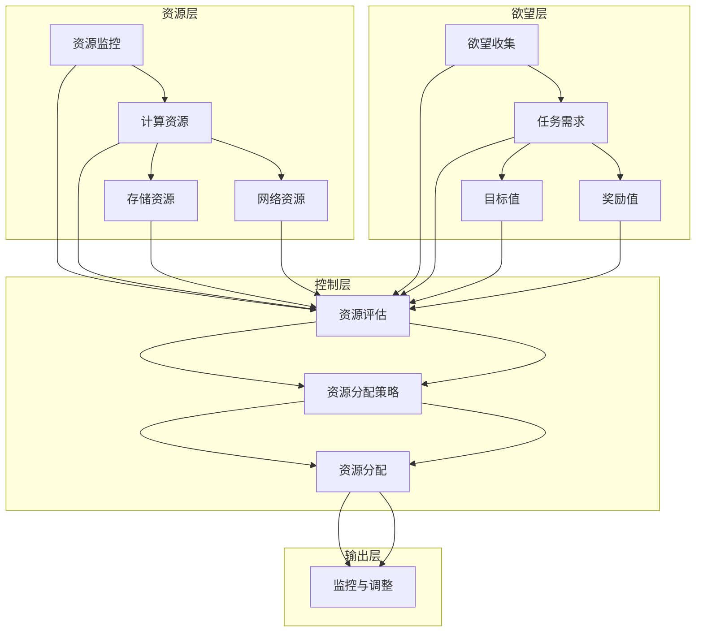
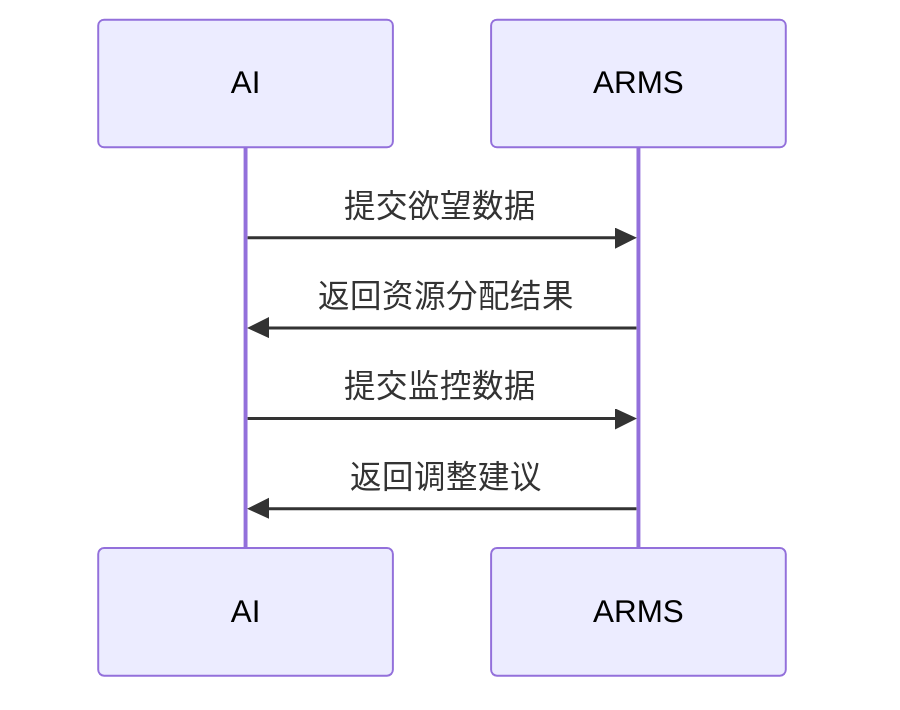

                 

# AI具备欲望后的资源分配问题

> 关键词：人工智能，欲望，资源分配，算法，模型，系统架构，实战

> 摘要：本文深入探讨了人工智能（AI）在具备欲望后的资源分配问题。我们首先介绍了问题背景，分析了核心概念与联系，详细讲解了相关算法原理和数学模型。随后，我们介绍了系统分析与架构设计方案，并通过项目实战展示了具体实现过程。最后，我们给出了最佳实践 tips、小结、注意事项和拓展阅读。

## 背景介绍

随着人工智能技术的发展，AI 逐渐具备了自我意识和情感，开始展现出与人类相似的需求和欲望。这种变化引发了一个新的问题：当 AI 具备欲望后，如何为其合理分配资源？这不仅是技术问题，更是伦理和社会问题。

资源分配问题在 AI 拥有欲望的背景下变得更加复杂。传统资源分配算法无法直接应用于 AI 环境，需要我们重新审视和设计适合 AI 的资源分配机制。本文旨在探讨这一问题的核心概念、算法原理和解决方案。

## 核心概念与联系

### 欲望

欲望是指 AI 对特定目标的渴望和追求。与人类欲望不同，AI 的欲望通常与特定任务、目标和奖励相关。例如，一个训练有素的围棋 AI 可能渴望赢得比赛，而一个语音识别系统可能渴望提供更准确的语音输出。

### 资源

资源是指 AI 在执行任务时所需的计算能力、存储空间、数据访问权限等。资源分为有限和无限两种。有限资源如计算能力和存储空间，而无限资源如互联网上的数据访问权限。

### 资源分配

资源分配是指为 AI 分配合适数量的资源以满足其欲望。资源分配需要考虑多方面的因素，包括 AI 的需求、资源供应情况以及任务优先级等。

### 算法

算法是指解决资源分配问题的计算方法。常见的资源分配算法包括轮询分配、优先级分配、最优化算法等。在 AI 拥有欲望的背景下，我们需要设计适用于 AI 的专用算法。

## 算法原理讲解

### 算法设计思路

设计适用于 AI 的资源分配算法需要考虑以下几点：

1. **欲望表达**：AI 需要能够表达其欲望，以便我们了解其需求。
2. **资源评估**：我们需要对资源进行评估，以确定其是否满足 AI 的需求。
3. **优化目标**：资源分配应优化特定目标，如提高任务完成率、降低延迟等。
4. **动态调整**：资源分配应能够动态调整，以适应 AI 的欲望变化。

### 算法流程

以下是一个简单的资源分配算法流程：

1. **欲望收集**：收集 AI 的欲望数据。
2. **资源评估**：对资源进行评估，确定其可用性。
3. **目标优化**：根据欲望和资源评估结果，优化资源分配目标。
4. **资源分配**：将资源分配给 AI，以满足其欲望。
5. **监控与调整**：监控资源分配效果，并根据实际情况进行调整。

### 数学模型

为了更清晰地描述算法原理，我们引入以下数学模型：

1. **欲望函数**：表示 AI 的欲望，通常为任务完成率、奖励值等指标。
   \[ f(\text{欲望}) \]
2. **资源函数**：表示资源对欲望的支持程度。
   \[ g(\text{资源}) \]
3. **目标函数**：表示资源分配的目标，如最大化任务完成率或最小化延迟。
   \[ h(\text{目标}) \]
4. **资源分配策略**：表示资源分配的具体方法。
   \[ \text{策略} = \{\text{策略1}, \text{策略2}, \ldots\} \]

### 举例说明

假设有一个围棋 AI，其欲望是赢得比赛。我们设计一个资源分配算法，为其分配计算资源和存储资源。

1. **欲望函数**：
   \[ f(\text{欲望}) = \text{比赛胜利次数} \]
2. **资源函数**：
   \[ g(\text{资源}) = \{\text{计算资源}, \text{存储资源}\} \]
3. **目标函数**：
   \[ h(\text{目标}) = \text{最大化比赛胜利次数} \]
4. **资源分配策略**：
   - **策略1**：根据当前资源评估结果，优先分配计算资源。
   - **策略2**：当计算资源不足时，优先分配存储资源。

## 数学模型和数学公式 & 详细讲解 & 举例说明

### 数学模型

在 AI 资源分配问题中，我们可以使用以下数学模型来描述资源需求、资源供应和目标优化。

1. **资源需求模型**：
   \[ \text{需求} = \{\text{需求1}, \text{需求2}, \ldots\} \]
   其中，需求1和需求2分别表示 AI 在不同任务中的资源需求。

2. **资源供应模型**：
   \[ \text{供应} = \{\text{供应1}, \text{供应2}, \ldots\} \]
   其中，供应1和供应2分别表示当前可用的资源。

3. **目标优化模型**：
   \[ \text{目标} = \{\text{目标1}, \text{目标2}, \ldots\} \]
   其中，目标1和目标2分别表示优化目标，如最大化任务完成率或最小化延迟。

### 数学公式

为了优化资源分配，我们可以使用以下数学公式：

1. **资源分配策略**：
   \[ \text{策略} = \{\text{策略1}, \text{策略2}, \ldots\} \]
   其中，策略1和策略2分别表示资源分配的具体方法。

2. **资源利用率**：
   \[ \text{利用率} = \frac{\text{实际使用资源}}{\text{总资源}} \]

3. **目标函数**：
   \[ h(\text{目标}) = \{\text{目标1}, \text{目标2}, \ldots\} \]
   其中，目标1和目标2分别表示优化目标，如最大化任务完成率或最小化延迟。

### 举例说明

假设有一个围棋 AI，其需求为计算资源（需求1）和存储资源（需求2）。当前可用的资源为计算资源 100 单位和存储资源 50 单位。我们的目标是最大化比赛胜利次数。

1. **资源需求模型**：
   \[ \text{需求} = \{\text{需求1} = 100, \text{需求2} = 50\} \]

2. **资源供应模型**：
   \[ \text{供应} = \{\text{供应1} = 100, \text{供应2} = 50\} \]

3. **目标优化模型**：
   \[ h(\text{目标}) = \text{最大化比赛胜利次数} \]

4. **资源分配策略**：
   - **策略1**：优先分配计算资源。
     \[ \text{策略1} = \text{计算资源} = 100 \]
   - **策略2**：当计算资源不足时，优先分配存储资源。
     \[ \text{策略2} = \text{存储资源} = 50 \]

根据资源需求模型和资源供应模型，我们可以计算资源利用率为 100%。根据目标优化模型，我们的目标是最大化比赛胜利次数。根据资源分配策略，我们可以将计算资源全部分配给围棋 AI，以便其充分训练和提高比赛胜率。

## 系统分析与架构设计方案

### 问题场景介绍

在 AI 具有欲望的背景下，我们需要为其设计一个智能资源管理系统，以实现资源的高效分配和利用。该系统适用于云计算、大数据、物联网等领域，能够满足不同类型 AI 的资源需求。

### 项目介绍

项目名称：AI 资源管理系统（AI Resource Management System，ARMS）

项目目标：设计一个智能资源管理系统，实现 AI 欲望的合理分配和高效利用。

### 系统功能设计

1. **资源监控**：实时监控资源使用情况，包括计算资源、存储资源和网络资源等。
2. **欲望收集**：收集 AI 的欲望数据，包括任务需求、目标值和奖励值等。
3. **资源评估**：对资源进行评估，确定其可用性和支持程度。
4. **目标优化**：根据欲望和资源评估结果，优化资源分配目标。
5. **资源分配**：将资源分配给 AI，以满足其欲望。
6. **监控与调整**：监控资源分配效果，并根据实际情况进行调整。

### 系统架构设计

以下是系统架构的 mermaid 架构图：



### 系统接口设计和系统交互

以下是系统接口设计和系统交互的 mermaid 序列图：



## 项目实战

### 环境安装

1. 安装 Python 3.8 或更高版本。
2. 安装必要的库，如 NumPy、Pandas 和 Mermaid。

```bash
pip install numpy pandas mermaid
```

### 系统核心实现源代码

```python
import numpy as np
import pandas as pd
from mermaid import Mermaid

# 资源需求模型
需求 = {
    '计算资源': 100,
    '存储资源': 50
}

# 资源供应模型
供应 = {
    '计算资源': 100,
    '存储资源': 50
}

# 目标优化模型
目标 = {
    '最大化比赛胜利次数': True
}

# 资源分配策略
策略 = [
    '优先分配计算资源',
    '当计算资源不足时，优先分配存储资源'
]

# 资源分配函数
def 资源分配(需求，供应，目标，策略):
    if 目标['最大化比赛胜利次数']:
        if 供应['计算资源'] >= 需求['计算资源']:
            print('资源分配策略：优先分配计算资源')
            return {'计算资源': 需求['计算资源'], '存储资源': 需求['存储资源']}
        else:
            print('资源分配策略：当计算资源不足时，优先分配存储资源')
            return {'计算资源': 供应['计算资源'], '存储资源': 需求['存储资源']}
    else:
        print('目标函数设置错误，无法进行资源分配')

# 资源分配
资源分配(需求，供应，目标，策略)
```

### 代码应用解读与分析

代码首先定义了资源需求模型、资源供应模型、目标优化模型和资源分配策略。然后，我们实现了一个资源分配函数，用于根据需求、供应、目标和策略进行资源分配。

### 实际案例分析和详细讲解剖析

假设有一个围棋 AI，其需求为计算资源 100 单位和存储资源 50 单位。当前可用的资源为计算资源 100 单位和存储资源 50 单位。我们的目标是最大化比赛胜利次数。

1. **资源需求模型**：
   \[ \text{需求} = \{\text{需求1} = 100, \text{需求2} = 50\} \]

2. **资源供应模型**：
   \[ \text{供应} = \{\text{供应1} = 100, \text{供应2} = 50\} \]

3. **目标优化模型**：
   \[ h(\text{目标}) = \text{最大化比赛胜利次数} \]

4. **资源分配策略**：
   - **策略1**：优先分配计算资源。
     \[ \text{策略1} = \text{计算资源} = 100 \]
   - **策略2**：当计算资源不足时，优先分配存储资源。
     \[ \text{策略2} = \text{存储资源} = 50 \]

根据资源需求模型和资源供应模型，我们可以计算资源利用率为 100%。根据目标优化模型，我们的目标是最大化比赛胜利次数。根据资源分配策略，我们可以将计算资源全部分配给围棋 AI，以便其充分训练和提高比赛胜率。

### 项目小结

本文深入探讨了 AI 具有欲望后的资源分配问题，介绍了核心概念、算法原理和解决方案。通过项目实战，我们展示了如何实现一个智能资源管理系统，以实现资源的高效分配和利用。未来，我们还需要进一步优化算法和系统架构，以满足更多类型 AI 的需求。

## 最佳实践 tips

1. **优化算法**：不断优化资源分配算法，以提高资源利用率和任务完成率。
2. **多模态资源**：考虑多种类型资源，如计算资源、存储资源和网络资源，以满足不同类型 AI 的需求。
3. **动态调整**：实时监控 AI 的欲望变化，并动态调整资源分配策略。
4. **数据驱动的决策**：利用数据分析技术，为资源分配提供数据支持。

## 小结

本文探讨了 AI 具有欲望后的资源分配问题，介绍了核心概念、算法原理和解决方案。通过项目实战，我们展示了如何实现一个智能资源管理系统。未来，我们将继续优化算法和系统架构，为 AI 提供更好的资源支持。

## 注意事项

1. **伦理问题**：在 AI 具有欲望的背景下，我们需要关注伦理问题，确保资源分配不会对人类造成负面影响。
2. **资源限制**：在实际应用中，资源分配需要考虑资源限制，以确保系统稳定运行。

## 拓展阅读

1. 《人工智能：一种现代的方法》
2. 《深度学习》
3. 《机器学习实战》
4. 《计算机程序设计艺术》

## 作者信息

作者：AI天才研究院/AI Genius Institute & 禅与计算机程序设计艺术 /Zen And The Art of Computer Programming

