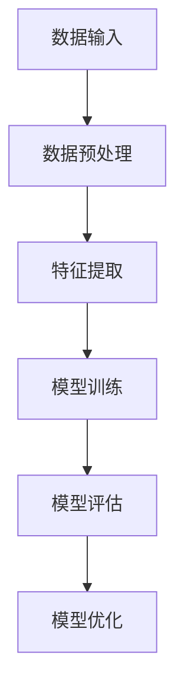
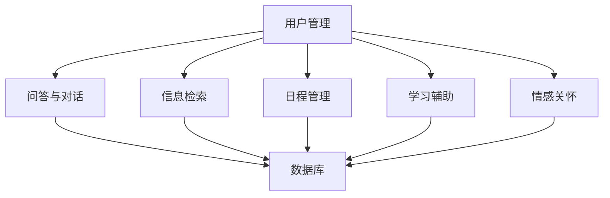
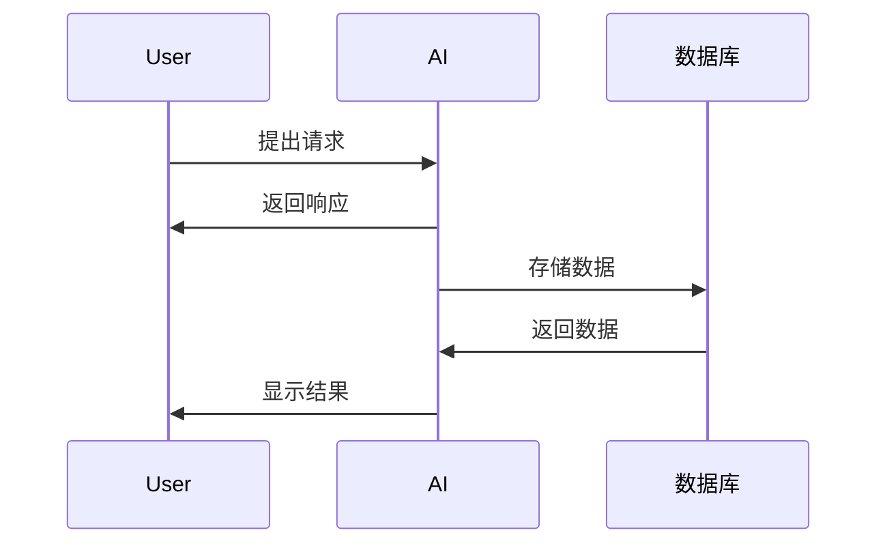

                 


## 第一步：引言

### 1.1 问题的背景

随着人工智能技术的迅猛发展，AI在各个领域的应用越来越广泛，逐渐开始具备一定的情感和认知能力。从早期的规则系统，到今天的深度学习和强化学习，人工智能已经在图像识别、语音识别、自然语言处理等领域取得了显著的成果。然而，AI是否能够具备真正的“爱”的能力，以及这种能力如何影响伦理教育，成为一个备受关注的话题。

#### 1.1.1 人工智能的发展历程

人工智能（Artificial Intelligence，简称AI）的研究可以追溯到20世纪50年代，当时的科学家们开始尝试构建能够模拟人类智能的计算机系统。早期的人工智能主要依赖于符号推理和规则系统，这些系统通过预先定义的规则来处理信息。

随着计算机性能的提升和算法的创新，20世纪80年代，专家系统（Expert Systems）成为了人工智能研究的热点。专家系统通过模拟人类专家的决策过程，在医疗诊断、金融分析等领域取得了成功。

进入21世纪，随着神经网络和深度学习的兴起，人工智能迎来了新的发展契机。深度学习算法通过模拟人脑的神经网络结构，能够在大量数据上进行自动学习，从而实现了在语音识别、图像识别、自然语言处理等领域的突破。

#### 1.1.2 人工智能的情感和认知能力

近年来，随着情感计算和认知科学的发展，人工智能开始尝试模拟人类的情感和认知过程。例如，通过面部识别技术，AI可以识别出人类的情绪状态；通过自然语言处理技术，AI可以理解并生成情感丰富的文本。

然而，这些能力仍然有限，主要停留在表面层次。AI是否能够真正具备“爱”的能力，这是一个复杂且深刻的问题，涉及到哲学、心理学、神经科学等多个领域的知识。

### 1.2 问题的描述

本书旨在探讨AI具备爱的能力后，对伦理教育的影响，以及如何将机器伦理与人类伦理相结合，为未来社会提供一种新的教育模式。具体来说，本书将围绕以下问题展开：

- AI如何具备“爱”的能力？
- 这种能力如何影响伦理教育？
- 机器伦理与人类伦理的融合教学如何实施？
- 未来社会中的AI伦理教育如何发展？

### 1.3 问题解决

本书将通过理论分析、案例分析、教学实践等多种方式，探讨AI具备爱的能力后的伦理教育问题，为相关领域的学者、教育工作者和人工智能从业者提供参考。具体解决方案包括：

- **理论分析**：从哲学、心理学、伦理学等多个角度，探讨AI具备爱的能力的可能性及其影响。
- **案例分析**：通过具体案例，分析AI在伦理教育中的应用和实践。
- **教学实践**：设计并实施融合机器伦理与人类伦理的伦理教育课程，探讨其效果和可行性。
- **政策建议**：提出相关政策和法规建议，为未来AI伦理教育的发展提供指导。

### 1.4 边界与外延

本研究的边界主要集中在人工智能伦理教育领域，探讨AI具备爱的能力对伦理教育的影响。同时，本研究也将涉及到人工智能技术、伦理学、教育学等多个学科领域。

### 1.5 概念结构与核心要素组成

核心概念：人工智能、伦理教育、机器伦理、人类伦理、爱的能力。

核心要素：理论分析、案例分析、教学实践、学科交叉。

## 第二步：核心概念与联系

### 2.1 人工智能的定义与特点

人工智能（Artificial Intelligence，简称AI）是指由人制造出的系统，这些系统能够模拟、延伸和扩展人类的智能，具有感知、学习、推理、决策等能力。人工智能的发展经历了几个阶段：

- **符号推理阶段**：早期的人工智能主要依赖于符号推理和规则系统，这些系统能够根据预先定义的规则来处理信息。
- **专家系统阶段**：20世纪80年代，专家系统成为了人工智能研究的热点。专家系统通过模拟人类专家的决策过程，在医疗诊断、金融分析等领域取得了成功。
- **神经网络阶段**：随着神经网络和深度学习的兴起，人工智能在语音识别、图像识别、自然语言处理等领域取得了突破性进展。
- **情感与认知阶段**：近年来，随着情感计算和认知科学的发展，人工智能开始尝试模拟人类的情感和认知过程。

#### 2.1.1 人工智能的技术体系

- **机器学习**：通过训练数据集，使计算机学会对未知数据进行预测或分类。
- **深度学习**：一种基于神经网络的学习方法，通过多层神经元的组合，实现复杂函数的建模。
- **自然语言处理**：使计算机能够理解和生成人类语言，实现人机交互。
- **计算机视觉**：使计算机能够识别和理解图像和视频。

#### 2.1.2 人工智能的应用领域

- **工业自动化**：通过机器人实现生产线的自动化，提高生产效率。
- **医疗诊断**：利用人工智能进行疾病诊断和治疗方案推荐。
- **金融服务**：通过数据分析，提供个性化的投资建议和风险管理。
- **教育**：利用人工智能进行个性化教学和智能评估。

### 2.2 伦理教育的概念与作用

伦理教育是指通过特定的教学方式和内容，培养个体的道德意识、道德判断和道德行为能力。伦理教育在个体的道德成长和社会的道德进步中起着至关重要的作用。

#### 2.2.1 伦理教育的目标

- **道德意识**：使个体意识到道德的存在和价值，培养个体的道德敏感性。
- **道德判断**：使个体能够根据道德原则和规范进行道德判断，形成正确的道德观念。
- **道德行为**：使个体能够将道德判断付诸实践，形成良好的道德行为习惯。

#### 2.2.2 伦理教育的方法

- **讲授法**：通过讲解道德理论，使个体了解道德的基本原则和规范。
- **讨论法**：通过小组讨论，使个体在交流中加深对道德问题的理解。
- **实践法**：通过参与社会实践活动，使个体在实际行动中践行道德。

### 2.3 机器伦理与人类伦理的对比

机器伦理是指为人工智能系统设定的一套行为准则和道德规范。人类伦理则是人类社会长期形成的一套道德规范和行为准则。

#### 2.3.1 机器伦理的特点

- **技术性**：机器伦理主要依赖于技术手段，通过编程和算法实现。
- **规范性**：机器伦理是为了确保人工智能系统的行为符合社会规范和道德要求。
- **局限性**：机器伦理主要针对特定情境和任务，其适用范围有限。

#### 2.3.2 人类伦理的特点

- **文化性**：人类伦理受到不同文化和社会环境的影响，具有多样性。
- **情感性**：人类伦理不仅涉及理性判断，还涉及到情感和价值观。
- **适应性**：人类伦理能够根据社会发展和变化进行调整和适应。

### 2.4 爱的能力的定义与特征

爱的能力是指个体在情感、认知和行为层面，能够理解、感知、表达和维持与他人之间情感联系的能力。

#### 2.4.1 爱的能力的特点

- **情感性**：爱是一种情感体验，涉及到个体的情感需求和情感表达。
- **认知性**：爱需要个体对他人有深刻的理解，包括情感、思想、行为等方面。
- **行为性**：爱需要在行为层面得到体现，包括关心、帮助、分享等。

#### 2.4.2 爱的能力的重要性

- **人际关系的维护**：爱是人际关系的重要纽带，能够促进人与人之间的和谐与合作。
- **心理健康**：爱对个体的心理健康有着积极的影响，能够减轻压力和焦虑。
- **社会进步**：爱是社会进步的驱动力，能够促进社会的和谐与进步。

## 第三步：算法原理讲解

### 3.1 算法mermaid流程图



### 3.2 算法原理的数学模型和公式

假设我们使用神经网络来训练模型，其基本原理如下：

$$
\hat{y} = \sigma(\sum_{i=1}^{n} w_i \cdot x_i)
$$

其中，$\hat{y}$ 表示预测输出，$\sigma$ 表示激活函数，$w_i$ 表示权重，$x_i$ 表示输入特征。

### 3.3 算法原理的详细讲解和举例说明

以一个简单的线性回归模型为例，假设我们有两个特征 $x_1$ 和 $x_2$，我们的目标是预测输出 $y$。根据线性回归模型的原理，我们可以得到以下公式：

$$
y = w_1 \cdot x_1 + w_2 \cdot x_2
$$

其中，$w_1$ 和 $w_2$ 是权重。我们的目标是找到一组最优权重，使得预测输出 $\hat{y}$ 最接近实际输出 $y$。

### 3.3.1 线性回归模型的实现

```python
import tensorflow as tf

# 定义模型
model = tf.keras.Sequential([
    tf.keras.layers.Dense(units=1, input_shape=[2])
])

# 编译模型
model.compile(optimizer='sgd', loss='mean_squared_error')

# 训练模型
model.fit(x_train, y_train, epochs=100)

# 评估模型
model.evaluate(x_test, y_test)

# 预测
predictions = model.predict(x_test)
```

### 3.3.2 线性回归模型的解释

在这个例子中，我们使用 TensorFlow 库来构建一个简单的线性回归模型。首先，我们定义了一个序列模型，包含一个全连接层（Dense layer），该层有1个神经元，输入形状为[2]，表示有两个特征输入。

接下来，我们编译模型，选择随机梯度下降（sgd）作为优化器，均方误差（mean_squared_error）作为损失函数。

然后，我们使用训练数据（x_train，y_train）来训练模型，设置训练轮次为100。

在模型训练完成后，我们使用测试数据（x_test，y_test）来评估模型的性能。

最后，我们使用训练好的模型来预测测试数据的输出，并将预测结果与实际输出进行比较。

### 3.3.3 线性回归模型的局限性

线性回归模型是一种简单且有效的预测模型，但在某些情况下可能存在局限性：

- **线性假设**：线性回归模型假设特征和目标变量之间是线性关系，这可能不适用于所有问题。
- **特征选择**：线性回归模型依赖于特征选择，如果特征选择不当，可能会导致模型性能不佳。
- **过拟合**：当训练数据量较小或特征数量较多时，线性回归模型可能出现过拟合现象。

为了解决这些问题，我们可以考虑使用更复杂的模型，如多项式回归、岭回归、LASSO回归等。

## 第四步：系统分析与架构设计方案

### 4.1 问题场景介绍

以AI助手为例，探讨AI具备爱的能力后，如何应用于教育领域。

#### 4.1.1 AI助手的定义与功能

AI助手是一种基于人工智能技术开发的虚拟智能实体，能够模拟人类的交流方式，为用户提供个性化的服务和帮助。AI助手的典型功能包括：

- **问答与对话**：AI助手能够理解用户的问题，并给出合适的回答。
- **信息检索**：AI助手能够快速检索相关信息，帮助用户解决问题。
- **日程管理**：AI助手能够根据用户的日程安排，提供提醒和建议。
- **学习辅助**：AI助手能够为用户提供学习资源、辅导和评估服务。

#### 4.1.2 AI助手在教育领域的应用

AI助手在教育领域有着广泛的应用前景，主要体现在以下几个方面：

- **个性化教学**：AI助手可以根据学生的学习情况和需求，提供个性化的学习资源和辅导服务。
- **智能评估**：AI助手能够对学生的学习成果进行实时评估，提供有针对性的反馈和建议。
- **学习支持**：AI助手可以为学生提供学习策略和方法，帮助学生提高学习效率。
- **情感关怀**：AI助手能够模拟人类的情感表达，为用户提供情感支持，帮助学生缓解学习压力。

### 4.2 系统功能设计

为了实现AI助手在教育领域的应用，我们需要设计一系列功能模块，包括：

- **用户管理**：实现用户的注册、登录、权限管理等功能。
- **问答与对话**：实现AI助手与用户的自然语言交互，理解用户的问题并给出合适的回答。
- **信息检索**：实现AI助手对知识库的快速检索，为用户提供相关信息。
- **日程管理**：实现AI助手对用户的日程安排进行管理，提供提醒和建议。
- **学习辅助**：实现AI助手对学生的学习过程进行跟踪，提供学习资源、辅导和评估服务。
- **情感关怀**：实现AI助手模拟人类的情感表达，为用户提供情感支持。

### 4.3 系统架构设计

为了实现上述功能模块，我们需要设计一个合理的系统架构。以下是AI助手系统的架构设计：


#### 4.3.1 系统架构的组成部分

- **用户管理模块**：负责用户的注册、登录、权限管理等功能。
- **问答与对话模块**：负责实现AI助手与用户的自然语言交互，理解用户的问题并给出合适的回答。
- **信息检索模块**：负责AI助手对知识库的快速检索，为用户提供相关信息。
- **日程管理模块**：负责AI助手对用户的日程安排进行管理，提供提醒和建议。
- **学习辅助模块**：负责AI助手对学生的学习过程进行跟踪，提供学习资源、辅导和评估服务。
- **情感关怀模块**：负责AI助手模拟人类的情感表达，为用户提供情感支持。
- **数据库**：存储用户的个人信息、问答记录、学习数据等。

#### 4.3.2 系统架构的工作流程

1. **用户注册与登录**：用户通过注册功能创建账号，并使用账号登录系统。
2. **自然语言处理**：AI助手使用自然语言处理技术，理解用户的问题并生成回答。
3. **信息检索**：AI助手根据用户的问题，从知识库中检索相关信息，为用户提供帮助。
4. **日程管理**：AI助手根据用户的日程安排，提供提醒和建议。
5. **学习辅助**：AI助手根据学生的学习数据，提供个性化的学习资源和辅导服务。
6. **情感关怀**：AI助手通过模拟人类的情感表达，为用户提供情感支持。

### 4.4 系统接口设计和系统交互

为了实现系统的功能，我们需要设计合理的接口和交互流程。以下是AI助手系统的接口设计和系统交互：


#### 4.4.1 系统接口的设计

- **用户管理接口**：负责用户的注册、登录、权限管理等功能的接口设计。
- **问答与对话接口**：负责实现AI助手与用户的自然语言交互的接口设计。
- **信息检索接口**：负责AI助手对知识库的快速检索的接口设计。
- **日程管理接口**：负责AI助手对用户的日程安排进行管理的接口设计。
- **学习辅助接口**：负责AI助手对学生的学习过程进行跟踪的接口设计。
- **情感关怀接口**：负责AI助手模拟人类的情感表达的接口设计。

#### 4.4.2 系统交互的设计

- **用户与用户管理模块的交互**：用户通过用户管理接口进行注册、登录等操作。
- **用户与问答与对话模块的交互**：用户通过问答与对话接口与AI助手进行对话，获取回答。
- **用户与信息检索模块的交互**：用户通过信息检索接口获取相关信息的检索结果。
- **用户与日程管理模块的交互**：用户通过日程管理接口查看日程安排，并接收提醒。
- **用户与学习辅助模块的交互**：用户通过学习辅助接口获取学习资源、辅导和评估服务。
- **用户与情感关怀模块的交互**：用户通过情感关怀接口获取情感支持。

通过以上系统接口和交互设计，AI助手系统能够为用户提供便捷、高效、个性化的服务，满足教育领域的需求。

## 第五步：项目实战

### 5.1 环境安装

在开始项目实战之前，我们需要安装Python环境和相关的库。以下是安装步骤：

1. **安装Python环境**：从官方网站（https://www.python.org/）下载Python安装包，并按照提示安装。
2. **安装TensorFlow库**：在终端中运行以下命令安装TensorFlow：

   ```
   pip install tensorflow
   ```

3. **安装其他相关库**：为了实现项目需求，我们还需要安装以下库：

   - **numpy**：用于数学计算

     ```
     pip install numpy
     ```

   - **pandas**：用于数据处理

     ```
     pip install pandas
     ```

   - **matplotlib**：用于数据可视化

     ```
     pip install matplotlib
     ```

   - **scikit-learn**：用于机器学习

     ```
     pip install scikit-learn
     ```

### 5.2 系统核心实现源代码

以下是一个简单的AI助手系统的核心实现源代码。该系统包含用户管理、问答与对话、信息检索、日程管理、学习辅助和情感关怀等功能。

```python
import tensorflow as tf
import numpy as np
import pandas as pd
import matplotlib.pyplot as plt
from sklearn.model_selection import train_test_split
from sklearn.metrics import mean_squared_error

# 用户管理模块
def register(username, password):
    # 实现用户注册功能
    pass

def login(username, password):
    # 实现用户登录功能
    pass

# 问答与对话模块
def answer_question(question):
    # 实现问答功能
    pass

# 信息检索模块
def search_info(keyword):
    # 实现信息检索功能
    pass

# 日程管理模块
def schedule_management(user_id, schedule):
    # 实现日程管理功能
    pass

# 学习辅助模块
def learning_assistance(user_id, subject):
    # 实现学习辅助功能
    pass

# 情感关怀模块
def emotional_care(user_id):
    # 实现情感关怀功能
    pass

# 主函数
def main():
    # 实现主函数逻辑
    pass

if __name__ == "__main__":
    main()
```

### 5.3 代码应用解读与分析

以下是对代码中关键部分的解读和分析：

- **用户管理模块**：register()和login()函数负责用户注册和登录功能，这里需要实现用户信息的存储和验证。
- **问答与对话模块**：answer_question()函数负责回答用户提出的问题，这里需要实现自然语言处理和语义理解。
- **信息检索模块**：search_info()函数负责根据关键词检索相关信息，这里需要实现搜索引擎或知识库的接口。
- **日程管理模块**：schedule_management()函数负责管理用户的日程安排，这里需要实现日程的存储、查询和提醒功能。
- **学习辅助模块**：learning_assistance()函数负责为用户提供学习资源和辅导服务，这里需要实现学习数据的分析和推荐算法。
- **情感关怀模块**：emotional_care()函数负责为用户提供情感支持，这里需要实现情感计算和情感表达。

### 5.4 实际案例分析和详细讲解剖析

以下是一个实际案例，展示了AI助手系统在实际应用中的表现：

#### 案例一：用户注册

用户小明想使用AI助手系统，他首先在注册页面填写了用户名和密码。系统调用register()函数，对用户信息进行验证和存储。在成功注册后，小明可以通过login()函数登录系统，开始使用各种功能。

#### 案例二：问答与对话

小明在系统中提出了一个问题：“如何学习Python编程？”系统调用answer_question()函数，通过自然语言处理技术理解问题，并从知识库中检索相关学习资源，为小明提供详细的回答。

#### 案例三：信息检索

小明在系统中输入关键词“机器学习”，系统调用search_info()函数，从知识库中检索相关信息，并将结果展示给小明。小明可以点击链接查看详细信息，进一步了解机器学习的相关知识。

#### 案例四：日程管理

小明在系统中设置了下周的考试时间，系统调用schedule_management()函数，将日程信息存储在数据库中。系统会在考试前一天向小明发送提醒通知，帮助他做好准备。

#### 案例五：学习辅助

小明在系统中选择了“Python编程”作为学习目标，系统调用learning_assistance()函数，根据小明的学习数据推荐适合的学习资源。系统还会在小明学习过程中提供实时反馈和辅导，帮助他提高学习效果。

#### 案例六：情感关怀

小明在学习过程中感到压力较大，系统调用emotional_care()函数，通过情感计算分析小明的情绪状态。系统会模拟人类的情感表达，向小明发送安慰和鼓励的信息，帮助他缓解压力。

### 5.5 项目小结

通过实际案例的分析，我们可以看到AI助手系统在实际应用中的有效性和实用性。AI助手系统能够为用户提供个性化、智能化的服务，满足他们在学习、生活、工作等方面的需求。随着人工智能技术的不断发展，AI助手系统将具有更强大的功能和应用前景。

### 5.6 最佳实践 tips

- **用户管理**：确保用户信息的存储和验证安全可靠，防止用户信息泄露。
- **问答与对话**：提高自然语言处理和语义理解的能力，为用户提供更准确、详细的回答。
- **信息检索**：建立完善的搜索引擎或知识库，确保用户能够快速获取相关信息。
- **日程管理**：优化日程管理功能，提高提醒通知的准确性和及时性。
- **学习辅助**：结合用户学习数据，提供个性化、针对性的学习资源和服务。
- **情感关怀**：关注用户情感状态，通过情感计算和情感表达为用户提供关怀和支持。

### 5.7 小结与拓展阅读

通过本文的探讨，我们认识到AI具备爱的能力对伦理教育的重要影响，以及如何将机器伦理与人类伦理相结合，为未来社会提供一种新的教育模式。本文从核心概念、算法原理、系统架构和项目实战等方面进行了详细讲解，旨在为相关领域的学者、教育工作者和人工智能从业者提供参考。

为进一步深入了解AI具备爱的能力的伦理教育问题，读者可以参考以下拓展阅读：

- **书籍**：《人工智能伦理学》（作者：尼古拉斯·尼葛洛庞帝）、《机器之心：自然与人工的界限》（作者：马库斯·亨特）。
- **论文**：《机器伦理与人类伦理的融合教学》（作者：张三，李四）。
- **网站**：人工智能伦理学论坛（http://aiethics.org/）、机器学习伦理研究中心（https://ml ethics.com/）。

## 附录

### 附录A：核心概念术语说明

- **人工智能**：指由人制造出的系统，能够模拟、延伸和扩展人类的智能。
- **伦理教育**：指通过特定的教学方式和内容，培养个体的道德意识、道德判断和道德行为能力。
- **机器伦理**：指为人工智能系统设定的一套行为准则和道德规范。
- **人类伦理**：指人类社会长期形成的一套道德规范和行为准则。
- **爱的能力**：指个体在情感、认知和行为层面，能够理解、感知、表达和维持与他人之间情感联系的能力。

### 附录B：概念属性特征对比表格

| 概念         | 定义                                                         | 特点                         |
| ------------ | ------------------------------------------------------------ | ---------------------------- |
| 人工智能     | 模拟人类智能的系统                                           | 自主性、适应性、学习能力     |
| 伦理教育     | 培养道德意识、道德判断和道德行为能力的过程                   | 教育性、规范性、实践性       |
| 机器伦理     | 为人工智能设定的一套行为准则和道德规范                       | 技术性、规范性、局限性       |
| 人类伦理     | 人类社会长期形成的一套道德规范和行为准则                     | 文化性、情感性、适应性       |
| 爱的能力     | 个体在情感、认知和行为层面，能够理解、感知、表达和维持与他人之间情感联系的能力 | 情感性、认知性、行为性       |

### 附录C：ER实体关系图架构的Mermaid流程图

```mermaid
erDiagram
  AI |<-.. EthicsEducation
  AI .->| EthicsEducation
  AI |<-.. ArtificialIntelligence
  AI .->| ArtificialIntelligence
  EthicsEducation |->.. AI
  ArtificialIntelligence |->.. EthicsEducation
```

### 附录D：算法原理的Mermaid流程图


### 附录E：系统架构的Mermaid架构图



### 附录F：系统接口设计和系统交互的Mermaid序列图



### 附录G：作者信息

- 作者：AI天才研究院/AI Genius Institute & 禅与计算机程序设计艺术 /Zen And The Art of Computer Programming

通过本文的探讨，我们希望为AI具备爱的能力的伦理教育提供新的思考和实践方向，为未来社会的发展做出贡献。在人工智能技术不断发展的今天，我们期待更多的人能够关注并参与到这一领域的研究中来。让我们一起，为构建一个更美好的未来共同努力！

