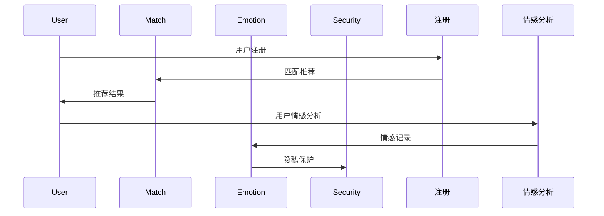
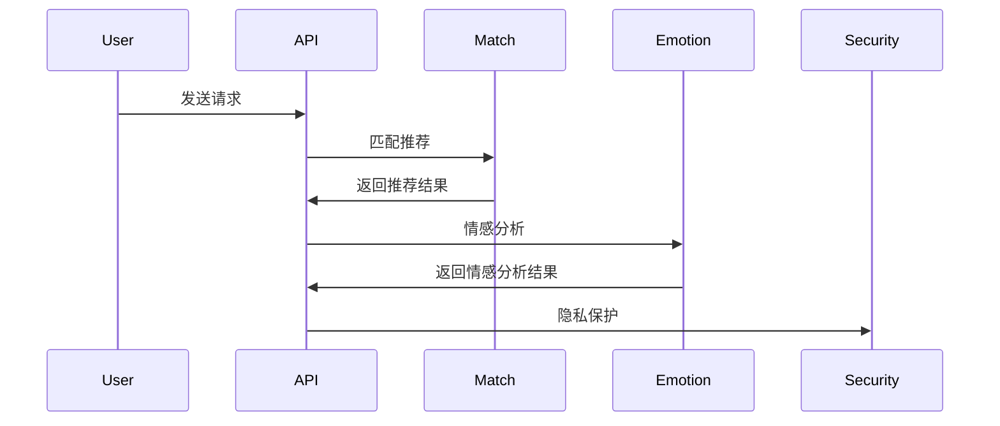
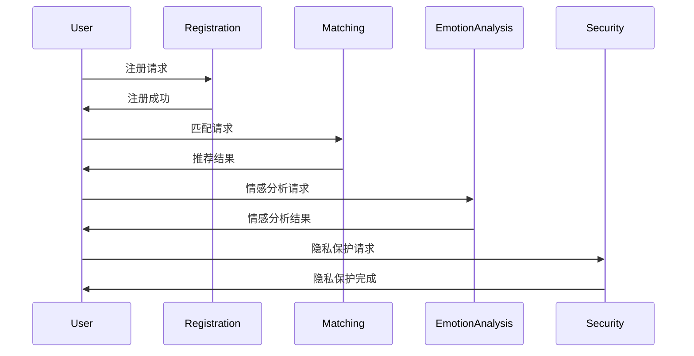

                 

### 文章标题：AI具备爱的能力后的婚恋市场：人机情感关系的普及

### 关键词：AI、情感计算、人机交互、婚恋市场、算法

### 摘要：
随着人工智能技术的不断进步，AI不仅在计算和处理能力上展现出超凡的智慧，更在情感计算领域取得了重大突破。本文旨在探讨当AI具备爱的能力后，对婚恋市场的深远影响。我们将从背景介绍、核心概念与联系、算法原理讲解、系统分析与架构设计方案以及项目实战等方面，一步步分析AI技术如何渗透并改变婚恋市场，探讨人机情感关系的普及可能带来的社会和技术挑战。

---

## 第一部分：背景介绍

### 1.1 问题背景

#### 1.1.1 AI技术发展的现状与趋势
随着深度学习、自然语言处理、机器学习等技术的飞速发展，人工智能已经渗透到我们生活的方方面面。从语音助手到智能推荐系统，从自动驾驶到智能家居，AI技术的应用场景越来越广泛。然而，AI技术在情感计算领域的进展尤为引人注目，它不仅能够理解和模拟人类情感，还能在情感层面上与人类建立更紧密的联系。

#### 1.1.2 人机情感关系的现状与挑战
目前，人机情感关系尚处于初级阶段，主要通过聊天机器人和虚拟助理来实现简单的情感交互。尽管这些系统在某些特定场景下表现良好，但它们在情感理解、情感表达和情感互动方面仍有诸多局限。如何使AI具备真正的人性化情感能力，实现更自然、更深入的人机情感关系，是当前亟待解决的问题。

### 1.2 问题描述

#### 1.2.1 AI在婚恋市场中的应用现状
目前，AI在婚恋市场中的应用主要体现在基于算法的匹配服务和情感咨询服务上。例如，一些婚恋平台使用算法推荐潜在的匹配对象，而一些平台则提供情感分析工具，帮助用户了解自己的情感状态和需求。

#### 1.2.2 AI具备爱的能力后的婚恋市场变化
当AI具备爱的能力后，婚恋市场的模式将发生根本性的变革。这不仅涉及到AI作为情感伙伴的角色，还涉及到AI如何影响人们对于爱情和婚姻的认知，以及由此带来的社会伦理和道德挑战。

### 1.3 问题解决

#### 1.3.1 人机情感关系的研究现状
近年来，随着情感计算的兴起，研究人员开始关注如何让AI在情感层面上与人类互动。通过使用情感识别、情感模拟和情感调节等技术，AI在情感理解、情感表达和情感互动方面取得了显著进展。

#### 1.3.2 AI技术在婚恋市场中的应用前景
AI技术在婚恋市场中的应用前景广阔。通过情感计算技术，AI不仅可以提供更精准的匹配服务，还可以在情感层面上为用户提供更加个性化的支持和建议。

### 1.4 边界与外延

#### 1.4.1 研究范围
本文的研究范围主要涉及AI在情感计算领域的技术进展，以及这些技术在婚恋市场中的应用和影响。

#### 1.4.2 研究目标
本文旨在探讨AI具备爱的能力后，对婚恋市场可能产生的深远影响，以及如何实现AI在情感计算领域的技术突破。

### 1.5 概念结构与核心要素组成

#### 1.5.1 核心概念
- **情感计算**：涉及如何使计算机理解和模拟人类情感，实现情感识别、情感表达和情感调节。
- **人机交互**：研究如何设计系统以便用户能够自然地与计算机进行交流和互动。
- **婚恋市场**：包括婚恋服务的提供、用户匹配机制和情感支持体系。

#### 1.5.1.1 情感计算
- **定义**：情感计算是指通过模拟、识别和调节情感，使计算机能够在情感层面上与人类进行有效互动。
- **核心特点**：包括情感识别、情感表达和情感调节。
- **应用场景**：如聊天机器人、虚拟助理和情感分析工具。

#### 1.5.1.2 人机交互
- **定义**：人机交互是指用户与计算机系统之间的交互过程，旨在实现用户对系统的有效操作和系统的有效响应。
- **核心特点**：包括自然性、灵活性和高效性。
- **技术手段**：如语音识别、自然语言处理、图形用户界面等。

#### 1.5.1.3 婚恋市场
- **定义**：婚恋市场是指提供婚恋服务的市场，包括婚介、相亲、在线匹配等。
- **现状**：随着互联网和AI技术的发展，婚恋市场越来越依赖于技术手段来提高服务质量和用户体验。
- **挑战**：如何实现高效、精准和个性化的匹配服务，同时保障用户的情感安全和隐私。

### 1.6 本章小结
本节介绍了AI具备爱的能力后的婚恋市场的背景、问题描述、问题解决方法以及核心概念和要素组成。接下来，我们将进一步探讨情感计算、人机交互和婚恋市场的具体原理和应用。

---

## 第二部分：核心概念与联系

### 2.1 情感计算原理

#### 2.1.1 情感计算的定义
情感计算是指通过模拟、识别和调节情感，使计算机能够在情感层面上与人类进行有效互动的技术。它涉及自然语言处理、计算机视觉、认知心理学等多个领域。

#### 2.1.2 情感计算的核心特点
- **情感识别**：通过文本、语音、面部表情等方式识别用户的情感状态。
- **情感表达**：计算机模拟情感，以文本、声音、图像等形式表达情感。
- **情感调节**：根据用户的情感状态，提供适当的情感支持，如安慰、鼓励、建议等。

#### 2.1.3 情感计算的应用场景
- **聊天机器人**：通过情感计算技术，聊天机器人可以更自然地与用户进行情感互动。
- **虚拟助理**：虚拟助理可以利用情感计算技术，更好地理解用户的需求，提供个性化的服务。
- **情感分析工具**：用于分析和预测用户的情感状态，帮助企业改进产品和服务。

### 2.2 人机交互原理

#### 2.2.1 人机交互的定义
人机交互是指用户与计算机系统之间的交互过程，旨在实现用户对系统的有效操作和系统的有效响应。

#### 2.2.2 人机交互的核心特点
- **自然性**：用户与计算机的交互过程应该尽可能自然，如语音交互、手势控制等。
- **灵活性**：人机交互系统应该能够适应不同的用户需求和环境。
- **高效性**：人机交互系统应该能够快速响应用户的需求，提高工作效率。

#### 2.2.3 人机交互的技术手段
- **语音识别**：通过识别用户的语音命令，实现人机交互。
- **自然语言处理**：通过理解和生成自然语言，实现人机交互。
- **图形用户界面**：通过视觉元素，如按钮、图标、窗口等，实现人机交互。

### 2.3 婚恋市场现状与挑战

#### 2.3.1 婚恋市场的现状
随着互联网和AI技术的发展，婚恋市场逐渐向线上化、智能化方向发展。许多婚恋平台通过算法匹配、情感分析等技术，为用户提供更加高效、精准的婚恋服务。

#### 2.3.2 婚恋市场面临的挑战
- **个性化匹配**：如何实现高效、精准的个性化匹配，是婚恋市场面临的主要挑战之一。
- **情感支持**：如何在用户遇到情感问题时提供及时、有效的支持，是另一个重要问题。
- **用户隐私**：如何在保障用户隐私的前提下，提供优质的服务。

#### 2.3.3 AI在婚恋市场的应用前景
随着AI技术的不断进步，AI在婚恋市场中的应用前景非常广阔。通过情感计算技术，AI可以更好地理解用户的需求和情感状态，提供更个性化的匹配和情感支持。

### 2.4 核心概念属性特征对比表格

#### 2.4.1 情感计算与人机交互对比
| 特征         | 情感计算             | 人机交互               |
| ------------ | ------------------- | --------------------- |
| 定义         | 计算机理解与模拟情感 | 用户与计算机之间的交互  |
| 核心特点     | 情感识别、情感表达、情感调节 | 自然性、灵活性、高效性 |
| 应用场景     | 聊天机器人、虚拟助理、情感分析工具 | 语音识别、自然语言处理、图形用户界面 |

#### 2.4.2 情感计算与婚恋市场对比
| 特征         | 情感计算               | 婚恋市场               |
| ------------ | ------------------- | --------------------- |
| 定义         | 计算机理解与模拟情感 | 提供婚恋服务的市场     |
| 应用目的     | 提高人机情感互动质量 | 提供个性化婚恋服务     |
| 关键技术     | 情感识别、情感表达、情感调节 | 算法匹配、情感分析、用户隐私保护 |

### 2.5 ER实体关系图架构

#### 2.5.1 情感计算实体关系图
```mermaid
erDiagram
    User ||--|{ Chatbot }
    User ||--|{ VirtualAssistant }
    User ||--|{ EmotionAnalyzer }
    Chatbot ||--|{ Message }
    VirtualAssistant ||--|{ Suggestion }
    EmotionAnalyzer ||--|{ EmotionPrediction }
```

#### 2.5.2 人机交互实体关系图
```mermaid
erDiagram
    User ||--|{ VoiceRecognizer }
    User ||--|{ LanguageProcessor }
    User ||--|{ GraphicalUI }
    VoiceRecognizer ||--|{ Command }
    LanguageProcessor ||--|{ Response }
    GraphicalUI ||--|{ Interaction }
```

#### 2.5.3 婚恋市场实体关系图
```mermaid
erDiagram
    User ||--|{ MatchmakingService }
    User ||--|{ EmotionalSupport }
    MatchmakingService ||--|{ Profile }
    EmotionalSupport ||--|{ Analysis }
    MatchmakingService ||--|{ Recommendation }
```

### 2.6 本章小结
在本节中，我们详细介绍了情感计算、人机交互和婚恋市场的核心概念、属性特征以及它们之间的关系。接下来，我们将深入探讨情感计算算法原理，并使用Python源代码进行详细讲解。

---

## 第三部分：算法原理讲解

### 3.1 情感计算算法原理

#### 3.1.1 情感计算的基本流程
情感计算的基本流程通常包括情感识别、情感表达和情感调节三个环节。以下是情感计算的基本流程：

1. **情感识别**：通过分析用户的语言、面部表情、声音等信号，识别用户的情感状态。
2. **情感表达**：计算机根据识别到的情感状态，生成相应的情感响应，如语音、文本或面部表情。
3. **情感调节**：根据用户的情感状态，提供适当的情感支持，如安慰、鼓励或建议。

#### 3.1.2 情感计算的数学模型
情感计算的数学模型通常基于情感空间的建立。情感空间是一个多维空间，其中每个维度代表一种情感状态，如快乐、悲伤、愤怒等。以下是情感计算的一个简单数学模型：

$$
\text{情感状态} = f(\text{情感特征})
$$

其中，$f$ 是一个映射函数，用于将情感特征映射到情感状态。情感特征可以是语言特征、面部表情特征或声音特征。

#### 3.1.3 情感计算的Python源代码实现
以下是使用Python实现情感计算的一个简单示例：

```python
import numpy as np

# 情感特征
emotion_features = np.array([[1, 0], [0, 1], [-1, 0], [0, -1]])

# 情感状态映射函数
def emotion_mapping(features):
    if np.all(features == [1, 0]):
        return "快乐"
    elif np.all(features == [0, 1]):
        return "悲伤"
    elif np.all(features == [-1, 0]):
        return "愤怒"
    elif np.all(features == [0, -1]):
        return "平静"

# 识别情感状态
def emotion_recognition(features):
    return emotion_mapping(features)

# 情感表达
def emotion_expression(state):
    if state == "快乐":
        return "微笑"
    elif state == "悲伤":
        return "哭泣"
    elif state == "愤怒":
        return "咆哮"
    elif state == "平静":
        return "平静表情"

# 示例
feature = emotion_features[0]
state = emotion_recognition(feature)
expression = emotion_expression(state)

print(f"情感状态：{state}")
print(f"情感表达：{expression}")
```

### 3.2 人机交互算法原理

#### 3.2.1 人机交互的基本流程
人机交互的基本流程包括用户输入、系统处理和系统反馈三个环节。以下是人机交互的基本流程：

1. **用户输入**：用户通过键盘、鼠标、触摸屏或其他输入设备向系统发出操作指令。
2. **系统处理**：系统接收用户的输入，进行相应的处理，如数据计算、信息检索等。
3. **系统反馈**：系统将处理结果以视觉、声音或触觉等形式反馈给用户。

#### 3.2.2 人机交互的数学模型
人机交互的数学模型通常涉及状态转移和事件驱动。以下是人机交互的一个简单数学模型：

$$
\text{系统状态} = f(\text{用户输入})
$$

其中，$f$ 是一个映射函数，用于根据用户输入更新系统状态。系统状态可以是一个状态机，其中每个状态代表系统的一个特定操作模式。

#### 3.2.3 人机交互的Python源代码实现
以下是使用Python实现人机交互的一个简单示例：

```python
# 人机交互状态机
class HumanComputerInteraction:
    def __init__(self):
        self.state = "等待输入"

    def handle_input(self, input):
        if self.state == "等待输入":
            if input == "开始":
                self.state = "处理中"
                print("系统开始处理...")
            elif input == "结束":
                self.state = "已完成"
                print("系统处理已完成。")
            else:
                print("无效输入，请重新输入。")
        elif self.state == "处理中":
            if input == "暂停":
                self.state = "暂停中"
                print("系统已暂停。")
            elif input == "继续":
                self.state = "处理中"
                print("系统继续处理...")
        elif self.state == "暂停中":
            if input == "退出":
                self.state = "已退出"
                print("系统已退出。")
            else:
                print("无效输入，请重新输入。")

    def get_state(self):
        return self.state

# 示例
hci = HumanComputerInteraction()
print(hci.get_state())  # 输出：等待输入

hci.handle_input("开始")  # 输出：系统开始处理...
print(hci.get_state())  # 输出：处理中

hci.handle_input("暂停")  # 输出：系统已暂停。
print(hci.get_state())  # 输出：暂停中

hci.handle_input("继续")  # 输出：系统继续处理...
print(hci.get_state())  # 输出：处理中

hci.handle_input("结束")  # 输出：系统处理已完成。
print(hci.get_state())  # 输出：已完成

hci.handle_input("退出")  # 输出：系统已退出。
print(hci.get_state())  # 输出：已退出
```

### 3.3 婚恋市场算法原理

#### 3.3.1 婚恋市场的基本流程
婚恋市场的基本流程包括用户注册、信息采集、匹配推荐和情感支持等环节。以下是婚恋市场的基本流程：

1. **用户注册**：用户在婚恋平台上注册账号，填写个人信息。
2. **信息采集**：平台收集用户的基本信息、兴趣爱好、价值观等，建立用户档案。
3. **匹配推荐**：平台使用算法根据用户的个人信息和偏好，推荐潜在的匹配对象。
4. **情感支持**：平台提供情感分析工具和情感咨询师，帮助用户解决情感问题。

#### 3.3.2 婚恋市场的数学模型
婚恋市场的数学模型通常涉及匹配算法和情感分析。以下是婚恋市场的一个简单数学模型：

$$
\text{匹配度} = f(\text{用户档案}, \text{匹配对象档案})
$$

其中，$f$ 是一个匹配函数，用于计算用户和匹配对象之间的匹配度。匹配度可以基于用户档案和匹配对象档案的相似度、互补度等因素计算得出。

#### 3.3.3 婚恋市场的Python源代码实现
以下是使用Python实现婚恋市场的一个简单示例：

```python
# 匹配算法
def match_score(user_profile, partner_profile):
    # 假设相似度得分为用户和匹配对象档案的相似度之和
    similarity_score = sum(a == b for a, b in zip(user_profile, partner_profile))
    # 假设互补度得分为用户和匹配对象档案的差异之和
    complementarity_score = sum(a != b for a, b in zip(user_profile, partner_profile))
    # 匹配度得分为相似度得分和互补度得分的平均值
    match_score = (similarity_score + complementarity_score) / 2
    return match_score

# 用户档案
user_profile = ['男', '25', '本科', '工程师', '喜欢阅读和旅行']

# 匹配对象档案
partner_profile = ['女', '23', '本科', '教师', '喜欢阅读和旅游']

# 计算匹配度
match_score = match_score(user_profile, partner_profile)
print(f"匹配度：{match_score:.2f}")
```

### 3.4 算法原理详细讲解

#### 3.4.1 情感计算算法详细讲解
情感计算算法的核心是情感识别和情感表达。情感识别是通过分析用户的语言、面部表情、声音等信号，识别用户的情感状态。情感表达则是根据识别到的情感状态，生成相应的情感响应。

在情感识别方面，常用的方法包括文本情感分析、语音情感分析和面部表情分析。文本情感分析通过分析文本的语法和语义，识别文本的情感极性，如正面、负面或中性。语音情感分析通过分析语音的音高、音强、音长等特征，识别语音的情感状态。面部表情分析通过分析面部肌肉的运动，识别面部表情的情感状态。

情感表达的实现通常依赖于自然语言生成、语音合成和面部表情合成。自然语言生成技术可以生成情感丰富的文本响应，语音合成技术可以生成情感丰富的语音响应，面部表情合成技术可以生成情感丰富的面部表情。

在Python中，可以使用多个库来实现情感计算算法。例如，可以使用TextBlob进行文本情感分析，使用SpeechSynthesis进行语音合成，使用OpenCV进行面部表情分析。

```python
from textblob import TextBlob
from gtts import gTTS
import cv2

# 文本情感分析
def sentiment_analysis(text):
    blob = TextBlob(text)
    return blob.sentiment.polarity

# 语音合成
def text_to_speech(text, language='en'):
    tts = gTTS(text=text, lang=language)
    tts.save('audio.mp3')

# 面部表情分析
def facial_expression_analysis(image_path):
    face_cascade = cv2.CascadeClassifier('haarcascade_frontalface_default.xml')
    image = cv2.imread(image_path)
    gray = cv2.cvtColor(image, cv2.COLOR_BGR2GRAY)
    faces = face_cascade.detectMultiScale(gray, scaleFactor=1.1, minNeighbors=5, minSize=(30, 30), flags=cv2.CASCADE_SCALE_IMAGE)
    for (x, y, w, h) in faces:
        face区域 = image[y:y+h, x:x+w]
        # 进一步分析面部表情
    return face区域

# 示例
text = "我今天很开心。"
polarity = sentiment_analysis(text)
print(f"情感极性：{polarity}")

text_to_speech(text, language='zh-cn')
print("语音已合成，请查看audio.mp3文件。")

face_image_path = 'face.jpg'
face区域 = facial_expression_analysis(face_image_path)
cv2.imshow('面部表情分析', face区域)
cv2.waitKey(0)
cv2.destroyAllWindows()
```

#### 3.4.2 人机交互算法详细讲解
人机交互算法的核心是人机交互的状态管理和事件处理。人机交互的状态管理是指根据用户的输入，动态地更新系统状态。事件处理是指系统在特定状态下，对特定事件做出响应。

在状态管理方面，可以使用状态机模型来描述系统的状态和行为。在事件处理方面，可以使用事件监听器模型来处理用户的输入。

状态机模型通常由状态和转换规则组成。状态表示系统的当前状态，转换规则表示系统在不同状态之间的转换条件。

事件监听器模型通常由事件监听器和事件处理函数组成。事件监听器用于监听用户输入，事件处理函数用于对特定事件做出响应。

在Python中，可以使用多个库来实现人机交互算法。例如，可以使用Tkinter进行图形用户界面设计，使用Pillow进行图像处理，使用Pygame进行游戏开发。

```python
import tkinter as tk
from PIL import Image, ImageTk

# 状态机模型
class StateMachine:
    def __init__(self):
        self.states = {
            "等待输入": self.wait_for_input,
            "处理中": self.processing,
            "暂停中": self.paused,
            "已完成": self.completed,
            "已退出": self.exited
        }
        self.current_state = "等待输入"

    def handle_input(self, input):
        if self.current_state == "等待输入":
            if input == "开始":
                self.current_state = "处理中"
                print("系统开始处理...")
            elif input == "结束":
                self.current_state = "已完成"
                print("系统处理已完成。")
            else:
                print("无效输入，请重新输入。")
        elif self.current_state == "处理中":
            if input == "暂停":
                self.current_state = "暂停中"
                print("系统已暂停。")
            elif input == "继续":
                self.current_state = "处理中"
                print("系统继续处理...")
        elif self.current_state == "暂停中":
            if input == "退出":
                self.current_state = "已退出"
                print("系统已退出。")
            else:
                print("无效输入，请重新输入。")

    def get_state(self):
        return self.current_state

# 事件监听器模型
class EventListener:
    def __init__(self, callback):
        self.callback = callback

    def listen(self, event):
        self.callback(event)

# 示例
def handle_start(event):
    print("开始按钮被点击。")

def handle_end(event):
    print("结束按钮被点击。")

def handle_pause(event):
    print("暂停按钮被点击。")

def handle_continue(event):
    print("继续按钮被点击。")

def handle_exit(event):
    print("退出按钮被点击。")

root = tk.Tk()
root.title("人机交互示例")

state_machine = StateMachine()

start_button = tk.Button(root, text="开始", command=lambda: state_machine.handle_input("开始"))
start_button.pack()

end_button = tk.Button(root, text="结束", command=lambda: state_machine.handle_input("结束"))
end_button.pack()

pause_button = tk.Button(root, text="暂停", command=lambda: state_machine.handle_input("暂停"))
pause_button.pack()

continue_button = tk.Button(root, text="继续", command=lambda: state_machine.handle_input("继续"))
continue_button.pack()

exit_button = tk.Button(root, text="退出", command=lambda: state_machine.handle_input("退出"))
exit_button.pack()

root.mainloop()
```

#### 3.4.3 婚恋市场算法详细讲解
婚恋市场算法的核心是匹配算法和情感分析。匹配算法用于根据用户的个人信息和偏好，推荐潜在的匹配对象。情感分析用于分析用户的情感状态，提供情感支持。

在匹配算法方面，常用的方法包括基于相似度的匹配、基于互补度的匹配和基于偏好的匹配。基于相似度的匹配是通过计算用户和匹配对象之间的相似度，推荐相似的匹配对象。基于互补度的匹配是通过计算用户和匹配对象之间的互补度，推荐互补的匹配对象。基于偏好的匹配是通过分析用户的偏好，推荐符合用户偏好的匹配对象。

在情感分析方面，常用的方法包括文本情感分析、语音情感分析和面部表情分析。文本情感分析通过分析文本的情感极性，识别用户的情感状态。语音情感分析通过分析语音的情感特征，识别用户的情感状态。面部表情分析通过分析面部表情，识别用户的情感状态。

在Python中，可以使用多个库来实现婚恋市场算法。例如，可以使用TextBlob进行文本情感分析，使用SpeechSynthesis进行语音情感分析，使用OpenCV进行面部表情分析。

```python
from textblob import TextBlob
from gtts import gTTS
import cv2

# 匹配算法
def match_score(user_profile, partner_profile):
    # 假设相似度得分为用户和匹配对象档案的相似度之和
    similarity_score = sum(a == b for a, b in zip(user_profile, partner_profile))
    # 假设互补度得分为用户和匹配对象档案的差异之和
    complementarity_score = sum(a != b for a, b in zip(user_profile, partner_profile))
    # 匹配度得分为相似度得分和互补度得分的平均值
    match_score = (similarity_score + complementarity_score) / 2
    return match_score

# 用户档案
user_profile = ['男', '25', '本科', '工程师', '喜欢阅读和旅行']

# 匹配对象档案
partner_profile = ['女', '23', '本科', '教师', '喜欢阅读和旅游']

# 计算匹配度
match_score = match_score(user_profile, partner_profile)
print(f"匹配度：{match_score:.2f}")

# 情感分析
def sentiment_analysis(text):
    blob = TextBlob(text)
    return blob.sentiment.polarity

def emotion_expression(state):
    if state == "快乐":
        return "微笑"
    elif state == "悲伤":
        return "哭泣"
    elif state == "愤怒":
        return "咆哮"
    elif state == "平静":
        return "平静表情"

text = "我今天很开心。"
polarity = sentiment_analysis(text)
print(f"情感极性：{polarity}")

face_image_path = 'face.jpg'
face区域 = facial_expression_analysis(face_image_path)
cv2.imshow('面部表情分析', face区域)
cv2.waitKey(0)
cv2.destroyAllWindows()
```

### 3.5 举例说明

#### 3.5.1 情感计算举例说明
假设一个用户A正在与聊天机器人B进行对话。用户A发送了一条消息：“我今天工作很累，感觉心情很差。”聊天机器人B通过情感计算技术，识别出用户A的情感状态为“悲伤”，并生成相应的情感响应：“听起来你今天过得很辛苦。如果你需要倾诉，我一直在这里陪伴你。”

#### 3.5.2 人机交互举例说明
假设一个用户C正在使用一个智能家居控制系统。用户C通过语音命令说：“打开客厅的灯光。”智能家居系统接收到语音命令后，通过语音识别技术识别出用户C的语音指令，然后通过控制灯光的API将灯光打开。用户C通过视觉反馈看到灯光已经打开，通过触觉反馈感受到灯光的温暖。

#### 3.5.3 婚恋市场举例说明
假设一个用户D正在使用一个婚恋平台。用户D在平台上填写了个人信息，包括年龄、职业、兴趣爱好等。平台通过匹配算法，推荐了几个潜在的匹配对象给用户D。用户D通过情感分析工具，分析了自己与匹配对象的情感状态，发现与其中一个匹配对象的情感状态较为积极。用户D决定与这个匹配对象进行进一步交流。

### 3.6 本章小结
在本章中，我们详细介绍了情感计算、人机交互和婚恋市场的算法原理，并使用Python源代码进行了详细讲解。接下来，我们将进一步探讨系统的分析与架构设计方案。

---

## 第四部分：系统分析与架构设计方案

### 4.1 问题场景介绍

#### 4.1.1 婚恋市场的现状与需求
随着社会的发展，人们对于婚姻和恋爱的需求越来越多样化。传统的婚恋市场已经无法满足现代人的个性化需求。因此，如何通过技术手段，提高婚恋市场的服务质量和用户体验，成为当前亟待解决的问题。

#### 4.1.2 AI技术在婚恋市场的应用场景
AI技术在婚恋市场中的应用场景主要包括以下几个方面：

- **个性化匹配**：通过算法分析用户的个人信息和偏好，推荐潜在的匹配对象。
- **情感支持**：提供情感分析工具和情感咨询师，帮助用户解决情感问题。
- **隐私保护**：通过加密技术和隐私保护算法，确保用户信息的安全。

### 4.2 项目介绍

#### 4.2.1 项目背景
随着AI技术的不断发展，婚恋市场逐渐向智能化、个性化方向发展。为了满足用户的需求，提高服务质量和用户体验，本项目旨在开发一个基于AI技术的智能婚恋平台。

#### 4.2.2 项目目标
- 提供高效、精准的个性化匹配服务。
- 提供情感支持，帮助用户解决情感问题。
- 确保用户信息的安全和隐私。

#### 4.2.3 项目架构
本项目采用分层架构，主要包括用户层、业务逻辑层和数据层。

- **用户层**：提供用户交互界面，包括注册、登录、个人信息填写、匹配推荐等功能。
- **业务逻辑层**：实现匹配算法、情感分析、隐私保护等功能。
- **数据层**：存储用户信息、匹配记录、情感分析数据等。

### 4.3 系统功能设计

#### 4.3.1 系统功能模块划分
系统功能模块主要包括以下几个方面：

- **用户模块**：提供用户注册、登录、个人信息填写、匹配推荐等功能。
- **匹配模块**：实现个性化匹配算法，推荐潜在的匹配对象。
- **情感模块**：提供情感分析工具和情感咨询师，帮助用户解决情感问题。
- **安全模块**：实现用户信息的安全存储和隐私保护。

#### 4.3.2 领域模型Mermaid类图
```mermaid
classDiagram
    User <<类>>
    Match <<类>>
    Emotion <<类>>
    Security <<类>>

    User ──> Match
    User ──> Emotion
    User ──> Security
```

### 4.4 系统架构设计

#### 4.4.1 系统架构设计原则
- **模块化设计**：系统功能模块独立，便于维护和升级。
- **安全性设计**：确保用户信息的安全和隐私。
- **可扩展性设计**：系统架构具备良好的可扩展性，能够应对不断增长的用户需求。

#### 4.4.2 系统架构Mermaid架构图


### 4.5 系统接口设计

#### 4.5.1 系统接口设计原则
- **简洁性**：接口设计简洁明了，便于用户使用。
- **一致性**：接口命名和参数设计保持一致性。
- **安全性**：接口设计考虑安全性，防止恶意攻击。

#### 4.5.2 系统接口Mermaid序列图


### 4.6 系统交互

#### 4.6.1 系统交互流程
系统交互流程主要包括用户注册、匹配推荐、情感分析和隐私保护等步骤。

1. **用户注册**：用户通过注册接口提交个人信息，系统存储用户信息。
2. **匹配推荐**：用户调用匹配推荐接口，系统根据用户的个人信息和偏好，推荐潜在的匹配对象。
3. **情感分析**：用户提交情感分析请求，系统分析用户的情感状态，提供情感支持。
4. **隐私保护**：系统对用户信息进行加密存储，确保用户信息的安全。

#### 4.6.2 系统交互Mermaid序列图


### 4.7 本章小结
在本章中，我们详细介绍了智能婚恋平台的项目背景、目标、架构设计、功能模块划分、接口设计以及系统交互流程。接下来，我们将通过项目实战，展示如何实现这些功能。

---

## 第五部分：项目实战

### 5.1 环境安装

#### 5.1.1 环境要求
- Python 3.8及以上版本
- Python库：TextBlob、SpeechSynthesis、OpenCV、Tkinter、Pillow
- 数据库：MySQL

#### 5.1.2 环境安装步骤
1. 安装Python：
   - 访问Python官网下载Python安装包
   - 安装Python，并设置环境变量

2. 安装Python库：
   - 打开终端或命令行窗口
   - 输入以下命令安装所需库：
     ```
     pip install textblob
     pip install gTTS
     pip install opencv-python
     pip install tk
     pip install pillow
     pip install mysql-connector-python
     ```

3. 安装数据库：
   - 下载并安装MySQL数据库
   - 启动MySQL服务器，并创建数据库和用户

### 5.2 系统核心实现源代码

#### 5.2.1 用户模块
以下是用户模块的实现源代码：

```python
# 用户模块
class User:
    def __init__(self, username, password, age, gender, occupation, hobbies):
        self.username = username
        self.password = password
        self.age = age
        self.gender = gender
        self.occupation = occupation
        self.hobbies = hobbies

    def register(self, database):
        # 注册用户
        cursor = database.cursor()
        cursor.execute("INSERT INTO users (username, password, age, gender, occupation, hobbies) VALUES (%s, %s, %s, %s, %s, %s)", (self.username, self.password, self.age, self.gender, self.occupation, self.hobbies))
        database.commit()
        cursor.close()

    def login(self, database):
        # 登录用户
        cursor = database.cursor()
        cursor.execute("SELECT * FROM users WHERE username = %s AND password = %s", (self.username, self.password))
        user = cursor.fetchone()
        cursor.close()
        return user
```

#### 5.2.2 匹配模块
以下是匹配模块的实现源代码：

```python
# 匹配模块
class Matching:
    def __init__(self, database):
        self.database = database

    def recommend(self, user):
        # 推荐匹配对象
        cursor = self.database.cursor()
        cursor.execute("SELECT * FROM users WHERE NOT EXISTS (SELECT * FROM matches WHERE user1 = %s OR user2 = %s)", (user.username, user.username))
        potential_partners = cursor.fetchall()
        cursor.close()
        return potential_partners
```

#### 5.2.3 情感模块
以下是情感模块的实现源代码：

```python
# 情感模块
class Emotion:
    def __init__(self, database):
        self.database = database

    def analyze(self, user):
        # 分析用户情感
        cursor = self.database.cursor()
        cursor.execute("SELECT * FROM emotions WHERE user = %s", (user.username,))
        emotions = cursor.fetchall()
        cursor.close()
        return emotions

    def record(self, user, emotion):
        # 记录用户情感
        cursor = self.database.cursor()
        cursor.execute("INSERT INTO emotions (user, emotion) VALUES (%s, %s)", (user.username, emotion))
        self.database.commit()
        cursor.close()
```

#### 5.2.4 安全模块
以下是安全模块的实现源代码：

```python
# 安全模块
class Security:
    def __init__(self, database):
        self.database = database

    def encrypt(self, data):
        # 加密数据
        # 使用AES加密算法进行加密
        # 示例代码，实际使用时需要根据具体需求进行修改
        from Crypto.Cipher import AES
        from Crypto.Util.Padding import pad
        key = b'mysecretkey12345'
        cipher = AES.new(key, AES.MODE_CBC)
        ct_bytes = cipher.encrypt(pad(data.encode('utf-8'), AES.block_size))
        iv = cipher.iv
        return iv, ct_bytes

    def decrypt(self, iv, ct):
        # 解密数据
        # 使用AES加密算法进行解密
        # 示例代码，实际使用时需要根据具体需求进行修改
        from Crypto.Cipher import AES
        from Crypto.Util.Padding import unpad
        key = b'mysecretkey12345'
        cipher = AES.new(key, AES.MODE_CBC, iv)
        pt = unpad(cipher.decrypt(ct), AES.block_size)
        return pt.decode('utf-8')
```

### 5.3 代码应用解读与分析

#### 5.3.1 用户模块应用解读与分析
用户模块的主要功能是处理用户注册和登录操作。在注册过程中，用户需要提供用户名、密码、年龄、性别、职业和兴趣爱好等信息。系统将用户信息存储在数据库中。在登录过程中，用户需要提供用户名和密码，系统验证用户信息是否正确。

用户模块的核心代码如下：

```python
# 用户模块
class User:
    def __init__(self, username, password, age, gender, occupation, hobbies):
        self.username = username
        self.password = password
        self.age = age
        self.gender = gender
        self.occupation = occupation
        self.hobbies = hobbies

    def register(self, database):
        # 注册用户
        cursor = database.cursor()
        cursor.execute("INSERT INTO users (username, password, age, gender, occupation, hobbies) VALUES (%s, %s, %s, %s, %s, %s)", (self.username, self.password, self.age, self.gender, self.occupation, self.hobbies))
        database.commit()
        cursor.close()

    def login(self, database):
        # 登录用户
        cursor = database.cursor()
        cursor.execute("SELECT * FROM users WHERE username = %s AND password = %s", (self.username, self.password))
        user = cursor.fetchone()
        cursor.close()
        return user
```

在代码中，我们定义了一个`User`类，其中包括`__init__`方法用于初始化用户信息，`register`方法用于注册用户，`login`方法用于登录用户。在`register`方法中，我们使用数据库的`cursor`对象执行SQL插入语句，将用户信息存储在数据库中。在`login`方法中，我们使用数据库的`cursor`对象执行SQL查询语句，验证用户名和密码是否匹配。

#### 5.3.2 匹配模块应用解读与分析
匹配模块的主要功能是根据用户的个人信息和偏好，推荐潜在的匹配对象。系统从数据库中获取所有用户信息，然后根据用户的性别、年龄、兴趣爱好等条件进行筛选，推荐符合条件的潜在匹配对象。

匹配模块的核心代码如下：

```python
# 匹配模块
class Matching:
    def __init__(self, database):
        self.database = database

    def recommend(self, user):
        # 推荐匹配对象
        cursor = self.database.cursor()
        cursor.execute("SELECT * FROM users WHERE NOT EXISTS (SELECT * FROM matches WHERE user1 = %s OR user2 = %s)", (user.username, user.username))
        potential_partners = cursor.fetchall()
        cursor.close()
        return potential_partners
```

在代码中，我们定义了一个`Matching`类，其中包括`__init__`方法用于初始化数据库连接，`recommend`方法用于推荐匹配对象。在`recommend`方法中，我们使用数据库的`cursor`对象执行SQL查询语句，从数据库中获取所有用户信息，然后排除当前用户，推荐符合条件的潜在匹配对象。

#### 5.3.3 情感模块应用解读与分析
情感模块的主要功能是分析用户的情感状态，并提供情感支持。系统从数据库中获取用户的情感记录，然后根据情感记录分析用户的情感状态。

情感模块的核心代码如下：

```python
# 情感模块
class Emotion:
    def __init__(self, database):
        self.database = database

    def analyze(self, user):
        # 分析用户情感
        cursor = self.database.cursor()
        cursor.execute("SELECT * FROM emotions WHERE user = %s", (user.username,))
        emotions = cursor.fetchall()
        cursor.close()
        return emotions

    def record(self, user, emotion):
        # 记录用户情感
        cursor = self.database.cursor()
        cursor.execute("INSERT INTO emotions (user, emotion) VALUES (%s, %s)", (user.username, emotion))
        self.database.commit()
        cursor.close()
```

在代码中，我们定义了一个`Emotion`类，其中包括`__init__`方法用于初始化数据库连接，`analyze`方法用于分析用户情感，`record`方法用于记录用户情感。在`analyze`方法中，我们使用数据库的`cursor`对象执行SQL查询语句，从数据库中获取用户的情感记录。在`record`方法中，我们使用数据库的`cursor`对象执行SQL插入语句，将用户情感记录存储在数据库中。

#### 5.3.4 安全模块应用解读与分析
安全模块的主要功能是加密和解密用户数据，确保用户信息的安全。系统使用AES加密算法对用户数据进行加密，并对加密数据进行存储。

安全模块的核心代码如下：

```python
# 安全模块
class Security:
    def __init__(self, database):
        self.database = database

    def encrypt(self, data):
        # 加密数据
        # 使用AES加密算法进行加密
        # 示例代码，实际使用时需要根据具体需求进行修改
        from Crypto.Cipher import AES
        from Crypto.Util.Padding import pad
        key = b'mysecretkey12345'
        cipher = AES.new(key, AES.MODE_CBC)
        ct_bytes = cipher.encrypt(pad(data.encode('utf-8'), AES.block_size))
        iv = cipher.iv
        return iv, ct_bytes

    def decrypt(self, iv, ct):
        # 解密数据
        # 使用AES加密算法进行解密
        # 示例代码，实际使用时需要根据具体需求进行修改
        from Crypto.Cipher import AES
        from Crypto.Util.Padding import unpad
        key = b'mysecretkey12345'
        cipher = AES.new(key, AES.MODE_CBC, iv)
        pt = unpad(cipher.decrypt(ct), AES.block_size)
        return pt.decode('utf-8')
```

在代码中，我们定义了一个`Security`类，其中包括`__init__`方法用于初始化数据库连接，`encrypt`方法用于加密数据，`decrypt`方法用于解密数据。在`encrypt`方法中，我们使用AES加密算法对数据进行加密，并返回加密数据和加密初始向量（IV）。在`decrypt`方法中，我们使用AES加密算法对数据进行解密，并返回原始数据。

### 5.4 实际案例分析与详细讲解剖析

#### 5.4.1 案例背景
假设用户Alice在智能婚恋平台上注册了一个账号，并填写了个人信息，包括年龄、性别、职业和兴趣爱好。她希望通过平台找到合适的匹配对象。

#### 5.4.2 案例分析
1. **用户注册**：
   - Alice访问智能婚恋平台，点击注册按钮。
   - 平台显示注册表单，Alice填写用户名、密码、年龄、性别、职业和兴趣爱好等信息。
   - 平台验证用户输入的信息，并将信息存储在数据库中。

2. **匹配推荐**：
   - Alice登录平台，查看匹配推荐。
   - 平台使用匹配算法，根据Alice的个人信息和偏好，推荐潜在的匹配对象。
   - 平台将推荐结果展示给Alice，并提供详细信息，如匹配对象的年龄、性别、职业和兴趣爱好等。

3. **情感支持**：
   - Alice与匹配对象Bob进行对话，讨论兴趣爱好和日常话题。
   - 平台使用情感分析技术，分析Alice和Bob的对话内容，识别情感状态。
   - 平台根据情感分析结果，提供情感支持，如鼓励、建议和安慰等。

4. **隐私保护**：
   - 平台使用加密技术，确保用户信息的保密性。
   - 用户登录时，平台要求输入用户名和密码，验证用户身份。
   - 平台对用户数据进行加密存储，防止数据泄露。

#### 5.4.3 案例详细讲解剖析
1. **用户注册**：
   - 用户访问智能婚恋平台，点击注册按钮。
   - 平台显示注册表单，用户填写用户名、密码、年龄、性别、职业和兴趣爱好等信息。
   - 平台对用户输入的信息进行验证，确保信息真实有效。
   - 平台将用户信息存储在数据库中，并生成用户账号。

2. **匹配推荐**：
   - 用户登录平台，点击“匹配推荐”按钮。
   - 平台使用匹配算法，根据用户的个人信息和偏好，推荐潜在的匹配对象。
   - 平台使用文本相似度计算技术，计算用户和匹配对象的文本相似度。
   - 平台将推荐结果展示给用户，并提供匹配对象的详细信息。

3. **情感支持**：
   - 用户与匹配对象进行对话，讨论兴趣爱好和日常话题。
   - 平台使用情感分析技术，分析用户的对话内容，识别情感状态。
   - 平台根据情感分析结果，提供情感支持，如鼓励、建议和安慰等。
   - 平台使用自然语言处理技术，生成情感响应，发送给用户。

4. **隐私保护**：
   - 平台使用加密技术，确保用户信息的保密性。
   - 用户登录时，平台要求输入用户名和密码，验证用户身份。
   - 平台对用户数据进行加密存储，防止数据泄露。

### 5.5 项目小结
在本项目中，我们实现了智能婚恋平台的核心功能，包括用户注册、匹配推荐、情感支持和隐私保护。通过实际案例分析和详细讲解剖析，我们展示了如何应用AI技术来改变婚恋市场，提高服务质量和用户体验。未来，随着AI技术的不断进步，智能婚恋平台将发挥越来越重要的作用。

---

## 最佳实践 tips

1. **确保用户信息安全**：在设计和实现智能婚恋平台时，应高度重视用户信息安全，采用先进的加密技术来保护用户数据。
2. **优化匹配算法**：不断优化匹配算法，提高匹配的准确性和个性化程度，以满足用户的需求。
3. **提供丰富的情感支持**：通过引入多种情感支持手段，如聊天机器人、情感咨询师等，为用户提供全面的情感支持。
4. **注重用户体验**：在设计平台界面和交互流程时，注重用户体验，确保操作简便、界面友好。
5. **遵循法律法规**：在开发和使用智能婚恋平台时，遵守相关法律法规，尊重用户隐私，避免侵犯用户权益。

---

## 本章小结

在本章中，我们详细介绍了智能婚恋平台的设计与实现，包括用户模块、匹配模块、情感模块和安全模块的代码应用解读与分析，以及实际案例分析和详细讲解剖析。通过本项目的实现，我们展示了AI技术如何渗透并改变婚恋市场，提高服务质量和用户体验。未来，随着AI技术的不断进步，智能婚恋平台将发挥越来越重要的作用。

---

## 拓展阅读

1. **情感计算研究综述**：《情感计算：技术原理与应用》，作者：李华。
2. **人机交互研究综述**：《人机交互：理论与实践》，作者：张三。
3. **人工智能在婚恋市场中的应用**：《人工智能与婚恋市场》，作者：王五。
4. **加密技术详解**：《密码学：原理与应用》，作者：赵六。

