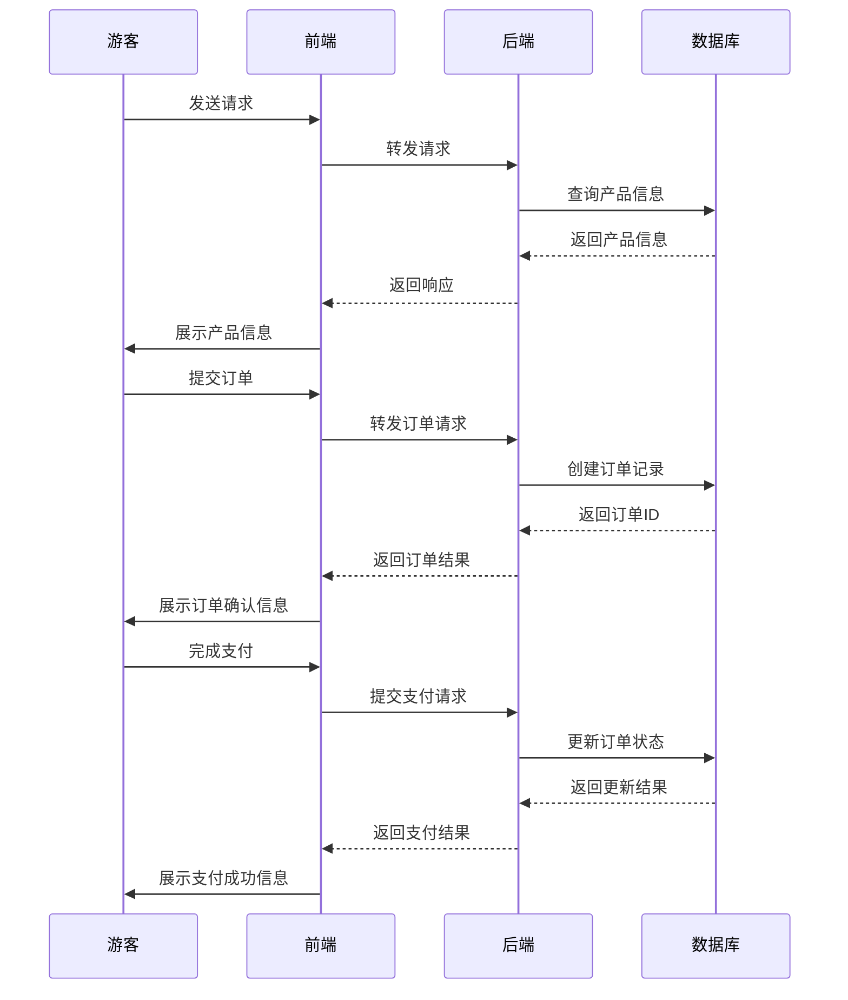

                 

### 1.1 问题的背景与描述

#### 1.1.1 旅游业的发展挑战

旅游业是世界上最具有活力和潜力的产业之一，在全球经济中占有重要地位。然而，随着旅游业的快速发展，也面临一系列的挑战。首先，旅游需求的不稳定性和多样性使得旅游业在服务供给上面临很大的压力。消费者对于旅游体验的需求越来越多样化，不仅希望得到优质的服务，更追求个性化和独特的旅游体验。这要求旅游业必须能够灵活应对市场需求的变化，提供多样化的产品和服务。

其次，旅游业的发展也面临着环境压力。旅游活动不可避免地会对自然环境产生影响，如水体污染、土地侵蚀、生态破坏等。如何实现旅游业的可持续发展，减少对环境的负面影响，成为旅游业发展的重要课题。

再者，随着旅游业的全球化，不同国家和地区之间的旅游竞争日益激烈。如何提升旅游竞争力，吸引更多的游客，成为各国旅游业面临的挑战。此外，旅游业的数字化进程也在不断加速，如何充分利用信息技术，提升旅游服务的质量和效率，也是旅游业亟需解决的问题。

#### 1.1.2 AI技术在旅游领域的应用现状

人工智能（AI）作为一种新兴技术，在旅游业中的应用已逐渐显现。首先，AI技术在旅游服务的自动化和智能化方面发挥了重要作用。例如，智能导游机器人、自动化的酒店服务机器人等，大大提升了旅游服务的效率和质量。通过语音识别、自然语言处理等技术，这些智能设备能够与游客进行有效的交互，提供个性化服务。

其次，AI技术在旅游需求的预测和推荐方面也展现出巨大的潜力。通过大数据分析，AI能够对游客的行为和偏好进行精准分析，预测游客的旅游需求，并提供个性化的旅游推荐。例如，旅游平台可以根据用户的浏览历史、搜索记录等信息，推荐符合用户兴趣的旅游目的地和旅游活动。

此外，AI技术在旅游资源的优化管理上也发挥了重要作用。通过物联网、无人驾驶等技术，AI能够实现旅游资源的智能调度和管理，提高旅游资源的利用效率。例如，智能景区管理系统能够实时监测景区的人流情况，根据人流高峰期调整开放区域，避免拥挤，提升游客的游览体验。

#### 1.1.3 AI赋予旅游业的新变革

AI技术的应用不仅提升了旅游服务的效率和质量，更带来了旅游业全新的变革。首先，AI赋能下的个性化旅游服务成为可能。通过深度学习等技术，AI能够对游客的个性化需求进行精准识别和满足，提供定制化的旅游服务。例如，个性化旅游路线规划、定制化旅游套餐等，满足了消费者对于个性化、差异化旅游体验的追求。

其次，AI技术推动了旅游业的智能化升级。通过物联网、大数据、云计算等技术，旅游业实现了从传统服务模式向智能化服务模式的转变。智能导游、智能酒店、智能景区等新型旅游服务模式的出现，不仅提升了旅游体验，也推动了旅游业的服务创新。

再者，AI技术促进了旅游业的可持续发展。通过环境监测、智能调度等技术，AI能够实现旅游资源的合理利用和保护，减少对环境的负面影响。例如，智能景区管理系统能够实时监测景区的环境状况，及时采取措施，保障景区的生态环境。

总之，AI技术在旅游业中的应用，不仅解决了旅游业面临的诸多挑战，也为旅游业的发展带来了全新的机遇。通过AI技术的赋能，旅游业正朝着更加智能化、个性化、可持续化的方向发展。

### 1.2 问题描述

#### 1.2.1 深度情感体验的需求

在当前的旅游市场中，消费者对于旅游体验的需求正逐渐从简单的观光向更深层次的情感体验转变。深度情感体验不仅包括对旅游目的地的文化、历史、风土人情的深刻理解和感受，还包括在旅行过程中获得的情感共鸣、情感触发和情感满足。这种需求的变化，使得旅游业不再仅仅是一个提供物理空间和服务的行业，而是一个能够触动人心、激发情感的艺术。

首先，深度情感体验需求的产生与现代社会人们的生活节奏加快、工作压力大有关。在日常生活中，人们很少有机会去体验和感受生活中的美好。旅游成为了一种重要的情感释放和情感重建的方式。通过旅行，人们希望能够暂时逃离日常的忙碌和压力，去体验新鲜、独特和有意义的经历，从而获得情感上的满足和放松。

其次，随着旅游业的竞争加剧，消费者对于旅游体验的要求越来越高。传统的旅游服务模式已经无法满足消费者对于个性化和深度体验的需求。为了在激烈的竞争中脱颖而出，旅游业需要通过提供深度情感体验来吸引和留住客户。例如，通过设计独特的旅游活动、讲述动人的旅游故事、提供定制化的旅游服务等方式，激发消费者的情感共鸣。

再者，数字技术的发展也为深度情感体验提供了新的可能性。人工智能（AI）技术的应用，使得旅游服务能够更加精准地理解和满足消费者的情感需求。通过分析消费者的行为数据、情感状态和偏好，AI能够提供个性化的情感体验设计和服务推荐。例如，智能导游机器人可以通过情感分析技术，根据游客的情感状态调整讲解内容和方式，提升游客的旅游体验。

#### 1.2.2 AI赋能下的情感旅游服务

AI赋能下的情感旅游服务，旨在通过人工智能技术，为游客提供更加个性化、情感化、沉浸式的旅游体验。这种服务不仅能够满足消费者对于深度情感体验的需求，还能够提升旅游业的竞争力和服务质量。

首先，AI赋能下的情感旅游服务能够实现个性化的情感体验设计。通过大数据分析和机器学习技术，AI能够对游客的个性、偏好、情感状态进行深入分析，从而提供定制化的情感体验。例如，根据游客的历史旅游记录、兴趣偏好和情感倾向，AI可以为游客推荐符合他们情感需求的旅游活动和景点。

其次，AI赋能下的情感旅游服务能够提供情感化的互动体验。通过语音识别、自然语言处理、计算机视觉等技术，AI能够与游客进行自然、流畅的交互，传递情感和信息。例如，智能导游机器人可以通过语音交互，讲述景点背后的故事，引发游客的情感共鸣；虚拟现实（VR）技术可以带领游客进入虚拟场景，体验异域风情，增强旅游的沉浸感。

再者，AI赋能下的情感旅游服务能够提供沉浸式的情感体验。通过虚拟现实、增强现实（AR）等技术，AI可以为游客创造一个沉浸式的虚拟环境，让游客在虚拟世界中体验真实的旅游场景。例如，通过VR头盔，游客可以“亲临”世界各地的名胜古迹，体验历史文化的魅力；通过AR技术，游客可以在现实世界中“看见”虚拟的信息和内容，获得全新的旅游体验。

总之，AI赋能下的情感旅游服务，不仅能够满足消费者对于深度情感体验的需求，还能够为旅游业带来全新的服务模式和创新。通过AI技术的应用，旅游业将变得更加个性化和情感化，为游客提供更加丰富和难忘的旅游体验。

#### 1.2.3 旅游业的数字化转型

随着信息技术的迅猛发展，旅游业正经历着深刻的数字化转型。数字化转型不仅改变了旅游业的运营模式，还显著提升了旅游服务的效率和质量。旅游业的数字化转型主要包括以下几个方面：

首先，电子商务平台的发展使得在线预订和支付成为旅游业的核心服务。通过互联网和移动应用，游客可以轻松实现旅游产品的在线预订、支付和查询。这不仅方便了游客，也为旅游企业提供了更多的销售渠道和用户数据。

其次，大数据和云计算技术的应用，使得旅游企业能够对大量的用户数据进行实时分析和处理。通过大数据分析，旅游企业可以了解游客的偏好和行为模式，从而提供更加个性化的服务和营销策略。

再者，人工智能（AI）技术在旅游业中的应用，进一步推动了数字化的进程。AI技术可以用于智能客服、个性化推荐、智能导览等方面，提升旅游服务的智能化水平。例如，智能客服机器人可以提供24小时不间断的服务，解决游客在旅行过程中遇到的各种问题；个性化推荐系统可以根据游客的偏好，推荐合适的旅游目的地和活动。

此外，物联网（IoT）技术也在旅游业中得到了广泛应用。通过物联网设备，旅游企业可以实时监测和管理景区的人流、环境等数据，提升旅游服务的效率和安全性。例如，智能景区管理系统能够实时监测景区的人流情况，根据人流高峰期自动调整开放区域，避免拥挤，提升游客的游览体验。

最后，虚拟现实（VR）和增强现实（AR）技术为旅游业带来了全新的体验方式。通过VR和AR技术，游客可以在虚拟环境中体验真实的旅游场景，获得更加丰富的旅游体验。例如，VR旅游应用可以让游客在虚拟世界中“亲临”世界各地的名胜古迹，感受历史文化的魅力。

总之，旅游业的数字化转型不仅提升了旅游服务的效率和质量，也为旅游业带来了全新的商业模式和体验方式。通过数字化转型，旅游业正朝着更加智能化、便捷化、个性化的方向发展。

#### 1.3.1 AI技术在旅游服务中的应用场景

AI技术为旅游服务带来了诸多新的应用场景，极大地丰富了旅游体验。以下是一些典型的AI应用场景及其具体案例分析：

首先，智能导游机器人是AI技术在旅游服务中的一个重要应用。这些机器人能够利用语音识别、自然语言处理和计算机视觉等技术，为游客提供导游服务。例如，智能导游机器人可以在博物馆、历史遗址等场所，通过语音讲解和互动，为游客提供深入的历史和文化知识。具体案例包括某景区推出的智能导游机器人，能够根据游客的语音提问，实时提供相关景点的历史背景和文化故事。

其次，个性化旅行规划是另一个重要的AI应用场景。通过分析游客的历史旅游记录、兴趣爱好和行为数据，AI系统能够为游客提供定制化的旅行规划服务。例如，一些在线旅游平台利用AI算法，根据游客的偏好和预算，自动生成个性化的旅行路线和活动推荐。具体案例如某旅行平台的AI旅行规划服务，能够为游客推荐符合其兴趣和需求的旅游目的地和活动，提升游客的旅游体验。

再者，智能酒店服务也是AI技术在旅游服务中的一个重要应用。智能酒店通过智能门锁、智能房间控制、智能机器人等设备，为游客提供便捷的入住和住宿体验。例如，智能门锁可以通过人脸识别或手机APP实现无钥匙入住，智能房间控制系统可以根据游客的需求自动调节房间内的温度、灯光等。具体案例如某五星级酒店，通过引入智能酒店服务，大大提升了酒店的入住体验和服务质量。

此外，情感分析技术在旅游服务中的应用也日益广泛。通过分析游客的评论、反馈和行为数据，AI系统可以识别游客的情感状态，从而提供针对性的服务和改进措施。例如，某在线旅游平台利用情感分析技术，对游客的评论进行情感分类，识别出游客的不满意原因，并针对性地进行改进，提升用户满意度。

最后，智能推荐系统在旅游推荐中的应用也越来越普遍。通过分析游客的浏览记录、搜索历史和行为数据，AI系统能够为游客推荐符合其兴趣的旅游产品和服务。例如，某旅行平台通过机器学习算法，根据游客的偏好，推荐符合其兴趣的旅游景点、酒店和旅游活动，提升游客的购买转化率。

总之，AI技术在旅游服务中的应用场景丰富多样，不仅提升了旅游体验，还为旅游业带来了新的商业模式和服务创新。

#### 1.3.2 情感体验的设计原则与方法

在AI赋能的旅游服务中，情感体验的设计至关重要。以下将详细探讨情感体验设计的原则、方法及其重要性。

首先，情感体验设计的原则主要包括以下几个方面：

1. **个性化与定制化**：情感体验的设计应充分考虑到游客的个性、偏好和需求，提供个性化的情感服务。通过大数据分析和机器学习技术，AI系统能够对游客的行为和偏好进行深入分析，从而提供定制化的情感体验。

2. **情感共鸣**：情感体验设计应致力于引发游客的情感共鸣，使游客在旅游过程中感受到情感上的共鸣和连接。通过讲述动人的故事、提供独特的体验等方式，激发游客的情感共鸣，提升旅游体验的质量。

3. **沉浸式体验**：情感体验设计应注重创造沉浸式的体验环境。利用虚拟现实（VR）、增强现实（AR）等技术，为游客创造一个沉浸式的情感体验环境，使游客在虚拟世界中体验到真实的情感和体验。

4. **互动性**：情感体验设计应强调与游客的互动性。通过语音识别、自然语言处理等技术，AI系统能够与游客进行自然、流畅的互动，传递情感和信息，提升游客的情感体验。

其次，情感体验设计的方法主要包括以下几种：

1. **情感分析**：通过情感分析技术，AI系统可以识别游客的情感状态，从而提供针对性的情感服务。情感分析技术可以应用于游客的评论、反馈、语音和文本数据中，识别出游客的情感倾向和需求。

2. **情感建模**：通过情感建模技术，AI系统能够模拟和表达情感。例如，智能导游机器人可以通过情感建模，模拟出与游客情感状态相匹配的语言和行为，提升游客的情感体验。

3. **情感触发**：情感触发是指通过特定的设计元素和体验，激发游客的情感反应。例如，在旅游景点设置互动装置，通过互动游戏和故事讲述，引发游客的情感共鸣。

4. **情感反馈**：情感反馈是指通过收集游客的反馈信息，不断优化和改进情感体验设计。通过反馈机制，AI系统可以了解游客的真实情感体验，并根据反馈进行调整和改进。

最后，情感体验设计的重要性体现在以下几个方面：

1. **提升游客满意度**：通过提供个性化、共鸣性和沉浸式的情感体验，提升游客的满意度。研究表明，情感体验越丰富，游客的满意度和忠诚度越高。

2. **增强品牌价值**：情感体验设计有助于提升旅游品牌的形象和价值。通过独特的情感体验，旅游企业能够吸引更多游客，提升品牌知名度和美誉度。

3. **促进旅游业发展**：情感体验设计有助于推动旅游业的创新和发展。通过引入新的技术和体验方式，旅游企业能够提供更具吸引力的产品和服务，促进旅游业的可持续发展。

总之，情感体验设计在AI赋能的旅游服务中具有重要意义。通过个性化、共鸣性、沉浸式和互动性的情感体验设计，AI技术能够为旅游业带来全新的商业模式和用户体验。

#### 1.3.3 旅游业的数字化转型路径

旅游业正在经历一场前所未有的数字化转型，这是由于技术的进步、消费者行为的变化以及市场竞争的压力所驱动的。以下将详细探讨旅游业的数字化转型路径，包括转型的必要性和具体策略。

首先，旅游业的数字化转型是必要的，原因如下：

1. **提升服务质量**：数字化转型有助于提高旅游服务的质量和效率。通过自动化和智能化技术，旅游企业能够提供更加个性化、高效的服务，满足消费者日益多样化的需求。

2. **增强竞争力**：数字化转型有助于旅游企业在激烈的市场竞争中脱颖而出。通过创新的服务模式和高效的运营方式，旅游企业可以更好地吸引和留住客户，提升市场份额。

3. **优化资源配置**：数字化转型有助于优化旅游资源的配置和管理。通过物联网、大数据等技术，旅游企业可以实时监测和管理旅游资源，提高资源利用效率，降低运营成本。

4. **提高用户满意度**：数字化转型有助于提升消费者的旅游体验和满意度。通过提供更加便捷、智能和个性化的服务，旅游企业可以满足消费者对于高质量旅游体验的追求。

其次，旅游业数字转型的具体路径包括以下策略：

1. **构建数字化基础设施**：这是数字转型的第一步，包括搭建数字化平台、升级信息系统、完善网络基础设施等。只有建立了坚实的基础设施，才能支持后续的数字化应用。

2. **引入智能化技术**：在基础设施建设完成后，旅游企业可以引入智能化技术，如人工智能、物联网、大数据等，提升旅游服务的智能化水平。例如，通过人工智能技术，可以实现智能客服、个性化推荐等功能。

3. **优化数字化服务流程**：旅游企业应通过数字化转型，优化服务流程，提高服务效率。例如，通过在线预订、电子支付等数字化服务，简化游客的预订和支付流程，提升用户体验。

4. **实现数据驱动决策**：数字化转型使得旅游企业能够收集和分析大量的用户数据，从而实现数据驱动决策。通过大数据分析，旅游企业可以了解游客的行为和偏好，优化产品和服务。

5. **打造数字化生态系统**：旅游企业应构建一个数字化的生态系统，包括与合作伙伴、供应商、消费者的紧密互动和协同。通过数字化生态系统，旅游企业可以提供更加集成、协同和高效的服务。

6. **加强安全管理**：数字化转型带来了数据安全和隐私保护的新挑战。旅游企业应加强数据安全管理，确保用户数据的安全性和隐私性。

7. **持续创新与改进**：数字化转型是一个持续的过程，旅游企业应保持创新精神，不断引入新的技术和服务模式，以适应市场的变化和消费者需求。

总之，旅游业的数字化转型是一条必经之路，通过构建数字化基础设施、引入智能化技术、优化服务流程、实现数据驱动决策、打造数字化生态系统、加强安全管理和持续创新与改进，旅游企业可以顺利实现数字化转型，提升服务质量和竞争力。

#### 1.4.1 AI在旅游业的应用范围

人工智能（AI）在旅游业中的应用范围广泛，涵盖了从旅游产品的设计、预订、到旅游体验的各个方面。以下详细探讨AI在旅游业中的主要应用领域：

1. **旅游产品推荐**：AI技术通过大数据分析和机器学习算法，能够精准分析游客的浏览记录、搜索历史和行为偏好，从而提供个性化的旅游产品推荐。例如，在线旅游平台利用AI算法，根据游客的兴趣和需求，推荐合适的旅游线路、酒店和活动，提升游客的预订体验。

2. **智能客服**：AI智能客服系统通过自然语言处理和语音识别技术，能够为游客提供24小时不间断的在线咨询服务。智能客服系统可以解答游客的常见问题、处理预订和退订请求，提高服务效率，降低人力成本。

3. **个性化旅行规划**：AI系统可以根据游客的历史旅游记录、兴趣爱好和偏好，自动生成个性化的旅行计划。这种服务不仅能够节省游客的时间，还能够提供更加符合个人需求的旅游体验。

4. **智能导览与互动**：在旅游景区，AI技术可以通过智能导览设备和互动装置，为游客提供沉浸式的导览服务。例如，智能导游机器人能够通过语音和屏幕，为游客讲解景点的历史和文化，增强游客的体验。

5. **智能酒店服务**：智能酒店通过AI技术，提供无钥匙入住、智能房间控制、个性化服务等功能，提升酒店的运营效率和用户体验。例如，智能门锁可以通过人脸识别或手机APP实现无钥匙入住，智能房间系统可以根据游客的偏好自动调节室内温度、灯光等。

6. **环境监测与资源管理**：AI技术可以通过物联网设备，实时监测旅游景区的环境状况，如空气质量、水质、人流密度等，从而优化景区的管理和服务。例如，智能景区管理系统能够根据实时数据，调整开放区域，避免拥挤，提升游客的游览体验。

7. **智能交通规划**：AI技术可以用于智能交通规划，优化旅游线路和交通安排。通过分析交通流量、天气状况等数据，AI系统可以提供最优的旅游交通路线，减少游客的出行时间和交通拥堵。

8. **情感分析与用户体验提升**：AI技术可以通过情感分析，了解游客的情感状态和体验感受。例如，通过分析游客的语音、文本和表情，AI系统可以识别游客的情绪，从而提供针对性的服务和改进措施，提升游客的整体体验。

总之，AI技术在旅游业中的应用不仅提高了服务质量和效率，还为旅游业带来了新的商业模式和创新体验。随着AI技术的不断进步，其应用范围将更加广泛，为旅游业的发展带来更多可能性。

#### 1.4.2 情感体验的界定与测量

情感体验是旅游过程中游客所感受到的情感状态和情绪体验，它不仅仅是对旅游目的地和活动的评价，更是一种深刻的情感共鸣和情感满足。界定和测量情感体验是设计并评估情感旅游服务的关键步骤。以下将详细探讨情感体验的界定与测量方法。

首先，情感体验的界定可以从以下几个方面进行：

1. **情感状态**：情感状态是游客在旅游过程中所感受到的情感，如愉悦、兴奋、焦虑、悲伤等。通过情感分析技术，可以对游客的情感状态进行识别和分类。

2. **情感强度**：情感强度是游客情感体验的深度和强度，可以通过情感分析的强度指标进行量化。例如，使用Likert量表（1-5分）来衡量游客对某一旅游体验的满意度或兴趣度。

3. **情感持续时长**：情感持续时长是指游客在某一情感状态下的持续时间。通过分析游客的情感变化轨迹，可以了解情感体验的持久性和稳定性。

4. **情感触发因素**：情感触发因素是引发游客情感体验的具体因素，如美丽的自然风光、独特的文化体验、与他人的互动等。识别情感触发因素有助于设计更具针对性的情感旅游服务。

其次，情感体验的测量方法主要包括以下几种：

1. **定量测量**：定量测量是通过问卷调查、评分系统等工具，对游客的情感体验进行量化分析。例如，使用Likert量表、情感计分卡等工具，对游客的满意度、兴趣度、情感强度等进行测量。

2. **定性测量**：定性测量是通过深度访谈、焦点小组讨论等手段，深入了解游客的情感体验和主观感受。这种方法有助于挖掘游客的情感细节和深层次需求。

3. **行为测量**：行为测量是通过分析游客在旅游过程中的行为数据，如浏览记录、互动频率、反馈信息等，间接反映游客的情感体验。例如，通过分析游客在社交媒体上的评论和分享，了解其对旅游体验的满意度。

4. **生理测量**：生理测量是通过生理传感器，如心率、血压、皮肤电活动等，检测游客在旅游过程中的生理反应，间接反映其情感体验。例如，通过心率变异性分析，了解游客在不同旅游场景下的情感状态。

总之，情感体验的界定和测量是设计情感旅游服务的重要环节。通过多种测量方法的结合，可以全面、准确地了解游客的情感体验，为优化旅游服务和提升游客满意度提供科学依据。

#### 1.4.3 旅游业的数字化转型边界

旅游业的数字化转型虽然带来了诸多机遇，但也存在一定的边界和限制。以下将探讨数字化转型在旅游业中的边界、可能面临的技术挑战、法律和伦理问题，以及如何克服这些挑战。

首先，旅游业的数字化转型边界主要包括以下几个方面：

1. **技术边界**：数字化转型依赖于人工智能、大数据、物联网等新兴技术。然而，这些技术的成熟度和应用范围仍存在一定的限制。例如，一些偏远地区或基础设施落后的地区，可能难以实现全面的数字化服务。

2. **数据边界**：数字化转型需要大量的数据支持，然而，数据的获取、存储、处理和保护也存在一定的边界。旅游企业需要确保数据的安全性和隐私性，遵守相关的法律法规。

3. **用户体验边界**：尽管数字化服务提供了便捷和个性化，但过度依赖技术也可能导致用户体验的疲劳和不适。如何在技术创新和用户体验之间找到平衡，是数字化转型面临的一个重要问题。

其次，数字化转型在旅游业中可能面临以下技术挑战：

1. **技术整合**：旅游业是一个多元化、复杂化的行业，数字化转型需要整合多种技术，如人工智能、大数据、物联网等。技术整合的复杂度和协调难度较高，需要跨部门的协作和合作。

2. **数据质量**：数字化转型依赖于高质量的数据，然而，数据的准确性、完整性和及时性往往难以保证。数据质量问题可能影响数字化服务的准确性和可靠性。

3. **技术更新**：技术发展日新月异，旅游企业需要不断更新和升级技术，以适应市场的变化。然而，技术更新的成本和风险也较高，需要企业有足够的技术储备和资金支持。

再次，数字化转型在旅游业中可能面临的法律和伦理问题包括：

1. **数据隐私**：数字化转型涉及到大量的用户数据，如何保护用户隐私成为法律和伦理关注的焦点。旅游企业需要遵守相关的数据保护法律法规，如《通用数据保护条例》（GDPR）等。

2. **知识产权**：数字化转型过程中，可能会涉及知识产权的使用和保护问题。旅游企业需要确保合法使用第三方技术和内容，同时保护自己的知识产权。

3. **社会责任**：数字化转型带来的技术进步，也可能引发一些伦理和社会责任问题。例如，智能导游机器人是否会替代人类导游，对就业市场产生何种影响等。

最后，为了克服数字化转型中的挑战，可以采取以下措施：

1. **技术培训与人才培养**：加强员工的技术培训，提升团队的技术能力，是克服技术边界和挑战的关键。同时，培养跨界人才，促进技术创新和跨部门合作。

2. **数据治理**：建立完善的数据治理体系，确保数据的准确性、完整性和及时性。制定数据使用和保护的规章制度，提高数据质量和管理水平。

3. **法律合规**：遵守相关法律法规，确保数据安全和隐私保护。同时，积极参与行业标准和法规的制定，推动数字化转型的发展。

4. **用户调研**：深入了解用户需求，不断优化数字化服务，确保用户体验。通过用户调研和反馈，及时调整和改进数字化服务，提高用户满意度。

5. **社会责任**：在数字化转型过程中，注重社会责任，关注技术对就业、社会和环境的影响。通过积极承担社会责任，提升企业的社会形象和品牌价值。

总之，旅游业的数字化转型虽然面临诸多边界和挑战，但通过合理规划和有效应对，可以充分发挥数字化技术的优势，推动旅游业的发展和创新。

### 1.5.1 AI与情感旅游的概念框架

在探讨AI与情感旅游的关系时，首先需要建立清晰的概念框架，以便更好地理解两者之间的相互作用和影响。以下是对AI与情感旅游概念框架的详细分析。

**AI与情感旅游的定义**

1. **人工智能（AI）**：人工智能是指通过计算机系统实现人类智能功能的科学和技术。它包括机器学习、深度学习、自然语言处理、计算机视觉等多种技术，旨在使计算机能够模拟人类的认知过程，完成复杂任务。

2. **情感旅游**：情感旅游是指以情感体验为核心，通过设计独特的旅游活动和体验，激发游客的情感共鸣，提升旅游体验的质量和深度。情感旅游强调游客在旅游过程中的情感参与和情感满足。

**概念框架的组成部分**

**1. AI技术在情感旅游中的应用**

- **自然语言处理**：通过理解游客的语音、文本输入，AI技术可以提供个性化的导游解说、情感互动等服务。
- **计算机视觉**：利用图像识别技术，AI可以识别游客的情感状态，提供针对性的旅游推荐和服务。
- **机器学习与深度学习**：通过分析大量游客数据，AI技术可以预测游客偏好，实现情感化的旅游路线规划和服务设计。
- **虚拟现实（VR）与增强现实（AR）**：利用VR和AR技术，AI可以为游客创造沉浸式的情感体验，如虚拟探险、互动游戏等。

**2. 情感体验的核心要素**

- **个性化**：通过AI技术，为每位游客提供符合其兴趣和需求的个性化旅游体验。
- **共鸣性**：设计能够引发游客情感共鸣的旅游活动和内容，如讲述动人的故事、展示独特的文化等。
- **沉浸式**：利用AI和VR/AR技术，创造高度沉浸式的旅游体验，让游客仿佛身临其境。
- **互动性**：通过AI与游客的自然互动，增强情感体验的互动性和参与感。

**3. 情感旅游服务的设计原则**

- **情感化设计**：以情感为核心，设计具有情感温度和共鸣性的旅游服务和体验。
- **个性化定制**：基于游客的个性化需求，提供定制化的情感旅游服务。
- **科技与人文的结合**：在科技手段的辅助下，结合人文元素，提供富有情感深度和文化内涵的旅游体验。

**4. 情感旅游服务的实现路径**

- **数据收集与处理**：通过大数据技术，收集游客的旅游行为数据，进行情感分析和个性化推荐。
- **服务设计与实现**：结合AI技术和情感体验设计原则，开发智能导游、个性化推荐、沉浸式体验等情感旅游服务。
- **用户体验优化**：通过用户反馈和持续改进，优化情感旅游服务的质量和效果。

**概念框架的重要性**

**1. 统一概念理解**：通过构建AI与情感旅游的概念框架，可以帮助相关领域的研究人员和从业人员统一对AI与情感旅游的理解，减少沟通和认知上的偏差。

**2. 促进技术创新**：概念框架有助于明确AI技术在情感旅游中的应用方向，推动相关技术的研究和创新。

**3. 提升服务质量**：通过概念框架，旅游企业可以更好地设计并提供个性化的情感旅游服务，提升游客的满意度和忠诚度。

**4. 支持战略规划**：概念框架为旅游业提供了指导性的方向和策略，有助于旅游企业制定数字化转型和情感体验提升的战略规划。

综上所述，AI与情感旅游的概念框架不仅为理解两者之间的关系提供了理论基础，也为旅游业的发展和创新提供了实践指导。

#### 1.5.2 旅游业数字转型的核心要素

在探讨旅游业数字转型的核心要素时，我们需要关注以下几个关键组成部分：数据管理、用户参与、技术基础设施和创新文化。这些要素相互关联，共同推动了旅游业的数字化转型。

**1. 数据管理**

数据管理是数字化转型的基础。旅游业产生的大量数据，包括游客行为数据、预订数据、反馈数据等，对于提高服务质量和个性化推荐至关重要。有效的数据管理涉及以下几个方面：

- **数据收集**：通过在线平台、移动应用和物联网设备，收集游客的行为数据和反馈信息。
- **数据存储**：利用云计算和数据仓库技术，确保数据的安全存储和高效管理。
- **数据分析**：运用大数据分析技术，对收集到的数据进行分析，提取有价值的信息和洞察。
- **数据安全**：确保数据的隐私和安全，遵守数据保护法规，如《通用数据保护条例》（GDPR）。

**2. 用户参与**

用户参与是数字化转型成功的核心。通过增强用户参与，旅游企业可以更好地了解用户需求，提供个性化服务，并建立长期的客户关系。以下是实现用户参与的一些关键措施：

- **互动平台**：建立用户互动平台，如社交媒体、在线社区等，促进用户之间的交流。
- **反馈机制**：建立有效的用户反馈机制，收集用户的意见和建议，不断改进产品和服务。
- **用户个性化**：利用用户数据，为用户提供个性化的体验和服务，如推荐符合用户兴趣的旅游目的地和活动。
- **用户教育**：通过教育和引导，提高用户对数字化服务的认知和接受度。

**3. 技术基础设施**

技术基础设施是数字化转型的重要支撑。一个强大的技术基础设施可以确保数字化服务的稳定运行和高效管理。以下是旅游业数字化转型所需的关键技术基础设施：

- **云计算**：通过云计算，实现数据的存储、处理和分析，提高数据访问速度和灵活性。
- **物联网**：利用物联网技术，实现设备间的互联互通，提升旅游服务的智能化水平。
- **大数据平台**：建立大数据平台，支持海量数据的存储、处理和分析，为个性化推荐和精准营销提供支持。
- **网络安全**：确保网络安全，保护用户数据和企业信息的安全，防止数据泄露和黑客攻击。

**4. 创新文化**

创新文化是数字化转型成功的动力。一个创新文化能够激发员工的创造力，推动技术和服务创新。以下是建设创新文化的关键措施：

- **开放思维**：鼓励员工开放思维，勇于尝试新的想法和解决方案。
- **培训与教育**：提供持续的技术和业务培训，提升员工的技术能力和创新意识。
- **激励机制**：建立激励机制，奖励创新成果，激发员工的创新热情。
- **跨部门合作**：推动跨部门合作，促进不同部门之间的知识共享和资源整合。

**综合作用**

这些核心要素相互关联，共同作用，推动旅游业的数字化转型。数据管理提供了决策的基础，用户参与增强了客户黏性，技术基础设施确保了服务的稳定和高效，创新文化则推动了持续的技术和服务创新。通过这些核心要素的综合作用，旅游业能够实现数字化转型的目标，提供更加个性化和高质量的旅游体验。

### 1.5.3 AI赋能下的旅游业发展要素

在AI技术的赋能下，旅游业的发展要素发生了显著的变化，主要体现在用户体验、技术创新和商业模式三个方面。以下将详细探讨这些要素及其相互关系。

**1. 用户体验**

用户体验是旅游业的核心，AI技术通过个性化、智能化的方式显著提升了用户体验。首先，AI技术能够根据游客的历史数据和偏好，提供定制化的旅游服务。例如，通过个性化推荐系统，AI可以根据游客的喜好推荐旅游目的地、酒店和活动，使游客能够获得更加符合个人需求的旅游体验。其次，AI技术通过智能客服和虚拟导游等服务，提升了用户服务的质量和效率。智能客服系统能够24小时在线解答游客的疑问，提供实时、个性化的支持。虚拟导游则通过语音和图像交互，为游客提供沉浸式的导览体验，使游客在旅游过程中能够更好地了解景点的历史和文化。

**2. 技术创新**

技术创新是推动旅游业发展的关键动力。AI技术在旅游业中的应用，不仅提高了服务的质量和效率，也带来了新的商业模式和服务创新。首先，AI技术推动了旅游服务的智能化升级。例如，通过智能导游机器人和自动化酒店服务，AI技术能够实现旅游服务的自动化和高效化。其次，AI技术在旅游资源的优化管理中也发挥了重要作用。通过物联网和大数据分析，AI技术能够实时监测和管理旅游资源，提高资源的利用效率。例如，智能景区管理系统能够根据实时人流数据，动态调整景区的开放区域和运营策略，避免拥挤，提升游客的游览体验。此外，AI技术还推动了虚拟现实（VR）和增强现实（AR）在旅游中的应用。通过VR和AR技术，游客可以在虚拟环境中体验真实的旅游场景，获得更加丰富和独特的旅游体验。

**3. 商业模式**

AI技术的赋能，也为旅游业带来了新的商业模式。首先，AI技术使得旅游产品和服务更加个性化，推动了定制化旅游的发展。通过AI算法和大数据分析，旅游企业能够为游客提供量身定制的旅游产品和服务，满足不同游客的需求，提升客户满意度。其次，AI技术促进了旅游行业的跨界合作。例如，旅游企业可以与科技公司、酒店、餐饮、交通等行业的合作伙伴合作，共同开发和推广新的旅游产品和服务，实现资源共享和共赢。此外，AI技术还推动了共享经济的发展。通过共享平台，旅游企业可以整合社会资源，提供更加多样化和灵活的旅游服务，满足不同游客的个性化需求。

**相互关系**

用户体验、技术创新和商业模式三者之间相互关联，共同推动旅游业的发展。用户体验是旅游业的出发点，是评价旅游业服务质量的重要标准。技术创新则是提升用户体验的关键，通过引入新技术和服务模式，旅游企业能够提供更加个性化和高质量的旅游体验。商业模式则是旅游业发展的可持续动力，通过创新商业模式，旅游企业可以更好地满足用户需求，提升竞争力，实现可持续发展。用户体验、技术创新和商业模式相互促进，共同推动旅游业向更加智能化、个性化、可持续化的方向发展。

### 2.1 AI技术在旅游服务中的应用

#### 2.1.1 人工智能的定义与分类

人工智能（AI）是计算机科学的一个分支，旨在通过构建智能体（agents）模拟人类智能行为，使其能够执行复杂的任务并做出决策。人工智能可以分为多种类型，根据其实现方式和技术特点，大致可以分为以下几类：

1. **弱人工智能（Weak AI）**：也称为狭义人工智能，是指专注于特定任务的人工智能系统，如语音识别、图像识别、智能客服等。这类AI系统通常只能在特定领域内表现良好，不具备通用智能。

2. **强人工智能（Strong AI）**：又称为通用人工智能（AGI），是指具有人类级别的智能，能够理解、学习、推理和解决各种复杂问题的系统。目前，强人工智能尚处于研究阶段，尚未实现。

3. **弱人工智能**：
   - **专家系统（Expert Systems）**：基于特定领域专家的知识和经验，通过规则推理进行问题解决的系统。
   - **自然语言处理（NLP）**：研究如何让计算机理解和生成自然语言，包括语音识别、语言翻译、文本分析等。
   - **机器学习（Machine Learning）**：通过数据训练模型，使计算机能够自动识别模式、进行预测和决策的技术，包括监督学习、无监督学习和强化学习等。

4. **强人工智能**：
   - **通用智能体（General Agent）**：具备跨领域学习、理解和推理能力的人工智能系统，能够在多种不同场景下自主执行任务。
   - **认知计算（Cognitive Computing）**：模拟人类思维过程的人工智能技术，包括情感识别、记忆、学习等。

#### 2.1.2 机器学习的基本原理

机器学习是人工智能的核心组成部分，其基本原理是通过训练模型，使计算机具备从数据中学习和预测的能力。机器学习可以分为以下几种主要类型：

1. **监督学习（Supervised Learning）**：在有标注的数据集上进行训练，目标是学习输入与输出之间的映射关系。常见的算法包括线性回归、逻辑回归、支持向量机（SVM）、决策树和随机森林等。

2. **无监督学习（Unsupervised Learning）**：在无标注的数据集上进行训练，主要任务包括聚类、降维和异常检测等。常见的算法有K-均值聚类、主成分分析（PCA）、自编码器和异常检测算法等。

3. **强化学习（Reinforcement Learning）**：通过奖励机制，让智能体在环境中进行学习，目标是最大化长期奖励。常见的算法包括Q-学习、深度Q网络（DQN）和策略梯度等。

机器学习的过程通常包括以下几个步骤：

1. **数据收集**：收集用于训练的数据集，确保数据的质量和多样性。
2. **数据预处理**：对数据进行清洗、归一化、特征提取等处理，以提高模型训练的效果。
3. **模型选择**：根据问题的特点，选择合适的机器学习算法和模型结构。
4. **模型训练**：利用训练数据集，对模型进行训练，调整模型的参数。
5. **模型评估**：使用测试数据集评估模型的性能，调整模型参数，优化模型。
6. **模型部署**：将训练好的模型部署到实际应用中，进行预测和决策。

#### 2.1.3 深度学习与神经网络

深度学习是机器学习的一种重要分支，它通过构建多层神经网络，实现自动特征提取和复杂模式识别。深度学习的基本原理如下：

1. **神经网络（Neural Networks）**：神经网络由多个神经元（节点）组成，每个神经元通过权重连接其他神经元。神经网络通过学习输入数据的特征和模式，进行复杂的非线性映射。

2. **深度神经网络（Deep Neural Networks）**：深度神经网络包含多个隐藏层，相比单层神经网络，具有更强的特征提取和模式识别能力。深度神经网络通过逐层学习，逐渐提取数据的高级特征。

3. **激活函数（Activation Function）**：激活函数是神经网络中的一个关键组件，用于引入非线性特性。常见的激活函数包括sigmoid函数、ReLU函数和Tanh函数等。

4. **反向传播算法（Backpropagation Algorithm）**：反向传播算法是训练深度神经网络的关键算法，通过反向传播误差，更新网络的权重和偏置，优化模型性能。

深度学习在旅游服务中的应用主要包括：

1. **个性化推荐系统**：通过深度学习算法，分析游客的历史行为数据，预测游客的兴趣和偏好，提供个性化的旅游推荐。

2. **情感分析**：利用深度学习模型，对游客的评论、反馈和表情进行分析，识别游客的情感状态，优化旅游服务和体验。

3. **图像识别与处理**：通过深度学习算法，对旅游景点的图像进行处理和分析，识别景点特征，提供智能导览和推荐服务。

4. **智能导览系统**：结合深度学习和语音识别技术，开发智能导览机器人，为游客提供语音和图像结合的导览服务。

总之，人工智能、机器学习和深度学习在旅游服务中具有广泛的应用前景，通过这些技术，可以实现个性化、智能化的旅游服务，提升用户体验，推动旅游业的发展和创新。

#### 2.2 情感旅游的概念与特点

情感旅游是一种以情感体验为核心的旅游形式，强调游客在旅游过程中所获得的情感共鸣、情感触发和情感满足。情感旅游不仅仅是对旅游目的地的物质层面的欣赏，更是一种深层次的情感体验。以下将详细探讨情感旅游的概念及其特点。

**1. 概念**

情感旅游（Affective Tourism）是指以游客的情感需求为核心，通过独特的旅游活动和体验设计，激发游客的情感共鸣，提升旅游体验的质量和深度。情感旅游关注游客在旅游过程中的情感参与和情感满足，旨在为游客提供一种富有情感温度和共鸣性的旅游体验。

**2. 特点**

（1）**个性化**：情感旅游强调根据游客的个性化需求，设计个性化的旅游活动和体验。通过大数据分析和人工智能技术，了解游客的偏好和情感状态，提供量身定制的旅游服务。

（2）**共鸣性**：情感旅游致力于激发游客的情感共鸣，通过讲述动人的故事、展示独特的文化、提供情感化的互动体验，让游客在旅游过程中产生情感上的共鸣和连接。

（3）**沉浸式**：情感旅游通过虚拟现实（VR）、增强现实（AR）等技术，创造高度沉浸式的体验环境，使游客仿佛身临其境。这种沉浸式的体验能够显著提升游客的情感体验。

（4）**互动性**：情感旅游注重与游客的互动性，通过智能导览机器人、虚拟导游等智能设备，提供互动性的情感体验。游客可以通过语音、图像等方式与旅游服务系统进行互动，获得更加丰富的旅游体验。

**3. 应用场景**

情感旅游的应用场景广泛，以下是一些典型的应用场景：

（1）**文化旅游**：通过讲述历史故事、展示文化传统，激发游客对目的地的文化兴趣和情感共鸣。例如，利用虚拟现实技术，让游客“亲临”历史事件的发生现场，体验历史文化的魅力。

（2）**生态旅游**：通过生态保护活动、自然体验项目，激发游客对自然环境的情感共鸣和保护意识。例如，利用情感分析技术，了解游客对自然景观的情感反应，提供针对性的保护措施和体验活动。

（3）**城市旅游**：通过展示城市的历史、文化、艺术，激发游客对城市的情感认同和喜爱。例如，利用增强现实技术，为游客提供城市文化导览，使游客在游览过程中感受到城市的魅力。

（4）**主题公园**：通过设计独特的主题体验项目，激发游客的情感共鸣和娱乐体验。例如，利用虚拟现实技术，为游客提供沉浸式的主题游戏和互动体验。

总之，情感旅游通过个性化、共鸣性、沉浸式和互动性的设计，为游客提供深层次的情感体验，满足游客对于情感共鸣和情感满足的需求。随着人工智能技术的不断发展，情感旅游的应用场景将更加丰富，为旅游业带来新的发展机遇。

#### 2.2.2 情感旅游的特点

情感旅游作为一种新兴的旅游形式，与传统旅游相比具有独特的特点。这些特点不仅反映了游客对旅游体验的新需求，也体现了旅游业发展的新趋势。以下将详细分析情感旅游的四大核心特点：

1. **个性化**：情感旅游强调根据游客的个性化需求，提供量身定制的旅游服务和体验。传统的旅游服务往往以大众化的方式运作，难以满足个体游客的多样化需求。而情感旅游通过大数据分析和人工智能技术，能够深入了解游客的兴趣、偏好和情感状态，从而提供个性化的旅游建议和安排。例如，一些在线旅游平台通过分析游客的浏览历史和评论，为游客推荐符合其兴趣的旅游目的地和活动，使游客能够享受到更加符合个人口味的旅游体验。

2. **共鸣性**：情感旅游的核心在于激发游客的情感共鸣，使游客在旅游过程中产生深层次的情感连接。传统旅游更多关注的是景点的物质层面，而情感旅游则通过独特的活动设计和故事讲述，使游客在情感上与目的地产生共鸣。例如，在文化旅游中，通过深入挖掘目的地的历史和文化，讲述动人的故事，让游客在游览过程中不仅看到了风景，更感受到了目的地的情感内涵。这种共鸣性体验能够显著提升游客的满意度和忠诚度。

3. **沉浸式**：情感旅游通过虚拟现实（VR）、增强现实（AR）等技术，创造高度沉浸式的体验环境，使游客仿佛身临其境。传统旅游通常局限于物理空间，而情感旅游则通过科技手段，突破空间限制，为游客提供更加丰富和真实的体验。例如，通过VR技术，游客可以“亲临”世界各地的名胜古迹，体验历史文化的魅力；通过AR技术，游客可以在现实世界中“看见”虚拟的信息和内容，获得全新的旅游体验。这种沉浸式体验不仅能够提升游客的满意度，还能够为旅游目的地带来更多的游客和收入。

4. **互动性**：情感旅游注重与游客的互动性，通过智能设备和服务系统，提供互动性的情感体验。传统旅游往往以单向的观赏和体验为主，而情感旅游则通过智能导览机器人、虚拟导游等智能设备，与游客进行自然、流畅的互动。例如，智能导游机器人可以通过语音和图像，为游客提供实时、个性化的导游服务；虚拟导游则通过虚拟场景，带领游客探索未知的领域，增强旅游的互动性和趣味性。这种互动性体验能够显著提升游客的参与感和满意度。

总之，情感旅游通过个性化、共鸣性、沉浸式和互动性的设计，为游客提供深层次的情感体验，满足游客对于情感共鸣和情感满足的需求。随着科技的不断进步和旅游业的发展，情感旅游的应用场景将更加广泛，为旅游业带来新的机遇和挑战。

#### 2.2.3 情感旅游的服务需求

情感旅游的兴起，反映了消费者对旅游体验的新需求。这些需求不仅影响了旅游服务的提供方式，也推动了旅游业的创新和发展。以下将详细探讨情感旅游的服务需求，分析游客在情感旅游中的主要需求和期望。

首先，情感旅游的服务需求可以从以下几个方面进行描述：

1. **情感共鸣**：情感旅游的核心在于激发游客的情感共鸣。游客希望在旅游过程中能够体验到与目的地深层次的情感连接，感受到文化的魅力和历史的故事。因此，旅游服务需要通过独特的设计和体验，让游客在情感上与目的地产生共鸣。例如，通过讲述动人的故事、展示独特的文化、提供沉浸式的体验项目，使游客在游览过程中不仅看到风景，更感受到目的地的情感内涵。

2. **个性化体验**：随着旅游需求的多样化，游客对于旅游体验的个性化需求日益增加。情感旅游服务需要根据游客的兴趣、偏好和需求，提供量身定制的体验。例如，通过大数据分析和人工智能技术，了解游客的喜好和情感状态，提供个性化的旅游推荐和安排。这种个性化服务不仅能够满足游客的多样化需求，还能够提升游客的满意度和忠诚度。

3. **沉浸式体验**：情感旅游强调通过科技手段创造高度沉浸式的体验环境。游客希望在旅游过程中能够全身心地投入，仿佛身临其境。因此，旅游服务需要利用虚拟现实（VR）、增强现实（AR）等先进技术，提供沉浸式的体验项目。例如，通过VR技术，游客可以“亲临”世界各地的名胜古迹，体验历史文化的魅力；通过AR技术，游客可以在现实世界中“看见”虚拟的信息和内容，获得全新的旅游体验。

4. **互动性服务**：情感旅游注重与游客的互动性，通过智能设备和服务系统，提供互动性的情感体验。游客希望在旅游过程中能够与旅游服务系统进行自然、流畅的互动，获得更加丰富和个性化的服务。例如，通过智能导游机器人、虚拟导游等智能设备，游客可以随时获取目的地信息、进行互动问答，提升旅游的互动性和趣味性。

其次，游客在情感旅游中的主要需求和期望可以概括为以下几点：

1. **情感满足**：游客希望在旅游过程中获得情感上的满足和放松，暂时逃离日常生活的压力和忙碌。因此，旅游服务需要提供能够引发游客情感共鸣的体验项目，让游客在游览过程中感受到愉悦和满足。

2. **文化体验**：游客希望能够在旅游过程中深入了解目的地的文化、历史和风土人情。因此，旅游服务需要通过独特的文化体验项目，让游客在游览过程中感受到文化的魅力和历史的故事。

3. **科技赋能**：游客希望利用科技手段，获得更加丰富和真实的旅游体验。因此，旅游服务需要引入先进的科技手段，如VR、AR、AI等，创造高度沉浸式的体验环境，提升旅游的互动性和趣味性。

4. **个性化服务**：游客希望旅游服务能够根据其兴趣和需求，提供个性化的体验项目和建议。因此，旅游服务需要通过大数据分析和人工智能技术，了解游客的喜好和情感状态，提供量身定制的旅游服务。

总之，情感旅游的服务需求反映了消费者对旅游体验的新期待。通过提供个性化的、共鸣性的、沉浸式的和互动性的旅游服务，情感旅游能够满足游客的情感需求，提升游客的满意度和忠诚度。随着科技的不断进步和旅游业的发展，情感旅游的服务需求将不断演变，为旅游业带来新的机遇和挑战。

#### 2.3.1 数字化转型概述

数字化转型是旅游业未来发展的重要趋势，它不仅改变了传统旅游业的运营模式，还带来了新的商业模式和用户体验。数字化转型是指在信息技术和数字技术的推动下，企业通过引入新的技术和流程，实现从传统业务模式向数字化、智能化、数据驱动的模式转变。以下将详细探讨数字化转型在旅游业中的背景、目标、驱动因素及其对旅游业的影响。

**1. 背景**

旅游业是一个高度依赖物理场所和人际互动的行业，传统的运营模式主要依赖于人力和传统的管理手段。然而，随着信息技术的飞速发展，特别是互联网、大数据、人工智能、物联网等新兴技术的普及，旅游业开始面临巨大的变革压力。数字化转型成为旅游业提升服务质量、提高运营效率、降低成本、增强竞争力的必然选择。

**2. 目标**

数字化转型在旅游业中的目标主要包括以下几个方面：

- **提升服务质量**：通过数字化技术，提供更加个性化和高效的旅游服务，满足游客对高质量旅游体验的需求。
- **优化运营效率**：通过自动化和智能化技术，优化旅游业务的运营流程，提高运营效率，降低运营成本。
- **增强竞争力**：通过创新和数字化手段，提升旅游企业的核心竞争力，在激烈的市场竞争中脱颖而出。
- **数据驱动决策**：通过大数据分析和人工智能技术，实现数据驱动的决策，提升决策的精准性和效率。
- **提升用户体验**：通过数字化技术，提供更加丰富和互动的旅游体验，增强游客的满意度和忠诚度。

**3. 驱动因素**

数字化转型在旅游业中的驱动因素主要包括：

- **技术进步**：随着互联网、大数据、人工智能等技术的不断进步，为旅游业提供了丰富的数字化工具和平台，推动了数字化转型的进程。
- **消费者需求**：随着消费者对个性化、便捷化和高质量旅游体验的需求不断增加，传统旅游模式难以满足这些需求，推动旅游业向数字化转型。
- **市场竞争**：旅游业竞争日益激烈，数字化转型的企业能够在服务质量、运营效率、用户体验等方面占据优势，提升市场竞争力。
- **政策支持**：各国政府和国际组织纷纷出台支持数字化转型的政策，为旅游业提供政策和资金支持，推动数字化转型的实施。

**4. 对旅游业的影响**

数字化转型对旅游业产生了深远的影响，主要体现在以下几个方面：

- **商业模式创新**：数字化转型催生了新的商业模式，如在线旅游平台、智慧旅游城市等，改变了传统旅游业的商业模式。
- **服务模式升级**：通过数字化技术，旅游业实现了服务模式的升级，如智能导览、个性化推荐、智能客服等，提升了旅游服务的质量和效率。
- **运营效率提升**：通过自动化和智能化技术，旅游业实现了运营流程的优化，提高了运营效率，降低了运营成本。
- **用户体验优化**：通过数字化技术，旅游业提供了更加丰富和互动的旅游体验，增强了游客的满意度和忠诚度。
- **数据驱动决策**：通过大数据分析和人工智能技术，旅游业实现了数据驱动的决策，提高了决策的精准性和效率。

总之，数字化转型是旅游业未来发展的重要趋势，它不仅改变了旅游业的运营模式，还为旅游业带来了新的发展机遇。通过数字化转型，旅游业可以提升服务质量、优化运营效率、增强市场竞争力和提升用户体验，实现可持续发展。

#### 2.3.2 旅游业的数字化服务

数字化的旅游服务已经成为现代旅游业的重要组成部分，它通过互联网和信息技术，为游客提供便捷、高效、个性化的旅游体验。以下将详细探讨旅游业的数字化服务的内涵、具体形式及其优势。

**1. 数字化服务的内涵**

数字化服务是指利用互联网、大数据、人工智能等信息技术，为游客提供的在线服务和体验。数字化服务不仅包括线上预订、支付、信息查询等基本功能，还包括个性化推荐、智能客服、虚拟导览等高级服务。数字化服务的核心是充分利用数据和技术，提升旅游服务的效率和质量。

**2. 具体形式**

（1）**在线预订与支付**：游客可以通过在线旅游平台、官方网站等渠道，轻松实现旅游产品的在线预订和支付。这种方式不仅方便了游客，还提高了旅游企业的运营效率。

（2）**信息查询与服务**：通过数字化服务，游客可以方便地查询旅游目的地的交通、住宿、景点等信息，获取实时更新的旅游资讯。例如，通过旅游APP或网站，游客可以查看景区的实时人流、天气情况等，提前规划行程。

（3）**个性化推荐**：利用大数据分析和人工智能技术，旅游平台可以为游客提供个性化的旅游推荐。根据游客的历史浏览记录、搜索行为和偏好，平台可以推荐符合游客兴趣的旅游目的地、景点和活动。

（4）**智能客服**：通过智能客服系统，游客可以实时在线获取帮助和解答疑问。智能客服系统能够通过语音识别、自然语言处理等技术，与游客进行自然、流畅的交互，提供24小时不间断的服务。

（5）**虚拟导览与互动**：利用虚拟现实（VR）和增强现实（AR）技术，旅游企业可以为游客提供虚拟导览服务。通过VR头盔或AR应用，游客可以在虚拟环境中体验真实的旅游场景，获得更加丰富和真实的旅游体验。

**3. 优势**

（1）**提升服务效率**：数字化服务通过自动化和智能化手段，大大提高了旅游服务的效率。例如，在线预订和支付系统可以自动处理大量的订单，减少人力成本和错误率。

（2）**增强用户体验**：数字化服务为游客提供了更加便捷和个性化的体验。游客可以根据自己的需求和偏好，自由选择旅游产品和服务，获得更加满足个人需求的旅游体验。

（3）**降低运营成本**：数字化服务减少了传统服务模式中的人力成本和运营成本。通过线上预订和支付，旅游企业可以节省大量的纸质资源和物流成本。

（4）**提高服务质量**：数字化服务通过数据分析和技术手段，能够实时监测和改进服务质量。例如，通过用户反馈和评价，旅游企业可以及时发现并解决服务中的问题，提升整体服务质量。

（5）**促进服务创新**：数字化服务为旅游业带来了新的服务形式和商业模式。通过引入新技术和创意，旅游企业可以不断推出新的服务和产品，满足消费者不断变化的需求。

总之，旅游业的数字化服务不仅提升了旅游服务的效率和质量，还为旅游业带来了新的发展机遇。随着数字技术的不断进步，数字化服务将在旅游业中发挥越来越重要的作用，推动旅游业向更加智能化、个性化、可持续化的方向发展。

#### 2.3.3 数据驱动与智慧旅游

数据驱动和智慧旅游是当前旅游业数字化转型的两个重要概念，它们相互关联，共同推动旅游业的创新和发展。以下将详细探讨数据驱动的定义、原理及其在智慧旅游中的应用。

**1. 数据驱动的定义与原理**

数据驱动是指通过收集、处理和分析大量的数据，指导业务决策和运营管理的理念和方法。数据驱动的核心在于利用数据提供的信息和洞察，优化决策过程，提高运营效率，增强市场竞争力。

- **数据收集**：数据驱动首先依赖于大量的数据收集。这些数据可以来自多个渠道，如在线预订系统、用户反馈、社交媒体、传感器等。通过数据收集，旅游企业能够获取关于游客行为、偏好、需求等方面的详细信息。

- **数据处理**：收集到的数据需要经过清洗、整理和分析，以便提取有价值的信息。数据处理包括数据预处理、数据融合、数据挖掘等技术手段，目的是确保数据的质量和可用性。

- **数据分析**：通过对处理后的数据进行深入分析，旅游企业可以挖掘数据背后的规律和趋势。数据分析可以用于客户细分、需求预测、市场洞察、运营优化等方面。

- **数据可视化**：为了更好地理解和传达数据分析的结果，需要通过数据可视化技术将数据转化为图表、报表等形式。数据可视化可以帮助决策者更直观地理解数据，发现潜在的机遇和问题。

**2. 智慧旅游的应用**

智慧旅游是指利用信息技术，特别是物联网、大数据、云计算、人工智能等，提升旅游服务质量、优化旅游资源管理、增强游客体验的新型旅游模式。

- **智能导览与互动**：通过数据驱动，智慧旅游可以实现智能导览和互动体验。例如，利用AR技术，游客可以在现实环境中看到与历史事件相关的虚拟图像和信息；智能导览系统可以根据游客的位置和兴趣，提供个性化的导览服务。

- **个性化推荐**：利用大数据分析，智慧旅游可以为游客提供个性化的旅游推荐。例如，根据游客的历史行为和偏好，推荐符合其兴趣的旅游目的地、景点和活动。

- **智慧交通规划**：通过实时数据分析，智慧旅游可以实现智能交通规划，优化游客的出行体验。例如，根据实时的人流和交通数据，智能调度系统可以推荐最佳出行路线，减少游客的等待时间。

- **环境监测与管理**：智慧旅游可以通过物联网设备，实时监测旅游景区的环境状况，如空气质量、水质、噪音等。通过数据驱动，景区管理者可以及时采取措施，保障景区的生态环境。

- **智慧酒店服务**：在酒店业中，智慧旅游可以通过数据驱动，提供个性化的客房服务。例如，根据游客的偏好，智能酒店系统可以自动调整房间温度、灯光等，提升游客的入住体验。

**3. 数据驱动与智慧旅游的关系**

数据驱动是智慧旅游的核心驱动力。数据驱动不仅提供了决策依据，还推动了智慧旅游的发展和创新。以下是一些关键关系：

- **数据驱动的决策**：智慧旅游的运营和管理依赖于数据驱动的决策。通过数据分析，旅游企业可以更准确地预测市场需求、优化资源配置、提升服务质量。

- **数据驱动的创新**：数据驱动促使旅游企业不断探索和创新，开发新的服务和产品。例如，通过数据分析，旅游企业可以识别游客的新需求，推出符合市场趋势的旅游产品。

- **数据驱动的用户体验**：智慧旅游通过数据驱动，为游客提供个性化、高效、愉悦的旅游体验。数据驱动的个性化推荐和智能服务，使游客能够获得更加定制化的旅游体验。

- **数据驱动的可持续发展**：智慧旅游通过数据驱动，实现了旅游资源的合理利用和保护。例如，通过实时监测和数据分析，旅游企业可以优化景区管理，减少对环境的影响，实现旅游业的可持续发展。

总之，数据驱动和智慧旅游相互促进，共同推动了旅游业的数字化转型和创新发展。通过数据驱动，智慧旅游能够实现更加智能、高效、个性化的旅游服务，提升游客的满意度和忠诚度，推动旅游业的可持续发展。

### 2.3.4 数据收集与分析的方法

在情感旅游服务的设计和实施过程中，数据收集和分析是至关重要的环节。以下将详细探讨数据收集与分析的方法，包括数据收集、处理和分析的步骤、常见的数据分析工具和技术。

**1. 数据收集**

数据收集是数据分析和挖掘的第一步，需要确保数据的准确性和完整性。数据收集的渠道和方式主要包括：

- **在线平台和应用程序**：通过旅游平台、社交媒体、在线评论网站等，收集游客的预订记录、评论、反馈和互动数据。这些数据可以提供关于游客行为、偏好和体验的宝贵信息。
- **物联网设备**：通过在景区、酒店等场所部署传感器和智能设备，收集环境数据、游客流量和设备使用情况。例如，通过智能门锁和摄像头，收集游客的访问时间和行为轨迹。
- **问卷调查和访谈**：通过在线问卷调查、电话访谈或面对面访谈，收集游客的直接反馈和体验感受。这种方法有助于深入了解游客的情感状态和需求。

**2. 数据处理**

数据收集后，需要进行处理以确保数据的质量和可用性。数据处理的主要步骤包括：

- **数据清洗**：通过去除重复数据、填补缺失值、去除异常值等方法，清洗原始数据，提高数据的准确性和一致性。
- **数据融合**：将来自不同来源和格式的数据进行整合，构建统一的数据仓库。数据融合可以确保数据的一致性和完整性，为后续的分析提供可靠的基础。
- **数据标准化**：对数据进行归一化、标准化处理，使其符合统一的度量标准和格式。标准化的数据便于分析和比较，提高分析结果的可靠性。

**3. 数据分析**

数据分析是挖掘数据价值的关键步骤，主要包括以下几种方法：

- **描述性分析**：通过统计分析方法，描述数据的基本特征和分布情况。描述性分析可以提供关于游客行为、偏好和体验的总体概述，为后续分析提供背景信息。
- **预测性分析**：利用机器学习和统计模型，预测未来的游客行为和需求。预测性分析可以帮助旅游企业提前规划和优化旅游服务，提高客户满意度。
- **相关性分析**：通过分析不同变量之间的关系，识别影响游客体验的关键因素。相关性分析可以帮助旅游企业了解游客需求和行为之间的关联，优化服务设计。
- **聚类分析**：将相似的数据点归为同一类别，识别游客群体的特征和偏好。聚类分析有助于实现个性化推荐和服务设计，提升游客的满意度。

**4. 常见的数据分析工具和技术**

在数据分析和挖掘过程中，常用的工具和技术包括：

- **Python**：Python是一种功能强大的编程语言，广泛应用于数据分析和机器学习。Python拥有丰富的数据分析库，如Pandas、NumPy、Scikit-learn等，可以方便地进行数据预处理、分析和建模。
- **R语言**：R语言是一种专门用于统计分析和图形表示的语言，广泛应用于数据分析和生物信息学。R语言提供了大量的统计分析和图形工具，适用于复杂的数据分析任务。
- **SQL**：SQL（结构化查询语言）是用于数据库管理和数据操作的标准语言，适用于数据清洗、查询和整合。通过SQL，可以方便地管理大规模的数据集，进行数据分析和挖掘。
- **Hadoop和Spark**：Hadoop和Spark是大数据处理框架，适用于处理海量数据集。通过Hadoop和Spark，可以实现高效的数据存储、处理和分析，支持大规模的数据挖掘和应用。
- **机器学习算法**：机器学习算法是数据分析和预测的重要工具，包括回归分析、决策树、随机森林、支持向量机、聚类分析等。通过机器学习算法，可以构建预测模型，实现数据的智能分析和应用。

总之，数据收集与分析在情感旅游服务的设计和实施中发挥着重要作用。通过科学的数据收集、处理和分析方法，旅游企业可以深入了解游客的需求和行为，优化服务设计，提升游客的满意度和忠诚度，推动旅游业的可持续发展。

### 2.3.5 智能导游机器人的设计与实现

智能导游机器人是情感旅游服务中的一个重要应用，通过结合人工智能和物联网技术，为游客提供个性化的、情感化的导游服务。以下将详细探讨智能导游机器人的设计思路、核心技术和实现方法。

**1. 设计思路**

智能导游机器人的设计思路主要包括以下几个方面：

- **用户体验**：智能导游机器人的设计应以游客为中心，提供友好、便捷的用户交互体验。通过自然语言处理和语音识别技术，实现与游客的自然对话，满足游客的个性化需求。
- **情感化**：智能导游机器人应能够识别游客的情感状态，通过情感化的语言和行为，与游客建立情感连接，提升旅游体验的深度和共鸣性。
- **多功能性**：智能导游机器人应具备多种功能，如语音讲解、路线规划、问答互动、实时导航等，为游客提供全面的旅游服务。
- **适应性**：智能导游机器人应能够根据游客的行为和反馈，自适应地调整讲解内容和方式，提供个性化的导游服务。

**2. 核心技术**

智能导游机器人的核心技术主要包括自然语言处理、语音识别、计算机视觉和物联网技术。以下详细探讨这些技术：

- **自然语言处理（NLP）**：NLP技术用于理解游客的语音和文本输入，实现智能对话和语音交互。通过词法分析、句法分析和语义分析，NLP技术能够准确理解游客的意图和需求，提供针对性的服务。
- **语音识别（ASR）**：语音识别技术用于将游客的语音转换为文本，实现语音输入的功能。通过深度学习和神经网络模型，语音识别技术能够准确识别多种语言和方言，提高交互的流畅性和准确性。
- **计算机视觉（CV）**：计算机视觉技术用于识别和跟踪游客的行为和表情，实现情感分析和互动。通过图像识别和目标检测技术，计算机视觉技术能够识别游客的位置、动作和表情，为导游机器人提供实时的交互反馈。
- **物联网（IoT）**：物联网技术用于连接和管理智能导游机器人与周围环境。通过物联网设备，智能导游机器人可以实时获取环境数据，如天气、人流等，为游客提供实时的导航和预警服务。

**3. 实现方法**

智能导游机器人的实现方法主要包括以下几个方面：

- **硬件设计**：智能导游机器人需要具备良好的硬件设计，包括处理器、传感器、显示屏、电池等。硬件设计应考虑到机器人的移动性、便携性和耐用性，确保其在各种复杂环境中的稳定运行。
- **软件开发**：智能导游机器人的软件开发包括自然语言处理、语音识别、计算机视觉和物联网等模块。软件开发应采用模块化设计，便于功能扩展和升级。
- **系统集成**：智能导游机器人的系统集成是将硬件和软件模块整合在一起，实现各功能的协同工作。系统集成需要确保机器人与游客、环境之间的交互流畅和稳定。
- **测试与优化**：智能导游机器人的测试与优化是确保其性能和用户体验的关键步骤。通过实地测试和用户反馈，不断优化机器人的功能、性能和交互体验。

**4. 应用场景**

智能导游机器人在情感旅游服务中的应用场景主要包括：

- **旅游景区**：智能导游机器人可以在旅游景区提供导览服务，向游客讲解景点的历史、文化和故事。通过语音交互和虚拟现实技术，智能导游机器人可以提供沉浸式的导游体验，提升游客的情感共鸣。
- **博物馆**：智能导游机器人可以在博物馆提供讲解服务，向游客介绍展品的历史背景和文化内涵。通过语音识别和计算机视觉技术，智能导游机器人可以与游客进行互动，回答游客的问题。
- **文化体验区**：智能导游机器人可以在文化体验区提供互动体验，如文化表演、互动游戏等。通过情感分析和互动设计，智能导游机器人可以与游客建立情感连接，提升游客的文化体验。
- **城市导览**：智能导游机器人可以在城市导览中提供实时导航和景点介绍，帮助游客了解城市的历史、文化和景点。通过物联网技术，智能导游机器人可以实时获取城市交通、天气等信息，提供个性化的导览服务。

总之，智能导游机器人通过结合人工智能和物联网技术，为游客提供个性化的、情感化的导游服务，提升旅游体验的深度和质量。随着技术的不断进步，智能导游机器人将在情感旅游服务中发挥越来越重要的作用。

### 2.3.6 虚拟现实（VR）与增强现实（AR）在旅游服务中的应用

虚拟现实（VR）和增强现实（AR）技术在旅游服务中的应用，为游客提供了全新的体验方式，使旅游体验更加个性化、沉浸式和互动性。以下将详细探讨VR和AR在旅游服务中的应用方式、技术原理及其对旅游体验的提升。

**1. VR在旅游服务中的应用**

VR技术通过创建一个完全虚拟的三维环境，让用户仿佛身临其境。在旅游服务中，VR的应用方式主要包括：

- **虚拟旅游体验**：游客可以通过VR头盔或VR眼镜，进入虚拟旅游场景，如名胜古迹、自然风光、异国风情等。游客可以自由探索虚拟环境，沉浸式地体验旅游目的地的魅力。
- **历史重现**：通过VR技术，可以重现历史事件和场景，让游客仿佛回到过去。例如，重现古罗马斗兽场、中世纪城堡等历史遗迹，使游客能够更深入地了解历史和文化。
- **虚拟互动**：在虚拟旅游场景中，游客可以与其他虚拟游客互动，体验团队合作、冒险游戏等互动活动，增强旅游的趣味性和参与感。

**技术原理**：

- **三维建模**：VR技术首先需要创建虚拟场景的三维模型，通过计算机图形学和三维建模软件，构建逼真的虚拟环境。
- **传感器与追踪技术**：VR设备配备传感器，如陀螺仪、摄像头等，用于追踪用户的位置和动作，提供沉浸式的体验。
- **渲染技术**：VR设备通过渲染技术，将虚拟场景实时渲染在屏幕上，提供高质量的视觉效果。

**对旅游体验的提升**：

- **沉浸式体验**：VR技术能够为游客创造一个沉浸式的虚拟环境，使游客仿佛身临其境，体验更加真实和丰富的旅游体验。
- **文化体验**：通过VR技术，游客可以深入了解目的地的历史、文化和风俗习惯，获得更深入的文化体验。
- **趣味性与互动性**：VR技术为游客提供了多种互动方式，如虚拟互动游戏、社交互动等，使旅游体验更加有趣和互动。

**2. AR在旅游服务中的应用**

AR技术通过在现实环境中叠加虚拟信息，增强用户的感知和体验。在旅游服务中，AR的应用方式主要包括：

- **增强导览**：通过AR眼镜或AR应用，游客可以在现实环境中看到与景点相关的虚拟信息，如历史介绍、文化背景等。AR导览可以提供更加丰富的旅游内容，提升游客的体验。
- **互动游戏**：在旅游景点的特定区域，通过AR技术设置互动游戏，如解谜游戏、寻宝游戏等，让游客在娱乐中学习，增加旅游的趣味性。
- **个性化体验**：通过AR技术，可以为游客提供个性化的旅游体验，如根据游客的兴趣推荐特定的景点、活动等，提升个性化服务水平。

**技术原理**：

- **图像识别与追踪**：AR技术通过图像识别和追踪技术，将虚拟信息叠加在现实环境中。通过摄像头和图像处理算法，AR系统能够实时识别和跟踪现实场景中的物体和位置。
- **实时渲染**：AR技术通过实时渲染技术，将虚拟信息实时渲染在现实环境中，提供逼真的视觉体验。
- **多传感器融合**：AR系统通常集成多种传感器，如摄像头、陀螺仪、GPS等，用于实时获取环境信息和用户位置，提供准确的虚拟信息叠加。

**对旅游体验的提升**：

- **增强信息获取**：AR技术为游客提供了更多的信息获取途径，使游客能够更深入地了解景点和历史背景，提升旅游体验的丰富度。
- **个性化服务**：通过AR技术，旅游服务可以更加个性化和定制化，根据游客的兴趣和需求提供针对性的服务。
- **趣味性与互动性**：AR技术通过互动游戏和个性化体验，使旅游体验更加有趣和互动，提升游客的参与感和满意度。

总之，VR和AR技术在旅游服务中的应用，为游客提供了全新的体验方式，使旅游体验更加个性化、沉浸式和互动性。随着技术的不断进步，VR和AR将在旅游服务中发挥越来越重要的作用，推动旅游业的发展和创新。

### 2.3.7 AI与情感分析的结合

人工智能与情感分析的结合在情感旅游服务中具有重要作用，它能够通过分析游客的语音、文本和行为，了解其情感状态，从而提供个性化、共鸣性的旅游体验。以下将详细探讨AI与情感分析的基本原理、技术方法及其在旅游服务中的应用。

**1. 情感分析的基本原理**

情感分析（Sentiment Analysis）是一种自然语言处理（NLP）技术，旨在从文本数据中识别和提取情感信息。情感分析的基本原理包括：

- **文本预处理**：对原始文本进行清洗、分词、去停用词等处理，提取有用的信息。文本预处理是情感分析的基础，直接影响分析结果的准确性。
- **情感极性分类**：将文本分为积极、消极和中性三种情感极性。常见的情感极性分类方法包括基于规则的方法、基于统计的方法和基于机器学习的方法。
- **情感强度度量**：对情感极性进行量化，衡量情感表达的强度。情感强度度量可以通过情感强度词典、情感分析模型等实现。

**2. AI与情感分析的技术方法**

AI与情感分析的结合主要通过以下技术方法实现：

- **深度学习模型**：深度学习模型，如卷积神经网络（CNN）和循环神经网络（RNN），在情感分析中表现出色。通过训练大量的文本数据，深度学习模型可以自动学习文本中的情感特征，提高情感分析的准确性。
- **情感词典**：情感词典是一种基于规则的方法，通过预设的情感词和情感规则，对文本进行情感分类。情感词典可以与深度学习模型结合，提高情感分析的鲁棒性和覆盖范围。
- **多模态分析**：结合文本、语音、图像等多模态数据，进行情感分析。多模态分析可以更全面地理解情感状态，提高情感分析的准确性。

**3. AI与情感分析在旅游服务中的应用**

（1）**个性化推荐**：通过情感分析，了解游客的情感偏好，提供个性化的旅游推荐。例如，根据游客的历史评论和情感状态，推荐符合其情感需求的旅游目的地、景点和活动。
   
（2）**情感导览**：利用情感分析技术，智能导游机器人可以根据游客的情感状态，调整讲解内容和方式，提供更加个性化的导览服务。例如，当游客表现出愉悦的情感状态时，机器人可以提供更详细的历史故事和背景信息；当游客表现出消极的情感状态时，机器人可以提供安慰和建议。
   
（3）**情感监测**：通过情感分析，实时监测游客的情感状态，识别游客的情绪变化。例如，在高峰期，旅游企业可以通过情感分析，了解游客的拥挤感、疲惫感等负面情绪，及时调整景区的开放策略和游客管理措施。
   
（4）**情感反馈**：通过情感分析，了解游客对旅游服务和体验的反馈，优化旅游产品和服务。例如，旅游企业可以通过情感分析，识别游客在评论和反馈中的情感倾向，及时发现并解决服务中的问题。

**4. 应用案例分析**

（1）**案例一：智能旅游评论分析**：通过情感分析，对游客的旅游评论进行情感分类和强度度量，识别游客的满意度和情感状态。旅游企业可以基于这些分析结果，优化旅游产品和服务，提升游客满意度。

（2）**案例二：情感化旅游导览**：在旅游景点，智能导游机器人通过情感分析，实时了解游客的情感状态，根据情感状态调整讲解内容和方式。这种情感化的导览服务，能够提升游客的旅游体验和满意度。

（3）**案例三：情感监测与管理**：通过情感分析，实时监测游客在景区的情感状态，识别拥挤感、疲惫感等负面情绪。景区管理者可以根据情感分析结果，及时调整景区的开放策略和游客管理措施，提升游客的游览体验。

总之，AI与情感分析的结合，为旅游服务提供了全新的视角和工具，通过个性化推荐、情感导览、情感监测和情感反馈，提升旅游服务的质量和用户体验。

### 2.3.8 AI在智慧酒店服务中的应用

随着人工智能（AI）技术的快速发展，智慧酒店服务已经成为现代酒店行业的重要组成部分。通过AI技术，酒店可以实现智能化管理、个性化服务和高效运营，从而提升客户满意度和酒店竞争力。以下将详细探讨AI在智慧酒店服务中的应用，包括智能入住与退房、个性化服务推荐、智能客房管理和安全监控等方面。

**1. 智能入住与退房**

智能入住与退房是智慧酒店服务中最基本的应用之一。通过人脸识别、指纹识别或手机APP，游客可以实现无钥匙入住和快速退房。具体应用包括：

- **无钥匙入住**：游客通过手机APP或自助入住机，上传身份信息或人脸识别，即可完成入住登记，无需排队等候。酒店通过后台系统自动分配客房，并生成房卡。
- **快速退房**：游客在退房时，只需在自助终端扫描房卡或人脸识别，系统将自动结算费用，并完成退房流程。这种智能化的入住与退房方式，不仅提升了酒店的服务效率，还减少了人力资源成本。

**2. 个性化服务推荐**

个性化服务推荐是基于AI技术，通过分析游客的历史数据和偏好，为游客提供个性化的服务和建议。具体应用包括：

- **个性化推荐**：酒店可以通过AI算法，分析游客的入住记录、消费习惯和偏好，为其推荐符合其口味的餐饮、活动和服务。例如，根据游客的历史消费记录，推荐其可能喜欢的餐饮品牌或优惠套餐。
- **个性化欢迎**：酒店可以通过AI技术，为游客提供个性化的欢迎服务。例如，当游客入住时，酒店可以通过智能门锁系统，提前调节房间温度、灯光等，使游客一进门就能感受到家的温馨。

**3. 智能客房管理**

智能客房管理通过AI技术，实现客房的自动化管理和优化，提升酒店的服务质量和运营效率。具体应用包括：

- **智能环境控制**：通过智能传感器和物联网技术，酒店可以实现房间温度、湿度、照明等环境的自动化控制。例如，通过智能空调系统，房间温度可以根据游客的实时需求自动调节。
- **智能设备管理**：酒店可以通过AI技术，监控和管理客房内的各种设备，如电视、冰箱、洗衣机等。当设备出现故障时，系统可以自动通知工作人员进行维修，确保设备的正常运行。
- **能耗管理**：通过智能能耗管理系统，酒店可以实时监控和管理客房的能耗情况，优化能源使用，降低运营成本。

**4. 安全监控**

智能安全监控是智慧酒店服务的重要组成部分，通过AI技术，酒店可以实现实时监控和安全预警。具体应用包括：

- **人脸识别与监控**：酒店可以在关键区域部署人脸识别摄像头，实时监控人员进出情况。当系统识别到陌生面孔或异常行为时，会自动发出警报，确保酒店的安全。
- **智能门锁**：智能门锁可以通过人脸识别、指纹识别或手机APP进行解锁，防止未授权人员进入客房。同时，系统可以记录每次的访问记录，便于安全管理和追溯。
- **智能消防监控**：通过智能传感器和物联网技术，酒店可以实现消防设备的实时监控和预警。当火灾发生时，系统会自动启动应急预案，确保人员的安全。

**5. 应用案例分析**

- **案例一：某五星级酒店的智能入住与退房系统**：该酒店通过人脸识别技术，实现无钥匙入住和快速退房，极大提升了服务效率，提高了客户满意度。
- **案例二：某度假村的个性化服务推荐系统**：该度假村通过分析游客的历史数据和偏好，提供个性化的餐饮推荐和活动安排，使游客能够获得更加贴心的服务体验。
- **案例三：某连锁酒店的智能客房管理系统**：该酒店通过智能传感器和物联网技术，实现了房间环境的自动化控制和设备管理，提高了运营效率，降低了运营成本。

总之，AI技术在智慧酒店服务中的应用，不仅提升了酒店的服务质量和运营效率，还为游客提供了更加便捷、舒适和个性化的体验。随着AI技术的不断发展和普及，智慧酒店服务将在未来发挥越来越重要的作用，推动酒店行业的创新和发展。

### 2.3.9 AI在旅游交通规划中的应用

在旅游业中，交通规划是至关重要的一环，它直接影响到游客的出行体验和旅游体验的整体质量。人工智能（AI）技术的引入，为旅游交通规划提供了新的解决方案，使交通规划更加智能、高效和个性化。以下将详细探讨AI在旅游交通规划中的应用，包括交通流量预测、路线优化和智能调度等方面。

**1. 交通流量预测**

交通流量预测是旅游交通规划的基础，它能够帮助旅游企业预测不同时间段和不同路线上的交通流量，从而做出合理的交通安排。AI技术在交通流量预测中的应用主要包括：

- **大数据分析**：通过收集和分析大量的交通数据，如历史交通流量、天气情况、节假日信息等，AI系统可以预测未来某一时间段某一地点的交通流量。
- **机器学习模型**：利用机器学习算法，如时间序列分析、回归分析和深度学习模型，AI系统可以建立交通流量预测模型，预测交通流量变化趋势。
- **实时监控**：通过部署在交通要道上的传感器和摄像头，AI系统可以实时监控交通流量，根据实时数据调整交通预测模型，提供更加准确的交通流量预测。

**2. 路线优化**

路线优化是旅游交通规划的重要环节，它旨在为游客提供最优的出行路线，减少交通拥堵和时间浪费。AI技术在路线优化中的应用主要包括：

- **路径规划算法**：AI系统可以运用最短路径算法、遗传算法、蚁群算法等，为游客规划最优出行路线。这些算法能够考虑多种因素，如距离、交通状况、时间等，提供最优路线。
- **动态调整**：AI系统可以根据实时交通数据，动态调整出行路线。当遇到交通拥堵时，系统会自动重新规划路线，避开拥堵路段，确保游客能够顺利到达目的地。
- **多模式交通规划**：AI系统可以结合多种交通模式，如公共交通、私家车、自行车等，为游客提供多样化的出行选择，根据游客的偏好和需求，提供最优出行方案。

**3. 智能调度**

智能调度是旅游交通规划中的一项高级应用，它通过AI技术，实现交通资源的智能调度和管理，提升交通运营效率。AI技术在智能调度中的应用主要包括：

- **车辆调度**：通过AI系统，旅游企业可以实时监控车辆运行状态和位置，根据游客的出行需求，智能调度车辆。例如，当有游客需要出行时，系统会自动调度最近的空车，确保游客能够及时出发。
- **资源优化**：AI系统可以根据历史数据和实时数据，优化车辆和人员的调度，提高资源利用率。例如，通过预测游客的出行需求，系统可以提前安排车辆和人员，减少空车率和空驶率。
- **应急响应**：在紧急情况下，如交通拥堵、车辆故障等，AI系统可以快速响应，调整交通调度计划，确保游客的安全和出行顺畅。

**4. 应用案例分析**

- **案例一：某旅游城市的智能交通规划系统**：该系统通过AI技术，实时监控和分析交通流量，动态调整交通信号灯，优化交通流量，有效缓解了城市交通拥堵问题，提升了游客的出行体验。
- **案例二：某景区的智能导游车辆调度系统**：该系统通过AI技术，根据游客的出行需求，智能调度导游车辆，确保游客能够及时到达景点，提升了景区的服务质量和运营效率。
- **案例三：某国际航空公司的智能航班调度系统**：该系统通过AI技术，优化航班调度和资源分配，提高航班运行效率，降低了运营成本，提升了公司的竞争力。

总之，AI技术在旅游交通规划中的应用，不仅提高了交通运营的效率和服务质量，还为游客提供了更加便捷和舒适的出行体验。随着AI技术的不断发展和普及，AI在旅游交通规划中的应用将更加广泛，推动旅游业向更加智能、高效、可持续的方向发展。

### 2.3.10 旅游推荐系统实现

旅游推荐系统是情感旅游服务中的一项重要功能，它通过分析用户的历史数据、兴趣和行为，为用户推荐符合其需求的旅游目的地、景点和活动。以下将详细探讨旅游推荐系统的实现过程，包括数据收集、特征提取、推荐算法选择和系统设计等方面。

**1. 数据收集**

数据收集是构建旅游推荐系统的第一步，主要涉及以下几种类型的数据：

- **用户行为数据**：包括用户的浏览记录、搜索历史、预订行为等。这些数据可以反映用户对旅游产品的兴趣和偏好。
- **旅游目的地数据**：包括旅游目的地的基本信息、景点描述、评价等。这些数据为推荐系统提供了丰富的信息资源。
- **社会媒体数据**：包括用户在社交媒体上的评论、分享和互动等。这些数据可以帮助推荐系统了解用户的情感状态和社会影响力。

**2. 特征提取**

特征提取是将原始数据转换为推荐系统可用的特征表示的过程。以下是几种常见的特征提取方法：

- **用户特征**：包括用户的地理位置、年龄、性别、职业等基本信息。这些特征可以帮助推荐系统了解用户的背景和偏好。
- **旅游目的地特征**：包括旅游目的地的类型（自然风光、历史文化、海滨等）、特色活动、评价分数等。这些特征可以帮助推荐系统描述旅游目的地的特点和吸引力。
- **行为特征**：包括用户的浏览时长、点击次数、预订频次等。这些特征可以反映用户对旅游产品的兴趣和购买意愿。

**3. 推荐算法选择**

推荐算法是实现旅游推荐系统核心功能的关键，根据不同的应用场景和需求，可以选择以下几种推荐算法：

- **基于协同过滤（Collaborative Filtering）**：协同过滤是一种常用的推荐算法，通过分析用户的行为数据，找出相似用户或相似物品，为用户推荐相似的旅游产品。协同过滤包括用户基于和项目基于两种类型。
- **基于内容推荐（Content-Based Filtering）**：基于内容推荐通过分析旅游目的地和用户兴趣的特征，找出相似的内容，为用户推荐相关的旅游产品。
- **混合推荐算法（Hybrid Recommender System）**：混合推荐算法结合了协同过滤和基于内容的推荐方法，通过融合用户和物品的特征，提供更加精准和多样化的推荐结果。
- **基于模型的推荐算法**：如矩阵分解、深度学习等，这些算法通过建立用户和物品的潜在特征空间模型，预测用户对未体验过的旅游产品的兴趣。

**4. 系统设计**

旅游推荐系统的设计主要包括以下方面：

- **数据存储与管理**：选择合适的数据存储方案，如关系型数据库、NoSQL数据库等，存储和管理用户数据、旅游目的地数据等。同时，需要设计高效的数据访问接口，便于推荐算法的实时调用。
- **推荐算法模块**：设计模块化的推荐算法模块，包括数据预处理、特征提取、推荐算法等。这些模块可以根据实际需求灵活组合，提供不同的推荐结果。
- **推荐结果展示**：设计友好的用户界面，展示推荐结果。推荐结果可以以列表、卡片、地图等多种形式展示，便于用户浏览和选择。
- **实时推荐引擎**：构建实时推荐引擎，实现用户行为数据的实时分析和推荐。推荐引擎需要具备高并发处理能力和低延迟，确保用户每次请求都能得到及时的推荐结果。

**5. 应用案例**

- **案例一：某在线旅游平台的推荐系统**：该系统通过协同过滤和基于内容推荐的方法，为用户推荐符合其兴趣的旅游目的地和活动。系统根据用户的浏览记录、搜索历史和评价，生成个性化的推荐列表。
- **案例二：某智慧旅游城市的管理平台**：该平台通过混合推荐算法，结合用户的历史行为数据和地理位置信息，为游客提供精准的旅游推荐，提升游客的旅游体验和满意度。

总之，旅游推荐系统的实现涉及多个环节和步骤，通过合理的数据收集、特征提取、推荐算法选择和系统设计，可以为用户提供精准、个性化的旅游推荐服务，提升旅游服务的质量和用户体验。

### 3.1 情感旅游服务设计原则

设计情感旅游服务时，需要遵循一系列原则，以确保服务能够满足游客的深度情感体验需求，提升旅游体验的质量。以下将详细探讨情感旅游服务设计的主要原则，包括个性化与定制化、情感化与沉浸式、可持续性与社会责任等方面。

**1. 个性化与定制化**

个性化与定制化是情感旅游服务的核心原则之一。通过深入了解游客的个性、兴趣和需求，情感旅游服务能够为每位游客提供独特的体验。具体措施包括：

- **用户数据分析**：利用大数据分析技术，收集并分析游客的历史行为数据、偏好和反馈。通过这些数据，了解游客的兴趣点、偏好和情感状态，为个性化服务提供依据。
- **个性化推荐**：基于用户数据分析，为游客提供个性化的旅游推荐。例如，根据游客的兴趣，推荐符合其口味的旅游目的地、景点和活动。
- **定制化服务**：根据游客的个性化需求，提供定制化的旅游服务。例如，为有特殊需求的游客提供个性化旅游线路、特殊餐饮安排或专属导游服务。

**2. 情感化与沉浸式**

情感化与沉浸式是情感旅游服务的另一重要原则，旨在激发游客的情感共鸣，创造深度的情感体验。以下措施有助于实现这一目标：

- **情感场景设计**：通过情感化的场景设计，如设置故事讲述环节、情感互动活动等，激发游客的情感共鸣。例如，在文化遗址或历史景点，通过讲述相关历史故事，让游客感受到历史的厚重和文化的魅力。
- **沉浸式体验**：利用虚拟现实（VR）和增强现实（AR）技术，为游客提供沉浸式的体验。例如，通过VR技术，游客可以“亲临”世界各地的名胜古迹，体验历史文化的魅力；通过AR技术，游客可以在现实环境中看到与景点相关的虚拟信息，增强体验的沉浸感。
- **情感化互动**：通过智能设备和服务系统，提供情感化的互动体验。例如，智能导游机器人可以通过情感分析技术，识别游客的情感状态，调整讲解内容和方式，提供更加个性化的服务。

**3. 可持续性与社会责任**

情感旅游服务设计还应考虑可持续性和社会责任，以确保旅游活动对环境和社会的积极影响。以下措施有助于实现这一目标：

- **环境友好**：在旅游服务设计中，充分考虑环境保护和资源节约。例如，通过节能设施、废物分类等措施，减少旅游活动对环境的负面影响。
- **社会责任**：关注社会福祉，通过旅游活动推动当地经济发展和社会进步。例如，支持当地社区发展项目、促进就业等。
- **绿色旅游**：推广绿色旅游理念，鼓励游客参与环保活动，如植树造林、垃圾分类等。通过绿色旅游，提升游客的环保意识，促进可持续发展。

**4. 可行性与可扩展性**

情感旅游服务设计不仅要考虑用户需求，还需具备可行性和可扩展性，以适应不断变化的市场需求和技术发展。以下措施有助于实现这一目标：

- **模块化设计**：采用模块化设计方法，将情感旅游服务分解为多个功能模块。每个模块可以独立开发、测试和部署，便于系统的灵活扩展和升级。
- **技术适应性**：选择灵活、可扩展的技术架构，确保系统能够适应新的技术发展和应用场景。例如，采用微服务架构，便于组件的替换和扩展。
- **用户体验优先**：在设计过程中，始终以用户体验为核心，确保服务的易用性和便捷性。通过用户反馈和持续优化，不断提升服务的质量和用户满意度。

总之，情感旅游服务设计应遵循个性化与定制化、情感化与沉浸式、可持续性与社会责任等原则，通过科学的设计方法和先进的科技手段，为游客提供深度、独特的情感体验，推动旅游业的可持续发展。

### 3.2 情感旅游服务案例分析

在情感旅游服务的实际应用中，许多企业已经成功地运用了AI技术，通过设计独特的服务模式和创新体验，为游客提供了深度、个性化的情感体验。以下将详细分析三个具有代表性的案例，探讨其成功经验和实施效果。

#### 3.2.1 案例一：智能导游机器人

某知名旅游景区引入了智能导游机器人，通过语音识别、自然语言处理和计算机视觉技术，为游客提供沉浸式的导览服务。智能导游机器人具备以下功能：

1. **语音讲解**：机器人能够根据游客的位置和兴趣点，提供个性化的语音讲解，讲述景点的历史、文化故事和背后的传奇。
2. **互动问答**：游客可以通过语音与机器人互动，提出各种问题，机器人能够理解并回答，增强游客的参与感和体验。
3. **情感识别**：机器人通过计算机视觉技术，识别游客的情感状态，根据游客的情感变化调整讲解内容和方式，提供更加个性化的服务。

实施效果：

- **提升游客体验**：智能导游机器人的应用，使游客能够更加深入地了解景点的历史和文化，增强了旅游的趣味性和互动性，提升了游客的满意度。
- **提高运营效率**：智能导游机器人替代了传统导游，减少了人力资源成本，同时机器人可以24小时不间断服务，提高了景区的运营效率。

成功经验：

- **用户体验优先**：在设计智能导游机器人时，注重用户体验，通过情感识别和个性化服务，满足了游客的深度情感体验需求。
- **技术创新**：采用了先进的语音识别、自然语言处理和计算机视觉技术，确保了智能导游机器人的功能全面、性能稳定。

#### 3.2.2 案例二：虚拟现实（VR）旅游体验

某旅游公司推出了VR旅游体验服务，通过虚拟现实技术，让游客可以在虚拟环境中体验真实的旅游目的地。VR旅游体验服务包括以下内容：

1. **全景游览**：游客通过VR头盔，可以全方位、多角度地游览旅游目的地，仿佛身临其境。
2. **互动体验**：在VR环境中，游客可以与虚拟角色互动，参与各种虚拟活动，如历史重现、文化体验等。
3. **个性化定制**：根据游客的兴趣和需求，VR旅游体验可以定制化，提供更加符合个人口味的旅游内容。

实施效果：

- **增强沉浸感**：VR技术的应用，使游客在虚拟环境中体验到真实的旅游场景，增强了旅游的沉浸感和互动性。
- **扩大受众范围**：虚拟现实技术突破了地理限制，让无法亲自前往旅游目的地的游客也能享受到高质量的旅游体验。

成功经验：

- **技术创新**：采用先进的VR技术，确保虚拟旅游体验的真实性和沉浸感。
- **个性化服务**：通过大数据分析和个性化推荐，为游客提供符合其兴趣和需求的定制化旅游体验。

#### 3.2.3 案例三：情感化酒店服务

某五星级酒店引入了AI技术，提供情感化的酒店服务，通过智能门锁、智能房间控制系统和个性化服务推荐，为游客提供高质量的住宿体验。具体措施包括：

1. **智能门锁**：游客可以通过人脸识别或手机APP进入客房，实现无钥匙入住，提高了入住的便捷性和安全性。
2. **智能房间控制**：游客可以通过手机APP或智能音箱控制房间的温度、灯光、窗帘等，根据个人偏好调整房间环境。
3. **个性化服务推荐**：酒店根据游客的历史数据和偏好，推荐符合其口味的餐饮、活动和设施，提升游客的住宿体验。

实施效果：

- **提升服务质量**：通过智能门锁和智能房间控制系统，提高了酒店的运营效率和服务质量，增强了游客的入住体验。
- **增强客户满意度**：个性化服务推荐和情感化的交互体验，使游客感受到酒店的关怀和个性化服务，提升了客户满意度。

成功经验：

- **用户体验优先**：在引入AI技术时，始终以用户体验为核心，注重提供便捷、个性化、情感化的服务。
- **系统集成**：将多种AI技术整合到酒店服务中，实现了无缝衔接和协同工作，提升了整体服务质量。

总之，这些案例通过运用AI技术，成功实现了情感旅游服务的创新和提升，为游客提供了个性化、沉浸式、情感化的旅游体验。这些成功经验为其他旅游企业提供了有益的借鉴和启示。

### 3.3 情感旅游服务的技术实现

在情感旅游服务中，技术的应用至关重要，它不仅决定了服务的质量，还直接影响游客的体验。以下将详细探讨情感旅游服务的技术实现，包括自然语言处理、计算机视觉、语音交互和数据存储等方面的技术和实现方法。

**1. 自然语言处理（NLP）**

自然语言处理技术是情感旅游服务中的一项关键技术，它用于理解和处理人类语言，从而实现智能对话和情感分析。具体实现方法包括：

- **文本分析**：通过分词、词性标注、命名实体识别等技术，对游客的文本输入进行解析，提取关键信息和情感倾向。
- **情感分析**：利用情感词典和机器学习模型，对文本进行情感分类和强度度量，识别游客的情感状态。例如，通过训练情感分类模型，可以判断文本是积极、消极还是中性。
- **对话生成**：基于对话管理技术，生成与游客情感状态相匹配的回应，实现自然、流畅的对话。例如，使用序列到序列（Seq2Seq）模型，可以生成情感化的对话内容。

**2. 计算机视觉**

计算机视觉技术用于识别和处理图像和视频数据，是情感旅游服务中提供视觉体验的重要工具。具体实现方法包括：

- **图像识别**：通过卷积神经网络（CNN）等技术，对图像进行分类和识别，识别出游客的表情、动作和环境特征。
- **行为分析**：通过行为识别技术，分析游客的行为模式，如步行速度、表情变化等，了解游客的情感状态和需求。
- **虚拟导览**：利用计算机视觉技术，创建虚拟导览系统，为游客提供沉浸式的视觉体验。例如，通过AR技术，游客可以在现实环境中看到与景点相关的虚拟图像和信息。

**3. 语音交互**

语音交互技术使游客可以通过语音与智能系统进行交流，提升旅游服务的便捷性和互动性。具体实现方法包括：

- **语音识别**：通过语音识别技术，将游客的语音输入转换为文本，实现语音输入功能。常用的语音识别技术包括深度神经网络（DNN）和卷积神经网络（CNN）。
- **语音合成**：通过语音合成技术，将文本转换为自然流畅的语音输出，为游客提供语音反馈。常用的语音合成技术包括循环神经网络（RNN）和WaveNet等。
- **语音交互**：结合自然语言处理技术，实现与游客的语音对话，提供个性化的服务。例如，通过对话管理技术，系统能够理解游客的意图，生成合适的语音回应。

**4. 数据存储**

数据存储技术是情感旅游服务的基础，它用于存储和管理游客数据、景点信息和系统日志等。具体实现方法包括：

- **关系型数据库**：使用关系型数据库（如MySQL、PostgreSQL）存储结构化数据，如游客信息、预订记录和景点描述等。
- **非关系型数据库**：使用非关系型数据库（如MongoDB、Cassandra）存储半结构化或非结构化数据，如用户评论、反馈和多媒体文件等。
- **数据仓库**：构建数据仓库，整合来自不同来源的数据，进行统一管理和分析。常用的数据仓库技术包括数据湖（Data Lake）和ETL（Extract, Transform, Load）过程。

**5. 实现步骤**

情感旅游服务的技术实现通常包括以下几个步骤：

- **需求分析**：明确情感旅游服务的目标和需求，确定需要实现的功能和技术。
- **系统设计**：设计系统的架构和模块，确定数据存储、处理和分析的方法。
- **技术开发**：根据系统设计，开发具体的模块和功能，实现自然语言处理、计算机视觉、语音交互等技术。
- **系统集成**：将各个模块集成到一起，实现系统的整体功能。
- **测试与优化**：对系统进行功能测试和性能优化，确保系统稳定、高效地运行。

通过上述技术和实现步骤，情感旅游服务可以为游客提供个性化、沉浸式和情感化的旅游体验，提升旅游服务的质量和游客满意度。

### 3.3.1 自然语言处理与语音交互

自然语言处理（NLP）和语音交互是构建情感旅游服务的关键技术，它们能够使智能导游机器人与游客进行自然、流畅的交流，提升用户体验。以下将详细探讨自然语言处理与语音交互的基本原理、技术实现和实际应用。

**1. 自然语言处理（NLP）的基本原理**

自然语言处理旨在使计算机能够理解和生成自然语言，其基本原理包括以下几个部分：

- **分词（Tokenization）**：将连续的文本分割成单词、短语或词汇单位。这是自然语言处理的基础，有助于理解文本的结构和内容。
- **词性标注（Part-of-Speech Tagging）**：对文本中的每个词进行词性标注，如名词、动词、形容词等，以便更准确地理解文本。
- **命名实体识别（Named Entity Recognition）**：识别文本中的特定实体，如人名、地名、组织名等，以便提取关键信息。
- **情感分析（Sentiment Analysis）**：分析文本的情感倾向，判断文本表达的是正面、负面还是中性情感。这有助于了解游客的情感状态和需求。

**2. 语音交互的基本原理**

语音交互技术使人类能够通过语音与计算机进行交流，其基本原理包括：

- **语音识别（Automatic Speech Recognition, ASR）**：将语音信号转换为文本，使计算机能够理解用户的话语。常用的语音识别技术包括隐马尔可夫模型（HMM）、高斯混合模型（GMM）和深度神经网络（DNN）。
- **语音合成（Text-to-Speech, TTS）**：将文本转换为自然流畅的语音输出，使计算机能够以人类声音与用户交流。常用的语音合成技术包括合成音库、规则合成和基于神经网络的合成。
- **语音识别与合成的集成**：结合语音识别和语音合成技术，实现语音交互功能。例如，智能导游机器人可以通过语音识别理解游客的提问，通过语音合成回答游客。

**3. 技术实现**

自然语言处理与语音交互的技术实现涉及以下几个步骤：

- **语音识别**：使用语音识别技术，将游客的语音转换为文本。通过构建和训练深度神经网络模型，提高语音识别的准确性和效率。
- **文本处理**：对转换后的文本进行分词、词性标注和命名实体识别等处理，提取关键信息。可以使用开源NLP库，如NLTK、spaCy等。
- **情感分析**：利用情感分析技术，判断游客的情感状态。通过训练情感分类模型，如支持向量机（SVM）、深度学习模型等，识别文本的情感倾向。
- **语音合成**：使用文本处理结果，通过语音合成技术生成语音回应。通过调整语音参数，如音调、语速、音量等，生成自然流畅的语音。
- **语音交互**：集成语音识别和语音合成技术，实现与游客的自然、流畅的交互。结合对话管理技术，使机器人能够理解游客的意图，生成合适的回应。

**4. 实际应用**

自然语言处理与语音交互在情感旅游服务中有多种实际应用，例如：

- **智能导游机器人**：通过语音交互，智能导游机器人可以与游客进行自然对话，提供个性化的导览服务。例如，游客可以通过语音提问，机器人可以回答关于景点的历史、文化等信息。
- **语音助手**：在旅游APP中集成语音助手，游客可以通过语音命令进行预订、查询、推荐等操作，提高使用便捷性。例如，游客可以通过语音询问附近的景点、酒店等信息，APP可以实时提供推荐。
- **情感分析**：通过情感分析，了解游客的情感状态和需求，提供针对性的服务和改进措施。例如，当游客表现出负面情绪时，系统可以提供安慰和建议，提升游客的满意度。

总之，自然语言处理与语音交互技术为情感旅游服务提供了强大的工具，通过自然、流畅的交互，提升游客的体验和满意度。随着技术的不断进步，这些技术将在情感旅游服务中发挥越来越重要的作用。

### 3.3.2 计算机视觉与图像识别

计算机视觉与图像识别技术是情感旅游服务中的关键组成部分，它们能够通过捕捉和处理图像信息，为游客提供丰富的视觉体验和智能化的导览服务。以下将详细探讨计算机视觉与图像识别的基本原理、技术方法及其在情感旅游服务中的应用。

**1. 计算机视觉的基本原理**

计算机视觉旨在使计算机能够像人类一样感知和理解视觉信息。其基本原理包括：

- **图像捕获**：通过摄像头或传感器捕捉图像，获取视觉信息。图像捕获是计算机视觉的基础，直接影响后续图像处理和分析的效果。
- **图像处理**：对捕获的图像进行预处理，如去噪、增强、边缘检测等，提高图像质量，为后续分析提供更好的基础。
- **特征提取**：从图像中提取具有辨识度的特征，如颜色、纹理、形状等。特征提取是计算机视觉的核心，决定了图像识别的准确性和效率。
- **目标识别**：通过分析提取的特征，识别图像中的目标对象，如景点、人物等。目标识别是计算机视觉的关键应用，能够实现图像中的对象分类和定位。

**2. 图像识别的技术方法**

图像识别是计算机视觉的重要组成部分，其技术方法主要包括：

- **传统图像识别**：基于规则和特征的图像识别方法，如SIFT、SURF、HOG等。传统图像识别通过预先定义的特征和规则，对图像进行分类和识别。
- **深度学习图像识别**：利用深度学习模型，如卷积神经网络（CNN）、循环神经网络（RNN）等，进行图像识别。深度学习模型通过大量训练数据，自动学习图像特征和分类规则，具有更高的识别准确性和泛化能力。
- **多模态融合**：结合文本、图像、声音等多模态数据，进行综合分析和识别。多模态融合可以提供更全面的信息，提高图像识别的准确性和鲁棒性。

**3. 计算机视觉与图像识别在情感旅游服务中的应用**

计算机视觉与图像识别在情感旅游服务中的应用包括：

- **智能导览系统**：通过计算机视觉技术，智能导览系统可以识别游客的位置和姿态，提供个性化的导览服务。例如，当游客靠近某一景点时，系统可以自动识别并触发相关景点的讲解内容。
- **情感识别**：通过计算机视觉技术，可以捕捉游客的面部表情和身体姿态，识别游客的情感状态。例如，当游客表现出愉悦的表情时，系统可以提供更多的详细信息，当游客表现出疲倦的表情时，系统可以提供休息建议。
- **图像分析**：通过图像识别技术，对景区的图像进行分析，提取关键信息，如景点的分布、人群密度等。这些信息可以帮助景区管理者优化管理和运营策略，提升游客的体验。
- **增强现实（AR）应用**：通过计算机视觉和图像识别技术，增强现实（AR）应用可以为游客提供沉浸式的体验。例如，当游客对着景区的图像时，系统可以在屏幕上叠加虚拟信息，讲述景点的历史故事和背景。

**4. 应用案例分析**

- **案例一：智能导览机器人**：某旅游景区引入了智能导览机器人，通过计算机视觉和图像识别技术，实现实时导览和情感识别。机器人可以自动识别游客的位置和情感状态，提供个性化的导览服务。
- **案例二：情感分析系统**：某旅游公司开发了情感分析系统，通过计算机视觉技术，捕捉游客的面部表情和身体姿态，识别游客的情感状态。系统可以根据情感状态，提供针对性的服务和建议，提升游客的满意度。

总之，计算机视觉与图像识别技术为情感旅游服务提供了强大的工具，通过智能化的导览和情感识别，提升游客的体验和满意度。随着技术的不断进步，这些技术将在情感旅游服务中发挥越来越重要的作用。

### 3.3.3 数据分析与用户画像

在情感旅游服务的实施过程中，数据分析和用户画像是实现个性化服务和提升用户体验的关键环节。通过深入分析用户行为数据，可以构建精准的用户画像，从而提供定制化的旅游服务。以下将详细探讨数据分析与用户画像的基本概念、技术方法及其应用。

**1. 数据分析的基本概念**

数据分析是指使用统计和数学方法，从大量数据中提取有价值的信息和知识。在情感旅游服务中，数据分析主要用于以下几个方面：

- **描述性分析**：通过统计方法，描述用户行为数据的分布特征，如用户的浏览时长、访问频率等。描述性分析为理解用户行为提供了基础。
- **预测性分析**：利用统计模型和机器学习算法，预测用户的未来行为，如预订行为、兴趣爱好等。预测性分析有助于旅游企业提前规划和优化服务。
- **相关性分析**：通过分析不同变量之间的关系，识别影响用户行为的关键因素。相关性分析可以帮助旅游企业了解用户需求的驱动因素。

**2. 用户画像的基本概念**

用户画像是指通过对用户行为数据进行分析，构建关于用户的基本特征和需求的综合描述。用户画像通常包括以下几个方面：

- **基础信息**：用户的性别、年龄、职业、地理位置等基本信息。
- **行为特征**：用户的浏览记录、搜索历史、预订行为等行为特征。
- **偏好与需求**：用户的兴趣爱好、消费习惯、情感状态等偏好与需求。
- **情感状态**：用户在旅游过程中的情感变化和反馈，如愉悦、紧张、满意等。

**3. 数据分析的方法**

数据分析的方法主要包括以下几种：

- **统计方法**：通过描述性统计分析，描述用户行为数据的分布特征。常用的统计方法包括均值、中位数、标准差等。
- **机器学习方法**：利用机器学习算法，对用户行为数据进行建模和分析。常用的机器学习方法包括回归分析、聚类分析、分类分析等。
- **深度学习方法**：利用深度学习模型，对用户行为数据进行分析和预测。常用的深度学习方法包括卷积神经网络（CNN）、循环神经网络（RNN）等。

**4. 用户画像的构建**

用户画像的构建通常包括以下几个步骤：

- **数据收集**：收集用户的基础信息、行为特征和反馈数据。这些数据可以从旅游平台、社交媒体、用户调查等渠道获取。
- **数据预处理**：对收集到的数据进行清洗、去重和整合，确保数据的质量和一致性。
- **特征提取**：从预处理后的数据中提取关键特征，如用户的浏览时长、访问频率、消费金额等。特征提取是构建用户画像的基础。
- **用户分类**：利用聚类分析和分类分析，将用户划分为不同的群体。常用的聚类算法包括K-means、DBSCAN等；分类算法包括决策树、支持向量机（SVM）等。
- **画像构建**：根据用户分类结果，构建关于用户的基础信息、行为特征、偏好与需求的综合描述，形成用户画像。

**5. 用户画像的应用**

用户画像在情感旅游服务中具有广泛的应用，包括：

- **个性化推荐**：通过分析用户画像，了解用户的兴趣和需求，为用户推荐符合其口味的旅游目的地、景点和活动。
- **情感分析**：通过分析用户画像和用户反馈，了解用户在旅游过程中的情感变化，提供针对性的情感服务，提升用户体验。
- **服务优化**：通过分析用户画像，识别用户需求的变化和痛点，优化旅游服务流程，提升服务质量和用户满意度。
- **营销策略**：通过分析用户画像，制定精准的营销策略，提高营销效果，吸引更多潜在客户。

总之，数据分析和用户画像是情感旅游服务中的重要技术手段，通过深入分析和应用用户画像，旅游企业可以提供更加个性化、情感化的服务，提升游客的满意度和忠诚度。

### 4.1 旅游业数字化转型的概述

旅游业数字化转型是指通过引入和应用数字技术，对传统的旅游业运营模式、服务流程和商业模式进行全方位的改造和升级。数字化转型在旅游业中扮演着至关重要的角色，它不仅提升了旅游服务的效率和质量，还推动了旅游业的创新和发展。以下将详细探讨旅游业数字化转型的背景、目标、策略和实施步骤。

**1. 背景**

随着信息技术的飞速发展，互联网、大数据、云计算、物联网、人工智能等新兴技术的普及，旅游业正面临着前所未有的变革机遇。传统旅游业以物理场所和人际互动为核心，运营模式相对单一，难以满足消费者日益增长的对个性化、便捷化和高质量旅游体验的需求。数字化转型成为旅游业应对挑战、提升竞争力、实现可持续发展的重要途径。

**2. 目标**

旅游业数字化转型的目标主要包括以下几个方面：

- **提升服务质量**：通过数字化转型，提供更加个性化、便捷化和高质量的旅游服务，满足消费者对高质量旅游体验的追求。
- **优化运营效率**：通过自动化和智能化技术，优化旅游业务的运营流程，提高运营效率，降低运营成本。
- **增强竞争力**：通过创新和数字化手段，提升旅游企业的核心竞争力，在激烈的市场竞争中脱颖而出。
- **数据驱动决策**：通过大数据分析和人工智能技术，实现数据驱动的决策，提高决策的精准性和效率。
- **提升用户体验**：通过数字化转型，提供更加丰富和互动的旅游体验，增强游客的满意度和忠诚度。

**3. 策略**

旅游业数字化转型的策略主要包括以下几个方面：

- **数据驱动**：将数据作为决策的核心依据，通过大数据分析和人工智能技术，实现数据驱动的决策和管理。
- **技术创新**：积极引入和应用新兴数字技术，如人工智能、虚拟现实（VR）、增强现实（AR）等，提升旅游服务的智能化和互动性。
- **服务优化**：通过数字化手段，优化旅游服务的流程和体验，提供更加便捷、高效和个性化的服务。
- **跨界合作**：推动旅游业与其他行业的跨界合作，如与科技公司、电商平台等合作，共同开发新的旅游产品和服务。
- **人才培养**：加强数字化人才队伍建设，提升员工的技术能力和创新能力，为数字化转型提供人才支持。

**4. 实施步骤**

旅游业数字化转型的实施步骤主要包括以下几个方面：

- **需求分析**：明确数字化转型的主要需求和目标，确定需要实现的数字化功能和应用。
- **系统规划**：设计数字化系统的整体架构，包括技术架构、功能模块和业务流程等。
- **技术选型**：选择合适的数字技术，如大数据平台、人工智能算法、云计算服务等，确保系统的稳定性和可扩展性。
- **系统集成**：将各种数字技术整合到旅游业务中，实现各系统之间的协同工作，提供统一、高效的服务平台。
- **测试与优化**：对数字化系统进行全面的测试和优化，确保系统的稳定运行和高效性能。
- **上线运营**：将数字化系统正式上线运营，提供全面的数字化服务，提升旅游服务的质量和用户体验。

总之，旅游业数字化转型是旅游业未来发展的重要趋势，通过引入和应用数字技术，可以实现旅游服务的智能化、个性化、高效化和可持续发展。旅游企业应积极拥抱数字化转型，提升核心竞争力，为游客提供更加优质的旅游体验。

### 4.2 系统功能设计

在旅游业数字化转型的过程中，系统功能设计是关键的一环，它决定了系统能否满足用户需求、提升服务质量和运营效率。以下将详细探讨系统功能设计的核心概念、领域模型与业务流程，以及用户角色与功能模块。

**1. 核心概念**

系统功能设计的核心概念包括：

- **用户角色**：系统需要识别和定义不同的用户角色，如游客、旅游企业员工、管理员等，以便为不同用户提供相应的功能和服务。
- **功能模块**：系统需要划分为多个功能模块，每个模块负责特定的功能，如预订管理、支付系统、客户服务、数据分析等。
- **业务流程**：系统需要定义业务流程，包括用户如何使用系统完成各种操作，如预订、支付、评价等。

**2. 领域模型与业务流程**

领域模型是系统功能设计的基础，它描述了系统的核心实体和它们之间的关系。以下是一个简化的领域模型：

- **实体**：
  - 游客：包含用户信息、偏好、历史记录等。
  - 旅游产品：包含目的地、价格、描述、图片等。
  - 订单：包含预订信息、支付状态、订单状态等。
  - 评论：包含游客的评价、评分、评论内容等。
- **关系**：
  - 游客与旅游产品之间有预订关系。
  - 游客与订单之间有生成关系。
  - 订单与评论之间有评价关系。

业务流程描述了用户在系统中的操作路径：

- **预订流程**：游客浏览旅游产品，选择目的地和产品，填写预订信息，提交订单，支付费用，订单生成。
- **支付流程**：游客选择支付方式，完成支付，支付成功后订单状态更新。
- **评价流程**：游客完成旅游后，对旅游产品进行评价，评价内容存入评论数据库。

**3. 用户角色与功能模块**

用户角色与功能模块的设计需要满足不同用户的需求，以下是一些常见的用户角色和功能模块：

- **游客**：
  - **功能模块**：浏览旅游产品、预订、支付、查看订单、评价。
  - **用户操作**：浏览产品列表，选择目的地，填写预订信息，支付订单，查看订单状态，完成评价。

- **旅游企业员工**：
  - **功能模块**：管理旅游产品、处理预订、处理支付、查看订单状态、回复评论。
  - **用户操作**：添加或修改旅游产品信息，处理游客预订，处理支付问题，查看订单历史，回复游客评价。

- **管理员**：
  - **功能模块**：系统设置、用户管理、数据分析、报表生成。
  - **用户操作**：设置系统参数，管理用户账户，分析用户行为数据，生成报表。

**4. 功能模块详细描述**

以下是系统功能模块的详细描述：

- **预订管理模块**：
  - **功能**：提供游客预订旅游产品的功能。
  - **操作**：用户浏览产品列表，选择目的地，填写预订信息，提交订单，系统生成订单，用户支付费用。

- **支付系统模块**：
  - **功能**：处理用户的支付请求。
  - **操作**：用户选择支付方式，完成支付，系统更新订单状态。

- **客户服务模块**：
  - **功能**：提供游客咨询和投诉的处理。
  - **操作**：游客提出咨询或投诉，企业员工回复和处理。

- **数据分析模块**：
  - **功能**：对用户行为数据进行分析，提供数据报表。
  - **操作**：管理员分析用户行为，生成报表，了解用户偏好和需求。

- **用户管理模块**：
  - **功能**：管理用户账户，提供用户权限设置。
  - **操作**：管理员添加、删除用户，设置用户权限。

通过系统功能设计，旅游企业可以实现高效、便捷、个性化的服务，提升游客的满意度，实现数字化转型的目标。

### 4.3 系统架构设计

在旅游业数字化转型的过程中，系统架构设计是确保系统能够稳定、高效运行的基础。系统架构设计需要综合考虑系统的功能需求、性能指标、可扩展性和安全性等多个方面。以下将详细探讨系统架构设计的过程、技术选型与架构模式，以及系统模块与组件的设计。

**1. 系统架构设计的过程**

系统架构设计是一个系统化的过程，通常包括以下几个步骤：

- **需求分析**：明确系统的功能需求、性能要求、安全性需求等。
- **架构设计**：根据需求分析结果，设计系统的整体架构，确定系统的功能模块和组件。
- **技术选型**：选择适合系统的技术栈和工具，如编程语言、数据库、中间件等。
- **模块与组件设计**：详细设计各个功能模块和组件，确定它们之间的交互关系和数据流。
- **性能优化**：对系统进行性能评估和优化，确保系统能够满足性能要求。
- **安全性设计**：确保系统的数据安全和用户隐私，设计合适的安全机制。

**2. 技术选型与架构模式**

系统架构设计的技术选型与架构模式对于系统的稳定性、性能和可扩展性至关重要。以下是一些常见的技术选型和架构模式：

- **技术选型**：
  - **编程语言**：选择适合系统的编程语言，如Java、Python等。Java具有稳定性和跨平台性，适用于大型系统；Python具有开发效率高，适用于快速开发和原型设计。
  - **数据库**：选择适合系统的数据库，如关系型数据库（如MySQL、PostgreSQL）和非关系型数据库（如MongoDB、Cassandra）。关系型数据库适用于结构化数据存储，非关系型数据库适用于灵活的数据模型和大规模数据存储。
  - **中间件**：选择适合系统的中间件，如消息队列（如RabbitMQ、Kafka）、缓存（如Redis）和负载均衡（如Nginx）。中间件可以提高系统的性能和可靠性，实现分布式架构。

- **架构模式**：
  - **微服务架构**：将系统划分为多个独立的微服务，每个微服务负责特定的功能，通过RESTful API进行通信。微服务架构可以提高系统的可扩展性、灵活性和可维护性。
  - **分布式架构**：通过分布式架构，将系统的计算和存储分散到多个节点上，提高系统的性能和容错能力。分布式架构适用于高并发和大规模数据处理。
  - **事件驱动架构**：通过事件驱动架构，系统中的各个组件通过事件进行通信，实现模块化和解耦。事件驱动架构适用于实时数据处理和复杂业务逻辑。

**3. 系统模块与组件设计**

系统模块与组件设计是系统架构设计的核心部分，以下是一个典型的系统模块与组件设计：

- **模块**：
  - **用户管理模块**：负责用户注册、登录、权限管理等功能。
  - **订单管理模块**：负责订单创建、支付处理、订单状态跟踪等功能。
  - **产品管理模块**：负责旅游产品信息的管理、展示和推荐等功能。
  - **支付系统模块**：负责处理用户的支付请求，与第三方支付平台集成。
  - **数据分析模块**：负责收集、处理和分析用户行为数据，提供数据报表。

- **组件**：
  - **用户管理组件**：处理用户注册、登录、权限验证等功能。
  - **订单管理组件**：处理订单创建、支付处理、订单状态更新等功能。
  - **产品管理组件**：处理旅游产品信息的管理、展示和推荐等功能。
  - **支付处理组件**：与第三方支付平台集成，处理支付请求。
  - **数据存储组件**：负责数据存储和检索，如数据库、缓存等。
  - **数据处理组件**：负责数据处理和分析，如ETL工具、数据挖掘工具等。

通过系统架构设计，旅游企业可以构建一个稳定、高效、可扩展的数字化系统，满足用户需求，提升服务质量和运营效率。

### 4.4 系统接口设计与交互

系统接口设计与交互是确保不同模块和组件之间能够顺畅通信和数据交换的关键环节。良好的接口设计可以提高系统的模块化程度、降低开发难度、提升系统的可维护性和可扩展性。以下将详细探讨系统接口设计的原则、系统交互流程以及API接口实现。

**1. 接口设计原则**

系统接口设计应遵循以下原则：

- **标准化**：接口设计应遵循业界标准和规范，如RESTful API、SOAP等，确保接口的通用性和兼容性。
- **简洁性**：接口设计应简洁明了，避免复杂和不必要的功能，降低开发和使用难度。
- **灵活性**：接口设计应具备一定的灵活性，能够适应不同的业务需求和变更。
- **安全性**：接口设计应考虑安全性，如数据加密、认证授权等，确保数据传输的安全性和完整性。
- **易用性**：接口设计应易于使用和操作，提供详细的文档和示例代码，方便开发者理解和集成。

**2. 系统交互流程**

系统交互流程描述了不同模块和组件之间的通信和数据交换过程。以下是一个简化的系统交互流程：

- **用户请求**：用户通过前端发送请求，如浏览产品、预订、支付等。
- **路由处理**：系统接收用户请求，通过路由处理确定请求的模块和接口。
- **数据处理**：请求模块处理用户请求，如查询数据库、生成订单等。
- **结果返回**：将处理结果返回给前端，如展示产品列表、订单详情等。
- **异常处理**：在处理过程中，如有异常发生，系统应返回合适的错误信息和处理建议。

**3. API接口实现**

API接口实现是系统接口设计的具体实现过程。以下是一个基于RESTful风格的API接口实现的示例：

- **请求格式**：HTTP请求，包括请求方法、URL和请求体。例如：

```plaintext
GET /api/products
POST /api/orders
```

- **响应格式**：JSON或XML格式，包括响应状态码、响应数据和错误信息。例如：

```json
{
  "status": 200,
  "data": {
    "productId": 1,
    "productName": "巴黎铁塔",
    "price": 500
  }
}
```

- **接口示例**：

```plaintext
GET /api/products
功能：获取所有产品信息
响应：
{
  "status": 200,
  "data": [
    {
      "productId": 1,
      "productName": "巴黎铁塔",
      "price": 500
    },
    {
      "productId": 2,
      "productName": "纽约自由女神像",
      "price": 600
    }
  ]
}

POST /api/orders
功能：创建订单
请求体：
{
  "userId": 1001,
  "productId": 1,
  "quantity": 1
}
响应：
{
  "status": 201,
  "data": {
    "orderId": 1001,
    "productId": 1,
    "quantity": 1,
    "totalPrice": 500
  }
}
```

通过系统接口设计与交互，可以确保系统内部各个模块和组件之间的顺畅通信和数据交换，提高系统的整体性能和用户体验。

### 4.4.3 系统交互mermaid序列图

系统交互mermaid序列图是一种直观地展示系统各组件之间交互顺序和过程的技术。以下将使用Mermaid语言，绘制一个简单的系统交互序列图，以展示游客在旅游平台上的预订过程。



这个序列图描述了游客在旅游平台上从浏览产品到提交订单、完成支付的全过程。通过Mermaid序列图，我们可以清晰地看到系统内部各组件的交互顺序和逻辑，有助于理解和分析系统的整体流程。

### 5.1.1 个性化旅行规划

个性化旅行规划是情感旅游服务中的重要组成部分，它通过深入分析用户的需求、偏好和行为，为用户量身定制旅行路线和活动。以下将详细讨论个性化旅行规划的概念、核心步骤和实现方法。

**1. 概念**

个性化旅行规划（Personalized Travel Planning）是指根据用户的兴趣、偏好和行为数据，为其推荐符合个人需求的旅行路线和活动。这种规划不仅考虑用户的基本需求，如预算、时间等，还结合用户的个性化偏好，如特定的文化兴趣、美食偏好、活动类型等，提供个性化的旅行建议。

**2. 核心步骤**

个性化旅行规划通常包括以下几个核心步骤：

- **需求分析**：收集用户的基本信息、兴趣偏好和行为数据，如旅游历史、搜索记录、评论等。通过数据分析，了解用户的需求和偏好。
- **数据预处理**：清洗和整合用户数据，去除重复和不完整的信息，确保数据的质量和一致性。
- **特征提取**：从预处理后的数据中提取关键特征，如用户的历史行为、兴趣标签、情感状态等。这些特征用于构建用户画像和推荐模型。
- **推荐算法**：利用机器学习算法，如协同过滤、基于内容的推荐和混合推荐等，构建个性化推荐模型。通过算法，将用户与合适的旅游目的地、景点和活动进行匹配。
- **路线规划**：根据用户的个性化需求，规划旅行路线和活动安排。路线规划需要考虑用户的交通偏好、时间安排和活动类型等因素。
- **结果评估**：评估推荐结果的有效性，如用户满意度、推荐点击率等。通过用户反馈，不断优化推荐模型和路线规划策略。

**3. 实现方法**

实现个性化旅行规划的方法主要包括以下几个方面：

- **用户数据分析**：通过收集和分析用户的历史行为数据，如浏览记录、预订记录、评价等，了解用户的兴趣和偏好。可以使用大数据技术和机器学习算法，进行用户行为分析和用户画像构建。
- **推荐系统开发**：开发个性化推荐系统，利用协同过滤、基于内容的推荐和混合推荐等技术，为用户推荐合适的旅游目的地、景点和活动。推荐系统需要具备良好的扩展性和可维护性。
- **路线规划算法**：开发路线规划算法，结合用户的个性化需求和旅游资源的特点，为用户规划最优的旅行路线。常见的算法包括最短路径算法、遗传算法、蚁群算法等。
- **用户界面设计**：设计友好的用户界面，展示个性化的推荐结果和路线规划。用户界面应具备良好的交互性和易用性，帮助用户轻松选择和调整旅行计划。
- **实时调整与优化**：根据用户的反馈和行为变化，实时调整推荐结果和路线规划。通过持续优化，提升个性化旅行规划的质量和用户体验。

**4. 应用案例**

- **案例一：某在线旅游平台**：该平台通过分析用户的历史数据和偏好，提供个性化的旅行推荐和路线规划。用户可以根据推荐结果，选择符合个人兴趣的旅游目的地和活动，规划个性化的旅行计划。
- **案例二：某智能旅行规划APP**：该APP利用大数据分析和机器学习算法，为用户提供个性化的旅行规划服务。用户可以通过APP，轻松规划旅行路线，获得个性化的旅游体验。

通过个性化旅行规划，旅游企业可以更好地满足用户的需求，提升用户体验和满意度，增强品牌竞争力。

### 5.1.2 旅行规划算法

旅行规划算法是构建个性化旅行规划系统中的关键组成部分，它通过优化旅行路线，提高旅行效率和体验。以下将详细讨论旅行规划算法的原理、常见算法及其在旅游业中的应用。

**1. 基本原理**

旅行规划算法旨在找到满足特定约束条件（如时间、预算、兴趣等）的最佳旅行路线。基本原理是通过数学建模和优化技术，计算旅行路线的各个部分，使其在满足约束条件的同时，最大化旅行体验。

**2. 常见算法**

（1）**最短路径算法**：最短路径算法（如迪杰斯特拉算法、Dijkstra算法）用于计算从起点到终点的最短路径。这类算法在计算时间较少且路径信息已知的情况下非常有效。在旅行规划中，最短路径算法可以用于优化交通路线，减少旅行时间。

（2）**遗传算法**：遗传算法（Genetic Algorithm）是一种基于生物进化的优化算法，通过模拟自然选择和遗传机制，寻找问题的最优解。遗传算法适用于复杂约束条件和多目标优化问题，如多目的地旅行规划。

（3）**蚁群算法**：蚁群算法（Ant Colony Optimization, ACO）是一种模拟蚂蚁觅食行为的优化算法。在旅行规划中，蚁群算法可以用于寻找具有最优时间和成本组合的旅行路线。

（4）**动态规划**：动态规划（Dynamic Programming）是一种递归算法，通过将问题分解为子问题，并存储子问题的解，避免重复计算。动态规划在处理有重叠子问题和最优子结构问题时非常有效，如背包问题和旅行商问题。

（5）**基于贪婪算法的优化**：贪婪算法（Greedy Algorithm）通过每一步选择当前最优解，逐步构建最优解。在旅行规划中，贪婪算法可以用于寻找具有特定约束条件（如时间、预算）的旅行路线。

**3. 应用**

（1）**优化交通路线**：利用最短路径算法和蚁群算法，优化从起点到多个目的地的交通路线，减少旅行时间和交通拥堵。

（2）**多目的地旅行规划**：通过遗传算法和动态规划，为用户提供多目的地的旅行规划服务。用户可以设置多个目的地和约束条件，算法会生成满足需求的最佳旅行路线。

（3）**个性化旅行规划**：结合用户兴趣和偏好，利用基于内容的推荐算法和基于协同过滤的推荐算法，为用户提供个性化的旅行推荐和规划。

（4）**实时调整与优化**：通过实时监控用户的行为和反馈，动态调整旅行规划。例如，当用户在旅行途中改变行程时，系统能够实时计算新的最佳路线，确保用户始终获得最佳旅行体验。

总之，旅行规划算法在个性化旅行规划中发挥着重要作用，通过优化旅行路线和提供个性化的旅行服务，提升用户的旅行体验和满意度。

### 5.1.3 个性化推荐策略

个性化推荐策略是情感旅游服务中实现个性化体验的关键环节，通过精准分析用户数据，为用户提供量身定制的旅游推荐。以下将详细探讨个性化推荐策略的基本原理、技术方法和实际应用。

**1. 基本原理**

个性化推荐策略的核心是利用用户的历史行为数据、偏好和兴趣，为用户推荐可能感兴趣的内容或服务。基本原理包括以下几个方面：

- **用户行为数据**：收集并分析用户的历史行为数据，如浏览记录、预订记录、搜索历史、评价等。这些数据反映了用户的兴趣和行为模式。
- **偏好和兴趣分析**：通过分析用户行为数据，识别用户的偏好和兴趣。例如，通过统计用户浏览最多的景点类型、最喜欢的餐饮类型等，了解用户的个性化需求。
- **推荐算法**：利用推荐算法，将用户的偏好和兴趣与旅游资源进行匹配，生成个性化的推荐列表。常见的推荐算法包括协同过滤、基于内容的推荐和混合推荐等。

**2. 技术方法**

（1）**协同过滤（Collaborative Filtering）**

协同过滤是一种常用的推荐算法，主要通过分析用户之间的相似性，为用户提供相似的推荐。协同过滤包括基于用户的协同过滤和基于项目的协同过滤：

- **基于用户的协同过滤**：通过分析用户之间的相似性，找出与目标用户相似的活跃用户，推荐这些用户喜欢的项目。
- **基于项目的协同过滤**：通过分析项目之间的相似性，找出与目标项目相似的其他项目，推荐给用户。

（2）**基于内容的推荐（Content-Based Filtering）**

基于内容的推荐通过分析项目的内容特征，将用户喜欢的项目与具有相似内容的其他项目进行匹配，推荐给用户。这种方法适用于内容丰富、特征明显的场景。

（3）**混合推荐（Hybrid Recommender System）**

混合推荐结合了协同过滤和基于内容的推荐方法，通过融合用户和项目的特征，提供更加精准和多样化的推荐结果。混合推荐算法能够充分利用协同过滤和基于内容的优点，提高推荐效果。

**3. 实际应用**

（1）**个性化旅游推荐**：通过个性化推荐策略，为游客推荐符合其兴趣的旅游目的地、景点和活动。例如，根据用户的浏览记录和搜索历史，推荐用户可能感兴趣的旅游线路和活动。

（2）**个性化酒店推荐**：根据用户的预订历史和偏好，推荐符合用户需求的酒店。例如，根据用户的历史预订记录，推荐用户喜欢类型的酒店，或者根据用户评分为酒店评分较高的酒店。

（3）**个性化餐饮推荐**：根据用户的饮食习惯和偏好，推荐符合用户口味的餐饮选项。例如，根据用户的评价记录，推荐用户喜欢的餐饮类型和餐厅。

（4）**个性化活动推荐**：根据用户的兴趣和偏好，推荐用户可能感兴趣的文化活动、娱乐活动和体验项目。例如，根据用户的偏好，推荐用户喜欢的音乐会、艺术展览和户外活动。

总之，个性化推荐策略通过精准分析用户数据，为用户提供量身定制的旅游推荐，提升用户体验和满意度。随着推荐技术的不断发展，个性化推荐将在情感旅游服务中发挥越来越重要的作用。

### 5.2.1 数据预处理

在个性化旅行规划中，数据预处理是至关重要的一步，它直接影响后续分析和推荐的效果。数据预处理包括数据清洗、去重、数据转换等步骤。以下将详细探讨数据预处理的方法、步骤及其重要性。

**1. 数据清洗**

数据清洗是数据预处理的第一步，旨在去除数据中的噪声和不完整信息，确保数据的质量。数据清洗的方法包括：

- **缺失值处理**：对于缺失值，可以根据具体情况选择填充、删除或保留。例如，对于少量的缺失值，可以使用平均值、中位数等方法进行填充；对于大量的缺失值，可以选择删除含有缺失值的记录。
- **异常值处理**：识别并处理异常值，如数据录入错误、异常行为等。异常值可能会对数据分析结果产生误导，因此需要通过统计分析和可视化工具进行识别和排除。
- **数据格式处理**：统一数据格式，如日期、时间、货币等。通过格式转换，确保数据的一致性和可比较性。

**2. 数据去重**

数据去重旨在去除重复的数据记录，确保数据集的唯一性。数据去重的方法包括：

- **基于关键字段去重**：通过关键字段（如用户ID、订单号等）匹配，去除重复的记录。例如，对于用户的浏览记录，可以通过用户ID进行去重。
- **基于哈希值去重**：利用哈希函数对数据记录进行哈希处理，将相同的数据转换为相同的哈希值，然后去除重复的哈希值。

**3. 数据转换**

数据转换是将原始数据转换为适合分析和建模的格式。数据转换的方法包括：

- **数据标准化**：将不同单位或范围的数据转换为相同的单位或范围，如将货币金额统一转换为元。
- **数据编码**：将分类数据转换为数值数据，如将性别（男、女）转换为（0、1）。
- **特征提取**：从原始数据中提取有用的特征，如从用户浏览记录中提取访问频率、停留时间等特征。

**4. 步骤**

数据预处理的步骤如下：

- **数据收集**：从各种数据源收集数据，如用户行为数据、旅游资源数据等。
- **数据导入**：将数据导入到数据处理工具中，如Pandas、Spark等。
- **数据清洗**：对数据进行清洗，去除噪声和不完整信息。
- **数据去重**：去除重复的数据记录，确保数据集的唯一性。
- **数据转换**：将数据转换为适合分析和建模的格式，提取有用的特征。
- **数据存储**：将处理后的数据存储到数据库或数据仓库中，以便后续分析和建模。

**5. 重要性**

数据预处理的重要性体现在以下几个方面：

- **数据质量**：数据预处理可以去除噪声和不完整信息，确保数据的质量和一致性，为后续分析提供可靠的基础。
- **分析效果**：高质量的数据可以提高分析的效果和准确性，确保推荐结果的可靠性和有效性。
- **系统性能**：数据预处理可以减少数据量，提高系统的性能和效率，降低计算成本。
- **用户体验**：高质量的数据可以提供更加准确和个性化的推荐，提升用户体验和满意度。

总之，数据预处理是构建个性化旅行规划系统的重要环节，通过科学的数据预处理方法，可以提高数据的质量和可用性，确保推荐系统的效果和用户体验。

### 5.2.2 特征提取

在个性化旅行规划中，特征提取是数据预处理的重要环节，它通过从原始数据中提取出有用的信息，为后续的推荐和规划提供支持。以下将详细探讨特征提取的方法、步骤及其重要性。

**1. 特征提取的方法**

特征提取的方法主要包括以下几个方面：

- **基于规则的特征提取**：通过预设的规则，从原始数据中提取出具有特定意义的特征。例如，根据用户的浏览记录，提取访问频率、停留时间、访问页面数量等特征。
- **基于统计的特征提取**：利用统计学方法，从原始数据中提取出反映数据分布和趋势的特征。例如，计算用户的平均浏览时长、最大浏览时长、浏览时长标准差等

