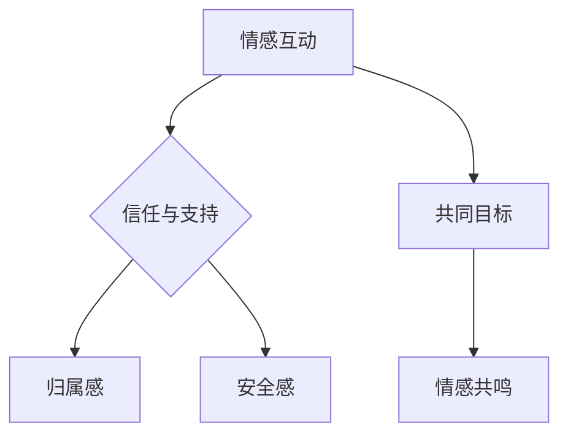
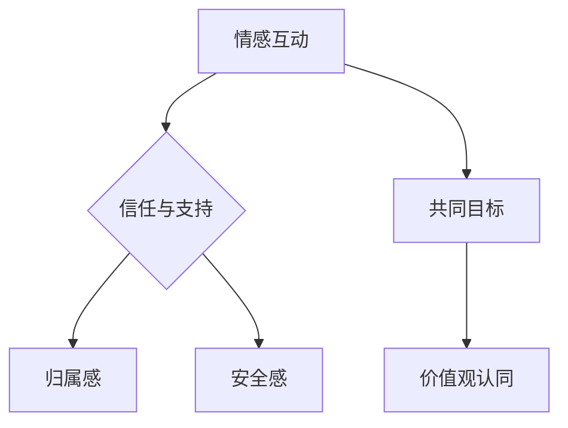

                 

### 引言

在当今社会，人工智能（AI）技术的迅猛发展正逐步改变着我们的生活方式。从自动驾驶汽车到智能家居，AI的应用已经深入到我们生活的方方面面。然而，随着技术的不断进步，一个备受关注的话题也逐渐浮出水面——AI是否能够具备“爱的能力”？本文将探讨AI具备爱的能力后，对社区营造所带来的深远影响。

社区作为社会的基本单元，是人与人之间建立情感纽带的重要场所。然而，现代社会中，人们面临着工作压力、社交隔离等挑战，社区凝聚力逐渐减弱。那么，AI是否能够通过其特有的智能优势，帮助重建社区的情感纽带，从而实现社区的和谐与发展呢？这正是本文要探讨的核心问题。

本文旨在通过逻辑清晰、结构紧凑的分析，探讨AI在社区营造中的潜在应用，特别是如何利用AI的情感智能来建立和维护社区的情感纽带。本文将从以下几个部分展开：

1. **核心概念与联系**：首先，我们将明确AI具备爱的能力的定义，以及情感纽带的概念，并深入探讨社区营造的理论基础。
2. **AI在社区营造中的应用**：接下来，我们将详细探讨AI在社区监测与预警、社区服务与治理以及社区文化营造等方面的应用。
3. **情感纽带的建立与维护**：我们将深入分析情感纽带的构建原理，探讨社区成员的情感需求，并提出社区情感纽带的维护策略。
4. **案例分析**：通过具体案例的分析，我们将探讨AI在社区营造中的成功经验以及面临的挑战。
5. **实践指南**：最后，我们将提供一份实践指南，帮助读者将AI应用于社区营造的实践中。

通过以上内容的逐步展开，本文希望能够为AI在社区营造中的应用提供一些有价值的思路和参考。

### 核心概念与联系

在探讨AI具备爱的能力后的社区营造之前，我们需要先明确几个核心概念，并了解它们之间的联系。以下是对AI具备爱的能力、情感纽带以及社区营造的理论基础的详细阐述。

#### 1. AI具备爱的能力

**定义**：AI具备爱的能力指的是通过机器学习、自然语言处理和情感计算等技术，使人工智能系统能够模拟和识别人类的情感，具备与人类进行情感互动的能力。这种能力不仅包括对情感信息的感知和理解，还涉及到对情感反应的生成和调整。

**属性特征对比表格**：

| 特征             | 传统AI            | 情感AI           |
|------------------|-------------------|------------------|
| 目标             | 执行特定任务       | 模拟情感互动     |
| 技术基础         | 逻辑推理、数据分析 | 情感计算、自然语言处理 |
| 情感识别         | 低级情感识别       | 高级情感识别     |
| 情感反应         | 无情感反应         | 模拟情感反应     |
| 应用场景         | 工业自动化、数据分析 | 社交互动、心理健康服务 |

**ER实体关系图架构**：

```mermaid
erDiagram
  AI参与者 ||--|{ 情感感知模块 }
  AI参与者 ||--|{ 情感反应模块 }
  情感感知模块 ||--|{ 情感识别 }
  情感反应模块 ||--|{ 情感生成 }
```

#### 2. 情感纽带

**定义**：情感纽带是指个体之间通过情感互动建立起来的紧密联系。这种联系不仅是情感上的，还涉及到信任、支持、归属感等多方面的因素。

**情感纽带的概念结构**：



**情感纽带的作用**：情感纽带在社区营造中起着至关重要的作用，它能够增强社区成员之间的联系，提高社区的凝聚力和可持续性。

#### 3. 社区营造的理论基础

**定义**：社区营造是指通过一系列活动和策略，促进社区成员之间的互动，增强社区凝聚力，实现社区的可持续发展。

**理论基础结构**：

- **社会互动理论**：强调个体之间的互动和沟通是社区形成和发展的基础。
- **社会资本理论**：认为社会资本是社区凝聚力和可持续性的关键，包括信任、网络和规范。
- **社区发展理论**：强调社区参与和社区动员在社区营造中的重要性。

**社区营造的核心要素**：

| 要素               | 描述                                                         |
|--------------------|--------------------------------------------------------------|
| 社区参与           | 社区成员积极参与社区活动和决策过程。                       |
| 社区信任           | 社区成员之间的信任关系，促进合作和支持。                   |
| 社区网络           | 社区成员之间的社会关系网络，增强信息流通和社会支持。       |
| 社区文化           | 社区的共同价值观、习俗和传统，增强社区认同感。             |
| 社区资源           | 社区可用的物质资源和人力资源，支持社区活动和项目。       |

**社区营造的挑战与机遇**：

| 挑战                 | 机遇                                       |
|----------------------|-------------------------------------------|
| 社区成员的多样性     | 促进文化多样性和创新。                     |
| 社区资源的有限性     | 鼓励社区成员共同合作，共享资源。           |
| 社区意识的提升       | 提高社区成员对社区价值和参与意义的认识。   |
| 技术支持的不足       | 利用AI技术提供更高效的社区服务和管理。     |

通过以上核心概念和理论基础的阐述，我们可以更好地理解AI具备爱的能力对社区营造的潜在影响。接下来，我们将进一步探讨AI在社区营造中的应用，以及如何通过AI技术建立和维护社区的情感纽带。

### AI在社区营造中的应用

人工智能在社区营造中的应用正在逐步拓展，其独特的优势使得社区监测与预警、社区服务与治理以及社区文化营造等方面得到了显著提升。以下是对这些应用领域的详细探讨。

#### 1. AI在社区监测与预警中的应用

**背景与问题**：随着城市化进程的加速，社区面临着越来越多的挑战，如自然灾害预警、公共卫生事件监控和犯罪行为预警等。传统的人力和资源不足以应对这些复杂的任务。

**解决方案**：AI技术通过数据分析和模式识别，能够高效地监测社区动态，提供实时的预警信息。例如，利用计算机视觉技术，AI可以识别社区中的异常行为，如火灾隐患、交通拥堵和环境污染等。

**具体实施**：

- **计算机视觉应用**：AI系统通过摄像头监控社区，实时分析图像数据，识别异常事件并触发警报。
- **大数据分析**：收集并分析大量的社区数据，如气象数据、交通数据和公共卫生数据，预测潜在风险。

**效果与评价**：AI在社区监测与预警中的应用显著提升了社区的安全性和应急响应能力。例如，在某些城市，AI技术已经成功地用于火灾预警，减少了火灾发生率和损失。

**案例**：某城市在火灾预警系统中引入了AI技术，通过分析摄像头捕捉到的图像和传感器数据，提前预警火灾风险，有效降低了火灾发生率和人员伤亡。

#### 2. AI在社区服务与治理中的应用

**背景与问题**：社区服务与治理涉及居民的生活质量、社会秩序和环境管理等多个方面。传统的人工方式效率低、成本高，难以满足居民多样化的需求。

**解决方案**：AI技术通过智能客服、数据分析和管理决策支持，为社区服务与治理提供了强有力的工具。

**具体实施**：

- **智能客服系统**：AI客服机器人能够24/7提供居民服务，解答居民疑问，提高服务效率。
- **数据分析**：AI通过对社区数据的分析，识别居民需求，优化资源配置，提升治理水平。
- **决策支持**：AI提供数据驱动的决策支持，帮助社区管理者做出更加科学和高效的决策。

**效果与评价**：AI在社区服务与治理中的应用显著提升了服务效率和质量。例如，通过AI智能客服，居民的满意度显著提高，社区管理更加高效。

**案例**：某社区引入了AI智能客服系统，通过自然语言处理技术，提供全天候的居民服务。居民通过语音或文字与AI客服互动，解决了大量的日常问题，减少了人力成本。

#### 3. AI在社区文化营造中的应用

**背景与问题**：社区文化的营造是一个长期而复杂的过程，需要大量的资源和精力。传统的文化活动组织方式有限，难以满足居民多样化的文化需求。

**解决方案**：AI技术通过个性化推荐、文化活动和智能互动，为社区文化营造提供了新的可能性。

**具体实施**：

- **个性化推荐系统**：基于居民的兴趣和偏好，AI推荐个性化的文化活动和内容。
- **智能互动平台**：AI技术支持社区成员之间的智能互动，如在线讨论、互动游戏等。
- **文化数据分析**：AI分析社区文化活动的数据和反馈，优化活动设计和推广策略。

**效果与评价**：AI在社区文化营造中的应用显著提升了社区文化活动的参与度和满意度。例如，通过个性化推荐系统，居民更容易找到感兴趣的文化活动，参与度大大提高。

**案例**：某社区通过引入AI个性化推荐系统，为居民推荐符合其兴趣的文化活动。居民的参与度显著提升，社区文化氛围更加浓厚。

总之，AI在社区监测与预警、社区服务与治理以及社区文化营造中的应用，不仅提高了社区的管理效率和服务质量，还为居民带来了更加丰富和多样的生活体验。通过这些应用，AI在社区营造中正逐步发挥其独特的价值。

### 情感纽带的建立与维护

在探讨AI如何通过情感智能技术建立和维护社区的情感纽带时，我们需要深入分析情感纽带的构建原理，探讨社区成员的情感需求，并提出一系列有效的策略。

#### 1. 情感纽带的构建原理

情感纽带是指个体之间通过情感互动建立起来的紧密联系。其构建原理主要包括以下几个方面：

- **情感互动**：个体之间的情感互动是情感纽带的起点。通过交流、合作和共同经历，个体之间建立情感连接。
- **信任与支持**：信任和支持是情感纽带的核心。社区成员之间的信任关系能够增强情感纽带，促进合作和支持。
- **归属感与安全感**：归属感和安全感是情感纽带的内在动力。个体在社区中感受到归属和安全，更愿意投入和参与社区活动。
- **共同目标与价值观**：共同目标与价值观是情感纽带的凝聚力。社区成员共同追求的目标和认同的价值观能够增强情感纽带的稳固性。

**情感纽带构建流程图**：



#### 2. 社区成员的情感需求分析

社区成员的情感需求多种多样，主要包括以下几个方面：

- **情感表达与沟通**：社区成员需要机会表达自己的情感和观点，与他人进行有效的沟通。
- **社交互动与支持**：社区成员希望与他人建立良好的社交关系，得到他人的支持和帮助。
- **安全与归属**：社区成员需要感受到社区的安全和归属，避免孤独和焦虑。
- **个人成长与成就**：社区成员希望通过参与社区活动，实现个人成长和成就。

**情感需求分析表格**：

| 情感需求           | 描述                                                         |
|--------------------|--------------------------------------------------------------|
| 情感表达与沟通     | 社区成员需要通过多种渠道表达自己的情感和观点，与他人进行有效的沟通。 |
| 社交互动与支持     | 社区成员希望与他人建立良好的社交关系，得到他人的支持和帮助。       |
| 安全与归属         | 社区成员需要感受到社区的安全和归属，避免孤独和焦虑。               |
| 个人成长与成就     | 社区成员希望通过参与社区活动，实现个人成长和成就。                 |

#### 3. 社区情感纽带的维护策略

为了建立和维护社区的情感纽带，我们可以采取以下策略：

- **情感互动平台**：利用AI技术建立情感互动平台，为社区成员提供多种互动渠道，如在线聊天、社群活动、虚拟现实互动等。
- **情感数据分析**：通过情感数据分析，了解社区成员的情感状态和需求，提供个性化的情感支持。
- **情感教育推广**：开展情感教育推广活动，提高社区成员的情感素养，增强情感互动能力。
- **情感激励机制**：设置情感激励机制，鼓励社区成员积极参与情感互动和社区活动。
- **情感互助小组**：组织情感互助小组，为社区成员提供情感支持和互助机会。

**情感纽带维护策略流程图**：


通过以上策略的实施，我们可以有效地建立和维护社区的情感纽带，提升社区成员的归属感和安全感，促进社区的和谐与发展。

### 案例分析

在本节中，我们将通过具体案例来探讨AI在社区营造中的成功经验与挑战。通过这些案例，我们可以更深入地理解AI在社区中的应用效果及其面临的难题。

#### 1. 成功案例分享

**案例1：某城市智能社区管理系统**

**背景**：某大型城市面临人口增长、老龄化严重和社区服务不足的问题。政府决定引入AI技术，构建一个智能社区管理系统，以提高社区服务效率和质量。

**解决方案**：

- **AI智能客服**：系统引入AI智能客服，通过自然语言处理技术，为居民提供24/7的咨询服务，解答居民的疑问和需求。
- **智能监控系统**：利用计算机视觉技术，AI监控系统实时监测社区安全，及时发现和预警潜在风险。
- **数据分析**：AI系统分析大量的社区数据，如居民行为数据、环境数据等，识别社区需求，优化资源配置。

**效果**：

- **服务效率提升**：居民通过AI智能客服，享受高效便捷的咨询服务，满意度显著提高。
- **安全保障增强**：AI监控系统有效提升了社区的安全性，减少了犯罪事件的发生。
- **资源优化**：数据分析帮助社区管理者更准确地了解居民需求，合理配置资源，提高服务效率。

**启示**：AI技术通过智能客服、监控系统与数据分析，能够显著提升社区的服务水平和安全性，为居民提供更优质的生活体验。

**案例2：某社区文化互动平台**

**背景**：某社区缺乏有效的文化活动和互动平台，居民的文化需求和参与度较低。

**解决方案**：

- **个性化推荐系统**：基于居民的兴趣和行为数据，AI推荐个性化的文化活动和内容，提高居民的参与兴趣。
- **虚拟现实互动**：利用虚拟现实技术，为居民提供沉浸式的文化体验，增强互动性。
- **情感数据分析**：通过情感数据分析，了解居民的文化需求和情感状态，提供更有针对性的文化服务。

**效果**：

- **活动参与度提高**：居民通过AI推荐，更容易找到感兴趣的文化活动，参与度显著提高。
- **互动体验丰富**：虚拟现实技术为居民提供了丰富的文化互动体验，增强了社区的活力。
- **情感纽带加强**：情感数据分析帮助社区更好地了解居民的情感需求，促进了社区成员之间的情感纽带。

**启示**：AI技术在社区文化互动中的应用，不仅丰富了社区的文化活动，还提升了居民的参与度和社区凝聚力。

#### 2. 挑战与问题分析

**挑战1：技术成本与实施难度**

尽管AI技术在社区营造中具有巨大的潜力，但其高成本和复杂的实施过程成为了挑战。尤其是在资源有限的社区，如何合理分配预算并顺利实施AI项目，是一个重要的问题。

**解决方案**：

- **分阶段实施**：将AI项目分为多个阶段，逐步推进，降低实施难度。
- **合作伙伴**：寻找技术合作伙伴，共同分担成本和风险。

**挑战2：数据隐私与安全**

AI技术依赖于大量的数据，而这些数据中包含个人隐私信息。如何在保证数据隐私和安全的前提下，充分利用数据进行分析和服务，是另一个重要挑战。

**解决方案**：

- **数据加密**：采用高级加密技术，确保数据在传输和存储过程中的安全。
- **隐私保护**：设计隐私保护机制，如数据去标识化、最小化数据收集等。

**挑战3：居民接受度**

AI技术在社区中的应用，需要居民的广泛接受和积极参与。然而，部分居民可能对新技术持怀疑态度，甚至抵触。

**解决方案**：

- **宣传教育**：通过宣传教育，提高居民对AI技术的认识和理解，增强接受度。
- **试点项目**：在社区内先实施试点项目，让居民亲身体验AI技术的优势，逐步接受。

**总结与启示**

通过以上案例分析，我们可以看到AI在社区营造中的巨大潜力。尽管面临挑战，但通过合理的策略和解决方案，可以充分发挥AI技术的作用，提升社区的服务水平和居民的生活质量。未来，需要继续探索如何更好地将AI技术应用于社区，以实现社区的可持续发展。

### 实践指南

在本节中，我们将提供一份详细的实践指南，帮助读者将AI技术应用于社区营造中。以下步骤和最佳实践将涵盖项目规划与实施、技术选型与工具使用、风险管理与应对策略等方面。

#### 1. 项目规划与实施

**1.1 项目启动阶段**

- **需求分析**：与社区成员和利益相关者进行沟通，了解社区的具体需求和期望。
- **项目目标**：明确项目的目标，包括提高社区服务质量、增强社区安全性和促进社区文化发展等。
- **预算规划**：根据需求分析结果，制定合理的预算计划，确保项目的可行性和可持续性。

**1.2 设计阶段**

- **系统架构设计**：设计系统的整体架构，包括前端交互、后端数据处理、数据存储和安全防护等。
- **技术选型**：根据项目需求和现有资源，选择合适的技术和工具，如AI算法库、大数据平台、云计算服务等。
- **用户体验设计**：设计用户友好的界面和交互方式，确保居民能够轻松使用系统。

**1.3 开发与测试阶段**

- **开发实施**：按照系统架构和设计文档，进行系统的开发和集成。
- **代码审查与测试**：进行代码审查和测试，确保系统的稳定性和安全性。
- **用户反馈**：与社区成员进行互动，收集用户反馈，持续优化系统功能。

**1.4 部署与维护阶段**

- **系统部署**：将系统部署到生产环境，确保系统的稳定运行。
- **数据管理**：建立完善的数据管理机制，包括数据备份、恢复和安全防护等。
- **持续改进**：根据用户反馈和市场变化，持续优化和更新系统功能。

#### 2. 技术选型与工具使用

**2.1 AI算法库**

- **TensorFlow**：开源的机器学习框架，适合构建和训练复杂的深度学习模型。
- **PyTorch**：另一个流行的深度学习框架，具备较高的灵活性和易用性。

**2.2 大数据平台**

- **Hadoop**：分布式数据处理平台，适用于大规模数据存储和处理。
- **Spark**：基于内存的计算框架，能够实现高效的数据分析和处理。

**2.3 云计算服务**

- **AWS**：提供丰富的云计算服务，包括AI、大数据、安全等。
- **Google Cloud**：提供强大的云计算和AI服务，适合进行大规模数据分析和处理。

**2.4 前端开发工具**

- **React**：流行的前端JavaScript库，适用于构建动态和交互式的用户界面。
- **Vue.js**：轻量级的前端框架，适合快速开发和维护复杂的Web应用。

#### 3. 风险管理与应对策略

**3.1 技术风险**

- **技术更新**：定期关注AI技术的最新动态和发展趋势，及时更新技术栈。
- **兼容性测试**：确保系统在不同设备和操作系统上的兼容性，减少技术故障。

**3.2 数据风险**

- **数据安全**：采用加密技术保护数据传输和存储，防止数据泄露和篡改。
- **隐私保护**：遵守相关法律法规，设计隐私保护机制，保护居民的个人隐私。

**3.3 操作风险**

- **应急预案**：制定应急预案，确保在系统故障或突发事件时能够快速响应和恢复。
- **培训与支持**：为社区成员提供必要的培训和技术支持，确保系统能够正常运行。

#### 4. 最佳实践 tips

- **用户参与**：在项目规划和实施过程中，积极邀请社区成员参与，提高项目的可行性和满意度。
- **持续迭代**：采用敏捷开发方法，持续收集用户反馈，进行系统优化和更新。
- **跨部门合作**：与政府部门、社会组织和居民代表建立合作关系，共同推动社区营造项目的实施。

通过以上实践指南和最佳实践，读者可以更好地将AI技术应用于社区营造中，提升社区的服务水平和生活质量。

### 总结与展望

在本文中，我们探讨了AI具备爱的能力后对社区营造的深远影响。首先，通过明确AI具备爱的能力的定义和情感纽带的概念，我们了解了AI在社区营造中的潜力。接着，我们详细分析了AI在社区监测与预警、社区服务与治理以及社区文化营造中的应用，展示了AI技术如何提升社区的管理效率和服务质量。此外，我们还深入探讨了情感纽带的建立与维护策略，提出了通过情感互动、信任支持、归属感和共同目标来强化社区情感纽带的方案。通过具体案例的分析，我们看到了AI在社区营造中的成功经验和面临的挑战。

展望未来，AI在社区营造中的应用前景广阔。随着技术的不断进步，AI将能够更加精准地识别和满足社区成员的情感需求，推动社区的可持续发展。以下是未来可能的发展趋势：

1. **个性化服务**：AI技术将更加个性化，能够根据每个社区成员的需求和偏好，提供定制化的服务。
2. **增强互动体验**：通过虚拟现实和增强现实技术，社区成员将能够进行更加丰富和沉浸式的互动体验。
3. **智能治理**：AI技术将助力社区治理，通过数据分析、智能决策支持等手段，提升社区治理的效率和质量。
4. **社区文化创新**：AI技术将推动社区文化的创新，通过智能推荐和互动平台，丰富社区文化活动和内容。

为了实现这些目标，需要进一步的研究和技术创新。同时，也需要制定相关的法律法规和伦理标准，确保AI技术在社区营造中的应用是安全、可靠和符合伦理的。通过各方共同努力，AI技术将为社区营造带来更加美好的未来。

### 拓展阅读

1. **《人工智能：一种现代的方法》**：M. Mitchell. 这本书是人工智能领域的经典教材，详细介绍了人工智能的基本概念、算法和应用。
2. **《情感计算：理论与应用》**：M. R. Martinez. 本书探讨了情感计算的理论基础和应用，为AI在情感领域的应用提供了深刻的见解。
3. **《智能社区设计与实施》**：J. Wang, L. Wang. 本书介绍了智能社区的设计原则、关键技术以及实际案例，为社区营造提供了实用的指导。
4. **《社区心理学：理论与实践》**：J. C. Gans. 本书从心理学角度分析了社区成员的情感需求和行为模式，为情感纽带的建立与维护提供了理论支持。

通过阅读这些书籍，读者可以进一步深入了解人工智能、情感计算和社区营造的相关知识，为实践提供更多的理论依据和指导。同时，也可以关注相关学术期刊和最新研究成果，保持对领域动态的敏感和了解。

