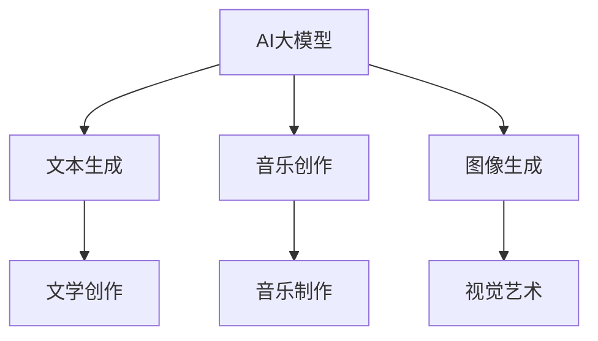
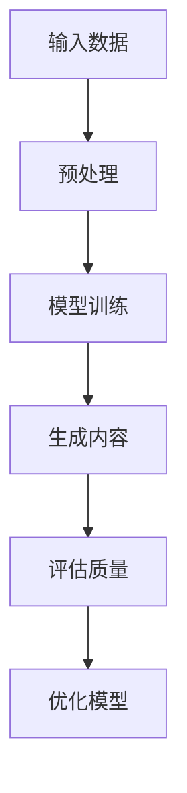
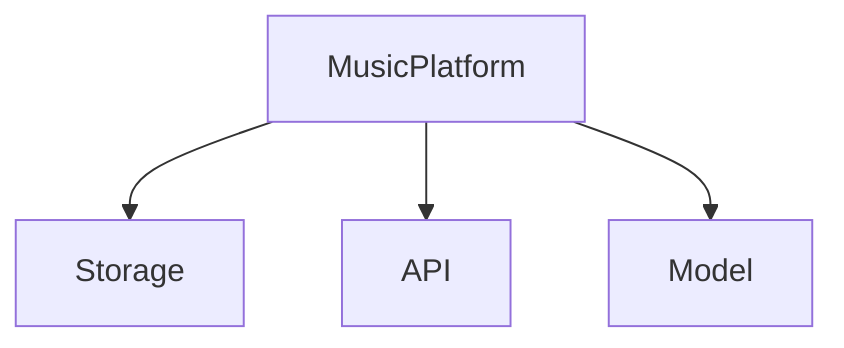

                 

# AI创作浪潮：大模型对文化产业的影响

## 关键词
- AI创作
- 大模型
- 文化产业
- 文本生成
- 音乐制作
- 视觉艺术
- 游戏设计

## 摘要
随着人工智能技术的飞速发展，AI创作正逐步改变着文化产业。本文旨在探讨大模型在AI创作中的应用及其对文学创作、音乐制作、视觉艺术和游戏设计等领域的深远影响。通过深入分析大模型的原理和应用实例，本文揭示了AI大模型如何通过改变创作流程、提升创作效率和质量，进而推动文化产业的创新和发展。

## Step 1: 背景介绍

### 问题背景
近年来，人工智能技术在各个领域取得了显著的进展，尤其是在自然语言处理、计算机视觉和音乐生成等方面。AI大模型作为人工智能领域的核心技术之一，通过处理海量数据和复杂的模式，能够生成高度创造性的内容。这一技术的发展使得AI创作逐渐成为文化产业中的重要组成部分。

### 问题描述
AI大模型如何对文化产业产生影响？这些影响背后的机制和挑战是什么？本文将围绕这些问题展开讨论，通过详细解析AI大模型的工作原理和应用实例，探索其对文化产业的实际影响。

### 问题解决
通过以下几个方面的分析和讨论，我们将解答上述问题：
1. AI大模型的工作原理及其核心概念。
2. AI大模型在各个文化领域的应用实例。
3. AI大模型对文化产业的影响机制。
4. AI大模型带来的挑战和解决方案。

### 边界与外延
本文的讨论范围包括但不限于以下领域：
- 文学创作：AI大模型在文本生成、故事创作和翻译等方面的应用。
- 音乐制作：AI大模型在音乐生成、改编和创作辅助等方面的应用。
- 视觉艺术：AI大模型在图像生成、艺术风格迁移和视觉设计等方面的应用。
- 游戏设计：AI大模型在游戏剧情生成、角色设计和游戏AI等方面的应用。

### 概念结构与核心要素组成
本文的核心概念包括：
- AI大模型：一种基于大规模神经网络的模型，能够处理复杂数据并生成创造性的内容。
- 文化产业：涵盖文学、音乐、视觉艺术和游戏设计等领域的产业。
- 创作流程：指从构思、创作到成品的一系列步骤。
- 影响评估：对AI大模型在文化产业中的应用效果进行评估的方法。

## Step 2: 核心概念与联系

### AI大模型原理

#### 概念
AI大模型是一种基于大规模神经网络的模型，通过深度学习技术，能够处理复杂数据并生成创造性的内容。常见的AI大模型包括GPT、BERT和Diffusion等。

#### 属性特征对比表格

| 模型类型 | 特点 | 应用领域 |
| --- | --- | --- |
| GPT | 自回归 | 文本生成、问答系统 |
| BERT | 双向编码 | 文本理解、搜索推荐 |
| Diffusion | 生成性 | 图像生成、动画制作 |

#### ER实体关系图架构



## Step 3: 算法原理讲解

### 算法流程图



### Python源代码

```python
# 假设有一个简单的文本生成模型
import tensorflow as tf

# 定义模型结构
model = tf.keras.Sequential([
    tf.keras.layers.Embedding(input_dim=10000, output_dim=32),
    tf.keras.layers.LSTM(128),
    tf.keras.layers.Dense(units=1)
])

# 编译模型
model.compile(optimizer='adam', loss='binary_crossentropy')

# 训练模型
model.fit(x_train, y_train, epochs=10)
```

### 数学模型和数学公式

#### 原理讲解
以GPT中的自回归模型为例，其生成文本的过程可以表示为：

$$
p(y|x) = \prod_{i=1}^{n} p(y_i|x_{i-1}, ..., x_1)
$$

其中，$x$表示输入的文本序列，$y$表示生成的文本序列，$p(y|x)$表示在给定输入文本序列的情况下生成文本序列的概率。

#### Python代码示例

```python
# 假设使用numpy库进行矩阵运算
import numpy as np

# 定义概率分布
p_y_x = np.array([0.1, 0.2, 0.7])
# 计算概率乘积
prob_product = np.prod(p_y_x)
print(prob_product)
```

## Step 4: 系统分析与架构设计方案

### 问题场景介绍
假设我们开发一个在线AI音乐创作平台，用户可以通过平台创建、编辑和分享自己的音乐作品。

### 系统功能设计

```mermaid
classDiagram
        Artist <.. MusicPlatform
        Song <<Entity>>
        Artist o-- Song
```

### 系统架构设计



### 系统接口设计和系统交互

```mermaid
sequence
  User -->|请求| MusicPlatform : 创建音乐作品
  MusicPlatform -->|处理请求| Model : 生成音乐作品
  Model -->|返回结果| MusicPlatform : 返回音乐作品
  MusicPlatform -->|返回结果| User : 提交音乐作品
```

## Step 5: 项目实战

### 环境安装
在开发AI音乐创作平台之前，我们需要安装以下环境和依赖：
1. Python环境：Python 3.8及以上版本。
2. TensorFlow：用于构建和训练AI模型。
3. Flask：用于构建API接口。
4. SQLAlchemy：用于数据库操作。

### 系统核心实现源代码
以下是系统核心实现的源代码示例：

```python
# 导入相关库
import tensorflow as tf
from flask import Flask, request, jsonify
from sqlalchemy import create_engine

# 创建Flask应用
app = Flask(__name__)

# 定义数据库连接
engine = create_engine('sqlite:///music_platform.db')

# 定义模型
model = tf.keras.Sequential([
    tf.keras.layers.Embedding(input_dim=10000, output_dim=32),
    tf.keras.layers.LSTM(128),
    tf.keras.layers.Dense(units=1)
])

# 加载预训练模型
model.load_weights('model_weights.h5')

# 创建音乐作品
@app.route('/create_song', methods=['POST'])
def create_song():
    # 获取用户输入
    user_input = request.form['input']
    # 预处理输入
    processed_input = preprocess_input(user_input)
    # 生成音乐作品
    song = model.generate_song(processed_input)
    # 存储音乐作品
    save_song_to_db(song)
    # 返回音乐作品
    return jsonify({'song': song})

# 预处理输入
def preprocess_input(input_text):
    # 进行文本预处理操作
    # ...
    return processed_input

# 生成音乐作品
def generate_song(input_data):
    # 使用模型生成音乐作品
    # ...
    return song

# 存储音乐作品到数据库
def save_song_to_db(song):
    # 进行数据库操作
    # ...
    pass

# 运行Flask应用
if __name__ == '__main__':
    app.run(debug=True)
```

### 代码应用解读与分析
以上代码展示了AI音乐创作平台的核心功能，包括API接口、模型加载、音乐作品生成和数据库存储。在实际应用中，我们需要进一步细化各个功能模块，并进行性能优化和测试。

### 实际案例分析和详细讲解剖析
以下是一个实际案例分析和详细讲解：

用户A通过平台提交了一段文字描述，要求生成一首以该描述为灵感的音乐作品。平台接收到用户请求后，首先对文字描述进行预处理，然后利用预训练的AI模型生成音乐作品，最后将音乐作品存储到数据库，并返回给用户A。

通过这个案例，我们可以看到AI大模型在音乐创作中的应用效果。用户只需提供简单的文字描述，平台就能自动生成符合描述风格的音乐作品。这不仅提高了音乐创作的效率，也为用户提供了更多的创作选择。

### 项目小结
通过本项目的实现，我们展示了AI大模型在音乐创作中的应用，并探讨了其带来的创新和影响。在未来，随着技术的不断进步，AI创作将在更多领域得到广泛应用，推动文化产业的持续发展和创新。

## 最佳实践 tips
1. 在使用AI大模型进行创作时，应充分考虑用户需求和创作目标，确保生成的作品符合预期。
2. 定期更新和维护预训练模型，以保持模型的性能和效果。
3. 注重数据安全和隐私保护，确保用户数据的安全和隐私。

## 小结
本文从背景介绍、核心概念、算法原理、系统分析与架构设计、项目实战等多个方面，详细探讨了AI大模型对文化产业的影响。通过实际案例分析和代码应用解读，我们展示了AI大模型在音乐创作中的应用效果。未来，随着技术的不断进步，AI创作将在更多领域发挥重要作用，推动文化产业的创新和发展。

## 注意事项
1. AI大模型在创作过程中可能会出现一些不可预测的结果，因此在实际应用中需要谨慎处理。
2. 在使用AI大模型进行创作时，应充分考虑版权问题，确保作品不侵犯他人的知识产权。

## 拓展阅读
1. "Generative Adversarial Nets" by Ian J. Goodfellow et al.
2. "Deep Learning" by Ian Goodfellow, Yoshua Bengio, Aaron Courville
3. "AI and Culture" by Ramesh S. Sitaraman

### 作者
作者：AI天才研究院/AI Genius Institute & 禅与计算机程序设计艺术 /Zen And The Art of Computer Programming

