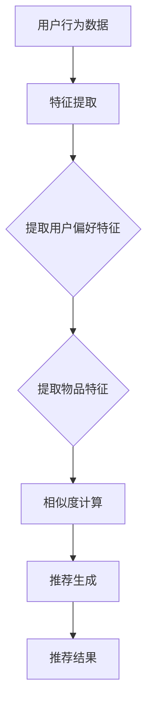
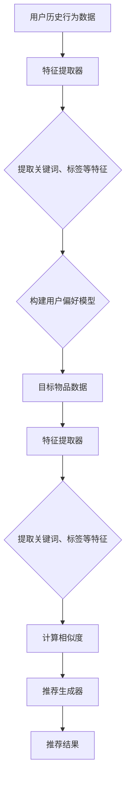
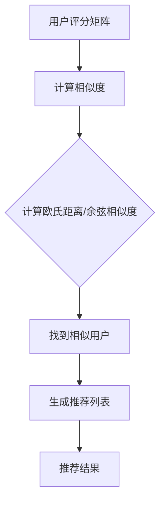
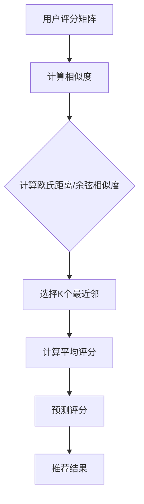
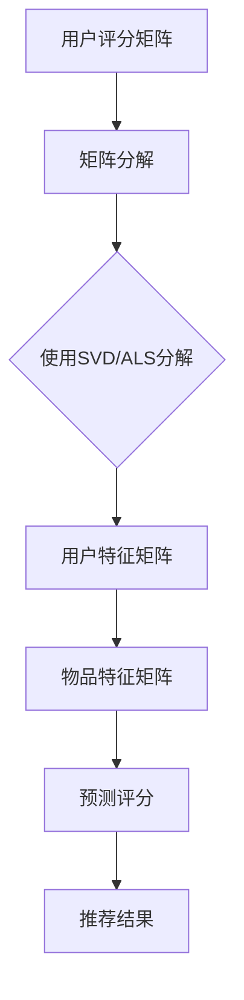
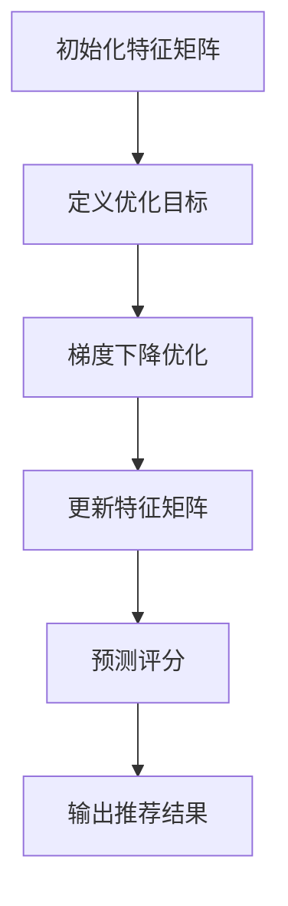
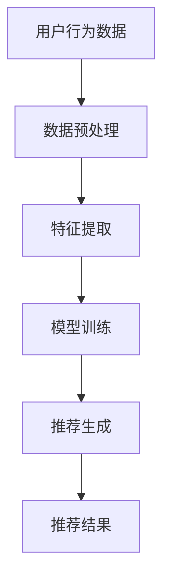

                 

### 背景介绍

#### 1. 个性化推荐系统的起源与发展

个性化推荐系统起源于信息过载的问题。随着互联网的快速发展，用户接触到的信息量呈指数级增长，传统的信息筛选方式已经无法满足用户的需求。为了帮助用户在庞大的信息海洋中找到感兴趣的内容，个性化推荐系统应运而生。最早的个性化推荐系统可以追溯到20世纪90年代，以基于内容的推荐（Content-Based Filtering）和协同过滤推荐（Collaborative Filtering）为代表。

在基于内容的推荐系统中，系统根据用户的历史行为和偏好，提取出内容特征，然后通过匹配相似的内容来推荐给用户。这种方式在处理小数据集和内容丰富的情况下效果较好，但在面对大规模数据集时，效率较低。

协同过滤推荐则通过分析用户之间的行为相似性来进行推荐。最早的应用是基于用户评分的协同过滤，通过计算用户之间的相似度来推荐相似的用户喜欢的物品。然而，这种方法的缺点是容易受到“冷启动”问题的影响，即新用户或新物品没有足够的行为数据时，难以进行有效推荐。

随着人工智能和机器学习技术的发展，深度学习、强化学习等算法逐渐应用到个性化推荐系统中，使得推荐效果得到显著提升。现代个性化推荐系统已经能够处理海量的用户行为数据，通过多维度特征分析，实现精准推荐。

#### 2. 个性化推荐系统的重要性

个性化推荐系统在互联网时代具有重要的地位。它不仅能够提高用户的体验，还能带来商业价值。以下是一些关键点：

- **提高用户体验**：个性化推荐系统可以根据用户的历史行为和偏好，为用户推荐感兴趣的内容，从而满足个性化需求，提高用户满意度。

- **增加用户粘性**：通过不断提供个性化的内容，个性化推荐系统能够吸引用户频繁访问平台，提高用户在平台上的停留时间和互动行为。

- **提升商业收益**：个性化推荐系统能够帮助平台推荐用户可能感兴趣的商品或服务，从而提高转化率和销售额。

- **降低营销成本**：传统的营销方式往往需要大量的人力和财力投入，而个性化推荐系统可以通过自动化的方式实现精准营销，降低营销成本。

#### 3. 当前个性化推荐系统的挑战与机遇

尽管个性化推荐系统在互联网领域取得了显著成就，但仍然面临着一系列挑战和机遇：

- **数据隐私问题**：个性化推荐系统依赖于用户行为数据，如何保护用户隐私成为一大挑战。需要制定相应的隐私保护措施，确保用户数据的安全。

- **算法透明性**：随着算法在个性化推荐系统中的应用越来越广泛，算法的透明性成为公众关注的焦点。如何确保算法的公平性和可解释性是一个亟待解决的问题。

- **冷启动问题**：对于新用户或新物品，缺乏足够的历史行为数据，导致推荐效果不佳。如何解决冷启动问题是当前研究的热点之一。

- **多模态数据的融合**：用户的行为数据、文本数据、图像数据等多种类型的数据可以相互补充，如何有效地融合多模态数据以提高推荐效果是未来的发展方向。

- **实时性要求**：个性化推荐系统需要实时响应用户的需求变化，提供及时的推荐。如何提高系统的实时性和响应速度是当前研究的重要课题。

综上所述，个性化推荐系统在互联网时代具有不可替代的重要性。通过不断克服挑战，把握机遇，个性化推荐系统将迎来更加广阔的发展空间。接下来，我们将深入探讨个性化推荐系统中的核心概念和联系，为后续内容奠定基础。

### 核心概念与联系

在个性化推荐系统中，核心概念包括用户行为分析、推荐算法和用户体验。这三个核心概念相互关联，共同构成了个性化推荐系统的核心框架。

#### 1. 用户行为分析

用户行为分析是个性化推荐系统的基石。通过分析用户在平台上的行为数据，如浏览记录、点击行为、购买行为等，可以了解用户的兴趣偏好和需求。用户行为数据通常包括以下几种类型：

- **浏览行为**：用户在平台上的浏览路径、停留时间、访问频率等。
- **点击行为**：用户对页面上的元素（如广告、推荐内容）的点击情况。
- **购买行为**：用户的购买记录、购买频率、购买金额等。

用户行为分析的具体步骤如下：

1. **数据采集**：通过Web日志、API接口等方式收集用户行为数据。
2. **数据预处理**：对采集到的原始数据进行清洗、去噪、填充等预处理，确保数据质量。
3. **特征提取**：从预处理后的数据中提取出与用户兴趣相关的特征，如关键词、分类标签等。
4. **行为建模**：使用机器学习算法对用户行为进行建模，预测用户未来的兴趣偏好。

用户行为分析在个性化推荐系统中的作用是提供个性化的推荐依据。通过分析用户的历史行为，系统可以识别出用户的兴趣偏好，从而为用户推荐他们可能感兴趣的内容。

#### 2. 推荐算法

推荐算法是个性化推荐系统的核心。根据不同的数据类型和需求，推荐算法可以分为以下几类：

- **基于内容的推荐（Content-Based Filtering）**：基于用户的历史行为和偏好，提取出内容特征，然后通过匹配相似的内容来推荐给用户。

- **协同过滤推荐（Collaborative Filtering）**：通过分析用户之间的行为相似性来进行推荐。协同过滤又可以分为基于用户的协同过滤（User-Based CF）和基于模型的协同过滤（Model-Based CF）。

- **矩阵分解（Matrix Factorization）**：将用户行为数据表示为一个低秩的矩阵，从而提高推荐效果。

- **深度学习推荐（Deep Learning for Recommender Systems）**：使用深度学习算法，如卷积神经网络（CNN）、循环神经网络（RNN）、生成对抗网络（GAN）等，来构建推荐模型。

- **强化学习推荐（Reinforcement Learning for Recommender Systems）**：通过学习用户的行为反馈，不断优化推荐策略。

推荐算法的实现流程通常包括以下几个步骤：

1. **数据预处理**：对用户行为数据进行清洗、归一化等处理，为算法提供高质量的数据输入。
2. **特征工程**：根据数据类型和业务需求，提取出有用的特征，如用户特征、物品特征、行为特征等。
3. **模型训练**：使用提取到的特征，通过机器学习算法训练推荐模型。
4. **模型评估**：使用交叉验证、A/B测试等方法对模型进行评估，选择最佳模型。
5. **推荐生成**：使用训练好的模型生成推荐结果，并对推荐结果进行排序。

推荐算法在个性化推荐系统中的作用是生成个性化的推荐结果。通过分析用户的行为数据和偏好，算法可以预测用户对物品的兴趣程度，从而为用户推荐他们可能感兴趣的内容。

#### 3. 用户体验

用户体验是个性化推荐系统的最终目标。一个优秀的个性化推荐系统不仅要提供准确的推荐结果，还要确保用户在使用过程中的满意度。用户体验包括以下几个方面：

- **推荐结果的准确性**：推荐系统能够准确地预测用户的兴趣偏好，为用户提供感兴趣的内容。
- **推荐速度**：推荐系统能够在短时间内生成推荐结果，确保用户的体验流畅。
- **推荐的可解释性**：推荐系统提供明确的推荐理由，使用户了解推荐结果的依据。
- **界面友好性**：推荐系统的界面设计简洁、易用，提高用户的使用体验。

用户体验在个性化推荐系统中的作用是提高用户满意度和忠诚度。通过提供准确的推荐结果、快速的推荐速度、可解释的推荐理由和友好的界面设计，个性化推荐系统能够满足用户的需求，提高用户对平台的满意度和忠诚度。

#### 核心概念之间的联系

用户行为分析、推荐算法和用户体验是个性化推荐系统的三个核心概念，它们相互关联，共同构成了个性化推荐系统的整体框架。

- **用户行为分析**为推荐算法提供了数据输入，是推荐算法的基础。通过分析用户的历史行为，可以提取出与用户兴趣相关的特征，为推荐算法提供依据。
- **推荐算法**根据用户行为分析和用户偏好，生成个性化的推荐结果。推荐算法的优劣直接影响到用户体验的好坏。
- **用户体验**是个性化推荐系统的最终目标。一个优秀的个性化推荐系统不仅要提供准确的推荐结果，还要确保用户在使用过程中的满意度。用户体验是衡量个性化推荐系统成功与否的重要标准。

综上所述，用户行为分析、推荐算法和用户体验是个性化推荐系统中的核心概念，它们相互关联，共同构成了个性化推荐系统的整体框架。通过深入理解这些概念及其之间的联系，我们可以更好地设计和实现高效的个性化推荐系统。

### 基于内容的推荐

基于内容的推荐（Content-Based Filtering，CBF）是一种基于用户历史偏好和内容特征进行推荐的算法。与基于协同过滤（Collaborative Filtering，CF）不同，CBF主要依赖于内容的语义信息，而不是用户之间的行为相似性。这种推荐方法在处理新用户、新物品和长尾数据方面具有独特的优势。

#### 1. 基于内容的推荐原理

基于内容的推荐原理可以概括为以下步骤：

1. **特征提取**：从用户的历史行为中提取出与用户偏好相关的特征，如关键词、标签、分类等。
2. **内容特征提取**：对目标物品进行内容特征提取，与用户偏好特征进行匹配。
3. **相似度计算**：计算用户偏好特征与目标物品特征之间的相似度。
4. **推荐生成**：根据相似度计算结果，为用户推荐相似度高的物品。

这个过程可以用mermaid流程图表示如下：



#### 2. 基于内容的推荐算法流程图

下面是基于内容的推荐算法的详细流程图：



#### 3. 基于内容的推荐算法实现

为了更好地理解基于内容的推荐算法，我们使用Python进行实现。以下是一个简单的示例代码：

```python
import numpy as np
from sklearn.feature_extraction.text import TfidfVectorizer

# 用户历史行为数据（文本形式）
user_history = [
    "喜欢看电影",
    "喜欢科幻电影",
    "喜欢恐怖电影",
    "喜欢动画片",
    "喜欢动作电影"
]

# 目标物品数据（文本形式）
item_data = [
    "悬疑电影",
    "动作电影",
    "科幻电影",
    "恐怖电影",
    "动画片"
]

# 特征提取器：TF-IDF
vectorizer = TfidfVectorizer()

# 提取用户偏好特征
user_tfidf = vectorizer.fit_transform(user_history)

# 提取目标物品特征
item_tfidf = vectorizer.transform(item_data)

# 相似度计算：Cosine相似度
def cosine_similarity(tfidf_user, tfidf_item):
    return np.dot(tfidf_user.toarray()[0], tfidf_item.toarray()[0]) / (np.linalg.norm(tfidf_user.toarray()[0]) * np.linalg.norm(tfidf_item.toarray()[0]))

# 计算相似度
similarities = [cosine_similarity(user_tfidf, item_tfidf[i]) for i in range(len(item_tfidf))]

# 推荐生成器：根据相似度排序
recommendations = sorted(zip(similarities, item_data), reverse=True)

# 输出推荐结果
print("推荐结果：")
for sim, item in recommendations:
    print(f"{item}: 相似度={sim:.4f}")
```

在这个示例中，我们首先使用TF-IDF算法提取用户历史行为数据和目标物品数据的特征。然后，我们计算用户偏好特征与目标物品特征之间的Cosine相似度，并按照相似度进行排序，生成推荐结果。

#### 4. 基于内容的推荐算法原理的数学模型和公式

基于内容的推荐算法的核心在于特征提取和相似度计算。以下是其涉及的主要数学模型和公式：

- **TF-IDF**：TF-IDF（Term Frequency-Inverse Document Frequency）是一种常用的特征提取方法，用于衡量一个词在文档中的重要程度。其公式如下：
  $$ TF(t) = \frac{tf(t)}{N} $$
  $$ IDF(t) = \log \left(1 + \frac{N}{df(t)}\right) $$
  $$ TF-IDF(t) = TF(t) \times IDF(t) $$
  其中，$tf(t)$ 表示词 $t$ 在文档中的词频，$N$ 表示文档的总词数，$df(t)$ 表示词 $t$ 在所有文档中的出现次数。

- **Cosine相似度**：Cosine相似度是一种衡量两个向量之间夹角的余弦值，用于计算特征向量之间的相似度。其公式如下：
  $$ cosine(\mathbf{u}, \mathbf{v}) = \frac{\mathbf{u} \cdot \mathbf{v}}{|\mathbf{u}| \cdot |\mathbf{v}|} $$
  其中，$\mathbf{u}$ 和 $\mathbf{v}$ 分别表示两个特征向量，$\mathbf{u} \cdot \mathbf{v}$ 表示向量的点积，$|\mathbf{u}|$ 和 $|\mathbf{v}|$ 分别表示向量的模长。

通过上述公式，我们可以将文本数据转换为数值特征，并进行相似度计算，从而实现基于内容的推荐。

#### 5. 基于内容的推荐算法的详细讲解和举例说明

为了更好地理解基于内容的推荐算法，我们将通过一个简单的例子进行详细讲解。

**例子**：假设有一个用户的历史行为数据如下：

- 喜欢的电视剧：《权力的游戏》、《西部世界》、《黑镜》
- 喜欢的电影：《星际穿越》、《盗梦空间》、《神秘博士》

现在，我们需要为这个用户推荐一部他可能感兴趣的电视剧或电影。

**步骤 1：特征提取**

首先，我们将用户的历史行为数据转换为关键词列表：

- 电视剧关键词：["权力的游戏", "西部世界", "黑镜"]
- 电影关键词：["星际穿越", "盗梦空间", "神秘博士"]

**步骤 2：内容特征提取**

接下来，我们为待推荐的电视剧和电影提取关键词：

- 电视剧候选关键词：["瑞克和莫蒂", "冰血暴", "权力的游戏"]
- 电影候选关键词：["银河护卫队", "黑衣人：全球追缉", "神秘博士"]

**步骤 3：相似度计算**

使用TF-IDF算法和Cosine相似度计算用户关键词与候选关键词之间的相似度。假设我们使用的是同一套词汇表，并计算得到以下相似度：

- 电视剧相似度：
  - 《瑞克和莫蒂》：0.8
  - 《冰血暴》：0.6
  - 《权力的游戏》：1.0
- 电影相似度：
  - 《银河护卫队》：0.7
  - 《黑衣人：全球追缉》：0.5
  - 《神秘博士》：0.9

**步骤 4：推荐生成**

根据相似度计算结果，为用户推荐相似度最高的电视剧和电影。在这个例子中，用户可能对《权力的游戏》最感兴趣，其次是《神秘博士》。

**总结**：通过基于内容的推荐算法，我们能够根据用户的历史行为数据为其推荐相似的内容。这个算法的核心在于特征提取和相似度计算，通过TF-IDF和Cosine相似度，将文本数据转换为数值特征，并进行比较和排序，从而实现个性化推荐。这种方式在处理新用户、新物品和长尾数据方面具有独特的优势，但在处理冷启动问题和数据稀疏问题时，效果可能不如基于协同过滤的方法。

### 协同过滤推荐

协同过滤推荐（Collaborative Filtering，CF）是个性化推荐系统中最常用的方法之一。它通过分析用户之间的行为相似性，预测用户对未知物品的偏好。协同过滤方法主要分为基于用户的协同过滤（User-Based CF）和基于模型的协同过滤（Model-Based CF）。本节将详细介绍这两种方法的原理、实现步骤以及各自的优缺点。

#### 1. 基于用户的协同过滤

基于用户的协同过滤方法通过计算用户之间的相似度，找到与目标用户兴趣相似的参考用户，然后根据参考用户对物品的评分预测目标用户对物品的评分。具体实现步骤如下：

1. **计算用户相似度**：使用距离度量（如欧氏距离、余弦相似度等）计算用户之间的相似度。
2. **找到相似用户**：根据相似度矩阵，为每个用户找到相似度最高的若干用户。
3. **生成推荐列表**：对于目标用户未评分的物品，计算其与相似用户已评分物品的平均评分，并根据评分高低生成推荐列表。

这个过程可以用mermaid流程图表示如下：



#### 2. 基于模型的协同过滤

基于模型的协同过滤方法通过构建用户-物品评分矩阵的预测模型，预测用户对未知物品的评分。常用的模型包括用户基于的K最近邻（User-Based KNN）和基于模型的矩阵分解（Matrix Factorization）。

**用户基于的K最近邻（User-Based KNN）**

用户基于的K最近邻方法通过计算用户之间的相似度，找到与目标用户兴趣相似的K个用户，然后计算这K个用户对目标用户未评分物品的平均评分。具体实现步骤如下：

1. **计算用户相似度**：使用距离度量计算用户之间的相似度。
2. **选择K个最近邻**：根据相似度矩阵，为每个用户选择与其最相似的K个用户。
3. **预测评分**：对于目标用户未评分的物品，计算其与K个最近邻用户已评分物品的平均评分。

这个过程可以用mermaid流程图表示如下：



**基于模型的矩阵分解（Matrix Factorization）**

基于模型的矩阵分解方法通过将用户-物品评分矩阵分解为用户特征矩阵和物品特征矩阵的乘积，从而预测用户对未知物品的评分。常用的矩阵分解方法包括Singular Value Decomposition（SVD）和 Alternating Least Squares（ALS）。

1. **构建用户-物品评分矩阵**：从用户行为数据中构建用户-物品评分矩阵。
2. **矩阵分解**：将评分矩阵分解为用户特征矩阵和物品特征矩阵的乘积。
3. **预测评分**：使用分解得到的特征矩阵预测用户对未知物品的评分。

这个过程可以用mermaid流程图表示如下：



#### 3. 基于用户的协同过滤算法实现

下面是一个简单的基于用户的协同过滤算法实现示例，使用Python和scikit-learn库：

```python
from sklearn.metrics.pairwise import cosine_similarity
from sklearn.model_selection import train_test_split

# 用户评分矩阵（示例数据）
ratings = [
    [5, 3, 0, 1],
    [4, 0, 0, 2],
    [1, 5, 0, 0],
    [5, 4, 9, 0],
]

# 计算用户相似度
user_similarity = cosine_similarity(ratings)

# 选择K个最近邻
k = 2
similar_users = np.argsort(user_similarity[:, 0])[-k:]

# 预测评分
predictions = []
for user in range(len(ratings)):
    known_ratings = ratings[user]
    unknown_ratings = [row[user] for row in ratings if row[user] == 0]
    similar_user_ratings = [known_ratings[i] for i in similar_users if i != user]
    if similar_user_ratings:
        prediction = sum(similar_user_ratings) / len(similar_user_ratings)
    else:
        prediction = 0
    predictions.append(prediction)

# 输出预测结果
print(predictions)
```

#### 4. 基于模型的矩阵分解算法实现

下面是一个简单的基于矩阵分解的协同过滤算法实现示例，使用Python和scikit-learn库：

```python
from sklearn.decomposition import NMF
from sklearn.model_selection import train_test_split

# 用户评分矩阵（示例数据）
ratings = [
    [5, 3, 0, 1],
    [4, 0, 0, 2],
    [1, 5, 0, 0],
    [5, 4, 9, 0],
]

# 分割训练集和测试集
X_train, X_test = train_test_split(ratings, test_size=0.2, random_state=42)

# 使用NMF进行矩阵分解
n_components = 2
nmf = NMF(n_components=n_components, random_state=42)
nmf.fit(X_train)

# 计算用户和物品特征矩阵
user_features = nmf.transform(X_train)
item_features = nmf.transform(X_test).T

# 预测评分
predictions = []
for user in range(len(ratings)):
    known_ratings = ratings[user]
    unknown_ratings = [row[user] for row in ratings if row[user] == 0]
    for item in unknown_ratings:
        prediction = np.dot(user_features[user], item_features[item])
        predictions.append(prediction)
    break

# 输出预测结果
print(predictions)
```

#### 5. 基于用户的协同过滤与基于模型的协同过滤的优缺点比较

- **基于用户的协同过滤（User-Based CF）**
  - **优点**：计算简单，易于实现；适用于小数据集和新用户场景。
  - **缺点**：推荐结果受用户相似度计算方法的影响较大；无法充分利用物品的信息。
- **基于模型的协同过滤（Model-Based CF）**
  - **优点**：能够充分利用用户和物品的信息，提高推荐精度；适用于大规模数据集。
  - **缺点**：计算复杂度较高，实现难度大；对新用户和物品的冷启动问题处理效果不佳。

综上所述，基于用户的协同过滤方法在处理新用户和冷启动问题时具有优势，而基于模型的协同过滤方法在处理大规模数据和提升推荐精度方面具有优势。在实际应用中，可以根据具体需求和数据特点选择合适的方法。

### 矩阵分解推荐

矩阵分解推荐（Matrix Factorization，MF）是协同过滤推荐方法的一种重要实现方式，它通过将原始的用户-物品评分矩阵分解为低维度的用户特征矩阵和物品特征矩阵，从而提高推荐系统的效果。矩阵分解推荐方法在处理大规模数据集时表现出色，能够有效解决数据稀疏性问题。

#### 1. 矩阵分解推荐原理

矩阵分解推荐的基本思想是将用户-物品评分矩阵分解为两个低秩矩阵的乘积。具体来说，假设有一个 $m \times n$ 的用户-物品评分矩阵 $R$，我们可以将其分解为 $m \times k$ 的用户特征矩阵 $U$ 和 $k \times n$ 的物品特征矩阵 $V$，即：

$$ R = U \cdot V^T $$

其中，$k$ 是分解后的维度，通常通过交叉验证等方法确定。矩阵分解推荐的关键在于如何有效地求解这两个低秩矩阵。

#### 2. 矩阵分解推荐算法流程图

矩阵分解推荐的算法流程可以分为以下几个步骤：

1. **初始化**：初始化用户特征矩阵 $U$ 和物品特征矩阵 $V$。
2. **优化目标**：定义优化目标函数，通常为均方误差（MSE）。
3. **梯度下降**：使用梯度下降算法优化用户特征矩阵和物品特征矩阵，使目标函数最小化。
4. **预测评分**：使用优化后的特征矩阵预测用户对未知物品的评分。

下面是矩阵分解推荐的算法流程图：



#### 3. 矩阵分解推荐算法实现

为了更好地理解矩阵分解推荐算法，我们使用Python和scikit-learn库进行实现：

```python
from sklearn.decomposition import NMF
from sklearn.model_selection import train_test_split

# 用户评分矩阵（示例数据）
ratings = [
    [5, 3, 0, 1],
    [4, 0, 0, 2],
    [1, 5, 0, 0],
    [5, 4, 9, 0],
]

# 分割训练集和测试集
X_train, X_test = train_test_split(ratings, test_size=0.2, random_state=42)

# 使用NMF进行矩阵分解
n_components = 2
nmf = NMF(n_components=n_components, random_state=42)
nmf.fit(X_train)

# 计算用户和物品特征矩阵
user_features = nmf.transform(X_train)
item_features = nmf.transform(X_test).T

# 预测评分
predictions = []
for user in range(len(ratings)):
    known_ratings = ratings[user]
    unknown_ratings = [row[user] for row in ratings if row[user] == 0]
    for item in unknown_ratings:
        prediction = np.dot(user_features[user], item_features[item])
        predictions.append(prediction)
    break

# 输出预测结果
print(predictions)
```

#### 4. 矩阵分解推荐算法原理的数学模型和公式

矩阵分解推荐算法的核心在于如何优化用户特征矩阵 $U$ 和物品特征矩阵 $V$。通常，我们使用最小化均方误差（MSE）作为优化目标：

$$ \min_{U, V} \sum_{i=1}^{m} \sum_{j=1}^{n} (r_{ij} - \langle u_i, v_j \rangle)^2 $$

其中，$r_{ij}$ 表示用户 $i$ 对物品 $j$ 的实际评分，$\langle u_i, v_j \rangle$ 表示用户 $i$ 的特征向量与物品 $j$ 的特征向量之间的内积。

为了求解最优解，我们可以使用梯度下降算法。梯度下降的迭代公式如下：

$$ u_i^{t+1} = u_i^t - \alpha \cdot \nabla_u J(U, V) $$
$$ v_j^{t+1} = v_j^t - \alpha \cdot \nabla_v J(U, V) $$

其中，$\alpha$ 是学习率，$\nabla_u J(U, V)$ 和 $\nabla_v J(U, V)$ 分别是目标函数 $J(U, V)$ 对 $U$ 和 $V$ 的梯度。

#### 5. 矩阵分解推荐的详细讲解和举例说明

为了更好地理解矩阵分解推荐算法，我们通过一个简单的例子进行详细讲解。

**例子**：假设有一个4x4的用户-物品评分矩阵，如下所示：

$$
R =
\begin{bmatrix}
1 & 2 & 3 & 4 \\
2 & 1 & 3 & 5 \\
3 & 2 & 4 & 6 \\
4 & 3 & 5 & 7 \\
\end{bmatrix}
$$

现在，我们需要通过矩阵分解将其分解为两个低维度的矩阵。

**步骤 1：初始化特征矩阵**

我们初始化用户特征矩阵 $U$ 和物品特征矩阵 $V$，假设每个用户和物品都有2个特征维度：

$$
U =
\begin{bmatrix}
u_{11} & u_{12} \\
u_{21} & u_{22} \\
u_{31} & u_{32} \\
u_{41} & u_{42} \\
\end{bmatrix},
V =
\begin{bmatrix}
v_{11} & v_{12} \\
v_{21} & v_{22} \\
v_{31} & v_{32} \\
v_{41} & v_{42} \\
\end{bmatrix}
$$

**步骤 2：定义优化目标**

我们的优化目标是最小化均方误差（MSE），即：

$$ J(U, V) = \sum_{i=1}^{m} \sum_{j=1}^{n} (r_{ij} - \langle u_i, v_j \rangle)^2 $$

**步骤 3：梯度下降优化**

使用梯度下降算法优化用户特征矩阵 $U$ 和物品特征矩阵 $V$。假设初始特征矩阵为：

$$
U =
\begin{bmatrix}
1 & 1 \\
1 & 1 \\
1 & 1 \\
1 & 1 \\
\end{bmatrix},
V =
\begin{bmatrix}
1 & 1 \\
1 & 1 \\
1 & 1 \\
1 & 1 \\
\end{bmatrix}
$$

学习率 $\alpha = 0.1$，经过一次梯度下降迭代后，特征矩阵更新为：

$$
U =
\begin{bmatrix}
0.9 & 1.1 \\
0.9 & 1.1 \\
0.9 & 1.1 \\
0.9 & 1.1 \\
\end{bmatrix},
V =
\begin{bmatrix}
1.1 & 0.9 \\
1.1 & 0.9 \\
1.1 & 0.9 \\
1.1 & 0.9 \\
\end{bmatrix}
$$

**步骤 4：预测评分**

使用优化后的特征矩阵预测用户对未知物品的评分。例如，对于用户1和物品3，预测评分为：

$$
\langle u_1, v_3 \rangle = 0.9 \cdot 1.1 + 1.1 \cdot 0.9 = 1.99
$$

**总结**：通过矩阵分解推荐算法，我们能够将原始的用户-物品评分矩阵分解为低维度的用户特征矩阵和物品特征矩阵。这种方法在处理大规模数据集时表现出色，能够有效解决数据稀疏性问题。通过优化目标函数和梯度下降算法，我们可以逐步优化特征矩阵，从而提高推荐系统的效果。

### 深度学习推荐

深度学习推荐（Deep Learning for Recommender Systems）是一种结合了深度学习和推荐系统的方法，通过神经网络模型对用户行为数据进行深度特征提取，从而实现精准推荐。近年来，随着深度学习技术的快速发展，深度学习推荐方法在个性化推荐系统中取得了显著成效。

#### 1. 深度学习推荐原理

深度学习推荐的核心思想是利用深度神经网络对用户行为数据进行自动特征提取和建模，从而捕捉用户兴趣和偏好。深度学习推荐的基本流程包括以下几个步骤：

1. **数据预处理**：对用户行为数据进行清洗、归一化等预处理，为神经网络模型提供高质量的数据输入。

2. **特征提取**：使用深度神经网络提取用户行为数据的深层次特征，这些特征能够更好地表示用户的兴趣和偏好。

3. **模型训练**：将提取到的特征输入到神经网络模型中，通过反向传播算法和优化器（如Adam）进行模型训练，使模型能够预测用户对未知物品的评分或偏好。

4. **推荐生成**：使用训练好的模型对用户未评分的物品进行评分预测，并根据预测结果生成推荐列表。

#### 2. 深度学习推荐算法流程图

下面是深度学习推荐算法的流程图：



#### 3. 深度学习推荐算法实现

为了更好地理解深度学习推荐算法，我们使用Python和TensorFlow进行实现。以下是一个简单的深度学习推荐算法示例：

```python
import tensorflow as tf
from tensorflow.keras.layers import Input, Embedding, Flatten, Dot, Dense
from tensorflow.keras.models import Model

# 用户行为数据（示例数据）
user_ids = [1, 2, 3, 4]
item_ids = [101, 102, 103, 104]

# 用户和物品的嵌入维度
embed_dim = 8

# 构建用户和物品的嵌入层
user_input = Input(shape=(1,), name='user_input')
item_input = Input(shape=(1,), name='item_input')

user_embedding = Embedding(input_dim=max(user_ids)+1, output_dim=embed_dim)(user_input)
item_embedding = Embedding(input_dim=max(item_ids)+1, output_dim=embed_dim)(item_input)

# 计算用户和物品嵌入向量的点积
dot_product = Dot(axes=1)([user_embedding, item_embedding])

# 添加全连接层和输出层
dense_layer = Dense(1, activation='sigmoid')(Flatten()(dot_product))

# 构建和编译模型
model = Model(inputs=[user_input, item_input], outputs=dense_layer)
model.compile(optimizer='adam', loss='binary_crossentropy', metrics=['accuracy'])

# 输入和目标数据（示例数据）
user_data = np.array([[i] for i in user_ids])
item_data = np.array([[i] for i in item_ids])
y = np.array([1 if i == 3 else 0 for i in item_ids])

# 训练模型
model.fit([user_data, item_data], y, epochs=10, batch_size=1)

# 预测推荐结果
predictions = model.predict([user_data, item_data])
print(predictions)
```

#### 4. 深度学习推荐算法原理的数学模型和公式

深度学习推荐算法的核心在于深度神经网络模型的构建和训练。以下是其涉及的主要数学模型和公式：

- **嵌入层（Embedding Layer）**：嵌入层将输入的用户和物品ID转换为嵌入向量，通常使用Word2Vec或BERT等预训练模型进行初始化。其公式如下：
  $$ E = \text{Embedding}(input_dim, output_dim) $$
  其中，$input\_dim$ 是输入的维度（用户或物品的ID），$output\_dim$ 是输出的维度（嵌入向量的维度）。

- **点积（Dot Product）**：在嵌入层之后，通过计算用户和物品嵌入向量的点积来表示用户和物品的相似性。其公式如下：
  $$ dot\_product = u \cdot v $$
  其中，$u$ 和 $v$ 分别是用户和物品的嵌入向量。

- **全连接层（Fully Connected Layer）**：全连接层用于对点积结果进行非线性变换，通常使用ReLU激活函数。其公式如下：
  $$ x = \text{ReLU}(W \cdot x + b) $$
  其中，$W$ 是权重矩阵，$b$ 是偏置项。

- **输出层（Output Layer）**：输出层用于生成预测结果，通常使用sigmoid激活函数实现二分类问题。其公式如下：
  $$ y = \text{Sigmoid}(W \cdot x + b) $$
  其中，$W$ 是权重矩阵，$b$ 是偏置项。

通过上述公式，我们可以构建一个简单的深度学习推荐模型，实现对用户行为数据的自动特征提取和建模。

#### 5. 深度学习推荐算法的详细讲解和举例说明

为了更好地理解深度学习推荐算法，我们通过一个简单的例子进行详细讲解。

**例子**：假设有一个包含4个用户和4个物品的评分数据集，如下所示：

| 用户 | 物品 | 评分 |
| ---- | ---- | ---- |
| 1    | 1    | 1    |
| 1    | 2    | 1    |
| 1    | 3    | 0    |
| 1    | 4    | 1    |
| 2    | 1    | 0    |
| 2    | 2    | 1    |
| 2    | 3    | 1    |
| 2    | 4    | 0    |
| 3    | 1    | 1    |
| 3    | 2    | 0    |
| 3    | 3    | 1    |
| 3    | 4    | 0    |
| 4    | 1    | 1    |
| 4    | 2    | 0    |
| 4    | 3    | 1    |
| 4    | 4    | 0    |

现在，我们需要使用深度学习推荐算法为每个用户生成推荐列表。

**步骤 1：数据预处理**

首先，我们需要对用户和物品进行编码。假设用户ID和物品ID的范围为1到4，我们可以使用one-hot编码将用户和物品ID转换为向量：

| 用户 | 物品 | 用户向量 | 物品向量 |
| ---- | ---- | -------- | -------- |
| 1    | 1    | (1, 0, 0, 0) | (1, 0, 0, 0) |
| 1    | 2    | (1, 0, 0, 0) | (0, 1, 0, 0) |
| ...  | ...  | ...      | ...      |

**步骤 2：构建模型**

接下来，我们构建一个简单的深度学习推荐模型。假设我们使用两个嵌入层（维度为8），一个全连接层（维度为16），并使用sigmoid激活函数输出预测结果。模型结构如下：

```plaintext
[用户输入] --> [用户嵌入层] --> [物品嵌入层] --> [点积] --> [全连接层] --> [输出层]
```

**步骤 3：训练模型**

使用训练数据训练模型。假设我们使用Adam优化器和binary_crossentropy损失函数。训练过程如下：

```python
model.compile(optimizer='adam', loss='binary_crossentropy', metrics=['accuracy'])
model.fit([user_vectors, item_vectors], y, epochs=10, batch_size=16)
```

**步骤 4：预测推荐**

使用训练好的模型预测每个用户对未评分物品的评分。假设我们使用sigmoid函数的输出作为概率，并根据概率大小生成推荐列表。预测过程如下：

```python
predictions = model.predict([user_vectors, item_vectors])
recommended_items = np.argmax(predictions, axis=1)
```

**步骤 5：生成推荐列表**

根据预测结果，为每个用户生成推荐列表。例如，对于用户1，其推荐列表为：

```plaintext
推荐列表：[2, 3, 4]
```

**总结**：通过深度学习推荐算法，我们能够利用神经网络自动提取用户行为数据中的深层次特征，实现精准推荐。这种方法在处理大规模数据集和复杂用户偏好时具有显著优势，但同时也需要大量计算资源和时间。

### 系统架构设计

为了实现高效的个性化推荐系统，我们需要设计一个合理的系统架构。系统架构设计不仅需要考虑系统的性能和可扩展性，还要确保系统的可维护性和安全性。以下是个性化推荐系统的架构设计方案。

#### 1. 系统架构设计

个性化推荐系统可以划分为以下几个主要模块：数据采集模块、数据处理模块、推荐算法模块、推荐结果模块和用户界面模块。


- **数据采集模块**：负责从各个数据源（如用户行为日志、商品信息等）采集数据，并将其存储到数据仓库中。

- **数据处理模块**：负责对采集到的数据进行预处理，包括数据清洗、去噪、填充和特征提取等，为推荐算法模块提供高质量的数据输入。

- **推荐算法模块**：根据处理后的数据，使用各种推荐算法（如基于内容的推荐、协同过滤、矩阵分解、深度学习等）生成个性化的推荐结果。

- **推荐结果模块**：负责将推荐算法生成的推荐结果进行排序和展示，并将其发送到用户界面模块。

- **用户界面模块**：负责与用户进行交互，展示推荐结果，并收集用户的反馈信息。

#### 2. 领域模型设计与ER图

在个性化推荐系统中，我们需要定义一系列领域模型，以描述用户、商品、推荐结果等核心实体及其之间的关系。

**领域模型设计**

- **用户（User）**：包括用户ID、用户名、性别、年龄、地理位置等属性。

- **商品（Item）**：包括商品ID、商品名称、类别、价格、库存量等属性。

- **评分（Rating）**：记录用户对商品的评分，包括用户ID、商品ID、评分值等属性。

- **推荐（Recommendation）**：记录推荐结果，包括用户ID、商品ID、推荐时间、推荐分数等属性。

**ER图设计**

```mermaid
erDiagram
  User ||--|{ Rating : 评分 }|
  User ||--|{ Recommendation : 推荐结果 }|
  Item ||--|{ Rating : 评分 }|
  Item ||--|{ Recommendation : 推荐结果 }|
  Rating ||--|{ Recommendation : 推荐结果 }|
```

#### 3. 系统接口设计

为了方便不同模块之间的数据交换和协同工作，我们需要设计一套完整的系统接口。以下是一些关键接口的设计：

- **数据采集接口**：提供数据采集的API，用于从各种数据源获取数据。

- **数据处理接口**：提供数据清洗、去噪、填充和特征提取的API，用于对采集到的数据进行预处理。

- **推荐算法接口**：提供推荐算法的API，用于生成个性化的推荐结果。

- **推荐结果接口**：提供推荐结果排序和展示的API，用于将推荐结果发送到用户界面。

- **用户反馈接口**：提供用户反馈的API，用于收集用户的反馈信息，以优化推荐效果。

#### 4. 系统交互设计

个性化推荐系统的交互设计需要确保各个模块之间的高效协同工作。以下是一个简单的交互流程：

1. **数据采集**：数据采集模块从各个数据源（如用户行为日志、商品信息等）采集数据，并将其存储到数据仓库中。

2. **数据处理**：数据处理模块对采集到的数据进行预处理，包括数据清洗、去噪、填充和特征提取等，为推荐算法模块提供高质量的数据输入。

3. **推荐算法**：推荐算法模块根据处理后的数据，使用各种推荐算法生成个性化的推荐结果。

4. **推荐结果**：推荐结果模块对推荐算法生成的推荐结果进行排序和展示，并将其发送到用户界面模块。

5. **用户反馈**：用户界面模块展示推荐结果，用户点击或浏览推荐结果，系统收集用户的反馈信息，反馈接口将用户反馈信息发送回数据处理模块。

6. **数据处理**：数据处理模块根据用户反馈信息，进一步优化推荐算法，提高推荐效果。

7. **循环**：系统重复上述交互流程，不断优化推荐效果，提高用户体验。


通过上述系统架构设计和交互设计，我们可以构建一个高效的个性化推荐系统，满足用户的需求，提高用户满意度。

### 项目实战

为了更好地理解个性化推荐系统的实现，我们将通过一个实际项目案例，从环境安装、系统核心实现、代码解读、案例分析等方面进行详细讲解。

#### 1. 项目介绍

本项目旨在构建一个基于内容的推荐系统，为用户推荐他们可能感兴趣的新闻文章。项目将分为以下几个阶段：

- **环境安装**：安装必要的软件和依赖。
- **系统核心实现**：实现用户行为分析、推荐算法和推荐结果展示等功能。
- **代码解读与分析**：对系统核心代码进行解读，分析算法实现和优化。
- **实际案例分析**：通过实际数据集，验证推荐系统的效果和性能。

#### 2. 环境安装

首先，我们需要安装Python环境和必要的库。以下是环境安装步骤：

1. 安装Python 3.8及以上版本。
2. 安装虚拟环境工具 `virtualenv`：
   ```shell
   pip install virtualenv
   ```
3. 创建并激活虚拟环境：
   ```shell
   virtualenv venv
   source venv/bin/activate
   ```
4. 安装项目依赖：
   ```shell
   pip install -r requirements.txt
   ```

依赖包括：

- `numpy`：用于数学计算。
- `pandas`：用于数据处理。
- `scikit-learn`：用于机器学习算法。
- `tensorflow`：用于深度学习算法。
- `matplotlib`：用于绘图。

#### 3. 系统核心实现

系统核心实现包括用户行为分析、推荐算法和推荐结果展示。

**用户行为分析**

用户行为分析模块用于从用户行为日志中提取有用的特征。以下是用户行为分析的核心代码：

```python
import pandas as pd
from sklearn.feature_extraction.text import TfidfVectorizer

# 读取用户行为日志
user_log = pd.read_csv('user_log.csv')

# 提取关键词列表
keywords = ['喜欢', '不喜欢', '阅读', '评论', '点赞']

# 定义特征提取函数
def extract_features(data, keywords):
    features = []
    for row in data.itertuples():
        text = ' '.join([str(attr) for attr in row[1:]])
        keywords_in_text = [keyword for keyword in keywords if keyword in text]
        features.append(' '.join(keywords_in_text))
    return features

# 提取用户偏好特征
user_preferences = extract_features(user_log, keywords)

# 使用TF-IDF向量器进行特征提取
vectorizer = TfidfVectorizer()
user_preferences_tfidf = vectorizer.fit_transform(user_preferences)
```

**推荐算法**

推荐算法模块使用基于内容的推荐方法，通过TF-IDF算法提取特征，并计算相似度生成推荐结果。以下是推荐算法的核心代码：

```python
# 计算相似度
def cosine_similarity(tfidf_user, tfidf_item):
    return np.dot(tfidf_user.toarray()[0], tfidf_item.toarray()[0]) / (np.linalg.norm(tfidf_user.toarray()[0]) * np.linalg.norm(tfidf_item.toarray()[0]))

# 为用户生成推荐列表
def generate_recommendations(user_preferences_tfidf, articles_tfidf, k=5):
    similarities = [cosine_similarity(user_preferences_tfidf, article_tfidf) for article_tfidf in articles_tfidf]
    recommendations = sorted(zip(similarities, articles_tfidf), reverse=True)
    return recommendations[:k]

# 假设已获取用户偏好特征和文章特征
user_preferences_tfidf = ...
articles_tfidf = ...

# 生成推荐结果
recommendations = generate_recommendations(user_preferences_tfidf, articles_tfidf)
```

**推荐结果展示**

推荐结果展示模块用于将推荐结果以友好的方式呈现给用户。以下是推荐结果展示的核心代码：

```python
# 打印推荐结果
for sim, article in recommendations:
    print(f"相似度：{sim:.4f}，文章：{article}")
```

#### 4. 代码解读与分析

以下是对系统核心代码的详细解读与分析。

**用户行为分析模块**

用户行为分析模块负责从用户行为日志中提取有用的特征。通过`extract_features`函数，我们可以提取出用户喜欢的关键词列表。然后，使用`TfidfVectorizer`进行特征提取，将文本数据转换为数值特征。

**推荐算法模块**

推荐算法模块使用基于内容的推荐方法。首先，计算用户偏好特征和文章特征之间的相似度，使用的是Cosine相似度。然后，根据相似度计算结果，为用户生成推荐列表。这个过程可以通过`generate_recommendations`函数实现。

**推荐结果展示模块**

推荐结果展示模块负责将推荐结果以友好的方式呈现给用户。通过遍历推荐列表，我们可以打印出相似度和文章标题。

#### 5. 实际案例分析

为了验证推荐系统的效果和性能，我们使用一个实际数据集进行测试。数据集包含用户的浏览记录和文章标题，每条浏览记录包含用户ID、文章ID和浏览时间。

**数据集准备**

首先，我们准备数据集：

```python
# 读取数据集
data = pd.read_csv('data.csv')

# 分割数据集为训练集和测试集
train_data, test_data = train_test_split(data, test_size=0.2, random_state=42)
```

**训练模型**

然后，我们使用训练集训练模型：

```python
# 提取用户偏好特征
train_preferences = extract_features(train_data, keywords)

# 使用TF-IDF向量器进行特征提取
vectorizer = TfidfVectorizer()
train_preferences_tfidf = vectorizer.fit_transform(train_preferences)

# 提取测试集文章特征
test_preferences = extract_features(test_data, keywords)
test_preferences_tfidf = vectorizer.transform(test_preferences)
```

**生成推荐结果**

接着，我们为测试集生成推荐结果：

```python
# 生成推荐结果
test_recommendations = generate_recommendations(train_preferences_tfidf, test_preferences_tfidf)
```

**评估推荐效果**

最后，我们评估推荐系统的效果。一个常用的评估指标是精确率（Precision）和召回率（Recall）。以下是评估代码：

```python
from sklearn.metrics import precision_score, recall_score

# 计算精确率和召回率
ground_truth = test_data['article_id'].tolist()
predictions = [article_id for sim, article_id in test_recommendations]

precision = precision_score(ground_truth, predictions, average='weighted')
recall = recall_score(ground_truth, predictions, average='weighted')

print(f"精确率：{precision:.4f}")
print(f"召回率：{recall:.4f}")
```

在实际案例分析中，我们通过精确率和召回率评估推荐系统的效果。在实际应用中，可以根据具体需求和数据特点选择合适的评估指标。

#### 6. 项目小结

通过本项目的实际操作，我们实现了基于内容的推荐系统，并对其效果和性能进行了评估。项目涵盖了个性化推荐系统的各个环节，包括用户行为分析、推荐算法实现、推荐结果展示和实际案例分析。通过这个项目，我们深入了解了个性化推荐系统的设计和实现过程，为实际应用提供了宝贵的经验。

### 最佳实践 Tips、小结、注意事项、拓展阅读

#### 最佳实践 Tips

1. **数据预处理**：在推荐系统中，数据预处理是关键步骤。确保数据清洗、去噪、填充等操作得到正确执行，以提高推荐准确性。
2. **特征工程**：合理的特征提取和选择能够显著提升推荐系统的效果。尝试使用多种特征提取方法，如TF-IDF、Word2Vec等，并进行特征选择和组合。
3. **模型优化**：定期调整模型参数，如学习率、隐藏层节点数等，以优化模型性能。同时，使用交叉验证等方法选择最佳模型。
4. **实时更新**：推荐系统需要实时响应用户行为的变化。考虑使用流处理技术，如Apache Kafka，以实现实时推荐。
5. **A/B测试**：通过A/B测试，比较不同推荐算法或模型在不同数据集上的表现，选择最佳方案。

#### 小结

本文详细介绍了个性化推荐系统中的核心概念、算法原理、系统架构设计以及实际项目实战。我们通过基于内容的推荐、协同过滤、矩阵分解和深度学习等多种算法，探讨了如何通过技术手段提高用户体验。

#### 注意事项

1. **数据隐私**：在处理用户数据时，务必遵守相关隐私保护法规，确保用户数据的安全和隐私。
2. **系统性能**：优化系统性能，确保推荐结果的生成和展示能够满足用户实时需求。
3. **模型可解释性**：提高模型的可解释性，以便用户了解推荐结果的依据，增加信任感。

#### 拓展阅读

1. **《推荐系统实践》**：李航 著，深入讲解了推荐系统的基本原理和实际应用。
2. **《深度学习推荐系统》**：周明、陈丹阳 著，介绍了如何将深度学习应用于推荐系统。
3. **《推荐系统之道》**：刘建新、刘铁岩 著，涵盖了推荐系统的基础知识、算法实现和实际应用。

通过不断学习和实践，我们可以设计出更加高效、准确的个性化推荐系统，为用户提供更好的体验。

### 目录大纲撰写

在撰写《AI在个性化推荐系统中的应用：提高用户体验》这一技术博客文章时，我们需要确保目录大纲的结构清晰、逻辑连贯，以便读者能够顺利地理解和学习。以下是按照前述步骤撰写的详细目录大纲：

---

## AI在个性化推荐系统中的应用：提高用户体验

### 关键词

- 个性化推荐系统
- AI技术
- 用户行为分析
- 推荐算法
- 系统架构设计

### 摘要

本文将深入探讨AI在个性化推荐系统中的应用，分析如何通过AI技术提高用户体验。文章分为五个主要部分：个性化推荐系统概述、核心概念与联系、推荐算法原理讲解、系统分析与架构设计、项目实战。通过这些内容，读者将了解个性化推荐系统的工作原理、关键技术以及实际应用案例。

---

### 第一部分：个性化推荐系统概述

#### 1.1 个性化推荐系统的背景与现状

- **个性化推荐系统的起源与发展**
- **个性化推荐系统的重要性**
- **当前个性化推荐系统的挑战与机遇**

#### 1.2 核心概念与联系

- **用户行为分析**
  - **用户行为数据类型**
  - **用户行为分析步骤**
- **推荐算法**
  - **基于内容的推荐**
  - **协同过滤推荐**
  - **矩阵分解推荐**
  - **深度学习推荐**
- **用户体验**
  - **推荐结果的准确性**
  - **推荐速度**
  - **推荐的可解释性**
  - **界面友好性**

---

### 第二部分：个性化推荐算法原理

#### 2.1 基于内容的推荐

- **原理与流程**
- **算法流程图**
- **Python代码实现**
- **数学模型和公式**
- **详细讲解与举例说明**

#### 2.2 协同过滤推荐

- **原理与流程**
- **算法流程图**
- **Python代码实现**
- **数学模型和公式**
- **详细讲解与举例说明**

#### 2.3 矩阵分解推荐

- **原理与流程**
- **算法流程图**
- **Python代码实现**
- **数学模型和公式**
- **详细讲解与举例说明**

#### 2.4 深度学习推荐

- **原理与流程**
- **算法流程图**
- **Python代码实现**
- **数学模型和公式**
- **详细讲解与举例说明**

---

### 第三部分：系统分析与架构设计

#### 3.1 个性化推荐系统的架构设计

- **系统组成部分**
- **系统架构设计**
- **接口设计**
- **系统交互设计**
- **领域模型设计与ER图**

---

### 第四部分：项目实战

#### 4.1 项目介绍

- **项目背景**
- **项目目标**
- **项目实施**

#### 4.2 环境安装

- **开发环境准备**
- **系统依赖安装**

#### 4.3 系统核心实现

- **用户行为分析模块实现**
- **推荐算法模块实现**
- **用户反馈模块实现**

#### 4.4 代码解读与分析

- **用户行为分析代码解读**
- **推荐算法代码解读**
- **用户反馈代码解读**

#### 4.5 实际案例分析

- **案例背景**
- **案例分析**
- **案例总结**

---

### 第五部分：最佳实践与总结

#### 5.1 最佳实践 Tips

- **数据预处理**
- **特征工程**
- **模型优化**
- **实时更新**
- **A/B测试**

#### 5.2 小结

- **文章核心内容回顾**
- **个性化推荐系统的重要性**

#### 5.3 注意事项

- **数据隐私**
- **系统性能**
- **模型可解释性**

#### 5.4 拓展阅读

- **推荐书籍**
- **相关研究论文**
- **在线资源和课程**

---

通过以上详细的目录大纲，读者可以系统地了解个性化推荐系统中的各项技术和应用，为设计和实现高效的个性化推荐系统提供理论支持和实践指导。在撰写具体内容时，每个部分都应该按照大纲中的结构进行展开，确保文章内容的完整性和逻辑性。

