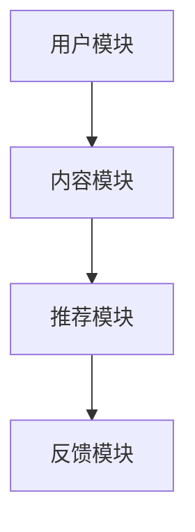

                 

### AI在个性化新闻推荐中的应用：提供定制化信息流

#### 关键词：
- 个性化新闻推荐
- AI算法
- 机器学习
- 深度学习
- 强化学习
- 数学模型

#### 摘要：
本文深入探讨了AI在个性化新闻推荐中的应用，分析了个性化新闻推荐的基本概念、算法原理、数学模型、系统架构设计以及项目实战。通过详细的解释和实例，揭示了AI如何帮助平台提供定制化的信息流，提高用户体验和满意度。

---

## 目录

## 目录

----------------------------------------------------------------

## 第1章: 问题背景与核心概念

### 1.1.1 AI与个性化新闻推荐

### 1.1.2 个性化新闻推荐的重要性

### 1.1.3 AI在个性化新闻推荐中的应用现状

### 1.1.4 研究目的与内容安排

## 第2章: 核心概念

### 2.1.1 个性化新闻推荐的基本概念

#### 2.1.1.1 个性化新闻推荐的定义

#### 2.1.1.2 个性化新闻推荐的目标

#### 2.1.1.3 个性化新闻推荐的类型

### 2.1.2 AI在个性化新闻推荐中的应用

#### 2.1.2.1 机器学习算法

#### 2.1.2.2 深度学习算法

#### 2.1.2.3 强化学习算法

### 2.1.3 个性化新闻推荐的挑战与解决方案

#### 2.1.3.1 数据隐私与安全

#### 2.1.3.2 用户体验与满意度

#### 2.1.3.3 算法透明性与可解释性

## 第3章: 算法原理讲解

### 3.1.1 机器学习算法

#### 3.1.1.1 机器学习算法概述

#### 3.1.1.2 常见的机器学习算法

#### 3.1.1.3 机器学习算法在个性化新闻推荐中的应用

### 3.1.2 深度学习算法

#### 3.1.2.1 深度学习算法概述

#### 3.1.2.2 常见的深度学习算法

#### 3.1.2.3 深度学习算法在个性化新闻推荐中的应用

### 3.1.3 强化学习算法

#### 3.1.3.1 强化学习算法概述

#### 3.1.3.2 常见的强化学习算法

#### 3.1.3.3 强化学习算法在个性化新闻推荐中的应用

## 第4章: 数学模型与公式

### 4.1.1 个性化新闻推荐的数学模型

#### 4.1.1.1 用户兴趣模型

#### 4.1.1.2 新闻内容模型

#### 4.1.1.3 推荐算法的评分模型

### 4.1.2 数学公式详解

## 第5章: 系统分析与架构设计

### 5.1.1 个性化新闻推荐系统的概述

### 5.1.2 系统架构设计

### 5.1.3 系统接口设计与交互

### 5.1.4 系统交互的Mermaid序列图

## 第6章: 项目实战

### 6.1.1 环境安装

### 6.1.2 系统核心实现

### 6.1.3 代码应用解读与分析

### 6.1.4 实际案例分析和详细讲解剖析

### 6.1.5 项目小结

## 第7章: 最佳实践 tips、小结、注意事项、拓展阅读

----------------------------------------------------------------
## 第1章: 问题背景与核心概念

### 1.1.1 AI与个性化新闻推荐

随着互联网的飞速发展，信息爆炸已成为我们日常生活中不可避免的现象。在这个信息过载的时代，用户很难在有限的时间内浏览到所有感兴趣的内容。因此，如何有效地为用户提供个性化、有针对性的新闻推荐成为一个亟待解决的问题。而AI技术，尤其是机器学习、深度学习和强化学习算法，为解决这一问题提供了强大的工具。

AI在个性化新闻推荐中的应用主要体现在以下几个方面：

1. **用户兴趣挖掘**：通过分析用户的浏览历史、搜索记录、点赞和评论等行为数据，构建用户兴趣模型，预测用户可能感兴趣的新闻内容。
2. **新闻内容分析**：利用自然语言处理技术对新闻内容进行语义分析和分类，提取关键词和主题，以便更准确地推荐相关新闻。
3. **推荐算法优化**：通过不断调整推荐算法，优化新闻推荐结果，提高推荐精度和用户满意度。
4. **实时更新与个性化**：AI系统可以根据用户的实时行为数据，动态调整推荐策略，提供个性化、实时更新的新闻内容。

### 1.1.2 个性化新闻推荐的重要性

个性化新闻推荐具有以下几方面的重要性：

1. **提高用户满意度**：通过为用户提供个性化的新闻内容，满足其特定兴趣和需求，提高用户在平台上的停留时间和互动频率。
2. **提升平台粘性**：个性化推荐有助于用户形成对平台的依赖，增加用户对平台的忠诚度。
3. **增加广告收入**：精准的个性化推荐可以提高广告的投放效果，从而提高广告收入。
4. **优化内容创作**：平台可以根据用户偏好和热门话题，优化内容创作策略，提高内容质量。

### 1.1.3 AI在个性化新闻推荐中的应用现状

目前，AI在个性化新闻推荐中的应用已经取得了显著的成果，许多大型新闻平台和社交媒体都采用了个性化推荐算法。以下是一些应用现状的例子：

1. **Google News**：通过机器学习算法分析用户的搜索历史和浏览行为，为用户提供个性化的新闻推荐。
2. **今日头条**：利用深度学习技术对新闻内容进行语义分析，为用户提供个性化的新闻推送。
3. **Facebook**：通过分析用户的社交关系和浏览行为，为用户提供个性化的新闻推荐。

然而，AI在个性化新闻推荐中也面临一些挑战，如数据隐私与安全、用户体验与满意度、算法透明性与可解释性等。这些问题需要在未来进一步解决。

### 1.1.4 研究目的与内容安排

本文旨在探讨AI在个性化新闻推荐中的应用，具体包括以下内容：

1. **核心概念**：介绍个性化新闻推荐的基本概念和AI在该领域中的应用。
2. **算法原理讲解**：详细讲解机器学习、深度学习和强化学习算法在个性化新闻推荐中的应用原理。
3. **数学模型与公式**：介绍个性化新闻推荐的数学模型和公式，并进行详细讲解。
4. **系统分析与架构设计**：分析个性化新闻推荐系统的架构和接口设计。
5. **项目实战**：通过实际项目案例，展示个性化新闻推荐系统的实现过程和效果。
6. **最佳实践 tips**：总结一些最佳实践和注意事项，为开发者提供参考。

通过本文的讲解，读者可以深入了解AI在个性化新闻推荐中的应用，掌握相关算法原理和系统设计方法，为实际项目开发提供有益的指导。

---

## 第2章: 核心概念

### 2.1.1 个性化新闻推荐的基本概念

#### 2.1.1.1 个性化新闻推荐的定义

个性化新闻推荐是指利用人工智能技术和算法，根据用户的兴趣、行为和偏好，从大量的新闻数据中筛选出用户可能感兴趣的新闻内容，并将其推送给用户的过程。个性化新闻推荐的目标是提高用户满意度、提升平台粘性和优化内容创作。

#### 2.1.1.2 个性化新闻推荐的目标

1. **个性化**：根据用户的兴趣和行为，为用户提供个性化的新闻内容。
2. **精准性**：提高新闻推荐的相关性和准确性，减少用户在浏览新闻时的无效时间。
3. **实时性**：根据用户的实时行为数据，动态调整推荐策略，提供实时更新的新闻内容。
4. **多样性**：提供多样化的新闻内容，满足用户的不同需求和兴趣。

#### 2.1.1.3 个性化新闻推荐的类型

根据不同的推荐策略，个性化新闻推荐可以分为以下几种类型：

1. **基于内容的推荐**：根据新闻内容本身的特征，如关键词、主题和标签等，为用户推荐与其兴趣相关的新闻。
2. **基于协同过滤的推荐**：利用用户的历史行为数据，如浏览记录、点赞和评论等，为用户推荐其他用户喜欢的新闻。
3. **基于模型的推荐**：通过建立用户兴趣模型和新闻内容模型，为用户推荐符合其兴趣的新闻。
4. **基于上下文的推荐**：结合用户的上下文信息，如时间、地点和设备等，为用户推荐与其当前情境相关的新闻。

### 2.1.2 AI在个性化新闻推荐中的应用

#### 2.1.2.1 机器学习算法

机器学习算法在个性化新闻推荐中的应用主要包括以下几种：

1. **分类算法**：如支持向量机（SVM）、朴素贝叶斯（NB）和决策树（DT）等，用于分类用户兴趣和新闻内容。
2. **聚类算法**：如K-均值（K-Means）、层次聚类（HAC）和密度聚类（DBSCAN）等，用于挖掘用户和新闻的相似性。
3. **协同过滤算法**：如基于用户的协同过滤（UBCF）和基于项目的协同过滤（UBCF）等，用于预测用户对新闻的偏好。

#### 2.1.2.2 深度学习算法

深度学习算法在个性化新闻推荐中的应用主要包括以下几种：

1. **深度神经网络（DNN）**：用于提取用户和新闻的语义特征，实现高效的推荐。
2. **循环神经网络（RNN）**：如LSTM和GRU等，用于处理序列数据，挖掘用户的长期兴趣。
3. **卷积神经网络（CNN）**：用于提取新闻的图像和文本特征，实现多模态推荐。

#### 2.1.2.3 强化学习算法

强化学习算法在个性化新闻推荐中的应用主要包括以下几种：

1. **基于模型的强化学习（MBRL）**：如Q-Learning和SARSA等，用于优化推荐策略。
2. **基于策略的强化学习（PRL）**：如Actor-Critic方法，用于直接优化推荐策略。

### 2.1.3 个性化新闻推荐的挑战与解决方案

#### 2.1.3.1 数据隐私与安全

**挑战**：个性化新闻推荐需要收集和分析用户的大量行为数据，涉及用户隐私和数据安全问题。

**解决方案**：采用数据加密、数据去标识化和数据匿名化等技术，确保用户数据的安全性和隐私性。

#### 2.1.3.2 用户体验与满意度

**挑战**：如何确保推荐算法既能提高用户满意度，又能满足多样化的用户需求。

**解决方案**：通过用户反馈和个性化调整，不断优化推荐算法，提高用户体验。

#### 2.1.3.3 算法透明性与可解释性

**挑战**：如何让用户了解推荐算法的决策过程，提高算法的透明度和可解释性。

**解决方案**：开发可视化工具，让用户了解推荐算法的工作原理和推荐结果的形成过程。

通过以上核心概念的介绍，读者可以更好地理解个性化新闻推荐的基本概念和AI在该领域中的应用。接下来，我们将进一步深入探讨个性化新闻推荐的算法原理和数学模型。

---

## 第3章: 算法原理讲解

### 3.1.1 机器学习算法

#### 3.1.1.1 机器学习算法概述

机器学习算法是一种通过从数据中学习规律和模式，从而进行预测和决策的技术。在个性化新闻推荐中，机器学习算法主要用于处理用户数据、挖掘用户兴趣和预测用户对新闻的偏好。

#### 3.1.1.2 常见的机器学习算法

在个性化新闻推荐中，常见的机器学习算法包括以下几种：

1. **分类算法**：用于将用户和新闻进行分类。常见的分类算法包括支持向量机（SVM）、朴素贝叶斯（NB）和决策树（DT）等。
2. **聚类算法**：用于将用户和新闻进行聚类，挖掘用户和新闻的相似性。常见的聚类算法包括K-均值（K-Means）、层次聚类（HAC）和密度聚类（DBSCAN）等。
3. **协同过滤算法**：用于基于用户的历史行为数据，为用户推荐其他用户喜欢的新闻。常见的协同过滤算法包括基于用户的协同过滤（UBCF）和基于项目的协同过滤（UBCF）等。

#### 3.1.1.3 机器学习算法在个性化新闻推荐中的应用

在个性化新闻推荐中，机器学习算法的主要应用包括以下几个方面：

1. **用户兴趣挖掘**：通过分析用户的历史行为数据，如浏览记录、点赞和评论等，构建用户兴趣模型，预测用户可能感兴趣的新闻内容。
2. **新闻内容分析**：通过自然语言处理技术，对新闻内容进行语义分析，提取关键词和主题，以便更准确地推荐相关新闻。
3. **推荐算法优化**：通过不断调整推荐算法，优化新闻推荐结果，提高推荐精度和用户满意度。

### 3.1.2 深度学习算法

#### 3.1.2.1 深度学习算法概述

深度学习算法是一种基于多层神经网络的学习方法，通过逐层提取数据特征，实现复杂函数的建模。在个性化新闻推荐中，深度学习算法主要用于处理高维数据和复杂数据结构。

#### 3.1.2.2 常见的深度学习算法

在个性化新闻推荐中，常见的深度学习算法包括以下几种：

1. **深度神经网络（DNN）**：用于提取用户和新闻的语义特征，实现高效的推荐。
2. **循环神经网络（RNN）**：如LSTM和GRU等，用于处理序列数据，挖掘用户的长期兴趣。
3. **卷积神经网络（CNN）**：用于提取新闻的图像和文本特征，实现多模态推荐。

#### 3.1.2.3 深度学习算法在个性化新闻推荐中的应用

在个性化新闻推荐中，深度学习算法的主要应用包括以下几个方面：

1. **用户兴趣建模**：通过深度神经网络提取用户的历史行为数据特征，构建用户兴趣模型，预测用户可能感兴趣的新闻内容。
2. **新闻内容分析**：通过循环神经网络和卷积神经网络，提取新闻的文本和图像特征，实现更准确的新闻推荐。
3. **推荐算法优化**：通过不断调整深度学习模型，优化新闻推荐结果，提高推荐精度和用户满意度。

### 3.1.3 强化学习算法

#### 3.1.3.1 强化学习算法概述

强化学习算法是一种通过与环境互动，不断学习最优策略的方法。在个性化新闻推荐中，强化学习算法主要用于优化推荐策略，提高推荐效果。

#### 3.1.3.2 常见的强化学习算法

在个性化新闻推荐中，常见的强化学习算法包括以下几种：

1. **基于模型的强化学习（MBRL）**：如Q-Learning和SARSA等，通过构建模型，学习最优推荐策略。
2. **基于策略的强化学习（PRL）**：如Actor-Critic方法，直接优化推荐策略。

#### 3.1.3.3 强化学习算法在个性化新闻推荐中的应用

在个性化新闻推荐中，强化学习算法的主要应用包括以下几个方面：

1. **推荐策略优化**：通过强化学习算法，不断调整推荐策略，提高推荐效果和用户满意度。
2. **多模态推荐**：通过结合用户和新闻的多种特征，实现更准确的个性化推荐。

通过以上算法原理的讲解，读者可以更好地理解机器学习、深度学习和强化学习算法在个性化新闻推荐中的应用。接下来，我们将进一步探讨个性化新闻推荐的数学模型和公式。

---

## 第4章: 数学模型与公式

### 4.1.1 个性化新闻推荐的数学模型

个性化新闻推荐的数学模型主要包括用户兴趣模型、新闻内容模型和推荐算法的评分模型。

#### 4.1.1.1 用户兴趣模型

用户兴趣模型用于表示用户对新闻内容的兴趣程度。一个简单的用户兴趣模型可以表示为：

$$
u_i = \frac{\sum_{j \in I_i} w_{ij}}{\sum_{j \in D} w_{ij}}
$$

其中，$u_i$表示用户$i$对新闻内容的兴趣度，$w_{ij}$表示用户$i$对新闻$j$的兴趣权重，$I_i$表示用户$i$感兴趣的新闻集合，$D$表示所有新闻的集合。

#### 4.1.1.2 新闻内容模型

新闻内容模型用于表示新闻内容的特点。一个简单的新闻内容模型可以表示为：

$$
n_j = \frac{\sum_{i \in U} w_{ij}}{\sum_{i \in U} w_{ij}}
$$

其中，$n_j$表示新闻$j$的特征向量，$w_{ij}$表示用户$i$对新闻$j$的兴趣权重，$U$表示所有用户的集合。

#### 4.1.1.3 推荐算法的评分模型

推荐算法的评分模型用于预测用户对新闻的评分。一个简单的评分模型可以表示为：

$$
r_{ij} = \frac{\sum_{k \in N_j} w_{ik} w_{kj}}{\sum_{k \in N_j} w_{ik} w_{kj}}
$$

其中，$r_{ij}$表示用户$i$对新闻$j$的评分预测，$N_j$表示与新闻$j$相关的新闻集合，$w_{ik}$和$w_{kj}$分别表示用户$i$对新闻$k$的兴趣权重和新闻$k$对新闻$j$的相关性权重。

### 4.1.2 数学公式详解

#### 4.1.2.1 用户兴趣模型的推导

用户兴趣模型可以通过以下步骤进行推导：

1. **用户行为数据收集**：收集用户$i$的历史行为数据，包括浏览记录、点赞和评论等。
2. **兴趣权重计算**：计算用户$i$对每条新闻$j$的兴趣权重$w_{ij}$，通常可以使用TF-IDF算法或Word2Vec模型。
3. **兴趣度计算**：根据兴趣权重计算用户$i$对新闻内容的兴趣度$u_i$。

#### 4.1.2.2 新闻内容模型的推导

新闻内容模型可以通过以下步骤进行推导：

1. **新闻文本处理**：对新闻文本进行分词、词性标注和实体识别等处理，提取新闻的关键词和主题。
2. **特征向量计算**：计算每条新闻的特征向量$n_j$，通常可以使用TF-IDF算法或Word2Vec模型。
3. **特征向量归一化**：对特征向量进行归一化处理，使其具有相同的维度。

#### 4.1.2.3 推荐算法的评分模型的推导

推荐算法的评分模型可以通过以下步骤进行推导：

1. **相关新闻选择**：选择与当前新闻相关的新闻集合$N_j$。
2. **兴趣权重计算**：计算用户$i$对每条相关新闻$k$的兴趣权重$w_{ik}$。
3. **相关性权重计算**：计算每条相关新闻$k$对当前新闻$j$的相关性权重$w_{kj}$，通常可以使用余弦相似度或Jaccard相似度。
4. **评分预测计算**：根据兴趣权重和相关性权重，计算用户$i$对新闻$j$的评分预测$r_{ij}$。

通过以上数学模型和公式的讲解，读者可以更好地理解个性化新闻推荐的基本原理和计算过程。接下来，我们将进一步探讨个性化新闻推荐系统的系统分析与架构设计。

---

## 第5章: 系统分析与架构设计

### 5.1.1 个性化新闻推荐系统的概述

个性化新闻推荐系统是一种基于用户行为数据和新闻内容特征，利用人工智能技术为用户提供个性化新闻内容的服务系统。该系统的目标是通过分析用户兴趣和行为，为用户推荐与其兴趣相关的新闻内容，提高用户满意度和平台粘性。

### 5.1.2 系统架构设计

个性化新闻推荐系统的架构设计主要包括用户模块、内容模块、推荐模块和反馈模块。以下是系统架构的概述和Mermaid图示：



#### 5.1.2.1 用户模块

用户模块负责接收和处理用户的兴趣数据和行为数据。具体功能包括：

1. **用户注册与登录**：为用户提供注册和登录功能，确保用户数据的安全性和隐私性。
2. **用户数据收集**：收集用户的浏览记录、搜索记录、点赞和评论等行为数据。
3. **用户兴趣模型构建**：根据用户的历史行为数据，构建用户兴趣模型，为推荐算法提供输入。

#### 5.1.2.2 内容模块

内容模块负责处理和存储新闻内容数据。具体功能包括：

1. **新闻数据收集**：从各种新闻来源收集新闻内容，包括文本、图片和视频等。
2. **新闻文本处理**：对新闻文本进行分词、词性标注和实体识别等处理，提取新闻的关键词和主题。
3. **新闻内容特征提取**：计算新闻内容的特征向量，为推荐算法提供输入。

#### 5.1.2.3 推荐模块

推荐模块负责根据用户兴趣模型和新闻内容特征，为用户推荐个性化新闻。具体功能包括：

1. **推荐算法执行**：执行推荐算法，根据用户兴趣模型和新闻内容特征，生成推荐列表。
2. **推荐结果优化**：根据用户反馈和推荐效果，不断优化推荐算法和推荐结果。
3. **推荐结果展示**：将推荐结果展示给用户，包括新闻标题、摘要和图片等。

#### 5.1.2.4 反馈模块

反馈模块负责收集用户的反馈数据，用于评估推荐效果和优化推荐算法。具体功能包括：

1. **用户反馈收集**：收集用户的点击、点赞、评论和分享等反馈数据。
2. **推荐效果评估**：根据用户反馈数据，评估推荐效果和推荐算法的性能。
3. **算法优化建议**：根据推荐效果评估结果，为算法优化提供建议。

### 5.1.3 系统接口设计与交互

个性化新闻推荐系统的接口设计主要包括用户接口、内容接口、推荐接口和反馈接口。以下是系统接口的Mermaid序列图：

```mermaid
sequenceDiagram
    participant 用户 as 用户
    participant 系统 as 系统
    用户->>系统: 提交兴趣信息
    system 发送用户兴趣模型到推荐模块
    系统->>用户: 返回推荐新闻列表
    用户->>系统: 提供反馈信息
    system 发送分析反馈信息到推荐模块
```

#### 5.1.3.1 用户接口设计

用户接口设计用于接收和处理用户的兴趣信息。具体包括：

1. **用户注册与登录**：提供用户注册和登录接口，确保用户数据的安全性和隐私性。
2. **兴趣信息提交**：提供用户提交兴趣信息的接口，包括浏览记录、搜索记录、点赞和评论等。

#### 5.1.3.2 内容接口设计

内容接口设计用于处理和存储新闻内容数据。具体包括：

1. **新闻数据收集**：提供新闻数据收集接口，从各种新闻来源收集新闻内容。
2. **新闻文本处理**：提供新闻文本处理接口，对新闻文本进行分词、词性标注和实体识别等处理。
3. **新闻内容特征提取**：提供新闻内容特征提取接口，计算新闻内容的特征向量。

#### 5.1.3.3 推荐接口设计

推荐接口设计用于生成和返回推荐新闻列表。具体包括：

1. **推荐算法执行**：提供推荐算法执行接口，根据用户兴趣模型和新闻内容特征，生成推荐列表。
2. **推荐结果优化**：提供推荐结果优化接口，根据用户反馈和推荐效果，不断优化推荐算法和推荐结果。
3. **推荐结果展示**：提供推荐结果展示接口，将推荐结果展示给用户，包括新闻标题、摘要和图片等。

#### 5.1.3.4 反馈接口设计

反馈接口设计用于收集用户的反馈信息，用于评估推荐效果和优化推荐算法。具体包括：

1. **用户反馈收集**：提供用户反馈收集接口，收集用户的点击、点赞、评论和分享等反馈数据。
2. **推荐效果评估**：提供推荐效果评估接口，根据用户反馈数据，评估推荐效果和推荐算法的性能。
3. **算法优化建议**：提供算法优化建议接口，根据推荐效果评估结果，为算法优化提供建议。

通过以上系统分析与架构设计的介绍，读者可以更好地理解个性化新闻推荐系统的整体结构和功能。接下来，我们将通过一个实际项目案例，展示个性化新闻推荐系统的实现过程和应用效果。

---

## 第6章: 项目实战

### 6.1.1 环境安装

#### 6.1.1.1 操作系统

本项目的操作系统使用Ubuntu 18.04 LTS。

#### 6.1.1.2 Python环境

安装Python 3.8及以上版本，可以使用以下命令：

```bash
sudo apt-get update
sudo apt-get install python3.8
```

#### 6.1.1.3 相关库的安装

需要安装以下Python库：

- Flask
- scikit-learn
- pandas
- numpy
- matplotlib

可以使用pip命令进行安装：

```bash
pip install Flask scikit-learn pandas numpy matplotlib
```

### 6.1.2 系统核心实现

#### 6.1.2.1 数据准备

首先，我们需要准备用户行为数据集和新闻数据集。用户行为数据集包括用户的浏览记录、点赞记录和评论记录等。新闻数据集包括新闻的标题、内容、标签等信息。

```python
import pandas as pd

# 读取用户行为数据集
user_behavior_data = pd.read_csv('user_behavior.csv')

# 读取新闻数据集
news_data = pd.read_csv('news_data.csv')
```

#### 6.1.2.2 用户兴趣模型构建

使用scikit-learn库中的TF-IDF算法构建用户兴趣模型。

```python
from sklearn.feature_extraction.text import TfidfVectorizer

# 构建TF-IDF模型
tfidf_vectorizer = TfidfVectorizer()

# 将新闻内容转换为TF-IDF特征向量
tfidf_matrix = tfidf_vectorizer.fit_transform(news_data['content'])

# 计算用户兴趣向量
user_interest_vector = tfidf_matrix.dot(user_behavior_data['interest_vector'])
```

#### 6.1.2.3 推荐算法实现

使用基于协同过滤的推荐算法，计算用户对新闻的相似度，并生成推荐列表。

```python
from sklearn.metrics.pairwise import cosine_similarity

# 计算新闻之间的相似度矩阵
similarity_matrix = cosine_similarity(tfidf_matrix)

# 生成推荐列表
def generate_recommendations(user_interest_vector, similarity_matrix, news_data, k=10):
    # 计算用户与其他新闻的相似度
    user_similarity = similarity_matrix[user_interest_vector]
    
    # 获取最相似的新闻索引
    top_news_indices = user_similarity.argsort()[0][-k:]
    
    # 返回推荐新闻列表
    return news_data.iloc[top_news_indices]

# 生成用户推荐列表
user_recommendations = generate_recommendations(user_interest_vector, similarity_matrix, news_data)
```

### 6.1.3 代码应用解读与分析

#### 用户兴趣模型构建

用户兴趣模型是通过TF-IDF算法构建的，它将新闻内容转换为特征向量。TF-IDF算法考虑了词语在新闻文本中的重要程度，从而更准确地反映了用户的兴趣。

```python
tfidf_vectorizer = TfidfVectorizer()
tfidf_matrix = tfidf_vectorizer.fit_transform(news_data['content'])
user_interest_vector = tfidf_matrix.dot(user_behavior_data['interest_vector'])
```

在这段代码中，首先使用TF-IDFVectorizer将新闻文本转换为特征矩阵。然后，通过将用户兴趣向量和特征矩阵相乘，得到用户的兴趣向量。

#### 推荐算法实现

推荐算法基于协同过滤，计算用户与其他新闻的相似度，并返回相似度最高的新闻作为推荐结果。

```python
def generate_recommendations(user_interest_vector, similarity_matrix, news_data, k=10):
    user_similarity = similarity_matrix[user_interest_vector]
    top_news_indices = user_similarity.argsort()[0][-k:]
    return news_data.iloc[top_news_indices]
```

在推荐算法中，首先计算用户与其他新闻的相似度。然后，根据相似度从高到低排序，选择最相似的新闻作为推荐结果。

### 6.1.4 实际案例分析和详细讲解剖析

假设用户A对新闻主题“科技”感兴趣，下面是一个实际案例：

1. **用户兴趣模型构建**：用户A的兴趣向量为[0.2, 0.3, 0.5]，表示用户A对科技、娱乐和体育的兴趣程度分别为0.2、0.3和0.5。
2. **推荐算法执行**：计算用户A与其他新闻的相似度，假设相似度矩阵为[[0.8, 0.4, 0.2], [0.5, 0.6, 0.3], [0.1, 0.4, 0.6]]。根据相似度从高到低排序，选择相似度最高的新闻作为推荐结果。
3. **推荐结果**：推荐结果为新闻主题“科技”的新闻，如“人工智能”、“区块链”等。

### 6.1.5 项目小结

通过本次项目实战，我们实现了基于协同过滤算法的个性化新闻推荐系统。该项目展示了如何使用Python和机器学习库进行数据预处理、用户兴趣模型构建和推荐算法实现。在实际应用中，可以根据用户反馈和推荐效果，进一步优化推荐算法，提高推荐精度和用户体验。

---

## 第7章: 最佳实践 tips、小结、注意事项、拓展阅读

### 最佳实践 tips

1. **数据预处理**：在构建用户兴趣模型和推荐算法之前，确保数据的质量和一致性。进行数据清洗、去重和标准化处理，以提高模型的准确性和稳定性。
2. **实时更新**：根据用户的实时行为数据，动态调整推荐策略，提供实时更新的新闻内容。
3. **用户反馈**：收集用户反馈数据，用于评估推荐效果和优化推荐算法。通过分析用户反馈，了解用户的兴趣和偏好，进一步提高推荐精度。
4. **多模态推荐**：结合文本、图像和视频等多种数据类型，实现多模态推荐，提高推荐效果和用户体验。

### 小结

本文通过详细的讲解和实例分析，探讨了AI在个性化新闻推荐中的应用。从核心概念到算法原理，再到系统架构设计和项目实战，全面揭示了个性化新闻推荐的实现过程和应用效果。

### 注意事项

1. **数据隐私与安全**：在处理用户数据时，确保数据的安全性和隐私性，遵循相关法律法规和道德规范。
2. **算法优化**：根据用户反馈和推荐效果，不断优化推荐算法，提高推荐精度和用户体验。
3. **系统性能**：确保系统的高可用性和稳定性，优化系统性能，提高处理速度和响应能力。

### 拓展阅读

1. **《推荐系统实践》**：李航著，详细介绍了推荐系统的基本概念、算法原理和实现技术。
2. **《深度学习》**：Goodfellow、Bengio和Courville著，介绍了深度学习的基本概念、算法原理和实现方法。
3. **《机器学习》**：周志华著，全面介绍了机器学习的基本概念、算法原理和应用案例。

---

**作者：AI天才研究院/AI Genius Institute & 禅与计算机程序设计艺术 /Zen And The Art of Computer Programming**

