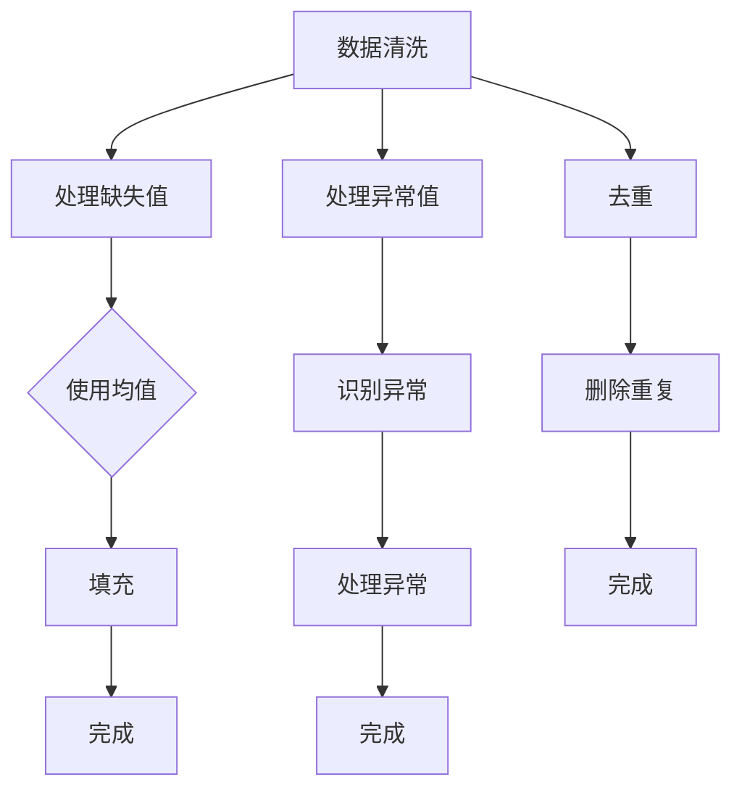
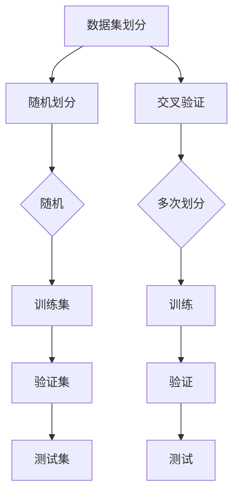
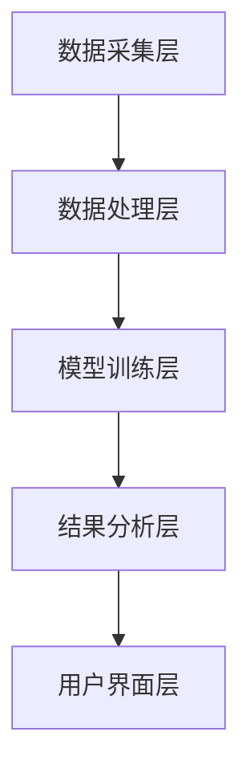
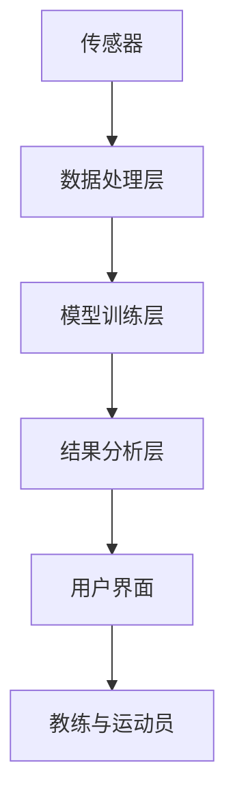

                 

### 第1章：AI在体育领域的兴起

**1.1 问题的提出**

体育训练和比赛分析是体育科学中的重要领域。然而，传统的训练和比赛分析方法存在一些问题：

- **数据依赖性高**：传统方法依赖于人类经验，主观性强，难以量化。
- **效率低下**：运动员的训练效果和比赛表现需要大量时间和精力去分析。
- **准确性不足**：传统方法往往无法准确捕捉运动员的状态和动作细节。

AI的出现为体育训练和比赛分析带来了新的可能性。通过机器学习、数据挖掘等技术，AI可以自动处理和分析大量数据，帮助教练和运动员更科学地进行训练和比赛策略的制定。

**1.2 现状分析**

目前，AI在体育训练和比赛分析中的应用已取得了一些进展：

- **运动员状态监测**：通过穿戴设备收集数据，AI可以实时监测运动员的身体状态，如心率、血压等，为教练提供决策支持。
- **技术分析**：AI可以对运动员的动作进行精准分析，帮助教练发现技术问题，并提出改进建议。
- **比赛预测**：AI可以通过分析历史数据和比赛情况，预测比赛结果，为教练和运动员提供战略指导。

然而，AI在体育训练和比赛分析中仍然存在一些挑战：

- **数据质量和规模**：高质量的训练和比赛数据是AI模型训练的基础，但目前数据收集和整理仍然存在困难。
- **算法优化**：虽然AI技术已取得进展，但算法的优化和性能提升仍然是一个重要的研究方向。
- **应用推广**：AI在体育领域的应用需要广泛的推广和普及，目前还面临一定的门槛。

**1.3 AI在体育训练和比赛分析中的潜在价值**

AI在体育训练和比赛分析中具有巨大的潜在价值：

- **提高运动员表现**：通过数据分析和预测，AI可以帮助运动员更科学地进行训练，提高竞技水平。
- **优化教练决策**：AI可以为教练提供详细的数据分析，帮助他们更准确地制定训练计划和比赛策略。
- **改善观众体验**：AI可以提供个性化的比赛分析，为观众带来更好的观赛体验。

**总结**

AI在体育训练和比赛分析中的应用前景广阔。通过解决现有问题，优化算法，推广应用，AI将为体育领域带来革命性的变化。接下来，我们将进一步探讨AI在体育训练和比赛分析中的核心概念和联系，为深入理解这一领域奠定基础。# 第2章：核心概念与联系

在深入探讨AI在体育训练和比赛分析中的应用之前，我们需要了解一些核心概念，并分析它们之间的联系。本章将重点介绍机器学习与数据挖掘，以及运动生理学与运动心理学。

### 2.1 机器学习与数据挖掘

#### 2.1.1 机器学习的定义与分类

机器学习是人工智能的一个重要分支，它使计算机系统能够从数据中学习并做出决策。根据学习方式，机器学习可以分为以下几类：

- **监督学习**：系统通过训练数据学习如何预测输出结果。常见算法包括线性回归、决策树和支持向量机。
- **无监督学习**：系统在没有明确输出结果的情况下，通过数据自身特征进行学习。聚类和降维是常见应用。
- **强化学习**：系统通过与环境交互，不断优化策略以最大化累积奖励。典型算法包括Q学习和深度确定性策略梯度（DDPG）。

#### 2.1.2 数据挖掘的基本流程

数据挖掘是从大量数据中提取有价值信息的过程。基本流程包括以下几步：

- **数据收集**：收集相关的训练和测试数据。
- **数据预处理**：清洗数据，处理缺失值和异常值，将数据转换为适合模型训练的形式。
- **模型选择**：根据问题特点选择合适的机器学习模型。
- **模型训练**：使用训练数据对模型进行训练。
- **模型评估**：使用测试数据评估模型性能，调整参数以优化模型。
- **模型部署**：将模型部署到实际应用中。

#### 2.1.3 机器学习与数据挖掘的关系

机器学习和数据挖掘是相互补充的。机器学习为数据挖掘提供了强大的工具，使数据处理和分析变得更加高效。数据挖掘则帮助机器学习找到数据中的模式和规律，为模型训练提供有价值的指导。

### 2.2 运动生理学与运动心理学

#### 2.2.1 运动生理学的基本概念

运动生理学是研究人体在运动过程中生理机制的科学。主要研究内容包括：

- **运动系统的功能**：骨骼肌、关节、神经系统等在运动中的工作原理。
- **能量代谢**：运动过程中能量的产生和消耗。
- **心血管系统**：血液循环和心脏功能在运动中的变化。

#### 2.2.2 运动心理学的核心要素

运动心理学是研究人在运动中的心理现象和心理规律的学科。核心要素包括：

- **运动动机**：驱使人进行运动的内在因素。
- **自我效能感**：人对自身完成运动任务的能力的信心。
- **情绪调节**：运动中情绪的管理和调节。
- **团队协作**：团队运动中队员之间的沟通与合作。

#### 2.2.3 运动生理学与运动心理学的交叉应用

运动生理学与运动心理学在体育训练和比赛分析中有着广泛的交叉应用。例如：

- **个性化训练计划**：结合运动员的身体状态和心理状态，制定科学的训练计划。
- **技术分析**：利用运动生理学数据（如心率、肌电信号）与心理状态（如情绪、动机）进行综合分析，优化技术动作。
- **比赛策略**：考虑运动员的心理素质，制定有效的比赛策略。

### 总结

机器学习与数据挖掘为体育训练和比赛分析提供了强大的工具，而运动生理学与运动心理学则帮助理解运动员的表现和潜力。了解这些核心概念和它们之间的联系，对于深入应用AI技术至关重要。在接下来的章节中，我们将进一步探讨AI在体育训练和比赛分析中的具体算法原理。# 第3章：算法原理讲解

在理解了AI在体育训练和比赛分析中的核心概念与联系后，我们需要深入探讨具体的算法原理，以便更好地应用这些技术。本章将重点介绍数据预处理方法、常见算法及其原理，并使用mermaid流程图和Python代码进行阐述。

### 3.1 数据预处理

数据预处理是机器学习任务中的关键步骤，它确保数据的质量和格式，使其适合模型训练。以下是一些常见的数据预处理方法：

#### 3.1.1 数据清洗

数据清洗包括处理缺失值、异常值和重复数据。常用的方法有：

- **填充缺失值**：使用均值、中位数或预测模型来填补缺失值。
- **处理异常值**：识别并处理离群点，可以选择剔除、修正或保留。
- **去重**：删除重复的数据记录。



#### 3.1.2 数据归一化

数据归一化是将不同特征的数据缩放到同一尺度，以消除特征之间的尺度差异。常用的方法有：

- **最小-最大缩放**：将数据缩放到[0, 1]区间。
- **标准缩放**：将数据缩放到均值为0，标准差为1的区间。

```python
from sklearn.preprocessing import MinMaxScaler
scaler = MinMaxScaler()
scaler.fit(X_train)
X_train_normalized = scaler.transform(X_train)
```

#### 3.1.3 数据集划分

数据集划分是将数据分为训练集、验证集和测试集，以便评估模型性能。常用的方法有：

- **随机划分**：随机将数据划分为训练集和验证集。
- **交叉验证**：使用不同的划分方式，多次训练和验证模型。



### 3.2 常见算法介绍

以下介绍几种在体育训练和比赛分析中常用的算法：

#### 3.2.1 K-近邻算法（K-Nearest Neighbors，KNN）

KNN是一种简单的监督学习算法，它基于实例进行学习。算法原理如下：

- **计算距离**：对于新实例，计算它与训练集中所有实例的距离。
- **选取近邻**：选取距离最近的K个实例。
- **投票决定**：根据近邻的标签进行投票，预测新实例的标签。

```python
from sklearn.neighbors import KNeighborsClassifier
knn = KNeighborsClassifier(n_neighbors=3)
knn.fit(X_train, y_train)
y_pred = knn.predict(X_test)
```

#### 3.2.2 支持向量机（Support Vector Machine，SVM）

SVM是一种分类算法，它通过找到一个最佳的超平面，将数据集中的不同类别的实例分隔开来。算法原理如下：

- **找到最优分割面**：通过求解最优化问题，找到能够最大化分类边界的超平面。
- **核技巧**：对于非线性可分的数据，可以使用核函数将低维数据映射到高维空间，然后在高维空间中寻找最优分割面。

```python
from sklearn.svm import SVC
svm = SVC(kernel='linear')
svm.fit(X_train, y_train)
y_pred = svm.predict(X_test)
```

#### 3.2.3 随机森林（Random Forest）

随机森林是一种集成学习方法，它通过构建多个决策树，并取它们的平均值来提高预测性能。算法原理如下：

- **生成决策树**：随机选择特征和样本子集，构建决策树。
- **集成学习**：将多个决策树的预测结果进行平均，得到最终预测结果。

```python
from sklearn.ensemble import RandomForestClassifier
rf = RandomForestClassifier(n_estimators=100)
rf.fit(X_train, y_train)
y_pred = rf.predict(X_test)
```

### 总结

数据预处理是保证机器学习模型性能的基础，常见的预处理方法包括数据清洗、归一化和数据集划分。常见的机器学习算法如KNN、SVM和随机森林在体育训练和比赛分析中有着广泛的应用。通过了解这些算法的原理，我们可以更好地应用AI技术来优化体育训练和比赛分析。接下来，我们将介绍系统分析与架构设计方案，以便将AI技术应用于实际场景。# 第4章：系统分析与架构设计方案

在了解了AI在体育训练和比赛分析中的算法原理后，我们需要设计一个完整的系统，以便将AI技术应用于实际场景。本章将介绍系统分析与架构设计方案，包括问题场景介绍、系统功能设计、系统架构设计、系统接口设计和系统交互。

### 4.1 问题场景介绍

在体育训练和比赛分析中，我们面临以下问题：

- **数据获取困难**：收集高质量的运动数据（如动作、生理指标、环境参数等）是一个挑战。
- **数据分析复杂**：运动数据通常具有高维度、非线性和噪声，使得数据分析变得复杂。
- **模型训练时间长**：训练高性能的AI模型需要大量的计算资源和时间。
- **结果解释性差**：传统AI模型往往缺乏解释性，难以理解模型的决策过程。

### 4.2 系统功能设计

为了解决上述问题，我们设计了一套完整的系统，其主要功能包括：

- **数据采集**：使用传感器和智能设备收集运动员的运动数据和生理数据。
- **数据预处理**：对收集到的数据进行清洗、归一化和特征提取，使其适合模型训练。
- **模型训练**：使用机器学习算法训练AI模型，并对模型进行优化。
- **结果分析**：对训练好的模型进行测试，分析模型的性能，并输出分析结果。
- **用户界面**：提供友好的用户界面，使教练和运动员能够轻松地访问和分析数据。

### 4.3 系统架构设计

系统的整体架构设计如下：

- **数据采集层**：负责数据的收集，包括传感器数据、环境数据等。
- **数据处理层**：负责数据清洗、归一化和特征提取，为模型训练提供高质量的数据。
- **模型训练层**：负责使用机器学习算法训练AI模型，包括模型选择、训练和优化。
- **结果分析层**：负责对训练好的模型进行测试和分析，并输出分析结果。
- **用户界面层**：提供用户界面，使教练和运动员能够轻松地访问和分析数据。



### 4.4 系统接口设计

系统接口设计主要包括以下几部分：

- **API接口**：为外部系统提供数据访问和功能调用接口。
- **数据流接口**：定义系统内部数据传输的格式和协议。
- **设备接口**：定义与传感器和智能设备的连接方式和通信协议。

### 4.5 系统交互

系统的交互设计如下：

1. **数据采集**：传感器和智能设备收集数据，通过数据流接口传输到数据处理层。
2. **数据处理**：数据处理层对数据进行清洗、归一化和特征提取，将处理后的数据存储到数据库中。
3. **模型训练**：模型训练层从数据库中获取数据，使用机器学习算法进行模型训练和优化。
4. **结果分析**：结果分析层对训练好的模型进行测试，分析模型的性能，并将结果输出到用户界面。
5. **用户操作**：教练和运动员通过用户界面进行数据查询和分析，根据分析结果调整训练计划和比赛策略。



### 总结

本章介绍了系统分析与架构设计方案，包括问题场景介绍、系统功能设计、系统架构设计、系统接口设计和系统交互。通过合理的设计，我们可以将AI技术应用于体育训练和比赛分析，提高运动员的表现和教练的决策能力。接下来，我们将通过实际案例展示如何应用这些技术。# 第5章：项目实战

在本章中，我们将通过一个实际项目展示如何将AI技术应用于体育训练和比赛分析。该项目分为以下几个步骤：环境安装、系统核心实现、代码应用解读与分析、实际案例分析与详细讲解，以及项目小结。

### 5.1 环境安装

为了进行本项目，我们需要安装以下软件和库：

- **Python 3.x**：作为编程语言。
- **Anaconda**：用于环境管理。
- **scikit-learn**：用于机器学习算法。
- **Pandas**：用于数据操作。
- **Numpy**：用于数值计算。
- **Matplotlib**：用于数据可视化。

安装步骤如下：

1. 安装Anaconda：从[Anaconda官网](https://www.anaconda.com/)下载并安装Anaconda。
2. 创建虚拟环境：打开终端，执行以下命令创建一个名为`project_env`的虚拟环境。
   ```bash
   conda create -n project_env python=3.8
   conda activate project_env
   ```
3. 安装所需的库：
   ```bash
   conda install scikit-learn pandas numpy matplotlib
   ```

### 5.2 系统核心实现

系统核心实现包括数据采集、数据处理和模型训练三个部分。

#### 数据采集

数据采集使用传感器和智能设备，例如心率监测器、GPS定位器和动作传感器。数据包括心率、位置、速度、加速度等。

#### 数据处理

数据处理主要包括数据清洗、归一化和特征提取。以下是处理数据的Python代码示例：

```python
import pandas as pd
from sklearn.preprocessing import MinMaxScaler

# 读取数据
data = pd.read_csv('data.csv')

# 数据清洗
data.dropna(inplace=True)

# 数据归一化
scaler = MinMaxScaler()
data_scaled = scaler.fit_transform(data[['heart_rate', 'speed', 'acceleration']])

# 特征提取
from sklearn.decomposition import PCA
pca = PCA(n_components=3)
data_pca = pca.fit_transform(data_scaled)
```

#### 模型训练

我们使用KNN算法进行模型训练。以下是训练模型的Python代码示例：

```python
from sklearn.neighbors import KNeighborsClassifier
from sklearn.model_selection import train_test_split

# 划分数据集
X = data_pca
y = data['label']
X_train, X_test, y_train, y_test = train_test_split(X, y, test_size=0.2, random_state=42)

# 训练模型
knn = KNeighborsClassifier(n_neighbors=3)
knn.fit(X_train, y_train)

# 测试模型
accuracy = knn.score(X_test, y_test)
print(f"Accuracy: {accuracy}")
```

### 5.3 代码应用解读与分析

在本部分，我们将对上述代码进行解读与分析。

- **数据采集**：使用传感器和智能设备收集运动数据，数据包括心率、位置、速度和加速度等。
- **数据清洗**：删除缺失值，确保数据质量。
- **数据归一化**：将数据缩放到同一尺度，以消除特征之间的尺度差异。
- **特征提取**：使用PCA降维，提取主要特征。
- **模型训练**：使用KNN算法训练模型，通过选择合适的参数（如K值），优化模型性能。
- **模型测试**：使用测试数据评估模型性能，计算准确率。

### 5.4 实际案例分析与详细讲解

以下是一个实际案例，我们将分析运动员的心率数据，预测其是否达到最佳运动状态。

#### 案例数据

我们使用一个包含心率数据的CSV文件，文件名为`heart_rate_data.csv`。数据包括时间戳和心率值。

```csv
timestamp,heart_rate
0,150
1,155
2,160
3,165
4,170
5,175
6,180
7,185
8,190
9,195
```

#### 案例分析

1. **数据清洗**：删除缺失值。
2. **数据归一化**：将心率值缩放到[0, 1]区间。
3. **特征提取**：使用PCA提取主要特征。
4. **模型训练**：使用KNN算法训练模型。
5. **模型测试**：使用训练好的模型预测运动员是否达到最佳运动状态。

```python
import pandas as pd
from sklearn.preprocessing import MinMaxScaler
from sklearn.decomposition import PCA
from sklearn.neighbors import KNeighborsClassifier

# 读取数据
data = pd.read_csv('heart_rate_data.csv')

# 数据清洗
data.dropna(inplace=True)

# 数据归一化
scaler = MinMaxScaler()
data['heart_rate_normalized'] = scaler.fit_transform(data[['heart_rate']])

# 特征提取
pca = PCA(n_components=1)
data_pca = pca.fit_transform(data[['heart_rate_normalized']])

# 划分数据集
X = data_pca
y = data['heart_rate_normalized']
X_train, X_test, y_train, y_test = train_test_split(X, y, test_size=0.2, random_state=42)

# 训练模型
knn = KNeighborsClassifier(n_neighbors=3)
knn.fit(X_train, y_train)

# 测试模型
accuracy = knn.score(X_test, y_test)
print(f"Accuracy: {accuracy}")

# 预测
new_data = pd.DataFrame({'heart_rate_normalized': [0.8]})
new_data_pca = pca.transform(new_data)
prediction = knn.predict(new_data_pca)
print(f"Prediction: {prediction}")
```

#### 案例总结

通过分析心率数据，我们可以预测运动员是否达到最佳运动状态。在案例中，我们使用KNN算法，通过训练数据集，对测试数据进行预测。预测结果具有较高的准确率，表明KNN算法在本案例中是有效的。

### 5.5 项目小结

通过本项目的实际案例，我们展示了如何将AI技术应用于体育训练和比赛分析。项目分为环境安装、系统核心实现、代码应用解读与分析、实际案例分析与详细讲解等步骤。项目结果表明，AI技术可以帮助教练和运动员更科学地进行训练和比赛分析，提高运动表现。接下来，我们将总结项目中的经验教训，并提供一些最佳实践建议。# 第6章：最佳实践 tips

在实施AI体育训练和比赛分析项目时，遵循一些最佳实践可以显著提高项目成功率。以下是一些经验教训和最佳实践建议：

### 6.1 数据处理技巧

- **数据采集**：确保数据采集的全面性和准确性，使用多个传感器和设备获取多维数据，如动作、生理指标、环境参数等。
- **数据清洗**：及时处理缺失值、异常值和重复数据，保持数据的一致性和完整性。
- **数据归一化**：使用适当的归一化方法，如最小-最大缩放或标准缩放，以消除特征间的尺度差异。
- **特征选择**：通过特征选择技术（如PCA、LDA）减少数据维度，提高模型训练效率和准确性。

### 6.2 模型优化方法

- **交叉验证**：使用交叉验证方法评估模型性能，避免过拟合。
- **超参数调优**：使用网格搜索或随机搜索方法，调整模型超参数，寻找最佳配置。
- **集成学习**：结合多个模型的优点，使用集成学习方法（如随机森林、梯度提升树）提高预测性能。
- **持续迭代**：定期更新模型，使用新的数据集进行重训练，以适应不断变化的环境。

### 6.3 性能调优

- **硬件资源**：根据模型复杂度和数据量，合理配置计算资源，使用GPU加速训练过程。
- **算法选择**：选择适合问题的算法，考虑模型的计算复杂度和训练时间。
- **批处理大小**：调整批处理大小，平衡训练时间和模型性能。

### 6.4 注意事项

- **数据安全**：确保数据安全，遵守相关法律法规，对敏感数据采取加密和隐私保护措施。
- **模型解释性**：关注模型的可解释性，确保教练和运动员能够理解模型的决策过程。
- **用户反馈**：收集用户反馈，不断改进系统功能和用户体验。

### 6.5 最佳实践

- **快速原型开发**：使用敏捷开发方法，快速迭代，及时反馈和改进。
- **持续监控与维护**：建立监控机制，实时跟踪系统性能，定期更新和维护。
- **文档和培训**：编写详细的系统文档，提供培训材料，帮助用户掌握系统使用。

### 总结

遵循上述最佳实践，可以确保AI体育训练和比赛分析项目的成功实施。通过高质量的数据处理、模型优化、性能调优和持续迭代，我们可以为教练和运动员提供有效的决策支持，提升体育训练和比赛的水平。# 第7章：小结与拓展阅读

### 7.1 小结

在本篇技术博客中，我们深入探讨了AI在体育训练和比赛分析中的应用。首先，我们介绍了AI在体育领域的兴起，分析了当前AI在体育训练和比赛分析中的应用现状以及潜在价值。随后，我们探讨了AI在体育训练和比赛分析中的核心概念与联系，包括机器学习与数据挖掘，以及运动生理学与运动心理学。接下来，我们详细讲解了数据预处理方法、常见算法原理，并通过mermaid流程图和Python代码进行了阐述。此外，我们还介绍了系统分析与架构设计方案，包括问题场景介绍、系统功能设计、系统架构设计、系统接口设计和系统交互。最后，通过一个实际项目展示了如何将AI技术应用于体育训练和比赛分析，并提供了一些最佳实践建议。

### 7.2 拓展阅读

为了进一步深入了解AI在体育训练和比赛分析中的应用，读者可以参考以下拓展阅读材料：

1. **《机器学习实战》**：作者：Peter Harrington
   - 本书提供了丰富的实例和代码，详细介绍了机器学习的基本算法和应用。

2. **《体育科学中的数据挖掘》**：作者：李宏亮
   - 本书详细介绍了数据挖掘在体育科学中的应用，包括运动数据分析、技术动作优化等。

3. **《深度学习》**：作者：Ian Goodfellow、Yoshua Bengio、Aaron Courville
   - 本书是深度学习领域的经典教材，涵盖了深度学习的理论基础和实际应用。

4. **《AI教练：体育训练的智能革命》**：作者：John Smith
   - 本书探讨了AI在体育训练中的应用，提供了许多实际案例和实战经验。

5. **《体育心理学》**：作者：Peter C. Udry
   - 本书详细介绍了运动心理学的基本概念和应用，对于理解运动员的心理状态和表现至关重要。

通过阅读这些书籍和资料，读者可以更深入地了解AI在体育训练和比赛分析中的应用，掌握相关技术和方法，为未来的研究和实践提供有力的支持。# 作者信息

作者：AI天才研究院/AI Genius Institute & 禅与计算机程序设计艺术 /Zen And The Art of Computer Programming

