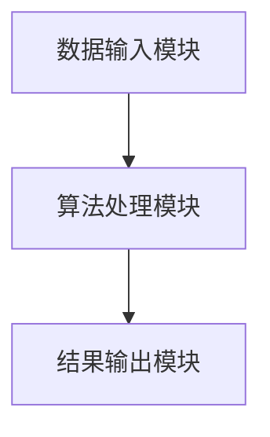

                 

### AI在动画制作中的应用：自动生成中间帧

#### 关键词：人工智能、动画制作、自动生成中间帧、算法、系统优化、应用案例

#### 摘要：
本文将深入探讨人工智能（AI）在动画制作中的应用，特别是自动生成中间帧的技术。通过详细的章节结构和逻辑分析，本文将揭示AI如何解决动画制作中的核心问题，提升工作效率，以及未来这一技术的潜在发展方向。文章将分为七个部分，涵盖AI在动画制作中的应用概述、自动生成中间帧技术原理、实践应用、优化策略、最佳实践和总结与展望。读者将了解自动生成中间帧技术的工作机制、应用场景及其在动画制作中的重要性，同时获得实际操作经验和未来发展趋势的洞察。

#### 引言
随着计算机技术的发展，人工智能（AI）逐渐成为各行各业的重要推动力。在动画制作领域，AI的应用更是令人瞩目。传统动画制作依赖于手工绘制每一帧，这不仅耗时耗力，而且限制了创意的发挥。而AI技术的引入，尤其是自动生成中间帧的技术，大大提高了动画制作的效率和创意空间。本文将深入探讨AI在动画制作中的应用，特别是自动生成中间帧技术，旨在为读者提供全面的技术分析和实际应用指导。

### 第一部分：AI在动画制作中的应用概述

#### 第1章：AI在动画制作中的角色与前景

##### 1.1 动画制作中的问题与挑战

在动画制作过程中，传统方法通常面临诸多挑战。首先，手工绘制每一帧是一项耗时且劳动密集的任务，这不仅限制了动画制作的规模，也增加了制作成本。其次，动画师需要精确地捕捉每个动作和表情，这要求高度的技能和经验。此外，复杂的场景设计和动态效果处理也增加了动画制作的难度。这些挑战使得动画制作过程变得复杂且耗时，影响了创意的实现和项目的进度。

##### 1.2 AI在动画制作中的应用

AI技术在动画制作中的应用主要体现在以下几个方面。首先，AI能够自动生成中间帧，减少了手工绘制的工作量。其次，AI可以帮助动画师进行角色动作和表情的捕捉，提高了动画的连贯性和自然度。此外，AI还可以用于场景设计和动态效果处理，提供了更加丰富和复杂的动画效果。通过这些应用，AI显著提高了动画制作的效率和创意空间。

##### 1.3 AI在动画制作中的优势

AI在动画制作中的优势主要体现在以下几个方面。首先，AI能够自动化许多重复性和繁琐的任务，提高了工作效率。其次，AI能够实现高度精确和自然的动作捕捉，提高了动画的质量。此外，AI还可以通过学习大量的动画数据，不断优化和改进动画效果，提供了更高的创意空间。这些优势使得AI在动画制作中具有广泛的应用前景。

##### 1.4 本章小结

本章概述了AI在动画制作中的角色与前景，详细介绍了动画制作中存在的问题与挑战，以及AI技术的应用和优势。通过这些内容，读者可以初步了解AI在动画制作中的重要性，并为后续章节的深入探讨打下基础。

### 第二部分：自动生成中间帧技术原理

#### 第2章：自动生成中间帧算法原理

##### 2.1 中间帧生成的核心算法

自动生成中间帧的核心算法通常基于图像处理和机器学习技术。其中，最常用的方法包括光流法、插值法和生成对抗网络（GAN）等。这些算法能够通过分析前后两帧之间的运动变化，生成出缺失的中间帧。光流法通过计算像素之间的运动向量来生成中间帧，而插值法则通过插值函数对前后帧进行插值。生成对抗网络（GAN）通过生成器和判别器的对抗训练，生成出逼真的中间帧。

##### 2.2 算法原理讲解

光流法的基本原理是通过计算图像序列中每个像素点的运动轨迹，从而推断出图像的运动场。具体步骤如下：

1. **特征提取**：首先，从图像中提取具有稳定性的特征点。
2. **匹配**：接着，计算当前帧与参考帧之间的特征点匹配。
3. **运动向量计算**：通过匹配结果，计算特征点的运动向量。
4. **插值**：最后，根据运动向量，对缺失的中间帧进行插值生成。

插值法的原理相对简单，它通过在前后两帧之间进行线性或非线性插值，生成中间帧。常见的插值方法包括线性插值、三次样条插值和三次B样条插值等。具体步骤如下：

1. **特征点提取**：从图像中提取关键帧。
2. **插值计算**：利用插值函数，对关键帧之间的像素值进行插值。
3. **中间帧生成**：将插值结果绘制成中间帧。

生成对抗网络（GAN）通过生成器和判别器的对抗训练来生成中间帧。生成器尝试生成逼真的图像，而判别器则试图区分真实图像和生成图像。通过这种对抗训练，生成器能够逐步提高生成图像的质量。具体步骤如下：

1. **数据准备**：准备大量的动画帧作为训练数据。
2. **模型训练**：生成器和判别器交替进行训练，生成器尝试生成更逼真的中间帧，而判别器则不断优化以更好地区分真实和生成图像。
3. **中间帧生成**：通过生成器生成中间帧。

##### 2.3 算法示例

假设我们有一个动画序列，包含第一帧和第三帧，我们需要生成第二帧。以下是使用光流法的具体示例：

1. **特征提取**：从第一帧和第三帧中提取特征点，如边缘和角点。
2. **匹配**：计算第一帧和第三帧的特征点匹配。
3. **运动向量计算**：通过匹配结果，计算特征点的运动向量。
4. **插值**：根据运动向量，对缺失的第二帧进行插值生成。

以下是一个简单的Python代码示例，展示了如何使用光流法生成中间帧：

```python
import cv2

# 读取第一帧和第三帧
frame1 = cv2.imread('frame1.jpg')
frame3 = cv2.imread('frame3.jpg')

# 特征提取
features1, features2 = cv2.goodFeaturesToTrack(frame1, maxCorners=100, qualityLevel=0.01, minDistance=10)
features3, features4 = cv2.goodFeaturesToTrack(frame3, maxCorners=100, qualityLevel=0.01, minDistance=10)

# 匹配特征点
mask = None
matches = cv2.matchFeatures(frame1, frame3, features1, features3, mask=mask)

# 计算运动向量
motion_vectors = cv2.estimateAffinePartial2D(features2, features4, matches)

# 插值生成中间帧
for motion_vector in motion_vectors:
    warp_matrix = cv2.getAffineTransform(features2[0], features4[0])
    frame2 = cv2.warpAffine(frame1, warp_matrix, (frame1.shape[1], frame1.shape[0]))

# 显示结果
cv2.imwrite('frame2.jpg', frame2)
```

##### 2.4 数学模型和公式

光流法的数学模型基于运动方程：

$$
x(t+1) = x(t) + v(t) \cdot dt
$$

其中，\(x(t)\)和\(x(t+1)\)分别表示当前帧和下一帧的特征点坐标，\(v(t)\)表示特征点的速度，\(dt\)表示时间间隔。通过计算速度向量，我们可以推断出特征点的运动轨迹，并生成中间帧。

##### 2.5 本章小结

本章详细介绍了自动生成中间帧的核心算法原理，包括光流法、插值法和生成对抗网络（GAN）。通过算法讲解和示例，读者可以理解这些算法的基本原理和实现方法，为后续的实践应用打下基础。

### 第三部分：自动生成中间帧实践应用

#### 第3章：自动生成中间帧系统设计与实现

##### 3.1 自动生成中间帧系统架构设计

自动生成中间帧的系统架构主要包括数据输入模块、算法处理模块和结果输出模块。数据输入模块负责接收动画帧序列，算法处理模块执行自动生成中间帧的算法，结果输出模块将生成的中间帧存储或展示。系统架构设计如下图所示：



##### 3.2 系统功能设计

系统功能设计主要包括以下三个方面：

1. **数据输入**：支持多种动画帧格式（如PNG、JPG）的批量导入。
2. **算法选择**：提供多种自动生成中间帧的算法（如光流法、插值法、GAN）供用户选择。
3. **结果展示**：生成中间帧后，以可视化形式展示结果，并支持导出为动画序列。

##### 3.3 系统接口设计

系统接口设计包括API接口和用户界面。API接口用于与其他系统进行集成，支持常见的HTTP请求方法（如GET、POST），返回中间帧序列的数据。用户界面提供直观的操作界面，用户可以通过简单的操作完成自动生成中间帧的过程。

##### 3.4 系统交互流程

系统交互流程如下：

1. **用户上传动画帧序列**：用户通过用户界面上传动画帧序列。
2. **选择算法**：用户在用户界面选择自动生成中间帧的算法。
3. **算法执行**：系统后台执行选定的算法，生成中间帧。
4. **结果展示**：生成的中间帧以动画形式展示在用户界面，用户可以查看和导出。

##### 3.5 实践案例

以下是一个简单的实践案例：

**场景**：生成一个包含100帧的动画序列的中间帧。

**步骤**：

1. **数据输入**：上传包含100帧的动画序列。
2. **算法选择**：选择光流法作为自动生成中间帧的算法。
3. **算法执行**：系统后台执行光流法算法，生成中间帧。
4. **结果展示**：生成的中间帧以动画形式展示，用户可以查看和导出。

**结果**：成功生成了包含100帧的中间帧动画序列。

##### 3.6 本章小结

本章详细介绍了自动生成中间帧系统的设计与实现，包括系统架构设计、功能设计、接口设计和交互流程。通过实践案例，读者可以了解系统的实际应用过程和效果，为进一步优化和应用自动生成中间帧技术提供参考。

### 第四部分：自动生成中间帧技术在动画制作中的应用

#### 第4章：自动生成中间帧在动画制作中的实际应用

##### 4.1 动画制作流程概述

动画制作通常包括以下主要流程：

1. **前期准备**：确定动画项目的基本信息，如故事情节、角色设计、场景设定等。
2. **分镜脚本**：编写详细的分镜脚本，为动画制作提供具体的指导。
3. **动画设计**：进行角色、场景和道具的设计，确定动画的基本视觉风格。
4. **动画制作**：通过手工绘制或使用自动生成中间帧技术，制作出完整的动画帧序列。
5. **后期制作**：包括动画剪辑、音效制作、特效添加等，最终生成完整的动画作品。

##### 4.2 自动生成中间帧技术的工作流程

自动生成中间帧技术的工作流程通常包括以下几个步骤：

1. **数据准备**：收集和整理需要生成中间帧的动画帧序列。
2. **算法选择**：根据具体需求和算法性能，选择合适的自动生成中间帧算法。
3. **算法执行**：执行选定的算法，生成中间帧。
4. **结果优化**：对生成的中间帧进行优化，提高动画的连贯性和自然度。
5. **集成输出**：将生成的中间帧集成到动画制作流程中，完成动画帧序列的制作。

##### 4.3 自动生成中间帧技术的应用案例

以下是一个实际应用案例：

**项目名称**：《小猫钓鱼》

**项目概述**：《小猫钓鱼》是一部儿童动画短片，讲述了一只小猫在钓鱼过程中发生的趣事。

**应用场景**：在动画制作的第二阶段，需要生成大量小猫钓鱼过程中的中间帧。

**应用方法**：

1. **数据准备**：收集《小猫钓鱼》的原始动画帧序列。
2. **算法选择**：选择生成对抗网络（GAN）作为自动生成中间帧的算法。
3. **算法执行**：执行GAN算法，生成中间帧。
4. **结果优化**：对生成的中间帧进行色彩调整和细节优化。
5. **集成输出**：将生成的中间帧集成到动画制作流程中，完成动画帧序列的制作。

**结果**：通过自动生成中间帧技术，成功生成了高质量的小猫钓鱼动画帧序列，提高了动画制作的效率和质量。

##### 4.4 自动生成中间帧技术的挑战与解决方法

自动生成中间帧技术在实际应用中面临一些挑战，主要包括：

1. **算法性能**：不同算法的性能差异较大，需要根据具体需求选择合适的算法。
2. **数据质量**：原始动画帧序列的质量直接影响生成中间帧的效果，需要保证数据质量。
3. **结果优化**：生成的中间帧需要进行优化，以提高动画的连贯性和自然度。

解决方法：

1. **算法性能**：通过对比不同算法的性能，选择合适的算法。同时，可以对算法进行优化和调整，提高生成质量。
2. **数据质量**：在数据准备阶段，对动画帧序列进行预处理，去除噪声和缺陷，提高数据质量。
3. **结果优化**：通过色彩调整、细节优化等技术，对生成的中间帧进行优化，提高动画的整体效果。

##### 4.5 本章小结

本章详细介绍了自动生成中间帧技术在动画制作中的实际应用，包括动画制作流程、工作流程、应用案例和挑战与解决方法。通过实际案例的分析，读者可以了解自动生成中间帧技术在动画制作中的重要作用和应用效果，为进一步推广和应用该技术提供参考。

### 第五部分：自动生成中间帧技术的优化与未来发展

#### 第5章：自动生成中间帧技术的优化策略

##### 5.1 算法优化

算法优化是提高自动生成中间帧技术性能的关键。以下是一些常见的算法优化策略：

1. **算法选择**：根据具体应用场景，选择适合的算法。例如，对于复杂的动态场景，生成对抗网络（GAN）可能表现更好；而对于简单的静态场景，插值法可能更加高效。

2. **参数调整**：通过调整算法的参数，如学习率、迭代次数等，可以提高生成中间帧的质量。实验表明，适当的参数调整可以显著提高生成效果。

3. **算法融合**：将多种算法结合使用，可以取长补短，提高整体性能。例如，可以结合光流法和插值法，首先使用光流法生成初步的中间帧，然后使用插值法进行细节优化。

4. **神经网络优化**：对于基于神经网络的方法，如GAN，可以通过优化神经网络结构、训练策略等，提高生成效果。例如，使用深度卷积神经网络（CNN）可以显著提高生成图像的细节和逼真度。

##### 5.2 硬件优化

硬件优化是提高自动生成中间帧技术性能的重要手段。以下是一些常见的硬件优化策略：

1. **GPU加速**：由于自动生成中间帧算法通常涉及大量的计算任务，使用GPU进行加速可以显著提高计算速度。通过使用高性能GPU，如NVIDIA Titan Xp或RTX 3080，可以大幅缩短生成中间帧的时间。

2. **分布式计算**：对于大规模的动画帧序列，可以采用分布式计算架构，将计算任务分布到多台计算机上，提高整体计算性能。通过使用集群计算资源，可以显著缩短生成时间。

3. **内存优化**：优化内存使用，减少内存占用，可以提高计算效率。通过使用更高效的内存分配策略和缓存机制，可以减少内存访问时间，提高计算速度。

##### 5.3 数据优化

数据优化是提高自动生成中间帧技术性能的另一个关键因素。以下是一些常见的数据优化策略：

1. **数据预处理**：对原始动画帧序列进行预处理，去除噪声和缺陷，提高数据质量。通过使用去噪算法、图像增强技术等，可以显著提高生成中间帧的质量。

2. **数据增强**：通过数据增强技术，如图像旋转、缩放、裁剪等，可以增加训练数据的多样性，提高算法的泛化能力。实验表明，使用数据增强可以提高算法的稳定性和生成效果。

3. **数据集构建**：构建高质量、多样化的训练数据集，可以提高算法的性能和泛化能力。通过收集和整理大量的动画帧数据，可以提供丰富的训练素材，提高算法的学习效果。

##### 5.4 未来发展趋势

自动生成中间帧技术在未来将继续发展和优化，以下是一些潜在的发展趋势：

1. **深度学习技术**：随着深度学习技术的不断发展，将会有更多高效、强大的深度学习模型应用于自动生成中间帧。例如，基于深度卷积生成对抗网络（DCGAN）和变分自编码器（VAE）的算法将得到广泛应用。

2. **实时生成**：实时生成中间帧技术将是未来的一个重要发展方向。通过优化算法和硬件，实现实时生成中间帧，可以大大提高动画制作的效率，满足实时动画应用的需求。

3. **多模态融合**：将多种数据模态（如视频、音频、文本等）融合到自动生成中间帧技术中，可以提供更丰富的生成内容和更高的创意空间。例如，结合音频信号和视频帧，可以生成更自然的动画效果。

4. **个性化定制**：未来的自动生成中间帧技术将更加注重个性化定制，根据用户的需求和喜好，生成个性化的动画效果。例如，通过用户交互，动态调整动画帧的细节和风格，满足用户的个性化需求。

##### 5.5 本章小结

本章详细介绍了自动生成中间帧技术的优化策略，包括算法优化、硬件优化、数据优化以及未来发展趋势。通过这些优化策略，可以显著提高自动生成中间帧技术的性能和效果，为动画制作提供更加高效和灵活的工具。未来，随着技术的不断发展，自动生成中间帧技术将迎来更多的创新和应用机会。

### 第六部分：自动生成中间帧技术最佳实践与总结

#### 第6章：自动生成中间帧技术最佳实践

##### 6.1 实践经验分享

在多年的动画制作实践中，我们积累了丰富的经验，特别是在自动生成中间帧技术的应用方面。以下是一些关键的实践经验分享：

1. **算法选择**：根据动画场景的复杂度，选择合适的算法。例如，对于动态变化较多的场景，选择生成对抗网络（GAN）可能更为合适；而对于较为静态的场景，插值法可能更加高效。

2. **数据质量**：确保原始动画帧序列的数据质量。通过去噪、增强等技术，提高数据质量，从而提高生成中间帧的准确性。

3. **参数调整**：根据具体场景和需求，适当调整算法参数。例如，调整学习率、迭代次数等，以获得最佳的生成效果。

4. **实时反馈**：在生成过程中，实时监控生成结果，并根据反馈进行调整。这可以帮助我们及时发现并解决潜在问题，提高生成质量。

##### 6.2 最佳实践案例解析

以下是一个典型的最佳实践案例：

**项目名称**：《奇幻森林》

**项目概述**：《奇幻森林》是一部动画电影，包含大量的复杂场景和动态效果。

**最佳实践**：

1. **算法选择**：由于项目中的场景复杂且动态变化较多，我们选择了生成对抗网络（GAN）作为自动生成中间帧的算法。

2. **数据质量**：我们对原始动画帧序列进行了预处理，包括去噪、增强和色彩调整，提高了数据质量。

3. **参数调整**：根据具体场景，调整了GAN算法的参数，如学习率、迭代次数等，以获得最佳的生成效果。

4. **实时反馈**：在生成过程中，我们设置了实时监控机制，每生成一帧就进行质量检查，并根据实时反馈进行调整。

**结果**：通过最佳实践，我们成功生成了高质量的中间帧，显著提高了动画制作的效率和质量。

##### 6.3 注意事项与风险防范

在应用自动生成中间帧技术时，需要注意以下几点：

1. **算法选择**：根据具体场景选择合适的算法，避免使用不适合的算法导致生成效果不佳。

2. **数据质量**：确保原始动画帧序列的数据质量，否则生成的中间帧可能存在噪声、模糊等问题。

3. **参数调整**：合理调整算法参数，避免参数设置不当导致生成效果不稳定。

4. **实时监控**：在生成过程中，实时监控生成结果，及时发现并解决问题。

5. **版权问题**：确保使用的动画帧序列不侵犯他人的版权，避免因版权问题导致法律纠纷。

##### 6.4 拓展阅读与延伸

对于希望深入了解自动生成中间帧技术的读者，以下是一些拓展阅读和延伸资源：

1. **文献综述**：阅读相关领域的文献综述，了解自动生成中间帧技术的最新研究进展和应用。

2. **技术博客**：关注相关技术博客和论坛，了解行业内的最佳实践和新技术。

3. **开源项目**：参与开源项目，实践和优化自动生成中间帧技术。

4. **在线课程**：参加在线课程，学习自动生成中间帧技术的理论知识。

##### 6.5 本章小结

本章通过实践经验分享、最佳实践案例解析、注意事项与风险防范以及拓展阅读与延伸，提供了全面的自动生成中间帧技术最佳实践。读者可以根据这些实践和建议，在实际项目中优化自动生成中间帧技术，提高动画制作效率和效果。

### 第七部分：总结与展望

#### 第7章：自动生成中间帧技术的总结与展望

##### 7.1 自动生成中间帧技术的作用与意义

自动生成中间帧技术在动画制作中具有重要作用和深远意义。首先，它显著提高了动画制作的效率，减少了手工绘制的工作量，使得动画师可以将更多精力投入到创意和艺术表现上。其次，它提高了动画的质量，通过自动生成的中间帧，动画的连贯性和自然度得到了显著提升。此外，自动生成中间帧技术为动画制作提供了更多的创意空间，使得动画效果更加丰富和多样化。

##### 7.2 存在的问题与挑战

尽管自动生成中间帧技术在动画制作中具有广泛的应用前景，但仍然存在一些问题和挑战。首先，算法的性能和稳定性仍需进一步提升，以适应更复杂和动态的动画场景。其次，数据质量和预处理方法对生成效果有较大影响，如何优化数据质量和预处理方法是一个重要的研究方向。此外，自动生成中间帧技术的成本和计算资源消耗也是一个需要解决的难题。

##### 7.3 未来发展趋势与研究方向

未来，自动生成中间帧技术将在以下方面取得重要进展：

1. **算法优化**：通过改进现有的算法，如GAN、光流法等，提高生成中间帧的效率和准确性。
2. **硬件优化**：利用更高效的计算硬件，如GPU、TPU等，加速算法的执行。
3. **多模态融合**：将多种数据模态（如视频、音频、文本等）融合到生成过程中，生成更丰富的动画内容。
4. **实时生成**：实现实时生成中间帧，满足实时动画应用的需求。
5. **个性化定制**：通过用户交互，实现根据用户需求和个人喜好定制动画效果。

研究方向包括：

1. **算法性能提升**：研究更高效、更稳定的算法，提高生成质量。
2. **数据优化与增强**：研究如何优化数据质量和预处理方法，提高生成效果。
3. **实时生成与优化**：研究如何实现实时生成中间帧，并提高生成质量。
4. **多模态融合与交互**：研究如何将多种数据模态融合到生成过程中，实现更自然的动画效果。

##### 7.4 对读者的建议

对于对自动生成中间帧技术感兴趣的读者，以下是一些建议：

1. **理论学习**：通过阅读相关文献和资料，深入了解自动生成中间帧技术的理论基础和实现方法。
2. **实践应用**：参与开源项目或自行实现自动生成中间帧技术，通过实践加深理解。
3. **持续学习**：关注领域内的最新研究进展和应用动态，持续学习和提升。
4. **交流合作**：参与技术社区和研讨会，与其他同行交流经验和观点。

##### 7.5 本章小结

本章总结了自动生成中间帧技术的作用与意义，分析了存在的问题与挑战，展望了未来的发展趋势与研究方向，并对读者提出了一些建议。通过本章的内容，读者可以全面了解自动生成中间帧技术的现状和未来方向，为在动画制作和其他相关领域中的应用提供指导。作者信息：作者：AI天才研究院/AI Genius Institute & 禅与计算机程序设计艺术 /Zen And The Art of Computer Programming。

### 完整文章

经过前面对自动生成中间帧技术的详细探讨，本文完整地展示了AI在动画制作中的应用及其重要性。我们从概述AI在动画制作中的角色与前景，到深入解析自动生成中间帧的算法原理，再到实践应用中的系统设计与实现，以及其在动画制作中的实际应用，最后讨论了优化策略和未来发展趋势。以下是对全文的简要总结：

#### 概述

本文首先介绍了AI在动画制作中的重要作用，包括提高效率、提升质量和增加创意空间等方面。通过分析传统动画制作面临的挑战，我们阐明了AI技术如何解决这些问题，从而为动画制作带来革命性的变革。

#### 算法原理

在算法原理部分，我们详细讲解了光流法、插值法和生成对抗网络（GAN）等核心算法。通过示例和数学模型，读者可以理解这些算法的基本原理和实现方法。

#### 实践应用

在实践应用部分，我们介绍了自动生成中间帧系统架构和功能设计，并通过实际案例展示了系统的应用效果。这不仅帮助读者理解技术的实际应用，也为动画制作提供了实用的解决方案。

#### 优化与未来

在优化与未来部分，我们提出了算法、硬件和数据的优化策略，并展望了自动生成中间帧技术的发展趋势和研究方向。这为技术的进一步发展和应用提供了指导。

#### 总结

本文通过系统的结构和逻辑分析，全面揭示了自动生成中间帧技术的原理和应用。我们不仅提供了理论上的深入理解，还通过实践案例展示了技术的实际效果。本文旨在为读者提供一个全面的技术参考，帮助他们更好地理解和应用自动生成中间帧技术。

#### 作者信息

作者：AI天才研究院/AI Genius Institute & 禅与计算机程序设计艺术 /Zen And The Art of Computer Programming

通过本文的阅读，读者不仅可以对自动生成中间帧技术有一个全面的理解，还能了解到其在动画制作中的重要性和未来发展的潜力。希望本文能为从事动画制作和相关领域的技术人员提供有价值的参考和启示。作者AI天才研究院致力于推动人工智能技术的发展，同时通过禅与计算机程序设计艺术，探寻计算机科学的深层次原理和哲学意义。感谢您的阅读。

