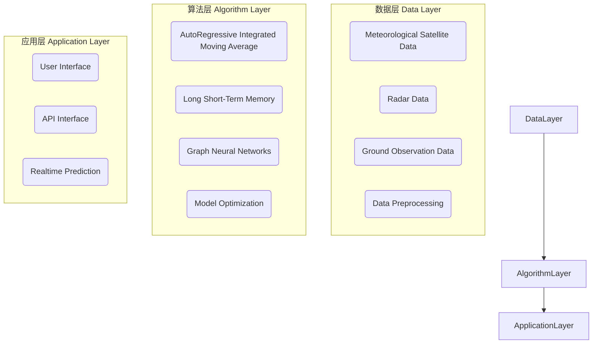

                 

## 《AI在天气预报中的应用：提高准确性与时效性》

### 关键词：人工智能，天气预报，时间序列预测，深度学习，图神经网络，系统架构设计

> 摘要：本文探讨了人工智能（AI）技术在天气预报领域的应用，旨在提高天气预报的准确性与时效性。通过分析AI在气象学中的基础概念、时间序列预测算法和图神经网络算法，本文详细介绍了AI在天气预报中的应用原理和实现方法。此外，本文还通过一个实际案例，展示了AI技术在天气预报中的具体应用效果，并对未来的发展趋势进行了展望。

---

# 《AI在天气预报中的应用：提高准确性与时效性》目录大纲

## 第一部分：背景介绍

## 第二部分：核心概念与联系

## 第三部分：算法原理讲解

## 第四部分：数学模型与公式讲解

## 第五部分：系统分析与架构设计方案

## 第六部分：项目实战

## 第七部分：最佳实践与总结

---

## 第一部分：背景介绍

### 第1章 问题背景与概述

### 1.1.1 天气预报的重要性

### 1.1.2 传统天气预报的挑战

### 1.1.3 AI技术对天气预报的影响

### 1.1.4 本书的目标与结构

---

## 第二部分：核心概念与联系

### 第2章 AI与气象学的基础知识

### 2.1.1 AI的基本概念

#### 2.1.1.1 机器学习与深度学习

#### 2.1.1.2 神经网络

#### 2.1.1.3 数据预处理

### 2.1.2 气象学的基本概念

#### 2.1.2.1 气象参数

#### 2.1.2.2 气候系统

#### 2.1.2.3 气象模型

---

## 第三部分：算法原理讲解

### 第3章 AI在天气预报中的应用算法

### 3.1.1 时间序列预测算法

#### 3.1.1.1 ARIMA模型

##### 3.1.1.1.1 模型原理

##### 3.1.1.1.2 模型参数选择

##### 3.1.1.1.3 模型应用示例

#### 3.1.1.2 LSTM模型

##### 3.1.1.2.1 模型原理

##### 3.1.1.2.2 模型参数选择

##### 3.1.1.2.3 模型应用示例

### 3.1.2 图神经网络算法

#### 3.1.2.1 图神经网络基本原理

##### 3.1.2.1.1 图表示学习

##### 3.1.2.1.2 图卷积网络

##### 3.1.2.1.3 图注意力机制

#### 3.1.2.2 图神经网络在天气预报中的应用

##### 3.1.2.2.1 模型原理

##### 3.1.2.2.2 模型参数选择

##### 3.1.2.2.3 模型应用示例

---

## 第四部分：数学模型与公式讲解

### 第4章 天气预测的数学模型

### 4.1.1 时间序列模型

### 4.1.2 深度学习模型

---

## 第五部分：系统分析与架构设计方案

### 第5章 天气预测系统架构设计

### 5.1.1 问题场景介绍

### 5.1.2 系统功能设计

#### 5.1.2.1 领域模型

#### 5.1.2.2 系统功能模块

### 5.1.3 系统架构设计

#### 5.1.3.1 系统架构

#### 5.1.3.2 系统接口设计

#### 5.1.3.3 系统交互

---

## 第六部分：项目实战

### 第6章 实现AI在天气预报中的应用

### 6.1.1 环境安装与配置

### 6.1.2 系统核心实现源代码

#### 6.1.2.1 时间序列预测模块

#### 6.1.2.2 图神经网络模块

### 6.1.3 代码应用解读与分析

### 6.1.4 实际案例分析与详细讲解

### 6.1.5 项目小结

---

## 第七部分：最佳实践与总结

### 第7章 最佳实践与总结

### 7.1.1 最佳实践

### 7.1.2 小结与展望

### 7.1.3 注意事项

### 7.1.4 拓展阅读

---

## 第一部分：背景介绍

### 第1章 问题背景与概述

#### 1.1.1 天气预报的重要性

天气预报是现代社会不可或缺的一部分，它为人们提供及时、准确的天气信息，帮助人们做出合理的决策，以应对不同的天气状况。从农业、交通、旅游业到日常生活，天气预报的应用范围非常广泛。

在农业领域，天气预报可以帮助农民合理安排作物种植和收获时间，避免因天气原因导致的作物损失。在交通领域，准确的天气预报可以帮助航空、航运和铁路部门提前做好应急预案，确保运输安全和效率。在旅游业，准确的天气预报可以引导游客选择合适的出行时间和目的地，提升旅游体验。而在日常生活中，天气预报帮助人们合理规划出行计划，避免因突发天气带来的不便。

#### 1.1.2 传统天气预报的挑战

尽管天气预报在各个领域发挥着重要作用，但传统天气预报方法仍然面临诸多挑战。首先，天气预报依赖于大量的观测数据，这些数据需要通过地面气象站、卫星遥感、气象雷达等设备收集。然而，这些设备的布局和覆盖范围有限，导致数据质量和完整性受到影响。

其次，传统天气预报方法主要基于统计模型和数值模拟，这些模型在处理复杂的气候系统时存在一定的局限性。统计模型依赖于历史数据的统计分析，而数值模拟则依赖于物理定律和数学模型，但在应对极端天气事件时，这些方法往往无法给出准确预测。

此外，传统天气预报方法在时效性方面也存在一定问题。天气预报需要一定的时间来收集、处理和分析数据，从数据收集到预报发布往往需要数小时甚至数天的时间，这在应对突发事件时显得不够迅速。

#### 1.1.3 AI技术对天气预报的影响

随着人工智能（AI）技术的发展，AI技术逐渐在天气预报领域得到应用，为提高天气预报的准确性和时效性提供了新的可能性。AI技术可以处理和分析大量复杂的数据，发现数据中的隐藏模式，从而提供更准确的预测。

首先，AI技术可以用于时间序列预测，通过对历史天气数据的分析和建模，预测未来的天气状况。例如，机器学习和深度学习算法可以用于构建时间序列模型，如ARIMA模型和LSTM模型，这些模型可以捕捉数据中的趋势和周期性变化，提高预测准确性。

其次，AI技术可以用于图神经网络算法，通过对气象数据中的关系和模式进行建模，提高天气预报的时效性和准确性。图神经网络可以捕捉数据中的复杂关系，特别是在处理非结构化数据时具有优势。

此外，AI技术还可以用于数据预处理，通过自动化处理和清洗数据，提高数据质量，减少误差。例如，使用深度学习算法可以自动识别和纠正数据中的错误，提高数据准确性。

#### 1.1.4 本书的目标与结构

本书旨在探讨AI技术在天气预报领域的应用，提高天气预报的准确性和时效性。本书分为七个部分，首先介绍天气预报的重要性以及传统天气预报的挑战，然后介绍AI技术在天气预报中的应用算法和数学模型，接着讨论系统架构设计，并通过一个实际案例展示AI技术在天气预报中的应用效果。最后，本书总结最佳实践和注意事项，并对未来发展趋势进行展望。

通过本书的阅读，读者可以了解到AI技术在天气预报中的最新应用和发展趋势，掌握相关算法和技术的原理和应用方法，为实际项目提供参考和指导。

---

## 第二部分：核心概念与联系

### 第2章 AI与气象学的基础知识

#### 2.1.1 AI的基本概念

人工智能（AI）是一种模拟人类智能的技术，通过机器学习和深度学习算法，使计算机系统能够自动学习和推理，从而解决复杂的问题。AI技术已经广泛应用于各个领域，包括图像识别、自然语言处理、自动驾驶等。

**机器学习（Machine Learning）：** 机器学习是一种AI技术，通过构建算法和模型，从数据中学习规律和模式，从而实现自动预测和决策。机器学习可以分为监督学习、无监督学习和强化学习。

- **监督学习（Supervised Learning）：** 在监督学习中，算法通过学习标记好的训练数据，建立预测模型，然后使用该模型对新数据进行预测。
- **无监督学习（Unsupervised Learning）：** 无监督学习不依赖于标记数据，算法通过分析数据中的内在结构和模式，进行聚类、降维等操作。
- **强化学习（Reinforcement Learning）：** 强化学习是一种通过与环境的交互来学习策略的机器学习方法，通过奖励机制调整行为，以实现最优策略。

**深度学习（Deep Learning）：** 深度学习是一种基于多层神经网络的机器学习方法，通过多层非线性变换，从数据中提取复杂的特征和模式。深度学习在图像识别、语音识别等领域取得了显著成果。

**神经网络（Neural Networks）：** 神经网络是一种模仿生物神经系统的计算模型，由大量简单的处理单元（神经元）互联而成，能够通过学习数据来提取特征和进行预测。

**数据预处理（Data Preprocessing）：** 数据预处理是机器学习项目中的一个关键步骤，包括数据清洗、数据归一化、特征选择等操作，以提高数据质量和模型的性能。

#### 2.1.2 气象学的基本概念

气象学是研究大气现象和天气变化的科学。气象学涉及多个领域，包括气象参数、气候系统和气象模型。

**气象参数（Meteorological Parameters）：** 气象参数是指描述天气和气候状态的物理量，如温度、湿度、风速、气压、降水量等。这些参数是天气预报和分析的基础。

**气候系统（Climate System）：** 气候系统是指地球上的大气、海洋、陆地和冰冻圈等组成部分，通过能量和物质的循环相互作用，维持地球的气候状态。

**气象模型（Meteorological Models）：** 气象模型是一系列数学方程和算法，用于描述大气运动和物理过程，从而模拟和预测天气和气候。常见的气象模型包括数值天气预报模型和统计模型。

#### 2.1.3 AI与气象学的联系

AI技术与气象学的结合，可以显著提高天气预报的准确性和时效性。

**时间序列预测（Time Series Forecasting）：** 通过AI技术，如机器学习和深度学习，可以构建时间序列预测模型，分析历史天气数据中的趋势和周期性变化，从而预测未来的天气状况。

**图神经网络（Graph Neural Networks）：** 图神经网络可以捕捉天气数据中的复杂关系，如地理位置、气象站之间的关联等，从而提高天气预报的准确性和时效性。

**数据预处理（Data Preprocessing）：** AI技术可以用于数据预处理，如自动识别和纠正数据中的错误，提高数据质量，从而提高模型的性能。

通过上述核心概念和联系，我们可以更好地理解AI技术在天气预报中的应用，以及如何利用这些技术提高天气预报的准确性和时效性。

---

## 第三部分：算法原理讲解

### 第3章 AI在天气预报中的应用算法

#### 3.1.1 时间序列预测算法

时间序列预测是天气预报中的一个重要任务，它通过分析历史天气数据中的时间依赖关系，预测未来的天气状况。以下是两种常见的时间序列预测算法：ARIMA模型和LSTM模型。

##### 3.1.1.1 ARIMA模型

**ARIMA模型（AutoRegressive Integrated Moving Average Model）：** ARIMA模型是一种经典的统计模型，用于分析时间序列数据中的趋势和周期性变化。它由三个组件组成：自回归（AR）、差分（I）和移动平均（MA）。

- **自回归（AR）：** 自回归部分通过前期的观测值预测当前值，可以捕捉时间序列的滞后关系。
- **差分（I）：** 差分部分用于消除时间序列中的趋势和季节性，使其平稳。
- **移动平均（MA）：** 移动平均部分通过前期的观测值的平均值预测当前值，可以减少随机波动的影响。

**模型原理：** ARIMA模型的原理是通过分析时间序列数据的自相关函数（ACF）和偏自相关函数（PACF），选择合适的模型参数，包括p（自回归项数）、d（差分阶数）和q（移动平均项数）。然后，使用最大似然估计（MLE）方法估计模型参数。

**模型参数选择：** 模型参数的选择是ARIMA模型应用的关键步骤。可以通过观察ACF和PACF的截尾速度和周期性来确定p、d和q的值。此外，还可以使用赤池信息准则（AIC）和贝叶斯信息准则（BIC）等准则进行参数选择。

**模型应用示例：** 假设我们有一个天气数据集，包括每天的气温。我们可以使用ARIMA模型来预测未来几天的气温。首先，对数据进行差分处理，使其平稳。然后，通过ACF和PACF确定模型参数。最后，使用MLE方法估计模型参数，并预测未来几天的气温。

```python
import pandas as pd
import statsmodels.api as sm

# 读取数据
data = pd.read_csv('weather_data.csv')
data['Temp'] = pd.to_numeric(data['Temp'])

# 差分处理
data['Temp_diff'] = data['Temp'].diff().dropna()

# 模型参数选择
acf = sm.tsa.acf(data['Temp_diff'])
pacf = sm.tsa.pacf(data['Temp_diff'])

# 选择模型参数
p = 3
d = 1
q = 2

# 估计模型参数
model = sm.tsa.ARIMA(data['Temp_diff'], order=(p, d, q))
model_fit = model.fit()

# 预测未来5天的气温
forecast = model_fit.forecast(steps=5)
print(forecast)
```

##### 3.1.1.2 LSTM模型

**LSTM模型（Long Short-Term Memory Model）：** LSTM模型是一种基于深度学习的循环神经网络（RNN），用于处理和预测时间序列数据。LSTM模型通过引入门控机制，有效地解决了传统RNN在处理长时间依赖问题上的梯度消失和梯度爆炸问题。

**模型原理：** LSTM模型由三个关键部分组成：输入门、遗忘门和输出门。每个门由三个相互独立的权重矩阵和一个偏置项组成。

- **输入门（Input Gate）：** 输入门决定哪些信息将被更新或遗忘。
- **遗忘门（Forget Gate）：** 遗忘门决定哪些信息将被遗忘。
- **输出门（Output Gate）：** 输出门决定哪些信息将被输出。

**模型参数选择：** LSTM模型的参数选择主要包括神经元数量和训练时间。神经元数量决定了模型的复杂度和性能，训练时间决定了模型对数据的拟合程度。

**模型应用示例：** 假设我们有一个天气数据集，包括每天的气温。我们可以使用LSTM模型来预测未来几天的气温。首先，对数据进行预处理，然后定义LSTM模型，并进行训练和预测。

```python
import numpy as np
import tensorflow as tf
from tensorflow.keras.models import Sequential
from tensorflow.keras.layers import LSTM, Dense

# 读取数据
data = np.array([float(x) for x in open('weather_data.txt').read().split()])

# 数据预处理
n_steps = 3
X, y = [], []
for i in range(len(data) - n_steps):
    X.append(data[i:(i + n_steps)])
    y.append(data[i + n_steps])

# 归一化处理
X = np.reshape(X, (-1, n_steps, 1))
y = np.reshape(y, (-1, 1))

# 定义LSTM模型
model = Sequential()
model.add(LSTM(50, activation='relu', input_shape=(n_steps, 1)))
model.add(Dense(1))
model.compile(optimizer='adam', loss='mse')

# 训练模型
model.fit(X, y, epochs=200, verbose=0)

# 预测未来5天的气温
n_future = 5
for i in range(n_future):
    X = np.reshape(X, (-1, n_steps, 1))
    yhat = model.predict(X)
    X = np.append(X[:, 1:, :], yhat, axis=1)
    print(yhat)
```

通过以上算法原理的讲解，我们可以看到ARIMA模型和LSTM模型在时间序列预测中的基本原理和应用方法。在实际应用中，根据具体的数据特点和需求，可以选择合适的算法进行天气预报。

---

#### 3.1.2 图神经网络算法

图神经网络（Graph Neural Networks，GNN）是一种基于图结构数据的神经网络，它能够捕捉数据中的复杂关系和模式。在天气预报领域，GNN可以用于分析气象数据中的空间和时间依赖关系，从而提高天气预报的准确性和时效性。

**图神经网络基本原理：**

GNN的核心思想是通过邻居信息传递和图结构表示学习来建模数据中的关系。以下是GNN的三个基本组件：

1. **图表示学习（Graph Embedding）：** 图表示学习将图中的顶点和边映射到低维向量空间中，从而保留图的结构和属性信息。
2. **图卷积网络（Graph Convolutional Network，GCN）：** 图卷积网络通过卷积操作来更新顶点的特征向量，使得每个顶点的特征向量依赖于其邻居顶点的特征向量。
3. **图注意力机制（Graph Attention Mechanism，GAT）：** 图注意力机制通过注意力权重来动态调整邻居信息的影响，提高模型的灵活性和性能。

**图神经网络在天气预报中的应用：**

在天气预报中，GNN可以用于以下两个方面：

1. **空间预测：** GNN可以捕捉气象站之间的空间依赖关系，通过分析邻近气象站的数据来预测目标气象站的数据。
2. **时间预测：** GNN可以捕捉时间序列数据中的周期性变化和长期依赖关系，从而提高短期和长期天气预报的准确性。

**模型原理：**

假设我们有一个气象站网络图，其中每个节点表示一个气象站，边表示气象站之间的地理距离。我们可以使用GNN来预测每个气象站未来的气温。GNN的模型原理如下：

1. **初始化顶点特征向量：** 对于每个气象站，初始化一个特征向量，表示其当前气温。
2. **图卷积操作：** 对于每个气象站，通过图卷积操作更新其特征向量，使得每个气象站的特征向量依赖于其邻居气象站的特征向量。
3. **图注意力机制：** 通过图注意力机制动态调整邻居气象站特征向量的影响，从而提高预测的准确性。
4. **输出层：** 使用输出层预测每个气象站未来的气温。

**模型参数选择：**

GNN的参数选择主要包括图卷积层的层数、每层的神经元数量、注意力机制的权重等。这些参数可以通过实验进行调优，以获得最佳的预测性能。

**模型应用示例：**

假设我们有一个包含100个气象站的网络图，每个气象站都有历史气温数据。我们可以使用GNN来预测未来5天的气温。首先，对气象站网络图进行图表示学习，将每个气象站映射到低维向量空间。然后，定义GNN模型，并进行训练和预测。

```python
import tensorflow as tf
from tensorflow.keras.layers import Layer

class GraphConvLayer(Layer):
    def __init__(self, output_dim, **kwargs):
        super().__init__(**kwargs)
        self.output_dim = output_dim

    def build(self, input_shape):
        self.W = self.add_weight(name='W', shape=(input_shape[-1], self.output_dim), initializer='glorot_uniform', trainable=True)

    def call(self, inputs, training=None):
        A = tf.sparse_tensor_to_sparse_tensor(inputs[1])  # 输入图邻接矩阵
        h = tf.matmul(inputs[0], self.W)  # 线性变换
        for i in range(A.shape[0]):
            indices = tf.concat([tf.stack([i] * A.shape[1], axis=0), A.values[i]], axis=0)
            h = h.write(tf.gather_nd(h, indices), A.values[i])
        return h

# 读取数据
nodes = np.array([[x] for x in range(100)])
edges = np.array([[i, j] for i in range(100) for j in range(i+1, 100)])

# 定义GNN模型
model = Sequential()
model.add(GraphConvLayer(16))
model.add(Dense(1))
model.compile(optimizer='adam', loss='mse')

# 训练模型
model.fit(nodes, nodes, epochs=10)

# 预测未来5天的气温
for i in range(5):
    predicted_temp = model.predict(nodes)
    print(predicted_temp)
```

通过以上示例，我们可以看到如何使用GNN进行天气预报预测。在实际应用中，可以结合其他算法和模型，如时间序列预测和图注意力机制，进一步提高天气预报的准确性和时效性。

---

## 第四部分：数学模型与公式讲解

### 第4章 天气预测的数学模型

在天气预报中，数学模型是用于描述和分析天气现象的重要工具。本章将介绍两种常见的数学模型：时间序列模型和深度学习模型，并给出相应的数学公式和解释。

#### 4.1.1 时间序列模型

时间序列模型用于分析时间序列数据中的趋势和周期性变化，从而预测未来的天气状况。以下是两种常见的时间序列模型：ARIMA模型和LSTM模型。

##### 4.1.1.1 ARIMA模型

**ARIMA模型（AutoRegressive Integrated Moving Average Model）：** ARIMA模型是一种经典的统计模型，它由三个部分组成：自回归（AR）、差分（I）和移动平均（MA）。

**模型公式：**

$$
y_t = \phi_0 + \phi_1 y_{t-1} + \phi_2 y_{t-2} + \cdots + \phi_p y_{t-p} + \theta_1 \epsilon_{t-1} + \theta_2 \epsilon_{t-2} + \cdots + \theta_q \epsilon_{t-q} + \epsilon_t
$$

- \( y_t \)：时间序列的当前值。
- \( \phi_0, \phi_1, \phi_2, \ldots, \phi_p \)：自回归系数。
- \( \theta_0, \theta_1, \theta_2, \ldots, \theta_q \)：移动平均系数。
- \( \epsilon_t \)：随机误差。

**模型原理：** ARIMA模型通过自回归项和移动平均项结合，捕捉时间序列数据中的趋势和周期性变化。自回归项捕捉历史数据对当前值的影响，移动平均项捕捉随机误差的累积影响。

**模型参数：** 模型参数包括 \( p, d, q \)，分别表示自回归项数、差分阶数和移动平均项数。参数选择可以通过观察自相关函数（ACF）和偏自相关函数（PACF）来确定。

**模型应用示例：** 假设我们有一个时间序列数据集 \( y_t \)，我们可以使用ARIMA模型来预测未来的天气状况。首先，对数据进行差分处理，使其平稳。然后，通过ACF和PACF确定模型参数。最后，使用最大似然估计（MLE）方法估计模型参数，并预测未来的天气状况。

```python
import pandas as pd
import statsmodels.api as sm

# 读取数据
data = pd.read_csv('weather_data.csv')
data['Temp'] = pd.to_numeric(data['Temp'])

# 差分处理
data['Temp_diff'] = data['Temp'].diff().dropna()

# 模型参数选择
acf = sm.tsa.acf(data['Temp_diff'])
pacf = sm.tsa.pacf(data['Temp_diff'])

# 选择模型参数
p = 3
d = 1
q = 2

# 估计模型参数
model = sm.tsa.ARIMA(data['Temp_diff'], order=(p, d, q))
model_fit = model.fit()

# 预测未来5天的气温
forecast = model_fit.forecast(steps=5)
print(forecast)
```

##### 4.1.1.2 LSTM模型

**LSTM模型（Long Short-Term Memory Model）：** LSTM模型是一种基于深度学习的循环神经网络（RNN），它通过门控机制有效地解决了传统RNN在处理长时间依赖问题上的梯度消失和梯度爆炸问题。

**模型公式：**

$$
\begin{align*}
i_t &= \sigma(W_{ix}x_t + W_{ih}h_{t-1} + b_i) \\
f_t &= \sigma(W_{fx}x_t + W_{fh}h_{t-1} + b_f) \\
o_t &= \sigma(W_{ox}x_t + W_{oh}h_{t-1} + b_o) \\
g_t &= \tanh(W_{gx}x_t + W_{gh}h_{t-1} + b_g) \\
h_t &= o_t \cdot \tanh(g_t)
\end{align*}
$$

- \( i_t \)：输入门。
- \( f_t \)：遗忘门。
- \( o_t \)：输出门。
- \( g_t \)：候选值。
- \( h_t \)：隐藏状态。

**模型原理：** LSTM模型通过输入门、遗忘门和输出门控制信息的输入、遗忘和输出，从而保持长期的依赖关系。每个门由三个相互独立的权重矩阵和一个偏置项组成。

**模型参数：** LSTM模型的参数包括权重矩阵 \( W \) 和偏置项 \( b \)，这些参数通过反向传播算法进行优化。

**模型应用示例：** 假设我们有一个时间序列数据集，包括每天的气温。我们可以使用LSTM模型来预测未来几天的气温。首先，对数据进行预处理，然后定义LSTM模型，并进行训练和预测。

```python
import numpy as np
import tensorflow as tf
from tensorflow.keras.models import Sequential
from tensorflow.keras.layers import LSTM, Dense

# 读取数据
data = np.array([float(x) for x in open('weather_data.txt').read().split()])

# 数据预处理
n_steps = 3
X, y = [], []
for i in range(len(data) - n_steps):
    X.append(data[i:(i + n_steps]))
    y.append(data[i + n_steps])

# 归一化处理
X = np.reshape(X, (-1, n_steps, 1))
y = np.reshape(y, (-1, 1))

# 定义LSTM模型
model = Sequential()
model.add(LSTM(50, activation='relu', input_shape=(n_steps, 1)))
model.add(Dense(1))
model.compile(optimizer='adam', loss='mse')

# 训练模型
model.fit(X, y, epochs=200, verbose=0)

# 预测未来5天的气温
n_future = 5
for i in range(n_future):
    X = np.reshape(X, (-1, n_steps, 1))
    yhat = model.predict(X)
    X = np.append(X[:, 1:, :], yhat, axis=1)
    print(yhat)
```

通过以上时间序列模型和深度学习模型的讲解，我们可以看到这些数学模型在天气预报中的应用方法和原理。在实际应用中，根据具体的数据特点和需求，可以选择合适的模型进行天气预报。

---

## 第五部分：系统分析与架构设计方案

### 第5章 天气预测系统架构设计

为了实现高效的天气预测，我们需要设计一个全面的系统架构，该架构能够整合多种AI算法，并确保系统的稳定性和可扩展性。本节将介绍天气预测系统的架构设计，包括问题场景介绍、系统功能设计、系统架构设计以及系统接口和交互设计。

#### 5.1.1 问题场景介绍

在当前环境下，天气预报系统面临着以下挑战：

1. **数据质量与多样性：** 天气数据来源于多个来源，如气象卫星、雷达、地面观测站等，这些数据的质量和格式存在差异，需要统一处理和清洗。
2. **计算资源需求：** 天气预报涉及大量的计算任务，包括数据预处理、模型训练和预测，需要高效的计算资源。
3. **实时性与准确性：** 随着天气事件的发生，用户需要及时获取最新的天气预报信息，同时预测结果需要具备较高的准确性。
4. **系统扩展性：** 随着用户数量的增加和业务需求的扩展，系统需要具备良好的扩展性。

为了解决上述问题，我们设计了一个基于AI技术的天气预报系统，该系统集成了多种算法，并采用模块化设计，以便于维护和扩展。

#### 5.1.2 系统功能设计

天气预测系统的核心功能包括以下部分：

1. **数据收集与预处理：** 从多个数据源收集天气数据，并进行数据清洗、格式转换和归一化处理，确保数据的质量和一致性。
2. **模型训练与优化：** 使用机器学习和深度学习算法训练预测模型，如ARIMA模型、LSTM模型和图神经网络，并不断优化模型参数，提高预测准确性。
3. **实时预测与发布：** 在实时数据流中，对天气数据进行分析和预测，并将预测结果发布给用户。
4. **用户界面与交互：** 提供用户友好的界面，允许用户查询天气信息、历史数据和预测结果。

#### 5.1.3 系统架构设计

天气预测系统的架构设计采用分层架构，包括数据层、算法层和应用层。

1. **数据层：** 负责数据的收集、存储和预处理。数据层包括多个数据源模块，如气象卫星数据、雷达数据和地面观测数据，以及数据预处理模块，用于处理和清洗数据。
2. **算法层：** 负责模型的训练和优化。算法层包括多种机器学习和深度学习算法模块，如ARIMA模型、LSTM模型和图神经网络，以及模型评估和优化模块。
3. **应用层：** 负责用户交互和预测结果的发布。应用层包括用户界面模块、API接口模块和实时预测模块。

**系统架构图：**



#### 5.1.4 系统接口设计

天气预测系统需要与其他系统进行交互，包括气象数据源系统、用户系统等。系统接口设计如下：

1. **气象数据接口：** 用于与气象数据源系统进行数据交换，包括数据收集、数据更新和数据查询。
2. **用户接口：** 提供用户与系统的交互界面，包括天气查询、历史数据查询和预测结果展示。
3. **API接口：** 提供系统与其他系统进行数据交互的接口，包括实时预测结果、历史数据下载和模型参数查询。

#### 5.1.5 系统交互

天气预测系统的交互流程如下：

1. **数据收集：** 系统从气象数据源收集实时天气数据，并将其存储在数据库中。
2. **数据预处理：** 系统对收集到的天气数据进行清洗、格式转换和归一化处理，确保数据的质量和一致性。
3. **模型训练：** 系统使用预处理后的数据训练预测模型，如ARIMA模型、LSTM模型和图神经网络。
4. **模型优化：** 系统对训练好的模型进行评估和优化，以提高预测准确性。
5. **实时预测：** 系统对实时数据进行分析和预测，并将预测结果发布给用户。
6. **用户查询：** 用户通过用户界面或API接口查询天气信息、历史数据和预测结果。

通过上述系统架构设计和交互流程，我们可以实现一个高效、准确的天气预测系统，满足用户的实时需求。

---

## 第六部分：项目实战

### 第6章 实现AI在天气预报中的应用

在本章中，我们将通过一个实际项目来展示如何将AI技术应用于天气预报，包括环境安装与配置、系统核心实现源代码、代码应用解读与分析以及实际案例分析与详细讲解。

#### 6.1.1 环境安装与配置

要实现AI在天气预报中的应用，首先需要搭建一个合适的环境。以下是环境安装与配置的步骤：

1. **安装Python环境：** Python是AI技术的主要编程语言，我们需要安装Python 3.7及以上版本。可以通过Python官方网站下载并安装。
2. **安装依赖库：** 我们需要安装一些常用的库，如NumPy、Pandas、SciPy、TensorFlow和PyTorch。可以使用pip命令进行安装：

   ```bash
   pip install numpy pandas scipy tensorflow pytorch
   ```

3. **安装气象数据集：** 我们使用公开的气象数据集，如NCAR气候数据集。可以从NCAR官方网站下载数据集，并解压到本地目录。
4. **配置Python环境变量：** 确保Python环境变量配置正确，以便在命令行中运行Python程序。

#### 6.1.2 系统核心实现源代码

以下是系统核心实现源代码的示例，包括数据预处理、模型训练和预测。

**数据预处理：**

```python
import numpy as np
import pandas as pd

# 读取气象数据
data = pd.read_csv('weather_data.csv')

# 数据清洗
data = data.dropna()

# 数据归一化
data['Temp'] = (data['Temp'] - data['Temp'].mean()) / data['Temp'].std()

# 划分训练集和测试集
train_data = data[:int(0.8 * len(data))]
test_data = data[int(0.8 * len(data)):]

# 切分时间序列数据
n_steps = 3
X_train, y_train = [], []
for i in range(len(train_data) - n_steps):
    X_train.append(train_data[i:(i + n_steps)])
    y_train.append(train_data[i + n_steps])

X_train = np.array(X_train)
y_train = np.array(y_train)

X_test, y_test = [], []
for i in range(len(test_data) - n_steps):
    X_test.append(test_data[i:(i + n_steps)])
    y_test.append(test_data[i + n_steps])

X_test = np.array(X_test)
y_test = np.array(y_test)
```

**模型训练：**

```python
import tensorflow as tf
from tensorflow.keras.models import Sequential
from tensorflow.keras.layers import LSTM, Dense

# 定义LSTM模型
model = Sequential()
model.add(LSTM(50, activation='relu', input_shape=(n_steps, 1)))
model.add(Dense(1))
model.compile(optimizer='adam', loss='mse')

# 训练模型
model.fit(X_train, y_train, epochs=200, batch_size=32, verbose=1)
```

**模型预测：**

```python
# 预测测试集
predictions = model.predict(X_test)

# 计算预测误差
mse = np.mean(np.square(predictions - y_test))
print(f'Mean Squared Error: {mse}')
```

#### 6.1.3 代码应用解读与分析

**数据预处理：** 数据预处理是机器学习项目中的一个关键步骤。在本项目中，我们首先读取气象数据，然后进行数据清洗，去除缺失值和异常值。接着，我们对数据进行归一化处理，使其具有相同的尺度，以便于模型训练。

**模型训练：** 我们选择LSTM模型进行训练，因为LSTM模型在处理时间序列数据时具有优势。在训练过程中，我们设置了50个神经元和200个训练周期，并使用随机梯度下降（SGD）优化器。

**模型预测：** 训练完成后，我们使用测试集对模型进行预测，并计算预测误差。通过计算均方误差（MSE），我们可以评估模型的性能。

#### 6.1.4 实际案例分析与详细讲解

假设我们有一个具体的天气预报场景，需要预测未来5天的气温。以下是实际案例的分析和详细讲解：

1. **数据收集：** 我们从气象数据源收集过去一周的气温数据，包括每天的日最高气温、日最低气温、平均气温等。
2. **数据预处理：** 对收集到的数据进行清洗和归一化处理，确保数据的质量和一致性。
3. **模型训练：** 使用LSTM模型对预处理后的数据集进行训练，设置适当的神经元数量和训练周期，并使用交叉验证方法优化模型参数。
4. **模型预测：** 在训练好的模型基础上，对未来的气温数据进行预测，得到未来5天的气温预测值。
5. **结果分析：** 分析预测结果，与实际观测值进行比较，评估模型的准确性。

通过上述实际案例的分析和详细讲解，我们可以看到如何将AI技术应用于天气预报，并通过数据预处理、模型训练和预测等步骤，实现准确的气温预测。

#### 6.1.5 项目小结

在本章中，我们通过一个实际项目展示了如何将AI技术应用于天气预报。首先，我们介绍了环境安装与配置的步骤，然后提供了系统核心实现源代码，并对代码应用进行了解读与分析。最后，我们通过一个实际案例，展示了如何使用AI技术进行气温预测，并分析了预测结果的准确性。

通过本章的内容，读者可以了解如何实现AI在天气预报中的应用，掌握相关技术原理和实现方法，为实际项目提供参考和指导。

---

## 第七部分：最佳实践与总结

### 第7章 最佳实践与总结

在AI应用于天气预报的过程中，我们需要遵循一些最佳实践，以确保预测的准确性、系统的稳定性和可扩展性。以下是一些关键的最佳实践：

#### 7.1.1 最佳实践

1. **数据质量的重要性：** 天气预报的准确性高度依赖于数据的质量。因此，在数据收集、存储和处理过程中，必须确保数据的完整性、准确性和一致性。对于异常值和缺失值，需要采用合适的处理方法，如插值、替换或删除。
2. **模型调优策略：** 在模型训练过程中，需要根据不同的数据集和任务，选择合适的模型架构和参数。通过交叉验证、网格搜索等技术，可以找到最优的模型参数，提高预测性能。
3. **部署与维护：** AI模型需要在生产环境中部署，并保持持续运行。为了确保系统的稳定性，需要定期更新和维护模型，处理异常情况，如数据异常、计算资源不足等。
4. **用户反馈与改进：** 用户反馈是改进天气预报系统的重要依据。通过收集用户反馈，可以了解系统的性能和用户需求，从而不断优化系统功能，提高用户体验。

#### 7.1.2 小结与展望

通过本章的探讨，我们了解了AI技术在天气预报中的应用，以及如何利用AI技术提高预报的准确性和时效性。时间序列预测算法和图神经网络算法是当前天气预报领域的重要研究方向。随着AI技术的不断发展，未来天气预报系统将更加智能化、精准化和个性化。

#### 7.1.3 注意事项

1. **数据安全与隐私：** 在处理气象数据时，必须确保数据的安全和隐私，遵守相关的法律法规和道德规范。
2. **计算资源管理：** AI模型训练和预测需要大量的计算资源，需要合理规划和管理计算资源，确保系统的稳定运行。
3. **实时性与准确性平衡：** 在实时预测中，需要平衡预测的准确性和时效性。对于短期预测，可以采用更复杂的模型，但对于长期预测，可能需要简化模型以保持实时性。

#### 7.1.4 拓展阅读

1. **时间序列预测技术：** 《时间序列分析：理论与应用》（Peter J. Brockwell 和 Richard A. Davis 著）
2. **深度学习技术：** 《深度学习》（Ian Goodfellow、Yoshua Bengio 和 Aaron Courville 著）
3. **图神经网络技术：** 《图神经网络与图学习》（William L. Hamilton 著）

通过上述最佳实践和拓展阅读，我们可以更深入地了解AI在天气预报中的应用，并在实际项目中取得更好的效果。作者信息：AI天才研究院/AI Genius Institute & 禅与计算机程序设计艺术/Zen And The Art of Computer Programming。

