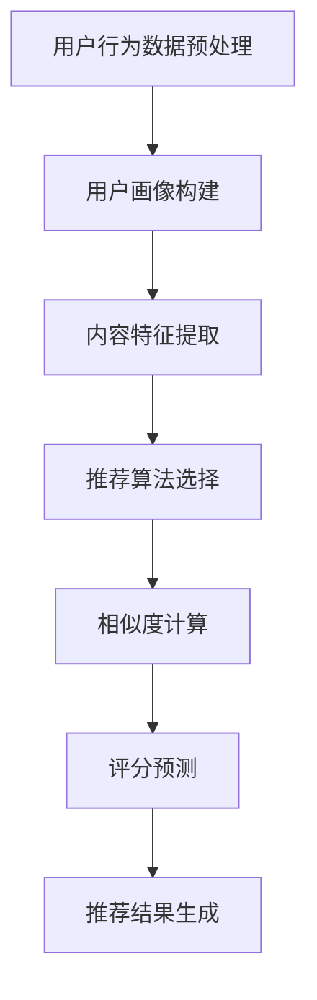
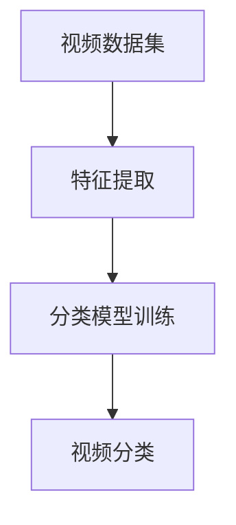
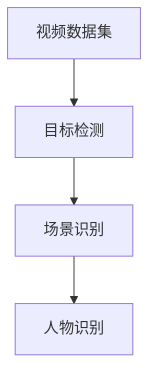
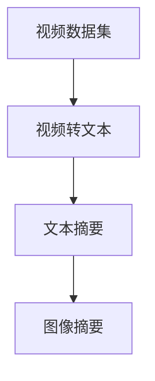
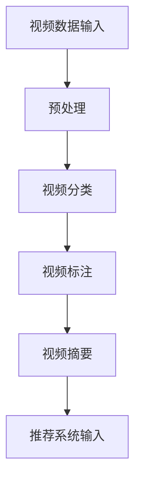
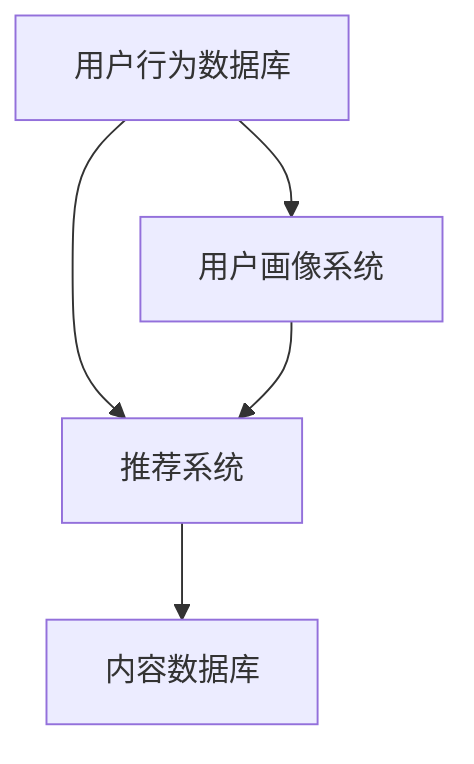
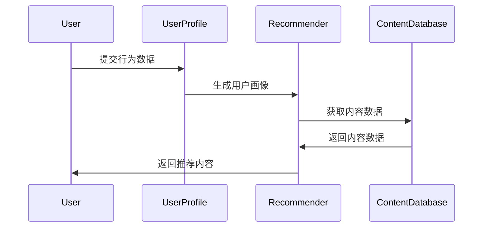
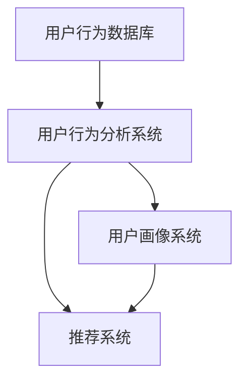
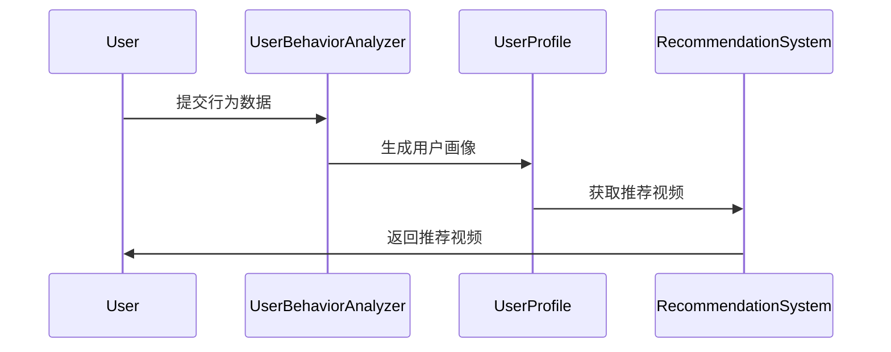

                 

# AI在娱乐产业中的应用：个性化内容推荐

## 关键词
- AI
- 娱乐产业
- 个性化内容推荐
- 推荐算法
- 视频内容分析
- 社交媒体
- 流媒体平台

## 摘要
本文将深入探讨人工智能（AI）在娱乐产业中的应用，特别是个性化内容推荐技术的原理与实践。我们将从背景概述、核心技术、应用案例和未来发展趋势四个方面展开讨论，旨在揭示AI在娱乐产业中如何通过个性化内容推荐提升用户体验，创造更多价值。

## 目录大纲

### 第一部分：AI在娱乐产业的概述
#### 1.1 引言：AI在娱乐产业的背景
##### 1.1.1 问题背景
##### 1.1.2 问题描述
##### 1.1.3 问题解决
##### 1.1.4 边界与外延
##### 1.1.5 概念结构与核心要素组成
#### 1.2 AI核心概念与娱乐产业的联系
##### 1.2.1 AI核心概念原理
##### 1.2.2 娱乐产业中的AI应用
##### 1.2.3 概念属性特征对比表格

### 第二部分：AI在娱乐产业中的应用技术
#### 2.1 个性化内容推荐技术原理
##### 2.1.1 个性化内容推荐的定义
##### 2.1.2 推荐系统的工作原理
###### 2.1.2.1 协同过滤
###### 2.1.2.2 内容过滤
###### 2.1.2.3 混合推荐
##### 2.1.3 推荐算法的数学模型与公式
##### 2.1.4 个性化推荐算法的mermaid流程图
#### 2.2 视频内容分析技术
##### 2.2.1 视频内容分析的定义
##### 2.2.2 视频分析的关键技术
###### 2.2.2.1 视频分类
###### 2.2.2.2 视频标注
###### 2.2.2.3 视频摘要
##### 2.2.3 视频分析的mermaid流程图

### 第三部分：AI在娱乐产业的应用案例
#### 3.1 案例分析一：社交媒体平台内容推荐
##### 3.1.1 案例背景
##### 3.1.2 系统功能设计（mermaid类图）
##### 3.1.3 系统架构设计（mermaid架构图）
##### 3.1.4 系统接口设计
##### 3.1.5 系统交互（mermaid序列图）
#### 3.2 案例分析二：流媒体平台用户行为分析
##### 3.2.1 案例背景
##### 3.2.2 系统功能设计（mermaid类图）
##### 3.2.3 系统架构设计（mermaid架构图）
##### 3.2.4 系统接口设计
##### 3.2.5 系统交互（mermaid序列图）

### 第四部分：AI在娱乐产业的未来发展趋势
#### 4.1 娱乐产业中的AI挑战与机遇
##### 4.1.1 AI在娱乐产业中的挑战
##### 4.1.2 AI在娱乐产业中的机遇
##### 4.1.3 未来发展趋势预测

### 第五部分：最佳实践与建议
#### 5.1 AI在娱乐产业中的最佳实践
##### 5.1.1 成功案例分析
##### 5.1.2 最佳实践总结
#### 5.2 小结与展望

## 第一部分：AI在娱乐产业的概述

### 1.1 引言：AI在娱乐产业的背景

#### 1.1.1 问题背景

随着互联网技术的飞速发展和智能设备的普及，娱乐产业正经历前所未有的变革。传统的内容制作和分发模式已无法满足用户对个性化、多样化娱乐体验的需求。为了提高用户满意度，降低内容推荐的无效率，人工智能（AI）技术应运而生，成为娱乐产业转型升级的关键驱动力。

#### 1.1.2 问题描述

娱乐产业面临的主要问题是如何在庞大的内容库中快速、准确地找到符合用户兴趣和喜好的内容。这不仅要求系统具备高效的推荐算法，还需要理解用户的喜好和需求，实现真正意义上的个性化推荐。

#### 1.1.3 问题解决

AI技术通过机器学习和数据挖掘算法，对用户行为进行深入分析，从而实现个性化内容推荐。通过分析用户的浏览记录、搜索历史、点赞和评论等行为数据，AI可以构建用户画像，预测其兴趣，从而推荐合适的内容。

#### 1.1.4 边界与外延

AI在娱乐产业中的应用不仅限于个性化内容推荐，还包括视频内容分析、语音识别、自然语言处理等多个领域。本文主要关注个性化内容推荐技术，以视频内容分析为例，探讨其在娱乐产业中的应用。

#### 1.1.5 概念结构与核心要素组成

个性化内容推荐系统的核心要素包括用户画像、推荐算法、内容库和用户交互界面。用户画像是对用户兴趣、行为和偏好的一种抽象表示，推荐算法是系统的核心，负责从内容库中筛选出符合用户画像的内容，内容库则是推荐系统的数据基础，用户交互界面则用于接收用户反馈，优化推荐效果。

### 1.2 AI核心概念与娱乐产业的联系

#### 1.2.1 AI核心概念原理

人工智能（AI）是指通过计算机模拟人类智能行为的科学技术。它包括机器学习、深度学习、自然语言处理、计算机视觉等多个子领域。AI的核心概念是数据驱动和模型驱动，通过大量数据训练模型，实现自动化决策和智能行为。

#### 1.2.2 娱乐产业中的AI应用

在娱乐产业中，AI的应用主要体现在个性化内容推荐、视频内容分析、语音识别和自然语言处理等方面。个性化内容推荐通过分析用户行为数据，为用户提供个性化的娱乐内容。视频内容分析则通过计算机视觉技术，对视频内容进行分类、标注和摘要。

#### 1.2.3 概念属性特征对比表格

| 概念       | 特征               | 娱乐产业中的应用                             |
|------------|--------------------|------------------------------------------|
| 个性化推荐 | 数据驱动、模型驱动 | 提高内容推荐的精准度和用户满意度               |
| 视频内容分析 | 计算机视觉         | 实现视频分类、标注和摘要，提升内容处理效率       |
| 语音识别   | 自然语言处理       | 实现语音搜索和语音交互，提升用户体验             |
| 自然语言处理 | 语言理解、语言生成 | 实现智能客服、智能助手等功能，提高人机交互效率   |

## 第二部分：AI在娱乐产业中的应用技术

### 2.1 个性化内容推荐技术原理

#### 2.1.1 个性化内容推荐的定义

个性化内容推荐是一种基于用户兴趣和行为数据，通过算法模型对用户进行画像，从而在内容库中筛选出符合用户兴趣的内容进行推荐的技术。其核心目标是提高内容推荐的精准度和用户满意度。

#### 2.1.2 推荐系统的工作原理

推荐系统通常包括协同过滤、内容过滤和混合推荐三种类型。

- **协同过滤**：基于用户行为数据（如浏览、点赞、购买等）进行相似度计算，为用户推荐与其行为相似的其它用户喜欢的内容。
- **内容过滤**：基于内容特征（如关键词、标签、类别等）进行匹配，为用户推荐具有相似特征的内容。
- **混合推荐**：结合协同过滤和内容过滤的优势，综合推荐算法，提高推荐效果。

#### 2.1.2.1 协同过滤

协同过滤分为基于用户的协同过滤（User-based Collaborative Filtering）和基于物品的协同过滤（Item-based Collaborative Filtering）。

- **基于用户的协同过滤**：寻找与目标用户兴趣相似的其它用户，推荐这些用户喜欢的内容。
- **基于物品的协同过滤**：寻找与目标用户已经评价的物品相似的其它物品，推荐这些物品。

#### 2.1.2.2 内容过滤

内容过滤基于物品的特征信息进行推荐，常见的方法有基于关键词的推荐、基于标签的推荐和基于类别的推荐。

- **基于关键词的推荐**：通过提取内容的关键词，为用户推荐具有相似关键词的内容。
- **基于标签的推荐**：为内容分配标签，根据用户的标签偏好进行推荐。
- **基于类别的推荐**：根据内容的类别信息进行推荐，如电影按类型分类推荐。

#### 2.1.2.3 混合推荐

混合推荐结合协同过滤和内容过滤的优点，提高推荐效果。常见的混合推荐算法有矩阵分解、模型融合等。

- **矩阵分解**：将用户-物品评分矩阵分解为用户特征矩阵和物品特征矩阵，通过特征矩阵的相似度计算进行推荐。
- **模型融合**：结合多个推荐算法的输出，通过加权或投票等方式得到最终推荐结果。

#### 2.1.3 推荐算法的数学模型与公式

推荐算法的核心是相似度计算和评分预测。以下是一个简单的推荐算法数学模型：

$$
R(U, I) = f(U, I, Q, R)
$$

其中，\( R(U, I) \) 表示用户 \( U \) 对物品 \( I \) 的评分预测，\( f \) 表示评分预测函数，\( Q \) 和 \( R \) 分别表示用户和物品的特征向量。

#### 2.1.4 个性化推荐算法的mermaid流程图



### 2.2 视频内容分析技术

#### 2.2.1 视频内容分析的定义

视频内容分析是指利用计算机技术对视频内容进行自动处理和理解，提取视频中的关键信息，如视频分类、标注和摘要等。它是视频处理和视频分析的重要环节，为个性化内容推荐提供支持。

#### 2.2.2 视频分析的关键技术

视频内容分析的关键技术包括视频分类、视频标注和视频摘要。

- **视频分类**：通过算法将视频按照内容进行分类，如电影、电视剧、纪录片等。
- **视频标注**：对视频中的关键帧、场景、人物等进行标注，为后续处理提供基础数据。
- **视频摘要**：从视频中提取关键信息，生成视频摘要，用于快速了解视频内容。

#### 2.2.2.1 视频分类

视频分类通常采用机器学习算法，如支持向量机（SVM）、卷积神经网络（CNN）等。通过训练分类模型，对视频进行自动分类。



#### 2.2.2.2 视频标注

视频标注采用计算机视觉技术，如目标检测、图像识别等。通过标注视频中的关键信息，构建视频数据库。



#### 2.2.2.3 视频摘要

视频摘要采用自然语言处理技术，如文本摘要、图像摘要等。从视频中提取关键信息，生成视频摘要。



#### 2.2.3 视频分析的mermaid流程图



## 第三部分：AI在娱乐产业的应用案例

### 3.1 案例分析一：社交媒体平台内容推荐

#### 3.1.1 案例背景

某社交媒体平台旨在为用户提供个性化的内容推荐，通过AI技术分析用户行为数据，实现精准推荐。

#### 3.1.2 系统功能设计（mermaid类图）

```mermaid
classDiagram
    User <<类>> {
        用户ID
        用户名称
        用户画像
    }
    Content <<类>> {
        内容ID
        内容名称
        内容标签
    }
    Recommendation <<类>> {
        推荐内容
        推荐原因
    }
    User --|>> Content: 关注
    Recommendation --|>> Content: 推荐内容
```

#### 3.1.3 系统架构设计（mermaid架构图）



#### 3.1.4 系统接口设计

- **用户接口**：用于接收用户行为数据和反馈，提供个性化推荐。
- **内容接口**：用于管理内容数据库，提供内容数据。
- **推荐接口**：用于生成推荐结果，返回给用户接口。

#### 3.1.5 系统交互（mermaid序列图）



### 3.2 案例分析二：流媒体平台用户行为分析

#### 3.2.1 案例背景

某流媒体平台希望通过AI技术分析用户行为，优化内容推荐和广告投放。

#### 3.2.2 系统功能设计（mermaid类图）

```mermaid
classDiagram
    User <<类>> {
        用户ID
        用户名称
        用户画像
    }
    Video <<类>> {
        视频ID
        视频名称
        视频标签
    }
    Behavior <<类>> {
        行为类型
        行为时间
        行为内容
    }
    Recommendation <<类>> {
        推荐视频
        推荐原因
    }
    User --|>> Behavior: 用户行为
    Video --|>> Behavior: 视频行为
    Recommendation --|>> User: 推荐视频
```

#### 3.2.3 系统架构设计（mermaid架构图）



#### 3.2.4 系统接口设计

- **用户接口**：用于接收用户行为数据和反馈，提供个性化推荐。
- **视频接口**：用于管理视频数据库，提供视频数据。
- **推荐接口**：用于生成推荐结果，返回给用户接口。

#### 3.2.5 系统交互（mermaid序列图）



## 第四部分：AI在娱乐产业的未来发展趋势

### 4.1 娱乐产业中的AI挑战与机遇

#### 4.1.1 AI在娱乐产业中的挑战

- **数据隐私和安全**：AI在娱乐产业中广泛应用，涉及大量用户数据，如何保障数据隐私和安全成为重要挑战。
- **算法偏见和公平性**：推荐算法可能存在偏见，导致部分用户无法获得公平的推荐。
- **技术门槛和人才短缺**：AI技术要求高，人才培养和团队建设成为企业面临的问题。

#### 4.1.2 AI在娱乐产业中的机遇

- **个性化推荐**：AI技术可以实现精准个性化推荐，提高用户满意度和粘性。
- **内容创新**：AI技术可以辅助内容创作，实现更加丰富多样的娱乐内容。
- **商业模式创新**：AI技术可以优化广告投放和营销策略，提高商业价值。

#### 4.1.3 未来发展趋势预测

- **跨领域融合**：AI与5G、云计算、物联网等技术的融合，将推动娱乐产业迈向新高度。
- **智能化**：娱乐产品将更加智能化，实现人机互动、沉浸式体验。
- **内容多样化**：AI技术将推动娱乐内容多样化，满足用户个性化需求。

## 第五部分：最佳实践与建议

### 5.1 AI在娱乐产业中的最佳实践

#### 5.1.1 成功案例分析

- **Netflix**：通过协同过滤算法，为用户提供个性化推荐，大幅提高了用户满意度和粘性。
- **YouTube**：利用深度学习技术进行视频分类和标注，实现精准推荐，提高了视频观看时长。

#### 5.1.2 最佳实践总结

- **数据驱动**：充分利用用户数据，构建用户画像，实现个性化推荐。
- **技术创新**：紧跟技术发展趋势，采用先进算法和技术，提高推荐效果。
- **用户体验**：注重用户体验，优化推荐系统界面和交互设计。

### 5.2 小结与展望

AI技术在娱乐产业中的应用前景广阔，个性化内容推荐是其中最具潜力的应用领域。通过本文的探讨，我们了解到AI在娱乐产业中的背景、应用技术、案例分析和未来发展趋势。未来，随着AI技术的不断进步，娱乐产业将迎来更加智能化、个性化的发展新阶段。在此过程中，企业应关注数据隐私和安全、算法公平性等问题，积极拥抱AI技术，打造更具竞争力的娱乐产品和服务。

## 作者信息

- 作者：AI天才研究院/AI Genius Institute & 禅与计算机程序设计艺术 /Zen And The Art of Computer Programming

