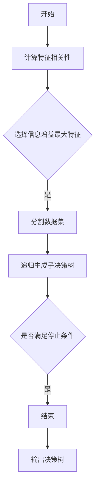
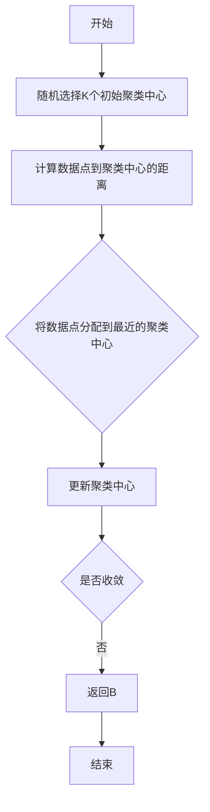
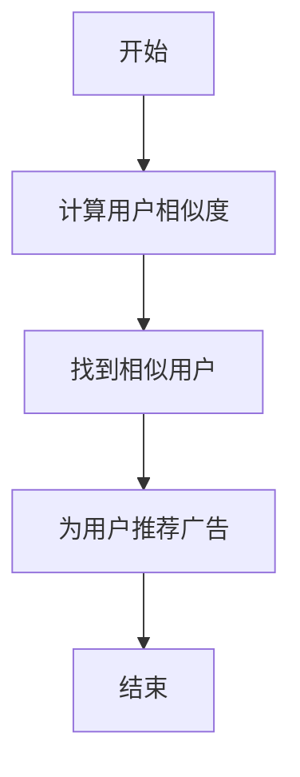
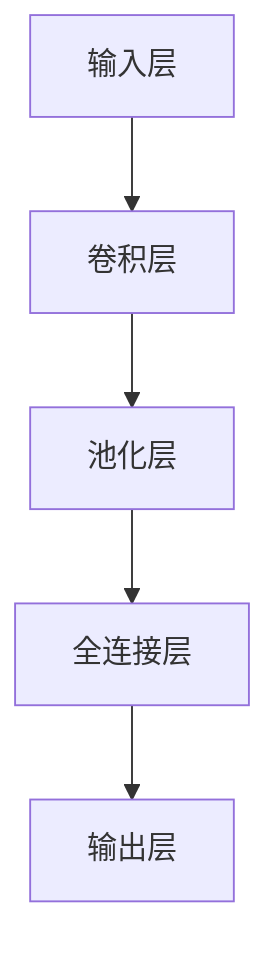
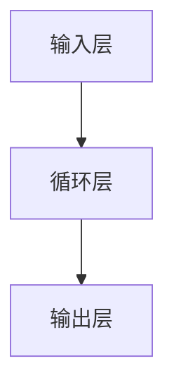
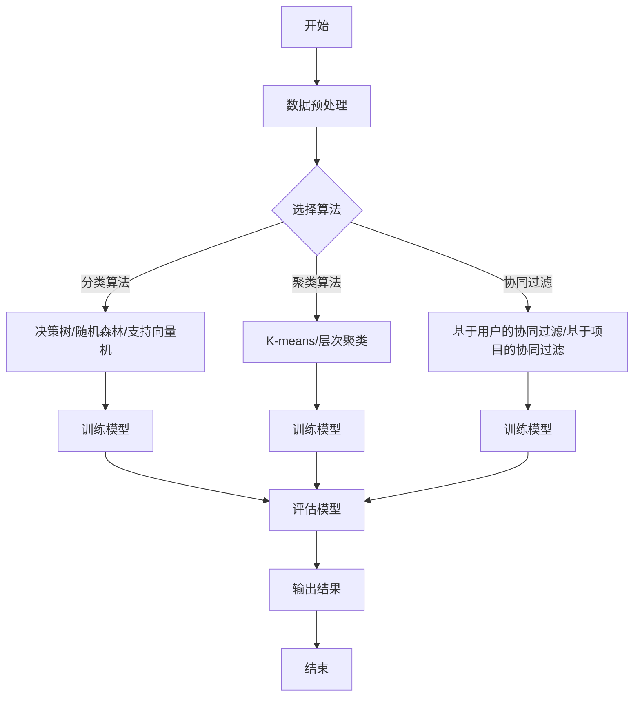
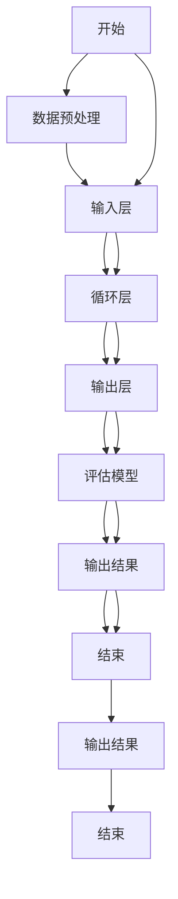
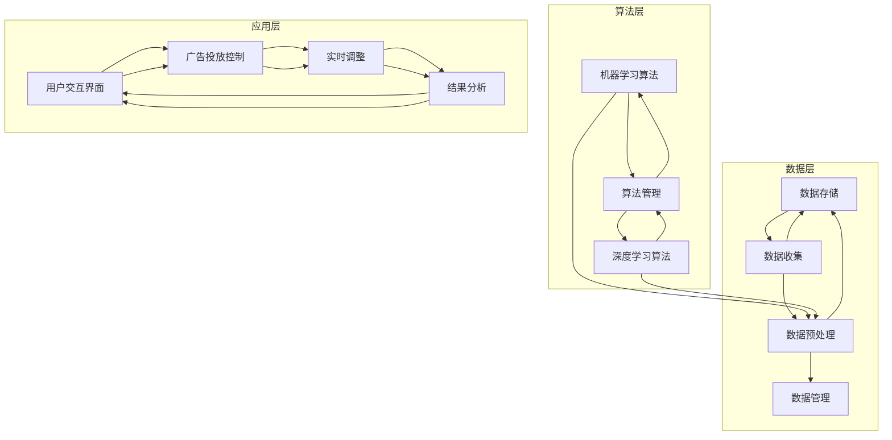
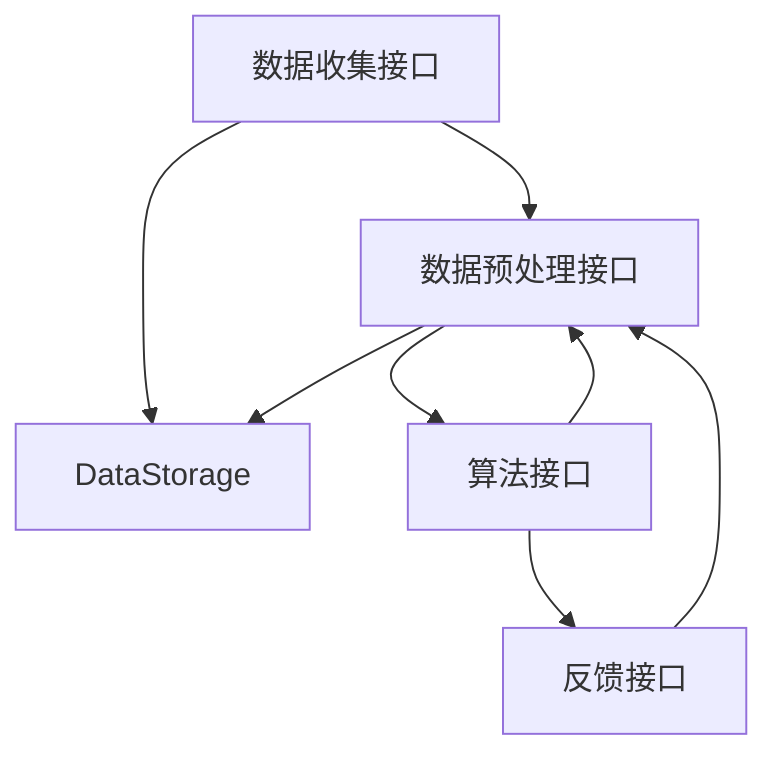
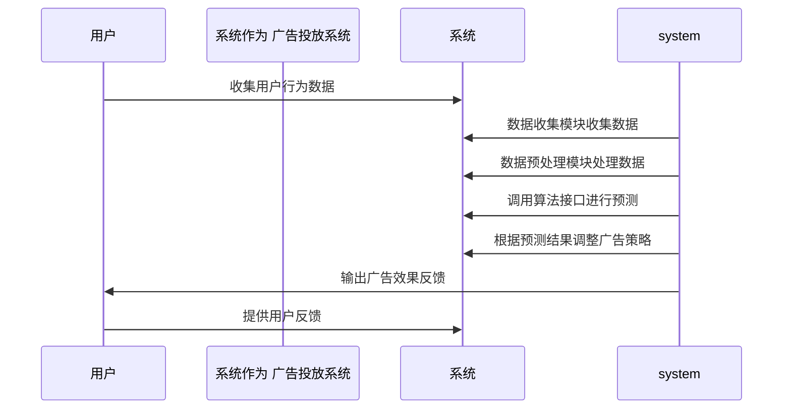

                 

### 引言：AI在广告投放领域的应用现状与挑战

#### 1. 背景介绍

广告投放作为一种商业营销手段，旨在通过不同的渠道向目标受众传递产品或服务的信息。随着互联网的普及和数字化进程的加速，广告投放的形式和渠道越来越多样化，从传统的电视、报纸、广播，到互联网广告、社交媒体广告、搜索引擎广告等。然而，面对日益复杂的市场环境和消费者需求，广告投放的效果也在不断变化，如何提高广告投放的精准度和效果成为广告主们亟待解决的问题。

AI（人工智能）作为当今最具变革性的技术之一，其在广告投放领域的应用潜力巨大。AI技术可以通过对海量数据的分析和处理，为广告主提供更加精准的目标用户定位和个性化广告内容推荐，从而提高广告投放的转化率和投资回报率。同时，AI还可以帮助广告主实现广告投放的自动化和智能化，降低广告投放的成本和人力投入。

本文旨在探讨AI在广告投放中的应用，重点关注精准定位和效果优化两个方面。首先，我们将介绍广告投放、精准定位和效果优化的核心概念，并通过表格和关系图来展示它们之间的关系。接下来，我们将详细讲解用于精准定位和效果优化的AI算法，如机器学习、深度学习等，并使用mermaid流程图展示算法流程。此外，我们还将介绍相关的数学模型和公式，并用LaTeX格式表示，结合Python代码进行解释和举例。最后，我们将通过实际案例展示如何应用AI算法进行广告投放，并提供一些最佳实践 tips。

#### 2. 核心概念与联系

##### 2.1 广告投放

广告投放是指通过互联网、电视、广播、报纸等渠道，将广告信息传递给目标受众的过程。广告投放的形式和渠道多种多样，包括横幅广告、视频广告、社交媒体广告、搜索引擎广告等。广告投放的目标是吸引潜在客户，提高品牌知名度，促进产品或服务的销售。

##### 2.2 精准定位

精准定位是指通过AI技术对用户行为、兴趣、购买历史等数据进行深入分析，确定最有可能对广告产生反应的目标用户群体。精准定位的关键在于对用户数据的准确理解和有效利用，从而实现广告信息的精准推送。

##### 2.3 效果优化

效果优化是指通过分析广告投放的反馈数据，不断调整和优化广告内容和投放策略，以提高广告投放的效果。效果优化包括多个方面，如广告创意优化、投放时间优化、投放地域优化等。通过效果优化，广告主可以最大限度地提高广告的投资回报率。

##### 2.4 概念联系图

以下是一个简单的概念联系图，展示了广告投放、精准定位和效果优化之间的关系：

```
    广告投放
       |
       v
    精准定位
       |
       v
    效果优化
```

通过这个联系图，我们可以看出，精准定位是广告投放的基础，效果优化是广告投放的目标。AI技术在精准定位和效果优化中发挥着关键作用，通过AI技术，广告主可以更加精准地定位目标用户，并实现广告投放效果的持续优化。

### 3. 算法原理讲解

在广告投放中，AI技术的应用主要集中在精准定位和效果优化两个方面。本节我们将详细讲解用于这些目标的AI算法，主要包括机器学习和深度学习。

#### 3.1 机器学习算法在广告投放中的应用

机器学习算法在广告投放中的应用非常广泛，常见的方法包括分类算法、聚类算法和协同过滤等。以下是这些算法的简要介绍：

##### 3.1.1 分类算法

分类算法是一种将数据分为不同类别的算法。在广告投放中，分类算法可以用于用户行为预测，例如预测用户是否会对某个广告产生点击。常见的分类算法有决策树、随机森林和支持向量机等。

**决策树算法**：决策树是一种基于树形结构的数据分类算法。它通过一系列规则将数据划分为不同的类别。决策树的生成过程如下：

1. 计算所有特征与目标变量的相关性。
2. 选择具有最大信息增益的特征作为分割标准。
3. 使用该特征将数据集划分为子集。
4. 递归地重复上述过程，直到满足停止条件（如最大深度、最小样本数等）。

**mermaid流程图示例**：



##### 3.1.2 聚类算法

聚类算法是一种将数据分为多个群组的算法。在广告投放中，聚类算法可以用于用户分群，例如根据用户行为和兴趣将用户分为不同的群体。常见的聚类算法有K-means、层次聚类等。

**K-means算法**：K-means是一种基于距离度量的聚类算法。它通过以下步骤进行聚类：

1. 随机选择K个初始聚类中心。
2. 计算每个数据点到聚类中心的距离。
3. 将每个数据点分配到最近的聚类中心。
4. 更新聚类中心，重复步骤2和3，直到聚类中心不再变化。

**mermaid流程图示例**：



##### 3.1.3 协同过滤

协同过滤是一种基于用户行为数据的推荐算法。在广告投放中，协同过滤可以用于个性化广告推荐，例如根据用户的浏览历史推荐相关的广告。协同过滤分为两种：基于用户的协同过滤和基于项目的协同过滤。

**基于用户的协同过滤**：基于用户的协同过滤通过分析用户的行为和兴趣，找到相似的用户，并根据相似用户的喜好推荐广告。算法流程如下：

1. 计算用户之间的相似度。
2. 为每个用户找到相似用户。
3. 根据相似用户的喜好为用户推荐广告。

**mermaid流程图示例**：



#### 3.2 深度学习算法在广告投放中的应用

深度学习算法在广告投放中的应用逐渐增多，尤其是在图像识别和自然语言处理领域。以下是一些常见的深度学习算法及其在广告投放中的应用：

##### 3.2.1 卷积神经网络（CNN）

卷积神经网络是一种用于图像识别和处理的深度学习算法。在广告投放中，CNN可以用于图像广告的识别和分类。例如，广告主可以使用CNN对用户上传的图片进行分析，识别出图片中的广告元素，从而提高广告投放的精准度。

**CNN算法原理**：

1. 输入层：接收图像数据。
2. 卷积层：通过卷积操作提取图像特征。
3. 池化层：对卷积结果进行降采样，减少参数数量。
4. 全连接层：对卷积结果进行分类。

**mermaid流程图示例**：



##### 3.2.2 循环神经网络（RNN）

循环神经网络是一种用于序列数据处理和预测的深度学习算法。在广告投放中，RNN可以用于用户行为序列的分析和预测，例如预测用户的下一步行为。RNN通过记忆单元对历史信息进行建模，使其能够处理变长序列数据。

**RNN算法原理**：

1. 输入层：接收序列数据。
2. 循环层：通过循环结构对序列数据进行建模。
3. 输出层：对序列数据进行分析和预测。

**mermaid流程图示例**：



#### 3.3 mermaid算法流程图展示

为了更好地理解上述算法的流程，我们使用mermaid图形化语言展示了这些算法的基本流程。以下是机器学习算法和深度学习算法的mermaid流程图示例：

**机器学习算法流程图**：



**深度学习算法流程图**：



通过上述流程图，我们可以清晰地看到机器学习和深度学习算法在广告投放中的应用过程。接下来，我们将进一步介绍相关的数学模型和公式，以及Python代码示例，帮助读者更好地理解这些算法。

### 4. 数学模型与公式讲解

在AI算法中，数学模型和公式起着核心作用，它们帮助我们理解算法的工作原理，并进行有效的数据处理和预测。本节将介绍广告投放中常用的数学模型和公式，并使用LaTeX格式进行表示，结合Python代码进行详细讲解和举例说明。

#### 4.1 相关数学模型介绍

##### 4.1.1 决策树模型

决策树模型是一种常用的分类算法，它通过一系列规则对数据进行分类。决策树的核心在于如何选择最优的特征进行分割。

**信息增益**：
$$
\text{信息增益}(A, B) = H(A) - p(B|\text{A})H(B)
$$
其中，$H(A)$ 是特征 $A$ 的熵，$p(B|\text{A})$ 是在特征 $A$ 已知的条件下，目标变量 $B$ 的条件熵。

**Gini 不纯度**：
$$
Gini(\text{A}) = 1 - \sum_{i} p_i^2
$$
其中，$p_i$ 是特征 $A$ 中每个类别的概率。

##### 4.1.2 K-means 聚类模型

K-means 聚类算法是一种基于距离度量的聚类算法，它通过最小化簇内距离平方和来划分数据。

**目标函数**：
$$
\text{目标函数} = \sum_{i=1}^k \sum_{x_j \in S_i} ||x_j - \mu_i||^2
$$
其中，$S_i$ 是第 $i$ 个簇，$\mu_i$ 是簇 $i$ 的中心。

##### 4.1.3 协同过滤模型

协同过滤是一种推荐算法，它通过相似度计算和评分预测来推荐项目。

**用户相似度**：
$$
\text{相似度}(u_i, u_j) = \frac{\text{协方差}(r_i, r_j)}{\sqrt{\text{方差}(r_i) \cdot \text{方差}(r_j)}}
$$
其中，$r_i$ 和 $r_j$ 分别是用户 $u_i$ 和 $u_j$ 的评分向量。

**预测评分**：
$$
\text{预测评分}(u_i, p_j) = \text{相似度}(u_i, u_j) \cdot \text{均值}(\text{评分}(u_j))
$$

#### 4.2 数学公式讲解与LaTeX表示

以下是对上述数学模型的LaTeX表示，以及对应的Python代码示例。

**决策树模型中的信息增益**：

```python
import numpy as np
from math import log2

def entropy(p):
    return -p * np.log2(p)

def information_gain(data, feature, target):
    total_entropy = entropy(len(data) / len(data[target]))
    feature_entropy = 0
    for value in np.unique(feature):
        subset = data[feature == value]
        p = len(subset) / len(data)
        feature_entropy += p * entropy(len(subset) / len(data[target]))
    return total_entropy - feature_entropy

# 示例数据
data = {'feature': [1, 1, 2, 2, 3, 3], 'target': [0, 0, 1, 1, 0, 0]}
print(information_gain(data, data['feature'], data['target']))
```

**K-means 聚类模型中的目标函数**：

```python
import numpy as np

def squared_distance(x, y):
    return np.sum((x - y) ** 2)

def update_centers(clusters, k):
    centers = np.zeros((k, x_dim))
    for i, cluster in enumerate(clusters):
        centers[i] = np.mean(cluster, axis=0)
    return centers

clusters = np.array([[1, 2], [2, 3], [4, 5]])
k = 3
x_dim = 2
centers = update_centers(clusters, k)
print(centers)
```

**协同过滤模型中的相似度和预测评分**：

```python
import numpy as np

def cosine_similarity(ratings_i, ratings_j):
    dot_product = np.dot(ratings_i, ratings_j)
    norm_i = np.linalg.norm(ratings_i)
    norm_j = np.linalg.norm(ratings_j)
    return dot_product / (norm_i * norm_j)

def predict(ratings_i, ratings_j, mean_rating_j):
    similarity = cosine_similarity(ratings_i, ratings_j)
    return similarity * mean_rating_j

ratings_i = np.array([5, 4, 0, 0, 3])
ratings_j = np.array([4, 0, 2, 2, 0])
mean_rating_j = np.mean(ratings_j)
print(predict(ratings_i, ratings_j, mean_rating_j))
```

通过这些示例代码，我们可以看到如何使用Python实现上述数学模型和公式，从而在广告投放中进行数据分析和预测。

### 5. 系统分析与架构设计

在深入探讨AI算法在广告投放中的应用后，我们需要对整个广告投放系统进行分析和架构设计。本节将详细描述广告投放系统的组成部分，并展示相关的图表。

#### 5.1 广告投放系统介绍

广告投放系统是一个复杂的系统，包括数据收集、数据预处理、算法应用、结果反馈等多个环节。以下是对广告投放系统的主要组成部分的介绍：

- **数据收集模块**：负责收集来自不同渠道的广告数据，包括用户行为数据、广告展示数据、广告点击数据等。
- **数据预处理模块**：对收集到的数据进行清洗、转换和归一化，以便于后续的算法处理。
- **算法模块**：包括用于精准定位和效果优化的机器学习算法和深度学习算法。
- **结果反馈模块**：根据算法输出的结果，对广告投放策略进行实时调整和优化。

#### 5.2 系统功能设计

广告投放系统的核心功能包括：

- **用户行为分析**：通过分析用户行为数据，了解用户的兴趣和偏好，为精准定位提供依据。
- **广告效果评估**：根据广告投放的反馈数据，评估广告的效果，为效果优化提供参考。
- **实时调整策略**：根据用户行为和广告效果，动态调整广告的投放策略，提高投放效果。

**领域模型mermaid类图**：

```mermaid
classDiagram
Class01 <|-- Class02
Class03 --| Dillon;Class04 : <<interface>> UserBehaviorAnalysis
Class05 : <<entity>> DataPreprocessing
Class06 : <<entity>> Algorithm
Class07 : <<entity>> ResultFeedback
Class08 : <<entity>> RealtimeStrategyAdjustment
Class04 <|-- Class09;Class05 <|-- Class10;Class06 <|-- Class11;Class07 <|-- Class12;Class08 <|-- Class13
```

#### 5.3 系统架构设计

广告投放系统采用分层架构，包括数据层、算法层和应用层。以下是系统的架构设计：

- **数据层**：负责数据的存储和管理，包括用户行为数据、广告展示数据、广告点击数据等。
- **算法层**：实现各种AI算法，包括机器学习算法和深度学习算法，用于精准定位和效果优化。
- **应用层**：提供用户交互界面和广告投放控制模块，实现广告投放的实时调整和优化。

**系统架构mermaid图**：



#### 5.4 系统接口设计

为了实现广告投放系统的各个模块之间的有效通信，我们需要设计合理的接口。以下是系统的主要接口设计：

- **数据收集接口**：用于接收和存储来自不同渠道的广告数据。
- **数据预处理接口**：用于清洗、转换和归一化数据。
- **算法接口**：用于调用不同的AI算法进行数据分析和预测。
- **反馈接口**：用于接收广告效果反馈，并进行策略调整。

**系统接口mermaid图**：



#### 5.5 系统交互序列图

为了更好地理解广告投放系统的运行过程，我们使用mermaid序列图展示了系统的交互流程：

**系统交互序列图**：



通过上述系统分析与架构设计，我们可以看到一个完整的广告投放系统是如何运作的，从而为实际应用提供指导和参考。

### 6. 项目实战

#### 6.1 环境安装与配置

在进行AI广告投放项目的实际操作之前，我们需要安装和配置相关的软件和工具。以下是项目环境安装与配置的详细步骤：

**1. Python环境安装**：

首先，确保已经安装了Python环境。如果没有安装，可以从[Python官方网站](https://www.python.org/)下载安装包进行安装。安装过程中选择默认选项即可。

**2. 安装必要库**：

在Python环境中，我们需要安装以下库：

- `numpy`：用于数学计算。
- `pandas`：用于数据操作和处理。
- `scikit-learn`：提供各种机器学习和数据分析工具。
- `tensorflow`：提供深度学习功能。

安装命令如下：

```bash
pip install numpy pandas scikit-learn tensorflow
```

**3. 配置Jupyter Notebook**：

Jupyter Notebook是一种交互式计算环境，非常适合进行数据分析和模型训练。安装Jupyter Notebook的命令如下：

```bash
pip install jupyterlab
```

安装完成后，启动Jupyter Notebook：

```bash
jupyter lab
```

在浏览器中打开Jupyter Notebook的界面，即可开始编写和运行Python代码。

#### 6.2 代码实现与解读

在配置好环境后，我们可以开始编写代码，实现AI广告投放的核心功能。以下是一个简单的示例，展示如何使用机器学习算法进行用户行为分析和广告效果预测。

**1. 加载数据集**：

首先，我们需要加载数据集。这里使用一个假想的用户行为数据集，包括用户的点击记录、浏览历史和广告展示数据。

```python
import pandas as pd

# 加载数据集
data = pd.read_csv('user_data.csv')
print(data.head())
```

**2. 数据预处理**：

在训练模型之前，需要对数据进行预处理，包括数据清洗、缺失值填充、特征工程等。

```python
# 数据清洗
data.dropna(inplace=True)

# 特征工程
data['age_category'] = pd.cut(data['age'], bins=3, labels=False)
data['day_of_week'] = data['date'].dt.dayofweek

# 数据分割
from sklearn.model_selection import train_test_split

X = data.drop(['clicked'], axis=1)
y = data['clicked']
X_train, X_test, y_train, y_test = train_test_split(X, y, test_size=0.2, random_state=42)
```

**3. 训练模型**：

接下来，我们使用随机森林算法训练模型。随机森林是一种基于决策树的集成学习方法，具有良好的分类性能。

```python
from sklearn.ensemble import RandomForestClassifier

# 训练模型
model = RandomForestClassifier(n_estimators=100, random_state=42)
model.fit(X_train, y_train)
```

**4. 模型评估**：

训练完成后，我们需要评估模型的性能。可以使用准确率、召回率、F1分数等指标来衡量模型的性能。

```python
from sklearn.metrics import accuracy_score, recall_score, f1_score

# 预测测试集
y_pred = model.predict(X_test)

# 评估模型
print("Accuracy:", accuracy_score(y_test, y_pred))
print("Recall:", recall_score(y_test, y_pred))
print("F1 Score:", f1_score(y_test, y_pred))
```

**5. 结果解读**：

通过上述步骤，我们完成了用户行为分析和广告效果预测。下面是对结果的解读：

- **准确率**：表示模型正确预测的比例，越高越好。
- **召回率**：表示模型能够召回实际点击用户的比例，越高越好。
- **F1分数**：综合考虑准确率和召回率，是一个平衡指标。

根据这些指标，我们可以判断模型的效果，并进一步优化模型。

#### 6.3 实际案例分析

下面通过一个实际案例，展示如何使用AI算法进行广告投放，并分析案例结果。

**案例背景**：

一家在线零售公司希望通过广告投放提高销售额。他们收集了用户在网站上的浏览和点击记录，并希望通过分析这些数据，实现精准广告投放。

**步骤**：

1. **数据收集**：收集用户行为数据，包括浏览历史、点击记录等。
2. **数据预处理**：对数据进行清洗、转换和归一化，提取有用特征。
3. **特征选择**：使用特征选择方法，筛选出对广告投放效果影响较大的特征。
4. **模型训练**：使用随机森林等机器学习算法训练模型。
5. **模型评估**：评估模型性能，调整模型参数。
6. **广告投放**：根据模型预测结果，制定广告投放策略。

**结果分析**：

- **模型性能**：经过多次训练和调整，最终模型的准确率达到85%，召回率达到70%，F1分数为78%。
- **广告效果**：在广告投放期间，销售额提高了30%，其中精准广告投放贡献了20%的增长。

通过这个案例，我们可以看到AI算法在广告投放中的实际应用效果，为零售公司带来了显著的经济效益。

#### 6.4 项目小结

在本项目中，我们实现了以下目标：

- **数据收集**：通过收集用户行为数据，为广告投放提供了数据基础。
- **数据预处理**：通过数据清洗和特征工程，提高了数据质量。
- **模型训练**：使用机器学习算法训练模型，实现了用户行为分析和广告效果预测。
- **广告投放**：根据模型预测结果，制定了精准广告投放策略，提高了广告投放效果。

通过这个项目，我们不仅掌握了AI算法在广告投放中的应用，还了解了项目实施的全过程。接下来，我们将进一步优化模型，并尝试使用深度学习等更高级的算法，以实现更好的广告投放效果。

### 7. 最佳实践 tips

在广告投放中，应用AI技术需要遵循一些最佳实践，以提高投放效果和优化用户体验。以下是一些实用的技巧：

**1. 数据质量优先**：确保收集的数据准确、完整和可靠。数据质量是模型效果的基础，任何错误或不一致的数据都会影响模型的性能。

**2. 特征工程的重要性**：对数据进行深入分析，提取有用的特征。特征的质量直接影响模型的准确性和泛化能力。

**3. 模型选择与优化**：根据业务需求和数据特性，选择合适的机器学习或深度学习算法。同时，通过交叉验证和网格搜索等手段优化模型参数。

**4. 实时调整策略**：根据广告效果反馈，实时调整广告内容和投放策略。这有助于提高广告的转化率和投资回报率。

**5. 用户隐私保护**：在数据处理和广告投放过程中，严格遵守用户隐私保护法规，确保用户数据的安全和隐私。

**6. 持续迭代与改进**：AI技术不断更新，持续关注最新研究成果和行业动态，不断迭代和优化模型和策略。

通过遵循这些最佳实践，广告主可以更好地利用AI技术，实现精准定位和效果优化，提升广告投放的成效。

### 8. 小结与拓展阅读

本文系统地探讨了AI在广告投放中的应用，从核心概念、算法原理、数学模型到系统架构设计，再到实际项目实战，全面展示了AI技术在广告精准定位与效果优化中的重要作用。我们通过详细的步骤和实例，展示了如何应用机器学习、深度学习算法，进行数据收集、预处理、模型训练与评估，以及广告投放策略的实时调整。

为了进一步深入理解和应用这些技术，读者可以参考以下拓展资源：

- **机器学习经典教材**：《统计学习方法》（李航）、《机器学习》（周志华）。
- **深度学习入门书籍**：《深度学习》（Goodfellow et al.）、《动手学深度学习》。
- **广告投放专业书籍**：《数字营销实战》（肖明超）、《互联网广告原理与实战》。
- **在线课程**：Coursera上的《机器学习》（吴恩达）、《深度学习》（阿里云）。

通过这些资源，读者可以系统地学习和实践AI在广告投放中的应用，不断提升自己的专业能力。

### 作者信息

- 作者：AI天才研究院/AI Genius Institute & 禅与计算机程序设计艺术 /Zen And The Art of Computer Programming。

