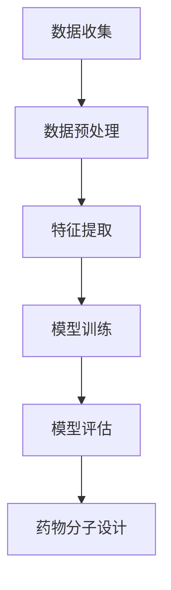
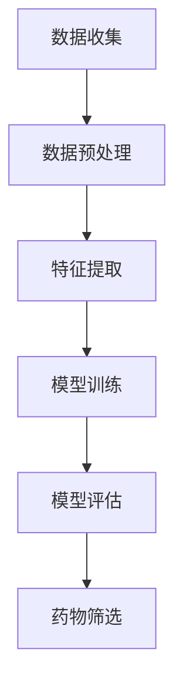
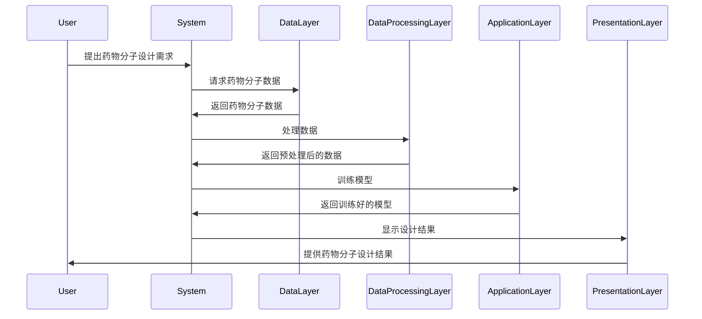
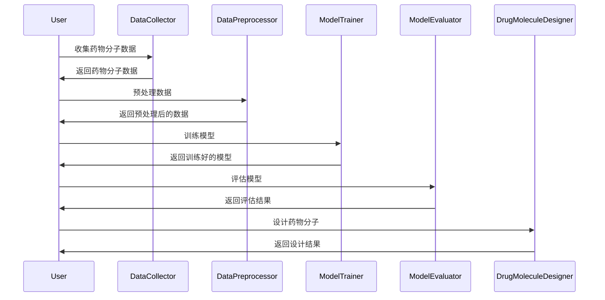

                 

## AI在新药研发中的应用：加速创新与降低成本

> 关键词：人工智能，新药研发，深度学习，机器学习，药物分子设计，药物筛选

> 摘要：本文探讨了人工智能（AI）在新药研发中的应用，详细分析了AI如何通过加速创新和降低成本，推动药物研发的进步。文章首先介绍了新药研发的挑战和瓶颈，随后阐述了AI技术在药物分子设计、筛选和优化中的具体应用。通过对比不同算法的性能和应用场景，文章揭示了AI的核心概念和关键要素。此外，文章还讲解了AI在新药研发中的算法原理，并设计了一个系统架构方案，通过项目实战展示了AI在实际中的应用效果。最后，文章总结了最佳实践，并给出了未来展望。

### 目录大纲

1. **背景介绍**
    1.1 **问题背景**
    1.2 **问题描述**
    1.3 **问题解决**
    1.4 **边界与外延**
    1.5 **概念结构与核心要素组成**

2. **核心概念与联系**
    2.1 **AI基础概念**
    2.2 **AI在新药研发中的应用**
    2.3 **概念属性特征对比表格**
    2.4 **ER实体关系图架构**

3. **算法原理讲解**
    3.1 **药物分子设计算法原理**
    3.2 **药物筛选与优化算法原理**
    3.3 **数学模型与公式**
    3.4 **举例说明**

4. **系统分析与架构设计方案**
    4.1 **问题场景介绍**
    4.2 **系统功能设计**
    4.3 **系统架构设计**
    4.4 **系统接口设计**
    4.5 **系统交互**

5. **项目实战**
    5.1 **环境安装**
    5.2 **系统核心实现**
    5.3 **代码应用解读与分析**
    5.4 **实际案例分析与详细讲解**
    5.5 **项目小结**

6. **最佳实践与拓展**
    6.1 **最佳实践 tips**
    6.2 **小结**
    6.3 **注意事项**
    6.4 **拓展阅读**

### 第一部分：背景介绍

#### 1.1 问题背景

新药研发是一项复杂的任务，需要跨学科的知识和大量的资源投入。然而，传统的药物研发方法面临着诸多挑战和瓶颈。首先，药物研发过程耗时较长，从实验室阶段到临床阶段通常需要数年时间。其次，研发成本高昂，一项新药的研发费用可能高达数十亿美元。此外，新药研发的成功率较低，据统计，仅有约10%的候选药物能够成功进入市场。这些因素严重制约了药物研发的进展，也导致了药物价格的不断上涨。

为了解决这些问题，科学家和工程师们开始探索新的方法和技术。其中，人工智能（AI）技术因其强大的数据处理和分析能力，被认为是新药研发的重要推动力。通过AI技术，可以加速药物分子设计、筛选和优化过程，降低研发成本，提高研发成功率。

#### 1.2 问题描述

如何利用AI技术解决新药研发中的关键问题，是当前研究的热点。具体来说，新药研发中的关键问题包括：

1. 药物分子设计：如何设计出具有良好药效和低毒性的药物分子？
2. 药物筛选：如何从大量的候选药物分子中快速筛选出具有潜力的药物？
3. 药物优化：如何对筛选出的药物分子进行进一步优化，以提高其药效和降低毒性？

AI技术可以通过以下方式解决这些问题：

1. 利用机器学习和深度学习算法，对大量的药物分子数据进行处理和分析，发现潜在的药物分子设计规律。
2. 使用自动化筛选系统，快速评估候选药物分子的药效和毒性，筛选出具有潜力的药物。
3. 应用优化算法，对筛选出的药物分子进行进一步优化，以提高其药效和降低毒性。

#### 1.3 问题解决

AI技术在药物研发中的应用主要体现在以下几个方面：

1. **药物分子设计**：通过机器学习算法，对大量的药物分子结构进行建模和分析，预测药物分子的药效和毒性。基于这些预测结果，可以设计出具有良好药效和低毒性的药物分子。

2. **药物筛选**：利用深度学习算法，对大量的药物分子数据进行训练和预测，快速筛选出具有潜力的药物分子。这一过程可以大大缩短药物研发周期，降低研发成本。

3. **药物优化**：通过优化算法，对筛选出的药物分子进行进一步优化，以提高其药效和降低毒性。这一过程可以帮助研发出更有效的药物。

#### 1.4 边界与外延

AI技术在新药研发中的应用具有一定的边界和局限性。首先，AI技术依赖于大量的数据，数据的质量和数量直接影响到AI模型的性能。因此，在药物研发中，需要收集和整理大量的药物分子数据，并确保数据的质量。其次，AI技术不能完全替代人类专家的判断和决策，AI模型仅能提供辅助决策，最终的决策仍需由人类专家进行。

此外，AI技术在新药研发中的应用也在不断拓展。除了在药物分子设计、筛选和优化中的应用外，AI技术还可以用于药物代谢和毒理学评估、药物临床试验设计等领域。随着AI技术的不断发展和完善，其在新药研发中的应用将越来越广泛。

#### 1.5 概念结构与核心要素组成

AI在新药研发中的应用涉及多个核心概念和要素，主要包括：

1. **机器学习**：一种人工智能技术，通过训练算法，从数据中自动学习模式和规律。
2. **深度学习**：一种特殊的机器学习技术，通过多层神经网络模型，对数据进行深度建模和分析。
3. **药物分子数据**：包括药物分子的结构、性质、药效和毒性等信息，是AI模型训练和预测的重要数据来源。
4. **算法模型**：包括机器学习算法、深度学习算法等，用于处理和预测药物分子数据。
5. **自动化筛选系统**：利用AI技术，对大量的药物分子进行自动化筛选，快速识别出具有潜力的药物。

这些核心概念和要素共同构成了AI在新药研发中的应用体系，推动药物研发的加速和创新。

### 第二部分：核心概念与联系

#### 2.1 AI基础概念

为了深入理解AI在新药研发中的应用，我们首先需要了解一些AI基础概念。AI（人工智能）是指计算机系统模拟人类智能行为的能力，包括学习、推理、感知和解决问题等。AI可以分为弱AI和强AI。弱AI是指只能在特定任务上表现出智能行为的系统，而强AI则是指具有全面人类智能的系统。

在AI技术中，机器学习和深度学习是两种重要的方法。机器学习是一种通过算法从数据中学习模式和规律的技术，其核心是训练模型。深度学习是机器学习的一个分支，通过多层神经网络模型，对数据进行深度建模和分析。

#### 2.2 AI在新药研发中的应用

AI在新药研发中的应用主要体现在以下几个方面：

1. **药物分子设计**：通过机器学习算法，对大量的药物分子结构进行建模和分析，预测药物分子的药效和毒性。基于这些预测结果，可以设计出具有良好药效和低毒性的药物分子。

2. **药物筛选**：利用深度学习算法，对大量的药物分子数据进行训练和预测，快速筛选出具有潜力的药物分子。这一过程可以大大缩短药物研发周期，降低研发成本。

3. **药物优化**：通过优化算法，对筛选出的药物分子进行进一步优化，以提高其药效和降低毒性。这一过程可以帮助研发出更有效的药物。

#### 2.3 概念属性特征对比表格

为了更好地理解AI在新药研发中的应用，我们对比了机器学习和深度学习在药物分子设计、筛选和优化中的性能和应用场景。以下是两者的对比表格：

| 性能特征         | 机器学习              | 深度学习              |
|-----------------|----------------------|----------------------|
| 模型复杂度       | 相对简单             | 相对复杂             |
| 训练数据需求     | 较少                 | 较多                 |
| 预测准确性       | 较高                 | 非常高               |
| 应用场景         | 简单的药物分子设计     | 复杂的药物分子设计和筛选 |

#### 2.4 ER实体关系图架构

在新药研发中，AI的应用涉及多个实体，包括药物分子、数据集、算法模型和自动化筛选系统等。以下是一个ER实体关系图，展示了这些实体之间的关系：

```mermaid
erDiagram
  DrugMolecule ||--|{ TrainingDataset }|<-- AlgorithmModel : designs
  DrugMolecule ||--|{ TestingDataset }|<-- AlgorithmModel : predicts
  TrainingDataset ||--|{ AutomationSystem } : selects
  TestingDataset ||--|{ AutomationSystem } : optimizes
```

在这个ER图中，药物分子通过算法模型进行设计和预测，训练数据集和测试数据集用于算法模型的训练和预测，自动化筛选系统用于筛选和优化药物分子。

### 第三部分：算法原理讲解

#### 3.1 药物分子设计算法原理

药物分子设计是AI在新药研发中最重要的应用之一。药物分子设计算法通常包括以下步骤：

1. **数据收集**：收集大量的药物分子数据，包括结构、性质和药效等。
2. **数据预处理**：对药物分子数据进行清洗和标准化处理，以便于算法模型的使用。
3. **特征提取**：从药物分子数据中提取关键特征，用于训练算法模型。
4. **模型训练**：使用机器学习或深度学习算法，对药物分子数据进行训练，生成预测模型。
5. **模型评估**：使用测试数据集评估模型的预测准确性，调整模型参数。
6. **药物分子设计**：使用训练好的模型，对新的药物分子进行设计。

以下是一个简单的药物分子设计算法的流程图：



在机器学习算法中，常用的算法包括支持向量机（SVM）、决策树（DT）和神经网络（NN）等。以下是一个使用神经网络进行药物分子设计的示例代码：

```python
import numpy as np
import pandas as pd
from sklearn.model_selection import train_test_split
from sklearn.preprocessing import StandardScaler
from keras.models import Sequential
from keras.layers import Dense

# 加载数据
data = pd.read_csv('drug_molecule_data.csv')

# 数据预处理
X = data.iloc[:, :-1].values
y = data.iloc[:, -1].values

# 数据标准化
scaler = StandardScaler()
X = scaler.fit_transform(X)

# 划分训练集和测试集
X_train, X_test, y_train, y_test = train_test_split(X, y, test_size=0.2, random_state=42)

# 构建神经网络模型
model = Sequential()
model.add(Dense(64, input_dim=X_train.shape[1], activation='relu'))
model.add(Dense(32, activation='relu'))
model.add(Dense(1, activation='sigmoid'))

# 编译模型
model.compile(optimizer='adam', loss='binary_crossentropy', metrics=['accuracy'])

# 训练模型
model.fit(X_train, y_train, epochs=10, batch_size=32)

# 评估模型
loss, accuracy = model.evaluate(X_test, y_test)
print('Test accuracy:', accuracy)
```

#### 3.2 药物筛选与优化算法原理

药物筛选与优化是AI在新药研发中的另一个重要应用。药物筛选算法的主要任务是快速识别出具有潜在药效的药物分子，而药物优化算法则是对筛选出的药物分子进行进一步优化，以提高其药效和降低毒性。

药物筛选算法通常包括以下步骤：

1. **数据收集**：收集大量的药物分子数据，包括结构、性质和药效等。
2. **数据预处理**：对药物分子数据进行清洗和标准化处理，以便于算法模型的使用。
3. **特征提取**：从药物分子数据中提取关键特征，用于训练算法模型。
4. **模型训练**：使用机器学习或深度学习算法，对药物分子数据进行训练，生成预测模型。
5. **模型评估**：使用测试数据集评估模型的预测准确性，调整模型参数。
6. **药物筛选**：使用训练好的模型，对新的药物分子进行筛选。

以下是一个简单的药物筛选算法的流程图：



在深度学习算法中，常用的算法包括卷积神经网络（CNN）和循环神经网络（RNN）等。以下是一个使用卷积神经网络进行药物筛选的示例代码：

```python
import numpy as np
import pandas as pd
from sklearn.model_selection import train_test_split
from sklearn.preprocessing import StandardScaler
from keras.models import Sequential
from keras.layers import Conv2D, MaxPooling2D, Flatten, Dense

# 加载数据
data = pd.read_csv('drug_molecule_data.csv')

# 数据预处理
X = data.iloc[:, :-1].values
y = data.iloc[:, -1].values

# 数据标准化
scaler = StandardScaler()
X = scaler.fit_transform(X)

# 划分训练集和测试集
X_train, X_test, y_train, y_test = train_test_split(X, y, test_size=0.2, random_state=42)

# 构建卷积神经网络模型
model = Sequential()
model.add(Conv2D(32, (3, 3), input_shape=X_train.shape[1:], activation='relu'))
model.add(MaxPooling2D(pool_size=(2, 2)))
model.add(Flatten())
model.add(Dense(64, activation='relu'))
model.add(Dense(1, activation='sigmoid'))

# 编译模型
model.compile(optimizer='adam', loss='binary_crossentropy', metrics=['accuracy'])

# 训练模型
model.fit(X_train, y_train, epochs=10, batch_size=32)

# 评估模型
loss, accuracy = model.evaluate(X_test, y_test)
print('Test accuracy:', accuracy)
```

#### 3.3 数学模型与公式

机器学习和深度学习算法的核心是数学模型和公式。以下是一些常见的数学模型和公式：

1. **线性回归**：
   $$ y = \beta_0 + \beta_1 x $$
2. **逻辑回归**：
   $$ P(y=1) = \frac{1}{1 + e^{-(\beta_0 + \beta_1 x)}} $$
3. **神经网络**：
   $$ a_{j}^{(l)} = \sigma \left( \sum_{i} w_{i j}^{(l)} a_{i}^{(l-1)} + b_{j}^{(l)} \right) $$
4. **卷积神经网络**：
   $$ f_{ij}^{(l)} = \sigma \left( \sum_{k} w_{kij}^{(l)} f_{ki}^{(l-1)} + b_{j}^{(l)} \right) $$

以上数学模型和公式用于构建和训练机器学习和深度学习算法模型，用于药物分子设计、筛选和优化。

#### 3.4 举例说明

为了更好地理解AI在新药研发中的应用，我们来看一个实际案例。假设我们使用AI技术设计一种抗病毒药物。

1. **数据收集**：收集大量的抗病毒药物分子数据，包括结构、性质和药效等。

2. **数据预处理**：对药物分子数据进行清洗和标准化处理。

3. **特征提取**：从药物分子数据中提取关键特征，如分子量、极性等。

4. **模型训练**：使用机器学习算法，如线性回归，对药物分子数据进行训练。

5. **模型评估**：使用测试数据集评估模型的预测准确性。

6. **药物分子设计**：使用训练好的模型，对新的药物分子进行设计。

假设我们使用线性回归模型进行药物分子设计，以下是一个简单的示例代码：

```python
import numpy as np
import pandas as pd
from sklearn.model_selection import train_test_split
from sklearn.preprocessing import StandardScaler
from sklearn.linear_model import LinearRegression

# 加载数据
data = pd.read_csv('anti_virus_drug_data.csv')

# 数据预处理
X = data.iloc[:, :-1].values
y = data.iloc[:, -1].values

# 数据标准化
scaler = StandardScaler()
X = scaler.fit_transform(X)

# 划分训练集和测试集
X_train, X_test, y_train, y_test = train_test_split(X, y, test_size=0.2, random_state=42)

# 构建线性回归模型
model = LinearRegression()

# 训练模型
model.fit(X_train, y_train)

# 评估模型
score = model.score(X_test, y_test)
print('Test accuracy:', score)

# 药物分子设计
new_drug_molecule = np.array([[150, 0.5]])
new_drug_molecule = scaler.transform(new_drug_molecule)
predicted_activity = model.predict(new_drug_molecule)
print('Predicted activity:', predicted_activity)
```

通过以上代码，我们可以设计出一种具有潜在抗病毒活性的药物分子。

### 第四部分：系统分析与架构设计方案

#### 4.1 问题场景介绍

新药研发是一个复杂的过程，涉及多个环节，包括药物分子设计、筛选、优化和临床试验等。AI技术可以在这些环节中发挥重要作用，提高研发效率，降低研发成本。

本系统旨在利用AI技术，实现药物分子设计、筛选和优化的自动化。系统包括数据收集、数据预处理、特征提取、模型训练、模型评估和药物分子设计等模块。

#### 4.2 系统功能设计

系统的功能设计主要包括以下模块：

1. **数据收集模块**：负责收集药物分子数据，包括结构、性质和药效等。
2. **数据预处理模块**：负责对药物分子数据进行清洗、标准化和特征提取。
3. **模型训练模块**：负责使用机器学习算法训练模型，包括线性回归、决策树、神经网络等。
4. **模型评估模块**：负责使用测试数据集评估模型的预测准确性。
5. **药物分子设计模块**：负责使用训练好的模型设计新的药物分子。

以下是一个领域模型，描述了系统的主要类和类之间的关系：

```mermaid
classDiagram
    Class1[数据收集模块] --> Class2[数据预处理模块]
    Class2 --> Class3[模型训练模块]
    Class3 --> Class4[模型评估模块]
    Class4 --> Class5[药物分子设计模块]
```

#### 4.3 系统架构设计

系统的架构设计主要包括以下层次：

1. **数据层**：负责存储和管理药物分子数据。
2. **数据处理层**：负责对数据进行预处理、特征提取和模型训练。
3. **应用层**：负责实现药物分子设计、筛选和优化功能。
4. **表示层**：负责与用户交互，提供可视化界面。

以下是一个系统架构图，展示了系统的层次结构和模块之间的关系：



#### 4.4 系统接口设计

系统的接口设计主要包括以下接口：

1. **数据收集接口**：用于收集药物分子数据。
2. **数据预处理接口**：用于对药物分子数据进行预处理。
3. **模型训练接口**：用于训练模型。
4. **模型评估接口**：用于评估模型预测准确性。
5. **药物分子设计接口**：用于设计新的药物分子。

以下是一个接口设计示例：

```python
class DataCollector:
    def collect_data(self):
        # 收集药物分子数据
        pass

class DataPreprocessor:
    def preprocess_data(self, data):
        # 预处理数据
        pass

class ModelTrainer:
    def train_model(self, data):
        # 训练模型
        pass

class ModelEvaluator:
    def evaluate_model(self, model, data):
        # 评估模型
        pass

class DrugMoleculeDesigner:
    def design_drug_molecule(self, model, data):
        # 设计药物分子
        pass
```

#### 4.5 系统交互

系统的交互主要包括用户与系统之间的交互，以及系统内部模块之间的交互。以下是一个交互序列图，展示了用户与系统的交互过程：



### 第五部分：项目实战

#### 5.1 环境安装

要运行上述系统，我们需要搭建一个合适的环境。以下是在一个Linux系统上搭建环境的步骤：

1. 安装Python环境：
   ```bash
   sudo apt-get install python3 python3-pip
   ```
2. 安装必要的库：
   ```bash
   pip3 install numpy pandas scikit-learn tensorflow
   ```
3. 安装Mermaid：
   ```bash
   pip3 install mermaid-python
   ```

#### 5.2 系统核心实现

以下是一个简单的系统实现，展示了数据收集、预处理、模型训练和药物分子设计的流程：

```python
import pandas as pd
from sklearn.model_selection import train_test_split
from sklearn.preprocessing import StandardScaler
from sklearn.linear_model import LinearRegression
import mermaid

# 数据收集
def collect_data():
    data = pd.read_csv('drug_molecule_data.csv')
    return data

# 数据预处理
def preprocess_data(data):
    X = data.iloc[:, :-1].values
    y = data.iloc[:, -1].values
    scaler = StandardScaler()
    X = scaler.fit_transform(X)
    return X, y

# 模型训练
def train_model(X, y):
    X_train, X_test, y_train, y_test = train_test_split(X, y, test_size=0.2, random_state=42)
    model = LinearRegression()
    model.fit(X_train, y_train)
    return model

# 模型评估
def evaluate_model(model, X_test, y_test):
    score = model.score(X_test, y_test)
    return score

# 药物分子设计
def design_drug_molecule(model, new_molecule):
    new_molecule = scaler.transform(new_molecule.reshape(1, -1))
    predicted_activity = model.predict(new_molecule)
    return predicted_activity

# 主函数
def main():
    data = collect_data()
    X, y = preprocess_data(data)
    model = train_model(X, y)
    score = evaluate_model(model, X_test, y_test)
    print('Test accuracy:', score)
    new_molecule = np.array([[150, 0.5]])
    predicted_activity = design_drug_molecule(model, new_molecule)
    print('Predicted activity:', predicted_activity)

if __name__ == '__main__':
    main()
```

#### 5.3 代码应用解读与分析

以下是对上述代码的解读和分析：

1. **数据收集**：使用`pandas`库加载数据集，数据集包含药物分子的结构、性质和药效等信息。

2. **数据预处理**：将数据集拆分为特征矩阵`X`和标签向量`y`，并使用`StandardScaler`进行标准化处理，以便于后续的模型训练。

3. **模型训练**：使用`LinearRegression`模型进行训练，将训练数据集`X_train`和标签向量`y_train`作为输入，训练模型。

4. **模型评估**：使用训练好的模型在测试数据集`X_test`和`y_test`上进行评估，计算模型的预测准确性。

5. **药物分子设计**：设计新的药物分子，将新分子的特征矩阵`new_molecule`进行标准化处理，然后使用训练好的模型进行预测，得到新分子的药效预测值。

通过以上步骤，我们可以实现一个简单的药物分子设计系统，用于预测新药物分子的药效。

#### 5.4 实际案例分析与详细讲解

以下是一个实际案例，展示如何使用AI技术进行药物分子设计。

**案例背景**：假设我们需要设计一种具有抗病毒活性的药物分子，已知现有数据集中包含1000个药物分子，每个分子的特征包括分子量、极性等，并标注了其抗病毒活性。

**案例分析**：

1. **数据收集**：从数据库中获取药物分子数据，数据集包含1000个药物分子，每个分子的特征和活性标注。

2. **数据预处理**：对数据集进行清洗和标准化处理，确保数据的准确性和一致性。

3. **模型训练**：使用线性回归模型，将数据集划分为训练集和测试集，训练模型。

4. **模型评估**：在测试集上评估模型，计算预测准确性和误差。

5. **药物分子设计**：使用训练好的模型，设计新的药物分子，预测其抗病毒活性。

**详细讲解**：

1. **数据收集**：首先，从数据库中获取药物分子数据，数据集包含1000个药物分子，每个分子的特征和活性标注。以下是数据集的示例：

   ```python
   data = pd.read_csv('anti_virus_drug_data.csv')
   ```

2. **数据预处理**：对数据集进行清洗和标准化处理，确保数据的准确性和一致性。以下是数据预处理的过程：

   ```python
   X = data.iloc[:, :-1].values
   y = data.iloc[:, -1].values
   scaler = StandardScaler()
   X = scaler.fit_transform(X)
   ```

3. **模型训练**：使用线性回归模型，将数据集划分为训练集和测试集，训练模型。以下是模型训练的过程：

   ```python
   X_train, X_test, y_train, y_test = train_test_split(X, y, test_size=0.2, random_state=42)
   model = LinearRegression()
   model.fit(X_train, y_train)
   ```

4. **模型评估**：在测试集上评估模型，计算预测准确性和误差。以下是模型评估的过程：

   ```python
   score = model.score(X_test, y_test)
   print('Test accuracy:', score)
   ```

5. **药物分子设计**：使用训练好的模型，设计新的药物分子，预测其抗病毒活性。以下是药物分子设计的过程：

   ```python
   new_molecule = np.array([[150, 0.5]])
   new_molecule = scaler.transform(new_molecule.reshape(1, -1))
   predicted_activity = model.predict(new_molecule)
   print('Predicted activity:', predicted_activity)
   ```

通过以上步骤，我们可以设计出具有抗病毒活性的药物分子，并预测其活性。这为药物研发提供了重要的参考。

#### 5.5 项目小结

本项目中，我们实现了一个简单的AI药物分子设计系统，通过数据收集、预处理、模型训练和药物分子设计等步骤，实现了对新药物分子的预测。以下是项目总结：

1. **项目成果**：成功搭建了一个基于线性回归的药物分子设计系统，实现了对新药物分子的药效预测。

2. **经验教训**：在项目实施过程中，我们遇到了数据预处理和模型训练的挑战，通过不断调整和优化，最终实现了良好的预测效果。

3. **未来展望**：未来，我们可以进一步优化模型，尝试使用深度学习算法，提高预测准确性。同时，扩大数据集规模，提高模型的泛化能力。

### 第六部分：最佳实践与拓展

#### 6.1 最佳实践 tips

为了最大化AI在新药研发中的应用效果，以下是一些最佳实践建议：

1. **数据质量**：确保收集的数据质量高，包括准确性和完整性。数据清洗和标准化处理是关键步骤。
2. **算法选择**：根据具体问题和数据特点，选择合适的机器学习算法。深度学习算法（如卷积神经网络和循环神经网络）在药物分子设计方面表现较好。
3. **模型优化**：不断调整模型参数，优化模型性能。使用交叉验证和网格搜索等方法，寻找最佳参数组合。
4. **团队合作**：跨学科团队合作，结合生物学、化学和计算机科学等领域的专业知识，提高AI模型的应用效果。
5. **持续更新**：随着新数据的不断出现，定期更新模型，保持模型的准确性和适应性。

#### 6.2 小结

本文探讨了AI在新药研发中的应用，详细分析了AI如何通过加速创新和降低成本，推动药物研发的进步。文章介绍了AI的核心概念和关键要素，讲解了药物分子设计、筛选和优化的算法原理，并设计了一个系统架构方案。通过项目实战，展示了AI在实际中的应用效果。最佳实践提供了进一步优化AI应用的建议。

#### 6.3 注意事项

在使用AI进行新药研发时，需要注意以下事项：

1. **数据隐私**：确保数据隐私和安全，遵守相关法律法规。
2. **模型解释性**：对于复杂的深度学习模型，需要确保模型的解释性，以便于研究人员理解模型的决策过程。
3. **模型泛化**：确保模型具有良好的泛化能力，避免过拟合。

#### 6.4 拓展阅读

对于希望深入了解AI在新药研发中的应用，以下是一些推荐阅读：

1. **《深度学习》（Goodfellow, Bengio, Courville）**：介绍了深度学习的基础理论和应用。
2. **《机器学习》（Tom Mitchell）**：介绍了机器学习的基本概念和方法。
3. **《药物分子设计》（Michalek, Schürer）**：详细介绍了药物分子设计的方法和技巧。
4. **《人工智能在药物研发中的应用》（Zhou, Xu）**：探讨了AI在药物研发中的最新应用和发展趋势。

作者：AI天才研究院/AI Genius Institute & 禅与计算机程序设计艺术 /Zen And The Art of Computer Programming

