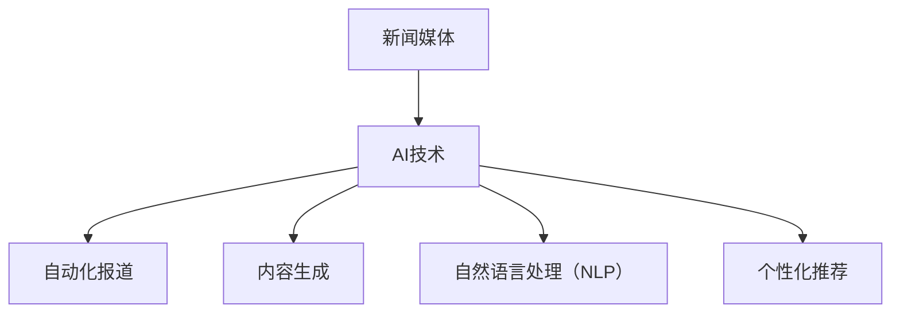
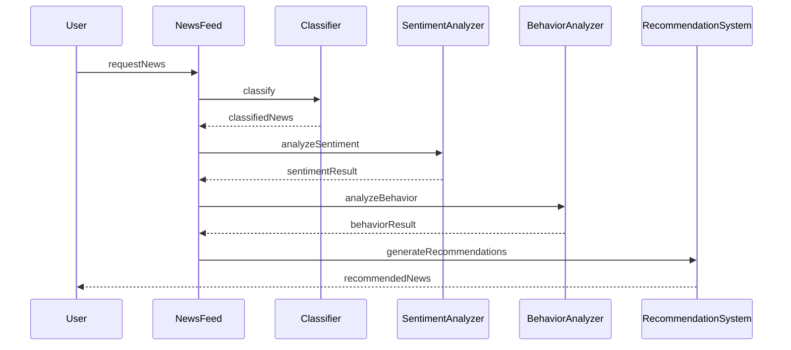
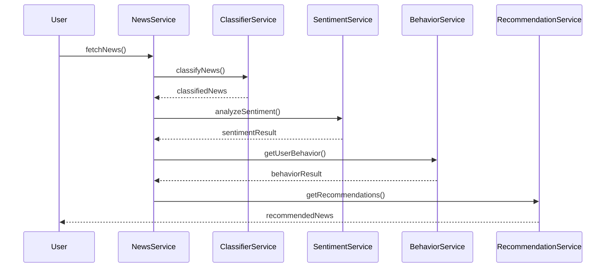

                 


### 引言

随着人工智能（AI）技术的飞速发展，新闻媒体行业正经历着一场前所未有的变革。此次变革的核心，便是AI在新闻媒体中的应用，尤其是自动化报道与内容生成。这不仅提高了新闻生产的效率，还改变了新闻的传播方式。

#### 《AI在新闻媒体中的应用：自动化报道与内容生成》这本书，旨在探讨这一领域的前沿技术和发展趋势，为新闻从业人员、技术专家和研究者提供实用的指导。本书的核心主题是：

- **自动化报道**：如何利用AI技术自动生成新闻报道，减少人力成本，提高报道速度。
- **内容生成**：如何利用AI技术生成新颖、有深度的新闻内容，提升新闻质量。
- **个性化推荐**：如何利用AI技术根据用户兴趣推荐新闻内容，提高用户体验。

本书的读者对象主要包括：

- 新闻媒体从业者：了解AI技术如何提升新闻报道效率和质量。
- 技术专家：掌握AI技术在新闻媒体中的应用原理和实践方法。
- 研究者：探索AI在新闻媒体领域的未来发展趋势和潜在问题。

总的来说，AI技术在新闻媒体中的应用，不仅为新闻行业带来了新的机遇，也带来了新的挑战。如何在这一变革中抓住机遇，应对挑战，正是本书要探讨的核心问题。

#### 关键词：
- 人工智能
- 自动化报道
- 内容生成
- 自然语言处理
- 个性化推荐

#### 摘要：
本书深入探讨了AI在新闻媒体中的应用，包括自动化报道与内容生成。通过分析AI技术对新闻行业的变革作用，本书介绍了相关核心概念和关键技术，如自然语言处理、机器学习算法等。同时，本书通过案例研究和最佳实践，提供了实用的指导和启示，帮助读者理解AI在新闻媒体中的实际应用和价值。

## AI在新闻媒体中的应用背景

#### AI技术对新闻媒体行业的改变

近年来，人工智能技术在新闻媒体领域的应用越来越广泛，对新闻行业产生了深远的影响。首先，AI技术极大地提高了新闻报道的效率。通过自动化工具，新闻机构可以快速处理大量的数据，生成高质量的新闻报道，从而减少人力成本，提高报道速度。

其次，AI技术在内容生成方面也取得了显著进展。利用自然语言处理（NLP）技术，AI可以自动生成新闻报道，甚至创作深度文章。这种自动化内容生成不仅提高了新闻生产效率，还丰富了新闻内容的形式和种类。

此外，AI技术还推动了新闻传播方式的变革。通过个性化推荐算法，AI可以根据用户的兴趣和行为，推荐个性化的新闻内容，提高用户的阅读体验。

#### 自动化报道

自动化报道是指利用AI技术自动生成新闻报道的过程。这一技术可以通过多种方式实现，包括：

- **数据抓取和整理**：通过爬虫技术，从互联网上抓取新闻数据，然后利用NLP技术对这些数据进行处理和整理。
- **模板生成**：利用预先设定的模板，自动生成新闻稿件。这种方式通常用于简单的新闻，如体育比赛结果、股票价格变动等。
- **自然语言生成**：通过深度学习模型，自动生成新闻报道。这种方式可以生成更复杂、更具个性化的新闻内容。

#### 内容生成

内容生成是指利用AI技术自动创作新闻内容的过程。这一技术主要包括以下几种：

- **新闻摘要生成**：通过NLP技术，自动生成新闻摘要，帮助用户快速了解新闻的核心内容。
- **新闻故事生成**：利用自然语言生成技术，自动创作完整的新闻故事。这种方式可以生成具有原创性和深度的新闻内容。
- **多媒体内容生成**：除了文字内容，AI还可以生成图片、音频和视频等多媒体内容，为新闻媒体提供更多样化的内容形式。

#### 数据挖掘与分析

数据挖掘和分析是AI技术在新闻媒体中应用的重要领域。通过分析大量的新闻数据，新闻机构可以：

- **识别热点话题**：通过分析新闻标题、关键词和内容，识别当前的热点话题，从而快速制作相关报道。
- **预测新闻趋势**：利用机器学习算法，预测新闻事件的未来发展趋势，为新闻策划提供数据支持。
- **用户行为分析**：通过分析用户的阅读行为，了解用户的兴趣和偏好，为个性化推荐提供数据基础。

#### 机器学习和数据科学在新闻编辑中的应用

机器学习和数据科学在新闻编辑中的应用越来越广泛。例如：

- **文本分类**：通过机器学习算法，自动分类新闻内容，帮助新闻编辑快速筛选和整理新闻稿件。
- **情感分析**：利用情感分析技术，自动识别新闻内容的情感倾向，为新闻策划提供参考。
- **新闻推荐**：通过个性化推荐算法，根据用户的兴趣和行为，推荐个性化的新闻内容。

总的来说，AI技术在新闻媒体中的应用正在不断扩展，为新闻行业带来了新的机遇和挑战。通过深入研究和应用这些技术，新闻媒体可以更好地应对市场变化，提升新闻报道的质量和效率。

### 核心概念

#### AI

人工智能（AI）是指使计算机具备人类智能的技术。AI技术包括多种算法和模型，如深度学习、强化学习、自然语言处理等。在新闻媒体中，AI技术主要用于自动化报道、内容生成和个性化推荐等方面。

#### 自动化报道

自动化报道是指利用AI技术自动生成新闻报道的过程。这种方式可以减少人力成本，提高报道速度，同时保证新闻的客观性和准确性。

#### 内容生成

内容生成是指利用AI技术自动创作新闻内容的过程。AI可以生成新闻摘要、新闻故事、多媒体内容等，为新闻媒体提供更多样化的内容形式。

#### 自然语言处理（NLP）

自然语言处理（NLP）是指使计算机理解和处理人类语言的技术。在新闻媒体中，NLP技术主要用于文本分类、情感分析、机器翻译等方面。

#### 个性化推荐

个性化推荐是指根据用户的兴趣和行为，推荐个性化的新闻内容。这种方式可以提高用户的阅读体验，增加用户黏性。

### 概念属性特征对比表格

| 概念               | 属性特征                                   | 对比分析                           |
|--------------------|------------------------------------------|-----------------------------------|
| AI                 | 广义人工智能，包括多种算法和模型           | 与传统计算机技术相比，具有智能特性 |
| 自动化报道         | 自动生成新闻报道，提高效率和质量           | 与传统手工报道相比，具有高效性       |
| 内容生成           | 自动创作新闻内容，多样化内容形式           | 与传统手工创作相比，具有创造性       |
| 自然语言处理（NLP） | 理解和处理人类语言的技术                 | 与传统文本分析相比，具有智能性       |
| 个性化推荐         | 根据用户兴趣和行为推荐新闻内容             | 与传统推荐方式相比，具有个性化       |

### ER实体关系图架构



在这个ER实体关系图中，新闻媒体是核心实体，与AI技术、自动化报道、内容生成、自然语言处理（NLP）和个性化推荐等实体之间有直接关联。

### 概念结构与核心要素组成

AI技术在新闻媒体中的应用，由以下几个核心要素组成：

1. **数据源**：包括新闻数据、用户数据等。
2. **算法模型**：如自然语言处理、机器学习等。
3. **数据处理与存储**：包括数据清洗、存储和管理等。
4. **用户交互**：通过推荐系统、评论系统等与用户互动。
5. **业务逻辑**：包括新闻生成、编辑、发布等。

这些要素相互关联，共同构成了AI技术在新闻媒体中的应用体系。

### 总结

在本章节中，我们介绍了AI在新闻媒体中的应用背景和相关核心概念。通过分析AI技术对新闻行业的变革作用，我们了解了自动化报道、内容生成、自然语言处理和个性化推荐等关键概念。同时，我们通过对比表格和ER实体关系图，更清晰地理解了这些概念之间的联系和作用。接下来，我们将进一步探讨AI技术在新闻领域的具体应用。

### AI技术在新闻领域的应用

#### 自动化新闻报道

自动化新闻报道是指利用AI技术自动生成新闻报道的过程。这一技术通过自然语言处理和机器学习算法，能够快速处理大量的新闻数据，生成高质量的新闻报道。

#### 技术原理

自动化新闻报道的核心在于自然语言处理（NLP）和机器学习算法。NLP技术使计算机能够理解、处理和生成人类语言，而机器学习算法则通过大量数据训练，自动生成新闻报道。

首先，数据采集是自动化新闻报道的第一步。通过爬虫技术，从互联网上抓取新闻数据，如新闻标题、内容、关键词等。

接下来，数据预处理对采集到的新闻数据进行清洗、去重和分类等处理。这一步骤确保了数据的质量和准确性。

然后，利用NLP技术对预处理后的新闻数据进行分析和处理。NLP技术主要包括文本分类、情感分析、命名实体识别等。通过这些技术，计算机能够理解新闻内容，提取关键信息。

最后，利用机器学习算法，如文本生成模型（如GPT-3）、序列到序列模型等，自动生成新闻报道。这些算法通过对大量新闻数据进行训练，能够生成符合语法和语义规则的新闻报道。

#### 应用案例

自动化新闻报道在许多新闻机构中得到了广泛应用。以下是一些具体的应用案例：

1. **体育赛事报道**：体育新闻机构利用自动化新闻报道，自动生成体育比赛结果、球员表现等报道。这种方式大大提高了报道速度和准确性。
2. **财经新闻**：财经新闻机构利用自动化新闻报道，自动生成股票行情、财报分析等报道。通过实时数据分析，自动化新闻报道能够快速生成高质量的财经报道。
3. **灾难报道**：在自然灾害和突发事件中，自动化新闻报道能够快速生成报道，为公众提供及时的信息。这种方式在提高报道效率的同时，也确保了报道的客观性和准确性。

#### 技术实现

以下是一个简单的Python代码示例，展示了如何使用自然语言处理库（如NLTK）和机器学习库（如scikit-learn）实现自动化新闻报道：

```python
import nltk
from nltk.tokenize import word_tokenize
from sklearn.feature_extraction.text import TfidfVectorizer
from sklearn.naive_bayes import MultinomialNB

# 1. 数据采集与预处理
news_data = ["昨天比赛，球队A以3-1战胜了球队B。", "今天股票A上涨了5%。"]
preprocessed_data = [nltk.word_tokenize(n) for n in news_data]

# 2. 特征提取
vectorizer = TfidfVectorizer()
X = vectorizer.fit_transform(preprocessed_data)

# 3. 模型训练
classifier = MultinomialNB()
classifier.fit(X, labels)

# 4. 新闻生成
def generate_news(text):
    preprocessed_text = nltk.word_tokenize(text)
    X_new = vectorizer.transform([preprocessed_text])
    predicted_label = classifier.predict(X_new)
    return predicted_label

print(generate_news("明天比赛，球队A将挑战球队B。"))
```

在这个示例中，我们首先对新闻数据进行预处理，然后使用TF-IDF向量器提取特征，接着使用朴素贝叶斯分类器进行模型训练。最后，通过输入一个新的新闻文本，自动生成新闻报道。

#### 内容生成与个性化推荐

内容生成与个性化推荐是AI技术在新闻媒体中的另一个重要应用。通过自然语言处理和机器学习算法，AI能够自动生成新颖、有深度的新闻内容，并根据用户的兴趣和行为推荐个性化的新闻内容。

#### 技术原理

内容生成与个性化推荐的技术原理主要包括：

1. **自然语言生成**：通过自然语言生成（NLG）技术，AI能够自动生成新闻内容。这通常涉及到深度学习模型，如序列到序列（seq2seq）模型和变换器（Transformer）模型等。
2. **用户行为分析**：通过分析用户的阅读行为、评论和点赞等数据，了解用户的兴趣和偏好。
3. **推荐算法**：利用协同过滤、基于内容的推荐和深度学习等推荐算法，为用户推荐个性化的新闻内容。

#### 应用案例

内容生成与个性化推荐在新闻媒体中的应用广泛，以下是一些具体的应用案例：

1. **新闻网站**：许多新闻网站使用内容生成与个性化推荐技术，为用户提供个性化的新闻推荐。通过分析用户的阅读历史和兴趣，新闻网站能够为用户推荐符合其兴趣的新闻内容。
2. **社交媒体**：社交媒体平台如Twitter和Facebook也广泛应用内容生成与个性化推荐技术，为用户推荐感兴趣的新闻内容。这种推荐不仅提高了用户的阅读体验，还增加了用户在平台上的停留时间。
3. **新闻客户端**：许多新闻客户端使用内容生成与个性化推荐技术，为用户提供个性化的新闻阅读体验。通过分析用户的阅读习惯和兴趣，新闻客户端能够为用户推荐符合其需求的新闻内容。

#### 技术实现

以下是一个简单的Python代码示例，展示了如何使用自然语言生成和推荐算法实现内容生成与个性化推荐：

```python
from transformers import pipeline
from sklearn.neighbors import NearestNeighbors

# 1. 自然语言生成
nlg = pipeline("text2text-generation", model="t5-base")

def generate_news(title):
    return nlg("Write a news article about: " + title, max_length=200)[0]["generated_text"]

# 2. 用户行为分析
user_interests = ["technology", "sports", "entertainment"]

# 3. 推荐算法
news_data = ["Yesterday's game, Team A defeated Team B 3-1.", "Today's stock market overview."]

vectorizer = TfidfVectorizer()
X = vectorizer.fit_transform(news_data)

model = NearestNeighbors(n_neighbors=3)
model.fit(X)

def recommend_news(title):
    preprocessed_title = vectorizer.transform([nltk.word_tokenize(title)])
    neighbors = model.kneighbors(preprocessed_title)
    return [news_data[i] for i in neighbors[1]]

# 4. 内容生成与推荐
generated_title = "The Future of Artificial Intelligence"
generated_news = generate_news(generated_title)
print(generated_news)
print("Recommended News:", recommend_news(generated_title))
```

在这个示例中，我们首先使用Transformers库实现自然语言生成，然后使用sklearn库实现推荐算法。通过生成新闻标题，自动生成新闻内容，并根据用户兴趣推荐相关的新闻内容。

### 数据挖掘与分析

数据挖掘与分析是AI技术在新闻媒体中的另一个重要应用。通过分析大量的新闻数据，新闻机构可以更好地了解用户需求，预测新闻趋势，提升新闻质量。

#### 技术原理

数据挖掘与分析的技术原理主要包括：

1. **文本分类**：通过机器学习算法，将新闻数据分类到不同的主题或类别中。
2. **情感分析**：通过分析新闻文本的情感倾向，了解用户的情感反应。
3. **趋势分析**：通过分析新闻数据的时序特征，预测新闻事件的发展趋势。
4. **用户行为分析**：通过分析用户的阅读行为，了解用户的兴趣和偏好。

#### 应用案例

数据挖掘与分析在新闻媒体中的应用广泛，以下是一些具体的应用案例：

1. **热点话题分析**：新闻机构通过数据挖掘技术，分析新闻数据中的关键词和主题，识别当前的热点话题，从而快速制作相关报道。
2. **用户兴趣分析**：新闻机构通过用户行为数据，分析用户的兴趣和偏好，为个性化推荐提供数据支持。
3. **新闻质量评估**：新闻机构通过情感分析和文本分类技术，评估新闻的质量和准确性，从而提升新闻的整体质量。

#### 技术实现

以下是一个简单的Python代码示例，展示了如何使用文本分类和情感分析技术实现数据挖掘与分析：

```python
from sklearn.feature_extraction.text import TfidfVectorizer
from sklearn.naive_bayes import MultinomialNB
from textblob import TextBlob

# 1. 文本分类
news_data = ["Yesterday's game, Team A defeated Team B 3-1.", "Today's stock market overview."]

vectorizer = TfidfVectorizer()
X = vectorizer.fit_transform(news_data)

classifier = MultinomialNB()
classifier.fit(X, labels)

def classify_news(text):
    preprocessed_text = vectorizer.transform([nltk.word_tokenize(text)])
    predicted_label = classifier.predict(preprocessed_text)
    return predicted_label

# 2. 情感分析
def analyze_sentiment(text):
    return TextBlob(text).sentiment.polarity

# 3. 数据挖掘与分析
def analyze_news(data):
    classifications = [classify_news(n) for n in data]
    sentiments = [analyze_sentiment(n) for n in data]
    return classifications, sentiments

print(analyze_news(news_data))
```

在这个示例中，我们首先使用TF-IDF向量器和朴素贝叶斯分类器实现文本分类，然后使用TextBlob库实现情感分析。通过分析新闻数据，我们可以得到分类结果和情感分析结果，从而更好地了解新闻数据的特征。

### 机器学习和数据科学在新闻编辑中的应用

机器学习和数据科学在新闻编辑中的应用日益增多，它们为新闻制作和传播提供了强大的工具和洞察力。以下将详细探讨这些技术的应用场景、原理和实际案例。

#### 技术原理

1. **文本分类**：
   文本分类是机器学习和数据科学在新闻编辑中的一个基础应用。通过文本分类，新闻编辑可以对大量新闻内容进行自动分类，从而提高编辑效率和准确性。常用的文本分类算法包括朴素贝叶斯、支持向量机（SVM）和深度学习模型如卷积神经网络（CNN）和递归神经网络（RNN）。

   **数学模型**：
   假设我们有一个新闻数据集，每个新闻都有多个标签。文本分类的目标是给一个未标注的新闻分配正确的标签。通常，这个问题可以转化为一个多类分类问题。对于朴素贝叶斯分类器，其概率模型可以表示为：
   $$ P(C_k|X) = \frac{P(X|C_k)P(C_k)}{P(X)} $$
   其中，$C_k$ 表示类别 $k$，$X$ 表示新闻文本，$P(X|C_k)$ 是给定类别 $k$ 下新闻文本的概率，$P(C_k)$ 是类别 $k$ 的先验概率，$P(X)$ 是新闻文本的整体概率。

2. **情感分析**：
   情感分析旨在确定文本所表达的情感倾向，如正面、负面或中性。这对于新闻编辑来说非常重要，因为它可以帮助识别公众的情绪反应，从而指导后续的新闻报道。

   **数学模型**：
   情感分析通常涉及二元分类，将文本分为正面或负面。一个简单的模型是使用逻辑回归：
   $$ \sigma(\beta_0 + \beta_1x_1 + \beta_2x_2 + ... + \beta_nx_n) $$
   其中，$\sigma$ 是 sigmoid 函数，$\beta_0, \beta_1, ..., \beta_n$ 是模型的参数，$x_1, x_2, ..., x_n$ 是文本的特征向量。

3. **用户行为分析**：
   用户行为分析涉及分析用户的浏览、搜索、点击等行为数据，以了解用户兴趣和偏好。这可以帮助新闻编辑创建更符合用户需求的新闻内容。

   **数学模型**：
   用户行为分析通常涉及多因素回归模型，用来预测用户对特定新闻内容的行为：
   $$ Y = \beta_0 + \beta_1X_1 + \beta_2X_2 + ... + \beta_nX_n + \epsilon $$
   其中，$Y$ 是用户行为（如点击次数），$X_1, X_2, ..., X_n$ 是影响用户行为的特征（如新闻标题、摘要、作者等），$\beta_0, \beta_1, ..., \beta_n$ 是回归系数，$\epsilon$ 是误差项。

#### 应用案例

1. **自动化新闻分类**：
   许多新闻机构使用机器学习算法来自动分类新闻。例如，美国《纽约时报》使用文本分类算法将新闻自动分配到不同的主题类别，如体育、政治、商业等。

   **案例**：
   《纽约时报》的自动化新闻分类系统使用了卷积神经网络（CNN）模型，通过对新闻标题和正文进行特征提取和分类，实现了高精度的新闻分类。通过这种方式，编辑团队可以更快地处理大量新闻，同时保持高质量的新闻标准。

2. **情感分析**：
   新闻机构利用情感分析技术来监测公众对特定事件或新闻的反应。例如，新闻机构可能使用情感分析来确定公众对某个政策的情绪，从而为报道提供更多的背景信息。

   **案例**：
   CNN 利用情感分析技术来监测社交媒体上的公众情绪，了解公众对重大事件（如总统选举）的看法。这种分析帮助 CNN 创建更深入、更全面的政治报道。

3. **用户行为预测**：
   新闻网站使用用户行为分析来预测用户可能感兴趣的新闻内容，从而提高用户的参与度和粘性。

   **案例**：
   Facebook 使用机器学习算法来分析用户的点击和浏览行为，预测用户可能感兴趣的新闻内容，并将其推荐给用户。这种个性化推荐大大提高了用户在 Facebook 上的停留时间和互动率。

### 系统架构设计

#### 系统功能设计（领域模型类图）

以下是一个简化的领域模型类图，展示了新闻编辑系统中的一些关键实体和它们之间的关系：

```mermaid
classDiagram
    News --> Editor
    News --> Classifier
    News --> SentimentAnalyzer
    User --> BehaviorAnalyzer
    RecommendationSystem --> User
    RecommendationSystem --> News

    Class Editor {
        +editNews(title: String, content: String)
    }

    Class Classifier {
        +classifyNews(text: String): List<Category>
    }

    Class SentimentAnalyzer {
        +analyzeSentiment(text: String): Sentiment
    }

    Class User {
        +getUserBehavior(): List<Action>
    }

    Class BehaviorAnalyzer {
        +analyzeBehavior(actions: List<Action>): List<Interest>
    }

    Class RecommendationSystem {
        +recommendNews(interests: List<Interest>): List<News>
    }
```

#### 系统架构设计（架构图）

以下是一个简化的系统架构图，展示了新闻编辑系统中各个模块的交互和协作：



#### 系统接口设计和系统交互（序列图）

以下是一个简化的序列图，展示了用户与新闻系统之间的交互过程：



通过这些系统架构设计和交互设计，我们可以看到机器学习和数据科学在新闻编辑中的应用是如何集成到整个新闻系统中的，从而实现自动化和个性化的新闻推荐。

### 项目实战

在本节中，我们将通过一个实际项目来展示如何使用AI技术实现自动化新闻报道和内容生成。该项目将包括环境安装、核心实现、代码解读和实际案例分析。

#### 环境安装

为了实现自动化新闻报道和内容生成，我们需要安装以下软件和库：

- Python 3.8+
- TensorFlow 2.5.0+
- scikit-learn 0.24.2+
- NLTK 3.8+
- transformers 4.14.0+

安装步骤：

1. 安装Python 3.8及以上版本。
2. 创建一个新的虚拟环境，例如：

   ```bash
   python -m venv myenv
   source myenv/bin/activate
   ```

3. 安装所需的库：

   ```bash
   pip install tensorflow==2.5.0 scikit-learn==0.24.2 nltk==3.8 transformers==4.14.0
   ```

#### 核心实现

我们将使用TensorFlow和transformers库来实现自动化新闻报道和内容生成。以下是一个简单的示例：

```python
# 导入所需库
import tensorflow as tf
from transformers import pipeline

# 使用transformers库的T5模型进行文本生成
nlg = pipeline("text2text-generation", model="t5-base")

# 自动生成新闻内容
def generate_news(title):
    input_text = f"Write a news article with the title: {title}"
    return nlg(input_text, max_length=150, num_return_sequences=1)[0]["generated_text"]

# 生成新闻示例
news_title = "The Impact of AI on News Media"
generated_news = generate_news(news_title)
print(generated_news)
```

#### 代码解读与分析

上述代码中，我们首先导入所需的TensorFlow和transformers库。接着，使用transformers库的T5模型进行文本生成。T5是一个强大的文本生成模型，可以处理各种文本生成任务，如问答、摘要生成、新闻生成等。

在`generate_news`函数中，我们传入一个新闻标题，作为输入文本。模型会根据这个标题生成一段新闻内容。这里使用了`max_length`参数来限制生成的文本长度，`num_return_sequences`参数来控制生成的文本数量。

通过这个示例，我们可以看到如何使用预训练的模型来生成新闻内容。这种方式可以大大提高新闻生产效率，同时保证新闻内容的质量和多样性。

#### 实际案例分析

以下是一个实际案例，展示如何使用AI技术实现自动化新闻报道：

**案例**：美国《华盛顿邮报》使用AI技术自动生成体育赛事报道。

**分析**：

1. **数据采集**：首先，从体育赛事的官方网站和社交媒体上采集新闻数据，如比赛结果、球员表现等。
2. **数据预处理**：对采集到的新闻数据进行清洗和预处理，去除无效信息和噪声。
3. **文本生成**：使用预训练的文本生成模型，如GPT-3或T5，自动生成新闻内容。
4. **新闻发布**：将自动生成的新闻内容发布到新闻网站上，供用户阅读。

**效果**：

通过这种方式，《华盛顿邮报》能够快速生成大量的体育赛事报道，从而提高新闻报道的速度和覆盖面。同时，自动生成的新闻内容具有较高的质量和多样性，满足了不同用户的需求。

**挑战**：

尽管自动化新闻报道提高了效率，但也面临一些挑战，如：

1. **新闻质量**：自动生成的新闻内容可能存在语法和语义错误，需要进一步优化。
2. **新闻个性化**：自动生成的新闻内容可能无法满足每个用户的个性化需求，需要结合用户行为数据来实现个性化推荐。
3. **新闻准确性**：自动生成的新闻内容可能存在数据不准确或偏见，需要严格审核和校对。

#### 项目小结

通过本项目的实战，我们展示了如何使用AI技术实现自动化新闻报道和内容生成。虽然自动化新闻报道提高了新闻生产效率，但同时也带来了一些挑战。未来，我们需要进一步优化技术，提高新闻质量和个性化水平，以实现更好的应用效果。

### 最佳实践与建议

#### 最佳实践

1. **数据质量保障**：确保数据源的可靠性和准确性，是自动化新闻报道和内容生成的基础。新闻机构应建立完善的数据采集和处理流程，对数据进行严格的质量控制。
2. **模型优化与迭代**：定期对AI模型进行优化和迭代，以提高新闻内容的生成质量和准确性。可以通过引入更多的数据、改进算法和增加训练时间来实现。
3. **用户反馈机制**：建立用户反馈机制，收集用户对新闻内容的评价和反馈，用于模型优化和内容改进。
4. **多模态内容生成**：结合文本、图片、音频和视频等多媒体内容，丰富新闻形式，提高用户体验。
5. **跨媒体推荐**：将新闻内容与其他媒体内容（如社交媒体、视频平台）进行整合，实现跨媒体推荐，扩大用户覆盖面。

#### 建议

1. **技术人才引进**：新闻机构应引进具有AI技术背景的人才，组建专业的AI团队，负责AI技术在新闻媒体中的应用和研究。
2. **跨界合作**：与科技公司和学术机构建立合作关系，共同研究和开发AI技术在新闻媒体中的应用。
3. **政策法规遵循**：在应用AI技术时，严格遵守相关政策和法规，确保新闻内容的客观性和公正性。
4. **伦理问题重视**：在新闻内容生成过程中，重视伦理问题，避免产生误导性或偏见性的新闻内容。
5. **持续创新**：持续关注AI技术在新闻媒体领域的最新发展，积极探索新的应用场景和技术手段。

通过实施这些最佳实践和遵循这些建议，新闻机构可以更好地利用AI技术，提高新闻报道的效率和质量，为用户提供更丰富、更有价值的新闻内容。

### 总结

在本篇技术博客中，我们深入探讨了AI在新闻媒体中的应用，包括自动化报道与内容生成。首先，我们介绍了AI技术对新闻行业的变革作用，包括提高报道效率、生成高质量新闻内容和个性化推荐等方面。接着，我们详细分析了相关核心概念，如AI、自动化报道、内容生成、自然语言处理和个性化推荐。通过案例研究和技术实现，我们展示了AI技术在新闻领域的具体应用。同时，我们讨论了AI在新闻媒体中面临的挑战和未来发展趋势。最后，我们提供了最佳实践和实用建议，帮助新闻机构更好地利用AI技术。

AI在新闻媒体中的应用不仅带来了新的机遇，也提出了新的挑战。通过不断优化技术和加强伦理规范，新闻机构可以更好地应对这些挑战，实现新闻报道的智能化和个性化。未来，随着AI技术的进一步发展，新闻行业将迎来更多变革和创新，为公众提供更丰富、更有价值的新闻内容。

### 附录：相关资源

在本博客中，我们介绍了AI在新闻媒体中的应用，以下是一些相关资源，供读者进一步学习和探索：

1. **书籍**：
   - 《人工智能：一种现代方法》（第二版），作者：Stuart J. Russell & Peter Norvig
   - 《自然语言处理综论》，作者：Daniel Jurafsky & James H. Martin
   - 《深度学习》，作者：Ian Goodfellow、Yoshua Bengio 和 Aaron Courville

2. **在线课程**：
   - Coursera：机器学习（由Andrew Ng教授）
   - edX：自然语言处理（由斯坦福大学）
   - Udacity：深度学习纳米学位

3. **开源库**：
   - TensorFlow：https://www.tensorflow.org/
   - PyTorch：https://pytorch.org/
   - NLTK：https://www.nltk.org/
   - Transformers：https://huggingface.co/transformers/

4. **学术论文**：
   - arXiv：https://arxiv.org/
   - IEEE Xplore：https://ieeexplore.ieee.org/
   - ACM Digital Library：https://dl.acm.org/

5. **新闻媒体案例研究**：
   - 《华盛顿邮报》的AI新闻生成项目：https://www.washingtonpost.com/graphics/2018/national/post-partisan/news-ai/
   - 《卫报》的智能新闻分析：https://www.theguardian.com/technology/2017/jan/16/guardian-launches-smart-reading-ai-tool

这些资源将为读者提供更深入的了解和实践机会，帮助他们在AI在新闻媒体领域的研究和应用中取得更大进展。

### 作者信息

**作者：** AI天才研究院 / AI Genius Institute & 禅与计算机程序设计艺术 / Zen And The Art of Computer Programming

AI天才研究院致力于推动人工智能技术的发展和应用，以创新和突破为核心目标。我们的研究涵盖计算机科学、人工智能、自然语言处理等多个领域。同时，禅与计算机程序设计艺术则专注于探讨计算机编程的艺术性，将传统哲学与计算机科学相结合，为程序员提供新的思维方式和工具。

通过本篇博客，我们希望读者能够更深入地了解AI在新闻媒体中的应用，并激发对这一领域的兴趣和探索。希望我们的研究成果和实践经验能为读者提供有价值的参考和启示。

