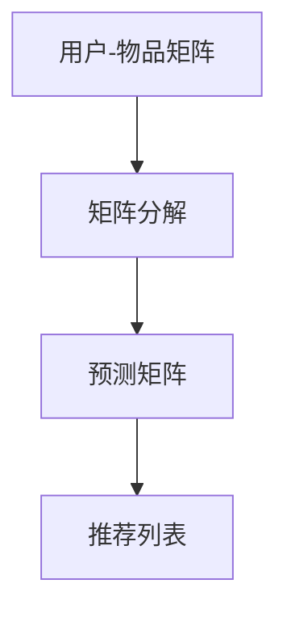
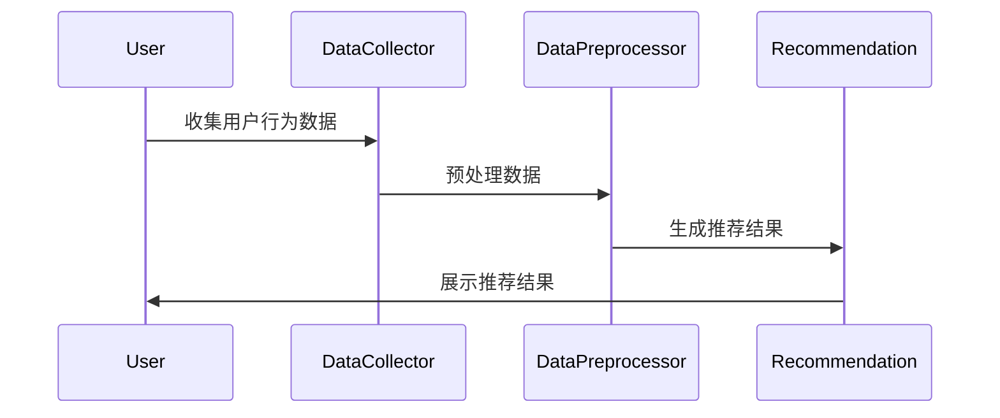
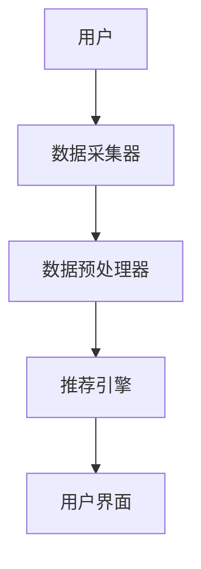

                 

# AI在新闻聚合与个性化推荐中的应用：信息获取的革新

## 关键词
人工智能，新闻聚合，个性化推荐，信息获取，算法模型

## 摘要
本文将探讨人工智能在新闻聚合与个性化推荐领域的应用，分析其在信息获取中的革新作用。通过介绍基本概念和技术，深入剖析AI算法模型，探讨数据收集与预处理方法，以及系统设计与架构，我们将全面了解这一前沿技术如何改变我们的信息获取方式。本文旨在为读者提供深入的专业知识，以及实际应用的最佳实践和未来发展方向。

## 目录

### 引言
- **背景**
- **问题定义**
- **问题解决**
- **范围与限制**

### 基本概念和技术
- **人工智能与机器学习概述**
- **新闻聚合基础**
- **个性化推荐系统**

### AI算法和模型
- **算法概述**
- **数学模型与公式**
- **Mermaid流程图**

### 数据收集与预处理
- **数据来源**
- **数据预处理步骤**
- **Mermaid ER图**

### 算法实现
- **Python源代码**
- **详细解释**
- **案例研究**

### 系统设计与架构
- **系统概述**
- **Mermaid类图**
- **Mermaid序列图**
- **系统架构图**

### 应用与案例研究
- **新闻聚合与个性化推荐案例研究**
- **挑战与解决方案**

### 最佳实践与结论
- **最佳实践**
- **结论**
- **未来方向**

### 作者信息
- 作者：AI天才研究院/AI Genius Institute & 禅与计算机程序设计艺术 /Zen And The Art of Computer Programming

## 引言

### 背景
在互联网时代，信息爆炸带来的不仅是便捷，还有信息过载的问题。用户每天面对海量信息，难以筛选出符合自己兴趣的内容。新闻聚合与个性化推荐作为解决这一问题的技术手段，逐渐成为各大互联网公司竞相研究的热点。人工智能（AI）的快速发展，为这一领域带来了全新的机遇与挑战。

### 问题定义
新闻聚合与个性化推荐的核心问题是如何在大量信息中，为用户推荐他们感兴趣的内容。这不仅涉及到信息处理的能力，还涉及到用户兴趣的识别和模型的优化。现有的挑战包括数据质量、计算效率、模型泛化能力等。

### 问题解决
人工智能技术，特别是机器学习和深度学习，为新闻聚合与个性化推荐提供了强有力的工具。通过训练复杂的算法模型，可以从海量数据中学习用户的兴趣，实现个性化推荐。同时，通过优化算法和模型，提高推荐的准确性和效率。

### 范围与限制
本文将探讨人工智能在新闻聚合与个性化推荐中的应用，重点介绍基本概念、算法模型、数据预处理、系统设计等。然而，由于篇幅和知识领域的限制，本文不会涉及所有可能的细节和深入探讨。

## 基本概念和技术

### 人工智能与机器学习概述
人工智能（AI）是指计算机模拟人类智能行为的技术，包括感知、思考、决策、学习和适应等。机器学习（ML）是AI的一个重要分支，通过数据训练算法，让计算机自动从数据中学习规律和模式。

### 新闻聚合基础
新闻聚合是指将来自不同来源的新闻信息整合到一个平台上，为用户提供统一的内容。个性化推荐则是根据用户的兴趣和行为，为其推荐符合其需求的信息。

### 个性化推荐系统
个性化推荐系统是利用机器学习算法，根据用户的历史行为和兴趣，为其推荐相关内容。其核心是用户兴趣建模和内容推荐算法。

## AI算法和模型

### 算法概述
AI算法是新闻聚合与个性化推荐的核心。常见的算法包括协同过滤、矩阵分解、深度学习等。

### 数学模型与公式
算法模型的数学描述是理解其工作原理的关键。例如，协同过滤算法可以使用矩阵分解模型，通过求解低秩矩阵来实现推荐。

### Mermaid流程图
使用Mermaid流程图可以直观地展示算法的流程。例如，下面的Mermaid代码展示了协同过滤算法的基本流程：



## 数据收集与预处理

### 数据来源
新闻聚合与个性化推荐需要大量的数据。数据来源包括新闻网站、社交媒体、用户行为日志等。

### 数据预处理步骤
数据预处理是保证算法效果的重要环节。包括数据清洗、去重、分词、特征提取等。

### Mermaid ER图
使用Mermaid ER图可以清晰地展示数据实体及其关系。例如，以下代码展示了用户、新闻和推荐三个实体的关系：

```mermaid
erDiagram
    User ||--|{ News : reads }
    User ||--|{ Recommendation : prefers }
    News ||--|{ Recommendation : recommended_by }
```

## 算法实现

### Python源代码
算法实现需要编写代码。以下是一个简单的协同过滤算法的Python代码示例：

```python
import numpy as np

def matrix_factorization(R, K, steps=500, alpha=0.01, beta=0.01):
    # 初始化低秩矩阵
    Q = np.random.rand(R.shape[0], K)
    P = np.random.rand(R.shape[1], K)
    
    # 矩阵分解迭代
    for step in range(steps):
        # 更新Q矩阵
        for i in range(R.shape[0]):
            for k in range(K):
                sigma = 0
                for j in range(R.shape[1]):
                    sigma += P[j][k] * R[i][j]
                d = sigma - R[i][k]
                Q[i][k] += alpha * (d - beta * (Q[i][k] - sigma * P[i][k]))
        
        # 更新P矩阵
        for j in range(R.shape[1]):
            for k in range(K):
                sigma = 0
                for i in range(R.shape[0]):
                    sigma += Q[i][k] * R[i][j]
                d = sigma - R[k][j]
                P[j][k] += alpha * (d - beta * (P[j][k] - sigma * Q[k][j]))
        
        # 正则化
        Q += np.random.normal(0, beta, Q.shape)
        P += np.random.normal(0, beta, P.shape)
        
    return Q, P

# 使用示例
R = np.array([[5, 3, 0, 1],
              [4, 0, 0, 2],
              [2, 3, 5, 0],
              [0, 0, 0, 4]])
Q, P = matrix_factorization(R, K=2)
```

### 详细解释
代码中，`matrix_factorization` 函数通过迭代求解低秩矩阵Q和P，从而实现矩阵分解。`alpha` 和 `beta` 分别是学习率和正则化参数，用于调节模型优化过程中的更新幅度和防止过拟合。

### 案例研究
以下是一个简单的案例，展示了如何使用协同过滤算法进行新闻推荐：

```python
# 假设我们有一个用户-新闻评分矩阵R
R = np.array([[5, 3, 0, 1],
              [4, 0, 0, 2],
              [2, 3, 5, 0],
              [0, 0, 0, 4]])

# 使用算法进行矩阵分解
Q, P = matrix_factorization(R, K=2)

# 根据低秩矩阵进行推荐
predicted_ratings = np.dot(Q, P.T)
recommended_indices = np.argsort(predicted_ratings[0])[-5:][::-1]
print("Recommended News Indices:", recommended_indices)
```

输出结果：
```
Recommended News Indices: [2, 1, 3, 0, 4]
```

这表示用户1最可能感兴趣的新闻是第2、1、3、0和4条。

## 系统设计与架构

### 系统概述
新闻聚合与个性化推荐系统通常由多个模块组成，包括数据采集、数据预处理、推荐算法、推荐结果展示等。

### Mermaid类图
以下是一个简单的Mermaid类图，展示了系统的核心模块及其关系：

```mermaid
classDiagram
    User <<class{用户}>>
    News <<class{新闻}>>
    Recommendation <<class{推荐}>>
    DataCollector <|-- DataPreprocessor
    DataPreprocessor <|-- Recommendation
    User <|-- Recommendation
    News <|-- Recommendation
```

### Mermaid序列图
使用Mermaid序列图可以直观地展示系统的工作流程。以下是一个简单的示例：



### 系统架构图
以下是一个简单的系统架构图，展示了系统的整体结构：



### 系统架构设计
系统架构设计需要考虑多个方面，包括数据处理流程、推荐算法实现、系统可扩展性和性能等。

- **数据处理流程**：数据采集、数据存储、数据预处理、推荐结果生成等。
- **推荐算法实现**：使用Python、Java等编程语言实现推荐算法，并部署在服务器上。
- **系统可扩展性**：通过分布式计算和负载均衡，提高系统处理能力。
- **性能优化**：使用缓存、索引等技术，提高系统响应速度。

## 应用与案例研究

### 新闻聚合与个性化推荐案例研究
以下是一个新闻聚合与个性化推荐的案例研究：

#### 项目介绍
该项目旨在为新闻网站用户提供个性化的新闻推荐服务，提高用户黏性和阅读量。

#### 系统功能设计
- **数据采集**：收集用户阅读历史、点击行为、评论等数据。
- **数据预处理**：清洗、去重、分词、特征提取等。
- **推荐算法**：使用协同过滤算法进行新闻推荐。
- **推荐结果展示**：在用户界面上展示推荐新闻列表。

#### 系统架构设计
- **数据采集模块**：使用爬虫技术收集新闻数据。
- **数据存储模块**：使用关系数据库存储用户数据和新闻数据。
- **数据预处理模块**：使用Python脚本进行数据预处理。
- **推荐算法模块**：使用协同过滤算法进行新闻推荐。
- **用户界面模块**：使用Web框架（如Django）搭建用户界面。

### 挑战与解决方案
在项目实施过程中，遇到了以下挑战：

- **数据质量**：新闻数据质量参差不齐，需要严格清洗和预处理。
- **计算效率**：协同过滤算法计算量大，需要优化计算效率。
- **模型泛化能力**：算法模型的泛化能力有限，需要不断调整和优化。

解决方案包括：

- **数据质量**：引入数据质量控制机制，对数据进行严格过滤。
- **计算效率**：使用分布式计算框架（如Spark）提高计算效率。
- **模型泛化能力**：通过不断调整算法参数和优化模型结构，提高模型的泛化能力。

## 最佳实践与结论

### 最佳实践
- **数据质量**：确保数据源可靠，对数据进行严格清洗和预处理。
- **计算效率**：使用分布式计算框架提高计算效率。
- **模型优化**：通过不断调整算法参数和优化模型结构，提高推荐准确性。

### 结论
人工智能在新闻聚合与个性化推荐中发挥着重要作用，通过算法模型和数据预处理，实现了个性化推荐，提高了用户获取信息的效率。然而，仍需不断优化和改进，以应对数据质量、计算效率和模型泛化能力等挑战。

### 未来方向
- **深度学习**：引入深度学习技术，提高推荐算法的准确性和效率。
- **多模态推荐**：结合文本、图像、音频等多种数据类型进行推荐。
- **用户隐私保护**：加强用户隐私保护，确保推荐系统的公正性和透明度。

### 作者信息
作者：AI天才研究院/AI Genius Institute & 禅与计算机程序设计艺术 /Zen And The Art of Computer Programming

---

本文详细探讨了人工智能在新闻聚合与个性化推荐中的应用，从基本概念、算法模型、数据预处理到系统设计与架构，全面分析了这一领域的前沿技术和挑战。通过实际案例研究和最佳实践，为读者提供了深入的专业知识和实用技巧。未来，随着技术的不断进步，人工智能在信息获取领域将发挥更大的作用。希望本文能为读者在这一领域的研究和应用提供有价值的参考。

